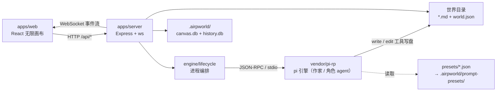

# AGENTS.md — AIRP

> 在这个仓库里干活的人与 agent 的入口手册。
> **本文与 `docs/` 都是设计真相源：架构一变，本文同步改。**
> 设计文档 2026-09-11 从 `infini-canvas` 项目迁入本仓库；`infini-canvas` 已退休，只留前端原型（见 §4）。

---

## 1. 这是什么

**AIRP（AI Role-Playing Narrative Canvas）** —— 一款 AI 互动叙事游戏。玩家在一张"活的无限画布"里以角色身份活动，作家（LLM）用 `type: chalk` 的叙事旁白统摄全场，多模态演出（视差 / 声场 / 立绘）与实体道具交互（以物解谜 / 掷骰）承担玩法主力。

一句话架构：**画布是全空间，黑板是缓冲，消息是指路牌，叙事是世界的灵魂。**

| 层 | 技术 |
|---|---|
| 前端 | React 19 + Vite + Tailwind（`apps/web`） |
| 后端 | Node + Express + ws（`apps/server`），端口 3001 |
| 共享协议 | Zod schema + 文件/ SQLite store（`packages/shared`） |
| 叙事引擎 | **pi-rp** —— `vendor/pi-rp` git submodule，独立仓库 |
| 包管理 | pnpm workspace |

### 1.1 语言规范（硬要求）

**产品一律英文，沟通与文档一律中文。**

| 范围 | 语言 | 理由 |
|---|---|---|
| 前端 UI 文案、演示内容、世界素材 | **英文** | 玩家与评委看到的一切 |
| `presets/**` 提示词、`templates/**` 世界内容 | **英文** | 喂给 AI 的 prompt 与世界内容，**连目录名与文件名一起** |
| 立绘 / 资源 / 图标等资产的文件名与说明 | **英文** | 资产清单 |
| 代码注释、报错文案、日志 | **英文** | 仓库是公开的黑客松产物，评审会直接读代码 |
| commit message、与队友/用户沟通 | **中文** | 开发者都是中国人 |
| `docs/**`、本文件、根 `README.md` | **中文** | 内部设计文档 |

黑客松官方语言是 **英文 / 日语**。判断标准：**任何可能被评委或海外玩家看到的东西 → 英文**。日语只用于日式世界的专有名词，且用罗马字（`nanami`、`sakura-academy`）。

命名一律 ASCII 小写 kebab-case（`baker-street`、`arcane-library`）；专有名词用标准英文或罗马字（`watson`、`baker-street`）。改世界内容时**目录名即 id**——`world.json` 的 `layers` key、`characters[].home`、preset 的 `options.baseDir`、`.airpworld/openings/<id>.json` 的文件名都要跟着改。

---

## 2. 目录

```text
apps/
  server/src/
    index.ts            # Express + WS 入口（/api、静态托管 apps/web/dist、端口 3001）
    routes/world.ts     # /api/worlds/load, /move, /dice, /use-item, /freeze, /god-action
    engine/
      rpc-client.ts     # 与 pi-rp CLI 的 JSON-RPC over stdio
      lifecycle.ts      # Agent 生命周期编排（spawn / --preset / 环境变量 / cwd）
      event-bridge.ts   # 引擎事件 → WebSocket 广播
      brief-builder.ts  # buildSceneInitBrief / buildNookInitBrief（动态 brief）
      presets.ts        # preset 安装到 <worldRoot>/.airpworld/prompt-presets/；skillArgs 拼 --skill
  web/src/
    lib/                   # camera（插值相机）/ collide（软碰撞）/ seat（排座镜像）
    state/                 # useCamera（相机与层级记忆）/ useWorld（层数据 + WS + 落库）
    components/canvas/     # 无限画布（相机 / 卡片渲染 / 关系线）
    components/narrative/  # chalk 叙事卡、骰子
    components/overlay/    # 角色特写遮罩
    components/sidebar/    # 右侧边栏（背包 + 角色）
    components/god/        # 上帝模式工具栏
packages/shared/src/    # world / frontmatter / components / events schema + store + sqlite
presets/                # 提示词预设：writer, character, scene-init, nook-init
extensions/             # 项目级 pi-rp 扩展：注册专用指令槽（writer-char, system-char, scene-init-instruction 等）
skills/                 # 项目级 skills：跨世界通用手艺（生图 / 组件叙事 / 节奏 / 玩法咬合）
templates/              # 开箱世界模板：holmes-world, school-romance, magic-academy, cthulhu
  <world>/skills/       # 世界级 skills：该世界自己的文风与剧情，与 world/ 同级、随包分发
worlds/                 # 脚手架产出的玩家世界（.gitignore）
tools/scaffold.mjs      # 模板 → 新世界
tools/probe-writer.mjs  # 全链路探针（pnpm probe）
docs/                   # 设计文档（真相源）
vendor/pi-rp/           # 叙事引擎 submodule
```

---

## 3. 架构



### 3.1 单轮管线（作家）

Hook 注入场景上下文 → chalk 落正文 → edit 回写 frontmatter → write/edit 演化场景物件 → 轻量收敛。
**chat history 不进画布，只有 chalk 落板。**

### 3.2 文件即真相

世界目录本身就是真相源，**没有独立状态文件**。状态收编在叙事 frontmatter 里（`status.data` / `choice` / `roll_dice`）。
分层存储：**内容走文件系统，架构状态与历史走 SQLite**（`canvas.db` / `history.db`）。

### 3.3 preset 即 Agent 人格

初始化只有一个可委托 profile（`scene-init`），作家委托（R1）与引擎直唤（R2）共用它，靠**动态 brief** 区分任务。详见 `docs/doc-11`。

---

## 4. 文档导航

主入口 **[`docs/00-文档骨架.md`](docs/00-文档骨架.md)**（全量清单 + 阅读建议）。最常看的几份：

| 文档 | 什么时候看 |
|---|---|
| `docs/doc-05-AIRP产品构想.md` | **产品设计起点**——要理解任何设计的动机，先看它 |
| `docs/doc-06-演出与交互设计.md` | 动交互 / 演出层 |
| `docs/doc-07-AIRP黑客松作战计划.md` | 排期、可提前准备清单、风险登记册 |
| `docs/doc-11-场景与小天地初始化协议.md` | 初始化协议（**已定案**，含 preset 骨架与 pi-rp 源码级约束） |
| `docs/doc-04-视觉设计风格.md` | 前端视觉基准（**§10 为准**） |
| `docs/doc-19-多模态与游戏性交互升级.md` | 视听动升级定案（评委导向） |
| `docs/前端改造计划.md` | `apps/web/` 的施工单 |
| `docs/doc-08~18` | 各专题（多为待完善），实现对应模块前再读 |

**前端原型不进本仓库**：`画布世界v1-yoshi.html`、`画布世界v2-niko.html`、`角色-yoshi.html`、`角色-世界v3.html/`、`assets/` 都在 `infini-canvas` 项目里——把它 clone 到本项目的兄弟目录即可对照。文档里出现的原型文件名一律指那里。

---

## 5. 常用命令

```bash
pnpm install                                    # 装依赖（含 submodule）
pnpm build                                      # 编译全仓库
pnpm probe                                      # 全链路探针，PASSED 才算地基没坏
pnpm dev                                        # 全栈开发（web 5173 / server 3001）

node tools/scaffold.mjs --template holmes-world --out worlds/my-holmes
pnpm --filter @airp/server dev                  # 只起后端
```

---

## 6. 开发纪律

### 6.1 提交即推送（硬要求）

**`git commit` 之后立刻 `git push`，不要攒在本地。**

- push 前先 `git fetch`，确认与远端的关系。
- 远端有新提交 → **merge**，不要 rebase 别人已经拉过的分支。
- **绝不 `force-push` `main`。**

### 6.2 分支：可能多人多线并行

不要假设只有你一个人在推。

- 动别人的分支之前先打招呼；协作时各自开分支（如 `feat/<主题>` / `dev-<名字>`），做完合回 `main`。
- 长期分支收工前先同步 `main`，别让分叉攒大。
- **`main` 必须保持可编译、可跑**（`pnpm build` + `pnpm probe` 通过）。

### 6.3 架构文档必须跟着代码走

改了架构就必须在**同一个 commit** 里改文档，不留"回头补"：

| 改了什么 | 必须同步改 |
|---|---|
| 目录 / 模块职责 / 数据流 | 本文（`AGENTS.md`）§2 §3 |
| 协议（frontmatter / WS 消息 / API 路由） | `packages/shared` schema + `docs/doc-09` 或 `doc-05` |
| 提示词 / preset / 初始化流程 | `presets/*.json` + `docs/doc-11`（**骨架与文件必须逐字一致**） |
| 交互 / 演出 / 视觉 | `docs/doc-06` / `doc-04`（视觉以 §10 为准） |

文档里已被推翻的说法**直接改掉**，不要另起一段解释——`docs/archive/` 才是存废案的地方。

### 6.4 收工自检

```bash
pnpm build && pnpm probe
```

改动涉及引擎或 preset 时，额外确认探针里**没有 `not found` / `unknown slot` 警告**。

---

## 7. 关键约定与坑

### 7.1 术语：pi-rp 不是 omp

- **pi-rp** = 本项目的叙事引擎，源码在 `vendor/pi-rp`（submodule）或 `~/projects/pi-rp`。**查引擎行为一律查这里。**
- **omp / oh-my-pi** = 部分人本地跑 agent 的 harness，与本项目无关，**绝不要拿它当 pi-rp 查源码**。

### 7.2 pi-rp 是共享仓库（跨项目）

`pi-rp` 被多个项目消费，多会话并发开发是常态：

1. 改 pi-rp 优先在**当前项目的 vendored 副本**里改，不要另开独立克隆。
2. push 前必须 `fetch`；分叉先 merge。**绝不 force-push `main`。**
3. 核对 remote 确实是 pi-rp 再推——**绝不把本仓库的提交推到 pi-rp**。
4. 子模块指针要同步提交（`git add vendor/pi-rp && git commit`）。

### 7.3 preset 格式铁律（实测，踩过坑）

1. **顶层没有 `system` 字段**——提示词一律进 `items`。
2. **不存在内建的 `system` slot**——但可通过扩展注册专属 instruction slot（AIRP 在 `extensions/instructions.ts` 注册了 `writer-char`、`system-char`、`scene-init-instruction`、`nook-init-instruction`，各 agent 职责隔离、slot id 与 name 互不混用）。
3. **`--preset` 只认 id，不认文件路径**，且只扫 `<configDir>/prompt-presets/` 顶层；配置目录由 `PI_PROJECT_CONFIG_DIR=.airpworld` 指定。
4. slot 的 `options` **不展开宏**（宏只在渲染后的文本上展开）。
5. 加载器只读顶层，`onMissing: "error"` 是致命的，文件槽用 `onMissing: "skip"`。

细节与全部 9 条源码级约束见 `docs/doc-11` §2.3。
