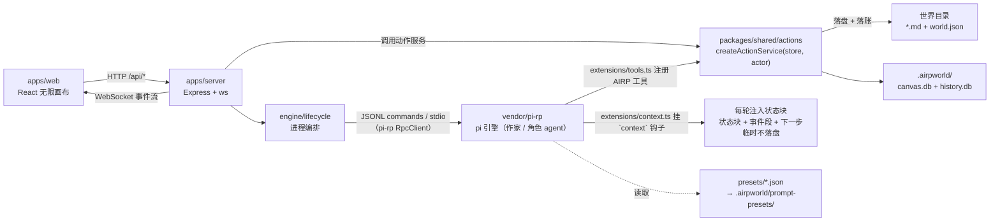

# AGENTS.md — AIRP

> 在这个仓库里干活的人与 agent 的入口手册。
> **本文与 `docs/` 都是设计真相源：架构一变，本文同步改。**
> 设计文档 2026-09-11 从 `infini-canvas` 项目迁入本仓库；`infini-canvas` 已退休，只留前端原型（见 §4）。

---

## 1. 这是什么

**AIRP（AI Role-Playing Narrative Canvas）** —— 一款 AI 互动叙事游戏。玩家在一张"活的无限画布"里以角色身份活动，作家（LLM）用 `type: chalk` 的叙事旁白统摄全场，多模态演出（视差 / 声场 / 立绘）与实体道具交互（以物解谜 / 掷骰）承担玩法主力。

一句话架构：**画布是全空间，黑板是缓冲，消息是指路牌，叙事是世界的灵魂。**

| 层 | 技术 |
|---|---|
| 前端 | React 19 + Vite + Tailwind（`apps/web`） |
| 后端 | Node + Express + ws（`apps/server`），端口 3001 |
| 共享协议 | Zod schema + 文件/ SQLite store（`packages/shared`） |
| 叙事引擎 | **pi-rp** —— `vendor/pi-rp` git submodule，独立仓库 |
| 包管理 | pnpm workspace |

### 1.1 语言规范（硬要求）

**产品一律英文，沟通与文档一律中文。**

| 范围 | 语言 | 理由 |
|---|---|---|
| 前端 UI 文案、演示内容、世界素材 | **英文** | 玩家与评委看到的一切 |
| `presets/**` 提示词、`templates/**` 世界内容 | **英文** | 喂给 AI 的 prompt 与世界内容，**连目录名与文件名一起** |
| 立绘 / 资源 / 图标等资产的文件名与说明 | **英文** | 资产清单 |
| 代码注释、报错文案、日志 | **英文** | 仓库是公开的黑客松产物，评审会直接读代码 |
| commit message、与队友/用户沟通 | **中文** | 开发者都是中国人 |
| `docs/**`、本文件、根 `README.md` | **中文** | 内部设计文档 |

黑客松官方语言是 **英文 / 日语**。判断标准：**任何可能被评委或海外玩家看到的东西 → 英文**。日语只用于日式世界的专有名词，且用罗马字（`nanami`、`sakura-academy`）。

命名一律 ASCII 小写 kebab-case（`baker-street`、`arcane-library`）；专有名词用标准英文或罗马字（`watson`、`baker-street`）。改世界内容时**目录名即 id**——**层不是声明出来的，是扫描出来的**：`world/**/` 下每个目录就是一个层，目录里的 `README.md` 是它的场景配置（有 README = 已写层；没有 = stub 懒加载层，见 doc-11 §3）。改层就是改目录名，`world.json` 里**没有** `layers`。`characters[].home`、preset 的 `options.baseDir` 同样随目录名走。

---

## 2. 目录

```text
apps/
  server/src/
    index.ts            # Express + WS 入口（/api、静态托管 apps/web/dist、端口 3001）；入站 WS 分流（writer_prompt / airp_init）
    routes/world.ts     # 玩家 UI 路由 → 动作服务（/move, /dice, /use-item, /choice, /enter-layer, /layer, /nook, /card/*, /god-action, /audio, …）
    routes/tts.ts       # POST /api/tts 合成 + GET /api/tts/audio/:file 回放；唯一合成点，无模块级状态（docs/tts/01）
    engine/
      launch.ts         # spawn 参数单一来源（preset / --session-dir / --continue / env / AIRP_AGENT_ROLE / --no-* 资源隔离），服务端与探针共用
      lifecycle.ts      # Agent 生命周期编排（单例复用 / spawn / warmup / 崩溃退避重启 / stopAll）
      event-bridge.ts   # 引擎事件 → WS 帧；尾部读 events 表 → world_event 广播（见 §3.2）
      chalk-delta.ts    # chalk 落墨的逐字差分，`writer_delta` 演出源（docs/perform/01）
      presets.ts        # preset 安装到 <worldRoot>/.airpworld/prompt-presets/；extensionArgs/skillArgs/airpEnv
  web/src/
    lib/                   # 纯前端库：camera（插值相机）/ collide（软碰撞）/ seat（排座镜像）/ measure（卡片盒尺寸缓存）/ parallax（指针视差模块态，走 DOM 不触发 React 渲染）/ footprint（实测盒回写）/ audio（采样优先声场，synth 兜底）
                           #   phantom + phantom-seat + ghost（生成中占位与座位过户，docs/perform/03）/ canvas-patch（增量合并）/ writer-state（笔尖状态机）/ chalk-reveal / dice-ceremony / motion / i18n / md / fm
    state/                 # useCamera（相机与层级记忆）/ useWorld（层数据 + WS + 落库；唯一 WebSocket）/ useAudio（声场主轨）
    components/canvas/     # 无限画布（相机 / 卡片渲染 / 关系线 / CanvasGrid 视口网格 / ParticleLayer 粒子）
    components/narrative/  # chalk 叙事卡、骰子
    components/overlay/    # 角色特写遮罩
    components/sidebar/    # 右侧边栏（背包 + 角色）
    components/nook/       # 小天地视图（NookView，复用 Canvas，不自己 useWorld）
    components/chrome/     # 画布外框件（指南针 / 小地图 / 提示条 / 层徽 / 静音钮 / 作家栏）
    components/god/        # 上帝模式工具栏
    components/performance/ # 演出层（DiceCeremony 骰子仪式 / WriterInkLayer 湿墨）
packages/shared/src/    # schema + store + sqlite + 动作层
  schemas/              # world / frontmatter（互动字段通用化）/ components / events / forms / canvas
  store/                # local-store（fs + canvas.db + history.db）/ layers（层树派生）/ world-store（接口）
  inject/               # 每轮注入：turn-cache（轮边界单槽缓存）/ collect（分节采集 + 备忘录 + 三步 fail-soft）
  db/schema.ts          # 两库建表：cards / links / presence / viewpoint / entries / events(seq) / read_cursors
  rules/                # 零依赖纯规则：dice（expect 解析）/ interactive（choice 归一化）/ characters（角色 id + nookIdOf + nookCardPaths，docs/nook §5.2 唯一实现）/ emptiness（isLayerEmpty / isNookEmpty / hasInitProduct）/ init-fallback（w2SceneTemplate）/ voices（音色调色板）
  render/               # 文本视图：spatial（人话方位）/ layer-page（目录展开）/ state（注入块装配）/ sections（分节表）/ events（事件人话）/ next-step（"下一步"）/ viewpoint（视点量化）/ sanitise（注入面消毒）/ brief（buildSceneInitBrief / buildNookInitBrief，I1 从 apps/server 下沉）——look_at、状态块与前端共用
  components/           # 官方组件注册表（kind / schema / CARD_FORMS 联动 / use_item handler）
  actions/              # 动作层：createActionService(store, actor) —— server 路由与扩展工具的唯一共同入口
presets/                # 提示词预设：writer, character, scene-init, nook-init
extensions/
  instructions.ts       # 平台提示词正文（slot writer-char / system-char / scene-init-instruction / nook-init-instruction）
  tools.ts              # 唯一 registerTool 入口：注册 AIRP 动作工具（extensions/toolkit/ 是 jiti 直跑的薄壳）
  context.ts            # 每轮注入（状态块 + 事件段 + "下一步"），挂 `context` 钩子（临时不落盘）；按 AIRP_AGENT_ROLE 分节（writer 6 节 / character 4 节）
  toolkit/              # 工具壳 + 共享 helper（deps/actor/turn/result）；init-command.ts = `airp-init` 初始化执行内核（R2 直唤：扩展命令 → ctx.spawnAgent）——子目录，不会被当扩展加载
skills/                 # 项目级 skills：跨世界通用手艺（生图 / 组件叙事 / 音色选角 / 节奏 / 玩法咬合）
                        #   component-narration / tool-craft / voice-casting（音色选角，docs/tts/08）
templates/              # 开箱世界模板；whitechapel（英文）/ firstsnow（日文）为首条可玩竖切
  <world>/skills/       # 世界级 skills：该世界自己的文风与剧情，与 world/ 同级、随包分发
worlds/                 # 脚手架产出的玩家世界（.gitignore）
vendor/pi-rp/           # 叙事引擎 submodule

tools/                  # 单一职责脚本：探针（probe-*）/ 门禁（check-*）/ 工作流
  scaffold.mjs          # 模板 → 新世界（pnpm scaffold）
  pi-rp.mjs             # pi-rp 子模块工作流（pnpm pi status|build|update|commit，见 §7.2）
  motion-clip.mjs       # 微动立绘 / 背景视频生产（pnpm motion）：绿幕→透明 webm，成片→循环 webm
                        #   手艺包见 assets/skills/motion-portrait/SKILL.md（alpha 解码陷阱在彼）
  probe-writer.mjs      # 全链路探针（pnpm probe）
  probe-tools.mjs       # 工具面探针：jiti 载入 extensions/tools.ts，断言注册表 + 真执行（probe:tools 第一段）
  probe-tools-engine.mjs # 工具面探针（强形式）：真 spawn 引擎，断言 AIRP 工具被引擎执行（probe:tools 第二段）
  probe-inject.mjs      # 注入探针：真 spawn 作家引擎，断言每请求恰好一份注入块、且不落盘（pnpm probe:inject）
  probe-prompt.mjs / probe-prompt-character.mjs # 提示词 wire 探针（作家 + 角色），断言 slot 真进了模型、[emo: tag] 六标签在（pnpm probe:prompt）
  probe-init.mjs        # 初始化探针：真 spawn 作家，发 /airp-init，断言产物落盘 + 事件落账 + 幂等 + 零 AI 路径（pnpm probe:init）
  *-probe-provider.ts / prompt-dump-provider.ts # 各探针的确定性 provider（把 wire payload 落文件供断言）
  check-ws-contract.mjs # 跨端 WS 契约门禁（pnpm check:ws）：服务端发射面 ↔ 前端消费面 ↔ 契约表求 diff
  check-request-bodies.mjs # HTTP 请求体门禁（pnpm check:bodies）：前端 body 键集 ↔ docs/wiring/00 §6 冻结形状
  check-hooks-docs.mjs  # 设计文档门禁（pnpm check:docs）：symbol ownership / barrel union / sentinel（hooks 批语料）+ **file:line 引用核验（hooks + audio + AGENTS.md + assets/README.md）**；单测 tools/check-hooks-docs.test.mjs
  check-skills.mjs      # skill 语料门禁（pnpm check:skills）：frontmatter 真解析 / 语言分层 / 命名 / 非法工具名
  check-voices.mjs      # 音色门禁（pnpm check:voices）：角色 voice 必须解析到调色板（docs/tts/07）

assets/                 # worldlines-assets 素材车间；整树 .gitignore，**只白名单 audio/ 与 skills/**（见 §7.8）
  audio/                # 平台级音频池（已入库）：bgm（3 情绪主线）/ themes（逐世界主题曲）/ ambient（基础三轨 + pool/ 声场族）/ foley（拟音）+ PLAN.md 需求清单 + CREDITS.md
  skills/               # 素材生产手艺包（文本，无大二进制）：motion-portrait 等
  worlds/ _inbox/       # AI 生图原始产出与筛选（约 587MB，不入库）——发布位是平台 IP 包，不是这里

docs/                   # 设计文档（真相源）；各实现批次目录见 §4
  init/                 # 初始化执行（I1）：00 冻结契约 + 01–04 分篇 + REVIEW-*
  nook/ footprint/      # 角色小天地 N1 / 卡片占位尺寸
  audio/                # 音频接线（A1）：00 契约 + 01 服务端路由与解析 / 02 采样链与主轨 / 03 前端贯通 / 04 Foley 与 stinger / 05 素材缺口 / 06 回写
  tools/ hooks/ wiring/ perform/ prompts/ tts/ # 各实现批次：00 冻结契约 + 分篇 + REVIEW-*（§4 有逐批说明）
  前端接线体检.md        # 2026-09-12 跨端 WS 契约静默漂移的核实报告（含缺陷分级与文档漂移清单）
```

---

## 3. 架构



### 3.1 单轮管线（作家）

Hook 注入场景上下文 → chalk 落正文 → edit 回写 frontmatter → write/edit 演化场景物件 → 轻量收敛。
**chat history 不进画布，只有 chalk 落板。**

**注入挂 `context` 钩子（不是 `before_agent_start` 的 `message`——那个会被持久化并逐轮累积），只在本次 LLM 请求里存在、不落会话条目。** 每轮注入 = **一个自足的状态块**（当前值，全量）+ **一个事件段**（变化，游标增量）+ **一句"下一步"**（祈使，由事实推出）；三者拼成一条自定义消息追加到消息尾部。重活（扫目录 / 读库 / 渲染）只在**轮边界**（`agent_start`）算一次并缓存，`context` handler 只做字符串拼接与缓存读取。作家 6 节 / 角色 4 节，按 `AIRP_AGENT_ROLE` 选表。协议见 `docs/hooks/00…06`。

### 3.2 文件即真相

世界目录本身就是真相源，**没有独立状态文件**。`status.data` / `choice` / `roll_dice` 是实体通用 frontmatter，不局限于 chalk；玩家 UI、作家与角色通过同一个引擎动作层触发互动。**`status` 不是状态系统，它只是某个实体（含 chalk）的一份快照**——读它 = 读那个文件。
分层存储：**内容走文件系统，架构状态与历史走 SQLite**（`canvas.db` / `history.db`）。

**事件是唯一变更来源，`fs.watch` 不落账**：一切写世界的动作先落 `history.db` 的 `events` 表（`seq` 自增主键是唯一游标；五种 `actor`：player/god/writer/character/engine；十五个封闭 `type`，见 `docs/doc-21`）。经过动作函数的工具**自己落账**，扩展的 `tool_result` hook 只兜原生 `write`/`edit`（两份名单 MUST 互斥，否则 chalk 落两次）。`fs.watch` 只做前端重取的触发器。**扩展在 agent 进程、WS 在 server 进程，两者不通**——server 侧**尾部读 `events` 表**（`getEventsSince(lastSeq)`）再把新事件合成 `world_event` 帧广播给前端。

**作家注入的轮边界在 `agent_start`，游标在注入成功后推进**：读取与渲染是轮边界的一次结算；作家游标在**注入成功后**推到 `getMaxSeq()`，角色游标在**关遮罩时**推进（**须 `actor.type === 'writer'` 守卫**，否则角色进程每轮也推作家语义）。详见 `docs/hooks/00` §1 §6。

**state 绝对不做（架构不相容，非排期）**：不引入 `get_state` / `set_state` / `state_update` / `watch_state`，不引入状态文件、状态命名空间、状态栏。理由：那会产生第二个真相源——agent 绕过 `edit` 改状态时 `fs.watch` 与事件表都看不见，同时打穿"文件即真相"与"事件是唯一变更来源"两条地基。详见 `docs/doc-20` §2.3。

### 3.3 preset 即 Agent 人格

初始化只有一个可委托 profile（`scene-init`），作家委托（R1）与引擎直唤（R2）共用它，靠**动态 brief** 区分任务。详见 `docs/doc-11`。

**层由目录树扫描得出**，不在 `world.json` 里声明：`world/**/` 的每个目录是一个层，目录里的 `README.md` 是它的场景配置。父层页面只显示自己目录的 md + **每个直接子层的门牌**（子层 README，或无 README 的 stub 门），绝不伸进子层内部——这是「子场景的卡全糊在基层上」那个 bug 的根因。派生逻辑在 `packages/shared/src/store/layers.ts`（纯函数，前后端共用）。

`world.json.entry` 指定打开世界后的 0 级导入层（缺省 `map`）。当前层自己的 `README.md` 由 `/api/layer` 单独作为 `scene` 返回并显示为入场 Chalk；它在父层仍是 Gate，不进入普通卡片排座。P0 Gate 可用 README 的 `requires.items` 要求玩家背包中的精确文件路径，详见 `docs/doc-15` 与 `docs/doc-20`。

**角色小天地（nook）是与「层」并列的一条通路，不是层**（2026-09-13 落地）。`characters/<id>/` 根目录本身就是小天地（doc-06 §4.1 / doc-11 §4），但它**被层派生显式排除**（`layers.ts` 只收 `world/` 子树；`resolveLayer()` 对 `characters/**` 返回 `null`）。因此它走**独立端点** `GET /api/nook?character=<id>`——返回体与 `LayerState` 同形（`layer` 字段填 `characters/<id>`、`scene` 为角色 README、`items` 只含**直接子级 md**（`nookCardPaths`）、`links`/`presence` 为空）。前端入口在**角色 tab 每行的第 4 个按钮**，视图是 `apps/web/src/components/nook/NookView.tsx`（复用 `Canvas`，**不自己 `useWorld()`**，避免第二个 WebSocket）。小天地里的卡片同样有 `cards` 行（`layer` 列存完整 nookId）、同样走 `POST /api/card/footprint` 回写（该路由对 `characters/<id>` 有并列分支）；拖卡走 `arrangeCards`（其 place/layout 两条分支均有 nook 分支）。微动立绘是 `portrait` kind（room pack，`component: portrait` + `video:` + `poster:`，透明 VP9 webm 由 `tools/motion-clip.mjs` 从绿幕产出）。设计真相源：`docs/nook/00…05`。

---

## 4. 文档导航

主入口 **[`docs/00-文档骨架.md`](docs/00-文档骨架.md)**（全量清单 + 阅读建议）。最常看的几份：

| 文档 | 什么时候看 |
|---|---|
| `docs/doc-05-AIRP产品构想.md` | **产品设计起点**——要理解任何设计的动机，先看它 |
| `docs/doc-06-演出与交互设计.md` | 动交互 / 演出层 |
| `docs/doc-07-AIRP黑客松作战计划.md` | Fri–Tue 执行看板、分工、未分配任务、排期与风险 |
| `docs/doc-11-场景与小天地初始化协议.md` | 初始化协议（**已定案**，含 preset 骨架与 pi-rp 源码级约束） |
| `docs/doc-20-agent工具与互动字段协议.md` | 作家/角色共享工具、互动字段、移动/选择/骰子/跟随协议（**已定案**） |
| `docs/doc-04-视觉设计风格.md` | 前端视觉基准（**§10 为准**） |
| `docs/doc-19-多模态与游戏性交互升级.md` | 视听动升级定案（评委导向） |
| `docs/doc-24-五世界可玩Demo体验设计.md` | **五世界内容设计入口（等待评审）**：6–10 分钟短闭环、五条主观流程、P0 停止边界与逐世界待选项；用户确认前不继续补完整关卡或批量生图 |
| `docs/前端改造计划.md` | `apps/web/` 的施工单 |
| `docs/后端实现计划.md` | `apps/server/` + `extensions/` 的施工单（引擎接通 / 工具面 / Hook 注入 / 角色上下文） |
| `docs/tools/` | **B1 工具面设计与实现真相源**：`00-共同上下文.md` 是冻结契约（路径/事件/身份/存储/注册/反模式），`01`–`12` 逐个工具的设计，`REVIEW-评审报告.md` 是评审裁决。**动动作层 / 注册工具 / 改路由前必读** |
| `docs/hooks/` | **B2/B3 每轮注入协议真相源**：`00-共同上下文.md` 是冻结契约（注入接缝/分节/游标/身份/消毒/barrel 反模式），`01`–`06` 逐篇设计，`AUDIT-doc-22体检.md` 记录 doc-22 哪些断言为假。**改 `extensions/context.ts`、注入块、视点链路前必读** |
| `docs/前端接线体检.md` | 动 WS 帧 / 前端消费面 / `useWorld.ts` 前必读——冻结契约的机械核验（`pnpm check:ws`）与已知漂移清单 |
| `docs/wiring/` | **前端接线 A 档（止血 + 文档回写）真相源**：`00-共同上下文.md` 是冻结契约（角色身份/去重/转发集合/请求体），`01`–`04` 逐模块设计，`05-文档回写.md` 是回写清单。**动 `useWorld.ts` WS switch / `CharacterModal` / `DiceRoller` / 角色帧载荷前必读** |
| `docs/perform/` | **演出通道（残余 9 条 DARK 接线）真相源**：`00-共同上下文.md` 是冻结契约（`writer_delta` 来源流 / 幻影与座位过户 / `show_frame` 分发 / `canvas_patched` 归属 / 声响落点 / phantom 字段集），`01`–`05` 逐帧设计 + `06-文档回写.md` 回写清单 + `REVIEW-R1..R5` 五视角评审。**动 `event-bridge.ts` 帧映射 / `useWorld.ts` WS switch / `lib/{phantom,phantom-seat,writer-state,ghost,canvas-patch}.ts` / 演出组件前必读** |
| `docs/tts/` | **角色语音 TTS 批次真相源**：`00-共同上下文.md` 是冻结契约（`POST /api/tts` 请求/响应体、缓存 key、角色 `voice` frontmatter、前端 `playVoice`/`stopVoice`/`isVoicing`、页语义、env），`01`–`06` 逐模块设计，**`07` 音色别名映射 + `08` 音色 skill/门禁**。**动 `routes/tts.ts` / `lib/audio.ts` 语音面 / `CharacterModal` 分页 / `skills/voice-casting` / `voices.ts` 前必读** |
| `docs/doc-08~18` | 各专题（多为待完善），实现对应模块前再读 |
| `docs/init/` | **初始化执行（I1）真相源**：`00-共同上下文.md` 是冻结契约（`airp-init` 命令形状 / 执行序 / 并发防线 / brief 字段 / 边界），`01`–`04` 逐模块设计，`REVIEW-{Consistency,Semantics,Implementability}` 三份独立评审。**动 `init-command.ts` / brief / 空判定 / 前端 `first` 消费前必读** |
| `docs/nook/` | **角色小天地（N1）真相源**：`00-共同上下文.md` 是冻结契约（`GET /api/nook` 形状 / nookId = `characters/<id>` / `layer` 列 / footprint 门禁分支），`01`–`05` 分篇（取数 / 视图入口 / 立绘 / 占位回写 / 验收）+ `RESEARCH-初始化链路.md` + 三份评审。**动 `routes/world.ts` 的 nook 分支 / `NookView` / `portrait` kind / 排座 nook 分支前必读** |
| `docs/footprint/` | **卡片占位尺寸真相源**：`00-共同上下文.md` 是冻结契约（`cards` 行写入路径 / measuredAt 与 formVersion / reseat 漂移判据），`01`–`05` 分篇。**动 `cards` 行建行 / `/api/card/footprint` / `lib/{measure,footprint}.ts` 前必读**（与 AGENTS §7.5 配套）|
| `docs/audio/` | **音频接线（A1）真相源**：`00-共同上下文.md` 是冻结契约（`ambient`/`bgm` frontmatter / `/api/audio` 路径解析 / 采样优先合成兜底 / stinger 触发），`01`–`06` 分篇。素材清单在 `assets/audio/PLAN.md`（P0 已完成，P1/P2 缺口逐条登记）。**动 `lib/audio.ts` / `routes/world.ts` 的 `/audio` / 世界主题曲声明前必读** |
| `docs/prompts/` | **提示词与 skill 体系真相源**：`00-共同上下文.md` 是冻结契约，`01`–`03` 是作家/角色/初始化器**正文逐字源**（`extensions/instructions.ts` 与之对应），`04` skill 体系，`05` 装配与验证 + 四份评审。**改任何 preset / skill / instruction slot 前必读** |

**参考实现（都在本项目的兄弟目录，不进本仓库）**：

| 项目 | 是什么 | 学什么 |
| `~/projects/worldlines-rivet` | 同构架构：世界包 + 多 agent + pi-rp 引擎，已跑生产 | **后端**：`services/gateway/` 的协议单一事实源 / WS 外壳 / 会话域三层切法、`launch.mjs` 启动参数单一来源。**注意：它的"角色上下文分层"（state/knowledge/scene_brief 组装）是它自己的多角色编排配套，AIRP 明确不搬**（逐条取舍见 `docs/后端实现计划.md` §2） |
| `~/projects/infini-canvas` | 前端原型与旧设计文档（已退休） | **前端**视觉语汇与交互机制。它的 `worldlines-canvas/` 用的是另一套 harness + Python 后端，**引擎部分不迁移** |

**前端原型不进本仓库**：`画布世界v1-yoshi.html`、`画布世界v2-niko.html`、`角色-yoshi.html`、`角色-世界v3.html/`、`assets/` 都在 `infini-canvas` 项目里——把它 clone 到本项目的兄弟目录即可对照。文档里出现的原型文件名一律指那里。

---

## 5. 常用命令

```bash
pnpm install                                    # 装依赖（含 submodule）
pnpm build                                      # 编译全仓库
pnpm test                                       # 单元/集成测试（shared + server + web + tools 门禁单测）
pnpm probe                                      # 全链路探针，PASSED 才算地基没坏
pnpm dev                                        # 全栈开发（web 5173 / server 3001）
pnpm probe:tools                                # 工具面探针（注册表断言 + 真引擎执行 AIRP 工具），PASSED 才算工具面没坏
pnpm typecheck:extensions                       # extensions/ 类型体检（jiti 直跑的 TS 不在 workspace 里）
pnpm probe:inject                               # 注入探针（真 spawn 作家引擎，断言每请求恰好一份注入块且不落盘）
pnpm check:ws                                   # 跨端 WS 契约门禁（服务端广播面 ↔ 前端消费面 ↔ docs/tools/12 §6.2）
pnpm check:bodies                               # HTTP 请求体门禁（前端 fetch body 键集 ↔ docs/wiring/00 §6）
pnpm check:docs                                 # 设计文档门禁（符号归属 / barrel union / 引用核验；引用面含 assets/ 与入口文档）
pnpm probe:prompt                               # 提示词 wire 探针（作家 + 角色），断言补上的 slot 真的进了模型
pnpm probe:init                                 # 初始化探针（真 spawn 作家，发 /airp-init，断言产物落盘 + 事件落账 + 幂等 + 零 AI 路径）
pnpm check:skills                               # skill 语料门禁（frontmatter / 语言分层 / 命名 / 平台清单与触发词）
pnpm check:voices                               # 音色门禁（角色 voice 解析到调色板；docs/tts/07）
pnpm pi status                                  # pi-rp 子模块 + dist 新鲜度体检（见 §7.2）
pnpm motion <绿幕.mp4> -o out.webm --scale 360   # 微动立绘 / 背景视频（见 assets/skills/motion-portrait）
node tools/scaffold.mjs --template holmes-world --out worlds/my-holmes
pnpm --filter @airp/server dev                  # 只起后端
```

---


### 5.1 pi-rp agent 配置（`.pi/agent/`）

引擎 spawn 时由 `launch.ts` 注入 `PI_CODING_AGENT_DIR=.pi/agent/`（与 worldlines-rivet 同款），**不用** `~/.pi/agent/`——否则每台机器跑的是各自的 provider，行为会漂。

- `.pi/agent/models.json` = provider 与 API key；**不入库**（本仓是公开的黑客松产物，钥匙不能进 git）。从队友的 checkout 拷一份，或指向 wl 的 `~/.projects/worldlines-rivet/.pi/agent/`。
- 缺这个文件不报错：pi-rp `ModelConfig.load` 对 `ENOENT` 静默回落内建 provider（只是没有自定义模型可选）。`pnpm probe` 走离线确定性 provider，**不需要**它。
- 探针的真模型分支（`AIRP_PROBE_REAL=1`）与手工全链路演示才需要真 provider。
- **`.pi/agent/settings.json` = 默认模型**（另两个文件是 `models.json`（provider 与 key）、`auth.json`）。三者互相独立：`models.json` 只说"有哪些模型可选"，**选哪个**由 `settings.json` 的 `defaultProvider` + `defaultModel` 决定。同样不入库。
- 当前实际生效的是 **`GG / gemini-2.5-pro`**（会话首行 `model_change` 记录为证）。`launch.ts` **不传 `--model`**，所以每个 agent 都走这份默认。
- **模型解析顺序**（`sdk.ts:240` → `model-resolver.ts:621`）：① 已有会话 → 恢复会话里记的模型；② 否则 `settings.json` 的 `defaultProvider`/`defaultModel`（**须该 provider 有 auth**）；③ 否则 `defaultModelPerProvider` 表里第一个有 key 的；④ 否则第一个可用模型。所以**换默认模型对已存在的会话无效**——要删 `char-<id>.jsonl` 才会重新解析。
- **改哪个 settings**：全局落点 `<PI_CODING_AGENT_DIR>/settings.json`（即 `.pi/agent/`，对所有世界生效）；世界级落点 `<worldRoot>/<PI_PROJECT_CONFIG_DIR>/settings.json`（即 `<world>/ .airpworld/settings.json`，随世界走、覆盖全局）。**两者都已 gitignore**。实测 world 级能覆盖 global（project > global），global 能切到 `models.json` 里任一 provider。
- `~/.pi/agent/settings.json` **读不到**：`PI_CODING_AGENT_DIR` 已 pin 到仓库内，user scope 整个指向那里——改自己 home 下的默认模型对 AIRP 无影响（实测：`~/.pi` 写的是 `clineFree`，AIRP 实际跑 `GG`）。

**资源发现必须隔离**（`launch.ts::ISOLATION_ARGS`）：两条 launch spec 都带
`--no-extensions --no-skills --no-context-files --no-prompt-templates --no-themes`。
不加这几个开关，pi-rp 会顺着发现路径把**我们没交给 agent 的东西**灌进去，实测三处：

- **`<home>/.agents/skills/`（本机 37 个）** —— 作家进程命令表里冒出 `skill:tdd` /
  `skill:character-sim` / `skill:llm-writing` …全部进 system prompt；
- `<cwd>/.airpworld/extensions/*.ts` —— 世界包能植入任意扩展并在 agent 进程里执行；
- 从世界根**逐级上溯**读到的仓库根 `AGENTS.md` —— 18KB 中文开发手册直接进 system prompt。

注意 `<home>/.pi/agent/**` **不在**这张清单里：`PI_CODING_AGENT_DIR` 已 pin 到仓库内
`.pi/agent/`（见上一条），pi-rp 的 user scope 整个指向那里，开发者自己的 agent dir 碰不到。
显式 `--extension` / `--skill` 在 `--no-*` 下**照常加载**（被砍的是"发现"而非"显式路径"），
pi-rp 自带的隐藏 inline 扩展（llama.cpp / memories / opening）也不受影响——隔离的是
**发现**，不是能力。`tools/probe-writer.mjs` 有静态 + 动态两条断言守着（§5 命令表）。

---

## 6. 开发纪律

### 6.1 提交即推送（硬要求）

**`git commit` 之后立刻 `git push`，不要攒在本地。**

- push 前先 `git fetch`，确认与远端的关系。
- 远端有新提交 → **merge**，不要 rebase 别人已经拉过的分支。
- **绝不 `force-push` `main`。**

**并发下的暂存纪律**（工作区经常同时有多个 agent 在改，已实际发生过）：

- 提交前先 `git status` 看清本次改动范围，**只 add 自己动过的文件/目录**——`git add .` / `git add -A` 会把别人没写完的改动一起卷走；
- 提交前 `git diff --cached` 复核暂存内容，提交信息写清这次改了什么；
- 双方改到同一文件：改动不重叠时用 `git add -p` 只暂存自己的 hunk；改在同一处拆不开时先协调归属，别擅自带走对方的改动；
- 改完就提交，别攒大堆。

**绝不动别人在途的文件**（2026-09-13 爽约一次）：门禁/测试失败时，**先判断失败根源是不是自己的改动**——如果是别人未提交的在途工作（`git status` 显示 `M`/`??` 且非你所改），**正确做法是忽略该失败、照常提交自己那片**，绝不去 `git stash` / `git checkout` / `git restore` / 格式化他们的文件。理由：那些人**可能正开着编辑器或在另一个进程里改同一文件**，你一 stash 他们一写就是冲突、覆盖、丢改动——"我只是想跑个测试"变成"我把同事的活弄没了"。验证别人的失败是否与己无关，用**只读**手段：`git show HEAD:<file>` 取已提交版本对照，或读源码，**不碰工作树**。（`git restore --staged` 把别人误 `add` 的文件放回工作树是安全的——它只动索引、不动文件内容；但 `stash`/`checkout` 会动文件，禁止。）

### 6.2 分支：可能多人多线并行

不要假设只有你一个人在推。

- 动别人的分支之前先打招呼；协作时各自开分支（如 `feat/<主题>` / `dev-<名字>`），做完合回 `main`。
- 长期分支收工前先同步 `main`，别让分叉攒大。
- **`main` 必须保持可编译、可跑**（`pnpm build` + `pnpm probe` 通过）。

### 6.3 架构文档必须跟着代码走

改了架构就必须在**同一个 commit** 里改文档，不留"回头补"：

| 改了什么 | 必须同步改 |
|---|---|
| 目录 / 模块职责 / 数据流 | 本文（`AGENTS.md`）§2 §3 |
| 协议（frontmatter / WS 消息 / API 路由） | `packages/shared` schema + `docs/doc-09` 或 `doc-05` |
| 提示词 / preset / 初始化流程 | `presets/*.json` + `docs/doc-11`（**骨架与文件必须逐字一致**） |
| 提示词正文 / slot 装配 | `docs/prompts/01…03`（正文逐字源）+ `presets/*.json` + **全部 9 份** `templates/*/characters/*/preset.json`；跑 `pnpm probe:prompt`（作家 + 角色 wire 断言）|
| skill 体系（平台级 / 世界级） | `docs/prompts/04` + `skills/**` + `templates/*/skills/**`；跑 `pnpm check:skills`（frontmatter 真解析 / 语言分层 / 命名 / 非法工具名 / **平台清单与按 skill 分触发词**）。**新增平台级 skill 必须同步登记**（`tools/check-skills.mjs` 的 `EXPECTED_PLATFORM` 与 `TRIGGERS_BY_SKILL`）|
| 角色语音 / 音色（`voice:` 声明、调色板、TTS 引擎） | `docs/tts/**`（`00` 冻结契约 + `07` 音色映射唯一真相源）+ `packages/shared/src/rules/voices.ts`；跑 `pnpm check:voices`（**增删音色 MUST 先实测出声**）|
| 交互 / 演出 / 视觉 | `docs/doc-06` / `doc-04`（视觉以 §10 为准） |
| 注入协议 / 钩子接线 / 分节表 | `docs/hooks/00…06`（冻结契约 `00` 唯一真相源） |
| 角色 preset 的 compaction | `presets/character.json` 是**唯一真源模板**（新角色从它复制）；改 `hiddenOverrides.compaction` 必须**同 commit** 铺到 **全部**模板/world 角色 preset，并跑 `apps/server/test/character-preset-parity.test.mjs`（逐字一致，缺一份即静默失效） |
| 跨端 WS 帧契约（增删帧 / 改载荷 / 前端消费面） | `docs/tools/12` §6.2（唯一帧清单）+ `docs/前端接线体检.md`；跑 `pnpm check:ws`（门禁会因两端不一致而红） |
| 角色来源的 WS 帧载荷（`characterId`） | `docs/wiring/00` §3（唯一形状源）+ `apps/server/src/engine/{lifecycle,event-bridge}.ts` 的 sink 链 |
| 初始化执行（`airp-init` 命令 / brief 字段 / 空判定 / W2 兜底） | `docs/init/00`（冻结契约）+ `01…04`；`extensions/toolkit/init-command.ts`、`packages/shared/src/{render/brief,rules/emptiness,rules/init-fallback,rules/characters}.ts`；跑 `pnpm probe:init`（真 spawn 端到端）|
| 音频（`ambient`/`bgm` frontmatter、`/api/audio`、stinger） | `docs/audio/00`（冻结契约）+ `01…06`；`apps/server/src/routes/world.ts` 的 `/audio` 分支与 `readLayerAudio`、`apps/web/src/lib/audio.ts`；**素材入库口径见 §7.8**——增删 `assets/audio/**` MUST 同步 `assets/audio/PLAN.md` 与 `CREDITS.md` |
| 小天地（`GET /api/nook`、nookId、`layer` 列、footprint 门禁） | `docs/nook/00`（冻结契约）+ `01…05`；`apps/server/src/routes/world.ts` 的 nook 分支、`components/nook/NookView.tsx`、`packages/shared/src/rules/characters.ts` 的 `nookCardPaths` |
| 卡片占位尺寸（`cards` 行 / footprint 回写 / reseat 漂移） | `docs/footprint/00`（冻结契约）+ `01…05`；`packages/shared/src/store/local-store.ts` 的建行路径、`lib/{measure,footprint}.ts`（与 §7.5 三条契约配套）|
| 文档里写的仓库路径（目录树 / 链接 / `file:line` 引用） | 无需手改同步表——**跑 `pnpm check:docs` 即可**：它核验 `docs/hooks` + `docs/audio` + `AGENTS.md` + `assets/README.md` 里的每条路径引用能否解析。改名/移动文件后引用悬空，门禁直接红 |

文档里已被推翻的说法**直接改掉**，不要另起一段解释——`docs/archive/` 才是存废案的地方。

### 6.4 收工自检

```bash
pnpm build && pnpm test && pnpm probe && pnpm probe:inject && pnpm check:ws && pnpm check:bodies && pnpm check:docs && pnpm probe:prompt && pnpm check:skills && pnpm check:voices && pnpm probe:init
```

`pnpm test` 覆盖 `packages/shared/test/`、`apps/server/test/`、`apps/web/test/`、`tools/*.test.mjs` 四处（纯函数与非空性断言落在这里）。

`pnpm check:ws` 是**跨端 WS 契约门禁**：服务端广播面、前端消费面、`docs/tools/12 §6.2` 契约三集合求 diff。**改了任何 WS 帧（增删帧名 / 改载荷 / 前端 case）必须让它变绿**——它会把"两端各自绿、合起来死"的漂移抓出来（2026-09-12 实际抓到 14 条）。

`pnpm check:bodies` 是**HTTP 请求体门禁**（`tools/check-request-bodies.mjs`）：比对前端 `fetch('<route>', … JSON.stringify({...}))` 的键集合与 `docs/wiring/00 §6` 冻结的请求体。WS 门禁管帧名，这条管 body——`/api/dice` 曾因前端发 `{filePath,rollType,expect}` 而服务端只读 `body.path` 静默 400（2026-09-12 修复）。

`pnpm check:docs` 是**设计文档门禁**（`tools/check-hooks-docs.mjs`）：符号归属 / barrel union / sentinel 三条只在 hooks 批契约内成立，故只扫 `docs/hooks/`；**引用核验（file:line 必须能解析）跑更宽的语料**——`docs/hooks/` + `docs/audio/` + `AGENTS.md` + `assets/README.md`——因为"死路径在哪都是死路径"，而**入口文档的路径表恰恰是最容易悄悄过期的地方**（2026-09-13 加：§7.8 与 `assets/README.md` 都写过一句已经变了的 gitignore）。`assets/` 引用只核验 **git-tracked** 的文本路径（平台音频池 `assets/audio/PLAN.md` 等），世界相对的 `assets/...`（`<worldRoot>/assets/audio/rain.mp3`，测试 fixture）与媒体文件一律跳过——它们只是共享 `assets/` 这个前缀。**改了文档里的任何路径引用必须让它变绿**；批次文档顶部声明 `NEW` 的文件享文档级豁免。

改动涉及引擎或 preset 时，额外确认探针里**没有 `not found` / `unknown slot` 警告**。

### 6.5 Build 红线：改了 src 不 build，运行时会静悄悄跑旧代码

**构建产物不入库，只对本机生效。** 类型检查过了 ≠ 运行时生效——这一条踩过，代价是一整天的错误结论。

| 改了哪里 | 运行时实际读的是 | 提交前必须 |
|---|---|---|
| `vendor/pi-rp/**/src/` | `vendor/pi-rp/packages/*/dist/`（gitignored） | `pnpm pi build`（见 §7.2），或直接走 `pnpm pi commit` 的内置红线 |
| `packages/shared/src/` | `packages/shared/dist/`（`tools/*.mjs` 与服务端都 import 它） | `pnpm build` |
| `apps/web/src/` | 生产由服务端伺服 `apps/web/dist/` | `pnpm build`（vite dev 的 HMR 只证明 dev 模式对） |

判据很简单：**`import` 的是 `dist` 就必须 build**。不确定时比对 `dist/` 的 mtime，或直接 grep 新逻辑在不在产物里。

---

## 7. 关键约定与坑

### 7.1 术语：pi-rp 不是 omp

- **pi-rp** = 本项目的叙事引擎，源码在 `vendor/pi-rp`（submodule）或 `~/projects/pi-rp`。**查引擎行为一律查这里。**
- **omp / oh-my-pi** = 部分人本地跑 agent 的 harness，与本项目无关，**绝不要拿它当 pi-rp 查源码**。

### 7.2 pi-rp 子模块工作流（`pnpm pi`）

`pi-rp` 与本项目由同一批人开发、被多个项目消费，多会话并发是常态。**别手搓 submodule 命令**，一律走 `tools/pi-rp.mjs`（移植自 worldlines-rivet 的同名工具，同一个子模块、同样两个坑）：

```bash
pnpm pi status                              # 两边状态 + dist 新鲜度一览；不一致先修再干别的
pnpm pi build                               # 只重建 dist（HEAD 没动但产物旧了）
pnpm pi update [--no-build] [--no-push]     # 拉 origin/main → build → 更新本仓指针
pnpm pi commit "fix(...): …" [--no-build]   # build 红线 → 子模块 commit+push → 本仓指针 commit+push
```

两条它专门用来挡的不变量（**都已经咬过我们**）：

1. **dist 是本地产物，不随指针走**。`vendor/pi-rp/packages/*/dist/` 被 pi-rp 自己的 `.gitignore` 排除，而服务端与探针跑的是 `dist/cli.js`。HEAD 一动而 dist 没动，运行时会**毫无告警地继续执行旧构建**——实测踩过：源码里子代理默认工具集已含 `write`/`edit`，本机 dist 还停在四天前，于是"改了源码没生效"。所以**凡是动 HEAD 的路径都会重建**，`pnpm pi status` 也会报 dist 是否 STALE。
2. **指针必须等于子模块 HEAD**。HEAD 漂了（本地 main 落后、实验性 checkout 没恢复）还提交指针，等于把漂移洗白成一次正常的版本推进。`verifyPointerAligned` 直接拒绝并给出两种对齐命令。

其余纪律：

- 改 pi-rp 一律在**本项目的 vendored 副本**里改，不要另开独立克隆（`~/projects/pi-rp` 不当工作副本）；
- 发现 pi-rp 有 bug 或缺能力，**直接在子模块里补掉再 `pnpm pi commit`**——两个项目同进退，不要在 AIRP 侧绕开引擎；
- push 前必须 `fetch`；分叉先 merge；**绝不 force-push `main`**；
- 核对 remote 确实是 pi-rp 再推——**绝不把本仓库的提交推到 pi-rp**；
- `pnpm pi commit` 在子模块里是 `git add -A` 整体提交，跑之前先 `git -C vendor/pi-rp status` 确认里面没有别人的改动；
- `--no-build` 只用于纯文档等不可能影响运行时的改动；
- 新机器引导：`cd vendor/pi-rp && npm install`（**勿 `--ignore-scripts`**，否则 tsgo 等根级工具链不落地）→ `pnpm pi build`（内含 `hydrate:model-data`，要联网；跳过它 `build:offline` 会在 `check:model-data` 处失败）。

### 7.3 设计 pi-rp 侧的功能前，先扫上游文档（不要从源码开始猜）

**引擎的能力分布在三个互不重叠的面上，只查一面就下结论一定会错。** 上游文档就在仓库里，`vendor/pi-rp/packages/coding-agent/docs/`（30+ 篇，与源码同仓同步，**不属于 §6.3 说的那种会过期的"实测结论"**）。

| 面 | 先读 | 能解决什么 |
|---|---|---|
| **扩展** | `extensions.md` | 事件钩子（`before_agent_start` / `tool_call` / `tool_result` / `session_compact`…）、注册工具与 slot、customType 与其策略、`spawnAgent` |
| **预设** | **`prompt-presets.md`** | system prompt 装配、内建/自定义 slot、宏、资源策略、正则规则、**隐藏提示词覆盖**、子代理委托、命令 |
| **运行时** | `environment-variables.md`、`settings.md`、`rpc.md`、`skills.md`、`state-schemas.md`、`compaction.md`、`sessions.md` | 启动参数、会话与存档、RPC 协议、技能、压缩 |

**特别是 preset 那份——里面能翻到各种意想不到的功能，很多需求根本不用写代码。** 它的目录本身就值得先过一遍：`Character Charter` / `Built-in Slots` / `Macros` / `Custom Slots via Extension` / `Resource Policies` / `Regex Rules` / `Hidden Prompt Overrides` / `Subagent Delegation` / `Commands`。

**顺序：先文档 → 再源码确认 → 确认真缺才补上游。** 两次踩过的实例：

- **压缩摘要的口径**：只查了扩展 API，看见自动触发的压缩把 `customInstructions` 硬编码成 `undefined`、`SessionBeforeCompactResult` 又没有回写口，就断言"扩展改不了自动压缩的摘要指令，要给 pi-rp 补两行"。实际入口在 preset 的 `hiddenOverrides.compaction`（五个字段，手动与自动走同一份：`agent-session.ts:3133` / `:3480` / `:4835`），而且 pi-rp 自带的文档示例**正好就是一段中文剧情总结提示词**。**引擎不缺东西，是我找错了面。**
- **子代理工具集**：照抄了本仓库文档里的旧"实测结论"，而源码当天已经改掉（§6.3 的反面教材）。

反过来，**确认真缺就直接补上游**（§7.2：在 vendored 副本里改、`pnpm pi commit` 同步指针）——不要在 AIRP 侧绕开引擎。判断"是 bug 还是设计"的标准不是有没有 JSDoc 写过，而是**这个行为跟引擎自己在别处的语义一致不一致**。

### 7.4 preset 格式铁律（实测，踩过坑）

> 写 preset 前先读上游那份 `prompt-presets.md`（§7.3）。**下面五条只是我们踩过的坑，不是 preset 能力的全集**——把它当清单会错过一大半功能。
>
> 本节管的是 **JSON 语法**。提示词**正文怎么写**（流程写全、坑写成后果、给判据不给形容词、"不做"也是合法输出、常驻薄 + 细则懒加载），见 **`docs/doc-23-提示词写作规范.md`**——动手写任何 preset 或 skill 前先读它。
>
> 另注意：**平台侧提示词正文在 `extensions/instructions.ts` 的四个导出常量里**（slot `writer-char` / `system-char` / `scene-init-instruction` / `nook-init-instruction`），preset JSON 只是装配单，用一条 `{"kind":"slot","slot":"…"}` 把它引进来。**改平台口径改那一处即可，不要逐个 preset 维护，更不要在世界模板的 preset 里另抄一份**（抄了必然改一处漏 N-1 处）。它是源码，所以"改了能力就同 commit 改提示词"（§6.3 同级要求）天然成立。

1. **顶层没有 `system` 字段**——提示词一律进 `items`。
2. **不存在内建的 `system` slot**——但可通过扩展注册专属 instruction slot（AIRP 在 `extensions/instructions.ts` 注册了 `writer-char`、`system-char`、`scene-init-instruction`、`nook-init-instruction`，各 agent 职责隔离、slot id 与 name 互不混用）。
3. **`--preset` 只认 id，不认文件路径**；配置目录由 `PI_PROJECT_CONFIG_DIR=.airpworld` 指定。发现范围是 `<configDir>/prompt-presets/` **整棵树**（2026-09-11 起递归子目录），但**树外的文件够不着**——`characters/<名>/preset.json` 仍须由引擎安装进去（`presets.ts::installPreset`）。
4. `onMissing: "error"` 是**致命的**（整个 subagent 起不来），文件槽一律用 `onMissing: "skip"`。
5. `tools.allow` 是**过滤器不是扩展器**——写 `allow:["write"]` 加不出工具，只会把现有工具集过滤成子集。

细节与全部 9 条源码级约束（含 2026-09-11 复核标注的"已失效"四条）见 `docs/doc-11` §2.3。


### 7.5 画布卡片的尺寸与旋转契约（实测，踩过坑）

**一张卡片的可见框，必须等于它的声明框。** 踩过的坑是三个尺寸来源互不协商：外壳 `.object` 用 form 表写死 `w/h`、内层组件 CSS 各自硬编码宽度（`.note` 200 / `.gate` 288 / `.letter` 224）、内容再自然撑高（chalk 声明 190px、实际 578px），于是拖拽时露出空壳、文字溢出、两张纸叠在一起。

规则（改卡片渲染前先读）：

1. **宽度只有一个真相源**：`packages/shared/src/schemas/forms.ts` 的 `CARD_FORMS`。`.object` 外壳吃 `item.w`，内层形态一律 `width: 100%`——**内层禁止写死宽度**。
2. **外壳不写死高度**：`CanvasObject` 只给 `width`，高度由内容撑开，外壳（和拖拽碰撞读到的 `offsetHeight`）自然贴合。**排座用的高度从 `cards.height` 列读**（初值来自 form 表，之后由前端实测回写，见第 7 条）——`form.h` 只是初值，不是排座的最终输入。
3. **旋转只归外壳**：`--target-rot`（`rotOf` 派生）只写在外壳上。内层形态**禁止自带 `rotate`**（`.note` 曾自带 `-1.2deg`，与外壳叠加成 -4.2°）。**`chalk` 与 `sprite` 恒为 `0deg`**——叙事板正是"板正的板书"，不倾斜。
4. **文字不溢出**：卡面摘要走 `plainExcerpt`（剥掉 `#`/`<b>`/换行等 markdown 原文），多行用 `-webkit-line-clamp` 截断；正文绝不会以裸 markdown 源码出现在卡面。
5. **第二层阅读的标准形态 = 模态框**（`letter` 的 `letterFocus`、v3 `DetailPanel`：类型章 + 全文 + 回跳 + 续写；见 doc-10 E2/E9 与 §E11 对照表）。**点击展开是默认**，hover 只是它的替代——当卡片的**单击语义已被占用**（`gate` 单击 = 进门，不能再抢去开阅读），或形态上不适合弹模态框的组件，才改走 hover 浮层。`gate` 的 README 全文即此例：`.gate__detail` 绝对定位浮在卡片上沿、`z-index` 盖过邻卡、`pointer-events` 默认 none。**无论走哪种，"全文绝不塞进卡片撑破布局"这条不变。**
6. **z 序**：`.object` 的 `z-index` 是内联写的（服务端行序），所以交互态抬升必须 `!important`——hover `.object{z-index:30}`、拖拽 `.object.dragging-item{z-index:40}`（拖拽值必须更高，否则被邻卡 hover 盖住）。

7. **碰撞尺寸只有一个真相源**：服务端读 `cards.width/height`（列），前端拖拽读本地实测（`lib/measure.ts` 的 `offsetHeight`）。**MUST NOT 出现第三处现算 `cardFormOf` 的碰撞点。** `cards` 行的建行路径（`seatUnplaced`/`seatNear`/`arrange` 前的 seat）必须写入该 kind 的真实占位——**绝不落下 schema DEFAULT `280/180`**。前端实测经 `POST /api/card/footprint` 回写 `width/height` + `metadata.measuredAt`；`metadata` 另有 `formVersion`（kind 定义 hash）与 `seatW/seatH`（上次排座所用尺寸）。`reseatLayer` 据此判漂移：kind 改尺寸 → 用 declared 重排并清 `measuredAt`（**先于**实测判定）；实测占位变化 → 用行值重排。细则见 `docs/footprint/00-共同上下文.md`。

### 7.6 前端性能红线（实测，2026-09-12 诊断）

**全屏动画层是这台机器上最贵的东西；高频指针事件绝不允许走 React。** 四条纪律（改画布/粒子/视差/网格前先读）：

1. **整屏 canvas 每帧重绘 = 一帧预算的一半**。实测（WSL2 软件渲染 + 真 GPU 两种环境同向）：仅一个 1×1 缓冲区、全屏 CSS 盒的空 canvas 就把 57fps 压到 34fps；隐藏即回到 57fps。代价在**合成**而非绘制——所以 `ParticleLayer` 现在 ① 尘埃 glow 用一张预渲染 sprite（`drawImage`）而不是每帧 `createRadialGradient`（旧写法 48 粒 × 60fps ≈ 2880 次渐变/秒），② 限到 30fps（漂移极慢，肉眼无差），③ `document.hidden` 时整帧跳过。**新增全屏 canvas 前先想清楚它是否值得半帧预算。**
2. **pointermove 不进 React**。旧 `Canvas` 的视差用 `setParallax` state，每次鼠标移动都重渲染整棵画布子树（代价随卡片数涨）。现在视差走模块态 `lib/parallax.ts`：`Canvas` 只写值，`SceneBackdrop` 自己写 transform、`ParticleLayer` 每帧采样——零 React 工作。任何"跟随指针"的效果都照此办理。
3. **拖拽循环内禁止强制同步布局**。卡片外壳无内联高度（见 §7.5），所以 `offsetHeight`/`getBoundingClientRect` 这类读会触发 reflow；旧拖拽每 move 读 ~6 次 `offsetHeight`（profile 里第一大头，300 move ≈ 256ms）。现在尺寸走 `lib/measure.ts` 的按代缓存（`invalidateMeasures()` 在层数据/窗口尺寸变化时失效），视口 rect 缓存在 `viewportRectRef`。**拖拽路径里一旦出现 `el.offsetXxx` / `getBoundingClientRect` 就是 bug。**
4. **世界网格 `CanvasGrid` 不再是一张 6000×6000 的巨型贴图**（合成器曾为它保留 5707×5700 图层）——它是"视口 + 一格余量"的 sheet，随相机重写 left/top/width/height 且图案原点吸附世界网格。改它时别把尺寸写回固定值。

### 7.7 `extensions/` 绝不手搓 `.js`（实测，2026-09-12 踩过坑）

**pi 运行时用 jiti 直接执行 `extensions/*.ts`，不需要任何编译；手搓一份同名的 `.js` 会与 `.ts` 双双被加载，冲突报错。**

- **引擎侧**：`launch.ts::extensionArgs`（`apps/server/src/engine/presets.ts`）扫 `extensions/` 时**同时收 `.ts` 与 `.js`**，两个都进 `--extension`。`extensions/instructions.js` 曾因手工 transpile 留在盘上，于是同一批 slot **被注册两次**——`registerSlot`/`registerTool` 是裸 `Map.set`，谁赢由 readdir 顺序决定，**静默错、不报错**。（2026-09-12 已让 `extensionArgs` 优先 `.ts`、同基名跳过 `.js` 孪生，并删除该文件；但**这是兜底，不是许可**。）
- **jiti 侧**：`extensions/` 是 jiti 直跑的 TS，**不在 pnpm workspace 里**——`pnpm build` 的 tsc 根本不碰它。`extensions/tsconfig.json` 是 `noEmit: true`（只做 `pnpm typecheck:extensions` 类型体检），**所以 `.js` 产物永远不会由正常流程生成**，只会由手工 `tsc`/`transpileModule`/旧脚本产生。

**纪律**：

1. **不要手动编译 `extensions/*.ts`**，也不要提交任何 `extensions/*.js`（`extensions/toolkit/**` 同理）。改完 `.ts` 直接跑，无需构建。
2. 若确实需要 emit（例如给某个不退让的工具链），**产物必须落在 `extensions/` 之外**（如 `dist/`），绝不留同名 `.js` 在扩展目录里。
3. 怀疑踩到：`node tools/check-*.mjs` 之外，直接 `find extensions -name '*.js'` —— 有输出就是 bug。
4. `.d.ts` 不受影响（`extensionArgs` 与 jiti 都跳过），但同样不该手写。


### 7.8 素材车间 `assets/` 的入库口径（2026-09-13 核实）

`assets/` 是 **worldlines-assets 素材车间**（`assets/README.md`），**整树被 `.gitignore` 排除**，只白名单两项：

| 子目录 | 入库 | 说明 |
|---|---|---|
| `assets/audio/**` | ✅ | 我们自己产出的音乐（Pixabay 免版税 BGM / 环境声 / 拟音）。**平台级音频池的真相源**就是这里——`routes/world.ts` 的 `AUDIO_ROOT` 指 `assets/audio`，`/api/audio?path=…` 从这里伺服。需求清单/缺口登记在 `assets/audio/PLAN.md`，授权信息在 `CREDITS.md` |
| `assets/skills/**` | ✅ | 素材生产手艺包（纯文本，无大二进制），如 `motion-portrait` |
| `assets/worlds/**`、`assets/_inbox/**` | ❌ | AI 生图原始产出与筛选（**合计约 587MB**），只作生产参考。**发布位不是这里**——定稿后经平台上传端点落入 IP 包，runtime 读 IP 包 |

**坑（2026-09-13 实际踩到）**：`assets/README.md` 写的是"本目录不进 git"，**这句已过期**——`audio/` 与 `skills/` 现在是入库的。找音频资产时**不要只查 `apps/web/public/` 或 `templates/**/`**，平台池在仓库根 `assets/audio/`；世界级样本则走 `templates/<world>/assets/`（`/api/asset` 伺服）。判据：平台池 = `/api/audio?path=…`，世界级 = `/api/asset?…`。

**改素材时**：音频走 `docs/audio/`（`00` 冻结契约）；`assets/audio/**` 增删 MUST 同步 `assets/audio/PLAN.md` 的状态列与 `CREDITS.md`（授权合规）。**路径引用由 `pnpm check:docs` 守着**——`assets/` 下 git-tracked 的文本路径（PLAN/CREDITS/skills）都有引用核验，写错即红；世界相对的 `assets/...` 与媒体自动跳过（见 §6.4）。