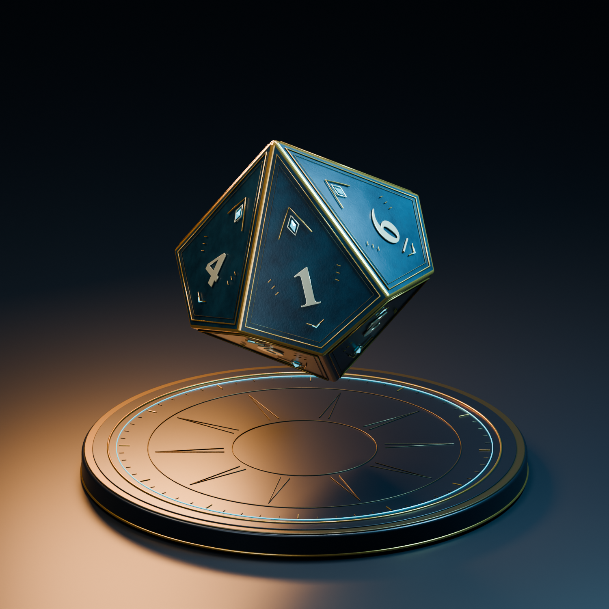

# NOCTILUCA · 夜辉 D10

原创跑团十面骰子：深蓝黑曜石珐琅、古金双线镶边、铂金数字、冰蓝菱形符印，配独立星盘展示台。

## 文件与使用

| 文件 | 内容 |
| --- | --- |
| [noctiluca-d10.blend](noctiluca-d10.blend) | Blender 5.2 可编辑工程，材质、纹理和字体已打包 |
| [noctiluca-d10.glb](noctiluca-d10.glb) | 单独骰子，单网格、5 个材质组、64,304 三角形，内嵌颜色贴图 |
| [hero.png](hero.png) / [reverse.png](reverse.png) | 1500 × 1500 的两种角度实渲图 |
| [enamel-basecolor.png](enamel-basecolor.png) | 珐琅颜色纹理，GLB 中也已嵌入 |
| [validation.json](validation.json) | 几何及导出回读检查结果 |

默认场景是 `NOCTILUCA | D10 Atelier`。选择 `D10 | Rotate this control` 可整体移动和旋转骰子；`DICE`、`STUDIO`、`LIGHTING` 集合分别管理模型、展示台与灯光。GLB 只含骰子，已转换为 glTF 的米制单位。Blender 工程额外保留程序化微小凹凸细节。

骰体为五角偏方面体：12 个顶点、20 条边、10 个全等且共面的风筝形面。编号为 0–9，对面数字和为 9，6 和 9 有下划线。普通 D10 检定将 0 读作 10。基准尖端间距 27 mm，倒角后实测约 26.44 mm。

已检查闭合、凸性、面共面性、边长和对角线全等性，并将 GLB 重新导入核验尺寸和外观。当前是数字模型，尚未进行实体打印、配重和投掷公平性验证。此批次仅交付资产，尚未接入游戏的骰子组件。

## 重建

在尚未加载本模型的新 Blender 文件中，先执行同目录的 `build_d10.py`，再执行 `finalize_d10.py`。脚本输出到自身目录，无需安装 MCP；会新建独立场景、保存工程、烘焙颜色纹理、导出 GLB，并渲染 `reverse.png`。首角度图片可在完成 `build_d10.py` 后按 F12 渲染并保存。

建模脚本在 Windows 上使用 Times New Roman Bold；其他系统缺少该字体时回落到 Blender 内置字体，数字外观可能不同。现有 `.blend` 已打包字体，`.glb` 的数字已转为网格，直接使用交付模型不依赖系统字体。

本机 MCP 配置、安装记录和调试日志不随资产分发。
