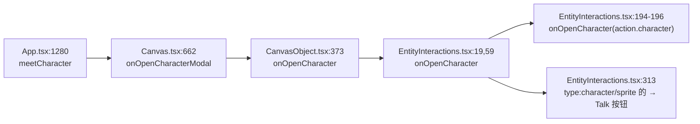

# 05 — 可玩性与关系系统

> 批次：`docs/2026-09-15-exp-mingyue/`。本文遵守 `00-共同上下文.md` 冻结契约，**不改动它**；冲突写进 §11。
> 本文 owner 的范围：`kind: 'character'` 动作的**端到端接线设计**、**关系推进判据**、**小苍兰节奏的机制设计**。
> **本文不写世界文件、不写角色目录、不写 preset、不写记忆库**——那些是 01–04 的活。本文只设计机制，不写 README 正文。
> 所有 code citation 的形态为 `path:line`，行号取自 2026-09-15 的工作树（该树有在途修改，见 §11 C-5）。

---

## 1. 一句话定位

**`templates/exp` 今天不能玩，根因不是内容不够，而是它一个 `kind: 'character'` 都没有——「探索 → 互动 → 回应 → 关系变化」这半圈里，后半圈的三跳全部断线。** 本文把这条链路逐跳接死（声明 → 校验 → WS/HTTP → 前端对话），并回答「对话结束后关系怎么体现」——**在不新增任何状态命名空间的前提下**，用**世界事件**作玩家可见载体、**角色记忆库**作角色内心载体，两条路各自写什么写死在 §4 的对照表里。

---

## 2. 签名 / 参数 / 输入输出形状

### 2.1 声明侧（世界文件里写的东西；**04 落盘，本文只定义形状**）

`choice_actions.<optionId>`，闭合集合的一个成员（`apps/server/src/engine/declared-actions.ts:20-25`）：

```yaml
choice_actions:
  action-2:
    kind: character
    character: mingyue         # MUST 匹配 /^[a-z0-9-]+$/ 且存在于 manifest.characters
```

**载体约束（硬，来自 `AGENTS.md:46` + 工作树实测）**：这条声明 MUST 落在**会被 `EntityInteractions` 渲染的实体**上——即**门卡**或**场内实体**（chalk / note / component）。**MUST NOT** 落在「玩家所在这个房间自己的 `README.md`」上，理由见 §9 D-2。

### 2.2 解析后的形状（`declared-actions.ts` 的 `Recipe`）

```ts
| { kind: 'character'; character: string }        // declared-actions.ts:23
```

### 2.3 校验（`parseRecipe`）

```ts
if (kind === 'character' && typeof recipe.character === 'string' && /^[a-z0-9-]+$/.test(recipe.character)) {
  return { kind: 'character', character: recipe.character };      // declared-actions.ts:143-145
}
```

- 非法 `character`（空串 / 大写 / 下划线 / 带路径分隔符）→ 掉到 `:152` 的 `fail('Unknown or invalid declared action')`；HTTP 层是 `invalid_argument`（`routes/world.ts:1404-1430` 的 `/choice` → `worldWrite` 包装）。
- 格式合法但**未登记** → `declared-actions.ts:275-277` 抛 `Character is unavailable`。

### 2.4 前端消费的形状（`DeclaredResponse`）

`runDeclaredChoice` 把 recipe 与 `source` / `choice` / `revision` / `items` / `missing` 一起塞进 `details.action`（`declared-actions.ts:303-310`），并在 HTTP 层补一个 `world` 字段（`routes/world.ts:1417`）。前端 `EntityInteractions.tsx:47-58` 的 `declaredActionOf` 用**白名单**校验这个形状：`kind ∈ {read,take,stage,enter,character,reply,writer}`（`:50`）且 `source`/`choice`/`revision` 存在、`items`/`missing` 是数组；`stage` 另须 `slots` 是数组（`:56`）。**任一不满足 → 返回 `null` → 静默不动作**（`:239-240`）——这是 §7 E-3。

---

## 3. 行为契约·逐步（每一步都写「漏了会怎样」）

### 3.1 端到端链路（7 跳，全部 `file:line`）

```mermaid
sequenceDiagram
    participant W as 世界文件 (门卡/场内实体)
    participant E as EntityInteractions (画布)
    participant R as POST /api/choice
    participant D as declared-actions.ts
    participant H as App/CharacterModal
    participant S as WS: character_start/prompt/stop
    W->>E: frontmatter.choice_actions.action-2
    E->>R: airpGateway.choose(path, choice)
    R->>D: runDeclaredChoice(player)
    D->>D: parseRecipe → 格式校验 (:143) + 登记校验 (:275)
    D-->>E: details.action = {kind:'character', character:'mingyue', ...}
    E->>H: onOpenCharacter(character) (:194-196)
    H->>S: character_start → spawn (:1080-1084; index.ts:348)
    H->>S: character_prompt (每句输入)
    H->>S: character_stop → character_talked (:1146; index.ts:392)
```

| # | 跳 | `file:line` | 漏了会怎样 |
|---|---|---|---|
| 1 | 卡面渲染 choice 按钮组 | `EntityInteractions.tsx:302`（`renderFrontmatterWidgets`，门卡与普通卡走同一套） | 玩家看不到按钮 → 声明等于不存在（这是今天 exp 的状态） |
| 2 | 点击 → 走声明动作通路 | `EntityInteractions.tsx:244-253` `choose()` → `:228-242` `executeDeclaredChoice` → `:231-237` `runGatewayAction('choice', …)` | 见 §6.1：**若走 `App.tsx:1144` 的 `runChoice` 就断**（它丢弃响应） |
| 3 | 动作反馈 coordinator → HTTP | `EntityInteractions.tsx:167-169` → `App.tsx:293-311` 的 `actionRequestResolver`（`verb==='choice'` 分支 `:299-302`） | 请求不到服务端，按钮点了没反应 |
| 4 | 服务端路由 | `routes/world.ts:1404-1430`（`router.post('/choice')`）→ `:1415` `runDeclaredChoice` | 400/404，前端报 `invalid_argument` |
| 5 | 解析 + 两重校验 | `declared-actions.ts:143-145`（格式）、`:275-277`（登记） | 未登记 → `Character is unavailable`，玩家读到英文报错 |
| 6 | 回到前端 → 打开对话 | `declared-actions.ts:311-314` 回包 → `EntityInteractions.tsx:239` `declaredActionOf` → `:194-196` → `onOpenCharacter` | `declaredActionOf` 校验不过 → `return null` → **按钮点了什么都没发生，且无报错**（E-3） |
| 7 | 打开对话（含「先走到那个场景」） | `CanvasObject.tsx:373` 把 `onOpenCharacterModal` 传给 `EntityInteractions`；`App.tsx:1280` 把该 prop 接到 `meetCharacter`；`Canvas.tsx:662` 透传 | 少了 `Canvas.tsx:662` 这一跳 prop 就永远不到达（prop drilling 全景见 §6.2） |

**角色的生命周期四跳（对话本身）**：

| # | 跳 | `file:line` | 漏了会怎样 |
|---|---|---|---|
| 8 | `meetCharacter`：在别处就先走过去 | `App.tsx:1116-1121` | 玩家在 A 房间点「和 B 房间的明月说话」→ 对话以**错的场景上下文**打开 |
| 9 | `openCharacter`：占位 + 发 `character_start` | `App.tsx:1084` 起（`character_start` 在 `:1102-1106`） | 服务端不 spawn → 角色永不回答（`connection-test.ts:8` 的注释正是这个故障） |
| 10 | 服务端 spawn | `apps/server/src/index.ts:348-368` → `lifecycle.ts:215-236` `startCharacter` → `launch.ts:177-213` `characterLaunch` | 见 §7 E-1（未登记直接抛） |
| 11 | 每句输入 → `character_prompt` | `CharacterModal.tsx:877` `onSendMessage` → `App.tsx:1570` | 没有这一跳对话是只读的 |
| 12 | 关遮罩 → `character_stop` → **落 `character_talked`** | `App.tsx:1168` → `apps/server/src/index.ts:392-431`（`noteCharacterTalked` 在 `:403-407`） | **关系事件不落 → 整个关系系统没有数据源**（§4 的载体全靠它） |

### 3.2 「先走过去再说话」的机制细节（跳 8）

`meetCharacter` 只在 `view?.state === 'elsewhere'` 时先 `navigateToCharacter(id)`（`App.tsx:1118`）。`elsewhere` 来自 `/api/characters` 的 `presence` 字段（`routes/world.ts:1194`；三种态由 `docs/presence/00 §3.2` 定义）。**明月的初始 presence 由 `home` 决定**：`initial-presence.ts:20-23` + `:48-58` 遍历 `manifest.characters` 建初始行，`home` MUST 是真实存在的层（`resolveHome`）。**契约 §2.1 冻结的 `home` = `world/stellar-cloud-campus/tower-bc/frontier-lab`，该目录存在（工作树实测）** → 明月初始就在实验室层，玩家从 602 出发时 `meetCharacter` 会先把他带过去。

### 3.3 关系推进判据（对话结束后发生什么）

**硬约束**：不得新增状态命名空间（`AGENTS.md:29` 禁 `get_state`/`set_state`/`state_update`/`watch_state` 及同类）。

**判据不是「某次对话发生了」，而是「某条事件落了 + 某个可读文件变了」。** 分三层：

| 层 | 判据（机械可核验） | 谁读 | 玩家可见？ |
|---|---|---|---|
| **发生层** | 历史库有一行 `character_talked{character:'mingyue', name:'明月', turns:n}` | 作家（注入）、前端（toast） | 部分（见 §4.2） |
| **内容层** | 承诺 / 态度写在 **chalk 正文**或角色对话里（`docs/hooks/04:215`：「事件表记『发生过』，不记『约定了什么』」） | 作家 + 角色（各自的 transcript 摘要） | 是（chalk 是画布实体） |
| **内心层** | 明月自己的记忆库节点（她 `memorize` 写） | **只有明月**（`awaken`/`recent` slot 在 preset `03`） | **否**（§4.2） |

**「关系变了」的判据因此是**：**不是**一个数值或标志位，而是**一条可读的痕迹**——最硬的一条是**明月在 `characters/mingyue/` 下新增/追加一张 chalk**（她能写自己的 nook：`actor.ts:123` 的 `isLifeTraceMutation` 允许 `actor.type==='character'` 且 `agentScope==='character'` 且 `actor.id===characterId` 对自己 nook 做 `write`/`edit`）。这张卡在 `/api/nook` 里可见（`routes/world.ts:702-730`，`nookCardPaths` 取直接子级 `.md` 且**排除四个 root 配置**，`rules/characters.ts:90-98` + `:62-80`）。

**为什么这条路不违反 `AGENTS.md §2`**（逐条论证）：

1. `AGENTS.md:29` 禁的是**新增状态命名空间**（`get_state`/`set_state` 一类**跨实体、跨轮次的可查询状态机**，见 §4.4 的判定表）。我们**一个都不新增**：没有新表、没有新 tool、没有新 frontmatter 键。
2. `AGENTS.md:32` 明说 `status.data`/`choice`/`roll_dice` 是**实体文件的 frontmatter，不是独立状态系统**。本文**不扩展**它们中的任何一个（§4.4 的 G-2 说明了为什么连 `status.data` 都不用）。
3. 事件表的**类型枚举是闭合的十五类**（`packages/shared/src/schemas/events.ts:9-25`），`character_talked` **已在其中**（`:16`，detail 形状 `:67-71`）。我们**不新增事件类型**——只消费已有的那一类。
4. 记忆库是 pi-rp 的**既有子系统**（`vendor/pi-rp/packages/memory/`），`memorize`/`revise` 是既有工具（`tools.ts:1042-1047`），不是本批发明的命名空间。

→ **结论：本文的关系持久化不新增任何命名空间；它只是把已经存在的三类载体（事件 / 文件 / 记忆库）明确分工。** 这正是 §4 对照表存在的理由：**分工写死，才不会有两条路径争写同一件事。**

### 3.4 小苍兰节奏的机制设计

**冻结契约 §3.4 的两条**：第一次触发在 **9/4**；**任何角色都不得向玩家解释小苍兰的含义**（含明月）。

#### 3.4.1 「不得解释」怎么在机制上写死（不靠提示词自觉）

提示词自觉不是机制。**机制**是：**让「解释」这件事在物理上没有一个合法的写入落点。** 具体三层：

**（a）玩家侧无「花香」实体 —— 无法被 `look_at` 到、无法被点到。**

工作树实测：`templates/exp/world` 全目录**零个**物件把「小苍兰/白兰花」写进自己的正文（`grep -rn "小苍兰\|freesia\|白兰" templates/exp/world` 只命中 `unit-602/bedroom/README.md:38`、`unit-602/balcony/washing-machine.md:19`、`unit-602/balcony/README.md:38` 三处**洗衣液香味**的描写——那是玩家家的气味源，不是「含义」）。玩家**没有**任何可交互对象叫「小苍兰」。→ **没有落点，就没有解释可以写进去。**

**（b）唯一持有含义的节点在埃利亚斯的记忆库里，而玩家侧读不到它。**

| 事实 | 位置 | 玩家可读？ |
|---|---|---|
| `core://observations/freesia_2007`（importance 9）：「小苍兰香——工业香精模拟的复合花香……与真实的白兰花香气有相似之处」 | `characters/elias/.pi/memory.db` | **否**——记忆库不是世界文件，`GET /api/layer` 永远不返回它 |
| `core://events/white_orchid_2007`（importance 9） | 同上 | 否 |
| `core://events/childhood_trauma_2007`（importance 10） | 同上 | 否 |

`AWAKEN_URIS` 里这三个 URI 都在（`memory_kv` 的 `awaken_uris` 实测含 `core://observations/freesia_2007` / `core://events/childhood_trauma_2007` / `core://events/white_orchid_2007`）→ **它们是埃利亚斯每轮醒来就装载的觉知记忆**（`slots.ts:41-90` 的 `awaken` 渲染），所以他**必然**会反应。**但那条反应只在埃利亚斯的对话里，而玩家看不进记忆库。**

**（c）明月的「注意到」与「解释」被拆成两个不同的写入动作，且只有前者的落点存在。**

- 明月**可以**注意到：这是**一次 `memorize`**——写进**她自己的**记忆库，URI 建议 `core://observations/elias_freesia_reaction`（02 决定最终 URI）。记忆库**不是世界文件**，玩家读不到（§4.2）。
- 明月**不得**解释：解释要么落进**玩家可读的载体**（chalk / 世界文件 / 对话正文），要么落进**记忆库的内容**。**机制上的死锁是**：明月的对话是**玩家可读**的，所以「解释」若出现在对话里就**直接违规**；而「写进记忆库」这条**不产生任何玩家可见痕迹**（§4.2 的 F-2），所以它**不能充当玩家侧的线索**。
- **因此「她推理出正确答案」这件事即使发生在她的内心，也无法泄漏给玩家——除非作者把它写成一个 world event 或 chalk，而那两类写入需要 §4.4 的闸门显式允许，明月的权限**不覆盖**世界目录（§4.1 表）。

> **一句话**：**含义只存在于玩家读不到的两个地方（记忆库、埃利亚斯的对话），而玩家能读到的所有地方（世界文件、chalk、明月对玩家说的话）在契约里都被禁止承载它。机制上，解释没有出口。**

#### 3.4.2 还有一个机制闸门：明月写不了世界目录

明月是 `actor.type === 'character'`，`agentScope === 'character'`。在 `packages/shared/src/actions/actor.ts:108-128` 的 `isLifeTraceMutation` 里：

```ts
if (actor.type === 'character') return agentScope === 'character' && actor.id === characterId;   // :130
```

即**她只能改 `characters/mingyue/**` 自己 nook 内的内容**（`assertNookMutationAllowed`，`actor.ts:150-178`；`chalk.ts:489-501` 每个 chalk 写入前都过这道闸）。**她物理上无法把一行字写进 `world/**`。** 所以「明月点破小苍兰」若要泄漏给玩家，唯一的出口是**她自己的对话正文**——而对话不落盘、不进世界文件（`talk.ts:1-12`：一次遮罩关闭只落**一条** `character_talked`，**不落内容**）。**这就是机制上的写死。**

#### 3.4.3 触发节奏（机制层：谁在什么时候被允许做什么）

| 时间 | 事件 | 机制上的触发物 | 明月的权限 |
|---|---|---|---|
| **9/4（周五）** | 小苍兰第一次触发。埃利亚斯**放轻呼吸**。明月**注意到**。 | 04 的 `open-office/09-04-night-alarm.md`（故障把玩家牵进他的办公室或走廊）；玩家身上带香味（**玩家侧既有事实**，`knowledge/magnolia/characters/mingrui/简介.md`）。埃利亚斯的反应由**他自己的 preset + awaken 记忆**产生，**不需要新机制**。 | 明月**可以** `memorize` 一条「他今天闻到什么的时候停了一下」；**不得**在对话里给出因果。 |
| **9/5（周六）** | 兑现「空位保留，等周六」。玩家第一次意识到「这个人一直在等一件小事」。 | 04 的 `suite-1806/living-room/09-05-saturday.md`；镜像物件 `pothos-reforged.md`（埃利亚斯侧）已存在。 | 她**可能在场**，或**事后听玩家讲**（契约 §4）。两种情形她的权限相同：可以注意，不得解释。 |
| **9/5 之后** | 展开节奏（见下） | —— | —— |

**9/5 之后的展开（机制层，非剧本）**：本批**不**设计后续剧情的具体内容（那是后续批次）。机制上只冻结三条**能力边界**，防止后来者越界：

1. **解释权永远不开放**：即使玩家主动问明月「你知道那是什么味道吗」，`exp-play/SKILL.md §知识边界:20` 的规则（「角色只知道他亲眼见过、或被人告知过的事」）在她身上的落地是——**她见过的是「1806 窗台上摆过一盆白兰花，后来收起来了」**（契约 §3.1 的关键观察），**她不知道那意味着什么**。这是**事实与解释的分离**：她**可以**说出她看见的事实，**不可以**说出含义。
2. **揭示权只在埃利亚斯手里**：唯一的合法揭示路径是**埃利亚斯自己**在某次对话里说出来（他的记忆库 + preset 允许）。本文不设计那个时点。
3. **不新增引线**：小苍兰的**唯一**信息源是「玩家自带香味 ↔ 埃利亚斯记忆库」这一对。**不得**为了让玩家「有线索」而新增第二个气味实体或第二个知情者。

---

## 4. 文件与副作用清单（精确到路径）

### 4.1 一次「探索 → 互动 → 回应 → 关系变化」的完整副作用

以 9/3 玩家在 `frontier-lab` 门卡上点「找明月办手续」为例（**声明的最终落点由 04 决定**）：

| 步 | 触发者 | 写入 | 路径 / 表 |
|---|---|---|---|
| 1 | 玩家点按钮 | `choice_selected` 事件 | `.airpworld/history.db` 的 `events` 表（`choose.ts:152-163`） |
| 2 | 同一 HTTP 请求内 | `details.action` 回包（**不落盘**） | 内存 → 前端（`declared-actions.ts:311-314`） |
| 3 | 前端 | 打开 `CharacterModal`，发 `character_start` | 无盘写入；服务端 spawn 进程（`index.ts:348-362`） |
| 4 | 服务端 | 记 `characterOpenHighWater`（内存） | —— |
| 5 | 玩家每句话 | `character_prompt` → agent turn | 会话记录**不在**角色目录：`<worldRoot>/.airpworld/sessions/char-mingyue.jsonl`（`launch.ts:189-201`） |
| 6 | 明月说话时用工具 | 若 `chalk` → `<layer>/NN-<slug>.md`（**只能在她的 nook 内**，§3.4.2）+ `entity_created` 事件 | `characters/mingyue/*.md` + `events` 表 |
| 7 | 明月 `memorize` | 记忆节点 | `characters/mingyue/.pi/memory.db` 的 `nodes` 表（**不落 world event**） |
| 8 | 关遮罩 | `character_stop` → `noteCharacterTalked` | `events` 表新增一行 `character_talked`（`talk.ts:72-78`） |
| 9 | 关遮罩 | `settleTurnCursor('character:mingyue', {seq: 开时高水位})` | 游标表（`index.ts:417-430`） |
| 10 | 事件落库后 | 前端 tail reader 广播 `world_event` | WS（`event-bridge.ts:620-640`） |
| 11 | 前端 | `worldEventToastStore.ingest` + `forwardWorldEvent` 白名单 | 见 §4.2 |

### 4.2 **「哪些路径会写同一件事」的对照表（防双写）**

这是本文最重要的一张表。**本仓 C19 的教训**（`docs/command/00-共同上下文.md:793`）就是「两条路径都以为对方不管，结果一条把另一条打死」——所以**逐项对照两侧产出**：

| 同一件事 | 路径 A 写什么 | 路径 B 写什么 | **是否重叠** | 处置（写死） |
|---|---|---|---|---|
| **「玩家和明月聊过」** | `character_talked` 事件（`talk.ts:72`，`actor=player`，`subject=characters/mingyue/README.md`，`layer=null`） | 无第二条路径 | 否 | **只有 A。** 明月的记忆库**不**记「玩家来找过我」为事件——那是她的**内心** |
| **「明月记住了玩家说过的话」** | 记忆库节点（她 `memorize`） | transcript 摘要（`presets/character.json` 的 `hiddenOverrides.compaction`） | **是，但不同粒度** | **并存是设计而非事故**：记忆库是**她的结构化长期记忆**（可 `recall`），摘要只保住**当前会话**的上下文（`docs/hooks/04:215` 已登记「承诺只能靠 transcript 摘要保住」）。**不合并**——合并会丢能力（摘要无 URI 无法 `recall`） |
| **「明月对玩家说了什么」** | 会话记录 `.airpworld/sessions/char-mingyue.jsonl` | transcript 摘要 | 是（摘要=记录的压缩） | **A 是真相源，B 是派生物。** 禁止把摘要当真相回写（`docs/hooks/04` 的 compaction 契约已如此规定） |
| **「明月的态度变了」** | **无专门载体**（`events.ts` 十五类里没有「态度」；`character_talked` 只记 `turns`） | 记忆库节点 + 对话正文 | 否 | **不得新增事件类型**（枚举闭合，`events.ts:9-25`）。态度落**记忆库（内心）+ chalk（可读痕迹）**，见 §3.3 |
| **「明月在 nook 里留了一张卡」** | `chalk` action → 写文件 + `entity_created`（`chalk.ts:549-557`） | 原生 `write`/`edit` → `entity_created`/`entity_edited`（`world-context.ts:470-472`） | **是——这是唯一的真危险** | **见 §4.3 的闸门：两条路互斥**，靠 `AGENTS.md:30` 的「两份名单必须互斥」纪律 |

**三条推论（写死）**：

- **F-1**：`character_talked` 的**唯一**写者是 `apps/server/src/index.ts:403-407`（经 `noteCharacterTalked`）。**任何其他调用者都是双写**——`docs/command/04-效果原语集.md:1126` 已把 `noteCharacterTalked` 列入**拒绝**名单（「一条命令没有资格声称『我刚刚和角色谈过』」）。**本批不推翻这条。**
- **F-2**：**记忆库永不产生 world event**（下文括注）。→ 因此**记忆库不能作为玩家可见反馈**。**已由主 agent 2026-09-15 裁决采纳**（证据：`declared-actions.ts` 零命中 `memorize|memory`；`world-event-toast.ts:6-16` 十类无记忆类；`useWorld.ts:615-628` 转发白名单六类无记忆类）。
- **F-3**：**关系推进不得同时写「事件」和「文件」来表达同一件事**。要么它是一条事件（`character_talked`），要么它是一个文件的变化（新 chalk）。**两者都写 = 双写**，因为前端会**同时**收到 `world_event` 与 `file_changed`（`event-bridge.ts:735-740`），画布会为同一件事刷两次。

### 4.3 chalk 写入的两条路与互斥闸门

| 写入者 | 路径 | 落事件 | 何时用 |
|---|---|---|---|
| 明月（角色 agent）用 `chalk` 工具 | `extensions/toolkit/chalk.ts` → `chalk.ts:489-501` 过 nook 闸 → `chalk.ts:549-557` 落 `entity_created` | **是** | 明月的**主要**写入方式（她**只能**写自己 nook） |
| 明月用原生 `write`/`edit` | `extensions/world-context.ts:333-419` → `:470-472` 落事件 | **是** | **同一件事的第二条路**——两条都落 `entity_created`，**若同一笔写被两条路各记一次就是双写** |

`AGENTS.md:30` 的纪律原文：「动作工具如果已经通过动作层执行并落账，`tool_result` 只能兜原生 `write`/`edit`；两份名单必须互斥」。**现状核验**：`chalk` 是 AIRP 工具（`extensions/tools.ts:58`），走自己的事件（`chalk.ts:550`）；原生 `write` 走 `world-context.ts:471`。**两者互斥由「谁先分类」保证**（`world-context.ts:335` 只接 `write`/`edit`，非此二者立即 `return`）。→ **本批不改这条；本文只登记「明月的写入必须走 `chalk`，不要让她用原生 `write` 写 nook」**（03 用工具面表达；`presets/character.json:15-30` 是范本）。

### 4.4 为什么不新增命名空间（判定表）

| 候选方案 | 是什么 | 判为 | 理由 |
|---|---|---|---|
| **新 frontmatter 键**（如 `affinity: 3`） | 给某实体加一个数值 | **违规** | `AGENTS.md:32`：`status.data` 等是「实体文件的 frontmatter，**不是独立状态系统**」；**新造一个键来表达关系 = 造第二套状态真相** |
| **扩展 `status.data`** 在明月 README 上记关系 | 用**既有**键 | **可用但不用**（G-2） | 技术上不违规（`status` 是既有键，`frontmatter.ts:21-35`）。**但**：① 它要求读→改→写 README，而明月的 README 是**root 配置文件**（`characters.ts:62-80`），root 配置**只能经 `edit_character_config`**（`actor.ts:159-171`），**角色只能改自己的 `memory.md`**（`edit-character-config.ts:62-65`）→ **她改不了自己的 README**；② 数值型关系会诱导「刷好感度」的玩法，与契约 §2.0 的命题轴（她记的是**人**，不是数值）冲突。 |
| **新事件类型** | 加进 `WORLD_EVENT_TYPES` | **违规** | 枚举**闭合**（`events.ts:9-25` 注释明说「adding one requires BOTH a detail shape below AND a render template」）——本批的设计范围不含渲染模板 |
| **`get_state`/`set_state` 类工具** | —— | **明令禁止** | `AGENTS.md:29`；且 `presets/character.json:28-29` 与 `elias/preset.json` 的 `tools.deny` 已含它们——**双保险** |
| **✅ 世界事件**（既有 `character_talked`） | 发生层 | **采用** | 已在闭合枚举内；前端有既有消费（toast 十类含 `entity_*`，见 §4.2 F-2 的边界） |
| **✅ chalk / nook 文件** | 内容层 | **采用** | 文件即真相（`AGENTS.md:24`）；`/api/nook` 有既有读取端点 |
| **✅ 角色记忆库** | 内心层 | **采用** | pi-rp 既有子系统；**玩家不可见**（F-2），故只作内心 |

---

## 5. 落账 / 事件（若有）

| 事件 | 何时 | `actor` | `detail`（冻结形状） | `subject` | 出处 |
|---|---|---|---|---|---|
| `choice_selected` | 玩家点声明选项 | `player` | `{path, name, choice, index}` | 声明所在文件 | `events.ts:74-79`；写者 `choose.ts:152-163` |
| **`character_talked`** | **关角色遮罩时，一次一条** | `player` | `{character, name, turns}`；`turns ≥ 1` | `characters/mingyue/README.md` | `events.ts:67-71`；写者 `talk.ts:72-78` |
| `entity_created` / `entity_edited` | 明月写 chalk / 改 nook 文件 | `character` | `{path, name, kind}` | 文件路径 | `chalk.ts:549-557`；`world-context.ts:471-472` |

**`character_talked` 的两个已知缺口（登记，不修）**：

1. **`turns` 是估算值**。前端 `CharacterModal` 无消息计数器，`App.tsx:1168` 的 `character_stop` **不带 `turns`** → 服务端兜 `1` 并标 `turnsEstimated: true`（`index.ts:402-407`；`talk.ts:9-11` 注释；`docs/tools/REVIEW-评审报告.md:104-107` 的 M-8）。→ **本文据此不把 `turns` 当关系判据**（§3.3 用「是否聊过 + chalk 痕迹」，不用次数）。
2. **`character_talked` 不在前端 toast 的十类白名单里**（`world-event-toast.ts:6-16`），也不在 `forwardWorldEvent` 的六类转发白名单里（`useWorld.ts:617-626`）。→ **玩家不会为「聊过」收到 toast。** 这是 §10 U-3 的非空性断言的落点。

---

## 6. 前端 / WS 消费（若有）

### 6.1 两条**不同**的选项通路（易错，必须写死）

| 通路 | 入口 | 是否处理 `kind:'character'` | 证据 |
|---|---|---|---|
| **A. `EntityInteractions` 自己的通路** | `EntityInteractions.tsx:244-253` `choose()` → `:228-242` | **是**（`:194-196`） | 走 `useActionFeedback` coordinator（`:167-169`） |
| **B. `App.runChoice`** | `App.tsx:1144-1146` | **否——丢弃响应** | `void airpGateway.choose(...)`（`:1145`），**不读返回值** |

**结论**：`kind:'character'` 的声明**只能**通过通路 A 生效。通路 B 只用于 `BagItemDialog`（`App.tsx:1537`）。**若把 `runChoice` 当成声明动作通路去接线，按钮会静默无效**（这正是 `EntityInteractions.tsx:244-251` 注释里登记的「direct-API exception」的边界）。

### 6.2 prop 传递链（`onOpenCharacterModal` 的全景）



- 画布路径：`App.tsx:1280` → `Canvas.tsx:662` → `CanvasObject.tsx:373` → `EntityInteractions.tsx:194-196`。
- nook 路径：`App.tsx:1240-1243` → `NookView.tsx:742` → 内部 `handleOpenCharacterModal`（`NookView.tsx:228-238`，含「同一角色正在通话中」的闸）→ 同上。
- **角色栏路径**（第三条入口）：`CharacterRail` → `App.tsx:1434-1437` → `openCharacter`（**不经过 `meetCharacter`，不先走过去**）。

### 6.3 反馈：玩家怎么感知「关系变了」

| 载体 | 机制 | 玩家看到什么 |
|---|---|---|
| **新 chalk** | 明月写 chalk → `entity_created` → `world_event` → `useWorld.ts:732-759` 的 `deferReveal(fetchLayer)` → 画布重取 | 画布上**多一张卡** |
| **文件变化** | `fs.watch` → `event-bridge.ts:708-740` 的 `file_changed` → `useWorld.ts:725-731` | 已存在的卡**更新** |
| **角色回应本身** | `character_delta`/`character_message`/`character_idle` 帧（`event-bridge.ts:219-220`、`:298`）→ `CharacterModal` 的 typewriter | 对话里的字 |
| **toast** | `worldEventToastStore.ingest`（`useWorld.ts:740`）→ 十类白名单 | 短暂提示条 |
| **`character_talked`** | **不进 toast、不进转发白名单** | **无直接提示**（见 §5 缺口 2） |

→ **「关系变了」的可见载体因此必须落在「新 chalk / 文件变化」上**，不能依赖 `character_talked` 自己。这是 §10 U-3 断言的内容。

---

## 7. 错误边界（矩阵：情况 → 错误码 → 写入结果）

| # | 情况 | 错误码 | 写入结果 | 出处 |
|---|---|---|---|---|
| E-1 | `character` 未登记进 `world.json` | `Character is unavailable`（`invalid_argument`） | **零写入**（`parseRecipe` 通过后、`chooseOption` 之前就抛） | `declared-actions.ts:275-277` |
| E-2 | `character` 格式非法（大写/下划线/空） | `Unknown or invalid declared action` | 零写入 | `declared-actions.ts:143` → `:152` |
| E-3 | 回包形状不满足 `declaredActionOf` | **无错误码——静默 `return null`** | 服务端已落 `choice_selected`，前端**不动作** | `EntityInteractions.tsx:47-58`、`:239-240` |
| E-4 | 玩家点选项的**父文件**无法读 | `Entity not found: "<source>"` | 零写入 | `declared-actions.ts:253-257` |
| E-5 | 该 optionId 没有声明 | `The selected option has no declared action` | 零写入 | `declared-actions.ts:267` |
| E-6 | 选项此刻不可见（`when` 不满足） | `This action is not currently available` | 零写入 | `declared-actions.ts:264` |
| E-7 | 角色目录缺失 | spawn 抛 `Character "<id>" directory is unavailable` | 不 spawn；`error` 帧（`index.ts:367`） | `launch.ts:114-117` |
| E-8 | 角色**未在 manifest**（绕过 §2 走 WS 直开） | `Character "<id>" is not registered in this world` | 不 spawn | `launch.ts:111-113` |
| E-9 | 角色进程不在而收到 `character_prompt` | `Character agent "<id>" is not running` | 不发消息 | `index.ts:370-374` |
| E-10 | 明月试图写**别人**的 nook 或 `world/**` | `unsupported`：`… is not allowed to write character nook content` | 零写入（拒在工具执行**之前**） | `actor.ts:172-177`；`world-context.ts:389-392`（原生）；`chalk.ts:494-500`（chalk） |
| E-11 | 明月试图改自己的 root 配置（README 等） | `unsupported`：`… can only be changed through edit_character_config` | 零写入 | `actor.ts:159-171` |
| E-12 | 明月试图 `edit_character_config` 改自己的 `README.md` | `unsupported`：`A character may edit only its own memory.md` | 零写入 | `edit-character-config.ts:62-65` |
| E-13 | `noteCharacterTalked` 找不到角色 README | `not_found`：`No character …` | **不落 `character_talked`**（`index.ts:408-411` 捕获并 warn） | `talk.ts:45-52` |
| E-14 | 落 `character_talked` 失败 | 事件失败被**吞掉**（`console.warn`，`index.ts:410`） | 角色进程仍被停（「少一条事件好过泄漏一个进程」） | `index.ts:408-411` |

**E-3 是本文最危险的默认行为**（静默失败）：服务端认为成功了，前端什么都不做，玩家只看到按钮没反应。→ §10 U-2 把它变成可断言。

---

## 8. 代码落点（精确到文件与函数；新增符号标 `NEW`）

**本批不写实现代码**（冻结契约 §7.1）。以下落点全部是**已有**符号，本文只接线设计：

| 落点 | 文件:行 | 本次是否改动 |
|---|---|---|
| 声明 kind 集合 | `declared-actions.ts:20-25` | **不改** |
| `character` 格式校验 | `declared-actions.ts:143-145` | **不改** |
| `character` 登记校验 | `declared-actions.ts:275-277` | **不改** |
| `/choice` 路由 | `routes/world.ts:1404-1430` | **不改** |
| 前端 `declaredActionOf` 白名单 | `EntityInteractions.tsx:47-58` | **不改** |
| `kind:'character'` 分派 | `EntityInteractions.tsx:194-196` | **不改** |
| `meetCharacter` | `App.tsx:1116-1121` | **不改** |
| `character_stop` → `character_talked` | `index.ts:392-431` | **不改**（`turns` 计数器是既有登记缺口 M-8，非本批） |
| 初始 presence | `packages/shared/src/actions/initial-presence.ts:48-58` | **不改**（`04` 登记 manifest 后自动生效） |
| 角色 nook 权限 | `packages/shared/src/actions/actor.ts:108-178` | **不改** |

**`NEW`**：**本文不引入任何新符号。** 唯一「新增」是 **04 在世界文件里新增的 `choice_actions.<id>: {kind:'character', character:'mingyue'}` 声明**（数据，不是代码）与 01/02/03 新增的角色资产。

**这本身是一条设计结论**：`kind:'character'` 的机制**已经完整存在**（22 个模板在用，见 §9 D-1）。本批要补的**不是引擎能力，而是 exp 世界对它的使用**——这正是「99 个物件 / 0 个角色动作」这个诊断的意义。

---

## 9. 与现状的差异（「现状是 X」必带 `file:line`）

### D-1：exp 有 **0** 个 `kind: 'character'`（根因）

```
$ grep -rn "kind: character" templates/exp | wc -l
0
$ grep -rho 'kind: [a-z]*' templates/exp/world --include=*.md | sort | uniq -c
     76 kind: enter
     60 kind: read
      5 kind: writer
```

- **99 个 md**（`find templates/exp/world -name '*.md' | wc -l` = 99）、**33 个层**（`find -type d | wc -l`）、**33 个文件含 `choice_actions`**、**141 行 `kind:`**。
- **动作种类只有三种**：`enter` 76 / `read` 60 / `writer` 5。**`take` / `stage` / `reply` / `character` 全部为 0。**
- 对比：`grep -rn "kind: character" templates | wc -l` = **84**（跨 16 个模板，含 `-jp`/`-zh` 变体）。实例：`templates/wuwu/world/harbor-chart/workshop/01-opening.md:19`、`templates/first-snow/world/tonight-promises/amber-cafe/README.md:18`、同目录 `01-opening.md:15`、`templates/whitechapel/world/london-map/print-shop/README.md:19`。
- → **机制没问题，是世界没用它。** 这条是「不能玩」的**唯一根因**。

### D-2：层的自身 README **不是画布实体**（决定入口位置）

| 证据 | 内容 |
|---|---|
| `packages/shared/src/store/layers.ts:106-114` | `cardsOfLayer` 返回同目录 `.md` **but excludes its own README**（`:108`、`:111`） |
| `routes/world.ts:1053-1072` | 本层 README 作为 `scene` **单独返回**、从 `items` 剔除（`:1054-1056` 注释：「seating it again here would create one path with two incompatible positions」） |
| `apps/web/src/App.tsx:772-779` | 前端取 `readme = state.scene`（`:777`） |
| `apps/web/src/App.tsx:800` | `canvasItems` **过滤掉** `readme?.path` |
| `apps/web/src/App.tsx:1200` | `readme.body` **只在左侧 journal** 用 `MarkdownText` 渲染——**不调用 `renderFrontmatterWidgets`** |
| `grep -n renderFrontmatterWidgets apps/web/src/App.tsx` → **0 命中** | `App.tsx` 全文不含 widget 渲染 |
| 4 个真实调用点 | `BagItemDialog.tsx:98`、`DeclaredActionDialog.tsx:267`、`EntityInteractions.tsx:302`、`ChalkCard.tsx:71` |
| `AGENTS.md:46` | 「README 可作为 scene 返回，但不能恢复成独立的固定入场面板；旧 README-only 场景若需要可读正文或选项，**必须建立场内实体**」 |

> **可复现核验**：`grep -n renderFrontmatterWidgets apps/web/src/App.tsx` 返回 **0 命中**（`App.tsx` 全文不含 widget 渲染）；`grep -rn renderFrontmatterWidgets apps/web/src` 的 4 个命中全部是**实体内**（画布卡/背包/声明弹窗），**没有一处**渲染 `state.scene`。这两条一起证明：**本层 README 的 `choice` / `choice_actions` 在「站在该房间里」时零呈现。**

→ **`kind:'character'` 的声明 MUST 落在门卡或场内实体上。** 本条与 04 的裁定一致（04 的 5 个落点全部是场内 chalk 或父层门卡，见 §12 待办）。

### D-3：exp 有 **3 个死场景**（只有 README，却带「做什么」选项）

工作树实测：**`templates/exp/world` 下「直接子级 md 数 = 1 且存在 README」的目录共 13 个**；对每个目录解析本层 README 的 `choice_actions`，**恰好 3 个含非 `enter` 动作**：

```
templates/exp/world/stellar-cloud-campus/tower-bc/joint-innovation-lab  {action-1: writer, action-2: enter}
templates/exp/world/stellar-cloud-campus/riverside-park                 {action-1: writer, action-2: writer, action-3: enter}
templates/exp/world/stellar-cloud-campus/sunken-plaza                   {action-1: writer, action-2: writer, action-3: enter}
```

- 三者的「做什么」选项全部是 `kind: writer`（`joint-innovation-lab/README.md:15-17`、`riverside-park/README.md:18,21`、`sunken-plaza/README.md:18,21`）：**站在那个房间里，玩家看不到任何按钮**（README 不进 `items`，§9 D-2）。→ **进门后画布是空的**；出口（各自的末条 `enter`）存在，所以**回得去，但进门的净信息为负**。
- 其余 10 个「只有 README」的目录（`world`、`stellar-cloud-campus`、`tower-bc`、`frontier-lab`、`canteen`、`xinghui-plaza`、`jingge-apartment`、`suite-1806`、`zhonghe-old-street`、`unit-602`）**全部只有 `enter`**，是**合法门牌层**——门卡说明通向哪，玩家在父层就能点。
- **判据（写进 §10 U-6）**：一个层若在本层 README 里声明了**非 `enter` 类**动作（`read`/`writer`/`character`/`take`/`stage`/`reply`），**它就是死场景**。该判据可机械核验（§10 U-6 的脚本），**比点名目录更耐用**。
- **处置归 04**（它拥有世界文件）：出口留 README 可以，**「在此处做什么」MUST 有场内实体**。

> 更正说明：本文初稿据一次手写 grep 误判 `joint-innovation-lab` 为「纯门牌」——其 `action-1` 实为 `kind: writer`。上表由脚本重扫全 exp 得出，三个死场景与主 agent 独立体检结果一致。

### D-4：`CharacterModal` 已完整实现，但 exp 从未 spawn 过明月

`CharacterModal.tsx` 有 1060 行（完整 typewriter / 语音 / 通话 / 队列），`App.tsx:1547-1571` 完整挂载。**但 `grep -rn "mingyue" apps/server/src packages/shared/src apps/web/src` 只命中 4 处样式注释里的 `canvas-stack-mingyue.html`（原型名，与角色无关）**——**代码里没有任何 `mingyue`**。→ 本批**不改代码**，只需 04 登记 manifest + 01/02/03 造角色资产。

### D-5：`voice` / 记忆库 / preset 对本文无影响

`03` 定 `voice: playful-teasing`（已机械核验 `resolveVoice`/`resolveLiveVoice` 非 null）。本文只依赖 **`character` id = `mingyue`** 与 **`home` 是真实层** 两条。

---

## 10. 验收测试（含「没有这个改动就会失败」的非空性断言）

> 本批是设计批次，命令仅作**可机械核验的判据**登记，不在本批执行（冻结契约 §7.1）。

**U-1（非空性·核心）：`kind:'character'` 从 0 变非 0，且落点合法。**

```bash
# 失败条件（修前，已实测）：输出 0
grep -rn "kind: character" templates/exp | wc -l
```

- 断言：修后 **≥ 4**；且**每条命中文件的所在目录 ≠ 该文件的父目录 README 所指的层**（即它是门卡或场内 chalk，不是「该房间自己的 README」）。
- **没有这个改动就会失败**：修前该命令返回 **0**（实测），因为 exp 一个 `character` 动作都没有 → 玩家永远无法打开明月的对话 → 「互动 → 回应 → 关系变化」半圈**完全没有起点**。这是 §9 D-1 的直接推论。

**U-2：E-3 的静默失败可被检出（声明形状正确性）。**

- 断言：对每一条新的 `kind: character` 声明，`EntityInteractions.tsx:47-58` 的 `declaredActionOf` MUST 返回非 null。可机械核验：服务端返回的 `details.action` 必须含 `kind/source/choice/revision/items/missing` 六个字段（`declared-actions.ts:303-310` + `routes/world.ts:1417` 补 `world`）。
- 失败表现：客户端**无报错、无动作**。

**U-3（非空性·闭环）：关系推进必须产生玩家可感知载体。**

- 断言：一次完整的 9/3–9/5 试玩后，历史库 MUST 同时含
  1. ≥ 1 行 `character_talked{character:'mingyue'}`；
  2. ≥ 1 行 `entity_created` 且 `detail.path` 以 `characters/mingyue/` 开头（明月留下的 chalk）。
- **没有这个改动就会失败**：首条 `character_talked` 只有在「声明→对话→关遮罩」全链路接通后才可能出现（`index.ts:403`）；而 `character_talked` **不进 toast 也不进转发白名单**（§5 缺口 2、§6.3）→ 若**只有**第 1 条，玩家感知为零（这正是主 agent 要求补的「实现正确但无人看见 = 不存在」的变体）。**第 2 条是玩家可见性的唯一硬证据。**
- 可机械核验：`characters/mingyue/` 下新增的 `.md` MUST 出现在 `GET /api/nook?character=mingyue` 的 `items` 里（`nookCardPaths` 取直接子级 `.md`，`rules/characters.ts:90-98`）。

**U-4：小苍兰边界在机制上不可越。**

```bash
# 玩家侧不存在任何「含义」落点：预期 0 命中（实测 = 0）
grep -rniE "小苍兰|freesia|白兰|magnolia|卢卡斯|lucas" templates/exp/world | grep -vE "洗衣液|洗衣|香型" 
```

- 断言：上述过滤后为 **0**。`unit-602` 的三处洗衣液描写（`bedroom/README.md:38`、`balcony/washing-machine.md:19`、`balcony/README.md:38`）是**气味源**，不含含义，故被 `grep -v` 排除。
- 断言 2：明月对玩家的对话**不得**出现「小苍兰 / 白兰」+ 因果词（「因为 / 所以 / 意味着 / 那盆花 / 卢卡斯」）的同现。可核验：会话记录 `char-mingyue.jsonl` 的文本审查。
- 断言 3（机制层）：明月的写入**物理上不可能**触达 `world/**`——`actor.ts:123` 的 `isLifeTraceMutation` 只放行 `characters/mingyue/**`。

**U-5：不新增状态命名空间（回归门）。**

```bash
# 基线（工作树实测）**不是 0，是 1**：唯一命中是 packages/shared/src/protocol/ws.ts:55
# 的 JSDoc 注释「No `get_state`/`set_state`/`watch_state` — banned by …」——那是
# **禁止声明本身**，不是实现。排除注释行后应为 0：
grep -rn "get_state\|set_state\|state_update\|watch_state" packages/shared/src apps/server/src extensions \
  | grep -v "deny\|__tests__\|test/"
# ↑ 修前 = 1（ws.ts:55 注释）；去掉注释行后 = 0
grep -rn "get_state\|set_state\|state_update\|watch_state" packages/shared/src apps/server/src extensions \
  | grep -v "deny\|__tests__\|test/" | grep -v 'banned by'
```

- 断言：**第二条命令** MUST 为 0。第一条命令的量不是判据（注释行恒存在），这一点写死，避免后来者把注释当违规、或把「1」当回归。
- 另断言：`templates/exp/characters/mingyue/preset.json` 的 `tools.deny` MUST 含 `get_state` 与 `state_update`（`elias/preset.json` 与 `presets/character.json:28-29` 是范本）。

**U-6：死场景归零（04 的活，本文登记判据）。**

- 断言：**无任何层 README 声明非 `enter` 类动作**。核验脚本（对每个目录解析本层 README 的 `choice_actions`，若「直接子级 md 只有 README」且存在非 `enter` 动作则为违例）：

  ```bash
  # 逐目录解析本层 README 的 choice_actions，列出非 enter 的 optionId。
  # 刻意不含正则转义（\s 等）：本仓 shell 包装会改写反斜杠序列。
  python3 - <<'PY'
  import os
  root = 'templates/exp/world'
  bad = []
  for d, _, files in os.walk(root):
      mds = [f for f in files if f.endswith('.md')]
      if len(mds) != 1 or 'README.md' not in mds:
          continue
      kinds, cur, inside = {}, None, False
      for line in open(os.path.join(d, 'README.md'), encoding='utf-8'):
          s = line.rstrip()
          if s == 'choice_actions:':
              inside = True
              continue
          if inside:
              if s and not s[0].isspace():
                  break
              t = s.strip()
              if t.endswith(':') and all(c.isalnum() or c in '-_' for c in t[:-1]):
                  cur = t[:-1]
                  continue
              if t.startswith('kind:') and cur:
                  kinds[cur] = t[5:].strip()
      non = {k: v for k, v in kinds.items() if v != 'enter'}
      if non:
          bad.append((d, non))
  for d, non in bad:
      print('DEAD', d, non)
  PY
  ```

- **修前实测输出恰好 3 行**（与主 agent 独立体检一致）：`joint-innovation-lab`、`riverside-park`、`sunken-plaza`（§9 D-3）。
- **修后 MUST 为空**。若某处只是想保留出口，那是 `enter`，不触发本判据。

---

## 11. 发现的冲突

**C-1（两条旧文档口径已过期）**：`docs/tools/12-工具注册与路由统一.md:267` 记录「前端根本不发 `character_stop`」——**该陈述已过期**：`App.tsx:1168` 已发（`closeCharacter`），`index.ts:392` 已接。→ 建议 `docs/tools/12` 复核行号（`docs/hooks/03:514` 已更新为「均已落地」）。

**C-2（`turns` 缺口在两份文档里口径不一）**：`docs/tools/12:267` 的裁决 M-8 要求「① 前端在 `CharacterModal` 加消息计数…**这是前端任务**」；`docs/tools/REVIEW-评审报告.md:104-107` 登记为未生产者。**工作树实测：`CharacterModal.tsx` 无消息计数器，`App.tsx:1168` 不带 `turns`。** → 缺口仍开放。**本文的处置：不把 `turns` 当关系判据**（§3.3），规避之，不进 §12 阻塞项。

**C-3（`world_event` 白名单不含 `character_talked`，与「关系变化要可见」的期望冲突）**：`useWorld.ts:617-626` 只转发六类，`world-event-toast.ts:6-16` 只收十类，两者都**不含** `character_talked`。→ 这是既有设计（不该为「聊过」弹 toast），**不是 bug**；但**本批的关系可玩性会因此更依赖 chalk**。**建议**：不改白名单；在本文 §6.3 / U-3 里写死「可见载体 = chalk」。

**C-4（`feedback.ts` 与 E-3）**：`EntityInteractions.tsx:47-58` 的静默 `null` 是**故意的 fail-safe**（形状不明 → 不动作）。→ 与「玩家需要知道为什么按钮没反应」冲突。**建议**：本批**不改**（改动超出范围），但在 §10 U-2 留检测口。

**C-5（行号时效性——本文已按最新工作树校准）**：工作树有在途修改（`git status`：`apps/server/src/routes/world.ts`、`packages/shared/src/rules/characters.ts`、`packages/shared/src/store/{world-store,local-store}.ts`、`packages/shared/src/actions/canvas.ts`、`apps/web/src/App.tsx`、`apps/web/src/components/nook/NookView.tsx` 等）。**`App.tsx` 在本文写作期间被 N2 批次追加了 24 行、`routes/world.ts` 亦被追加**，本文所有 `App.tsx` / `routes/world.ts` 行号**已按最终工作树重新校准**（发现并修正了 18 处偏移）。→ **实现前仍须 `grep -n` 刷新一次**，因为同批还有代理在改这两个文件。

**C-6（`home` 与「她在此工作」的一致性）**：契约 §2.1 冻结 `home = world/stellar-cloud-campus/tower-bc/frontier-lab`（与 `elias` 同层）。**但这与 04 的「方案 B：新增 `admin-corner/` 子层」并存时要注意**：`home` 不必等于 `admin-corner`——初始 presence 落在 `frontier-lab` 是合法的（她确实是实验室行政）。**本文不主张改 `home`。** 若 04 希望她初始就在 `admin-corner`，那需要单独裁决（`initial-presence.ts:48-58` 只认 `home`）。

**C-7（无冲突的确认）**：契约 §2.4 说「`choice_actions` 与 `on.choice_selected` 互斥」——与本文无冲突（`bindings.ts:347-352`）。契约 §2.1 的 `voice` / `dbPath` 与本文无冲突。

---

## 12. 仍未知 / 待拍板

| # | 问题 | 归属 | 本文的默认口径（若无人接管） |
|---|---|---|---|
| 1 | `choice_actions` 里 `character: mingyue` 的**具体声明落点**（哪几个文件的哪几个 optionId） | **04**（已定 5 处，见其回执） | 本文给判据（§3.1 跳 1、§9 D-2、U-1），不指定文件 |
| 2 | 明月的记忆库节点 URI 命名（如 `core://observations/elias_freesia_reaction`） | **02** | 本文只要求「小苍兰观察 MUST 落在她的库里、MUST NOT 是个世界文件」 |
| 3 | 明月是否在 9/3 首次对话里就 `memorize` 玩家（建立初始关系） | **01 + 03** | 本文只声明机制允许（§4.1 步 7） |
| 4 | 关系变化是否需要一个**玩家可读的显式痕迹**（如明月追加一段日记到她的 nook） | **01**（内容） + **03**（提示词是否指示她这么做） | **本文倾向「是」**（U-3 需要它）；但这是内容决策 |
| 5 | `turns` 计数器（M-8）是否本批补 | **不在本批**（C-2） | 不补；本文不依赖它 |
| 6 | `character_talked` 是否加入 toast/转发白名单 | **不在本批**（C-3） | 不加；反馈走 chalk |
| 7 | `riverside-park` / `sunken-plaza` / `joint-innovation-lab` 三个死场景的处置（补场内实体 or 降级为纯门牌） | **04** | 本文只登记（§9 D-3、U-6） |
| 8 | 9/5 之后小苍兰的展开**具体内容** | **后续批次**（不在本批） | 本文只冻结三条能力边界（§3.4.3） |
| 9 | 明月是否需要在 `preset.json` 里被显式**允许**写自己的 nook（`chalk` 工具在不在她的工具面里） | **03** | 机制上必须允许：`actor.ts:123` 是**权限**层，但**工具是否在她的 face 里**由 preset 决定。若 `tools.deny` 覆盖掉 `chalk`，U-3 第 2 条会失败 |
| 10 | `world/README.md`（阳都总览，`type: readme`，带 4 个 `enter` 选项）是否属于 D-3 的「合法门牌层」 | **04** | **是**——它全部是 `enter`（出口类），符合「出口留 README 可以」 |
