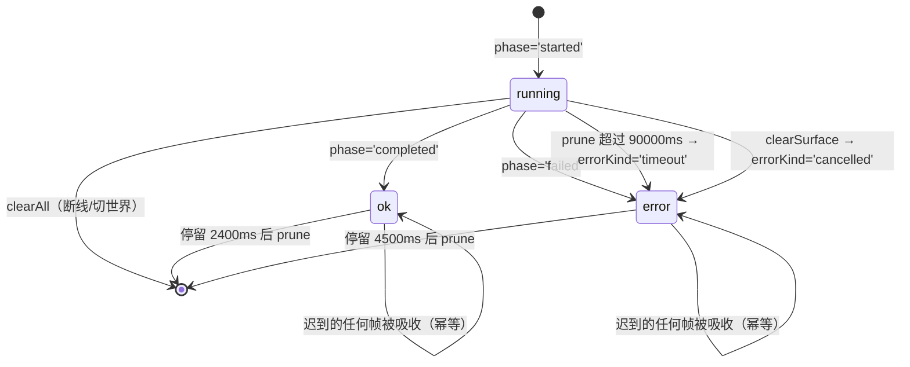

# docs/agent-awareness/03 — 前端感知演出设计

> 服从 [`00-共同上下文.md`](./00-共同上下文.md)（下称「共同契约」）冻结的 `source` / `agentId` / `turnId` / `activityId` / `phase` / `operation` / `subject` 帧形状、§3.2 的四个常量与上限、§5 的 TTS 清洗唯一来源、§7 的 surface 与边界。**本篇不新增第二种 WS 帧，不改帧字段，不做服务端投影**（那是 `02`），不定义 TTS 清洗规则（那是 `01`），不定义测试与回写总表（那是 `04`）。
> 日期：2026-09-13。状态：设计冻结稿，未进实现。
> **UX 批次接缝回写（2026-09-13）：** activity rail 可以继续作为弱提示呈现，但不得拥有 writer busy、phase、stop 或 completion 事实。writer progress 与 activity rail 的展示可并存，唯一状态源是 `docs/ux/03-Chrome与公开状态.md` 的 `WriterPublicState`；本文的 `writerToolsInFlight` 现状引用视为迁移前证据，实施时改读 `phase/toolCount` 派生值。

---

## 1. 一句话定位

把 `agent_activity` 帧在前端变成**两条互不串台的弱提示带**：writer / functional 的动作落到场景外壳下沿的全局 activity rail，角色的动作落到 `CharacterModal` 对话纸上沿的角色 rail；胶囊按开始时间堆叠、最多 3 个可见、terminal 停留 2.4s / 4.5s 后消散、running 90s 无终结转超时失败，**不做 chat history、不朗读、不遮挡输入框与 Chalk**。

### 1.1 本篇不负责

| 不负责 | 归谁 |
|---|---|
| `operation` 白名单归一化、`subject` 裁剪、`error` 摘要、`ActivityProjector` | `02-作家与功能Agent活动设计.md` |
| `agent_activity` 的发射时机、turn/timeout/cancel 的 terminal 生成 | `02` + `apps/server/src/engine/{lifecycle,event-bridge}.ts` |
| 角色 turn 聚合与页面序列（胶囊不是台词） | `01-角色多消息与TTS清洗设计.md` |
| `sanitiseTtsText` 的实现与异常括号语义 | `01` + `packages/shared/src/rules/tts-text.ts` |
| 测试矩阵、门禁、回写总表 | `04-测试与文档回写设计.md`（本篇只列**本篇必须落**的断言与回写项） |
| writer 的 `agent_progress` 生命周期 UI（"作家正在续写…"、停止按钮） | 现状 `App.tsx`，本篇**不替换、不并存第二套** |

---

## 2. 现状事实（带 `file:line`）

### 2.1 消费端

- **现状证据（不可作为新实现 owner）**：`apps/web/src/state/useWorld.ts` 仍有 `tool_start` / `tool_end` 与 `writerToolsInFlight` 的旧 footprint 接缝；这只记录迁移前行为。UX03 落地后，writer busy、phase、stop、completion 统一从 `WriterPublicState.phase/toolCount/stopRequested/completionSeq` 投影，activity rail 不得读写 `writerToolsInFlight`。
- 重连路径的旧证据仍位于 `useWorld.ts`；实现时由 UX03 canonical projection 处理 writer 状态，由本篇的 activity store 处理胶囊状态，二者不得互相代替。WS 断线时分别清理对应 projection。
- 事件投递口径：`useWorld.ts` 只认 `case 'x'` 与 `X.type === 'x'` 字面量（`tools/check-ws-contract.mjs:132-142` 的 `consumedFrom`），消费文件白名单 `tools/check-ws-contract.mjs:48-53` 目前是 `useWorld.ts` + `App.tsx` 两个文件。
- 帧清单唯一真相源：`docs/tools/12-工具注册与路由统一.md §6.2`（`agent_activity` 尚未登记，见 §12 回写）。

### 2.2 现有底部演出面（全局，不可被胶囊遮挡）

| 元素 | 锚点 | 位置 |
|---|---|---|
| 底部 dock（作家输入） | `App.tsx:684-700`、`.prototype-dock` `prototype.css:460`、`scene-shell.css:113`，`.is-authoring` 才可见（`prototype.css:110`） | 居中，`bottom:100px`，≤700px 时 `bottom:163px`（`scene-shell.css:170`） |
| "你在做什么" action toggle | `App.tsx:678`、`scene-shell.css:112` | 右，`right:100px; bottom:28px`；≤700px `right:77px; bottom:24px` |
| 停止续写 | `App.tsx:680-682`、`scene-shell.css:185-186` | 右，`right:24px; bottom:82px`，`z-120` |
| 人物手牌 | `App.tsx:619-634`、`scene-shell.css:88` | 左，`left:280px; bottom:29px`，`min-height:48px` → 上沿约 77px |
| toast | `App.tsx:757`、`prototype.css:682-700` | 居中，`bottom:10px`，`z-100` |
| writer 回执 | `WriterResult.tsx`、`scene-shell.css:182-184` | 右上 world-meta 内，3 行截断，7s 自淡 |

### 2.3 现有角色遮罩面

- `CharacterModal.tsx:711-800`：`.character-modal-layer`（`index.css:332-340`，`z-50`，全屏 `inset:0`）→ `.portrait-stage` → `.speech-paper`（`index.css:465-478`，`left:50%; bottom:5.5vh; width:min(720px,78vw); transform:translateX(-50%) rotate(-.4deg)`）。
- 纸内自上而下：`.name-plate`（`index.css:497-515`）→ `.narr-line`（`:517-525`）→ `.line-stage`（`:527-546`）→ `.advance-indicator`（`:585-606`）→ `.speech-input-row` / `.speech-input`（`:608-654`）。
- 关闭：`CharacterModal.tsx:462-466` `handleClose`（220ms 关闭动画后 `onClose()`）；`App.tsx:506-510` `closeCharacter`（发 `character_stop`、清 `activeCharacter`、恢复机位）。
- 角色帧归属过滤：既有 `App.tsx:245-257` 仍只负责 `CharacterFrame` 的 `characterId`；`agent_activity` 不走这条路由，角色 rail 由 `useAgentActivity('character-modal', \`character:${characterId}\`)` 按 agentId 过滤。
- **注意**：`agent_activity` 帧**没有** `characterId` 字段（共同契约 §3 冻结形状），角色的身份只能从 `agentId === 'character:<characterId>'` 得到（共同契约 §2.1）。这是 §6.2 归属过滤的关键差异，见 §13 冲突 5。

### 2.4 i18n 与文案

- `apps/web/src/lib/i18n.ts`：`translate(locale, key, values)`，英文即 key；`entry?.[locale] ?? key` —— **缺翻译会静默回退成英文 key**；`useLocale()` 返回 `{ locale, setLocale, t }`。
- `messages.json` 现有 109 条，key 是英文句子，值含 `zh-CN` / `ja`（例：`"The writer is working…"`、`"Taking shape…"`）。
- `tools/check-i18n.mjs`：只扫描 `t('<literal>')` 内的字面量；**动态 key（`t(someVariable)`）扫不到**（脚本头注明）。→ §8.4 的文案表必须由**测试**兜底，不能指望 `check:i18n`。
- 舞台指示既有文案：`CharacterModal.tsx:74-77` 的 `SILENCE_LINE`（en/ja 各一条，含括号）。

### 2.5 TTS 清洗的唯一来源（本篇只消费）

`prefetchVoice` 现状（`CharacterModal.tsx:255-289`）直接 `body: JSON.stringify({ text: page.text, voice, language })`（`:265-269`），服务端只做非空/长度校验（`apps/server/src/routes/tts.ts:246-275`）。共同契约 §5 冻结：唯一实现 `packages/shared/src/rules/tts-text.ts` 导出 `sanitiseTtsText(raw: string): string`（由 `packages/shared/src/index.ts` 转出，见 `01 §3.1`），前端与服务端 `import` **同一个**，**禁止**前端另存一份括号正则。

本篇的前端消费点只有一处，见 §9.2；清洗对 capsule **零影响**（胶囊永不调 TTS，契约 §5.4）。

---

## 3. 冻结接口与签名

### 3.1 帧映射（唯一来源，不复制第二份形状）

前端**直接**消费共同契约 §3 的字段，字段名与帧逐字一致，**不再经过 `role` 之类的中转名**（主 agent 裁决，见 §13 冲突 1）。

```ts
// 与共同契约 §3 逐字一致；前端不重命名、不增字段
interface AgentActivityFrame {
  type: 'agent_activity';
  source: 'writer' | 'character' | 'functional';
  agentId: string;      // writer | character:<id> | scene-init / nook-init …
  turnId: string;
  activityId: string;   // opaque 去重键，禁止拆解显示
  phase: 'started' | 'completed' | 'failed';
  operation: 'read' | 'create' | 'write' | 'edit' | 'delete' | 'move'
           | 'use' | 'look' | 'roll' | 'choose' | 'initialize' | 'other';
  subject?: string;     // 已是服务端白名单裁剪后的玩家可读对象名
  toolName?: string;    // 永不进 UI 文案，仅调试
  error?: string;       // 安全失败摘要（'tool_error' / 'timeout' / 'cancelled' / 'agent_stopped' …）
  timestamp: string;    // ISO
}
```

字段映射表（唯一权威，前端任何位置只允许读左列）：

| 帧字段 | 前端内部字段 | 用途 |
|---|---|---|
| `source` | `AgentActivity.source` | surface 归属（§3.2、§6） |
| `agentId` | `AgentActivity.agentId` | 角色 rail 过滤（`character:<id>`）、同名收束 |
| `turnId` | `AgentActivity.turnId` | 同 turn 收束、调试 |
| `activityId` | `AgentActivity.activityId` | **唯一**去重键 |
| `phase` | `AgentActivity.state`（`started→'running'`、`completed→'ok'`、`failed→'error'`） | 胶囊形态 |
| `operation` | `AgentActivity.operation` | 文案选择 |
| `subject` | `AgentActivity.subject` | **插槽**，非文案来源 |
| `error` | `AgentActivity.errorKind`（`string \| undefined`） | 区分超时/取消的形态，**不显示原文** |
| `timestamp` | `AgentActivity.startedAt`（`started`）/ `endedAt`（terminal）；不可解析时用注入的 `now` | 排序与 TTL |
| `toolName` | **丢弃** | 永不进 UI、永不进 aria |

### 3.2 `apps/web/src/lib/agent-activity.ts`（NEW，纯函数 + 导出常量）

无 React、无 DOM、无 `window`，`node:test` 可 `jiti` 直导（同 `apps/web/test/ghost.test.mjs:6-13` 的 bootstrap）。

```ts
// ---- 冻结常量（共同契约 §3.2 实现约束；04 直接断言其数值）----
export const ACTIVITY_COMPLETE_TTL_MS = 2400;   // terminal ok 后停留
export const ACTIVITY_FAILED_TTL_MS   = 4500;   // terminal error 后停留
export const ACTIVITY_STALE_TTL_MS    = 90000;  // running 无终结 → 超时失败
export const MAX_VISIBLE_ACTIVITIES   = 3;      // 同时可见上限（含 terminal）

// ---- 类型 ----
export type ActivitySource = 'writer' | 'character' | 'functional';
export type ActivitySurface = 'rail' | 'character-modal';
export type ActivityState = 'running' | 'ok' | 'error';
export interface AgentActivity {
  activityId: string;
  source: ActivitySource;
  agentId: string;
  turnId: string;
  operation: AgentActivityFrame['operation'];
  subject?: string;
  state: ActivityState;
  errorKind?: string;      // 'timeout' | 'cancelled' | 服务端摘要；不渲染原文
  startedAt: number;       // ms epoch
  endedAt?: number;        // terminal 时刻
  visibleAt?: number;      // 第一次进入可见集的时刻；queued terminal 不启动 TTL
}

// ---- 纯函数（全部可被 node:test 直接调用）----
export type TFn = (key: string, values?: Record<string, string | number>) => string;

/** 边界守卫 + 字段映射；畸形帧（缺 activityId / 非法 source / 非法 phase）→ null，绝不半渲染。 */
export function normalizeAgentActivityFrame(raw: unknown, now?: number): AgentActivity | null;
/** 幂等归并：同 activityId → 一条；终态吸收后续任何帧。 */
export function upsertActivity(list: readonly AgentActivity[], next: AgentActivity): AgentActivity[];
/** 按 surface 把排队条目晋升进可见槽；terminal 条目在 visibleAt 设置后才开始 TTL。 */
export function promoteActivities(
  list: readonly AgentActivity[],
  surface: ActivitySurface,
  now: number,
  limit?: number,
): AgentActivity[];
/** 过期清理：running 超 stale → 转 error('timeout')；terminal 仅按 visibleAt + 各自 TTL 移除。 */
export function pruneActivities(list: readonly AgentActivity[], now?: number): AgentActivity[];
/** 排序 + surface 过滤 + visibleAt 已设置的上限；排序键 = visibleAt/startedAt 升序，同刻用 activityId 字典序稳定。 */
export function visibleActivities(
  list: readonly AgentActivity[],
  surface: ActivitySurface,
  limit?: number,          // 默认 MAX_VISIBLE_ACTIVITIES
): AgentActivity[];
export function surfaceForSource(source: ActivitySource): ActivitySurface;
/** 胶囊文案；只允许 operation / state / subject 参与。 */
export function activityLabel(act: AgentActivity, t: TFn): string;
/** 屏幕阅读器文本：agent 名 + 动作 + 是否仍在进行，不含 error 原文。 */
export function activityAriaText(act: AgentActivity, t: TFn): string;
/** rail 整体摘要，供 sr-only 行使用，如「2 项进行中」。 */
export function summariseActivities(list: readonly AgentActivity[], t: TFn): string;
```

**不变量**：

- 不做 `role` 字段、不做 `seq` 字段（帧里都没有；见 §13 冲突 1、冲突 2）。
- `activityId` 在任何 UI 位置**不得出现**（含 `aria-*`、`title`、`data-*`）。
- `activityLabel` / `activityAriaText` 只接受 `act` + `t`：**没有 toolName、没有 args、没有路径**可进文案。

### 3.3 `apps/web/src/lib/agent-activity-store.ts`（NEW，module store）

`useSyncExternalStore` 兼容，形状照抄 `lib/dice-ceremony.ts` 与 `lib/writer-state.ts`：

```ts
export interface AgentActivityStore {
  subscribe(cb: () => void): () => void;
  /** 引用稳定：只在内容真的变时才换新数组（useSyncExternalStore 的 Object.is 要求）。 */
  getSnapshot(): readonly AgentActivity[];
  /** 唯一入口：normalize + upsert + prune。返回是否发生变化。 */
  ingest(raw: unknown, now?: number): boolean;
  /** running → error('cancelled') 并起 TTL；用于关闭角色 / 关闭小天地。 */
  clearSurface(surface: ActivitySurface, now?: number): void;
  /** 全清、立即无残留：断线重连 / 切换世界。 */
  clearAll(): void;
  /** 惰性时基推进（250ms）；测试可直接调，不必等真实时间。 */
  tick(now?: number): void;
}
export function createAgentActivityStore(): AgentActivityStore;   // 工厂，测试隔离用
export const agentActivityStore: AgentActivityStore;              // 单例，接线用
export function resetAgentActivityForTest(): void;                // 测试 seam（照 dice-ceremony 的 resetSeenForTest）
```

定时器纪律：列表非空 → `setInterval(tick, 250)`，空 → `clearInterval`；**不得**每帧新建定时器。`document.visibilitychange`（既有用法见 `MotionPortrait.tsx:20-22`）回到可见时立即 `tick()`：后台标签页定时器被节流，90s 超时判定会迟到。

### 3.4 `apps/web/src/state/useAgentActivity.ts`（NEW）

```ts
export function useAgentActivity(
  surface: ActivitySurface,
  agentId?: string,   // character-modal 传 `character:<id>`；rail 传 undefined
): { items: readonly AgentActivity[]; aria: string };
```

- `items` = `visibleActivities(snapshot, surface).filter(a => agentId === undefined || a.agentId === agentId)`。
- `aria` = `summariseActivities(items, t)`，随 `locale` 变化（`useLocale()`）。

### 3.5 `apps/web/src/components/chrome/ActivityRail.tsx`（NEW）

```ts
export function ActivityRail(props: {
  surface: ActivitySurface;      // 'rail' | 'character-modal'
  agentId?: string;
  className?: string;
}): JSX.Element | null;
```

唯一的 rail 组件，两个挂载面共用。DOM：

```html
<div class="activity-rail activity-rail--rail" data-surface="rail" data-count="2"
     role="status" aria-live="polite" aria-relevant="text" aria-atomic="false">
  <p class="sr-only">2 项进行中</p>
  <ul class="activity-rail__list">
    <li class="activity-rail__item" data-state="running"
        aria-label="作家 正在读取 信件">
      <span class="activity-rail__dot" aria-hidden="true"></span>
      <span class="activity-rail__text">正在读取 信件…</span>
    </li>
  </ul>
</div>
```

- `items.length === 0` → 返回 `null`（不占位、不进 a11y 树、不产生空 live region）。
- `<li>` 的 key = `activity.activityId`（React key 只在本地，不渲染）。
- 状态变化**复用同一个 DOM 节点**（同 `key`），只改文本与 `data-state` —— 这样 `aria-live="polite"` 会播报 `正在读取… → 读完了` 的文本变化；整条替换时部分读屏不播报。
- `.sr-only` 需新增（仓内当前**没有**该工具类，`grep -rn sr-only apps/web/src/*.css` 零命中，但 `App.tsx:590` 已在用 `className="sr-only"`）：落点 `apps/web/src/index.css`，`position:absolute; width:1px; height:1px; padding:0; margin:-1px; overflow:hidden; clip:rect(0,0,0,0); white-space:nowrap; border:0;`。

---

## 4. 状态机



**终态吸收（absorbing）**：`state !== 'running'` 的条目对同 `activityId` 的**任何**后续帧免疫，无论其 `timestamp` 早晚。这是把 04 的 LC3（"低 seq 不回退"）落到冻结帧上的等价实现——帧里没有 `seq`，改用「终态不可回退」这一更强、更简单的性质（§13 冲突 2）。

**同帧不同状态的判定**（`upsertActivity`）：

| 已有 | 新到 | 结果 |
|---|---|---|
| 无 | `started` / `completed` / `failed` | 插入（terminal 直接落终态并带 `endedAt`） |
| `running` | `started`（重复） | **保留原条目**（不改 `startedAt`，不产生第二条） |
| `running` | `completed` / `failed` | 同一条 → `ok` / `error`，写 `endedAt` |
| `ok` / `error` | 任何 | 原样保留 |

---

## 5. 逐步行为与「漏了会怎样」

### 5.1 帧到达（`useWorld.ts`）

在 `:408` 的 `case 'tool_start'` **之前**插入新 case（不改既有两个 case 的任何一行）：

```ts
case 'agent_activity':
  // 玩家感知通道（docs/agent-awareness/00 §3）。与 tool_start/tool_end 的
  // footprint 计数完全无关：那两条继续只服务 writer footprint。
  agentActivityStore.ingest(msg);
  break;
```

- `:356` 的 `airp:agent-frame` 全量转发**保持不变**；rail 的唯一数据源是 store，组件**不得**监听 `airp:agent-frame` 自建第二套去重。
- **漏了这一步**：服务端 `agent_activity` 广播出去但 `check:ws` 判为 UNCONSUMED（dark frame），玩家永远看不到胶囊；反过来只改前端不做服务端则是 GHOST。两侧必须同批改 `docs/tools/12 §6.2`。
- **漏了 store（直接把数组塞进 React state）**：去重/TTL/队列只在 effect 里，`node:test` 无法直接证明，04 的 LC1–LC11 全部退化为浏览器手测——本篇拒绝这种实现。

### 5.2 渲染（`App.tsx`）

在 `.prototype-world-meta`（`App.tsx:605-611`）之后、`.prototype-tools`（`:613`）之前插入挂载点：

```tsx
{/* 全局 activity rail（契约 §7.1）。writer/functional 即使角色或小天地打开也必须可见；
    character 只进入 CharacterModal 自己的 surface，避免串台。 */}
<ActivityRail surface="rail" className="prototype-chrome" />
```

### 5.3 关闭角色（`App.closeCharacter`，`App.tsx:506-510`）

在既有 `sendMessage({type:'character_stop'})` / `setActiveCharacter(null)` / `camera.restore` **同一处**追加：

```ts
agentActivityStore.clearSurface('character-modal');
```

语义：该 surface 下 `running` → `state:'error'`, `errorKind:'cancelled'`, `endedAt = now`（4.5s 后 prune）；`ok`/`error` 保留原 `endedAt`。

- **漏了会怎样**：组件已卸载，画面上**看不出问题**；但 store 里留着 `running` 条目，90s 后才转超时 —— 期间玩家立刻重开**同一角色**（`App.tsx:726` 用 `key={activeCharacter.id}`，`agentId` 仍是 `character:<id>`，视图复用），上一轮未闭合的胶囊会"复活"成"正在查看信件…"，而那一轮早被 `character_stop` 掐断。契约 §7.2 明令禁止。
- 下一角色**不继承** `activityId`：`activityId` 含 `turnId`（02 §4.3），新 turn 新键；`clearSurface` 是双保险。

### 5.4 切换世界（`App.loadWorld`，`App.tsx:396-424`）

在既有 `setActiveCharacter(null)` / `setNookChar(null)` / `setWriterWorking(false)` 附近追加：

```ts
agentActivityStore.clearAll();   // 旧世界的胶囊不得漏进新世界（02 §6.3 world switch/bridge.clear 的前端对侧）
```

- **漏了会怎样**：旧世界 `scene-init` 的 `initialize` 胶囊在新世界的地图上继续显示（`agentId:'scene-init'` 与新世界无关），玩家读到属于另一个存档的状态；若服务端 bridge 已清而前端没清，它们会一直 `running` 直到 90s 超时。
- 在 try 之前执行，加载失败也只是多清一次。

### 5.5 断线 / 重连（`useWorld.ts:552-562`）

在 `ws.onclose` 分支（既有 `retryTimer` 那段）追加 `agentActivityStore.clearAll();`；**不在 `ws.onopen` 里补**——重连后服务端不补发历史 activity（帧瞬时、不落账），清空即正确语义。

- **漏了会怎样**：断线时正在跑的 `running` 胶囊永远等不到 terminal，要 90s 才转超时失败并再停 4.5s；期间玩家看到一条早已无效的"正在写入…"。这是 activity store 的清理问题，不能通过恢复或读取 `writerToolsInFlight` 解决。
- 断线**硬清 activity store**（无残留、无淡出尾巴）；writer canonical state 由 UX03 独立收束，关闭角色的 activity surface 才按本篇规则淡出。

### 5.6 打开角色 / 小天地

- `App.openCharacter`（`App.tsx:479-495`）不动：靠 `agentId` 天然隔离，但**依赖** §5.3 保证上一次残留已清。
- 小天地：`NookView` 的 `onClose`（`App.tsx:750`）追加同一句 `clearSurface('character-modal')`。

---

## 6. 归属、并存与布局

### 6.1 全局 rail（writer + functional）

- `surfaceForSource`：`writer → 'rail'`、`functional → 'rail'`、`character → 'character-modal'`（契约 §2.2）。
- **writer progress 与 activity 并存，但只是一份 canonical state 的两个 projection**：`agent_progress` 与 activity rail 都读取 `docs/ux/03` 的 `WriterPublicState`，其中 `writerWorking / writerStage / writerElapsed` 是派生视图，不是本篇或 App 的第二 store；`.prototype-action-toggle`、dock 状态行与 `.writer-stop-control` 的 owner 仍是 UX03 Chrome Module。胶囊只增加工具调用粒度，不重新定义 busy/stop/completion。
- 同一 `agentId`/`turnId` 收束：`turnId` 变化不合并；`agentId` 相同不合并（不同工具调用各成条，靠 `activityId` 区分）。

```css
/* apps/web/src/scene-shell.css —— 追加在 `.writer-stop-control`（现 :185-186）之后 */
.activity-rail { position: fixed; z-index: 95; left: 50%; bottom: 88px; transform: translateX(-50%);
  max-width: min(520px, 48vw); pointer-events: none; /* 永不拦截拖拽/点击 */ }
.airp-prototype.is-authoring .activity-rail { bottom: 172px; } /* 让出 dock（bottom:100px + 高约 64px） */
.activity-rail__list { display: flex; flex-direction: column; align-items: center; gap: 4px;
  margin: 0; padding: 0; list-style: none; }
.activity-rail__item { display: flex; align-items: center; gap: 7px; padding: 4px 12px;
  border-radius: 9999px; color: #eee2d1; background: #241f30b8; border: 1px solid #d8c4a633;
  backdrop-filter: blur(10px); font: italic 12px/1.4 Georgia, serif; }
.activity-rail__item[data-state='ok']    { opacity: .78; }
.activity-rail__item[data-state='error'] { color: #f0cfc6; border-color: #d4a08c55; }
.activity-rail__dot { width: 5px; height: 5px; border-radius: 50%; background: #c5a1e3; flex: none; }
.activity-rail__item[data-state='ok'] .activity-rail__dot    { background: #899b87; }
.activity-rail__item[data-state='error'] .activity-rail__dot { background: #c96f4c; }
.activity-rail__item[data-state='running'] .activity-rail__dot { animation: activity-pulse 1.6s ease-out infinite; }
@keyframes activity-pulse { 0%,100% { opacity: .45 } 50% { opacity: 1 } }
@media (max-width: 700px) {
  .activity-rail { bottom: 156px; max-width: calc(100% - 40px); }
  .airp-prototype.is-authoring .activity-rail { bottom: 236px; } /* dock ≤700px 时 bottom:163px */
}
@media (prefers-reduced-motion: reduce) {
  .activity-rail__item[data-state='running'] .activity-rail__dot { animation: none; opacity: .9; }
}
```

数值依据（可核验的现状几何）：不 authoring 时 `bottom:88px` > 手牌上沿 77px（`scene-shell.css:88` 的 `bottom:29px` + `min-height:48px`），也不进 toast 的 `bottom:10px`；authoring 时让到 dock（`bottom:100px`）之上。**精确像素须在浏览器里按宽屏 / 1180px / ≤700px 三档确认**（§13 待拍板 P1）。

### 6.2 角色 rail

挂在 `.speech-paper` **上沿之外**，且**不参与纸的流式布局**（不改纸高、不推动 `.line-stage` 与输入行、不进关闭动画）。

- 结构落点：`CharacterModal.tsx:751` 的 `<div className="speech-paper">` 内，作为**第一个子节点**：

```tsx
<div className={`speech-paper${closing ? ' speech-paper-closing' : ''}`}>
  <ActivityRail surface="character-modal" agentId={`character:${characterId}`} />
  <div className="name-plate">…</div>
  …
```

```css
/* apps/web/src/index.css —— 追加在 `.speech-input:disabled`（现 :650-654）之后、`.modal-close`（:656）之前 */
.speech-paper .activity-rail { position: absolute; bottom: 100%; left: 0; margin-bottom: .55rem;
  display: flex; flex-direction: column; gap: 4px; max-width: 100%; pointer-events: none; }
.speech-paper .activity-rail__list { display: flex; flex-direction: column; gap: 4px;
  margin: 0; padding: 0; list-style: none; }
.speech-paper .activity-rail__item { display: inline-flex; align-items: center; gap: 6px; align-self: flex-start;
  padding: 3px 10px; border-radius: 9999px; background: var(--cream); color: var(--muted);
  border: 1px solid rgba(41, 40, 32, 0.18); box-shadow: 0 1px 4px rgba(41, 40, 32, 0.12);
  font-family: 'Manrope', system-ui, sans-serif; font-size: .78rem;
  max-width: 100%; overflow: hidden; text-overflow: ellipsis; white-space: nowrap; }
.speech-paper .activity-rail__item[data-state='running'] { color: var(--ink); }
.speech-paper .activity-rail__item[data-state='error'] { color: var(--ink); border-color: rgba(201, 111, 76, 0.55); background: #f9ece4; }
.speech-paper .activity-rail__dot { width: 5px; height: 5px; border-radius: 50%; flex: none; background: var(--sage); }
.speech-paper .activity-rail__item[data-state='running'] .activity-rail__dot { background: var(--blue); animation: activity-pulse 1.6s ease-out infinite; }
.speech-paper .activity-rail__item[data-state='error'] .activity-rail__dot { background: var(--rust); }
```

- `bottom:100%` 让 rail 整条落在纸的**上沿之上**：与纸高等无关，`position:absolute` 使其不进纸的文档流 —— `.line-stage` 的 `min-height:3.2em`、`.speech-input-row` 聚焦动画、`speechRise` 的 0.6s 入场（`index.css:465-495`）全部不受影响。
- `align-self:flex-start` 左对齐：胶囊不横跨纸张压到立绘，也不居中（避免"每处都居中"的模板感）。
- 颜色取 `--cream` / `--ink` / `--muted` / `--rust` / `--sage` / `--blue`（`index.css:5-16`），与对话纸同一材质语言 —— **刻意不用**全局 rail 的深色玻璃胶囊：两级 rail 用不同材质标示归属，避免"到处都是同一种玻璃片"。
- 继承纸的 `rotate(-0.4deg)`，**不反向抵消**：胶囊与纸同属一张"纸"。

### 6.3 不遮挡清单（硬约束）

| 不得被遮挡 | 保证方式 |
|---|---|
| 画布 Chalk / 卡片 | 全局 rail `pointer-events:none` + `max-width: min(520px,48vw)` + 底部居中，不覆盖画布中心区 |
| 作家输入框 dock | `is-authoring` 时抬到 `bottom:172px`（宽屏）/ `236px`（≤700px） |
| 停止按钮 / action toggle | rail 居中，二者贴右缘（`right:24px` / `right:100px`），水平不交 |
| 手牌 tray | `bottom:88px` > tray 上沿 77px |
| 角色输入行 `.speech-input-row` | 角色 rail 在纸**上沿之外**（`bottom:100%`） |
| 台词 `.line-stage` / 翻页 ▼ | 同上，rail 不进纸的流 |
| 关闭按钮 `.modal-close` | rail 贴纸左缘，close 在遮罩右上（`index.css:656`） |
| 遮罩层整体 | 全局 rail 不作为遮罩层后代；保持挂载在 scene shell，`z-index` 高于 `.character-modal-layer`，同时清理 `.character-modal-layer` 的 `aria-hidden`/pointer focus 竞争；角色 rail 在 modal 内独立布局 |

---

## 7. 去重、上限、队列、消散（含时序表）

### 7.1 时间线（单条胶囊）

| t | 事件 | 帧/动作 | 玩家看到 |
|---|---|---|---|
| 0 | 工具开始 | `phase:'started'` | 「正在读取 信件…」，蓝点脉动 |
| 1200ms | 工具成功 | `phase:'completed'` | 同一条变「读完了 信件」，点变 sage、停止脉动 |
| 3600ms | TTL 到 | `pruneActivities` | 淡出移除 |
| 0 | 工具失败 | `phase:'failed'` | 「读取 信件失败」，rust 边框 |
| 4500ms | TTL 到 | prune | 淡出移除 |
| 0 | 无终结 | — | 「正在读取 信件…」持续 |
| 90000ms | stale | prune 转 `error('timeout')` | 「读取 信件失败」，再停 4500ms |
| 任意 | `clearSurface` | store | running → 「已取消」形态，4.5s 后移除 |
| 任意 | `clearAll` | store | 立即无残留 |

### 7.2 去重（同一 `activityId`）

| 序列 | 结果 |
|---|---|
| `started`, `started` | 1 条，`startedAt` 保持第一次 |
| `started`, `completed`, `completed` | 1 条 `ok`，`endedAt` 保持第一次 terminal |
| `completed`（无 start） | 1 条 `ok`（服务端 02 §6.3 会补 started；前端宽容处理，不半渲染） |
| `completed`, `started`（乱序/迟到） | 1 条 `ok`，`started` 被吸收 |
| `started`, `failed`, `completed` | 1 条 `error`（终态吸收） |
| 缺 `activityId` / 非法 `source` / 非法 `phase` | `null`，**整帧丢弃** |

### 7.3 上限与短队列（`MAX_VISIBLE_ACTIVITIES = 3`）

- `visibleActivities(list, surface)` 只返回已经拥有 `visibleAt` 的条目；`promoteActivities` 在每次 upsert/tick 后按 `startedAt` 升序把同 surface 尚未可见的前项填入空槽，最多 3 个。
- 第 4 条及以后**不合并、不丢弃数据**，只留在完整 store 队列；queued terminal 的 `visibleAt` 为空，因此不会提前开始 TTL。
- 当前 3 条消散后，`promoteActivities` 把队首 queued 项设置 `visibleAt = now`，它从这一刻开始走完整的 2400/4500ms TTL，随后才由 `pruneActivities` 移除。
- 这样 terminal 不会因「从未显示却已到期」而消失；`startedAt` 仍决定队列顺序，不引入第二份队列数据结构。

### 7.4 消散动画

- `pruneActivities` 移除条目 → React 卸载 `<li>` → CSS 需要给出淡出而不是闪断。
- 实现方式：`<li>` 上 `animation: activity-out 260ms ease-in forwards` 由 **React 延迟卸载**触发 —— 这是**唯一**允许的、写在组件里的时序逻辑，且它不承担正确性（store 已经移除，动画只是 CSS 收尾）。若实现复杂度失控，退化为直接卸载（无淡出）也可接受，**不得**为了动画把条目留在 store 里延长真实 TTL。
- `prefers-reduced-motion: reduce` 时既有关闭淡出与脉动全关（§6.1 CSS 已含；仓内既有先例 `index.css:1345/1986/2162`、`prototype.css:788`、`scene-shell.css:184`）。

---

## 8. 文案、locale 与可访问文本

### 8.1 文案生成（唯一规则）

`activityLabel(act, t)` 只由三个输入决定：`act.operation`、`act.state`、`act.subject`（插槽）。**subject 为空**时用不带宾语的形式（"正在读取…"），**绝不**回退到 toolName 或 activityId。

### 8.2 英文 key 表（`messages.json` 新增，key 即英文文案，`{subject}` 为插槽）

| key | 用途 | phase/operation |
|---|---|---|
| `Reading {subject}…` | running | `read`/`look` + subject |
| `Creating {subject}…` | running | `create` |
| `Writing {subject}…` | running | `write` |
| `Editing {subject}…` | running | `edit` |
| `Deleting {subject}…` | running | `delete` |
| `Moving {subject}…` | running | `move` |
| `Using {subject}…` | running | `use` |
| `Rolling the dice…` | running | `roll` |
| `Making a choice…` | running | `choose` |
| `Preparing the scene…` | running | `initialize` |
| `Working…` | running | `other` |
| `Read {subject}` | ok | `read`/`look` |
| `Created {subject}` | ok | `create` |
| `Wrote {subject}` | ok | `write` |
| `Edited {subject}` | ok | `edit` |
| `Deleted {subject}` | ok | `delete` |
| `Moved {subject}` | ok | `move` |
| `Used {subject}` | ok | `use` |
| `Rolled the dice` | ok | `roll` |
| `Chose an option` | ok | `choose` |
| `Scene is ready` | ok | `initialize` |
| `Done` | ok | `other` |
| `Could not read {subject}` | error | `read`/`look` |
| `Could not create {subject}` | error | `create` |
| `Could not write {subject}` | error | `write` |
| `Could not edit {subject}` | error | `edit` |
| `Could not delete {subject}` | error | `delete` |
| `Could not move {subject}` | error | `move` |
| `Could not use {subject}` | error | `use` |
| `Could not roll the dice` | error | `roll` |
| `Could not make that choice` | error | `choose` |
| `Could not prepare the scene` | error | `initialize` |
| `That action failed` | error | `other` |
| `Took too long` | 任意 error 且 `errorKind === 'timeout'` **覆盖**上表 error 文案 | — |
| `Stopped` | 任意 error 且 `errorKind === 'cancelled'` **覆盖** | — |
| `{name} is reading {subject}…` | aria running（`{name}` = writer/角色显示名/功能名） | — |
| `{name} read {subject}` | aria ok | — |
| `{name} could not read {subject}` | aria error | — |
| `Writer` / `Character` / `Background task` | `{name}` 缺省值，按 `source` 选 | — |
| `{count} actions in progress` | `summariseActivities`（1 用单数 key） | — |
| `{count} actions finished` | 无 running 时 | — |

- 无宾语 form（subject 缺失）：把 `{subject}` 整体去掉后的英文（如 `Reading…` / `Read` / `Could not read`）。实现用 `act.subject ? keyWithSubject : keyWithoutSubject`，**两张表在 `activity-label.ts` 内联为常量**（不是散落的 if/三元），由 04 的 LC10 断言两表键集一致。
- **`errorKind === 'timeout' | 'cancelled'` 覆盖**：契约要求"started 无终结 → 超时失败"和"关闭角色 → 取消/收束"，两者都不该显示成"读取失败"（读者会以为文件坏了）。这两个 key 必须先于 operation 判定。
- `zh-CN` / `ja` 逐条补齐（缺一条 `check:i18n` 会红；但动态 key 它扫不到 → §8.5）。

### 8.3 文案选择伪码

```ts
function activityLabel(act: AgentActivity, t: TFn): string {
  if (act.state === 'error') {
    if (act.errorKind === 'timeout') return t('Took too long');
    if (act.errorKind === 'cancelled') return t('Stopped');
    const key = ERROR_KEYS[act.operation];
    return act.subject ? t(key.with, { subject: act.subject }) : t(key.without);
  }
  if (act.state === 'ok') {
    const key = OK_KEYS[act.operation];
    return act.subject ? t(key.with, { subject: act.subject }) : t(key.without);
  }
  const key = RUNNING_KEYS[act.operation];
  return act.subject ? t(key.with, { subject: act.subject }) : t(key.without);
}
```

### 8.4 可访问性

| 项 | 做法 |
|---|---|
| 语义 | rail 是 `role="status"` + `aria-live="polite"`：不打断当前朗读（`assertive` 会打断，禁用） |
| 播报内容 | 可见文本即 `activityLabel`；`<li>` 另有 `aria-label={activityAriaText}`（含 agent 名）；`<p class="sr-only">` 给整体计数 |
| 不播报噪声 | 每 250ms `tick` **不得**改 DOM（React 状态引用不变则不重渲染）；只有真实帧到达或 prune 改变可见集才更新 |
| 空闲不占位 | 空列表返回 `null`，不产生空 live region |
| 键盘 | rail 不可聚焦（`pointer-events:none`，无 `tabIndex`）——它不是控件，只是状态；不影响既有 Tab 顺序（遮罩内可聚焦链仍是 `.modal-close` → `.line-stage` → `.speech-input`） |
| 对比度（实测，WCAG 公式核算） | 全局 rail `#eee2d1` on `#241f30` = **12.5:1**；全局 error `#f0cfc6` on `#241f30` = **11.0:1**；角色 rail `--ink #292820` on `--cream #fbf8f1` = **14.0:1**；角色 ok/idle `--muted #777468` on `--cream` = **4.42:1**（过 AA 正文，不过 AAA —— 故 running/error 一律用 `--ink`）。**`--rust #c96f4c` on `--cream` 仅 3.38:1，不过 AA**，因此角色 rail 的 error **不使用 rust 文字色**，只用 rust 边框/圆点（非文字图形，AA 门槛低）+ `#f9ece4` 底色把文字拉回 `--ink` 级 |
| 非颜色通道 | 状态同时由**文本**（…ing / 过去式 / 失败）与**点形**（脉动 vs 静）区分，不只靠颜色 |
| reduced motion | 脉动与淡出在 `prefers-reduced-motion: reduce` 下关闭（§6.1） |
| 不泄漏 | `activityId` / `toolName` / 路径 永不进 DOM（§3.2 不变量；04 LC10 断言） |

### 8.5 文案表必须由测试兜底的理由

`tools/check-i18n.mjs` 只扫 `t('<字面量>')`；`activityLabel` 走的是 `t(RUNNING_KEYS[op].with, {...})` 的表查找 → **完全扫不到**。因此：

- `RUNNING_KEYS` / `OK_KEYS` / `ERROR_KEYS` 的每个 key 必须**在 `apps/web/test/agent-activity.test.mjs` 里被显式枚举**，断言 `messages.json` 里该 key 同时存在 `zh-CN` 与 `ja` 且非空（读 `messages.json` 直接 JSON 校验，不经 `translate`）。
- 这条断言**取代**了 `check:i18n` 对该模块的覆盖，是 §12 的回写项 W8。

---

## 9. 精确代码落点

| # | 文件 | 符号 / 行 | 改动 |
|---:|---|---|---|
| 1 | `apps/web/src/lib/agent-activity.ts` | NEW | 四常量 + 类型 + 8 个纯函数（§3.2） |
| 2 | `apps/web/src/lib/agent-activity-store.ts` | NEW | `createAgentActivityStore` / 单例 / `resetAgentActivityForTest`（§3.3） |
| 3 | `apps/web/src/state/useAgentActivity.ts` | NEW | `useAgentActivity(surface, agentId?)`（§3.4） |
| 4 | `apps/web/src/components/chrome/ActivityRail.tsx` | NEW | `ActivityRail`（§3.5） |
| 5 | `apps/web/src/state/useWorld.ts` | `case 'agent_activity'`，插在 `:408` 前 | `agentActivityStore.ingest(msg)`；`:552-562` 的 `ws.onclose` 加 `clearAll()` |
| 6 | `apps/web/src/App.tsx` | `:396-424` `loadWorld` | 加 `clearAll()` |
| 7 | `apps/web/src/App.tsx` | `:506-510` `closeCharacter` | 加 `clearSurface('character-modal')` |
| 8 | `apps/web/src/App.tsx` | `:605-613` 之间 | 挂 `<ActivityRail surface="rail" className="prototype-chrome" />`，**任何 activeCharacter/nookChar 状态均保持挂载**；角色活动另挂在 CharacterModal |
| 9 | `apps/web/src/components/overlay/CharacterModal.tsx` | `:751` | `<ActivityRail surface="character-modal" agentId={\`character:${characterId}\`} />` 作为首个子节点 |
| 10 | `apps/web/src/scene-shell.css` | `:186` 之后 | §6.1 的全局 rail 样式 |
| 11 | `apps/web/src/index.css` | `:654` 之后、`:656` 之前 | §6.2 的角色 rail 样式 |
| 12 | `apps/web/src/index.css` | 尾部（与既有工具类同区） | `.sr-only` 工具类（§3.5） |
| 13 | `apps/web/src/lib/messages.json` | — | §8.2 全部 key × `zh-CN`/`ja` |
| 14 | `apps/web/test/agent-activity.test.mjs` | NEW | 断言集（§10）；命名与落点已与 04 对齐 |

### 9.2 与 TTS 清洗的接缝（只消费，不实现）

`CharacterModal.tsx:255-289` 的 `prefetchVoice` 改为（应当由 `01 §6.1` 完整定义，本篇只固定**前端消费边界**）：

```ts
import { sanitiseTtsText } from '@airp/shared';   // 唯一来源：packages/shared/src/rules/tts-text.ts
…
const text = sanitiseTtsText(page.text);
if (text === '') { page.voiceState = 'failed'; onVoiceResolved(page, i); return; }  // 不发请求，走无语音 stinger
…
body: JSON.stringify({ text, voice, language }),   // 键集不变（tools/check-request-bodies.mjs 锁定）
```

- 前端**不新增**括号正则、**不新建** `apps/web/src/lib/tts-text.ts`。
- 异常括号 fail-closed（契约 §5.3）→ `sanitiseTtsText` 返回 `''` → 前端跳过请求 → 页面原文照常显示、走既有 stinger；胶囊与这条链路**无关**（capsule 从不进 TTS）。
- 空结果**不**改 `page.text`（显示原文），`voiceState='failed'` 不写 `voiceUrl`。

### 9.3 不应新增的落点

- 不在 `App.tsx` / `CharacterModal.tsx` 里写第二套去重、TTL 或文案映射 —— 全在 `lib/agent-activity.ts`。
- 不新增第二个 rail 组件（functional 与 writer 共用 `surface="rail"`）。
- 不让组件监听 `airp:agent-frame` 建 rail（唯一入口是 store）。
- 不把 rail 做成可交互控件（不加按钮、不加 `tabIndex`）：契约只要求"感知"，不要求 operability；若将来要"点胶囊看详情"，须另立契约。

> **一致性自查**：本篇所有 `file:line` 按写完时的 `main` 工作树核对 —— `useWorld.ts:350/356/408-423/552-562`；`App.tsx:245-257/396-424/479-495/506-510/605-613/678/680-682/684-700/726/750/757`；`CharacterModal.tsx:64-68/74-77/255-289/462-466/711-800`；`index.css:5-16/332-340/465-495/497-545/585-606/608-654/656`；`prototype.css:110/460/682-700`；`scene-shell.css:88/112-113/150-186/170/182-186`。实现期若行号漂移，以符号名为准。

---

## 10. 验收测试（本篇必须落的断言）

落点：`apps/web/test/agent-activity.test.mjs`（NEW，`node --test` + `jiti` 直导 `../src/lib/agent-activity.ts` / `../src/lib/agent-activity-store.ts`，bootstrap 照 `apps/web/test/ghost.test.mjs:6-13`，`skip` 守卫照 `audio-engine.test.mjs:9-16`）。与 04 §4.5 的 LC1–LC11 同文件、同 ID。

**至少一条「旧实现必失败 / 新实现必通过」的行为断言**（契约 §9 要求）：

> **LC2-STRONG — 重复 `started` 帧不得产生第二条胶囊，且不得刷新 `startedAt`。**
>
> ```js
> // 旧实现：rail 状态直接来自 React effect 里 `setItems([...])`，或按时间戳追加；
> // 没有 normalize/upsert 纯函数可调 → `mod.upsertActivity` 为 undefined → 断言直接 TypeError 失败。
> const a = normalizeAgentActivityFrame({ type:'agent_activity', source:'writer', agentId:'writer',
>   turnId:'t1', activityId:'t1:c1', phase:'started', operation:'read', subject:'the letter',
>   timestamp:'2026-09-13T10:00:00.000Z' }, 1000);
> const b = normalizeAgentActivityFrame({ ...rawStarted, timestamp:'2026-09-13T10:00:05.000Z' }, 6000);
> const once  = upsertActivity([], a);
> const twice = upsertActivity(once, b);
> assert.equal(twice.length, 1);                       // 旧实现会变 2 条
> assert.equal(twice[0].startedAt, 1000);              // 旧实现被后来的时间戳顶掉
> const done = upsertActivity(twice, normalizeAgentActivityFrame({ ...rawCompleted }, 7000));
> assert.equal(done.length, 1);
> assert.equal(done[0].state, 'ok');
> assert.equal(upsertActivity(done, a).length, 1);     // 迟到 started 被终态吸收
> ```

其余断言（与 04 逐条对齐）：

| ID | 断言 | 旧实现为何必失败 |
|---|---|---|
| LC1 | `started→'running'`、`completed→'ok'`、`failed→'error'`；同 `activityId` 经 `upsertActivity` 仍是一条 | rail 模块不存在 |
| LC2 / LC2-STRONG | 见上 | 无纯函数可调 |
| LC3 | 终态吸收：`ok`/`error` 之后的任何帧（含更早 `timestamp` 的 `started`）不改状态、不增条目 | 契约 §3.2「状态更新必须幂等」的并发形 |
| LC4 | `pruneActivities` 按 `ACTIVITY_COMPLETE_TTL_MS`(2400) / `ACTIVITY_FAILED_TTL_MS`(4500) **具体毫秒**移除 | 契约 §3.2 + 导出常量约束 |
| LC5 | 推进 `ACTIVITY_STALE_TTL_MS`(90000) 后 `running` 转 `error`，`errorKind === 'timeout'` | 同上；与 `lifecycle` 的 90s 轮超时同量级 |
| LC6 | `visibleActivities(list, surface, MAX_VISIBLE_ACTIVITIES)` 同 surface ≤3；第 4 条起不丢失，前 3 条消散后进入可见集并走满 TTL | 契约 §3.2「不得丢失 completed/failed 的可见反馈」 |
| LC7 | `surfaceForSource`：writer/functional → `'rail'`；character → `'character-modal'`；跨 surface 不互串 | 契约 §2.2 |
| LC8 | `clearSurface('character-modal')` → running 转 `error('cancelled')`；`getSnapshot()` 里下一角色查询**不含**上一角色条目 | 契约 §7.2；纯前端语义，无服务端帧兜底 |
| LC9 | `clearAll()` 后 `getSnapshot().length === 0` 且 `summariseActivities([], t) === ''`（aria 不残留"正在工作"） | 契约 §7.2 的断线等价形 |
| LC10 | 遍历 §8.2 三张 key 表的**每个** key：`messages.json[key]` 同时有非空 `zh-CN` 与 `ja`；且 `activityLabel` / `activityAriaText` / `summariseActivities` 的输出不含 `activityId`、`toolName`、`/` 开头的绝对路径、`{`/`}` JSON 片段 | 契约 §3 冻结（`subject` 白名单）；`check:i18n` 扫不到动态 key |
| LC11 | 既有 writer footprint 路径不被破坏：`useWorld.ts:408-421` 仍只认 `source==='writer'`（本条由 04 的既有回归覆盖，此处只登记不重复实现） | 契约 §8 第 7 条 |

命令（实现期，不在本篇运行）：

```bash
node --test apps/web/test/agent-activity.test.mjs
```

---

## 11. 与现状差异

| # | 现状 | 本批后 | 依据 |
|---:|---|---|---|
| 1 | 无任何 activity rail；工具动作只体现在迁移前的 `writerToolsInFlight` 忙计数（不可见） | 两条 rail 显示归一化胶囊；writer busy 仍由 UX03 `WriterPublicState` 提供 | 契约 §2.2 / UX03 |
| 2 | `useWorld` 无 `agent_activity` case | 新增 case + store `ingest` | 契约 §3 冻结要求 |
| 3 | 关闭角色只清 `activeCharacter`，不触碰任何演出状态 | 追加 `clearSurface('character-modal')` | 契约 §7.2 |
| 4 | 切世界只清本地 UI 状态，无跨世界胶囊概念 | 追加 `clearAll()` | 契约 §7.2 反例（下一角色不继承） |
| 5 | 断线只重置 footprint 计数与 writer 状态 | 追加 `clearAll()` | `useWorld.ts:554-558` 同理由 |
| 6 | writer 进度只有 "作家正在续写…" + 秒数 | 生命周期提示**保留**，另加动作胶囊（并存） | 契约 §6、§7.3 |
| 7 | `prefetchVoice` 用 `page.text` 直接发请求（`CharacterModal.tsx:265-269`） | 先 `sanitiseTtsText`，空则跳过、走无语音 stinger | 契约 §5；**由 `01` 定义，本篇只消费** |
| 8 | `apps/web/src/index.css` 无 `.sr-only` 工具类 | 新增（`App.tsx:590` 已在用这类名） | §3.5 |
| 9 | `messages.json` 无 activity 文案 | 新增 §8.2 三张表 × 3 locale | §8.2 |

---

## 12. 必须回写的文档与门禁

| # | 文档 / 门禁 | 回写内容 | 责任 |
|---:|---|---|---|
| W1 | `docs/tools/12-工具注册与路由统一.md §6.2` | 增加 `agent_activity` 行：载荷（共同契约 §3 逐字）、发射方、前端消费方 = `useWorld.ts` 的新 `case` + `ActivityRail`；注明它**不替代** `tool_start`/`tool_end`、不落事件 | 主 agent 统一执行（`02` 也提了同一条，合并一次） |
| W2 | `tools/check-ws-contract.mjs` | `CONTRACT_DOC` 的 §6.2 表即真相源，加行后 `emitted`（`event-bridge.ts` 广播）与 `consumed`（`useWorld.ts` 的 `case 'agent_activity'`）三侧即对齐，`consumedFrom` 无需改 | 实现同批 |
| W3 | `docs/前端接线体检.md` | 登记 `agent_activity` 的消费面（该文件当前完全未提 activity） | 主 agent |
| W4 | `AGENTS.md §2/§6.3` | 目录树补 `docs/agent-awareness/`、`apps/web/src/lib/agent-activity*.ts`、`apps/web/src/components/chrome/ActivityRail.tsx`、`apps/web/src/state/useAgentActivity.ts`、`packages/shared/src/rules/tts-text.ts`（`check:docs` 只核验 `AGENTS.md` 里的路径能否解析，`:70-72`） | 主 agent（`04` 的 W6 已列同项，合并） |
| W5 | `docs/doc-06-演出与交互设计.md` | 底部 rail 的视觉规格（两级材质、不遮挡清单）；writer progress 与 activity 可并存，但都消费 UX03 canonical projection | 主 agent |
| W6 | `docs/perform/00-共同上下文.md` | writer/functional activity rail 与既有演出帧可并行展示；`tool_start/end` 只通过 UX03 projection 提供 footprint busy，不单独计数 | 主 agent（`02` 已列，合并） |
| W7 | `docs/tts/03-遮罩分页与演出.md` §3.1/§5.1 | `prefetchVoice` 的 body 改为清洗后文本、空则跳过（`01` 已列，本篇为消费方确认） | 主 agent（`01` 主责） |

**i18n 门禁**：`pnpm check:i18n` 会因 §8.2 的新 key 是**动态调用**而**扫不到** → 不产生红/绿信号；因此 W8 = `apps/web/test/agent-activity.test.mjs` 的 LC10 是这些 key 的**唯一**mechanical 证据（§8.5）。

**WS 门禁预演**：加帧后若只改 `docs/tools/12` 不改 `useWorld.ts` → `UNCONSUMED`；只改 `useWorld.ts` 不改服务端 → `GHOST`；两处都改但漏 `docs/tools/12` → `UNDECLARED`。三条都必须在本批内归零。

**明确不需要改**：`tools/check-request-bodies.mjs`（`/api/tts` 的键集仍是 `text`/`voice`/`language`，只改值的来源）；`tools/check-hooks-docs.mjs` / `check-merge.mjs`（不涉）。

---

## 13. 发现的冲突 / 仍未知待拍板

### 冲突 1（**已裁定**，主 agent 2026-09-13）：`role` vs `source`

04 §④/冲突 4 登记的「前端 `role` 字段 vs 契约 `source`」已裁定：**前端字段名对齐为 `source`**，不再有 `role`。本篇 §3.1 的映射表是唯一权威；`normalizeAgentActivityFrame` 读 `raw.source`。04 的占位符可直接替换。

### 冲突 2（已裁定）：无 `seq`，使用终态吸收

共同契约帧不增加 `seq`。`upsertActivity` 对 `ok`/`error` 终态执行吸收：其后的任何帧（含更早 timestamp 的 started）不改状态、不增条目。04 LC3 已按此语义修订。

### 冲突 3（**已裁定**，主 agent）：`retry` / 重连不补发

重连后服务端不补发历史 activity（帧瞬时、不落账，契约 §3）。本篇 §5.5 因此选择 `onclose` 硬清而不是 `onopen` 重放；若未来要"重连后继续显示未完成的动作"，必须由服务端在 `onopen` 补发 terminal 帧 —— 那时再改本篇。**当前不实现**。

### 冲突 4（**已裁定**）：TTL/上限的落点

共同契约 §3.2 的实现约束与主 agent 的追加裁决已冻结：四个常量 MUST 由 `apps/web/src/lib/agent-activity.ts` 导出，去重/归并/过期清理 MUST 是可由 `node:test` 直调的纯函数，**不得**藏在 React effect 或 CSS。本篇 §3.2 逐字服从。

### 冲突 5（已裁定）：角色 activity 以 `agentId` 形状归属

`agent_activity` 不新增 `characterId` 字段。角色 surface 使用 `agentId === \`character:${characterId}\`` 全等匹配；服务端必须保证半角冒号和稳定 id 逐字一致。04 AA6 与 `apps/web/test/agent-activity.test.mjs` 负责锁定该字段级约定，因为 `check:ws` 只检查帧名。

### 待拍板 P1：rail 的精确像素落位

§6.1 的 `bottom:88px` / `172px` / `156px` / `236px` 是按**现有 CSS 数值推算**（手牌上沿 77px、dock 100px/163px、toast 10px），未在真实浏览器按 `has-header` / `is-reading`（左栏 310px）/ `is-immersive` 三态叠加验证。**实现期必须在浏览器里逐态确认**（这也正是"UI 改动用浏览器验证"的默认验收方式）。若冲突，优先保证不遮挡 dock 与手牌，rail 宁可上移。

### 待拍板 P2：极端并发的可见延迟

持留式队列已经保证 terminal 不丢；10+ 工具时后项仍可能等待前项消散，这是体验调优项，不阻塞本批正确性。实现验收须覆盖 4 条并发而非只测 3 条。

### 待拍板 P3：`initialize` 胶囊的 agent 名

`functional` 的展示名（`scene-init` / `nook-init`）在 UI 上应是英文 id 还是本地化名（"场景初始化"）。§8.2 暂用 `Background task` 作 aria 缺省名，避免把英文内部 id 显示给玩家。若产品要区分两个功能，需补两条 key 与一张 `agentId → key` 映射（届时是 `agent-activity.ts` 的第二张常量表）。
