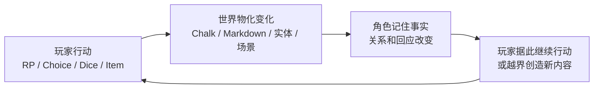
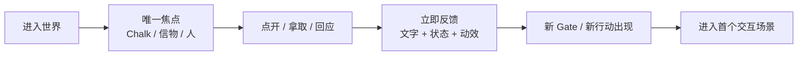
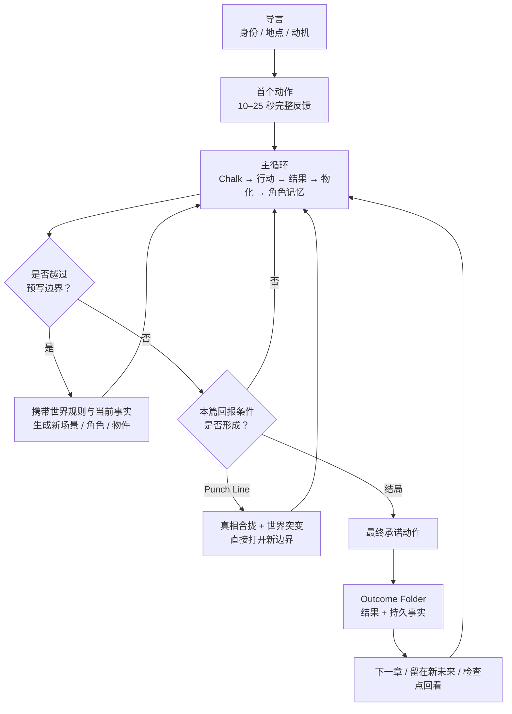
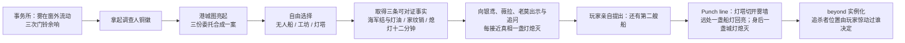
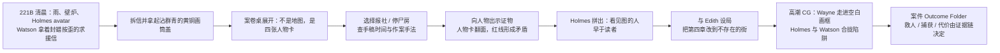
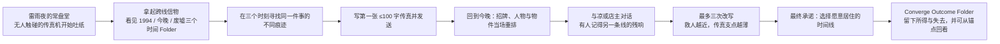
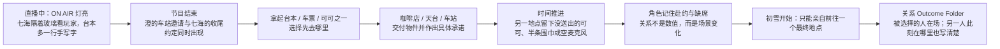
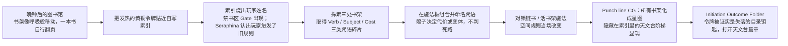

# doc-24 五世界可玩剧本与生成式关卡设计（过度细化草案，已归档）

> 状态：**已归档（2026-09-12）**。本稿在团队评审前过早展开了多结局、后日谈与长线内容；仅保留为候选点子来源，不再作为执行入口。当前入口见 `docs/doc-24-五世界可玩Demo体验设计.md`。
> 关联：`doc-05-AIRP产品构想.md`、`doc-06-演出与交互设计.md`、`doc-07-AIRP黑客松作战计划.md`、`doc-11-场景与小天地初始化协议.md`、`doc-14-上帝模式设计.md`、`doc-15-世界模板规范与开局引导.md`、`doc-19-多模态与游戏性交互升级.md`。

---

## 0. 本文解决什么

现阶段要解决的不是“还缺多少功能”，而是：**怎样把五个世界分别设计、Mock 并打磨成真正可游玩的剧本与关卡，同时用它们证明 AIRP 的游玩模式与上帝模式为什么成立。**

五个世界不是底座换皮。每一个都要有被认真设计过的身份交接、目标、角色、物件、关卡、高潮和回报；预写内容结束后又不能变成死剧本，而要沿着世界已有结构继续生长。

本文承担三件事：

1. 建立“导言 → 首次行动 → 主循环 → punch line / 结局 → 动态扩展”的共同体验语法；
2. 为雾坞镇、福尔摩斯、时间线、初雪和魔法学院分别建立可试玩骨架；
3. 把五个 Mock 做成五份上帝之手样板，展示设计者如何编排空间探索、证据推理、时间因果、关系抉择与魔法组合。

本文不是一次性定稿。世界真相与已有人物不随意推翻；具体节拍、关卡组合和结局仍通过对话逐项定案，再落到模板、世界 Markdown 和资产生产。

---

## 1. 已确认的体验目标

### 1.1 玩家首先需要四个答案

在 A / B / C 成立之前，玩家必须很快知道：

1. **我是谁**：我在这个世界里的身份与立场；
2. **我在哪里**：眼前空间是什么，它此刻正在发生什么；
3. **我要做什么，为什么非做不可**：本篇章目标与情感动机；
4. **我能造成什么影响**：由第一次动作后的可见反馈证明，不靠教程说明。

前三项构成导言，第四项是玩家进入心流的第一次正反馈。导言可以是一封信、一件遗物、一段直播或一枚会发热的校徽；不引入固定的“三张纸”schema。

### 1.2 每个世界都必须同时兑现 A + B + C

> A. 这个世界真的在我面前活着；
> B. 这里的角色真的认识我；
> C. 我能亲手改变和创造这个世界。

这不是三项独立功能，而是一条因果链：

### 1.3 五个世界共用语法，但不共用体验

| 世界 | 玩家幻想 | 主玩法动词 | 关卡结构 | 10–30 分钟回报 |
|---|---|---|---|---|
| 雾坞镇 | 我在雾港中追踪一艘无人船背后的活人 | **探索 / 拼图 / 追踪** | 三地点并行取证，真相打开新边界 | punch line：第二艘船已经进城；不结局，直接长出新区域 |
| 福尔摩斯 | 我就是 Holmes，亲手让虚构的谋杀落空 | **对证 / 推断 / 设局** | 人物证据桌 + 地点验证 + 最终指控 | 有案件多结局，可重访案件 |
| 时间线 | 我用一百字改写过去，并承担新现在 | **改写 / 对照 / 选择** | 同地点三时间层 + 三次传真 | 有互斥时间线结局，可回到锚点 |
| 初雪 | 我在最后一个冬天亲自靠近或错过一个人 | **赴约 / 交付 / 缺席** | 限时关系链，行动同时制造另一侧缺席 | 有关系结局，不允许“两边都要” |
| 魔法学院 | 我用自己拼出的咒语改写学院规则 | **组合 / 命名 / 施法** | 咒语碎片组合 + 规则反馈 + 隐藏空间 | 章节 punch line / 入门结算，打开天文台新篇章 |

---

## 2. 共同关卡骨架

### 2.1 两条线必须咬在同一个动作里

| 体验线 | 玩家正在感受什么 | 设计要求 |
|---|---|---|
| **行动 / 空间线** | 看见 Chalk 或实体 → 操作 → 移动 → 世界回应 | 第一次动作要小而明确，10–25 秒内给足反馈 |
| **情感 / 剧情线** | 我是谁 → 谁需要我 → 我若不做会失去什么 → 我改变了谁 | 动机必须落在角色、遗憾或承诺上，不能只是“去试试 UI” |

同一入口最好同时推进两条线：Holmes 拆信既是打开实体，也是接受 Watson 与案件的请求；时间线玩家拿起遗物，既获得穿越能力，也接住自己的遗憾。

### 2.2 第一小段操作的最低反馈

最低标准：对象视觉状态变化；Chalk 明确认账；信物或承诺真实留下；出现一个可进入的下一目的地。声音和 TTS 可后接，不进入当前世界骨架的成立条件。

### 2.3 Chalk 是执行脊柱，不是 Chunk

口述中出现的 “Chunk” 均指 **Chalk**。AIRP 不新增 `type: chunk`。

一条完整关卡链中，Chalk 负责定处境、给机会、收结果、驱动物化与打开边界；实体负责拿取 / 使用 / 查验，Folder / Layer 负责空间移动，Character 负责关系与连续性。它们的基本咬合是：

**Folder 中的 Chalk 给机会 → 玩家回应或操作实体 → Chalk 承认结果 → Writer 改写真实文件 → Character 记住 → 新 Chalk、实体或 Folder 出现。**

### 2.4 关卡高潮不必总是结局

五个世界都要在 10–30 分钟内给一次明确回报，但回报有两类：

| 类型 | 何时用 | 必须发生什么 |
|---|---|---|
| **Punch Line** | 开放冒险或章节刚起头，最好的回报是“重新理解世界并打开更大问题” | 旧线索在一个瞬间合拢；世界出现不可逆变化；立刻打开下一处可玩边界，不弹结算页 |
| **Outcome Folder** | 推理、时间线或关系抉择需要玩家为一局承担结果 | 玩家做最终承诺动作；进入不同结果 Layer；角色、物件、场景与持久事实均不同；提供下一章或检查点出口 |

雾坞镇明确采用第一种：**没有本局结局，只有足够强的 punch line**。福尔摩斯、时间线与初雪采用第二种。魔法学院采用“章节结算 + 下一层揭示”的混合形态。

### 2.5 最终门槛不是“拿满三个 thing”

需要结局的世界使用**结算组合（resolution bundle）**：

| 组成 | 它证明什么 | 可能载体 |
|---|---|---|
| **事实** | 玩家理解了发生什么 | 证物、时间记录、记忆、已确认关系 |
| **行动** | 玩家为路线付过成本 | 使用过的道具、完成的判定、改写的场景、错过的约定 |
| **关系 / 立场** | 玩家选择相信、保护或承担谁 | 角色证词、同行承诺、交付对象 |

Gate 必须可预期、可解释、可挽回并要求最终承诺。失败改变代价、路线或结局质量，不制造死局。

### 2.6 共同流程与两种出口

流程连通的核心规则是：生成器可以横向扩展解法与内容，但不能擅自改写本篇回报条件；每个可达状态至少留一个明确行动；每次失败要产生成本或替代路线。

### 2.7 首局累计时间检查点

| 时间点 | 必须兑现的体验 |
|---|---|
| **0–5 秒** | 一眼看到世界此刻正在活动，不是静态菜单；玩家 avatar 或第一人称空间锚出现 |
| **5–10 秒** | 知道“我是谁 / 眼前压力是什么”；画面只有一个主要焦点 |
| **10–25 秒** | 做完一个小动作；对象、Chalk、状态和路径同时回应 |
| **25 秒–5 分钟** | 进入首场景，获得首个事实 / 物件；一个角色明确记住刚才的行动 |
| **5–10 分钟** | 完成 2–3 次本世界独有的核心循环，选择开始制造可见差异 |
| **10–30 分钟** | 抵达 punch line 或 Outcome Folder；明确看见“我造成的结果”和“世界如何继续” |

### 2.8 五世界首局时间切片

| 时间点 | 雾坞镇 | 福尔摩斯 | 时间线 | 初雪 | 魔法学院 |
|---|---|---|---|---|---|
| **0–5 秒** | 窗外冷雾在动，门铃还在摆，三位委托人刚离开 | 221B 雨声与壁炉同时在场，Holmes avatar 已坐在桌前 | 雷声后传真机无人触碰却开始吐纸 | ON AIR 灯亮着，七海隔玻璃看向玩家 | 书架像呼吸一样移动，一本书自行翻页 |
| **5–10 秒** | Chalk 交代玩家是刚挂牌调查人；铜徽是唯一焦点 | Watson 叫出 “Holmes”，递来封蜡按歪的求援信 | 玩家看见来自三十年后的日期与旧遗物 | 七海叫玩家的名字，澄在楼下等；两份约定将冲突 | Seraphina 认出令牌异常；晚钟后图书馆不该让一年级生留下 |
| **10–25 秒** | 收起铜徽，港城图与三份委托亮起 | 拆信、拿起群青黄铜盖，人物案卷桌展开 | 拿起时间锚，三个时间 Folder 被唤醒 | 收起台本 / 车票 / 可可之一，第一处目的地亮起 | 令牌贴上索引，烧出玩家姓名与禁书区 Gate |
| **25 秒–5 分钟** | 进入无人船 / 工坊 / 灯塔之一，取得首条事实 | 在报社或停尸房取得第一项可对证证据，Watson 回应观察 | 发出第一封短传真，回到今晚看见首次重排 | 赴第一场约并交付物件，另一地点留下缺席痕迹 | 得到第一类咒语碎片，书架与目录路径改变 |
| **5–10 分钟** | 两到三地交叉对证；每靠近真相一盏灯熄灭 | 人物卡翻面，物证 / 时间 / 口供被红线连成玩家自己的推理 | 完成第二次改写，救凉与保住传真支点开始冲突 | 角色引用赴约与缺席，初雪倒计时逼近 | 拼出第一条自命名咒语；施法成功或失败都改写空间 |
| **10–30 分钟** | 说出“第二艘船”，灯塔照出远船灯，`beyond` 直接长出 | 在不存在的街设局，进入一个案件 Outcome Folder | 第三封传真后选择愿意居住的时间线 | 初雪落下，玩家只能赴一个最终地点 | 书架化为星图，天文台阶梯显现，进入入门结算与新篇章 |

---

## 3. 世界 A：雾坞镇（Wuwu）——第二艘船

> 设定真相源：`worldlines-canvas/stack/worlds/wuwu.json`。视觉真相源：`worldlines-assets/worlds/wuwu-demo/`。**不另造结局，不重做现有图。**

### 3.1 玩家身份与体验承诺

玩家是雾坞镇刚挂牌的调查人。开张第一天，精灵骑士银鸢、机械师薇拉与守塔人老莫把三份互相遮掩的委托送到桌上。主玩法是**探索 / 拼图 / 追踪**：玩家不是为“离开小镇”收集钥匙，而是从无人船反向追踪已经进入城里的活人。

### 3.2 主观体验流程

### 3.3 关卡与反馈

| 节拍 | 玩家看见 / 做什么 | 世界怎样回应 |
|---|---|---|
| 开局 | 事务所里只有铜徽和三份委托的余波 | 收起铜徽后港城图成为 Gate；城里已经有人知道“新调查人接案了” |
| 三地调查 | 无人船提供海军结与灯塔油；工坊第三抽屉藏白鸢家纹销；灯塔日志缺十二分钟 | 玩家每确认一条事实，港城地图上一盏灯永久熄灭；薇拉的传讯铜铃把跨地点对话串起来 |
| 对证 | 将销子给银鸢、将油渍问老莫、把熄灯记录通过铜铃告诉薇拉 | 三人不再只给固定台词，而依据玩家已知事实选择沉默、承认或误导 |
| 合拢 | 玩家自己说出或做出“第二艘船”推断 | 不由 Writer 代推；`beyond` 从 stub 变成有内容的 Layer |

### 3.4 Punch line，而不是结局

本段没有 Outcome Folder，也没有重置按钮。回报是一个重新定义整张地图的瞬间：**无人船不是谜底，而是诱饵；玩家调查的不是谁离开了船，而是谁借全城看船时从税洞进了城。** 灯塔光束扫开雾时，海上第二盏船灯回应；同一瞬间，玩家身后的一盏城灯熄灭，证明追杀者已在城内。

随后 `beyond` 实例化为“雾墙与旧税洞”的新关卡。追杀者所在位置取决于玩家此前惊动了谁：告诉过薇拉，线索先流向工坊；逼问过老莫，追踪者逼近灯塔；公开保护银鸢，码头成为伏击点。这是 A / B / C 的一次完整兑现，但故事不暂停结算。

### 3.5 动态生长规则

- 新地区必须由港口航路、旧税道、城中灯网或某个角色关系接出去，不能凭空冒出随机城镇；
- 新地点生成时携带：当前追杀者位置、仍亮 / 已灭的灯、玩家公开过的事实、铜铃是否在身、银鸢是否信任玩家；
- 新物件要能回咬旧谜题或打开新路线，不能只做图鉴；
- 每 10–30 分钟仍要有一次新的区域 punch line，但不强制把开放冒险切成结局页。

### 3.6 CG 决策

P0 **不新增 CG**。现有 `wuwu-demo/backgrounds/beyond.png` 已能承担“第二艘船灯回应”的全屏 punch line；进入 `beyond` 时用镜头推进、灯光变化和现有图即可。若后续补 P1，只做旧税洞口的近景，不重画世界全景。

---

## 4. 世界 B：雾都来信（Whitechapel）——让画第一次落空

> 设定真相源：`worldlines-canvas/stack/worlds/whitechapel.json`。视觉真相源：`worldlines-assets/worlds/whitechapel-demo/`。玩家身份已定案：**玩家就是 Sherlock Holmes 本人，并有一个 avatar 代表自己**；Watson 是陪伴角色。

### 4.1 体验承诺与固定真相

三起案件与连载小说《雾都来信》的插图分毫不差，下一章后天见报。固定真相不因生成而改变：凶手是提前一周取得手稿的插画师 Wayne，不是作者 Edith；Edith 已察觉，并故意把第四章地点改成一条不存在的街。

玩法不是写实刑侦复刻，而是把“虚构先于现实”做成可视化的华丽推理舞台：人物卡翻面、群青颜料追光、红线自动绷紧，最终由 Holmes **让画第一次无法成为现实**。

### 4.2 主观体验流程

### 4.3 关卡链

1. Watson 在 221B 亲口称呼 Holmes；玩家拆开 Lestrade 的信，拿到黄铜画筒盖。地址 Gate 与人物案卷桌同时亮起。
2. 案卷桌呈现 Edith、Wayne、Blackburn、Tom 四张人物卡。玩家先排除谁、先相信谁，会改变角色的合作方式，但不会改变固定真相。
3. 舰队街报社验证“文字与图分别何时交付”；停尸房由 Watson 提供医学判断，验证凶手的惯用手与模仿误差。
4. 玩家把黄铜盖、群青、签收记录、左右手矛盾拖给人物或彼此对证，建立**物证 + 时间事实 + 玩家推断**。
5. 玩家必须亲自提出“凶手看的是图，不是字”，并决定是否相信 Edith 的不存在街道。Writer 只反馈推理，不代替 Holmes 下结论。
6. 第四章前夜成为最终 Gate。Holmes 可以秘密设局、提前公开指控或误判他人；不同承诺动作进入不同结果。

### 4.4 结局拓扑

| Outcome Folder | 条件与承诺 | 结果 |
|---|---|---|
| **The Empty Frame** | 证据链完整；保护 Edith；在不存在的街设伏 | 第四名受害者获救，Wayne 被捕；Watson 把这称为“你让一幅画第一次扑了空” |
| **The Blue Cuff** | 锁定 Wayne，但未保护消息来源或过早惊动报社 | 人获救，Wayne 留下沾群青的外套逃入雾中；下一案成为追捕 |
| **A Published Murder** | 证据不足或错误指控，仍选择等待第四章验证 | 画面被部分重演；不是 Game Over，Holmes 获得纠错证据，但 Watson 与警方关系受损 |

案件后提供 **New Case** 与 **Revisit the Case**。回看只重置本案分支事实，不抹掉 Holmes / Watson 的共同记忆或玩家已解锁的结局图鉴。

### 4.5 动态生长规则

- 固定凶手、手稿时序和“不存在的街”不能被 Writer 改写；
- 可动态生成替代取证地点、证人和证据获取方式，但必须回到同一推理链；
- 新案件可从报社、警方或 Watson 的私人关系长出，每案重新定义固定真相与公平线索；
- 角色不是线索贩卖机：每个人只依据 Holmes 出示的证据与此前态度改变反应。

### 4.6 CG 决策

P0 需要 **1 张高潮 CG**：不存在的街像舞台上的空白画框，Wayne 独自走进煤气灯，Holmes 与 Watson 的剪影在两侧收紧陷阱。结局差异先由角色 / 证物状态与 Chalk 承担；P1 再补另外两张 Outcome 变体。英文 Prompt 写入 `worldlines-assets/worlds/whitechapel-demo/CG-PROMPTS.md`。

---

## 5. 世界 C：分歧传真（Divergence）——一百字换一个现在

> 设定真相源：`worldlines-canvas/stack/worlds/divergence.json`。视觉真相源：`worldlines-assets/worlds/divergence-demo/`。

### 5.1 体验承诺与规则

秋叶原边上的老电器铺“常盘堂”会在雷雨夜收到三十年后的传真，玩家每次只能向过去发送一张、一百字以内的纸。核心人物常盘凉在 1994 年七岁，在今晚的时间线上已因 2011 年事故不在。救她可以，但会让电器铺倒闭、传真机被卖掉，令穿越本身失去支点。

这里不讲悖论课。玩家用**改写 / 对照 / 选择**理解规则：每发一张纸，再进入较晚时间层，场景和关系就真的被重排。

### 5.2 主观体验流程

### 5.3 三次传真关卡

| 传真 | 玩家问题 | 可见反馈 | 代价升级 |
|---|---|---|---|
| 第一张 | “我真的能改变过去吗？” | 一个小物件、招牌文字或人物习惯在较晚层改变 | 玩家意识到文字会被误读，不能精确遥控历史 |
| 第二张 | “怎样阻止 2011 年事故？” | 凉可能仍在，但常盘堂的经营、家庭关系或事故对象改变 | 救人开始损伤传真机存在的条件 |
| 第三张 | “我愿意保留哪个世界？” | 三个时间层收敛成一个稳定分歧点 | 发送后必须选择；不能继续刷到零代价完美线 |

### 5.4 结局拓扑

| Outcome Folder | 被保留 | 被失去 |
|---|---|---|
| **She Answers** | 凉活着，并在新现在回应玩家 | 常盘堂早已关门，传真机不再存在；这条线只能向前生活 |
| **The Last Shop Light** | 店、店主与传真锚仍在，玩家能继续研究世界线 | 凉仍只存在于 1994 与遗留的纸上 |
| **A Memory Out of Place** | 玩家接受一条两者都不完整的新线；凉保留跨线残响 | 店与关系均发生不可逆变化，玩家不能恢复原始版本 |

没有“正确结局”。进入 Gate 前必须并列展示该线保留与失去的事实。Outcome Folder 中可以留在新未来继续 RP；也可用时间锚回到第三张传真前，保留玩家元记忆与结局图鉴，重置之后的世界变量。

### 5.5 动态生长规则

- 新生成内容必须遵守“传真只向过去、改动只重写更晚层、最多三次后收敛”的本篇规则；
- 新地点是同一因果链的见证点，如学校、事故路口或拆迁档案室，不得把时间轴扩成任意平行宇宙菜单；
- 生成新时间层时必须带入：三封传真全文、当前稳定事实、时间锚状态、凉与店主的关系差异；
- 后续篇章可以换新的因果问题，但每章先定义其锚点、改写次数和不可兼得代价。

### 5.6 CG 决策

现有 `backgrounds/converge.png` 可承担时间线合拢的共同转场；P0 再准备 **3 张结局 CG Prompt**，分别表现“凉活着但店已消失”“最后亮着的店灯”“带着跨线记忆的新现在”。英文 Prompt 写入 `worldlines-assets/worlds/divergence-demo/CG-PROMPTS.md`。

---

## 6. 世界 D：初雪时间（First Snow）——同一场雪，只能赴一次约

> 设定真相源：`worldlines-canvas/stack/worlds/firstsnow.json`。视觉真相源：`worldlines-assets/worlds/firstsnow-demo/`。

### 6.1 体验承诺与人物纪律

大学最后一个冬天，玩家是深夜电台《初雪时间》的兼职导播。七海是相识十年的主持人，心意藏在每期台本空白处；新晋歌手雪村澄的靠近也是真的，但她很快要离开巡演。没有恶人，也没有隐藏好感度。任何一边升温，另一边都要在具体小事里真实地疼。

主玩法是**赴约 / 交付 / 缺席**。玩家不是点浪漫台词，而是在有限时间里真的移动到某个场景、带去某件东西，也因此不在另一处出现。

### 6.2 主观体验流程

### 6.3 关卡链

1. 0–10 秒先让直播世界活着：波形在走，七海念出最后一句听众来信，又透过玻璃叫玩家的名字。
2. 节目结束，两份约定同一时间到来。玩家收起台本、车票或可可，第一件物品成为关系行动，不是收藏品。
3. 玩家在演播室、咖啡店、天台、车站间移动；每次赴约都推进真实时间，并在未到场处留下缺席痕迹。
4. 角色对话引用共同经历与物件去向。七海不直接告白，而用节目选曲和手写注记；澄会告白，但不会因玩家犹豫取消巡演。
5. 初雪 Gate 出现时，玩家必须亲自去一个地点，或明确选择独处；没有“先去 A 再瞬移到 B”。

### 6.4 结局拓扑

| Outcome Folder | 最终行动 | 必须同时看见的另一侧 |
|---|---|---|
| **The Same Umbrella** | 带着台本去找七海，兑现十年里第一次说出口的承诺 | 澄在末班车上听完节目，没有等到同行的人 |
| **Last Train North** | 带着车票 / 歌曲小样陪澄走到站台，接受她不会停下 | 七海独自在直播间放出那首代替告白的歌 |
| **Snow on the Console** | 不用含糊拖住任何人，回到空演播室诚实结束本篇 | 两段关系都受伤，但玩家第一次停止让别人替自己等待 |

结局后可进入下一学期 / 巡演归来篇；也可从初雪前的检查点回看，但回忆册保留已看见的选择。禁止大团圆、好人卡和两边都圆满。

### 6.5 动态生长规则

- 新日常必须消耗时间，并在未选择的一侧留下具体痕迹；
- 新物件必须承载一次共同经历、承诺或错过，不能批量生成礼物刷关系；
- 新角色可扩展校园与电台生活，但不能把七海 / 澄的核心冲突改写成反派阴谋；
- 当前先验证文字、物件、时间与角色连续性；TTS / Voice Agent 在世界骨架跑通后再评估接入。

### 6.6 CG 决策

P0 需要 **3 张结果 CG Prompt**。现有 `backgrounds/snowfall.png` 可作为共同雪夜底图，但三种结局必须用“谁在场、谁缺席、哪件物品留下”区分，不能只换字幕。英文 Prompt 写入 `worldlines-assets/worlds/firstsnow-demo/CG-PROMPTS.md`。

---

## 7. 世界 E：烬晶魔法学院（Emberglass Academy）——给无名之物命名

> 实现起点：`templates/magic-academy/`。视觉将新建 `worldlines-assets/worlds/emberglass-demo/`；不复用现代学生会题材的 `silveracademy` 作为世界视觉。

### 7.1 体验承诺

玩家是 Emberglass Academy 的一年级学徒。晚钟后，奥术图书馆像活物一样重排书架；一册书在无人触碰时自行翻页，而玩家随身的黄铜学徒令牌开始发热。Seraphina 是懂规则又愿意越界的同伴，Archivist 掌握代价但不会替玩家解题。

主玩法是**组合 / 命名 / 施法**：玩家收集的不是三把钥匙，而是三个可重组的咒语碎片；组合方式会直接改写场景规则，错误施法也产生有趣且可继续利用的魔法后果。

### 7.2 主观体验流程

### 7.3 第一章关卡

| 节拍 | 设计内容 | 玩家造成的可见变化 |
|---|---|---|
| 身份交接 | 令牌、晚钟、Seraphina 对玩家的熟悉称呼 | 令牌触碰索引后刻出玩家名字，证明世界认识“我” |
| 找碎片 | 在会说反话的目录、倒置书架、锁链书中取得 Verb / Subject / Cost | 每拿一片，图书馆目录和可进入路径改变 |
| 组咒 | 例如 `Reveal + Hidden Path + A Memory` 或 `Bind + Moving Shelves + My Voice` | 玩家给咒语命名，生成一张真实 spell Markdown / Codex 实体 |
| 施法 | 把自创咒语用在书架或锁链书上 | 成功与失败都改写空间：显路、交换书架、失去一段记忆或让声音留在书里 |
| 高潮 | 三类碎片形成可解释组合，玩家选择愿意支付的 Cost | 图书馆变成星图；通往百年封闭天文台的阶梯出现 |

### 7.4 章节结算与继续生长

本章不是学院终局，而是一次**入门结算**。Punch line 是：学徒令牌并非普通身份牌，而是图书馆遗失百年的目录钥匙；被封闭的天文台不是藏在学院某座塔里，而是一直被编目在图书馆内部。

玩家进入 `the-hidden-observatory` Outcome Layer，看到自己那条咒语留下的永久效果：付出记忆，Seraphina 会替玩家保存一句话；付出声音，后续只能通过写下的 Chalk 施法；让书架交换名字，学院地图会出现一处错位的新地点。随后打开天文台篇章，不回菜单。

### 7.5 动态生长规则

- 每个新魔法实体必须有 **Verb / Subject / Cost**，强效果必须留下可被后续引用的代价；
- 新学院地点必须经目录、课程、社团、教师或既有魔法规则连接；
- Writer 可以生成新咒语碎片与用途，但不能在同一章临时增加第四类必需碎片；
- Character 必须记住玩家亲自命名的咒语，并以此称呼玩家的能力；
- 上帝模式展示设计者如何预埋碎片、可组合对象、代价表和隐藏 Layer，游玩模式展示玩家如何在边界内创造新魔法。

### 7.6 CG 决策

P0 需要 **1 张章节高潮 CG**：高耸书架向两侧分开并化为星图，一道不可能的螺旋阶梯通往悬在室内夜空中的古老天文台；玩家与 Seraphina 以背影出现，黄铜令牌发光。视觉 Prompt 与首批场景 / 角色 / 道具清单写入 `worldlines-assets/worlds/emberglass-demo/`。

---

## 8. 五份 Mock 如何证明上帝之手

| 样板 | 上帝模式预先设计什么 | 玩家自由创造什么 |
|---|---|---|
| 雾坞镇 | 三地事实、灯网压力、角色隐瞒纪律、`beyond` 生成边界 | 调查顺序、公开给谁、追杀者最终落点与雾外新区域 |
| 福尔摩斯 | 公平线索、固定真相、人物知识边界、三类案件结果 | 证据链、设局方式、对谁承诺与下一案关系 |
| 时间线 | 传真规则、锚点、三次改写、不可兼得代价 | 每封一百字内容、由此产生的新现在与最终居住线 |
| 初雪 | 时间表、两段真实关系、约定冲突、不可双赢纪律 | 共同经历、物件意义、赴约 / 缺席与关系后续 |
| 魔法学院 | 碎片语法、代价表、可施法对象、隐藏空间 | 咒语组合与名称、魔法实体、被改写的学院规则 |

五个样板共同表达：**上帝之手不替玩家写唯一玩法，而是设计出足够有戏的规则、门槛、因果和生成边界；玩家在其中做出设计者未逐字写死、但世界能够承认的行动。**

---

## 9. 流程连通性分析

| 风险 | 断点表现 | 验收修正 |
|---|---|---|
| 开局断链 | 设定很美，但不知道点什么 | 25 秒内必有唯一焦点、一次真实状态变化和一个新 Gate |
| 中段漂移 | RP 不断生支线，却不靠近回报 | 每轮至少新增、验证或推翻一个本篇事实 / 行动 / 关系 |
| 角色失忆 | 角色只输出题材台词 | 后续对话必须引用玩家做过的动作、物件去向或承诺 |
| 隐藏门槛 | 玩家突然发现少了某个物件 | Gate 提前可见，并用世界内语言提示缺少哪类准备 |
| 失败死局 | 一次骰子失败导致无路可走 | 失败改成本、路线或结局质量，不关闭全部行动 |
| 假无限 | 不给高潮，只不断生成地图 | 雾坞镇 / 魔法学院用 punch line 打开新边界；其余进入 Outcome Folder |
| 假结局 | 播完文字回菜单，前面变化消失 | 结果落到 Layer、角色、物件和持久事实，并提供明确出口 |

当前五条流程在结构上均连通：每条都有身份交接、首个动作、两次以上主玩法循环、世界物化、角色承认和明确回报。下一步不是继续增加设定，而是把每条流程 Mock 成真实文件后试玩，记录玩家在哪个节点看不懂、没有行动或不在乎后果。

---

## 10. 当前资产与生产决定

| 世界 | 已有视觉 | P0 CG | 生产动作 |
|---|---|---|---|
| 雾坞镇 | 完整 demo 图；`backgrounds/beyond.png` 已含远船灯 | 复用现图，不新增 | 镜头与灯光演出优先 |
| 福尔摩斯 | 人物证据桌、地点与角色图 | 1 张“不存在的街”高潮 CG | 新增英文 CG Prompt |
| 时间线 | 三时间层与 convergence 图 | 3 张结局 CG；共同转场复用现图 | 新增英文 CG Prompt |
| 初雪 | 电台、校园、雪夜与角色图 | 3 张关系结局 CG | 新增英文 CG Prompt |
| 魔法学院 | AIRP 模板有文字骨架；无匹配的幻想学院资产集 | 1 张天文台揭示 CG | 新建 `emberglass-demo` Brief、manifest 与英文 Prompt |

当前顺序是：**先把世界骨架、回报节点和 CG 构图定清楚，再生产最终图。** TTS、GPT Live 与 Voice Agent 暂不进入五世界骨架；它们只能在主流程已经可玩后增强角色临场感，不能成为世界成立的前置依赖。

---

## 11. 下一轮对话顺序

1. 先逐世界确认主观流程中最关键的 punch line / 最终承诺是否够强；
2. 再确认每个节点的预写文件、可生成文件与角色知识边界；
3. 把五条流程各 Mock 一次，从卡住、无聊或失控的位置反推关卡；
4. 定稿 CG 构图并进入资产生产；
5. 最后用跑通的第一条关卡链反推 Tutorial，不另写脱离世界的教学游戏。

下一项最值得对话定案的是：**福尔摩斯“不存在的街”高潮里，Holmes 最后亲手做的动作究竟是什么——放出假画稿、把黄铜盖扣回画筒，还是让 Watson 扮演画中本不存在的那个人？** 这个动作会决定案件最有记忆点的舞台调度与 CG。
