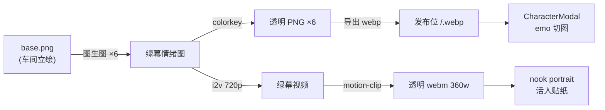

# docs/assets/00 共同上下文（冻结契约）

> **本文是「角色素材批次」（6 情绪差分 + 微动立绘 + 氛围音）全批次共享地基。所有子文档与生产脚本 MUST 遵守，MUST NOT 自行改动本文冻结的形状。**
> 冻结日期：2026-09-13。体例承接 `docs/audio/00-共同上下文.md`（A1 音频批次）。
> 母文档：本文件；子文档 `01`–`04` 各管一个模块。冲突时以本文为准。

---

## 0. 权威层级

上游冲突时的裁决顺序（高 → 低）：

1. **本文冻结的形状**（路径、字段名、命名、尺寸、解析链）；
2. `docs/nook/00`（立绘组件契约：`video:`/`poster:` 落点与相对世界根口径）与 `docs/audio/00`（音频路径解析律）；
3. `docs/ui/前端改造计划.md` T3.2（6 表情差分的驱动机制与降级纪律）；
4. `doc-04 §10` / `doc-06 §3`（视觉与遮罩规格）；
5. `assets/README.md`（素材车间落点约定）。

**本文对 `assets/README.md`「差分进 `variants/`」的车间约定照单沿用，不改写它。**

---

## 1. 一句话架构

**角色素材分三类，各归其位、各有其消费者：**

- **6 情绪差分（静态透明图）** → 走**对话遮罩**：角色 Agent 句首 `[emo: tag]` 驱动切图 + CSS 呼吸；
- **微动立绘（透明 webm）** → 走**角色小天地 portrait 组件**（画布上的「活人贴纸」）；
- **背景微动（不透明 webm）** → 走**场景 README `bgVideo:`**（niko 批已完成，本批不动）。

一句话口径：**遮罩要「换表情」，所以用图；小天地要「像活的」，所以用视频。** 二者形态同族（同源绿幕 → 同宽 360 → 同为透明），静态回退不跳变。



---

## 2. 需求映射（本批交付物）

| # | 需求（用户原话） | 形态 | 落点 | 状态 |
|---|---|---|---|---|
| 1 | 背景图换 webm 微动视频 | 1280×720 VP9 6s 循环 | `assets/motion/seedance/backgrounds/*.webm` | ✅ niko 批已完成 |
| 2 | 角色图片补充 6 种情绪拆分 | 6 张透明 PNG/webp，9:16 | `assets/characters/<id>/<emo>.webp` | ❌ 待生产 |
| 3 | 角色立绘转微动视频（透明底） | 360 宽透明 VP9 webm | `assets/motion/seedance/characters/<id>-transparent.webm` | ⚠️ 部分 |
| 4 | BGM 自己生成氛围音（建议） | 世界主题曲 mp3 | `assets/audio/themes/*.mp3` | ✅ 已有；可选重生成 |

**范围边界**：只做 `whitechapel` 与 `firstsnow` 两个世界（`first-snow-jp` 复用 firstsnow 资产）。其余世界不动。

---

## 3. 资产形态与落点（冻结）

### 3.1 6 情绪差分

| 项 | 冻结值 |
|---|---|
| 枚举 | `normal` / `smile` / `shock` / `sad` / `angry` / `thinking`（逐字，与 `lib/audio.ts:37` 的 `Emotion` 一致） |
| 车间落点 | `assets/worlds/<world>-demo/characters/<id>/variants/<emo>.png`（`normal` 用同目录 `variants/normal.png`）；**遵 `assets/README.md` 既有的 `variants/` 约定** |
| 发布位落点 | `templates/<world>/assets/characters/<id>/<emo>.webp`（**新子目录 `<id>/`**） |
| 尺寸 | 宽高比 **9:16**（banana portrait 输出 768×1376 系） |
| 透明 | **真透明（alpha）**，绿幕抠像产出，与微动 webm 同源同族 |
| 编码 | 发布位 webp（q82，与 `sync-template-assets.mjs` 既有口径一致） |

> **为什么不沿用 1080×1440（3:4）**：banana 的 `three-four`/`four-three` 枚举上游 400（实测），可用比例只有 `landscape`/`portrait`/`square`。`portrait` = 768×1376 ≈ 9:16，**与微动视频 360×640 完全同族**——这正是 `docs/nook/03 §⑪` 要求的「静态回退必须与视频的动态形态视觉同族」。遮罩 CSS 用 `object-fit: contain` 适配。

### 3.2 微动立绘

| 项 | 冻结值 |
|---|---|
| 车间落点 | `assets/worlds/<world>-demo/characters/<id>/<id>-green.mp4`（绿幕源）+ `<id>-transparent.webm`（抠像成品） |
| 发布位落点 | `templates/<world>/assets/motion/seedance/characters/<id>-transparent.webm`（沿用 niko 批既有路径） |
| 尺寸 | 宽 **360**（高按 9:16 自动 = 640），与既有 `watson-transparent.webm` / `nanami.webm` 同档 |
| 编码 | VP9 `yuva420p` + `alpha_mode=1`，`--pingpong` 无缝循环，无音轨 |
| poster | 从 webm 自身首帧导出 PNG（`ffmpeg -c:v libvpx-vp9 -frames:v 1`），逐像素同源 |

### 3.3 背景微动（既有，只读）

`templates/<world>/assets/motion/seedance/backgrounds/*.webm`，1280×720 VP9 6s 循环。**本批不重做**，只在文档中登记其已完成。

---

## 4. 生产管线（冻结，可复现）

### 4.1 6 情绪图（图片链路，**零额度**）

```bash
# 图生图：以车间 base.png 为参考，仅改表情 + 换纯绿幕背景
node tools/flow-gen.mjs image --model nano-banana-2 --aspect portrait \
  --ref-image <base.png> \
  --prompt "<角色锚定语> + <该情绪表情描述> + flat pure chroma-key green screen background, no green spill, same pose/framing/outfit, no text" \
  -o <id>/variants/<emo>-green.jpg
# 抠像 → 透明 PNG
ffmpeg -i <emo>-green.jpg -vf "colorkey=0x00FF00:0.18:0.06,format=rgba" -y <emo>.png
```

**实测**：图生图 ~25s/张；**不扣额度**（banana 当前档位免费，实测 delta 0）。绿幕图角点色实测 `0x05f603`（纯绿）。

### 4.2 微动视频（视频链路，**扣额度**）

```bash
# 绿幕 normal 图 → i2v 720p 6s
node tools/flow-gen.mjs video --model omni-1.1-flash --seconds 6 --resolution 720 \
  --aspect portrait --image <normal>-green.png \
  --prompt "transparent-animated living portrait from this still, silent. <角色> stays standing, only very slight breathing rise and fall, eyes blink once or twice, hair and coat hem stir faintly in a draft, hands do not move. Do not turn the head, do not walk, no large motion. Keep the flat pure green screen unchanged behind. Static living-still composition." \
  -o <id>-green.mp4
# 抠像 → 透明 webm 360w 乒乓循环
node tools/motion-clip.mjs <id>-green.mp4 -o <id>-transparent.webm --scale 360 --pingpong --similarity 0.06 --preview <preview>.png
```

**实测**：i2v 720p 6s = **10 credits/条**（`credits_remaining` 前后差）；~45s/条。**360p 生成档上游已关闭**（flow 反代确认：`VIDEO_RESOLUTION_360P` 枚举合法但被账号档位层拒），**MUST 用 720p**。

### 4.3 氛围音（音频链路）

`node tools/flow-gen.mjs music --prompt "Instrumental only, absolutely no vocals..."` → 归一化到 `assets/audio/`。**prompt 必须逐字含 "Instrumental only, no vocals"**（Lyria 用 `[Instrumental]` 标记纯音乐）。

### 4.4 发布位同步与溯源

- 6 情绪图与微动视频**同时落车间与发布位**；发布位是 runtime 读取处（`/api/asset`）。
- **每条新增媒体记入 `templates/<world>/assets/character-media.json`**（`tools/record-emotion-assets.mjs` 生成，`--check` 可核验）。**不并入 `assets/source-manifest.json` / `assets/motion/seedance/manifest.json`**：那两份由 sync-template-assets / sync-seedance 产出，其测试断言**精确行数**绑死各自 mapping（`tools/template-assets.test.mjs:11`、`tools/seedance-assets.test.mjs:13`），追加会同时破坏测试与两条生产流的边界。
- 车间侧复用 `assets/worlds/<world>-demo/`（整树 gitignore）；发布位 `templates/**/assets/**` 入库。

---

## 5. 前端消费契约（冻结）

### 5.1 `/api/characters` 返回 `emotions`

`apps/server/src/routes/world.ts` 的 `/characters` 分支**新增**可选字段：

```ts
emotions?: Record<Emotion, string>;  // emo → 世界相对路径（如 assets/characters/watson/smile.webp）
```

**探测规则**：对每个角色，若 `<worldRoot>/assets/characters/<id>/<emo>.webp` 存在则登记；**6 个全在才回传 `emotions`**（缺一张就整体不回传，避免半套表情切换时跳变）。**MUST NOT 由前端拼路径**（`docs/nook/03 §7.2` 反模式 2：猜文件名造第二真相源）；文件名是**固定枚举**，故服务端探测是唯一合法来源。

### 5.2 `CharacterModal` 表情切换

`apps/web/src/components/overlay/CharacterModal.tsx`：

- 新增 prop `emotions?: Record<Emotion, string>`（App 从 `/api/characters` 透传，经 `assetUrl()`）。
- **有 `emotions`** → 立绘用 ``，`emo` 由现有 `parseEmoPages` 状态机驱动；**移除 `.emo-*` 五条 CSS filter 规则**（`index.css` 原 424–449；容器 `.portrait-emo`（406–422）与 `.emo-shock-shake`（451–466）保留），滤镜模拟由真图切换取代。
- **无 `emotions`** → 回退现有 `MotionPortrait(video=avatarVideo, poster=avatar)`（向后兼容，零破坏）。
- 呼吸动效 `.portrait-breathe`（`scale 1.02`）保持不变。

### 5.3 小天地 portrait

`templates/<world>/characters/<id>/portrait.md` 的 `video:`/`poster:` 指向发布位透明 webm + 首帧 PNG（口径见 `docs/nook/00 §5.4`，相对世界根）。

---

## 6. firstsnow 双世界统一（冻结）

`templates/firstsnow`（英文入口）与 `templates/first-snow-jp`（日文入口）**共享同一批图形字节**。实测：两模板同名的 9 张图与 1 条 webm 的 SHA-256 **逐字节相同**（本批又补 14 张情绪图 + 2 条微动 webm，同为逐字节同）。

**规则**：

1. **图形资产只产一次，两个模板各存一份副本**（模板是自包含的发布单元，不做跨模板相对路径引用）。同一角色 id → 同一素材字节。
2. **新增的 6 情绪图与微动视频 MUST 两模板同名同字节**（`assets/characters/<id>/<emo>.webp`、`assets/motion/seedance/characters/<id>-transparent.webm`）。
3. **命名按角色 id**：`nanami` / `sumi-yukimura`。`firstsnow` 模板内另有历史遗留 `characters/sumi/`（旧 id，`avatar` 指向 `assets/characters/sumi.webp`）——实测该 webp **确实存在**（244774 B，入库于 `44534c3`），但 `world.json`/场景/角色目录一律用 `sumi-yukimura`，`sumi/` 目录仅被旧场景树 `world/intro/relationships/cafe/sumi.md` 的 `id: sumi` 引用。**`sumi/` 与旧场景树同属内容层清理，本批只登记、不擅自删除**（见 `04 §W`）。
4. **不复制**：会话、数据库、生成结果、`.airpworld/` 运行时状态。
5. 图形字节复用边界：图中若有文字仍是复用的旧文字，不宣称已重绘。

---

## 7. 验收与机检（冻结）

```bash
# 0. 一键验收门禁（只读）：6/6 齐备 + 真透明 + 9:16 + webm 真 alpha + manifest SHA + 双模板字节一致
pnpm check:emotions            # = node tools/verify-emotions.mjs [--world <w>] [--all]
# 0b. 溯源账可核验（--check 对不上即 exit 1）
pnpm gen:record -- --check     # = node tools/record-emotion-assets.mjs --check
# 3. 单测：packages/shared/test/emotions.test.mjs（枚举锁步 + 路径约定）
# 4. /api/characters 对 6 张全在的角色回传 emotions；缺一张则整体不回传（真服务端探针）
# 5. 前端：有 emotions 时按 emo 切图、无则回退 MotionPortrait（浏览器驱动）
```

**非空性断言（MUST）**：测试中至少一条用例能证明「没有这个修复就会失败」——如「只放 5 张情绪图 → `emotions` 不回传」，以及「真 alpha 断言对未抠像的原片返回 0% 透明」。

---

## 8. 反模式（MUST NOT）

1. **MUST NOT 由前端拼 6 情绪图路径**（第二真相源；服务端探测是唯一来源）。
2. **MUST NOT 混入旧式 3:4 与 9:16 两套比例**：本批 6 情绪图与微动视频统一 9:16。
3. **MUST NOT 用 ffmpeg 内置 vp9 解码器验 alpha**（静默丢 alpha，见 `motion-portrait/SKILL.md` 坑一）；MUST 显式 `-c:v libvpx-vp9`。
4. **MUST NOT 依赖 360p 视频生成档**（上游已关闭）；MUST 720p。
5. **MUST NOT 把 `porter`（无正式立绘）擅自补图**（`docs/worlds/模板资源对齐清单.md` 明确「不借其他角色图片填充」）——本批跳过并登记。
6. **MUST NOT 让 `avatarVideo` 与 `emotions` 在遮罩里同时竞争**：有 `emotions` 时 video 不渲染（回退链单向）。
7. **MUST NOT 手搓 `extensions/*.js`**（AGENTS §7.7，与本批无关但同纪律）。

---

## 9. 现状盘点（2026-09-13 实测，带 file:line）

| 事实 | 证据 |
|---|---|
| 背景 webm 已完成 | `templates/whitechapel/assets/motion/seedance/backgrounds/{intro,map,scene3,press,morgue,fourth}.webm` ×6；`templates/firstsnow/.../backgrounds/{intro,map,studio,cafe,rooftop,snowfall}.webm` ×6；全部 1280×720 24fps 6s |
| 全部场景已接线 `bgVideo` | `templates/<world>/world/**/README.md` 逐层（`grep bgVideo` 命中 11 / 12 / 6） |
| 6 情绪只有 CSS filter 模拟 | `apps/web/src/index.css:403-449`（`.emo-smile`…`.emo-thinking` 是 filter，注释自陈「CSS-only until sprite-sheet assets land」） |
| `Emotion` 枚举唯一源 | `apps/web/src/lib/audio.ts:37` |
| emo tag 解析已就绪 | `apps/web/src/components/overlay/dialogue-pages.ts`（`parseEmoTag` / `parseEmoPages`） |
| 遮罩立绘走 `MotionPortrait(video)` | `apps/web/src/components/overlay/CharacterModal.tsx:717` |
| 车间立绘 1080×1440 | `assets/worlds/<world>-demo/characters/<id>/base.png`（`rgb24`） |
| 车间透明版仅 watson/nanami | `base-transparent.png`（`rgba`）；其余角色无 |
| 微动视频仅 watson 正式 | `templates/whitechapel/assets/motion/seedance/characters/watson-transparent.webm` |
| nanami 微动是**占位**（人不对） | `docs/nook/03:646`「源是 divergence-demo 的 `girl_green.mp4`，演示占位素材」 |
| banana 图片不扣额度 | 实测 `credits` delta 0 |
| i2v 720p 6s = 10 credits | 实测 `credits_remaining` 前后差 |
| 360p 生成档已关闭 | flow 反代确认（泛化 `INVALID_ARGUMENT`，档位层拒） |
| 音乐链路现 401 | `tools/flow-gen.mjs music` → `Flow Music 上游 401`；`state.json` 的 music cookie 无 `refresh_token`（flow 确认需重推凭据） |
| firstsnow 双模板字节相同 | 9 张图 + nanami webm 的 SHA-256 逐字节相同 |
| `firstsnow/characters/sumi/` 是旧 id 遗留 | `avatar: /api/asset?path=assets/characters/sumi.webp`；该 webp 实测**存在**（244774 B），但 `sumi/` 目录只被旧场景树 `world/intro/relationships/cafe/sumi.md`（`id: sumi`）引用，`world.json` 一律用 `sumi-yukimura` |

---

## 10. 子文档分工

| 文档 | 管什么 |
|---|---|
| `01-六情绪差分.md` | 生产（脚本 / prompt 模板 / 抠像） + 接线（`/api/characters` + `CharacterModal` + CSS） |
| `02-微动立绘.md` | 生产（绿幕 → i2v → motion-clip） + 小天地 portrait 落位 |
| `03-firstsnow双世界统一.md` | 素材复用规则、`sumi/` 遗留清理、两模板同步 |
| `04-文档回写与验证.md` | `source-manifest` / `assets/README` / `assets/audio/PLAN` / `AGENTS.md` 回写清单 + 机检 |

**通过评审门后才进入实现阶段。**
