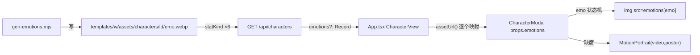

# docs/assets/01 — 六情绪差分：生产与接线

> 归属：`docs/assets/00-共同上下文.md` §10 分工表的 `01-六情绪差分.md`。
> 上游冻结：`docs/assets/00-共同上下文.md`（下称「assets 00」，2026-09-13 版）。**冲突时 assets 00 赢**；本文只登记冲突、不回改契约。
> 权威链（assets 00 §0）：assets 00 > `docs/nook/00` + `docs/audio/00` > `docs/前端改造计划.md` T3.2 > `doc-04 §10` / `doc-06 §3` > `assets/README.md`。
> 本文 owner 范围：**六情绪差分的生产链**（`tools/gen-emotions.mjs`、prompt 模板、抠像参数、webp 编码）与**接线**（`/api/characters` 的 `emotions` 字段、`CharacterModal` 切图、`index.css` 删除 filter 规则）。
> 边界：**不改**微动视频与 i2v（`02`）、**不改** firstsnow 双模板同步与 `sumi/` 清理（`03`）、**不改** `source-manifest` / AGENTS 回写（`04`）。本文只在这些交叉点上**登记接口与缺口**。
> 行号日期：2026-09-13 11:08（WSL2）。行号有保质期，实现前按符号名复核。
>
> **落地偏差登记（2026-09-13 实装后）**：本文 §⑧ 的落账写法按 `source-manifest.json` 描述，**实装改为独立的 `templates/<world>/assets/character-media.json`**（由 `tools/record-emotion-assets.mjs` 生成）——因为 `source-manifest.json` / `motion/seedance/manifest.json` 的测试断言**精确行数**绑死各自 sync 工具（`assets 00 §4.4` 已冻结此裁决）。其余设计与本文一致。

---

## ① 一句话定位

**把「六情绪」从 CSS 滤镜的幻觉，换成六个真透明的图片文件，并把「哪一个文件」的唯一决定权交给服务端探测**：生产侧一条零额度图片链（`base.png` → img2img 绿幕 → chromakey 抠像 → `cwebp -q 82`），消费侧一条单向回退链（有全套 `emotions` → `` 按 emo 切图；缺一张或旧世界无素材 → 原样回退 `MotionPortrait(video, poster)`）。图片与视频建议保持相近的视觉比例，但具体尺寸不锁定。

---

## ② 签名 / 参数

### 2.1 本片产物总览

```
tools/gen-emotions.mjs                                          ALREADY EXISTS  生产脚本（已在库，已实测产出）
node tools/gen-emotions.mjs --world <w> [--id <c>] [--force]    ALREADY EXISTS  CLI
node tools/gen-emotions.mjs --list                              ALREADY EXISTS  打印角色清单
genGreen({ basePath, anchor, emo, outPath }): Promise<void>     ALREADY EXISTS  tools/gen-emotions.mjs:119-143
keyToPng(greenJpg, pngOut): void                                ALREADY EXISTS  tools/gen-emotions.mjs:146-152
toWebp(pngIn, webpOut): void                                    ALREADY EXISTS  tools/gen-emotions.mjs:155-157
runCharacter(worldName, worldConf, id, conf, opts)              ALREADY EXISTS  tools/gen-emotions.mjs:162-222

GET /api/characters → { characters: [...] }                     MODIFY          apps/server/src/routes/world.ts:703-743 增可选 `emotions`
probeEmotions(store, id): Promise<Record<Emotion,string>|undefined>  NEW       建议落 world.ts 同文件（见 §8.2）
emotionUrlsOf(emotions, resolve): Record<Emotion,string>|undefined   NEW        建议落 apps/web/src/lib/emotions.ts

CharacterModalProps.emotions?: Record<Emotion,string>           NEW             apps/web/src/components/overlay/CharacterModal.tsx:34-54
 分支                                   NEW             同上 :713-723
CharacterView.emotions?: Record<Emotion,string>                 NEW             apps/web/src/App.tsx:54-65
```

### 2.2 `gen-emotions.mjs` 的接口逐条（已实现，逐字）

| 项 | 值 | 证据 |
|---|---|---|
| 情绪枚举 | `['normal','smile','shock','sad','angry','thinking']`（顺序固定） | `tools/gen-emotions.mjs:30` |
| 枚举是否与前端同源 | **手抄，非 import**（脚本 `.mjs` 不依赖 web 构建） | 同上；另见 `apps/web/src/lib/audio.ts:37` |
| 车间根 | `<repo>/assets/worlds` | `tools/gen-emotions.mjs:27-28` |
| 世界表 | `CHARACTERS` 只有 `whitechapel` / `firstsnow` 两个 key | `tools/gen-emotions.mjs:42-89` |
| 尺寸 | `--aspect portrait` → 实测输出 **768×1376** | `tools/gen-emotions.mjs:130`；实测见 §4.3 |
| 模型 | `nano-banana-2` | `tools/gen-emotions.mjs:129` |
| 参考图 | `--ref-image <characters/<id>/base.png>`（图生图） | `tools/gen-emotions.mjs:131` |
| 幂等键 | **`<variants>/<emo>-green.jpg` 存在即跳过生成** | `tools/gen-emotions.mjs:173-175` |
| 并发 | 每 6 个一批 `Promise.allSettled` | `tools/gen-emotions.mjs:179-197` |
| 依赖 | `FLOW_API_KEY`（代理 `127.0.0.1:8317`）、`ffmpeg`、`cwebp` | `tools/gen-emotions.mjs:20`、`:270-275` |
| 额度 | 图片链路**零额度**（实测 delta 0） | assets 00 §4.1 |

### 2.3 输出落点（脚本实际写的两条路径，逐字）

```
车间：assets/worlds/<worldConf.workshop>/characters/<dirname(base)>/variants/<emo>-green.jpg
      assets/worlds/<worldConf.workshop>/characters/<dirname(base)>/variants/<emo>.png
发布：templates/<worldName>/assets/characters/<id>/<emo>.webp
```

证据：`tools/gen-emotions.mjs:167-170`（`variantsDir` / `pubDir` 的 `mkdirSync`）、`:186-193`（绿幕源 outPath）、`:213-217`（png → webp）。

**`dirname(base)` 与 `<id>` 是两件事**：`conf.base` 可为别名目录。逐字：

```js
// tools/gen-emotions.mjs:82-86
// Canonical id `sumi-yukimura`, workshop dir is the legacy `sumi/`.
'sumi-yukimura': {
  base: 'sumi/base.png',
  anchor: 'a young japanese singer with a knit cap and scarf, clear earnest eyes with a trace of loneliness, snow-dusted coat, waist-up half-body shot',
},
```

→ 车间写在 `.../characters/sumi/variants/`，发布写在 `templates/firstsnow/assets/characters/sumi-yukimura/`。**发布位不出现 `sumi/`**，与 assets 00 §6.3「统一到 `sumi-yukimura`」一致。

### 2.4 抠像与编码（逐字）

```js
// tools/gen-emotions.mjs:145-152
/** chromakey + despill → transparent PNG (same family as the video keyer). */
function keyToPng(greenJpg, pngOut) {
  run('ffmpeg', [
    '-y', '-v', 'error', '-i', greenJpg,
    '-vf', 'chromakey=0x00FF00:0.18:0.06,despill=type=green:mix=0.6:expand=0.4,format=rgba',
    pngOut,
  ]);
}

// tools/gen-emotions.mjs:154-157
/** cwebp q82 → publish webp (same quality as sync-template-assets). */
function toWebp(pngIn, webpOut) {
  run('cwebp', ['-quiet', '-q', '82', '-m', '6', pngIn, '-o', webpOut]);
}
```

- `chromakey=<key>:<similarity>:<blend>` = `0x00FF00:0.18:0.06`。
- `despill=type=green:mix=0.6:expand=0.4`。
- `cwebp -q 82 -m 6` 与 `tools/sync-template-assets.mjs:89`（`spawnSync('cwebp', ['-quiet','-q','82','-m','6', input, '-o', output], …)`）**逐字同参数**——这正是 assets 00 §3.1「与 `sync-template-assets.mjs` 既有口径一致」的落点。

### 2.5 「与视频同族」的对齐程度

| 维度 | 静态图（本片） | 微动视频（`02`） | 证据 |
|---|---|---|---|
| 源 | img2img 绿幕 jpg | i2v 绿幕 mp4 | `gen-emotions.mjs:119-143`；assets 00 §4.2 |
| 键色 | `0x00FF00` | 同（`motion-clip.mjs` 的 `--key-color` 默认即探角点，实测绿 `0x05f603`） | `gen-emotions.mjs:149`；`tools/motion-clip.mjs:107-124` |
| `similarity` | **0.18** | **0.12**（`--similarity` 默认） | `gen-emotions.mjs:149`；`motion-clip.mjs:242,270` |
| `blend` | 0.06 | 0.03 | `gen-emotions.mjs:149`；`motion-clip.mjs:243,271` |
| `despill` | `type=green:mix=0.6:expand=0.4` | 同名默认值 | `motion-clip.mjs:244-245,272-274` |
| 落地格式 | `format=rgba` → webp | `format=yuva420p` → VP9 webm | `gen-emotions.mjs:149`；`motion-clip.mjs:186` |

**同族的部分是 despill 三参数**（图与视频**逐字同值**：`mix=0.6` / `expand=0.4`）——这是「同族」的硬证据。**参数并不完全一致的部分是 `similarity`/`blend`**（图 `0.18`/`0.06`，视频默认 `0.12`/`0.03`），原因合理：图需要更硬的边缘（一次成型、无逐帧抖动），视频要保住每帧一致的边缘。**这两组值不互相覆盖**（各在自己的命令里），所以不构成冲突；但 `04` 回写时若只写「同族」，读者会以为可以复制粘贴（见 §11-C5）。

---

## ③ 行为契约逐步（每步写「漏了会怎样」）

### 生产链（`gen-emotions.mjs`）

**1. 读车间 `base.png`。** `runCharacter` 先算 `wsBase`，不存在就打印 `✗ <id>: no workshop base at … — skipped` 并返回 `{ skipped: true }`（`tools/gen-emotions.mjs:163-166`）。
*漏了会怎样*：img2img 拿不到参考图，spawn 出的 `flow-gen.mjs` 会 `die('找不到图片文件')`（`tools/flow-gen.mjs:203-205`）——但那是在子进程里，错误只以尾 240 字符回传（`gen-emotions.mjs:141`），排查成本高。现脚本的 `existsSync` 前置检查就是为了把这条错误提前到主进程。

**2. 组装 prompt = `${LOCK} ${FACE[emo]}. ${anchor}. ${GREEN}`**（`tools/gen-emotions.mjs:121`）。
*漏了会怎样*：**这是本片最关键的一步**。
  - 缺 `LOCK`（`:91-94`）→ 图生图自由发挥，脸/发型/服装/画风漂移，六张不是同一个人。
  - 缺 `GREEN`（`:95-97`）→ 背景保留原场景，`chromakey` 找不到纯绿，抠出一张整图（未抠像原片透明占比 = 0%，见 §10.1 T-05）。
  - 缺 `anchor`（`CHARACTERS[w].cast[id].anchor`）→ 六张彼此之间也漂移。
  - 缺 `FACE[emo]`（`:33-40`）→ 六张是同一表情，差分名存实亡。

**3. 六路并发（每批 6），`Promise.allSettled`。** 单张失败计 `fail` 不抛（`:179-197`）。
*漏了会怎样*：改用 `Promise.all` 时一张 400 会让整批 rejected → `runCharacter` 冒泡 → `main().catch` → `process.exit(1)`（`:296-299`）；已生成的绿幕源留在盘上（不丢），但**同一 job 的其余角色后处理全部不跑**。

**4. 幂等闸门：`<emo>-green.jpg` 已存在 → 不重新生成。** 仅 `--force` 覆盖（`:173-175`）。
*漏了会怎样*：无闸门则每次重跑都烧 6×N 次上游（虽零额度，但 ~25s/张 × 12 角色 ≈ 30 分钟纯浪费），且同一 prompt 二次采样会产出不同表情——**已定稿的图被静默替换**。

**5. 后处理循环：对**每一个**情绪（不限于新生成的）跑 `keyToPng` → `toWebp`。**
*漏了会怎样*：闸门键（`-green.jpg`）与产物键（`<emo>.webp`）**不是同一个**。若某个 webp 被中断成 0 字节（实测 11:05 观察到 `edith/shock.webp` = 0 字节，11:08 已 80956 字节），**再跑同一条命令即可补齐，无需 `--force`**——第 5 步的「全量重算」正是这条恢复路径的实现基础。若改成「只处理新生成的」，0 字节 webp 将永远补不上。

**6. 发布位目录自动创建。** `fs.mkdirSync(pubDir, { recursive: true })`（`:170`）。
*漏了会怎样*：`cwebp` 写不存在的目录非零退出，`run()` 抛错（`:114-116` 不吞异常）→ 整个 `runCharacter` 崩。

**7. 汇总 `published N/6`。** 无绿幕源的情绪打印 `⚠ <id>/<emo>: no green source — publish skipped`（`:210-212`）。
*漏了会怎样*：静默产出「5/6」而无人知晓——而 §6 的探测规则正是「六张全在才回传」，5 张 = 前端完全看不到任何表情切换，且**没有任何报错**。这条日志是唯一观测点。

### 接线链（`/api/characters`）

**8. 对每个角色按固定枚举逐张探测 `<worldRoot>/assets/characters/<id>/<emo>.webp`。**
*漏了会怎样*：改成「前端拼路径」= assets 00 §8 反模式 1（第二真相源）；改成「猜目录里的文件名」= `docs/nook/03 §7.2` 的同族错误（`:760` 逐字「猜文件名会造第二条真相源」）。文件名是**固定枚举**，所以服务端探测是唯一合法来源。

**9. 六张全在才回传 `emotions`。** 缺一张 → 整个 key 不出现（**不是**回传残缺 map）。
*漏了会怎样*：回传残缺 map → 角色演到第 4 句 `sad` 时图突然没有 → 前端要么闪回 `MotionPortrait`（尺寸/形态突变），要么开天窗。assets 00 §5.1「避免半套表情切换时跳变」就是这条。

**10. 探测短路。** 建议 `for` 循环遇第一个 `missing` 立刻 `return undefined`。
*漏了会怎样*：不短路 = 每角色 6 次 `statKind` × 6 角色 = 36 次；短路后旧世界（无素材）只需 6 次。功能等价，纯成本项。

### 前端链（`CharacterModal`）

**11. `emotions` 存在 → ``，`emo` 由现有状态机驱动。**
*漏了会怎样*：不接则六张图生产出来也没人读——遮罩仍是 CSS 滤镜（现状 `index.css:424-449`）。

**12. `emotions` 缺席 → 原样渲染 `MotionPortrait(video=avatarVideo, poster=avatar)`。**
*漏了会怎样*：assets 00 §8 反模式 6（`avatarVideo` 与 `emotions` 竞争）。**回退链必须单向**：有图就不渲染 video。

**13. 删除 `index.css` 的五条 `.emo-*` filter 规则（`:424-449`）。**
*漏了会怎样*：留着 = 真图 + 滤镜双重作用——`sad` 的真图再叠 `grayscale(0.85) brightness(0.78)`（`:436`）会灰成另一件事；`angry` 还会多一个 `rotate(-2deg)`（`:442`）。这是**必须删**而非「可以留」。

**14. 呼吸动效 `.portrait-breathe` 不动。**（`index.css:385-401`）
*漏了会怎样*：删了就没有「活人感」，而 assets 00 §5.2 明确「保持不变」。

**15. `emo` 的 `thinking` 有特殊来源。** `applyMood` **显式跳过** `thinking`：`CharacterModal.tsx:173-179` 逐字 `if (mood === 'thinking') return; // 揭幕期暂态，不发音、不换立绘`；`thinking` 只由 `setEmo('thinking')` 直设（`:389-390` 揭幕、`:682-683` 发消息）。
*漏了会怎样*：若照搬「六情绪都由 page tag 驱动」的假设写验收，会把**已经正确的行为**判成 bug（第 N 句 page tag 写 `[emo: thinking]` 时立绘**不会**切换，这是刻意的）。反过来，若为「统一」把 `thinking` 也塞进 `applyMood`，则每次揭幕都切到一张「思考脸」，而揭幕期只有 100–400ms（`:391`）——一次可见闪烁。

---

## ④ 文件与副作用

### 4.1 生产链读写的文件

| 路径 | 方向 | 谁写 | 说明 |
|---|---|---|---|
| `assets/worlds/<workshop>/characters/<dir>/base.png` | 读 | — | img2img 参考图（1080×1440 实测，`rgb24`） |
| `assets/worlds/<workshop>/characters/<dir>/variants/<emo>-green.jpg` | 写 | `flow-gen.mjs`（子进程） | 绿幕源；**幂等键** |
| `assets/worlds/<workshop>/characters/<dir>/variants/<emo>.png` | 写 | `keyToPng` | 透明 PNG（实测 768×1376 `RGBA`） |
| `templates/<world>/assets/characters/<id>/<emo>.webp` | 写 | `toWebp` | 发布位（runtime 经 `/api/asset` 读） |

### 4.2 副作用与幂等

- **无数据库、无 WS、无网络副作用**（除上游 Flow 代理）。脚本本身不碰 `world.json`、不碰 README、不碰 `source-manifest.json`。
- **幂等**：同命令重跑，已存在的绿幕源跳过采样，只重算抠像 + webp（`:173-175`、`:201-219`）。发布 webp 被 `cwebp` 无条件重写（同输入 → 同输出，字节稳定）。
- **不可幂等的部分**：`--force` 会重新采样，六张图全部换脸。**`--force` MUST NOT 用于已定稿角色**。

### 4.3 实测产物（2026-09-13 11:08 快照）

```
$ python3 -c "from PIL import Image; im=Image.open('templates/whitechapel/assets/characters/watson/smile.webp'); …"
watson/smile.webp  RGBA (768, 1376)   alpha min/max 0/255   alpha==0 占比 34.8%
edith/shock.webp   RGBA (768, 1376)                         alpha==0 占比 34.9%
assets/worlds/whitechapel-demo/characters/watson/variants/smile.png  RGBA (768, 1376)
```

- **真透明成立**（不是不透明底），34.8% 的透明占比与「9:16 竖幅人像、背景全抠」的形态吻合。
- **`ffprobe` 对 webp 的 `pix_fmt` 不可作 alpha 判据（实测）**：`ffprobe -show_entries stream=pix_fmt templates/whitechapel/assets/characters/watson/smile.webp` → **`yuva420p`**（有 alpha），而**全不透明**的控制组 `/tmp/opaque.webp`（PIL 造 RGBA 全 255 + `cwebp -q 82 -m 6`）→ **`yuv420p`**。**注意：`yuva420p` 只表示"有 alpha 通道"，不表示 alpha 里真有 0**——一张全不透明的 RGBA 图经 `cwebp` 后同样可能被报成有/无 alpha（取决于编码器是否保留 alpha 通道），所以 `pix_fmt` 既不能证明透明、也不能反证。**这正是 assets 00 §7「真透明必须在 webp 解码后统计 alpha（ffprobe 单看 pix_fmt 不够）」的实证**。判据只有一条：解码后统计 `alpha == 0` 占比（T-02）。

### 4.4 覆盖率快照（同一时刻）

| 世界 | 角色 | 车间绿幕源 | 车间 PNG | 发布 webp |
|---|---|---|---|---|
| whitechapel | watson | 6/6 | 6/6 | ✅ 6/6 |
| whitechapel | edith | 6/6 | 6/6 | ✅ 6/6 |
| whitechapel | wayne | 6/6 | 6/6 | ✅ 6/6 |
| whitechapel | blackburn | 6/6 | 6/6 | ✅ 6/6 |
| whitechapel | tom | 6/6 | 6/6 | ✅ 6/6 |
| whitechapel | porter | — | — | ❌（无 `base.png`，永久跳过） |
| firstsnow | nanami | 6/6 | 6/6 | ✅ 6/6 |
| firstsnow | sumi-yukimura | 6/6 | 6/6 | ✅ 6/6 |
| first-snow-jp | nanami | 6/6（车间共享 firstsnow-demo） | 6/6 | ❌ **0/6**（未同步） |
| first-snow-jp | sumi-yukimura | 同上 | 同上 | ❌ **0/6**（未同步） |

> 采集时刻 **11:16**（同一次 `ls` 循环）。**whitechapel ×5 与 firstsnow ×2 已全部产出六张发布 webp**；`porter` 按 §A.3 永久跳过；`first-snow-jp` 的 `assets/characters/<id>/` 目录**尚不存在**（实测 `find templates/first-snow-jp/assets/characters -mindepth 2` 为空），即 assets 00 §6.2 的「两模板同名同字节」**尚未满足**——归 §12-U6。
>
> ⚠️ **这张表是移动靶**：同一采集窗口的前半段观察到 `edith/shock.webp` = 0 字节、`tom` 3/6；11:16 已全部自愈。生产**正在进行中**（有另一路在跑 `gen-emotions.mjs`）。本文所有覆盖率数字 MUST 按采集时刻读，**不要当结论**。

---

## ⑤ 落账

本片**不直接写** `source-manifest.json` / `assets/README.md` / 任何 PLAN（那是 `04` 的 owner）。本片对落账的**接口要求**只有两条：

1. **`templates/<world>/assets/characters/<id>/<emo>.webp` 是新增的发布位子目录**（assets 00 §3.1 冻结）。`04` MUST 把 6×N 条新增媒体按 `{ source, target, sourceSha256, targetSha256 }` 记入 `templates/<world>/assets/character-media.json`；尺寸和比例仅作 advisory。
2. **`assets/README.md:43-44` 与本次落点不一致**（原文逐字：「角色差分（variants）在 IP 包侧的落位待定（预设 image 字段目前单图）——差分体系成熟后在 `assets/avatars/<charId>/` 下扩展」）。本批落点是 `assets/characters/<id>/<emo>.webp`，**不是**`assets/avatars/`。这条回写归 `04`，本文只登记（见 §11-C6）。

另注：`assets/README.md:24` 的车间约定逐字为「`variants/` 差分（表情/状态：`<name>.png`，如 `angry.png` / `wounded.png`）」——本批文件名 `<emo>.png` 与它**逐字吻合**，无需改它（assets 00 §0 明示「照单沿用，不改写它」）。

---

## ⑥ WS / 前端

### 6.1 数据流



**无新增 WS 帧**：`emo` 的驱动源已是 WS 侧到货的 `character_delta` / `character_message`，经 `parseEmoPages` 解析（`apps/web/src/components/overlay/dialogue-pages.ts:50-82`）——**本片只换渲染目标，不换驱动链**。

### 6.2 `emo` 状态机的现状（不属本片改动，但必须说清接线点）

| 事件 | 落点 | 走 `applyMood`？ |
|---|---|---|
| 页含 `[emo: tag]` | `enterPage` → `applyMood(page.emo)`（`CharacterModal.tsx:310`） | ✅ |
| 发消息揭幕 | `setEmo('thinking')`（`:682-683`） | ❌ 直设 |
| `handleSend` 的 thinking phase | `setEmo('thinking')`（`:389-390`） | ❌ 直设 |
| watchdog 静默兜底 | `setEmo(silence.emo)`（`:432-433`，`sad`） | ❌ 直设 |
| 收工 / 重置 | `setEmo('normal')`（`:480`、`:625-626`） | ❌ 直设 |
| `applyMood('thinking')` | **直接 return，不切换**（`:174`） | — |

→ 结论：**`thinking.webp` 的触发面比其余五个窄**（只在揭幕期与发消息时可见；page tag 触发的 `thinking` 被故意忽略）。接线**不需要**为它写特例——`emo` state 本来就是它唯一的消费者。

### 6.3 `App.tsx` 的透传点

现状逐字：

```tsx
// apps/web/src/App.tsx:654-670
{activeCharacter && (
  <CharacterModal
    key={activeCharacter.id}
    characterId={activeCharacter.id}
    displayName={activeCharacter.name}
    avatar={assetUrl(activeCharacter.avatar)}
    avatarVideo={assetUrl(activeCharacter.avatarVideo)}
    effectsEnabled={effectsEnabled}
    bio={activeCharacter.bio || activeCharacter.description}
    incoming={activeModalFrame}
    worldId={manifest?.id}
    voice={activeCharacter.voice}
    …
```

新增一行 `emotions={emotionUrlsOf(activeCharacter.emotions, assetUrl)}`。

`assetUrl` 是 `App.tsx:80-84` 的模块级函数，对 `/`、`http:`、`data:`、`blob:` 开头透传，其余走 `airpGateway.assetUrl`（`apps/web/src/lib/airp-gateway.ts:68`，带 `&session=`）。所以服务端回传「世界相对路径」是**正确形状**（与 assets 00 §5.1 示例 `assets/characters/watson/smile.webp` 一致）。

### 6.4 前端渲染点

现状逐字（`CharacterModal.tsx:713-723`）：

```tsx
<div className="portrait-slot lit">
  <div className="portrait-breathe">
    <div className={`portrait-emo emo-${emo}${emo === 'shock' ? ' emo-shock-shake' : ''}`}>
      {showAvatar ? (
        <MotionPortrait video={avatarVideo} poster={avatar} enabled={effectsEnabled} name={displayName || characterId} onPosterError={() => setAvatarError(true)} />
      ) : (
        <div className="portrait-fallback" role="img" aria-label={`${characterId} portrait`}>
          {monogram}
        </div>
      )}
    </div>
  </div>
</div>
```

改写为三分支（**顺序固定，单向回退**）：

```tsx
{emoPortrait ? (
   setEmoError(emoPortrait)}   // NEW state: string | null
  />
) : showAvatar ? (
  <MotionPortrait … />
) : (
  <div className="portrait-fallback" …>{monogram}</div>
)}
```

其中 `const emoPortrait = emoError === emotions?.[emo] ? undefined : emotions?.[emo]`——**按 URL 记错**而非布尔，避免「某张图坏了就把整个角色降级回视频」。`showAvatar` 定义在 `:691`（`!avatarError && !!avatar`），保持不变。

---

## ⑦ 错误边界

| 场景 | 期望行为 | 支撑 |
|---|---|---|
| 某张情绪 webp 缺 1–5 张 | 服务端**整体不回传** `emotions`；前端走 `MotionPortrait` | 本片新增探测规则 §3-9 |
| 六张全缺（旧世界；`first-snow-jp` 在 11:16 时仍 0/6） | 同上，`emotions` key 不出现 | 旧世界天然如此；`first-snow-jp` 见 §12-U6 |
| 某张 webp 存在但**损坏 / 0 字节** | `statKind` 只看存在性 → 服务端会回传坏图 → `` → 该 emo 降级回 `MotionPortrait` | 需要 §6.4 的 `emoError` |
| `/api/characters` 整条失败 | 现有 try/catch → 500（`world.ts:740-742`），前端 `console.warn`（`App.tsx:191-192`）并留 `characters: []` | 不变 |
| `store` 为空（未载入世界） | `400 { error: 'No active world' }`（`world.ts:705-706`） | 不变 |
| 车间 `base.png` 缺失 | 生产侧 `skipped`，不产出任何 webp | `gen-emotions.mjs:163-166` |
| `ffmpeg` / `cwebp` 不在 PATH | `missing required binary: <bin>` → `exit(2)` | `gen-emotions.mjs:270-275` |
| `FLOW_API_KEY` 缺失 | `flow-gen.mjs` 上游 401 → 子进程非零退出 → `genGreen` reject → 计 `fail`，**不中断其余** | `gen-emotions.mjs:124-143`；`flow-gen.mjs:157-165` |
| 上游静默降级（比例被改） | `flow-gen.mjs` 打印「上游拒绝了请求的参数，已静默降级」（`flow-gen.mjs:246-265`）；**但 `gen-emotions.mjs` 不校验输出尺寸** | ⚠️ 见 §12-U4 |
| `applyMood('thinking')` | 不切图（**刻意**） | `CharacterModal.tsx:174` |
| 世界无 `assets/characters/<id>/` 目录 | 6 次 `statKind` 全 `missing` → `undefined` | `local-store.ts:196` |

**非空性**：`MotionPortrait` 的 poster 兜底链（`apps/web/src/components/overlay/MotionPortrait.tsx:24-27`：video 可用 → `<video>`；否则 ``；`poster` 也 error → `onPosterError` → `avatarError` → monogram）在 `emotions` 分支下**依然可达**，因为 `emotions[emo]` error 后就是 `MotionPortrait`。

---

## ⑧ 代码落点

### 8.1 生产（已落地，本片只登记 + 补缺口）

| 符号 | 文件:行 | 状态 |
|---|---|---|
| `EMOTIONS` | `tools/gen-emotions.mjs:30` | ✅ 已存在 |
| `FACE`（六情绪表情描述） | `tools/gen-emotions.mjs:33-40` | ✅ 已存在 |
| `CHARACTERS`（世界表 + `anchor` + `style`） | `tools/gen-emotions.mjs:42-89` | ✅ 已存在 |
| `LOCK` | `tools/gen-emotions.mjs:91-94` | ✅ 已存在 |
| `GREEN` | `tools/gen-emotions.mjs:95-97` | ✅ 已存在 |
| `genGreen`（prompt 组装 + spawn） | `tools/gen-emotions.mjs:119-143` | ✅ 已存在 |
| `keyToPng`（chromakey + despill） | `tools/gen-emotions.mjs:146-152` | ✅ 已存在 |
| `toWebp`（cwebp q82 m6） | `tools/gen-emotions.mjs:155-157` | ✅ 已存在 |
| `runCharacter`（落点 + 幂等 + 后处理） | `tools/gen-emotions.mjs:162-222` | ✅ 已存在 |
| `main`（CLI） | `tools/gen-emotions.mjs:228-300` | ⚠️ 见 §11-C2（`--all` 死参数） |

### 8.2 服务端（本片实现）

**文件**：`apps/server/src/routes/world.ts`

- 新增 `EMOTIONS` 常量（位置候选见 §12-U1）。
- 新增 `probeEmotions(store, id)`，建议置于 `:703` 的 `router.get('/characters', …)` 上方，与 `readLayerItems`（`:301`）等同类 helper 并列。
- 修改 `:709-738` 的 `Promise.all` 映射体：在 `return { ...c, avatar: avatar || '…', avatarVideo, bio, ...(voice ? { voice } : {}) }`（`:730-736`）里追加 `...(emotions ? { emotions } : {})`。
  - **MUST NOT** 无条件回传 `emotions: undefined`——JSON 序列化虽会丢掉它，但用 spread 条件键与现有 `voice` 写法（`:735`）保持一致，也让「key 是否存在」成为可断言的契约。
- 探测用 `store.statKind(relPath)`：接口 `packages/shared/src/store/world-store.ts:130`，实现 `packages/shared/src/store/local-store.ts:196`，返回 `'file' | 'dir' | 'missing'`。**MUST NOT** 用 `listFiles`——`world.ts:452-455` 已有逐字警告：「`statKind` 是唯一能区分 missing 与 empty 的原语；`listFiles` 对两者都返回 `[]`」。
- `world.ts` 头部已 import `existsSync`（`:5`）与 `path`（`:7`），可直接复用 `existsSync(path.join(store.worldRoot, rel))`；但 `statKind` 更贴合既有风格且对「目录也被叫做 `<emo>.webp`」这种畸形同样返回非 `'file'`。

### 8.3 前端（本片实现）

| 符号 | 文件:行 | 动作 |
|---|---|---|
| `CharacterModalProps` | `apps/web/src/components/overlay/CharacterModal.tsx:34-54` | 新增 `emotions?: Record<Emotion, string>` |
| 解构参数表 | 同上 `:92-107` | 新增 `emotions,` |
| `emoError` state | 同上，紧邻 `avatarError`（`:122-126` 区） | NEW `useState<string \| null>(null)` |
| 渲染三分支 | 同上 `:713-723` | 修改 |
| `CharacterView` | `apps/web/src/App.tsx:54-65` | 新增 `emotions?: Record<Emotion, string>` |
| `emotionUrlsOf` | `apps/web/src/lib/emotions.ts`（新文件） | NEW（纯函数，jiti 可测） |
| 透传 | `apps/web/src/App.tsx:654-670` | 新增一行 prop |
| `Emotion` 类型 import | `apps/web/src/App.tsx:31`（已有 `import { preloadAudio } from './lib/audio.js';`） | 改为 `import { preloadAudio, type Emotion } from './lib/audio.js';` |
| CSS | `apps/web/src/index.css:403-405`（注释）+ `:424-449`（五条 filter 规则） | 删规则 + 改注释 |

`Emotion` 的 import 形状可参照同仓既有写法：`apps/web/src/components/overlay/CharacterModal.tsx:4` 逐字 `import { playStinger, playVoice, stopVoice, unlock, type Emotion } from '../../lib/audio.js';`。

### 8.4 CSS 的精确删除范围

逐字现状（`apps/web/src/index.css`）：

```
403: /* Emotion diffs — CSS-only until sprite-sheet assets land (T3.2/T3.8).
404:    Once emo sheets arrive, replace these filter rules with background-position
405:    sprite switching on .portrait-emo. */
406: .portrait-emo { … }                          ← 保留（容器）
417: .portrait-emo img, .portrait-emo video { … } ← 保留（object-fit: contain; object-position: center top）
423: (空行)
424: .emo-smile { … }        ← 删 424-427
428: (空行)
429: .emo-shock { … }        ← 删 429-432
433: (空行)
434: .emo-sad { … }          ← 删 434-437
438: (空行)
439: .emo-angry { … }        ← 删 439-443
444: (空行)
445: .emo-thinking { … }     ← 删 445-449
450: (空行)
451: .emo-shock-shake { … }  ← 保留
455: @keyframes emoShockShake { … } ← 保留（455-466）
```

**删除范围：`424-449`**（含五条规则与它们之间的 4 个空行分隔，但不含 423 与 450 的分隔空行——保留它们以免 `:417-422` 与 `:451` 贴在一起）。并改写 `403-405` 注释（它自陈「CSS-only until sprite-sheet assets land」——本批素材已 land，这条注释若不改就是**过时真相源**）。

**保留 `.emo-shock-shake`（`451-453`）与 `@keyframes emoShockShake`（`455-466`）**：它作用在容器上，对静态图同样有效（抖动是容器 `transform`，不是滤镜）。

> ⚠️ `.portrait-emo`（`406-415`）与 `.portrait-emo img, .portrait-emo video`（`417-422`）**不属于 filter 规则**，是容器与适配规则。assets 00 §5.2 写的删除范围「`index.css:403-449`」在这两段上**过宽**（见 §11-C4）。

### 8.5 `emo-${emo}` 类名的去向

`CharacterModal.tsx:715` 的模板 `` `portrait-emo emo-${emo}${emo === 'shock' ? ' emo-shock-shake' : ''}` `` 在删掉五条规则后，`emo-smile` / `emo-shock` / `emo-sad` / `emo-angry` / `emo-thinking` 五个类名**没有任何 CSS 消费者**（实测 grep：`apps/web/src` 内除 `index.css:424-449` 外无第二处定义）。

**裁决：保留 `emo-${emo}` 类名。** 它是验收测试断言「当前是哪一个情绪」的唯一**不依赖解码图片**的 DOM 钩子（`document.querySelector('.portrait-emo')?.classList.contains('emo-sad')`）。删掉它，§10 的前端验收就只能比对 `` 字符串，更脆。这是**保留一个零成本钩子**，不是保留死 CSS。

---

## ⑨ 与现状差异

| # | 现状（带 file:line） | 本片之后 |
|---|---|---|
| D1 | 六情绪是 **CSS filter 模拟**：`.emo-smile`…`.emo-thinking`（`apps/web/src/index.css:424-449`），注释自陈「CSS-only until sprite-sheet assets land」（`:403`） | 真图切换；五条 filter 规则删除；注释重写 |
| D2 | `/api/characters` 只回 `avatar` / `avatarVideo` / `bio` / `voice`（`apps/server/src/routes/world.ts:730-736`） | 增可选 `emotions`（六张全在才出现） |
| D3 | `CharacterModal` 只有 `MotionPortrait(video, poster)` 一条渲染路径（`:717`） | 三分支：`emotions[emo]` → `MotionPortrait` → monogram |
| D4 | `templates/<world>/assets/characters/` 只有**平铺的 `<id>.webp`**（`watson.webp` / `edith.webp` …），外加本批**新生**的 `<id>/` 子目录 | 两种形态并存：`<id>.webp`（avatar 单图）与 `<id>/<emo>.webp`（六情绪）。**不是替换关系**，`avatar` 字段仍指向 `<id>.webp` 或 motion poster |
| D5 | `apps/web/src/App.tsx:54-65` 的 `CharacterView` 无 `emotions` | 新增 |
| D6 | `packages/shared/src/schemas/world.ts:17-25` 的 `CharacterConfigSchema` **无** `emotions` | **不需要改**：它校验 `world.json` 的 `characters[]`，而 `emotions` 是路由**响应**字段，响应无 schema 校验。若将来要允许 `world.json` 声明才动 schema（§12-U3） |
| D7 | `tools/gen-emotions.mjs:230-236` 解析 `--all` 但 `main` 从不读 `opts.all` | 死参数（§11-C2） |
| D8 | `apps/web/src/components/overlay/dialogue-pages.ts:16` 手抄 `EMO_TAGS`；`apps/web/src/lib/audio.ts:37` 是另一份 | 若本片在服务端再抄一份将变**三份**（§12-U1） |
| D9 | `.portrait-emo img, .portrait-emo video` 已有 `object-fit: contain; object-position: center top`（`index.css:417-422`） | **不改**：768×1376 的 9:16 图塞进 `min(40vh,26vw,360px) × min(64vh,560px)` 的槽位（`:369-376`，约 9:14）靠它 letterbox，无需新 CSS |
| D10 | `world.json` 的 `characters[].avatar` 已是「单图」，`avatarVideo` 已是「微动」 | 不变。`emotions` **不写进 `world.json`**（assets 00 §5.1 冻结为路由探测字段） |
| D11 | 全仓**没有**任何文件描述「App 侧 emo 处理」的注释；`grep -rn "CSS 滤镜\|Emotion:" apps/web/src` 只命中 `dialogue-pages.ts:15` 与 `:32`（均 `(T3.2)` 标注） | 本片**不新增** App 侧注释；`dialogue-pages.ts:15` 的 `(T3.2)` 措辞可保留（它讲的是 tag 来源，不涉渲染） |
| D12 | `apps/web/src/index.css:403-405` 的注释逐字「Once emo sheets arrive, replace these filter rules with background-position sprite switching」 | 改写为「六张独立 webp 已 land；切图由 `CharacterModal` 的 `` 完成」 |

## ⑩ 验收测试

### 10.1 生产侧机检（shell，逐条可跑）

```bash
# T-01 六张全在（发布位）
for e in normal smile shock sad angry thinking; do
  f=templates/whitechapel/assets/characters/watson/$e.webp
  test -f "$f" || echo "MISSING $f"
done

# T-02 真透明 + 尺寸（MUST 解码后统计 alpha；ffprobe 单看 pix_fmt 不够 —— assets 00 §7）
python3 - <<'PY'
from PIL import Image
im = Image.open('templates/whitechapel/assets/characters/watson/smile.webp')
assert im.mode == 'RGBA', im.mode
a = list(im.getchannel('A').getdata())
t = sum(1 for v in a if v == 0) / len(a)
assert 0.20 < t < 0.60, t            # 实测 34.8%
assert im.size == (768, 1376), im.size
print('ok', t)
PY

# T-03 九个角色 × 六情绪的全存在性
for w in whitechapel firstsnow; do
  case $w in whitechapel) ids="watson edith wayne blackburn tom";; firstsnow) ids="nanami sumi-yukimura";; esac
  for id in $ids; do for e in normal smile shock sad angry thinking; do
    f=templates/$w/assets/characters/$id/$e.webp
    test -f "$f" || echo "MISSING $f"
  done; done
done
```

### 10.2 路由测试（`apps/server/test/character-emotions.test.mjs`，NEW）

沿用既有范式：`apps/server/test/nook-routes.test.mjs:1-30` 的 `LocalWorldStore` over `mkdtemp` + `createWorldRouter` over express，跑 **built dist**（`pnpm --filter @airp/server build` 后 `node --test …`）。测试世界手动 `writeFile('assets/characters/<id>/<emo>.webp', …)` 造素材。

| 用例 | 断言 | 非空性（没有本修复会怎样） |
|---|---|---|
| E-01 六张全在 | `emotions` 存在，恰 6 个 key，值为 `assets/characters/<id>/<emo>.webp` | 现状无 `emotions` 字段 → `assert.ok(body.characters[0].emotions)` **失败** |
| E-02 **只放 5 张**（删 `thinking.webp`） | `emotions` **不存在**（`assert.ok(!('emotions' in c))`） | 无「6 张全在」规则时会回传 5 张残缺 map → 角色演到 `thinking` 时图缺失 → 断言 `!('emotions' in c)` 失败 |
| E-03 六张全缺 | `emotions` 不存在，且**不是** `{}` | 若实现成「总是回传 map，缺失的填 undefined」，JSON 会变 `{}` 或含 `null` → 断言失败 |
| E-04 旧字段不回归 | `avatar` / `avatarVideo` / `bio` / `voice` 逐字不变 | 防止在 `:730-736` 改动时误删 spread |
| E-05 非 `file` 形态 | 把某 `<emo>.webp` 建成**目录** | `statKind` 返回 `'dir'` → 必须判 `!== 'file'` → 回传 `emotions` 则失败 |
| E-06 `id` 无素材目录（`porter`） | 6 次探测全 `missing`，`emotions` 不存在，其余字段正常 | 防止 porter 触发异常 500 |

**断言形状（建议）**：

```js
const res = await fetch(`${base}/api/characters`);
const body = await res.json();
const watson = body.characters.find(c => c.id === 'watson');
assert.equal(watson.emotions.normal, 'assets/characters/watson/normal.webp');
assert.deepEqual(Object.keys(watson.emotions).sort(), ['angry','normal','sad','shock','smile','thinking']);
const only5 = body.characters.find(c => c.id === 'only5');
assert.ok(!('emotions' in only5));
```

### 10.3 前端单元测试（`apps/web/test/emotions.test.mjs`，NEW，jiti 直测纯模块）

参照 `apps/web/test/voice-engine.test.mjs` 直接 import `dialogue-pages.js` 的做法（`dialogue-pages.ts:5` 逐字注释：「Zero React imports: the jiti test in `apps/web/test/voice-engine.test.mjs` imports this module directly」）。`lib/emotions.ts` 必须保持**零 React import** 才能走这条。

| 用例 | 断言 |
|---|---|
| F-01 完整 map | `emotionUrlsOf({normal:'a',…}, p => '/api/asset?path=' + p)` 返回 6 个映射后的 URL |
| F-02 `undefined` | 返回 `undefined`（不是 `{}`） |
| F-03 半套 map（少一个 key） | 返回 `undefined`（**客户端也兜一层**，防御服务端未来改动 / 手工 mock） |
| F-04 值含 `/api/asset` | 与 `App.tsx:80-84` 的透传一致：`resolve` 决定，函数本身不做二次编码 |
| F-05 未知 emo key | 忽略（只认六个枚举） |

### 10.4 前端行为验收（浏览器，非自动化断言）

在 `http://127.0.0.1:8792/` 打开 `whitechapel`，点 watson 头像进遮罩：

1. **有 `emotions`**：DevTools 里 `` 随对话推进变化（`[emo: smile]` 页 → `…/smile.webp`）；`<div class="portrait-emo emo-smile">` 类名同步变化。
2. **无残留滤镜**：切到 `sad` 时 `getComputedStyle(portraitEmo).filter === 'none'`（删除规则前会是 `grayscale(0.85) brightness(0.78)`）。
3. **切图不阻塞呼吸**：`.portrait-breathe` 的 `transform` 仍在跑（`index.css:390` 的 5s 无限动画）。
4. **回退**：临时把 `templates/<world>/assets/characters/watson/thinking.webp` 改名 → 重载 → 该角色**整体**回到 `MotionPortrait`（`<video>` 或 poster ``），六张图一张都不显示。
5. **旧世界**：切到无情绪图的世界（`wuwu` / `divergence`）→ 完全不变（无 `` 切图，无 CSS 报错）。

**非空性（MUST）**：第 2 条与第 4 条各自能证明「没有这个修复就会失败」——第 2 条在未删 CSS 时 filter 非 `none`；第 4 条在未实现「6 张全在」时仍会切图。

### 10.5 生产侧非空性断言

| 用例 | 断言 | 非空性 |
|---|---|---|
| T-04 `--list` | 输出含 `whitechapel (whitechapel-demo):` + 5 个 id，`firstsnow (firstsnow-demo):` + `nanami` / `sumi-yukimura` | 无 `--list` 分支时直接 `--help` 退出（`:241-256`） |
| T-05 未抠像原片透明占比 = 0 | `PIL.open('…/variants/smile-green.jpg')` 无 alpha 通道（`RGB`/`L`）→ 证明 T-02 的「真透明」不是所有 jpg 都满足 | **assets 00 §7 点名的非空性断言**：「真 alpha 断言对未抠像的原片返回 0% 透明」 |
| T-06 幂等 | 连跑两次 `gen-emotions.mjs --world whitechapel --id watson`，第二次输出 `· watson: all 6 green sources present — post-processing only`（`gen-emotions.mjs:176`），且绿幕源 mtime 不变 | 无闸门时第二次会重采样，mtime 改变 |

---

## ⑪ 发现的冲突

**C1 · T3.2 的精灵表契约 vs assets 00 的单图契约（实质冲突，已由 assets 00 裁决）**
`docs/前端改造计划.md:363-367` 逐字：「**走精灵表，不走 6 个独立 PNG**：一张 `900×760` 裁 `3×2`、每格 `300×380` 的表情表……切表情 = 改 `background-position`，`background-size: 300% 200%`……**容器必须 `aspect-ratio: 300/380`**」，并在 `:618` 复述「精灵表而非 12 个 PNG」。而 assets 00 §3.1/§5.2 冻结的是**六个独立 webp + `` 切换**。
**裁决**：assets 00 §0 的权威链已把 T3.2 置于 assets 00 之下，故**单图胜**。但 `docs/前端改造计划.md:643` 的 P3 待办仍逐字写「剩余：6 情绪精灵表（T3.2）」——这是一条**过时的待办**，`04` 应回写它（本文不改那份文件）。
**影响**：`index.css:403-405` 的注释也逐字指向精灵表方案（`background-position sprite switching`），删除 `424-449` 时 MUST 一并改写，否则两处都留着已废弃的方案描述。

**C2 · `--all` 是死参数**
`tools/gen-emotions.mjs:17`（usage 注释）与 `:245`（help 文本）都列了 `--all`，`:236` 解析 `opts.all = true`，但 **`main` 从不读 `opts.all`**（全文 grep `opts.all` 仅命中 `:230`/`:236` 两处）。无 `--id` 时本来就跑整个 cast（`:283` `const ids = opts.id ? [opts.id] : Object.keys(worldConf.cast)`）。
**影响**：功能上无害（没有 `--world` 时 `--all` 也不生效，因为 `--world` 仍是必填）。但这是**文档与实现不符**——用户按 help 敲 `--world firstsnow --all` 以为有特殊语义。建议要么删这两处文案，要么让它成为显式别名。**不属本片改动**（脚本已被 `02` 的同类工作共用），登记给 `04`。

**C3 · firstsnow 的 `sumi/` 别名目录让两份车间真实源不一致**
`gen-emotions.mjs` 的 `CHARACTERS.firstsnow.cast['sumi-yukimura'].base = 'sumi/base.png'`（`:84`），车间目录名是 `sumi`；但 firstsnow 的**发布位**与 `world.json` 的角色 id 都是 `sumi-yukimura`（`templates/firstsnow/world.json:41`）。同时 `templates/firstsnow/characters/` 下**同时存在** `sumi/` 与 `sumi-yukimura/` 两个目录。
**性质**：这是 assets 00 §6.3 已知并已裁决的遗留（「删除 `sumi/` 遗留目录」），**但它的清理归 `03`，不归本片**。本片只登记：**生产侧仍指向 `sumi/base.png`**，所以 `03` 删 `characters/sumi/`（模板内容目录）时 **MUST NOT** 顺手删车间的 `assets/worlds/firstsnow-demo/characters/sumi/`——那是立绘源，删了就跑不了 `gen-emotions`。

**C4 · assets 00 §5.2 的 CSS 删除范围过宽**
assets 00 §5.2 逐字：「**移除 `.emo-*` CSS filter 规则**（`.portrait-emo` 的真图切换取代滤镜模拟，`index.css:403-449`）」。实际 `403-449` 区间内 **`406-422` 不是 filter 规则**，而是 `.portrait-emo` 容器（flex 布局 + `transition: filter`）与 `.portrait-emo img, .portrait-emo video`（`object-fit: contain` / `object-position: center top`）。后者被新 `` 分支直接依赖（§9-D9）。
**裁决（实现口径）**：删除范围 = **`424-449`**（§8.4 逐行给出），并改写 `403-405` 注释。这是对契约的**精确化读法**，不是回改契约（契约的意图是「删 filter 规则」，本文落的是同一意图）。

**C5 · 「与视频同族」在参数上并不逐字相同**
§2.5 已列：`despill` 三参数图/视频逐字同值，但 `similarity`/`blend` 不同（图 `0.18`/`0.06`，视频默认 `0.12`/`0.03`，`tools/motion-clip.mjs:242-243,270-271`）。assets 00 §4.1 给的 shell 示例写的是 `colorkey=0x00FF00:0.18:0.06`——**这是 `colorkey`，而脚本实现用的是 `chromakey`**（`gen-emotions.mjs:149`）。
**性质**：`colorkey` 与 `chromakey` 是 ffmpeg 两个不同滤镜（前者按色距硬键，后者按 UV 平面距离 + 混合），参数语义相似但**不等价**。契约示例与实现不一致。
**裁决**：**以实现为准**（脚本已在库并被本批使用，产出实测真透明 34.8%）。但这意味着 assets 00 §4.1 的代码块**不是**可直接复制的命令。建议 `04` 把契约示例改成与 `gen-emotions.mjs:149` 逐字一致（或注明「示例为 `colorkey`，实现用 `chromakey`，勿混用」）。**本文不改 00。**

**C6 · `assets/README.md:43-44` 的差分落位预测与 assets 00 冻结不符**
`assets/README.md` 逐字：「角色差分（variants）在 IP 包侧的落位待定（预设 image 字段目前单图）——差分体系成熟后在 `assets/avatars/<charId>/` 下扩展，先在本车间积累。」而 assets 00 §3.1 冻结的发布位是 `assets/characters/<id>/<emo>.webp`（**`characters/`，不是 `avatars/`**）。回写归 `04`（§5-2）。

**C7 · `porter` 在 `world.json` 无 `avatar`，与其余五个角色不同构**
`templates/whitechapel/world.json:68-73` 的 porter 只有 `id` / `home` / `role` / `description`，**无 `avatar` / `avatarVideo`**；其余五个都有 `avatar`。`docs/worlds/模板资源对齐清单.md:31` 逐字：「雾都 Porter 暂无正式立绘；**不借其他角色图片填充**。」
**性质**：不是冲突，是 assets 00 §8 反模式 5 的依据。本片跳过 porter 并登记（见附录 A）。

**C8 · `CharacterModal.tsx:715` 的 `emo-${emo}` 在删规则后成为纯钩子**
契约未提这个类名的去留。本片裁决**保留**（§8.5）。若 `04` 的回写清单里写「删除所有 `.emo-*`」，会与本节冲突——需以本节为准（容器类的删除范围见 C4）。

---

## ⑫ 仍未知待拍板

**U1 · `Emotion` 枚举的第三份手抄要不要收敛？**
现状两份：`apps/web/src/lib/audio.ts:37`（唯一正典，assets 00 §9 认定）与 `apps/web/src/components/overlay/dialogue-pages.ts:16` 的 `EMO_TAGS`。本片在服务端（`world.ts`）**必须**再写一份——`apps/server` 能否 import `apps/web`？**不能**（依赖方向）。`@airp/shared` 里**没有** `Emotion`（实测 `packages/shared/src/schemas/world.ts` 与 `index.ts` 均无），且 `lib/audio.ts` 是 `apps/web/src` 下的纯类型 + Web Audio 实现，搬进 shared 会把它拽进 Node 侧。
**待拍板**：三选一 ——（a）服务端就地手抄第三份（最小改动，但违反「一个事实一处」）；（b）把 `export type Emotion` 提到 `packages/shared`，`audio.ts:37` 改为 re-export（一处定义，但动了一个不在本片 owner 内的文件）；（c）把 `EMO_TAGS` 提到 shared，`audio.ts` 与 `dialogue-pages.ts` 都改 import。
**本文默认**：（a），并在 `world.ts` 的 `EMOTIONS` 上写一行注释指向 `apps/web/src/lib/audio.ts:37` 为唯一正典。**若主 agent 选 (b)/(c)，本片需同步改 `dialogue-pages.ts:16`（不属本文档 owner，须另立任务）。**

**U2 · `probeEmotions` 的探测成本要不要缓存？**
`/api/characters` 每次调用会做 `characters.length × 6` 次 `statKind`（whitechapel 6 角色 = 36 次 `fs.stat`）。当前调用频率是「载入世界时一次」（`App.tsx:180-191` 的批量 refresh），36 次 stat 在本地文件系统上 < 5ms，**不需要缓存**。但若将来 `/api/characters` 被轮询，或角色数 > 20，需要考虑。
**待拍板**：本片建议**不缓存**（YAGNI），但把这条写成已知成本。

**U3 · `world.json` 要不要允许声明 `emotions`？**
assets 00 §5.1 冻结为**路由探测**（「MUST NOT 由前端拼路径……服务端探测是唯一合法来源」）。但创作者若想显式声明（比如某角色只做了 4 个情绪、想让它们生效），当前规则会**整体拒绝**。
**待拍板**：保持 strict（6 张全在）还是允许 `world.json` 覆盖？**本文默认 strict**（契约字面）。若将来放开，`packages/shared/src/schemas/world.ts:17-25` 的 `CharacterConfigSchema` 需加字段，且 `world.ts:709-738` 要处理「声明 vs 探测」的优先级。

**U4 · 生成后的尺寸校验要不要加？**
脚本不校验输出尺寸；这是有意的，因为不同 provider 的有效输出尺寸和长宽比不应成为发布门禁。生产 prompt 仍建议使用 portrait，以减少遮罩中的视觉跳变；组件通过 `object-fit: contain` 适配其它有效比例。
**已决**：门禁只检查文件存在、真实 alpha、溯源摘要和资产引用；尺寸与比例作为 advisory 输出，不因不符合建议值而失败。

**U5 · `porter` 的 `emotions` 探测结果**
porter 无 `avatar`，也无车间 `base.png`（实测 `assets/worlds/whitechapel-demo/characters/porter` 不存在）。所以 `probeEmotions` 对它天然返回 `undefined`（6 次 `missing`）。但它**是否应该出现在 `/api/characters` 里**是另一个问题：`world.json:68-73` 有它，`:732` 的 `avatar || '/assets/characters/portraits/fella_1.png'` 会给它一个**占位头像**。
**待拍板**：assets 00 §8 反模式 5 只说「不擅自补图」，没说要不要保留这个占位。本片**保持现状**（不动），并在此登记：porter 在遮罩里会显示 `fella_1.png` 占位 + monogram 回退链行为由 `avatar` 是否存在决定。**若**主 agent 认为占位头像本身也违反「不填充」精神，需另立裁决（改 `world.ts:732`，不属本片）。

**U6 · firstsnow 与 playtest 情绪图同步方式**
情绪图先在已有生产源与正式模板中生成，再以字节复制方式同步到对应 playtest 发布位；`first-snow-jp` 与 `first-snow-jp-playtest` 沿用同一份 firstsnow 素材。`tools/record-emotion-assets.mjs` 为所有已同步模板生成各自的 `character-media.json`，门禁负责逐模板核验。
**已决**：同步不重新生成图片，也不把图片尺寸写成硬契约；视频和图片是否接线由各模板现有 frontmatter 决定。

---

## 附录 A · 员工角色清单（本片生产的 cast）

「员工角色」= 有正式立绘（车间 `base.png` 存在）的 cast 成员。清单**逐字取自** `tools/gen-emotions.mjs:42-89` 的 `CHARACTERS`，并以实测车间目录复核。

### A.1 whitechapel（`workshop: 'whitechapel-demo'`）

| id | 车间 base | 发布位 `<id>/<emo>.webp` | 情绪图 | 备注 |
|---|---|---|---|---|
| `watson` | `watson/base.png` ✅ | ✅ 6/6 | **已完成** | 唯一同时有 `base-transparent.png` 与正式微动 webm 的角色 |
| `edith` | `edith/base.png` ✅ | ✅ 6/6 | **已完成** | 采集窗口内曾观察到 `shock.webp` = 0 字节，后自愈 |
| `wayne` | `wayne/base.png` ✅ | ✅ 6/6 | **已完成** | 生成顺序最晚（11:08 时车间 PNG 为 5/6，发布已是 6/6） |
| `blackburn` | `blackburn/base.png` ✅ | ✅ 6/6 | **已完成** | — |
| `tom` | `tom/base.png` ✅ | ✅ 6/6 | **已完成** | 窗口内从 3/6 → 6/6 |
| `porter` | ❌ **无 `base.png`** | ❌ | **跳过** | 见 A.3 |

### A.2 firstsnow（`workshop: 'firstsnow-demo'`）

| id | 车间 base | 发布位 | 情绪图 | 备注 |
|---|---|---|---|---|
| `nanami` | `nanami/base.png` ✅ | ✅ 6/6 | **已完成** | 有 `base-transparent.png`（`rgba`）+ 微动 webm；`first-snow-jp` 侧**未同步** |
| `sumi-yukimura` | `sumi/base.png` ✅（**别名目录**） | ✅ 6/6 | **已完成** | 发布位 id 为 `sumi-yukimura`；车间目录是 `sumi/`（`gen-emotions.mjs:84`）。`first-snow-jp` 侧**未同步** |

firstsnow 的车间 `variants/` 目录在 11:16 时已存在且十二个文件齐全（6×`-green.jpg` + 6×`.png`）。

### A.3 `porter`：跳过并登记（MUST NOT 补图）

**事实**（逐条带证据）：

| 事实 | 证据 |
|---|---|
| `world.json` 里有 porter，但**无 `avatar` / `avatarVideo`** | `templates/whitechapel/world.json:68-73` |
| 有角色内容目录与 preset | `templates/whitechapel/characters/porter/{README.md,identity.md,memory.md,personality.md,preset.json}`；`preset.json:3` `"id": "porter"` |
| 有世界内卡片 | `templates/whitechapel/world/case-board/fleet-street-press/porter.md` |
| 车间**无**立绘目录 | 实测 `assets/worlds/whitechapel-demo/characters/` 只有 `edith/ watson/ wayne/ tom/ blackburn/` |
| `gen-emotions.mjs` 的 cast **不含** porter | `tools/gen-emotions.mjs:48-85`（whitechapel cast 五个人） |
| 上游文档明确不补 | `docs/worlds/模板资源对齐清单.md:31` 逐字「雾都 Porter 暂无正式立绘；不借其他角色图片填充。」 |
| assets 00 反模式 5 | 「MUST NOT 把 `porter`（无正式立绘）擅自补图……本批跳过并登记」 |

**因此**：
1. `gen-emotions.mjs` 的 `CHARACTERS.whitechapel.cast` **MUST NOT** 加 porter（无 `base.png`，加了也只会走 `skipped` 分支并打印 `✗ porter: no workshop base …`）。
2. `templates/whitechapel/assets/characters/porter/` **MUST NOT** 创建。
3. `/api/characters` 对 porter 因「六张全缺」天然不回传 `emotions`——**这正是「6 张全在」规则的正常覆盖**，无需为它写特例。
4. porter 在遮罩里仍会走 `MotionPortrait(poster=avatar)`；而 `world.ts:732` 的 `avatar || '/assets/characters/portraits/fella_1.png'` 会给它一个**占位图**（见 §12-U5）。

### A.4 cast 之外的角色（不在本批范围）

| 角色 | 出处 | 为何不在本片 |
|---|---|---|
| `sherlock-holmes` | `templates/whitechapel/world.json:77-81` 的 `player`（**玩家**，不是 cast） | `gen-emotions.mjs` 只处理 `cast`；玩家立绘走 `avatar` 单图（`assets/characters/sherlock-holmes.webp`） |
| `radio-director` | `templates/firstsnow/world.json:50-54` 的 `player` | 同上 |
| `holmes` | `templates/whitechapel/assets/characters/holmes.webp`（**文件存在但未在 `world.json` 的 `characters[]` 里引用**） | 孤儿资产，本批不动 |
| `director` / `sumi`（平铺 `.webp`） | `templates/firstsnow/assets/characters/director.webp`、`sumi.webp` | 旧 id 遗留，清理归 `03` |

---

## 附录 B · 一页速查（实现时按此打勾）

```
生产（已落地，只复核）
  □ node tools/gen-emotions.mjs --world whitechapel        → 六角色 6/6 全绿
  □ node tools/gen-emotions.mjs --world firstsnow          → nanami / sumi-yukimura 补齐
  □ T-02 真透明断言（PIL alpha==0 ∈ (0.20, 0.60)）对 9 角色 ×6 全过

服务端（本片实现）
  □ apps/server/src/routes/world.ts:703 上方加 EMOTIONS + probeEmotions
  □ :730-736 的 return 追加 ...(emotions ? { emotions } : {})
  □ packages/shared 不动（D6）

前端（本片实现）
  □ CharacterModal.tsx:34-54 加 prop；:92-107 加解构
  □ :713-723 改三分支 + emoError state
  □ App.tsx:54-65 CharacterView 加字段；:654-670 加 prop；:31 加 type import
  □ apps/web/src/lib/emotions.ts 新建（零 React import）
  □ index.css 删 424-449，改写 403-405，保留 406-422 与 451-466

验证
  □ apps/server/test/character-emotions.test.mjs（E-01…E-06，含「只放 5 张」非空性）
  □ apps/web/test/emotions.test.mjs（F-01…F-05）
  □ 浏览器四步（§10.4），尤其「改走 thinking.webp → 整体回退 motion」
```
