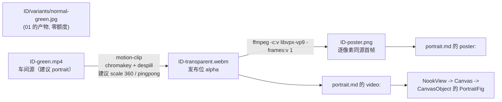

# docs/assets/02 — 微动立绘：生产与小天地落位

> 归属：`docs/assets/00-共同上下文.md` §10 分工表的 `02-微动立绘.md`。
> 上游冻结：`docs/assets/00-共同上下文.md`（下称 **assets 00**，2026-09-13 版）。**冲突时 assets 00 赢**；本文只登记冲突、不回改契约。
> 权威链（assets 00 §0）：assets 00 > `docs/nook/00` + `docs/audio/00` > `docs/ui/前端改造计划.md` T3.2 > `doc-04 §10` / `doc-06 §3` > `assets/README.md`。
> 本文 owner 范围：**微动立绘的生产链**（`tools/gen-motion.mjs` → `flow-gen.mjs video` → `motion-clip.mjs` → 首帧 poster）与**小天地 `portrait` 落位**（`<id>-transparent.webm` 发布位 + `portrait.md` 的 `video:`/`poster:`）。
> 边界：**不改**六情绪差分的生产与遮罩接线（`01`）、**不改**两模板镜像策略（`03`）、**不改** `source-manifest` / AGENTS 回写（`04`）。本文只在这些交叉点登记接口与缺口。
> 行号日期：**2026-09-13 11:31，复核至 11:47（WSL2）**。行号有保质期；实现前按符号名复核。
> ⚠️ **本批素材在工作树里被并发落盘/回退**（复核窗口内 11:11–11:47 反复变动）。凡涉及时效的数字都标了**实测时刻**；§⑤ / §⑨ / §⑪-C1 给两个时刻的对照。**实现前 MUST 重新实测这三处**。

---

## ① 一句话定位

**微动立绘 = 把一张绿幕情绪图（`normal-green`）喂给 i2v 生成微动片，抠成透明 VP9 webm，再把该 webm 的自身首帧导出成 poster，最后把 `video:`/`poster:` 两条相对世界根路径写进 `templates/<world>/characters/<id>/portrait.md`——小天地据此把「一张会动的贴纸」摆在画布上。生产时建议使用 portrait 和较小的发布宽度，但具体输出尺寸不锁定。**

一句话口径（assets 00 §1）：**遮罩要「换表情」，所以用图；小天地要「像活的」，所以用视频。** 两者应尽量保持同族视觉，以便视频坏了回退到静态帧时画面不跳变；具体分辨率和长宽比是建议值，不是发布门禁。



**为什么这条链只喂小天地、不喂遮罩**（分工理由，逐条带证据）：

| 面 | 消费者 | 形态 | 理由与出处 |
|---|---|---|---|
| 遮罩（直聊对话框） | `CharacterModal` 的 `.portrait-slot` | **静态 6 情绪图** | `[emo: tag]` 要求**即时换脸**：一次切换只需一次 `src` 变化，而视频换「表情」要么换整条 webm（重解码、必卡）要么做多段时间轴同步（T3.2 的「零加载闪烁、一次请求」目标直接破功）。出处：`assets/skills/motion-portrait/SKILL.md:103-104` 逐字「**直聊遮罩：不用视频**——那里要 6 情绪差分快速切换，静态立绘 + CSS 呼吸更合适」；`docs/ui/前端改造计划.md:363-367`（T3.2 的表情表机制）。 |
| 小天地（角色私人空间） | `CanvasObject` 的 `PortraitFig` | **透明微动 webm**（+ 同源首帧 poster） | 小天地要的是「一件会动的陈设」，只需**一条**循环片，不需要换脸；`docs/nook/03-立绘组件.md:11` 逐字「`portrait` 是小天地里一件「会动的陈设」」。 |
| 二者的接缝 | `poster:` | 静态帧 | 「静态回退必须与视频的动态形态**视觉同族**」（`docs/nook/03-立绘组件.md:783`）。同源首帧是这条要求的最强形态：同一人的同一瞬间，只是不动了。 |

> **关于「引 `docs/nook/03 §7`」**：nook 03 的 §7 是「**错误边界 / 回退矩阵**」（`docs/nook/03-立绘组件.md:708-797`），其中 §7.2 逐字给出 poster 的推荐取值与「同源首帧导出」的做法（`:775-779`）；**「遮罩不用视频」这句话本身不在 nook 03 §7，而在 `assets/skills/motion-portrait/SKILL.md:103-104`**（`01` 与 `02` 的分工判据）。本文两处都引，避免把归属记错。

---

## ② 签名 / 参数

### 2.1 本片符号总览

```
tools/gen-motion.mjs                                             ALREADY EXISTS  批量微动生产（已在库，本批已实测产出）
node tools/gen-motion.mjs --world <w> [--id <c>] [--force] [--parallel 1..3]   ALREADY EXISTS  CLI
node tools/gen-motion.mjs --list                                 ALREADY EXISTS  打印角色清单
CHARACTERS                                                       ALREADY EXISTS  tools/gen-motion.mjs:38-56
motionPrompt(anchor): string                                     ALREADY EXISTS  tools/gen-motion.mjs:59-68
ANCHORS                                                          ALREADY EXISTS  tools/gen-motion.mjs:70-78
credits(): Promise<number>                                       ALREADY EXISTS  tools/gen-motion.mjs:96-102
processOne(worldName, worldConf, id, conf, opts)                 ALREADY EXISTS  tools/gen-motion.mjs:104-158

node tools/flow-gen.mjs video --model omni-1.1-flash …           ALREADY EXISTS  tools/flow-gen.mjs:408-487（cmdVideo）
node tools/motion-clip.mjs <in> -o <out.webm> …                  ALREADY EXISTS  tools/motion-clip.mjs:323-464（main）

templates/<world>/characters/<id>/portrait.md                    ALREADY EXISTS  仅 firstsnow/nanami 一份（:6-7）
```

### 2.2 逐字生产命令（**必须能直接跑通**）

**Step 1 — i2v（扣额度）**，逐字取自 `tools/gen-motion.mjs:124-133`（本批实测跑过）：

```bash
node tools/flow-gen.mjs video --model omni-1.1-flash --seconds 6 --resolution 720 \
  --aspect portrait --image <variants>/normal-green.jpg \
  --prompt "<motionPrompt(ANCHORS[id])>" \
  -o assets/worlds/<world>-demo/characters/<dir>/<id>-green.mp4
```

AST 事实（`tools/flow-gen.mjs:415-418`）：`--resolution` 走 `String(opts.resolution).replace(/p$/i,'')` 后写进 `body.resolution`（`:415`），故 `720` 与 `720p` 等价；`--aspect` 写 `body.aspect_ratio`（`:416`）；`--image` 是**首帧**（`:417`），本地路径内联为 data URL（`:202` 的 `fileToDataUrl`）；只给 `--last-image` 会 `die`（`:434`）。日志行由 `:429` 打印（`生视频 model=… seconds=… resolution=…p`）。

**Step 2 — 抠像（免费）**，逐字取自 `tools/gen-motion.mjs:136-143`：

```bash
node tools/motion-clip.mjs assets/worlds/<world>-demo/characters/<dir>/<id>-green.mp4 \
  -o templates/<world>/assets/motion/seedance/characters/<id>-transparent.webm \
  --scale 360 --pingpong --similarity 0.06
```

参数语义（`tools/motion-clip.mjs:249-255` 的 HELP 与 `:262-317` 的 `parseArgs`）：`--scale 360` → 滤镜内 `scale=360:-2:flags=lanczos`（`:184`）；`--pingpong` → 正放+倒放 `concat`（`:199-205`），**时长翻倍**；`--similarity` 默认 **0.12**（`o.similarity` 初值 `:270`，HELP `:242`），本批压到 **0.06**（理由见 §③-3）。

**Step 3 — poster（免费）**，逐字取自 `tools/gen-motion.mjs:147-153`：

```bash
ffmpeg -y -v error -c:v libvpx-vp9 -i templates/<world>/assets/motion/seedance/characters/<id>-transparent.webm \
  -frames:v 1 templates/<world>/assets/characters/<id>/<id>-poster.png
```

`-c:v libvpx-vp9` **不是可选项**：`assets/skills/motion-portrait/SKILL.md:32-40` 与本机实测都证明隐式解码丢 alpha。本机实测（11:47 复跑，`firstsnow/assets/motion/seedance/characters/nanami-transparent.webm` 首帧）：隐式解码 → 透明像素 **0.0%**；显式 `libvpx-vp9` → **29.9%**。同一文件、同一帧，**唯一的差别是 `-c:v`**。

### 2.3 车间与发布位落点

| 层 | 路径 | 是否入库 | 证据 |
|---|---|---|---|
| 车间绿幕源 | `assets/worlds/<world>-demo/characters/<dir>/<id>-green.mp4` | **否**（`assets/**` gitignore，仅白名单 `audio/`、`skills/`） | `.gitignore:20-27`；`assets/README.md` 头部 |
| 车间透明成品 | 契约 §3.2 也列了车间落点，但脚本**不写车间**、只写发布位 | — | `tools/gen-motion.mjs:108-111`（`webm` 直接算到 `ROOT/templates/...`） |
| 发布位 webm | `templates/<world>/assets/motion/seedance/characters/<id>-transparent.webm` | **是** | 契约 §3.2；各模板 `assets/motion/seedance/manifest.json` |
| 发布位 poster | `templates/<world>/assets/characters/<id>/<id>-poster.png` | **是** | `tools/gen-motion.mjs:111`（**契约 §3.2 未冻结 poster 落点**，见 §⑪-C2） |
| 小天地卡 | `templates/<world>/characters/<id>/portrait.md` 的 `video:` / `poster:`（**相对世界根**） | 是 | `docs/nook/00 §5.4`；`templates/firstsnow/characters/nanami/portrait.md:6-7` |

### 2.4 角色清单（`tools/gen-motion.mjs:38-56`，逐字）

```js
whitechapel: { workshop: 'whitechapel-demo', cast: {
  watson: {dir:'watson'}, edith: {dir:'edith'}, wayne: {dir:'wayne'},
  blackburn: {dir:'blackburn'}, tom: {dir:'tom'} } },
firstsnow:   { workshop: 'firstsnow-demo', cast: {
  nanami: {dir:'nanami'}, 'sumi-yukimura': {dir:'sumi'} } },   // 车间目录是旧 id `sumi/`
```

**`<id>` 与 `<dir>` 是两件事**（同 `tools/gen-emotions.mjs:82-86` 的注释口径）：canonical id `sumi-yukimura` 的车间目录仍是 `sumi/`，但**发布位与文件名一律用 canonical id**（实测：车间 `firstsnow-demo/characters/sumi/sumi-yukimura-green.mp4`，发布位 `firstsnow/assets/motion/seedance/characters/sumi-yukimura-transparent.webm`）。

### 2.5 i2v 的 prompt（`motionPrompt`，逐字取自 `tools/gen-motion.mjs:59-68`）

```
Animate this still portrait into a transparent living portrait, silent. <anchor>
The character stays standing in the same pose and framing. Only a very slight
breathing rise and fall, eyes blink once or twice, hair and the hem of clothing
stir faintly in a light draft; the hands do not move. Do NOT turn the head, do
NOT walk, no large motion. Keep the flat pure chroma-key green screen completely
unchanged behind the character. Overall reads as a static living portrait.
```

`<anchor>` 取自 `ANCHORS`（`:70-78`，逐角色一句英文锚定语，如 `nanami: 'A japanese university girl radio host with headphones around her neck.'`）。
与契约 §4.2 的 prompt **不是同一段文字**（契约是「transparent-animated living portrait from this still…」）——语义等价但不逐字相同，见 §⑪-C8。

---

## ③ 行为契约逐步（每步写「漏了会怎样」）

**1. 读车间 `normal-green.jpg`。** `processOne` 先算 `variantsDir` 与 `normalGreen`（`:104-106`），不存在就打印 `✗ <id>: no normal-green.jpg — run gen-emotions first` 并返回 `{skipped:true, reason:'no normal-green.jpg'}`（`:113-116`）。
*漏了会怎样*：i2v 拿的是**别的情绪**或空路径 → 生成出的「微动」表情与 `normal` 不符，或子进程 `die('找不到图片文件')`（`tools/flow-gen.mjs:202-205`）只以**尾 300 字符**回传（`tools/gen-motion.mjs:90`），排查成本高。前置 `existsSync` 就是为了把错误提前到主进程。

**2. 幂等：clips 存在即跳过。** `if (fs.existsSync(webm) && !opts.force)` → `· <id>: clip exists — skipped (use --force)`（`:118-121`）。
*漏了会怎样*：忘了 `--force` 重跑，脚本报「已完成」而**实际画面还是旧的**——本批正撞上这个坑：发布位 webm 已被重出（`nanami-transparent.webm` 由 `0cce4fdc…`(1974894 B) 变为 `e0500a32…`(893705 B)），但小天地卡 `portrait.md` 仍指着**旧的占位片**（§⑪-C1）。

**3. i2v 参数：建议 720p/6s/portrait，`--similarity 0.06`。** 360p 在当前账号档位不可用，因此生产时优先选择 provider 实际支持的档位；输出视频的分辨率和长宽比不作为发布契约。`--similarity` 仍需在背景残留和角色破洞之间按素材逐帧调整。

**4. 乒乓使时长翻倍，这是设计不是 bug。** `pingpong` 的滤镜图是 `split[a][b];[b]reverse[r];[a][r]concat=n=2:v=1:a=0`（`tools/motion-clip.mjs:199-205`）。源 6s/144 帧 @24fps → 成品 **288 帧 / 12.000s**（实测 11:31，本批 7 条一致）。
*漏了会怎样*：把它当「上游给了 12 秒」会误判额度与体积；也会让 `--loop-fade` 的时长校验（`:396-404`）算错基准。

**5. 编码：VP9 + yuva420p + `-an`。** `enc` 逐字（`:409-417`）：`-c:v libvpx-vp9 -crf 30 -b:v 0 -auto-alt-ref 0 -pix_fmt yuva420p -an`。`alpha` 模式 crf=30，`bg` 模式 34（`:381`）。
*漏了会怎样*：漏 `-auto-alt-ref 0` → **丢 alpha**（源码注释逐字「required for alpha」）；漏 `-an` → 带音轨，`<video muted>` 从「事实陈述」变成「防御性写法」（`docs/nook/03:596`）。本批实测：7 条 webm **全部无音轨**（`ffprobe -select_streams a` 空）。

**6. 自检不静默：`--verify` 默认开。** `alphaStats`（`:150-170`）**显式**用 `-c:v libvpx-vp9` 解码首帧，`transparentRatio < 0.005` 时 `verify: FAIL` 且 `process.exitCode = 1`（`:432-437`）。
*漏了会怎样*：抠像失败（键色没命中幕布）产出「看起来有 `alpha_mode=1` tag 实则全不透明」的片子，前端表现为一块不透明白底贴纸，且**没有任何测试会红**（`ffprobe` 的 tag 骗人）。本批实测各条透明占比：watson 29.9% / edith 23.3% / wayne 15.9% / blackburn 21.5% / tom 28.7% / nanami 33.9% / sumi-yukimura 27.3%。

**7. poster = 成品自身首帧，逐像素同源。** 顺序**必须是「先 webm 后 poster」**：脚本 `await` 完 motion-clip 才导首帧（`:137-153`）。
*漏了会怎样*：从**绿幕 mp4** 导首帧会得到一张带绿底的图（poster 是回退帧、没有抠像）；从**旧片**导会得到**别人**的首帧——本批实测 `templates/firstsnow/characters/nanami/nanami-poster.png`（922848 B, 834×1112, 29.9% 透明）**不是**当前 webm 的首帧，是 niko 批旧件的残留（§⑪-C5）。

**8. poster 落位目录由脚本建。** `fs.mkdirSync(path.dirname(poster), {recursive:true})`（`:147`）。
*漏了会怎样*：新角色（如 whitechapel 的 `edith/`）在 `templates/<world>/assets/characters/<id>/` 不存在时直接 `ENOENT`——脚本已处理，但**该目录同时是 `01` 的 6 情绪图落点**，两条链共用同一目录是刻意的（§⑪-C2/C5 登记了后果）。

**9. 小天地卡写相对世界根路径。** `docs/nook/00 §5.4`：`video:`/`poster:` 是**相世界根相对**，前端拼 `/api/asset?path=<encodeURIComponent(path)>`（`apps/web/src/components/canvas/CanvasObject.tsx:62` 的 `assetUrl`）。
*漏了会怎样*：写成 `/api/asset?path=…` → `path.resolve(worldRoot, '/api/asset?…')` 逃出世界根 → `apps/server/src/routes/world.ts:1111-1113` 判 `!abs.startsWith(worldRoot + sep)` → **403**（`path escapes world root`）→ `PortraitFig` 的 `onError` 把它当「视频坏了」→ 静默降级到 poster，且无人知道原因（`docs/nook/03:610` 已把这条写成反面教材）。

**10. 成本闸门：跑前读额度、跑后报差额。** `main` 在起队列前 `await credits()`（`:204`）、收尾再读一次并打印 `credits after: N (spent N)`（`:232`）；`credits()` 走 `GET http://127.0.0.1:8317/v1/credits`（`:96-102`）。
*漏了会怎样*：本批 7 条 = **约 70 credits**（assets 00 §4.2 实测 10/条），额度是**共享账号**；不读就走等于盲刷，且失败重试会把差额悄悄翻倍。

**11. 并发上限 3。** `--parallel` 被 `Math.max(1, Math.min(3, …))` 夹住（`:167`）；文件头注释逐字说明 reCAPTCHA 求解桥是**单条串行**循环（`:12-14`），>2 只会让 captcha 队列抖动。
*漏了会怎样*：写 `--parallel 8` 也是 3；但若**移除**夹子去暴力并发，captcha 队列 thrash 会让**部分任务静默超时**（`flow-gen` 的 `FLOW_VIDEO_TIMEOUT_MS` 默认 900s 到点 `die`）。

---

## ④ 文件与副作用

| 动作 | 文件 | 副作用 |
|---|---|---|
| 生产（Step 1） | `tools/flow-gen.mjs video` | **网络**（Flow 代理 `127.0.0.1:8317`）、**扣额度**、写车间 `<id>-green.mp4`（720×1280，实测 144 帧 @24fps，1.6–2.8 MB） |
| 生产（Step 2/3） | `tools/motion-clip.mjs` + `ffmpeg` | 纯本地，写发布位 `webm`（0.36–0.89 MB）与 `poster.png`（0.21–0.28 MB） |
| 落位 | `templates/<world>/characters/<id>/portrait.md` | 手写（或脚本）：`video:` / `poster:` / `caption:` |
| 运行期 | `GET /api/asset?path=…` | `<video preload="metadata">` 只取容器头；`apps/server/src/routes/world.ts:1115` 的 `res.sendFile` 原生支持 Range |
| 运行期 | `<video>` 元素 | **每个画布至多 1 条 portrait 播放**（`apps/web/src/components/canvas/Canvas.tsx:132-137`）；`document.hidden` 时整棵卸载换 ``（`CanvasObject.tsx:88-91, 99-131`） |
| **不写** | `history.db` / `cards` / WS 帧 | 本链只产资产与 md，无事件、无写路径（`docs/nook/00 §3.6`） |

**运行期 HTTP 账（逐条）**：

1. `portrait` 卡挂载 → 1 次 `GET /api/asset?path=<webm>`（`preload="metadata"`）。
2. `poster` 由 `<video poster=…>` 在同一请求里显示，**不是第二个 GET**（`docs/nook/03:681` 的评审门修正）。
3. 切后台 → `<video>` 整棵卸载 → 显式新建 ``（`CanvasObject.tsx:113-120`）——同一 URL，浏览器缓存命中。
4. `motion-clip.mjs` 与 `gen-motion.mjs` **本身不发 HTTP**（除 `flow-gen` 的生成请求与 `credits()` 查询）。

**MUST NOT**：在渲染路径里为「预热视频」加 `useEffect` 去 `fetch` 任何东西（会破「渲染层不写世界」的既有纪律，`docs/nook/03:685`）。

---

## ⑤ 落账

微动视频的账目在**并发落盘期间演化成了三张**（复核到第三张出现于 11:46，由并行批次的 `tools/record-emotion-assets.mjs` 写出）。三者职责不同，**本片 MUST 说清哪张管什么**：

| 账 | 文件 | 行格式 | 由谁写 | 谁校验 |
|---|---|---|---|---|
| **(a) 发布位视频清单**（niko 批既有） | `templates/<world>/assets/motion/seedance/manifest.json` | `{source, target, bytes, sha256}` | `tools/sync-seedance.mjs:115` | `tools/seedance-assets.test.mjs:13`（条数）+ `:20-21`（bytes/sha 逐条） |
| **(b) 静态图/场景溯源**（assets 00 §4.4） | `templates/<world>/assets/source-manifest.json` | `{source, target, sourceSha256, targetSha256}` | `tools/sync-template-assets.mjs:112` | `tools/template-assets.test.mjs:11`（条数） |
| **(c) 本批角色媒体溯源**（NEW，并行批次落地） | `templates/<world>/assets/character-media.json` | `{character, emo\|kind, source, asset, sourceSha256, assetSha256}` | `tools/record-emotion-assets.mjs`（**已存在，非本片产物**） | 同脚本的 `--check` 子命令（逐条重算双方摘要） |

**三者对微动视频的覆盖**：

- **(a)** 覆盖 7 条背景 + 历史 1 条角色片（白教堂 watson / firstsnow nanami），**本批新增的 4 条白教堂角色片与 sumi-yukimura 不在其中**。
- **(b)** **零条微动视频**（只有静态图与场景）。
- **(c)** 覆盖全部 7 条本批角色片（实测 `whitechapel/character-media.json` 35 条含 5 条 `kind: living-portrait`；`firstsnow` 与 `first-snow-jp` 各 14 条含 2 条），**但 (a) 的校验器完全不知道它的存在**（`seedance-assets.test.mjs` 只读 (a)）。

**本批实测的账目缺口（11:47 复核，逐条重算摘要）**：

| 世界 | (a) `motion/seedance/manifest.json` | (c) `character-media.json` | 磁盘实际 | 判定 |
|---|---|---|---|---|
| `whitechapel` | 7 条（6 背景 + watson），watson 条目 `d58d43ae…` / 2676633 B | 35 条（5 角色 × 7 行），watson 行 `8f8248c5…` | watson `d58d43ae…` / 2676633 B；另有 edith/wayne/blackburn/tom 4 条片 | **(a) 对当前磁盘是准的**，但它**不含 4 条新片**；**(c) 的 watson 行 stale**（指向 11:31 时的 `8f8248c5…`） |
| `firstsnow` | 7 条（6 背景 + nanami），nanami 条目 `0cce4fdc…` / 1974894 B | 14 条（2 角色 × 7 行），nanami 行 `e0500a32…` | nanami `0cce4fdc…` / 1974894 B；sumi-yukimura `0da8f609…` | **(a) 对当前磁盘准**、不含 sumi-yukimura；**(c) 的 nanami 行 stale**（指向已被回退的 `e0500a32…`） |
| `first-snow-jp` | 与 firstsnow 同名同字节（`tools/sync-seedance.mjs:19` 逐字 `mediaWorlds['first-snow-jp'] = mediaWorlds.firstsnow`） | 14 条（含 2 条 living-portrait） | 2 条 webm，sha 与 firstsnow 相同 | 同 firstsnow |

> **要点**：(a) 与 (c) **各自对各自的时刻成立**，但两边不一致——(a) 反映「当前磁盘」（紧贴 HEAD），(c) 反映「11:31 那次落盘」（本批正式片那一版）。**没有任何校验器同时读两张**，所以「账 A 说 X、账 B 说 Y」这种矛盾**会静默存活**；`record-emotion-assets.mjs --check` 只能抓 (c) 自己 vs 磁盘的漂移（今天 watson / nanami 各 1 条）。

> **watson 的那一行实测易错**：(c) 记 `8f8248c5…`、磁盘 11:31 也是 `8f8248c5…`，但 11:43 磁盘被回退成 HEAD 的 `d58d43ae…`，而 (c) 不会自动跟着改 → 「账说 A、磁盘是 B」这种漂移**在 (c) 里静默存活**，只有 `--check` 才会报。

*漏了会怎样*：`tools/seedance-assets.test.mjs` 的 `:20-21` 今天**恰好绿**（(a) 与磁盘同步回退了），但这不是纪律而是巧合——一旦本批正式片重新落盘、而 (a) 不重算，它就红；`:13` 的条数断言在 `mediaWorlds`（`tools/sync-seedance.mjs:11-19`）没扩到 edith/wayne/blackburn/tom 时也会红。**而 (c) 的校验完全在 (a) 的测试之外**——两张账可以一份对一份错，没有人对得起来。

**处置（MUST，归 `04`）**：明确「微动视频的权威账是哪一张」，并让**另一张**要么被同一校验器读、要么显式声明「不含微动」。(c) 的 `record-emotion-assets.mjs --check` 是**今天唯一**能同时验「源 + 发布位」双方摘要的检查器（本片 §⑩-MP-02/MP-03 的建议落点就在它的检查集里）。

**车间侧不落账**：`assets/worlds/**` 整树 gitignore（`.gitignore:20-27` 只放行 `assets/audio/**`、`assets/skills/**`、`assets/README.md`）。

---

## ⑥ WS / 前端

- **不新增任何 WS 帧**（assets 00 §6 边界；`docs/nook/00 §3.6`）。`world_event` 对 `templates/<world>/assets/**` 的新增照常广播（`apps/server/src/engine/event-bridge.ts:432` 的 `fs.watch(worldRoot, {recursive:true})`），前端 `useWorld` 按 `wiring/00 §4` 消费——这是**既有行为**，本批不新增帧名、不改它。
- **消费链（小天地）**：`NookView`（`apps/web/src/components/nook/NookView.tsx:135` 取 `useStill()`，`:357` 传 `stillPortraits={reduceMotion}`）→ `Canvas`（`:132-137` 算 `playingPortrait`，`:548` 传 `still={item.path !== playingPortrait}`）→ `CanvasObject` 的 `kind === 'portrait'` 分支（`:250-258`）→ `PortraitFig`（`:82-133`）。
- **消费链（遮罩，仅作对照）**：`CharacterModal` 的 `.portrait-emo` 里仍是 `MotionPortrait(video={avatarVideo}, poster={avatar}, enabled={effectsEnabled})`（`apps/web/src/components/overlay/CharacterModal.tsx:739`）；有 `emotions` 时走 `01` 的 `` 切图，**video 不渲染**（单向回退链，assets 00 §5.2）。
- **前端零改动**：本文不新增任何前端代码。`portrait` 分支、`still` 通路、`.portrait__*` CSS 都已落地（`packages/shared/src/schemas/components.ts:221-226`、`packages/shared/src/schemas/forms.ts:99`、`packages/shared/src/components/packs/room.ts:55-70`、`apps/web/src/index.css:1268-1345`）。
- **前端状态**：`PortraitFig` 的两个 state（`failedSrc` / `visible`）全是组件本地（`CanvasObject.tsx:83-91`），不进 `useWorld`、不进 store。

---

## ⑦ 错误边界

微动立绘的失败模式**全部落在前端回退链**上（回退矩阵的权威版在 `docs/nook/03:710-726`，此处只列与**本链产出**相关的行）：

| # | 触发（本链视角） | 应有行为 | 依据 |
|---|---|---|---|
| 1 | `video:` 404（文件名写错 / 未被同步进模板） | `<video>` 卸载 → `.portrait__still`（poster）→ 再坏则 `.portrait__missing` 铭牌 | `CanvasObject.tsx:99-131` |
| 2 | webm 存在但**不透明**（抠像失败） | 无自动检测；画面是一块不透明白底贴纸 | `--verify` 只在**生产时**报警（`motion-clip.mjs:427-443`），运行期无守卫 |
| 3 | poster 与 webm **不是同一人/同源**（本批现况，§⑪-C1） | 视频正常时看不出来；视频一坏就**换脸** | `docs/nook/03:781` 逐字「视频一坏会从小女孩跳成成年女性，比空白更糟」 |
| 4 | `prefers-reduced-motion: reduce` | 永不挂 `<video>`，走静态 poster | `apps/web/src/lib/motion.ts:28-35` 的 `useStill()` |
| 5 | 同一画布 ≥2 张 `portrait` | 只有 z 最大的一张播，其余 `still=true` | `apps/web/src/lib/motion.ts:14-21` 的 `portraitPlayStateOf` |
| 6 | i2v 上游额度耗尽 / 401 | `flow-gen` `die`，`processOne` 抛错被 `main` 的 worker `catch` 捕获成 `✗ <id>: <msg>`，**该角色跳过、其余继续**（`:214-220`） | 不是全批中止——刻意设计（队列里其它人不受影响） |
| 7 | `motion-clip` 自动探测不到绿幕 | `error: auto mode found no green/blue screen … pass --key-color` + `exit 2` | `motion-clip.mjs:354-358` |
| 8 | i2v 静默降级（请求 720p 实得别的档） | `reportDowngrade(task, {seconds, res})` 打日志 | `tools/flow-gen.mjs:474`；**可见性依赖上游 key 方言**，见 §⑪-C9 |
| 9 | 多角色批量中途失败 | 汇总表逐条标 `skipped (reason)` / `FAILED — <msg>`（`:227-232`），**不是**只回「完成了 N 条」 | 部分成功必须逐条可见 |

**MUST NOT**：把 `motion-clip.mjs` 的 `--no-verify` 加进生产命令。它是 `assets/skills/motion-portrait/SKILL.md:32-40` 那条「alpha 会看起来在、实际不在」的唯一自动守卫。

---

## ⑧ 代码落点（精确到文件与函数）

| # | 文件 | 位置（符号） | 动作 | owner |
|---|---|---|---|---|
| 1 | `tools/gen-motion.mjs` | 全文（`:1-240`） | **已存在**，本批首次真实产出 | `02` |
| 2 | 同上 | 文件头注释 `:7` / `:22` | **MUST 改**：写的是 `<normal>-green.png`，实际读 `normal-green.jpg`（与本文件 `:105` 自相矛盾；见 §⑪-C3） | `02` |
| 3 | 同上 | `processOne` `:124-134` | 已按 assets 00 §4.2 的参数；**建议补** `--preview`（契约命令里有、脚本没有，§⑪-C4） | `02` |
| 4 | `tools/seedance-assets.test.mjs` | `:13`（条数）、`:20-21`（bytes/sha）；`mediaWorlds` 在 `tools/sync-seedance.mjs:11-19` | **MUST 同步**：把 4 条白教堂新片 + sumi-yukimura 纳入 `mediaWorlds`（`whitechapel.characters` 加 `edith/wayne/blackburn/tom`），否则 `:13` 的条数与磁盘不符 | `04` |
| 5 | `templates/<world>/assets/motion/seedance/manifest.json`（账 (a)） | — | **MUST 重算/补齐**：本批 4 条白教堂片 + sumi-yukimura 不在其中；watson/nanami 条目须与最终磁盘一致 | `04` |
| 5b | `templates/<world>/assets/character-media.json`（账 (c)，**并行批次已建**） | — | **MUST 重跑** `node tools/record-emotion-assets.mjs`（无 `--check`）让 (c) 与最终磁盘对齐；见 §⑤ | `04` |
| 6 | `templates/<world>/assets/source-manifest.json`（账 (b)） | — | assets 00 §4.4 要求登记微动条目（今天 0 条）；**或**显式声明「微动归 (a)/(c)，(b) 不含」（需主 agent 拍板，§⑫-U2） | `04` |
| 7 | `templates/firstsnow/characters/nanami/portrait.md` | `:6-7` | **MUST 改**：今天 `video:` 所指文件**不存在**（§⑪-C1 快照 B）；改后 `video:`/`poster:` 必须**同源** | `02` + 主 agent |
| 8 | `packages/shared/test/nook-portrait.test.mjs` | `:21-22` 的 `WEBM`/`POSTER` 常量（今天指 `assets/characters/nanami/nanami.webm` / `…-poster.png`） | **MUST 复核并对齐** `portrait.md`：今日它测的是「断链之外的另一条路径」，与卡不是同一个源 | `02` |
| 8b | `packages/shared/test/nook-portrait.test.mjs` | 新增用例 | **建议**：加 §⑩-MP-03 的「webm 首帧 ≈ poster 首帧」断言（阈值参考：同源 1.3 / 异源 52.0） | `02` |
| 9 | `apps/web/src/components/canvas/CanvasObject.tsx` | `:62`（`assetUrl`）、`:82-133`（`PortraitFig`）、`:250-258`（分支） | **已落地，不改** | — |
| 10 | `apps/web/src/lib/motion.ts` | `:14-21`（`portraitPlayStateOf`）、`:28-35`（`useStill`） | **已落地，不改** | — |

**不动的文件（显式声明）**：`packages/shared/src/{schemas,components}`（`portrait` kind 已落地）、`apps/web/src/components/nook/NookView.tsx`、`apps/web/src/index.css` 的 `.portrait__*` 块、`apps/server/src/routes/{world.ts,tts.ts}`。

---

## ⑨ 与现状差异

### 9.1 本批**已发生**的变化

> ⚠️ 工作树在复核期间被并行改写，本节给**两个时刻**。**11:47 是当前值**；11:31 的值也保留，因为并行批次曾经产出过它们、且账目 (c) 仍记着它们（§⑤）。

| # | 之前（HEAD `0032d58`） | 11:31（本批产出） | **11:47（当前磁盘）** |
|---|---|---|---|
| 1 | 微动片只有 watson（`d58d43ae…`，2676633 B，834×1112） | whitechapel 5 条：watson `8f8248c5…` / edith `af13d5cb…` / wayne `f841e036…` / blackburn `b3c02da6…` / tom `036b57d9…` | **watson 回退成 `d58d43ae…`（HEAD）**；edith/wayne/blackburn/tom **仍在**（`af13d5cb…` / `f841e036…` / `b3c02da6…` / `036b57d9…`，皆 360×640 / 288 帧） |
| 2 | firstsnow 只有 nanami 占位（`0cce4fdc…`，1974894 B，834×1112） | nanami 正式 `e0500a32…`（893705 B，360×640）+ sumi-yukimura `0da8f609…`（833822 B） | **nanami 回退成 `0cce4fdc…`（HEAD，834×1112）**；**sumi-yukimura 仍在** `0da8f609…`（360×640 / 288 帧） |
| 3 | jp 与 firstsnow 逐字节相同 | 重新镜像到 `e0500a32…` / `0da8f609…` | nanami 回退成 `0cce4fdc…`；sumi-yukimura 仍 `0da8f609…`——**两侧仍逐一相同**（实测 11:47 SAME/SAME） |
| 4 | 全树零 `*-poster.png` | whitechapel 5 张 + firstsnow 2 张 | 同（`assets/characters/<id>/<id>-poster.png`，7 张都在） |
| 5 | `portrait.md:6-7` 指向占位 | 卡未改，同目录 poster 换成本批新片首帧 → **视频与海报不同人** | poster 回退成 `29b13b92…`（= 11:31 正式片的首帧），`video:` 所指 `characters/nanami/nanami.webm` **文件不存在** → **断链**（§⑪-C1） |
| 6 | (a) 账与实际一致 | 3 模板各 1 条漂移 + 新片无账 | (a) 随磁盘一起回退，**今天恰好绿**；但 (c) `character-media.json` 记的是 11:31 的字节 → **两张账互相矛盾**（§⑤） |
| 7 | 无角色媒体溯源账 | 并行批次新增 `character-media.json`（(c)）+ `tools/record-emotion-assets.mjs` | 仍在，且含 5+2+2 条 `living-portrait` 行 |

### 9.2 本批**未发生**的变化（缺口）

- **小天地卡只有 1 张**：`grep -rl "component: portrait" templates/` → 仅 `templates/firstsnow/characters/nanami/portrait.md`（11:47 复核；且该卡的 `video:` 已断链，§⑪-C1）。whitechapel 的 4 条新片、firstsnow 的 sumi-yukimura、jp 的 2 条片子，**都没有任何 md 引用它们**。
- **jp 零 `portrait.md`**：jp 有 webm、有情绪图，但小天地是空的（`find first-snow-jp -name portrait.md` 无输出）——镜像的是**字节**，不是**内容**（与 `03` 的 U1 同源）。
- **`source-manifest.json` 零微动条目**（(b) 账完全不覆盖微动，§⑤）。
- **白教堂角色的 README 仍指 niko 批的静态图**：`templates/whitechapel/characters/watson/README.md:4-5` 的 `avatar`/`avatarVideo` 指 `watson-transparent.webp`/`.webm`。`.webp`（82428 B，niko 批静态图）**没换过**，而 `.webm` 在 11:31 换过又回退——**两者今天恰好又同批（旧件）**，但本片**未复核**新片（`8f8248c5…`）与旧静图是否同人（§⑫-U1）。
- **`portrait.md` 与「正式片」之间零机械约束**：§⑪-C1 的两种坏形态都是这个缺口的产物。

---

## ⑩ 验收测试

### 10.1 逐条可复现的机检（注释里的「实测」= 2026-09-13 11:47 复核值）

```bash
# (1) 全树成品盘点：尺寸 / 帧数 / 音轨
cd templates
for f in */assets/motion/seedance/characters/*-transparent.webm; do
  echo "$f  $(ffprobe -v error -select_streams v:0 -show_entries stream=width,height -of csv=p=0 "$f")  frames=$(ffprobe -v error -count_frames -select_streams v:0 -show_entries stream=nb_read_frames -of csv=p=0 "$f")  audio=$(ffprobe -v error -select_streams a -show_entries stream=codec_type -of csv=p=0 "$f" | wc -l)"
done
# 实测 → 本批形态达标（360,640 / frames=288 / audio=0）的共 6 条：
#   whitechapel/{edith,wayne,blackburn,tom}、firstsnow/sumi-yukimura、first-snow-jp/sumi-yukimura
# 而 watson（whitechapel）与 nanami（firstsnow、first-snow-jp）是 834,1112 / frames=144
#   —— niko 批旧件（未重出或被回退），本批目标形态 SHOULD 覆盖到它们。
# 另有 divergence/ryo、wuwu/{viola,silverkite}、magic-academy/seraphina 等非本批世界，
#   一律 834,1112 / 144 —— 本批 MUST NOT 动它们（assets 00 §2 范围边界）。

# (2) 真 alpha（MUST 显式 libvpx-vp9；隐式解码恒 0.0%）
for f in */assets/motion/seedance/characters/*-transparent.webm; do
  printf '%s ' "$f"
  $FFMPEG -v error -c:v libvpx-vp9 -i "$f" -frames:v 1 -f rawvideo -pix_fmt rgba - \
    | python3 -c "import sys;b=sys.stdin.buffer.read();n=len(b)//4;print(f'{100*sum(1 for i in range(3,len(b),4) if b[i]<128)/n:.1f}%')"
done
# 实测 → 11:31 那批：watson 29.9 / edith 23.3 / wayne 15.9 / blackburn 21.5 / tom 28.7
#             / nanami 33.9 / sumi-yukimura 27.3（全 >0）

# (3) 真 alpha（隐式解码的对照组，用于证明 -c:v 是必需的）
ffmpeg -v error -i firstsnow/assets/motion/seedance/characters/nanami-transparent.webm \
  -frames:v 1 -f rawvideo -pix_fmt rgba - | python3 -c "import sys;b=sys.stdin.buffer.read();n=len(b)//4;print(f'{100*sum(1 for i in range(3,len(b),4) if b[i]<128)/n:.1f}%')"
# 实测 → 0.0%（隐式解码丢 alpha 的直接证据；同一文件显式解码为 >0）

# (4) 三张账各自的漂移检查
#     (a) 发布位视频清单
for w in whitechapel firstsnow first-snow-jp; do
  python3 - "$w" <<'PY'
import json,hashlib,os,sys
w=sys.argv[1]; m=json.load(open(f'{w}/assets/motion/seedance/manifest.json'))
bad=[a['target'] for a in m['assets']
     if not os.path.exists(f"{w}/{a['target']}")
     or len(open(f"{w}/{a['target']}",'rb').read())!=a['bytes']
     or hashlib.sha256(open(f"{w}/{a['target']}",'rb').read()).hexdigest()!=a['sha256']]
print('(a)', w, 'BAD:', bad)
PY
done
# 实测（11:47）→ 三个世界都 BAD: []（与磁盘一致）；但 (a) 的内容是 niko 批旧件，
#   本批新片（edith/wayne/blackburn/tom、sumi-yukimura）**根本不在 (a) 里** → 绿 ≠ 完整。
#     (c) 角色媒体溯源
for w in whitechapel firstsnow first-snow-jp; do
  python3 - "$w" <<'PY'
import json,hashlib,os,sys
w=sys.argv[1]; p=f'{w}/assets/character-media.json'
if not os.path.exists(p): print('(c)', w, 'NO manifest'); raise SystemExit
m=json.load(open(p)); bad=[]
for r in m['assets']:
    t=f"{w}/{r['asset']}"
    if not os.path.exists(t) or hashlib.sha256(open(t,'rb').read()).hexdigest()!=r['assetSha256']:
        bad.append(r['asset'])
print('(c)', w, f"{len(m['assets'])} rows BAD:", bad)
PY
done
# 实测（11:47）→ whitechapel BAD: [assets/motion/seedance/characters/watson-transparent.webm]
#                  firstsnow  BAD: [assets/motion/seedance/characters/nanami-transparent.webm]
#                  first-snow-jp 同上  ← 因为磁盘被回退、而 (c) 记的是 11:31 的字节

# (5) 两模板字节相同（firstsnow vs first-snow-jp）
for id in nanami sumi-yukimura; do
  a=$(sha256sum firstsnow/assets/motion/seedance/characters/$id-transparent.webm | cut -d' ' -f1)
  b=$(sha256sum first-snow-jp/assets/motion/seedance/characters/$id-transparent.webm | cut -d' ' -f1)
  [ "$a" = "$b" ] && echo "SAME $id" || echo "DIFF $id"
done
# 实测（11:47）→ SAME nanami / SAME sumi-yukimura（字节同步是纪律，与本批换没换片无关）
```

### 10.2 语义断言（`10.1` 覆盖不到、但 MUST 进测试）

| # | 断言 | 非空性（怎么证明它不是为了绿而绿） |
|---|---|---|
| **MP-01** | `portrait.md` 的 `video:` 指向的文件**存在**，且解世界根相对后仍在世界根内 | 把 `video:` 改成不存在名 → 断言必红（对应 `/api/asset` 的 403 语义，`apps/server/src/routes/world.ts:1111-1113`） |
| **MP-02** | **`video:` 指向的 webm 与 `poster:` 指向的 png 是同一人/同源** | 本批**当前必红**（§⑪-C1）——这条正是本批要修的 |
| **MP-03** | webm 首帧与 poster 首帧缩放后逐像素近似（如 96×96 RGB `mean|Δ| < 5`） | 用 niko 批残留（`firstsnow/characters/nanami/nanami-poster.png`，实测 `mean|Δ|=52.0`）当负例 → 必红 |
| **MP-04** | jp 与 en 两侧的 `<id>-transparent.webm` sha 相同（仅 nanami / sumi-yukimura） | `03` 的 FP-01/FP-02 已覆盖，本片**引用而非重写** |
| **MP-05** | 全 7 条 webm 的 `transparentRatio > 0`（显式 `-c:v libvpx-vp9` 解码） | 对未抠像的原片（契约 §7 点名的负例；`assets/_inbox/motion-test/portrait-motion.webm` 实测 0.0%）断言必红 |
| **MP-06** | 每条 webm **无音轨**（`ffprobe -select_streams a` 为空） | 去掉 `-an` 重编一条 → 断言必红 |

**NEW（建议）辅助断言函数签名**——落地时 **MUST 复用** `packages/shared/test/nook-portrait.test.mjs:36-58` 的既有 `transparentRatio(file, decoder)`，不要写第二份：

```ts
// NEW: 语义「同源」判定。两份文件（webm 走显式 libvpx-vp9）缩放到 size×size 后
// 的平均绝对像素差；0 = 逐像素相同，越大越不同。本片用它标定了两个点：
//   同一帧 → 1.3；niko 批残留 vs 新片 → 52.0。
function frameDistance(a: string, b: string, size?: number): number;   // NEW
```

---

## ⑪ 发现的冲突

### C1 — 小天地卡的 `video:`、`poster:` 与「正式片」三者的**同源关系今天没有保证**（并发落盘期间实测到两种坏形态）

> ⚠️ **本节是本文最时效敏感的一节。** 复核期间工作树被并行改写（11:31 → 11:47 之间，`templates/firstsnow/{characters,assets}/characters/nanami/nanami*` 与 `whitechapel/…/watson-transparent.webm` 都被回退到 HEAD 或换回旧件）。因此下面给**两个时刻**的实测，两个都坏、坏的形态不同。实现时 **MUST 重新实测**，不要照抄。

**快照 A（11:31）——「video 是旧占位、poster 是新片」，视频与海报不是同一个人**：

| 文件 | SHA-256（前 16） | 尺寸 | 帧 / 时长 | 透明占比 | 身份（Δ vs `nanami.webp` / vs `girl_green.mp4`） |
|---|---|---|---|---|---|
| `templates/firstsnow/characters/nanami/portrait.md:6` → `assets/characters/nanami/nanami.webm` | `f6628d9bdfb0033a` | 360×640 | 442 / 18.375s | 25.4% | 25.2 / **11.8**（= divergence 占位片的人） |
| 同卡 `:7` → `assets/characters/nanami/nanami-poster.png` | `29b13b92154c0109` | 360×640 | — | 33.9% | **Δ=1.3** vs 当时的正式片首帧（同一帧） |
| 当时的正式片 `assets/motion/seedance/characters/nanami-transparent.webm` | `e0500a32a2660911` | 360×640 | 288 / 12.000s | 33.9% | 50.1 / 75.0（**第三人**，既不是占位女孩也不是 `nanami.webp`） |

**快照 B（11:47，当前）——「三件全是旧件」，`portrait.md` 的 `video:` 指向**不存在**的文件**：

| 项 | 实测 | 判定 |
|---|---|---|
| `portrait.md:6` 的 `video: assets/characters/nanami/nanami.webm` | `templates/firstsnow/` 下**该文件不存在**（`ls` 无此项；`templates/firstsnow/assets/characters/nanami/nanami.webm` 存在，**而 `portrait.md` 写的是 `characters/nanami/nanami.webm`**） | **断链** |
| `portrait.md:7` 的 `poster: assets/characters/nanami/nanami-poster.png` | `templates/firstsnow/assets/characters/nanami/nanami-poster.png` = `29b13b92…` / 248092 B / Δ=1.3 vs **快照 A 的正式片** | 指向**已被回退**的那一版 |
| `assets/motion/seedance/characters/nanami-transparent.webm` | `0cce4fdc12ab` / 1974894 B / 834×1112 / 144 帧 | **已回退成 niko 批旧件** |
| `firstsnow/characters/nanami/nanami-poster.png`（无引用） | `a924cc41…` / 922848 B / 834×1112 | niko 批残留 |

> 我在 11:47 用 `ffmpeg` 复核时，`templates/firstsnow/characters/nanami/nanami.webm` **解码失败**（0 字节输出）——因为该路径根本没有文件。这是 §⑩-MP-01 那条断言的实证：**它今天必红**。

**结论（与快照无关的不变量）**：`portrait.md` 的 `video:` / `poster:` 与「发布位正式片」三者**今天没有任何机械约束把它们绑在一起**（`docs/nook/03:646-648` 只写了「MUST NOT 指向不同人」这条**人工纪律**）。任何一次并发落盘、回退、或换片都可能让三者分离，而**没有任何测试会红**（`nook-portrait.test.mjs:21` 的常量今天指 `assets/characters/nanami/nanami.webm`，它存在时测的是**旧占位片**）。

**处置（MUST）**：
1. 先定「本批的 nanami 正式片」到底是哪一条（§⑫-U2 现在升级为**阻塞项**：快照 A 的 `e0500a32…` 已被回退，正式片需要重出或指定保留）。
2. 把 `portrait.md` 的 `video:`/`poster:` 改成**同源**的两条路径（同时改 6 情绪图目录还是 `characters/` 目录，见 §⑫-U3）。
3. 把 `packages/shared/test/nook-portrait.test.mjs:21-22` 的 `WEBM`/`POSTER` 常量指到与 `portrait.md` **同一个源**，并加 §⑩-MP-03 的「首帧近似」断言，让三者分离**能变红**。
4. `docs/nook/03` 的 §③-9 交付表与 §⑫-11 同步更新（`03`/`04` 的面）。

### C2 — 契约 §3.2 未冻结 poster 的**落点**，脚本已自行选了 `assets/characters/<id>/<id>-poster.png`

契约 §3.2 只写了「poster 从 webm 自身首帧导出 PNG（`ffmpeg -c:v libvpx-vp9 -frames:v 1`），逐像素同源」——**没说放哪**。`tools/gen-motion.mjs:111` 选的是 `templates/<world>/assets/characters/<id>/<id>-poster.png`，即**与 6 情绪图（`01`）同目录**。
**后果**：`docs/assets/03:286`（C5）指出的「目录级一致性断言不可用」由 2 个额外文件扩到 3 个；且 poster 与情绪图**命名风格不一致**（`<emo>.webp` vs `<id>-poster.png`）。nook 03 §⑫-11 已就同一命名登记过待确认。
**建议**：主 agent 明确 poster 落点写回契约 §3.2（或统一到 `assets/motion/seedance/characters/<id>-poster.png` 与 webm 做邻居）。**登记为待拍板**（§⑫-U3）。

### C3 — 契约 §4.2 的命令与脚本实际读的**扩展名不一致**（`.png` vs `.jpg`）

契约 §4.2 逐字：`--image <normal>-green.png`。`01` 的生产链产出的是 **`<emo>-green.jpg`**（`tools/gen-emotions.mjs:192` 的 `outPath`、`:210` 的读回；实测车间里有 `normal-green.jpg`、**没有** `.png`）。`tools/gen-motion.mjs:105` 读的也是 `normal-green.jpg`（正确），但它自己的**文件头注释** `:7`/`:22` 写成 `<normal>-green.png` / `normal-green.png`——**与本文件 `:105` 自相矛盾**。
**后果**：照抄契约命令的人会 `ENOENT`（`gen-motion` 的 `existsSync` 守卫会先报 `no normal-green.jpg`，掩盖住「文档写错扩展名」这个真因）。**处置**：改 `gen-motion.mjs` 的注释（§⑧-2）；契约的 `.png` 措辞留给主 agent 裁决是否回写。

### C4 — 契约 §4.2 的 motion-clip 命令带 `--preview`，脚本没带

契约逐字：`node tools/motion-clip.mjs <id>-green.mp4 -o <id>-transparent.webm --scale 360 --pingpong --similarity 0.06 --preview <preview>.png`。`tools/gen-motion.mjs:137-143` **没有** `--preview`。
**后果**：不是错误（`--preview` 只产一张叠在纸色上的合成图，`motion-clip.mjs:450-463`），但**批量生产时失去人眼复核**——`--preview` 正是 `SKILL.md` 推荐的「逐帧抽出来看最稳」的批量化入口。**建议**：`processOne` 补 `--preview <车间>/<id>-preview.png`（进 gitignored 的车间，不污染发布位）。**登记**。

### C5 — `templates/firstsnow/characters/nanami/` 里有一张**无引用**的旧海报

实测（11:31）同名不同物的四份：

```
templates/firstsnow/assets/characters/nanami/nanami-poster.png   248092 B  360×640   ← portrait.md:7 引用（新片首帧）
templates/firstsnow/characters/nanami/nanami-poster.png          922848 B  834×1112  ← 无任何 md 引用（stale）
templates/firstsnow/assets/characters/nanami/nanami.webm         919893 B  360×640   ← portrait.md:6 引用（旧占位）
templates/firstsnow/assets/motion/seedance/characters/nanami-transparent.webm  893705 B  ← 本批正式片，零 md 引用
```

`922848 B` 的那张（`a924cc41…`）与 niko 批的静态图同族（与 `nanami-transparent.webp` Δ=12.1），是 `docs/nook/03` 旧方案留下的残留；它与当前 webm 首帧 Δ=52.0。
**处置建议**：删除 stale 文件（`grep` 全仓确认零引用，实测），并把 `docs/nook/03` 的 §③-9 交付表与 `nook-portrait.test.mjs` 的常量一并更新。**属 `03`/`04` 的清理面**，本片只登记。

### C6 — `sync-seedance.mjs` 的上游指的是**不存在**的 sibling 路径

`tools/sync-seedance.mjs:10` 逐字：`const source = path.resolve(root, '../worldlines-assets/looping/seedance')`。本机实测：`../worldlines-assets/` **存在**（含 `worlds/`、`_inbox/`），但**没有 `looping/` 目录**。
**后果**：`syncSeedance()`（`:41-121`）今天**跑不了**（`:62-68` 的 preflight `fs.access` 必抛）。因此本批新片**不能**靠「重跑 sync」入账——必须改走 `gen-motion.mjs` 自己写 manifest，或修 `source` 口径。`tools/seedance-assets.test.mjs:6` 只 `import { mediaWorlds }`（不跑 sync），所以测试仍能读 manifest，但**账目靠谁重算是悬空的**。**登记**（§⑫-U2）。

### C7 — 「同一人」的判定今天**没有机械方法**，全靠人眼/像素距离

本片用的 `frameDistance` 能抓住「完全不同的人」（Δ≥50）与「同一占位片的不同帧」（Δ≈11.8），但**抓不住**「同一画师风格的两个不同角色」（可能 Δ≈20）。所以 `docs/nook/03:648` 那条「已知形态不一致」至今只能靠**文档声明**传播。
**后果**：C1 这类「video 与 poster 不同人」的错误**不会自己变红**（除非写 MP-03 那种**同源**断言）。**建议**：把 MP-02/MP-03 落进测试（阈值用本片实测的 1.3 / 52.0 标定）。**登记**。

### C8 — 契约 §4.2 的 i2v prompt 与脚本的 `motionPrompt`（`:59-68`）**不是同一段文字**

契约给的是「transparent-animated living portrait from this still, silent. … Static living-still composition.」；脚本给的是「Animate this still portrait into a transparent living portrait, silent. `<anchor>` … Overall reads as a static living portrait.」（外加逐角色 `<anchor>`）。
**后果**：不构成功能错误（语义等价，且脚本版带角色锚定、更精确），但**「契约命令逐字可复现」这句话对 prompt 不成立**——照抄契约的人得到的片子与脚本产出的**不是同一批字节**。**处置**：主 agent 决定契约 §4.2 是否改引 `motionPrompt` + `ANCHORS`。**登记**。

### C9 — i2v 的静默降级检测**依赖上游 key 方言**，对 `omni-1.1-flash` 可能失效

`tools/flow-gen.mjs:247-260` 的 `parseUpstreamKey` 只认两种方言：`abra_{kind}_{N}s[_720p]` 与 `veo_3_1_{kind}_…`。**本批用的 `omni-1.1-flash` 不在其中**——对 `res` 的比对因此可能拿不到数据（返回 `null`）。
**后果**：契约 §7 的非空性要求「请求 720p 实得别的档必须说出来」，但 `omni` 这条链上 `reportDowngrade`（`:474`）**可能报不出**。**登记**（本片只在 `04` 的回写清单里点名，不改工具）。

### C10 — 契约 §3.2 说车间也落 `<id>-transparent.webm`，脚本**只写发布位**

契约 §3.2 的「车间落点」列了「`<id>-green.mp4`（绿幕源）+ `<id>-transparent.webm`（抠像成品）」。`tools/gen-motion.mjs:108-111` 把 `webm` 直接算到 `ROOT/templates/...`，**车间没有任何透明成品**。
**后果**：① 车间无法离线复算发布位（要重跑抠像才有输入）；② assets 00 §4.4 要求的 `sourceSha256` 若想指「车间成品」**无源可取**。**处置**：契约收敛到「只落发布位」或脚本补写车间副本。**登记**（§⑫-U6）。

---

## ⑫ 仍未知待拍板

| # | 问题 | 影响 | 需要谁定 |
|---|---|---|---|
| **U1 🔴 阻塞** | **本批 nanami 的「正式微动片」到底是哪一条？** 11:31 产出过 `e0500a32…`（360×640/12s），11:47 磁盘已回退成 niko 占位的 `0cce4fdc…`（834×1112），而账 (c) 与 `portrait.md:7` 的 poster 仍指向 `e0500a32…` 那一版。**没有这个裁决，C1 无法收口** | 决定 `portrait.md` 的 `video:`、`nook-portrait.test.mjs:21` 的常量、(a)/(c) 两张账的 watson/nanami 行 | 主 agent（**先决于下面各条**） |
| **U2 🔴 阻塞** | `sync-seedance.mjs:10` 的 `../worldlines-assets/looping/seedance` **不存在**，账目重算链路断了（§⑪-C6）。是修 source、还是改由 `gen-motion.mjs` / `record-emotion-assets.mjs` 自写台账？ | 决定 §⑤ 的**三张账**里哪张权威、`seedance-assets.test.mjs:13` 的条数口径 | 主 agent（`04` 执行） |
| **U3** | poster 落点未冻结（§⑪-C2）：留 `assets/characters/<id>/<id>-poster.png`（现况）还是搬到 `assets/motion/seedance/characters/<id>-poster.png`？ | 决定 `templates/**` 目录布局与两模板 parity 的比对粒度 | 主 agent |
| **U4** | 小天地卡要不要给白教堂 4 人（watson 待 U1）+ sumi-yukimura + jp 两世界都写 `portrait.md`？今天只有 1 张卡、6 条片子零引用 | 决定「会动的立绘」在演示时能摆几个房间；jp 的世界是否也非空 | 主 agent（与 `03` 的 U1 同源） |
| **U5** | `portrait.md` 该不该由 `gen-motion.mjs` **生成**（而不是手写）？今天脚本只产媒体、卡是手写的，两者会漂移（C1 的两个快照都是漂移的实证） | 决定「闭环」是脚本闭合还是人工闭合 | 主 agent |
| **U6** | 契约 §3.2 说车间也落 `<id>-transparent.webm`，脚本只写发布位（§⑪-C10）。是脚本漏了，还是契约多写了？ | 决定车间能否离线复算发布位、(c) 的 `sourceSha256` 语义 | 主 agent |
| **U7** | 本批新片 `--similarity` 一律 0.06（占位片时代为浅色毛衣校准）。白教堂 5 人是深色粗呢/深色大衣（`tools/gen-emotions.mjs:54` 逐字「brown tweed waistcoat and coat」、`:66`「a dark suit」），0.06 对它们是否仍合适？ | 阈值偏小 → 背景残留绿；偏大 → 暗部出洞。**本片只验了绿残留，未逐帧人眼复核** | `02` 实现者（跑 `--preview` 后逐张看） |
| **U8** | 玩家角色 `sherlock-holmes`（`templates/whitechapel/world.json:80` 的 `player.avatar`）**没有**微动片，是否需要？ | 决定玩家头像在小天地里是否也该「活」 | 主 agent |
| **U9** | 契约 §4.2 的 i2v prompt 与脚本 `motionPrompt` 不是同一段文字（§⑪-C8）。契约是否改引脚本？ | 决定「逐字可复现」的基准在哪边 | 主 agent |
| **U10** | `record-emotion-assets.mjs`（账 (c)）是**并行批次**落的，不在 `02`/`01`/`03`/`04` 任何一篇的分工表里（assets 00 §10）。它该归谁维护、`--check` 该进哪个测试？ | 决定 (c) 会不会变成**第四张没人管**的账 | 主 agent |
| **U11** | 白教堂 4 条新片（edith/wayne/blackburn/tom）的 `avatarVideo`（`characters/<id>/README.md` 与 `world.json`）**没接**——它们今天只落在 `assets/motion/seedance/characters/` 无人引用 | 决定这 4 条片子在运行时是否可见（否则只有资产、没有消费） | 主 agent / `04` |

---

## 附：本片复现命令（一条流水，逐字）

```bash
# 前置：01 已产出车间绿幕图；FLOW_API_KEY 与 127.0.0.1:8317 代理可用
export FLOW_API_KEY=...                       # 由平台注入，MUST NOT 写进仓库
node tools/gen-motion.mjs --list              # 应列出 whitechapel(5) / firstsnow(2)
node tools/gen-motion.mjs --world firstsnow --id nanami --force   # 单角色重出（扣 10 credits）
node tools/gen-motion.mjs --world whitechapel --parallel 2        # 整批；captcha 桥串行，>2 只会抖动

# 等价的分步命令（调试单条时用；参数与脚本内逐字一致）
node tools/flow-gen.mjs video --model omni-1.1-flash --seconds 6 --resolution 720 \
  --aspect portrait \
  --image assets/worlds/firstsnow-demo/characters/nanami/variants/normal-green.jpg \
  --prompt "Animate this still portrait into a transparent living portrait, silent. A japanese university girl radio host with headphones around her neck. The character stays standing in the same pose and framing. Only a very slight breathing rise and fall, eyes blink once or twice, hair and the hem of clothing stir faintly in a light draft; the hands do not move. Do NOT turn the head, do NOT walk, no large motion. Keep the flat pure chroma-key green screen completely unchanged behind the character. Overall reads as a static living portrait." \
  -o assets/worlds/firstsnow-demo/characters/nanami/nanami-green.mp4

# 抠像（本机系统 ffmpeg 的 libvpx 可用；也可 FFMPEG=/tmp/ffbin/ffmpeg 指静态版）
node tools/motion-clip.mjs assets/worlds/firstsnow-demo/characters/nanami/nanami-green.mp4 \
  -o templates/firstsnow/assets/motion/seedance/characters/nanami-transparent.webm \
  --scale 360 --pingpong --similarity 0.06

# poster = 成品自身首帧（MUST 带 -c:v libvpx-vp9，否则 alpha 丢）
ffmpeg -y -v error -c:v libvpx-vp9 \
  -i templates/firstsnow/assets/motion/seedance/characters/nanami-transparent.webm \
  -frames:v 1 templates/firstsnow/assets/characters/nanami/nanami-poster.png

# 落账（本批的第三张账；与 01 共用）
node tools/record-emotion-assets.mjs          # 写 character-media.json
node tools/record-emotion-assets.mjs --check  # 复核零漂移
```

**跑完 MUST 做四件事**（缺任一条都不算收工）：

1. 把 sha / bytes 写进 `templates/<world>/assets/motion/seedance/manifest.json`（账 (a)），并让 `tools/seedance-assets.test.mjs` 的 `mediaWorlds`（`tools/sync-seedance.mjs:11-19`）覆盖到新角色（§⑧-4/5）。
2. 跑 `node tools/record-emotion-assets.mjs` 刷新账 (c)，再 `--check` 确认零漂移（§⑤）。
3. 更新 / 新增 `portrait.md` 的 `video:`/`poster:`，确认两者**同源**且 `video:` 所指文件**存在**（§⑩-MP-01/MP-02/MP-03、§⑪-C1）。
4. 若该角色要在运行时可见，同步改 `characters/<id>/README.md` 与 `world.json` 的 `avatarVideo`（§⑫-U11）。

---

## 附二：本文的「Δ（frameDistance）」怎么算

两份文件 → 96×96 RGB 原始像素 → 平均绝对差（0 = 逐像素同源）：

```bash
dist() {
  ffmpeg -v error -c:v libvpx-vp9 -i "$1" -frames:v 1 -vf scale=96:96 -f rawvideo -pix_fmt rgb24 - > /tmp/_a.raw 2>/dev/null \
    || ffmpeg -v error -i "$1" -frames:v 1 -vf scale=96:96 -f rawvideo -pix_fmt rgb24 - > /tmp/_a.raw 2>/dev/null
  ffmpeg -v error -c:v libvpx-vp9 -i "$2" -frames:v 1 -vf scale=96:96 -f rawvideo -pix_fmt rgb24 - > /tmp/_b.raw 2>/dev/null \
    || ffmpeg -v error -i "$2" -frames:v 1 -vf scale=96:96 -f rawvideo -pix_fmt rgb24 - > /tmp/_b.raw 2>/dev/null
  python3 -c "
import sys
a=open('/tmp/_a.raw','rb').read(); b=open('/tmp/_b.raw','rb').read()
print(f'{sum(abs(x-y) for x,y in zip(a,b))/len(a):.1f}')"
}
```

**本片实测的标定点**：同一帧 ≈ **1.3**；同一占位片的不同帧 ≈ **11.8**；不同人 ≥ **50**。
（`webm` 走 `-c:v libvpx-vp9`；PNG/JPEG/mp4 走默认解码——见 §⑩-2 与 `assets/skills/motion-portrait/SKILL.md:32-40`。）