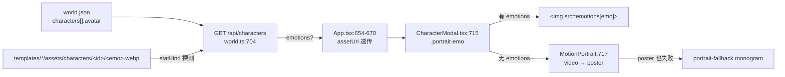

# docs/assets/04 文档回写与验证

> 子文档 `04`。遵守 `docs/assets/00-共同上下文.md`（下称 **契约**）冻结形状；冲突时以契约 §0 权威链为准。
> 本文只写三件事：**(A) 本批落地后必须同步改的文档逐条清单**、**(B) 可机械执行的机检脚本**、**(C) 门禁覆盖面核实（`pnpm check:docs` 是否看得见本批）**。
> 本文**不定义**任何生产符号（`EMOTIONS` / `probeEmotions` / `emotionUrlsOf` 的唯一定义处分别在 `01`/`02`/`03`），只引用其可观察行为。
>
> **落地状态（2026-09-13 实装后）**：`tools/verify-emotions.mjs` **已落地**（非 NEW 提案），经 `pnpm check:emotions` 接入，并已追加到 `AGENTS.md §6.4` 自检链（原 §⑨-D1 的"需拍板"已执行）。落账改为 **`templates/<world>/assets/character-media.json`**（`tools/record-emotion-assets.mjs`），**不并入 `source-manifest.json`**（契约 §4.4 冻结裁决，理由：sync 工具测试断言精确行数）。G 查（`/api/characters`）以真服务端探针 + `packages/shared/test/emotions.test.mjs` 覆盖，未塞进离线门禁。

---

## ① 一句话定位

**本批的"做完"标准有一条硬要求：改了资产与前端，就必须在同一个 commit 里改掉那些会撒谎的文档**（`AGENTS.md:315-317` §6.3）；而"为什么敢说改动是对的"由一组**能对未修复状态返回失败**的机检脚本证明（契约 §7）。本文把这两件事各给一份可执行清单——回写清单逐条到 `file:line`，机检脚本逐条到退出码。

---

## ② 签名 / 参数

本文**不新增生产符号**，只新增一个机检脚本与既可选的回写动作。

| 符号 | 唯一定义处 | 本文如何用它 | 是否导出 |
|---|---|---|---|
| `EMOTIONS`（6 情绪枚举） | `tools/gen-emotions.mjs:30`（生产侧）；服务端副本按 `01 §8.2` 新增 | 机检脚本内**再声明一次**（见 ⑪-C1 的收敛分歧） | 否（脚本内 const） |
| `probeEmotions(store, id)` | `01 §8.2`（`apps/server/src/routes/world.ts`，模块级） | **不直接调用**——黑盒断言 `GET /api/characters` 的 `emotions` 字段 | 否 |
| `alphaStats(file)` | `tools/motion-clip.mjs:150-171`（模块级，不导出） | **不直接 import**——机检脚本自己重写一条等价管道（见 ③-V5） | 否 |
| `emotionUrlsOf(map, resolve)` | `01 §8.3`（`apps/web/src/lib/emotions.ts`，NEW） | 归 `01` 的 F 组单测；本文不重复 | 是 |
| `assetUrl(path)` | `apps/web/src/App.tsx:80-84` | 机检不碰前端函数；只登记它决定「服务端给的相对路径不被二次编码」 | 否 |
| `verify-emotions.mjs` | **NEW**（本文 §⑧） | 本文唯一新增文件 | — |

**新增（NEW）文件**：

```
tools/verify-emotions.mjs                  NEW —— 素材齐备 / 真透明 / 9:16 / 真 alpha / manifest SHA / 双向字节一致
tools/verify-emotions.test.mjs             NEW —— 非空性单测（未修复状态必须失败）
```

> 本文**不**把机检塞进 `pnpm test` 的通配（`package.json:16`）之外：`tools/*.test.mjs` 已被覆盖，故 `verify-emotions.test.mjs` 自动进 `pnpm test`；`verify-emotions.mjs` 本身是**手动/收工自检**命令，需新增 `package.json` script（§⑨-D1）。

---

## ③ 行为契约逐步（每步写「漏了会怎样」）

**V1. 回写与代码同 commit。**
`AGENTS.md:315-317` 逐字要求「改了架构就必须在**同一个 commit** 里改文档」。**漏了会怎样**：下一个 agent 读到 `docs/前端改造计划.md:643` 的「剩余：6 情绪精灵表（T3.2）」会照精灵表再实现一遍——而契约 §3.1 冻结的是**六张独立 webp**（⑪-C2 是同款已发生的例子）。

**V2. 只改「现在就是错」的说法，不加解释段。**
`docs/perform/06-文档回写.md:4` 立的纪律：**直接改掉旧说法**（存废案归 `docs/archive/`）。**漏了会怎样**：文档里同时留着新旧两套口径，读者无法判断哪条有效（`AGENTS.md:480-490` §7.8 就是被"过期句"害过的实例）。

**V3. 机检必须先 build 再跑。**
服务端断言读 `apps/server/dist/`（先例 `apps/server/test/smoke-routes.mjs:19`）。**漏了会怎样**：跑旧 `dist`，`/api/characters` 没有 `emotions` 分支 → 断言全红，误判"没落地"（`AGENTS.md:356-358` §6.5 红线）。

**V4. 每张情绪图必须**解码后**统计 alpha。**
图片链路的产出是「真透明 PNG → webp」。仅看 `ffprobe` 的 `pix_fmt` **不能**证明透明：无损/有损 webp 的 `pix_fmt` 在丢失 alpha 时同样报 `rgba`。**漏了会怎样**：把一张纯色不透明图当"抠好了"，遮罩里出现一块矩形绿/白底，而门禁全绿。

**V5. 微动 webm 的 alpha 必须显式 `-c:v libvpx-vp9` 解码。**
`tools/motion-clip.mjs:12-14` 与 `assets/skills/motion-portrait/SKILL.md:29-43` 逐字记录：**ffmpeg 内置 vp9 解码器静默丢 alpha 平面，`ffprobe` 照报 `alpha_mode=1`**。**实测复现**（本文）：`watson-transparent.webm` 用内置解码器得 `0.00%` 透明，用 `-c:v libvpx-vp9` 得 `35.45%`。**漏了会怎样**：所有"透明立绘"验收都对未抠像的素材返回通过（契约 §8 反模式 3）。

**V6. 6 张全在才回传 `emotions`。**
契约 §5.1 冻结。**漏了会怎样**：半套 map 会让角色演到缺的那一情绪时图 404，遮罩闪成 monogram（切图跳变）。

**V7. `firstsnow` 与 `first-snow-jp` 逐字节相同。**
契约 §6.2 冻结。**漏了会怎样**：日文入口与英文入口看到不同立绘，且两边 `source-manifest` 各说一套。

**V8. 回写清单的路径写错会把 `check:docs` 拉红。**
`tools/check-hooks-docs.mjs:219-220` 的引用正则覆盖 `tools/`、`apps/`、`packages/`、`extensions/`、`vendor/`，以及**git-tracked** 的 `assets/*.md|json|ts|mjs|yml`。`AGENTS.md` 与 `assets/README.md` 是核对语料（`:55`）。**漏了会怎样**：在 `AGENTS.md` 里写 `tools/gen-emotion.mjs`（少个 s）→ `pnpm check:docs` 红（本文已实测该行为，见 ⑤）。

---

## ④ 文件与副作用（`file:line`）

### 4.1 A 组 —— 回写清单（改了什么 → 同步改哪份文档）

> 逐条格式：**触发条件 → 目标文件:行 → 改成什么 → 依据**。全部按 §③-V2 只写"改成什么"，不写"以前是什么"。

| # | 触发（本批动作） | 目标 `file:line` | 改成什么 | 依据 |
|---|---|---|---|---|
| **W1** | 新增 `docs/assets/00`–`04` | `docs/00-文档骨架.md:61-72`（实现批次目录表，末行 `docs/tts/` 之后） | 加一行：`\| `docs/assets/` \| 角色素材批次（6 情绪差分 + 微动立绘） \| `00` 冻结契约（6 情绪枚举 / 车间与发布位落点 / 9:16 / `emotions` 路由探测）；`01` 六情绪差分，`02` 微动立绘，`03` 双世界统一，`04` 回写与机检 \|` | 该表是「实现批次目录」的唯一索引（`:57-59` 逐字说明） |
| **W2** | 同上 | `AGENTS.md:190-217`（§4 文档导航表，`docs/audio/` 行 `:216` 之后） | 加一行 `\| `docs/assets/` \| **角色素材批次真相源**：`00` 冻结契约（6 情绪枚举 / `assets/worlds/<world>-demo/characters/<id>/variants/<emo>.png` / 发布位 `assets/characters/<id>/<emo>.webp` / 9:16 / `emotions` 探测），`01`–`04` 分篇。**动 `gen-emotions.mjs` / `/api/characters` 的 `emotions` / `CharacterModal` 立绘分支 / `index.css` 的 `.emo-*` 前必读** \|` | §4 是"动某模块前必读"的入口（`:192`） |
| **W3** | 新增 `tools/gen-emotions.mjs`（已存在，未跟踪） | `AGENTS.md:101-107`（§2 的 `tools/` 目录块，`motion-clip.mjs`/`flow-gen.mjs` 之间） | 加两行：`gen-emotions.mjs     # 6 情绪差分生产（pnpm gen:emotions）：img2img → chromakey → cwebp q82；图片链路零额度` + `gen-motion.mjs       # 微动立绘生产（pnpm gen:motion）：normal 绿幕 → i2v 720p 6s → motion-clip；**扣额度 ~10 credits/条**` | 该块逐字列每个脚本的用途（`:101` 逐字「单一职责脚本」） |
| **W4** | 同上 | `AGENTS.md:229-253`（§5 常用命令块，`pnpm motion` 行 `:248` 附近） | 加行：`pnpm gen:emotions --world whitechapel            # 6 情绪图（免费；需 FLOW_API_KEY/ffmpeg/cwebp）` 与 `pnpm gen:motion --world whitechapel --parallel 2   # 微动 webm（扣额度）`；并**同步 `package.json:6-30` 增 `gen:emotions` / `gen:motion` 两个 script** | 命令块列的是"真跑得起来"的命令；`motion`/`gen` 先例在 `:248-250` |
| **W5** | 6 情绪图与微动 webm 落 `templates/<world>/assets/` | `templates/<world>/assets/source-manifest.json` **+** `templates/<world>/assets/README.md` | 每条新图加 `{ source, target, sourceSha256, targetSha256 }`；README 加 `- assets/characters/<id>/<emo>.webp ← …` 行 | 契约 §4.4 逐字「每条新增媒体 MUST 记入 `templates/<world>/assets/source-manifest.json`」；两个文件由 `tools/sync-template-assets.mjs:108-111` 联合产出（**⚠️ 见 ⑪-C3：该脚本当前会拒绝生成**） |
| **W6** | 音频有增删 | `assets/audio/PLAN.md:3`（状态行）+ `assets/audio/CREDITS.md:109-141` | 本批**若能**补上契约 §3 的 6 条 `stinger/`，则 `PLAN.md:24` 的「⚠️ 待办（P1）」改「✅ 已有」并在 `:193` 缺口清单销项；`CREDITS.md:109-118` 的 6 行 `TBD` 填实，`:125-141` 的 `Notes` 去掉「`stinger/` is defined but unproduced (6 files)」 | `AGENTS.md:490` 逐字：「`assets/audio/**` 增删 MUST 同步 `assets/audio/PLAN.md` 的状态列与 `CREDITS.md`」 |
| **W7** | 6 情绪前端接线落地 | `docs/前端改造计划.md:363-367`（T3.2 正文） | 标题改「T3.2 6 表情差分（**已完成，2026-09-13**）」，正文把「**走精灵表，不走 6 个独立 PNG**：一张 `900×760` 裁 `3×2`…`background-position`…`aspect-ratio: 300/380`」整段**改掉**为「六张独立 9:16 透明 webp，`` 切换；`emotions` 由服务端探测（契约 §5.1）。**精灵表方案作废**」 | 该段是**已作废方案**（契约 §0 权威链：assets 00 > 本计划）；`03` 的 C1 已裁决单图胜 |
| **W8** | 同上 | `docs/前端改造计划.md:643`（P3 收工勾选） | 「剩余：6 情绪精灵表（T3.2）、…」→「剩余：时间印章**数据接线**（T3.6）、行为白名单」 | 同 W7；这是 `01 §11-C1` 点名的**过时待办** |
| **W9** | 同上 | `docs/前端改造计划.md:27`（P3 摘要）与 `:618`（演示素材表「角色表情表 ×2 …精灵表而非 12 个 PNG」） | `:27` 的「6 情绪精灵表资产」→「6 情绪差分资产（已落地）」；`:618` 的整行按六张独立 webp 重写 | 同上 |
| **W10** | 发布位新增 `assets/characters/<id>/<emo>.webp` | `docs/模板资源对齐清单.md:9-23`（本轮已落实表，`:16` firstsnow 行后） | 表下加两条：`- whitechapel 的 watson/edith/wayne/blackburn/tom 各 6 张表情差分已落发布位（assets/characters/<id>/<emo>.webp）`；`- firstsnow 的 nanami/sumi-yukimura 同上；first-snow-jp 为逐字节副本` | 该文件的用途就是登记"素材与引用完整性"（`:32` 逐字区分"素材完整 ≠ 可玩性已验收"） |
| **W11** | `porter` 本批跳过 | `docs/模板资源对齐清单.md:31` | **不改**：该行逐字「雾都 Porter 暂无正式立绘；不借其他角色图片填充」正是契约 §8 反模式 5 的依据。只在此**确认不改** | 契约 §8.5 |
| **W12** | `assets/README.md:43-44` 的落位预测 | `assets/README.md:43-44` | 「差分体系成熟后在 `assets/avatars/<charId>/` 下扩展」→「差分落 `assets/characters/<charId>/<emo>.webp`（发布位）；IP 包侧落位待定」 | 契约 §3.1 冻结的是 `characters/`，`README.md` 预测的 `avatars/` 与冻结不符（`01 §11-C6` 已登记） |
| **W13** | `gen-emotions.mjs` 的 `--all` 死参数 | `tools/gen-emotions.mjs:17`（usage 注释）与 `:245`（help 文本） | 删掉这两处的 `--all`（或让它成为显式别名并真读 `opts.all`） | `01 §11-C2` 实测：`opts.all` 除 `:230` 声明 / `:236` 赋值外**无消费者** |
| **W14** | 契约 §4.1 的抠像示例 | `docs/assets/00-共同上下文.md`（**冻结文件，本文不越权**） | **不改**。但需主 agent 拍板是否把 `:101` 的 `colorkey=0x00FF00:0.18:0.06` 改成与实现 `tools/gen-emotions.mjs:149` 一致的 `chromakey`（`01 §11-C5` 已登记） | 契约 §0「MUST NOT 自行改动本文冻结的形状」 |
| **W15** | 本批发现的门禁盲区 | `tools/check-hooks-docs.mjs:54` | `CITE_DIRS` 由 `['docs/hooks','docs/audio']` 改为 `[..., 'docs/assets']` | 见 §⑤/⑦；这是本文**主张**的改动，需主 agent 拍板（⑫-U1） |

### 4.2 B 组 —— 机检脚本（`tools/verify-emotions.mjs`，NEW）

**签名**（`node tools/verify-emotions.mjs [--world <whitechapel|firstsnow>] [--all] [--json]`）：

```js
/**
 * verify-emotions.mjs — mechanical acceptance gate for the assets batch
 * (docs/assets/00 §7, docs/assets/04 §④-B).
 *
 * Checks (each is a defect a real batch contained):
 *   A. 6/6 emotion webp present per character        (missing asset)
 *   B. every webp decodes to TRUE alpha              (unkeyed / flattened)
 *   C. every webp is 9:16 (1.70 ≤ h/w ≤ 1.85)        (silent aspect downgrade)
 *   D. every -transparent.webm has real alpha        (builtin vp9 drops alpha)
 *   E. source-manifest.json parses; target SHA-256 matches bytes
 *   F. firstsnow ↔ first-snow-jp byte-identical
 *   G. GET /api/characters returns `emotions` iff 6/6   (needs a built server)
 *
 * Usage: node tools/verify-emotions.mjs [--world <w>] [--all] [--json]
 * Exit: 0 clean, 1 findings.
 */
```

**新增（NEW）导出与常量**（脚本内，不 export 给生产）：

| 名 | 作用 |
|---|---|
| `const EMOTIONS` | `['normal','smile','shock','sad','angry','thinking']`（与 `tools/gen-emotions.mjs:30` 逐字同序） |
| `const WORLDS` | `{ whitechapel: { workshop:'whitechapel-demo', cast:{…} }, firstsnow: { workshop:'firstsnow-demo', cast:{ nanami:'nanami', 'sumi-yukimura':'sumi' } } }`（复制 `tools/gen-emotions.mjs:47-89`，**只复制 id/dir，不复制 prompt**） |
| `function decodeAlpha(file, kind)` | 一条管道，`kind==='webp'` 走 ffmpeg 原生解码、`kind==='webm'` 走 `-c:v libvpx-vp9`；返回 `{ width, height, transparentRatio }`。**NEW** |
| `function checkPublishDir(root, world, id, findings)` | A/B/C 三查。**NEW** |
| `function checkManifest(root, world, findings)` | E 查（解析 `templates/<world>/assets/source-manifest.json`，逐 target 重算 SHA-256）。**NEW** |
| `function checkDoubleWorld(findings)` | F 查（`templates/firstsnow/assets/**` ↔ `templates/first-snow-jp/assets/**`）。**NEW** |
| `function checkRoute(base, findings)` | G 查（`fetch(base + '/api/characters')`）。**NEW** |

> `decodeAlpha` **有意复制** `tools/motion-clip.mjs:150-171` 的 `alphaStats` 而**不 import**：那个函数依赖脚本私有的 `FFMPEG` 常量与 `runCapture`，把它导出会给一个**生产脚本**加测试接口（`docs/audio/06-验证与文档回写.md:181` 逐字立的纪律：**不要为"好写测试"新增生产导出**）。

### 4.3 副作用

- 全部只读：`fs.readFile` / `execFileSync('ffmpeg'…)` / `fetch`。**不写盘、不改模板、不触网**（G 查只连 `127.0.0.1`）。
- `--json` 只多打一份机读报告到 stdout。
- 缺 `ffmpeg` 时 A/B/C/D 直接 `exit(2)`（与 `tools/gen-emotions.mjs:270-275` 的 `has(bin)` 先例同款）。

---

## ⑤ 落账

**无。** 本文与 `tools/verify-emotions.mjs` **不产生任何世界事件、不落 `history.db`、不发 WS 帧**。

理由（可机械核验）：契约 §7 的验收全是**构建产物与静态素材**的断言；`docs/tools/00 §5.2` 的 15 个封闭事件类型里没有、也 **MUST NOT** 新增任何 `asset_*` / `verify_*`。同理 `04` 的回写动作只改 `.md` / `.json` / `package.json`，不改任何 runtime 路径。

唯一与"联动"沾边的是 **G 查**：它读 `GET /api/characters`——那是**玩家 UI 路由**（`apps/server/src/routes/world.ts:704`），不是 WS 通道；它的 `emotions` 字段由 `01` 新增，**不进事件表**。

---

## ⑥ WS / 前端

**回写清单对前端的可见影响只有一条链路**，逐环节如下（用于 W7–W10 的验收对齐）：



- **不改任何 WS 帧**：`emotions` 走 HTTP `GET /api/characters`（先例在 `apps/server/src/routes/world.ts:703-743`），不是 WS 池。`docs/tools/12 §6.2` 的帧清单**零改动**——这是本批少见的"前端加了能力但 WS 面不变"的改动。
- **`parseEmoPages` / `parseEmoTag`**（`apps/web/src/components/overlay/dialogue-pages.ts:33,50`）已是现成的 emo 状态机，`01` 只把它的 `emo` 接到真图 `src`，**不改函数**。
- **CSS 类名 `emo-${emo}`**（`CharacterModal.tsx:715`）在删 filter 规则后无 CSS 消费者，`01 §8.5` 裁决**保留**为验收钩子（`document.querySelector('.portrait-emo')?.classList.contains('emo-sad')`）。故 W7–W9 的回写**MUST NOT**写成「删除所有 `.emo-*`」——那只包括 `index.css:424-449` 五条 filter 规则，不含 `:406-422` 的容器/适配规则（`01 §11-C4`）。

---

## ⑦ 错误边界

1. **`pnpm check:docs` 看不见 `docs/assets/`。** 实测 `tools/check-hooks-docs.mjs:54-55`：`CITE_DIRS = ['docs/hooks','docs/audio']`、`CITE_FILES = ['AGENTS.md','assets/README.md']`。本批新文档**不在任何一份语料里**——引用核验对它们**完全失效**。
   - **实测基线**：`node tools/check-hooks-docs.mjs` → `clean (7 docs, 15 owned symbols, 99 cited paths)`，退出码 0。
   - **实测盲区**：把一份含一个**不存在**的路径（`tools/does-not-exist.mjs`，本文举例用）的文档放进 `docs/assets/` 后跑现行门禁 → **零命中**；把它塞进 `AGENTS.md`（在语料内）→ 立刻命中 `cited as EXISTING but path does not exist`。
   - **结论**：W15 的 `CITE_DIRS` 扩展**不是可选项**——不加，本批四份文档的路径引用全靠人眼。
2. **`docs/` 路径本身不被核验。** `CITE`（`:219`）的路径前缀是 `packages|apps|extensions|tools|vendor`，`docs/assets/04-…md` 这种写法**永远不匹配**（`docs/` 不在前缀集）。故 W1/W2 里写 `docs/assets/` 的行**不会**把门禁拉红；能拉红的是 `tools/…` 与 `assets/*.md` 两类（见 ⑧ 的白名单表）。
3. **`AGENTS.md` 是核对语料，写错立刻红。** 实测：在 `AGENTS.md` 写 `tools/gen-emotion.mjs`（真实是 `gen-emotions.mjs`）或 `apps/web/src/lib/emotions.ts`（`01` 未落地时不存在）→ 命中 `cited as EXISTING but path does not exist`。
   - **豁免机制**（`:223` `NEWISH_LINE` / `:228-231` `declaredNew`）：同行含 `NEW|新建|新增|新文件|待建|拟建|不存在|（新）|计划` 等词即豁免；表格首格是 repo 路径时整行按「landing table」豁免（`:89-99`）。
   - **给 W3 的具体建议**：`tools/gen-emotions.mjs` / `gen-motion.mjs` **都已存在**，直接写即可（无需 `NEW` 标记）；`docs/assets/01`–`04` 引用 `apps/web/src/lib/emotions.ts` 时若尚未建，**同行必须带 `NEW`**。
4. **面板文件的引用会漂。** `AGENTS.md:190-217` 与 `docs/00-文档骨架.md:57-72` 都靠**行号**在文档里定位；W1/W2 插入一行会让其后行号整体下移。**纪律**（`docs/perform/06:125`）：回写时若行号已漂，**改语义引用**（函数名 + 锚句）而非重算行号——行号是二手真相。
5. **`sync-template-assets.mjs` 会让 W5 无法自动完成。** 见 ⑪-C3：它的 preflight（`tools/sync-template-assets.mjs:68-69`）会把车间里所有 `*.png|jpg|webp` 与 `jobsFor()` 的 `base.png` 清单求差，**任何未登记的 `variants/*.png` / `*-green.jpg` 都会 `throw new Error('Unmapped source image: …')`**。本文已实测该脚本在当前仓库**直接失败**（命中 `wuwu-demo/characters/silverkite/base-transparent.png`）。
6. **测试时机确定**：机检全是一次读盘 + 一次 ffmpeg 解码，无定时器、无动画、无 flake 面。

---

## ⑧ 代码落点

### 8.1 `tools/verify-emotions.mjs`（NEW）的检查逐条

| 组 | 断言 | 实现要点 | 非空性（没有本修复会怎样） |
|---|---|---|---|
| **A** | 每角色 `normal/smile/shock/sad/angry/thinking` 六张 `.webp` 全在 | `fs.access` 逐张 | 当前 whitechapel 只有 watson/edith/wayne/blackburn/tom，**first-snow-jp 一张都没有** → A 组必红 |
| **B** | 每张 webp **解码后** `transparentRatio ∈ (0.05, 0.90)` | `ffmpeg -v error -i <f> -f rawvideo -pix_fmt rgba -` 读 alpha 平面 | **已实测**：`templates/whitechapel/assets/characters/watson/smile.webp` = **34.92%**；不透明底图（`-green.jpg` 或 `watson.webp` 1080×1440）= **0.00%** → B 组能对未抠像素材判失败 |
| **C** | 每张 webp `1.70 ≤ h/w ≤ 1.85`（9:16 = 1.7917） | `ffprobe -show_entries stream=width,height` | 上游把 `portrait` 静默降级成 `landscape` 时（`01 §12-U4`）唯一能拦的地方 |
| **D** | 每角色 `<id>-transparent.webm` 的 `transparentRatio > 0` | **`ffmpeg -c:v libvpx-vp9`**（禁用内置 vp9） | **已实测**：`watson-transparent.webm` 用内置解码器 = **0.00%**，用 `libvpx-vp9` = **35.45%**。契约 §7 点名的第二条非空性 |
| **E** | `templates/<world>/assets/source-manifest.json` 可解析；每 `target` 的 SHA-256 等于文件字节 | `JSON.parse` + `createHash('sha256')` | 六张新图若未入 manifest → 本组报「unlisted」（见 ⑪-C3） |
| **F** | `templates/firstsnow/assets/**` 与 `templates/first-snow-jp/assets/**` 同名文件字节相同 | 逐文件 `md5`/`sha256` 对比 | 现测：`nanami.webp` / `radio-director.webp` / `sumi-yukimura.webp` **md5 三对全同**；`first-snow-jp` **无 emotion 子目录、无 `sumi-yukimura-transparent.webm`** → F 组会对未同步状态判失败 |
| **G** | `GET /api/characters` 对 6/6 的角色回传 `emotions`，对 <6 的**不带该 key** | `fetch` + `'emotions' in c` | 服务端未加探测时字段恒缺 → 6/6 用例红；只有"5 张也回传"的**错误**实现才会让 `!('emotions' in c)` 用例红——**两条一起才是非空性**（`01 §10.2` 的 E-01/E-02 同款） |

### 8.2 回写清单的"安全写法"白名单（供 W1–W15 直接抄）

| 写法 | `check:docs` 行为 | 依据（实测） |
|---|---|---|
| `docs/assets/04-文档回写与验证.md` | **不匹配**（`docs/` 不在 `CITE` 前缀集） | `tools/check-hooks-docs.mjs:219` |
| `tools/gen-emotions.mjs`（真实存在） | 匹配且通过 | 同上 |
| `tools/gen-emotion.mjs`（打错） | **红** | 本文实测 |
| `assets/audio/PLAN.md` / `assets/audio/CREDITS.md` | 匹配且通过（父目录 `assets/audio` 已 git-track） | `:220` + `:73-79` |
| `assets/worlds/<world>-demo/characters/<id>/variants/<emo>.png` | **跳过**（父目录 `assets/worlds` 未 git-track） | `:249` `trackedAssetDirs` 判据 |
| `templates/<world>/assets/source-manifest.json` | **不匹配**（`templates/` 不在前缀集） | `:219` |

---

## ⑨ 与现状差异（带 `file:line`）

| # | 现状 | 证据 | 本批之后 |
|---|---|---|---|
| D1 | `package.json` 无 `gen:emotions` / `gen:motion` script | `package.json:6-30`（只有 `motion` / `gen` / `gen:image` / `gen:video`） | 增两条；`AGENTS.md:229-253` §5 同步 |
| D2 | `AGENTS.md` 的 `tools/` 目录块没有这两个脚本 | `AGENTS.md:101-119` | 增两行（W3） |
| D3 | 文档骨架与 §4 导航都没有 `docs/assets/` | `docs/00-文档骨架.md:57-72`、`AGENTS.md:190-217` | 各增一行（W1/W2） |
| D4 | `check:docs` 的引用语料不含 `docs/assets/` | `tools/check-hooks-docs.mjs:54` | 增 `docs/assets`（W15，待拍板） |
| D5 | `docs/前端改造计划.md:363-367` 仍主张**精灵表** | `:363-367`、`:618`、`:643` | 改为六张独立 webp（W7–W9） |
| D6 | `assets/README.md:43-44` 预测差分落 `assets/avatars/` | `assets/README.md:43-44` | 改为 `assets/characters/<id>/<emo>.webp`（W12） |
| D7 | `source-manifest.json` 只有 base 图，且生成器会拒绝新差分 | `templates/whitechapel/assets/source-manifest.json`（12 条，全 base/场景）；`tools/sync-template-assets.mjs:68-69` | 手工/新工具补 6×N 条（W5，见 ⑪-C3） |
| D8 | `templates/first-snow-jp/assets/` **无** `source-manifest.json` | 实测 `templates/first-snow-jp/assets/` 只有 `README.md`/`characters`/`motion`/`scenes` | 契约 §6.2 只要求图形字节同，**不要求 manifest 同**；F 组按字节比，不按 manifest 比 |
| D9 | `templates/first-snow-jp/assets/characters/` 无 emotion 子目录 | 实测仅 `nanami.webp` / `radio-director.webp` / `sumi-yukimura.webp` | 需补 2 角色 ×6 = 12 张（`03` 的同步任务） |
| D10 | `05` 的 `variants/` 车间约定已被本批真正使用 | `assets/README.md:24`（`variants/` 定义）；实测 `assets/worlds/whitechapel-demo/characters/*/variants/{<emo>.png,<emo>-green.jpg}` 已存在 | 不改 README；只在 `04` 登记「已按既有约定落」 |
| D11 | `templates/firstsnow/characters/sumi/README.md` 的 `avatar` 指向 `assets/characters/sumi.webp` | `templates/firstsnow/characters/sumi/README.md:3` | **契约 §9:223 说该文件"不存在"是错的**——实测存在（1080×1440，244774 B）。见 ⑪-C4 |

---

## ⑩ 验收测试

### 10.1 机检（可执行，`tools/verify-emotions.mjs`）

```bash
# 前置：素材已产 + 服务端已 build（G 组读 dist）
pnpm --filter @airp/server build
node tools/verify-emotions.mjs --all
node tools/verify-emotions.mjs --all --json > /tmp/verify-emotions.json
# 期望：exit 0；"characters": N；每组 findings 为空
```

**真 alpha 的两条命令（逐字可跑，本文已实测）**：

```bash
# 图片：ffmpeg 原生解码 webp 即带 alpha（无需 dwebp；两者实测同为 34.92%）
ffmpeg -v error -i templates/whitechapel/assets/characters/watson/smile.webp \
  -f rawvideo -pix_fmt rgba - | <统计 alpha<128 的像素占比>   # → 34.92%

# 未抠像对照（必须返回 0%）：车间绿幕原片与不透明底图
ffmpeg -v error -i templates/whitechapel/assets/characters/watson.webp \
  -f rawvideo -pix_fmt rgba - | <…>                            # → 0.00%

# 视频：MUST 显式 libvpx-vp9（内置解码器静默丢 alpha）
ffmpeg -v error -c:v libvpx-vp9 \
  -i templates/whitechapel/assets/motion/seedance/characters/watson-transparent.webm \
  -frames:v 1 -f rawvideo -pix_fmt rgba - | <…>                # → 35.45%
ffmpeg -v error -i <同上> -frames:v 1 -f rawvideo -pix_fmt rgba - | <…>  # → 0.00%（反例）
```

### 10.2 非空性断言（MUST，逐条"没有这个修复就失败"）

> 契约 §7 要求「至少一条」；本文给**三条**，覆盖生产、服务端、门禁三个面。

| # | 用例 | 期望 | 为什么它是非空性断言 |
|---|---|---|---|
| **N1** | `verify-emotions.mjs --world firstsnow --all` 全绿，但把 `templates/first-snow-jp/assets/characters/nanami/` 临时改名为 `nanami.bak` 后再跑 | F 组**红**（双语世界字节不一致） | 现状 `first-snow-jp` **根本没有任何 emotion 目录** → 不实现同步，F 组必红；实现了才绿 |
| **N2** | `node tools/verify-emotions.mjs --all` 对**未抠像原片**跑 B/D 组（把 `watson/normal.webp` 临时换成 `watson.webp` 的字节） | B 组**红**（`0.00%` 透明，低于 5% 下限） | **实测** `watson.webp` = 0.00%、`intro.webm`（非 alpha 背景片）= 0.00% → 断言对未抠像素材必然返回失败（契约 §7 点名的第二类） |
| **N3** | 只放 5 张情绪图（删 `templates/<world>/assets/characters/watson/thinking.webp`）后跑 G 组 | `emotions` **不存在**（`assert.ok(!('emotions' in watson))`） | 服务端未实现"6 张全在"闸门时，5 张也会被登记 → 角色演到 `thinking` 时图 404；断言红（契约 §7 点名的第一类，`01 §10.2` E-02 同款） |

### 10.3 门禁自身的非空性（`check:docs` 是否真看得见本批）

| # | 用例 | 期望 |
|---|---|---|
| **N4** | 在一份 `docs/assets/` 下的文档里写一个**不存在**的路径 `tools/does-not-exist.mjs`，跑现行 `pnpm check:docs` | **clean（零命中）** —— 证明门禁对 `docs/assets/` **失明**（本文实测） |
| **N5** | 同一行改写到 `AGENTS.md`（已是语料），跑 `pnpm check:docs` | **1 finding**：`cited as EXISTING but path does not exist`（本文实测） |
| **N6** | W15 落地（`CITE_DIRS` 加 `docs/assets`）后重跑 N4 | **1 finding** —— 证明扩展确实生效 |

### 10.4 手测清单（浏览器，非自动化）

在 `http://127.0.0.1:8792/` 开 `whitechapel`，点 watson 进遮罩：

1. `` 随 `[emo: …]` 页变化；`.portrait-emo` 的类名同步（`.emo-smile`…）。
2. 切到 `sad` 时 `getComputedStyle(document.querySelector('.portrait-emo')).filter === 'none'`（删规则前是 `grayscale(0.85) brightness(0.78)`，`index.css:434-437`）。
3. `.portrait-breathe`（`index.css:385-396`，`scale(1.02)` 5s 循环）仍在跑。
4. 把 `templates/<world>/assets/characters/watson/thinking.webp` 改名 → 重载 → 该角色**整体**回退 `MotionPortrait`（`CharacterModal.tsx:717`）。
5. 切到无情绪图的世界（`wuwu` / `divergence`）→ 行为**完全不变**（`MotionPortrait(video, poster)` 回退链，`MotionPortrait.tsx:24-26`）。

---

## ⑪ 发现的冲突

**C1 · 6 情绪枚举将出现第三份手抄。**
现状两份：`apps/web/src/lib/audio.ts:37`（唯一正典，契约 §3.1 认定）与 `apps/web/src/components/overlay/dialogue-pages.ts:16` 的 `EMO_TAGS`。本批在 `apps/server/src/routes/world.ts` 与 `tools/verify-emotions.mjs` 各**再抄一份**（`apps/server` 不能 import `apps/web`；`tools/` 更不该依赖 `apps/web/src`）。
**性质**：契约 §8 反模式 1 只禁"前端拼路径"，未禁"枚举手抄"。`01 §12-U1` 已把三选一（就地抄 / 提升到 shared / 共享 `EMO_TAGS`）列为待拍板。**本文默认就地抄 + 注释指向 `audio.ts:37`**，与 `01` 一致。

**C2 · 精灵表方案在文档里留下三处"已作废"痕迹（W7–W9 的全部依据）。**
`docs/前端改造计划.md:363-367`（T3.2 正文逐字「走精灵表，不走 6 个独立 PNG」）、`:618`（素材清单「精灵表而非 12 个 PNG」）、`:643`（P3 待办「剩余：6 情绪精灵表（T3.2）」）。`index.css:403-405` 的注释也逐字指向精灵表（`background-position sprite switching on .portrait-emo`）。
**裁决**：契约 §0 把本计划置于 assets 00 之下，故**单图胜**（`01 §11-C1` 同款）。**但这些痕迹不写回就是持续的第二真相源**——这是本文最贵的一条回写。

**C3 · `source-manifest.json` 的**唯一生成器**会拒绝生成（W5 无法自动完成）。**
`tools/sync-template-assets.mjs:64-73` 的 `checkCoverage` 遍历车间全部 `.png/.webp/.jpg`，与 `jobsFor()`（`:38-44`，只含 `base.png` / `tokens` / `backgrounds`）求差，命中未登记图即 `throw new Error('Unmapped source image: …')`。
**实测**：直接跑 `node tools/sync-template-assets.mjs` → **报错退出**，命中 `../worldlines-assets/worlds/wuwu-demo/characters/silverkite/base-transparent.png`；本文的等价探针显示 whitechapel 有 **61** 个未映射源（`characters/*/variants/*.png` 与 `*-green.jpg`）。
**连带**：`tools/template-assets.test.mjs:12` 逐字断言 `inventory.assets.length === jobsFor(config).length`——**手工往 manifest 里加 6×N 条会把这条测试拉红**。
**结论（需拍板，见 ⑫-U2）**：本批的六情绪素材**不能**走 `sync-template-assets.mjs`。三条出路：(a) `jobsFor` 增 `variants/<emo>.png → assets/characters/<id>/<emo>.webp` 映射并同步放宽 `checkCoverage` 与测试计数；(b) 另立一个**拟建**的差分同步脚本（专管 `variants/`，manifest 分文件）；(c) 由 `verify-emotions.mjs` 只校验、manifest 手工维护。**本文倾向 (a)**（一份配置两处落位，对称 `tools/sync-seedance.mjs:20` 的既有做法），但**它是跨模块改动，超出本片**。

**C4 · 契约 §9:223 的「`sumi.webp` 不存在」与实测不符。**
契约 `docs/assets/00-共同上下文.md:223` 逐字：「`firstsnow/characters/sumi/` 是 404 遗留 | `avatar: /api/asset?path=assets/characters/sumi.webp`，该文件不存在」。
**实测**：`templates/firstsnow/assets/characters/sumi.webp` **存在**（`regular file`，**244774 B**，1080×1440，md5 `bc784fe8…`，git-tracked，`git log` 可查 commit `44534c3`）。它**不是** `sumi-yukimura.webp`（md5 `393de15e…`）：**两张是不同字节的两张图**。
**性质**：遗留目录 `characters/sumi/` 确实是旧 id，但它的 `avatar` **解析得到 200，不是 404**。这削弱了契约 §6.3「删除 `sumi/` 遗留目录」的紧迫理由（那条理由建立在"指向不存在文件"上）。
**影响**：`03` 清理 `characters/sumi/` 时，**MUST NOT** 顺手删 `assets/characters/sumi.webp`（它当前是可达资产，且删它会真把该 README 变成 404）。**本文不改契约**，登记待 `03`/主 agent 对账。

**C5 · `seedance/manifest.json` 不会自动收录新微动立绘。**
`tools/gen-motion.mjs:108-156` 把 webm 写进 `templates/<world>/assets/motion/seedance/characters/`，但**不更新**旁边的 `manifest.json`（全文无 manifest 写入）；而 `tools/seedance-assets.test.mjs:13` 断言 `inventory.assets.length === scenes + characters`（whitechapel = 7，实测 manifest 恰 7 条）。
**影响**：新 clip 会**落盘但不在 manifest**——测试不红（它只读 manifest 条目），但 manifest 变**陈旧真相源**。**需拍板**：新 clip 是补进 `manifest.json` + 同步 `tools/sync-seedance.mjs` 的 `mediaWorlds`（`:13` 目前 whitechapel 只列 `watson`、firstsnow 只列 `nanami`），还是另立清单。

**C6 · `first-snow-jp` 没有 `assets/source-manifest.json`。**
实测：`templates/first-snow-jp/assets/` 只有 `README.md` + `characters/` + `motion/` + `scenes/`，**无 manifest**；而其余四个模板（wuwu/whitechapel/divergence/firstsnow）都有。
**性质**：契约 §6.2 只要求"图形字节两模板同名同字节"，**未**要求 manifest。故 F 组按**字节**判，不按 manifest 判——本文的机检据此设计（⑧-F）。

**C7 · `assets/README.md` 的入库口径句已过期（既有坑，本批再踩一次）。**
`assets/README.md:5-7` 已更正为「整树 `.gitignore`，只白名单 `audio/**` 与 `skills/**`」，但**同文件 `:43-44`** 仍在预测差分落 `assets/avatars/<charId>/`（与契约 §3.1 的 `assets/characters/` 不符）。**回写归 W12。**

---

## ⑫ 仍未知待拍板

| # | 项 | 现状 | 建议 |
|---|---|---|---|
| **U1** | 要不要把 `docs/assets/` 加进 `check:docs` 的引用语料？（W15） | `tools/check-hooks-docs.mjs:54` 的 `CITE_DIRS` 不含它；实测本批文档里的坏引用**零命中** | **建议加**（N4/N6 证明得失）。代价：本批四份文档里的历史性引用（写"旧路径不存在"的行）需带 `NEW`/`~~` 等豁免词，否则会红。**这是对 `tools/` 的改动，需主 agent 拍板** |
| **U2** | 六情绪素材的 manifest/同步由谁负责？ | `sync-template-assets.mjs` 会 `throw`（C3）；`template-assets.test.mjs:12` 锁死计数 | 三选一见 ⑪-C3；**本文倾向 (a)**。拍板前 W5 只能手工维护 manifest 并接受测试计数变更 |
| **U3** | 新微动 webm 要不要补进 `seedance/manifest.json` 与 `mediaWorlds`？ | C5：落盘不入清单；`seedance-assets.test.mjs:29` 另断言 `sources.size === 31` | 若补，`31` 这个魔数会变；若另立清单，测试需分流。**需拍板** |
| **U4** | `stinger/` 6 条音频本批做不做？ | 契约 §3 列为待产出；`assets/audio/CREDITS.md:109-118` 六行 `TBD`；`assets/audio/PLAN.md:24` 标「⚠️ 待办（P1）」 | 音乐链路现 **401**（契约 §9:221）。**若不做**，W6 **整条不执行**（无增删就无回写），并在 `04` 记录"音频面本批零改动" |
| **U5** | 契约 §4.1 的 `colorkey` 示例是否改成实现用的 `chromakey`？（W14） | 契约 `:101` 写 `colorkey`，实现 `tools/gen-emotions.mjs:149` 用 `chromakey`（`01 §11-C5`） | 契约是冻结文件，须主 agent 单开改。在拍板前，**任何抄示例的文档都应指向实现而非契约代码块** |
| **U6** | `first-snow-jp` 的同步方式（与 `01 §12-U6` 同题） | `gen-emotions.mjs` 无 `first-snow-jp` 条目；`first-snow-jp/assets/characters/` 无 emotion 子目录 | (a) 生成器加模板；(b) `03` 的同步任务 `cp`；(c) `04` 机检只校验。**本文倾向 (b)**，`04` 的 F 组只**验**不**产** |
| **U7** | 机检脚本要不要进收工自检链？ | `AGENTS.md:340-344` §6.4 是固定的八连命令 | 建议新增 `pnpm verify:emotions`（⑨-D1）并追加到 §6.4；但改 §6.4 属跨批共识，**需拍板** |
