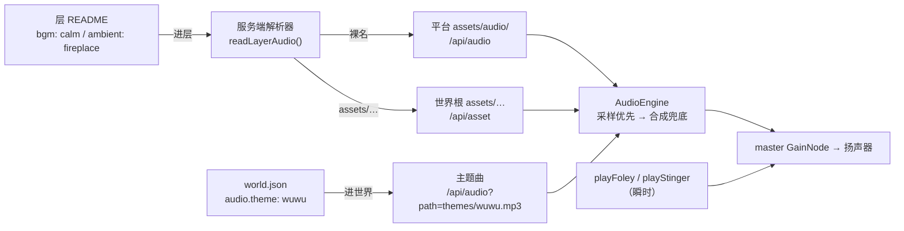

# docs/audio/00 共同上下文（冻结契约）

> **本文是 A1「音频接线」全批次共享地基。所有子文档 MUST 遵守，MUST NOT 自行改动本文冻结的形状。**
> 冻结日期：2026-09-12。与 `docs/tools/00-共同上下文.md`（B1 工具面）同款体例。
> 母文档：本文件；子文档 `01`–`06` 各管一个模块。冲突时以本文为准。

---

## 0. 本文的权威层级

上游冲突时的裁决顺序（高 → 低）：

1. **本文冻结的形状**（路径、字段名、解析链、引擎 API）；
2. `doc-19 §2`（三层声场，架构意图权威）；
3. `doc-06` / `doc-04 §10.7`（演出与视觉规格）；
4. `doc-11 §2.3` / `doc-15`（README = 层配置，frontmatter 字段）；
5. `docs/前端改造计划.md`（施工单，**其中 T2.1 的"作家 mood 标签"一条已被本文 §12 推翻**）。

**本文对 doc-19 / doc-04 / 前端改造计划 的三处修订（§12）在裁决时优先于原文。**

---

## 1. 一句话架构

**音频分三级：世界主题曲（世界级，进世界铺）→ 层 BGM（层 README 声明，进层覆盖）→ 层环境音（层 README 声明）**；Foley/stinger 是**瞬时效果音，与主轨正交**，其中 `[emo: tag]` 只触发**短 stinger**，**绝不碰 BGM 主轨**。

一句话解析律：**`assets/` 开头的值是世界相对路径（走 `/api/asset`）；裸名是平台池键（走 `/api/audio`）。**



---

## 2. 路径与资产契约（冻结）

### 2.1 资产位置

| 级别 | 磁盘位置 | URL | 现状 |
|---|---|---|---|
| **平台级** | `<REPO_ROOT>/assets/audio/**` | `GET /api/audio?path=<rel>`（**新建**） | 31 条已产出（§10） |
| **世界级** | `<worldRoot>/assets/**` | `GET /api/asset?path=<world-rel>`（**既有，不改**） | 无先例，约定已存在 |

- `REPO_ROOT` = `apps/server/src/index.ts:15` 的 `path.resolve(__dirname, '../../..')`。
- `worldRoot` = `LocalStore.worldRoot`（`packages/shared/src/store/local-store.ts:56`），由 `getActiveStore()` 取。
- **既有先例**：`SceneBackdrop.tsx:7` 注释 `World-relative asset path (assets/scenes/<layer>/<file>.png)`；模板 README 实写 `bg: "assets/scenes/...png"`。世界级音频复用同一约定，**零新概念**。

### 2.2 平台级目录布局（冻结，子文档 MUST 用这些键）

```text
assets/audio/
  bgm/       calm.mp3  tense.mp3  crisis.mp3              # 三情绪主轨
  themes/    wuwu.mp3  whitechapel.mp3  divergence.mp3
             firstsnow.mp3  emberglass.mp3                # 世界主题曲
  ambient/   rain.mp3  fireplace.mp3  cellar-drip.mp3     # 三常驻环境床
    pool/    storm.mp3 harbor-waves.mp3 library.mp3 …     # 11 条通用池
  foley/     paper-slide.mp3 dice-roll.mp3 …              # 9 条拟音
  stinger/   normal.mp3 smile.mp3 shock.mp3 sad.mp3
             angry.mp3 thinking.mp3                       # 6 情绪瞬时音（**待产出，见 §13**）
  CREDITS.md  PLAN.md                                     # 溯源与规划
```

### 2.3 解析顺序与覆盖链（冻结）

`ambient` 裸名按序试探，**首个存在者胜**（服务端用 `fs.existsSync`）：

1. `ambient/<name>.mp3`（三常驻床）
2. `ambient/pool/<name>.mp3`（通用池）

`bgm` 裸名：

1. `bgm/<name>.mp3`（三情绪轨）
2. `themes/<name>.mp3`（主题曲，允许层直接点主题曲）

**全部落空 → 该字段解析为 `null`，不报错**（降级见 §7）。

**世界级 vs 平台级 = 覆盖 / 增强（冻结，需求裁决）**：裸名解析**先试世界级、再回退平台级**：

```text
裸名（如 ambient: fireplace）
  1. <worldRoot>/assets/audio/ambient/fireplace.mp3   ← 世界级私有（可覆盖平台同名）
  2. <worldRoot>/assets/audio/ambient/pool/fireplace.mp3
  3. <AUDIO_ROOT>/ambient/fireplace.mp3               ← 平台级兜底（本仓 31 条）
  4. <AUDIO_ROOT>/ambient/pool/fireplace.mp3
  5. 全落空 → null
```

- **覆盖**：世界若自带同名文件，**赢过**平台（世界可以替换平台的 `calm`/`rain`）。这就是"世界级覆盖平台级"。
- **增强**：世界没有的，落到平台池（本仓 31 条对所有世界生效）。这就是"平台提供基础音频"。
- **`assets/` 前缀值仍是世界相对直取**（不参与上表第 3/4 步）。
- **勘误（评审 Semantics）**：初稿把两者做成**互斥**（"世界级 404 不试平台同名"）——那**违背需求**。世界级与平台级是**同一条 fallback 链的先后**，不是二选一。

**URL 归属**：命中世界级 → `/api/asset?path=assets/audio/…`；命中平台级 → `/api/audio?path=…`（§2.1）。

### 2.4 反穿越（冻结）

`/api/audio` MUST 与 `/api/asset` 同款双重防穿越（`world.ts:549-563` 先例）：

```ts
const abs = path.resolve(AUDIO_ROOT, rel);
if (!abs.startsWith(AUDIO_ROOT + path.sep)) return 403;
```

拒绝 `..`、绝对路径、符号链接逃逸（`fs.realpath` 后二次校验）。

---

## 3. 字段契约（冻结）

### 3.1 层 README frontmatter（顶层，与 `bg` / `bgStyle` 平级）

```yaml
---
type: readme
name: Baker Street
bg: "assets/scenes/baker-street/parchment-warm.png"
bgStyle:
  tone: warm            # 保留：材质色调（CSS data-tone）
  grain: parchment      # 保留：材质皮肤
ambient: fireplace      # 新增：环境音床（裸名 | assets/… 世界路径）
bgm: calm               # 新增：情绪配乐（裸名 | assets/… 世界路径）
---
```

**冻结点**：
- `ambient` / `bgm` 是**顶层字段**，**不嵌 `bgStyle`**——`bgStyle` 是视觉（CSS），音频是独立维度。
- 两个字段**都可选**。缺省 = 继承（§3.3）。
- 值形态只有两种（§1 解析律）。**第三种形态（含 `/` 但非 `assets/` 开头）是契约违规**：**服务端 `console.warn`（fail-loud 落日志）+ resolve 为 `null`**；**不下发 `errors` 字段**（响应形状不扩，见 §4.2）。**勘误（评审 B1）**：初稿写"写入 `errors`"，但 `readLayerAudio`/`resolveAudioRef` 无 errors 出参（01 §5.1/§11 已定），故此处改为日志口径。

### 3.2 `world.json` 世界级声明（顶层，与 `material` 平级）

```json
{
  "id": "whitechapel-demo",
  "material": "parchment",
  "audio": { "theme": "whitechapel" }
}
```

- `audio.theme`：世界主题曲键，解析同 §2.3 的 `bgm` 规则。
- 可选。缺省则世界无主题曲，直接进层 BGM。

**跨包改动（冻结，实测发现）**：`WorldManifestSchema`（`packages/shared/src/schemas/world.ts:25-44`）当前**未声明** `audio`。虽 `.passthrough()`（`:44`）运行时保留，但**类型上取不到** → **MUST** 加：

```ts
audio: z.object({ theme: z.string().optional() }).optional(),
```

这是 `packages/shared` 的改动 → **改后必须 `pnpm build`**（`AGENTS.md §6.5` 红线：`import` 的是 `dist` 就必须 build）。落点由子文档 `01`/`05` 认领（同一处，勿两边各改一次）。

### 3.3 继承链（冻结）

进某层时，`ambient` / `bgm` 各自独立解析：

```text
该层 README 已声明  → 用该值（即使解析为 null = 显式静音，也不回退）
该层 README 未声明  → 回退 世界 README（map 层）的同字段
map 层也未声明      → null
```

**三态必须区分（冻结，评审裁决）**：

| 本层 `ambient`/`bgm` 的 YAML 状态 | 结果 | 依据 |
|---|---|---|
| **键不存在**（未声明） | 回退 map 层同字段 | 继承链本意 |
| **键存在但解析为 `null`**（如 `ambient: null`，或声明了不存在的裸名） | `null`（**不回退**） | §7「解析为 null = **声明**静音」。05 用 `ambient: null` 表达"明确静音优于错配" |
| **键存在且解析出 URL** | 该 URL | — |

**实现含义（load-bearing）**：`own.ambient ?? inherited.ambient` 是**错的**——它无法区分"未声明"与"显式 null"。正确写法须先判**键是否存在**：

```ts
const ownFm = parsed.frontmatter;                       // 本层 README 的原始 frontmatter
const declared = (k: 'ambient' | 'bgm') => ownFm != null && k in ownFm;
const mapInherited = /* 非 map 层读 world/README.md 后 readLayerAudio(...) */;
const audio = {
  ambient: declared('ambient') ? own.ambient : (mapInherited?.ambient ?? null),
  bgm:     declared('bgm')     ? own.bgm     : (mapInherited?.bgm ?? null),
};
```

> **评审背景**：01 §5.1 初稿用 `??` 且 01 §11-4 自述"契约无'显式关闭继承'的表达"；06 §9 的 I3 断言"own 存在即不继承"。**两者矛盾，本裁决取 I3**（与 §7 一致）。
>
> ⚠️ **上面这段是示意伪码，不可编译**（`mapInherited` 是占位）。**完整可编译版本在 §4.2**（含 `try/catch` 与作用域内真实符号）——实现时以 §4.2 为准，勿照抄本节片段。
>
> **本层取值**：`own.ambient`/`own.bgm` = `readLayerAudio` 的产物；"键是否存在"另从 `parsed.frontmatter` 判定（二者不可混）。

- 世界主题曲（`world.json.audio.theme`）**不是** `bgm` 继承链的一环——它是独立主轨（§5.3），与层 `bgm` 可同时存在（主题曲更轻、层 BGM 叠在其上或替换，由引擎 §5.3 定义）。
- **不进 `world.json` 加 `layers` 之类的声明**——层由目录扫描（`AGENTS.md §3.3`），音频字段只加在层 README。

---

## 4. 解析链契约（冻结）

### 4.1 服务端（唯一解析点）

**解析发生在服务端**，前端只收 URL——保证单一真相源、防两端口径漂移。

`apps/server/src/routes/world.ts`：

| 函数 | 签名 | 职责 |
|---|---|---|
| `readLayerBg(raw)` | **改写**（既有 `world.ts:90`，签名不变） | 改读 `parseFrontmatter(raw).frontmatter.bgStyle.tone/grain`，废弃裸正则 |
| `resolveAudioRef(v, kind, store, audioRoot)` | **新增，唯一定义处 = 01 §2.2** | 单个值 → URL（§2.3 解析）。`kind` 决定裸名候选表；`audioRoot` = `createWorldRouter` 内 `AUDIO_ROOT` |
| `readLayerAudio(fm, store, audioRoot)` | **新增，唯一定义处 = 01 §2.3** | `fm.ambient` / `fm.bgm` → `{ ambient: string\|null, bgm: string\|null }`（URL 形式）。**不做继承**（继承归 §4.2） |

> **签名以 `01 §2.2/§2.3` 骨架为准**（评审 B2：本节初稿写 3 参，与 01 的 4 参实现不一致）。`audioRoot` 而非 `repoRoot`：`AUDIO_ROOT` 由 `repoRoot` 解析得来，函数收的是解析后的根。

**继承链的服务端落点（冻结，评审 B1 + 三态裁决）**：`/api/layer` 解析**当前层** `audio` 后，对**非 `map` 层**、且**仅对本层未声明的字段**做 map 层回退。**注意 `??` 是错的**（无法区分"未声明"与"显式 null"，见 §3.3）：

```ts
// 01 §5.1 内（world.ts /api/layer 解析处）：
const ownFm = parsed.frontmatter;                       // 本层 README 原始 frontmatter
const own = readLayerAudio(ownFm, store, AUDIO_ROOT);
let audio = own;
if (layer !== 'map') {
  try {
    const mapFm = parseFrontmatter(await store.readFile('world/README.md')).frontmatter;
    const inh = readLayerAudio(mapFm, store, AUDIO_ROOT);
    // 键存在 = 本层已声明（即使解析为 null 也是"显式静音"，不回退）→ 用 own；否则继承
    const declared = (k: 'ambient' | 'bgm') => ownFm != null && k in ownFm;
    audio = {
      ambient: declared('ambient') ? own.ambient : (inh.ambient ?? null),
      bgm:     declared('bgm')     ? own.bgm     : (inh.bgm ?? null),
    };
  } catch { /* map README 缺失 → 不继承，保持 own */ }
}
```

- **为什么在服务端**：前端不知道 `world/README.md` 的内容，也不该解析（§9 反模式 2）。服务端是唯一解析点（§4.1）。
- **为什么不复用 `getManifest().layers`**：`deriveLayers` 只派生 `name`/`parent`（实测），不携带音频字段。
- **必须配套**：`03` 的 effect **不需要**改（只消费服务端下发的最终 `audio`）；`01 §9` 与 `06 §9` 的继承断言须覆盖**三态**（未声明→继承 / 显式 null→不继承 / 显式 URL→用值）。


### 4.2 `GET /api/layer` 响应形状（冻结）

```jsonc
{
  "layer": "world/baker-street",
  "bg": { "src": "assets/scenes/...png", "tone": "warm", "grain": "parchment" },
  "audio": {                          // ← 新增顶层兄弟
    "ambient": "/api/audio?path=ambient%2Ffireplace.mp3",
    "bgm": "/api/audio?path=bgm%2Fcalm.mp3"
    // 未声明且 map 层也未声明 → null（= 声明静音，见 §7）
  },
  "items": [ … ], "links": [ … ], "presence": [ … ], "worldFrozen": false
}
```

`bg` **保持原形状不变**（`tone`/`grain` 仍供 CSS `data-tone`），**不再兼职当 ambient**。

### 4.3 `GET /api/manifest` 响应（冻结）

manifest 透传 `world.json`，且 **`audio.theme` 由服务端解析为 URL 后再下发**（**修正**：初稿写"原样透传即可"，与 §4.1「解析只在服务端」/§9.2 矛盾——裸键会迫使前端拼 URL）。形状：

```jsonc
"audio": { "theme": "/api/audio?path=themes%2Fwhitechapel.mp3" }   // 或 null
```

---

## 5. 引擎契约（冻结）

`apps/web/src/lib/audio.ts` 对外 surface（**新增/扩展，既有 API 不删**）：

```ts
// ── 既有（签名冻结，语义扩展为"采样优先"） ──
initAudio(): AudioContext | null   // 源码音频 audio.ts:61，勿写成 void（评审 B3）
playFoley(name: FoleyName, intensity?: number): void   // 采样优先 → 合成兜底
setAmbient(ref: string | null): void                   // ← 语义改：收 URL 或裸名或 null
setBGM(ref: string | null): void                       // ← 语义改：收 URL 或 null（同 setAmbient）
/** 合成兜底内部仍用既有 `BGMood` 枚举；对外不再收它（URL 化后由 02 内部按 URL 推断）。 */
setMuted(m: boolean): void
isMuted(): boolean

// ── 新增 ──
/** 世界主题曲：独立于层 BGM 的一条轻主轨。null = 停。 */
setTheme(ref: string | null): void
/** 瞬时情绪 sting：与主轨正交，播完即止。 */
playStinger(emo: Emotion): void
/** 预加载：进层/进世界时预热素材，返回 Promise 供测试等待。 */
preloadAudio(urls: string[]): Promise<void>
/** 测试/诊断用：当前各轨状态。 */
audioDebugState(): { ambient: string | null; bgm: string | null; theme: string | null; loaded: string[] }
```

### 5.1 类型（冻结）

```ts
export type FoleyName =
  | 'paper-slide' | 'bag-pack' | 'dice-roll' | 'unlock' | 'pen-scratch'
  | 'gate-open' | 'crit-chime' | 'fumble-break'
  | 'page-turn';                                    // ← 新增（素材已存在）

/** 既有类型，名字**就是** `BGMood`（源码 `audio.ts:25`）。勿写成 `BGMMood`。 */
export type BGMood = 'calm' | 'tense' | 'crisis';

export type Emotion = 'normal' | 'smile' | 'shock' | 'sad' | 'angry' | 'thinking';
```

### 5.2 采样链（冻结）

```text
fetch(url) → arrayBuffer → ctx.decodeAudioData → AudioBuffer
  → AudioBufferSourceNode(loop?) → GainNode(ramp) → master
```

- **decode 缓存**：`Map<url, Promise<AudioBuffer>>`，同一 URL 只解一次。
- **失败缓存**：`Set<url>`（failCached），避免反复 fetch 404。
- **降级**：`fetch`/`decode` 任一失败 → 该 URL 记入 failCached → **回落既有合成引擎**（§7）。合成代码 **MUST 保留**，是 T3.8 的离线演出保底。

### 5.3 三条主轨的语义（冻结）

| 轨 | 触发 | 生命周期 | 音量 |
|---|---|---|---|
| `theme` | `setTheme()`（进世界） | 进世界起，跨层持续 | 最低（bg 层） |
| `bgm` | `setBGM()`（进层，§3.3 解析） | 进层起，跨层覆盖 | 中 |
| `ambient` | `setAmbient()`（进层，§3.3 解析） | 进层起 | 低 |
| `stinger` | `playStinger()`（`[emo:]`） | **<1.5s，播完即止** | 中高，一次性 |

- 三条主轨**各自独立 crossfade**（`AMBIENT_FADE = 1.5s` 已有，BGM/theme 同款）。
- `stinger` **不淡出主轨、不改主轨增益**——纯叠加。

### 5.4 `unlock()` 与显式驱动的冲突裁决（冻结，**实测发现**）

**裁决（冻结）**：
1. `unlock()` **MUST NOT** 再种任何 ambient/bgm 默认值。改为：**仅 resume 上下文 + 恢复 master 增益**。
2. `ambientRequested` / `bgmRequested` 两个标志（`:54-55`）随之删除或改为"是否已被 App 驱动"。
3. **不设"App 回退默认值"**（**修正**：初稿曾写"整体缺失时 App 回退 `setAmbient('rain')`"，**该条已删除**——它恰好违反 §7：把"静音"替换成"悄悄播 rain"）。服务端**总是**下发 `audio` 对象（字段为 null 即静音），"整体缺失"仅存在于首次 `/api/layer` 返回前，此时音频上下文本就 suspended，**无需任何默认值**。App effect 按 `?? null` 直传。
4. 理由：引擎是哑执行器；让它偷偷种默认值会产生第二个真相源（与 `AGENTS.md §3.2`「文件即真相」同源纪律）。而"默认环境音"本身也不是好产品决策——环境音该**声明**，不该**推断**。

**`LayerState.audio` 必需性（冻结，二次裁决）**：`audio: { ambient: string | null; bgm: string | null }` 为**必需字段**（非可选）。

- 三态由**结构**表达，不需要第四态：① `useWorld.state === null`（首次加载前，`useState<LayerState|null>(null)` 既有）= 尚未有数据；② `audio.ambient === null` = 服务端判定**声明静音**；③ `audio.ambient === "url"` = 播放。
- **服务端契约保证恒定下发 `audio`**（§4.2）：`/api/layer` 的 README 读取失败走既有 `catch`（`world.ts:260-262`）时，MUST 同样构造 `audio: { ambient: null, bgm: null }`（01 §6 已承诺）。
- 前端 `useWorld` 构造 `next` 时**照抄既有 `bg` 体例**：`audio: data.audio ?? { ambient: null, bgm: null }`（`useWorld.ts:87` 的 `bg` 同行风格）。类型必需，运行时兜底只是防"服务端违约"。
- **为什么不设 `audio?` 可选**：FrontendState 初稿主张可选，**其论证前提是"App 的 rain 兜底分支不可达"——而该分支已在 §5.4 第 3 条删除**（它违反 §7）。前提消失后，可选的唯一作用是为"服务端可能不下发"留口子；而那是**契约禁止**的情况，应在服务端 fail-loud，不该让前端静默兼容。

**对子文档的后果**：`02`（引擎，删 `unlock` 种默认）+ `03`（前端，`audio` 必需字段、无默认值回退）**两端必须同批落地**；只改一端 → 死默认或类型漂移。

## 6. 触发点契约（冻结）

### 6.1 既有 Foley 调用点（**实测权威清单，2026-09-12 全仓 grep**）

| 调用点 | file:line | 实参 | 事件 |
|---|---|---|---|
| `Canvas.tsx` | `:256` | `paper-slide`（按速度） | 拖拽起 |
| `Canvas.tsx` | `:310` | `bag-pack` | 卡片落定 |
| `Canvas.tsx` | `:403` | `paper-slide` 0.8 | **径向菜单开** |
| `DiceRoller.tsx` | `:123` | `crit-chime` | 大成功 |
| `DiceRoller.tsx` | `:126` | `fumble-break` | 大失败 |
| `DiceRoller.tsx` | `:142` | `dice-roll` | 掷骰 |
| `RadialMenu.tsx` | `:105` | `pen-scratch` | 提交新建 |
| `RadialMenu.tsx` | `:179` | `paper-slide` 0.6 | 选项点选 |
| `CardRenderer.tsx` | `:115` | `unlock` | **道具拖到目标上**（`use_item_on` 反馈） |

共 **9 处**（实测 `grep -rn playFoley apps/web/src`）。**勘误**（初稿曾错，勿再沿用）：
- 初稿写 `RadialMenu.tsx:105` = "菜单开" → **错**：`:105` 是提交新建（`pen-scratch`）；菜单开在 `Canvas.tsx:403`。
- 初稿写 `use-item.ts`（使用道具）→ **该文件不存在**（`find` 零命中）；`use_item_on` 的反馈实在 `CardRenderer.tsx:115`。

**素材缺口**：`gate-open`（已下载）**全仓零调用点**——留给 T4.3 门卡过场，本批不接线。

**`page-turn`**：素材已下载、类型未纳。`CardRenderer.tsx` 的 `letter` 模态**当前无翻页交互**（实测）→ **本批不接线**，等 book/pages 二级层。详见 `04`。

### 6.2 `[emo:]` → stinger（冻结）

- 触发点：`CharacterModal.tsx:106` 的 `setEmo(mood)`（**实测行号**；初稿曾写 `:96`，已过期）。
- **只调 `playStinger(emo)`，MUST NOT 调 `setBGM`。**
- 素材：`assets/audio/stinger/<emotion>.mp3` — **当前不存在**（§13 待办 P1）。素材缺失时 `playStinger` 静默 no-op（有 failCached 记录），**不影响主轨**。
- **URL 归属（已裁定）**：`playStinger` 内部直拼 `/api/audio?path=stinger%2F<emo>.mp3`（编码口径同 §4.2）。**不违 §9.2**——§9.2 禁的是对 README 声明的**值**做解析；stinger 是固定枚举 → 固定文件，URL 是常量。`04` 只调 `playStinger(emo)`，不碰 URL。**世界级 stinger 覆盖本批不做**（素材+下发通道均缺，见 §13）。

### 6.3 进层 → 主轨（冻结）

`App.tsx:52` 的 effect **改写**：

```ts
// before: setAmbient(worldState?.bg?.tone || 'rain')   ← 拿材质色调猜环境音
// after:
useEffect(() => {
  if (!worldState) return;                 // 首帧短窗（state 为 null），见 §5.4
  const audio = worldState.audio;
  setAmbient(audio.ambient ?? null);
  setBGM(audio.bgm ?? null);
  const urls = [audio.ambient, audio.bgm, themeUrl].filter(
    (u): u is string => typeof u === 'string' && u.length > 0
  );
  if (urls.length > 0) void preloadAudio(urls);
}, [worldState?.audio?.ambient, worldState?.audio?.bgm, themeUrl]);
// 完整逐步与理由见 03 §3.2（唯一定义处）；deps 用 URL 而非 [currentLayer]（评审 P2）。
```

---

## 7. 降级契约（冻结，"不静默降级"）

| 场景 | 行为 | 可断言处 |
|---|---|---|
| 素材 fetch/decode 失败（`ambient`/`bgm`） | 回落合成引擎；URL 记 failCached | `audioDebugState().loaded` 不含该 URL；`console.warn` 带 URL |
| 素材 fetch/decode 失败（`theme`） | **静音**——theme **无**合成可回退（不拿 drone 冒充世界主题曲）；`theme` 记 ref（=URL）但 neutral | `audioDebugState().theme === '<该 URL>'` 且 `loaded` 不含它 |
| 世界级路径 404 | **`assets/` 前缀值**视同 null（不试平台同名——它显式指向世界文件）；**裸名**则继续走覆盖链下一级（§2.3） | 裸名 `fireplace` 世界无 → 落平台 `/api/audio?path=ambient%2Ffireplace.mp3` |
| `ambient`/`bgm` 解析为 null | 静音该轨（不回落合成——静音是**明确声明**） | `audioDebugState().ambient === null` |
| 音频上下文未解锁（无用户手势） | **主轨（ambient/bgm/theme）挂起**：setter 记 ref，`unlock()` 后 `rampClips()` 补播；**一次性音（foley/stinger）直接 drop**（补播必然错拍，见 02 §6.4） | `audioDebugState().loaded` 不含未播 URL；unlock 后主轨起声 |

**关键区分**：**"解析为 null" ≠ "素材加载失败"**。前者是声明静音（合成器也停），后者是保底演出（合成器顶上）。

**foley / stinger 的 URL（裁定，消解 02 冲突 2）**：`foley/<name>.mp3` 与 `stinger/<emo>.mp3` 是**平台固定约定**（键 = 文件名，不经 README 声明），**不属于** §9 反模式 2 所禁的"解析 README 声明的值"。故 **`playFoley`/`playStinger` 由引擎自建 URL**。§9 反模式 2 的精确含义是"**MUST NOT 把 README 声明的裸名值解析成 URL**"，不是"引擎不许拼任何 URL"。

---

## 8. 每篇子文档 MUST 有的结构

1. 一句话定位
2. 签名 / 参数 / 类型
3. 行为契约逐步（每步写"**漏了会怎样**"）
4. 文件与副作用（精确 `file:line`）
5. 落账 / WS 前端联动（若不适用写"无"）
6. 错误边界
7. **代码落点**（精确到文件与函数名）
8. 与现状差异（带 `file:line` 的现状事实）
9. 验收测试（可执行的断言）
10. **发现的冲突 / 需修订的上位文档**
11. **仍未知待拍板**
12. **诚实性**：事实带 `file:line`，推断标 `[推断]`，未知不得伪装成已定

---

## 9. 反模式（MUST NOT）

1. **MUST NOT** 让 `[emo:]` 或任何角色直聊信号去改 BGM 主轨（galgame 惯例：stinger 只做瞬时）。
2. **MUST NOT** 把 **README 声明的** `ambient`/`bgm` 裸名值解析成 URL（解析只在服务端，§4.1）。**例外（明确允许）**：`playFoley`/`playStinger` 自建**平台固定约定** URL（键=文件名，非声明值），见 §7 裁定。
3. **MUST NOT** 在 README frontmatter 里写 `layers` 或音频的集中声明表（层由目录扫描）。
4. **MUST NOT** 删除 `lib/audio.ts` 的合成引擎代码——它是离线降级保底（§5.2）。
5. **MUST NOT** 用硬编码素材文件名绕过 `assets/audio/README` 的 CREDITS（CC-BY 署名义务）。
6. **MUST NOT** 把 `bg.src` 的解析路径与音频混用（图走 `/api/asset`，音频走双路由 §2.1）。
7. **MUST NOT** 在 `world.json` 里为**层**声明音频——只有世界主题曲在 `world.json`。
8. **MUST NOT** 删 `unlockOnFirstInteraction()`（`audio.ts:614-622`）——虽全仓零调用（实测），但它**不属于** A1 范围；本批只登记，留待后续死代码审计。

---

## 10. 现状基线（带证据）

| 事实 | 证据 |
|---|---|
| 平台音频 31 条已产出，无任何 URL 可达 | `find assets/audio -name '*.mp3'` = 31；`index.ts:68` 只伺服 `apps/web/dist` |
| `/api/asset` 限定世界根 | `world.ts:549-563`（`abs.startsWith(store.worldRoot + sep)`） |
| `readLayerBg` 用裸正则读顶层 `tone:` | `world.ts:103-104` `/^\s*tone:\s*(\S+)/m` |
| 但真实 frontmatter 是嵌套 `bgStyle.tone` | `templates/holmes-world/world/*/README.md` |
| `parseFrontmatter` 返回**未过滤** frontmatter | `frontmatter.ts:180`、`:196` `frontmatter: raw` |
| `yaml` 库已在依赖 | `packages/shared/package.json:22` `"yaml": "2.9.0"` |
| `setBGM` 全仓零调用者 | `grep -rn setBGM apps/web/src` = 仅 `audio.ts` 定义 + `unlock()` 内 `setBGM('calm')` |
| `FoleyName` 缺 `page-turn` | `audio.ts`（8 项联合类型） |
| `App.tsx` 拿 `bg.tone` 当 ambient | `App.tsx:53` `setAmbient(worldState?.bg?.tone \|\| 'rain')` |
| `useAudio` 只有 `ambient: string` | `useAudio.ts`（无 bgm/theme/stinger） |
| 模板 README 无 `ambient` 字段 | `grep -rn 'ambient:' templates/` = 0 |
| 模板无 `assets/` 目录 | `find templates worlds -type d -name assets` = 0 |
| `worldlines-assets` 零音频 | `find worlds/… -name '*.mp3'` = 0（纯图） |
| 立绘 emo 已全链路实现（只喂图） | `CharacterModal.tsx:27,50,96` |
（实测补充，2026-09-12 主 agent）`REPO_ROOT`（`index.ts:15`）**已实测**：dev（`apps/server/src`）与 prod（`apps/server/dist`）经 `../../..` 均精确落到 repo 根，`assets/audio/{themes,ambient,pool,foley}` 全部可达。这是 `/api/audio` 的地基，**已确认稳定**。
（实测补充）`parseFrontmatter` **已实测**能正确读出嵌套 `bgStyle.tone/grain` 与顶层新增 `ambient`/`bgm`（新增字段 YAML 合法、`errors: []`）。
（实测补充）**`readLayerBg` 改写向后兼容**：对 `templates/holmes-world` 全部 4 个已核 README，现状裸正则输出与结构化读取**逐字段相同**（`warm/parchment`、`cold/rough-paper`、`dusk/grain`；`src` 均正确）。即改写**不改变现有可见行为**，只修掉"正文污染"的潜在 bug 面（§11.1 的 B2/B3 用例）。`bg.src` 的清理逻辑（去引号/去行内注释）**保持原样**。
（实测补充，2026-09-12，打真实运行实例 :3001）
- `GET /api/layer` **真实响应顶层键** = `['layer','bg','items','links','presence','worldFrozen']`，**当前无 `audio`**；`bg` = `{src,tone,grain}` 与 §4.2 一致。加 `audio` 是纯增量。
- `GET /api/audio?path=…` **实测返回** `Cannot GET /api/audio`（Express 原生 404，**非** SPA fallback）——证明该路由确实不存在，新增无冲突。
- `GET /api/asset?path=world/README.md` = **200**；`path=../../../etc/passwd` = **403**（防穿越既有生效）。
- `vite.config.ts:10` 的 `'/api'` 为**前缀代理** → `/api/audio` 自动走 3001，**dev 侧零改动**（§2 推荐方案成立）。
（实测补充，2026-09-12）`world.json` 的 `audio` 字段：`WorldManifestSchema` 是 `.passthrough()`（`schemas/world.ts:44`），**运行时保留** `audio`；但**类型未声明**（`:25-44`）→ **必须在 schema 加 `audio: z.object({ theme: z.string().optional() }).optional()`**，否则 TS 报错。`getManifest()`（`local-store.ts:286-292`）走 `validateWorldManifest({...parsed, layers})`，`layers` 由 `scanLayers()` 派生。
（实测补充，**load-bearing**）`deriveLayers`（`store/layers.ts`）**只派生 `name`/`parent`**——实测 `deriveLayers(['world','world/baker-street'], …)` 输出 `{"map":{name,parent},"world/baker-street":{name,parent}}`，**不携带 `ambient`/`bgm`**。故音频字段**不能**经 `manifest.layers` 下发；**唯一落点就是 `/api/layer` 的 `readLayerAudio`**（§4.1 正确）。前端 MUST NOT 期望从 manifest 拿层的 ambient/bgm。

---

## 11. 需要一并修掉的既有问题（A1 范围内）

1. **`readLayerBg` 裸正则 → 走 `parseFrontmatter`**（`world.ts:90`）。**已实测证伪（2026-09-12，配置矩阵）**：对「frontmatter 无 `bgStyle` + 正文含缩进行 `tone:`」的合法文档，裸正则抓回正文值 `uneasy`，结构化读取正确返回 `None`。用例 B2（正文缩进行）/ B3（正文 YAML 代码块）均分歧；A/D（有 `bgStyle`）无分歧。**结论：不只是"脆"，是真实 bug 面——任何正文含行首空白的 `tone:`/`grain:` 都会污染材质色。** 修法：`parseFrontmatter(raw).frontmatter.bgStyle.tone/grain`。
2. **`App.tsx:53` 的 `tone`→ambient 误用**。`tone`（warm/cold/dusk）是材质色，不是音轨名。
3. **`SceneBackdropBg.tone` 注释**（`SceneBackdrop.tsx:9-11`）写 "Ambient tone (audio bed selection)"——改后此注释失真，须同步改。
4. **`FoleyName` 缺 `page-turn`**（素材已下载，类型未纳）。

---

## 12. 发现的冲突 / 需修订的上位文档（**load-bearing**）

### 冲突 1：doc 声称的"作家单轮返回情绪标签"**无生产者**

| 文档 | 原文 | 判定 |
|---|---|---|
| `doc-19:124` | "根据**作家单轮返回的情绪标签**（`mood: tense / calm / crisis`）平滑切换音轨增益" | **假契约** |
| `doc-04 §10.7` | "随**剧情情绪标签**平滑切换音轨增益" | **假契约** |
| `前端改造计划:224` | "按**作家单轮返回的 `mood` 标签**平滑切换增益" | **假契约** |

**证据（三重否定）**：
1. `WRITER_INSTRUCTION`（`extensions/instructions.ts:23-38`）全文**无任何 mood 输出要求**；单轮管线只有 chalk → frontmatter(status/choice/roll_dice) → 物件演化。
2. 仓库内 `mood` 仅三处命中，**无一是作家情绪标签**：`components.ts:205`（diary 字段）、`instructions.ts:45`（角色台词 `[emo:]`）、`instructions.ts:55`（scene-init 散文描述）。
3. **结构上不可能**：作家与角色是不同 preset、不同 agent、不同进程（`launch.ts` 的 `AIRP_AGENT_ROLE` 分流），角色的 `[emo:]` 无法进入作家单轮返回。

**建议修订**（同 commit，见 §6.3 纪律）：
- `doc-19:124` → 改为 **"BGM 随层 README 的 `bgm` 字段切换；角色 `[emo:]` 触发瞬时 stinger，不改主轨"**。
- `doc-04 §10.7` / `前端改造计划:224` 同款改写。
- 按 `AGENTS.md §6.3`，**直接改掉旧说法**，不另起解释段。

### 冲突 2：doc 说 ambient 按 README 字段，但字段不存在

`前端改造计划:223` 说"切层时按该层 README 的 `ambient` 字段交叉淡入淡出"，但模板 README 只有 `tone`/`grain`。**本文 §3.1 正式定义该字段并补齐。**

### 冲突 3：`worldlines-assets` 的"平台上传端点"与本仓不同源

`worldlines-assets/README.md` 描述的是 **worldlines 项目**的 `.pi/ips/<ip>/assets/` 与 `:8830` 端点，**与 AIRP 无关**。本批次的平台级 = 本仓 `assets/audio/`。**不得把两套平台概念混用。**

---

## 13. 仍未知 / 待拍板

| # | 项 | 现状 | 建议 |
|---|---|---|---|
| 1 | **emo stinger 素材** | `assets/audio/stinger/*.mp3` **不存在**（6 情绪缺） | P1：用 dlazy 补 6 条短音，或先从 `foley/` 复用（`crit-chime`/`fumble-break`）应急 |
| 2 | 世界主题曲素材归属 | 5 首在 `themes/`，但 `world.json` 尚未声明 `audio.theme` | 由子文档 `05` 补齐 5 个模板声明 |
| 3 | `crisis` 轨触发时机 | 层静态声明不产生 crisis（无层会声明危机） | P1：留给演出通道（掷骰失败/ Spotlight），本批只保证 API 存在 |
| 4 | `/api/audio` 的 Range 支持 | 长 BGM（158s）是否需 HTTP Range | [推断] 浏览器 `decodeAudioData` 全量解码，无需 Range；若改流式播放再议 |
| 5 | 平台池 11 条如何被层选中 | 需模板 README 逐层补 `ambient:` | 由子文档 `05` 逐层给出声明表（本批只声明，不新增素材） |

---

## 14. 评审门

实现前，评审须独立检查（本文档 §12 的纪律）：

1. **跨文档一致性**：路径 / 字段名 / URL 形状在 `01`–`06` 是否逐字一致；
2. **契约冻结遵守**：有无子文档私改 §2–§7 的形状；
3. **语义兑现**：是否只是"能跑"而非"够味"（三层声场是否真分轨）；
4. **闭环性**：每个被引用的符号（`readLayerAudio` / `resolveAudioRef` / `setTheme` / `playStinger` / `preloadAudio` / `audioDebugState`）是否有**唯一定义处**；
5. **可实施性**：代码落点是否精确到 `file:line`；
6. **诚实性**：未知项是否被伪装成已定（§13 是否被消解或如实保留）。

**通过后才进入实现阶段。**
