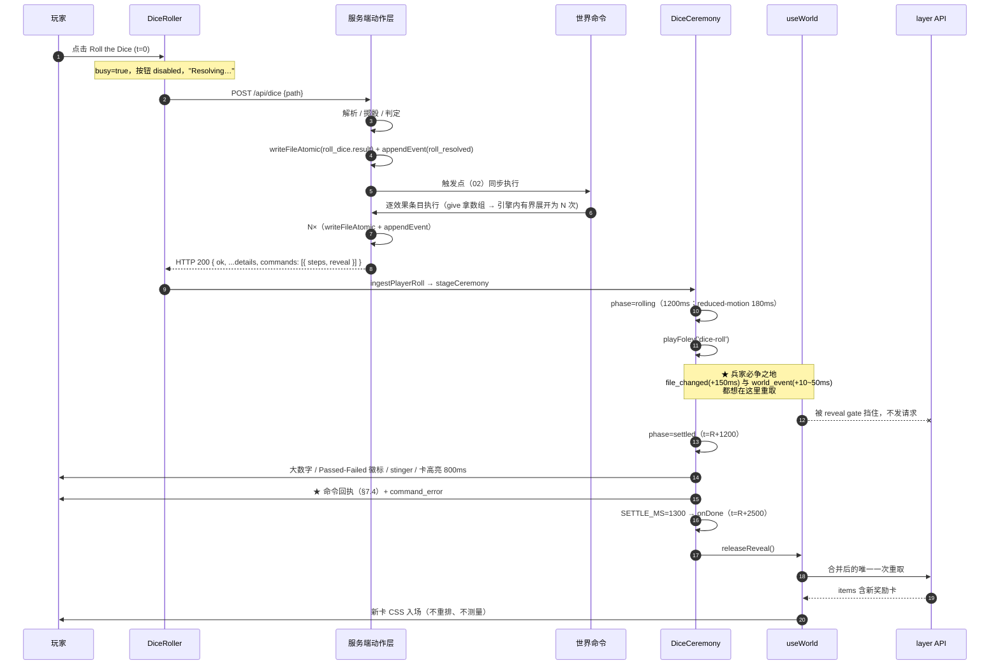

# doc-command/06 前端与演出

> 上游：`docs/command/00-共同上下文.md`（下称"契约"）。本文只回答一个问题：**玩家到底看到什么**——成功、命令执行失败、命令写错三种。
> 不拥有：幂等机制（→ `05`）、效果执行（→ `04`）、命令文件 schema（→ `01`）、触发点与绑定（→ `02`）、**线上回执形状**（`WorldCommandReceipt` → `04`，契约 §R.4）。
> 本文的每条"现状是 X"都带 `file:line`；没有实测数字的判断标 `[推断]`。
> **6 项待拍板（`[C-1]`–`[C-6]`）均已由评审门裁决**，结论与前端增量记录在 §12.1（不再写成"待定"）。**状态：设计（E1）**；本文不对任何东西声称 E3。
>
> ⚠️ **快照说明（契约 §R.3 末行）**：全文的 `file:line` 取自本批次开工时的树。**`useWorld.ts` / `App.tsx` / `event-bridge.ts` / `routes/world.ts` 在此之后历经多次提交**（`2e709da feat(ux): wire scene depth and chrome lifecycle` 起），行号已系统性漂移；这些代码文件**今天没有未提交改动**（`git status` 干净），本批次的改动**只在 `docs/` 内**。附录给出实测的新行号；**正文中的旧行号按"语义定位"读取，实现前 MUST grep 函数名，MUST NOT 照抄行号**。
>
> **recon 50dd228（本套文档审核轮次）**：设计定稿在 `65fa09d`/`eb34966`；此后仓库前进至 `50dd228`（新增 canvas arranger / `functional` actor / `arrangeCanvas` 动作方法 / `conflict` 错误码 / 画布即时补丁通道 / Vercel 部署 / STT 等）。本轮的 `file:line` 已逐条对 `50dd228` 复核，凡漂移处均写成「新标 `:Y`；旧标 `:X`，**快照已漂移**」的双记法（原有的 `旧标 :X` 括注一律保留）。**本文对命令系统的结论未因这 88 个提交改变**：命令的 actor 面、效果集、失败码表与 reveal gate 的设计均不依赖 arranger。唯一需要登记的**真交叉**是 §7.1 尾部两条（`conflict` 码的不可达性、`canvas_patched` 双消费者），已就地写下。

---

## 1. 一句话定位

**世界命令对玩家的可见性是"同一份数据的两条路"：一次同步回执（HTTP 响应 / `dice_result` 帧 / 工具 `details`，决定"我这次点击的后果是什么"），加一次整层重取（`world_event`，决定"世界现在长什么样"）。演出由回执驱动、在骰子落定那一刻才揭示；重取必须被压后到仪式收场之后。**

本文最重要的一句话：

> **命令的"毫秒级"不是靠 WS 帧，是靠它搭上了那一次同步响应（玩家）或 tool_result（Agent）。而"整层重取"这条既有通路，既是延迟的来源，也是剧透的来源——它必须被仪式挡住。**

---

## 2. 完整 schema / 签名 / 字段表

### 2.1 回执挂在 `ActionResult.details.commands`

命令不改任何事件类型（契约 §5.2），也不需要新 WS 帧（§6.1）。它把自己这次干了什么，作为**动作层返回值的一个字段**交出去——因为触发点就在动作层内（契约 §4.1），而 `details` 是动作层唯一的对外结构化通道（`packages/shared/src/actions/types.ts:31-40`）。

**为什么是数组 `commands`**：`02` 的 `on.<hook>` 恒为数组（单条也写数组），数组顺序 = 执行顺序。一次掷骰可以触发多条命令，所以回执必然是数组；用单数 `command` 会在第二条命令出现时立刻需要破坏性改名。

```ts
// NEW · apps/web/src/lib/world-command.ts（§2.3）—— **前端消费视图**。
//
// ⚠️ 线上形状（`ActionResult.details.commands` 的元素类型）**归 `04` 独占拥有**
//    （契约 §R.4）：`WorldCommandReceipt`，见 `04 §6.6`
//    （`packages/shared/src/commands/receipt.ts`）。**本文 MUST NOT 声称自己定义
//    `details.commands` 的元素类型。**
//
//    三个消费面**刻意不同形**，不是谁抄错了：
//      · `04` = 引擎侧最小单元（`id` / `name` / `settle` / `effects[]`）；
//      · `03` = 求值期视图（`key` / `entry` / `hook`，由求值器自己算，见 `03 §9.5`）；
//      · `06`（本文件的类型）= 前端视图（`reveal` / `text` / `status`，只有在浏览器里才有意义）。
//    本文件的类型**不是 `04` 的子集**（多了 `reveal` / `text` / `status` /
//    `appliedBeforeFailure`），因此 MUST NOT 与 `04` 共用同一个名字。
//    投影由 §2.3 的 `parseCommandReceipts` 完成；`04` MUST 在 §R.4 要求的
//    「逐字段说明三个消费面各读哪些字段」里给出 `06` 读的线上字段。
export const WORLD_COMMAND_STATUSES = [
  'applied',   // 全部效果落地
  'reused',    // 命中幂等：这个 commandKey 已经结算过，本次一个效果都没跑（05 拥有判定）
  'resumed',   // 命中幂等但上次只做了一半：从 steps[].step 断点续跑，补齐剩余效果（05）
  'skipped',   // 世界命令被关掉 / 命令文件缺失或损坏 → 世界照常，只是没有自动后果
  'blocked',   // 世界状态拒绝（目标不存在、越权、上限）→ 一个效果都没跑
  'failed',    // 世界已改但没能做全（写盘/落账/内部错误）
] as const;
export type WorldCommandStatus = (typeof WORLD_COMMAND_STATUSES)[number];
// ⚠️ 三个 `status` 不是同一个东西，MUST NOT 互相替代（实现期最常见的混用）：
//   · `02` 的 `CommandOutcome.status` = **求值器视角**：`'ok' | 'skipped' | 'error'`（`02 §2.6`）；
//   · 本文的 `WorldCommandStatus` = **UI 投影**（`06` 拥有），由 §7.1 的码表从线上收据推出；
//   · `05` 的 `settle` = **结算器 verb**（四个），进模型文案与 `command_log`。

// 与 05 的 `SettleReport { ran, reused, resumed, failed? }` 的对应关系（两个集合不同，别合并）：
//   SettleReport.ran      → 'applied' | 'failed'（取决于是否全部落地）
//   SettleReport.reused   → 'reused'
//   SettleReport.resumed  → 'resumed'
//   SettleReport.failed   → 'failed'（与 ran 同时出现时，就是 §7.1 的 command_effect_failed）
// 前端要的是"玩家该看到什么"，05 要的是"结算器做了什么"——两者**刻意不同形**：
// 'resumed' 与 'applied' 对玩家是同一件事（结果都在那里了），但断点续跑是实现事实，
// 必须留在机器侧可观测，否则"续跑补错了步"没有任何人看得见（05 的 command_resume_drifted）。

// `status`（给玩家看）与 `settle`（05 的结算器 verb）**并存且必须自洽**：
//   settle='ran' 时 status ∈ {applied, skipped, blocked, failed}
//     —— 'ran' 只说"结算器跑过了"，落地情况由 status 表达（全落地=applied，
//        被关掉=skipped，被拒=blocked，做一半=failed）
//   settle='reused'  → status 必为 'reused'
//   settle='resumed' → status 必为 'resumed'
//   settle='failed'  → status 必为 'failed'
// 前端只用 status；settle 进模型文案与 `command_log`（05 §5.7 的 verb 对齐）。
// **两条都进回执**而不是只留一条：模型需要 settle（"跑过没有"是它的行动依据），
// 玩家需要 status（"结果在不在"是他的认知依据），而这两种问法答案不同。

// NEW
/**
 * 一个**执行步**的结局 —— 与 05 的 `steps[].step` **一一对应**、同粒度。
 *
 * 关键：粒度为**扁平序**，不是声明位置。Main 裁定方向三让 `with.rewards:
 * "{{ trigger.entry.rewards }}"` 把整个数组交给 `give`（list-args），而 05 §5.7
 * 已定：**list-args 展开后的每一项各占一个 `step`**（`do[0]#1`、`do[0]#2`…），
 * fold-args 恒只占一个。所以：
 *
 *   - `step` 是**平滑递增的续跑游标**（0,1,2,…），不是 `do[]` 下标；
 *   - `decl` 才是声明位置（`do[0]#2` 形态），**只作溯源**；
 *   - `targets` 因此退化为**单值**吗？不——`fold-args` 一次写多个目标仍是常态
 *     （`options → choice.options + choice_actions`），所以它保留为数组。
 *
 * 前端只消费汇总；逐项明细在卡片折叠区（§7.5）。**不是**每个 step 一条 UI 行：
 * `give` 3 份奖励在玩家眼里就是"桌上多了 3 张卡"，不是"3 次操作"。
 *
 * ⚠️ `WorldCommandStepOutcome` 同样是 **`06` 的前端视图**，不是 `04 §6.6` 的
 * `WorldCommandReceipt.effects[]`（线上形状：`{action, ok, event?, error?}`）。
 * 两者刻意不同形（`06` 要 `targets`，以便一次 `give` 收 3 张卡只显示"桌上有 3 张"）。
 * **本文 MUST NOT 声称自己定义 `details.commands` 的元素类型。**
 */
export interface WorldCommandStepOutcome {
  /** 扁平序（续跑游标）。与 05 的 `steps[].step` 同源，MUST 从 0 连续递增。 */
  step: number;
  /** 声明位置，`do[<index>]#<n>` 形态（n 是 list-args 展开序号，1-based）。**仅溯源。** */
  decl?: string;
  /** 04 的 WORLD_COMMAND_EFFECTS 之一（give · move · edit · set_status · consume · enter · link）。 */
  action: string;
  targets: string[];
  /** 这一步是否全部落地。**这是"这一步落地了吗"，不是 05 的 verb**——verb 在 `receipt.settle` 与 `command_log[].settle`。 */
  ok: boolean;
  /** 每个目标的动作事件 id，**与 targets 同序**。`link` 不落事件（`canvas.ts:210-256`；旧标 `:204-250`，**快照已漂移**）→ 该步此字段缺省，**不是 bug，UI MUST NOT 因此判失败**。 */
  eventIds?: string[];
  /** 失败的说明；给出**缺什么**，不是"失败了"。 */
  error?: { code: string; detail?: string };
}

/**
 * **前端消费视图。** `WorldCommandReceipt` 归 `04` 拥有（契约 §R.4，见 `04 §6.6`）；
 * 本类型是 `06` 从线上收据投影出的 UI 形态，**不是 `details.commands` 的元素类型**。
 * 投影由 §2.3 的 `parseCommandReceipts` 完成。
 */
export interface WorldCommandReceiptView {
  /** `on.<hook>[].run` 引用的 `command/<id>.yaml` 的 id。 */
  id: string;
  status: WorldCommandStatus;
  /** 05 的 verb（`SettleReport` 四 verb，无第五种）。`ok` 布尔表达不了 `resumed`，故不用。 */
  settle: 'ran' | 'reused' | 'resumed' | 'failed';
  /** 人读的英文单行（对齐 `ActionResult.text` 惯例）。 */
  text: string;
  /** 机器码，见 §7.1；`applied` 时缺省。 */
  code?: string;
  /** `{{ }}` 求值后的实参（只含标量，01 的 `params` 类型集封闭为 string|number|boolean|enum）。 */
  params?: Record<string, string | number | boolean>;
  /**
   * 命中的绑定条目下标（`on.<hook>[entry.index]`，02 拥有）。
   * 前端只把它当**不透明定位符**：显示"命中第 N 档"时要靠它，
   * 但 MUST NOT 用它去索引前端的任何数组——内容住在实体里，前端没有那份数据的副本。
   */
  entryIndex?: number;
  steps: WorldCommandStepOutcome[];
  /**
   * 本层**新出现**、该在仪式收场后揭示的路径（`give` 的产物）。
   * 由动作层算（只有它知道 `resolveLayer`）；前端 MUST NOT 从 steps[].targets 猜
   * ——`give` 收的是数组、展开在引擎内，前端看不到"哪些路径新建了"。
   * 顺序 = 揭示顺序（list-args 保持输入顺序，见 03 的求值契约）。
   */
  reveal: string[];
  /** 幂等复用时指向既有结算（05 拥有）。 */
  reusedEventId?: string;
  /** `failed` 时：世界已被改到什么程度（"不静默失败"要求如实说明）。 */
  appliedBeforeFailure?: number;
}

/**
 * 一次触发里全部命令的**前端视图**汇总。线上是 `ActionResult.details.commands`
 * （`04` 的 `WorldCommandReceipt[]`）；本类型是 §2.3 的 `parseCommandReceipts` 的产物。
 * 注意：**没有 `commands` 键与 `commands: []` 是两件事**——
 * 前者 = 这个实体没有声明 `on.<hook>`；后者 = 声明了但没命中。
 * UI 只在前者时保持沉默（§7.0 的"没有承诺就不欠账"）。
 */
export type WorldCommandReceiptViews = WorldCommandReceiptView[];
```

挂载点（字段名 `commands`，`ActionResult.details` 是开放 `Record<string, any>`，`types.ts:28`，无需改动作层类型）：

| 载体 | 字段 | 谁写 | 玩家/Agent 何时看到 |
|---|---|---|---|
| 玩家掷骰 HTTP 响应体 | 顶层 `commands` | 触发点（`02`）在 `rollDice` 内塞进 `details` | 同一个响应里（§3.3） |
| 作家/角色 `roll_dice` 工具返回值 | `details.commands` | 同上 | **同一轮**的 tool_result（绕开 `excludeActor`，见 §6.2） |
| `choice` / `use-item` 的 HTTP 响应 | 顶层 `commands` | 同上 | 同上 |
| 作家/角色 `dice_result` 帧 | 顶层 `commands` | `event-bridge.ts` 从 `result.details.commands` 搬（§8.1） | 玩家侧演出 |

**为什么顶层摊平而不是嵌套**：`reply` 已经做 `res.json({ ok: true, ...(await run()).details })`（`apps/server/src/routes/world.ts:76-81`；旧标 `:75-80`，**快照已漂移**），摊平即零路由改动；而 `parseRollDiceDetails` 对 details 是白名单重建（§8.2 红线 2），摊平让"多出来的键"一眼可见。

### 2.2 持久回执：实体 `.md` frontmatter 的 `command_log` / `command_error`

契约 §3.3 冻结：这两个 key 写在**被触发的实体**上，且它们**不随命令文件形态变更**（命令文件已改为 `command/<id>.yaml`，实体仍是 `.md` + frontmatter）。它们是文件的真相，也是玩家复访时唯一还看得见的东西——toast 3 秒后消失（`apps/web/src/App.tsx:401-408`，旧标 `:274-281`（更早 `:219-226`））。

**本节只描述前端要读什么。形状的权威定义在 `05` §2.2**；下面是 `06` 渲染所依赖的那个子集，**字段名与 `05` 逐字对齐**（此前本文自造了一套相近但不同的拼写，与 `05` 逐字冲突，已按 `05` 改齐）：

```yaml
# world/london-map/04-investigation-dice.md 的 frontmatter（示意；权威形状见 docs/command/05 §2.2）
command_log:
  - key: 9f2c41ab7de05513              # 幂等真相源（05 §3.1 的 sha256 前 16 位）
    command: investigate-clue
    hook: roll_resolved
    index: 1                            # on.roll_resolved[1]（0-based）→ UI 显示"命中第 2 档"
    status: done                        # 05 的枚举：partial | done（**不是** settle 的四个 verb）
    at: "2026-09-14T09:12:03.441Z"      # ctx.now()
    turn: "req:7c1f"
    plan: 4b81f0a2                      # 命令 do 的**声明形态**摘要，8 hex，**仅溯源**
    steps:                              # `step` = 扁平序（续跑游标，MUST 从 0 连续）
      # list-args：do[0] 的 give 拿整个数组 → 每项各占一个 step（05 §5.7）
      - { step: 0, at: "do[0]#1", action: give, event: evt-1043 }
      - { step: 1, at: "do[0]#2", action: give, event: evt-1044 }
      # fold-args：do[1] 的 edit 恒只占一个 step，但一次写多个目标
      - { step: 2, at: "do[1]#1", action: edit, event: evt-1045 }
command_error:                          # **单数 mapping，不是数组**（05 §2.2 逐字「单数，不是数组」）
  key: 3d7e0b91c4a25f60
  command: investigate-clue
  hook: roll_resolved
  step: 1                               # 扁平序游标，不是 do[] 下标
  action: move
  code: not_found                       # `ActionErrorCode` 原值，不翻译（05 §2.2）——**不是 §7.1 的码**
  target: world/london-map/lamp-oil.md  # 06 请求 05 增补的字段（§11.7）
  pending: 2                            # **int**：剩余未执行步数（05 §2.2；不是 boolean）
  at: "2026-09-14T09:12:03.441Z"
  message: 'Entity not found: "world/london-map/lamp-oil.md"'  # ActionError.message 原文，≤1000
```

| 前端要读的字段 | 类型 | 用途 | 缺省/非法时 UI 怎么做 |
|---|---|---|---|
| `command_log[].at` | ISO 字符串 | 折叠记录里的时间行 | 非字符串 → **该条整条跳过**（宽松守卫，§2.3），不渲染半条 |
| `command_log[].command` | 字符串 | 记录首行的 `id`（ASCII，不可翻译，§12.2 第 5 条） | 非字符串 → 该条整条跳过 |
| `command_log[].index` | int | "命中第 N 档"里的 N（`index + 1`） | 非整数 → 不显示档位，只显示 `command` |
| `command_log[].status` | `partial` \| `done` | 措辞：「已完成」/「只做到一部分」 | 非枚举 → 按 `done` 处理（保守：不虚报"没做完"） |
| `command_log[].steps[]` | 数组 | 折叠区展开后的逐步明细；**粒度 = 扁平序**（05 §5.7），一次 `give` 拿 3 项就是 3 行 | 非数组 → 只显示时间行，不显示明细 |
| `command_log[].steps[].action` | 字符串 | 行首的效果名（`04` 的七名之一） | 非七名之一 → 该行只显示"某一步"，不显示名字 |
| `command_log[].steps[].event` | `evt-<seq>` \| `null` | 溯源（hover），`link` 恒为 `null` | 非 `evt-` 前缀 → 不显示，**MUST NOT** 当占位符渲染 |
| `command_log[].steps[].at` | 字符串 | `do[0]#2` 形态的**声明位置** | **不显示**（是溯源信息）；要显示时只在 hover title 里 |
| `command_error.step` / `.action` | 数字 / 字符串 | 折叠明细里的"第几步、哪个效果" | 缺失 → 该行只显示 `code` 对应的文案 |
| `command_error.target` | 字符串 | **`06` 请求 `05` 增补的字段**（见 §11.7）：玩家文案里 `Missing: {target}` 的取值来源 | 缺失 → 文案降级为"缺少一样东西"（不点名），**MUST NOT** 回退去解析 `message` |
| `command_error.code` | 字符串 | `ActionErrorCode` 原值；**只用于模型/调试，不进玩家 UI**（§7.1 的玩家文案由线上回执的 `status`/`code` 决定，见下方注） | 未登记 → 用兜底文案（"没能执行"），**MUST NOT** 把 `message` 当兜底文案 |
| `command_error.message` | 字符串（≤1000） | **只进模型/调试**，不进玩家 UI | 见下方红线 |
| `command_error.pending` | int | `> 0` → 世界处于不完整状态，文案用"只做到一部分" | 非整数 → 按 `> 0` 处理（保守：宁可说得更谨慎） |

> **两条通道各有一套码，本文 MUST NOT 混用（实现期最容易犯的一处）**：**仪式里那一行**读的是**线上回执** `details.commands[].code`（`02` 的 `CommandOutcomeCode` / 效果层的 `WorldCommandRuntimeErrorCode`，见 §7.1）；**卡片上的 `command_error.code`** 读的是 `ActionErrorCode`（`05 §2.2` 逐字）。同一个失败在两处的字符串**可以不同**。`06` 的渲染纪律：仪式文案只查 §7.1 的表，卡片明细只显示 `command_error.code` 原文（且**只给模型**）。两套码的对应关系是 `05`/`04` 的实现义务，本文登记为 §11.8 的第 3 条。

**一条红线**（与 §7.1 纪律 1 同源，这里是它在渲染层的落地）：`command_error.message` 是 `ActionError.message` 原文，可能含路径、行号、内部词汇。**玩家 UI MUST NOT 渲染它。** 玩家的文案由**线上回执**的 `status`/`code` 查 §7.1 的表得到；模型/调试侧才读 `command_error.message`。

> 为什么这条要单独写：`message` 是**唯一一个"看起来就该直接显示"的字段**——它已经是一句人话了，就摆在 `command_error` 里，任何实现者顺手就会用它。但它正是那条把 `line 7, column 3: unknown top-level key "rewardz"` 泄露给玩家的路径。**同时 MUST NOT 把它的 `code`（`ActionErrorCode`）当成 §7.1 的查表键**——那是两套码（见上方注）。

**同上，`message` MUST NOT 被正则解析出路径来用。** "从 `message` 里抠出路径"看起来能省掉 `target` 字段，但那是把 `ActionError.message` 的措辞变成一个隐式契约——它一旦被重写（它本来就是给人读的），UI 就静默退化。**要么 `05` 给 `target`，要么文案不点名。**

**上限归 `05`，本文不另立数字**：`command_log` 的**数组上限 32 条**（`05 §2.1`）超限时 `05` **报错不截断**（`command_log_full`），所以前端只会遇到"有界数组"；`command_error` 是**单数 mapping**（`05 §2.2`），所以本文 **MUST NOT** 假设能拿到"多次失败的历史"——它只有最近一次。`steps` 的上限同理（`03` 的 `WORLD_COMMAND_EFFECT_BUDGET`）。

### 2.3 前端的想定输入（NEW，落在 `apps/web/src/lib/world-command.ts`）

```ts
// NEW · apps/web/src/lib/world-command.ts
/** 宽松守卫：回执是附加信息；畸形回执 MUST NOT 让整场仪式失败。 */
export function parseCommandReceipts(raw: unknown): WorldCommandReceiptViews;
/**
 * 把回执压成玩家要的那一句话。空数组 → null（UI 保持沉默）。
 * `t` 由调用方注入（i18n.ts:30 的 useLocale 形态），本模块不碰 React。
 */
export function receiptLine(
  receipts: WorldCommandReceiptViews,
  t: (key: string, values?: Record<string, string | number>) => string,
): { tone: 'ok' | 'notice' | 'warning'; text: string; detail?: string } | null;
/** 载荷指纹，供与 05 的幂等对齐；status 参与，因为它决定玩家看到什么。 */
export function receiptsFingerprint(r: WorldCommandReceiptViews): string;
```

`parseCommandReceipts` 是**宽松**的（畸形条目被丢弃、返回可能为空的数组），这与 `parseRollDiceDetails` 的**严格**相反（`apps/web/src/lib/dice-ceremony.ts:54,65-90`）——理由见 §7.3。

---

## 3. 行为契约逐步（每步写"漏了会怎样"）

### 3.1 完整时序图

> **关键前置事实**：命令产生的文件写入发生在**服务端 HTTP 处理期间**（契约 §4.3 同步执行），在因果顺序上它早于响应；玩家看到的却晚得多。这两件事之间的全部差距，就是本节要管的。



### 3.2 分步与"漏了会怎样"

| # | 步骤 | 落点 | 漏了会怎样 |
|---|---|---|---|
| 1 | 点击即锁按钮 | `DiceRoller.tsx:71-72,150-152`（旧标 `:44-45,116-118`，**快照已漂移**） 的 `busy` 守卫 | 双击产生两个 `req:<uuid>` turn 与两条 `roll_resolved`（第二条被 `dice_already_rolled` 拒），玩家看到"已经掷过"的错误，而他认为自己只点了一下 |
| 2 | 请求发出 | `world.ts:1243-1261`（旧标 `:1156-1174`；`POST /dice`；更早 `:1102-1119`） | — |
| 3 | 命令在**同一个请求内**跑完 | 触发点（`02`）；契约 §4.3 | 若改成"响应先回、命令异步跑"，玩家看到骰子结果却看不到后果，且没有任何一次返回能证明后果发生过（违反硬门 1 的可复访要求） |
| 4 | 响应/工具返回值带回 `details.commands` | §2.1；`reply` 摊平（`world.ts:81`；旧标 `:80`，**快照已漂移**） | 回执只能靠 `world_event` 补 —— 落到 §3.3 的坑里：慢，而且剧透 |
| 5 | `ingestPlayerRoll` 守卫 + 去重 + 摊入仪式 | `dice-ceremony.ts:234-244` | 缺守卫 → 畸形回执进仪式；缺去重 → 同一掷被演两次 |
| 6 | `DiceCeremony` mount，`rolling` 1200ms | `DiceCeremony.tsx:56-69`；`ROLL_MS`（`DiceRoller.tsx:6`） | — |
| 7 | **`file_changed` / `world_event` 到达，被 reveal gate 挡住** | NEW，`useWorld.ts:684-686,687-711`（旧标 `:487-489,490-514`；§8.3；更早 `:424-425,427-449`） | **剧透**：奖励卡在骰子还在转的时候就出现在模糊背景后面（§3.4 算出 150ms 与 10~50ms 两个到达时刻，都远早于 1200ms） |
| 8 | `settled`：数字、徽标、stinger、800ms 卡高亮 | `DiceCeremony.tsx:71-87`；`HIGHLIGHT_MS:29` | 高亮找不到卡时静默跳过（`docs/perform/02 §6.4` 已定），且不许因此卡住收场 |
| 9 | **命令回执在此刻出现** | §7.4，NEW 渲染 | 在 `rolling` 阶段就显示 = 把结果提前告诉玩家，骰子仪式退化成过场动画 |
| 10 | `SETTLE_MS=1300` 后 `onDone` | `DiceCeremony.tsx:81` | — |
| 11 | `releaseReveal()` → **一次**合并重取 | NEW，§8.3 | 不合并就有 1 + N 个请求排队（`file_changed` 一次 + N 条 `world_event` 各一次）。`reqSeqRef` 只保留最后一个（`useWorld.ts:349-372`，旧标 `:208-231`（更早 `:171-175`）），但**每一次都在服务端跑一遍** `seatUnplaced`/`reseatLayer` 两个写事务 |
| 12 | 新奖励卡入场 | 现有 `Canvas.tsx:645`（旧标 `:593`；`key={item.path}` 稳定，更早 `:544-547`）+ 一条 CSS 入场动画 | 无动画则"啪"地出现；动画若依赖测量（读 `offsetHeight`）则违反 `AGENTS.md:108`（旧标 `:104`，**快照已漂移**） |
| 13 | gate 兜底超时 | NEW，§8.3 | 玩家在仪式里切层（`docs/perform/02 §7.2` 立即收场）而 gate 没被放 → **画布永远不更新** = 死局，直接违反硬门 7 |

### 3.3 "毫秒级"的真实形态——本文必须正面回答的问题

#### 三个数字，三个不同的东西

| 指标 | 量级 | 性质 | 依据 |
|---|---|---|---|
| **① 裁决 + 效果落盘的引擎侧耗时** | 同一 `await` 链内，**个位数 ms** | `[推断]`，**未 profile** | 读+写 1~5 个小文件 + 1~5 次 `appendEvent`，全在本地 FS/SQLite，无网络。可验伪方式见 §10.1 |
| **② "后果可见"走回执路** | ① + 一次 HTTP 往返，开环 **~10ms 级** | `[推断]` | 回执搭在同一个响应上（步骤 4），没有额外往返 |
| **③ "后果可见"走重取路** | ① + **150ms**（`file_changed` debounce）或 **10~50ms**（`world_event`）+ **100~500ms**（`GET /api/layer`）→ **250~700ms**，最坏 1s+ | `[推断]` | 计时器与成本清单见 §3.4 |

#### 结论（不允许含糊）

**"毫秒级落盘、可复访的真实结果"这句话，只有前半段在现状下自动成立。**

- 落盘（①）确实是毫秒级，因为它在一次动作调用内同步完成（契约 §4.3 是对的）。
- 但"**玩家看到**"（③）走的是 `world_event` / `file_changed` 触发的**整层重取**，那是一条**百毫秒级**的路。契约 §1.1 的措辞把这两件事混成了一句。

**所以本模块的硬要求是：命令的可见后果走 ②，不走 ③。** 具体两条：

1. **回执必须搭那次同步响应回来**（玩家）/ 搭 `details` 从 tool_result 回去（Agent）。这是唯一让"毫秒级"在玩家侧与 Agent 侧同时成立的方式。设计上它已经成立，因为触发点在动作层内部、在该动作 `return` 之前（`02` 的插入位置）。
2. **重取路（③）不消失。** 世界最终状态必须来自重取（硬门 1：文件即真相，前端 MUST NOT 自己拼一张不存在的卡）。重取被 reveal gate 压后到仪式收场，它的延迟此时**不可见**——玩家刚看完 2.5 秒的演出。

**给契约的回写建议**（§11.1）：把 §1.1 的"毫秒级落盘"改成「**毫秒级落盘，且在落定的那一刻可见**」。原措辞承诺了一个现状不成立的端到端时延。

#### 为什么重取这么慢：`GET /api/layer` 的成本账

`apps/server/src/routes/world.ts:812-1007`（旧标 `:723-918`，**快照已漂移**） 一次调用要（**全部是必做的，不是浪费**；下表左栏是 §3.3 写就时的行号，该文件已被 `2c1684b` 改动，**按右栏的符号定位**）：

| 动作 | 行（旧标 → 现在的锚点） |
|---|---|
| 递归列出本层卡片 | `:707` → `pageOfLayer`（`:728`） |
| 每张卡 `readFile` + `parseFrontmatter` | `:710-715` → `:733-741`（模板 `london-map` 实测 5 张卡；`world/` 下 6 个条目） |
| 每个子目录 README 再读一次 | `:716-729` → `:738-754` |
| **`store.getEvents(1000)` 扫最近 1000 条事件** | `:740-756` → `:761` |
| `store.getLayerCards` | `:738` → `:759` |
| **`seatUnplaced`（`BEGIN IMMEDIATE` 写事务）** | `:781` → `:802` |
| **`reseatLayer`（再一个写事务）** | `:787-792` → `:807-813` |
| `appearanceContext` | `:794` → `:815` |
| 本层 README 再读一次（非 map 层还读一次 map README） | `:830-867` → `:842-866` |
| 两条 canvas SQL | `:872-890` → `:884-901` |

`getEvents(1000)` 是与本层大小**无关**的固定成本；两个写事务是串行化点，与同时打开的浏览器标签竞争。这就是为什么 ③ 不应该躺在玩家的关键路径上。

### 3.4 时序的实际数字与它们的来源

```text
t=0        玩家点击
           │  浏览器：busy=true，POST /api/dice
t≈0+ε      服务端：读／掷／判／写／appendEvent(roll_resolved)
t≈0+ε'     命令同步执行：N×(write + appendEvent)
           │  ← ①② 的"毫秒级"就发生在这个窗里
t=R        响应到达前端（本地开环下 ~几 ms；[推断]）
t=R+0      stageCeremony → DiceCeremony mount，phase=rolling
t=R+0      playFoley('dice-roll')

t=R+10~50ms  ★ world_event 到达（fs.watch 立刻 kick drain，
              event-bridge.ts:590；尾读 1s timer 只是启动窗口的兜底，
              TAIL_POLL_MS=1000，:16,544-546）[推断]
t=R+150ms    ★ file_changed 到达（WATCH_DEBOUNCE_MS=150，
              event-bridge.ts:18,593-600）
              —— 两者都远早于 R+1200。这就是剧透窗口。

t=R+1200   phase=settled（ROLL_MS=1200，DiceRoller.tsx:6）
t=R+1200   crit / fumble stinger（DiceCeremony.tsx:73-74）
t=R+1200   源卡 800ms 高亮（HIGHLIGHT_MS，:29,76-80）
t=R+1200   ★ 命令回执出现（§7.4）
t=R+2500   SETTLE_MS 到（DiceRoller.tsx:7）→ onDone → releaseReveal
t=R+2500   合并后的唯一一次 GET /api/layer 出发
t=R+2700±  items 落地，新奖励卡 CSS 入场
```

`prefers-reduced-motion`（`DiceCeremony.tsx:26,72`；旧标 `:25,64`，**快照已漂移**）把 `rolling` 压到 180ms，`SETTLE_MS` 不变。这反而让"数据早于演出到达"的结论**更强**：180ms 的翻滚期更盖不住 150ms 的 `file_changed`。

---

## 4. 文件与副作用（写哪些文件、改哪些 key）

**前端零世界写入。** 这与 `docs/perform/02 §4` 对 `DiceCeremony` 的"零副作用是硬要求"一致，此处同样适用：本模块的前端部分**不写任何世界文件、不落任何事件、不发任何世界变更请求**。

| 谁 | 写什么 | 何时 |
|---|---|---|
| 动作层（`02`/`04`） | 效果目标文件 + `entity_created`/`entity_moved`/`entity_edited`… 事件 | 服务端，HTTP 处理期间 |
| 动作层（`05`） | 被触发实体 frontmatter 的 `command_log` / `command_error` | 同上 |
| **前端** | **无** | — |

前端唯一允许的"写"是既有通路上的**位置与尺寸**写（`POST /api/card/position`、`POST /api/card/footprint`）——而本模块**不触发**它们：

- 新奖励卡的位置**由服务端排座给出**（`seatUnplaced`，`world.ts:895`（旧标 `:802`，**快照已漂移**；更早 `:781`），前端 MUST NOT 为了"让新卡落在好看的格子"而回写坐标。`AGENTS.md:107`（更早 `:103`，**快照已漂移**；该行自 `65fa09d` 起下移 4 行）的红线逐字：「`Canvas` 的取景 effect 只能移动相机，不能把首帧排版结果回写卡片坐标；否则首次拖拽可能让整层跳位。」
- 入场动画 MUST NOT 读 `offsetHeight` / `getBoundingClientRect`：`AGENTS.md:108`（旧标 `:104`，**快照已漂移**）禁止在拖拽循环内读取会强制同步布局的属性，而入场动画与拖拽是同一批卡上的并发活动。用纯 CSS keyframes（`transform` + `opacity`），不测任何盒子。
- 失败卡的 `command_error` **默认展开**会让该卡一进来就比同类卡高。这是可接受的：`POST /api/card/footprint`（`useWorld.ts:602-611`，旧标 `:410-419`（更早 `:347-355`））本来就为"把实测高度写回"而存在，而 `reseatLayer` 只为"声明尺寸或实测尺寸**合法漂移**了的卡"重排（`world.ts:900-906`，旧标 `:807-813`（更早 `:785-790`））。但这意味着**失败卡的入场动画更不能用高度驱动**。

---

## 5. 落账（事件类型、detail、actor、turn）

前端**不落账**，但必须知道账长什么样——§7 的每一条 UI 状态都建立在下面这些事实上，不知道就会去编造 UI 状态。

| 事实 | 值 | 依据 |
|---|---|---|
| 事件类型 | **不新增**。命令效果落的是那个动作本来会落的事件 | 契约 §5.2；15 个封闭类型 `packages/shared/src/schemas/events.ts:9-25` |
| actor | = **触发者**（玩家掷骰 → `player`），不是 `engine`。**actor 面本身在 HEAD 从 5 值扩到 6 值**（新增 `'functional'`，`packages/shared/src/actions/actor.ts:8`），命令**不受影响**：`functional` 只归 `canvas-arranger`（`:33`/`:66` 的 `{type:'functional', id:'canvas-arranger'}`），命令的 actor 仍由触发点决定 | 契约 §5.1；`packages/shared/src/actions/actor.ts:8-12`（旧标 `:9` 的"五值 + Only `character` carries an id"注释，**已改写**） |
| turn | = **触发它的那次动作调用**的 turn（命令在该调用内同步跑完，天然共享）。**不是"一个 HTTP 请求一个 turn"**——见下 | 契约 §5.3（已按 §10.7 修订）；`types.ts:18-22` |
| 归属标记 | **只有 `detail.command = '<id>'`**。**`detail.by` MUST NOT 被命令使用**（见下） | 契约 §5.1（已按 Main 裁定 1 修订）；`docs/tools/00 §5.2` 允许可选键 |
| `roll_resolved.detail` | 恰好 8 个键，**不含** `rolls`/`crit`/`fumble`/`forged` | `roll-dice.ts:225-233`（`packages/shared/src/actions/`，行号未变）；`events.ts:80-90` |

**关于 turn 的一条修订（契约 §10.7 已证伪原表述）**：`serviceFor` 的 `randomUUID()` 在**函数体内**（`apps/server/src/routes/world.ts:64-66`；旧标 `:63-65`，**快照已漂移**），所以**每调用一次就铸一个新 turn**。`POST /api/choice` 先 `runDeclaredChoice(serviceFor(...))`，未命中再 `serviceFor(...).chooseOption(...)`——**两次** `serviceFor` → **一次 HTTP 请求产生两个 turn**（`world.ts` 的行号随 `2c1684b` 漂移，按语义定位 `serviceFor` 的两次调用）。

**对前端的后果（这条才是 `06` 要管的）**：

- 命令回执与触发它的动作**一定**同 turn（命令在该次调用内同步跑完），这条**不受影响**；
- 但 **MUST NOT 用 turn 做"同一次点击"的前端去重键**。骰子链路今天用的是 `fingerprint`/`requestKey`（`dice-ceremony.ts:197-233`）而不是 turn，**这是对的，保持不变**；
- 也 MUST NOT 向玩家暗示"这一轮发生的事"能按 turn 聚成一组——`render/events.ts` 的合并键是 `(turn, type, actor)` 且只合并**相邻同键**，而 `roll_resolved` 本就在 `MERGE_EXEMPT` 里。叙事上的因果可读性由命令事件自己的主语渲染承担，不靠 turn 合并（`10` 拥有这条）。

**为什么 `detail.by` 被删掉（这是一条"埋着没炸的雷"，必须写下来）**：`detail.by` 已被 `layer_initialized` 占用，且是**闭枚举** `z.enum(['writer','player','engine'])`（`packages/shared/src/schemas/events.ts:99`），而 dev 模式下 `appendEvent` 会对 detail 跑 `safeParse`（`packages/shared/src/store/local-store.ts:760-771`；旧标 `:668-679`，**快照已漂移**）。给命令事件写 `by: 'command'` 会在 dev 模式直接炸。今天没炸只是因为 `04` 冻结的七个效果里没有 `recordLayerInitialized`——**条件性安全**。

**对前端的后果**：`06` 的渲染与去重 **MUST NOT 依赖 `detail.by`**。要做"这条事件是不是命令产生的"这个判断时，唯一依据是 `detail.command` 是否存在。这也顺便回答了"ATT 面板要不要给命令事件加徽标"——可以加，判据是 `detail.command !== undefined`。

> 这条与 §3.2 的 passthrough 陷阱**同源**：既有 schema 在保护自己的同时，也在惩罚"顺手新增一个语义相近的键"。

**前端可以从事件表里拿什么、不能拿什么**：`world_event` 帧带完整 `WorldEvent`，前端**只用来决定"重取"**（`useWorld.ts:687-711`，旧标 `:490-514`（更早 `:427-449`））。`roll_resolved` 不进演出入口（`useWorld.ts:949`（旧标 `:741`，**快照已漂移**） 的 `default` 分支明确忽略历史事件）——**这条必须保持**，否则复访一个世界会把历史骰子重新演一遍。

命令回执（§2.1）是**瞬时数据，不是账**。它不是事件、不进注入、不进历史面板。这是有意的：账已经由各效果自己的动作事件落了；再落一条"命令回执事件"就是同一事实的第二个真相源（契约 §8 反模式 5 的同类错误）。

---

## 6. WS / 前端消费面

### 6.1 帧的改动面：只加字段，不加帧名

| 帧 | 改动 | 理由 |
|---|---|---|
| `dice_result` | **加一个可选顶层字段 `commands`** | `event-bridge.ts:299-313`（旧标 `:284-298`，**快照已漂移**） 从 `result.details` 逐个搬运，容器已经在手上 |
| `choice` 相关 | **无帧**（`item_moved`、裸 `use_item_on` 已在帧表里标"删除"，`docs/tools/12:597-602`） | 见 §6.2(b) |
| 新帧 `command_result` | **不做** | 帧名的唯一真相源是 `docs/tools/12 §6.2`；新增帧名要改上位文档 + 前端 consume + `check:ws` 门禁三处，而收益只是"给已有回执换个信封"。契约 §8 反模式 5 的精神同样适用 |

### 6.2 两条非玩家路径，各自有确切机制（不是"顺手就覆盖了"）

#### (a) 作家/角色工具路径：回执必须走 `details`，**不能**指望事件注入

**实测机制**：作家注入的事件查询**必然排除 actor == 自己**的事件——`packages/shared/src/inject/collect.ts:250-252` 传 `excludeActor: actor`，`local-store.ts:862-865`（`where.push` 在 `:864`；旧标 `837-840` 是误值，再旧 `:745-748`，**两次漂移**） 逐字 `NOT (actor_type = ? AND COALESCE(actor_id, '') = ?)`。而契约 §5.1 冻结"命令事件的 actor = 触发者"。两者相乘得出：

> **作家调 `roll_dice` 触发命令后，命令产生的事件（比如新建的笔记）在它自己下一轮的注入里被过滤掉，它根本看不见。**

后果链条：作家看不见 → 以为没人发奖 → 自己再 `write` 一份 → **重复发奖**。

**修法不是改 actor**（契约 §5.1 的 actor = 触发者 MUST 保留：历史面板与玩家侧都要读成"是玩家的行动导致灯油减少"；改成 `engine` 会让世界史变成"引擎自己拿走了东西"，违反 `doc-21 §3.2` 把 `god` 从 `player` 单列的同一条理由）。**修法是：后果走 `details`。**

`extensions/toolkit/roll-dice.ts:47-53` 逐字返回 `ok(result as { text: string; details: RollDiceDetails })`——`details` 里带上 `commands` 后：

- 触发它的 Agent 在**同一轮**、通过自己的 tool_result **同步**看到后果，完全不依赖事件注入，因而绕开 `excludeActor`；
- 顺手满足"工具返回的 `details` 要自足"（`docs/tools/00 §5.2`）；
- 顺手覆盖硬门 4：命令失败时，触发它的 Agent 立刻在 tool_result 里看到失败原因，而不是等下一轮碰运气。

**这条对本文的直接要求**：§2.1 的回执形状**同时**是给 UI 的和给模型的。所以它 MUST 带 `code` + `text` + 每个效果的 `error.detail`（不是只有一个 `ok: false`）——模型需要"缺什么"才能自修。

#### (b) 作家/角色触发点不在 `roll_dice` 时：**明确接受"没有演出"**

玩家 HTTP 路径 → 回执在响应里。作家工具路径 → 只有 `roll_dice` 有 `dice_result` 帧（`event-bridge.ts:294-313`；旧标 `:279-298`，**快照已漂移**）；`choose` / `use` 工具**没有对应的演出帧**。

后果：作家用 `choose`/`use` 触发命令时，命令的后果只能靠 `world_event` 重取才可见，而那次重取**没有仪式把它挡住**——玩家可能在毫无演出提示的情况下发现"桌上多了张卡"。

**对策：明确接受，不补帧。** 理由三条：

1. 作家路径本来就伴随叙述（作家会讲发生了什么），"没有演出"在那里是既有分工。
2. 补一个 `choice_result` 帧要动 `docs/tools/12 §6.2`（帧名唯一真相源）+ `check:ws` 门禁 + 前端 consume，成本远大于收益——这条链上没有玩家手势，也就没有"需要被仪式压住的即时反馈"。
3. 玩家路径（唯一有手势的路径）已完整覆盖。这条链上 Agent 侧的可见性已由 (a) 的 tool_result 保证。

**但立一条硬约束**：`useWorld` 的 `case 'file_changed'` 与 `case 'world_event'`（`useWorld.ts:684-686,687-711`，旧标 `:487-489,490-514`（更早 `:424-425,427-449`））触发重取时 **MUST NOT** 附加任何"新卡提示音 / 闪烁"。否则作家路径会突然冒出玩家从未发起过的演出反馈。

### 6.3 前端消费点全表（改动后）

| 入口 | 位置 | 改动 |
|---|---|---|
| 玩家掷骰 HTTP 响应 | `DiceRoller.tsx:82-103`（旧标 `:53-74`，**快照已漂移**） | 多解析一个可选 `commands` 字段 |
| `dice_result` 帧 | `useWorld.ts:877-880`（旧标 `:670-673`，**快照已漂移**） → `App.tsx:557-591`（旧标 `:426-460`；更早 `:584-587` / `:300-326`） | 帧里多一个可选 `commands`；`markPlayed`/去重逻辑**不变** |
| `world_event` | `useWorld.ts:687-711`（旧标 `:490-514`；更早 `:427-449`） | fetchLayer 改走 reveal gate（§8.3） |
| `file_changed` | `useWorld.ts:684-686`（旧标 `:487-489`；更早 `:424-425`） | 同上（**这条最容易漏，它比 `world_event` 先到**） |
| 卡片上的持久回执 | `fm.tsx:26-174` 的 widget 序列 | 新增 `command_error` / `command_log` 渲染（§7.5） |

---

## 7. 错误边界（每个错误码 + 两种文案 + 三种结果的 UI）

### 7.0 三种结果，先给全景

| 结果 | 机器侧 `status`（`06` 的 UI 投影） | 前端四态 | 玩家看到 | 世界状态 |
|---|---|---|---|---|
| **① 成功** | `applied` | `accepted` | 仪式落定处一行回执；收场后奖励卡入场；实体卡片折叠区多一条记录 | 文件已改、事件已落 |
| **② 执行失败**（被世界拒绝 / 只做了一半） | `blocked` / `failed` | `conflict` / `failed` | 仪式落定处一行回执（`conflict` 中性，`failed` 警示）；**卡片上常驻 `command_error`，默认展开** | `blocked`：未改；`failed`：部分已改，如实说明 |
| **③ 命令写错**（YAML 非法 / 文件不存在） | 线上 `error`（`02` 的 `command_not_found` / `command_malformed`）→ §7.1 投影为 `skipped` | `conflict` | 同上，但文案是"世界里的自动后果没能执行"，**绝不显示解析器原文** | 未改；骰子照掷、`roll_resolved` 照落 |

> **⚠️ 三个不同的 `conflict`（recon 50dd228 预防性说明）**：本节的 `conflict`（第 3 列）是**前端四态**之一（`ACTION_FEEDBACK_STATUSES`，`apps/web/src/lib/action-feedback.ts:4`），是一个 **UI 分类**；`ActionErrorCode` 里也有一个叫 `conflict` 的**错误码**（`packages/shared/src/actions/errors.ts:18`，HEAD 新增，见 §7.1 尾注）；`CommandOutcomeCode`（`02` 拥有）里还有 `choice_actions_conflict`。三者**同名不同物**。命令**永远不会**产生 `ActionErrorCode.conflict`（§7.1 尾注论证），但会**产生前端四态 `conflict`**（由 `reused`/`skipped`/`blocked` 投影而来）——所以本表第 3 列写 `conflict` 是对的，而 §7.1 的码表写 `conflict` 则是**错的**（故 §7.1 明确不映射它）。

**一条总则（防止"没有承诺就不欠账"被绕过）**：实体**没有**声明 `on.<hook>` 时，回执数组**不存在**（不是空数组），UI **保持沉默**——世界没承诺过后果，就没有欠账。只有"声明了却没跑成"才必须可见。这条同时是硬门 8（先公开后执行）在失败方向上的对偶：**公开过的代价，兑现不了也 MUST NOT 装作没公开过。**

> **两个 `status` 不是同一个枚举（实现期必踩的一处）**：**线上协议**是 `02 §2.6` 的 `CommandOutcome`——`status: 'ok' | 'skipped' | 'error'`，配 `code?`（`CommandOutcomeCode`，16 个）与 `skipped?`（`CommandSkipReason`，4 个），两者**互斥**。本节的"机器侧 `status`"是 `06` 从它投影出的 UI 形态（§2.1 的 `WorldCommandStatus`，`05` 的四个 `settle` verb 另占一列）。做实现时 MUST 以 `02` 的枚举为传输格式，**MUST NOT 把 `applied`/`blocked` 当作线上值**。

### 7.1 错误码全表

`code` 的最终命名**分两层**：**触发层**归 `02`（`CommandOutcomeCode`，16 个），**效果层**归 `04`/`03`（`WorldCommandRuntimeErrorCode`，`03` 拥有）；下表是 `06` 对**可见性**的要求，不是码集的拥有者。**本表同时是 `action-feedback.ts` 的改动输入**：`CONFLICT_CODES`（`apps/web/src/lib/action-feedback.ts:100-104`；旧标 `:36-40`，**快照已漂移**）与 `REJECTED_CODES`（`:41-44`）今天都不含这些码，落不进去就会一律兜底成 `failed`（`:108`），玩家看到红色"执行失败"而实际只是"世界拒绝"。**该文件已漂移**：现在的兜底分支在 `:103-108`（`classifyActionResult` 在 `:99`）。

| code | status | 进哪个码集 | 模型看到的文案（`ActionResult.text` / tool error，**英文**） | 玩家看到的文案（i18n，**英文 key**） |
|---|---|---|---|---|
| （无） | `applied` | — | `Command "investigate-clue" applied 2 effects for world/london-map/04-investigation-dice.md.` | `The outcome of your check is written into the world.` |
| `command_reused` | `reused` | **CONFLICT** | `Command "investigate-clue" already resolved for this entity; reused settlement evt-1043. No effect was applied twice.` | `This check was already resolved. The result stands — nothing was given twice.` |
| ~~`command_disabled`~~ | — | — | **该码随开关方案放弃而移除**（`[C-4]` = 不加开关，与 `09:378` 同款处置）：不存在 `off` 态，也就没有"命令被禁用"这个状态。玩家侧"没跑"的三种形态见 §7.0 ③ 与 §10.5 | — |
| （无） | `resumed` | — | `Command "investigate-clue" resumed from step {k} of {n} and completed; the world is now whole.` | 与 `applied` **同一句**（玩家不需要区分"补完的"与"一次做成的"） |
| `command_not_found` | `skipped` | **CONFLICT** | `Entity declares on.roll_resolved → "investigate-clue" but command/investigate-clue.yaml does not exist. Create it first, then bind it.`（码与文案归 `02 §10.2.1`） | `The world is missing a rule this check refers to. Your check still counts — the story goes on.` |
| `command_malformed` | `skipped` | **CONFLICT** | `command/investigate-clue.yaml line 7, column 3: unknown top-level key "rewardz". Allowed: name, desc, params, do.`（行列位置归 `01`；码归 `02`） | `The world's rule for this check is written wrong, so the automatic outcome did not run. Your check still counts.` |
| `command_target_missing` | `blocked` | **CONFLICT** | `Command "investigate-clue" effect move: "world/london-map/lamp-oil.md" does not exist. Nothing was applied.` | `Missing: {target}. The automatic outcome did not run — nothing was taken from you.` |
| `command_not_allowed` | `blocked` | **REJECTED** | `Command "investigate-clue" effect enter is not permitted here (nook mutation guard).` | `The world did not allow that. Nothing changed.` |
| `command_limit_exceeded` | `blocked` | **CONFLICT** | `Command "investigate-clue" declares 12 effects; the limit is {N}. Nothing was applied.` | `This check asks the world to do too much at once. Nothing changed.` |
| `command_effect_failed` | `failed` | —（兜底 `failed`） | `Command "investigate-clue" applied {k} of {n} effects, then failed on {target}: {reason}. The changes already written stay.` | `Only part of the automatic outcome could be written. The part that was written stays.` |
| `command_write_failed` | `failed` | — | `Rolling succeeded and result {r} was written, but the command log could not be recorded: {reason}.` | `Your result is saved, but the record of it could not be.` |

> **命名对齐（`[C-4]` 评审 §7 第 5 条，`02` 是触发层码集的拥有者）**：本文此前用的 `command_missing` / `command_invalid` **不是 `02` 产生的码**——`02 §10.2.1` 的 16 个 `CommandOutcomeCode` 里对应的是 **`command_not_found`** 与 **`command_malformed`**。按 `02` 字面写测试会引用一个不存在的码，所以上两行已改。**本节其余码**（`command_reused` / `command_target_missing` / `command_not_allowed` / `command_limit_exceeded` / `command_effect_failed` / `command_write_failed`）**归效果层**（`03 §9.5` 的 `WorldCommandRuntimeErrorCode` 与 `04` 的效果契约），本文只声明**可见性要求**；`05`/`03`/`04` 定稿时 MUST 回写本表，**MUST NOT 让同一件事在两层各有一个码**（契约 §R.4 的"符号所有权"族）。

> **`conflict` 码的处置（recon 50dd228 新增；本表 MUST 明确不映射它）**：`ActionErrorCode` 在 HEAD 已是 **19 值**（`packages/shared/src/actions/errors.ts:3-22`），新增的是 **`conflict`**（`:18`，注释逐字 `// optimistic canvas/version or snapshot fence failed`，`HTTP_STATUS` 映到 409，`errors.ts:31`）。**它不能由命令的七个效果产生**：HEAD 全仓只有两处 `fail('conflict', …)`——`packages/shared/src/actions/canvas.ts:460`（`arrangeCanvas` 的 `expectedCanvasVersion`/`snapshotId` 围栏）与 `packages/shared/src/render/canvas-snapshot.ts:466`（读取期画布变更），而 `04` §3 冻结的七个效果（`give`/`move`/`edit`/`set_status`/`consume`/`enter`/`link`）没有一个是 `arrangeCanvas`（`link` → `linkCards`（`canvas.ts:210-314`）只写 canvas link 行、不读也不写围栏）。
>
> **对命令失败态的结论**：`command_error.code` **不会**是 `'conflict'`；`06` 的渲染纪律（§2.2 的注、"两处各查各的"）因此**不需要**为它新增分支——它落在 `ActionErrorCode` 原值里原地显示给模型即可。**但前端 `CONFLICT_CODES` 早就包含 `'conflict'`**（`apps/web/src/lib/action-feedback.ts:103`，即本文 §7.2 引用的那个集合）——那是给 `arrangeCanvas` 的动作路径用的，**与命令回执无关**。这条边界必须写下，否则实现者会看到"码集里有 `conflict`"而误以为命令也会产生它，进而为一条**不可达**的路径写渲染分支。
>
> **⚠️ 与 canvas arranger 的真实交叉（本套文档的跨模块登记，recon 50dd228）**：命令的 `link` 效果与 arranger 的 `arrangeCanvas` 都写画布布局，但**是两条独立的刷新路径**。命令侧：`link` **不落事件**，可见性走 `canvas_patched` 即时补丁（`apps/web/src/state/useWorld.ts:910` 的 `case 'canvas_patched'`，`apps/server/src/engine/event-bridge.ts:324-335` 由 `toolName ∈ {link, arrange}` 触发）——这正是 §8.3 尾段按 `df6b2e9` 更正后的结论。Arranger 侧：前端 `CanvasArrangeControl` 同样只认 `canvas_patched` 帧，并按 `frame.source === 'functional'` 过滤（`apps/web/src/components/chrome/CanvasArrangeControl.tsx:241-243`），随后 `refresh()` 整层重取；它的 `actor` 是 **`functional`**（`packages/shared/src/actions/actor.ts:8`，HEAD 新增的第六个 `ActorType`），与命令侧"actor = 触发者"**不是同一套语义**。**两套系统唯一的真交叉是**：都依赖 `canvas_patched` 这一条帧，且都**不**走 `world_event`。本条只登记边界，不改变本文任何设计；`06` 的 reveal gate、失败码表与 actor 表**均不因 arranger 而变**。

**三条写作纪律**：

1. **模型文案与玩家文案 MUST 是两个字符串，MUST NOT 共用**。模型需要 `command/investigate-clue.yaml line 7, column 3: unknown top-level key "rewardz"`；玩家需要一句他能理解、且不泄露作者自修信息的句子。把解析器原文给玩家看，既不构成"玩家能理解的哪里错了"，也把维护者信息泄露给了玩家。
2. **玩家文案里只有 `{target}` 一个插值位**，且它的值来自世界路径（作者自己写的内容），不是解析器输出。
3. **机器可观测 ≠ 玩家可见。** `resumed` 是这条最清楚的例子：它 MUST 进模型文案（`05` 的 `command_resume_drifted` 需要可观测），**MUST NOT** 有独立的玩家文案——"上次只做了一半、这次补齐"说出来会让玩家以为世界曾经处于坏状态，而事实是世界现在是完整的。

### 7.2 复用现有四态，不发明第五态

`apps/web/src/lib/action-feedback.ts:4`（旧标 `:3`，**快照已漂移**） 逐字 `['accepted', 'conflict', 'rejected', 'failed']`。命令的全部结果映射到这四态：

| `status` | 四态 | 理由 |
|---|---|---|
| `applied` | `accepted` | 世界改了、事件落了——与注释 `:121`「A failed dice check is still an accepted, persisted action fact.」同构 |
| `reused` | `conflict` | **"结果已经在那里了"是状态冲突，不是失败。** 且 `dice_already_rolled` 本来就在 `CONFLICT_CODES`（`:38`），同一个语义应该走同一条路 |
| `resumed` | `accepted` | 断点续跑把上次没做完的补齐了，世界现在完整——对玩家与 `applied` **同形**（同一句文案）。差异只留在机器侧（§2.1 的对应表），供 `05` 的 `command_resume_drifted` 兜底 |
| `skipped` | `conflict` | 同上：世界拒绝执行，不是执行出错 |
| `blocked` | `conflict` / `rejected` | 目标缺失/上限 → `conflict`；越权（`command_not_allowed`）→ `rejected`（对齐 `:41-44` 的 `forbidden`/`not_allowed` 家族） |
| `failed` | `failed` | 真出错 |

**注意一个刻意的区分**：掷骰**判定失败**（`passed: false`）**不是** `failed`。`classifyActionResult` 的 `:121-122` 靠 `DiceRoller` 不经过它来保证这一点（掷骰走自己的仪式，不走 `runAction`）。本条写下来是为了防止后来者"顺手把 command 的 `failed` 和 `passed:false` 合并成一个状态"。

### 7.3 守卫为什么不能照抄骰子那套

`parseRollDiceDetails` 是**严格**的（`dice-ceremony.ts:54,65-90`）：12 个键必须齐、类型必须对，否则返回 `null`，玩家看到 `DiceRoller.tsx:97`（旧标 `:68`，**快照已漂移**） 的 `missing authoritative roll details`。这个严格是对的——**骰子细节错了，整个仪式没有意义**（没有 `rolls` 就没有骰面可演）。

命令回执不同：它是**附加信息**。回执畸形时正确的行为是"照常演骰子，只是不显示那一行回执"，而不是让玩家看不到他刚掷出的骰子。**这就是 §2.3 里 `parseCommandReceipts` 宽松、`parseRollDiceDetails` 严格的理由。**

### 7.4 仪式内的回执渲染（成功 / 失败 / 写错 三种共用一处）

三种结果在仪式内的**位置与结构完全相同**，只有 `tone` 与文案不同——这样"回执出现了"本身就是一个可断言的稳定事实（§10）。

```
        ┌──────────────────────────────────┐
        │              62                  │   ← dice-result-number
        │       [✓ Check Passed]           │
        │                                  │
        │   ┌──────────────────────────┐   │   ← NEW：.dice-stage__commands
        │   │ ✓ Outcome written into   │   │      ok  tone：emerald / ink
        │   │   the world.             │   │
        │   └──────────────────────────┘   │
        │           [ DONE ]               │
        └──────────────────────────────────┘

   失败/写错时同位置：tone 变琥珀/rose，
        │   │ ! Missing: lamp-oil       │   │
        │   │   Nothing was taken.      │   │
```

- **插入点**：`DiceCeremony.tsx:160-180`（旧标 `:140-160`，**快照已漂移**） 的 `phase === 'settled'` 分组，夹在 `badge(input.passed)`（`:153`）与 `DONE` 按钮（`:154-159`）之间。
- **一行、静默、不可交互**。它**不**列出每个效果（那是开发者信息），也**不**按 `steps[]` 或 `targets[]` 展开——`give` 一次发 3 张卡在玩家眼里是"桌上有 3 张卡"，不是"3 次操作"。多于一条命令时显示汇总（`2 outcomes were written into the world.`），细节在卡片折叠区。
- **`receiptLine` 返回 `null` 时（没有声明 `on`）整块不渲染**，`rolling` 阶段的布局不预留空间（`:135-139` 的 `settled` 分组本来就是条件渲染）——所以"没有命令"的掷骰与今天**逐像素一致**。
- **一次 entry 命中多条命令**（`on.roll_resolved` 里区间相交，`05` 的 `overlapping_command_when` 场景）时，汇总行只说总数；**MUST NOT** 因为其中一条 `reused` 就把整体说成"没给"。聚合规则按 `status` 定（**不按 `settle`**——verb 是结算器视角，`ran` 既可能是 `applied` 也可能是 `failed`）：有任意一条 `applied`/`resumed` → `ok` 语气；否则全部 `reused` → `conflict` 语气；否则按 `failed` > `blocked` > `skipped` 取最严重的一条定 tone。

### 7.5 卡片上的持久回执（失败必须撞到眼里）

渲染点：`apps/web/src/lib/fm.tsx:26-174` 的 widget 序列。放在 `dice` 块（`:128-136`）之后、`choices` 块之前——**骰子、后果、下一步按钮**，与玩家的阅读顺序一致。
```
┌─ world/london-map/04-investigation-dice.md ────────────┐
│  🎲 Investigation       [Requires: 13..60]              │
│  ┌────────────────────────────────────────────────┐    │
│  │ ! The automatic outcome did not run.           │    │  ← command_error
│  │   Missing: world/london-map/lamp-oil.md        │    │     默认 open（<details open>）
│  │   Nothing was taken from you.                  │    │
│  └────────────────────────────────────────────────┘    │
│                                                        │
│  ┌────────────────────────────────────────────────┐    │
│  │ ▸ Resolved: investigate-clue · success         │    │  ← command_log
│  │   2026-09-14 09:12 · 命中第 2 档               │    │     默认 收起（<details>）
│  │   ── 展开后 ──                                 │    │
│  │   · give → 2 张卡                              │    │  ← steps[].targets.length
│  │       investigation-great-success.md           │    │
│  │       investigation-notes.md                   │    │
│  │   · edit → 本卡正文                           │    │
│  └────────────────────────────────────────────────┘    │
│                                                        │
│  Advance the Story                                      │
│  [ 発見の先へ進む ]  [ … ]                              │
└────────────────────────────────────────────────────────┘
```

**复用什么、不复用什么**：

| 复用 | 位置 | 怎么用 |
|---|---|---|
| `dice-outcome-letter` 的折叠信封样式 | `CardRenderer.tsx:107-114`（旧标 `:150-157`；更早 `:118-121`）；`declared-actions.css:181-219` | `command_error` / `command_log` 共用它的排版骨架（padding / border / `max-height` / `<summary>` 折叠），只加一个 tone 变体类（`.dice-outcome-letter--error`）改边框与标题色。**不新建一整套样式表** |
| `fm.tsx` 的 widget 序列 | `fm.tsx:79-126`（`status` 那块的折叠按钮就是同一族写法） | 新 widget 沿用同一交互语（`<details>` / `Chevron`） |
| `useLocale().t` | `i18n.ts:10-31`（key = en 文案） | 所有新增 UI 文案走它 |

**奖励信默认折叠、失败默认展开的刻意不对称**：

- `dice_reward` 是**奖励**，折叠着等玩家点（`CardRenderer.tsx:107-114`（旧标 `:150-157`，**快照已漂移**） 的 `<details>` 无 `open`；更早 `:118`）。
- 失败必须主动撞到玩家眼里，否则等于静默。**默认展开是硬门 4 在这个组件里的落地形态。**

**为什么必须是卡片而不是 toast**（现状 `App.tsx:401-408`（旧标 `:274-281`，**快照已漂移**）：`setToast` + 3 秒后清空；更早 `:219-226`）：

1. **3 秒后消失**。而仪式是模态遮罩（`DiceCeremony.tsx:115-120`（旧标 `:102-107`，**快照已漂移**） 的 `fixed inset-0 z-50`），失败回执在仪式里出现的同一时刻，toast 在其下方且在同一秒开始倒计时。
2. **不可复访**。刷新、切层再回来、明天再打开——什么都没有。硬门 1 要求玩家能在画布上复访到它（`_shared/shared-vocabulary.md:21`）。
3. **不可 diff**。toast 不进文件，作家注入也读不到，Agent 无法据此自修。

所以：**toast 只允许当"立刻注意到"的补充，真相 MUST 在文件里。**

**与 `05` 的接口**：`command_error` 的**写**归 `05`（含长度上限、去重、复访复用），**读与渲染**归 `06`。`06` 不关心它怎么被写进去，只要求它出现在 frontmatter 的这两个 key 上，且形状如 §2.2。

### 7.6 三种结果的完整 UI 描述（含"写错"为什么不是死代码）

#### ① 成功

1. `t=R`：骰子开始翻滚。
2. `t=R+1200ms`：大数字 `62`、`✓ Check Passed`、crit/fumble stinger、源卡 800ms 高亮。
3. **同一刻**：回执行出现：`✓ Outcome written into the world.`（`receipt.reveal.length > 0` 时用 `The outcome of your check is on the table.`）。
4. `t=R+2500ms`：遮罩消失，重取落地，奖励卡（`dice_reward`）CSS 入场。
5. 源卡折叠区多一条 `command_log`（默认收起）。

#### ② 执行失败

1~2 同 ①（**骰子的部分完全不受影响**——判定已经落了 `roll_resolved`）。

3. **同一刻**：回执行 `! Missing: lamp-oil · Nothing was taken.`（tone = 琥珀；`failed` 用 rose）。
4. `t=R+2500ms`：遮罩消失。**没有新卡**（没有发出去的东西）。
  5. 源卡上 `command_error` **默认展开**，常驻。刷新后仍在（它是 frontmatter）。**但作家下一轮读不到它**——作家注入的固定六节（`render/sections.ts:423-430` 的 `viewpoint`/`layer_files`/`cast`/`bag`/`recent_chalk`/`dynamics`）**没有一节读焦点卡的任意 frontmatter**，`10` 全文零命中 `command_error`；作家要看到它**只有自己主动 `look_at` 那张卡**这条路径。**本文此前写"作家下一轮读到它（归 `10`）"没有机制支撑，与 §7.5 第 3 条（"作家注入也读不到"，用于论证"必须是卡片而不是 toast"）自相矛盾**——以 §7.5 为准（契约 §11.1 的连带收口已裁定：`10` MUST 删/改它的同款表述）。

#### ③ 命令写错

UI 与 ② 几乎相同，两点不同：

1. **文案不暴露解析器原文**（§7.1 的写作纪律 1）。
2. **不出现 `Missing: {target}`**——缺的是规则不是物。

**为什么这不是死代码**：写入时校验（`parseWorldCommand`，归 `01`）把绝大多数错误挡在写入那一刻。本文覆盖的是**绕过写入校验**的情形，共三条真实路径：

- 手改文件；
- `bash` 写（契约 §6.2 已登记：`extensions/world-context.ts:50-56` 拦 `write`/`edit`，**不拦 bash**）；
- 从另一个世界拷贝命令文件（命令随世界走，契约 §6.3）。

**验收要求**：实现者 MUST NOT 因为"写入时已经校验过了"而省略这一条分支。§10.6 有一条直接构造这份文件的测试。

---

## 8. 代码落点（精确到文件与函数；NEW 已标）

### 8.1 服务端改动清单

```text
packages/shared/src/commands/receipt.ts                      **归 `04`**（`WorldCommandReceipt`，契约 §R.4）——`06` **不新增文件、不改它**，只消费它
extensions/toolkit/roll-dice.ts:47-53                        无需改动——它已经原样透传 details（§6.2a 的关键）
packages/shared/src/actions/roll-dice.ts                     details 里出现 commands（触发点 `02` 拥有插入；`06` 只要求它出现在 details）
apps/server/src/engine/event-bridge.ts:342-356               dice_result 帧加 commands 字段（旧标 `:327-341`；更早 `:284-298`）
```

`dice_result` 帧的改动（在既有 push 对象里加一段）：

```ts
// apps/server/src/engine/event-bridge.ts:342-356 —— 只加字段，不新增帧（旧标 :327-341；更早 :284-298）
push({
  type: 'dice_result',
  source,
  path: details.path,
  name: details.name,
  dice: details.dice,
  desc: details.desc,
  expect: details.expect,
  result: details.result,
  passed: details.passed,
  rolls: details.rolls,
  crit: details.crit,
  fumble: details.fumble,
  layer: details.layer,
  // NEW：命令回执。可选——没有命令的普通掷骰不出现这个键。
  // 与 `forged` 的处理**刻意相反**：那一处是"有意不搬"（docs/perform/02 §11.1 逐字
  // "帧里没有 forged，这是有意的"），这里是有意搬。两者都写进文档，否则下一个
  // 实现者无从判断"某个字段没进帧"是疏忽还是决定。
  ...(Array.isArray(details.commands) ? { commands: details.commands } : {}),
});
```

**路由零改动**：`reply` 把 `details` 摊平（`world.ts:81`（旧标 `:80`，**快照已漂移**）；更早 `:79`），`commands` 自动进响应体。

### 8.2 前端改动清单

```text
apps/web/src/lib/world-command.ts                            NEW（§2.3 的 `WorldCommandReceiptView` 投影 / 守卫 / 文案 / 指纹）
apps/web/src/lib/reveal-gate.ts                              NEW（§8.3）
apps/web/src/lib/dice-ceremony.ts:54,65-90,197-244           宽松吸收可选 commands（见下方红线）
apps/web/src/lib/dice-ceremony.ts:281-300                    stageCeremony 的 legacy 重建里保留 commands
apps/web/src/state/useWorld.ts:487-489                       case 'file_changed' 的 fetchLayer 走 gate（旧标 `:424-425`）
apps/web/src/state/useWorld.ts:512                           case 'world_event' 的 fetchLayer 走 gate（旧标 `:448`）
apps/web/src/components/performance/DiceCeremony.tsx:140-160 settled 分组里渲染回执
apps/web/src/components/performance/DiceCeremony.tsx:71-87   settled effect 里挂 releaseReveal
apps/web/src/lib/action-feedback.ts:36-44                    CONFLICT_CODES / REJECTED_CODES 加 §7.1 的码（兜底分支现在在 `:103-108`）
apps/web/src/lib/fm.tsx:26-174                               command_error / command_log widget（`renderFrontmatterWidgets`）
apps/web/src/components/narrative/declared-actions.css:181   .dice-outcome-letter 加 tone 变体类
apps/web/src/lib/messages.json                               新增文案的 zh-CN / ja（key = en，i18n.ts:10-31）
apps/web/src/lib/d10-display.ts / dice-ceremony.ts:277-280   §11.3 / §11.4 的对策
```

> ⚠️ **本节行号同样受顶部的快照说明约束**：`useWorld.ts` / `App.tsx` / `event-bridge.ts` 已漂移（上表 `useWorld.ts` 两行已给实测值；`App.tsx:1295`（旧标 `:950`，**快照已漂移**） 的 `verdict={ceremony.verdict}` 现在是 `:1169`，实现时按语义定位）；其余文件未动。

**三条红线（每条都能独立造成玩家可见的 bug）**：

1. **`commands` MUST NOT 加进 `dice-ceremony.ts:54` 的 `detailsKeys`。** 那个数组是**必填键**列表（`:67` 对每个 key 做 `hasOwn`）；加进去以后"没有命令的普通掷骰"会让整个守卫返回 `null`，玩家看到 `DiceRoller.tsx:97`（旧标 `:68`，**快照已漂移**） 的 `missing authoritative roll details`，**骰子仪式彻底不演**。这是本次改动最容易犯、后果最重的一个错。
2. **`parseRollDiceDetails` 的重建对象（`:89`）是显式列举的 12 个键**，多出来的字段**不会**进入 `DiceCeremonyInput`。"服务端加个字段就够了"是错的——这是"两端同批改"的硬证据，也是 §10.2 那条测试存在的理由。
3. **`stageCeremony` 的 legacy 重建（`:281-300`）也要带 `commands`。** 它从 `input` 重建一个 `DiceFrameVerdict`（`:283-296` 逐字段列举）；漏了这一步，`commands` 在 legacy 别名路径上静默消失，而 `App.tsx` 的 `verdict={ceremony.verdict}`（现在是 `:1169`，旧标 `:950`）正是走那条路。

### 8.3 reveal gate（本模块前端唯一的"新机制"，必须有）

```ts
// NEW · apps/web/src/lib/reveal-gate.ts
// 一个只做一件事的闸：骰子仪式播放期间压住"整层重取"，收场时放行一次。
// 它不是缓存、不是队列、不是状态存储——它只持有一个待执行闭包。
// 形状镜像 lib/dice-ceremony.ts 的模块态写法（无 React、无副作用、subscribe/notify）。

/** 把一次重取压后到仪式收场；没有仪式在演则立即执行。后到的调用覆盖先到的（合并成一次）。 */
export function deferReveal(run: () => void): void;
/** 收场：放行被压住的那一次（没有则无操作）。幂等，可重复调用。 */
export function releaseReveal(): void;
export function isRevealHeld(): boolean;
/**
 * 兜底：从第一次 defer 起 WATCHDOG_MS 内必须 release，否则自动放行。
 * MUST NOT fail closed —— 画布永远不更新 = 死局（硬门 7）。
 */
export const WATCHDOG_MS = 3500;
```

`useWorld` 的两处改动形态（**两处都要改**）：

> **为什么"两处"不是保险起见，而是必需——`link` 效果给出了实证。** `04` 冻结的七个效果里，`link`（→ `linkCards`）**不落事件**：`packages/shared/src/actions/canvas.ts:210-256`（旧标 `:204-250`，**快照已漂移**） 只写 canvas link 并 return，全程没有 `appendEvent`（这也正是契约 §10.14(b) 把 `unlink` 移出集合的同一条理由）。所以一条**只含 `link` 的命令**：
>
> - **不会**产生 `world_event`（没有事件可尾读）；
> - **不会**依赖 `canvas.db` 的 `file_changed`：SQLite 状态文件被 watcher 过滤，工具路径由 `canvas_patched` 即时补丁承载；断线后由重连 fetch 兜底。
>
> 结论：`link` 的可见性走 `canvas_patched`，其余会改世界正文的效果仍走 `world_event` / `file_changed`。两条消费路径都要保留，不能把画布状态写入事件表冒充刷新。

```ts
// apps/web/src/state/useWorld.ts:684-686 —— file_changed（先到，最容易漏；旧标 :487-489；更早 :424-425）
case 'file_changed':
  // 命令/骰子落盘会在 ~150ms 触发这条；仪式期间压住，收场后重取一次。
  deferReveal(() => { void fetchLayer(layerRef.current); });
  break;

// apps/web/src/state/useWorld.ts:687-711 —— world_event（旧标 :490-514；更早 :448）
// （其中的 forwardWorldEvent / layer-init 分支 / 去重 / toast 都不动）
deferReveal(() => { void fetchLayer(layerRef.current); });
```

```tsx
// apps/web/src/components/performance/DiceCeremony.tsx:71-87 的 settled effect（`:81` 是 done timer）
const done = window.setTimeout(() => {
  releaseReveal();          // NEW：先放行重取
  onDoneRef.current();      // 再收场（既有）
}, SETTLE_MS);
return () => {
  window.clearTimeout(hi);
  window.clearTimeout(done);
  releaseReveal();          // NEW：切层被迫收场也放行（docs/perform/02 §7.2）
  el?.classList.remove('dice-ceremony-highlight');
};
```

**为什么 gate 只放行"一次"而不做"按卡选择性应用"**：重取一次拿到的是**整层**，其中的变化远不止命令造的奖励卡（还有 `roll_dice.result` 的回写、作家同时改的别的东西）。把整层重取推迟 2.5 秒然后一次性落地，比"选择性应用一部分变化"简单得多，也不会让同一次重取里的不同卡有先后差异。

**gate 的代价（如实登记）**：仪式播放期间世界视图冻结最多 2.5 秒。这**不是新增的损失**——全屏模态遮罩（`DiceCeremony.tsx:115-120`（旧标 `:102-107`，**快照已漂移**） 的 `fixed inset-0 z-50`）本来就把画布挡得只剩一坨模糊背景，此时更新与否玩家都看不清。切层会立即收场（`App.tsx:258-259`（更早 `:200-201`，**快照已漂移**） 的 `clearAdmittedCeremony` → `clearCeremony()`），gate 随 `releaseReveal` 放行，不会有跨层残留。

**与 `docs/perform/02 §6.4` 的关系（必须写清，否则会被读成矛盾）**：那一节说"演出不许等数据"（高亮找不到卡就静默跳过）。本文说"数据不许抢在演出前面"。**两者是同一原则的两半**：演出不依赖数据（浮层、不读座位），数据不早于演出（gate）。方向相反，目的一致——**玩家在任何一刻看到的都不该是"比他刚做的动作更早的未来"**。

### 8.4 为什么**不**给奖励卡做幻影（一个被否掉的方案）

现状已有一套成熟的"预置卡"机制：`lib/phantom.ts` + `PhantomLayer.tsx` + `phantomSeatFor`（`lib/phantom-seat.ts`），重取后用 `reconcileLanded` 把已到位的幻影撤掉（`useWorld.ts:227`）。看起来该复用，实测结论是**不该**，三条理由：

1. **形状要改。** `PhantomKind` 是 `'chalk' | 'image' | 'component'`（`lib/phantom.ts:17`），三种 kind 各有自己的渲染分支（`PhantomLayer.tsx:98-104`）与各自的退场预算（`:61-62`）。加第四种 kind 要动 `docs/perform/00 §8.1` 的冻结形状 + 渲染器 + 退场时钟——**那是在旁边造第四套机制**（契约 §8 反模式 5）。
2. **它假定的输入根本不存在。** `PhantomEntry.toolCallId` 是必填且是注册键（`lib/phantom.ts:29,100`）——幻影的存在前提是"有一个正在进行中的 agent 工具调用"。命令没有工具调用：它在一个已经完成的动作里同步跑完。要接进来就得伪造一个 `toolCallId`（比如 `cmd:${eventId}`），`source` 还只能硬填 `'writer' | 'character'`（`:31`）——**填哪个都是假话**。
3. **收益接近于零。** gate 在 `t=R+2500` 放行、重取在 `t=R+2700±` 落地，幻影最多存在约 200ms，而它存在的那 200ms **全在模态遮罩后面**。幻影机制存在的理由是 `chalk_writing` 在文件诞生**前** 5~60 秒就到达（`docs/perform/00 §6b-1`），命令奖励没有这个前导期。

**结论：命令奖励卡不做幻影，走既有排座 + 一条 CSS 入场动画。** 这条写下来的目的是防止实现者去复用一个为别的场景设计的机制。

---

## 9. 与现状的差异（现状 `file:line` → 目标）

| # | 现状 | 位置 | 本批目标 | 不改的代价 |
|---|---|---|---|---|
| 1 | 玩家掷骰的可见后果**只能**来自整层重取 | `useWorld.ts:684-686,709`（旧标 `:487-489,512`；更早 `:424-425,448`） | 回执搭同步响应；重取被 gate 压后到仪式收场 | 契约 §1.1 的"毫秒级"在玩家侧不成立（§3.3） |
| 2 | `details` 守卫是**白名单重建**，额外字段静默丢弃 | `dice-ceremony.ts:54,65-90` | 显式吸收可选 `commands`；`commands` 不进必填键列表 | 服务端加了字段也到不了 UI，且**没有任何报错** |
| 3 | `dice_result` 帧搬 11 个字段，不搬 `forged`（有意） | `event-bridge.ts:342-356`（旧标 `:327-341`；更早 `:284-298`） | 加搬一个 `commands`（可选、有意，写进文档） | 作家/角色触发的命令对玩家侧无回执 |
| 4 | 失败只能靠 toast（3 秒消失） | `App.tsx:401-408`（旧标 `:274-281`，**快照已漂移**） | 卡片常驻 `command_error`，默认展开 | 硬门 4 不成立（§7.5） |
| 5 | 前端只有四态，码集不含命令码 | `action-feedback.ts:100-108`（旧标 `:36-44`，**快照已漂移**） | 命令码进 CONFLICT/REJECTED 集，**不新增第五态** | 一律兜底 `failed`，玩家看到误导性的红色"执行失败" |
| 6 | 工具路径的后果**看不见**（`excludeActor` 把自己过滤掉） | `inject/collect.ts:105,111,126,251`；`local-store.ts:864`（旧标 `:772`，**快照已漂移**） | 后果走 `details` → tool_result（§6.2a） | 作家重复发奖 |
| 7 | `diceStageDisplay` 只支持 4 种骰型，其余落 tiles | `d10-display.ts:19-50` | 不限制作者；修 fallback 的诚实性（§11.3） | 命令推荐任意 `NdM` 后翻滚期显示假骰面（§10.6） |
| 8 | `rollingFace` 的滚动上限对 `d20` 等是错的 | `dice-ceremony.ts:318-321`（旧标 `:277-280`，**快照已漂移**） | 上限取自 `parseDiceType().faces` | 同上 |
| 9 | `1d100+10` 的 D10Stage reading 显示 `40`、大数字显示 `50` | `d10-display.ts:53-77` vs `DiceCeremony.tsx:171`（旧标 `:151`，**快照已漂移**） | 见 §11.4 | 玩家盯着骰面读档位，与发奖依据不一致 |

第 7~9 条**不是本模块引入的**，但命令模块让它们**变重要**：命令让"任意 `NdM ± K` + 区间分档"成为推荐玩法（`03` 的 `41..60`、`08` 的迁移目标含 `2d10` 与 `1d100`）。在那种玩法下，"骰面显示的数字"和"决定发奖的数字"直接决定玩家能不能理解自己拿到了什么。

---

## 10. 验收测试

每一组都写明**修复前 / 修复后的可观测差异**——非空性断言的意思是：把这个设计删掉，测试会红。

### 10.1 剧透门（**核心非空性断言**，浏览器实测）

**前置**：起服务 + 前端（`pnpm dev:server` + `pnpm dev:web`）；`templates/whitechapel-jp`，`world/london-map/04-investigation-dice.md` 已声明 `roll_dice` 与 `on.roll_resolved`，档位 `13..60` 指向一条 `give`。DevTools 开 Network 与 `Elements`。

| 检查时刻 | 断言 |
|---|---|
| 点击后立刻看 Network | `GET /api/layer` 的请求**数**为 1，且它发生在 `/api/dice` 响应之后 ≥2000ms |
| `rolling` 期间（`t=R+200ms`）查 DOM | 对 `receipt.reveal` 里的**每一个**路径 `p`，`document.querySelector(\`[data-path="${p}"]\`) === null` |
| `settled` 后（`t=R+1300ms`）查 DOM | 回执行存在，文案里含"outcome"字样，`data-command-status="applied"` |
| `t=R+3500ms` 查 DOM | `receipt.reveal` 里的**每一个**路径都已在画布上（`give` 拿数组 → 全部揭示，不是只第一张） |

**`reveal` 必须逐条断言，不能只查第一张。** list-args（Main 裁定方向三）让一次 `give` 产生 N 张卡，闸必须盖住**全部** N 张——漏一张就是剧透一张。这也是 §2.1 把 `reveal` 放在**回执顶层**（而不是让前端从 `steps[].targets` 拼）的理由：动作层算一次、前端用一次，两侧不会算出两个集合。

**修复前**：第 1、2 条红——`file_changed` 在 `t=R+150ms` 就触发重取（`WATCH_DEBOUNCE_MS=150`，`event-bridge.ts:18`），奖励卡在骰子还在转时就挂在 DOM 里（在 `z-50` 的模糊遮罩后面）。**这是可复现的，不是理论。**
**修复后**：1~4 全绿。

**反例（防绕过）**：把 `ROLL_MS` 改成 `0`（模拟极端 reduced-motion），断言"奖励卡出现时刻 ≥ 回执出现时刻"仍成立——闸不能在短仪式下被绕过。

### 10.2 白名单吸收（纯函数单测）

```js
// apps/web/test/world-command.test.mjs NEW（与 apps/web/test/audio-engine.test.mjs 同手法：jiti 直接 import TS 源）
const details = { ...validRollDetails, commands: [validReceipt] };
const parsed = parseRollDiceDetails(details);
assert.ok(parsed, '守卫不得因为多了 commands 而失败');

const input = ingestPlayerRoll(details, 'dice:world/london-map/04-investigation-dice.md');
assert.equal(input.commands.length, 1);            // ← 修复前：undefined
assert.equal(input.commands[0].status, 'applied');

// 反向：没有命令的掷骰必须与今天逐字段相同
assert.ok(parseRollDiceDetails({ ...validRollDetails }));
assert.equal('commands' in parseRollDiceDetails({ ...validRollDetails }), false);
```

**修复前**：第二条红（白名单重建把 `commands` 吃掉），且这是**静默**的——UI 只是不显示回执，没有任何报错。

### 10.3 幂等复用的四态映射（纯函数单测）

```js
assert.equal(classifyActionResult('dice', { ok: false, code: 'command_reused' }), 'conflict');
assert.equal(classifyActionResult('dice', { ok: false, code: 'command_not_found' }), 'conflict');
assert.equal(classifyActionResult('dice', { ok: false, code: 'command_target_missing' }), 'conflict');
assert.equal(classifyActionResult('dice', { ok: false, code: 'command_not_allowed' }), 'rejected');
assert.equal(classifyActionResult('dice', { ok: false, code: 'command_effect_failed' }), 'failed');
// `resumed` 与 `applied` 在玩家侧必须同形——这是 §7.1 纪律 3 的可执行形式。
// 但"同形"本身不证明任何事：两边都空也会相等。所以必须先证明**世界真的变了**。
const before = readCommandLog(entityPath)[0];
assert.equal(before.steps.length, 1, '前置：第一次只做到第 1 步（模拟中断）');
const resumedReceipt = { ...r, status: 'resumed', steps: [s3, s4] };
assert.equal(receiptLine([resumedReceipt], t)?.text, receiptLine([{ ...r, status: 'applied' }], t)?.text);
assert.deepEqual(classifyActionResult('dice', { ok: true, details: { commands: [resumedReceipt] } }), 'accepted');
// 非空性：这次调用把 1 步补到 3 步（世界**确实**变了，不是两边都空）
assert.equal(readCommandLog(entityPath)[0].steps.length, 3);
// status 与 settle 必须自洽（§2.1 的不变式）
assert.equal(receiptOf('applied').settle, 'ran');
assert.equal(receiptOf('reused').settle, 'reused');
assert.equal(receiptOf('resumed').settle, 'resumed');
assert.equal(receiptOf('failed').settle, 'failed');
assert.equal(receiptOf('skipped').settle, 'ran',
  'skipped 是"结算器跑过了但没执行" → settle 必须是 ran');
assert.equal(ACTION_FEEDBACK_STATUSES.length, 4, '不得新增第五态');
```

**修复前**：前四条红——命令码不在 `CONFLICT_CODES`/`REJECTED_CODES`（`action-feedback.ts:100-108`；旧标 `:36-44`，**快照已漂移**），走 `:108` 兜底 → `failed` → 玩家看到红色"执行失败"（`EntityInteractions.tsx:123-126`（更早 `:121-124`，**快照已漂移**） 的 `setError` 路径），而事实是"已经结算过了，没重复发奖"。

### 10.4 复访不重演（浏览器 + 文件）

1. 掷一次，看到回执与奖励卡；刷新页面。
2. 断言：**没有**骰子仪式（`roll_resolved` 不进演出入口，`useWorld.ts:949`（旧标 `:741`，**快照已漂移**） 的 `default` 分支；更早 `:654-656`）；`command_log` 仍在卡片上；奖励卡仍在。
3. 再点一次掷骰：按钮仍被 `rolled` 挡住（`DiceRoller.tsx:72`；旧标 `:45`，**快照已漂移**），且 `history.db` 的 `max(seq)` **前后一致**（没有任何新的世界写入）。

**修复前**：第三条红——`origin/niko` 的实现依赖正文 marker 判重（契约 §8 反模式 1），一次正文改写就失效。
**修复后**：`max(seq)` 不变。

### 10.5 关掉仍可玩（硬门 7 的可验证形态，浏览器）

**`[C-4]` 已裁定：不加开关**（契约 §11.1、`review-pending-C4.md`）。所以本节的构造手段**不是打开/关闭一个设置**，而是两条**开关无关**的路径——它们今天就能构造，且都是可断言的观察：

1. **被禁用（甲）：删掉 `command/` 目录**；
2. **被禁用（乙）：把全部 `when` 写成恒假**（或有 `on` 但一条都没命中）。

把世界命令"关掉"= 执行上述任一条（调试期可直接 `mv command/ command.bak/`）。

| 断言 | 删掉 `command/` 目录（甲） | 全部 `when` 为假（乙） |
|---|---|---|
| `POST /api/dice` | `200`，`ok: true` | `200`，`ok: true` |
| 响应里 `commands` | 数组，长度 **= 绑定数**（不是缺失） | 数组，长度 = 绑定数 |
| `commands[i].status` | `'error'` | `'skipped'` |
| `commands[i].code` | `'command_not_found'`（`02 §10.2.1`） | **未设置** |
| `commands[i].skipped` | **未设置** | `'when_false'`（`02 §10.2.2`） |
| 实体文件 | `roll_dice.result` **已写入**、`passed` 已写入 | 同左 |
| 事件表 | 新增恰好 1 条 `roll_resolved`，`actor.type === 'player'` | 同左 |
| 仪式 | 完整播放：`rolling` → `settled` → `DONE` | 同左 |
| 卡片 | `command_error` 存在且**默认展开**，文案是"规则缺失"不是"出错了"（§7.1 把 `command_not_found` 投影成 `conflict`） | 无 `command_error`（这不是失败）；回执行仍出现（`status: 'skipped'` → `conflict` 语气） |
| 奖励卡 | **不存在**（不伪造） | 同左 |
| 作家 | 仍能叙述（下一轮注入正常） | 同左 |

**两列断言的形状差异就是本条验收的实质**：「删目录」与「全 `when` 假」在响应体里**形状不同**（`error` vs `skipped`，`code` 有/无），所以测试不会把两者混成一条。这与 `02 §T7` 的逐字断言一致。

**修复前**：`commands` 字段整个不存在，前端无从得知"本该有后果但没跑"——玩家看到一次干净的骰子结果，不知道自己错过了什么。**这就是静默**，也正是硬门 7 与硬门 4 的交点。**注**：这条验收**不依赖开关**（`[C-4]` 已裁定不加），所以 §12.1 的 `[C-4]` 行不再写"没有开关就没有这条验收"。

### 10.6 命令写错（绕过写入校验的路径，浏览器）

用 bash（`extensions/world-context.ts` 不拦 bash，契约 §6.2）往 `command/` 写一个 `unknown top-level key` 的 YAML，然后掷骰：

- `POST /api/dice` 仍是 `200`；
- `commands[0].status === 'skipped'`（`06` 的 UI 投影）／线上 `status === 'skipped'`（若 `02` 把 parse 失败归 `error`，则以 `02 §10.2.1` 为准）、线上 `code === 'command_malformed'`（`02` 的码名，本文此前误写 `command_invalid`）；
- **玩家侧文案里 MUST NOT 含 `unknown top-level key`、`line`、`column` 等解析器词汇**（UI 文本断言）；
- 模型侧（若经作家工具路径）`details.commands[0].text` **MUST** 含行列位置；
- 卡片上 `command_error` 出现且默认展开。

**修复前**：这条路径没有任何可见性（文件损坏 → 静默无后果）。

### 10.7 骰型缺口的诚实性（纯函数 + 浏览器）

```js
// 纯函数层（NEW 签名：faces 成为参数，上限不再靠 value>6 猜）
assert.equal(rollingFace(0, 0, 17, 20) <= 20, true);   // NEW 签名带上 faces
```

| 骰型 | 断言（`rolling` 期间每个 `dice-face-tile` / D10Stage 数字） |
|---|---|
| `3d6` | 每个值 ∈ `[1, 6]` |
| `1d20` | 每个值 ∈ `[1, 20]` |
| `2d100+7` | 每个值 ∈ `[1, 100]` |

**修复前**：`rollingFace`（`dice-ceremony.ts:318-321`；旧标 `:277-280`，**快照已漂移**）的 `ceiling = value > 6 ? 100 : 6`——`1d20` 会滚出 `53` 这种**物理上不可能**的值，而落定显示 `12`。玩家在翻滚期看到的是假骰面。

### 10.8 门槛（`pnpm check:ws`）

`commands` 是**可选**字段，不得让 `check:ws` 把帧合同判成缺失。改动后重跑（基线由 `docs/perform/02 §10.1` 记录：`{ contract: 24, emitted: 24, consumed: 11, findings: 9 }`），断言 `findings` **不增加**。

### 10.9 玩家路径与作家路径的一致性（跨入口断言）

同一份 `on.roll_resolved` 声明：

| 断言 | 玩家（HTTP） | 作家（工具） |
|---|---|---|
| 回执里的 `commands[0]` | 与作家侧**逐字段相同**（除 `at`/`eventId`） | 同左 |
| 世界最终状态 | 相同（同一份裁决、同一份效果） | 同左 |
| 看到的路径 | HTTP 响应 + 仪式 | tool_result + `dice_result` 帧 |

**这是契约 §4.1「同一规则一套行为」在前端侧的验收形态**——差异只允许出现在**送达方式**上，不允许出现在**内容**上。

---

## 11. 发现的冲突 / 需要修订的上位文档

本节共 **8 条**。**§11.2 与 §11.3 是契约直接指派给 `06` 的**（契约 §10.3 与 §10.5）；**§11.1 是本文对契约 §1.1 的措辞修订建议**；**§11.7 是对 `05` 的跨模块字段请求**；**§11.8 是收口第二轮新增的跨层登记**；其余四条是本文独立发现的。
>
> ⚠️ 本节引用的 `useWorld.ts` / `App.tsx` / `event-bridge.ts` / `world.ts` 行号**已随 `2e709da` 漂移**，以附录的快照说明与实测新行号为准。

### 11.1 契约 §1.1 的"毫秒级"是一个现状不成立的端到端承诺（**改契约**）

- **冲突双方**：契约 §1.1「收到**毫秒级落盘、可复访的真实结果**」 vs `apps/web/src/state/useWorld.ts:687-711`（旧标 `:490-514`；`world_event` → 整层重取，更早 `:427-449`）+ `apps/server/src/routes/world.ts:812-1007`（旧标 `:723-918`；重取的固定成本清单，更早 `:702-892`）+ `apps/server/src/engine/event-bridge.ts:18,607-614`（旧标 `:18,593-600`；`file_changed` 的 150ms debounce，更早 `:550-558`）。
- **为什么矛盾**："落盘"是毫秒级（同步，契约 §4.3 正确）；"**玩家收到结果**"是百毫秒级（§3.3 的 ③）。契约把前者当成了后者的承诺。
- **建议改法**：§1.1 改为「收到**毫秒级落盘、在骰子落定的那一刻可见、且可复访的真实结果**」；或在 §1.1 下加一行注：

  > 「毫秒级」描述的是引擎侧的裁决与落盘（同步、单次动作调用内），**不是**端到端可见时延。玩家侧的可见性由 `06` 的**同步回执**（搭在同一次 HTTP 响应上）保证；靠 `world_event` 的整层重取是百毫秒级，只在复访与最终一致上使用。

### 11.2 契约 §10.3 之冲突：骰子演出帧的三入口口径（**改文档，不改代码**）

- **冲突双方**：`docs/doc-20-agent工具与互动字段协议.md:103` 写三个入口「再广播演出」 vs 实测——HTTP 路由**显式不发**帧（`apps/server/src/routes/world.ts:1241-1242`（旧标 `:1154-1155`，**快照已漂移**），注释逐字：「The HTTP path sends NO presentation frame (§3.3 step 5): the frontend drives the animation from this response; `dice_result` belongs to the tool path.」），只有 agent 工具路径经 `EventBridge` 发（`apps/server/src/engine/event-bridge.ts:337-356`；更早 `:322-341`，**快照已漂移**）。
- **谁对：代码对，文档错。** 三条证据：
  1. `world.ts:1241-1242`（旧标 `:1154-1155`，**快照已漂移**） 的注释是**有意写的**（含 §3.3 step 5 的交叉引用），不是遗漏。
  2. 玩家路径的前端**只认响应**（`DiceRoller.tsx:82-108`；旧标 `:53-79`，**快照已漂移**），它根本没有消费 `dice_result` 帧的分支。若 HTTP 也发帧，玩家会看到**两次**仪式。
  3. 前端去重置不住这种双发：HTTP 的指纹前缀是 `playerRequestKey(path)`（`DiceRoller.tsx:55-57`；旧标 `:30-32`，**快照已漂移**），帧路径的指纹前缀是 `${source}:${identity}`（`dice-ceremony.ts:231`）——`source` 不同则指纹必然不同，`shouldPlayFrame`（`:246-255`）的 `SEEN_TTL_MS` 去重**只按指纹与 path**，也拦不住；而两条入口是**两个独立 listener**（`DiceRoller.tsx:100`（旧标 `:71`，**快照已漂移**） 的 `ingestPlayerRoll` 与 `App.tsx:557-591`（更早 `:426-460`，**快照已漂移**） 的 `onDiceFrame`）。
- **建议改法**：把 `doc-20:103` 的"再广播演出"改写成一张两段式表：

| 入口 | 共用什么 | 演出由谁驱动 |
|---|---|---|
| 玩家 HTTP（`POST /api/dice`） | 同一个 `rollDice` 裁决（`roll-dice.ts`）、**同一个 `details` 形状**、同一个 `DiceCeremony` | **HTTP 响应**（不发帧） |
| 作家工具（`roll_dice`） | 同上 | `dice_result` 帧（`event-bridge.ts:337-356`；旧标 `:322-341`，**快照已漂移**） |
| 角色工具（`roll_dice`） | 同上 | `dice_result` 帧（带 `characterId`） |

  关键措辞（这句是整个口径的判别式，也是本模块"回执走 `details`、不走新帧"的依据）：

  > **三入口共用的是 `details` 的形状，不是帧。帧只是把同一份 `details` 送到另一条路上的信封（或无信封）。**

### 11.3 契约 §10.5 之缺口：前端骰型支持（**本人认领，给出对策**）

- **现状**：`diceStageDisplay`（`apps/web/src/lib/d10-display.ts:19-50`）专门支持 `2d10`、`1~2d6`，其余回落 `d10Display`（`:53-77`，只接受 `count === 1 && faces ∈ {10, 100}`）；引擎的 `parseDiceType` 支持 `count 1..20`、`faces 2..1000`、`modifier ±10000`（`packages/shared/src/rules/dice.ts:52-75`）。
- **命令模块为什么扩大它**：命令让"任意 `NdM ± K` + 区间"成为**推荐**玩法（`03` 的 `41..60`；`08` 的迁移目标含 `2d10` 与 `1d100`）。作者会开始写 `1d20`、`3d6`——而这些**今天就能跑**（引擎支持），只是**演得不对**。
- **三个候选与选择**：

| 候选 | 评估 | 结论 |
|---|---|---|
| **A. 限制作者只能用 4 种骰型** | 引擎明明支持（`dice.ts:44`），限制它等于把引擎的通用性藏起来；且契约 §8 反模式 4 逐字批评「用骰型白名单代替通用性」——**这会重犯被明令禁止的错误** | **否决** |
| **B. 修 fallback 的诚实性**（不扩支持集） | `rollingFace`（`dice-ceremony.ts:318-321`；旧标 `:277-280`，**快照已漂移**）的 `ceiling = value > 6 ? 100 : 6` 改成由 `parseDiceType().faces` 决定，tiles 路径即可显示任意骰型的**合法**骰面。约 3 行改动 | **采纳** |
| **C. 为每种骰型做物理渲染** | 是美术资产问题（`d10-display.ts` 只做 `faces: 6 \| 10` 的映射），且 `docs/perform/02 §12.1` 已对"真正的 3D 立方体"倾向不做 | **本期不做**，登记 |

  说明：**B + C 并存**——B 解决"翻滚期显示假骰面"，C 解决"看起来不像物理骰子"。B 是正确性，C 是外观。
- **"明确告知"= 写入时一条非阻断提示**（归 `01`/`07` 落笔）：`parseWorldCommand` 成功、但 `roll_dice.type` 落在物理渲染支持集（`1d10`/`1d100`/`2d10`/`1~2d6`）之外时，返回一条**成功之外**的提示：「`1d20` 会以数值骰面呈现，不是物理骰子；玩法不受影响。」**不阻断写入**——阻断就是候选 A。

### 11.4 既有不一致：带 modifier 时骰面读法与权威结果不符（**登记 + 建议同批修**）

- **事实**：`1d100+10` 掷出 `rolls = [40]` 时，权威 `result = 50`（`packages/shared/src/rules/dice.ts:254` 的 `sum + spec.modifier`；旧标 `:243-256`），大数字显示 `50`（`DiceCeremony.tsx:171`（更早 `:151`，**快照已漂移**） 的 `input.result`），但 D10Stage 的 reading 显示 `40`——`d10Display` 逐字只用 `rolls[0]`：`reading = \`${tens} + ${value % 10} → ${value}\``（`d10-display.ts:73-75`），**modifier 不参与**。
- **为什么现在重要**：`roll_dice.expect` 用的是**含 modifier 的 result**（`roll-dice.ts:176`（`packages/shared/src/actions/`，行号未变）→ `evaluateExpect(ast.value, result)`）。命令把"这一掷落在哪一档"变成发奖依据之后，玩家会**盯着骰面读档位**。骰面读法与档位依据不一致，就是"我读出来 40，系统按 50 发奖"。
- **若本期不改**：MUST 在 `01`/`07` 的写入校验里对"带 modifier + 带 `on`"的组合给非阻断提示，否则这是一个玩家会被误导而无人告知的缺口。**本文倾向同批修**——成本是一行模板字符串。

### 11.5 `docs/perform/02 §6.4` 需要补一条"数据不许早于演出"（**改 `perform/02`**）

- **现状**：`docs/perform/02 §6.4` 有六行"与重取相关的边界"，其中一行逐字「**演出不许等数据**」（高亮找不到卡就静默跳过）。它管的是"演出不依赖数据"，没有管"数据会不会抢在演出前面"。
- **为什么必须补**：`docs/perform/02` 的前提是"`roll_dice` 的可见后果就是骰子本身"。**世界命令把这个前提打破了**：现在同一次落盘还会产生**新的卡片**，而那张卡会在 150ms 时经 `file_changed` 重取进入画布——**在仪式演完之前**。`perform/02` 的六条边界里没有任何一条能覆盖它，因为当时不存在"掷骰会产生新卡"这件事。
- **建议**：在 `§6.4` 的表里加一行：

  > | 重取会不会抢在演出前面 | **会**（`file_changed` 150ms / `world_event` 10~50ms，均早于 `ROLL_MS=1200`）。命令产生的**新卡**会先于落定进入画布 → 剧透。`06` 用一个 reveal gate 把重取压后到收场（`SETTLE_MS` 之后），并带 `WATCHDOG_MS=3500` 兜底 | 不压后 = 玩家在骰子还在转时就知道结果（`docs/command/06 §3.3`）。**这不是 `perform/02` 的缺陷，是它成文之后新增的输入**；两篇的边界是：`perform/02` 管"演出不依赖数据"，`doc-command/06` 管"数据不早于演出" |

### 11.6 帧表的两处既有偏差（**登记，不在本篇修**）

改 `dice_result` 的载荷时会碰到 `docs/tools/12 §6.2`，顺带把 scout 已核出的两处偏差登记（**本篇不修**，因为它们是既有问题、且改动范围超出命令模块）：

1. `docs/tools/12:580` 的 `chalk_landed` 载荷只写 `{source,path?,timestamp}`，漏列了实现里必需/使用的 `toolCallId`（`event-bridge.ts:314`（旧标 `:299`，**快照已漂移**） 实际带它，前端 `useWorld.ts:865-867`（更早 `:659-661`，**快照已漂移**） 要求它是 string）。
2. `docs/tools/12:570-571` 把 `connected` 的发射点写作 `index.ts:85`（旧标 `:78`，**快照已漂移**），实际在 `index.ts:152`（更早 `:122`，**快照已漂移**）。

**与命令模块的关系**：本文改动的是同一个 `§6.2` 帧表（给 `dice_result` 加一个可选字段）。建议**同批**顺手把这两处对齐，避免"改一行动了整表、却留下两处已知错行"。

### 11.7 `05` 的 `command_error` 形状需要增补 `target`（**跨模块请求，已 IRC 对齐**）

- **请求方**：`06`（它是唯一消费 `command_error` 给玩家看的模块）。
- **请求内容**：`CommandErrorEntry` 增补一个可选 `target: string`，值为那个失败效果作用的世界相对路径（`move` 的源、`give` 的目标、`enter` 的层 id）。
- **为什么需要**：§7.1 的 `command_target_missing` 玩家文案里那个 `{target}` 是**玩家理解失败的唯一具体信息**——"缺了什么"是玩家能行动的前提（硬门 4 要求失败**可行动**，不是"可看见"）。而 `05` 已定死 `message` 是 `ActionError.message` 原文、只给模型。
- **为什么不能从 `message` 反推**：那会把 `ActionError.message` 的措辞变成隐式契约（§2.2 第二条红线）。`message` 本来就是人读文本，一次重写就会让 UI 静默降级——这正是 `dice_outcomes` 那种"看着在跑、其实没人管"的失败模式。
- **降级路径（若 `05` 决定不给）**：玩家的 `command_target_missing` 文案退化为不点名的「缺少一样东西」，**MUST NOT** 显示路径也 MUST NOT 显示 `message`。这可行，但玩家会失去"具体缺什么"，硬门 4 从"可行动"降为"可见"。**`06` 的立场：倾向增补。**
- **状态**：已 IRC 送 `05`；`05` 已确认接受 `06` 的"逐效果带 `error.detail`（缺什么）"要求，`target` 的具体落法待其在 `05 §2.2` 定稿。

### 11.8 两条码通道的对应关系（**跨模块登记，`05`/`03`/`04` 收口时 MUST 回填**）

本节是收口第二轮新增的登记项——**它不是冲突，是一条被两条通道各写一半的对应关系**，不登记就会在实现期被当成"同一套码"。

1. **仪式那一行**读**线上回执** `details.commands[].code`：触发层是 `02 §10.2.1` 的 `CommandOutcomeCode`（16 个），效果层是 `03 §9.5` 的 `WorldCommandRuntimeErrorCode`（`03` 拥有，与 `01` 的写入期 `WorldCommandErrorCode` **MUST NOT 合并**）。§7.1 的表是 `06` 对**可见性**的要求，不是码集的拥有者。
2. **卡片上的 `command_error.code`** 读 `ActionErrorCode` 原值（`05 §2.2` 逐字）。
3. **两套码之间的映射**（哪个 `ActionErrorCode` 对应哪个 `WorldCommandRuntimeErrorCode` / `CommandOutcomeCode`）**目前无人声明**。`06` 的渲染纪律是"两处各查各的、不互相翻译"（§2.2 的注），所以**前端不因此阻塞**；但 `05`（拥有失败口径）+ `04`（拥有效果集）MUST 在实现前给出这张映射表，否则同一个失败在仪式行与卡片明细上会显示**两个不同的码**，而没有任何机制断言它们讲的是同一件事。

## 12. 仍未知 / 待拍板

> **注意本节的语态分界**：**§12.1 的六项已全部裁定**（契约 §11.1/§11.2），可以写成既定事实；**§12.2 仍然是本文自定的未决项**，MUST NOT 被当成已定。标题保留"仍未知 / 待拍板"正是因为 §12.2 还在。

### 12.1 已裁定项（契约 §11.1/§11.2 的判定，本文只记结论与前端增量）

> 6 项待拍板**全部裁决完毕**（契约 §11 表、§11.1、§11.2 与 `review-pending-C1.md` / `-C2C3.md` / `-C4.md` / `-C5C6.md`）。以下结论**已可写成既定事实**（此前那版"待拍板、本文 MUST NOT 写成既定事实"的语态随之作废）。每行只写**前端侧的增量**；方案与判据归各自的 owner。

| 编号 | 判定 | 对本篇的实际影响（前端增量） |
| `[C-1]` 命令执行失败是否落账 | **已裁定 F1：失败不落世界事件。** 失败只落两条**非事件**通路：`details.commands`（同轮同步）+ 实体 `command_error`（frontmatter 写回）。**F2（复用 `entity_edited`）被否决**，理由不是"贵"，而是它会静默破坏 `10` 的 `hasSettledCommand`：失败事件带 `detail.command` ⇒ `settled=true` ⇒ 作家收到「**do not grant…again**」，而奖其实**从未发出** ⇒ **永久漏发**（硬门 2 的反向违反，比重复结算更难发现） | **本文的失败可见性设计不依赖于落地**：`command_error` 是 frontmatter 写回（不是事件），`details.commands` 是同轮回执——两者都不需要事件表。§7.5 / §7.6② 的失败路径**逐字不变**。**新增一条前端事实**：F1 下同轮回执说 `Nothing was granted. Say what the player can still try.`，而 §7.4 的失败行正与它同义（DONE 按钮之后的叙述由作家接） |
| `[C-2]` 命令文件的创建/编辑是否落 `entity_created` | **已裁定：不落账。** 命令文件**不产生任何世界事件**（`review-pending-C2C3.md` 方案 A） | 前端无演出（本来就没有）。**一条必须登记的边界**：命令文件 MUST NOT 出现在任何层的 items 里——`resolveLayer`（**`local-store.ts:951-965`（旧标 `:859-873`，**快照已漂移**）**，非层早退在 `:861-864`）只认 `world/**`，所以 `command/` 天然不进层；但若某天有人把命令放进 `world/` 内，前端会把它当一张卡渲染出来（契约 §3.1 的"反过来的坑"）。**行号已按契约 §3.1 的更正采用**（此前契约/`01`/`07` 写的 `:836-846` 是偏移 23 行的旧值，本节不再沿用） |
| `[C-3]` 角色 Agent 能否创建命令 | **已裁定：writer / initializer 专属，角色 MUST NOT 创建**（`review-pending-C2C3.md`）。**本文此前写"不表态（归 `07`）"是错的**——`07` 只是落点的实现方，判定已经出了 | 不影响渲染。**前端不得为"角色写的命令"留任何分支**（不存在这个状态）；`09` 的"角色 `bash` 绕过"是既有缺口，与本篇无关 |
| `[C-4]` 是否需要"世界命令开关" | **已裁定：不加开关**（`review-pending-C4.md`，契约 §11.1）。硬门 7 由两条**开关无关**路径验证：**(甲) 执行失败**（`details.commands[].{status,code,message}` + 实体 `command_error` + 事件表）；**(乙) 被禁用**（删掉 `command/` 目录或全部 `when` 为假）。`docs/settings/00` 一行不改 | **§10.5 整节按此重写**：构造手段是"删 `command/` 目录 / 全 `when` 假"，**不是打开一个设置**。**本文此前那条"`commands[0].status` MUST 是 `'skipped'` 而不是没有 `commands` 键"仍然成立，但它与开关无关**——它描述的是"命令**存在**但全未命中"的形态（`commands` 存在、`status: 'skipped'`、`skipped: 'when_false'`）；"实体根本没有 `on.<hook>`"才是**没有 `commands` 键**（§7.0 总则）。两者是同一对区分，`[C-4]` 加不加开关都成立。**`command_disabled` 码随开关方案移除**（§7.1，与 `09:378` 同款处置）。**⚠️ `[C-4]` 的另一项（POST 整体覆写的 latent 缺陷）属代码，不在本轮文档收口内** |
| `[C-5]` 36 个既有文件怎么迁 | **已裁定：路线 ④（规则上移 `command/*.yaml`、内容留在实体 frontmatter）+ 叠加 ③（读时展开）作老存档兜底**（`review-pending-C5C6.md`）。形态 D-1（`give` + `edit`）；**两条落地阻断 B-1（fold 键冲突）/ B-2（`append_body` 嵌套位置）必须先修** | 本文写的那条风险——**"前端会不会同时遇到 `dice_outcomes`（旧）与 `on.roll_resolved`（新）两种声明"**——**正是迁移的核心风险**，且本文的要求「**并存期内，同一次掷骰 MUST NOT 同时产生旧路径后果与新路径后果**」**已被 `08` 采纳并保留**（那就是重复发奖；前端侧的可观测形态 = `max(seq)` 与奖励卡数，见 §10.4）。**标为"已采纳"**。前端不为 `dice_outcomes` 写任何渲染分支：它读的永远是 `details.commands` 与 `command_log`/`command_error`，与迁移路线无关 |
| `[C-6]` `{{ trigger.fm.* }}` 的读取面 | **已裁定 (a) 全开**（`09` 的两条理由均被证伪、已换），但 **scope MUST 写成「只约束 `{{ trigger.fm.* }}` 插值面，不约束 `on.<hook>[].from`」**（`review-pending-C5C6.md` NF-2：真正把 C5/C6 耦合起来的是 `from:`） | **与前端零交叉**（本篇不读插值面）。登记在此只为让前端读者知道：**回执里的 `params` 是求值后的实参**（§2.1），它的来源面有多宽是 `01`/`04` 的事 |

### 12.2 本文自己仍未定的

1. **①（引擎侧落盘的毫秒数）没有实测。** §3.3 标了 `[推断]`。**验伪方式**：在触发点前后用 `ctx.now()` 取差值（`ActionContext.now` 是冻结字段，`types.ts:24-25`，且 `06` 不引入新时钟），跑 §10.1 的前置世界，记录 10 次。若中位数 > 50ms，"毫秒级"这个措辞连引擎侧也站不住，`11.1` 的改法需要更保守。
2. **gate 的 `WATCHDOG_MS=3500` 是估的**（`ROLL_MS 1200 + SETTLE_MS 1300 + 1000 余量`）。它必须 > 最长仪式时长；`prefers-reduced-motion` 下只会更短，所以 3500 是安全的。**但它是一个魔数**——若将来 `ROLL_MS`/`SETTLE_MS` 被调大，它必须跟着调。**建议实现时由 `ROLL_MS + SETTLE_MS + 1000` 计算得出，而不是写字面量。**
3. **"回执显示第几档"的信息量待定。** §7.4 目前只显示一行汇总。`03` 定完 `when` 的求值语义后，可以显示"命中 `13..60`"这类信息——**但那是给玩家看规则的**，只在作者把区间写进卡片正文时才有意义。**本期不做**，因为无证据表明玩家需要它。
4. **`command_malformed`（原写 `command_invalid`）的玩家文案是否需要"找作者"的下一步。** `_shared/failure-and-revisit.md:15` 要求失败给出真实的下一步。这里玩家能做的其实只有"继续玩"（作家会叙述）。**`[C-4]` 已裁定不加开关，所以"去找设置打开它"不是下一步**——文案停在"你的判定仍然算数"。（这正是"不加开关"的一个真实代价：玩家**没有一个开关可以关掉不受信世界包的命令**，只能靠作者改文件；该产品诉求应单独立项，见 `review-pending-C4.md` §4。）
5. **`commands` 在多语言下的渲染。** `01` 定 `name`/`desc` 为可翻译人类文本，但**回执文案是 UI 文案**（`messages.json`，key = en），不是世界内容。二者不许混：**回执里 MUST NOT 出现 `command/<id>.yaml` 的 `name` 字段原文**（那是世界内容，译文世界里会与 UI 语言错位）。**若要显示命令名，显示 `id`（ASCII，不可翻译）**。

---

## 附录：本文引用的关键 `file:line` 索引

> ⚠️ **快照说明（契约 §R.3 要求）**：下表的 `file:line` 取自本批次开工时的树，**其中 `useWorld.ts` / `App.tsx` / `event-bridge.ts` 可能已被后续提交改动**（本篇写完后它们至少历经过一次 `2e709da feat(ux): wire scene depth and chrome lifecycle`）。实测复核（2026-09-14）：这三份文件的**行号已系统性下移**，已知的对应关系见下表括注；**语义与函数名未变**。实现前 MUST 以语义 grep 定位，MUST NOT 照抄行号。

| 事实 | 位置 |
|---|---|
| 玩家掷骰：POST + 响应守卫 + `ingestPlayerRoll` | `apps/web/src/components/narrative/DiceRoller.tsx:71-107`（旧标 `:44-80`，**快照已漂移**） |
| 共享演出时长常量 | `apps/web/src/components/narrative/DiceRoller.tsx:6-8`（`ROLL_MS=1200`/`SETTLE_MS=1300`/`FACES`） |
| 仪式 `rolling`/`settled` 两段 effect 与收场 | `apps/web/src/components/performance/DiceCeremony.tsx:56-87` |
| `HIGHLIGHT_MS=800` / `STILL_ROLL_MS=180` / `FACE_SPIN_MS=90` | `apps/web/src/components/performance/DiceCeremony.tsx:26-30`（旧标 `:25-29`，**快照已漂移**） |
| `settled` 分组的渲染位置 | `apps/web/src/components/performance/DiceCeremony.tsx:160-180`（旧标 `:140-160`，**快照已漂移**） |
| 严格 details 守卫（12 键白名单 + 重建） | `apps/web/src/lib/dice-ceremony.ts:54,65-90` |
| `stageCeremony` 的 legacy 重建 | `apps/web/src/lib/dice-ceremony.ts:322-341`（旧标 `:281-300`，**快照已漂移**） |
| `rollingFace` 的滚动上限 | `apps/web/src/lib/dice-ceremony.ts:318-321`（旧标 `:277-280`，**快照已漂移**） |
| 四态与码集 | `apps/web/src/lib/action-feedback.ts:4,100-108,189-215`（旧标 `:3,36-44,99-125`，**快照已漂移**） |
| `world_event` / `file_changed` 的重取 | `apps/web/src/state/useWorld.ts:684-712`（旧标 `:487-515`；更早 `:424-425,427-449`，**快照已漂移**） |
| 幻影排座与过户 | **实现**在 `apps/web/src/lib/phantom.ts:208`（`reconcileLanded(paths)`；同文件 `register:100`/`land:175`/`evict:187`）；`useWorld.ts:14` 只是 import 再导出。**旧标的 `useWorld.ts:227` 已失效**——该文件经 88 个提交重构后，`reconcileLanded` 的**调用点已不在 `useWorld.ts` 里**（全文只剩 `:839`/`:846` 两条注释提及）。 |
| toast 3 秒 | `apps/web/src/App.tsx:401-408`（旧标 `:274-281`；更早 `:219-226`，**快照已漂移**） |
| 骰帧 listener（层过滤 / 去重 / 清场） | `apps/web/src/App.tsx:557-591`（旧标 `:426-460`；更早 `:300-326`，**快照已漂移**） |
| 仪式 mount（`key={ceremony.key}` + legacy `verdict` 别名） | `apps/web/src/App.tsx:1528`（旧标 `:1169`；更早 `:949-951`，**快照已漂移**） |
| 奖励信的折叠信封 | `apps/web/src/components/canvas/CardRenderer.tsx:107-114`（旧标 `:150-157`；更早 `:113-123`，**已漂移**）；`apps/web/src/components/narrative/declared-actions.css:181-219` |
| widget 渲染序列 | `apps/web/src/lib/fm.tsx:26-174`（`renderFrontmatterWidgets`） |
| i18n（key = en） | `apps/web/src/lib/i18n.ts:10-31` |
| HTTP 路由不发帧（逐字注释） | `apps/server/src/routes/world.ts:1241-1242`（旧标 `:1154-1155`；更早 `:1097-1102`，**已漂移**） |
| `reply` 摊平 details | `apps/server/src/routes/world.ts:76-81`（旧标 `:75-80`；更早 `:74-80`） |
| `/api/layer` 的全部成本 | `apps/server/src/routes/world.ts:812-1007`（旧标 `:723-918`；更早 `:702-892`，**已漂移**） |
| `dice_result` 帧的 11 个字段 | `apps/server/src/engine/event-bridge.ts:342-356`（旧标 `:327-341`；更早 `:284-298`，**快照已漂移**） |
| 尾读 drain 与 1s 兜底 timer | `apps/server/src/engine/event-bridge.ts:16,490,559-561`（旧标 `:16,475,544-546`，**快照已漂移**） |
| `file_changed` 的 150ms debounce 与 watcher 忽略名单 | `apps/server/src/engine/event-bridge.ts:18,594-595,604-614`（旧标 `:18,580-581,590-600`；更早 `:18,550-558`，**快照已漂移**） |
| `rollDice` 的 details 与落账 | `packages/shared/src/actions/roll-dice.ts:180-246` |
| 工具原样透传 details | `extensions/toolkit/roll-dice.ts:47-53` |
| 注入排除自己（`excludeActor`） | `packages/shared/src/inject/collect.ts:105,111,126,251`；`packages/shared/src/store/local-store.ts:864`（旧标 `:772`，**快照已漂移**） |
| `ActionResult` / `details` 开放形状 | `packages/shared/src/actions/types.ts:28,37-40` |
| 15 个封闭事件类型 | `packages/shared/src/schemas/events.ts:9-25` |
| `parseDiceType` 的支持范围 | `packages/shared/src/rules/dice.ts:52` |
| 布局红线（不回写坐标 / 不读 offsetHeight） | `AGENTS.md:107-108`（旧标 `:103-104`，**快照已漂移**） |

---

## 评审回写

**收口第二轮（2026-09-14，owner `Close06`）改了哪几处：**

| # | 位置 | 改动 | 依据 |
|---|---|---|---|
| 1 | 头部 / §2.1 / §2.3 | `06` 的 `WorldCommandReceipt` → **`WorldCommandReceiptView`**、`WorldCommandReceipts` → **`WorldCommandReceiptViews`**，并显式写「`WorldCommandReceipt` 归 `04`（§R.4）、本文是前端消费视图、**不是 `details.commands` 的元素类型**」；`WorldCommandStepOutcome` 同样标注为 `06` 的前端视图 | 契约 §R.4 名单补正（`:847`）+ 主 agent 裁定 ① |
| 2 | §2.2 | `command_log` / `command_error` 的形状按 `05 §2.2` **逐字改齐**：`key`（原 `commandKey`）、`command`/`hook`/`index`、`status: partial\|done`（原 `settle`，无 `decl`/`targets`/`ok`/`eventIds`）、`command_error` **单数 mapping**（原数组）、`pending` **int**（原 boolean）、`code` = `ActionErrorCode`（原写 `06` 的码） | 契约 §R.3（`06:167-189`）+ `review-RevFrontWriter` B-3 |
| 3 | §7.0 / §7.1 / §10.5 / §10.6 | 码名对齐 `02`：`command_missing`→**`command_not_found`**、`command_invalid`→**`command_malformed`**；**删 `command_disabled` 行**（随 `[C-4]` 不加开关移除）；补一条"线上 `status` ≠ UI `status`"的注 | `review-pending-C4.md` §7 第 5 条 + `09:378` |
| 4 | §10.5 | 整节重写为**两条开关无关路径**（删 `command/` 目录 / 全 `when` 假）的逐行断言表 | 契约 §11.1 `[C-4]` + `review-pending-C4.md` §3.5 |
| 5 | §7.6② | 删「作家下一轮读到它」——无机制支撑，且与 §7.5 第 3 条自相矛盾 | 契约 §11.1 连带收口 + `review-pending-C1.md` §4.2 |
| 6 | §11.8（新增） | 登记「线上码（`02`/`03`）与 `command_error.code`（`ActionErrorCode`）的映射无人声明」，归 `05`+`04` 回填 | 本轮新发现 |
| 7 | **§12.1** | 整表由"待拍板"改写为**「已裁定」**（6 行：F1 不落账 / 不落账 / writer 专属 / 不加开关 / 路线 ④+③ / `[C-6]` 全开且 scope 排除 `from`），标题与语态同步改；`resolveLayer` 行号 `:836-846`→`:859-873` | 契约 §11.1 / §11.2 |
| 8 | 全文 5 处 | 裸 `on.roll` → **`on.roll_resolved`**（含 §7.1 的 UI 错误文案串、§10.1 前置、§10.9、§7.4） | 契约 §11.2 B-3（`02:1275`） |
| 9 | 附录 | 每条指向 `useWorld.ts` / `App.tsx` / `event-bridge.ts` 的 `file:line` 加**快照说明**（这三份文件已被 `2e709da` 改动，行号系统性下移），并给出实测的新行号 | 契约 §R.3 末行 |

**仍未决**（本篇）：§12.2 的五条（引擎侧毫秒数未实测、`WATCHDOG_MS` 是估的、"显示第几档"待定、`command_malformed` 的下一步文案、多语言渲染）；§11.7 的 `05` 侧 `target` 字段落法；§11.8 的跨层码映射。
