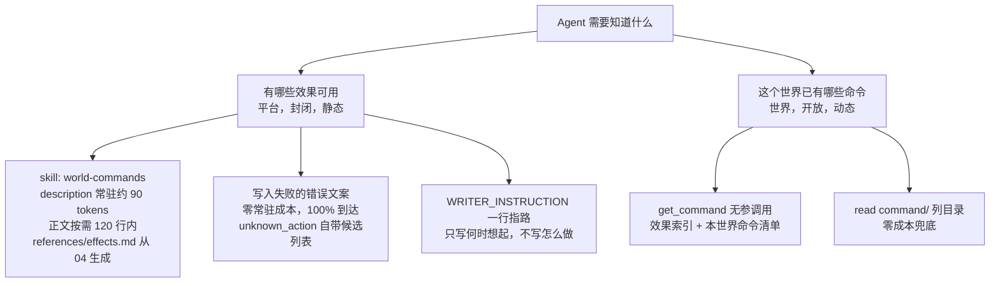
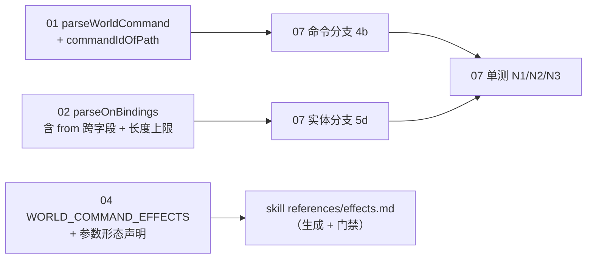

# doc-command/07 Agent 创作接口

> 状态：**C1 设计草案（2026-09-14）**，证据等级 **E1（设计）+ E2（静态读码）**。本文 MUST NOT 被当作 E3 使用——没有人在本会话中运行过本文描述的任何一行代码。文中标**实测**的数字是本机跑出的字符/行数统计，不是 SLA。
> 上位契约：`docs/command/00-共同上下文.md`（下称"契约"）。冲突时以它为准；本文发现它有问题的地方一律写在 §11，不就地修改。
> **本文已按 2026-09-14 的契约变更（§3.2/§3.3：命令文件改为 `command/<id>.yaml`、取消 `type` 与 Markdown 正文、顶层四键 `name`/`desc`/`params`/`do`、strict）重写。**§6.2 的写入门禁要求也随之从"加一个前缀"变成"按前缀分派扩展名"（契约 §6.2 逐字：「MUST NOT 改成"放行 `command/` 下的任意扩展名"」）。
> 本文**拥有**：写入门禁的精确改动、写入即校验的落点与实现、错误回传给 Agent 的文案、Agent 如何知道有哪些效果可用、Agent 何时该写命令的判据、命令的可发现性与注入成本、`[C-2]`（不落账）与 `[C-3]`（writer 专属）的判定记录与落地清单、可直接使用的提示词草稿。
> **2026-09-14 收口**：按契约 §11.3 的 B2 项，§5.1/§5.2/§11.3/§12.1/§12.2 已按评审门实测证据改判并重写论据（`[C-2]`=A、`[C-3]`=A），行号按当前工作树修正（`resolveLayer`→`local-store.ts:859-873`、`useWorld.ts`→`:387-401`、`App.tsx`→`:464`），`parseOnBindings` 归属按契约 §R.16 改为"`02` 实现、`07` 调用"。<!-- recon 50dd228: 上述三个行号现为 local-store.ts:951-964、useWorld.ts:579-593、App.tsx:595-596；本文各处已就近改双记法 -->

> **2026-09-15 复核（recon `50dd228`，88 个提交之后）**：本文的 `file:line` 是 **2026-09-14 工作树**（`9af9c9b`）的快照。此后仓库前进 88 个提交（canvas arranger、Nook 立绘拖拽、STT、zh-CN 模板、Vercel 部署等），下列引用**已漂移**，本批已就近改写为「旧标 :X（快照）/ 现 :Y」双记法：`world.ts` 的 `/api/dice` 与 `/api/choice`（§3.6 判据 0、§13.1 成本表）、`local-store.ts` 的 `resolveLayer` 与 `appendEvent` 的 dev `safeParse`、`useWorld.ts`/`App.tsx`/`NookView.tsx` 的前端刷新链、`tools/check-skills.mjs`、`extensions/tools.ts`、`actor.ts`。**语义与函数名未变**；实现前 MUST 以语义 grep 定位，MUST NOT 照抄行号。
> 本文**不拥有**：命令文件的 schema（→ `01`）、`on` 字段的形状与变量集（→ `02`）、条件求值与执行序（→ `03`）、效果名与参数（→ `04`）、幂等真相源（→ `05`）、玩家侧渲染（→ `06`）、多租户与物理层隔离（→ `09`）。

---

## 1. 一句话定位

**「Agent 能在需要玩法时当场创建世界命令」是本模块的核心产品主张，本文是它的接口层：Agent 把一份 `command/<id>.yaml` 写进世界的那一刻，校验已经发生、错误已经用模型能读懂的话回到它手里、并且它能知道有哪些效果可以用。**

它不成立，整个"沙盒 + Agent"的创新点就没有了——因为世界命令的价值不是"多了一种规则格式"，而是**规则可以由正在游玩的那个 Agent 现场长出来**。契约 §1.3 的证据（**36 份既有声明**——全仓命中 44 / 世界包内 42 / 声明规模 36——在没有引擎支持的情况下自发发明了 `dice_outcomes`）证明需求是真的；本文要保证的是**兑现路径是通的**。

一句话的设计约束：

> **写入的瞬间就是校验的瞬间，校验的结果必须是 Agent 能当场读懂的英文句子；而 Agent 知道"能写什么"的成本必须低到不需要常驻一份效果手册。**

三条最容易只兑现一半的地方，本文单列：

1. 写入门禁**不放开**，则整条产品主张的通过率是 0%（§3.7：今天的条件对 `command/x.yaml` 恒为 `block`）；
2. 写入时**只校验命令文件**、不校验实体侧的 `on`，则 `dice_outcomes` 的静默失败在 `on` 上原样重演（契约 §10.8，§3.3 步骤 5）；
3. 写入时校验只能挡住 `write`/`edit` 两条工具路径，**挡不住 `bash`**（契约 §6.2）→ 必须有第二、第三道门（§3.8）。

---

## 2. 完整 schema / 签名 / 字段表

本文的"schema"是**写入路径的分类器**与**校验入口的接线**，不是命令文件的 schema（那是 `01`）。

### 2.1 写入路径分类器（`NEW`，冻结）

```ts
/** NEW — packages/shared/src/commands/paths.ts */

/** 世界根相对、POSIX 分隔符、已归一（无 `./` 前缀、无尾斜杠）。 */
export type WorldWriteTarget =
  | { kind: 'entity' }                       // world/** ｜ player/** ｜ characters/**，且恰好 .md
  | { kind: 'command'; id: string }          // command/<id>.yaml，且 <id> 合法
  | { kind: 'rejected'; code: WorldWriteRejection };

export type WorldWriteRejection =
  | 'not_a_writable_root'
  | 'entity_must_be_md'
  | 'command_must_be_yaml'
  | 'command_must_be_flat'
  | 'command_id_invalid';

/** 纯函数，无 I/O，同步。写入门禁与任何未来的写入侧代码共用同一实现。 */
export function classifyWorldWritePath(file: string): WorldWriteTarget;
```

| 输入（举例） | 返回 | 说明 |
|---|---|---|
| `world/london-map/01.md` | `{kind:'entity'}` | 现状行为，不变 |
| `player/brass-key.md` | `{kind:'entity'}` | 同上 |
| `characters/watson/memory.md` | `{kind:'entity'}` | 同上（nook 权限门随后接手） |
| `command/investigate-clue.yaml` | `{kind:'command', id:'investigate-clue'}` | **本次新增** |
| `command/investigate-clue.yml` | `rejected: command_must_be_yaml` | 契约 §6.2 明令不许放宽扩展名；`01 §2.1` 逐字「恰好 `.yaml`」 |
| `command/investigate-clue.md` | `rejected: command_must_be_yaml` | 命令不是 `.md`（契约 §3.2） |
| `command/sub/x.yaml` | `rejected: command_must_be_flat` | `<id>` 必须来自文件名（`01 §2.1`）；嵌套会把 id 语义变成路径 |
| `command/Bad_Id.yaml` | `rejected: command_id_invalid` | 正则归 `01`：`^[a-z0-9][a-z0-9-]{0,47}$` |
| `command/` | `rejected: command_must_be_yaml` | 无文件名 |
| `notes/x.md` | `rejected: not_a_writable_root` | 现状行为，不变 |
| `world/london-map/01.txt` | `rejected: entity_must_be_md` | 现状行为，不变 |

**为什么是纯函数而不是钩子里的一串 `||`。** 三个理由：

1. **契约 §6.2 的冻结要求是一个二维规则**（前缀 → 扩展名），不是一个布尔式。写成分类器后，"`command/` 只放行 `.yaml`"与"三个内容根只放行 `.md`"各自成为一条可断言的分支，评审门不必读 diff 推语义。
2. **它同时是 `[C-3]` 的落点邻接处**（§12.2）：角色的额外限制是"分类结果 + 身份"的函数，落在 `classifyWorldWritePath` 的**调用点之后**比塞进分类器（或原来的布尔式）里面干净——分类器保持纯路径函数，不接身份参数。
3. **与 `01` 的 `commandIdOfPath` 有重叠，必须显式对齐。** `01 §7.1` 导出 `commandIdOfPath(path): string | null`。两者的关系：`classifyWorldWritePath` 负责**区分五类拒绝原因**（给模型看的文案不同），`commandIdOfPath` 负责**取 id**。一致性 MUST 由单测钉住：对任意 `file`，`classifyWorldWritePath(file).kind === 'command'` ⟺ `commandIdOfPath(file) !== null`，且两者返回的 id 逐字节相同。

### 2.2 校验入口（引用，不重定义）

```ts
// 两个都由别的文档拥有并实现，本文只调用（签名逐字照抄，不重定义）：
/** 01 §7.1 冻结。纯、同步、无 I/O；`raw` 是整份 YAML 文件。 */
function parseWorldCommand(id: string, raw: string): WorldCommandParseResult;
/** 02 §11.1 冻结（实现落 `packages/shared/src/commands/bindings.ts`）。纯、同步、无 I/O。`hook=null` 时校验整个 `on`（写入时用）。 */
function parseOnBindings(frontmatter: Record<string, any> | null, hook: CommandTriggerHook | null): OnBindingsParseResult;
```

> **归属（契约 §R.16 + 主 agent 2026-09-14 裁定）**：`parseWorldCommand` 归 `01`、`parseOnBindings` 归 `02`——**两者都不是本文的实现**。本文在 `extensions/world-context.ts` 的 `tool_call` 里**调用**它们，并把错误翻译成 `block.reason`（§3.1-§3.3）。本文定义的是**何时调用**与**怎么回错误**，不是实现。（先前本文把 `parseOnBindings` 写成自己 `export`，与 `02` 形成双向认领——已按裁定修正。）

**这两个函数 MUST 保持纯与同步**——这是本文在开工时向 `01`/`02` 提的硬需求，理由是落点决定的：`tool_call` 钩子里只有"待写文本"和 store，没有事务、没有请求上下文；而同一个 `parseWorldCommand` 还要被动作层在**触发时**再调一次（§3.8），两处共用一份实现是"写入时学到的修正方法在触发时对得上号"的前提。

### 2.3 `block.reason` 的语法（本文冻结）

`block.reason` 是一个**字符串**（`vendor/pi-rp/packages/coding-agent/src/core/extensions/types.ts:1173-1175`），pi-rp 把它原样变成一次 `isError: true` 的工具结果（`vendor/pi-rp/packages/agent/src/agent-loop.ts:636-646` → `createErrorToolResult`，`:760-763`）。它没有结构，所以**它的结构必须由我们冻结**，否则它会退化成一句"写错了"。

```text
<第一行：结论 + 后果 + 断言"磁盘上没有东西">

<诊断 1，逐字来自 01 §7.3 / 02 §10.1 的文案表，自带 line/column>
<诊断 2>
…
<可选：末尾的计数行，当诊断数 > MAX_REASON_DIAGNOSTICS>

<恢复指令：一句祈使，指名下一步动作>
<可选：最小可用样例，仅当失败是结构性的>
```

四条硬规则：

| # | 规则 | 不这样做会怎样 |
|---|---|---|
| R1 | **第一行必须说"什么都没写"** | 模型会去猜磁盘上是不是留下了半份文件，然后花一轮 `read` 确认 |
| R2 | **每条诊断 MUST 带 `line`/`column`**（有 CST 位置时） | 模型只能重写整个文件。`01 §7.2` 逐字把这条列为硬规则，本文是同一条的下游消费者 |
| R3 | **诊断在 `MAX_REASON_DIAGNOSTICS = 8` 条处截断**，截断时给计数行 | 一份 46 错的 reason 约 5–8 KB，把一轮上下文吃掉 1/4；而 46 错几乎总意味着"从模板重写"更快 |
| R4 | **恢复指令 MUST 指名动作**（"再 `write` 一次整份文件" / "先建命令文件再绑定"），结构性失败时附**最小可用样例** | 模型知道错了但不知道先做哪一步（doc-23 §2.4「每步带上漏了会怎样」的同一条纪律，用在这里） |

> **诊断顺序**：按 `line` 升序。`01 §7.3` 的 `yaml_syntax` 文案自带「Fix this line first; nothing below it could be checked.」——那条出现时就只带它一条（YAML 解析失败后没有 CST，后面的诊断本来也不存在）。

### 2.4 常量表

| 常量 | 值 | 依据 |
|---|---|---|
| `MAX_REASON_DIAGNOSTICS` | 8 | §2.3 R3；`01` 的 46 个码全命中是罕见情形 |
| `MAX_REASON_CHARS` | 2 400 | 兜底截断。超过时保留首行 + 前 N 条诊断 + 恢复指令，丢掉中间并在计数行里说明 |
| `COMMAND_FILE_SOFT_HINT_CHARS` | 4 000 | **不是门禁**。超过这个长度的命令文件在成功写入时附一句提示（§3.5）——命令正在变成一份脚本，那通常是该拆成 `run` 链的信号 |

**`MAX_REASON_CHARS` 与 `MAX_REASON_DIAGNOSTICS` 同时存在不是冗余**：前者防"单条诊断写了 2 KB"（`01` 的 `unknown_action` 文案带完整效果名列表，长约 200 字符，8 条就接近上限），后者防"条数爆炸"。两者取先命中者。

---

## 3. 行为契约逐步（每步写"漏了会怎样"）

前提：`extensions/world-context.ts` 的 `tool_call` 钩子（`:50`）与 `tool_result` 钩子（`:80`）。每一步都标出**改动位置**与**漏了会怎样**。

### 3.1 `tool_call`：分类

```
步骤 1  工具过滤：toolName 不是 write/edit → 立即 return（现状 :51，不变）
步骤 2  路径归一：file = path.relative(ctx.cwd, path.resolve(ctx.cwd, input.path)).split(sep).join('/')（现状 :53，不变）
步骤 3  分类：target = classifyWorldWritePath(file)
        target.kind === 'rejected' → block，reason = writeGateReason(target.code)
```

**漏了会怎样**：这是契约 §6.2 的整条要求。今天的条件（`:54`）是 `(world/|player/|characters/ 前缀) && .md 结尾`——`command/x.yaml` **两个维度都不满足**。漏了这一步，Agent 写命令的成功率是 **0**，§1 的核心主张不成立，世界命令只能靠人手写文件（回到契约 §9.2 的候选 A）。

### 3.2 `tool_call`：命令分支（在实体分支**之前**）

```
步骤 4  target.kind === 'command' →
        4a  proposed = proposedFileText(previous, toolName, input)
            proposed === undefined → block，reason = commandEditUnmergeable(...)
        4b  result = parseWorldCommand(target.id, proposed)
            result.ok === false → block，reason = commandRejection(target.id, result.errors)
        4c  writes.set(event.toolCallId, { file, existed, kind: 'command', id: target.id })
            return            ← 不进入实体分支
```

**为什么必须在实体分支之前**：实体分支里有 `isPhotoContent(proposed)`（`:72-77`），它调 `parseFrontmatter`。`parseFrontmatter` 的 `FM_BLOCK` 正则（`packages/shared/src/schemas/frontmatter.ts:175`）要求 `---\n…\n---\n` **从字节 0 开始**——一份以 YAML 文档起始符 `---` 开头、且后文恰好还有一行 `---` 的命令文件会被它当成 frontmatter 块切开。这种文件今天不存在（`01 §2.2` 的四键顶层不含 `---`），但"今天不存在"不是一条可以依赖的性质：`---` 是合法 YAML 文档起始符，模型完全可能写出来。命令分支前置让这类误判不可能发生。

**漏了 4a 会怎样**：`edit` 一条命令文件时，若无法预测最终文本而继续执行，我们会在 `tool_result` 里对着一个**已经落盘**的文件报错——而 `edit` 是增量修改，模型手里没有"改完之后的完整文件"，它没法用一句话描述自己刚改成了什么。`commandEditUnmergeable` 的作用是把这一步变成一次**可恢复的明确失败**（"用 `write` 重发整份文件"），这条路径对命令文件是廉价且安全的：`01` 的 `MAX_COMMAND_FILE_BYTES = 32000`，而典型命令 10–30 行。

**漏了 4b 会怎样**：这就是契约 §6.1 逐字禁止的那件事——「写入时静默接受，玩家触发时才炸」。而且比今天的 `dice_outcomes` 更糟：`dice_outcomes` 至少还只是"没人执行"，命令文件若带着拼错的 `action` 落盘，它会在玩家掷骰的那一刻变成一次**已声明却未兑现**的后果。

### 3.3 `tool_call`：实体分支（现状 + 两处新增）

```
步骤 5  target.kind === 'entity' →
        5a  nook 权限门（现状 :57-66，不变）
        5b  proposed = proposedFileText(previous, toolName, input)
        5c  photo 门禁（现状 :72-77，不变）
        5d  【新增】解析出 frontmatter 且含顶层 `on` →
              parseOnBindings(fm, null) 有错 → block   ← 调用 02 的实现
              跨字段：`from` 指向的 key MUST 在同一实体的 frontmatter 里
              真实存在、是数组、且长度 ≤ 01 的上限（§7.6）
        5e  【新增】跨文件引用完整性：每条 bindings[i].run 指向的 id
              MUST 存在 `command/<id>.yaml` **且能通过 parseWorldCommand**
        5f  writes.set(…, { kind: 'entity' })
```

**`from` 的校验是纯静态的**（同一份已解析对象里查 key 与长度），所以它属于 5d，不产生任何 I/O。**`run:` 的存在性检查需要一次 `statKind` + 一次 `readFile`**，这是本文新增的唯一 I/O——契约 §10.8 明确要求写入时做它（`09 §11.1` 把"跨文件引用无声"列为内容层最可能的失败方式）。

**为什么 `run:` 检查必须是 `parseWorldCommand` 而不只是 `statKind`**：只查存在会放过**存在但解析失败**的文件，而那正是 `bash` 绕过（§3.8）最可能留下的产物——文件在，`on` 绑定成立，掷骰时炸。这是"只兑现一半"的又一个具体形态。代价是那次检查要读并解析一份 ≤32 KB 的文件；它只发生在**写带 `on` 的实体时**，不是热路径。

**漏了 5d/5e 会怎样**：契约 §10.8 逐字——「**作者真正每天在写的是 `on`**」。命令文件那一侧有 strict schema（契约 §3.2 理由 1），`on` 一侧住在实体 `.md` 上、走同一个 `parseFrontmatter`、两个 `.passthrough()` 的 intersection（`schemas/frontmatter.ts:137-146`，`:150-166` 注释逐字「NO schema filtering」）。漏了它，把 `dice_outcomes` 迁成 `on` 只是换了个字面量，静默失败的性质一点没变；而 `09 §9` 第 11 条把它升级为**安全**条目：`from: dice_outcome`（少个 s）⇒ 那一档的奖励**凭空消失**，而解析、执行、落账三处的技术指标全是绿的。

### 3.4 `tool_result`：T2 兜底

```
步骤 6  tracked = writes.get(toolCallId)（现状 :81-82，不变）
        tracked.kind === 'command' → 走 §3.5 的命令回执
        tracked.kind === 'entity'  → 走现状（:90-104）+【新增】一次兜底复验
```

**实体侧的兜底复验（新增）**：`tool_result` 重新读回落盘的文件，再跑一次 `parseWorldCommand` / `parseOnBindings`。与写入时的预测不一致 → 返回 `{ content: [<诊断文本>], isError: true }`。

`ToolResultEventResult` 支持替换 `content` 并置 `isError`（`vendor/pi-rp/packages/coding-agent/src/core/extensions/types.ts:1191-1196`；`agent-session.ts:795` 逐字 `hookResult?.content ?? result.content`），所以这条路径**不需要删文件**：文件已经落盘，但模型立刻拿到一条错误，而触发时的 T3（§3.8）是最后一道门。

**为什么需要 T2 而不是只信 T1**：`edit` 的预测与真实结果**可能不同**。pi-rp 的 `edit` 不是朴素字符串替换——它做 NFKC 归一、逐行 `trimEnd`、智能引号归一（`vendor/pi-rp/packages/coding-agent/src/core/tools/edit-diff.ts:33-45`）、模糊匹配（`:206-233`）、重复匹配报错（`:332-334`）、重叠报错（`:350-356`）。本文的预测函数（§4.1）只做 `String.prototype.replace`，因此它是**预测**而不是**事实**。设计上一律按"预测可能不准"处理，成本只是 `tool_result` 里多一次 `readFile` + 一次解析。

### 3.5 `tool_result`：命令回执

```
步骤 7  tracked.kind === 'command' →
        7a  读回 command/<id>.yaml，跑 parseWorldCommand 复核
        7b  成功 → 返回 { content: [<一行成功文案 + 可选 soft hint>] }（不置 isError）
        7c  失败（理论上不该发生）→ 返回 { content: [诊断], isError: true }
        7d  落账见 §5（[C-2] 的两案）
        return
```

**成功文案的形状**（一行，模型可读）：

```text
Wrote command/investigate-clue.yaml: 4 steps, 2 params. Entities can bind it with on.<hook>[].run: investigate-clue.
```

第二句不是装饰：它把"写完了"和"怎么用"放在同一句里，省掉模型下一步去猜绑定语法。这正是 doc-23 §2.4「流程写成编号步骤，每步带上漏了会怎样」的用法——只不过这里的"步骤"是"接下来你要做的动作"。

**`COMMAND_FILE_SOFT_HINT_CHARS` 触发时的附加一行**：`This command is {n} bytes. If it keeps growing, split it into smaller parts and declare them as separate entries under "on".`

**漏了 7a 会怎样**：磁盘上的文件与校验过的文本之间多了一段无人复核的窗口（`write` 的 `content` 与磁盘内容理论上一致，但 `edit` 不一致）。这一条是廉价的保险，与 §3.4 的最后一段同源。

### 3.6 何时该写命令（判据）

契约 §1.2 的分工原则是起点：

> **确定性的后果由代码执行，不确定性的意义由 Agent 叙述。**

但"确定性的后果"是形容词。下面是**可当场自问自答**的判据（doc-23 §2.3：给判据，不给形容词）。三条，按顺序问，**任一条为"是"就写命令**。

#### 判据 0（最强）：**这件事发生的时候，你不在场吗？**

**自问**：玩家的这个动作会不会**不经过我**就产生后果？

具体形态（三条，覆盖本模块的三个触发点，`02 §2.2`）：

- 玩家**自己**点掷骰按钮（`POST /api/dice` → `apps/server/src/routes/world.ts:1243-1257` 直接进动作层，agent 进程此刻没被唤醒——契约 §2.2 末行；**旧标 `:1100-1138`**）；
- 玩家**自己**点一个 `choice` 选项（`POST /api/choice`，`world.ts:1284-1309`；**旧标 `:1170-1173`**）；
- 玩家**自己**把一个物件用在另一个东西上（`POST /api/use-item`，`world.ts:1261-1272`）。

<!-- recon 50dd228: world.ts /api/dice 1100-1138 → 1243-1257；/api/choice 1170-1173 → 1284-1309（新增 /worlds/cover 与角色 presence 接线使路由整体下移；`65fa09d` 时 :1100 已是 `/card/footprint`，见 :1092） -->

**是 → 必须写命令。** 因为这三条路径**都不经过 agent 进程**，你的叙述根本不会被执行——不是"执行得慢"，是**永远不会发生**。

这是本文的**首要判据**，也是最强的一条：它不依赖对"确定性"的品味，只依赖一条可核对的架构事实。

**例外（同样要写下来）**：玩家在**你的回合内**通过对话做的动作（"我把它拿起来"）不满足判据 0，因为那一轮的叙述就是你写的。这种情况下**不要**为了保险写命令——见下面的反向判据。

#### 判据 1：**这个后果会重复出现吗？**

**自问**：同一张卡、同一个动作，玩家会再触发一次吗？

**是 → 写命令**。理由：重复意味着"执行一致性"可被玩家检验。`_shared/failure-and-revisit.md:22` 的硬门 2（不重复结算）要求"同一意图 × 同一目标 × 同一已结算结果复用既有结果"——**叙述做不到这件事**，它不仅可能重复发奖，还可能**这次发的和上次不一样**（两次不同的措辞产生两份不同的笔记文件）。

**否（只发生一次）→ 不构成写命令的理由**，但可能满足判据 0。

#### 判据 2：**这个后果在玩家决定之前必须已经可见吗？**

**自问**：玩家在按下按钮之前，是否已经能看到"四档后果"的说明？

**是 → 写命令**。理由：硬门 8（先公开后执行）逐字要求「命令造成的代价与回报 MUST 在玩家决定之前可见」。一份写在卡正文里的四档说明（`templates/whitechapel-jp/world/london-map/04-investigation-dice.md:99-105` 就是它）**是一份承诺**；承诺必须被兑现，而"作家这轮记得"不是兑现机制（契约 §9.2 候选 A 的失败形态逐字：「漏发、重发、算错」）。

#### 反向判据：什么情况**不该**写命令

**这是最重要的一条，因为"多写一条命令"看起来永远比"少写"保险，实际上不是**：

> **如果三条判据全为否，那么"不写命令"是正确的做法，不是偷懒。**

具体地，以下四种情况**不写**：

| 情况 | 为什么不写 | 该做什么 |
|---|---|---|
| 这个后果是**一次性叙事**（"雾散开一线，你看清了第二艘船的舷号"） | 判据 0/1/2 全否。它的价值在措辞，不在机制 | 用 `chalk` 叙述 |
| 你**不确定**它会不会重复 | **先把不确定的部分留在叙述里**，等它第二次出现再抽象成命令 | 叙述；第二次发生时回头看这三条判据 |
| 这条规则**需要循环、累加器、跨实体聚合** | 契约 §2.3 逐字认账：「存在一类玩法（需要循环、需要累加器、需要跨实体聚合计算）无法用声明式表达。本批次**不假装能做**」 | 叙述；这是 `09` 边界之外的玩法 |
| 这条规则**只有这一次**且**你就在场** | 判据 0 否（你在场）、判据 1 否（不会重复） | 叙述 |

**最后一条的机制性理由**（doc-23 §2.1：理由要机制性，不能是礼貌）：每多一条 `command/*.yaml`，世界的**规则面就多一份要维护的东西**——它会进双语翻译的判断（`tools/localize-world-editions.mjs` 的 `isText` 只认 `.md`/`.json`，`08` 已登记静默漏译）、会进命令清单、会被后续的作家读到并当成先例。**一份只跑过一次的命令，付出的是永久的世界复杂度。**

#### 判据的可操作形式（§13.1 的 skill 草稿逐字含这一段）

```text
Write a world command when the answer to ANY of these is yes:

1. Does this consequence have to happen when you are not the one running? A player pressing
   the dice button, a choice button, or using one item on another does not reach you at all -
   your prose is never executed on those paths. (Strongest test.)
2. Will the same card and the same action be triggered more than once? Repetition is where
   narration drifts: two runs of the same rule can leave two different files.
3. Must the player see the consequence before they decide? A published table of outcomes is a
   promise; a promise needs a mechanism, not a memory.

If all three are no, do NOT write a command. A command that runs once is permanent world
complexity for one beat: it enters the command list, it enters the translation question, and
the next writer reads it as precedent. Narrate it instead - a one-off consequence belongs in
chalk.
```

### 3.7 写入门禁的精确改动（契约 §6.2）

**现状（逐行，`extensions/world-context.ts`）**：

```ts
50:  pi.on('tool_call', async (event, ctx) => {
51:    if (event.toolName !== 'write' && event.toolName !== 'edit') return;
52:    if (typeof event.input.path !== 'string') return;
53:    const file = path.relative(ctx.cwd, path.resolve(ctx.cwd, event.input.path)).split(path.sep).join('/');
54:    if (!(file.startsWith('world/') || file.startsWith('player/') || file.startsWith('characters/')) || !file.endsWith('.md')) {
55:      return { block: true, reason: 'Write scene, prop, or character Markdown under world/, player/, or characters/.' };
56:    }
```

**为什么 `command/x.yaml` 今天恒被拒绝**（两个维度同时不满足，实测于源码）：

- `:54` 的前半个合取：`'command/x.yaml'.startsWith('world/')` **false**、`'player/'` **false**、`'characters/'` **false** → 整个 `!(…)` 为 **true**，短路；
- 即使前缀过了，后半 `!file.endsWith('.md')` 对 `.yaml` 也是 **true**。

→ 返回 `{block:true}`，模型收到的唯一提示是「Write scene, prop, or character Markdown under world/, player/, or characters/」——这句话**没有提 `command/`**，它会让模型认为"命令文件根本不被支持"，从而放弃这条产品路径。

**改动（唯一一处逻辑改动）**：

```diff
 extensions/world-context.ts
-    if (!(file.startsWith('world/') || file.startsWith('player/') || file.startsWith('characters/')) || !file.endsWith('.md')) {
-      return { block: true, reason: 'Write scene, prop, or character Markdown under world/, player/, or characters/.' };
-    }
+    const target = classifyWorldWritePath(file);
+    if (target.kind === 'rejected') {
+      return { block: true, reason: writeGateReason(target.code) };
+    }
```

**这是一处**逻辑改动，不是两处：契约 §6.2 的"按前缀分派扩展名"被压缩进 `classifyWorldWritePath` 一个纯函数（§2.1），而不是在同一行里堆两个 `||`。**行为等价性**：对 `world/**`、`player/**`、`characters/**` 的 `.md` 路径，新代码返回 `{kind:'entity'}`、不 `block`——与旧代码相同；对这三根下的非 `.md`、以及对四根之外的一切，新代码仍 `block`，只有文案更具体。

**五条拒绝码的模型侧文案（逐条可复制）**：

| `code` | `reason` |
|---|---|
| `not_a_writable_root` | `Writes must target world/**, player/**, characters/** (scene, prop, or character Markdown) or command/<id>.yaml (a world command). Got "<file>".` |
| `entity_must_be_md` | `Scene, prop, and character files must be Markdown: "<file>". Did you mean "<file-without-ext>.md"?` |
| `command_must_be_yaml` | `A world command must be command/<id>.yaml - exactly ".yaml", no subdirectories. Got "<file>".` |
| `command_must_be_flat` | `A command's id comes from its filename, so commands live directly in command/. Got "<file>". Did you mean "command/<basename>.yaml"?` |
| `command_id_invalid` | `"<id>" is not a valid command id (ASCII lowercase kebab-case, 1-48 chars, must not start with a hyphen). Got "<file>".` |
**放行 `command/` 之后 `tool_result` 会发生什么**（契约 §6.2 点名要回答）——完整推演与四条后果见 §5.1，结论三条：

1. `resolveLayer('command/x.yaml')` 返回 **`null`**（`local-store.ts:951-964`，旧标 `:859-873`：非 `world/**` 一律 `null`；且这是**设计**而非缺陷，见 `:945-950` 的注释，旧标 `:853-858` 的注释）；
2. `kind` 只能填 **`'other'`**（`fm` 是 `null`，`:102` 的四个 `fm?.type` 比较全 false）；
3. **这条 `entity_created` 能成功落账**，因为 `kind: 'other'` 在 `EventDetailSchemas.entity_created` 的封闭枚举里（`schemas/events.ts:43-48`）——**不需要改任何 schema**。

→ 本文 §5.2 记录 `[C-2]` 的判定：**不落账（方案 A）**（评审门裁定，契约 §11.1）；被放弃的方案 B（落账 + `detail.command` + 改 toast/渲染器）的理由与代价同节保留。

### 3.8 写入门禁的覆盖面：诚实地登记 `bash` 绕过

| 门 | 拦谁 | 拦不住谁 | 归属 |
|---|---|---|---|
| **T1 写入时**（§3.1-§3.3，`tool_call`） | Agent 的 `write` / `edit` | `bash`；手改文件；从别的世界拷贝 | `07` |
| **T2 落盘后复核**（§3.4-§3.5，`tool_result`） | —（它是复核，不是拦） | 同上 | `07` |
| **T3 触发时**（动作层） | **一切**：T1/T2 漏掉的、`bash` 写的、手改的、拷来的 | 无 | `02`（`on_malformed` / `command_malformed` / `command_not_found`） |
| **T4 引用检查**（§3.3 步骤 5e） | `on.run` 指向不存在或解析失败的命令 | 命令被**改坏**之后（写 `on` 时它是好的） | `07` |

**§6.2 的登记是准确的，本文照抄并补三句**：

1. **`world-context.ts` 只挂 `write`/`edit` 两个 `toolName`**（`:51` 逐字 `if (event.toolName !== 'write' && event.toolName !== 'edit') return;`），而 Agent 有 `bash`（`vendor/pi-rp/packages/coding-agent/src/core/tools/bash.ts:41-44` 的 schema 只有 `command` 与 `timeout`；`:90-107` 的 `exec` 直接 `spawn(shellConfig.shell, [...args, command], { cwd })`，**没有路径或扩展名白名单**）。所以"Agent 写不了 `command/`"在**工具层面**成立，在**物理层面**不成立。
2. **`callback` 层面的补法不是本文要做的**：`tool_call` 事件确实也能收到 `bash`（`vendor/pi-rp/packages/coding-agent/src/core/extensions/types.ts:959-962` 的 `BashToolCallEvent`），但**解析 shell 命令做路径门禁不是一个可靠的门**（重定向、`tee`、`cat >`、`python -c`、heredoc、`mv`）。本文**不提议**用命令字符串模式匹配当门禁——那会给出一种"看起来在管、实际漏得更多"的虚假安全感（本批次反复出现的模式）。
3. **本文提议的是一处便利补丁 + 一个诚实结论**：
   - **便利补丁**（`MAY`，非 MUST）：`tool_result` 里对 `bash` 也做一次"事后检查"——若 `command` 字符串含 `command/` 且 `exitCode === 0`，则重新解析 `command/` 下的 YAML，把诊断**追加到该次 bash 的工具结果文本**里。它**不是门禁**（不阻止写），但能把"Agent 用 `bash` 图省事写命令"这一条最常见的意外形态变成可见错误。**MUST NOT** 把它写成"防绕过"。
   - **诚实结论**：**唯一有强制力的防线是 T3（触发时）**。物理层的隔离（云端多租户下"Agent 不该有的能力"）归 `09`，那需要的是文件系统级隔离（只读挂载 / 容器），不是 `tool_call` 的字符串检查。

**绕过写入的非法命令什么时候被发现——三层，逐层给可观测差异**：

| 何时 | 机制 | 模型看到什么 | 玩家看到什么 |
|---|---|---|---|
| **绑定它的时候**（若先写实体 `on`） | T4：`parseOnBindings` 的 `run:` 检查（§3.3 步骤 5e） | `Binding 1 runs "x", but that command file does not parse: line 6, …`，写入被 `block` | 什么都没发生（写入被拒） |
| **触发的时候**（**唯一保底**） | T3：动作层重新 `parseWorldCommand` | 触发动作的 tool_result（作家）/ `details`（玩家 HM 路径）里带 `command_malformed` | `command_error`（实体 frontmatter，契约 §3.3.2）=「这个结果该触发的后果没生效」 |
| **从不** | 若这个命令**从未被任何 `on` 绑定过**，且从未触发 | 无 | 无 |

**第三行是必须承认的盲区**：`bash` 写进去、又没绑定的孤儿命令，**不会被任何一层发现**。这不是本模块引入的问题（今天的 `dice_outcomes` 就是同一状态：写了但没人执行、也不报错），但它是**"写入即校验"在物理层不成立**的直接后果。缓解只有一条，且它不是门禁：**孤儿命令由诊断工具报告**（`09 §11.1` 的建议：反向检查不设硬错误，因为"先写命令后接线"是合法创作顺序）。本文同意这一口径，并在 §12.3 把它登记为仍未知（是否需要那个诊断工具）。

---

## 4. 文件与副作用

### 4.1 写入路径需要的新 helper（`NEW`）

`tool_call` 里必须拿到"这次调用的最终文件文本"。**现有的 `mergedEditText`（`extensions/world-context.ts:23-39`）不能复用它做这件事**——它有一个真实缺陷，本文逐行核实：

```ts
// extensions/world-context.ts:16-21（现状）
function inputText(input: Record<string, unknown>): string | undefined {
  if (typeof input.content === 'string') return input.content;
  if (typeof input.newText === 'string') return input.newText;   // ← 先返回
  if (typeof input.text === 'string') return input.text;
  return undefined;
}
// :23-28
function mergedEditText(previous, input) {
  const direct = inputText(input);
  if (direct !== undefined) return direct;                       // ← 于是
  if (typeof input.oldText === 'string' && typeof input.newText === 'string') {
    return previous.replace(input.oldText, input.newText);        // :26-28 永远不可达
  }
  …
}
```

**`:26-28` 是死代码**：只要 `input.newText` 是字符串，`:18` 就已经返回了，控制流永远到不了 `:26`。因此一个 legacy 形状的 `edit`（`{path, oldText, newText}`）会被 `mergedEditText` 当成"**整个文件 = newText 片段**"。

**而 hook 实际收到的形状也不是那个 legacy 形状**：`agent-loop.ts:617-618` 在调 `beforeToolCall` **之前**先跑 `prepareToolCallArguments`（`vendor/pi-rp/packages/coding-agent/src/core/tools/edit.ts:313` 注册的 `prepareEditArguments`，定义在 `:105-129`），它把 `{path, oldText, newText}` 归一成 `{path, edits:[{oldText,newText}]}`。所以 `inputText` 的 `newText` 与 `text` 两个分支**对 `edit` 同样不可达**。结论：这个 helper 对 `edit` 的实际行为是"**总返回 `undefined`**"，而 `mergedEditText` 只在 `Array.isArray(input.edits)` 分支（`:29-38`）真正工作——**这也是它今天能用的唯一原因**（`isPhotoContent` 的检查碰巧不需要精确文本）。

**所以本文给一个新 helper，只认实际会出现的形状**：

```ts
/** NEW — extensions/world-context.ts（模块内函数，不导出） */
/**
 * 这次调用**将要产生的**完整文件文本。
 * - `write`：input.content（唯一来源）。
 * - `edit`：把 input.edits[] 逐条 String.replace 到 previous 上（预测）。
 *   无 edits / 形状不认识 → undefined（调用方 MUST 视为"无法预测"并拒绝）。
 *
 * 预测不是事实：pi-rp 的匹配规则见 edit-diff.ts:33-45,206-233,332-334,350-356
 * （NFKC / trimEnd / 智能引号 / 模糊匹配 / 重复与重叠报错）。实际落盘由 §3.4 的
 * T2 复核。
 */
function proposedFileText(previous: string, toolName: 'write' | 'edit', input: Record<string, unknown>): string | undefined;
```

**为什么保留旧函数而不是删掉它**：实体分支的 `isPhotoContent` 今天在用它，替换它属于"顺手重构"，超出本文范围。本文只要求**命令分支与新增的 `on` 校验不使用它**，并在 §11.1 登记这一条为既有缺陷（建议实现批次统一替换）。

### 4.2 副作用清单

| 动作 | 写哪些文件 | 改哪些 key | 归属 |
|---|---|---|---|
| 拒绝一次写入 | **无**（`block` 在工具执行之前，工具从未运行） | 无 | `07`（本文） |
| 接受一次写入 | 由 pi-rp 的 `write`/`edit` 落盘 | 由模型提供 | pi-rp |
| `tool_result` 复核 | **无**（只读回 + 解析） | 无 | `07` |
| `on` 的 `run:` 检查 | **无**（`statKind` + `readFile`） | 无 | `07` |

**"拒绝一次写入 = 世界零改动"是本文的一条可断言性质**，它不是推论：`block: true` 让 pi-rp 走 `prepareToolCall` 的 `kind:"immediate"` 分支（`vendor/pi-rp/packages/agent/src/agent-loop.ts:636-646`、`:507-519`），该分支**跳过 `executePreparedToolCall`**、直接产出一条 `isError` 结果。因此工具一次都没跑，磁盘上没有半份文件。§10.1 的验收断言 N1 直接测这一条。

**校验本身不落任何事件、不发任何帧、不碰 canvas**——`parseWorldCommand` / `parseOnBindings` / `classifyWorldWritePath` 三个都是纯函数（§2.2），`on` 的 `run:` 检查只有两次只读 I/O。

---

## 5. 落账（事件类型、detail、actor、turn）

### 5.1 现状：`tool_result` 对命令文件会做什么（契约 §6.2 点名要回答的问题）

**如果只做"把 `command/` 加进放行前缀"这一处改动**，`tool_result`（`extensions/world-context.ts:80-105`）会照常跑，且**不报错**地产生一条事件。逐步推演：

```
:85   parseFrontmatter(await store.readFile('command/x.yaml'))
       → { frontmatter: null, body: <整份 YAML>, errors: [] }
       （FM_BLOCK 正则要求 `---` 从字节 0 开始；命令 YAML 顶层是 `name:` → 不匹配 → 没有 frontmatter）
       ↓
:86   name = String(fm?.title ?? fm?.name ?? path.basename(file, '.md'))
       → 'x.yaml'（注意：basename 去的是 `.md`，对 `.yaml` 无效，所以得到 "x.yaml" 而不是 "x"）
       ↓
:87   layer = await store.resolveLayer('command/x.yaml')
      → null（local-store.ts:951-964，旧标 :859-873：非 world/** 一律 null）
       ↓
:90   !existed && file.endsWith('/README.md') → false（不是 README）
       ↓
:102  kind = fm?.type === 'chalk' ? … : fm?.type === 'note' ? … : 'other'
       → 'other'（fm 是 null）
       ↓
:103  appendEvent({ type: 'entity_created', layer: undefined, subject: 'command/x.yaml',
                    detail: { path: 'command/x.yaml', name: 'x.yaml', kind: 'other' } })
```

**这条 `appendEvent` 会成功，不会抛**：`EventDetailSchemas.entity_created` 是 `{ path, name, kind: enum(['chalk','component','note','letter','other']) }`（`packages/shared/src/schemas/events.ts:43-48`），而 `kind: 'other'` **在枚举里**。dev 模式的 `safeParse` 门槛（`local-store.ts:758-771`，旧标 `:666-679`；内部还有一个 `appendEventLocked` 的副本在 `:539-550`，旧标 `:448-458`）因此通过。**不需要改任何 schema 就能落这条账——这恰恰是问题所在。**

**落下去之后会发生什么**（四处可观测的后果，都有 `file:line`）：

| 后果 | 机制 | 严重度 |
|---|---|---|
| **向玩家弹一条假话** | `apps/web/src/lib/world-event-toast.ts` 的 `validDetail`（`:212-217`）对 `entity_created` 取 `detail.kind`，而 `ENTITY_KIND_VALUES`（`:35`）**含 `'other'`** → 画像通过 → 弹 `Created "x.yaml". The object is now in {layer}.`；而 `layerLabel(event)`（`:121-123`）在 `event.layer === null` 时**硬编码返回 `'the current scene'`**。`command/**` 的 `layer` 是 `null` ⇒ **每次写命令，玩家都看到一条断言"这个对象现在在'当前场景'里"的假话。** 这是 `[C-2]` 判 A 的**主因**：选 B 要么弹假话，要么改 `layerLabel` 的 null 语义 + i18n 消息键。 | **高**（玩家可见，且是假事实） |
| **前端做一次全量 chrome 重载** | `apps/web/src/state/useWorld.ts:579-593`（旧标 `:387-401`）：`entity_created` 在转发集合里 → `dispatch('airp:world-event')` → `apps/web/src/App.tsx:595-596`（旧标 `:464`）的 `onWorldEvent` 调 `loadChromeData()`（`App.tsx:472`，旧标 `:342`）；`apps/web/src/components/nook/NookView.tsx:378-413`（旧标 `:269-291`，那一段现在是初始化的 `airp:layer-init` 监听；世界事件监听移至 `:380`）也会因此重新 `load()`。**行号依 2026-09-15 工作树（`50dd228`）** | **低但真实**：写命令不该触发画布刷新 |
| **事件表里多一条"实体"历史** | 命令不是 entity（契约 §6.3 逐字：「它不成层、不是实体、不出现在画布上」）。历史面板若按 `kind` 过滤，`other` 会混进玩家可见的记录 | **中**：世界史里出现了一条关于"规则文件"的记录，叙事上不对 |
| ~~作家注入里多一句假事实~~ | ~~`render/events.ts:209-227`（现 `:211-229`）的 `kind:'other'` 落 `default` 分支~~ **此条对 writer 不成立，已撤回**：作家注入的事件读带 `excludeActor: actor`（`inject/collect.ts:251` + `local-store.ts:862-865`，旧标 `:770-774`，`docs/hooks/00:178`「作家不把自己刚写的念给自己听」），命令是作家自己写的 ⇒ 那条 `entity_created` 的 `actor_type='writer'` ⇒ **被排除，作家注入里不出现**。该后果**只在角色写命令时成立**，而 `[C-3]` 判 A（角色不可写）后整条不存在 | — |

> **为什么第 1 行才是主因、第 4 行被撤回**：`07` 先前把"作家注入里多一句假事实"列为第一条后果——**它说反了适用对象**。作家看不到自己的写入（`excludeActor`）；真正被那条假事实击中、且每次都击中的是**玩家**（toast，第 1 行）。判 A 的决定性论据因此落在 toast 上，不在作家注入上。

### 5.2 `[C-2]`：命令文件的创建/编辑**不落账**（评审门裁定 = 方案 A）

> 契约 §3.3 冻结的顶层 key 分配里，命令文件**没有**对应的记账键（`command_log` / `command_error` 归**被触发实体**，契约 §3.3.2）。因此 `[C-2]` 不是"往哪个 key 写"，而是"落不落事件表"。**评审门已裁定为方案 A（不落账）**，契约 §11.1 逐字：「**`[C-2]` = 不落账**」。本节保留两案的理由与代价，作为判定的记录。

#### 判定：**不落账**（方案 A）

`tool_result` 在 `tracked.kind === 'command'` 时**直接返回**，不调 `appendEvent`。

**理由（四条，按强度排序）**：

1. **主因：`entity_created` 的主要消费者是玩家可见的 toast。** `apps/web/src/lib/world-event-toast.ts` 画像通过（`:35` 含 `'other'`、`:212-217`）→ 弹 `Created "x.yaml". The object is now in {layer}.`，而 `layerLabel(event)`（`:121-123`）在 `layer === null` 时硬编码 `'the current scene'`，`command/**` 的 `layer` 正是 `null` ⇒ **每次写命令向玩家弹一条假话**。选方案 B 要么弹假话，要么改 `layerLabel` 的 null 语义 + i18n 消息键——成本远超"改渲染器"。
2. **命令不是 entity，`kind` 的五个值全是实体的分类。** `entity_created.detail.kind` 的封闭枚举是 `chalk|component|note|letter|other`（`schemas/events.ts:43-48`），语义是"这是什么**东西**"。命令是**规则**（契约 §3.2 的核心分界表）。填 `other` 不是"分类模糊"，是**把规则伪装成一个东西**——这正是 `09 §9` 第 11 条批评的那类"技术指标全绿、语义全错"。
3. **`resolveLayer` 返回 `null`，而这不是缺陷、是设计。** `local-store.ts:945-950`（旧标 `:853-858`）的注释逐字：「Layer id a world path belongs to, or null when it is NOT in the layer tree (`player/**`, `characters/<id>/**`, `world.json`)」。命令与 `player/` 同类**不在层树里**——但与 `player/` 有一个关键差别：背包里的东西**是**实体（有卡、可拿、可看），命令不是。给一个不在层里的非实体落 `entity_created`，等于让 `layer: null` + `kind: 'other'` 这两个"我不知道它是什么"合起来冒充一次分类。
4. **落账的收益今天为零。** 没有任何现存消费者做审计（`entity_created` 的消费者只有 §5.1 的四条：toast / chrome 重载 / 历史面板 / 座位排序，**无一是审计**）；命令的溯源已由 git 提供（契约 §6.3：命令随世界分发、可 `read`）。且 `01 §5` 逐字「本文的解析路径不落任何事件」、`01 §4` 把"创建/编辑/删除命令文件"的归属写成 `07`——即由本文决定，`01` 不预设。

**残留代价（如实登记）**：

- **命令的创建不进事件表**，世界史里查不到"这条规则是什么时候被谁加进来的"。若将来出现审计需求，**唯一路径是给命令一个独立的事件类型**（需同时改枚举 + `EventDetailSchemas` + 渲染模板，`schemas/events.ts:4-7` 明写这个代价）——**MUST NOT 复用 `entity_created`**（理由见 §5.1 第 1 行：那条 toast 会把"规则"读成"一个东西"）。
- **写命令不进 `dynamics`**，因此同一轮之后的作家不会从注入里看到"我刚写了一条命令"。这一点今天本来也不成立（作家本来就看不到自己的写入，`excludeActor`），但它确实意味着**没有"刚改过规则"的提示**。

#### 被放弃的方案 B：**落账，但用一个明确的记账形状**

落 `entity_created`，但 `detail` 带命令专属的附加键（`docs/tools/00 §5.2` 逐字允许「`detail` MAY 额外带可选键」）：

```
{ type: 'entity_created', subject: 'command/x.yaml', layer: null,
  detail: { path: 'command/x.yaml', name: <YAML 的 name: 字段>, kind: 'other',
            command: 'x' } }
```

**它原本的理由**：与命令**执行**时产生的效果事件一致（那些事件带 `detail.command`，`10` 已定，见 `01 §5` 的裁定 1），于是"凡与命令相关的事件都带 `detail.command`"成为一条无例外的规律。

**为什么被放弃**：

- **它买不到承诺的一致性收益。** §5.1 第 4 行证明了那条"假事实"对 writer 不成立（`excludeActor`），所以"凡与命令相关的事件都带 `detail.command`"这条规律**只剩下一个玩家可见的副作用**（toast 假话），没有对应的收益。
- **它其实是"方案 B + 改 toast + 改渲染器"三件事**：不改 toast，玩家每次写命令都收到假话（§5.1 第 1 行）；要改 toast 就得动 `layerLabel` 的 null 语义与 i18n 消息键。工作量比"只用 `detail.command`"大得多。
- **`[C-3]` 判 A 之后它连"补归因"的残余价值也没了**：角色不可写，就没有"谁写的规则"需要靠命名空间或 `detail.command` 补回。

**注意：`detail.by` MUST NOT 被使用。** 主 agent 的裁定 1 已定：`detail.by` 被 `layer_initialized` 占用且是闭枚举 `z.enum(['writer','player','engine'])`（`schemas/events.ts:99`），dev 模式 `appendEvent` 对 detail 跑 `safeParse`（`local-store.ts:758-771`，旧标 `:668-679`）→ 写 `'command'` 会炸。**只留 `detail.command`**（且按方案 A，命令的**创建**根本不用它）。

#### 判定的共同点（记录）

- **不新增事件类型**（契约 §5.2，十五个类型封闭，`schemas/events.ts:9-25`）。
- `actor = agentActor()`（现状 `:88`），`turn = currentTurnAnchor(ctx)`（现状 `:89`）。命令是 Agent 写的，归 `writer`（`[C-3]` 判 A 后只剩这一种），**不是 `engine`**（契约 §5.1）。
- **不改 `extensions/world-context.ts` 的实体分支**（命令分支直接 return）。

### 5.3 命令文件的**执行**落账（引用，不重定义）

命令执行产生的效果事件，其 `actor` / `detail` / `turn` 全归契约 §5 与 `04`（`01 §5` 已复述）。本文只需确认**写入路径不干扰它**：写入时校验失败 → `block` → 工具未运行 → **动作层从未被调用** → 没有效果事件。这是 T1 与 T3 的分工，§3.8 的表是它的完整版。

---

## 6. 消费面：Agent 怎么知道有哪些效果可用、世界里已有哪些命令

这是全模块最容易被忽略的一环。契约 §6 的三条前提只讲了"能写、写对了、写得进"，没讲"**怎么写对**"——而一个不知道 `give` 存在、不知道 `params` 只收标量、不知道数组要从 `{{ trigger.entry.* }}` 整串引的模型，写出来的东西会连续撞 8 次写入校验，然后放弃改用叙述。

本节回答两个**不同**的问题，先把这个区分立起来：

| | 问题 A：**能力面** | 问题 B：**世界现状** |
|---|---|---|
| 内容 | 有哪些效果名、它们收什么参数、`{{ }}` 的命名空间有哪些根 | 这个世界**已经有**哪些 `command/<id>.yaml` |
| 变化频率 | 随引擎版本（平台级，全世界共享） | 随内容（每个世界不同，每轮可能变） |
| 形状 | 封闭、小、静态 | 开放、随世界增长、动态 |
| 归属 | 平台 | **世界状态** |

**混淆这两个问题会得出错误的落点**。`docs/hooks/00 §3.2` 的注入分节是**世界状态**（视点 / 本层文件 / 在场角色 / 背包 / 最近板书 / 世界动态）+ 一句"下一步"。把"效果名有哪些"塞进去是把**平台知识**伪装成**世界状态**——它会每轮都在，且对一个没有命令的世界（今天全部六个模板世界）**纯属噪声**。

### 6.1 问题 A：能力面——三个候选逐个评估

#### 候选 A1：写进系统提示词（常驻层）

| 项 | 值 |
|---|---|
| 落点 | `extensions/instructions.ts` 的 `WRITER_INSTRUCTION`（slot `writer-char`，`presets/writer.json:34` 引用） |
| 常驻成本（**实测**） | `WRITER_INSTRUCTION` 当前 **9 337 字符 / 145 行**（≈ 2 334 tokens）。效果手册至少要写 7 个效果名 + 参数形态 + `{{ }}` 根名 + 数组规则 ≈ 1 200–1 800 字符（≈ 300–450 tokens） |
| 谁付 | **每个作家进程、每一轮**，无论这个世界有没有命令 |
| 结论 | **拒绝** |

**拒绝理由不是"太长"**——`doc-23 §2.8` 逐字说「常驻层不怕长，怕含糊；胖细则不怕胖，怕常驻」。理由是**归属错了**：效果清单在**每个世界都完全相同**，它是平台的，不是这个世界的；而 `WRITER_INSTRUCTION` 已经 145 行、6 条主纪律，再加一整节"怎么做命令"会让"怎么写好这一轮"的主线被一份**大多数世界用不到**的参考手册稀释。这与 `doc-23 §2.5`「点名最容易漏的那一条」的做法相反：它应该点名 1–2 条最容易漏的，而把手册放别处。

> **但常驻层不是完全不碰**：见 §6.4 的"一行指路"——一条**关于何时想起这件事**的判据属于常驻层，一份**怎么做**的手册不属于。

#### 候选 A2：做成 skill（懒加载）

| 项 | 值 |
|---|---|
| 落点 | `skills/world-commands/SKILL.md`（平台级，`docs/prompts/04 §2.1` 的目录约定） |
| 常驻成本（**实测**） | 现有 6 份平台 skill 的 `description` 合计 **1 442 字符**（≈ 360 tokens）。新增一份按 `tool-craft` 的 348 字符量级估 ≈ **90 tokens**。正文（≤120 行，`tools/check-skills.mjs:58`，旧标 `:57` 的 `SKILL_BODY_MAX_LINES`）**只在被读时进上下文** |
| 谁付 | 全部作家/角色进程，每轮付 **90 tokens**；正文按需 |
| 结论 | **采用（本文主张）** |

**理由**：

1. **它正好是 skill 的定义。** `docs/prompts/04 §①` 逐字：「**skill 层是"怎么做得好"的唯一住处**」；`§2.2` 逐字：「system prompt 里常驻的**只有** `name` + `description` + `location`；**`description` 是唯一的触发器**；正文不进上下文」。效果手册就是"怎么做得好"。
2. **触发条件可写准。** `description` 写的是**触发条件**而不是内容摘要（`docs/prompts/04 §2.4`），而这一个的触发条件非常具体：*"当你要让某件事在玩家没有你在场时也确定地发生"*——这正是 §3.6 的判据 0。
3. **成本比常驻层低一个数量级**（90 vs 300–450 tokens），且**能被 `pnpm check:skills` 门禁机械核验**（`tools/check-skills.mjs`：A0 期望清单逐字比对、A5 正文 ≤120 行、A6 无泛化填充、A7 触发词、A8 无非法工具名）。
4. **它有先例，且先例说明了它的边界。** `skills/tool-craft/SKILL.md` 逐字写「The resident rules tell you *that* every turn lands its narration on the canvas. This skill is about *how* the tools can carry meaning」，并在末尾指路 `read references/chalk-styles.md`（渐进披露）。命令 skill 是同一形状。

**代价（如实计）**：

- **`description` 是概率性的触发器，不是门禁。** 模型可能不读它。缓解：§6.4 的常驻一行 + 写入失败的恢复指令（**错误文案本身就带着最短的用法**，那是一条 100% 到达的通道）。
- **正文与 `04` 的注册表可能漂移。** `docs/prompts/04 §2.5` 给过这个问题的现成解法：`voice-casting` 的 `references/voice-palette.md` **由 `tools/check-voices.mjs --write-ref` 从 `voices.ts` 渲染，门禁 V5 逐字节比对**。命令 skill 的 `references/effects.md` MUST 照这条做：从 `WORLD_COMMAND_EFFECTS`（`04`）与各效果的参数声明**生成**，门禁逐字节比对。**手抄一份 7 行的表进 skill 是"同一条纪律写两遍"（`doc-23 §2.9`）**，改一处漏一处。
- **角色侧同样看得到。** 本文核实：`apps/server/src/engine/launch.ts:206` 与 `presets/character.json:42` 表明角色进程**拿到同一套 `skillArgs` 且 preset 保留 skills slot**（与 `docs/prompts/04 §2.2` 表格里「角色进程当前不带 `--skill`」的**过期**断言相反，见 §11.2）。这不增加成本，但意味着 skill 的措辞要考虑角色读者的存在。

#### 候选 A3：做成一个只读工具（`get_command`）

| 项 | 值 |
|---|---|
| 落点 | `extensions/toolkit/command.ts`（仿 `extensions/toolkit/component.ts:16-62`），action 在 `packages/shared/src/commands/lookup.ts`（仿 `actions/component.ts:180-240`） |
| 常驻成本（**实测**） | `get_component` 的常驻文本：`description` 227 字符 + `promptSnippet` 109 字符 + `promptGuidelines` 796 字符 = **1 132 字符（≈ 283 tokens）**，外加 TypeBox 参数 schema 与它在 "Available tools" 清单里的一行 |
| 谁付 | 全部作家/角色进程，每轮 ≈ **300 tokens** |
| 结论 | **拒绝作为能力面的主通道**；**接受作为问题 B（世界现状）的通道**（见 §6.3） |

**为什么拒绝作为能力面**：`get_component` 值得做成工具，是因为组件注册表**有 18 个 kind、每个 kind 有一整张 frontmatter 表与 appearance schema**——那份内容大到不能常驻，且**只有真正在写那个 kind 时才需要**。效果手册远小于此：7 个效果名（`04 §2.1`：`give · move · edit · set_status · consume · enter · link`）＋参数形态＋`{{ }}` 的 6 个根名，一份 120 行的 skill 正文装得下。**为一个能装进 90-token `description` 触发、120 行正文的小表，付 300 tokens/轮 的常驻代价，是把 `get_component` 的成功归因错了**：它成功是因为注册表**大且分层**，不是因为"工具比 skill 好"。

**另有一条本文主张的更硬的理由**：**写入校验的错误文案已经承担了"这个效果名不存在"这一半的能力面**（`01 §7.3` 的 `unknown_action` 逐字带 `Allowed effects: {effects}. Did you mean "{near}"?`）。也就是说，**A3 想提供的信息，一半已经由一条 100% 到达的通道免费提供了**。再叠一个常驻 300 tokens 的工具，是为一条已有的通道付第二遍钱。

### 6.2 主张汇总



| 通道 | 承载 | 常驻成本 | 到达率 |
|---|---|---|---|
| **skill `world-commands`** | 能力面：怎么选效果、怎么写参数、`{{ }}` 根名、数组规则、最常犯的错 | ≈ 90 tokens/轮（`description`） | 概率（模型决定读） |
| **写入失败的错误文案** | 能力面的一半：合法效果名列表 + 最接近的候选 + 最小正确样例 | **0** | **100%**（写入失败必然到达） |
| **`WRITER_INSTRUCTION` 一行** | 判据：什么时候该想起"这件事需要一条命令" | ≈ 340 字符（≈ 85 tokens） | 100% |
| **`get_command`（无参）** | 世界现状：本世界的 `command/*.yaml` 清单（id + `name` + 效果摘要） | 见 §6.3 的评估 | 概率 |
| **`read command/`** | 兜底：任何文件都能被 `read` 目录列举（`vendor/pi-rp/packages/coding-agent/src/core/tools/read.ts:404` 逐字 `entries.map(e => e.name + (e.isDirectory ? "/" : ""))`） | 0 | 100%（若模型想到） |

### 6.3 问题 B：世界现状——命令清单要不要进每轮注入

**候选 B1：进每轮注入（新增第 7 个 `Section`）**——**本文主张：本期不做，登记为 reopen 触发条件。**

先算成本（**实测基线**）：`docs/hooks/02 §7.1` 的黄金作家块是 **1 451 字符 / 28 行（≈ 363 tokens）**。新增一节 `Commands (N):`，每行形如

```
  command/investigate-clue.yaml - "Award the investigation note" - give, edit
```

≈ 90 字符/行。6 条命令 + 标题行 ≈ **566 字符（≈ 142 tokens）**，即作家注入块**增长约 39%**。这还不含 `docs/hooks/00 §4.2` 要求新节必须补的上限（"改上限要同步改本文的表"）与 `docs/hooks/02 §7.1` 的 golden 测试。

**但成本不是拒绝的主要理由。真正的理由有三条**：

1. **`SectionKey` 是冻结的封闭联合，加一节是一次上位契约修改。** `packages/shared/src/render/sections.ts:35-43` 的注释逐字：「`00 §3.1's closed key set; frozen — tests and logs assert on it (02 §2.2)`」；`docs/hooks/00 §3.1` 逐字「`key` **一旦定下不得改**（测试、日志、诊断都按它断言）」。为一个**今天六个模板世界全都用不到**的节（它们没有任何 `command/`，且迁移（`08`；`[C-5]` 已定 = 路线 ④ + 叠加 ③）尚未实现）动冻结契约，收益/代价比不成立。
2. **它是"平台知识伪装成世界状态"的同一类错误的镜像。** §6 开头立的分界：命令清单**确实**是世界内容（所以它不是错的落点），但它是**规则面**的内容，而整块状态块回答的是"**玩家此刻站在哪里、这里有什么、刚发生了什么**"（`docs/hooks/00 §3.2` 六节）。规则不是场景。
3. **硬门 7（关掉仍可玩）与 `10` 的排除口径都指向同一个结论**：注入块越长，"该看见的没看见"的风险越高——`10` 已经发现 `excludeActor` 让作家看不见自己触发的命令事件（`inject/collect.ts:250-252`），并用**触发动作的 `details` 回执**（同轮、不走注入）解决它。命令清单同理：**按需查**优于**每轮灌**。

**候选 B2：`get_command` 工具（无参 = 索引）**——**本文主张：本期做，且它只承载问题 B。**

形状（仿 `get_component` 的索引模式，`packages/shared/src/actions/component.ts:166-173` 的 `indexText`）：

```ts
/** NEW — packages/shared/src/commands/lookup.ts */
export interface GetCommandInput {
  /** 省略 = 一次返回「效果索引 + 本世界命令清单」。 */
  command?: string | string[];
}
export async function getCommand(ctx: ActionContext, input: GetCommandInput): Promise<ActionResult<GetCommandDetails>>;
```

**无参调用的输出（两段，一次回答两个问题）**：

```text
Effects (7): give move edit set_status consume enter link
  give      - create a new entity (a reward note, a letter, a card). Args: path, title, body
  move      - relocate an existing entity. Args: from, to, near
  edit      - change fields or append body text. Args: path, frontmatter, append_body
  ...

Commands in this world (3):
  command/investigate-clue.yaml - "Award the investigation note" - give, edit
  command/lamp-oil-burn.yaml    - "Burn one lamp oil" - consume
  ...
```

**为什么它值得付常驻成本**（与 §6.1 的 A3 拒绝并不矛盾）：

- A3 拒绝的是**用它承载能力面**（那份内容能进 120 行 skill，且一半已由错误文案免费提供）；
- B2 采用它是因为**世界现状无法预知、且无法用错误文案提供**——"这个世界已经有 `investigate-clue`"这件事，只有查得到才知道；一个不知道的作家会**再写一份同义命令**（命令扩散），而那是内容层的真实退化。
- **常驻成本可以压到很低**：工具的 `promptSnippet` / `promptGuidelines` 决定它进不进 `Available tools` 清单（`presets/writer.json:35` 逐字 `{"onlyWithSnippets": true}`；渲染器 `vendor/pi-rp/packages/coding-agent/src/core/prompt-preset/slot-renderers.ts:114-120`）。**若工具不写 `promptSnippet`，它不进那个清单**，常驻成本只剩 `description` + 参数 schema。**这是本文主张"工具只留 `description`、不留 guidelines"的具体理由**——避免与 skill 重复（`doc-23 §2.9`）。

**替代 B2 的零成本做法（也必须说清）**：`read command/` 直接列目录（`read.ts:404`）。它 **0 常驻成本**、100% 可用。**它不够的唯一原因**：模型不会主动想到去 `read` 一个它不知道存在的目录——§6.4 的一行指路恰好解决这个，而那种做法把成本放在常驻层（85 tokens）而不是工具面。

**本文的主张**：**B2 与 §6.4 的一行指路二选一即可，不必都做**。若评审门认为 `WRITER_INSTRUCTION` 不应再加行（它已经很长），选 B2；若认为少一个常驻工具更好，选一行指路。**两者都做是重复**（`doc-23 §2.9`）。理由必须二选一，不能靠"两个都上更保险"——那会让一部分常驻成本永远白付。

> **一条与 §3.8 的接缝**：若选 B2，`get_command` 的索引模式要读 `command/` 目录并逐个解析。**它 MUST 复用 `parseWorldCommand`**，且对解析失败的文件**不是抛错**——它要在索引行里标出 `(does not parse)`，因为**"发现一个坏命令"正是这个工具的第二个用途**（§3.8 第三行的盲区需要一个非门禁的发现通道）。这一条让 B2 同时缓解了孤儿/坏命令的可见性问题。

### 6.4 常驻层要加的那一行（判据，不是手册）

形态（英文，进 `WRITER_INSTRUCTION`，位置在 `[Where the rest is written down]`（`extensions/instructions.ts:200`）之前）：

```text
Some consequences must happen whether or not you are watching — a player's own dice roll, a
button they press while your turn is over. Those belong in a world command, not in your prose:
write command/<id>.yaml, then bind it to the entity with on.<hook>. The world-commands skill
carries the effect list and the syntax.
```

≈ 340 字符（≈ 85 tokens），且**末句指路 skill**（`doc-23 §2.8`：「说清哪些事不归这份提示词管，以及去哪找」）。

**这一行的成本是真实的**：`WRITER_INSTRUCTION` 实测 9 337 字符 / 145 行，加 340 字符 ≈ **+3.6%**。但它是**唯一一条 100% 到达的"何时想起"通道**——skill 的 `description` 是概率的，错误文案是"已经写错之后"才到达。三者互补，覆盖"想起 → 学会 → 写错 → 修对"四个时点。

### 6.5 注入成本总账（**实测**，一张表）

| 项 | 现值 | 加本模块后 | 差 |
|---|---|---|---|
| `WRITER_INSTRUCTION` | 9 337 字符 / 145 行（≈ 2 334 tok） | +340 字符（§6.4 一行） | **+85 tok / 轮** |
| 平台 skill `description` 合计 | 1 442 字符（6 份，≈ 360 tok） | +≈ 348 字符（第 7 份） | **+90 tok / 轮** |
| 作家状态块（`docs/hooks/02 §7.1` 黄金块） | 1 451 字符（≈ 363 tok） | **不变**（B1 不做） | **0** |
| 工具面 | 17 个 AIRP 工具（`extensions/tools.ts:52-71`，旧标 `:51-69`；HEAD 已 18 个，新增 `screenshot_canvas`） | +1（`get_command`，若选 B2），且**不写 `promptSnippet` 则不进 Available tools** | **+≈ 60–90 tok / 轮**（description + schema） |
| **每轮合计** | — | — | **+175 ~ +265 tok / 轮**（若选"一行指路 + skill"，则 **+175**） |

**这些数字的用途**：它们是"Agent 的知识成本"的可核对上界。三条设计选择决定了它最终落在 175 还是 265：

1. **不做 B1**（命令清单不进注入）：省 142 tok/轮；
2. **B2 与一行指路二选一**：省 60–90 tok/轮；
3. **skill 的 `description` 压在一到三句**（`docs/prompts/04 §2.4`）而不是写摘要：省 ≈ 100–200 tok/轮。

**注意一个不对称**：这 175–265 tok/轮是**每个世界都付**的，而收益（能写命令）只在**需要玩法时**发生。这正是 §6.1 拒绝"把手册写进常驻层"的理由的量化版——但**接受 175 tok 的常驻成本**，是因为另外两条通道（skill `description` 的 90 tok 与错误文案的 0）都无法单独覆盖"想起"这个时点，而**没有"想起"就没有任何后续**。

---

## 7. 错误边界

### 7.1 错误从哪来（三族）

本文的组装器把三族的诊断拼成 §2.3 的格式。**三族的码集 MUST NOT 被合并**：`01` 的 46 个是**写入期**的（命令文件语法），`02` 的 19 个是**绑定期**的（`on` 形状），`07` 的 6 个是**路径期**的（写到哪）。三者的修复动作不同（改字段 / 改绑定 / 改路径），合起来会让模型分不清该改哪一层。

**一条必须说清的边界**（`01 §6.1` 已划，本文照抄）：**写入期校验通过 ≠ 执行期安全**。`01 §3.4` 的右列逐条列出了写入时验不了的东西（引用的实体文件是否存在、`with` 里的路径是否指向真实文件、`status.*` 的键是否存在、库存是否真的够）。本文的 T1 只能保证**"这份文件能读出 `do` 序列"**，不能保证**"这个序列跑得通"**。**任何文档不得声称"写入时已全量校验"**（`01 §3.4` 逐字）。

### 7.2 逐错误码的模型侧文案与玩家侧可见性的分工

| 族 | 玩家看得见吗 | 为什么 |
|---|---|---|
| `07` 的 6 个路径码 | **永远看不见** | 它们是 Agent 写错路径，发生在 Agent 的回合里；玩家只会看到"这一步没有发生"（如果它本该发生） |
| `01` 的 46 个命令文件码 | **写入期看不见**；**执行期**看得见 | `01 §6.1` 逐字：「命令**写入期**校验失败玩家看不到（那是 `07` 的 `block.reason`）；**执行期**失败才进 `command_error`（实体 frontmatter）」 |
| `02` 的 19 个绑定码 | 同上 | `02 §10.1` 的右列就是玩家侧文案的初稿，归 `06` 渲染 |

**`06 §7.1` 的写作纪律**（文案不暴露解析器原文）与本文的模型侧文案**是两套**——这一点 `06` 已写，本文只在 §7.3 的样例里保证**模型侧**文案带原始诊断，因为模型需要的是"精确的行列与候选"，而玩家需要的是"发生了什么、还算不算数"。


---

### 7.3 组装出的完整样例（真实可用，逐字）

**样例 1：命令文件有 3 个错**（模型第一次写 `command/award-clue.yaml`）

```text
command/award-clue.yaml was NOT written. Nothing was changed on disk. 3 problems:

line 3, column 1: unknown field "rewardz". Allowed top-level keys: name, desc, params, do. Did you mean "do"?
line 7, column 13: unknown effect "giv". Allowed effects: give, move, edit, set_status, consume, enter, link. Did you mean "give"?
line 9, column 14: unquoted "{{". A YAML value that STARTS with "{{" is read as a flow map, not text - quote it: "{{ roll.result }}". Inline use (a{{ x }}b) and block scalars (|) need no quotes.

Fix these lines and call write again with the whole file. Minimal shape:
  name: Award the investigation note
  do:
    - action: give
      with:
        path: "world/london-map/investigation-success.md"
        title: "A note in a steady hand"
```

**样例 2：`on` 绑定的跨字段错**（模型给实体加绑定时）

```text
world/london-map/04-investigation-dice.md was NOT written. Nothing was changed on disk. 1 problem:

Binding 1 of "on.roll_resolved": "from" names "dice_outcome", but this entity's frontmatter has no key "dice_outcome". Its keys are: type, title, roll_dice, dice_outcomes, choice.

Fix the key name and call edit again. The data table is read from this same entity, so "from" must name a key that exists here - "dice_outcomes", not "dice_outcome".
```

**样例 3：`run:` 指向不存在或解析失败的命令**（§3.3 步骤 5e 的门）

```text
world/london-map/04-investigation-dice.md was NOT written. Nothing was changed on disk.

Binding 1 runs "investigate-clue", but command/investigate-clue.yaml does not exist. Create the command file first, then bind it.
```

```text
world/london-map/04-investigation-dice.md was NOT written. Nothing was changed on disk.

Binding 1 runs "investigate-clue", but that command file does not parse:
  line 6, column 13: unknown effect "rewardz". Allowed effects: give, move, edit, set_status, consume, enter, link. Did you mean "give"?

Fix command/investigate-clue.yaml first - binding it now would only move the failure to the moment a player rolls.
```

**样例 4：数组长度超上界**（§7.6 的第三件校验）

```text
world/london-map/04-investigation-dice.md was NOT written. Nothing was changed on disk.

Binding 1 takes its entries from "dice_outcomes", and entry 2 has 5 rewards. The limit is 3.

Split the extra rewards into a second entry, or drop them. The engine expands this list one effect per item, so the limit is what keeps a single roll from producing an unbounded number of changes.
```

### 7.4 本文新增的码

| code | 模型侧文案 | 玩家侧 |
|---|---|---|
| `command_edit_unmergeable` | `Cannot predict the result of this edit on a world command, so it was not applied. Send the whole file with write instead: command files are small (a typical one is 10-30 lines) and the limit is 32000 bytes.` | —（写入期，玩家看不到） |
| `binding_target_unparseable` | 见样例 3 第二段；**内嵌 `01` 的诊断，不新增文案** | — |

**为什么 `command_edit_unmergeable` 的文案里要写"10–30 行 / 32000 字节"**：`doc-23 §2.6`「给默认动作 + 例外，别罗列可能性」。模型看到"用 `write` 重发整份"时的第一个反应是"那得打多少字"——把量级写在旁边，它就不再权衡。

### 7.5 论证：这些文案足以让模型**一次**自修成功

**论证方式是"逐条反驳一次自修的失败模式"**，不是"这些文案很好"。

| 一次自修需要的信息 | 文案里有没有 | 缺了会怎样 |
|---|---|---|
| **写没写进去** | 第一行逐字 `was NOT written. Nothing was changed on disk.` | `01`/`02` 的表都不含这句（它们是"哪一行错了"的表，不负责"后果"）。缺了它，模型会先 `read` 那个路径确认，白白多一轮 |
| **错在哪一行** | 每条诊断带 `line`/`column`（`01 §7.2` 硬规则 1；来源 `YAMLError.linePos[0]` 或 CST 节点） | 只说 `unknown field "rewardz"` 而不给行号，一份 30 行的文件里模型要自己数；数错一次就是一轮 |
| **正确形式是什么** | `01` 的每条文案带 `Allowed …: {列表}` 与 `Did you mean "{near}"?`；`unquoted_template` 带**逐字可抄**的修正 `"{{ roll.result }}"` | `Invalid input` 类的文案要求模型自己默写正确语法——那是把校验器的知识当成模型的默写题 |
| **一次看全部错** | ≤8 条（§2.3 R3），按行号升序 | `01 §7.1` 明确选择"收集每一个问题而不是第一个"。只报第一个会让模型经历"改一处→再被拒→再改"的串行收敛，等于本文没兑现"当场自修" |
| **下一步做什么** | 恢复指令逐字（`Fix these lines and call write again with the whole file.` / `Create the command file first, then bind it.`） | 模型知道错了但不知道**先做哪一件**——尤其 `run:` 那条：它可能去改实体（错的方向）而不是去建命令文件 |
| **最小可用长什么样** | 结构性失败（`unknown_key` / `missing_key` / `do_not_list`）时附 5 行样例 | 没有它，模型会去 `read` 一个**别的**命令文件当模板，而世界上可能一个都没有（新世界） |
| **是否重发整份文件** | `call write again with the whole file` 明说 | `write` 是整文件替换、`edit` 是增量。模型若把修正当增量补丁发出去，会撞上"oldText 不唯一"然后开始第二轮猜 |

**四条硬约束（`01`/`02` 的表不满足任一条，本节论证就不成立）**：

1. **诊断必须带 `line`/`column`**（`01 §7.2` 已列）。**`02 §10.1` 的表当前是 `code → 模型文案 → 玩家文案` 三列，没有行号列**——这是本文对 `02` 的一处硬依赖，登记在 §11.4。
2. **文案必须自足**：说"期望什么 + 一个合法例子"，不是"形状不对"（`01 §7.2` 硬规则 2）。
3. **英文、单句、无栈信息**（`01 §7.2` 硬规则 3）；**且 MUST NOT 回显整份文件内容**——回显会让模型误以为"我贴的东西被接受了"。
4. **必须告诉模型"没有副作用"**（本文 R1）。这条不在 `01`/`02` 的任何表里，**由本文的组装器统一加**：模型只有确信第一次什么都没发生，才会放心重发整份文件。

**一次自修的第二个前提（不是文案问题，但同属本节）**：**错误必须到达模型**。`block.reason` 经 `createErrorToolResult` 变成标准的工具结果（`agent-loop.ts:636-646`、`:760-763`），在**同一轮**的工具结果消息里（`:544-547`）——不依赖事件注入，因此**不受 `10` 发现的 `excludeActor` 排除影响**（`inject/collect.ts:250-252`）。这条性质让"写入失败"和"执行失败"有了同一种可靠通道，也是 `10` 主张"后果走 `details`"的同一理由。

### 7.6 由 `02` 的 `parseOnBindings` 承担、但本文提供校验规格的第三件校验：数组长度上限

主 agent 的指派（`09` 的静态上限论证）落到 `02` 的 `parseOnBindings`：**`rewards ≤ 3` / `options ≤ 2` 今天没有真正的强制落点**——`on` 走实体 `.md` 的 passthrough（契约 §10.8），`EntityFrontmatter` 不强制它；而契约的方向三裁定（数组实参 + 引擎内有界展开）**完全依赖**"迭代次数 = 实体数组长度 ≤ schema 上限"这个静态上界。**`parseOnBindings` 由 `02` 实现（§2.2），本文是它的调用方与这条校验的规格提出方。**

**所以写入时校验清单是四件，不是三件**（§3.3 步骤 5d/5e）：

| # | 校验 | 位置 | 依据 |
|---|---|---|---|
| 1 | `on` 自身的形状（`02` 的 19 个码） | 5d，纯静态 | `02 §10.1` |
| 2 | `from` 指向的 key **存在且是数组**（跨字段） | 5d，纯静态 | 契约 §10.8；`08` 的 `from: dice_outcome` 反例 |
| 3 | **`from` 指向的数组长度 ≤ 上限**（`rewards ≤ 3` / `options ≤ 2`） | 5d，纯静态 | **`09` 的静态上限论证的前提**（本节） |
| 4 | 每条 `run` 指向的 `command/<id>.yaml` **存在且能解析** | 5e，两次只读 I/O | 契约 §10.8；§3.3 |

**常量来源唯一**：上限值 MUST 从 `01` 的 `MAX_ARRAY_REWARDS` / `MAX_ARRAY_OPTIONS` 取（`01 §2.8` 已定义），**MUST NOT 在 `07`/`04`/`09` 各写一个 `3`**。错误码用 `01` 的 `unknown_array_bound`（它已经在 `WorldCommandErrorCode` 里，`01 §7.1` 的 J 组）。

**为什么这件校验必须在 `parseOnBindings` 里而不是在 `01` 的 `parseWorldCommand` 里**：`parseWorldCommand` 解析的是**命令文件**，它看不到实体 frontmatter（那是触发时才传进来的）；而 `from` 指向的数组住在**实体**上。**拥有实体 frontmatter 的解析器只有一个：`parseOnBindings`。** 这也是主 agent 把 `parseOnBindings` 指给 **`02`** 实现（`packages/shared/src/commands/bindings.ts`）、由 `07` 调用的原因。

**漏了第 3 项的后果（必须写清楚，因为它是"纸面前提"的典型）**：一个写了 10 项 `rewards` 的实体（Agent 手写、或从旧存档拷来）会让 `give` 展开 10 次，而引擎的预算是按 ≤3 算的（`03` 的 `WORLD_COMMAND_EFFECT_BUDGET = 24` 与 `05` 的 `steps` 粒度都按此设计）。**`09` 的整个静态上限论证会变成一句没有落点的话**——这正是 `design-first-feature-workflow` 点名的「登记 ≠ 落地」。

### 7.7 本文引入的失败模式（逐条给兜底）

| 失败模式 | 触发条件 | 兜底 | 玩家可见性 |
|---|---|---|---|
| **误拒**：`classifyWorldWritePath` 拒绝了本该放行的路径 | 分类器逻辑错 | §10.1 / §10.2 的断言（对 11 条输入逐条断言） | 无（Agent 会重试） |
| **误判**：`proposedFileText` 的预测与真实落盘不同 | `edit` 的模糊匹配 / 换行归一 | §3.4 的 T2 复核 | 无 |
| **卡死**：`edit` 一条命令文件永远合并不了 | `edits[]` 形状不认识 | `command_edit_unmergeable` 给出"用 `write` 重发整份"的明确出路 | 无 |
| **写坏**：`on` 的 `run:` 指向的命令在被绑定后改坏 | 时间差（写 `on` 时好，之后坏） | T3（触发时 `02` 的 `command_malformed`） | **有**（`command_error`） |
| **绕过**：`bash` 或手改写进坏命令 | 物理层无门禁 | T3（唯一保底）+ §3.8 第三行的诚实登记 | **有**（若它被触发） |
| **孤儿**：`bash` 写进去、从未绑定 | 无 | **无**（§3.8 第三行；诊断工具是唯一出路，`09 §11.1`） | 无 |
| **校验自身抛错** | `parseWorldCommand` 内部 bug | **MUST NOT 让写入失败**：`tool_call` 的校验体 MUST 被 `try/catch` 包住，catch 到非 `ActionError` 时**放行写入并 `stderr` warn 一次** | 无；但这条要写进实现纪律，因为"校验器把写入全拒了"比"漏一个坏命令"更糟（它会让整个模块的写入路径死掉） |

> **最后一行是本文唯一一处故意 fail-open 的地方**，理由与 `docs/hooks/00 §4.3`「绝不因为注入失败而炸一轮」同源：**校验是加法，加法失败不该把原本能用的东西变成不能用**。这与"校验失败必须可见"不矛盾——那是**校验判定为不合法**时的行为（`block` + 文案），这是**校验器自己坏了**时的行为（放行 + 警告）。

---

## 8. 代码落点（精确到文件与函数；新增标 `NEW`）

### 8.1 新增

**`packages/shared/src/commands/paths.ts`（`NEW`）**

```ts
export type WorldWriteTarget =
  | { kind: 'entity' }
  | { kind: 'command'; id: string }
  | { kind: 'rejected'; code: WorldWriteRejection };
export type WorldWriteRejection =
  | 'not_a_writable_root' | 'entity_must_be_md'
  | 'command_must_be_yaml' | 'command_must_be_flat' | 'command_id_invalid';

/** 纯、同步、无 I/O（§2.1）。 */
export function classifyWorldWritePath(file: string): WorldWriteTarget;
/** 模型侧文案（§3.7）。纯函数。 */
export function writeGateReason(code: WorldWriteRejection): string;
```

> **为什么在 `packages/shared` 而不在 `extensions/`**：① 它要被单测直接覆盖（`extensions/` 的模块用 jiti 加载，测试面与 `packages/shared` 不同）；② §2.1 第 3 条与 `01` 的 `commandIdOfPath` 的等价性断言需要一个能同时 import 两者的位置；③ 未来若动作层也要做同类判断，`packages/shared` 是**两个进程都能用**的一侧（`extensions/` 只在 agent 进程）。

**`extensions/world-context.ts` 内（`NEW`，不导出）**

```ts
function proposedFileText(previous: string, toolName: 'write' | 'edit', input: Record<string, unknown>): string | undefined; // §4.1
function commandRejection(id: string, errors: WorldCommandDiagnostic[]): string;       // §2.3 的组装器
function bindingRejection(file: string, errors: OnBindingError[]): string;             // 同上（OnBindingError 见 §12.4）
function writeReceipt(id: string, spec: WorldCommandSpec, softHint: boolean): string;  // §3.5
```

**`extensions/toolkit/command.ts`（`NEW`，仅当 §6.3 选候选 B2）**

```ts
export const getCommandTool: ToolDefinition;   // 形状对齐 extensions/toolkit/component.ts:16-62
```

**`skills/world-commands/SKILL.md`（`NEW`，§6.1 候选 A2）** ＋ `skills/world-commands/references/effects.md`（**生成物**，从 `04` 的注册表渲染；门禁逐字节比对，`docs/prompts/04 §2.5` 的 `voice-casting` 先例）。

### 8.2 修改

| 文件 | 位置 | 改动 |
|---|---|---|
| `extensions/world-context.ts` | `:54-56` | 换成分类器分派（§3.7 的 diff） |
| `extensions/world-context.ts` | `:69-71` | 命令分支与 `on` 校验改用 `proposedFileText`；实体分支暂留旧 helper（§4.1） |
| `extensions/world-context.ts` | `:72` 之前 | 插入 §3.2 步骤 4 的命令分支（**必须在 photo 门禁之前**） |
| `extensions/world-context.ts` | `:78` | `writes.set(…)` 的 value 加 `kind: 'entity' \| 'command'` 与 `id?` |
| `extensions/world-context.ts` | `:80-105` | 按 `tracked.kind` 分派；命令分支走 §3.5；实体分支加 `on` 复核（§3.3 步骤 5d/5e、§3.4） |
| `extensions/tools.ts` | `:51-69` 的 `AIRP_TOOLS` | 若选 B2，加一行 `{ name: 'get_command', tool: getCommandTool }`（`:87-89` 有 name/definition 一致性守卫） |
| `extensions/instructions.ts` | `WRITER_INSTRUCTION`（`:65-209`） | 若选"一行指路"，在 `[Where the rest is written down]`（`:200`）之前插入 §6.4 那段 |
| `packages/shared/src/index.ts` | `:32-62` 的手工 barrel | 加 `export * from './commands/paths.js';`（漏了 → 扩展侧不可达，`:64-65` 注释已写明这个坑） |
| `tools/check-skills.mjs` | `:45-54` | 若加 skill：`TRIGGERS_BY_SKILL` 登记 `world-commands`（`EXPECTED_PLATFORM` 由它派生，`:54`） |

**不做的事（明确列出，避免越界）**：不改 `presets/*.json`；不改 `apps/server/**`（本模块的写入路径不经过 server）；不改任何事件 schema；不改 `packages/shared/src/render/**`（命令分支直接 return，连 `render/**` 都不进）。

### 8.3 依赖的实现顺序（谁先谁后，为什么）



| 顺序 | 项 | 卡住谁 |
|---|---|---|
| 1 | `01` 的 `parseWorldCommand` / `commandIdOfPath` | 07 的 4b、§2.1 的等价性断言 |
| 2 | `02` 的 `parseOnBindings`（含 `from` 跨字段与**长度上限**，§3.3 步骤 5d） | 07 的 5d |
| 3 | `04` 的 `WORLD_COMMAND_EFFECTS` 与参数形态声明 | skill 的 `references/effects.md` 生成 |
| 4 | **07 自己**：分类器 + 三条接线 | 无 |

**注意 2 的前置关系**：`07` 是 `parseOnBindings` 的**调用方**，不是实现方。若 `02` 先落地而没有 `from` 的跨字段与长度上限校验，07 的"写入即校验"会**看起来接好了、实际漏掉 §10.8 与 §7.6 两项**——这正是本批次反复出现的"只兑现一半"。

---

## 9. 与现状的差异（现状 file:line → 目标）

| # | 现状（带 `file:line`） | 目标 | 差异的性质 |
|---|---|---|---|
| 1 | `extensions/world-context.ts:54` 的写入门禁只放行 `world/`\|`player/`\|`characters/` 前缀 **且** `.md`；`command/x.yaml` 两个维度都不满足 → 恒 `block`（`:55`） | §3.7 的分类器分派：`command/` 放行 `.yaml`，三个内容根**仍然**只放行 `.md` | **能力从无到有**（不是放宽） |
| 2 | 没有任何"写入即校验"：Agent 写什么都直接落盘（只有 photo 一条特例，`:72-77`） | §3.1-§3.3 的三条校验（命令文件 / `on` 形状与跨字段 / `run` 引用） | **新增一条门禁** |
| 3 | `on` 字段**没有任何校验**（passthrough，`schemas/frontmatter.ts:137-146`） | 写入时 `parseOnBindings` + 触发时 `02` 的 `on_malformed` | **把静默保留变成可见拒绝**（契约 §10.8） |
| 4 | `extensions/world-context.ts:16-28` 的 `inputText`/`mergedEditText` 对 `edit` 恒返回 `undefined`（`:26-28` 死代码） | §4.1 的 `proposedFileText`（只认 `content` 与 `edits[]`） | **修一个既有缺陷的可用面**（§11.1） |
| 5 | `tool_result` 对任何被跟踪的写入都落 `entity_created`/`entity_edited`（`:102-104`），`kind` 由 `fm?.type` 推 | 命令分支**不落账**（`[C-2]` 方案 A，§5.2） | **判定的结果：命令创建不进事件表** |
| 6 | 效果名还没有任何 Agent 可见的通道（`WORLD_COMMAND_EFFECTS` 尚未存在） | §13.1 的 skill + §6.4 的常驻一行 + 写入失败的文案 | **新增三条知识通道** |
| 7 | 没有 `get_command` 之类的只读门面 | §6.3 候选 B2（`NEW`，若采纳） | **可选新增** |
| 8 | `docs/prompts/04 §2.2` 断言"角色进程不带 `--skill`" | `launch.ts:206` + `presets/character.json:42` 表明**已经带了** | **上位文档过期**（§11.2） |
| 9 | `init-command.ts:305-324` 会在 spawn initializer 时临时改写 `AIRP_AGENT_SCOPE` | 若恢复失败会让 §12.2 的 `[C-3]` 判断条件失效 | **既有实现的一个 `[推断]` 风险**（§12.3 第 1 行） |
| 10 | 迁移基线：`origin/niko` 的实现（`apps/server/src/engine/declared-actions.ts:159-212`）在 server engine，只被 HTTP 路由调用 | 命令在动作层（契约 §4.1），任何入口同一套后果 | **架构位置改变**（归 `08` 收敛，本文只引用） |

**迁移影响的旧调用点**（本文改动的全部触及面）：
+
+- `extensions/world-context.ts` —— 文件内自用，无外部调用者；
+- `packages/shared/src/commands/paths.ts`（NEW）—— 无旧调用点；
+- `extensions/tools.ts:52-71`（旧标 `:51-69`；仅当采纳 B2）—— `AIRP_TOOLS` 是 `ReadonlyArray`，加一行不影响任何现有消费者；`:89-95`（旧标 `:87-89`）的一致性守卫会自动核验 name/definition 匹配；
+- `extensions/instructions.ts`（仅当采纳"一行指路"）—— `WRITER_INSTRUCTION` 是 `export const`，被 `presets/writer.json:34` 的 slot 引用；**改它不需要改 preset**（`docs/prompts/04 §3.1` 逐字：「平台口径改一处，全世界全角色跟着变」）。
+
+**一处必须说清的"不是差异"**：`docs/hooks/00` 的注入分节**没有变化**（§6.3 候选 B1 不做）。**本模块的写入路径不产生任何每轮注入的新内容**——这是刻意的（§6.5 的成本表）。

---

## 10. 验收测试

每条都写**修复前 / 修复后的可观测差异**。前三条是**非空性断言**：没有本文的设计，它们必然失败。

### 10.1 N1（**非空性**）：今天 Agent 写不了命令

**断言**：对 `command/investigate-clue.yaml` 送一份**完全合法**的命令内容，`tool_call` 返回 `{block: true}`，且磁盘上**不存在**该文件；`reason` 逐字等于 `Write scene, prop, or character Markdown under world/, player/, or characters/.`。

**修复前（今天）**：**通过**——这正是要钉死的现状：`extensions/world-context.ts:54` 对 `command/x.yaml` 恒为真（§3.7 的两条理由）。
**修复后**：**失败**（写入成功、无 `block`），断言翻转。

**为什么它是非空性断言**：它证明的是**本文 §1 的核心主张在修复前通过率为 0**。如果这条测试在修复后仍然通过，说明门禁没接上，整个模块的 Agent 创作路径不存在。**它同时是实施者的第一个 smoke test**（比任何单测都便宜：一次 `write` 调用）。

**实现**：`node:test` + 直接调 `registerWorldContext` 注入的 handler（或复用 `tools/declared-actions.test.mjs` 的 fixture 风格）；断言 `block === true`、`fs.existsSync(join(worldRoot, 'command/x.yaml')) === false`。

### 10.2 N2（**非空性**）：三条新校验各自拦下一次真实写入

| 子断言 | 送什么 | 期望 | 修复前的可观测差异 |
|---|---|---|---|
| N2a | 命令文件：`action: giv`（未命中注册表） | `block`，`reason` 含 `unknown effect "giv"`、`Did you mean "give"?`、**行号**，且文件不存在 | 修复前该写入**连门都过不了**（N1），所以"能报出这条错"本身是新的 |
| N2b | 实体 `.md`：`on.roll_resolved[0].from: dice_outcome`（少个 s） | `block`，`reason` 含 `no key "dice_outcome"` 与**该实体实际拥有的 key 列表** | 修复前：**写入成功、passthrough 保留、零报错**——这正是 `dice_outcomes` 的历史（契约 §10.8）。差异是"静默保留"→"明确拒绝" |
| N2c | 实体 `.md`：`on.roll_resolved[0].run: investigate-clue`，但 `command/investigate-clue.yaml` 不存在 | `block`，`reason` 逐字 = 样例 3 第一段 | 修复前：写入成功，坏绑定留在实体上，玩家掷骰时静默无事 |

**N2b 是最有价值的那条**：它的修复前行为**没有任何可见症状**（解析成功、写入成功、后续一切正常），而后果是那一档的奖励**凭空消失**（`09 §9` 第 11 条）。**"技术指标全绿、语义全错"**正是本批次反复出现的失败形态。

### 10.3 N3（**非空性**）：绕过 T1 的坏命令在执行时可见

**步骤**：用 `bash` 往 `command/` 写一份带 `unknown_key` 的 YAML（**绕过 T1**：`world-context.ts` 只挂 `write`/`edit`），再把一个实体绑定到它（**这一步会被 T4 拦**——所以要用 `bash` 或先绑定再改坏），然后触发一次掷骰。

**断言**：动作返回 `ok: true`（`roll_resolved` 已结算、点数没被改），触发动作的 `details` 里带 `command_malformed` 的 outcome；实体 frontmatter 出现 `command_error`；**玩家可见**（`06` 渲染）。

**修复前**：`main` 上根本没有世界命令层，这条路径不存在；`origin/niko` 的实现里，"坏声明"的后果是**静默不发奖**（`declared-actions.ts:159-212` 与契约 §8 反模式 2/3）。

**为什么它必须与 N2 分开**：N2 钉的是**写入期**（模型可见），N3 钉的是**执行期**（玩家可见）。契约 §6.2 逐字登记"工具层成立、物理层不成立"——N3 是那条登记的可执行形式。**若 N3 被删掉，"写入即校验"就会退化成一句只在 `write`/`edit` 上成立的半句话。**

### 10.4 其余（非空性之外的回归）

| # | 断言 | 说明 |
|---|---|---|
| N4 | `classifyWorldWritePath` 的 11 条输入（§2.1 的表）逐条返回期望值 | 纯函数，最便宜的回归 |
| N5 | 对任意 `file`：`classifyWorldWritePath(file).kind === 'command'` ⟺ `commandIdOfPath(file) !== null`，且 id 逐字相同 | §2.1 第 3 条；防两个 id 正则漂移 |
| N6 | 写入一条合法命令后，`reason` 不在场、工具结果**不置 `isError`**，且返回文本含 `Entities can bind it with on.<hook>[].run: <id>` | §3.5 的成功文案 |
| N7 | `[C-2]` 方案 A 落地后：写命令**不产生**任何 `entity_created`（断言 `getMaxSeq()` 前后不变） | §5.2 的判定；断言同时守住"toast 不弹假话" |
| N8 | 校验器抛错时（mock `parseWorldCommand` 抛非 `ActionError`）：写入**放行**，且 `stderr` 有一次 warn | §7.7 表格最后一行的 fail-open |
| N9 | skill 若落地：`node tools/check-skills.mjs` 通过（A0/A5/A6/A7/A8），且 `references/effects.md` 与 `04` 的注册表**逐字节一致**（生成 + 比对） | §6.1 候选 A2 的漂移防线 |
| N10 | 注入成本回归：`WRITER_INSTRUCTION` 与 7 份 skill `description` 的字符数在 §6.5 给的预算内 | 防"顺手又加一段" |

### 10.5 `[C-2]` / `[C-3]` 判定落地的验收断言（B 组必做）

**`[C-2]` = A（命令文件创建/编辑不落账）**：

- **实现**：`tool_result`（`extensions/world-context.ts:80`）在 `tracked.kind === 'command'` 时**直接 return**，不调 `appendEvent`。
- **MUST NOT** 改 `render/**`、`world-event-toast.ts`、事件 schema。
- **验收断言**：写一份合法命令**前后** `store.getMaxSeq()` 不变（= 事件表零新增；同时等价于"没有任何 `entity_created` 生成"，见 N7）。

**`[C-3]` = A（writer / initializer 专属）**：

- **实现**：在 `tool_call`（`extensions/world-context.ts:50`）的**命令分类分支内**加一条同步身份判断：`target.kind === 'command'` 且 `agentScope ∉ {'writer-top-level','initializer'}` → `block: true`，文案逐字见 §12.2。
- **MUST NOT** 改 `assertNookMutationAllowed`；**MUST NOT** 用 shell 字符串匹配防 `bash`。
- **验收断言**：角色 scope（`AIRP_AGENT_SCOPE=character`）下送一份**合法**命令 → `{block:true}`、磁盘无文件；writer scope 下同一份 → 通过。

---

## 11. 发现的冲突 / 需要修订的上位文档

### 11.1 `extensions/world-context.ts:26-28` 是死代码（同文件内的既有缺陷）

**哪一句**：`extensions/world-context.ts:16-28` 的 `inputText` + `mergedEditText`。
**为什么矛盾**：`:18` 先于 `:26` 返回，所以 `:26-28` 的 `oldText/newText` 分支不可达；而 hook 实际收到的是 `prepareEditArguments` 归一后的 `edits[]`（`vendor/pi-rp/packages/coding-agent/src/core/tools/edit.ts:105-129`，由 `agent-loop.ts:617` 调用），所以 `:18` 的 `newText` 分支与 `:19` 的 `text` 分支**对 `edit` 同样不可达**。
**影响面**：今天只是"photo 检查拿不到精确文本"（无害）；但**本文的写入时校验不能复用它**——一次 `edit` 会被当成"整文件 = 片段"，`parseWorldCommand` 会报满假错。
**建议怎么改**：本文 §4.1 给 `proposedFileText`（只认 `content` 与 `edits[]`）。建议实现批次用新函数统一替换旧的两个并删掉死分支；本文不越界改它，只登记。
**归属**：`07` 提出、实现批次执行（`extensions/world-context.ts` 的 owner 是 `docs/tools` 批次）。

### 11.2 `docs/prompts/04 §2.2` 的角色 skill 断言**已过期**

**哪一句**：`docs/prompts/04 §2.2` 的表格逐字：「**角色进程当前不带 `--skill`** | `apps/server/src/engine/launch.ts:136-137` 注释 "Characters get no `--skill`"」。
**为什么矛盾**（本文实测）：`apps/server/src/engine/launch.ts:206` 的 `characterLaunch` 参数里**有** `...skillArgs(repoRoot, worldRoot)`；该文件 `:171-174` 的注释也逐字写「Characters get the same two skill tiers as the writer (`skillArgs`)」；`presets/character.json:42` 的 items 里**有** `{"kind":"slot","id":"skills","slot":"skills"}`。
**影响**：① 它让"教角色写命令需要额外常驻成本"成为一个**错误前提**（实际不用，见 `[C-3]`）；② 它可能让 `docs/prompts/04 §3.5`（"角色该拿到哪些 skill"）的设计基于错误现状。
**建议怎么改**：改为「角色进程带同一套 `--skill`（`launch.ts:206`）；两级都可见。是否**该**给是 `§3.5` 的设计问题，不是装配事实」。
**归属**：`07` 提出；`docs/prompts/04` 的 owner 回写。

### 11.3 `docs/tools/00 §8` 的反模式与 `[C-3]` 曾经的方案 B 正面冲突（**已由评审门裁决**）

**哪两句**：

- `docs/tools/00-共同上下文.md:377` 逐字：「❌ 给角色加"只能写自己目录"的权限门禁（doc-20 §1.1：能力不按身份裁）」；
- `docs/doc-20-agent工具与互动字段协议.md:39` 逐字：「角色没有工具权限上的"只能写自己目录"。它可以按剧情需要在场景里生成物件、改写组件、移动角色或把一个新东西交给玩家。人格 prompt 只决定它通常会不会这样做，不把这种能力从工具层拿走。」

**当初为什么登记**：本文 §12.2 曾提的 `[C-3]` 方案 B（角色可写命令，但限 `command/<characterId>-*.yaml` 命名空间）**正是**一条"按身份裁能力"的门禁。

**评审门的裁决（契约 §11.1）**：`[C-3]` 判**方案 A**（角色不可写）。分类如下——`doc-20 §1.1` 说的是**世界内容**（角色能写任何世界的 `.md`，管的是"角色能写任何**实体**"），而 `[C-3]` 问的是**规则面**（角色能不能定义全世界的执行规则）。**这是两个平面**：命令是**规则**（契约 §3.2），本判定限制的是**规则平面**的进入权，**不缩小角色对任何实体的能力**——因此 `docs/tools/00:377` 的反模式（限制**内容**书写范围）不被触发。

**归属**：`07` 提出、评审门已裁决；`docs/tools/00` / `docs/doc-20` 的 owner 若认为该分类需回写，按此口径改。

### 11.4 `02 §10.1` 的错误表缺 `line`/`column`，会让 §7.5 的论证失效

**哪一句**：`docs/command/02 §10.1` 的表头逐字是 `| code | 给模型看（英文，进 isError 的 text） | 给玩家看（由 06 渲染） |` —— 三列，没有位置列。
**为什么矛盾**：`01 §7.2` 把"MUST 带 `line`/`column`"列为硬规则 1，而本文 §7.5 的"一次自修"论证**逐条依赖**它（"错在哪一行"是七项里的一项）。`on` 住在实体 frontmatter 里，同一个 `.md` 可能有几十行——只报 `Binding 1: malformed when "..."` 而不给行号，模型仍要自己找。
**建议怎么改**：`02` 的 `OnBindingsParseResult.errors` 从 `string[]` 改成带码与位置的形状：`{ code, message, path?, line?, column? }`。**没有 code，本文的 `bindingRejection` 只能做字符串前缀匹配**——`02` 改一次文案就会静默失效（契约 §8 反模式 6 的同类）。本文已于 2026-09-14 向 `02` 提出。
**归属**：`07` 提出（调用方需求）、`02` 实现。
**关联**：本文 §7.6 的第三件校验（数组长度上限）也落在 `parseOnBindings`——`02` 若只做形状校验，会**同时**漏掉契约 §10.8 与 `09` 的静态上限前提这**两项**。

### 11.5 `docs/hooks/00 §3.2` 的 `SectionKey` 与"命令清单"的关系（**本期不动**，但登记）

**哪一句**：`docs/hooks/00 §3.1` 逐字「`key` **一旦定下不得改**（测试、日志、诊断都按它断言）」；`packages/shared/src/render/sections.ts:35-43` 的 `SectionKey` 是封闭联合。
**为什么现在不是冲突**：本文 §6.3 主张**不加第 7 节**，所以不触碰它。
**为什么仍要登记**：**若试玩后发现作家反复写同义命令**（§6.3 候选 B2 要解决的那个问题），唯一更彻底的解法就是加一节，那时需要一次**上位契约修改**（改 `docs/hooks/00 §3.2` 的表 + `sections.ts:35-43` 的联合 + `docs/hooks/02 §7.1` 的 golden 块 + `docs/hooks/00 §4.2` 的上限表）。**本文把它写下来，是为了让那次修改是有准备的，而不是被当成一次随手的加节。**
**归属**：`07` 登记；若触发，`docs/hooks` 批次与 `07` 同批改。

### 11.6 效果数从 8 到 7 的连带（**已由 `04` 收口解决**）

**哪一句**：`04 §2.1` 的表原先列 **8** 个效果（含 `unlink`），而 Main 的裁定（2026-09-14）把它收到 **7** 个（`give · move · edit · set_status · consume · enter · link`；`link` 降为 `give` 的附属，`unlink` 移除，理由是 `linkCards` 不落事件 → 违反硬门 1）。

**已解决**：`04` 收口后，`WORLD_COMMAND_EFFECTS` 逐字为 `['give','move','edit','set_status','consume','enter','link']`（`04:843-846`）。本文 §3.7 的文案表与 §7.3 的样例 1 引用的 `Allowed effects: give, move, edit, set_status, consume, enter, link` **与它逐字一致**——**已核对，无需再改**。

**仍成立的机制**：这 7 个名字 MUST 一直与 `04` 的注册表逐字一致，否则写入失败的文案会给出**不存在的候选**（一种新的静默失败：模型照候选改，改完还是错）。`01 §7.3` 的 `unknown_action` 文案模板里的 `{effects}` 由**同一个常量渲染**（单一真相源）。

**归属**：`04` 拥有集合；`07` / `01` 引用。

### 11.7 `receipt.ts` 的所有权：本文**不**声明它

Main 的裁定（2026-09-14）把 `WorldCommandReceipt` 归 **`04`** 独占（`packages/shared/src/commands/receipt.ts`），`details.commands` = `WorldCommandReceipt[]`。**本文不声明它的所有权，也不引用它的字段名**——本文 §3.5 的成功文案是**工具结果的文本**（`content[0].text`），不是收据结构；两者是**不同的消费者**（模型读文本，玩家/前端读收据）。

**登记一条边界**：`01 §6.1` 逐字「`details.commands` 回执 | 触发动作的 `details` 里每个效果的 `ok`/`error` 来自执行期；**写入期**的 `parseWorldCommand` 错误**不进** `details`」。本文同意——**写入失败只走 `block.reason` + `isError` 工具结果**，不产生收据，因为那次动作**根本没有发生**（§4.2）。

---

## 12. 判定与仍未知

### 12.1 六项待拍板的裁决结果

| 编号 | 问题 | 裁定 | 出处 |
|---|---|---|---|
| **`[C-2]`** | 命令文件的创建/编辑是否落 `entity_created` | **方案 A：不落账** | 契约 §11.1；本文 §5.2 |
| **`[C-3]`** | 世界命令能否被**角色 Agent** 创建 | **方案 A：writer / initializer 专属，角色 MUST NOT 创建** | 契约 §11.1；本文 §12.2 |

> 两案**互相独立**：`[C-3]` 判 A 之后，`[C-2]` 方案 B 的唯一"互补价值"（命名空间补归因）随之消失。**两案 MUST 同批落地**（若只判 `[C-2]`=A 而不判 `[C-3]`，"角色写了全局规则且无人知"是最坏组合）。

### 12.2 `[C-3]`：角色 Agent 不能写命令（评审门裁定 = 方案 A）

**现状事实（本文核实，三条）**：

1. **角色有自己的身份与 scope**：`apps/server/src/engine/launch.ts:208-211` 给角色进程注入 `AIRP_AGENT_ROLE=character:<id>` 与 `AIRP_AGENT_SCOPE=character`；`extensions/world-context.ts:9-14` 的 `scopeFromEnvironment` 据此把它解析成 `AgentScope = 'character'`。
2. **现有的 nook 权限门对 `command/` 是**无操作**：`assertNookMutationAllowed`（`packages/shared/src/actions/actor.ts:150-178`，旧标 `:128-156`）第一件事是 `characterIdOfPath(path)`（`packages/shared/src/rules/characters.ts:46-48`），它只认 `characters/` 前缀，其余一律 `return null`，于是 `actor.ts:157-158`（旧标 `:135-136`）立刻 `return`。**所以"能不能写 `command/`"今天没有任何现成门禁**——`[C-3]` 不是"收窄一条已有的规则"，是"新写一条"。
3. **角色看得到 skill**（§11.2）：`launch.ts:206` + `presets/character.json:42`。因此**实现不需要额外常驻提示词成本**——这一条纠正了"教角色写命令更贵"的直觉。

#### 判定：**方案 A** —— 只有 writer / initializer scope 能写 `command/`，角色 MUST NOT 创建世界命令

**落点**：在 `extensions/world-context.ts:54` 的**门禁分派之后**（即 `classifyWorldWritePath(file)` 返回之后）加一条同步身份判断。**注意 `classifyWorldWritePath` 本身今天还不存在**（`packages/shared/src/commands/` 尚未创建，见 §8.1），所以"落点在分类器之外"的说法是把设计当现状——准确的表述是**落在 `tool_call` 的门禁分派之后**，与分类器同在 `tool_call` 里、但**不代表分类器的语义**（`classifyWorldWritePath` 仍是纯路径函数，不接身份参数，§2.1 第 2 条）。

**判据**：`target.kind === 'command'` 且 `agentScope` 不是 `'writer-top-level'` / `'initializer'` → `block: true`，理由文案：

```text
World commands are the world's rules; only the Writer writes them. Describe the consequence in
your own turn instead, or leave a note the Writer will read.
```

**实现成本**：一条判断 + 一条文案；**不动** `assertNookMutationAllowed`（它对 `command/` 本就无操作，且语义是 nook），**不动** `classifyWorldWritePath` 的分类语义。

**理由（按强度）**：

1. **被放弃的方案 B 保证不了自己的目标**（见下"决定性机制"）：命名空间只约束**名字**，不约束**引用 / 触发 / 作用域**。一条保证不了自己目标的限制，不值得引入它与 `docs/tools/00:377` 反模式的冲突。
2. **命令是全局规则**（契约 §3.2 冻结分界表逐字：「「世界里的实体」与「世界的规则」是两个概念，不能共用一种载体」）。角色的身份是"世界里的一个人"；**一个角色的局部行为改变全世界的规则**（包括玩家的骰子）与 `doc-20 §1.2` 的"仅直聊期间行动"直接冲突。
3. **与 `[C-2]` 交叉**：`[C-2]` 判 A（不落账）⇒ 角色若可写则**无人知道这条全局规则是谁加的**。方案 B 曾用命名空间"部分补回"归因，而第 1 条证明连这个补回也不可靠。
4. **不违反"能力不按身份裁"**（`docs/doc-20 §1.1`）：该条针对**世界内容**（"角色并不局限于自己的小天地"，管的是"角色能写任何**实体**"）。命令是**规则**（契约 §3.2），是**另一个平面**。本判定限制的是**规则平面**的进入权，**不缩小角色对任何实体的能力**——`07 §11.3` 判定"这是真正的分类问题"是对的，本报告给出分类：**两个平面，规则平面归作者**。

**代价（如实登记，三条）**：

- **角色的自主性被砍掉一块**：角色在小天地里自己长出来的玩法（"我的怀表每天慢五分钟"）只能靠叙述表达，无法固化为规则。**代价的真实性取决于一个本文无法回答的问题**：角色**会不会**真的想写世界规则？（`doc-20 §1.2` 逐字：「现阶段角色不会常驻自主活动，也没有角色间主动通信」——角色只在玩家打开直聊遮罩时活动，那时它面对的是**正在进行的对话**，而不是"设计一套规则"的场景。）
- **一次真实的表达需求会丢**：角色发现"这件事该有确定后果"时，它**没有把需求交给作家**的通道（角色与作家是两个进程，无跨 agent 通信）。方案 A 下这个需求只能被静默丢弃。**缓解**：角色可以在叙述里明说（"这件事该由规律决定，不是我随口说的"），玩家读到后可转告作家——那是**玩家手动搬运**，不是机制。
- **约束层级是工具层，不是物理层**：见下。

**约束层级（必须说清）**：这是**工具层**的一条约束，**不是提示词层、也不是物理层**。`bash` 绕过**同 writer 侧**（`world-context.ts:51` 只认 `write`/`edit`；`vendor/pi-rp/.../tools/bash.ts:90-107` 无白名单）——**既有缺口，非本批引入**。

> ⚠️ **一条只属于 `[C-3]` 的加剧**：角色的 `bash` 是**它自己的进程**（`doc-20 §1.1` 明列角色有 bash ✅，`presets/character.json:16-30` 的 deny 不含 bash）⇒ **一个越狱的角色既能写命令又绕过写入门禁，而 `[C-2]` 判 A 后连事件都不留**。这不是本批次要修的（物理隔离归 `09`），但 MUST 被登记（`09` 攻击面清单）。

#### 被放弃的方案 B：角色可写，但限 `command/<characterId>-*.yaml` 命名空间

**它原本的形状**：`target.kind === 'command'` 且 `agentScope === 'character'` 时，额外要求 `id.startsWith(\`${actor.id}-\`)`，否则 `block`。理由曾是与 `doc-20 §1.1`（"能力不按身份裁"）一致，且命名空间让"哪个命令是谁写的"从 id 一眼可读。

**决定性机制（为什么它不成立）**：**命名空间只约束名字，不约束引用 / 触发 / 作用域。** 角色写 `command/watson-curse.yaml`（名字带前缀 ✓）之后：

1. **任意**实体（别的角色的实体、玩家层实体、世界层实体）都可以写 `on: { roll_resolved: [{ run: watson-curse }] }` —— 绑定期**无前缀检查**（`02` 的 `parseOnBindings` 是纯函数、只吃 frontmatter，不查调用方身份）；
2. 玩家**自己点掷骰**（`POST /api/dice`，契约 §2.2 末行：**不经过任何 agent 进程**）→ 触发该命令；
3. 效果表允许改 `world/**` 任意路径（`04` 效果集）⇒ **角色的一条命令，其触发与作用域都完全不受"命名空间"约束。**

⇒ 方案 B 的"限制"比它看起来的弱：它防**文件名冲撞**与**归因模糊**，**不防**"一个角色的局部意图变成全世界的执行规则"。**一条只约束名字、不约束引用/触发/作用域的限制，其实现成本（与 `docs/tools/00:377` 反模式正面冲突 + 新开一条身份分支 + 并发面扩大）无法被它的收益覆盖。**

**其余被放弃的理由**：

- **它是一条"按身份裁能力"的门禁，与 `docs/tools/00 §8` 的反模式正面冲突**（§11.3）。这是它最大的代价，且**不是文案问题**——两条上位口径必须有一个让步（本条已由评审门裁掉：不是让步，是"两个平面"的分类，见上理由 4）。
- **并发面扩大**：角色进程数 = 世界里已注册的角色数（`launch.ts:177-213` 每个角色一个进程）。多个角色同时写 `command/` 时，`write` 与 `bash` 的文件级并发没有任何串行门（`origin/niko` 的 `serialDeclared` 是模块级 Map，契约 §4.1 已登记它在动作层用不上）。

#### 落地清单（判定落地时必须做的，写进 §10 验收）

- 在 `tool_call`（`extensions/world-context.ts:50`）的**命令分类分支内**加一条同步身份判断：`target.kind === 'command'` 且 `agentScope ∉ {'writer-top-level','initializer'}` → `block: true`，文案逐字见上。
- MUST NOT 改 `assertNookMutationAllowed`（对 `command/` 本就无操作）。
- MUST NOT 用 shell 字符串匹配防 `bash`（§3.8 第 2 条已论证那是"看起来在管、实际漏得更多"）。
- 验收断言：角色 scope（`AIRP_AGENT_SCOPE=character`）下送一份**合法**命令 → `{block:true}`、磁盘无文件；writer scope 下同一份 → 通过。

### 12.3 仍未知（本文无法从代码回答的）

| # | 未知 | 影响 | 怎么才能回答 |
|---|---|---|---|
| 1 | **角色的 `agentScope` 在写 `command/` 时到底是 `'character'` 还是别的** | 决定 §12.2 判定（方案 A）的判断条件是否成立 | 本文的推断链是 `launch.ts:210` 注入 `AIRP_AGENT_SCOPE=character` → `world-context.ts:11` 白名单接受。**但 `extensions/toolkit/init-command.ts:305-324` 会在 spawn initializer 时临时改写这个 env 并恢复**——若恢复失败，scope 会留在 `'initializer'`，那时方案 A 会**放行**角色写命令。**标 `[推断]`**，需一次真实的角色直聊 + 一次 `write command/` 观察 |
| 2 | **`edit` 的模糊匹配命中率**（§4.1 的预测函数 vs 真实落盘） | 决定 T2 复核的**实际触发频率** | 试玩统计"T1 通过但 T2 报错"的次数。本文的设计假设是"罕见"（`[推断]`）；若实测频繁，应把命令分支的 T1 改成"只接受 `write`，拒绝 `edit`"（更简单、更严） |
| 3 | **模型是否真的会去读那份 skill** | 决定 §6.1 候选 A2 的价值 | 需要一次真实的模型路径观察（契约 §9.4 要求 E3 才能声称）。**本批次 MUST NOT 声称 E3** |
| 4 | **一个世界需要多少条命令才算"够用"** | 决定 §6.3 候选 B1（注入 142 tok/轮）何时值得付 | 试玩统计；**reopen 触发条件**：若同一世界的命令数超过 6 且作家反复重写同义命令 |
| 5 | **孤儿命令（`bash` 写入、从未绑定）是否需要诊断工具** | §3.8 第三行的唯一出路 | `09 §11.1` 倾向"不设硬错误"。本文同意，但"要不要做一个报告它们的工具"**没有依据**——需要先知道孤儿命令在真实创作里出现得多不多 |
| 6 | **`desc` 要不要进 §6.3 的 `get_command` 索引行** | 影响索引行长度与常驻成本 | `01 §6` 逐字：「`name`/`desc` 不进作家注入、不进玩家 UI、不进 WS 帧」，理由之一是"无界上下文"。**`get_command` 的输出算不算"注入"？** 本文的判读是**不算**（它是模型主动调用的工具结果，不是每轮注入），但需 `01` 与 `06` 确认——若算，索引行只能用 `name` |

### 12.4 一条本文主张的、可能被推翻的判断

**本文在 §6.1 拒绝把效果手册写进常驻层，理由是"归属错了"（平台 vs 世界）。这条判断依赖一个本文无法验证的假设**：模型在**不读 skill** 的情况下，靠**判据 0 的常驻一行 + 写入失败的错误文案**就能走到正确的路径。

**若这个假设不成立**（实测：作家需要玩法时既不读 skill、也不写命令、直接改叙述），那么正确的修法**不是**把手册塞进 `WRITER_INSTRUCTION`（那会让每个世界付 300–450 tok/轮），而是**换一条更强的"想起"通道**——最可能是把判据 0 从"一段话"压缩成**一句祈使 + 一个动作**，并把它放在 `WRITER_INSTRUCTION` 更靠前的位置（§6.4 建议的位置是 `extensions/instructions.ts:200` 的倒数第二节，那是"最后才读到"的地方）。

**这条写在文档里，是为了让评审门知道 §6.1 的拒绝是有条件的，而不是"常驻层一律不许加"。** 条件就是那个假设。
---

## 13. 附：可直接使用的提示词草稿（英文，按 doc-23 规范）

本节给两份**逐字可用**的成品：一份平台级 skill，一份常驻层的一行（§6.4）。分诊依据是 `doc-23 §2.8`「说清哪些事不归这份提示词管，以及去哪找」：**平台事实与硬约束在常驻层，手艺与手册在 skill**。

> **写作自检（逐条对 `doc-23 §2` 的九条）**：
>
> - §2.1 每条规则跟一个机制性理由 → 判据 0 的理由是架构事实（玩家路径不经过 agent），不是"这样更好"；
> - §2.2 坑写成后果 → "A command that runs once is permanent world complexity for one beat"、"two runs of the same rule can leave two different files"；
> - §2.3 给判据不给形容词 → 三条判据都是可当场自问自答的句子；
> - §2.4 流程写编号步骤 + 漏了会怎样 → "Two files, two edits" 一节；
> - §2.5 点名最容易漏的那一条 → "**the one people forget**"（绑定是第二次编辑）；
> - §2.6 给默认动作 + 例外 → 开篇 "Default: narrate. Write a command only when one of these is true."；
> - §2.7 "不做"写成合法输出 → "If all three are no, do NOT write a command."；
> - §2.8 说清哪些不归它管 → 末节指路 `docs/command/01`、`docs/command/02`、`references/effects.md`；
> - §2.9 重复的规则只写一遍 → 效果清单**不在正文里重抄**，指路 `references/effects.md`（生成物）。

### 13.1 平台级 skill：`skills/world-commands/SKILL.md`（逐字可用）

````markdown
---
name: world-commands
description: "Use when a consequence has to happen whether or not you are the one running — a player's own dice roll, a choice button they press, an item they use on something — and you want it to come out the same way every time instead of depending on your prose. Covers when to write one at all, the command file, and binding it to an entity with on."
---

# World commands: consequences that do not need you

You narrate meaning. A world command executes consequence. When the two mix — when a published
table of outcomes is executed by your memory instead of by the engine — the player eventually
sees the same rule come out two different ways, and has no way to tell which run was the real one.

## Default: narrate. Write a command only when one of these is true.

Ask these in order. If none is true, narrating is the correct answer, not a shortcut.

**1. Does this have to happen when you are not the one running?** The player's own dice button,
their own choice button, their own item use — none of those reach you at all. Your prose is never
executed on those paths. Not "runs slowly": never runs. This is the strongest test, and it is the
one this whole feature exists for.

**2. Will the same card and the same action be triggered more than once?** Repetition is where
narration drifts. Two runs of the same rule, described twice from memory, can leave two different
files with two different names — and the player who re-reads the first one has been told something
that is no longer true.

**3. Must the player see the consequence before they decide?** A published four-tier table on the
card is a promise. A promise needs a mechanism; memory is not a mechanism. If you wrote
"1-12: great success, 13-60: success" on the card, the player has already been shown what they
are buying.

**If all three are no, do NOT write a command.** A command that runs once is permanent world
complexity for one beat: it enters the command list, it enters the translation question, and the
next writer reads it as precedent. A one-off consequence belongs in chalk.

## Two files, two edits — and the second one is the one people forget

The command file and the binding are different files, and neither does anything alone.

1. **Write the command** at `command/<id>.yaml`. The id comes from the filename. Four top-level
   keys, nothing else: `name`, `desc`, `params`, `do`. Effects are verbs — `give`, `move`, `edit`,
   `set_status`, `consume`, `enter`, `link` — never action-method names.
2. **Read it back before you bind it.** A command that parses is a command that can run; a command
   that does not parse will fail at the moment a player rolls, where you cannot fix it.
3. **Bind it on the entity that should trigger it**, with a second edit:

   ```yaml
   on:
     roll_resolved:
       - when: "13..60"
         run: investigate-clue
         from: dice_outcomes
   ```

   `from` names a key **on this same entity** whose list holds the per-entry content. The command
   file holds the rule; the entity holds the words. That is why one command can serve thirty-six
   cards — you read their text with `{{ trigger.entry.* }}` instead of copying it in.

**What skipping step 3 looks like**: the command exists, sits in `command/`, and nothing ever
calls it. Every technical signal is green — the file parses, the id is legal, the directory is
right — and the outcome a player was promised simply never happens. There is no error to notice,
which is what makes it the most expensive mistake in this file.

## Reading the entity's own content

Content stays on the entity; the rule stays in the command. Reference it with a static path:

```yaml
do:
  - action: give
    with:
      rewards: "{{ trigger.entry.rewards }}"
```

The array is passed whole — the engine iterates it, you do not write a loop. Indexing with a
literal (`{{ trigger.entry.rewards[0].title }}`) is legal; a computed index is not, because it
would make the amount of work impossible to know before running.

## What a wrong write costs, and what you get back

Writing a command file, or an entity with a bad `on`, is refused — and the refusal comes back to
you in the same turn with the line, the column, and the legal alternatives. Nothing was written to
disk, so sending the whole file again is safe and is usually faster than patching.

The one thing that is **not** checked is whether the effect can actually happen when it runs: a
path that points at a file that does not exist yet, a resource the player does not have, a
`status` key nothing sets. Those fail at trigger time, visibly, to the player and to you. Write
against things you have looked at, not against things you expect to exist.

## Where the rest is written down

The exact fields, limits, template roots, and every error code live in `docs/command/01` (the
command file) and `docs/command/02` (`on`). The effect list, with each effect's arguments and guard
conditions, is in `references/effects.md`. Read those rather than reconstructing the syntax from
this page — this page is the judgment, those are the contract.
````

**逐段的存在理由（给维护者，不是给模型）**：

| 段 | 写它的理由 | 漏了 / 写错会怎样 |
|---|---|---|
| 开篇"你叙述意义，命令执行后果" | 契约 §1.2 的分工原则，逐字对齐 | 模型把命令当"另一套叙事系统"，要么不用，要么用来写一次性后果 |
| 三条判据（按顺序） | `doc-23 §2.3` + `§2.6`：给判据 + 给默认 + 例外 | 靠"重要不重要"选 → 命令满天飞，规则面爆炸 |
| 判据 1 的 "never runs" | `doc-23 §2.1`：机制性理由（`world.ts:1243-1257`，旧标 `:1100-1138` 的架构事实） | 模型以为"agent 只是慢一点触发"，于是不写命令 |
| 反向判据那一整段 | `doc-23 §2.7`：把"不做"写成合法输出 | 模型为交差硬写命令——这是本模块最可能的浪费形态 |
| "Two files, two edits" 的编号步骤 | `doc-23 §2.4` | 只写命令不写绑定 → 孤儿命令（§3.8 第三行的盲区） |
| "the one people forget" 点名 | `doc-23 §2.5` | 绑定是第二次编辑，最容易被当成"顺手"而漏 |
| `from` 的 "rule here, words there" | Main 拍板 B2 的核心 | 模型把 4 段文本抄进命令 → 36 份命令，共享性归零 |
| 数组整串 vs 字面下标 | 裁定 A + 方向三 | 模型写计算下标 → `malformed_template`，且静态上界论证失效 |
| "not checked" 那一段 | 契约 §6.1 与 `01 §3.4`：写入期 ≠ 执行期 | 模型以为"写入通过就一定跑得通"，于是不再 `look_at` |
| 末段指路 `01`/`02`/`references/` | `doc-23 §2.8`：说清哪些不归它管 | 模型从 skill 正文重建语法 → 与 schema 漂移 |

**`description` 的写法自检**（`docs/prompts/04 §2.4` + `tools/check-skills.mjs` 的 A6/A7）：

| 检查 | 结果 |
|---|---|
| 以触发词开头（`Use when…`） | ✅ |
| 点名具体动作词（`dice roll` / `choice button` / `item` / `on`） | ✅ 满足 A7「至少两个具体触发词」；登记时 `TRIGGERS_BY_SKILL['world-commands']` 由实现批次定（候选：`command` / `on` / `dice` / `choice`） |
| **含裸冒号时整条加双引号** | ✅ 本文草稿已用双引号包住。**这是 `docs/prompts/04 §2.4.1` 的实测陷阱**：`description` 里出现 `: ` 会抛 `Nested mappings are not allowed in compact mappings`，而 `core/skills.ts:318-323` 把解析异常 catch 成 warning → **整份 skill 静默消失** |
| 长度 ≤1024（硬限），实际一到三句 | ✅（约 370 字符） |
| 无 `helps with` 类填充（A6 的 `GENERIC_DESC_RE`） | ✅ |
| 无非法工具名（A8 的 `ILLEGAL_TOOL_RE` = `get_state\|set_state\|state_update\|watch_state`） | ✅ |
| 正文 ≤120 行（A5 的 `SKILL_BODY_MAX_LINES`，`tools/check-skills.mjs:58`，旧标 `:57`） | ✅（约 55 行） |

### 13.2 常驻层的一行（逐字，插入位置见 §8.2）

见 §6.4 的代码块（≈ 340 字符）。**它与 skill 的不重复性**（`doc-23 §2.9`）：常驻行只回答"何时想起"，skill 回答"怎么做"。**常驻行里 MUST NOT 出现效果名清单**——那会立刻与 `04` 的注册表构成第二真相源。

---

