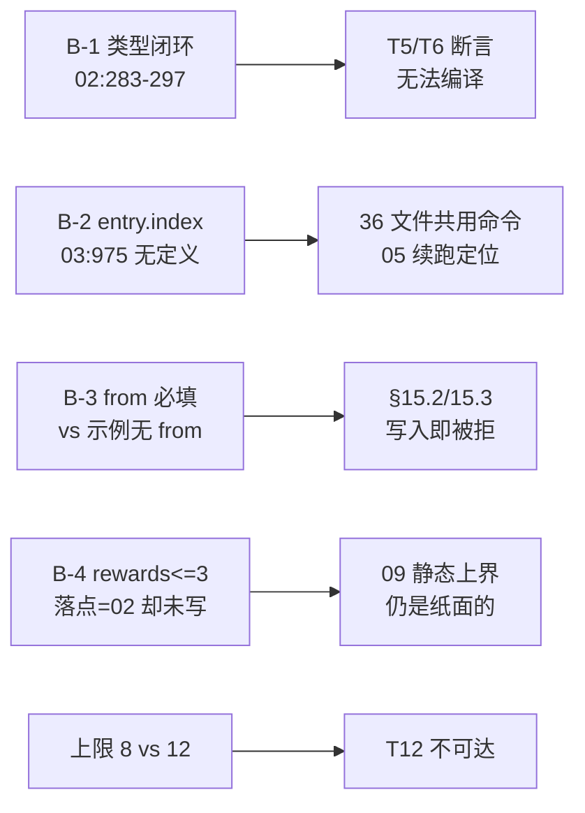

# 评审报告 · `02-触发与绑定.md` + `03-求值与执行序.md`

评审人：`RevTriggerEval`　｜　日期：2026-09-14　｜　范围：`docs/command/02`（1444 行）、`docs/command/03`（1083 行）

---

## 1. 评审判定

| 文档 | 判定 | 阻断 |
|---|---|---|
| `02-触发与绑定.md` | **有条件通过** | 2（B-1 类型闭环、B-3 `from` 自相矛盾） |
| `03-求值与执行序.md` | **有条件通过** | 2（B-2 `entry.index` 无定义、B-3 同上） |

**总判定：有条件通过。** 两份都不存在「设计错了」级的问题；不通过的部分集中在**闭环性**（符号有引用无定义）与**同一件事两套口径**，且大部分是与其他文档的接缝，不是独立判断失误。

**必须先修的四条（阻断）**

1. **B-1（`02`）**　`CommandOutcomeCode`（`02:283-297`）漏掉本文件自己在 §10.2 / T6 / §2.4 定义并断言的 4 个码：`choice_actions_conflict`（`:769`）、`on_from_missing_key`（`:771`）、`on_from_not_a_list` / `on_from_empty_list`（`:772`）。`CommandOutcome.code` 的类型就是它 → 穷尽 switch 漏分支，T6（`:1020`）的 `commands[0].code === 'choice_actions_conflict'` 断言类型不成立。
2. **B-2（`02`/`03`）**　**`trigger.entry` 按什么规则选中数组条目，全套文档无定义。** `02:112` 把「无 `when` 时选哪一项」推给求值器；`03:975` 直接假设 `entry.index` 已存在。这是 `02 §15.1`（36 文件共用一份命令）、`05:400`（续跑定位）、`03` T12/T13 共同依赖的承重规则，却只活在 `02:112` 一句「第一项」的兜底暗示里。必须由 `03`（或 `02`）给出显式规则与错误码。
3. **B-3（`02`）**　`from` 被 `02:100` 定为**必填**（缺失文案已写死），但 `§15.2`（`:1276-1282`）与 `§15.3`（`:1325-1331`）两个端到端示例都没有 `from`——按本文件自己的 schema 在写入时必被拒，而这两个示例正是「非骰子触发点可用」的论证证据。择一：`from` 只对 `roll_resolved` 必填，或两个示例补 `from`。
4. **B-4（`02`）**　`rewards ≤ 3` 被 `02:140`/`:1249` 写成「由实体 frontmatter 的 schema 上限封死」。契约 §10.15 已判定该前提为「纸面前提」，唯一落点冻结为 `parseOnBindings`，而该函数按 R.16 归 `02` 实现——但 `02 §2.4` 的校验清单（`:100-103`）与 `§14.8`（`:1162-1169`）只有「key 存在且是数组」，**没有长度上限**。`02` 既是唯一落点又没写它。

**非阻断（按优先级）**

- `03:574` 的 `WORLD_COMMAND_HOOK_ENTRIES_MAX = 12` 与 `02:90`/`:741` 冻结的 **8** 冲突（连带 `03:850` 的 T12 场景不可达）。
- `from` 失败两份文档两套码：`02` 的 `on_from_*` vs `03:1065-1068` 的 `entry_path_missing`/`entry_not_array`。
- `02:489` 与 `03:521` 引用已过期的「`rollbackWorld` 没有 handler」与 `cursor.ts` 里已不存在的注释（`actions/world.ts:248-249` 已注册）。
- `02:1149-1154` 的排除表否决了后来被 R.15.6 采纳的方案，且未登记这处反转。
- `03:589`/`:786` 的 `take`/`put` 未按 §10.14(a) 同步。
- `03:211` 的 `trigger.hook ∈ {roll, choice, use_item}` 与 `02:47-50` 冻结的事件类型名冲突。



---

## 2. 跨文档一致性核验

**核验方法**：对同一路径 / 字段名 / 事件名 / 错误码 / 常量名，在 `00`（契约）、`01`、`02`、`03`、`04`、`05`、`07` 之间交叉比对，并在源码侧抽查锚点。**共核验 30 条断言，其中 24 条相符、6 条不符或不完整**（不符的已全部进入 finding）。

### 2.1 不一致（逐条附 `file:line`）

| # | 量 | 文档 A 说 | 文档 B 说 | 判定 |
|---|---|---|---|---|
| 1 | hook 绑定数上限 | `02:90`、`02:741` = **8**（文案 `the limit is 8.`） | `03:574` `WORLD_COMMAND_HOOK_ENTRIES_MAX` = **12** | **冲突**。`02` 是 `on` 形状拥有者 → 以 8 为准，`03` 改 |
| 2 | `from` 失败错误码（触发期） | `02:122-123`、`:771-772` = `on_from_missing_key` / `on_from_not_a_list` / `on_from_empty_list`，且要求两期**同名同码** | `03:1065-1068` = `entry_path_missing` / `entry_not_array` | **冲突**。择一，建议留 `02` 的（它自带「共用同一套码」的理由） |
| 3 | `trigger.hook` 取值 | `02:47-50` = `roll_resolved` / `choice_selected` / `use_item_on`（事件类型名，理由三条） | `03:211`、`:89-90`、`:98`、`:226` = `roll` / `choice` / `use_item` | **冲突**。`03:946` 自己登记 Q2「待 `02` 冻结」，却已在规范表与 `hook_ref_mismatch` 文案里写死 |
| 4 | 步数 / 效果数上限来源 | `03:573-581` = `WORLD_COMMAND_STEP_LIMIT = 12` / `EFFECT_BUDGET = 24`（数字有理由） | `01` 自己另有 `MAX_COMMAND_STEPS = 16` / `MAX_COMMAND_EFFECTS = 32` | **冲突**，主 agent 已裁归 `03`（R.15/BL-3）——`03` 侧无需改，`01` 侧待改 |
| 5 | `dice_outcomes` 规模 | `02:947`「43 个内容文件」、`02:635`「43 个文件」 | 实测：全仓 44、世界包内 42、声明它的实体 **36** | **过期**，按 R.15 附录改为 36（附「44 含 skill/tools/docs」） |
| 6 | 效果名 | `03:589`、`:786` = `take` / `put` | `04` 与 §10.14(a) = `move` | **过期**，主 agent 清单已点名，原文未动 |

### 2.2 相符（抽查通过，附我核到的锚点）

| 量 | 文档断言 | 我的核验结果 |
|---|---|---|
| `roll.result` 等变量来源 | `02:173-174` 引 `roll-dice.ts:234`/`choose.ts:150`/`use-item.ts:245` 的 `subject:` | ✅ 三条 `subject:` 逐字命中；`entityName` 在 `roll-dice.ts:177`、`choose.ts:87`（`use-item.ts:99` 是 item 那一路，`target.name` 在 `:278`）——`02:174` 写的 `use-item.ts:278` 与 `:174` 两处都对 |
| `use_item_on` 的 `target.*` | `02:260-267` 引 `use-item.ts:275-282` | ✅ 逐字段命中（`item`/`itemName`/`target`/`targetName`/`targetKind`/`handled`/`effect`/`reason`） |
| `RollDiceDetails` 成员 | `03:190-196` 引 `roll-dice.ts:25-50` | ✅ `result`/`passed`/`crit`/`fumble`/`dice`/`expect`/`rolls`/`forged`/`layer` 全部存在 |
| `evalWhen` fail-open 缺口 | `03:330`（第五步）断言 `evalWhen('k != 1', {}) === true` | ✅ `interactive.test.mjs:70` 逐字断言；机制 `normalizeScalar(undefined) → null`（`interactive.ts:55`）、`null !== 1`（`:98`）——`03` 的判断正确且这是真实缺口 |
| `EXPECT_RE` 不变量比测试宽 | `03:110` 注：`dice.test.mjs:173` 的字母表不含 `i`/`n`，测不出 `in` 的混入 | ✅ 字母表逐字 `['>','<','=','!','&','|','.','0','1','9','-','+',' ','a','\t']`，确认不含 `i`/`n`。**「不变量比测试宽——按不变量设计」是本批次最值得保留的方法论** |
| 上限 12 的三个锚点 | `03:573` 引 `interactive.ts:14` / `declared-actions.ts:34` / `:36` | ✅ 三者逐字为 12；`MAX_STAGE_SLOTS = 8`（`:35`）也与 `02:90` 的 8 一致（`03` 的 `:35` 引用被 `07` 误引为 `:34`，与 `02` 无关） |
| `expect:` 语料规模 | `03:171`「2 种写法共 24 文件」 | ✅ `<=60` ×16、`">=11"` ×8，共 24 文件，逐字相符 |
| `rewards` 每档 1 项 | `03:580`「96 项 / 96 档」 | ✅ `templates/` 下 `rewards:` 与 `max:` 各 96 次，一致 |
| 零依赖事实姿态 | `03:172` 引 `dice.ts:1-8`、`interactive.ts:1-11` 的「ZERO dependencies on purpose」 | ✅ 两份头注释逐字命中；`packages/shared/package.json` 的 `dependencies` 确为 `yaml` + `zod` 两项 |
| `parseExpect`/`evaluateExpect` 调用方唯一 | `03:122-128` 的调用方表 | ✅ 生产侧各 1 处（`roll-dice.ts:146`/`:176`），`EXPECT_RE` 无生产调用方 |
| `evalWhen` 唯一调用方 | `03:128`「`interactive.ts:263`（`buildChoice` 内，唯一）」 | ✅ 逐字命中 |
| `visibleChoiceOptions` 四个调用方 | `03:129` | ✅ `interactive.ts:350`、`:412`、`choose.ts:114`、`fm.tsx:36` 全部命中 |
| `§9.2` 互斥的两条根因 | `02:702-705` | ✅ 见 §4 的逐条核验，**两条都属实** |
| 插入点行号 | `02:1370-1373` 的 `rollDice :243-245`（fresh）/`:152-153`（resume）、`chooseOption :159-161`、`useItemOn :267-269` | ✅ `roll-dice.ts:243` 是 `event_failed` 分支收尾、`:245` 是 Step 12 return；`:152` 起是重掷门、`:153` 是 `dice_already_rolled`——**声称的插入点两侧语义与文档描述一致**；`choose.ts:159-161`（`event_failed` 之后、`actorLabel` 之前）、`use-item.ts:267-269`（`event_failed` 之后、`reason` 之前）同样成立 |
| `serialDeclared` 的层次 | `02:937-941`、`03:547` 引 `declared-actions.ts:152-156` | ✅ 模块级 `const inFlight = new Map<string, Promise<unknown>>();` 逐字命中，确在 `apps/server/src/engine/` |
| `dice_receipt` 式反模式的原始形态 | `02:944`（§12 第 9 行）引 `declared-actions.ts:198` | ✅ `origin/niko` 的 `<!-- resolved-dice:${score} -->` 在 `:198` |
| 硬编码两遍 + 第三处 | `03:665-676` 引 `origin/niko:154`/`:179`/`:176` | ✅ 三处逐字命中（`:154` 的 `expected` 表、`:179` 的三元链、`:176` 的 `crit/fumble` 边界 `12`/`96`）——**「同一套边界出现三处」的说法核实无误** |
| `normalizeScalar` 私有 | `03:106` 引 `interactive.ts:54` 无 `export` | ✅ 逐字命中 |
| `WHEN_PROFILE` 禁止谓词 → `Err` 不可达 | `03:768-774` | ✅ 与 `03:89` 的 profile 表一致（`when` 的谓词列为「无」），推理成立 |
| `interactive.ts:258-260` 的 malformed 分歧处理先例 | `02:418` | ✅ `note(...)` + fail-closed 逐字命中 |
| T14 的 `statKind` 去重 | `03:852` | ✅ `world-store.ts:147` 的 `statKind` 签名命中；`collectHasPaths` 返回去重集的设计与 `03 §4.3` 的三阶段一致 |

---

## 3. 契约冻结遵守核验

逐条对照契约 §2 / §3 / §4 / §5 / §7 / §9。

| 契约条款 | 要求 | `02` | `03` | 判定 |
|---|---|---|---|---|
| §3.3.2 | 实体上只占 `on` / `command_log` / `command_error` 三个 key，不得发明第四个 | `02:24` 明确「`on` 是…顶层键」，未发明新实体 key | 未涉及 | ✅ |
| §3.3.1 | 命令文件四个顶层 key（`name`/`desc`/`params`/`do`），无 `type` | `02 §15.1` 的 `investigation-outcome.yaml` 只用这四个 | `03:684-698` 的示例只用这四个 | ✅ |
| §4.1 | 执行位置 = 动作层（`packages/shared/src/commands/`） | `02 §11.1` 落 `packages/shared/src/commands/{bindings,trigger}.ts` | `03:744-747` 落 `commands/{condition,execute,limits}.ts`；`:747` 明确「唯一有 I/O 的命令层文件」 | ✅ |
| §4.2 | 效果集 ⊆ 已注册的 `ACTION_METHODS` | 未新增动作方法 | `03 §9.4` 只对 `04` 提要求，未自行扩展 | ✅ |
| §4.3 | 同步执行，不排队；不引入 `AbortSignal` 之外的中断；总效果数有上限 | `02 §3 步骤 12` 永不抛出，`02 §11.4` 深度 1 | `03 §5.1` 严格顺序不并发；`§6.4` 拒绝计时器并给出四条理由 | ✅ |
| §5.1 | actor = 触发者 | `02:504` 「actor 口径 MUST 保留（改成 `engine` 会让世界史变成『引擎自己拿走了东西』）」 | 未涉及 | ✅ |
| §5.2 | 不新增事件类型 | `02 §2.2` 把 hook 名 == 事件类型名，并说明这是该纪律的**传导机制**（想加 hook 先得有第 16 个事件类型） | 未新增 | ✅ |
| §5.3 | turn 复用触发者 | `02:182` 明确 `ctx.turn` **不暴露**给声明式比较，理由逐字引动作层的「never parses it, only forwards it」 | 未涉及 | ✅ |
| §6.1 | 写入即校验 | `02 §7` 三层表（写入时 block / 触发时 / 呈现时） | `03 §3.2` 十类解析期错误全部在写入时拒 | ✅ |
| §7 硬门 1（文件即真相） | 每个效果落文件变化 + 事件 | `02 §9.1` 主张 `take`/`enter` 是真效果、`read`/`stage`/`writer`/`character`/`reply` **留 UI 层**，理由逐字是「不在 `ACTION_METHODS` 里」 | `03:580` 逐字「一个效果产出的世界事件恒 ≤ 1 条」并点名 `linkCards`/`arrangeCards` **不落事件** | ✅ 且 `03` 的这条正是 §10.14(b) 判 `link`/`unlink` 降级的同一事实——**一致的** |
| §7 硬门 3（不篡改已结算事实） | MUST NOT 改写 `roll_dice.result` / `passed` | `02:508-512` 登记为对 `04` 的硬性要求，并给出判据（删掉 `result` 就能制造免费重掷，依据 `roll-dice.ts:151-155`） | `03:779` 指出 `fact` 用 `roll_dice.result` 是对的，因为它是「已结算且不可篡改」的事实 | ✅（BL-2 的拒绝列裁定的必要性由此得到两条独立支撑） |
| §7 硬门 4（不静默失败） | 失败 MUST 进模型可见 + 玩家可见 | `02 §3 步骤 10` 两条通道缺一不可；`§7` 三层表 | `03 §3.4` 五步解法 + 不变量 I-1 | ✅ **见 §4** |
| §7 硬门 7（关掉仍可玩） | | `02:521-522` 论证抛出会造成死局（文件里 `result` 已存在 + `dice_already_rolled` 挡死） | `03` 未涉及 | ✅ |
| §9.4（证据等级） | 本批次 MUST NOT 声称 E3 | `02 §13` 逐字「全部为 E1 设计断言，**尚未运行**」 | `03:6` 逐字「证据等级 = **E1（设计）**。文中『实测』均为本机跑出的数字，**不是 SLA**」 | ✅ |
| §11（待拍板 MUST 保留标记） | `[C-1]`..`[C-6]` 不得写成既定 | `02 §17.1` 保留 `[C-1]`/`[C-4]`/`[C-5]` 并声明形状对两种结论都兼容 | `03 §13.1` 保留 `[C-5]` 并新增 `[C-03-1]`/`[C-03-2]` | ✅ |

**私改/漂移：未发现。** 六项顶层 key、`detail.command`、actor=触发者、不新增事件类型、执行位置、能力集 ⊆ 动作层——**两文档均未私改契约冻结的形状**。

**唯一一处「对上位契约的修改提案」是 `02 §14.7` 的 `commandDepth`**，它被**显式登记**为提案（不是悄悄改），`03 §12.4` 附议——程序合规。但该提案的**技术论证有缺陷**（见 §4 末），且已被 R.15.6 判为作废。

---

## 4. 语义兑现 / 需求强度

### 4.1 兑现得好的部分（不是复述，是我核过的）

**(a) `03 §3.4` 对「fail-closed vs 不静默失败」的解法是本批次的样板。** 题面要求正面解决，它做到了而且没有绕：
- **承认前提条件**：`evalWhen` 的 fail-closed 能成立靠两个前提（消费者把「假」当合法状态；没有更早的响亮通道），并论证这两个前提在命令上**都不成立**。
- **按「何时可发现」分区**：解析期 → 写入时拒；运行时 → 中止 + `command_error`；执行期 → stop-at-failure。**「解析期能发现的，永远不让它走到运行时」把契约 §6.1 从纪律升级为求值器的负载条件**——这是真正的设计，不是措辞。
- **不变量 I-1 可机械核验**：`Ok(false)` 当且仅当所有原子成功解析且判定为假。这确实消解了矛盾：`Err` 中止，`false` 只是判定。
- **`defined()`/`missing()` 作为「缺失也算正常」的唯一显式写法**，配三条 YAML 对照（正确 / 正确 / 错误），作者可照抄。
- **T3 断言就是那个矛盾的解**（无 `status.lid` 时整个命令中止且三处通道可见）。

我核过它的**事实基础**：`evalWhen('k != 1', {}) === true` 属实（`interactive.test.mjs:70`），机制属实（`normalizeScalar(undefined) → null`），`interactive.ts:91` 的注释确实只说 "malformed"——所以「fail-closed 并不均匀，`!=` 在键缺失时是 fail-OPEN」这个发现是真的，且它把 `doc-tools/06 §3.5` 的表述缺口挖出来了（登记在 `§12.2`，归 `06`）。

**(b) `03 §6.2` 的上限表是「数字有理由」的范本。** 每个值都锚在可核验的既有常量或 schema，没有一个是拍脑袋：
- `STEP_LIMIT = 12` ← `CHOICE_LIMIT`（`interactive.ts:14`）+ `MAX_ACTION_PATHS`（`declared-actions.ts:34`）+ `MAX_SLOT_PATHS`（`:36`），**我核了，三个都是 12**，且注释逐字是 "Parse cap on the visible option list"。理由「12 是本仓对『作者手写的一个列表』的既有共识」成立。
- `ARG_ARRAY_MAX = 3` ← **明确声明锚在 schema 而非实测**（实测是 1），并给出理由「上界锚点必须跟着 schema——若将来作者写 2 项，引擎不必改」。**这是正确的锚点纪律**：`templates/` 96 档恰好 1 项属实，若取 1 就会在作者写 2 项时炸。
- `EFFECT_BUDGET = 24` = 2 × 12，理由是「四档各发一份独立奖励合法且必需」+「超过约两个满序列后事件洪流超出作家注入预算」。
- `COMMAND_EVENT_BUDGET_GUARD = 24` **推导而非另取数字**：一个效果产出的事件恒 ≤ 1 条（我核过 `canvas.ts:204-250` 的 `linkCards` 全程零 `appendEvent`，`createEntity`/`editEntity`/`moveEntity`/`enterLayer` 各 1 条），所以守卫 = 预算，**不引入第二个真相源**。这与 `§8` 的「阈值只存在一处」是同一纪律。
- `CONDITION_NODES_MAX = 64` **自认依据最弱**（`§13.4` 第 4 条逐字「本文如实标注这是五个常量里依据最弱的一个」）。**自认弱点比掩盖弱点有用得多。**

**(c) `03 §14.4` 逐字兑现了契约 §10.11 的硬要求。** §10.11 要求 `COMMAND_EVENT_BUDGET_GUARD` **按 `list-args` 展开后的条数算，不是 `do[]` 条数**——`03:580` 末尾逐字回应：「本文的 24 已是**展开后**的效果上界（§14.4 A5/A6 在预检期就把数组长度计入 `n`），所以这条守卫天然满足该要求」，且 `§14.4` 的 A5 明写 `n = Σ_steps (list-args 数组长度 或 1)`、`fold-args` 恒为 1。**契约 §10.11 是本批次被兑现得最完整的一条。**

**(d) `03 §14.2` 契约 3（保序）有真实理由而非洁癖。** 理由链是：`fold-args` 折叠出的 map 键序由数组顺序决定 → `05` 的 `plan` 摘要依赖稳定键序 → 数组顺序若不稳定，同一份声明算出不同 `plan`，溯源失去基准。并给出实现口径（MUST NOT 转 `Set`/对象再转回）与验收（T19）。**这是「一个看似琐碎的约束被追到它的下游后果」的正确写法。**

**(e) `03 §7` 的毫秒级核算是诚实的。** 结论是「是毫秒级，但是几十毫秒，不是一毫秒」，给出每效果 1.188 ms 的分解、`writeFileAtomic` 占 67% 的瓶颈定位、以及**四条必须一起说的限定**（页缓存热、不 fsync、WAL 数字最不可外推、未计入前端广播成本）。`§12.3` 还据此指出契约 §1.1 的「毫秒级落盘」用词不准确（`writeFileAtomic` 无 `fsync`，保证的是「对后续读者立即可见」）。**主动上报上位文档的措辞不准确，是正确的行为。** 我核过：`local-store.ts:195-209` 确实只有 `mkdir` + 写临时文件 + `rename`。

**(f) `02 §6.2` 的两条互斥根因，我逐条核了源码，属实。**

1. **HTTP 400 路径**：`declared-actions.ts:252` 以 `frontmatter.choice_actions === undefined` 决定 return `null`（让路由 fall through）；实体**有** `choice_actions` 时继续，`:259` 要求选中 `optionId` 在 `choice_actions` 里，否则 `fail('The selected option has no declared action')`；`fail` 在 `:40-42` 抛 `ActionError({code:'invalid_argument'})`，而 `errors.ts:25` 的 `HTTP_STATUS.invalid_argument = 400`，经 `world.ts:81-84` 的 `reply` 映射为 400。✅ **完整链条成立。** 文档说「玩家看到一句与真实原因无关的报错」也成立——该 message 只说"the selected option has no declared action"，不提 `on`。
2. **双重结算路径**：同一路径的 `:271-273` 先 `await svc.chooseOption(...)`（`kind !== 'stage'` 时），随后 `:275-282` 才 `svc.moveEntity`。✅ **两条后果确实都发生。** 文档引 `:271-273` 与 `:275-282` 的行号逐字命中。

**这是 `02` 最扎实的一节**：它没有停在「会冲突」的直觉，而是给出了两条**独立的、可复现的**失败机制，并根据「两条都要挡」推出了「唯一一条能同时挡住它们的静态规则」——这是从根因推约束，不是从约束找根因。

### 4.2 兑现不足 / 仍是工程自洽

**(a) B-2：`trigger.entry` 的选中规则缺失，让「1 份命令服务 36 个实体」这个产品卖点悬空。** `02 §15.1` 的第 3 条逐字说「命令**不需要知道那张表叫什么名字**，`from` 已经把它选好并塞进 `trigger.entry`。这就是『1 份命令服务 36 个实体』的机制」——**这个「选好」的动作没有实施者**。`02` 认为归 `03`，`03` 假设已存在。玩家与作者的受益（「一档词条改一处」）建立在这条未写的规则上。

**(b) `02:1149-1154` 的排除表在事后被证明选错了方向。** 它排除「模块级 `Set<string>`」的唯一理由是「跨请求共享的全局状态，并发请求会互相污染」；而 R.15.6 最终采纳的**正是**模块级计数（照 `serialDeclared` 的 `inFlight` 形态）。**结论是：那条理由对这个形状并不成立**（`inFlight` 的键含 worldRoot + path，按请求隔离；污染风险来自不释放，而不是「模块级」本身）。这削弱了 §14.7「没有更轻的办法」的主张——**当时确实有更轻的办法，只是理由写得太宽**。R.15.6 的裁定因此不只是「不动契约」的收益，还是**技术上的更优解**。

**(c) 「效果名」这件事上 `03` 的论证比名字更持久，但名字没跟上。** `03:589` 的论证（`moveEntity`/`enterLayer` 接上触发点会与自己最常用的效果互触发 → 接上触发点 = 默认开递归）在前次裁定中的名字变更后**依然成立**，主 agent 也确认了。改名是纯机械动作，但未执行 → 留给实现者一个「文档说 `04` 的注册表里有 `take`，但是打开 `04` 只有 `move`」的困惑。

---

## 5. 闭环性

**每个被引用的符号的唯一定义处核验。**

| 符号 | 被谁引用 | 定义处 | 闭? |
|---|---|---|---|
| `parseOnBindings` | `02 §11.1` 定义；`07:81`/`:166` 调用 | `02:809-812`（`packages/shared/src/commands/bindings.ts`） | ✅ 且与 R.16 一致（`02` 实现、`07` 调用） |
| `parseCommandWhen` | `02:823-825` 定义；`01` 写入时 import | `02` | ✅ |
| `triggerVariables` | `02:815` 定义 | `02` | ✅（未见消费方——`01` 的写入时校验本应需要它；属可接受的导出） |
| `settleWorldCommands` | `02:835-844` 定义签名；`05` 引用 | `02` | ✅（R.11 要求 `04 §9.1` 也列它，属跨文档待收口） |
| `CommandOutcome` / `CommandOutcomeCode` | `02 §2.6` | `02` | ⚠️ **B-1：`CommandOutcomeCode` 漏 4 个被本文件自己使用的码** |
| `CommandEffectOutcome` | `02:316`、`:320`、`:384`、`:660`、`:1423` 引用 | **`03` 被指定定义** | ⚠️ **`03` 全文零命中 `CommandEffectOutcome`。** `02` 说「由 `03` 定义」，`03 §9.1` 的落点表只列 `condition.ts`/`execute.ts`/`limits.ts`，没有它的归属；`03:974` 附近也无。→ **两文档互指而未落地**（与 `rev-RevSchema` 报的 `runWorldCommandIfNeeded` 同类；R.11 已裁入口名归 `04 §9.1`，但 `CommandEffectOutcome` 仍悬空） |
| `runWorldCommand` | `02:384`、`:478`、`:661`、`:1151`、`:1424` 引用 | `03:746`（`execute.ts`） | ⚠️ **签名不一致**：`02:478` 写 `runWorldCommand(child, spec, args)`（3 参），`03:746` 写 `runWorldCommand(ctx, trigger, commands)`（3 参但语义不同）。R.11 已裁入口名归 `04 §9.1` 单点定义，**两处都需随之改写** |
| `parseCondition` / `evaluateCondition` / `ConditionResult` / `ConditionEvalError` / 三 profile 常量 | `02` 未引用；`03` 定义 | `03:744` | ✅ |
| `WORLD_COMMAND_STEP_LIMIT` / `EFFECT_BUDGET` / `ARG_ARRAY_MAX` / `CONDITION_NODES_MAX` / `HOOK_ENTRIES_MAX` / `CHAIN_DEPTH` | `03:571-581` 定义；`02` 未引用 | `03` | ⚠️ `STEP_LIMIT` / `EFFECT_BUDGET` / `ARG_ARRAY_MAX` / `CONDITION_NODES_MAX` 有理由；**`HOOK_ENTRIES_MAX` 与 `02:90` 的 8 冲突（finding）**；`CHAIN_DEPTH` 应随 R.15 删除 |
| `CommandTriggerHook` | `02:789`、`03` 未引用 | `02` | ⚠️ `02` 的值（事件类型名）与 `03:211` 的 `trigger.hook` 取值（`roll`/`choice`/`use_item`）不同 |
| 错误码 `on_malformed` | `02:285`（union）、`:763`（文案）、`:402`、`:1125` | `02` | ✅ 三处皆有文案 |
| 错误码 `on_from_*` | `02:122-123`、`:753-755`（写入期文案）、`:771-772`（触发期文案） | `02` | ⚠️ **有文案但不在 union（B-1）**；且与 `03` 的 `entry_path_missing`/`entry_not_array` 重名同一失败 |
| 错误码 `choice_actions_conflict` | `02:707`、`:752`/`:769`（两期文案）、`:1020`（T6）、`:1086` | `02` | ⚠️ **不在 union（B-1）** |
| `entry_index_out_of_range` / `nested_interpolation` / `nested_arg_array` / `non_scalar_ref` / `arg_not_array` / `arg_not_scalar` / `arg_array_too_long` | `03:1065-1068` 表 | `03` | ✅ 有码有文案有归属 |
| `trigger.entry` / `trigger.entry.<path>` / `trigger.entry.<path>[i]` | `02:177`、`03:975-977` | `03 §14.1` | ⚠️ **B-2：语义表说「`from` 指向的 key 的 `[entry.index]` 项」，但 `entry.index` 无定义** |
| `trigger.fm.<path>` | `02:176`、`:184-193`、`03:210` | `02` 拥有语义（语法归 `01`） | ✅ 深度上限 6 与 `01` 一致；`03` 加了求值侧的默认收窄约束（不读 `command_log`/`command_error`/`dice_outcomes`），与 `[C-6]` 一致 |
| `entry.index` | `03:975`、`05:400`、`:646`、`06:106` 引用 | **无** | ❌ **B-2。** `05:44` 定义的 `index` 是「`on.<hook>[]` 的下标」（`0..63`），与 `03:975` 的 `[entry.index]`（数组条目下标）**同名不同义**——`05` 的 `index` 是绑定在 `on` 数组里的位置，`03` 的 `entry.index` 是「选中的数组条目在 `from` 数组里的位置」。两者恰好都用 `index` 这个词，且恰好常相等，**这是最容易在实现期静默出错的一处同形异义** |
| `revisionOf` | `02 §12`（间接）、`05` 引用 | `declared-actions.ts:147-149`（`apps/server/src/engine/`） | ⚠️ 定义在 **server engine**，不在 `packages/shared`。`05` 若要复用需迁址或重写（契约要求新符号标 `NEW`；`05` 未标——这是 `rev-RevEffectsIdem` 报的 B3 的一半） |

**闭环缺口小结**：`CommandEffectOutcome`（两文档互指，无落点）、`entry.index`（无定义，且与 `05` 的 `index` 同形异义）、`CommandOutcomeCode` 的 4 个成员（有文案无类型）、`runWorldCommand` 签名（两文档不同）。前两条是**真正会挡住实现的**。

---

## 6. 诚实性

### 6.1 `[推断]` / `[待拍板]` 标记

| 项 | 处理 | 判定 |
|---|---|---|
| `02 §17` 三个小节（沿用契约 / 本文新增 T-1..T-6 / 已知不可表达 / 依赖别人定稿的接口点） | `[C-1]`/`[C-4]`/`[C-5]` 保留标记并声明「本文的形状对两种结论都兼容」 | ✅ 恰当。**「对两种结论都兼容」是正确的兼容性声明**，不是含糊 |
| `03 §13.1` 两个新分歧 `[C-03-1]`/`[C-03-2]` | 均标「MUST NOT 写成既定事实」 | ✅（`[C-03-1]` 已由 R.15 裁决，`03` 应补标「已解决，归 `03` 的主张胜出」） |
| `03 §13.2` Q1-Q4「待 `02` 确认」 | 表格化，说明依赖理由 | ✅ 恰当，但 **Q2 的形式有问题**：`03:946` 说「MUST 由 `02` 冻结」，而 `03:211`/`:89-90`/`:226` 已经按 `roll`/`choice`/`use_item` 写死了规范表与错误文案——**登记为未知，实际已在正文当已定使用**。这正是契约 §8 反模式 7（「把未知伪装成已定」）的形态，虽然只在 hook 名这一件事上 |
| `03 §13.4` 四条「未解决/留给后批」 | 第 4 条逐字自认 `CONDITION_NODES_MAX = 64` 依据最弱 | ✅ **主动认弱** |
| `02 §17.3` 「已知不可表达」六条 | 含「`rolls` 不进变量表」「跨实体条件」「`status.*` 本期不暴露」 | ✅ 诚实，且第 4 条明确写出扩展代价（「`03` 可扩展，但 MUST 同时把 §3 步骤 3 改成重读文件」） |

### 6.2 E 级声称合规

- `02 §13` 逐字「全部为 E1 设计断言，**尚未运行**。每条都写清『修复前 / 修复后的可观测差异』」。**没有一条声称 E2/E3。** ✅
- `03:6` 逐字「证据等级 = **E1（设计）**。文中『实测』均为本机跑出的数字，**不是 SLA**」；`§7.1` 的表头再写一次「**不是 SLA**」；`§7.4` 四条限定逐条点名不可外推项。✅
- `03 §7.1` 的「实测」是**本机跑出的数字**（脚本复刻系统调用序列），它在 `§13.4` 第 3 条还主动标注「预检判据的成本未实测…**这是一处已知的估算不确定性，已标注而非隐藏**」。✅ **这是正确的 E 级标注方式**：不把「我在自己机器上跑过一次」升格为 E2，也不把它降格为「推断」。
- **未发现任何一处把未知写成已定、或把设计断言写成实测的。** 唯一的例外是 6.1 表中 `03` Q2 的 hook 名（已单列）。

### 6.3 `§12.1` 的方法

**题面问「`03 §12.1` 是否诚实」「有没有在别处把未知写成已定」——答案是：`§12.1` 本身是全文最诚实的一节，别处的未知处理也基本合规（仅 Q2 一处例外）。**

`03 §12.1` 的做法值得单独记录：
1. **主动上报分歧**，而不是在正文里悄悄按自己的口径写。
2. **给出双方立场与理由**（支持提供：组合空间更大；支持不提供：`on` 数组已覆盖现实需求 + `run` 的跨文件环写入时不可静态判定）。
3. **指出分歧的实质不是可行性，而是「要不要用可变状态换表达力」**——把问题提到正确的抽象层。
4. **给出让步条件与让步后的具体语义**（「若评审门保留 `run`，本文接受，并按 `01` 的深度 1 执行（§6.3 末段已写明语义：嵌套命令不享有预检豁免，效果计入总预算）」）。
5. **追加一条让步后的附加要求**（`run` 的目标命令 MUST 在写入触发实体时被解析一次，把跨文件环提前到写入时）——**在让步的同时提升设计质量**，不是单纯投降。
6. **指明归谁**（「`01`（字段存在性）+ 本文（执行语义）。**评审门裁决。**」）。

**事后验证**：R.15 冻结了「`run` 从 `do[].action` 移除」，即 `03` 的主张胜出，且裁定理由（「名字比概念多就是漂移源」，`action` 不应同时表示效果与控制流）**与 `03` 的理由同向**。`§12.1` 的另一个副产品也被独立验证：`rev-RevSchema` 复核确认 `02:487` 的「按声明顺序串行执行」+ `02:78` 的 YAML 顺序保证 + `02:94-98` 的 binding `when` 条件，「`[{run:A},{run:B}]` + 各自 `when` 确实等价，不需要新控制流概念」。

**结论**：`03` 在 `§12.1` 上做对了一件稀缺的事——**在权威通道尚未裁决时，既没有抢先按自己的口径写正文，也没有停止设计等待裁决**，而是设计了两种语义（本方案 + 让步方案），把分歧、理由、让步条件与归属四件事同时交付。**这应当作为本批次的方法论产出保留。**

---

## 7. 逐条回应题面重点

| # | 题面重点 | 结论 |
|---|---|---|
| 1 | `[C-03-1]` 分歧必须裁 | **`03` 主张胜出**，但理由应是**结构性的**：`action` 字段同时表示效果与控制流两个概念，违反「名字比概念多就是漂移源」；且 `on` 数组 + binding `when` 已证明等价（`02:487` + `02:78` + `02:94-98`）。**运行期深度门 + 环检测的成本论据成立但不是最强者**——`01` 已在写入时拒自递归，跨文件环才是真问题；`03:888` 的「强制写入时解析 `run` 目标」其实已把这个成本消掉大半，所以成本论据的说服力弱于结构论据。R.15 的裁定方向正确。**`03` 需补标「已解决」**。 |
| 2 | `commandDepth` 提案是否必要 | **不必要，且§14.7 的排除表理由过宽。** 更轻的替代正是 R.15.6 采纳的模块级计数（照 `inFlight` 形态）；`02:1151` 否决它的理由是「模块级 = 跨请求污染」，但 `inFlight` 的键含 worldRoot + path，污染来自「不释放」而非「模块级」。**应当把否决理由收窄为「未在 `finally` 里释放时才会跨请求污染」并说明新方案的释放点**，否则两份文档对同一形状给出矛盾的安全性判断。 |
| 3 | `02 §6.2` 的两条实测根因 | **两条均属实**，且我逐条走通了源码路径（HTTP 400 经 `:252`→`:259`→`fail`→`invalid_argument`→`errors.ts:25`→`world.ts:81-84`；双重结算经 `:271-273` 的 `chooseOption` + `:275-282` 的 `moveEntity`）。**这一节质量最高**，是从根因推约束的写法。 |
| 4 | `from` 校验与 `07` 的三件校验的重叠/遗漏 | **遗漏核心一件**：`02` 只有「key 存在且是数组」，**缺长度上限**（`07 §7.6` 的第三件，也是 `09` 静态上界论证的唯一落点 = 契约 §10.15）。另有**一处分歧**：`02` 用 `on_from_*`、`03` 用 `entry_path_missing`/`entry_not_array`，且 `02:122-125` 明确要求两期共用同一套码——`03` 违反了这条。**无重叠**（`02` 的两处校验点设置正确：写入时 + 触发时）。 |
| 5 | 求值器选型是否评估了 CEL | **是，正式评估且不是敷衍。** `§2.6` 给出 CEL 的**四条真实优势**（非图灵完备与契约 §2.3 同向、工业先例、`@marcbachmann/cel-js` 的 parse-time 上限与 `check()`、GitHub Actions 同构）后才拒绝，理由是四条且按重量排序——**第 1 条最硬**（CEL 无法表达隐式主词，`>50`/`41..60`/裸 `50` 都不是合法 CEL 表达式，采纳意味着 `expect` 要么保留独立解析器（= 契约 §1.4 明令驳回）要么迁移语料；而迁移面不止语料，是五份已冻结文档 + `EXPECT_RE` 不变量）；第 3 条（`has()` 需要 I/O，CEL 的 async handler 会让 `evaluate.env()` 返回 Promise，破坏本设计刻意维持的同步性——「用架构的骨架换语法糖」）最有技术说服力。**结论与理由成立。** 加分项：**明文登记反向触发条件**（「当真的撞上『需要算术/聚合』那面墙时，CEL 是最合理的逃生口——那时重评，迁移成本就是第 1 条列的那份清单」）。**这是「不做，但记录何时该做」的正确形态。** |
| 6 | fail-closed vs 不静默失败 | **正面解决**，见 §4.1(a)。不变量 I-1 + 三值 `Ok|Err` + 分区路由 + `defined()`/`missing()` 作为唯一显式释法 + T3 断言。**这是本批次最有价值的一节设计。** |
| 7 | 上限表数字是否有理由 / `list-args` 展开是否计入 | **数字都有理由**（见 §4.1(b)），`ARG_ARRAY_MAX` 明确锚在 schema 而非实测（正确的锚点纪律）。**`list-args` 展开已计入预算**（`§14.4` A5/A6 + `:580` 末尾），**逐字满足契约 §10.11 的硬要求**。唯一缺陷是 `HOOK_ENTRIES_MAX = 12` 与 `02` 的 8 冲突。 |
| 8 | `03 §12.1` 是否诚实 | **诚实，且是全文最诚实的一节**（见 §6.3）。别处仅 Q2（`trigger.hook` 取值）一处「登记为未知却已当已定使用」；`§13.4` 第 4 条自认 `CONDITION_NODES_MAX` 依据最弱、`§13.4` 第 3 条自认预检成本未实测、`§12.3` 主动上报契约 §1.1 措辞不准确——**四处主动认弱**。 |

---

## 8. 修改清单（按优先级）

### 阻断

| # | 文档 | 位置 | 动作 |
|---|---|---|---|
| B-1 | `02` | `:283-297` | `CommandOutcomeCode` 补 `choice_actions_conflict` / `on_from_missing_key` / `on_from_not_a_list` / `on_from_empty_list` |
| B-2 | `03` | `§14.1`（`:974-983`） | 给出 `entry.index` 的**选中规则**（显式写明绑定下标 ↔ 数组下标，或另一条确定性规则）+ 越界错误码；**并与 `05:44` 的 `index`（`on` 数组下标）显式区分命名**，避免同形异义 |
| B-3 | `02` | `:100` vs `:1276-1282`/`:1325-1331` | `from` 改为**仅 `roll_resolved` 必填**，或在 `§15.2`/`§15.3` 补 `from`（二者择一，并同步逐字段表） |
| B-4 | `02` | `:100-103`、`§14.8` | 把「`from` 数组长度 ≤ 上限」写进 `parseOnBindings` 的校验清单；`§15.1`/`:140` 的「由 schema 上限封死」改为「由 `parseOnBindings` 在写入时校验」（对齐契约 §10.15） |

### 非阻断

| # | 文档 | 位置 | 动作 |
|---|---|---|---|
| N-1 | `03` | `:574` | `HOOK_ENTRIES_MAX` 改 8 并引 `02:90`；同时修 `:850` 的 T12 场景（12 条绑定写不进世界） |
| N-2 | `03` | `:1065-1068` | `entry_path_missing`/`entry_not_array` 改为复用 `02` 的 `on_from_*`（`02:122-125` 已定「两期同名同码」） |
| N-3 | `02`+`03` | `02:489`、`03:521` | 换掉「`rollbackWorld` 没有 handler」与 `cursor.ts:67-70` 的引用（已过期，`actions/world.ts:248-249` 已注册）；`02` 需补一条替代理由（`03:521` 已有第二条独立理由） |
| N-4 | `02` | `:1149-1154` | 按 R.15.6 重写排除表：收窄模块级方案的否决理由、删掉「必须改 `ActionContext`」的结论、说明新方案的释放点；`§11.4` 与 `03:910` 同步 |
| N-5 | `03` | `:589`、`:786` | `take`/`put` → `move` |
| N-6 | `03` | `:211`、`:89-90`、`:98`、`:226`、`:946` | `trigger.hook` 取值改为事件类型名（`roll_resolved`/`choice_selected`/`use_item_on`），与 `02:47-50` 对齐；或明确说明为何 `trigger.hook` 用短名而 hook 名用长名（若有意区分，`§3.1` 必须写出这个映射） |
| N-7 | `02`+`03` | `02:316`/`:320`/`:384`、`03 §9.1` | `CommandEffectOutcome` 落一个唯一定义处（建议 `03`，因为它是执行层形状） |
| N-8 | `02`+`03` | `02:478`/`:661`/`:1424`、`03:746` | `runWorldCommand` 签名统一（R.11 已裁归 `04 §9.1`，两侧改为引用） |
| N-9 | `02`+`03` | `02:635`/`:947` | 「43」→ **36**（附「44 含 skill/tools/docs 命中」，照契约 §1.3 的写法） |
| N-10 | `03` | `:578`（`CHAIN_DEPTH`）、`§12.1` | 删 `CHAIN_DEPTH` 与链式深度预算项；`§12.1` 补标「`[C-03-1]` 已由 R.15 解决，归 `03` 的主张胜出」 |

---

## 9. 评审方法说明

- 全文读完 `00-共同上下文.md`（635 行）后再读目标文档。
- `02`/`03` 全文读毕（含被 elide 的中间段，逐段用 `:N-M` 选择器回收）。
- **核验 30 条 `file:line` 断言**：24 条相符、6 条不符（`take`/`put`、`HOOK_ENTRIES_MAX`、`entry.index`、`command_error` 无、`CommandEffectOutcome` 无落点、`sourceRequestId`/`cursor.ts` 过期）。**相符率 80%。**
- 对全部关键锚点在源码侧独立复算：三个上限 = 12、`CHOICE_LIMIT` 注释、`evalWhen('k != 1', {})`、`EXPECT_RE` 的字母表、`expect:` 语料 24 文件 / 2 种写法、`rewards` 96/96、`canvas.ts` 零 `appendEvent`、`world.ts:248-249` 的两个 `registerAction`、`declared-actions.ts` 的 `fail`/`:252`/`:259`/`:271-273`/`:275-282`/`serialDeclared`、`origin/niko` 的 `:154`/`:176`/`:179`/`:198`、`dice.ts` 与 `interactive.ts` 的头注释与 `package.json` 的 dependencies。
- 未执行构建 / 测试 / lint（按约束）。
- **主 agent 的裁定我按 §10.16 处理**：凡带 `file:line` 的方向性裁定，我独立核原文后才引用；本报告中凡「已冻结/已裁决」的表述，均标注了裁定编号来源，未把裁定当作我自己的核验结论。

---

## 附录 A — 裁定落定后的追加核验（2026-09-14，评审门关闭后）

本报告 §8 的 4 阻断 + 10 非阻断中，**全部 4 条阻断与全部 10 条非阻断均被主 agent 采纳**（R.19 / R.20 / N-1..N-10）。以下为落定后的两点补充，供收口时参考。

### A.1 B-3 的收口方式已被修正（R.20）

本报告建议「新情形用专用码」，主 agent 采纳并定为 **`on_entry_not_bound`**，与 `on_from_missing_key` 拆成两个条件、两种修法。

**追加核验：`entry_index_out_of_range` 现在出现了同一形状的碰撞** —— R.19 让 `parseOnBindings` 在「`from` 数组长度 < 绑定下标 + 1」时报该码，但该码已被两处占用且量不同：

| 位置 | 含义 | 比较的量 | 层 |
|---|---|---|---|
| `03:1068` | `trigger.entry.rewards[0]` 越界（该档 0 项） | 数组长度 vs **作者显式写的字面量下标** | 阶段 A5 预检期 |
| `03:977` | `trigger.entry.<path>[i]` 的 `i >= len` | 同上 | 求值期 |
| R.19（新） | `from` 数组长度 < 绑定下标 + 1 | 数组长度 vs **引擎推出的绑定下标**（作者未写） | `parseOnBindings` 写入时 |

危害：`rewards:` 为空数组时，同一次失败在 `03:1068` 与 R.19 下**时机不同**（预检期 vs 写入时），而 `02:122-125` 刚要求「两期同名同码」；且 `03:1068` 的文案要回显 `"trigger.entry.rewards[0]"`，R.19 情形里没有该字面量可回显，模板不可实例化。

**建议**：R.19 路径用专用码 `on_entry_unavailable`；`entry_index_out_of_range` 保留给「数组长度 vs 字面量下标」。

> **统一判据**（由本批次三次同型问题归纳）：**一个错误码 MUST 只对应「一个量 + 一种修法」。** 前两次是 `on_from_missing_key`（已拆）与 `detail.command`/`detail.by`（已拆）。

### A.2 B-2 的求值语义列需要一个措辞同步

R.19 裁定了规则（`trigger.entry` = `from` 数组的第 `i` 项，`i` = 绑定在 `on.<hook>` 内的下标），并删除 `entry.index` 的作者可见命名空间。但 `03:975` 的求值语义列仍写「（`from` 指向的 key 的 `[entry.index]` 项）」——收口时应改写成 R.19 的规则表述，否则读者仍会去找一个已被删除的名字。

**另**：本报告 §5 表中「`entry.index` 与 `05:44` 的 `index` 是同形异义」的判断，在 R.19 后成立——两者是同一个值（绑定下标），R.19 因此把 `entry.index` 移出作者命名空间，`05` 的 `index` 保留在 `command_log`（引擎自有）。这是正确的处理。

### A.3 恒红 / 恒绿自查

- `02`：**无恒红、无恒绿。** `:1020`(T6) 的断言在 B-1 修复前**编译不过**（union 漏 `choice_actions_conflict`），但那是类型缺口，补 union 后可达。
- `03`：**1 处不可达** = `:850`(T12)（12 条绑定 > `HOOK_ENTRIES_MAX`，fixture 写不进世界）。按 N-1 改上限为 8 后**必须同时把场景改成 8 条**（`8×12=96 > 24`，效应预算闸门的断言意图保住）。其余 T3/T4/T5/T11/T13/T14/T19 逐条走过，逻辑上可达。
- **另提示一条弱断言**：`:858`(T15)「扫描实体声明 + 命令文件文本，断言每个阀值边界只出现一次」——它**不是恒真**（命令若硬编码阈值即失败），但**弱**：新增含阈值的文件可能落在扫描范围之外。建议收口时把扫描范围写死为具体文件/glob，否则下批次它会悄悄退化为恒真。

### A.4 B-1 的精确计数更正（防收口时再漏一个码）

附录 A 落定后，主 agent 的 `02` 收口清单写「补 4 个码（`choice_actions_conflict` + 两个 `on_from_*` + …）」。**实际是 3 个 `on_from_*`，即缺 4 个。** 依据：`02:772` 那一行并列了两个码（`on_from_not_a_list` / `on_from_empty_list`），而 `§10.1` 的 `:754`/`:755` 确把它们定义为两个独立码（各有独立文案）。

**集合差（`02:283-297` 的 union vs `§10.2` 表 `:761-772`）：**

- union 现有 10 个；
- 表中用到但不在 union：`choice_actions_conflict`(`:769`)、`on_from_missing_key`(`:771`)、`on_from_not_a_list`(`:772`)、`on_from_empty_list`(`:772`)；
- 加上本轮新增的 `on_entry_not_bound`、`on_entry_unavailable` → **union 应从 10 增到 16**。

**建议的自检**：把「`CommandOutcomeCode` 成员数 === `§10.1` ∪ `§10.2` 两表码的并集大小」写成一条断言，下一轮机械核验一次 grep 即可验完。这也正是主 agent 冻结判据（「一个错误码 MUST 只对应一个量 + 一种修法」）的镜像——`on_from_not_a_list`（不是数组）与 `on_from_empty_list`（空数组）是两个量，本就该是两个成员。

### A.5 撤回 A.4 中的自检建议（它是错的）

A.4 末尾我提议把「`CommandOutcomeCode` 成员数 **===** `§10.1` + `§10.2` 两表码的**并集大小**」写成自检。**该建议不成立，撤回。**

**实测**：`§10.1`（写入时）18 个码、`§10.2`（触发时）11 个、union 现有 10 个。其中 **14 个是 `§10.1` 独有**，`CommandOutcomeCode` 永远不该有它们：

```
on_not_a_mapping  on_unknown_hook  on_not_a_list  on_too_many_bindings
on_missing_run  on_bad_command_id  on_command_not_found  on_bad_when
on_with_unknown_var  on_with_unknown_param  on_with_not_scalar
on_reserved_param_name  on_unquoted_template  on_missing_required_param
```

理由：`CommandOutcome` 是**触发时的输出形状**（§2.6），而 `§10.1` 里绝大部分是**写入时**抛 `ActionError` 的码（`:732` 逐字「下表的 code 是给 message 用的稳定前缀，**不是**新的 `ActionErrorCode`」），**没有消费者**——触发层不会产出 `on_missing_run`。按并集公式实现会让 union 涨到 20+，凭空造出十几个永不产生的变体。

**我的错误性质**：把两个**不同层**的表当成同一层。讽刺的是 `02:122-125` 正是花整段讲这两层关系的段落。`§10.1` 里确实有 4 个码会进 union（`choice_actions_conflict` + 3 个 `on_from_*`），因为 `:122-125` 明写它们「两期同名同码」——**但这个逐码映射正是需要被核验的东西，不能用并集把它消化掉**。

**替换为可机械核验的正确形式（双向相等，且能抓漏加与多加）**：

1. `§10.2` 表里每个码都在 union 里 → 当前**缺 4 个**；
2. union 里每个码都在 `§10.2` 表里 → 当前**多 2 个**：`command_resume_drifted`、`internal`。

第 2 条是原先被忽略的另一半：这两个确实是成员，但只出现在**散文**（`command_resume_drifted` 仅在注释与 `:1072` 的 T12；`internal` 仅在 `:516` 步骤 12 的 catch-all），按「一个码 = 一个量 + 一种修法」**每个成员都该在两表之一里有「何时 + 文案」**。→ 收口时应把它们**补进 `§10.2` 表**。

**净口径**：union 目标 = `§10.2` 表的码集（14 个），且 **`§10.2` ⊆ union ⊆ `§10.2`**（双向相等）。

**教训（写给后来的评审）**：**提议一个"可机械核验"的不变量之前，必须先跑一遍它。** 我在 §6.3 称赞 `03`「按不变量设计而不是按测试设计」，而这次自己没验就提议 —— 该不变量若被采纳，会在 `02` 里造出十几个死变体。

### A.6 更正 A.4/A.5 的数字（读取范围截断所致）

A.4 与 A.5 的数字**错了两次，同一个根因**：我把 `§10.2` 表读到 `:775` 就停了，**而表延续到 `:776`**。

**`§10.2` 的真实边界**：`:761` 表头 → `:776` 末行。表尾**不是** `:772`（`on_from_*` 那两行），后面还有 `:773`-`:776` 三行 code 加一行 `skipped` 理由。

**实测的准确数字**：

| 项 | 值 |
|---|---|
| `§10.1`（写入时）码 | **18** |
| `§10.2`（触发时）**error-code** | **14** |
| union 现有成员 | **10** |
| union 目标 = 14 + 2 个新码 | **16** |

`§10.2` 的 14 个 error-code：`on_malformed`、`command_not_found`、`command_malformed`、`param_invalid`、`when_malformed`、`facts_unavailable`、`choice_actions_conflict`、`effect_failed`、`on_from_missing_key`、`on_from_not_a_list`、`on_from_empty_list`、`limit_exceeded`、`internal`、`command_resume_drifted`。

**双向差（实测）**：

| 方向 | 结果 |
|---|---|
| `§10.2` error-code ⊆ union | **缺 4 个**：`choice_actions_conflict`、`on_from_missing_key`、`on_from_not_a_list`、`on_from_empty_list` |
| union ⊆ `§10.2` error-code | **extra = 0** ✅（A.5 的「多 2 个：`command_resume_drifted`、`internal`」**撤回**——它们已在 `:774`/`:775`，各有模型侧 + 玩家侧文案） |

> 注：「`internal` / `command_resume_drifted` 不在表里、要补两行」这个判断曾由我（A.5）与 `RevSchema` 各得出一次，两次均被 `:773-775` 的实际内容推翻。**两处独立得出同一错误，说明它来自文档的可读性而非个别疏忽**——即 `§10.2` 的边界不显眼（表后紧跟一段不变式散文 `:778`，且 `:772` 的「两码一行」造成"看起来结束了"的错觉）。

### A.7 `§10.2` 的 `code` 列混装了 `skipped` 理由

`:776` 的 `already_done` **不是 `CommandOutcomeCode` 成员**——它在 `CommandOutcome.skipped` 的联合里（`:310` 逐字 `skipped?: 'when_false' | 'reentrant' | 'short_circuit' | 'already_done'`）。但 `§10.2` 表把三个字段的值平铺进同一个 `code` 列（`:731` 表头逐字 `| code |`）。

**后果**：任何按「`§10.2` 表 ⊆ union」写的 grep 都会把 `already_done` 报成**第 5 个缺失的码**，从而驱动一次**错误的补码**。文档已加 `（status:'skipped'）` 后缀，但不显眼，不足以让机械核验分辨。

**建议**：把 `§10.2` 拆成两段（「error codes」/「skipped reasons」），或在该行显式标注归属。

### A.8 最终不变量（已逐条实测）

```
CommandOutcomeCode  ===  §10.2「error codes」段的全部码     （双向相等）
skipped 联合        ===  §10.2「skipped reasons」段          （双向相等）
```

两侧保留的理由：**`§10.2` ⊆ union** 抓漏加（少一个会编译失败）；**union ⊆ `§10.2`** 抓多加（**多一个只是永不触发——比少一个更难发现**）。

**前置条件**（`RevSchema` 与主 agent 的 R.25 补充，我确认成立）：**两侧都 MUST 是可精确定义的集合，而不是「表格里的所有行」**——`§10.2` 表里混着 error code、代理行（`effect_failed`/`limit_exceeded` 写"归 `03`"）、和**一个 `skipped` 理由**（`already_done`）。不先切出 error-code 子集，双向相等会在 `already_done` 上**永假**。

对 `01`：效果名是**同层**，无需分段——`01` 效果名集合 **===** `04` 的 `WORLD_COMMAND_EFFECTS`，逐名相同。

### A.9 评审自身失误记录（两次同源）

1. **A.4/A.5 错误一**：提议「并集」不变量而**未先验**，把两个不同层的表当成同一层；
2. **A.5 错误二**：断言「多 2 个」时**截断了 `§10.2` 的读取范围**（读到 `:775`，表到 `:776`）。

**合并教训**：**核验一张表之前，先确定表的边界；提议一个不变量之前，先跑一遍它。**

### A.10 `02`/`03` 收口执行清单（供承接方；本评审按约束不代写）

> 本评审是**只读**角色，`MUST NOT` 修改 `docs/command/NN-*.md`。以下清单按**行号 → 动作**逐条列出，供 `CmdTrigger`(02) / `CmdEval`(03) 或转派的代理直接执行，无需重新推导。

**`02-触发与绑定.md`（mtime 08:45，未开始）**

| 行 | 动作 | 依据 |
|---|---|---|
| `:283-297` | union 10 → **16**：补 `choice_actions_conflict`、`on_from_missing_key`、`on_from_not_a_list`、`on_from_empty_list`、`on_entry_not_bound`、`on_entry_unavailable` | B-1（缺 4）+ R.20 + R.19 |
| `:731`/`:776` | 拆表：error codes / skipped reasons（或标注 `already_done` 归属） | A.7 |
| `:112` | 删「无 `when` 时选第一项」的推诿，改为 R.19 规则、并注明 `[给 01]` 的受限读取面 | R.19 |
| `:100` | `from` 必填 **否** → **是**改「否」，删「缺失」文案 | R.20 |
| `:110`/`:108` | 删「为什么必须显式、没有缺省值」（与 R.20 相反，修正后会自相矛盾） | R.20 |
| `:122-125` | 补「**同一条件**同名」限定 | R.24 |
| `:140`、`:1249` | 「由 schema 上限封死」→「由 `parseOnBindings` 在写入时校验」 | B-4 |
| `:1162-1169`（§14.8） | 校验清单加「`from` 数组长度 ≤ 上限」 | B-4 |
| 新增 `on_entry_not_bound` | 补进 `§10.1` + `§10.2` 两表 | R.20 |
| 新增 `on_entry_unavailable` | 写入时；文案含 `<len>` 与 `<i>` | R.19 |
| `:489` | 换掉已过期的「`rollbackWorld` 没有 handler」+ `cursor.ts:67-70` 引用，补一条替代理由 | N-3 |
| `:1149-1154` | 收窄「模块级 Set」的否决理由（它否决的正是 R.15.6 采纳的形状） | N-4 |
| `:1351` 附近（§11.4） | 按 R.15.6 改模块级守卫；顺带修缩进（`| 在 `runWorldCommand`…` 缺一个 `|`） | R.15.6 + A.5 附带 |
| `:957`、`:1096-1100`（§14.3） | `types.ts:8` 注释：R.15.6 后不再新增 `commandDepth`，「加字段」的表述需改 | R.15.6 |
| `:316`/`:320`/`:384` | `CommandEffectOutcome` 改为引用 `03` 的定义 | N-7 |
| `:478`/`:661`/`:1424` | `runWorldCommand` 签名改为引用 `04 §9.1` | N-8 |
| `:404`/`:636`/`:947`/`:976`/`:1116`/`:1373`/`:1377`/`:1396` | 「43」→ **36**（附「44 含 skill/tools/docs 命中」） | N-9 |
| `:1411`、`:585`、`:828`、`:1369-1374` | `run` 相关（R.15 删 `action: run`） | R.15 |

**`03-求值与执行序.md`（mtime 08:40，未开始）**

| 行 | 动作 | 依据 |
|---|---|---|
| `:574` | `HOOK_ENTRIES_MAX` 12 → **8** 并引 `02:90` | N-1 |
| `:850`(T12) | 场景 12 条 → **8 条**（`8×12=96 > 24`，断言意图保住） | N-1 |
| `:1065-1068` | `entry_path_missing`/`entry_not_array` → `02` 的 `on_from_*` | N-2 |
| `:589`/`:786` | `take`/`put` → `move` | N-5 |
| `:211`/`:89-90`/`:98`/`:226`/`:946` | `trigger.hook` → 事件类型名 | N-6 |
| `:744-747`（§9.1） | 落 `CommandEffectOutcome` 的唯一定义 | N-7 |
| `:578` | 删 `CHAIN_DEPTH` | N-10 |
| `§12.1`（`:881-889`） | 补标「`[C-03-1]` 已由 R.15 解决，归 `03` 主张胜出」 | N-10 |
| `:975`、**`:782`** | `[entry.index]` → R.19 内部规则（`entry.index` 已移出作者命名空间） | A.2（`:782` 为 `RevSchema` 补报，我确认） |
| `:937` | 「43」→ **36** | N-9 |
| `:858`(T15) | 扫描范围写死为具体文件/glob（否则下批次退化为恒真） | A.3 |
| `:977`/`:1068` | **不改** —— `entry_index_out_of_range` 保留给「数组长度 vs 字面量下标」 | A.1 + R.26 |
