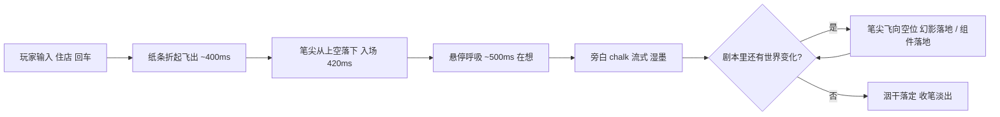

# AIRP 演出与交互设计（2026-09-10 重构）

画布物品 hover / 键盘聚焦保持本体清晰，不使用整物品或 Chalk 的亮度滤镜，避免缩放画布文字进入额外栅格化图层；保留层级提升、行动箭头与锚点高亮。若加入周围失焦，只能作用于未聚焦的兄弟物品，不能作用于画布父层。

背包改为深紫暖色、高对比文字的纵向列表，物品缩略图与名称分离；无图或加载失败时按物品类别显示轻量线性图标，详情沿用同一兜底。作家输入框 ↑/↓ 浏览本页最近 50 条手动提交的 RP 内容，回到底部恢复草稿，不自动发送，不收录内部 Prompt，输入法组词中不截获按键。

Agents 面板与行动入口展示实际模型、公开执行阶段、耗时；Chalk 落板与整轮完成分开。切换模型按世界存档保存，忙碌中禁止切换，不清空角色记忆。详《Agent模型选择与进度》。

循环媒体（2026-09-13）：已匹配的 Seedance 背景和透明人物接入所有对应模板与存档，覆盖及缺口见《动态素材接线》。特效开启才播放当前背景和打开的角色特写；小头像仍用透明静图。立绘 contain 保留完整轮廓，不可见或页面隐藏暂停；关闭特效卸载视频，错误回退静图。BGM 与静音视频独立。

背包交互补齐（2026-09-13）：点击背包物品打开完整 Markdown 与互动字段，可选择「放回当前场景」复用 `/api/move`；只在成功后关闭，遇到同名冲突时留在背包并显示错误。拖拽保留。

作家/角色实际接线（2026-09-13）：作家显示工作与停止状态；角色只渲染带本角色 ID 的真实增量/最终回复，不再随机代答。错误显式显示。数据路径与帧字段见《Agent前端接线》。

未写之门 Demo（2026-09-12）：信封/手机可用 `visual` 声明道具外形，门通过 target 进入空目录。查看外观与选择使用分离；choice 接受后自动派发作家。阅读对话框不撑大画布实体，图片缺失时显示 CSS 道具。具体范围见 doc-25。

> 由原 doc-11（作家通道设计）+ doc-13（角色对话遮罩）合并升级，并按 2026-09-10 架构调整重构。
> 定位：doc-05 §5（单轮管线）的交互层细化。doc-05 定义"叙事文本是唯一主角"，本文定义"主角怎么演出来"。
> 历史版本见 `archive/2026-09-10旧编号/`。

---

## 0. 设计总纲（2026-09-11 升级）

**叙事是灵魂，多模态（视听动）与实体交互是演出主力**。四句话：

1. **作家 chat history 不进画布，只有 chalk 落板**——作家在对话通道里的中间语言（"让我想想""好，让我更新场景"）是过程，画布上只有落成的正文 + 组件 + 选项。
2. **组件既是叙事细节，也是实体交互与以物解谜的承载者**——推进双轨驱动：日常靠 choice 选下一段，关键解谜靠玩家拖拽道具释放出示（`use_item_on`）。
3. **角色是被点开时才活过来的独立存在**——画布上是头像，遮罩里是**全套 6 情绪差分立绘**（normal/smile/shock/sad/angry/thinking，Prompt 句首标签显式驱动）；不做世界内复杂编排。
4. **全景声场造境**——环境白噪音（雨声/壁炉）+ 实体拟音（拖拽纸张/落木骰子/皮包扣锁）+ 悬疑配乐贯穿全程，视听合一。
5. **开场先交身份与动机，再用动作证明能动性**——世界内导言回答“我是谁 / 在哪里 / 为什么行动”，入口 Chalk 立刻给足反馈并把玩家送入主关卡；不把新玩家扔到空画布上自己猜。

---

## 1. 意象系统：四个媒介的分工

| 媒介 | 谁 | 表达什么 |
|---|---|---|
| **纸条** | 玩家的话 | 输入条上打字 → Enter → 一张小纸片从输入条折起飞出、斜上淡出——"话递出去了" |
| **红杆铅笔** | 作家的身体 | 笔尖即作家的精灵（Nodesign 的 agent 有精灵，AIRP 的作家是一支笔，不露脸）；悬停呼吸=在想（liveness），按压抖动=在写，收笔淡出=退场 |
| **板书（chalk）** | 作家的话 | 直接在画布上流式写出；写时湿墨（半透明草稿态），写完洇干落定；伴随微弱沙沙刮纸音 |
| **全景声场 (Audio)** | 世界的气息 | 环境底噪（风雨/火光）渲染舞台情绪；实体操作拟音（拖卡/收纳/开门/掷骰）给予极致手感 |

**作家呈现不砍**：红杆铅笔保留（作家是叙事主体，需要可见性）。角色精灵砍掉（角色不是常驻活动，特写在遮罩全套立绘呈现）。

---

## 1.5 世界入口：导言层与首个反馈节拍（doc-20 §2 的演出细化）

导言同时启动**行动 / 空间线**与**情感 / 剧情线**。它不规定必须出现三张纸，只规定身份、事件动机、门槛动作三种职责必须被完成。

首个交互节拍：

```text
世界气息先到（背景 / 环境声）
→ 身份与事件内容落定（信 / 记忆 / 委托 / 遗物）
→ 玩家打开、拿取或接受
→ 物件状态变化 + 拟音 + Chalk 立即承认
→ 地点卡 / 场景门获得可进入状态
→ 穿越到第一个交互场景
```

“反馈给够”必须覆盖五层：视觉变化、动作拟音、Chalk 回执、空间去向、持久事实。只有 hover、按钮变色或一句 toast 不算世界回应；至少有一个结果必须真实落盘，并能在之后被 Writer 或 Character Agent 读到。

**Chalk 边界**：导言的第一个可操作入口就是 `type: chalk`，不存在另一个 Chunk 类型或中间层。Chalk 可以被点开、展开和回应，并用 frontmatter 给出 RP / Choice / Dice 或移动机会；拿物和真正切层仍由 note/item 与 gate 执行，结果再回到 Chalk 中落定。

---

## 2. 单轮管线的呈现（doc-05 §5 的交互细化）

### 2.1 一次"住店"的完整时间轴



**回应是双轨的**——旁白 + 世界变化：

> 输入「住店」→
> 旁白：`（老周从柜台下摸出一把铜钥匙，搁在你面前。）` → **永久 chalk**
> 世界变化：老周身旁幻影落地一张「铜钥匙」物件卡（组件）；老周 bubble："二楼左手第叁间，水是热的。"

数据结构（canned 但接口按真实架构设计——doc-05 §5 的事件表+黑板）：

```js
{ match:/住|睡|房|歇/, layer:'inn', script:[
    {act:'chalk', text:'（老周从柜台下摸出一把铜钥匙……）', perm:true},
    {act:'thing', t:{type:'note', title:'铜钥匙', ...}},   // 幻影落地
    {act:'say',   who:'老周', line:'二楼左手第叁间，水是热的。'},
]}
```

编排器 `writerAct(script)` 逐步执行——它就是 `performLayer` 的交互版，同一个流式底座。

### 2.2 两种归宿：落定 vs 擦除

- **落定（perm）**：叙事旁白（钥匙、汤、传闻）——写完 push 进 `LAYERS`，永久。**数据先落，DOM 才是投影**（encore 板书重进即消失的教训）。
- **擦除（temp）**：引导提示（"门在大地图上，Esc 可以回去"）、系统回执——写完 ~8s 后淡出+右移几像素（像被手抹掉），不进 `LAYERS`。
- 世界的规则一以贯之：**改变世界的字留在大理石上，路标的字写在沙滩上**。

### 2.3 状态机与打断语义（一个布尔不背两件事）

```
idle ──纸条──▶ writing ──收笔──▶ idle
```

| 情境 | 语义 | 行为 |
|---|---|---|
| writing 中再按 Enter | **笔正忙着**（诚实，不排队不打断） | placeholder 变"作家正在写……"，输入无效 |
| 层演出中发纸条 | 玩家打断 Agent 是天然权利 | `cancelPerformance()` 快进收尾层演出，再处理纸条 |
| writing 中切层/进门 | 作家被掐断 | 整条撤回：**写了一半的旁白原地擦掉**（"没写完的戏不算数"），已落定的步骤保留 |
| transitioning 中 | — | 输入条禁用（opacity .5 + pointer-events none） |

### 2.4 视点感知：作家知道你在哪层

canned 脚本按 `当前层 + 关键词` 匹配——视点上报表的原型版：

- 在**大地图**发"住店" → `（临江旅店的门开着一半，先进去再说。）`（引导但不代操作）
- 在**旅店**发"住店" → 住店剧情全幕
- 在 **stub 层**发任何话 → **留言条**：作家把玩家的话记成一张真便签物件落地（`作家记下：「xxx」`）——stub 层也能被玩家的行为改变。

### 2.5 空位排座

作家的新旁白/新物件落在哪？自动排座纪律：**只给没有坐标的新物件排落脚点，已摆放的永不重排**。

原型简版：以"锚点"（相关物件或视口中心）为圆心，网格步进（96px）螺旋外扩，找到第一个不与任何现有 bounds 相交的座位。幻影座位=成品座位（座位过户纪律）。

### 2.6 通用互动 frontmatter 的渲染（choice / status / roll_dice）

**渲染方式：类 md 表格渲染，不是 HTML。** 三者可绑在任意落盘实体的 frontmatter 上，渲染在所属实体下方，可折叠；下面用 chalk 只是示例。

```
---
type: chalk
roll_dice:          # 骰子卡：玩家点击或 Agent 调用 → 引擎掷出 → 结果回写
  type: 1d100
  desc: 检定是否通过
  expect: ">50"       # 通过条件（引擎可读比较式，必须带引号）；不写 result
choice:
  - "先给公司起名"
  - "找王安波"
status:
  data:
    公司名称: "(未定名)"
    当前阶段: "车库期"
    时间: "1980-04"
    资金_万美元: 1.5
    技术进度: 3
    算力指数: 6
---
```

- **choice**：渲染为**选项卡片组**（行动卡）；玩家点击、作家调用或角色调用都进入统一 `choose` 动作；
- **status**：渲染为**折叠表格**（键值对），可展开/收起，随叙事走；
- **roll_dice**：渲染为**骰子卡**（doc-05 §3.1「骰子协议」）——作者只写 `type`/`desc`/`expect`，不写 `result`；玩家点击或 Agent 调用 `roll_dice` → 服务端真随机掷出 → 回写 `result / passed` → 广播同一套落定演出；
- 三者都可折叠——状态、选项和骰子绑定在一个具体实体上。Agent 侧由 `look_at` 以文本块格式化，见 doc-20 §3。

---

## 3. 角色对话遮罩（特写态）

日语迁移补充：角色显示名使用 manifest 可选 `characters[].name`，协议仍发送 `id`。日语世界载入时切日语 UI；旧遮罩尚未消费真实回复帧，日语模式只显示明确的接线未完成状态，不播放英文随机台词，也不把状态提示当人物回应。日文输入法组合期间 Enter 不发送。范围见《世界日语化迁移》。

### 3.0 概念重构：不是遮罩 vs 画布，是注意力光学

人跟人说话时，视野聚焦到对方，环境退为背景——这是注意力的生理结构，不是界面切换。

- 单击角色 = **凑近一个人说话**，画布失焦（不是消失）。
- 剧场对应物：**追光**（打在演员身上时，舞台没有消失）。
- 电影对应物：**特写**（全景/特写切换是基本语法，观众从不觉得"离开电影"——因为连续性没断）。

**判据**：遮罩做得对不对，就看玩家退出时是否"回到"画布——如果玩家的心智是"结束了另一个界面"，就失败了。

### 3.1 空间操作家族（人也是一扇门）

| 操作 | 对象 | 结果 | 运动语言 |
|---|---|---|---|
| 双击门卡 | 地方 | **换画布**（跨层，去另一个地方） | 锚点推进 → 门面 → 展开 |
| 单击角色头像 | 人 | **开遮罩**（同人层，凑近一个人，2026-09-11 起单击直进） | 锚点推进 → 压暗虚化 → 对话框升入 |
| Esc | — | 对称退回 | 退回你原来的位置/相机 |

门后面是另一个地方，人后面是一场对话——**AIRP 的两种深度用同一种运动语言（推进）表达**。

### 3.2 遮罩的解剖（2026-09-10 更新：立绘 + 角色 agent）

| 元素 | 2026-09-11 版本（doc-19 升级） |
|---|---|
| **角色呈现** | **左右分屏大半身立绘，带全套 6 情绪差分**（normal/smile/shock/sad/angry/thinking）；配合呼吸微动（scale 1.02 循环）；画布上仍为圆形头像 |
| **立绘驱动** | **Prompt 显式格式标签驱动**：角色 preset 约束句首输出 `[emo: <tag>]`，前端流式解析平滑切换表情并在台词中滤除标签，准确度 100% |
| **对话框** | 纸材质、信/便签同族（token 复用），框内是**角色的字** |
| **逐字流式** | **节奏=角色性格的主秀场**（老周慢半拍在遮罩里被放大感受——同一句话节奏天差地别） |
| **玩家输入** | 纸条通道内嵌（对话框底部一行输入）——对话形态=角色流式+玩家自由输入 |
| **选项** | 任意实体可带 `choice`；角色可在直聊中调用 `choose`，选项是快捷方式不是唯一通道 |
| **旁白** | 作家退场（导演不介入演员的戏）；必要旁白用**描述行**（对话框上沿斜体小字） |
| **属性栏/亲密度 UI** | 暂不做复杂 HUD，底层随 frontmatter，前台轻量呈现世界时间与天数 |
| **全脸眨眼/口型** | 先舍（全套 6 情绪差分立绘 + 呼吸动效已足够支撑丰富情绪张力） |

### 3.3 遮罩里的角色 agent（2026-09-10 定稿）

**角色是拿到"此刻这儿有什么文件"、能共同改写世界的独立 Agent**：

- **形态**：按需 spawn 的独立进程（懒灵魂——第一句话才启动），有自己的 preset 与目录；
- **知情方式**：**所有数据都在文件系统里，要看什么就直接读**——角色 spawn 时由 hook 拿到**本层文件清单 + 最近世界动态**（靠 event 表派生），然后自己 `look_at` / `read` / `bash`。**没有"场景简报"这种注入物，没有 state 快照、没有 knowledge——引擎只告诉它有哪些文件，不替它选内容**；
- **共同创作**：角色拥有完整文件工具和 AIRP 动作工具，可以写自己的小天地，也可以按剧情需要创造/修改世界内容、移动物件、选择组件动作、掷骰或移动自己；
- **生命周期**：进入遮罩 spawn，对话结束后回收。角色只在玩家直聊期间行动，暂不做后台自主活动与 `speak_to`；
- **无专用记忆工具**：现阶段不建设角色记忆系统；留下作品、信件或痕迹直接使用 `write / edit / chalk`，不提供 `remember / leave_trace`。

### 3.4 四条连续性（护住画布存在感的工程清单）

1. **视觉连续**：遮罩的底 = **画布本身压暗+虚化**（不是黑底不是独立背景图）。你能隐约看见炉火、便签、门——你仍然知道你在临江旅店，就在柜台前。
2. **运动连续**：进入=锚点推进（goEnter ①段同款数学，终点从门卡换成角色头像）；退出=对话框降下、压暗淡出、相机弹回单击前的状态（画布记忆原则）。
3. **空间连续**：对话框锚定在**角色立绘所在的位置**（立绘=头像的放大），不是屏幕中央凭空出现——你凑近的是"那里的他"。
4. **结构连续**：**对话的后果退场时由画布揭示**——对话期间世界没停（作家写板书、别的东西落地，透过压暗隐约可见），退出后玩家主动看一眼画布："桌上多了碗汤"。**对话改变画布**，遮罩反而是强调画布存在感的手段。

### 3.5 输入分工（2026-09-11 修正：单击角色直进单聊）

- **单击角色头像 = 直接进入单聊对话遮罩**（一场戏）——**没有"一句气泡搭话"这种中间态**，单击就是这个深度交互的全部；
- **双击门卡 / 场景卡 = 穿越换画布**（去另一个地方）；
- Esc = 对称退回。

角色"单击进对话"、门"双击进地方"——不再共用同一个击键。理由：**对话是高频主交互**（玩家随时想跟任何人说话，少一次击键等待），**穿越是一次有仪式感的动作**（保留双击确认感）。运动语言（锚点推进）仍同构——两种深度用同一种推进语法表达。

---

## 4. 角色小天地（角色根目录）

> 参考 `角色-yoshi.html`（Elias 的私人房间原型）：画作、笔记、世界经历卡、共同作品、生活痕迹——一个"持续存在的人"的空间。

### 4.1 定位

每个角色有自己的目录小天地——**`characters/<角色名>/` 根目录本身就是小天地**，不是额外子目录。玩家可以去看 ta 们自己的小天地，**留下一点私人痕迹**。小天地是"角色存在过的证据"，不是模板化的展示页。

### 4.2 三种写入情境（2026-09-10 定稿）

| 情境 | 可见性 | 机制 |
|---|---|---|
| **场景内单聊中顺手写** | 玩家**不可实时见**，但提示"角色留下了东西" | 角色在遮罩对话中顺手往自己根目录写（agent 能力），痕迹等玩家去小天地才揭晓 |
| **玩家进小天地，根目录为空时** | — | 引擎直唤 `nook-init` 完成第一眼初始化；角色进程不承担初始化（doc-11） |
| **玩家在小天地内与角色聊天** | **实时可见、可评论** | 角色在小天地里写，玩家实时看到，还能留下评论/评价——小天地是"活的" |

### 4.3 小天地里的物件（参考 Elias 原型）

| 物件 | 呈现 |
|---|---|
| 画作/作品 | 照片卡（艺术卡），点击可看详情（focus 弹窗） |
| 便签/笔记 | 手写便签，可展开全文/收折（历史风化：越旧越淡、可点击还原） |
| 世界经历卡 | 一段经历（"The Last Summer"），点击进入回忆演出 |
| 共同作品 | 玩家与角色共同留下的东西（"OURS, NOT MINE"） |
| 思绪连线 | SVG 手绘连线连接角色存在核心与各物件——"ta 的思绪" |
| 角色存在核心 | 头像 + 状态行（"currently rearranging a thought"）——轻量在场感，不做动画演出 |

**玩家留痕**：玩家可以在小天地里留便签（"write something for Elias…"），角色会回应（批注 + 可选"回声演出"）。

---

## 5. 右侧边栏（背包 + 角色，双 tab）

> 玩家小天地（`player/` 目录）与角色导航的前端呈现。**双 tab 都投影文件系统**：背包 = `player/` 目录列表，角色 = `characters/` 头像列表。与角色小天地（可进入逛的空间）不同——**侧边栏是常驻的列表预览**，资源管理器式。

### 5.0 布局（双 tab）

```
┌─────────────────────────────┬──────────────┐
│                             │  ▸ 背包  ▸角色 │
│                             │  ├─ 铜钥匙.md │
│       无限画布（场景）        │  ├─ 给老周的信│
│        物件卡 / 板书         │  └─ 布条.md   │
│                             │ （背包 tab =  │
│        [choice 选项槽]       │  player/ 目录）│
└─────────────────────────────┴──────────────┘
       切到「角色」tab →
┌─────────────────────────────┬──────────────┐
│                             │  ▸ 背包  ▸角色 │
│                             │  ◎ 老周 [聊][跟]│
│       无限画布（场景）        │  ◎ 小贩 [聊][跟]│
│        物件卡 / 板书         │  ◎ 旅店老板 [聊][跟]│
│                             │ （角色 tab =  │
│        [choice 选项槽]       │  characters/）│
└─────────────────────────────┴──────────────┘
```

- **背包 = `player/` 目录的实时列表**：新增/删除/重命名即反映在文件系统（路径即 id，无额外索引）；
- **角色 = `characters/` 目录扫描**：每个角色一行（头像 + 名字 + 动作按钮），在下文 §5.4 详述；
- 条目以纸片列表呈现，可展开看详情、可拖拽（背包条目）。

### 5.1 双向拖拽与以物解谜（移动 vs 交互）

| 方向 | 动作 | 结果 | 文件/事件操作 |
|---|---|---|---|
| **场景 → 背包** | 把场景物件卡拖到右侧背包 | **收藏/拿走**：物品从场景消失，落进 `player/` | `move(物品.md: 场景目录/ → player/)` |
| **背包 → 场景空白** | 把背包条目拖到画布空白处 | **放回**：物品作为掉落物重新出现在场景 | `move(物品.md: player/ → 场景目录/)` |
| **背包 → 场景目标（新）** | **把背包道具拖到门/卡片/NPC 上** | **以物解谜/出示（Use On）**：触发传统冒险解谜 | 派发 `player_used_item_on_target` 事件，触发开锁/审讯，驱动剧情演化 |

- **放回 vs 交互的分流**：
  - 若鼠标释放时落点与场景中某个实体卡片（门、锁、宝箱、角色头像）碰撞相交 -> 判定为 **以物解谜（`use_item_on`）**，不直接 move，而是由引擎派发交互事件通知作家和场景，并伴随开锁/出示拟音与动效；
  - 若落点在空白画布 -> 沿用移动语义，`worldStore.move()` 把文件放回场景，自动排座；
- **一律经引擎动作层**：拖拽移动走 `worldStore.move()`（自动重写引用与事件上报）；交互走事件表上报；
- **落点与碰撞反馈**：背包道具拖起时，悬停在合法解谜目标上会有高亮微吸附反馈（如门锁发微光），提示玩家“可出示/可使用”，极具传统冒险游戏趣味。

### 5.2 作家感知与叙事衔接

- 物品从场景消失/出现 → fs.watch 触发事件 → 作家**读过事件增量后**可叙事回应（"咦，那把钥匙不见了……"）；
- 收藏进背包的物品在背包里可点开阅读（详情是哪个世界来的、什么内容）；
- 与"拿走关键物品"的剧情天然咬合——玩家把剧情物品揣进背包，作家能感知并可据此推进。

### 5.3 与上帝模式的关系

上帝模式里玩家本来就能直接改文件；**背包只是把"文件搬移"变成了角色模式也能用的收藏动作**——角色模式拖进背包=拿走（符合扮演直觉），上帝模式拖文件=捏世界（符合造物直觉）。同一套文件操作，两种模式语义不同，不冲突。

### 5.4 角色 tab（导航 / 聊天 / 跟随）

**角色 tab = 世界角色头像列表**（`characters/` 目录扫描）。每个角色一行：头像 + 名字 + 两个动作按钮（聊天 / 跟随）。

| 能力 | 操作 | 结果 |
|---|---|---|
| **导航** | 点角色头像/名字 | 跳到该角色所在的场景：切层 + 相机定位到角色（穿越动画，见 doc-05 §3.2） |
| **聊天** | 点「聊」按钮 | 在角色当前所在场景与他进入**对话遮罩**（等价于画布上单击该角色头像，见 §3） |
| **跟随** | 点「跟」开关 | 开启/关闭"角色跟着玩家"：开启后玩家切换场景时，角色的**在场状态**同步到玩家所在层，画布上出现该角色头像 |

**跟随的语义**：
- 跟随是**运行时在场状态**（DB 状态层），不是文件搬移——角色目录（`characters/<名>/`）不移动，只是"此刻他在你身边"；
- 玩家可用角色 tab 开关；作家与直聊中的角色可调用 `set_following`；切换场景时系统把角色在场位置顺延到新层；
- 作家可感知跟随状态变化，叙事回应（"老周跟着你进了城……"）；
- 跟随与懒灵魂不冲突：跟随只是"在场"，被点击聊天时才 spawn agent；
- 跟随的角色在画布上就是普通头像（类光标+圆形头像），不额外做演出——它只是"在"。

**导航的边界**：角色"所在场景" = 它的在场状态（DB）；若角色当前未在场（没被安排在任何层），点导航提示"ta 此刻不在这里"，不硬造位置（懒加载：不在场就是不在场）。

---

## 6. 原型验证清单（下一步）

1. **单轮管线四阶段**：chalk 落正文 → edit 回写 frontmatter（status/choice/roll_dice）→ write/edit 演化物件 → 收敛。对照现在的"瞬间 pop"。
2. **frontmatter 渲染**：choice 选项卡片组 + status 折叠表格 + **roll_dice 骰子卡**（点击掷出 → 演出特效 → 结果回写 → 事件）——类 md 表格，非 HTML。
3. **遮罩进入动效**：锚点推进到角色 → 画布压暗虚化（CSS filter + transition）→ 纸对话框从底部升入 → 左右分屏大半身立绘放大呼吸。
4. **遮罩对话循环**：角色流式台词（慢节奏）→ 等输入 → 应答（canned 多轮：问汤/问房/问楼上那位常客）。
5. **退场揭示**：对话里答应住店 → Esc → 退出遮罩，钥匙便签在柜台落地（**money shot：这场对话改变了画布**）。
6. **角色小天地**：根目录初始化（为空时）、玩家留痕、角色实时回应（可评论）。
7. **背包拖拽**：场景卡拖进背包（物品从场景消失）→ 背包条目拖回场景（重新出现）→ 作家感知"钥匙不见了"并叙事回应。
8. **角色 tab**：点头像导航到角色场景（切层+定位）→ 点「聊」进入遮罩 → 点「跟」后切场景角色跟着来（画布上出现该角色头像）。
9. **节奏对比**：加一个快节奏角色（集市小贩）对照老周——同一句话节奏天差地别，节奏即性格。

---

## 7. 待定

1. 纸条飞出的意象要不要保留？（通道唯一的"发送仪式感"，成本 ~40 行；不要的话 Enter 即写。**推荐要**。）
2. temp chalk 擦除 8s 是否合适？
3. stub 层"留言条"要不要进这一批？（演示效果最强的一环，成本半天。**推荐要**。）
4. 遮罩内自由输入的兜底应答深度（原型 canned 三轮就够，真实架构靠角色进程）。
5. 对话中途 Esc 的会话保存边界（依赖 pi-rp 会话机制；不扩展成 AIRP 角色记忆系统）。
6. 对话记录要不要物化（关键承诺落成画布上的字条——和"后果揭示"天然一体，原型可做一例）。
7. 多人对话遮罩（群聊）远期；画布上围桌而谈 vs 遮罩内多人立绘，到时候再争。
8. 角色会写字吗？（角色写信用自己的手迹还是板书体？手迹=题材包/字体问题，先留给题材包。）
9. 背包要不要支持分类/搜索？（`player/` 下子目录即可，MVP 不做搜索。）
10. 背包 → 场景的"复制"语义要不要？（目前统一移动；某些场景物品可能需要"抄录一份"而不是拿走——留给题材包/扩展。）
11. 角色跟随的边界：一个玩家最多跟几个角色？跟随时角色间互动要不要显示？（MVP：任意数量跟随，跟随只表在场，互动留给叙事。）
12. 角色 tab 的"不在场"态导航提示（"ta 此刻不在这里"）够不够？要不要显示角色最后出现的场景位置？（先只做提示，位置留待叙事感知。）
13. **骰子演出特效的节奏**（纸骰弹跳/旋转 → 落定的时长/帧/缓动，"展开本身就是内容"参照 doc-04 §6 登录墙节奏）——并入 **doc-09 #4**。

## 阅读与音效细化

普通文档在画布原位置展开为约 500px 纸片，保留倾角，不出现全屏遮罩；背包使用左下角小纸片。查看不触发剧情行动，点击标题、折回按钮、纸外或 Escape 收起。世界选择使用无背景遮罩的侧边纸面目录，仍按世界组织存档。交互音复用 Canvas 素材与音量，相同音效不重叠、迟到不补播。完整规则见 [阅读与音效优化](阅读与音效优化.md)。
