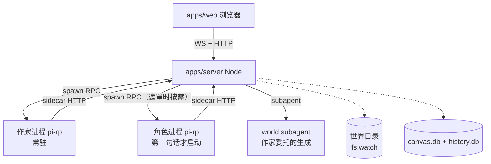

# AIRP 黑客松作战计划（2026-09-10 更新）

> 附属文档：doc-05-AIRP产品构想.md（设计共识）、doc-06-演出与交互设计.md（交互层）
> 编写日期：2026-08-31 | 更新：2026-09-10（配合架构调整：砍角色编排、组件降级、frontmatter 叙事协议）
> 前提：从空仓库开始（`git init` + vendor pi-rp 子模块），前端从零设计，Nodesign 只借思路不抄代码（AGPL-3.0）。
> 目标：**三天拿到一个能演示的产品闭环**，同时不把架构做歪——MVP 与远期设计（doc-05）保持同构，不做一次性脚手架。

---

## 0. 总策略：三道护城河

三天做不完 doc-05 的全部。砍法只认一条标准：**演示动线是否经过它**。三条护城河保护黑障期：

1. **演示动线护城河**（2026-09-11 评委导向升级）：黑客松版本围绕**“3分钟黄金动线”**展开——「音画沉浸开局 → 进场景对话 → **背包道具拖拽解谜（以物开锁/出示证物）+ 大号物理掷骰高潮** → **角色遮罩 6 情绪差分与小天地窥探** → **AI 工坊（Tool Pipeline）一键创生世界**」。角色遮罩从单静态图升级为 6 表情差分，交互从点选项升级为道具动手解谜。
2. **架构同构护城河**（砍范围不砍形状）：砍掉的东西必须"将来加回来不用重构"。判据：所有砍掉的功能，其文件结构和接口形状必须与 doc-05 §8 完全一致。世界目录结构、`preset.json` 形状、`world.json` schema 一步到位。
3. **风险前置护城河**（提前做风险大的，赛时做风险小的）：层级画布、角色 spawn、双 DB——三天内谁翻车都不好看，所以**全部进"提前准备"清单**（§4），赛前完成或验证过接法。

**2026-09-10 架构简化的红利**：砍掉世界内角色编排（pass_mic/handoff/call_character/黑板路由）后，编排层不再是关键路径——AIRP 的赛时复杂度集中在**作家单进程 + 画布渲染 + 叙事 frontmatter 渲染**。角色只做"被点开时 spawn 遮罩对话"，P0 演示主线不再依赖多进程对话。

---

## 1. 基础事实：pi-rp 已提供什么（我们不用写的）

> 来源：pi-rp README + multi-agent-infrastructure.md + shared-state-cross-process.md + rpc-types.ts 源码核查（2026-08-31）。
> 注意：pi-rp 的 plan/ 目录是"设计定稿但待实现"，与已实现功能不同级，采用前需逐项核源码。

| 能力 | 状态 | 对 AIRP 的意义 |
|---|---|---|
| RPC 模式（`pi --mode rpc`） | ✅ 已实现 | 作家/角色的宿主。prompt/abort/set_model/set_preset/set_thinking_level/get_state/get_session_stats 等全套命令 |
| 事件流（AgentSessionEvent） | ✅ 已实现 | message_update 流式、tool_execution_start/end、agent_settled——前端"舞台演出"的原始素材 |
| prompt preset 体系（13 slot + 宏） | ✅ 已实现 | 作家/角色的"大脑"（doc-05 §4.1/§4.2）。JSON 定义角色，`file` slot 引用身份/性格 md，`system` slot 引用平台统一隐形提示词 |
| subagent + delegatable preset | ✅ 已实现 | 作家委托 world subagent（doc-05 §4.3）。brief→生成→摘要回报的通道现成 |
| **opening 开场播种器** | ✅ 已实现（内建扩展，`/opening` + `PI_OPENING` env，session_start 自动应用 + skipIfSeeded 防重播；预设 = `<config-dir>/openings/<id>.json`） | 角色"出生记忆"的官方路径：开场知识落成**角色自己的会话条目**，跨续档持久。门一打开角色就知道自己是谁。**AIRP 直接用** |
| ~~orchestration RPC 对（pass_mic 通道）~~ | ~~✅ 已实现（pi-rp `fa0910fa8`）~~ | ~~跨进程递话筒~~ **AIRP 不再需要（2026-09-10）**：砍掉角色间通信与世界内编排。角色只和玩家在遮罩内对话 |
| **状态系统（StateManager / state_update / get_state / watch_state）** | ✅ 已实现 | **AIRP 明确不用**：pi-rp 的 state 与 AIRP 的 status 不是一回事。**2026-09-10 更进一步**：AIRP 的状态快照（status）= 叙事 frontmatter（`type: chalk` 的 `status.data`），作家直接 edit 写——不引入状态工具、不用 state 文件桥、**没有独立的状态文件/状态栏** |
| Extension API（registerTool/registerSlot/registerMacro/registerCommand） | ✅ 已实现 | AIRP 的一切平台工具（chalk/read_canvas/generate_image…）都从这里注册 |
| Provider 注册（registerProvider/registerNativeProvider） | ✅ 已实现 | 模型接入。registerProvider 的 model 定义是**原样 spread**（Nodesign 迁移文档防坑#14：input/cost/contextWindow/maxTokens 必须给全，否则 read.ts 会炸） |
| SQLite session 后端（entries 表 + project_id） | ✅ 已实现 | history.db 的底座。AIRP 的 worldId 即 pi-rp 的 projectId |
| `@earendil-works/pi-server`（packages/server） | ✅ 存在 | 多会话并发服务端组件。**不用**（学 wl：每会话一进程朴素拓扑足够） |
| 高并发优化（daemon/多会话/RequestGateway） | ❌ plan 中（Phase 0-2） | 黑客松用不上 |
| Knowledge base / memory 工具 | ❌ plan 中 | 黑客松不做，journal/角色 memory 目录即记忆 |

**结论**：pi-rp 给了"单 agent 进程"的全套成熟件；AIRP 要自己写的是**前端**（从零）+ **叙事 frontmatter 的渲染协议**（chalk 上 choice/status/roll_dice）+ **角色遮罩 spawn 的薄胶水**（把角色进程接到遮罩 UI 上）。

**开源许可注意**：pi-rp 是 MIT（upstream Pi 相同），vendor 进来无 AGPL 传染问题。Nodesign（AGPL-3.0）一个字不能抄，只借鉴设计思路（doc-01~04 分析文档已拆好）。

---

## 2. 三天排期（赛时 72 小时）

> 节奏：D1 只求"能跑通"，D2 求"能用"，D3 求"能看"。
> 每天收尾前一小时固定为**收束时间**：跑一遍完整演示动线，写下一处卡点，卡点优先级高于新功能。
> 原则：**作战状态不佳时守住已跑通的主线；状态好时才开新线**。演示动线跑不通的版本不能睡觉。

### D1：地基日（monorepo + 引擎骨架 + 画布底座）

**上午（主攻：明月）**
- [ ] 空仓库 `git init`，pnpm workspace monorepo（apps/web + apps/server + packages/shared）
- [ ] `git submodule add` pi-rp → `vendor/pi-rp`；跑通 `npm run build`
- [ ] 拉起脚本：`tools/scaffold.mjs`——从模板世界目录拷贝出玩家世界（"拷目录即开世界"是 doc-05 §8 的 UGC 生态设计）
- [ ] 世界模板 3 个（doc-05 §11：校园恋爱/魔法学院/克苏鲁各一）：`README.md` + `world.json` + `characters/` + `journal/` 骨架 + 初始场景目录。**模板内容质量 = 演示成败的一半**，赛前可在"提前准备"里把内容写好（§4.1 A1）
- [ ] 世界目录扫描器（worldStore 最薄版）：`readFile/writeFile/listFiles` + manifest 读写。**接口形状按 doc-05 §8.3 WorldStore 定死**，云端版 S3 只换实现不换接口

**下午（主攻：明月）**
- [ ] RPC 编排骨架（apps/server）：仿 Nodesign 迁移文档的七模块拆法（lifecycle/rpc-client/event-bridge/sidecar），但全部自己写。**spawn 参数照抄 Nodesign 已验证的坑位**：`--mode rpc --approve --system-prompt "" -e <扩展列表> --no-extensions --no-skills ...`
- [ ] **作家进程 P0 路径**：spawn 作家 → 玩家消息 → prompt → 流式回包 → 事件桥 → WS 推前端。跑通"玩家说一句话，作家用 chalk 写一段旁白（含 frontmatter）"即为 P0 达成
- [ ] 前端画布底座：单 transform 世界层 + 相机（平移/缩放/焦点保持）+ 点阵纸背景。**照 doc-02 §1 的思路重写**（离散缩放档、屏幕=世界+相机偏移×缩放、除以缩放转世界单位），不抄实现
- [ ] 前端渲染循环：fs.watch 场景目录 → 事件表记增量 → 渲染队列入队 → 节流上屏。chalk 卡片渲染（楷体、墨色、淡入）+ **frontmatter 渲染器（choice 选项卡组 / status 折叠表格 / roll_dice 结果）**

**D1 验收（睡眠线）**：玩家在对话框打一句话 → 作家进程回答并写一条 chalk（带 frontmatter）到场景目录 → 画布上淡入一条旁白 + 选项卡片组。**E2E 全链路（WS+RPC+文件投影）打通**。
**D1 尾部收束**：列卡点清单，评估明日计划可信度；连续两小时无进展的线立即冻结，转支援主线。

### D2：世界日（层级 + 交互 + 角色遮罩）

**上午**
- [ ] 层级画布：场景目录嵌套 → 层级导航（点场景卡进入下一层；面包屑+小地图）。单 transform 底座上叠加"当前层"概念（doc-02 §1.5：导航控件不是第二种视图）
- [ ] 上帝模式 P0：模式切换开关 → 冻结世界（toast 提示"世界已冻结"）→ 右键新增物件（写 md 文件）→ 作家现编理由。**只做"新增物件"一种手势**，编辑/删除/圈选留 D3
- [ ] 单轮管线补全：作家的 chalk → edit 回写 frontmatter（status/choice/roll_dice）→ write/edit 演化场景物件的完整流程跑通（doc-05 §5）
- [ ] 前端角色头像：场景内在场角色列表（从画布投影读）——**类光标 + 圆形头像**（不做精灵动画）

**下午**
- [ ] **角色遮罩对话 P0**：单击角色头像 → 遮罩特写（画布压暗虚化 + 左右分屏大半身立绘）→ spawn 角色进程（`--preset <角色id>` + 最近场景情况注入）→ 角色流式对话 → Esc 退出回收。「第一句话才 spawn」的懒灵魂验证
- [ ] 小球打开：README.md → 场景卡渲染（封面图+标题+摘要，材质随本层）；材质皮肤系统（material 词汇表，doc-04 §6 思路）
- [ ] 快照回滚 P0：会话结束/剧情节点 → 打包 `.airpworld.zip` 快照（node:child_process 调 zip 即可，别用库）
- [ ] 事件表前端可视化（可选，时间允许才做）：功能区"世界历史"面板

**D2 验收（睡眠线）**：完整叙事循环（玩家输入 → 作家 chalk + frontmatter → 选项 → 下一轮）+ 进层/出层 + 角色遮罩对话一轮 + 上帝模式新增一件物品并看到世界回应。
**D2 尾部收束**：同 D1。**若 D2 未达验收线，D3 计划自动降级**——砍掉演出层，把 D2 内容打磨到演示级（一场完整的"进酒馆→对话→拿走物品→写进 journal"的戏）。

### D3：演出日（体验层 + 稳定性 + 演示准备）

**上午**
- [ ] **演出层升级（doc-19）**：
  - 音频引擎挂载（Howler.js）：预置 3 个场景 ambient（雨/火/风）+ 1 首悬疑 BGM + 实体拟音（拖拽/开锁/背包/掷骰）；
  - 2.5D 视差纸雕空间：CSS 3D perspective (1200px) + Canvas 浮尘粒子浮层；
  - 大号物理掷骰：纯 CSS 3D Cube 翻滚动画组件 + 撞击拟音 + 金色大成功/猩红失败结算大标；
  - 作家写字 → 画布 chalk 直播 + 纸条意象 + 红杆铅笔 liveness
- [ ] **角色遮罩 6 表情差分**：遮罩立绘全套 6 情绪差分（normal/smile/shock/sad/angry/thinking），角色 Prompt 约束输出句首 `[emo: <tag>]` 标签，前端即时流式切图；呼吸动效
- [ ] **玩家背包（以物解谜）+ 角色 tab**：右侧边栏双 tab——除场景 ↔ 背包搬移外，**支持将背包道具拖到门/卡片/NPC 触发 `use_item_on` 解谜**（派发事件，作家即时叙事回应）；角色 tab 导航/聊天/跟随
- [ ] 上帝模式升维：包装为 **AI 游戏工坊（Tool Creation Pipeline）**，右键空白处一键并发生成 NPC/场景/道具卡片
- [ ] 角色小天地（窥探感）：根目录初始化、草稿划掉痕迹透光可见、玩家留言角色专属红墨水批注
- [ ] 稳定性：进程守护（崩溃重启，孤儿回收）、WS 断线重连、世界重载（世界状态恢复）
- [ ] **演示动线彩排**：按 doc-19 §7 的“3 分钟黄金动线”跑 3 遍。断网演练（无 API key 场景的 fallback 文案）+ 网络慢时 loading 态

**下午**
- [ ] 开场引导：模板选择 → 玩家角色卡创建 → 第一幕（作家开场白 + choice 选开局方式）→ 进入世界
- [ ] 视觉打磨：轻量世界时间印章（DM Mono 呈现天数与时间，不搞复杂 HUD）、字体分工（楷体=人写、等宽=机器，doc-04 思路）、空态/加载态文案
- [ ] 演示脚本写定：3 分钟动线（doc-19 §7）+ 30 秒电梯演讲 + 评委 Q&A 现场一键生成 NPC 预案

**D3 验收（演示线）**：按演示脚本完整走通，无阻断级 bug；断电重启后世界还在（文件即真相）。
**D3 尾部收束（赛前一小时）**：只修阻断级 bug，只改文案/视觉。**禁止任何架构改动**。

---

## 3. 生命周期、安全、演示细节

**进程拓扑（黑客松版）**：

- **进程拓扑守恒（2026-09-10 简化）**：作家/角色/子代理都是 `pi --mode rpc` 子进程，只是 preset 不同。作家常驻；**角色按需 spawn（进遮罩才起，出遮罩回收）**；子代理即时拉起。**不引入第二种宿主形态**，不写 daemon、不写多会话复用
- **世界目录 = 唯一真相**：文件写完才算发生；DB 只存布局/坐标/历史（"路径即 id"）。重启恢复 = 重扫目录 + 读 manifest；演示中当着评委面 `ls` 世界目录也是一张牌
- **密钥一律走 env**（Nodesign 防坑#1），`.pi/` 内禁止任何密钥
- **禁令清单**（对照 Nodesign 迁移文档附录 D）：禁止 SYSTEM.md/APPEND_SYSTEM.md（短路 preset 编译）；`--system-prompt ""` 必须传空串；setModel/setThinkingLevel 必须传 `persistSettings:false`；session-dir 是续档唯一事实源禁止清理；默认模型 fail-loud 不写死回退
- **演示保命三招**：① 本地大模型备胎（qwen 系）+ 录屏备份；② 演示前新建世界（干净状态），**不要在开发世界上演示**（历史包袱/奇奇怪怪的对话记忆）；③ 评委问答环节优先走"架构故事"（**叙事文本是唯一主角**、懒加载世界、文件即真相、角色懒灵魂）——这是产品最深的护城河故事，讲清楚比演示稳
- **MVP 边界外（赛时禁做）**：扩展市场、hub、UGC fork、云端版、多世界并行、快照回滚 UI（快照 P0 只做打点不做 UI，回滚是 CLI/内部命令）、**角色小天地完整版**（只做 init 演示）
- **测试纪律**：跑得动的就用 zellij/tmux 会话 + NODESIGN 式 `_probe-*.mjs` 风格的 gate 探针脚本守主线；赛时**不写单元测试**，探针守护"主线能跑"这一件事

---

## 3.5 角色遮罩对话的实现细节（D2 下午关键路径）

角色 preset.json 结构 doc-05 §4.1 已定稿。赛时关键在**遮罩 spawn 的协议**：

- **入口**：单击角色头像 → 前端开遮罩（画布压暗虚化 + 左右分屏立绘）→ 服务端 spawn 角色进程（`--mode rpc --approve --config-dir <世界目录> --preset <角色id> --settings-file <world>/.airpworld/settings.json --session <角色会话文件> -e <角色扩展>`，env 注入 `PI_OPENING` 开场播种）
- **上下文**：spawn 时注入**最近场景情况**（当前层目录里最近几条 chalk 摘要 + 玩家此刻视点）——角色"拿到最近场景情况但独立于作家"；角色想知道更多就自己 `read_canvas`
- **对话流**：角色消息流式渲染在遮罩对话框（节奏=角色性格参数）；玩家输入走纸条通道；结束（Esc/说完）→ 进程回收，会话存角色自己的会话文件（跨次遮罩连续）
- **输出归属**：角色的话**不进主聊天流**，只进遮罩 + 角色自己的 chalk 落盘（场景单聊时落场景目录，遮罩内落 `characters/<名>/` 根目录或场景目录按情境）
- **角色出生上下文 = 更薄（2026-09-10 定版）**：
  1. **opening 开场播种**（pi-rp 内建）：开场知识/初始记忆写成 `<config-dir>/openings/<角色id>.json`，spawn 时 `PI_OPENING` env 注入——跨续档持久；
  2. **preset 引用**：`--preset <角色id>` + file slot 引 identity/appearance/personality/memory（doc-05 §4.1）；
  3. **最近场景情况注入**：invoke 时给一段"此刻场景里发生了什么"的摘要（角色知道场景情况的唯一自动来源）。
  无 `--schema`/`--strict`（AIRP 无 state 门禁）；env 只加角色标记。
- **谈判型辅助**：roll_dice 是 frontmatter 字段（`type: chalk` 里声明），服务端真随机由渲染层执行；作家/角色都不需要独立工具。

**2026-09-10 删除项**：~~直聊路由（@前缀）~~（角色只通过遮罩对话）；~~pass_mic + handoff 移植~~；~~call_character 搭线~~；~~黑板旁听路由~~。这些是旧架构的编排机制，AIRP 不再需要。

**可提前准备（§4.1 A2/A2b/A4）**：角色 preset 骨架 + `system` slot 隐形提示词文本 + opening 开场播种预设 + 遮罩 UI 壳（纯静态可先画）——纯文本/纯资产，不依赖运行时。

---

## 3.7 上帝模式 MVP 的交互划手感（D2 下午）

上帝模式是 AIRP"双模玩家身份"的演示卖点，但也是最易翻车的交互。MVP 划法：

- **开关即冻结**：进入上帝模式自动冻结世界（toast: "世界已冻结——你改的东西不会惊动任何人"）。"不冻结才是真的上帝"留作赛后彩蛋
- **只做三个手势**：右键新增（菜单选 type：chalk/component/asset）、双击编辑（弹 md 编辑器）、长按删除（确认对话框）
- **改完即生效**：上帝模式的所有写操作直接落盘（文件即真相），不需要"应用"确认步（pending-changes 缓冲是 Nodesign 对"用户与 agent 抢写"的解法，AIRP 上帝模式是独占写场景，无需缓冲）
- **作家兜底现编**：上帝退出冻结时，把上帝增量事件推给作家——作家现编理由（"你新增的神秘旅人，作家已在编他的来历…"）。这是"agent 是叙事胶水"哲学的直接演示

**可提前准备（§4.1 纯函数类）**：手势语义表（纯规则）+ 冻结/解冻的状态机（纯函数）+ toast 文案库。

---

## 4. 可提前准备的清单（按价值排序，赛前完成）

> 原则：**只提前做"纯文本/纯函数/纯资产"的东西**——它们不依赖运行时，不会腐烂。
> 依赖运行时的（引擎 spawn、扩展骨架）只能"提前验证接法"，不能提前写死。

### 4.1 已完全确定（直接可做，零风险）

| # | 物料 | 产出物 | 说明 |
|---|---|---|---|
| A1 | **世界模板 ×3**（校园恋爱/魔法学院/克苏鲁） | 每个一整套目录：README + world.json + 3-4 个初始场景 + 2-3 个角色卡（identity/personality/relations md）+ journal 骨架 + 第一幕剧本（作家预设的开场演出） | **演示质量的 50%**。AI 写的世界模板容易"有设定没戏感"，需要明月亲自写第一幕。赛前一周开始 |
| A2 | **四个 preset 骨架** | `writer.json`（作家·主）/ `character.json`（角色）/ `scene-init.json`（场景初始化，`delegatable: true`）/ `nook-init.json`（小天地初始化，`delegatable: true`），后两者见 doc-11 | doc-05 §4.2 骨架已定稿，直接转成 pi-rp preset JSON。**格式铁律（2026-09-11 实测）**：① 顶层**没有 `system` 字段**，提示词一律进 `items`；② 不存在 `system` 这个 slot，平台隐形提示词用 `block` 写文本；③ `--preset` 只认 **id** 不认文件路径，且只扫 `<configDir>/prompt-presets/` 顶层。~~`world-subagent.json`~~ 与 `scene-init` 职责重叠，已合并删除（2026-09-11） |
| A2b | **平台统一的角色行为规则文本** | 怎么当角色/怎么说话/怎么行动/出戏纪律（doc-05 §4.1）。**当前直接写进 preset 的 `block`**，不为它注册自定义 slot | **无信息边界/守密内容**：AIRP 不做防备机制——角色知道什么 = preset 引用 + 最近场景情况注入 + 自己 read_canvas |
| A2c | **world.json manifest schema** | TypeScript 类型 + JSON schema + 校验函数（纯函数可单测） | doc-05 §8.4 定稿，直接转代码。zod 写完可以单测 |
| A2d | **前端渲染器映射表** | type→渲染器决策表（chalk/component/asset/readme/无 frontmatter）+ **chalk frontmatter 渲染器**（choice/status/roll_dice 的类 md 表格渲染） | doc-05 §7.4 + doc-06 §2.6 定稿。表格 + 分支逻辑，纯函数可单测 |
| A2e | **侧边栏 UI 壳（背包 + 角色双 tab）** | 右侧边栏组件：背包 tab（`player/` 目录列表 + 拖拽目标区）、角色 tab（`characters/` 头像列表 + 导航/聊天/跟随按钮，doc-06 §5） | 纯前端静态组件，先画好；拖拽落盘/跟随状态逻辑赛时接 fs/DB 事件。**演示卖点"收藏/拿出/跟随"，提前备壳** |
| A3 | **`scaffold` 脚本** | 模板→玩家世界拷贝脚本（含 manifest 注入玩家名/时间戳） | 纯 Node 脚本，不依赖服务器。赛前写好赛时直接用 |
| A3b | **布局/存档基础设施** | canvas.db 的 schema + 读写包装 | better-sqlite3 + "路径即 id"约束。**赛前写好 + 单测**，赛时直接 import |
| A4 | **opening 开场播种预设** | 每个角色一个 `<世界>/.airpworld/openings/<角色id>.json`：出生记忆/开场白/初始状态（user/assistant/customType 消息序列） | pi-rp 内建播种器（`/opening` + `PI_OPENING`）现成。**纯 JSON 资产，赛前写**——角色"记得开场时的事"全靠它，是叙事质感的一部分 |

### 4.2 需要验证后才能提前做（依赖 pi-rp 现状）

| # | 物料 | 验证什么 | 验证后能提前做什么 |
|---|---|---|---|
| B1 | vendored pi-rp 能力探针 | 源码已有 opening 播种 / RPC / event 能力（wl 生产在用）；赛前跑一次探针确认 dist 完整 | 确认后即可按 §3.5 写角色 spawn 胶水。**不再是关键路径（无 orchestration 依赖）** |
| ~~B2~~ | ~~state 文件桥~~ | 已定案：**不用**。AIRP 的世界状态 = 叙事 frontmatter + 文件 | 黑板的免轮询推送改走**事件表 + 下一轮注入**（doc-05 §5.1）——世界目录就是真相源，作家不读 diff |
| ~~B3~~ | ~~pi-server 包合用性~~ | 已定案：**不用**（学 wl）。直接 spawn 每会话一进程 + RpcClient | 不引入 pi-server |
| ~~B4~~ | ~~view_canvas 截图链路~~ | 已定案：**参赛不做**。作家"看"画布 = read_canvas 文本感知足够 | 从参赛范围彻底移除；远期再评估（需 playwright + 无头浏览器基建） |

### 4.3 现场级：赛时只能现场写（无法提前）

| # | 物料 | 为什么不能提前 |
|---|---|---|
| C1 | 前端画布底座（相机/手势/渲染循环） | 依赖运行时调试。思路已备（doc-02 §1），赛时照思路写 2-3 小时 |
| C2 | WS 事件桥 + 前端渲染管线 | 依赖后端事件形状定型 |
| C2b | 角色遮罩 spawn 胶水（spawn 参数可赛前写好，遮罩 UI 壳可先画，**进程路由实现不能**） | 进程生命周期依赖最终 spawn 验证结果 |
| C3 | 层级切换（穿越动画可降级为淡入淡出） | 依赖画布底座定型 |
| C3b | **世界重载/恢复流程** | 依赖最终事件表形状。**特别注意**：演示中重启进程后，journal 需要正确恢复（作家预设里注入 journal 摘要的宏） |
| C4 | 快照打点（zip 打包可以赛前写好，触发时机赛时定） | 触发时机依赖演示节奏 |

### 4.4 演示资产（赛前备好，赛时零成本使用）

| # | 物料 | 说明 |
|---|---|---|
| D1 | **录屏备份** | 完整动线 2 分钟录屏（最好含无网络 fallback 演示）。**赛前一天录制**，赛时网络炸了直接放 |
| D2 | 电梯演讲稿 | 30 秒版本：一句话定义（doc-05 §0）+ 三条哲学 + "文件即真相" |
| D2b | 架构故事板 | 一页图（§3 的 mermaid 图打印版）+ 拓扑讲解词。评委问答用——**重点讲"叙事文本是唯一主角"**：为什么砍掉角色编排、组件为什么降级、状态为什么收进 frontmatter |
| D3 | 备用模型配置 | 2 个 provider（如 gpt + qwen），一个炸了切另一个。**fail-loud 原则**：模型不可用时界面明确报错，绝不静默 |
| D3b | 世界模板的"演示脚本" | 每个模板的推荐玩法动线（第几步说什么、作家会怎么回）——演示者手册 |

### 4.5 提前准备总时间预算

| 类别 | 预估 | 备注 |
|---|---|---|
| A 类（纯文本/函数） | 9-13 小时 | 明月主导，秋青子辅助。可分散在赛前一周；**架构简化后少了 pass_mic/handoff 移植**（原 A5 删除），省出的时间投给 A2d frontmatter 渲染器 + A2e 背包 UI 壳 |
| B 类（验证后） | 1-2 小时验证 | 只剩 dist 能力探针。赛前验证完即清空 |
| D 类（演示资产） | 3-5 小时 | 赛前一天集中做 |

---

## 5. 团队分工建议（如有多人）

| 角色 | 职责 | 关键技能 |
|---|---|---|
| 引擎位 | RPC spawn、扩展注册、DB、快照 | Node.js、pi-rp（读迁移文档防坑清单） |
| 前端位 | 画布底座、渲染管线、frontmatter 渲染、遮罩 UI | Canvas/transform 数学、React |
| 内容位 | 世界模板、作家提示词、演示脚本 | 叙事写作（明月亲自） |
| 机动位 | 探针守护、演示彩排、bug 收割 | 全栈 + 沟通 |

单人作战的变通：内容位（A1/A2/D2b）提前一周由明月完成；赛时秋青子以 agent 形式当机动位（跑测试、写探针、修小 bug），明月专注引擎与前端的关键路径。**单人模式切忌单线程**：等 LLM 回包的间隙就是写前端/改模板的时间。

---

## 6. 风险登记册（赛时应对）

| 风险 | 概率 | 影响 | 应对 |
|---|---|---|---|
| vendored pi-rp 的 dist 缺 opening/RPC 能力 | 低 | 中 | 源码已实现、wl 生产在用；赛前探针确认，缺则重建 dist（pi-rp 侧一条命令） |
| 三天写不完层级画布 | 中 | 中 | 降级：D2 只做"进层/出层"两步导航（面包屑 + 场景卡点击），不做平滑过渡动画 |
| LLM 输出质量差（chalk 写成小说段落 / frontmatter 格式错） | 中 | 中 | 作家 preset 里写死板书纪律（一条 chalk ≤ 200 字 + frontmatter 注入在 Phase ② 的 edit 里）——**格式错由 Phase ② 的二次 edit 兜底，正文阶段不背格式责任**；彩排时微调 preset 文本 |
| 角色遮罩对话质量差（角色记不住场景） | 中 | 中 | 最近场景情况注入 + opening 播种双重保障；demo 只展示单轮遮罩对话（问汤/问房/问常客） |
| 模板内容平庸 | 低 | 高 | A1 赛前由明月亲自写第一幕，这是唯一不可外包的质量项 |
| 前端性能卡顿（对象多时） | 低 | 中 | 单 transform + 节流渲染已防住大头；赛时世界规模小（单场景 <30 物件），实际风险低 |
| 演示现场网络故障 | 低 | 高 | D1 录屏备份 + 本地模型备胎（qwen） |

---

## 7. 赛后第一周（避免黑客松版变技术债）

黑客松版本刻意砍掉的东西，赛后按此顺序偿还（每项都已在架构留位）：

1. 快照回滚 UI（P0 只有打点）
2. 事件表前端可视化（世界历史面板）
3. 角色小天地完整版（根目录初始化/实时可见可评论/三分情境写入）
4. 玩家背包完整版（分类/搜索/详情、背包→场景复制语义、与角色小天地互通）
5. 角色 tab 完整版（不在场提示、跟随边界/多人跟随、角色位置叙事感知）
6. 扩展注册组件（letter/chess 等 10-20 个官方组件，doc-05 §7.1）
7. 云端版 worldStore 实现（S3 + PostgreSQL，接口已定）
8. hub / UGC 分享（.airpworld.zip 分发）
9. 叙事 frontmatter 完整 schema 与折叠交互打磨（choice 多模态 / status 图表化）

其中 1-2 是"架构已就位、界面未开放"的直接偿还；3-9 是新功能开发，按产品节奏排期。**2026-09-10 删除：角色编排（call_character/pass_mic/黑板路由/节拍推演）已从架构移除，永不偿还。**
