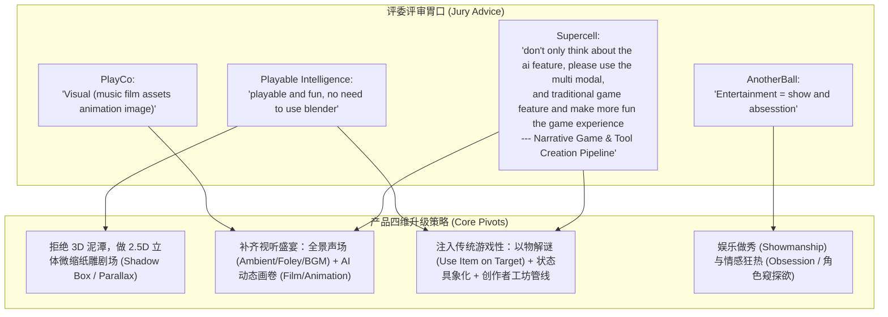
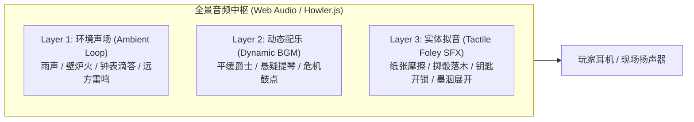

# doc-19 多模态与游戏性交互升级方案（黑客松必赢专项）

> 编写日期：2026-09-11 | 定位：产品与交互重大升级专题（面向黑客松评审）
> 关联文档：`doc-04-视觉设计风格.md`（视觉底座）、`doc-05-AIRP产品构想.md`（核心哲学纠偏）、`doc-06-演出与交互设计.md`（交互细化）、`doc-07-AIRP黑客松作战计划.md`（赛时排期衔接）

---

## 0. 战略重构总纲：从“文字打字机”走向“多模态互动剧场”

### 0.1 评委 Advice 深度解析与红线定性

黑客松评委给出的四条 Advice 不是客套，而是**四家顶级游戏与娱乐公司对 AI 产品落地形态的严厉定调**：



1. **Playable Intelligence**（*playable and fun, no need to use blender*）：
   - **红线：不碰 Blender / 重度 3D！** 72 小时内搞 3D 模型生成、骨骼绑定、Mesh 碰撞必死无疑。
   - **核心诉求：Playable & Fun**。产品必须是一个“真正好玩的游戏”，而不是一个给 AI 技术站台的概念打字机。
2. **PlayCo**（*Visual: music film assets animation image*）：
   - **感官大满贯**：多模态不仅是静态图片，更包括**音乐（Music）、动态影片微循环（Film）、动态动效（Animation）、精致资产（Assets）**。
3. **Supercell**（*don't only think about the ai feature... traditional game feature + Narrative Game + Tool Creation Pipeline*）：
   - **去 AI 虚荣心**：不要沉溺于 LLM 架构和复杂 Prompt；引入成熟经典的传统游戏机制（道具互动、状态对抗、目标悬念）。
   - **创作者管线**：把上帝模式包装为“所见即所得的 AI 游戏生产管线（Tool Creation Pipeline）”。
4. **AnotherBall**（*Entertainment = show and absesstion*）：
   - **娱乐的本质是“做秀（Show）”与“沉迷狂热（Obsession）”**：戏剧性的视听高潮（Spotlight、大反转、震撼 Money Shot）+ 让玩家产生情感依恋与窥探欲的角色设计。

### 0.2 核心哲学纠偏：重新定义“主角”

原 `doc-05` 确立的“*叙事文本是唯一主角，其余全为修饰*”在黑客松现场极度危险——这会导致界面退化成“贴了便签的 Notion 笔记”或“单向文字小说”，彻底丢掉游戏性与视听冲击。

> **新哲学定案**：
> **叙事是世界的灵魂，多模态（视听动）与实体交互（道具/骰子/空间）是游戏的肉体与玩法主力。**
> 文字不再独占舞台，文字是穿引视差画卷、环境音效、角色微动、物理道具碰撞的“总导演脚本”。

---

## 1. 视觉升级：2.5D 纸雕微缩立体剧场（Shadow Box & Parallax）

我们彻底放弃重度 3D 引擎，采用**基于 Web 标准（CSS 3D Transforms / Canvas Parallax）的“2.5D 纸雕立体剧场”**。

```
                       【玩家视线 Camera】
                              │
  ┌───────────────────────────▼───────────────────────────┐
  │ 1. 前景浮层 (z: 150px) - 粒子尘埃 / 雨丝 / 飘雾 / 舞台暗角 (Vignette)  │
  ├───────────────────────────────────────────────────────┤
  │ 2. 特写舞台 (z: 80px)  - 角色大半身立绘 (呼吸动效+表情差分) / 物理骰子 │
  ├───────────────────────────────────────────────────────┤
  │ 3. 实体交互层 (z: 20px) - 道具卡片 / 纸质便签 / 墨水连线 (带漫射投影)  │
  ├───────────────────────────────────────────────────────┤
  │ 4. 画布基座 (z: 0px)   - 奶油纸面网格 / 墨字旁白 (LXGW WenKai)        │
  ├───────────────────────────────────────────────────────┤
  │ 5. 背景远景 (z: -100px) - AI 动态微循环画卷 (3~5s 视频循环: 壁炉/风雨)  │
  └───────────────────────────────────────────────────────┘
```

### 1.1 分层视差景深（Parallax Depth of Field）
- **空间景深参数**：
  - 画布容器启用 `perspective: 1200px` 与 `transform-style: preserve-3d`；
  - 鼠标在视口移动或平移画布时，前景以 1.35x 速率反向位移，中景为 1.0x，远景背景图以 0.25x 移动，形成强烈的“微缩沙盘 / 纸雕剧场”空间层次；
  - 边缘加入物理光学暗角（Vignette）与可调节的光晕，让中央焦点有“微距摄影”的精致质感。

### 1.2 动态画卷（Film & Motion Assets）
- **拒绝静态死图**：
  - 场景 `README.md` 中引用的 `bg` 不再只是静态 PNG，支持 `bg: tavern_fireplace.mp4` 或带透明通道的微动循环；
  - 3~5 秒的无缝 AI 循环短视频（如壁炉火苗舔舐、窗外暴雨倾泻、酒保手中的摇酒壶、街角霓虹频闪）；
  - 极小体积（H.264/WebM 压缩至 1~2MB），以 `<video autoplay loop muted playsinline>` 铺底，大幅超越普通 2D 卡片背景。

### 1.3 氛围粒子系统（Ambient Particle Overlay）
- 前景铺设轻量 Canvas 粒子系统（全站性能消耗 < 2%）：
  - **室内场景**：微光尘埃浮动（Dust Motes）、蜡烛微粒；
  - **室外/恶劣场景**：暴雨划痕、飘雪、迷雾流淌；
  - 视差浮动在卡片之上，彻底打破“网页 DOM 卡片”的僵硬感，形成“空气感”。

---

## 2. 听觉体系：全景声场与交互拟音（Music & Foley）

> [!IMPORTANT]
> **声音是 PlayCo 明确点名的第一要素，也是用极低成本让演示沉浸感翻 5 倍的王牌。**
> 没有声音的互动游戏在评审现场会失去一半的生命力。

### 2.1 三层全景声架构



1. **环境白噪音（Layer 1：Ambient Soundscape）**：
   - 随场景层级切换自动交叉淡入淡出（Crossfade 1.5s），键取自该层 README 的 `ambient` 字段（世界级 `assets/audio/` 优先，平台池 `assets/audio/` 兜底）：
     - `world/大地图`：`rain`（清冷夜风 + 远街雨声）；
     - `world/旅馆`：`fireplace`（室内暖火噼啪）；
     - `world/旅馆/密室`：`cellar-drip`（潮湿水滴 + 幽闭空灵）。
2. **叙事配乐（Layer 2：Dynamic BGM）**：
   - 预制 3 首高情绪契合度短曲（日常悬疑 / 心理博弈 / 危机高潮），按当前层 README 的 `bgm` 字段（`calm` / `tense` / `crisis`）平滑切换音轨增益；角色台词句首的 `[emo: tag]` 只触发与主轨正交、播完即止的瞬时 stinger，绝不改 BGM 主轨。
3. **实体物理拟音（Layer 3：Tactile Foley）**：
   - 为玩家和作家的每一个动作配上高质感音效（键名 = `assets/audio/foley/<name>.mp3`，全小写 kebab）：
     - **拖拽卡片**：厚磅道林纸在木桌上的沙沙摩擦声（`paper-slide`）；
     - **卡片落定**：皮质卡包/收纳落定的顿响（`bag-pack`）；
     - **掷骰子**：实木骰子在绒布托盘剧烈翻滚撞击声（`dice-roll`）；
     - **检定成功 / 大失败**：明亮风铃和弦（`crit-chime`）vs 低沉断弦重音（`fumble-break`）；
     - **墨字落定**：细微的蘸水笔刮纸声（`pen-scratch`）；
     - **拖到目标上（用物）**：钥匙开锁咔哒声（`unlock`）；
     - **门卡过场**：门轴开启（`gate-open`，本批无调用点）；
     - **翻页**：纸页翻动（`page-turn`，本批无调用点）。

---

## 3. 游戏性与交互玩法升级（Playable & Traditional Game Features）

对标 Supercell 与 Playable Intelligence 的核心要求：**不当打字机，重拾经典冒险游戏的“动手操作乐趣”**。

```
┌────────────────────────────────────────────────────────────────────────┐
│                        【传统冒险游戏玩法回路】                                  │
│                                                                        │
│   ┌──────────────┐    拖拽出示 (Use On)    ┌──────────────┐            │
│   │ 玩家背包道具 │ ─────────────────────▶ │ 场景目标对象 │            │
│   │ [带血的怀表] │                        │  [旅店老板]  │            │
│   └──────────────┘                        └──────────────┘            │
│          ▲                                       │                     │
│          │ 获得关键线索                           ▼ 激起强烈反应       │
│   ┌──────────────┐     物理掷骰检定       ┌──────────────┐            │
│   │ 新场景开启   │ ◀───────────────────── │ 心理防线崩溃 │            │
│   │ [二楼隐秘夹层│    (大号3D骰子演出)    │ (立绘表情差分)│            │
│   └──────────────┘                        └──────────────┘            │
└────────────────────────────────────────────────────────────────────────┘
```

### 3.1 核心玩法 1：以物解谜与道具出示（Point-and-Click Physical Gameplay）

彻底颠覆“背包只能进出文件”的狭隘认知，把背包物品升维为**传统冒险游戏（Point-and-Click Adventure）的核心互动器**：

- **道具拖拽到场景（Use Item On Target）**：
  - 玩家按住背包里的【铜钥匙】，拖到场景中的【锁住的地窖门】上释放；
  - 前端判定“拖拽碰撞相交”，捕获并派发动作事件：
    ```json
    {
      "type": "player_action",
      "action": "use_item_on",
      "source": "player/铜钥匙.md",
      "target": "world/旅馆/地窖门.md"
    }
    ```
  - 引擎立即播放开锁动效与音效，作家接收到事件并触发剧情演化：门开启，生成通往地窖的新场景门卡。
- **道具出示与审讯（Present Evidence to Character）**：
  - 玩家将【沾血的手帕】从背包直接拖到【旅店老板】头像上；
  - 旅店老板触发受惊表情，进入紧急遮罩质问流程。
  - **Fun 的本质**：让玩家通过“尝试物理组合”来驱动剧情，而不是坐在那里被动阅读选项！

### 3.2 核心玩法 2：轻量世界状态与时间感知（无需夸张 HUD）

> **用户纠正定案（2026-09-11）**：暂时**不需要重度复杂的游戏 HUD**（不做夸张的理智罗盘、金币袋或警铃 UI）。未来的状态展示（Hub）也保持克制，核心只需呈现**“游戏的世界时间与天数”**（如“第 3 天 · 暴雨深夜 23:15”）。

- **状态形态轻量化**：底层状态完全保持 `doc-05` 的极简约定——收在实体通用 frontmatter 的 `status.data` 中（时间/天数/核心进展或组件状态），随所属实体自然流转；
- **前端感知界面**：无需常驻 MMORPG 式数值条，仅在顶部面包屑或场景边缘以一枚极简的**时间印章（DM Mono 字体）**呈现当前世界时间与天数；
- **状态推进即时间推进**：玩家探索与作家单轮写作带来剧本时间流逝，时间与天数的跳动即代表剧情阶段推进。

### 3.3 核心玩法 3：大号物理骰子与戏剧结算（The Dice Ceremony）

骰子检定不再是后台几行随机数和前台一个静止小卡片，而是**整场游戏最具戏剧张力的时刻**：

```
     【检定触发】
          │
          ▼
   [全屏轻微压暗 40%]
   [悬念滚奏音效响起]
          │
          ▼
  ┌─────────────────┐
  │  大号 2.5D 骰子  │ ──▶ 伴随物理惯性急速旋转、碰撞台面反弹
  │  (木质/象牙微光)│
  └─────────────────┘
          │
          ▼
     【落定判定】
    ┌───────────────────────┬───────────────────────┐
    │  大成功 (Critical!)   │   大失败 (Fumble!)    │
    ├───────────────────────┼───────────────────────┤
    │ 金色光芒爆裂 + 华丽和弦│ 猩红裂痕 + 破碎音效   │
    │ 作家：绝处逢生的奇迹  │ 作家：不可挽回的灾难  │
    └───────────────────────┴───────────────────────┘
```

- **操作参与感**：玩家亲自点击并“按住蓄力”释放骰子，蓄力条伴随声效升高，释放时掷出；
- **回写与叙事承接**：不仅回写 frontmatter 的 `result`，同时触发全屏震颤与结算标识，随后第一人称旁白以湿墨疾书展开。

---

## 4. 娱乐做秀与情感狂热（Show & Obsession，AnotherBall 专项）

### 4.1 舞台秀感（Showmanship）：制造 Money Shot

在 3 分钟的黑客松演示中，评委的注意力曲线只有前 90 秒。必须设计具有剧场冲击力的**高潮时刻（Money Shot）**：

1. **戏剧追光（Dramatic Spotlight）**：
   - 关键证物发现或角色自爆身份时，全画布（除目标卡片外）深度压暗至 15% 亮度；
   - 一束暖金色光束垂直打在卡片上，周围扬起细碎微尘粒子，背景 BGM 瞬切为单簧管悬疑独奏；
2. **全景线索风暴（The Evidence Network Burst）**：
   - 当玩家拼凑出关键真相时，伴随一声沉重钟鸣，画布以玩家为中心，**数十条红色丝线（Relationship Links）从各个卡片瞬间延展串联、刺向真相卡片**；
   - 评委在屏幕上直接看到“破案瞬间的大脑风暴网”，视觉震撼拉满。

### 4.2 情感沉迷（Obsession）：角色小天地（Nook）作为窥探之境

AnotherBall 强调的“Obsession”，本质是玩家对角色产生的情感依恋、好奇与占有欲。

- **小天地的“私密窥探感”**：
  - 玩家点击角色头像旁的【私密空间】，进入角色的小天地（如 Elias 的画室、林晚的工作室）；
  - 这里不是冷冰冰的文档，而是角色的私人房间：
    - **带涂抹痕迹的草稿**：被黑笔反复划掉的句子（鼠标悬停可透光看清原文：“我其实从没相信过……”）；
    - **私人照片与未寄出的信**：泛黄的照片、盖着火漆却撕开一角的信封；
    - **玩家留言板**：玩家留下一张手写便签，角色在数秒后用专属红墨水在便签边缘写下一句耳语般的批注（Marginalia）并附带签名。
- **角色立绘的生命力（全套六表情差分 + Prompt 标签驱动）**：
  - **全套六表情差分（6-Expression Differential Set）**：遮罩特写中，角色拥有完整的 6 套经典情绪差分图：
    1. `normal`（平静/日常）
    2. `smile`（微笑/亲切/欣喜）
    3. `shock`（震惊/动摇/意外）
    4. `sad`（悲伤/低落/愧疚）
    5. `angry`（愤怒/严肃/戒备）
    6. `thinking`（思索/沉吟/心虚）
  - **驱动机制：Prompt 显式格式约束（非关键词匹配）**：
    - 坚决不用脆弱的后处理剧情关键词猜测，而是在角色 `preset.json` 的隐形提示词中定死输出格式规范：
      > *“你在输出每句台词时，必须在句首附带情绪标签，格式形如 `【emo: shock】` 或 `[emo: smile]`。”*
    - 前端遮罩在逐字流式渲染时，即时捕获首部 `[emo: <tag>]` 标签并平滑切换到对应的立绘切图，同时从用户可见台词中过滤该标签，保证 100% 精准的情绪-立绘咬合；
  - 配合立绘的缓慢呼吸微动（Scale 1.02 循环），角色的戏剧在场感瞬间立起。

---

## 5. 创作者管线：上帝模式升维为“AI 游戏工坊”（Tool Creation Pipeline）

对标 Supercell 明确强调的 **Tool Creation Pipeline**，把上帝模式从“极客写 Markdown”包装为“零门槛可视化游戏关卡生成器”：

```
┌────────────────────────────────────────────────────────┐
│             【AI 游戏创生工坊 (World Studio)】          │
│                                                        │
│  画布任意空白处 [右键] ──▶ 弹出创作者轮盘菜单 (Radial)    │
│                                ├── [生成新场景 (Gate)] │
│                                ├── [召唤 NPC (Buddy)]  │
│                                └── [埋设谜题 (Puzzle)] │
│                                                        │
│  输入自然语言指令："在巷尾加一个贩卖违禁药品的流浪猫"     │
│                          │                             │
│                          ▼ (AI 实时流水线并发 3.5s)    │
│  ┌──────────────────────────────────────────────────┐  │
│  │ 1. 实体卡片从地下破土升起 (Paper Forming 动效)    │  │
│  │ 2. AI 自动绘制像素/水彩质感角色头像卡面           │  │
│  │ 3. 自动生成角色 preset 与 identity 文件           │  │
│  │ 4. 自动连线到主场景，并向作家注入感知事件         │  │
│  └──────────────────────────────────────────────────┘  │
└────────────────────────────────────────────────────────┘
```

**演示价值**：
在评委 Q&A 环节，邀请评委随口提一个荒诞的角色或道具，主讲人现场右键输入，3 秒内多模态资产落地、逻辑自洽入戏。**这是向 Supercell 证明 Tool Creation Pipeline 商业与生产力价值的最强王炸。**

---

## 6. 黑客松 72 小时增量落地工程表

本升级方案**完全不需要重写现有底层架构**（`worldStore`、单轮管线、pi-rp RPC、frontmatter 协议全部保留），只在表现层与动作派发层做低成本高回报的挂载：

| 模块 | 升级项 | 具体实现手段（极速落地） | 耗时预估 | 优先级 |
|---|---|---|---|---|
| **音频引擎** | 全景声场挂载 | 引入轻量单文件音频管理模块（Howler.js），预置 3 个场景 ambient、1 首主 BGM、8 个短 foley 音效 | 2.5 小时 | **P0 (必做)** |
| **视觉景深** | 2.5D 视差与粒子 | 画布根节点加 `perspective` 与鼠标视差平移；加一个 40 行的 Canvas 浮尘粒子背景层 | 2 小时 | **P0 (必做)** |
| **道具玩法** | 拖拽以物解谜 | 在背包列表项加 HTML5 Drag & Drop，画布对象加 drop 监听，匹配后触发 `player_action` 事件喂给现有事件表 | 3 小时 | **P0 (必做)** |
| **大号掷骰** | 3D 物理骰子演出 | 纯 CSS 3D Cube 翻滚动画组件，点击触发 1.2s 旋转 + 骰子撞击拟音 + 结算金色大标 | 2 小时 | **P0 (必做)** |
| **角色活力** | 立绘全套差分 | 遮罩立绘加 CSS `breathe` 缓动；预置全套 6 情绪差分 PNG（normal/smile/shock/sad/angry/thinking），角色 Prompt 输出句首 `[emo: <tag>]` 标签，前端流式捕获平滑切换 | 2 小时 | **P1 (高优)** |
| **动态背景** | 场景微循环画卷 | 准备 2 个场景的 3 秒无缝循环 WebM 视频（壁炉/落雨），在场景 README frontmatter 声明即生效 | 1 小时 | **P1 (高优)** |
| **工坊展示** | 上帝模式右键生成 | 封装现有 `subagent` 接口为一个快捷右键弹窗，一键生成带有立绘占位和预设的卡片 | 2.5 小时 | **P1 (高优)** |

---

## 7. 3 分钟评委必杀演示动线（The Golden 3-Minute Demo）

1. **0:00 - 0:30【沉浸开场·击中 PlayCo】**：
   - 戴上耳机/开启扬声器，屏幕呈现深邃暴雨与 221B Baker Street 窗外微动，舒缓大提琴与雨声环绕；
   - 纸条折起飞出，红杆铅笔入场，湿墨板书流式展开，伴随细微刮纸拟音。
2. **0:30 - 1:30【玩法高潮·击中 Playable & Supercell】**：
   - 玩家进入酒馆，不只是点选项，而是**将背包里的【生锈铜钥匙】拖向吧台后面的铁箱**；
   - 咔哒一声脆响，铁箱展开，爆出【染血的怀表】与【暗号便签】；
   - 触发调查检定：全屏压暗，中央大号象牙骰子翻滚掷出，伴随清脆撞击声，弹出金色【CRITICAL SUCCESS】，全场情绪被点燃。
3. **1:30 - 2:15【情感沉迷·击中 AnotherBall】**：
   - 顺势点开老周头像，进入单聊遮罩，老周大半身立绘呼吸微动，眼神变幻；
   - 点进老周的【私人小天地】，看到老周私密日记中被划掉的忏悔，窥探欲得到极大满足。
4. **2:15 - 3:00【创作者管线·收割 Supercell & 投资人】**：
   - 切换上帝模式：“如果玩家想当创作者呢？”
   - 右键空白处输入：“在酒馆屋檐上安排一只会占卜的机械黑鸦”；
   - 3 秒内，机械黑鸦卡片、立绘、预设剧本破土而生，连线自动咬合，全场收工！
