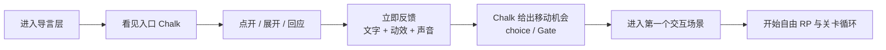
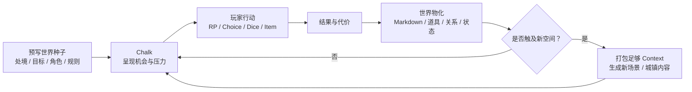
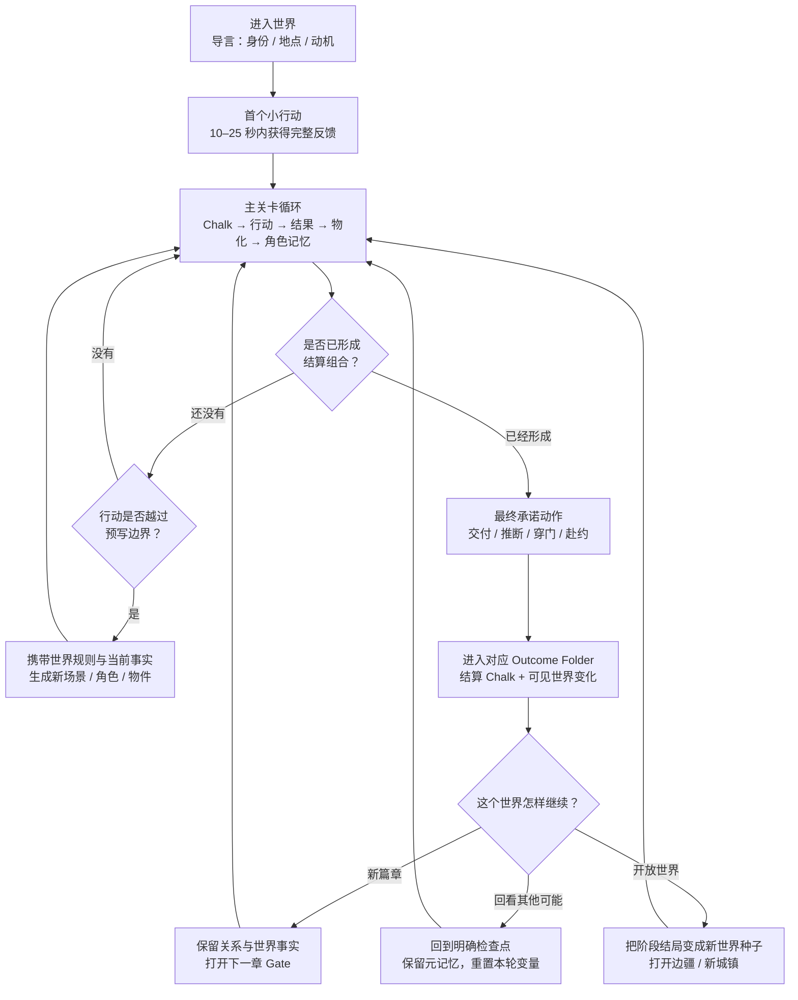

# doc-20 四世界可玩剧本与生成式关卡设计（讨论稿）

> 状态：**共同讨论中（2026-09-11 建立，2026-09-12 纠偏）**。本文只负责四个世界的可玩剧本、关卡结构与动态生长设计；未标记“已定案”的内容都可以在讨论中推翻。
> 关联：`doc-05-AIRP产品构想.md`（产品真相源）、`doc-06-演出与交互设计.md`（反馈与心流）、`doc-07-AIRP黑客松作战计划.md`（分工与里程碑）、`doc-10-组件协议与官方组件清单.md`（实体类型边界）、`doc-11-场景与小天地初始化协议.md`（新地点生成）、`doc-14-上帝模式设计.md`（设计者能力）、`doc-15-世界模板规范与开局引导.md`（模板格式）、`doc-19-多模态与游戏性交互升级.md`（视听动与玩法）。

---

## 0. 本文解决什么

现阶段要解决的是：**怎样把四个世界分别设计、Mock 并打磨成真正可游玩的剧本与关卡，同时用它们证明 AIRP 的游玩模式与上帝模式为什么成立。**

四个世界不是底座的换皮测试，也不是为了证明工程复用。它们本身就是黑客松体验的主体：每一个都要有被认真设计过的开局、目标、角色、物件、关卡、高潮与阶段结局；同时又不能在预写内容结束后变成死剧本，而要能沿着世界已有结构继续生长。

本文承担三件事：

1. 建立“导言 → 首次交互 → 主关卡 → 阶段结局 → 动态扩展”的通用体验语法；
2. 逐个完成四个世界的玩家身份、情感动机、关卡链、角色关系与生成边界；
3. 把四个 Mock 做成上帝之手的样板工程，展示设计者能把世界和关卡设计得多精彩。

本文会逐步承担四个世界的完整体验设计；但具体内容必须通过对话逐项定案，不一次性用未经讨论的设定填满。定案结果再分别落进模板、关卡内容、资产清单和对应文件。

---

## 1. 四世界体验设计原则

### 1.1 已确认的原则

- **体验先行**：不再继续发散第六个视觉原型；优先把四个世界做成有明确目标、关卡过程与阶段结局的完整 RP。
- **世界是主舞台**：无限画布承载地点、物件、叙事与关系；角色是世界里最强的情感入口，但不重新引入常驻角色编排。
- **Chalk 是游玩的执行脊柱**：它不只讲故事，还向玩家提供 RP、选择与骰子机会，承接行动结果，并驱动作家把结果物化成新的 Markdown、道具、角色、关系或场景。
- **多主题，不是换皮**：四个世界可以共享移动画布、进入场景、读 `chalk`、操作物件与角色交谈等语法，但必须分别拥有独特的关卡结构、内容魅力与世界生长方式。
- **多模态必须服务玩法**：图片、实时生图、BGM、TTS、特效和镜头不作为素材陈列，而要咬合到“进入、发现、使用、判定、回应”这些动作上。
- **预写结构与自由生长并存**：上帝之手设计世界规则、核心关卡和生成边界；游玩模式从这个头开始，通过 Chalk 持续推进、物化内容并扩展空间与时间。
- **开源方向不影响本次体验决策**：MIT / Apache-2.0 与商业化路径后置，本轮只守住可玩体验和可展示性。

---

## 2. 从导言到生成式关卡的完整闭环

### 2.1 零号层：玩家进入世界前，先完成身份与动机交接

在 A（世界活着）、B（角色认识我）、C（我能改变世界）成立之前，玩家必须先在极短时间内获得四个答案：

1. **我是谁**：我在这个世界里的身份、立场或与事件的关系；
2. **我在哪里**：眼前空间是什么，它此刻处于什么状态；
3. **我要做什么，为什么非做不可**：当前篇章的阶段目标与情感动机；
4. **我能造成什么影响**：不靠说明文字回答，而由第一次操作后的世界反馈直接证明。

前三个答案构成**导言（Prologue）**，第四个答案构成玩家进入心流的第一次正反馈。导言不是普通开场字幕，而是世界的第一个可交互层级：可以单独成为一个 folder，里面摆放三张纸、一卷 scroll、一个 HTML 组件，或由这些对象组成的开场空间。

导言必须承担三种信息职责，但**不要求固定为三个物体**。下表只是对现有协议的叙事组装，不新建“身份纸 / 事件纸 / 信物纸”的 schema：玩家身份与进度继续复用 `player/`、开场 chalk 与 journal（doc-05 §2.1 / §8，现有 `holmes-world` 模板），世界事件由开场 chalk / Chalk / journal 承载，信物与地点分别复用 note/item 和 Layer / Gate（doc-05 §3.1–§3.2）。“玩家身份的唯一字段”尚未定案，四世界试玩前不把它伪装成已有 schema。

| 导言职责 | 回答的问题 | 现有真相源 | 可见载体 |
|---|---|---|---|
| **身份交接** | 我是谁，我与谁有关 | `player/README.md` + 导言层的开场 chalk | 身份卡、旧照片、任命书、角色对我的称呼 |
| **事件动机** | 发生了什么，我为什么要行动 | 导言层的开场 chalk + Chalk + journal | 委托信、噩耗、事故记录、未兑现的约定 |
| **门槛与信物** | 我要去哪里，第一步是什么 | note/item + 目录派生的 Layer / Gate | 邀请函、地点卡、钥匙、车票、怀表、地图碎片 |

这三种职责可以由三张纸分别承载，也可以合并进一封信、一卷 scroll、一个 HTML 演出或“演出 + 信物”的组合。玩家不必被强迫按顺序读三段教程；但最后一个动作必须自然地产生“应接邀请 / 进入地点 / 回到过去 / 赴约”等**跨过门槛**的行为，把玩家送入主关卡。

### 2.2 两条同时推进的体验线

第一段体验不是单线任务流，而是两条线咬在一起：

| 体验线 | 玩家正在感受什么 | 设计职责 |
|---|---|---|
| **行动 / 空间线** | 我看见一段 Chalk → 点开 / 展开 / 回应 → 移动到交互场景 → 世界立即反馈 | 用 Chalk、空间、物件和动效建立操作心流；第一次反馈必须给够 |
| **情感 / 剧情线** | 我是谁 → 我为什么在这里 → 谁需要我 → 我若不行动会失去什么 → 我的行动改变了谁 | 用导言、角色委托、遗憾或承诺建立动机，避免玩家只是在试 UI |

两条线不能先后分开做。理想情况是**同一段 Chalk 同时推动两条线**：例如 Watson 的信以 Chalk 形态展开，既能被玩家打开和接受，也给出玩家愿意进入案件的情感理由；时间线世界里的 Chalk 则把遗物、遗憾与第一次穿越咬成同一个行动。

### 2.3 第一小段操作：让玩家进入反馈心流

玩家完成导言后，不应立刻面对大地图和一堆自由输入。先给一段很小、行动很确定的入口 Chalk：

这里“反馈给够”的最低标准是：

- **视觉上**：被点击对象发生明确状态变化，或新的实体 / 路径出现；
- **声音上**：打开、拿取、接受或移动有对应拟音和氛围变化；
- **叙事上**：Chalk 立即承认玩家做了什么，并把下一步说清楚；
- **空间上**：玩家获得一个能点击进入的明确目的地，而不是继续停在原地读字；
- **持久性上**：信物、承诺、任务或已读事实真实留下，之后能被角色和世界引用。

### 2.4 设计初衷一：游玩模式让世界从一个“头”长成完整内容

玩家拿到的不是一叠等待阅读的设定，而是一个**已经被设计好、同时能够继续生长的世界结构**。它必须先给玩家足够精彩的第一段内容，再允许玩家通过 RP 与行动把世界推向设计者没有逐字写死的方向。

一条完整游玩链应当是：

这里的“完整”包含两层：

1. **当前篇章能打完**：玩家可以从开局走到阶段高潮与结算，不依赖临场人员补设定；
2. **世界不会打完即死**：结算后仍保留新的地点、角色关系、物件用途或冲突，可以继续生成下一篇章。

### 2.5 设计初衷二：上帝模式展示“能设计出多精彩的关卡”

上帝模式不是附带的 Markdown 编辑器，而是设计者对世界进行**关卡编排**的创作模式。设计者可以预埋地点、角色、线索、物件、门槛、骰子机会、关系与生成约束；结构设计得越有层次，游玩模式中可产生的内容就越精彩。

因此四个 Mock 世界承担双重职责：

- 对玩家，它们是四个真的能玩的剧本与关卡；
- 对设计者，它们是四份“上帝之手能做到什么”的样板工程。

它们不只展示四种美术题材，还要分别展示四种关卡设计能力：空间探索、证据推理、时间因果与关系抉择。

### 2.6 A + B + C：每个世界都必须同时兑现的三层承诺

| 承诺 | 玩家必须感受到什么 | 系统用什么证明 |
|---|---|---|
| **A. 世界真的活着** | 我的行动之后，世界不只是回一句话，而是发生持续可见的变化 | Chalk 承接结果；新 Markdown、实体、关系、状态或场景真实落盘；需要探索时世界继续扩展 |
| **B. 角色真的认识我** | 角色记得我是谁、我们共同经历过什么，也会因这些事实改变反应 | 角色读取持久化记忆、场景事实、物件与承诺；Character Agent 的回应反映历史而非通用台词 |
| **C. 我能改变和创造世界** | 我在游玩模式中的 RP 与行动能改写世界；我在上帝模式中能直接设计更复杂的内容 | 玩家行动驱动世界差异；上帝之手编辑 / 生成关卡结构，并能立刻进入游玩验证 |

三者不是演示中的三个孤立功能，而应该在同一条因果链里出现：**玩家做出行动（C）→ 世界物化变化（A）→ 角色记住并在之后回应（B）→ 玩家据此继续改变世界（C）。**

### 2.7 Folder、Chalk、实体与 Character 的体验分工

> **术语定案**：口述中曾被转写成 “Chunk” 的词实际是 **Chalk**。AIRP 不增加 Chunk 这个中间概念，也不增加 `type: chunk`。

| 单元 | 是什么 | 在体验里负责什么 |
|---|---|---|
| **Folder / Layer** | 一个地点、导言、角色小天地，或同一地点的某个时间版本 | 承载空间与层级；进入它就是移动到另一个可玩的场 |
| **Chalk** | Writer 写出的玩家可见叙事与 frontmatter 机会；导言中可被呈现为信、卷轴或其他世界内文件 | 定义处境、承认行动、给 RP / Choice / Dice 或移动机会、解释结果并推动世界物化 |
| **实体 / Gate** | note、item、letter、component、场景入口与时间切片 | 承接拿取、使用、查验和实际切层；它们由 Chalk 提及、解锁或生成，不取代 Chalk 的叙事主体地位 |
| **Character** | 在场头像、遮罩对话与持久记忆 | 把世界事实变成关系、请求、承诺、误解和情感后果 |

四者的基本咬合是：**Folder 中的 Chalk 向玩家给出机会 → 玩家回应 Chalk 或操作其所指向的实体 → Chalk 承认结果并改变世界 → Character 记住这次变化 → 新的 Chalk、实体或 Folder 出现。**

### 2.8 Chalk 的体验职责

Chalk 是玩家可见的叙事与行动脊柱，但不是一个包办所有数据的神对象。实际实体和场景仍由 Writer / 初始化流程写成文件。体验上，一条关键 Chalk 可以承担五种职责：

1. **定处境**：告诉玩家此刻发生什么、压力来自哪里；
2. **给机会**：提供自由 RP、`choice`、`roll_dice` 或物件使用机会；
3. **收结果**：解释成功、失败、代价和角色反应；
4. **做物化**：驱动 Writer 生成或修改 Markdown 与实体，让结果留在世界里；
5. **开边界**：当玩家探索预写内容之外的地点时，给生成器足够 Context，创建新城镇、场景与其中内容。

不是每一条 Chalk 都必须同时做五件事；但一条完整关卡链必须从“叙事机会”走到“世界物化”，不能只在文字里假装发生过。

### 2.9 世界包需要提供的三层结构（候选）

| 层 | 设计者预先提供什么 | 运行时怎样使用 |
|---|---|---|
| **关卡骨架** | 玩家身份、开局处境、当前目标、核心冲突、关键角色、门槛、阶段结局 | 保证第一篇章有节奏、有难度、能完整打完 |
| **生成语法** | 世界规则、地点类型、角色边界、物件用途、危险升级方式、文风与多模态风格 | 让 Writer / scene-init 在越过预写边界时生成“仍属于这个世界”的内容 |
| **持久事实** | 玩家行动、骰子结果、持有物、承诺、角色关系、已生成地点与 journal | 让世界持续变化，让角色真正认识玩家，让后续内容继承因果 |

自由拓展不等于没有设计。上帝之手设计的重点，正是给生成过程足够明确的**边界、素材和因果钩子**，让动态内容既意外又不散架。

### 2.10 四世界可玩性验收（候选）

建议每个 Mock 世界至少证明：

1. 一个能回答“我是谁 / 我在哪里 / 我要做什么 / 为什么”的导言层；
2. 一段回应非常明确、反馈足够强、能把玩家送入第一个场景的入口 Chalk；
3. 一条由多段 Chalk 串起、确实能打完的关卡链；
4. 至少一次 RP / Choice、一次骰子或风险判定、一次实体物件使用；
5. 玩家行动生成或改写至少一个真实 Markdown / 实体；
6. 一个角色在后续对话中明确记得前面发生的事；
7. 玩家触及预写边界后，系统带着世界 Context 生成一个新地点及其可玩内容；
8. 一个有高潮、有结果、同时能继续生长的阶段结局；
9. 在上帝模式里看得出这一整条关卡链如何被设计、修改并再次游玩。

共同验收不是让四个世界变成换皮。每个世界必须有一个其他世界不能替代的**主玩法动词**，并展示一种不同的关卡结构。

### 2.11 结局不是“最后一段文字”，而是可进入的结果空间

“世界能继续生长”不等于“这一局不需要结束”。需要把两个尺度拆开：

- **篇章结局**回答“我刚才做成了什么、付出了什么、谁因此改变”；每次 10–30 分钟体验必须抵达一次；
- **世界终局**回答“这个世界是否从此封闭”。只有部分题材需要，多数 AIRP 世界不必有唯一终局。

结局在画布上应表现为一个真正能进入的 **Outcome Folder / Layer**。它不是新增的文件类型，而是现有目录派生 Layer 的一种关卡用途。玩家跨过最终门槛之后，镜头进入对应结果 Folder；里面至少包含：

1. 一段承认玩家选择与代价的结算 Chalk；
2. 因玩家行动而改变的角色、物件、关系或场景；
3. 一份可被后续 Writer / Character Agent 读取的结局事实；
4. 一个明确的后续出口：继续世界、进入下一章、回到检查点或开始另一条可能性。

因此“多结局”不是最后弹出三个按钮，而是**不同的行动与事实组合，打开不同的最终 Gate，进入不同的结果 Folder**。结果 Folder 里的世界状态也必须不同，不能只换一段结局文案。

### 2.12 最终门槛：从“三个 thing”变成有意义的解题组合

玩家可以通过收集三个 thing、把它们交给某个角色或带到某扇门前打开结局；但最终门槛不能只检查 `inventory.length >= 3`。它检查的是一个**结算组合（resolution bundle）**：

| 组成 | 它证明什么 | 可能的可见载体 |
|---|---|---|
| **事实** | 玩家确实理解了世界里发生的事 | 证物、地图碎片、时间记录、被承认的记忆 |
| **行动** | 玩家已经为某条路线付出成本 | 使用过的钥匙、完成的判定、改写过的场景、错过的约定 |
| **关系 / 立场** | 玩家选择相信谁、保护谁或承担什么 | 角色证词、同行承诺、交付对象、持续关系事实 |

三者不要求永远各占一个文件，但必须在持久事实中可验证。最终 Gate 的开启还要满足四条纪律：

- **可预期**：玩家在前 5 分钟就能看见最终门槛或它的影子，知道自己正在靠近什么；
- **可解释**：未满足时明确提示还缺哪类事实，不靠隐藏数值猜门；
- **可挽回**：一次骰子失败改变成本、路线或结局质量，不把整局锁死；
- **需承诺**：满足条件只代表“可以结算”，玩家仍要作出一次不可误触的最终行动，例如交付证物、穿过时间门或赴约。

### 2.13 通用闭环：结局门与世界生长共用一条流程

这张图里只有两种合法的“无限”：一是玩家仍在主关卡循环里主动探索，二是阶段结局已经结算、再打开新的篇章。不能用不断生成支线来逃避高潮，也不能让玩家在没有结算的情况下无限游荡。

### 2.14 四种不同的结局语法

| 世界 | 结局尺度 | 最终门槛 | 结算后的动作 | 这个世界独有的证明 |
|---|---|---|---|---|
| **雾坞镇** | 有篇章结局，无强制世界终局 | 集齐开路所需事实、资源与同行关系，穿过边疆 Gate | 新地区成为下一章世界种子；原城镇保留变化 | 一个冒险可以打完，但世界地图继续向雾外生长 |
| **福尔摩斯** | 一宗案件有多个案件结局 | 把有效证据组合交给关键角色，并作出最终推断 / 指控 | 进入对应案件结果 Folder；可开新案件，或从案前检查点验证另一推断 | 玩家不是读出答案，而是用自己建立的证据链选择真相 |
| **时间线** | 多个互斥时间终局 | 带着时间锚穿过某条终局时间门，并接受该线代价 | 可留在该未来继续，也可回到锚点探索另一条线；保留跨线元记忆 | “结局”本身就是一条可居住、可比较的时间线 |
| **恋爱世界** | 一个篇章 / 季节有多个关系结局 | 在时间期限内兑现或违背承诺，并最终赴某个人 / 某个地点的约 | 进入关系后日谈；可继续下一学期，或从关键日期重玩其他可能 | 结局由共同经历和缺席痕迹组成，不由好感度按钮决定 |

### 2.15 首局时间刻度：从 5 秒到 30 分钟

下表是同一次首局体验的**累计检查点**，不是六种互相独立的游戏时长。`20–25 秒`是对口述时间点的收拢；真实试玩可以前后浮动，但每个节点的体验职责不能丢。

| 时间点 | 共同体验职责 | 雾坞镇 | 福尔摩斯 | 时间线 | 恋爱世界 |
|---|---|---|---|---|---|
| **0–5 秒** | 先让世界活着，并让玩家知道“我在这里” | 冷雾流动，镇门正在关闭 | Holmes avatar 在 221B；雨、火与信同时在场 | 悲剧后的房间仍残留失真与倒转声 | 黄昏校园、远处排练声与未读便签 |
| **5–10 秒** | 交代身份、眼前压力和唯一视觉焦点 | 外来者被困镇内；守门人催促 | Watson 直接称呼 Holmes；委托信可打开 | 玩家看见遗憾对象与唯一时间锚 | 两个约定在同一截止时间发生冲突 |
| **10–25 秒** | 完成第一个小动作，并给足五层反馈 | 拿起通行徽记，酒馆 Gate 亮起 | 接受信件，案发现场地址成为 Gate | 拿起遗物，三个时间 Folder 被唤醒 | 接受或暂缓一份约定，场景与角色立即回应 |
| **25 秒–5 分钟** | 进入第一个场景，获得首个事实 / 物件，并让角色认识这次行动 | 酒馆获得路线传闻与同行候选 | 现场获得第一件证物；Watson 回应 Holmes 的观察 | 改变过去一个小事实；现在首次重排 | 交付一件有意义的物品；角色记住承诺 |
| **5–10 分钟** | 完成 2–3 次核心循环，看见选择开始分叉 | 选择城门、钟楼或地窖路线并承担代价 | 证物、口供、地点形成可见证据链 | 对照两条现在，意识到修复也会伤害别人 | 时间推进，赴约与缺席在两处场景留下痕迹 |
| **10–30 分钟** | 形成结算组合，作出最终承诺，进入结果 Folder，并看见如何继续 | 穿过雾外门，完成本章并生成下一地区 | 交付证据并推断，进入一个案件结局 | 选择并进入一条终局时间线 | 赴最后的约，进入对应关系后日谈 |

30 分钟目标不是“把所有内容看完”，而是让玩家完整经历一次：**我理解目标 → 我采取行动 → 世界与角色记住 → 我抵达自己造成的结果 → 我知道还可以怎样继续。**

### 2.16 流程连通性检查

这套流程在结构上可连通，但四个风险必须在 Mock 试玩里逐项验证：

1. **开局断链**：导言说清故事，却没有明显可操作物；解决标准是 25 秒内必有一次真实状态变化和一个可进入 Gate。
2. **中段漂移**：自由 RP 不断生成内容，却不再靠近结局；解决标准是每个主循环至少新增、验证或推翻结算组合中的一项。
3. **门槛突兀**：玩家突然发现自己缺一个隐藏物品；解决标准是最终 Gate 提前可见，并以世界内语言展示事实 / 行动 / 关系三类准备度。
4. **结局断头**：播完结局文字便回到菜单，前面的世界变化失去意义；解决标准是结局必须进入 Outcome Folder，留下持久事实，并给出继续、下一章或检查点回看中的至少一个出口。

另外，每个可达状态必须至少保留一个明确行动；每个失败状态必须产生代价、替代路线或较差但成立的结局。只有玩家主动跨过最终承诺门槛后，某些分支才可以关闭。

最关键的约束是：**生成器可以横向扩展解法与内容，但不能在游玩途中擅自改写本篇章的结算条件。** 当前篇章的最终 Gate、允许到达的 Outcome Folder 和它们需要的事实类别由上帝之手预先设计；Writer 可以生成新的取证地点、替代物件或角色帮助，让玩家用不同路径补齐同一结算组合。否则每次扩展都可能再创造一个“还必须完成的新任务”，流程理论上永远无法收束。

---

## 3. 世界 A：雾坞镇——中世纪冒险

> 状态：**方向草案**；产品英文名与目录 id 待定。

### 3.1 一句话体验

玩家作为刚抵达雾中边陲镇的外来者，通过探索地点、使用随身物件和选择同行者，揭开一条会继续向镇外生长的中世纪冒险线。

### 3.2 体验支柱

| 维度 | 当前设计 |
|---|---|
| 玩家幻想 | 我不是读冒险小说，而是真的在陌生城镇里找路、结识同伴、处理危险 |
| 主玩法动词 | **探索 / 开路** |
| 画布优势 | 城镇广场 → 酒馆 → 钟楼 / 城门 / 地窖等空间逐层展开 |
| 角色抓手 | 向导或本地人对雾的态度，与玩家建立“是否值得信任”的关系 |
| 实体交互 | 火种、地图碎片、钥匙、徽记等物件打开不同路线 |
| 多模态记忆点 | 雾层视差、钟声 / 风声、暖火与冷雾的色温对撞 |

### 3.3 第一段完整 RP 骨架

1. 玩家被困在即将封闭的镇门内；
2. 在广场和酒馆获得两个互相矛盾的去向；
3. 拿到一个可被使用而非只被阅读的关键物件；
4. 与一个潜在同行者单聊，决定信任方式；
5. 用物件打开一条路线，并通过一次判定承担结果；
6. 雾后显出新的地点，完成阶段结算。

### 3.4 结局与继续生长

雾坞镇不设置“拯救世界后所有内容结束”的唯一终局，但第一章必须有真正的篇章结局。玩家集齐的三个关键 thing 分别证明：**我知道雾后有什么、我有能力穿过去、有人愿意与我同行或为我打开路**。三者形成结算组合后，边疆 Gate 开启。

玩家进入的不是字幕页，而是“雾外第一处营地”结果 Folder：镇门状态、同行角色、已经消耗或保留下来的物件都反映玩家这一章的选择。营地 Chalk 完成本章结算，同时把远方的新地点作为下一章种子。玩家可以继续探索，Writer 再依据地形、危险等级、同行关系与未解决承诺生成新区域。

因此它的节奏是：**城镇篇章结束 → 结算 → 世界边界向外移动**。无限扩展发生在结算之后，不能拿“还能继续探索”代替本章高潮。

### 3.5 待讨论

- 雾坞镇是偏温暖奇幻、黑暗奇幻，还是带克苏鲁气质的中世纪世界？
- 第一段的核心目标是“出镇”“救人”还是“查明雾的来源”？
- 当前 `templates/cthulhu` 应改造为雾坞镇，还是保留原模板另建新世界？

---

## 4. 世界 B：福尔摩斯 × 开膛手杰克变体——侦探推理

> 状态：**方向草案**；玩家身份已定案，其余案件与关卡内容继续对话收敛。以原创案件承载体验，既有 `templates/holmes-world` 可作为实现起点。

### 4.1 一句话体验

玩家在雾都连环案件中亲手收集、出示并连接证据；真相不是被作家朗读出来，而是在画布上的线索网络被玩家做出来。

### 4.2 体验支柱

| 维度 | 当前假设 |
|---|---|
| 玩家身份 | 玩家就是 **Sherlock Holmes 本人**；画布上有一个代表自己的 avatar |
| 玩家幻想 | 我亲自观察、行动和推断，而不是站在福尔摩斯旁边看他解题 |
| 主玩法动词 | **对证 / 推断** |
| 画布优势 | 地点画布承载现场，关系线把分散证物收束为可见推理 |
| 角色抓手 | Watson 认识并直接称呼 Holmes，提供情感与行动反馈；嫌疑人对 Holmes 出示的不同证物给出不同反应 |
| 实体交互 | 把照片、信件、钥匙、时间记录拖给地点或人物进行验证 |
| 多模态记忆点 | 雨夜、煤气灯、证据追光、红线在真相时刻集中爆发 |

这里的 avatar 是**玩家自我在世界中的可见化身与空间锚点**，不是一个独立 NPC，也不启动 Character Agent。它要让玩家一进入世界就知道“我在这里”，并让移动、进入场景和面对角色都有明确的“我从哪里行动”的原点。Watson 与其他角色读取的玩家身份则始终是 Sherlock Holmes，并把已发生的行动、推断与承诺记在这段关系上。

### 4.3 第一段完整 RP 骨架

1. **导言层**：玩家以 Holmes 的 avatar 出现在 221B 的工作桌前；环境已经在活动，Watson 留下的委托信与一个指向现场的地址 / 地点卡在桌上等待；
2. 玩家打开信；Watson 直接以 Holmes 称呼玩家，并交代为什么必须由他出手、若不行动会发生什么；
3. 玩家接受委托或拿起信物，地点卡变成可进入的 Gate，移动到第一个案发现场；
4. 一宗刚发生的案件给出明确倒计时，玩家在现场取得三件可操作证物；
5. 通过空间移动验证其中一件证物的来源，并向角色出示证物，获得矛盾口供；
6. 把两条证据建立关系并做一次高风险推断；
7. 锁定下一处地点或嫌疑人，同时揭示更大案件钩子。

### 4.4 结局与多种推断

福尔摩斯世界的一个案件应有多个稳定、可复现的案件结局。进入结局前，Holmes 至少要形成一组有效证据链：**一件物证 + 一份能被对证的口供 / 时间事实 + 一条由玩家明确作出的推断关系**。玩家把这组证据交给最终关键角色，或带到最终地点执行指控，才完成最终承诺。

不同组合打开不同 Outcome Folder，例如“救下下一名受害者但凶手逃脱”“抓住执行者却放走幕后者”“证据不足而错误指控”。这些不是简单的成功 / 失败评分：Watson、警方、嫌疑人与现场物件都要在结果 Folder 中呈现不同状态。一次失败的检定可以让证据变脏、时间更紧或角色不再合作，但不能让案件无路可走。

案件结算后有两个出口：**New Case** 保留 Holmes 与 Watson 的关系、个人笔记和已经建立的世界事实，进入下一宗案件；**Revisit the Case** 回到明确的案前检查点，只重置本案的分支变量，用于体验另一条推断。重置不得静默抹掉玩家整个世界。

### 4.5 待讨论

- Watson 为什么必须在此刻请 Holmes 出手？这件事与两人的共同经历有什么私人联系？
- “开膛手杰克变体”保留多少历史感，多少转为完全原创世界？
- 当前 `holmes-world` 的开放式“无预设凶手”是否适合短 demo，还是 demo 必须有稳定可复现的阶段真相？

---

## 5. 世界 C：时间线科幻——地点与时间共同展开

> 状态：**方向草案**；“命运石之门 / 鳌太线 / 回到未来”仅作为当前体验参照词，正式世界必须使用原创人物、设定与命名；“鳌太线”所指待确认。

### 5.1 一句话体验

玩家带着能跨时间保留的物件和记忆，在同一地点的不同时间版本间穿越；一次小改动会让画布上的人物、物件和关系发生肉眼可见的重排。

### 5.2 体验支柱

| 维度 | 当前假设 |
|---|---|
| 玩家幻想 | 我亲手改变过去，并回到现在承担一个没预料到的结果 |
| 主玩法动词 | **改写 / 对照** |
| 画布优势 | 空间层级之外增加时间分支；同一地点的多个版本可以被直观比较 |
| 角色抓手 | 某个角色在不同时间线记得不同版本的玩家，形成情感代价 |
| 实体交互 | 只有少数“时间锚”物件能跨线携带，用来制造或修复因果 |
| 多模态记忆点 | 磁带倒转、时钟失真、画布抖动后同一场景重新排座 |

### 5.3 第一段完整 RP 骨架

1. **导言层**：玩家先看见一场已经发生的悲剧，以及自己没能阻止它的遗憾；导言明确“我是谁 / 我失去了什么 / 我为什么必须改变它”；
2. 桌面上留下一个可拿取的信物或时间锚，以及一张指向关键地点的文档；
3. 玩家拿起信物并点击地点文档，进入该地点的主画布；
4. 同一地点的三个时间 Folder 作为三个可交互实体摆在桌面上，玩家选择其中一个时间切片进入；
5. 回到过去，在同一地点改变一个小事实；
6. 返回现在，看到角色关系和场景物件发生连锁变化；
7. 与唯一察觉异常的角色单聊；
8. 决定保留新时间线还是冒险修正，完成阶段结算。

### 5.4 结局即一条被选择的未来

时间线世界的多个结局不是普通分支文案，而是多个互斥的“终局时间 Folder”。玩家需要带着一个时间锚、一个自己改写过的关键事实，以及对某段关系代价的明确认知，才能穿过对应终局 Gate。穿门就是承诺：系统先展示将被保留与将被失去的事实，再让玩家确认进入。

结局之后，玩家可以留在这条未来继续 RP，让它成为新的现在；也可以从结果 Folder 使用时间锚回到分岔检查点，探索另一种未来。回溯只重置该分支之后的世界变量，玩家的跨线记忆、已经发现的时间锚与结局图鉴仍保留。这样，多结局既能被重复游玩，又不会把每次选择降格为“读完就读档”。

### 5.5 待讨论

- 时间应成为“第二个画布坐标轴”，还是被表现为普通的世界分支 / 历史栈？
- 当前方向：地点画布上可以同时看见三个时间 Folder / 实体，但玩家进入后一次只活在一个时间切片里；是否定案待讨论。
- 这是三个落地世界之一，还是最能展示 AIRP 远期潜力、但实现风险最高的第四备选？

---

## 6. 世界 D：白色相簿感的恋爱世界——关系与时间

> 状态：**方向草案**；“白色相簿”只描述情绪密度与关系结构，正式世界使用原创人物、剧情、音乐与美术；既有 `templates/school-romance` 可作为实现起点。

### 6.1 一句话体验

玩家在连续数日的校园生活中做出看似很小、却会被角色记住的选择；感情变化通过场景、私人空间和时间流逝慢慢显形。

### 6.2 体验支柱

| 维度 | 当前假设 |
|---|---|
| 玩家幻想 | 我与角色共同经历具体日常，而不是选择好感度答案 |
| 主玩法动词 | **靠近 / 错过** |
| 画布优势 | 同一校园地点在不同日期留下新的便签、礼物、照片和缺席痕迹 |
| 角色抓手 | Character Agent 记住私聊、承诺和玩家送出的物件；小天地承担未说出口的内容 |
| 实体交互 | 礼物、车票、乐谱、照片等物件既是行动，也是关系记忆 |
| 多模态记忆点 | 黄昏天台、季节光线变化、角色主题旋律、近距离 TTS 对话 |

### 6.3 第一段完整 RP 骨架

1. 玩家在放学后的固定期限前收到两个互相冲突的约定；
2. 探索校园并取得一件带有关系含义的物件；
3. 与其中一个角色单聊，作出承诺或保留；
4. 把物件交给角色或留在其小天地；
5. 时间推进到下一天，缺席的一方和场景发生变化；
6. 玩家看到选择的情感代价，并得到继续靠近或修复关系的钩子。

### 6.4 结局是关系的后日谈

恋爱世界以一个篇章或一个学期为结算尺度。最终 Gate 是一场必须亲自赴约或主动缺席的事件；能打开哪一处约会 / 告别 Folder，不由隐藏好感度决定，而由玩家是否兑现承诺、把什么物件交给谁、在关键冲突里站在哪里共同决定。

可能的 Outcome Folder 包括“共同登台后的夜路”“错过末班车后的站台”“选择独处的空教室”等。每个结果都要让角色引用双方真实经历，并把未被选择的一方、留在场景里的礼物或已经错过的时间呈现为可见后果。结局后可以继续到下一学期，让关系带着伤痕或承诺生长；也可以回到关键日期重玩另一种可能，但保留一本只供玩家查看的回忆册，承认这些经历曾经发生过。

### 6.5 待讨论

- 第一段是双角色张力，还是先用一个角色把连续性做深？
- “恋爱”的主要玩法是日程冲突、对话承诺、物件交换，还是三者组合？
- TTS / Voice Agent 是这个世界的 P0 体验，还是在文字连续性稳定后再接？

---

## 7. 四个设计与现有模板的关系

| 世界体验 | 现有模板 | 当前关系 |
|---|---|---|
| 雾坞镇 | `cthulhu` / `magic-academy` | 氛围或奇幻资产可借，但中世纪冒险主线尚未落位 |
| 福尔摩斯变体 | `holmes-world` | 最接近，可直接迭代 |
| 时间线科幻 | 暂无 | 需要新模板，且会挑战时间维度的产品表达 |
| 恋爱世界 | `school-romance` | 可直接迭代，但需要把静态校园变成关系随时间变化的玩法 |
| 魔法学院 | `magic-academy` | 当前不在四个候选体验里；是否保留为替补待决定 |

这意味着“四个设计”不能直接等同于“现有四个模板”，也不能用“四选三”提前取消其中一个。需要先明确四个世界分别怎样落在现有或新增模板上，再安排实现深度，避免目录 id、`world.json`、角色 home 和开场 chalk 文件一起反复迁移。

---

## 8. 下一轮讨论顺序

建议按下面顺序定案，每一步只回答一个会改变后续工作的核心问题：

1. **定“完整可玩世界”的交付形状**：每个世界需要多长的预写篇章、多少关卡节点，以及动态拓展必须现场证明到哪一步；
2. **定通用关卡结构**：确认 §2.9 的关卡骨架 / 生成语法 / 持久事实是否足以承载自由拓展；
3. **逐世界定关卡链**：分别确定玩家身份、阶段目标、阻力、关键角色、核心物件、Chalk 链、高潮与结局；
4. **逐世界定生成边界**：明确哪些内容必须由设计者写好，哪些允许 Writer 现编，越界时给什么 Context；
5. **做四份 Mock 并真实试玩**：从卡住、无聊或失控的位置反推世界结构和工具缺口；
6. **资产反推**：从四条可玩动线导出图片、BGM、TTS 与特效清单，不先生产无归属素材；
7. **最后处理 Tutorial 与 launcher**：用已经跑通的第一条关卡链教玩家，而不是另写一套教学游戏。

### 已确认：三层承诺缺一不可

> A. 这个世界真的在我面前活着；
> B. 这里的角色真的认识我；
> C. 我能亲手改变和创造这个世界。

这不是选择题。四个世界都必须通过同一条可玩因果链兑现 A + B + C，差别只在于各自使用什么关卡结构来证明。

### 已确认：统一导言职责，不统一载体数量

四个世界共享“身份 / 事件动机 / 门槛动作”的导言语法，但不共享三张纸的固定外形。福尔摩斯可以是一封以 Chalk 展开的 Watson 来信，并在接受后解锁地址 Gate；时间线可以是一段悲剧 Chalk 加遗物，恋爱世界可以是一份未兑现的约定，雾坞镇可以是身份凭证与进城门槛。

### 已确认：福尔摩斯世界里的“我是谁”

玩家是 **Sherlock Holmes 本人**，并有一个 avatar 代表自己。avatar 负责把第一人称身份落到画布空间里；它不是另一个角色，也不是让 Holmes 变成可被玩家对话的 Character Agent。Watson、嫌疑人与后续动态生成的角色都必须把玩家识别为 Holmes，并继承他们与 Holmes 已经发生的关系和共同事实。

### 下一项待确认：Watson 为什么必须在此刻请 Holmes 出手

> **第一封信里发生了什么，才会让 Holmes 在读完之后立刻跨过 221B 的门槛，进入第一个案发现场？**

这个钩子要同时确定第一章的情感动机、倒计时、不行动的代价、第一件信物与第一个 Gate；它会成为后续证物链、角色关系和阶段真相的共同起点。
