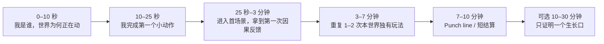
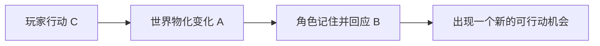
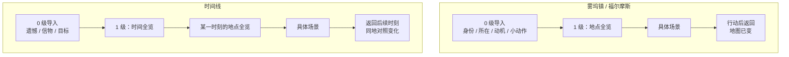
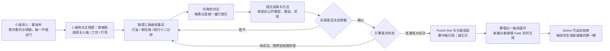
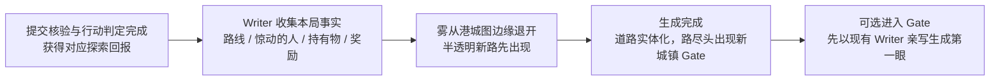
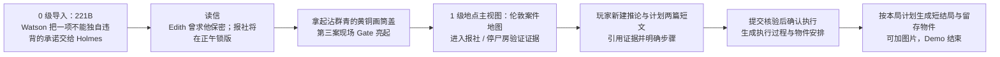
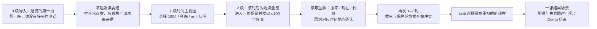
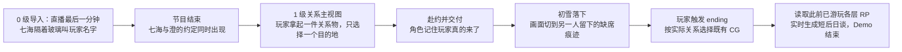
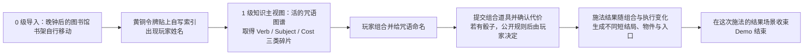

# doc-24 五世界可玩 Demo 体验设计（评审稿）

> 状态：**整体短闭环已获继续实施授权；未选定的细节仍保留候选（2026-09-13）**。初雪先落地，见《初雪短闭环与AI生长验收》。
> 设定参考：`worldlines-canvas/stack/worlds/*.json`；视觉参考：`worldlines-assets/worlds/*-demo/`。
> 本文先让团队看清整体体验逻辑与设计选项。未经讨论的剧情、结局、关卡和 CG 均是候选，不直接进入内容生产。

逐世界边界见 [六世界验收](六世界短闭环与AI生长验收.md)，四种 Chalk 形态与公平判定见 [Chalk 约定](Chalk玩法形态与判定约定.md)。日语 / 英语世界的提示词及内容路径分别用对应语言；保留名与迁移状态见 [语言迁移](世界日语化迁移.md)。这些是设计定向，不代表新面板或新运行规则已实现。

> **2026-09-12 第一条可玩竖切**：已开始把 `whitechapel`（英文）与 `firstsnow`（日文）落成两个独立模板；两者共享双语 UI、`world.json.entry` 零级入口、README 入场 Chalk、道具拿取与 `requires.items` Gate。当前实现只证明骨架连通，不代表本文其余剧情选项已定案。

---

## 0. 这一轮到底要做什么

目标不是把五个世界做成五款成品，而是：**每个世界用尽量短的一段 Demo，完成一次有开头、有行动、有反馈、有情感变化、有记忆点的完整体验。**

这里的“完整”指玩家完整经历了一次因果闭环，不指内容量完整：

1. 我知道自己是谁、在哪里、为什么要行动；
2. 我亲手完成一个属于这个世界的核心动作；
3. 世界立即产生可见变化；
4. 一个角色认识并记住我的行动；
5. 我抵达一个 punch line 或短结算；
6. 我看见世界还能怎样长出去，但 Demo 到此可以结束。

### 0.1 体验优先，不是成品优先

本轮明确不要求：

- 完整后日谈、下一学期或下一章节；
- 三到五套完整结局资产；
- 把所有支线、地点与人物都做出来；
- 为了证明“无限”而一次性生成整座新城的全部内容；
- TTS、GPT Live、Voice Agent 或 launcher 成为世界成立的前置条件。

只需要在结尾留下一个**可验证的生长口**：一个新 Gate、一份新 Markdown、一处被改写的场景，或一个角色对后续的明确反应。它证明 AIRP 能继续，而不要求 Demo 当场把后续全部做完。

### 0.2 本文的三层信息

| 层级 | 含义 | 当前处理方式 |
|---|---|---|
| **已确认** | 用户已明确，或来自现有 Canvas 世界真相 | 保持不动 |
| **体验提案** | 为短 Demo 组织的主观流程 | 先给整体看，讨论后再改 |
| **待选择** | 会明显改变关卡、演出或资产成本的分叉 | 给 2–3 个选项与推荐，不擅自定案 |

---

## 1. 五个 Demo 共用的短闭环

### 1.1 玩家主观体验节拍

**P0 目标时长是 6–10 分钟。** 10–30 分钟不是本轮必须制作的内容长度，而是玩家愿意继续时的可扩展区间。

### 1.2 每段 Demo 只需要这些内容

| 部分 | 最少交付 |
|---|---|
| 导言 | 一个世界内焦点，回答身份 / 地点 / 动机 |
| 第一次行动 | 一次打开、拿取、使用、回应或进入 |
| 核心玩法 | 重复 1–2 次世界独有动词，不堆玩法大全 |
| 角色连续性 | 至少一个角色引用玩家刚做过的事 |
| 世界物化 | 至少一个 Markdown、实体、关系或 Layer 真正改变 |
| 回报 | 一个 punch line，或一个很短的结果 Layer |
| 生长证明 | 只生成 / 解锁一个后续钩子，不继续制作整章 |

### 1.3 A + B + C 必须在同一条链里出现

> A. 这个世界真的在我面前活着；
> B. 这里的角色真的认识我；
> C. 我能亲手改变和创造这个世界。

如果一段演出不能推进这条链，就不因“看起来像成品功能”而进入 P0。

### 1.4 五世界的差异必须来自玩法，而不是皮肤

| 世界 | 世界独有动词 | Demo 回报形态 | P0 停在哪里 |
|---|---|---|---|
| 雾坞镇 | **探索 / 对证 / 追踪** | Punch line | 第二艘船已经进城，新 Gate 出现 |
| 福尔摩斯 | **出示 / 连接 / 推断** | 一宗案件的短结算 | 让第四幅画第一次落空 |
| 时间线 | **写信 / 改写 / 对照** | 一次不可兼得的选择 | 玩家看见自己选择的新现在 |
| 初雪 | **赴约 / 交付 / 缺席** | 一次关系变迁 | 初雪中谁在身边、谁不在被说清 |
| 魔法学院 | **组合 / 命名 / 施法** | 章节 Punch line | 玩家自创咒语打开隐藏天文台 |

### 1.5 先过 0 级导入，再进 1 级主视图

每个世界在一级主视图之前，都先有一个 **0 级导入（世界内导言层）**。它先回答“我是谁、在哪里、为什么现在要动”，再让玩家通过打开、拿取、接受或回应一个小动作进入 Gate。

跨过这道门后才是 **1 级世界主视图**。无限画布是共同底座，但每个世界用什么来组织一级节点，本身就是世界玩法的一部分。玩家在主视图上理解全局，点进 Gate 后再进入更深的具体场景或操作面。

| 世界 | 0 级导入 | 1 级主视图的组织轴 | 点进去之后 | 状态 |
|---|---|---|---|---|
| 雾坞镇 | 事务所开张第一天：认领调查人身份、铜徽与无人船委托 | **地点**：港城全览图，道路和 Gate 连接码头、工坊、灯塔与雾墙 | 进入某个地点的可交互场景；回到全览图时能看见灯火、道路和边界变化 | **已确认** |
| 福尔摩斯 | 221B 清晨：Watson 叫出 Holmes、交出承诺、信与黄铜盖 | **地点**：伦敦案件地图，221B、第三案现场、报社、停尸房与“不存在的街”是一级节点 | 进入地点取证、见人或完成设局；案卷与人物卡是 221B 内的推理工具，不取代地点主视图 | **已确认** |
| 时间线 | 遗憾的第一页：认领未接电话、发条青蛙与改变那一晚的目标 | **时间**：1994 / 今晚 / 三十年后 / 收敛点是一级节点 | 先进入该时刻的**地点全览**，再进入常盘堂、巷口或其他场景；同一地点在不同时刻保持可对照的位置 | **已确认** |
| 初雪 | 直播最后一分钟：七海叫出玩家名字，两项约定在下播后同时到来 | **关系**：玩家在中央，两个角色、两项约定与共有物分布在两侧 | 点击某段关系上的约定或信物，才进入对应地点；返回时两边的距离、连线与缺席物已变化 | **体验方案** |
| 魔法学院 | 晚钟后的图书馆：令牌显名，Seraphina 认出玩家与封闭天文台的问题 | **知识 / 法术**：活的咒语图谱，Verb / Subject / Cost 围绕未命名的法术节点 | 进入碎片或配方的操作面；施法后回到图书馆空间，看见被改写的书架与新地点 Gate | **体验方案** |

因此，地点、时间、关系和知识不是换皮标签，而是四种不同的“我如何理解这个世界”。

### 1.6 与现有 Canvas 的结构校准

| 世界 | 现有结构 | Mock 时必须怎样调整 |
|---|---|---|
| 雾坞镇 | `entry: intro` 已是 0 级事务所导入；之后是港城图，下辖码头 / 工坊 / 灯塔 / `beyond` | 保留 0 → 1 层级；把 `beyond` 从预写结果卡改为实时生成的新路与新城镇 Gate |
| 福尔摩斯 | `entry: intro` 已是 0 级 221B 清晨导入；但 `map` 当前是 221B 案卷桌 | 保留 0 级导入；把一级 `map` 调整为伦敦案件地图，221B 与案卷桌成为其中一个地点及子层 |
| 时间线 | `entry: intro` 已是 0 级遗憾导入，`map` 已按时间排列；但各时间 Gate 直接进入单一场景 | 保留 0 级导入与时间一级视图；在每个时刻下加地点全览层，Demo 可只写常盘堂等必要地点，其余保留为 stub |

这里定义的是体验目标，不表示上述 Canvas JSON 与 AIRP 模板已经完成迁移。真实 Folder / Layer 改造应在对应世界进入 Mock 时落地。

### 1.7 四种回报与生长方式不要混成一种结局系统

不同世界可以共享 Folder / README / Chalk 语法，但不应共享同一种“通关页”：

| 模式 | 适合世界 | Folder 负责什么 | Chalk / Agent 负责什么 |
|---|---|---|---|
| **确定性 Gate 结算** | 福尔摩斯、谜题关卡 | 预写最终场景与 CG；README 声明钥匙、道具、角色、事实门槛 | 判定已落地条件，进入后完成短结算 |
| **RP 选预制 Outcome** | 初雪 | 预备少量 Outcome / CG 候选，不要求 Demo 首轮做满五张 | 读取至今场景与事件，明确选择哪一个，并写清在场与缺席 |
| **实时生成 Outcome** | 时间线 | 保留结果 Folder 模板与视觉边界 | 根据本局 Request / RP 现写 README、Markdown、结果图与所得 / 所失 |
| **无结局的边界生长** | 雾坞镇 | 可扩展 README 才允许创建子目录；不可扩展层不长枝 | 从 punch line 生成一条路、一个新城镇 Gate；进入后才按需生第一眼 |

P0 不同时实现四套完整机制。当前先把 README 场景、真实进入事件和第一个道具 Gate 接通；接下来依次做初雪 Outcome 选择、时间线实时结果、雾坞镇动态新路。上帝之手负责预生的场景与 CG；游玩模式只在需要实时回应玩家因果时生成。

---

## 2. 五世界的首局时间切片

### AI 介入比例（2026-09-13 继续实施）

AI 不按功能清单平均铺开。预写内容负责立即进入体验，作家负责玩家做出具体行动后的因果，Chalk 负责把这个因果变成下一次可操作机会。实时生图、人物、Markdown 与附带 Chalk 集中在自然的新环境入口；每段预留 1–2 分钟，先让文本可读可玩，再补图，不承诺生成速度。

| 世界 | 必须由 Writer / Chalk 承接的动作 | 新环境的自然生成口 | 建议生成段数量 |
|---|---|---|---|
| 雾坞镇 | 提交线索与方法、核验和自主判定；分级回报决定雾外条件 | 雾退后的一条路、新城镇第一眼、必要人物和首个问题 | 1 个主要生成段；可选继续进城 |
| 福尔摩斯 | 新建推论与计划文章，提交确认后执行；不让 AI 换掉真相 | 按计划补执行现场、物件与短结局，可附图 | 最多 1 段；不为生图额外造案件 |
| 时间线 | 玩家自由写传真，Writer 把所得与失去物化 | 同一地点的新现在：陈设、人物处境与 Chalk 随改写改变 | 1 个重点对照段；中间不每次重生整图 |
| 初雪 | 赴约产生记忆与缺席；trigger ending 后从全层 RP 写短后日谈 | 主结尾复用既有 CG；避雪新环境只是额外可选 | 主线关系回合 + 结尾短文本；不强制实时生图 |
| 魔法学院 | 自由命名与组合咒语，把咒语写成实体 | 施法打开天文台第一眼与一位有缘由出现的人物 | 1 个高潮生成段，不继续下一章 |

以上是设计配比，不表示五世界均已实现。无需新增环境的行动就只改一份 Markdown；无需新角色的地方就不硬塞角色。图片失败不回滚已有文本场景，重访不重抽，已有角色不因生成而失忆。初雪的具体实施与真实验收记录独立维护。

| 时间点 | 雾坞镇 | 福尔摩斯 | 时间线 | 初雪 | 魔法学院 |
|---|---|---|---|---|---|
| **0–5 秒** | 冷雾流动，门铃还在摆 | 221B 的雨、壁炉和 Holmes avatar 同时在场 | 雷声后传真机自行吐纸 | ON AIR 灯亮着，七海隔玻璃看玩家 | 书架像呼吸一样移动，一本书自行翻页 |
| **5–10 秒** | 玩家是刚挂牌调查人，铜徽是唯一焦点 | Watson 叫出 “Holmes”，递来求援信 | 纸上日期来自三十年后 | 七海叫出玩家名字；澄在楼下等 | Seraphina 认出玩家令牌正在发热 |
| **10–25 秒** | 委托与铜徽都拿到，港城入口才可通过 | 拆信并拿起群青黄铜盖 | 拿起时间锚，三个时间 Folder 出现 | 收起一件关系物，第一处目的地亮起 | 令牌贴上索引，索引烧出玩家姓名 |
| **25 秒–3 分钟** | 进入第一个调查地点，得到首条事实 | 进入报社或停尸房，第一次出示证据 | 发第一封短传真，回来看到场景重排 | 赴第一场约，另一处留下缺席痕迹 | 取得咒语碎片，书架路径改变 |
| **3–7 分钟** | 交叉验证三条短线索，城灯逐盏熄灭 | 证物与人物卡连成玩家自己的推理 | 再改写 1–2 次，代价变得可见 | 角色引用赴约与缺席，初雪开始 | 组合并命名一条咒语，施法改写空间 |
| **7–10 分钟** | 核验提交、查看风险、自主判定，分级回报驱动新路生成 | 提交推论与计划，确认执行后生成结果与物件 | 回执说明旧 / 新事实与代价，再去对应地点确认 | 触发既有 CG，根据此前各层 RP 生成短后日谈 | 魔法 + 道具 + 已确认代价形成不同短结局 |
| **10–30 分钟（可选）** | 进入新 Gate，只实例化新城镇的第一眼与一个可行动问题 | 只留下 New Case 钩子，不做第二案 | 只允许在新现在多走一个场景 | 只留一条之后会被角色记住的事实 | 只进入天文台看见下一问题，不做下一章 |

---

## 3. 世界 A：雾坞镇（Wuwu）

> **已确认**：沿用 `wuwu.json` 的无人船、银鸢、薇拉、老莫、旧税洞与第二艘船真相；没有本局结局，只要 punch line。已有图优先复用。
>
> **主视图已确认**：港城地点全览图是玩家反复回到的一级画布；码头、工坊、灯塔、雾墙以 Gate 和道路组织，各自的线索与角色在二级场景里发生。

### 3.1 短 Demo 主观流程

### 3.2 P0 边界

- 三个地点都保持“一条主线索 + 一次角色反应”，不扩写完整支线；
- 委托与徽章必须都能在零级取得，缺一不能进入港城，不能形成钥匙被锁在门后的死锁；
- Hybrid 是推荐判定方案：先提交核验、公开风险与分级回报，再由玩家决定骰或不骰；具体数值待定，拒骰保留调查路径；
- `beyond` 不再是一张固定结果卡，而是一次真实的开放生长：至少生成一条新路、一个有名字的新城镇 Gate 和一个依据玩家行动变化的危险；
- 不做营地结算、章节字幕、重置或完整雾外地图；新城镇在 Demo 内只需实例化“第一眼 + 一个问题”；
- 现有 `backgrounds/beyond.png` 足够承担高潮，不新增 CG。

### 3.3 已确认：雾外的开放生长

这一段不用一次大批量生成来假装世界很大，而是用两阶段让玩家亲眼看见世界从边界向外长：

**推荐的最小生成单元是“一条路 + 一座城镇种子”，不是整座城。** 路线与 Gate 在 7–10 分钟的 Punch line 内真实落到画布；玩家到此已经得到完整回报。如果继续点入，才复用 doc-11 的 stub Layer 初始化，生成一个 README、2–4 个物件和一段入场 Chalk。

新城镇必须同时继承两类上下文：

| 上下文 | 决定什么 |
|---|---|
| 世界结构 | 中世纪港城、雾的规则、贸易与道路关系、角色文风与视觉材质 |
| 本局行动 | 玩家去过哪里、相信或惊动过谁、拿着什么、如何得出第二艘船 |

提示词的职责也要分开：**Writer 提示词决定“为什么世界此刻向这个方向长”**，把本局因果收成动态 brief；**无限画布 / scene-init 提示词决定“它如何变成可进入的空间”**，生成道路拓扑、Gate、Folder、Markdown 与第一眼的视觉材质。两者共用同一份世界结构，但不把叙事因果和空间施工混成一个任务。

因此新城不是随机换名的空地图：它的名字、与雾坞镇的关系、第一个危险与首个可行动问题，都是玩家刚才那局 RP 的结果。这正是“世界活着”和“我能创造它”的同一次证明。

### 3.4 待选择：提交与判定怎样对应执行动作

下列只是执行动作素材，不再是无条件触发真相的按钮。推荐提交证物、证言与方法；是否用 Hybrid、骰型与各档奖惩仍需定案，详见 [雾坞镇验收](雾坞镇短闭环与AI生长验收.md)。骰子决定执行的不确定性，不替玩家判断逻辑真相。

| 选项 | 体验 | 取舍 |
|---|---|---|
| **A. 转动灯塔透镜（推荐）** | 玩家把三条事实带到灯塔，亲手让光束扫进雾墙 | 动作清晰、视觉最强，并自然复用现有图 |
| B. 摇响薇拉的传讯铜铃 | 玩家用跨地点道具宣布“第二艘船” | 角色联系更强，但高潮空间感弱一些 |
| C. 把家纹销交给银鸢 | 银鸢承认无人船是诱饵并指出税洞 | 情感更强，但容易变成角色替玩家揭晓 |

---

## 4. 世界 B：雾都来信（Whitechapel）

> **已确认**：玩家就是 Sherlock Holmes 本人，有 avatar；Watson 是陪伴角色。固定真相沿用 `whitechapel.json`：凶手是插画师 Wayne，Edith 把第四章改到一条不存在的街。
>
> **主视图已确认**：一级画布是伦敦案件地图，线索通过现场、报社、停尸房和 221B 等地点被发现。案卷桌是 221B 内用来连接证据的二级工具，不是整个世界的一级导航。

### 4.1 短 Demo 主观流程

### 4.2 已确认：Watson 为什么必须现在请 Holmes 出手

数日前，Edith 以假名来找医生 Watson。她情绪极度紧张，随身带着一页尚未刊印的第四章插图，并请 Watson 答应两件事：不向警方透露她的藏身处；如果第三幅插图所画的事在现实中发生，立即去找 Holmes。

现在，第三宗案件已与画面分毫不差地发生。警方开始怀疑 Edith，而报社将在正午锁定第四章的印版。Watson 既不能独自违背对病人的承诺，也不能任由第四幅画成为下一宗案件的蓝图；所以他必须在此刻把选择交给 Holmes。

| 开场职责 | 已确认内容 |
|---|---|
| 情感动机 | Watson 对 Edith 的医生承诺，以及他不愿错估一位求助者的内疚 |
| 倒计时 | 正午之前阻止第四章锁版 |
| 不行动的代价 | Edith 可能被错抓或灭口，第四宗案件也会照图发生 |
| 第一件信物 | Watson 从 Edith 留下的物品中取得的、沾有群青颜料的黄铜画筒盖 |
| 第一个 Gate | 警方清场前的第三案现场 |

这条链必须在开场 25 秒左右完成：看见 Holmes avatar → 打开 Watson 的信 → 明白承诺与正午期限 → 收下黄铜盖 → 进入第三案现场。信任来源与“不存在的街”的具体形式仍留到下一轮讨论，不在本轮定案。

### 4.3 P0 边界

- 只做一宗案件、一个固定真相和一条主证据链；
- 报社与停尸房不要求全部自由探索，各承担一项验证；
- 只需一个主成功结果和一个很短的失手反馈，不制作三套完整结局；
- New Case 只是结果卡上的一句钩子，不做重玩系统与第二案。

### 4.4 已确认：提交玩家自己的推论与计划

玩家写作或口述，经本人确认形成两篇文章：推论回答“发生了什么、证据是什么”，计划回答“谁在何时何地用什么执行”。Writer 核对正文与证据，不把文件存在当正确；缺口具体退回，不暗写标准答案。确认执行后，按两篇文章及实际状态生成执行过程、物件和结局，可以加图片。默认不掷骰。

以下仅是计划素材，不限制玩家必须三选一：

| 选项 | 体验 | 取舍 |
|---|---|---|
| **A. 把黄铜盖扣回 Wayne 的画筒（推荐）** | 开场证物在高潮变成抓住 Wayne 的最终动作 | 首尾闭环最强，玩家确实“用证据做事” |
| B. 亲手把假画稿挂进空白画框 | Holmes 用假图引 Wayne 进入不存在的街 | 舞台感更强，但需要多一个关键资产与解释 |
| C. 让 Watson 站进画里本不存在的位置 | 用 Wayne 无法预料的人物破坏构图 | Holmes / Watson 情感最强，但可能让 Watson 抢走最后动作 |

### 4.5 待选择：结算做到多深

| 选项 | 内容量 | 判断 |
|---|---|---|
| **A. 一个主结算 + 一个失手变化（推荐）** | 抓住 Wayne；若证据不足则人获救但 Wayne 逃走 | 短、完整，又能证明行动会改变结果 |
| B. 三个完整 Outcome Folder | 抓捕 / 逃脱 / 错误指控各一套 | 更像成品，但超出 Demo 性价比 |
| C. 只做到 Wayne 出现 | 用悬念结束，不做案件结果 | 最省，但体验不完整 |

CG 先保留一张“不存在的街”候选构图，等最终动作定案后再生成。

---

## 5. 世界 C：分歧传真（Divergence）

> **已确认**：沿用 `divergence.json` 的常盘堂、向过去发送一百字传真、1994 / 今晚 / 三十年后，以及“救回凉会让传真支点消失”的代价。
>
> **主视图已确认**：一级画布按时间组织，而不是按地点组织。点入 1994、今晚或三十年后，先看见该时刻的地点全览，再进入具体场景。同一地点在不同时间层保持相同的空间锚点，让玩家能直接对照改写前后。

### 5.1 短 Demo 主观流程

### 5.2 P0 边界

- 三次传真是三次极短行动，不扩写三条完整时间线；
- 每次只改一个强视觉事实，如人物是否在、店是否存在、传真是否还能工作；
- 固定引擎不做地图差异对比器。用普通传真回执 MD 保留旧事实、原始传真、新事实、所得和代价，再更新对应场景 / 物件；时间图只导航。生成前读真实旧文件，不能事后捏造旧状态；
- P0 只做两个互斥结果，不做第三中间线、结局图鉴与跨线回看系统；
- 结果后只保留时间锚的一次微弱反应，证明世界仍可继续。

### 5.3 待选择：Demo 的核心遗憾

| 选项 | 最终两难 | 取舍 |
|---|---|---|
| **A. 凉活着 vs 常盘堂与传真仍在（推荐）** | 救人就失去回到过去的桥 | 一眼能懂、情感和规则绑得最紧 |
| B. 避免事故 vs 保留店主对凉的记忆 | 人与记忆不能同时完整 | 更细腻，但短 Demo 解释成本高 |
| C. 发送最后一封信 vs 保持沉默 | 玩家决定是否让世界继续改变 | 更哲学，但角色抓手较弱 |

CG 只需围绕最终选中的两难准备两种状态；现有 `converge.png` 继续作为共同转场。

---

## 6. 世界 D：初雪时间（First Snow）

> **已确认**：沿用 `firstsnow.json` 的电台导播玩家、七海、雪村澄与初雪期限。任何一边升温，另一边都要留下真实而具体的缺席痕迹。
>
> **主视图方案**：不做城市地图，而做“今晚的关系画布”。玩家 avatar 在中央，七海与澄分居两侧，约定、信物和未说出的话落在三人之间。地点是点击某段关系后才打开的场景；返回主视图时，关系线和缺席物直接显示玩家的选择。

### 6.1 短 Demo 主观流程

### 6.2 P0 边界

这是五个世界里最短、最克制的一条：

- 核心行动在同一晚；允许短后日谈的一瞥，不展开连续数日、下一学期或巡演归来的新章节；
- 只做一次选择、一次赴约与一次缺席，不堆日程系统；
- 触发 ending 时匹配既有 CG 设计，不为演示临时扩充数量；核对真实资产路径；
- 根据此前各层已发生的 RP 实时生成短后日谈，不只读最后一幕；不做回忆册、检查点重玩或长后日谈；
- 所谓“变迁”只要让玩家看到：一个角色因我到场而改变，另一个空间因我缺席而改变。

### 6.3 待选择：承载关系的核心物件

| 选项 | 作用 | 取舍 |
|---|---|---|
| **A. 七海写满空白的节目台本（推荐）** | 玩家第一次读懂十年里没说出口的话，也可选择带它去赴另一人的约 | 同时承载过去、选择与伤害，最适合 AIRP 的 Markdown 实体 |
| B. 一杯没送出去的可可 | 去向与冷却状态直接表现赴约 / 缺席 | 视觉直观，但人物独特性较弱 |
| C. 澄未完成的歌曲小样 | 玩家把它带回直播间或送去车站 | 音乐性强，但会提前依赖音频制作 |

### 6.4 已确认：既有 CG + 全层 RP 的短后日谈

核对既有 CG 清单与触发条件，不再讨论要不要 CG。玩家触发 ending，按真实赴约、对话、交付与缺席确定对应结局；既有图承担即时回报，后日谈随后实时写成 Markdown / Chalk。先按已访问层与事件汇总经历，再回读关键原文，不把未访问层的秘密或不存在的告白写进去。

同一 CG 可承载不同局的短后日谈；后日谈不得偷偷改变已判定的结局。回访不重抽 CG、不重写结算。当前 `first-snow-jp` 的信件 Gate 与探针是旧实现基础，未证明这套结尾已接通。短后日谈控制在 3–6 句，不另开次日章节。

---

## 7. 世界 E：烬晶魔法学院（Emberglass Academy）

> **已确认**：以 `templates/magic-academy/` 为起点；玩家是一年级学徒，Seraphina 是同伴，Archivist 掌握规则，奥术图书馆与百年封闭的天文台是核心空间。
>
> **主视图方案**：不以学院大地图开场，而以“活的咒语图谱”组织知识。Verb / Subject / Cost 与道具一起形成玩家可组合、命名的法术；场景 Gate 作为作用对象与回报。施法结果随组合和代价变化，打开天文台是候选结果之一，不保证每条路都得到同一结果。

### 7.1 短 Demo 主观流程

### 7.2 P0 边界

- 首个 Demo 只提供少量可理解的组合，魔法与道具共同参与，不搭完整法术系统；
- 只生成一张玩家命名的 spell Markdown，证明玩家能创造世界实体；
- 组合、已确认代价与真实执行结果决定不同短结局；不保证所有结果都进入天文台。失败保留修复或探索机会，但不自动发同等奖励；
- 不制作天文台章节、课程系统、社团或学院大地图；
- 一张高潮构图足够，定案前不生成最终 CG。

### 7.3 待选择：第一条咒语的代价

| 选项 | 可见结果 | 取舍 |
|---|---|---|
| **A. 留下一段记忆（推荐）** | Seraphina 替玩家保存一句已经遗忘的话 | 情感与角色连续性最强，但要把“遗忘”写得非常具体 |
| B. 暂时失去声音 | 玩家之后只能用 Chalk / 书写表达 | 交互辨识度强，但容易被误解成 TTS 功能缺失 |
| C. 让令牌失去自己的名字 | 玩家打开天文台，但身份牌变成空白 | 视觉最强，却会动到“我是谁”的核心锚点 |

---

## 8. 待讨论选项总表

这一章才是下一轮对话入口。每次只定一行；选项定下后，再细化对应世界的关卡文件、角色反应和资产。

| 顺序 | 世界 | 本轮只需要回答的问题 | 推荐起点 |
|---|---|---|---|
| 1 | 雾坞镇 | 提交材料、执行动作与分级奖惩怎样对应？ | Hybrid 候选；2d6 的 >10 建议用于大成功，未定数值 |
| 2 | 福尔摩斯 | 已确认新建推论与计划文章；怎样核验、结局留哪件物品？ | 先核验再确认执行，不固定万能动作 |
| 3 | 时间线 | Demo 最终让玩家在什么两件不可兼得的东西中选择？ | A：凉活着 vs 常盘堂与传真仍在 |
| 4 | 初雪 | 既有 CG 如何映射实际 RP，短后日谈引用哪些经历？ | 已确认 trigger ending + 实时短后日谈，先核对资产 |
| 5 | 魔法学院 | 哪些组合 / 道具与代价形成不同短结局？ | 少量组合、明确代价；不保证全开同一扇门 |

所有“推荐”都只是为了让讨论有抓手，不是定案。用户确认之前，不把推荐写进正式模板真相，也不据此批量生图。

---

## 9. 五份短 Demo 如何证明上帝之手

| 世界 | 设计者预埋的最小结构 | 玩家在 Demo 中创造的变化 |
|---|---|---|
| 雾坞镇 | 地点主视图、三条事实、三名角色纪律与雾外生成规则 | 调查顺序、告诉过谁与持有物，共同决定雾外新路、新城镇种子及危险 |
| 福尔摩斯 | 固定真相、公平线索、人物知识边界与一个高潮场 | 玩家自己的证据链与最终设局动作 |
| 时间线 | 时间主视图、每个时刻下的地点锚点、传真限制与一组不可兼得代价 | 玩家写出的短信，以及同一地点在后续时间的可见改写 |
| 初雪 | 一张关系主视图、一次直播与两份冲突约定 | 玩家赋予物件的意义，以及赴约 / 缺席后的关系拓扑 |
| 魔法学院 | 一张咒语图谱、三类碎片、代价规则与隐藏 Gate | 玩家命名的咒语实体，以及被法术改写的书架与空间拓扑 |

上帝模式的价值不靠内容量证明。只要设计者能看懂并修改这条短链，再立刻进入游玩验证，就足以展示“结构设计得越好，AIRP 生成出来的体验越精彩”。

---

## 10. 流程连通性验收

| 风险 | Demo 中的判断标准 |
|---|---|
| 开局断链 | 25 秒内没有真实状态变化或下一 Gate，即失败 |
| 中段漂移 | 两轮核心动作后仍不知道是否靠近回报，即失败 |
| 角色失忆 | 角色没有引用玩家刚做的动作 / 物件 / 承诺，即失败 |
| 回报过长 | 进入结算后还要继续玩 3 分钟才能理解结果，即失败 |
| 回报过轻 | 只有一段文字，没有场景、实体或关系变化，即失败 |
| 假无限 | 新边界只是预写图，或生成结果与玩家本局行动无关，即失败 |
| 生长失控 | 为证明扩展而一次生成整座城或整章，导致高潮被冲淡，即失败 |

每个 Demo 的停止条件是：**玩家已经理解自己造成的变化，同时能看见一个后续入口。** 此时停止不是内容不足，而是节奏完整。

---

## 11. 资产状态

| 世界 | 当前决定 |
|---|---|
| 雾坞镇 | 复用现有图，不新增固定 CG；新路先用画布雾效、线与 Gate 实体化表现，新城镇首次进入时再按需生图 |
| 福尔摩斯 | 保留一张高潮 CG 候选 Prompt，最终动作定案后再生成 |
| 时间线 | 现有 convergence 图先做转场；最终两种状态定案后再决定是否补图 |
| 初雪 | 使用既有 CG 设计，核对资产与触发映射；短后日谈实时生成，不临时扩充 CG 数量 |
| 魔法学院 | `emberglass-demo` 视觉工单只作为候选骨架；玩法与代价定案后再生成 |

现有 CG Prompt 一律视为**候选构图记录，不是生产清单**。

---

## 12. 后续细化顺序

1. 用户先评审本文的整体逻辑与 §8 五组选项；
2. 一次只讨论一个世界，定下核心动作与回报；
3. 再把该世界拆成真实 Folder、Chalk、实体、角色反应和生成边界；
4. 实际 Mock 并试玩 6–10 分钟；
5. 只有试玩成立后，才定稿 CG、音频和更长内容。

本轮只同步已确认结构与待讨论边界，不代写实际对白、后日谈或完整关卡，不把文档更新当运行实现完成。
