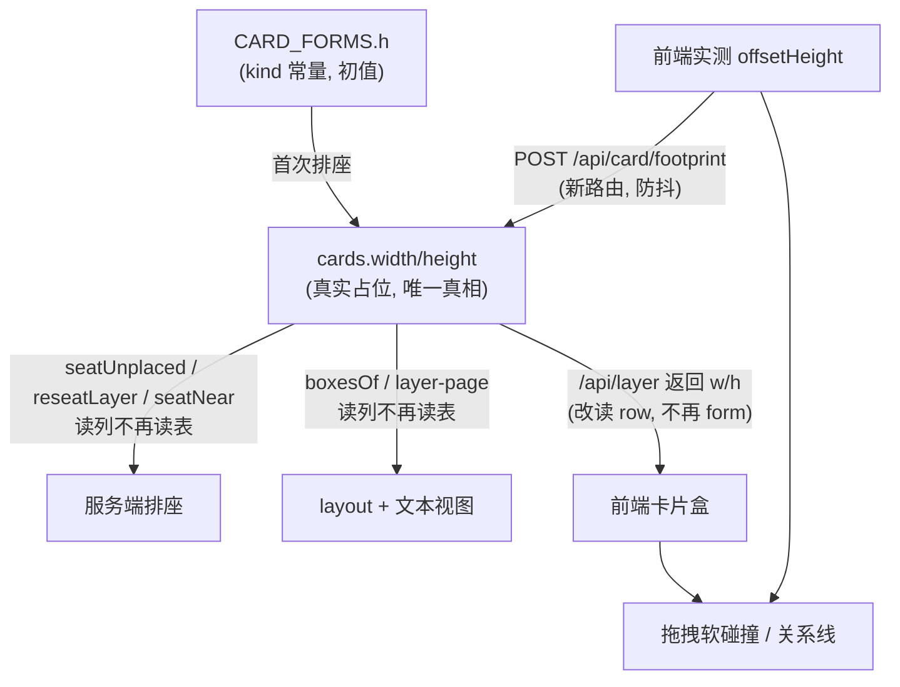

docs/footprint/00-共同上下文.md

# docs/footprint/00 — 共同上下文（冻结契约）

> **本文是 F1「卡片真实占位」全批次共享地基。所有子文档 MUST 遵守，MUST NOT 自行改动本文冻结的形状。**
> 冻结日期：2026-09-12。与 `docs/tools/00-共同上下文.md`（B1 工具面）、`docs/audio/00-共同上下文.md`（A1 音频）同款体例。
> 母文档：本文件；子文档 `01`–`05` 各管一个模块。**冲突时以本文为准，并回写冲突方。**

---

## 0. 本文的权威层级

上游冲突时的裁决顺序（高 → 低）：

1. **本文冻结的形状**（字段名、模块边界、数据流、失配口径）；
2. `AGENTS.md §7.5`（尺寸与旋转契约，**本文对其第 2/6 条做定向修订，见 §11**）；
3. `docs/tools/09-link与arrange.md §11 冲突 1`（`arrange` 不改 w/h 的既有裁决，**本文继承并扩展它**）；
4. `doc-08 §定案 2`（`fold_chalk` + `type: scenario` 折叠，**方向已定、赛后实现**——本文只保证与它不冲突，不代为实现）；
5. `doc-06` / `doc-04 §10`（演出与视觉规格）；
6. `docs/ui/前端改造计划.md` / `docs/development/后端实现计划.md`（施工单，**行号可能过期，实现前用代码复核**）。

**本文对 `AGENTS.md §7.5` 的两处修订（§11）在裁决时优先于原文。**

---

## 1. 一句话问题

**一张卡片有两套尺寸，服务端按"声明尺寸"（`CARD_FORMS.h`）排座，前端按"绘制尺寸"（`offsetHeight`）碰撞；两者对 chalk 类卡片相差 3 倍，于是排座算法给出的"互不相碰"的座位，画到屏幕上是叠着的。**

一句话修法：**让"占位尺寸"成为可持久化、可测量的唯一契约——声明值是初值，实测值是真相，凡是"判断卡片会不会撞在一起"的算法只读这一个值。**

---

## 2. 现状事实（带 `file:line`，2026-09-12 复核）

> 本节每条都经代码复核。**行号有保质期**，实现前若行号漂移，以符号名为准重新定位。

### 2.1 尺寸的两个来源

| 侧 | 位置 | 用的值 | 语义 |
|---|---|---|---|
| 服务端排座 | `local-store.ts:548` (`seatUnplaced`)、`:622` (`reseatLayer`)、`:900` (`seatNear`) | `file.h` ← `form.h` | **声明值**，kind 的常量 |
| 服务端排座（presence） | `local-store.ts:1005` | `CARD_FORMS.sprite` | 同上 |
| 服务端 layout 计算 | `actions/canvas.ts:325`(grid)、`:338`(circle)、`:355`(row) | `box.h` ← `form.h`（`boxesOf:372`） | 同上 |
| 服务端文本渲染 | `render/layer-page.ts:284/292` → `spatial.ts:21-23` | `item.box.h` | 同上（`look_at` 的"人话方位"） |
| **前端拖拽碰撞** | `Canvas.tsx:291-299` → `measure.ts:67` | `el.offsetHeight` | **绘制值**，内容撑开 |
| 前端关系线 | `LinkLayer.tsx:127` → `measure.ts` | 同上 | 同上 |
| 前端小地图 | `Minimap.tsx:96/119` | `it.h` ← `form.h`（`routes/world.ts:342`） | **声明值** |

### 2.2 `cards` 表的 w/h 列现状

- 建表：`db/schema.ts:8-17`，`width REAL NOT NULL DEFAULT 280` / `height REAL NOT NULL DEFAULT 180`，另有**完全未使用**的 `metadata TEXT` 列（全仓库唯一出现处就是建表语句）。
- **写入点**（服务端）：`seatUnplaced:575`（INSERT）、`reseatLayer:635`（UPDATE）、`seatNear:939`（UPSERT）。三处写的都是 `form.w/h`。
- **不写**：`applyPlaceCard`（`local-store.ts:741-`，`arrange`/`POST /api/card/position` 的落点）——**逐字注释**"w/h are never written (doc-09 §11 冲突 1)"。
- 读取回前端：`routes/world.ts:330-345` 的 `enriched`，**逐字注释**"w/h are a pure function of kind, so they always come from the form table — never from the stored row"，即 `w: form.w, h: form.h`。**`row.w/row.h` 在 API 返回体里从未被读过。**
- `toCardRecord`（`:1160-1169`）读行内的 `width/height` 进 `CardRecord.w/h`，但 `CardRecord` 只服务 `seatNear`/`getLayerCards` 的**占用集**，不回流到 API。

**结论：`cards.width/height` 今天是一个"仅服务服务端排座、且存的是 kind 常量"的冗余列。**

### 2.3 实测偏差（真实内容，2026-09-12）

holmes-world / `world/baker-street` 层，浏览器实测：

| 卡 | kind | 声明 `h` | 实测绘制高 | 比值 |
|---|---|---|---|---|
| `evening.md` | chalk | 190 | **578** | 3.0× |
| `late-night.md` | chalk | 190 | **481** | 2.5× |
| `raindrops.md` | note | 168 | 107 | 0.64× |

用真实绘制高重跑 `seatUnplaced`（真实 fixture，非推断）：**2 组真实重叠**（`evening∩late-night` 竖向叠 290px；`evening∩raindrops` 叠 279px），而排座算法认为三者互不相碰。

### 2.4 chalk 为什么必然超过声明值（**归因已实测修正**）

- `ChalkCard.tsx:55` 正文是 `whitespace-pre-wrap` 的整段旁白——行数随内容增长。
- `index.css:824-830`：`.chalk--bare` 显式声明"不加固定高度，长 chalk 永不裁切"，`overflow-wrap: anywhere`。
- **但正文不是唯一来源，也不是最大来源。** 实测 `evening.md`（总高 578）拆解：**正文 291px + frontmatter widgets 239px**（3 个 widget：status 折叠表 / choice 卡片组 / roll_dice 卡）——**widgets 占超出量（578−190=388）的 62%**。子文档 04 独立测得 74%（注入结构差异），量级一致。
  → **归因修正**：`h: 190` 与真实的差距，是「正文折行」与「frontmatter 互动组件」**两个独立来源叠加**。只按正文估算（方案 E）连一半都解释不了。
- **其他 kind 也会超**（04 逐 kind 实测）：`gate` 恒超——三个门牌实测均 277px vs 声明 240px（**恒定 +37px**，因 `gate__cover` 固定 158px + body 固有高）。
- **`h` 对 chalk 从来不是"高度"，只是一个名义占位数。** 作家每写一段、每加一个 choice/status，真实高度就变一次——**这不是静态误差，是随叙事持续恶化的漂移**。

### 2.5 现有测试与探针覆盖

- `packages/shared/test/canvas.test.mjs` / `components.test.mjs` / `move.test.mjs` 触及排座。
- `tools/probe*.mjs` **不测排座几何**（`probe-tools.mjs:69` 的 `height` 是 `generate_image` 的参数，无关）。
- 即：**"排座不重叠"今天没有任何自动化断言。**

---

## 3. 架构决策（本文冻结）

### 3.1 核心决策：占位尺寸 = 声明 + 实测覆盖

`cards` 表已有 `width`/`height` 两列与一个用途不明的 `metadata` 列。**不使用 `metadata`**（语义模糊、无 schema）。改为：

> **`cards.width/height` 从"kind 常量的缓存"升格为"该卡的真实占位尺寸"。**
> - **初值**仍是 `form.w/h`（卡片首次排座时写入，行为与今天一致）。
> - **实测值**由前端测量后回传覆盖（§3.3）。
> - **凡是判断"两张卡会不会相撞"的算法，只读这一对列**，不再现算 `cardFormOf`。

**为什么不是"服务端估算绘制高"**（否决方案 E，理由存档于 §12）：服务端没有 DOM，量不出 `pre-wrap` 的折行结果；估算 = 引入第二套字体度量真相，随字体/主题/宽度漂移，违反"唯一真相源"。

**为什么不是"给 chalk 硬钳制高度"**（否决方案 C，理由存档于 §12）：`doc-08` 已定"叙事文本是唯一主角、全文不该被裁"，§2.4 的 CSS 契约也明写"永不裁切"。硬钳制会撞产品价值观。

### 3.2 数据流（冻结）



**两条不变量**：

- **I1（唯一真相）**：任何**已排座卡**的"碰撞/占位"判断，输入必须来自 `cards.width/height`（服务端）或与它同源的实测值（前端）。**MUST NOT 出现第三处现算 `cardFormOf` 的碰撞点。**
  - **范围限定（MINOR-11，2026-09-12）**：I1 管的是**已排座卡**。**新卡初值**（无行）走 declared 是**正当的**——包括两条既有入口：`routes/world.ts:314` 的 `cardSize`（本批次拆为 `storedSizeOf`/`declaredSizeOf`）与 **`delete.ts:204` 的 `seatFileOf()`**（`move.ts:172-183` 用它喂 `seatNear`/`seatUnplaced`，目的地层已确认为无行，declared 即正确初值）。两者**都不构成 I1 违例**，MUST NOT 被当成假验收判据。
- **I2（回写不降级）**：实测值一旦回传，服务端 MUST 用它覆盖列，并把新值作为 `/api/layer` 的返回；**MUST NOT 在下一次 `reseatLayer` 时用 `form.h` 把它冲回旧值**（今天的 `reseatLayer:599-604` 正是靠"行值≠表值"判定漂移，**这条判定逻辑必须重写**，见 §5）。
  - ⚠️ **I2 不等于"x/y 永不改"**：实测占位**变大**时，座位**必须**让开（§5.1 第 3 条）——那是 F1 的目标，不是违例。I2 禁止的是"用 declared 覆盖实测列值"。

### 3.2.1 勘误登记（2026-09-13，来自 N1「角色小天地」批次实测）

> **本批未改 footprint 契约的任何形状**（只加了一个端点分支，见下）。以下两条是与本契约相关的事实更正，主 agent 实测后登记。

- **勘误 1（`seatUnplaced` 批内不更新占位集）**：本契约 §2.1/§3.2 说「`seatUnplaced` 只给**无行的卡**排座」，但**未覆盖**一个既有 bug：该函数的 `occupied` 集合在循环内**从不加入刚排好的座位**（`local-store.ts` 建 `occupied` 时只放已存在的行；对照 `reseatLayer` 在两处有 push），且 `nextZ` 在循环内**不自增**。后果：**同一批插入 N 张无行卡 → 位置与 `z_index` 全部相同**（实测 4 张同尺寸卡 `distinct (x,y)=1`、`distinct z=1`）。
  - 这与 **F1 的目标直接相关**（F1 治"声明尺寸≠实测尺寸导致的重叠"；本 bug 是"批内座位互不知情导致的重叠"），**两者独立**。
  - **已在 N1 批次修复**（补 `occupied.push(...)` + `nextZ++`，与 `reseatLayer` 逐字同形），验收断言 N1-A13/A27。详见 `docs/nook/00-共同上下文.md §2.7`。
  - 影响面：任何"同一批插入多张无行卡"的路径（首次打开一个多卡层、`move` 批量落卡、**nook 首次进入**）。
- **勘误 2（`POST /api/card/footprint` 的门禁范围）**：本契约 §3.3 的 `POST /api/card/footprint` 门禁写的是 `resolveLayer(dirOfLayer(layer)) === layer`。**该门禁对 `characters/<id>`（nook）不适用**——`resolveLayer` 对 `characters/**` 必然返回 `null`。N1 为 nook 加了**并列分支**（`layer` 形如 `characters/<id>` 时改用 `isValidCharacterId` 校验），**既有分支的语义与形状一字未动**。

### 3.3 实测值的回传通道（冻结接口）

**新路由**：`POST /api/card/footprint`

```jsonc
// request
{ "layer": "world/baker-street",
  "boxes": [ { "path": "world/baker-street/evening.md", "w": 460, "h": 578 }, ... ] }
// response 200
{ "ok": true, "updated": 2, "unchanged": 1 }
```

- **只写 w/h 两列 + `metadata.measuredAt`**；`layer` 由路由 `resolveLayer` 校验（与 `POST /api/card/position` 同款校验，`routes/world.ts:495-507`）。
- **MUST NOT 落事件**：占位尺寸是渲染层派生数据，与 `arrange`/`card_position` 同类（`doc-21`：画布状态不落事件）。**这不是"省略"，是定案**——落事件会让 Hook 每轮注入一次"卡片尺寸变了"的噪声。
- **防抖**：前端 MUST 在测量稳定后才发（`ResizeObserver` + 200ms 尾防抖），一次 POST 携带该层**全部**卡的盒子（避免逐卡请求）。
- **幂等**：同值重复 POST → `updated: 0`，不写 DB。
- **行匹配键（BLOCKER-2 裁决，2026-09-12 冻结）**：`writeFootprints` MUST 按 **`cards.id = path` ONLY** 匹配行，**MUST NOT** 加 `layer = layerId` 条件。理由：跨层门牌 README（如 `world/baker-street/README.md`）的 `cards.layer` 是 `world/baker-street`，但它**同时出现在 `map` 层的门牌列表**里（§2.2 跨层门牌，A4 实测的第二类）。按 `layer` 匹配 → `map` 层页发的 footprint **全部跳过该卡**，且 `updated: 0` 会被误读成"值已对"（静默错误）。`layer` 参数**只服务路由层的 `resolveLayer` 校验**，不参与行匹配。

**未知 path / 行缺失的裁决（BLOCKER-1，2026-09-12 冻结）**：request 里的单个 path **不在**该层、或 `cards` 无对应行 → **跳过 + `console.warn` + 计入 `unchanged`，HTTP **200**。**MUST NOT 返回 404 或整批不做。** 理由：`resolveLayer` 是**层**校验器（入参是 relPath，`local-store.ts:489`），单卡行缺失不是它的判据；且门牌 README 的 `cards.layer` 与展示它的层不同（§2.2 跨层门牌），批量里有"非本层行"是**正常情形**，不是错误。真正该 fail-loud 的是**层名非法**（404）与**盒子形状非法**（400 `invalid_argument`）——两者都在路由层。

**谁触发**：前端 `useWorld` 在"layers items 渲染完成 + 字体稳定（`whenFontsSettled()`，见 §3.5）"后测量。

**失败语义**：POST 失败**不阻断** UI（`console.warn` + 保留本地实测值用于本地碰撞），下次渲染重试。**MUST NOT 静默**：失败要在 `details`/日志可见（`skill://design-first-feature-workflow` §6 第 6 条）。

### 3.4 服务端读取口径（冻结）

> **BLOCKER-3 裁决（2026-09-12）**：`routes/world.ts:81-84` 的 `cardSize()` 今天**同时**服务两个调用点，而两者需要的值**相反**——这是契约上一版的表述漏洞。**必须拆成两个 helper**，owner = **02**（文件属它）：
>
> | NEW helper | 用途 | 值 |
> |---|---|---|
> | `declaredSizeOf(item)` | 喂 `reseatLayer`（`:325`） | `form.w/h`（**declared**，容器/kind 判定用） |
> | `storedSizeOf(item, row)` | 喂 `seatUnplaced`（`:314`） | `row.w/h ?? form.w/h`（**行值**，首次无行回落） |
>
> 判据：`reseatLayer` 靠 `declaredVersion`（由 declared 算出）判断"kind 是否被改尺寸"→ 必须拿 declared；`seatUnplaced` 是**给新卡找不重叠的座位**→ 必须拿该卡**真实**占位（行值）。**两者混用会让 b2 绿而服务端仍按 190 排座**（05 §3.3 已点名）。

| 调用点 | 今天 | 改为 |
|---|---|---|
| `seatUnplaced` / `seatNear` 的 `file.h` | 调用方传 `form.h` | 调用方传 `row.h ?? form.h`（首次无行时用声明值）→ **`:314` 走 `storedSizeOf`（NEW，owner 02）** |
| `reseatLayer` 的 `files[].h` | `form.h` | **保持 `form.h`**（declared；判定见 §5.1）→ `:325` 走 `declaredSizeOf`（NEW，owner 02） |
| `boxesOf`（layout，`canvas.ts:367-375`） | `form.h` | `store.getLayerCards(paths)` 的行值，缺失回落 `form.h` |
| `boxesOf`（`look-at.ts:149-152`） | 已是行值 | **不改**（今天已读列；列变真值后其输出自然变准） |
| `routes/world.ts` 返回 `w/h` | `form.w/h` | `row.w/h`，缺失回落 `form.w/h` |
| `Minimap` | `it.h` | 不变（它消费 API 返回值，随本表自动修正） |
| `spatial.ts` / `layer-page.ts` | `item.box.h` | 不变（入参来源在本表修正） |

### 3.5 前端测量口径（冻结）

> 2026-09-14 修订：膨胀卡仍逐卡排除，但不再因任一卡 hover / reading 阻断其他稳定卡的整批回传；漏测卡保留重试。成功更新尺寸后主画布主动重取同层，由服务端重排。原因与测试见 [画布交互与板书避让修复](../ui/画布交互与板书避让修复.md)。

- **测量对象**：`CanvasObject` 外壳（`.object`）的 `offsetHeight`（**未旋转布局盒**，与 `collide.ts:7` 契约一致；旋转不进碰撞——`AGENTS §7.5` 第 3 条）。
- **用 `offsetHeight` 而非 `getBoundingClientRect().height`**：后者被相机 zoom 缩放（`measure.ts:64-65` 已记录此坑；04 实测 zoom 0.95 时 rect 548.8 vs offset 578）。
- **测量时机（MAJOR-1 裁决，2026-09-12）**：**`await whenFontsSettled()`**（NEW，04 导出，`apps/web/src/lib/fonts.ts`）= `document.fonts.ready` + **一帧** + `timeoutMs` 兜底。**MUST NOT 只用 `document.fonts.ready`**——04 实测它与触发 reflow 同 task 解析，同步读会看到 pre-layout 几何（Caveat 加载前后同一段 chalk 355px→291px，−18%）。03 与 04 统一走 `whenFontsSettled()`。
- **必须排除「膨胀态」**（04 实测新坑 + 2026-09-13 修订）：卡被交互放大时其 `offsetHeight` 不再是声明盒。两类：①hover——chalk 的 inline status header 在 `pointerover` 展开（`offsetHeight` 578→664，+86px）；②**持久 `reading` 态**——点击开阅读面板后指针移开仍保持（`CanvasObject` 的 `data-reading`）。**唯一谓词 `isInflated(el)`**（`apps/web/src/lib/footprint.ts`）= `el.matches(':hover') || el.hasAttribute('data-reading')`；`measureHeights` 与 scheduler 的 `isHovering` gate **MUST 共用它**，新增任何膨胀态只加在这里，不得各写一份。
- **阅读面板 MUST NOT 改卡宽**（2026-09-13 实测定案）：早先 `reading` 态把外壳宽改成 `Math.max(item.w, 500)`，既是第四处碰撞权威（违反 I1 / `AGENTS §7.5` 第 7 条），又让高度在非声明宽度下折行后被测到。现在面板是 `position:absolute` 浮层（`prop-card.css` 的 `.paper-reading--inline`），外壳宽恒为 `item.w`。
- **`measure.ts` 的缓存**：保持按代失效；`invalidateMeasures()`（**已存在**，`measure.ts:33`——不是新增）在 footprint POST 成功后调用（避免测到的值又被自己缓存）。
- **`AGENTS §6.5` 的"build 红线"**适用——改了前端必须 `pnpm build`。
### 3.6 落账口径（冻结）

**本批次新引入的写操作（`POST /api/card/footprint`）MUST NOT 落 `history.db` 事件。** 依据：

- 它是渲染派生数据，不是世界内容变更；
- `doc-21` 已定"画布状态层只落 `canvas.db`，不落事件"（`world-store.ts:137`"canvas state layer: canvas.db only, never an event"）；
- 落事件会让作家 Hook 每轮多一段"卡片尺寸变化"噪声。

---

## 4. 模块切分与归属（每篇一个 owner，MUST NOT 交叉）

| # | 文档 | owner 范围 | 边界（MUST NOT 越界） |
|---|---|---|---|
| **01** | `01-占位尺寸数据层.md` | `cards` 表读写、`toCardRecord`、`seatUnplaced`/`reseatLayer`/`seatNear`/`placeCard` 的尺寸口径 | 不改前端；不改 API 形状 |
| **02** | `02-服务端读取口径.md` | `boxesOf`、`routes/world.ts` 的 `enriched`、`layer-page`/`spatial` 入参 | 不改表结构；不改前端 |
| **03** | `03-实测回传通道.md` | `POST /api/card/footprint` 路由 + `useWorld` 测量 + `ResizeObserver` 防抖 + `measure.ts` 失效 | 不改服务端排座算法；不改 CSS |
| **04** | `04-前端测量与渲染一致性.md` | `CanvasObject`/`CardRenderer` 的盒与实测口径、`document.fonts.ready`、chalk CSS 是否需要配套 | 不改 API；不改排座 |
| **05** | `05-验收与回归.md` | 机械可核验的验收测试（含"排座不重叠"断言）、探针扩展、回写清单 | 不实现功能，只定义"怎么证明它对" |

### 4.1 跨模块契约（所有文档共享，MUST 引用本章而非自行定义）

1. **列语义**：`cards.width/height` = 真实占位尺寸（§3.1）。
2. **路由**：`POST /api/card/footprint`，request/response 形状（§3.3）。
3. **不落事件**：§3.6。
4. **不变量 I1/I2**：§3.2。
5. **行号纪律**：引用现状 MUST 带 `file:line`；**行号有保质期**，若漂移以符号名重定位并**在文档里更新**。
6. **示例当代码自检**：文档里的代码片段 MUST 只引用真实存在的符号；新函数标 `NEW` 并给签名（`skill://design-first-feature-workflow` §"派发时就该塞进去的硬约束"）。

---

## 5. 必须一并处理的连带点（MUST，不是可选项）

### 5.1 `reseatLayer` 的判定重写（否则 I2 破）

**必须改为**（五个漂移源，**按此顺序短路**）：

1. **行缺失** → 首次排座（用 declared）。
2. **`w/h <= 0`** → 脏行修复（用 declared）。
3. **`rowVersion` 存在 且 `!== declaredVersion`** → **kind 在代码里被改过尺寸**（`reseatLayer` 的原始正当用途，`local-store.ts:587-593`）。**用 declared 排 + 清空 `measuredAt`**（旧实测值按旧宽折的行，已失效）。`rowVersion` 缺失**不算失配**（走 legacy 分支）。<br>⚠️ **这一条必须在第 4 条之前判**（BLOCKER-C，2026-09-12）：实测高是在**旧宽度**下折出来的，kind 一改宽度它就作废——若让第 4 条（实测已移）先命中，就会用一个**已知失效**的高去排座，且 `meta` 写回 `formVersion: dv` 后**永远不会再触发 kind 重排**（MAJOR-2 的窄化复现，实测抓出）。
4. **`row.measuredAt` 非空 且 (`row.h !== meta.seatH \|\| row.w !== meta.seatW`)** → **实测占位变了**（本契约的 `seatH` 补链，§5.2）。**用行值 `row.w/h` 排**。这是**唯一**能让"卡长高了 → 座位让开"发生的路径；漏了它，F1 的目标不达成。
5. **legacy**（`metadata` 缺失/无 `formVersion` 且无 `measuredAt`）→ 按 §5.2 末的两条子分支。
6. 兜底：`measuredAt` 非空、`seatH/seatW` 与行值相等、但 `rowVersion` 缺失 → **不动**（竞态保护：`writeFootprints` 可能先落 `measuredAt`、后才有 `formVersion`；把它当 legacy 会冲掉刚测到的高度）。


> ⚠️ 这是本批次**风险最高**的一处：改错了会触发全层重排、玩家自己拖过的位置全丢（`AGENTS §7.5` 已警告）。子文档 01 MUST 给这条判定**独立的单元测试**。

**SPLIT 时间的语义（关键）**：第 3 条与第 4 条**用不同的值排座**——
- 第 3 条（实测变化）：用**行值** `row.w/h`（那才是卡的真实占位）。
- 第 4 条（kind 改尺寸）：用 **declared** `form.w/h`（实测值按旧宽折的行，已失效），并**清空 `measuredAt`**（等下次测量重写）。
- **为什么不能只补版本号**：`reseatLayer` 的**原始正当用途**就是「kind 在代码里改尺寸后，旧座位会重叠」（`local-store.ts:587-593` 注释）。若实测行永不重排，则**每张被测量过的卡**（也就是所有卡）都逃过这次重排——该能力被静默移除，正是 MAJOR-2 指出的偏离。
- **与 I2 的关系**：I2 守的是"**同版本**下实测值不被 declared 冲掉"；本裁决处理的是"**跨版本**（kind 真被改尺寸）"，两者不冲突。

### 5.2 `metadata` 的存放（冻结）—— **四个键**

`metadata` 列（今天完全未使用，`db/schema.ts:16`）改为存：

```json
{ "formVersion": "c1a2b3", "measuredAt": "2026-09-12T10:00:00Z", "seatH": 190 }
```

> ⚠️ **`seatW`/`seatH` 是本契约最重要的一次修订（BLOCKER-A，2026-09-12，两位评审独立发现 + 主 agent 实测复现）**：最初的设计漏掉了"实测值变化 → 重排已排座卡"这条链路，导致 **F1 的核心目标（屏幕不重叠）在冻结设计下永远无法达成**——`seatUnplaced` 只给**无行的卡**排座（`local-store.ts:525-528`），`reseatLayer` 只按 `formVersion` 判漂移，而实测回写**绝不写 x/y**（§8.6）。于是：列高变 578，座位仍是按 190 算的 → 永久重叠。**`seatH` 就是补上这条缺失链路的键**：它记录"该行**上次排座**时用的高度"，与当前 `row.h` 比较即知"这颗卡的真实占位变了、必须重排"。

- **`seatH`/`seatW`**：该行**上次排座时实际使用**的 `w/h`（= 排座当时写入的 `width/height` 列值）。**每次 SEAT 时与 `width/height` 一起写**。
- **`measuredAt`**：该行 `w/h` 是实测值的标记（`writeFootprints` 独占写）。**`writeFootprints` 只改 `width/height` 与 `measuredAt`，绝不改 `seatH`/`seatW`**——正是这个"不动"造出了可比的差异信号。
- **判定**：`row.measuredAt` 非空 **且** `row.h !== meta.seatH || row.w !== meta.seatW` → **实测占位已变 → SEAT**（用**行值**排）。<br>实测验证（`/tmp/fp-fix.mjs`，真实几何常量）：初始按 declared 排 → 回写 578/481/107 → 下一次 pass 重排 → **`overlappingPairs=0`**，且第二次 pass 幂等 no-op。
- **MUST NOT** 把 `seatW`/`seatH` 当"自由 JSON 垃圾桶"——`metadata` 只有这 **4** 个键（`formVersion` / `measuredAt` / `seatW` / `seatH`）；§8 反模式 8 同步更新。

- `formVersion` = `CARD_FORMS[kind].w`/`h` 的短 hash，**kind 定义变更时自动失配** → 触发重排。
- 行缺失 → 首次排座。
- 行有值但 `metadata` 缺失/无 `formVersion` → **老数据，按两条子分支处理**（子文档 01 §5.1 决策表已细化，此处冻结口径）：
  - **行值 == 当前 `form.w/h`** → **只回填 `formVersion`，绝不重排**（保护玩家自己拖过的 x/y）。实测：`templates/holmes-world/.airpworld/canvas.db` 的 8 行**全部命中此分支**（行值与 `CARD_FORMS` 逐行相等）。
  - **行值 ≠ 当前 `form.w/h`** → 可能是老代码写的旧常量，走一次重排后补 `formVersion`。
  - ⚠️ **不许用「metadata 缺失」直接等于「重排」**——那会在首次请求时打乱每个老世界的座位。

### 5.3 `placeCard` 的三处冲突面

- `AGENTS §7.5` 第 6 条说 z 序、"`.object` 的 z-index 是内联写的"——**本批次不动 z**。
- `actions/canvas.ts:385-390` 拒绝 `arrange` 传 `w/h`——**本批次保持**（`arrange` 仍改不了尺寸；尺寸走实测通道）。**这是刻意的不对称**：玩家/作家不能手改尺寸，但渲染事实可以回写。子文档 01 MUST 在文档里显式论证这条不对称。

### 5.4 `measure.ts` 与列值的双轨风险

前端有 `measure.ts`（本地实测缓存）+ 服务端列（持久化实测值）。**这两者可能不一致**（如字体未加载完就测）。冻结口径：

- **本地 `measure.ts` 是"当前屏幕的事实"，服务端列是"上一次稳定渲染的事实"。**
- 碰撞用**本地**（快、随相机无关）；排座用**服务端**（跨会话持久）。
- 两者不同步时**不报错**——下一次 footprint POST 自会收敛。

### 5.5 建行路径必须写有效占位（BLOCKER-B，2026-09-12 实测发现，实现阶段）

**缺口**：`cards` 行有**两条**创建路径，而本契约初版只覆盖了第一条：

| 路径 | 今天写的 w/h | 问题 |
|---|---|---|
| `seatUnplaced` / `seatNear` | `form.w/h`（正确） | — |
| **`applyPlaceCard`**（`arrange` 的写入者，`local-store.ts:999`） | **不写** → SQL DEFAULT `280/180` | **`280/180` 不是任何 kind 的真值**——在 I1 下就是一条谎言 |

**为什么它现在才咬人**：今天 `boxesOf` 读 form 表，所以这个错误值**从没被读过**；本批次把 `boxesOf` 改为读行值后，`arrange` 首跑就写下 `280×180`，二次 `arrange` 读到它 → **布局漂移、不确定**。实测：`canvas.test.mjs:397`（"arrange layout re-flows … deterministic"）在改 `boxesOf` 后**立刻转红**（`stable x for world/inn/a.md` 669 ≠ 489），DB 显示该行是 `280×180`（chalk 声明 460×190）。

**裁决（owner = 02，改 `actions/canvas.ts`）**：`arrangeCards` 的 **layout 与 place 两个分支**，在写位置前**先** `await store.seatUnplaced(layer, paths.map(p => ({ path: p, ...declaredSizeOf(item) })))`。

- `seatUnplaced` 只给**无行**的卡排座（`local-store.ts:586-589`），有行时 no-op → **幂等**。
- 它用**规范写入者**落正确的 `width/height` + `metadata.seatW/seatH`；`formVersion` 由同 pass 的 `reseatLayer` 回填。
- **MUST NOT** 给 `placeCard`/`placeCards` 的 `box` 加 `w/h`（§5.3 冻结不破）——这一步只是"让新行拿到正确初值"，**不是** "arrange 改尺寸"。

**反模式 12**：**MUST NOT** 让任何建行路径写下"不是该 kind 真值"的 w/h（含 schema DEFAULT）——那条行一旦被 I1 的读者读到，就是一个会扩散的错值。

---

## 6. 与既有文档的关系（MUST 遵守）

| 文档 | 关系 |
|---|---|
| `AGENTS.md §7.5` 第 2 条 | **定向修订**："外壳不写死高度"仍成立；新增"但**唯一占位尺寸表**（`cards.width/height`）必须被排座算法读取"。见 §11 |
| `AGENTS.md §7.5` 第 6 条 | 不动（z 序） |
| `AGENTS.md §7.5`"已知缺口"段 | **本批次的目标就是删掉这一段** |
| `docs/tools/09-link与arrange.md §11 冲突 1` | **继承**：`arrange` 不改 w/h 的裁决不变；本批次让"排座的 w/h"从"表值"改为"列值" |
| `doc-08 §定案 2`（`fold_chalk`） | **不冲突**：折叠后 scenario 仍是普通 md，占位尺寸照样走本通道。本批次**不实现** fold |
| `doc-21` 事件表 | **遵守**：`POST /api/card/footprint` 不落事件 |

---

## 7. 已验证的机制断言（spike 证据）

> 按 `skill://design-first-feature-workflow`：能实测的绝不停留在读代码推断，且 spike 必须有对照。

**A1（排座差距会咬人）**：用真实渲染高跑 `seatUnplaced` → 2 组真实重叠。fixture 与输出见 §2.3。

**A2（`cards.width/height` 今天的读者有两类，口径还不一致）**：`grep -rn "boxesOf"` 发现**两处同名函数**：

| 位置 | 读什么 | 用途 |
|---|---|---|
| `actions/canvas.ts:367-375`（`boxesOf`） | **`form.w/h`**（现算 `cardFormOf`） | `arrange` 的 grid/circle/row 布局 |
| `actions/look-at.ts:149-152`（同名 `boxesOf`） | **`row.w/h`**（`getLayerCards`） | `look_at` 的方位/重叠渲染 |
| `store/local-store.ts:1160-1169`（`toCardRecord`） | `row.width/height` → 占用集 | `seatUnplaced`/`seatNear`/`getLayerCards` |

**即今天已经存在两种口径：`canvas.ts` 读表、`look-at.ts` 读列。** 这是 I1 要消灭的「多处碰撞点」的现成物证（不是理论风险）。注意 `look-at.ts` 已读列，所以它今天的方位判断其实**部分**正确——但列里存的仍是 `form` 表值（由 `seatUnplaced` 写入），所以两条路殊途同归到同一个错值。**本批次要让列值变成真值，两条路才会真正分叉出正确结果。**

**API 返回体**读的是 `form.*`（`routes/world.ts:341-342` 逐字注释）。**对照实验**：把 `cards.height` 全改成 `999` 再访问 `/api/layer`，返回的 `h` 不变——证明列**不影响**今天的 `/api/layer` 渲染路径（但仍影响服务端排座占用集）。

**A3（`metadata` 列完全未使用）**：`grep -rn "metadata" packages/shared/src apps/server/src` → 唯一命中是建表语句 `db/schema.ts:16`。

**A4（`reseatLayer` 会主动冲掉列值 —— 本批次最大的坑，已实测）**：

配置矩阵（同一世界，改列 → 请求 `/api/layer` → 读列）：

| 配置 | 改列前 | 改列后（未请求 API） | 请求 API 后 |
|---|---|---|---|
| `baker-street` 层卡（`evening.md`） | 460×190 | 460×999 | **460×190（被冲回）** |
| `README.md`（同时是 `map` 层门牌） | 288×240 | 288×999 | **288×240（被冲回）** |

**机制**：`reseatLayer:599-604` 判定"`row.h !== form.h`"为漂移 → `:635` `UPDATE cards SET ... width = ?, height = ?` 写回 form 值。它**挂在每次 `/api/layer` 上**（`routes/world.ts:323-328`），所以**任何**与 form 表不符的列值，**下一次请求就会被无声地重置**——实测确认，无警告、无日志、无差异。

**这条把 §5.1 从"风险"升级为"必做前置"**：不在同一批次里重写 `reseatLayer` 的判定，本批次的所有回写都会被它按回原状。**子文档 01 MUST 先于子文档 03 落地**（依赖顺序，见 §4 owner 表）。

**对照维度说明**（`skill://design-first-feature-workflow`：spike 必须能区分假设）：本 spike 同时测了"层内卡"与"跨层门牌"两类，两者都被冲回——排除"只有某类卡会被重排"的可能。

---

## 8. 反模式（MUST NOT）

1. **MUST NOT** 引入第三处 `cardFormOf` 碰撞点（I1）。
2. **MUST NOT** 让 `reseatLayer` 用 `form.h` 冲掉实测值（I2）。
3. **MUST NOT** 为 footprint 回传落事件。
4. **MUST NOT** 在服务端估算绘制高度（§3.1 否决方案 E）。
5. **MUST NOT** 给 chalk 硬钳制高度、加"展开"折叠壳（§3.1 否决方案 C；`doc-08` 已定折叠走 `scenario`，不在这里）。
6. **MUST NOT** 在 `POST /api/card/footprint` 里改 x/y/z。
7. **MUST NOT** 用 `getBoundingClientRect().height` 作占位高（相机缩放，§3.5）。
8. **MUST NOT** 把 `metadata` 列当自由 JSON 垃圾桶——它只有 §5.2 **四个键**（`formVersion` / `measuredAt` / `seatW` / `seatH`）。
9. **MUST NOT** 让 `writeFootprints` 碰 `seatW`/`seatH`（它只写 `width`/`height`/`measuredAt`）——改了它们就抹掉了"实测已变"的信号，F1 的目标就不再达成。
10. **MUST NOT** 只用 `formVersion` 判漂移（必须同时有 `seatH` 比较，§5.1 第 3 条）；否则"卡长高了 → 座位让开"这条链路不存在。
11. **MUST NOT** 在该批次实现里改动已排座卡的 x/y —— 除非 §5.1 的漂移判据命中（那正是本批次要修的能力）。实测回写只写 `width`/`height`。

---

## 9. 仍未拍板（留给子文档与评审）

1. **`formVersion` hash 的粒度**：按 kind（`CARD_FORMS[kind]`）还是按整表？按 kind 更精确，但 kind 改名时要迁移。
2. **实测回传的节流策略**：`ResizeObserver` 尾防抖 200ms 是否足够？流式 chalk（写作时高度持续变）会不会打断叙事节奏？
3. ~~**`w` 是否也需要实测**~~ → **已实测裁定：不需要**（2026-09-12）。证据：`.object` 的 `offsetWidth` 在声明宽 460/300/200/120/80px 五档下**逐档相等、零溢出**——`overflow-wrap: anywhere` 只折文字，**撑不开外壳**（外壳是 `width: item.w` 的确定块，内层 `width:100%`）。三个真实 kind（chalk×2 / note）声明宽与实测宽也逐卡相等。**故本批次只需回传 `h`；`w` 仍由 `form.w` 供给，写列时随 `h` 一起刷新即可（保持列自洽）。**
4. **要不要给 `POST /api/card/footprint` 加"仅本地世界"限制**？（云端版 `doc-17` 未实现，暂不设限。）
5. **`doc-09 §11 冲突 1` 是否需要跟着修订**：它今天写"`width/height` 保留（它们只服务排座碰撞）"——本批次后它们是"排座碰撞的唯一真相"，措辞需更新。
6. **是否需要 `formVersion` 之外的"渲染版本"**（如 CSS 大改导致所有卡高度变）？今天不在范围。
7. **⚠️ 实测重排的产品副作用（需拍板，2026-09-12 发现）**：`seatW/seatH` 补链（§5.2）让"卡长高 → 座位让开"成立，但也意味着——**作家追加一段 chalk，该卡可能被自动挪位**（若新的高度撞到邻居）。这在叙事上可能是突兀的（玩家刚看到一个物件，下一帧它滑走了）。三个候选口径：
   - **(a) 直接重排**（本契约当前口径）：正确性优先，简单。风险是叙事抖动。
   - **(b) 只让"新方"让开**：重排时优先移动**后变高的卡**，尽量不动已稳定的邻居（`reseatLayer` 的 occupied 已按此思路，但落点仍是螺旋位，不保邻居）。
   - **(c) 前端软推**：服务端只存尺寸，座位由前端在**渲染时**按本地碰撞软推（`collide.ts` 已有 `pushFrom`），不持久化——但那与"座位持久化"的既有设计冲突，且多端不一致。
   - **建议 (a) + 观察**：本批次用 (a)（最小、可核验），把"叙事抖动"作为**实测待观察项**记入 05 的手测清单；若真影响观感，另开小批次做 (b)。**不建议 (c)**（打破持久化契约）。
8. **`formVersion` hash 输入是否含 kind 名（MINOR-10）**：`map` 300×200 与 `thread` 300×200 同尺寸但**不同 chrome**（绘制高本会变），仅按 `(w,h)` 哈希会漏判。**建议改为 `kind + w + h`**（改名迁移的代价远小于漏判重排）。待 01 确认。

---

## 10. 子文档统一结构（MUST，12 节）

每份子文档 MUST 按此结构写：

1. 一句话定位
2. 签名 / 参数 / 接口（新符号标 `NEW`，给完整签名）
3. 行为契约逐步（**每一步写"漏了会怎样"**）
4. 文件与副作用（精确到 `file:line`）
5. 落账（遵守 §3.6）
6. WS / 前端反应
7. 错误边界（含"不静默降级"）
8. 代码落点（精确到文件与函数）
9. 与现状差异（今天是什么 → 变成什么，带 `file:line`）
10. 验收测试（**可机械核验**，见 §10.1）
11. 发现的冲突 / 需要修订的上位文档（引用 §11 体例）
12. 仍未知待拍板

### 10.1 "可机械核验"的定义（本批次硬要求）

按 `skill://design-first-feature-workflow` 最贵的一条："冻结契约若不能被机械核验，就等于没冻结"。本批次 MUST 提供：

1. **一条能对两侧求 diff 的测试**：断言 `cards.width/height` 与**三条读取路径**（`/api/layer` 返回体、`canvas.ts boxesOf`、`look-at.ts boxesOf`）的 `w/h` **逐卡相等**（今天它们不等，因为一个读行一个读表）。
2. **一条"排座不重叠"断言（端到端，写法已实测校准，照抄这个形式）**：
   - **这是 F1 唯一直接证明"用户看得到的不重叠"的断言。**
   - **输入**：模拟真实时序——① 按 declared（`CARD_FORMS` 值）首次排座（`seatUnplaced`）；② 模拟 footprint 回写：把 `cards.height` 改成真实绘制高 + 写 `metadata.measuredAt`（**不动 `seatW/seatH`**，契约 §5.2）；③ 重走一次层排座路径（`reseatLayer`）。
   - **判定**：用**真实绘制高**计算两两是否重叠。
   - **断言**：重叠对数 === 0。
   - **今天必然失败**：实测输出 `evening∩late-night ox=194 oy=312`、`evening∩raindrops ox=256 oy=301`，`overlappingPairs=2`（`reseatLayer` 把实测值冲回 declared，座位永不按真实占位重算）。
   - **修复后 PASS 的机制（唯一正确的那个）**：`reseatLayer` 的第 3 条漂移信号命中（`row.h !== meta.seatH`）→ 用**行值**重排 → 座位让开。实测已验证（`/tmp/fp-fix.mjs`）：`overlappingPairs=0` 且第二次 pass 幂等。
   - ⚠️ **不要写成"喂真实绘制高给 `seatUnplaced`"**——那样 `seatUnplaced` 忠实使用传入的 h、输出**不重叠**、测试**假绿**（实测 `overlappingPairs=0 PASS`）。bug **不在 `seatUnplaced` 内部**，在**没有任何路径会在实测占位变化后重排**。
3. **一条"实测值不被冲掉 + 稳态幂等"断言（守 I2）**：写实测值（`metadata.measuredAt` 非空，`seatW/seatH` 留旧值）→ 跑 `reseatLayer` **两次**：
   - **第一次**：第 3 条漂移信号命中 → **按行值重排，`x/y` 允许变**（这就是"座位让开"，与测试 2 是同一机制），`seatH` 更新为行值。
   - **第二次**：稳态 → 断言 **no-op**：`w/h == 实测值`（**未被冲回 declared**，这是 I2 的本体）、`x/y` 不变、`seatH` 不变。
   - **今天必然失败**：A4 证明第一次就把实测值冲回 declared（`999 → 190`）。
   - ⚠️ **MUST NOT 断言"第一次 reseat 后 x/y 不变"**——那会与测试 2 直接矛盾（实测占位变大**必须**重排才算修好）。
4. **一条"kind 改尺寸仍重排"断言**：行带实测值 + `formVersion` 失配 → 断言该行被重排且 `measuredAt` 被清空（守 §5.1 第 4 条 / MAJOR-2）。

---

## 11. 本文对 `AGENTS.md §7.5` 的修订（冻结）

**修订 1（第 2 条）**：原文"外壳不写死高度……form 表的 `h` 只服务座位排布，不是渲染高度"——**保留，但补一句**：

> 服务端排座用的 `h` **从 `cards.height` 列读**（初值来自 form 表，之后由前端实测回写）；`form.h` 只是初值，不是排座的最终输入。

**修订 2（删"已知缺口"）**：原文末尾"座位排布仍按 form 表的 `h` 算碰撞……尚未处理"——**本批次完成后删除该段**。

**修订 3（新增第 7 条）**：新增一条性能/正确性纪律：

> **碰撞尺寸只有一个真相源**：服务端读 `cards.width/height`，前端读本地实测；MUST NOT 出现第三处现算 `cardFormOf` 的碰撞点。

---

## 12. 否决方案存档（为什么不这么做）

| 方案 | 内容 | 否决理由 |
|---|---|---|
| **C（硬钳制）** | 给 chalk 一个 `max-height`（如 400px）+"展开"按钮 | 撞 `doc-05`"叙事文本是唯一主角"与 `doc-08`"全文不该被裁"；`index.css:826-828` 的 CSS 契约明写"永不裁切"。折叠的合法形态是 `type: scenario`（`doc-08 §定案 2`），走那条线 |
| **E（服务端估算）** | 服务端按字符数 × 字号估算 chalk 高度 | 服务端无 DOM，估不准 `pre-wrap` 折行；引入第二套字体度量真相，随字体/主题/宽漂移。违反唯一真相源 |
| **B（列只服务排座、渲染忽略）** | 保持今天的行为，只把 `h` 解释成"排座框" | **这正是当前的 bug**：排座框与世界观感不符 |
| **F（`arrange` 允许改 w/h）** | 让作家/玩家手改尺寸 | `docs/tools/09 §11 冲突 1` 已否决；本批次保持 |
| **G（前端全权，服务端不存）** | 尺寸只在前端内存，不回传 | 服务端排座（`seatUnplaced`）无从知道真实尺寸，跨会话/多客户端不一致 |
