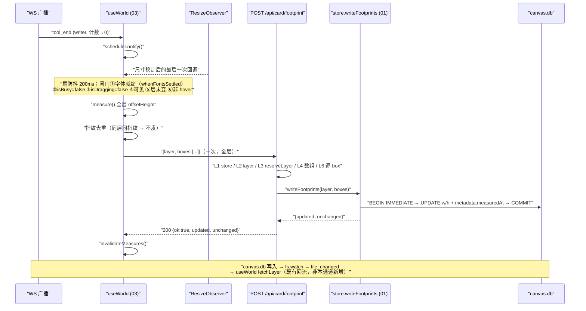

# docs/footprint/03 实测回传通道

> 子文档 03 / 模块 owner：**FootprintChannel**。
> 母文档与冻结契约：`docs/footprint/00-共同上下文.md`（下称 §NN）。**本文 MUST 遵守其冻结形状，MUST NOT 自行改动**：路由 `POST /api/card/footprint`、request `{layer, boxes:[{path,w,h}]}`、response `{ok, updated, unchanged}`、不变量 I1/I2、不落事件。本文只引用契约章节号（§3.2 / §3.3 / §3.5 / §3.6 / §4.1 / §5.1 / §5.2 / §5.3 / §5.4 / §7 A4 / §8 / §10.1），不重述。
> **本文 owner 范围（MUST NOT 越界）**：`apps/server/src/routes/world.ts` 的新路由；`apps/web/src/state/useWorld.ts` 的测量调度与 POST；`ResizeObserver` 防抖；`apps/web/src/lib/measure.ts` 的失效联动；新增 `apps/web/src/lib/footprint.ts`（纯调度单元，§2.3）。
> **不改**：服务端排座算法（`seatUnplaced`/`reseatLayer`/`seatNear`，归 01）、`boxesOf` 与 `enriched`（归 02）、`CanvasObject`/`CardRenderer` 的盒与 CSS 与 `document.fonts.ready` 的**就绪判定实现**（归 04）。
> **依赖顺序（契约 §4 owner 表 + §7 A4）**：**01 必须先于 03 落地**。§3.0 显式声明其后果。

---

## 1. 一句话定位

**把"前端量到的真实绘制高"变成"服务端列里的持久值"的唯一一条通道**：`useWorld` 在「层渲染完成 + 字体稳定（`whenFontsSettled`，契约 §3.5）+ 作家不忙 + 不在拖拽 + 不在 hover 展开态」时用一次 `offsetHeight` 全层测量，200ms 尾防抖后对 `POST /api/card/footprint` 发**一次**全层盒子；路由照抄 `POST /api/card/position` 的校验体例，**只**调 01 的 `store.writeFootprints(layer, boxes)` 并透传 `{ok, updated, unchanged}`；**不落事件、不广播帧、不回流**（不触发 `fetchLayer`）。

---

## 2. 签名 / 参数 / 接口

### 2.1 路由（`apps/server/src/routes/world.ts`，`createWorldRouter` 作用域 `world.ts:191-197`）

```ts
/**
 * POST /api/card/footprint — 实测占位尺寸回传（契约 §3.3）。
 *
 * 只写 cards.width/height（+ metadata.measuredAt，见 §11 冲突 3）。
 * 不落事件（契约 §3.6）、不广播 WS 帧、不改 x/y/z（契约 §8.6）。
 *
 * 200 → { ok: true, updated: <n>, unchanged: <n> }
 * 400 → { ok: false, code: 'invalid_argument', error: '<原因>' }   // 盒子形状 / layer 参数形状非法（L2/L4/L6）
 * 404 → { ok: false, code: 'not_found', error: '...' }            // 层名非法（L3；契约 §3.3）
 * 400 → { error: 'No active world' }              // 与既有路由同形（world.ts:494）
 * 500 → { ok: false, code: 'internal', error }    // reply() 兜底（world.ts:58-63）
 */
router.post('/card/footprint', async (req, res) => { /* §3.1 */ });   // NEW
```

**request 体（逐字，契约 §3.3）**：

```jsonc
{ "layer": "world/baker-street",
  "boxes": [ { "path": "world/baker-street/evening.md", "w": 460, "h": 578 } ] }
```

**response 200（逐字，契约 §3.3）**：`{ "ok": true, "updated": 2, "unchanged": 1 }`

### 2.2 store 方法（**唯一定义处：01 文档**；本文只写调用侧契约）

```ts
// 01 提供（01 已 IRC 确认形状），本文按此调用：
NEW async writeFootprints(
  layerId: string,
  boxes: Array<{ path: string; w: number; h: number }>
): Promise<{ updated: number; unchanged: number }>
```

- 路由 **MUST NOT** 手写 SQL、**MUST NOT** 直接 `queryCanvas`/`execCanvas`。
- `layer` 合法性**由路由层校验**（§3.1 L3）；store 只做 **`cards.id = path` ONLY 的行级匹配**（契约 §3.3 BLOCKER-2，2026-09-12 冻结）。
  - **理由（写死）**：跨层门牌 README（如 `world/baker-street/README.md`）的 `cards.layer` 是 `world/baker-street`，但它**同时出现在 `map` 层的门牌列表**里（契约 §2.2 跨层门牌 / §7 A4 实测第二类）。若匹配里加 `layer = layerId`，`map` 层页发的 footprint 会**全部跳过该卡**，且 `updated:0` 会被误读成"值已对"（静默错误）。`layer` 参数**只服务路由层 `resolveLayer` 校验**，不参与行匹配。
- 幂等**住在 store**：同值 → `unchanged` 且不写 DB。路由**不重算**幂等（否则两份口径）。
- 「path 不在本层 / 行缺失 / 文件不存在」→ store **跳过 + `console.warn`**，计入 `unchanged`，HTTP **200**（契约 §3.3 BLOCKER-1），**不报错**；响应体**没有** `skipped` 字段（契约冻死形状）。**MUST NOT 返回 404、MUST NOT 整批不做。**
- store 写 `width`/`height` + `metadata.measuredAt`；**保留** `metadata.formVersion`（归 01 的排座路径）；**绝不写 x/y/z**。
- **显式声明（契约 §5.2 / §8 反模式 9）：`writeFootprints` MUST NOT 触碰 `metadata.seatW`/`seatH`。** `seatW/seatH` 记录"该行**上次排座时实际使用**的 w/h"，由 SEAT 路径（01）与 `width/height` **一起**写；`writeFootprints` 只写 `width`/`height`/`measuredAt`。**这个"不动"正是漂移信号 `row.h !== seatH` 存在的前提**——一旦这里顺手写了 `seatH = h`，排座就再也看不到"实测占位已变"，F1 的核心目标（卡长高 → 座位让开）随之消失。

### 2.3 前端测量与调度符号（`apps/web/src/lib/footprint.ts`，NEW 文件）

```ts
/** 一次回传的一个盒子。`h` 是实测值；`w` 是回显值（见 §3.2 F1，不独立测量）。 */
export interface FootprintBox { path: string; w: number; h: number }

/** 全层实测高。只读 `.object[data-path]` 的 offsetHeight（未旋转布局盒，契约 §3.5）。 */
NEW export function measureHeights(root?: ParentNode): Map<string, number>;

/**
 * 尾防抖调度器。**纯单元**：时间与 I/O 全部注入，React 不进去——
 * 这样「流式期间不发」可被假定时器机械核验（§10 (b)）。
 */
NEW export function createFootprintScheduler(opts: {
  layer: () => string;                  // flush 时读，纠「层已切换」竞态
  widths: () => ReadonlyMap<string, number>;  // path → 回显宽度（来自 items）
  measure: () => Map<string, number>;   // 同步 DOM 读：path → offsetHeight
  post: (layer: string, boxes: FootprintBox[])
        => Promise<{ updated: number; unchanged: number }>;
  isBusy: () => boolean;                // 作家有 tool 在飞（§3.2 F3）
  isDragging: () => boolean;            // 有卡片拖拽会话在跑（§3.2 F3）
  isHovering?: () => boolean;           // 默认 () => document.querySelector('.object[data-path]:hover') !== null（§3.2 F3⑥）
  isHidden?: () => boolean;             // 默认 () => document.hidden
  debounceMs?: number;                  // 默认 200（契约 §3.3）
  now?: () => number;                   // 默认 performance.now
  setTimeout?: typeof setTimeout;       // 默认 window.setTimeout
  clearTimeout?: typeof clearTimeout;
  onResult?: (r: { layer: string; updated: number; unchanged: number }) => void;
  onError?: (e: unknown) => void;
}): {
  notify(): void;                       // 观测到尺寸变化：武装/延长尾防抖
  reset(layer: string): void;           // 层切换：丢弃上层的待发包 + 复位指纹
  flushNow(): void;                     // 立即尝试 flush（仍受 F3 闸门约束）
  readonly last: { at: number; ok: boolean; layer: string;
                   updated?: number; unchanged?: number; error?: string } | null;
  dispose(): void;
};
```

### 2.4 复用的既有符号（真实存在，已 grep 确认）

| 符号 | 位置 | 用途 |
|---|---|---|
| `reply(res, run)` | `apps/server/src/routes/world.ts:46-64` | 200 / `ActionError` / 500 的统一出口 |
| `getActiveStore` 形参 | `apps/server/src/routes/world.ts:195` | `null` → 400 `No active world` |
| `LocalWorldStore.resolveLayer` | `packages/shared/src/store/local-store.ts:489-502` | 层合法性校验 |
| `dirOfLayer` / `MAP_LAYER` / `WORLD_DIR` | `packages/shared/src/store/layers.ts:32,27,29` | 层 id ↔ 目录 |
| `invalidateMeasures()` | `apps/web/src/lib/measure.ts:33-35` | POST 成功后失效本地缓存（**已存在**，见 §11 冲突 4） |
| `layerRef` / `stateRef` / `wsRef` | `apps/web/src/state/useWorld.ts:71-73` | 层与最新 items |
| `.object[data-path]` | `CanvasObject.tsx:123`；`LinkLayer.tsx:119` 已在用 | 测量选择器（04 的标记契约，本文只消费） |
| `dragging-item` 类 | `Canvas.tsx:197` 加、`:377` 删 | `isDragging` 判据 |
| `tool_start` / `tool_end` 帧 | `apps/server/src/engine/event-bridge.ts:77` / `:108` | 作家忙闲计数（带 `source`） |
| `file_changed` 帧 | `apps/server/src/engine/event-bridge.ts:381-386` | 既有回流来源（§6.3 说明为何本通道不新增帧） |
| `whenFontsSettled()` | **04 新增** `apps/web/src/lib/fonts.ts`（04 已 IRC 确认导出）；签名 `NEW whenFontsSettled(timeoutMs = 1500): Promise<'ready' \| 'timeout'>` | 首次测量前 `await` 一次（契约 §3.5：`document.fonts.ready` + 一帧 + 超时兜底） |
| 测试体例 | `apps/server/test/audio-routes.test.mjs:19-55`；`apps/web/test/audio-engine.test.mjs:8-19`（jiti 直导 TS） | §10 两组测试照此 |

---

## 3. 行为契约逐步（**每步写"漏了会怎样"**）

### 3.0 前置依赖：01 必须先落地（契约 §7 A4，MUST 显式声明）

**事实（已实测，契约 §7 A4；"今天"的行为）**：`reseatLayer` 挂在每次 `/api/layer` 上（`routes/world.ts:323-328`），**今天**判定「`row.h !== form.h`」为漂移（`local-store.ts:599-604`），命中即 `UPDATE cards SET ... width = ?, height = ?`（`:635`）写回 `form.w/h`。契约 §5.1 已把这条**判定重写为五个漂移源**（01 owner）；本文只依赖其结果：**第 3 条（`row.h !== meta.seatH`）命中时按行值重排，不再用 declared 冲掉实测值**。详见 01 §5.1。

**后果**：01 未落地时，本通道 POST 写入的 `h=578` 在下一次 `/api/layer` 被**无声冲回 190**——无警告、无日志、无差异。

**用户可见的表现**：**「改了没用」**——POST 返回 `{ok:true, updated:1}`（写入确实成功），但高度在一次刷新后回到旧值；若前端在 POST 后触发过任何 `fetchLayer`（例如 canvas.db 写入触发的 `file_changed`，§6.3），"冲回"会在**同一秒内**发生，表现成"POST 明明成功却什么都没变"。

**判据（机械）**：§10 (a) R10 —— 写列 → 请求一次 `/api/layer` → 断言列值不变。**今天必然失败**（契约 §10.1 第 3 条）。

**因此**：本通道**只有在 01 落地后才有效**；实现顺序 01 → 03。路由与前端**都不需要**为 01 未落地做兼容分支（不做"检测被冲回后重试"这种补偿——那会把 A4 变成永久契约）。

### 3.1 路由逐步（L1–L8）

**L1. `const store = getActiveStore(); if (!store) return res.status(400).json({ error: 'No active world' });`**

> 漏了会怎样：`store` 为 `null` 时后续 `store.resolveLayer` 抛 `TypeError` → 500。行为上仍是失败，但错误体与既有 40 条路由**不一致**（它们一律 400 + `{error:'No active world'}`，`world.ts:494`），前端"无世界"分支认不出。**照抄现有字面量**。

**L2. 解析 `layer`：必须是非空 `string`，否则 400 `{ ok:false, code:'invalid_argument', error:'layer must be a non-empty layer id' }`。**

> 漏了会怎样：`layer` 为 `undefined` 时 `dirOfLayer(undefined)` 返回 `undefined`，`resolveLayer` 内部 `relPath.replace` 抛 `TypeError` → 500（而不是清晰的 400）。错误信息里也不会出现"layer"这个词，排查成本上升。

**L3. 层必须真实存在：`if ((await store.resolveLayer(dirOfLayer(layer))) !== layer) → 404`（契约 §3.3：fail-loud 分两级——**层名非法 = 404**，**盒子形状非法 = 400 `invalid_argument`**）。**

```ts
const layerDir = dirOfLayer(layer);              // 'map' → 'world'
if ((await store.resolveLayer(layerDir)) !== layer) {
  return res.status(404).json({ ok: false, code: 'not_found',
                                error: 'layer must be an existing layer id' });
}
```

> 漏了会怎样：**本路由最贵的一处漏检**。`writeFootprints` 按 **`cards.id = path` ONLY** 匹配行（契约 §3.3 BLOCKER-2），`layer` 参数**完全不参与匹配**——于是若不做 L3，一个拼错的层名（如 `world/ghost-layer`）配上真实存在于**别的层**的 path 会被**照写不误**：路由回 200 `{ok:true, updated:N}`，前端以为回传成功。**L3 是唯一把"层名必须真实存在"钉死的闸门**；§10 (a) R3 专打这个洞。**状态码是 404（契约 §3.3 逐字：层名非法 fail-loud 为 404；400 只留给盒子形状非法）**，body 的 `code:'not_found'` 与 `ActionError.toHttp()` 的唯一状态码表一致（`errors.ts:75-80` / `HTTP_STATUS.not_found = 404`）。
>
> **为什么用 `resolveLayer(dirOfLayer(layer))` 而不是 `resolveLayer(layer)`**：`resolveLayer('map')` 返回 `null`（`local-store.ts:491-495`，`map` 不是 `world/**` 下的路径），直接传层 id 会把合法的 `map` 判成非法。实测矩阵（§10 (e) E-1）：`resolveLayer(dirOfLayer('map')) === 'map'` ✓、`'world/a/b'` ✓、`'world/nope'` ✗（返回 `'map'`）、`'world/nope/deep'` ✗（返回 `'world/nope'`）。

**L4. `if (!Array.isArray(boxes)) → 400`。**

> 漏了会怎样：`boxes` 为 `undefined` 时 `writeFootprints` 内迭代抛 `TypeError` → 500 `internal`。语义上应是调用方错误（400），不该算服务端故障；500 会污染监控口径。

**L5. 空数组短路：`if (boxes.length === 0) return res.json({ ok: true, updated: 0, unchanged: 0 })`。**

> 漏了会怎样：不短路也不会错（store 对空数组早返回），但会多走一次 `BEGIN IMMEDIATE` 事务。**这一条是性能纪律，不是正确性**——本文选写，避免"前端层内无卡"时的空事务噪音。

**L6. 逐 box 校验，整个请求要么全过要么 400（不做"跳过坏项"）：**

```ts
for (let i = 0; i < boxes.length; i++) {
  const b = boxes[i] as { path?: unknown; w?: unknown; h?: unknown } | null;
  if (b === null || typeof b !== 'object')
    → 400 `boxes[${i}] must be an object`
  if (typeof b.path !== 'string' || b.path === '')
    → 400 `boxes[${i}].path must be a non-empty string`
  if (typeof b.w !== 'number' || !Number.isFinite(b.w) || b.w <= 0 || b.w > 1e6)
    → 400 `boxes[${i}].w must be a finite positive number`
  if (typeof b.h !== 'number' || !Number.isFinite(b.h) || b.h <= 0 || b.h > 1e6)
    → 400 `boxes[${i}].h must be a finite positive number`
}
```

> 漏了会怎样（逐项）：
> - 不校验 `path`：`b.path` 为 `undefined` 时 store 匹配 0 行（静默跳过）——调用方拿到 200 却什么都没写，与 L3 同一类"静默成功"。
> - 不校验 `w`/`h` 有限正：`NaN` 会经 `node:sqlite` 绑进 `REAL` 列。`NaN` 不是合法 REAL 值，绑定行为取决于驱动（可能写 `NULL`），而 `width REAL NOT NULL`（`db/schema.ts:13-14`）会让**整个事务**以约束错误失败 → 该层**所有**卡的回传全丢，且报 500。`h = 0` 会把真卡写成零高，让排座把每张卡当点处理，**反而制造重叠**（契约要消灭的正是重叠）。
> - 不校验上限：一条 `h = 1e308` 会把螺旋排座推到候选耗尽并 `console.warn`（`local-store.ts:568-572`）——不崩，但污染世界。故加 `1e6` 毒值护栏（非产品规则）。
>
> **为什么整请求 400 而不是跳过坏项**：本路由的唯一调用方是我们自己的前端（契约 §9 第 4 条：暂不设"仅本地世界"限制，但也没有第三方）。坏 box = 前端 bug，**fail-loud 优于部分写入**（部分写入会让"这张卡为什么没跟上"变成幽灵 bug）。01 侧的"跳过 + warn"是**纵深防御**（应对未来调用方），不是本路由的语义。

**L7. 写：`await reply(res, async () => ({ details: await store.writeFootprints(layer, boxes) }));`**

> 漏了会怎样：手写 `try/catch` 也能工作，但会**复制**状态码表（`ActionError.toHttp()`，`errors.ts:75-78` 与 `docs/tools/01 §7.1` 的唯一权威）。`reply`（`world.ts:46-64`）已是对的出口，复用 = 零新错误面。`details` 形状即 `{updated, unchanged}` → `reply` 展开成 `{ ok: true, updated, unchanged }`，**逐字命中契约 §3.3**。

**L8. 不落事件、不广播帧、不改 x/y/z（契约 §3.6 / §8.6）。**

> 漏了会怎样：落事件会让作家 Hook 每轮多注入一段"卡片尺寸变了"的噪声（契约 §3.6 逐字）；广播 `card_position` 之类会让前端误改 x/y。**这是定案，不是省略。**

### 3.2 前端逐步（F1–F7）

**F1. 测量什么**：`measureHeights()` 遍历 `document.querySelectorAll('.object[data-path]')`，读每个元素的 `offsetHeight`，键为 `el.dataset.path`。

- **`h` 实测**（契约 §3.5：未旋转布局盒；`.object` 只写内联 `width` 不写 `height`，`CanvasObject.tsx:127-140`，所以 `offsetHeight` 就是内容撑开的真实高）。
- **`w` 回显**（不是独立测量）：`w = widths().get(path)`，即 items 里的 `item.w`（02 落地后 = `cards.width` 列值）。**契约 §3.3 的 request 仍带 `w`，它在本文的定位是"与 `h` 一起刷新以保持列自洽"**；主 agent 修订广播 #3 已实测裁定 `w` 不需要独立测量（`.object` 的 `offsetWidth` 在 460/300/200/120/80px 五档下逐档等于声明宽、零溢出）。回显而非实测的另一好处：`w` 恒等于列值 → **幂等相关量只有 `h`**，不会因整数取整差异制造永久 `updated:1` 抖动。
- **`offsetHeight === 0` 必须剔除**（`display:none`、尚未挂载、父层未 layout）：`0` 不是真实高，不得回传。`measureHeights()` 直接不产这个键。
- **hover 展开态的卡必须剔除**（契约 §3.5 新坑）：chalk 的 inline status header 在 `pointerover` 展开，`offsetHeight` **578→664（+86px，04 实测）**。`measureHeights()` 对命中 `:hover` 的 `.object` **不产键**；F3⑥ 另加一道整层闸门，两道一起用（逐卡剔除是兜底，整层闸门防"整批值都偏大"）。

> 漏了会怎样（F1）：
> - 用 `getBoundingClientRect().height`：被相机 zoom 缩放（`measure.ts:64-65` 已记录此坑）——放大画布会把所有卡的高度按 zoom 倍率写进 DB，**污染世界数据**（契约 §8.7 明禁）。
> - 回传 `h=0`：见 L6——排座会把真卡当零高，制造重叠。
> - 用 `elementBox()`（`measure.ts:44`）而不是直读 `offsetHeight`：它**优先采纳内联 `style.width`**（`:47,58`）并**按代缓存**（`:28-30`）。一次 POST 前若代未失效会拿到**旧值**；我们要的正是"当前布局事实"，所以本通道直读 `offsetHeight`，不经该缓存（也避免与缓存互相污染，契约 §5.4）。

**F2. 何时武装防抖**：`ResizeObserver` 观察**每个** `.object[data-path]` 元素（在 `items` 变化后、`requestAnimationFrame` 里重挂），回调只调 `scheduler.notify()`。

- 为什么不观察视口：`.object` 的高度是**内容**撑开的（chalk 长文），窗口尺寸不变时视口 observer 不会响——**恰好吃不到本通道要抓的那类变化**。
- 为什么观察每个元素而不是父层：父层（`camera.worldRef`）是绝对定位容器，子元素长高不改父层盒。
- `ResizeObserver` 只报**尺寸**变化，不报**位置**变化：拖拽/`pushed` 过渡只写 `left/top`（`Canvas.tsx:270-271,304-305`；`index.css:143-147`），**不会**触发回调——这正是我们要的（位置回调会让防抖在拖拽中反复武装）。
- `.object` 的入场动画 `paperForm 1.25s`（`index.css:214-215`）走 `transform`，**不进布局盒**，`ResizeObserver` 不会因它误触发。

> 漏了会怎样：挂在视口上 → 除窗口缩放外永不触发，**本通道等于没接线**（只在字体加载时偶然响一次）。不重挂 observer（只首次挂）→ 切层后新增的 `.object` 无人观察，新卡高度永远不回传；且旧元素被 React 卸载后观察集无界增长。

**F3. 何时**不**武装/不 flush（"何时不测"策略）**：

闸门按优先级：

| 闸门 | 判据 | 理由 |
|---|---|---|
| ① 字体未就绪 | 首次测量前 `await whenFontsSettled()`（04 提供，§2.4），之后不再等 | Caveat 手写字体加载会改折行数（契约 §3.5）；字体到达前测到的 `h` 是**错的**，会被当成真相写回 |
| ② 作家有 tool 在飞 | `isBusy()`：WS `tool_start`（`source==='writer'`）计数 +1，`tool_end`（同 source）−1，`>0` 即忙 | **流式 chalk 写作期间文件正在被写**，高度持续变（契约 §2.4）；见下方详述 |
| ③ 卡片拖拽会话在跑 | `isDragging()`：`document.querySelector('.object.dragging-item') !== null` | AGENTS §7.6 第 3 条：拖拽循环里**禁止**强制同步布局；`offsetHeight` 就是强制布局（`measure.ts:3-18` 的 profile 记录） |
| ④ 页面不可见 | `isHidden()`（`document.hidden`） | 隐藏文档无 layout，`offsetHeight` 可能是 0（喂回 L6 的毒值）或旧值 |
| ⑤ 层已切换 | flush 时 `layer() !== capturedLayer` → 丢弃 | 竞态：防抖窗口内玩家进门 |
| ⑥ hover 展开态 | `isHovering()`：`document.querySelector('.object[data-path]:hover') !== null` | 契约 §3.5：chalk 状态头在 `pointerover` 展开，`offsetHeight` 578→664（+86px）。**hover 本身就会触发 `ResizeObserver`**（是真尺寸变化）→ 若不停手，会把这颗被放大的 664 当真相写回列 |

**"流式期间不发"的完整机制（本任务点名要的策略）**：

- **物理事实**：一张 chalk 只在某个 writer tool 的 `tool_execution_end` 之前被 `writeFileAtomic` 改写（`packages/shared/src/actions/chalk.ts:490`）。即**文件内容的"稳定窗口"从 `tool_end` 那一刻开始**。`chalk_writing` 帧（`event-bridge.ts:79`）只覆盖 `chalk` 工具，不覆盖原生 `write`/`edit`；而 `tool_start`/`tool_end`（`:77/:108`）对所有工具都发——**因此用计数而不是用 `chalk_writing`**。
- **行为**：`isBusy()` 为真时，`notify()` **仍武装防抖**（不丢事件），但 flush 到点后**不 post**，把待发包留在 `pending` 并**重新武装一次**（`debounceMs` 后重试）。作家停下（计数回 0）后的第一个静默窗口才真正发出。
- **结果**：连写 3 段的 chalk 只产生**一次** POST，且发的是终态高度。**不会每几秒一发**：只要 `tool_end` 之间的间隔小于 `debounceMs`、或期间任一 tool 在飞，就被②挡住。
- **迟滞守卫**：`tool_end` 若因 WS 断线丢失，计数会永久 `>0` → **本通道静默死掉**。两道兜底：`ws.onopen`（重连）时计数清零；`busySince` 超过 `BUSY_MAX_MS = 30_000` 时 `isBusy()` 视为 `false`（并 `console.warn` 一次）。依据：单次 `chalk`/`write` 工具的落盘是毫秒级，30s 无 `tool_end` 只可能是丢帧。
- **一次 POST 带全层**（契约 §3.3）：flush 时 `measure()` 一次扫全层，**不逐卡请求**。
- **可测试判据（§10 (b) 断言的就是它）**：给定注入的 `setTimeout`/`now` 与一个受控的 `isBusy()`，若在 `[t0, t0+X]` 内 `isBusy()` 恒为 `true`，则**整个区间内 `post` 调用次数 === 0**，且忙闲回到 `false` 后恰好 **1** 次。

> 漏了会怎样（F3）：
> - 不设②：流式写作期间每出现一个 200ms 静默空隙就发一次 POST——**服务端被灌入一串中间态**；每次 POST 都写 canvas.db → 触发 `file_changed`（§6.3）→ 回流 → 再测 → 再发，形成**活锁**。这是本设计里最易漏、后果最重的一条。
> - 不设③：拖拽中整层 `offsetHeight` 读取把 AGENTS §7.6 点名的 reflow 代价请回来（profile 记录 ~6 次强制 reflow/move）。
> - 不设①：字体未到达时测到的矮高度被写进 DB，随后字体到达高度又变 → 两次回传，且**第一次的错值会在服务端排座里生效**（若期间服务端读过列）。
> - 不设⑤：快切层时把 A 层的卡盒 POST 出去。因为匹配是 `cards.id = path` ONLY（id 是含层的完整路径），这**不会**把 A 的值写进 B 的行——但它是一包**已不可见层的陈旧测量**，白跑一次事务且掩盖真正的竞态。`reset(next)` 丢包才是正解。

**F4. 尾防抖 200ms，一次 POST 全层（契约 §3.3）**：`notify()` 每次 `clearTimeout + setTimeout(flush, 200)`。计时器与 `now` 注入（§2.3），React 不参与。

> 漏了会怎样：用节流 → 连续变化下会定期发**中间态**；不防抖（每次 ResizeObserver 回调直接发）→ 一次字体加载可触发 N 张卡 × M 次回调的请求风暴（契约 §3.3 明写"防抖"）。

**F5. 发**：`post(layer, boxes)` = `fetch('/api/card/footprint', {method:'POST', headers:{'Content-Type':'application/json'}, body: JSON.stringify({layer, boxes})})`，`await res.json()`，`if (!res.ok) throw`。

> 漏了会怎样：不检查 `res.ok` → 400/500 被当成功，`updated` 读成 `undefined`，失败态不进 `last`（§7 的"不静默"失效）。请求体不加 `Content-Type: application/json` → `express.json()` 不解析，`req.body` 为 `{}` → L2 400。**照抄 `moveCard` 的既有写法**（`useWorld.ts:135-139`）。

**F6. 去重指纹（切断自激活锁）**：维护 `lastSent: { layer; fingerprint } | null`；`fingerprint = JSON.stringify(boxes)`（path 升序）。**同层同指纹 → 不发**。POST 成功后记指纹；`reset(layer)` 时清空。

> 漏了会怎样：**自激活锁的第二道闸**。链路：POST 改 canvas.db → `fs.watch` 报 `file_changed`（`.airpworld/canvas.db` **不在** `event-bridge.ts:363-368` 的忽略名单里，只有 `.airpworld/assets/**` 与 `.airpworld/sessions/**` 被忽略）→ `useWorld` 收到帧即 `fetchLayer`（`useWorld.ts:181-184`）→ items 换引用 → 重挂 observer + 重测 → 若测得值有一丁点不同（亚像素、字体 fallback 切换）就**再发** → 再写 canvas.db → …… 指纹闸把"值没变"在**客户端**切断，不依赖服务端幂等是否写盘。服务端幂等（`updated:0` 不写 DB）是第一道闸；两道都要，因为它们断的根因不同。

**F7. POST 成功后：`invalidateMeasures()`（`measure.ts:33`）。**

> 漏了会怎样：本地缓存（按代，`measure.ts:28-30`）里留着 POST 前的旧值，下一次拖拽软碰撞（`Canvas.tsx:291-299` → `elementBox`）会用**旧高**判定——本地碰撞与服务端列在同一渲染周期内不一致（契约 §5.4 允许不一致，但不该因"我们刚写了新值却不失效缓存"而人为制造）。**`invalidateMeasures` 已存在，不需要新增函数**（§11 冲突 4）。

### 3.3 端到端时序（两条路径合看）



---

## 4. 文件与副作用（精确到 `file:line`）

| 文件 | 改动 | 副作用 |
|---|---|---|
| `apps/server/src/routes/world.ts` | `createWorldRouter` 内新增 `router.post('/card/footprint', ...)`（建议插在 `/card/position` 之后，`:516` 后） | 无；**不改** `cardSize`（`:81-84`）、`enriched`（`:330-346`）、`/api/layer`（`:276-405`）——归 02 |
| `apps/web/src/lib/footprint.ts` | **NEW**：`FootprintBox` / `measureHeights` / `createFootprintScheduler` | 无（纯函数 + 注入式 I/O） |
| `apps/web/src/state/useWorld.ts` | `LayerState` 形状不变（`items.w/h` 语义由 02 改，形状不变）；`useWorld()`（`:66`）内新增：observer 挂载 effect、忙闲计数 ref、`scheduler` 的 `useRef`+创建 effect、WS `switch` 新增 `tool_start`/`tool_end` 两个 case（`:180-212`）、`UseWorldApi`（`:42-62`）新增 `NEW flushFootprints(): void`（调试/测试用） | 调 `invalidateMeasures()`（进 `measure.ts` 的 module-level `generation`，`:28,34`） |
| `apps/web/src/lib/measure.ts` | **无改动**（`invalidateMeasures` 已在 `:33`，本文只调用）。若需给调度器"读当前代"的钩子，那是 04 的口径，本文不主张 | — |
| `apps/web/src/lib/fonts.ts` | **NEW，归 04**（`whenFontsSettled`，§2.4） | — |
| `apps/web/src/components/canvas/*` | **不改**（含 `Canvas.tsx`） | 拖拽闸门靠类名查询（F3③），不动拖拽代码 |

**副作用清单（本文引入的全部）**：

1. 每次成功 POST → `canvas.db` 的 `cards.width/height/metadata` 写（01 的 SQL，单事务）；
2. `invalidateMeasures()` 一次（本地内存，`measure.ts:34`）；
3. 失败/跳过时：前端 `console.warn` + `scheduler.last`；服务端 store 侧 `console.warn`（01）。

**没有** `history.db` 写、**没有** WS 广播、**没有**世界 md 文件写、**没有** x/y/z 写。

---

## 5. 落账（遵守契约 §3.6）

**`POST /api/card/footprint` MUST NOT 落 `history.db` 事件。** 依据逐条：契约 §3.6；`doc-21`（画布状态层只落 `canvas.db`，不落事件）；`packages/shared/src/store/world-store.ts:137` 逐字注释「canvas state layer: canvas.db only, never an event」；`docs/tools/12 §5`（`link`/`arrange`/卡片拖动 → 不落事件）。

- **不是"省略"而是定案**：落事件会让作家 Hook 每轮多注入一段"卡片尺寸变了"的噪声（契约 §3.6 逐字）。
- **同类性**：与 `arrange`/`card_position` 同类。`card_position` 有演出帧（`world.ts:507`），本路由**连帧都不需要**——前端自己就是测量者，它已经知道自己测到了什么。
- **验证**：§10 (a) R7 —— POST 前后 `store.getEvents()` 行数与 `history.db` 无新行、`EventBridge.broadcast` 零调用。

> 漏了会怎样：事件表被渲染派生数据污染 → `world_event` 频率上升 → 作家 Hook 每轮多一段噪声；且 `history.db` 会随渲染次数（每次字体/窗口变化一次）无界增长。

---

## 6. WS / 前端反应

### 6.1 本通道**不新增任何 WS 帧**

契约 §3.3 只冻结了 HTTP 形状，没有冻结帧——**这是有意的**：帧的存在目的是"让别的客户端/层同步"，而占位尺寸是**渲染事实**，每个客户端自己量自己那份。

- **MUST NOT** 广播 `card_position` 或任何新帧类型（`docs/tools/00 §5.3` 的帧命名空间只收"由工具返回值驱动的瞬时帧"）。
- **MUST NOT** 在 POST 成功后调 `fetchLayer`/`refresh()`（`useWorld.ts:76,105`）——那是**自激**的起点（F6 漏了会怎样）。

### 6.2 前端新增消费的既有帧（两个 case）

`useWorld.ts:169-216` 的 `ws.onmessage` 新增：

```ts
case 'tool_start':
  if (msg.source === 'writer') {
    writerToolsInFlight.current++;
    busySinceRef.current ??= performance.now();
  }
  break;
case 'tool_end':
  if (msg.source === 'writer') {
    writerToolsInFlight.current = Math.max(0, writerToolsInFlight.current - 1);
    if (writerToolsInFlight.current === 0) busySinceRef.current = null;
    scheduler.notify();          // 稳定窗口已开始 → 武装一次测量
  }
  break;
```

- `tool_start`/`tool_end` 由 `event-bridge.ts:77/:108` 产出，**已存在**；本通道是它们的**首个前端消费者**。
- **新增** `ws.onopen`（今天 `useWorld.ts:164-219` 只设了 `ws.onmessage`，**没有** `onopen`）：把 `writerToolsInFlight.current = 0`（重连兜底）。
- `enterLayer`（`useWorld.ts:109-121`）里调 `scheduler.reset(next)`。
- `refresh()`（`:105-107`）**不**调 `reset`（同层重取，指纹仍有效；若列值已被 02 改，指纹自然不同，会重发）。

> 漏了会怎样：不消费 `tool_end` → 流式结束后没人通知调度器（只能等 ResizeObserver 的末次回调）——多数情况仍会触发，但 `tool_end` 与"最后一次尺寸变化"谁后到不确定；显式 `notify()` 保证稳定窗口必被测量。

### 6.3 回流（`file_changed`）——本通道的已知连带（**不改，只记录**）

`POST` 写 `canvas.db`（位于 `<worldRoot>/.airpworld/`，`local-store.ts:65-68`）→ `EventBridge.watchWorld` 的 `fs.watch` 收到事件（`event-bridge.ts:356-387`）→ 广播 `file_changed`（`:380-386`）→ `useWorld` 的 `case 'file_changed'` 调 `fetchLayer`（`useWorld.ts:181-184`）。

**结论：本通道会间接引发一次层重取**（150ms 防抖，`WATCH_DEBOUNCE_MS`，`event-bridge.ts:12`）。这不是 bug，是既有架构的行为；但**它是 F6 指纹闸存在的理由**（否则重取 → 重测 → 重发 → 活锁）。

- **不改** `event-bridge.ts` 的忽略名单（把 `.airpworld/canvas.db` 加进去会牵动 01/02 的所有 canvas.db 写入路径，超出本文 owner 范围）。**记为 §12 未知 1**。
- 该重取的代价：一次 `/api/layer`（含 `reseatLayer`，01 落地后不再冲回）+ React 重渲染。频率受 F6 闸门限制为"每次真实尺寸变化一次"。

---

## 7. 错误边界（含"不静默降级"）

契约 §3.3 逐字要求：**POST 失败不阻断 UI（`console.warn` + 保留本地实测值用于本地碰撞），下次渲染重试；MUST NOT 静默。**

| 失败 | 行为 | 不静默的可见处 |
|---|---|---|
| `fetch` 抛（网络/服务未起） | `catch` → `onError` → `console.warn('[footprint] POST failed', err)`；**保留**本地实测值（本地碰撞用 `measure.ts`，与本通道无关）；`last = {ok:false, error}` | 控制台 + `scheduler.last` |
| HTTP 400（校验拒绝） | 同上，但 `console.error`（**这是前端 bug，不是环境故障**，等级更高）；**含响应体文本**（`await res.text()`，照抄 `moveCard:141`） | 控制台（含 `boxes[i]` 定位）+ `last.error` |
| HTTP 404（层名非法，L3） | `console.warn`（**可能是前端切层竞态，不一定是 bug**，故比 400 低一级）；`last.ok=false` | 控制台 + `last.error`（`not_found`） |
| HTTP 500 | `console.warn`；`last.ok=false` | 同上 |
| `updated:0, unchanged:N`（全部同值） | **成功**，不 warn（契约 §3.3 幂等是正常路径） | `last` 里可见 `updated:0` |
| store 侧跳过某 path（`unchanged` 计入） | 服务端 `console.warn`（01 §7 文案）；前端**看不到**（响应无 `skipped`） | **仅服务端日志**——这是本设计唯一的"半静默"点，见 §11 冲突 2 |
| 派发失败（`invalidateMeasures` 后重测又被闸门挡住） | 无操作；下次 `notify()` 自然重试 | — |

**"不阻断 UI"的具体含义**：`post` 的 promise **不**被 `await` 在 React 渲染路径上（fire-and-forget 于调度器内部）；无 toast（toast 属于玩家可见的产品反馈，尺寸回传是背景数据），但**必须有控制台输出**。

**本地降级语义（契约 §5.4）**：POST 失败时**本地 `measure.ts` 的实测值仍然可用**——拖拽软碰撞（`Canvas.tsx:291-299`）与关系线（`LinkLayer.tsx:128`）都走它，**不受 POST 成败影响**。这是"失败不阻断"的实现基础：碰撞永远有值可用。

> 漏了会怎样：全程 `catch {}` 静默 → 尺寸回传坏了几个月没人知道，"排座还是叠着"会被归因到别处（这正是契约 §2.5"今天没有任何自动化断言"要消灭的处境）。

---

## 8. 代码落点（精确到文件与函数）

### 8.1 服务端

| 落点 | 符号 | 说明 |
|---|---|---|
| `apps/server/src/routes/world.ts:516` 之后（`/card/position` 之后、`/dice` 之前） | `router.post('/card/footprint', ...)` NEW | §3.1 的 L1–L8 |
| `apps/server/src/routes/world.ts:1-18` 导入区 | 新增 `dirOfLayer` 到既有 `@airp/shared` 导入（`:7-16`） | `dirOfLayer` 已从 barrel 导出（`packages/shared/src/index.ts:9`） |

**不改**：`cardSize`（`:81-84`）、`/layer`（`:276-405`）、`reply`（`:46-64`）、`serviceFor`（`:34-36`）。

### 8.2 前端

| 落点 | 符号 | 说明 |
|---|---|---|
| `apps/web/src/lib/footprint.ts` NEW | `FootprintBox` / `measureHeights` / `createFootprintScheduler` | §2.3 |
| `apps/web/src/state/useWorld.ts:66`（`useWorld` 内） | `NEW const fpRef = useRef<ReturnType<typeof createFootprintScheduler>|null>(null)` | 创建 effect：依赖 `[fetchLayer]` 之类稳定引用，`dispose` on unmount |
| 同上（创建 effect 内） | **必写接线**：`createFootprintScheduler({ layer, widths, measure: () => measureHeights(), post, isBusy, isDragging, isHovering })` | **评审点名的那条缺失接线**：`measure` 必须显式绑定 `measureHeights`（§2.3 的 NEW 符号）。缺它 → 调度器永远拿不到盒子 → 整条通道空转。`isHovering` 默认实现见下行 |
| `apps/web/src/state/useWorld.ts`（同 effect） | `isHovering: () => document.querySelector('.object[data-path]:hover') !== null` | F3⑥；也是 `measureHeights` 逐卡剔除 hover 卡的信号源 |
| `apps/web/src/state/useWorld.ts:129-136` 附近 | observer 挂载 effect（依赖 `[state?.items]`） | `requestAnimationFrame` 内 `new ResizeObserver(notify)`，`observe` 每个 `.object[data-path]`；cleanup `disconnect()` |
| `apps/web/src/state/useWorld.ts:180-212`（`switch`） | `case 'tool_start'` / `case 'tool_end'` NEW | §6.2 |
| `apps/web/src/state/useWorld.ts:166-168`（WS 创建处） | **新增** `ws.onopen` → 计数复位 | 迟滞守卫（今天无 `onopen` handler） |
| `apps/web/src/state/useWorld.ts:109-121`（`enterLayer`） | `fpRef.current?.reset(next)` | 切层丢包 |
| `apps/web/src/state/useWorld.ts:42-62` + `:226-235` | `flushFootprints(): void` NEW（可选，调试面） | 暴露给探针/测试 |

**不改**：`moveCard`（`:123-147`）、WS 主体（`:164-219`）、`measure.ts`、任何组件。

---

## 9. 与现状差异（今天是什么 → 变成什么，带 `file:line`）

### 9.1 服务端

| 项 | 今天 | 变成 |
|---|---|---|
| `/api/card/footprint` | **不存在** | 新增路由（§3.1）；`app.use('/api', createWorldRouter(...))`（`apps/server/src/index.ts:56-66`）自动挂上，**`index.ts` 无需改动** |
| `cards.width/height` 的写入者 | 只有 `seatUnplaced:575`（INSERT）、`reseatLayer:635`（UPDATE）、`seatNear:939`（UPSERT），**全写 `form.w/h`** | 增加第 4 个写入者 `writeFootprints`（01），写**实测值** |
| `routes/world.ts` 的 `cardSize`（`:81-84`） | 读 `cardFormOf` → `form.w/h`，喂 `seatUnplaced`/`reseatLayer` | 归 02：**拆成两个 helper**——`declaredSizeOf(item)`（喂 `reseatLayer`）与 `storedSizeOf(item, row)`（喂 `seatUnplaced`，返回 `row.w/h ?? form.w/h`），契约 §3.4 冻结。**两者都返回 `{ kind: string; w: number; h: number }`**（`kind` 来自 `cardKindOf(item.frontmatter, item.filename)`）——契约 §9 第 8 条把 `formVersion` 的 hash 输入定为 `kind + w + h`，`reseatLayer` 侧 `f.kind` 缺失会**全体跳过**。**本文不改**，但在跨模块说明里点它（§11 冲突 1） |
| `POST /api/card/position`（`:492-516`） | 唯一"卡片状态 HTTP 写口"，改 x/y | 新增第二个"卡片状态 HTTP 写口"，**改 w/h。刻意的不对称**（契约 §5.3）：玩家不能让 `arrange` 改尺寸，但渲染事实可以回写 |

### 9.2 前端

| 项 | 今天 | 变成 |
|---|---|---|
| `useWorld` 的 WS `switch`（`:180-212`） | 只认 `file_changed`/`item_moved`/`god_action`/`world_frozen`/`world_thawed`/`card_position` | 增加 `tool_start`/`tool_end`（§6.2） |
| 卡片尺寸测量 | 只有 `measure.ts` 的**按代缓存**，服务于拖拽/关系线（`Canvas.tsx:129-131` 在 `items` 变化时失效） | 增加一条**一次性全层扫读**（不缓存，直读 `offsetHeight`），产出要回传的值 |
| `ResizeObserver` | 全仓库只用在视口（`useCamera.ts:110`） | 增加**每卡片**观察者（F2） |
| `useWorld` 对 `items` 的使用 | 只渲染（`:91`）、乐观改 x/y（`:130`）、WS 合流（`:202`） | 增加"读 `item.w` 作回显宽度"（§2.3 `widths`） |
| 层切换 | `enterLayer`（`:109-121`）只换层 + 取数据 | 增加 `scheduler.reset(next)` |

### 9.3 契约 §3.4 表格里**不属于本文**的两行（点名，避免实现者越界）

- `boxesOf`（`actions/canvas.ts:367-375`）读 `form` 表、同名 `boxesOf`（`actions/look-at.ts:149-152`）读**行值** —— **两条都归 02**（契约 §7 A2 已更正）。
- `routes/world.ts:341-342` 的 `w: form.w, h: form.h` —— **归 02**；本文的路由**不**碰它。

> **本文的正确性依赖于 02 的第 3 行**：若 `/api/layer` 仍返回 `form.w/h`（`world.ts:341-342`），则 F1 的 `widths()` 拿到的是**声明宽**（对三个实测 kind 而言恰好等于实测宽，主 agent 修订广播 #3 已证），`h` 则完全不受影响（`h` 是实测，不来自 items）。**所以本通道的核心正确性不阻塞在 02 上**；02 落地后 `w` 的回显源从"表值"变"列值"，行为一致。

---

## 10. 验收测试（**可机械核验**）

> 本节只写"怎么证明它对"，不写实现。测试名与 05 的 registry 对齐（05 已定：`packages/shared/test/footprint.test.mjs` + `apps/server/test/footprint-routes.test.mjs`；本文补充的**前端调度单测**见 (b)）。

### (a) 服务端路由与端到端（`apps/server/test/footprint-routes.test.mjs` NEW）

**harness**：照抄 `apps/server/test/audio-routes.test.mjs:19-55`（temp repo + temp world + `express.json()` + `createWorldRouter` + `http.createServer` + `fetch`），但**不需要** `assets/audio/**` 池；需要一个带卡片的层（写 `world/baker-street/README.md` + `world/baker-street/evening.md`（`type: chalk`））。

| # | 断言 | 今天的期望 | 说明 |
|---|---|---|---|
| R1 | `POST {layer:'world/baker-street', boxes:[{path:'world/baker-street/evening.md', w:460, h:578}]}` → 200 `{ok:true, updated:1, unchanged:0}` | 路由不存在 → 404；**必失败** | 主路径 |
| R2 | **端到端相等（本任务点名要的那一条）**：R1 之后 `SELECT width,height FROM cards WHERE id='world/baker-street/evening.md'` === `(460, 578)` **且** `GET /api/layer?layer=world/baker-street` 返回该卡的 `w/h` === `(460, 578)` | 必失败（02 未落地时 `/api/layer` 读 `form.*`；01 未落地时列被冲回） | 「写列 → POST → 读 API 断言相等」逐字对应本任务的验收要求 |
| R3 | `layer:'world/ghost-layer'` → **404** `{ok:false, code:'not_found'}`（且 `cards` 表零行变化） | 必失败（无路由） | 打 L3 漏检（见 §3.1 L3）。**层名非法 = 404**（契约 §3.3）；400 只留给盒子形状非法（R5） |
| R4 | `layer:''` / `layer:null` / 缺 `layer` → 400 `code:'invalid_argument'` | 必失败 | L2 |
| R5 | `boxes` 非数组（`{}`/`null`）→ 400；`boxes:[{path:'x.md',w:460,h:NaN}]` → 400；`w:0` → 400；`w:-1` → 400；`h:'578'` → 400；`{path:'',w:1,h:1}` → 400 | 必失败 | L4/L6，逐项一条断言（漏了任一项都会静默写坏值） |
| R6 | **幂等**：同一 body 连发两次 → 第二次 `{ok:true, updated:0, unchanged:1}` | 必失败 | 契约 §3.3 幂等；**且断言第二次 `metadata.measuredAt` 未变**（证明真没写 DB） |
| R7 | **不落事件**：POST 前后 `store.getEvents().length` 不变；`history.db` 无新行 | 必失败 | §5；也可断 `EventBridge.broadcast` 零调用（用 `audio-routes.test.mjs` 同款 stub：`new EventBridge()` 不 `setWss`，或 spy `broadcast`） |
| R8 | **不改 x/y/z**：R1 前后 `SELECT x,y,z_index` 逐列相等 | 必失败 | 契约 §8.6 |
| R9 | 无世界（`getActiveStore: () => null`）→ 400 `{error:'No active world'}` | 必失败 | L1，与既有路由同形 |
| R10 | **守 I2（01 落地后必过，今天必失败）**：写列（R1）→ `GET /api/layer?layer=world/baker-street` → 再读列，仍为 `(460,578)` | **今天必失败**（契约 §7 A4 实测：被冲回 190） | 跨 01/03；本文声明依赖，05 持有 |

**R2 的读列方式**（机械、不依赖内部 API）：`new DatabaseSync(path.join(world,'.airpworld/canvas.db'))` → `SELECT width,height FROM cards WHERE id=?`。`node:sqlite` 是内置模块（`db/schema.ts:1` 已在用；本机 Node v26.8.1 实测可用，需 Node ≥ 22.5）。

### (b) 前端调度单测（`apps/web/test/footprint-scheduler.test.mjs` NEW；体例照 `apps/web/test/audio-engine.test.mjs:8-19` 的 jiti 直导 TS）

> 这些断言全部打在**注入面**上（`setTimeout`/`now`/`post`/`isBusy`），因此不需要 DOM、不需要 React、不需要浏览器。

| # | 断言 | 说明 |
|---|---|---|
| S1 | `notify()` × N 连续调用（每次 `advance(50ms)`）→ 15 次调用后 `advance(200ms)`，`post` 调用次数 === **1**，且 `boxes` 含全部卡 | 尾防抖 + 一次全层（契约 §3.3） |
| S2 | **「流式期间不发」（本任务点名要的可测试判据）**：`isBusy()` 返回 `true` 持续 `t0..t0+5000ms`，期间每 100ms 调 `notify()` → `post` 调用次数 === **0**；`isBusy()` 转 `false` 后 `advance(200ms)` → `post` 次数 === **1**，且发出的是**终态**盒子 | F3② |
| S3 | `isDragging()` 为 `true` 期间同上 → `post` 次数 === 0；转 false 后 1 次 | F3③ |
| S4 | `isHidden()` 为 `true` 期间同上 → 0；转 false 后 1 次 | F3④ |
| S5 | flush 前 `layer()` 从 `'A'` 变 `'B'`（模拟切层）→ `post` 不以 `'A'` 调用；`reset('B')` 后再 `notify` → 以 `'B'` 调用 | F3⑤ |
| S6 | 同层同 boxes 连发两次（第二次由外部 `notify()` 触发但盒子逐字节相同）→ `post` 次数 === 1 | F6 指纹闸 |
| S7 | `post` reject → `onError` 被调 1 次；`last.ok === false`；**后续 `notify()`+`advance` 仍会重试**（`post` 次数 === 2） | §7「失败不静默 + 下次重试」 |
| S8 | `post` resolve `{updated:0,unchanged:5}` → `onResult` 收到该值；**不**调 `onError` | 幂等是正常路径 |
| S9 | `busySince` 超过 30s 且 `isBusy()` 仍 `true` → 迟滞守卫放行，`post` 次数 === 1，且 `console.warn` 被调 1 次 | F3 迟滞守卫 |
| S10 | **hover 闸门**：`isHovering()` 持续 `true`（期间每 100ms `notify()`）→ `post` 次数 === **0**；转 `false` 后 `advance(200ms)` → **1** 次 | F3⑥ 契约 §3.5 |

**假定时器实现建议**：`setTimeout`/`clearTimeout`/`now` 三个全注入，用一个 5 行的假时钟（`advance(ms)` 推进 `now` 并触发到期回调）。**不要用 `node:test` 的 `mock.timers` 混搭真 `Promise`**——`post` 用同步 resolve 的假函数即可（`async (l,b) => ({updated:b.length, unchanged:0})`）。

> **S2 为什么是「流式期间不发」的正确判据**：它把"流式"表达为 `isBusy() === true` 的**持续区间**，断言该区间内 `post` 零调用——不依赖任何真实时钟、不依赖 WS、不依赖 chalk。任何"每 200ms 发一次"的实现都会让该断言失败（次数为 ~25 而不是 0）。

### (c) 与 05 的接口（不重复定义，只点名）

| 05 的断言 | 与本文的关系 |
|---|---|
| `footprint §10.1(a): cards.width/height == all three read paths` | 本文 §3.1 L3 + R2 提供"写入口"；三条读取路径归 02 |
| `footprint §10.1(b): seated boxes do not overlap …`（FAILS today，实测 `overlappingPairs=2`） | 与本文无关（`seatUnplaced` 调用方归 02），本文只确保"实测值能进列" |
| `footprint §10.1(c): measured w/h survive reseatLayer`（FAILS today） | **同本文 R10**；05 持有，本文引用 |

### (d) 本文**不做**的验证（明确排除）

- 不写真实浏览器 E2E（Playwright 之类）——本批次的机械核验定义为"两条 side 求 diff + 排座不重叠 + 回写不被冲掉"（契约 §10.1），浏览器行为由实现阶段的 smoke 覆盖（`pnpm build` 后手动跑一次层，见 §12 未知 3）。

### (e) 实测证据（本文写作过程中跑的，非推断）

**E-1（L3 判据的 spike）**：临时 `LocalWorldStore` + `world/a/b/README.md`，实测层合法性判据 `resolveLayer(dirOfLayer(layer)) === layer`：

| 输入 `layer` | `dirOfLayer` | `resolveLayer(...)` | `=== layer` |
|---|---|---|---|
| `'map'` | `'world'` | `'map'` | **true** ✓ |
| `'world/a'` | `'world/a'` | `'world/a'` | **true** ✓ |
| `'world/a/b'` | `'world/a/b'` | `'world/a/b'` | **true** ✓ |
| `'world/nope'` | `'world/nope'` | `'map'` | **false** ✓（正确拒绝） |
| `'world/nope/deep'` | `'world/nope/deep'` | `'world/nope'` | **false** ✓（正确拒绝） |

**关键对照**：`resolveLayer('map')` 直接传**层 id** 返回 **`null`**（`local-store.ts:491-495`）——所以 `resolveLayer(layer) === layer` 这个"更自然"的写法会把合法的 `map` 层判成非法，**这是 L3 必须写 `dirOfLayer` 的实测理由**。

**E-2（`file_changed` 会由 canvas.db 写入触发）**：读码确认 `event-bridge.ts:363-368` 的忽略名单只有 `.airpworld/assets/`、`.airpworld/sessions/`、`node_modules` —— `.airpworld/canvas.db` **不在**其中，故 `fs.watch` 会触发并广播（§6.3）。

---

## 11. 发现的冲突 / 需要修订的上位文档

> 体例照契约 §11。**MUST NOT 私改冻结形状**——以下都是"记录 + 建议"，由评审裁决。
> **回写留痕**：2026-09-12 按契约广播 #4–#9 回写：① 行匹配改 **`cards.id = path` ONLY**（§2.2 / L3，理由写死）；② 未知 path / 行缺失 → **200 跳过 + warn + 计 `unchanged`**（§2.2）；③ 字体门改 **`whenFontsSettled()`**（§2.4 / F3① / §4）；④ 新增 **hover 闸门 F3⑥** + `isHovering` 注入面（§2.3 / §3.2 / §8.2）；⑤ 写死 **`measure: () => measureHeights()` 接线**（§8.2）；⑥ 测试文件名统一 **`footprint-routes.test.mjs`**（§10 (a)）；⑦ 显式声明 `writeFootprints` **不碰 `seatW`/`seatH`**（§2.2）；⑧ 冲突 4/5 已由契约解决，改为对齐记录。
> ⑨ 2026-09-12 补：L3 层名非法状态码 **400 → 404**（对齐契约 §3.3「层名非法 404 / 盒子形状非法 400」；05 点名）。

**冲突 1（跨模块归属，非形状冲突）**：契约 §10.1 第 2 条已更正为"bug 不在 `seatUnplaced` 内部，而在**调用方喂了 form.h 而非真实值**"。那个调用方是 `routes/world.ts:312-328` 传给 `seatUnplaced`/`reseatLayer` 的 `cardSize()`（`:81-84`）。**`cardSize` 是 02 的范围**（契约 §3.4 表格第 1 行），但它的**调用点在 `/api/layer` 内**（`:315-328`），而 `/api/layer` 同时是本文 R10/R2 的观测面。**建议**：评审时明确 `cardSize` 的 owner 是 02（我按此写，未越界改动），并在 01/02 文档里同批点名。

**冲突 2（response 形状不含跳过计数——已裁决接受，2026-09-12）**：契约把 response 冻为 `{ok, updated, unchanged}`，没有 `skipped`。当 store 因"path 无对应行"跳过某些盒子时（契约 §3.3 BLOCKER-1：跳过 + `console.warn` + 计入 `unchanged`，HTTP 200），**前端拿不到任何区分**——`unchanged: 3` 既可能表示"3 张卡值没变"（正常），也可能表示"3 张卡根本没找到"（数据/竞态问题）。**本批次裁决**：不改形状（冻结优先；跨层门牌让"批量里有非本层 path"成为**正常情形**，契约 §3.3 逐字）。**本文的应对**：L6 挡掉坏盒子形状，把"单卡行缺失"降为低概率；01 的 `console.warn` 文案写死到可 grep（01 §7），供排查。**已决，无遗留**。

**冲突 3（`metadata` 四键、两个写入者的 merge 纪律）**：契约 §5.2 冻结 `metadata` 为 **4 个键** `{formVersion, measuredAt, seatW, seatH}`。写入者分工：`reseatLayer`/`seatUnplaced`（01 的 SEAT 路径）写 `formVersion` **与 `seatW`/`seatH`**；`writeFootprints`（本文调用的 01 方法）**只**写 `measuredAt` + `width`/`height`，**绝不碰 `seatW`/`seatH`**（契约 §5.2 / §8 反模式 9，本文 §2.2 已显式声明）。**风险**：任一写入者若用 `metadata = ?` 整体覆盖（而不是读-改-写合并），会**清掉对方的键**——清掉 `formVersion` 会让下一次 `reseatLayer` 把该卡当"老数据"走一次重排（契约 §5.2 迁移语义），玩家的拖拽位置可能被重置（契约 §5.1 的警告）；清掉 `seatW`/`seatH` 则让漂移信号失灵。**本文的记录**：`writeFootprints` MUST 做读-改-写合并（01 已声明"保留不覆盖"）。**建议**：01 用一条单测钉死"写 `measuredAt` 后 `formVersion`/`seatH` 仍在"（跨 01 内部，本文不持有）。

**冲突 4（已由契约 §3.5 修订解决，2026-09-12）**：契约原写"新增 `invalidateMeasures()`"，**实测它已存在**于 `apps/web/src/lib/measure.ts:33-35`（`Canvas.tsx:130` 与 `:141` 已在调用）。契约 §3.5 现已改为"`invalidateMeasures()`（**已存在**，`measure.ts:33`——不是新增）在 footprint POST 成功后调用"。**本文措辞同步对齐**：本通道**不需要新增函数**，只是新增**一个调用点**（§3.2 F7）。**无遗留**。

**冲突 5（已由契约 §3.5 修订解决，2026-09-12）**：字体就绪门由 04 在 `apps/web/src/lib/fonts.ts` 导出 **`whenFontsSettled(timeoutMs = 1500)`**（`document.fonts.ready` + 一帧 + 超时兜底；返回 `'ready' | 'timeout'`，永不抛），本文只 `await`（§2.4）。契约 §3.5 已写死该归属并要求 03/04 统一走 `whenFontsSettled()`（**不再只有 `document.fonts.ready` 一个门**）。**本文按此对齐。**

**冲突 6（`doc-09 §11 冲突 1` 措辞）**：契约 §9 第 5 条已列为待办——`docs/tools/09-link与arrange.md §11 冲突 1` 今天写"`width/height` 保留（它们只服务排座碰撞）"。本批次后它们是"排座碰撞的唯一真相"。**本文继承，不代改**（归 05 的回写清单）。

**冲突 7（`world-store.ts:158-161` 的逐字注释已过期）**：`packages/shared/src/store/world-store.ts:159-160` 写"w/h are never touched — they are a pure function of kind (doc-09 §11 冲突 1, m-11)"。本批次后 w/h **会被 touch**（由 `writeFootprints`，而非 `placeCard`）。**范围**：`placeCard` 仍不 touch（不对称保留，契约 §5.3），所以注释的**前半句仍真**（`placeCard` 语义），但"pure function of kind"这半句变成假。**建议**：01 在改 `world-store.ts` 的 `WorldStore` 接口时（若需要加 `writeFootprints` 声明）顺手改这句注释；本文不改（不是本文 owner）。

### 11.1 行号漂移记录（契约 §4.1 第 5 条纪律）

写作期间复核，**本文引用的行号全部在 2026-09-12 快照上核实**：`routes/world.ts:46-64,81-84,191-197,276-405,312-328,323-328,330-346,341-342,492-516,507` 均一致；`local-store.ts:489-502,491-495,568-572,575,599-604,635,939,1160-1169` 一致；`useWorld.ts:42-62,66,71-73,76,105-107,109-121,123-147,129-136,135-139,164-219,169-216,180-212,181-184,226-235` 一致；`measure.ts:28-30,33-35,44,47,58,64-65` 一致。**唯一漂移**：契约 §2.1 表格把 `seatUnplaced` 记为 `local-store.ts:548`，实测其**函数定义**起于 `:519`、`:548` 是 `const h = file.h && file.h > 0 ? file.h : 180;` 那行（`h` 的默认值行）——即原引用指向的正是"`file.h` 被采用"的那一行，**语义正确**，无需更正。同理 `:622` 是 `reseatLayer` 内 `const h = file.h!;`（`:622`），语义正确。

---

## 12. 仍未知待拍板

1. **canvas.db 写入触发 `file_changed` → `fetchLayer` 的连带是否要在本批次消除**？（§6.3）不加到 `event-bridge.ts` 忽略名单 = 每次真实尺寸变化多一次 `/api/layer`；加了 = 牵动 01/02 所有 canvas.db 写入路径。本文选**不改**（超出 owner 范围），用 F6 指纹闸把频率压到"每次真实变化一次"。**需要一个裁决**：是否接受"每次回传 +1 次 `/api/layer`"的代价。

2. **`BUSY_MAX_MS = 30_000` 的具体取值**：本文的推导是"工具落盘毫秒级，30s 无 `tool_end` 只可能是丢帧"。但若未来有长时工具（如 `generate_image`，`event-bridge.ts:83-98` 表明它会流式跑很久）被 `writer` 触发，30s 会**误判为丢帧**并放行一次回传——后果只是多发一次 POST（幂等无害），**不严重**。**未定**：是否需要按 `toolName` 白名单豁免（如 `generate_image` 不计入忙）？本文不做（增加复杂度，收益仅是少一次无用 POST）。

3. **真实浏览器的 smoke 判据未定**：本文的机械核验（§10 a/b）覆盖服务端与调度器，但"浏览器里 chalk 从 190 变 578 且排座不再叠"这条**端到端观感**没有自动化断言（契约 §2.5 指出今天全无断言）。本批次是否要加一条 Playwright/手动探针？**未知**（05 可能覆盖，见 §10 (d)）。

4. **`1e6` 毒值上限是本文自选的数字**，契约未规定。它足够大（远超任何合理卡高 578）也足够小（挡住 `1e308` 级噪声）。**未定**：是否应该改为"两倍视口高"之类的相对判据？本文选绝对值（简单、可预测、无需读布局）。

5. **`boxes` 的逐项校验用第几项报错**：本文选"首个坏项即 400 并带 `boxes[i]` 定位"。**未定**：是否要一次报出**全部**坏项（更利于前端一次修完）？本文选首个（与 `routes/world.ts` 既有路由的"首个校验失败即返回"体例一致，`:496-504`）。

6. **`flushFootprints()` 是否要真的出现在 `UseWorldApi` 上**：本文标为"可选"。它是调试/探针面；不加则探针只能通过真实 WS/尺寸变化驱动。**未定**（倾向不加：`UseWorldApi` 是公开面，不该为测试开洞；单测直接测 `createFootprintScheduler`（§10 b）已足够）。
