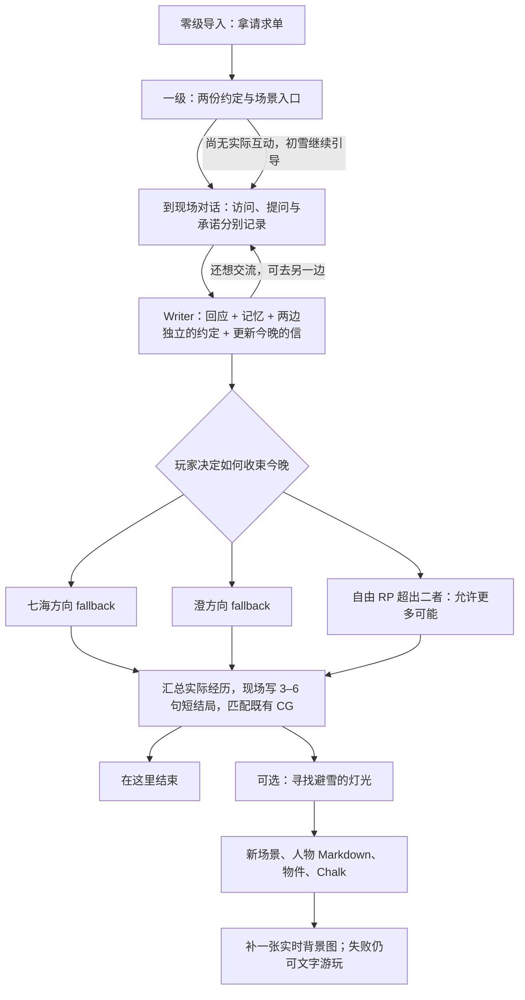

# 初雪短闭环与 AI 生长验收

> 2026-09-13：用户批准继续实现短闭环，同时把作家、Chalk 与实时生成放进自然的玩家流程；生成段按 1–2 分钟设计，不强塞每种能力。本轮不改隔壁生图服务。
>
> **前置口径**：本文的「生成段按 1–2 分钟设计」要求交互后立刻生成，**依赖该世界的 `autoWrite` 打开**；默认 `off` 下动作只落事件、待玩家下一轮回应。逐交互档位见 `../settings/00-共同上下文.md §1bis`。
>

六世界共用口径与其他五份验收见 [六世界总览](六世界短闭环与AI生长验收.md)。2026-09-13 最新确认：**保留七海、澄两个 fallback 收束选项；RP 超出时可以现场写第三种及更多结局**。不是取消两个基础选项，也不是预写第三条固定剧情。结局正文根据此前各层实际 RP 写成，既有 CG 负责呈现，不限定结局数量。下方历史实测单独保留，不代表新规则已经通过真实模型验收。

## 1. 玩家实际要做什么

| 时间预算 | 玩家行动 | 必须看见的结果 | AI 占比 |
|---|---|---|---|
| 0–25 秒 | 读导入，拿请求单 | 身份、约定、进入一级视图的门槛 | 预写，不等待 AI |
| 25–60 秒 | 对照两份约定，进入放送室或咖啡店 | 读懂去哪里，以及为什么去 | 预写；浏览不算承诺 |
| 1–3 分钟 | 在现场对话、赴约，或继续去另一边 | 角色回应、记忆与约定持续更新；“今晚的信”记录经历，不锁路线 | Writer 处理每次真实 RP；不生成图片，不自动判另一人缺席 |
| 3–5 分钟 | 选择七海 / 澄的 fallback 收束，或通过自由 RP 表达别的收束方向 | 两个基础选项始终可用；双边经历与复杂承诺不会被抹掉 | 简单经历有默认方向，复杂经历允许额外可能；不强迫自由输入 |
| 结尾生成预算 1–2 分钟 | 主动触发收束后，在雪景下读这次游玩的短结局 | 根据真实行动、解释与角色回应，现场写出结局本身 | 3–6 句结局 Chalk；不是给预写结局补一段花字 |
| 可选另一次探索 | 主动请求找一处避雪的小地方 | 新 Folder / README、人物、物件与 Chalk；背景后补 | 延续性演示，不再作为主结尾的必要步骤 |

这是目标节拍，不是实测速度。玩家停下来阅读或 RP 不会被倒计时惩罚。背景可先显示中性的既有雪景；根据现场写出的事实再选合适 CG，不为迁就图片篡改剧情。结局保持 3–6 句，不扩成次日完整章节；不强制走扩展段。

## 2. 实现边界

- 入口与初雪 Gate 复用现有 `requires.items`；初雪要求 `player/tonight-letter.md`，模板不预发这封信。
- 这封信是可更新的**经历记录**，不是独占路线或完结凭证。真实对话（包括提问）有回应、记忆与约定记录后即可物化；纯浏览不发信。第二个人的 RP 必须继续更新，不能因信已存在而忽略。门槛只检查文件存在，不声称它是防篡改的剧情裁判。
- 本轮改动入口是 `tools/experiences/first-snow.mjs`，同步到 `templates/first-snow-jp-playtest/` 的世界 skill、两处对话及初雪场景 README / Chalk。素材版 `templates/first-snow-jp/`、隔壁资产调整、引擎、旧存档均不改。
- 现场 README 的 choice 使用已有 `/api/choice` → Writer 路径。不将跨门本身改成强制生成；玩家说“陪你”才触发承诺。
- 两份约定先通过可读 note 表达变化；完整的玩家居中关系拓扑尚未完成，不能把地点目录称作关系画布已验收。
- 新人物在 `resident.md` 中持久化，由 Writer 在 Chalk 内继续 RP；不是已注册的独立 Character Agent，不出现无效的角色对话按钮。已有角色窗口的回复接线见 [Agent 前端接线](../agent/Agent前端接线.md)；它不等于新生成的人物已自动完成角色注册。
- 新地点只在玩家请求后出现；回访保留同一个地方与人物。生图调用现有 `generate_image`，先文本后图片；不重复自动重试，不在此次强制再生成一张独立立绘。
- **两个 fallback + 开放可能**：初雪 Chalk 保留“收束与七海的今晚”“收束与澄的今晚”，以及返回继续交流的动作；玩家也能用自由 RP 提出不同方向。默认方向不等于交往成立，更不替代所选角色的实际互动。两边都走过不必强制第三结局；两边都答应也不固定奖惩，看承诺时间、先后、告知、实际行动与两人的回应。选择 fallback 也不能消除另一边已经发生的事实。
- **未互动继续引导，不提前编完局**：没人回应过时，引导去放送室或咖啡店；尚未去另一边只是未访问，不立刻制造空椅、冷杯或爽约。只有实际行动和剧情时间支持时才写这些变化。真实角色对话已有记录时应补全物化，不要求玩家把同一句话重说一遍。
- **trigger ending 才现场写结局**：首次承诺或进入初雪都不是自动结束。玩家主动收束时读各层 RP、记忆、约定和实物，写 `world/tonight-promises/first-snow/epilogue.md`。路径保留旧名字，但它现在承载结局本体，不是固定结局之后的附文。两个 fallback 都不预写最终台词，第三种也不预写。CG 路径必须真实存在，图不够不能让剧情退回二选一。
- 不是无限塞入原始历史：先按已访问层与事件建立带来源的经历提要，再回读相关原文；关键缺失先问清，不脑补。角色只知道自己的见闻，不因作家读过双方记忆而全知。双重承诺不能自动变成同时在两处到场，也不预设一定被原谅或惩罚。
- 结局和相关记录核验后，用初雪 README 的 `status.data.closingState: complete` 记完成；这是普通作家记录，不增加引擎状态机。回访复用结局，中断只补缺件，不重复抽取。新存档与不同 RP 可以产生不同结局，并不要求每次刷新生成新版本。

## 3. 验证与可看的结果

新增目标验收：零互动继续引导；只有七海 / 只有澄可用各自 fallback；先后去两边或都答应后仍可继续 RP，第一次记录不锁后续；复杂经历可产生额外结局，但不规定结局正文；同一 CG 支持不同且可追溯的结局；重复触发不重复生成。以上真实模型表现本轮未验证。

当前体验版静态检查：`node --test tools/first-snow-ending-contract.test.mjs tools/six-world-experiences.test.mjs`。真实单边探针 `tools/rehearse-experiences.mjs` 已取消“首次赴约必须生成缺席物和最终场景”的旧断言，改为先不写结局、选择 fallback 后再完成；该脚本须显式 `--live` 才调用模型，本轮不执行。它也尚未覆盖双重承诺的真实模型验收。

本轮离线结果：初雪内容契约 5 项、六世界安装与协议 10 项、雾坞与路径回归 8 项通过；7 份体验版 skill / 场景文件与编译源一致，既有背景动画保留。构建通过。没有编写结局样本正文、修改旧存档或调用付费模型。

以下旧探针针对素材版，保留作历史复盘，不是本轮体验版的验收入口。

素材版静态回归：`node --test tools/first-snow-jp.test.mjs`。检查日语、真实资源路径、入场选项、Gate 条件和生成边界；这些不等于真实模型通关。

主动实玩探针：`node tools/play-first-snow.mjs --run --route=nanami --explore`。另一路用 `--route=sumi`；不传 `--run` 不调用模型。每次复制为一个新存档，不改模板或玩家已有存档；调用真实 Writer，记录实际事件。`--explore` 会允许世界使用已配置的生图服务一次，可能产生费用。

探针验证“信、人物记忆、缺席物、结果 README”实际改变；扩展验证四份场景文件，以及图片是否真的落盘。按回合记录耗时与文字/图像是否成功到新存档的 `.airpworld/rehearsal.json`。失败保留现场，不用预写结果冒充。它验证引擎及文件链，不代替鼠标全流程验收，也不自动切换 5173 的当前世界。

实玩探针成功运行后，在 5173 的世界列表中可找到 `first-snow-jp-demo-…` 存档。新开局请从日语初雪模板创建；旧存档不自动套用新的关卡。

### 初雪实施轮记录（保留当时结果，不代表当前全仓状态）

- 构建、七项模板回归、离线 HTTP 流程测试（两处赴约、道具门槛、无效选项不落账、扩展派发）、离线 Writer 探针与注入探针通过；文档校验通过。
- 当时真实 Writer + 生图实玩未执行，审核要求明确外部服务与费用授权，未产生结果存档或测速结论。用户随后指定了 OpenAI 生图方向；本次文档整理不运行外部模型，不将后续授权等同测试通过。
- 当时全仓 `check:ws` 报告 12 项跨端接线问题，属于并行施工范围。这是历史记录，不能据此断言当前仍有 12 项；当前状态须另跑检查。

### 2026-09-13：OpenAI 配置后的首次真实样本

用户已将密钥放入被 Git 忽略的 `.env.local`。本次只在测试进程临时指定模型，不修改该文件；目的地为 `https://api.openai.com/v1`，没有使用其他网关，也不把密钥写入文档或报告。

| 检查 | 本次实测 | 结论 |
|---|---|---|
| 日语模板静态回归 | 7 项通过 | 只证明静态约束 |
| 七海路线真实 Writer | `openai/gpt-4.1`；一轮 18,356 ms | API 可用，但短闭环失败 |
| 独立生图工具 | `openai/gpt-image-2.5-flare`，`low`，1536×1024；总耗时 18,619 ms | 返回真实 PNG，约 2.58 MB；不是缓存复用 |
| 主线 → 扩展 → 生图 | 主线文件断言失败，未进入扩展回合 | 不算整条玩法生成成功 |

Writer 在新存档 `worlds/first-snow-jp-demo-nanami-ca2d5457/` 写出了日语 Chalk，并移除了现场的赴约选项，但没有更新人物记忆、两份约定或初雪结果 README，也没有生成缺席物和 `player/tonight-letter.md`。期间一次 `edit` 把字段写成 `old_text/new_text` 被拒，随后自行改为 `oldText/newText` 成功；最终仍提前结束。这证明阻塞已从“缺少服务配置”变成“真实 Writer 没有完成全部结果物化”，不能把文字回应当通关。

证据保存在该存档的 `.airpworld/rehearsal.json` 与 `.airpworld/sessions/`；模板及原有玩家存档未改。当前生成内容还指向尚未满足门槛的初雪场景，所以此存档用于复盘，不是可展示的已通关样板。

为隔离图像链路，另运行现有 `tools/probe-image.mjs`，只发一次图片请求，结果在 `.artifacts/image-probe/result.json`。实际文件为 `.artifacts/image-probe/.airpworld/assets/gen/a-small-covered-waiting-nook-bes-ba0f60c263ebfd5c.png`；图中是学校旁的有顶候车角、木长椅、暖灯与初雪，已目视确认无人物、无可读文字或 UI。没有把这张独立测试图挂进未生成的雪宿场景，避免假装玩法链已完成。

本次直接 API / 项目工具调用的生图 Prompt：

> A small covered waiting nook beside a Japanese school on the first snowy evening of winter. A warm lamp, a wooden bench and snow drifting beyond the roof. Warm anime illustration matching a gentle school radio romance game, wide quiet composition with space for narrative cards, no people, no readable text, no UI, no watermark.

模型选择依据为 [OpenAI 的 Flare 模型说明](https://developers.openai.com/api/docs/models/gpt-image-2.5-flare)。**18.6 秒是单张图片的单次样本，未达到 10 秒，不是稳定延迟、整段扩展耗时或实际费用结论。** 下一步应先让 Writer 的记忆、缺席物、结果与信完整落盘，再重新验自然扩展与浏览器动线；不靠手写一封信绕过 Gate。
