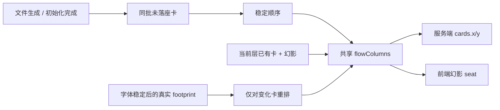

# docs/layout/00 — 生成组件自动排版共同上下文（冻结契约）

> 2026-09-13。本文是「生成组件不重叠」设计批次的共享地基。`01`–`05` 设计篇 MUST 遵守本文冻结的形状；发现冲突写入各自篇章，不在篇内私改契约。
>
> 本批研究对象：作家/初始化器/上帝之手新落盘的 Chalk 与组件首次进入画布时的座位、批内顺序、幻影过渡，以及玩家对 Chalk 的拖拽权限。

---

## 0. 先给结论

采用**一次性生成批次的列流式排版（flow columns）**，替代当前以中心锚点为起点的 Ulam 螺旋：

- 每个自动排版批次按稳定顺序从上到下填充一列；超过列高后向右开新列。
- 新列的起点必须避开当前层已经存在的实体；右侧有实体就继续向右找，不挤动旧卡。
- 已经有坐标的实体永不因新批次到来而重排。实测占位变化触发的 F1 纠偏仍可重排**发生变化的卡**，但使用同一套列流排版，不另造几何。
- 服务端落位、前端生成幻影、footprint 纠偏共用一个纯函数契约；不能再出现服务端 spiral、前端 `phantomSeatFor` 各自实现两套几何。
- 非上帝模式下 Chalk **仍可点击、展开、使用 choice / dice / item**，但不进入卡片拖拽状态；上帝模式显式打开后才允许拖动 Chalk。这个锁是交互语义，不是 HTTP 鉴权。

目标不是「把所有卡永远排成规则网格」，而是把自动生成内容变成一条可读的叙事流，同时尊重玩家已经摆好的空间。



---

## 1. 权威层级

冲突时按以下顺序裁决（高 → 低）：

1. 本文冻结的排版形状与玩家交互边界；
2. `docs/footprint/00-共同上下文.md` 的真实占位尺寸、I1/I2 与「只给无行卡初次排座」边界；
3. `docs/perform/00-共同上下文.md` 的幻影不可拖、落地座位过户与 `phantom.ts` 共享原则；
4. `docs/init/00-共同上下文.md` 的初始化幂等、零 AI 兜底与事件语义；
5. `docs/wiring/00-共同上下文.md` 的唯一 WS、跨端消费与上帝模式现状；
6. `docs/doc-06-演出与交互设计.md`、`docs/doc-05-AIRP产品构想.md` 的视觉目标；
7. 当前施工代码与旧设计中的 spiral 约定。

本批不改变事件分类、不引入第二个世界真相源、不把布局派生数据写入正文文件。

---

## 2. 已复核的现状与真实缺口

### 2.1 当前确实会造成视觉问题的链路

- 新卡由 `apps/server/src/routes/world.ts` 的 `GET /layer` 读取；当前代码把 `unseated` 传入 `store.seatUnplaced`，目标接缝改为传页面完整 `items`，由 store 在事务内过滤无 row，再由 `reseatLayer` 处理占位漂移（`routes/world.ts` 的 `/layer` 分支）。
- `LocalWorldStore.seatUnplaced` 今天会按路径排序，在 `SEAT_ANCHOR` 周围按 Ulam spiral 找空位（`packages/shared/src/store/local-store.ts:592-676`；常量在 `:20-27`）。它只保证几何上找空位，不表达「叙事顺序」或「列高」。
- 共享占位契约已修掉同批卡全落同一点的 bug：批内每次插入会 `occupied.push`，`nextZ++`（`local-store.ts:666-675`；`docs/footprint/00 §3.2.1`）。这只能解决硬重叠，不能解决视觉编排。
- `apps/web/src/lib/phantom-seat.ts:49-62` 仍用前端 `seatSpiral`，并把当前卡片与**仅 image 幻影**作为 occupied；`docs/perform/00 §5` 已明确前后端输入集合可能不同、真实重取优先。这是正确的安全网，但不是理想的视觉同构。
- `apps/web/src/components/canvas/Canvas.tsx:145-174` 只负责按真实 DOM 边界取景，不能再把它当第二个排版器；该 effect 明确禁止回写卡坐标。
- `apps/web/src/components/canvas/Canvas.tsx:239-267` 的 viewport dispatcher 目前对所有 `.object` 统一启动卡片拖拽；`CanvasObject` 的 `data-no-drag` 只保护交互子元素，尚没有 Chalk 专属锁。
- `apps/web/src/App.tsx:108` 的 `attention` 同时承载 authoring chrome；`App.tsx:518-547` 把它传给 Canvas 的只有上帝菜单回调。**不能直接把 `attention === 'authoring'` 当 Chalk 解锁条件**：底部写作按钮也会切入该 attention，God Hand 与玩家写行动不是同一个权限语义。

### 2.2 已有架构中不可推翻的事实

- `cards.width/height` 是跨会话排版的真实占位；初次排座用 declared，稳定渲染后由 footprint 覆盖（`docs/footprint/00 §3.1-§3.5`）。
- 自动排座只处理没有行的卡；显式 `arrange({place})`、玩家拖拽与 `seatNear` 是另一类动作，不能被新 flow 自动重排吞掉。
- 初始化器是文件生成者，不是布局拥有者；`airp-init` 的成功/失败由 `layer_initialized` / `layer_init_failed` 记录，布局仍从文件与 canvas store 派生（`docs/init/00 §2.3、§6`）。
- WS 只有 `useWorld` 一个消费点；本批不新增帧名。幻影是临时投影，真实文件和 `cards` 行落地后由重取接管（`docs/perform/00 §5、§6b`）。
- Chalk 正文可以很高：真实实测曾有 `declared h=190`、绘制高 `481–578`，且互动 widgets 是主要增高来源（`docs/footprint/00 §2.3-§2.4`）。因此不能用 `CARD_FORMS.chalk.h` 作为长期排版真相。

---

## 3. 术语与批次边界

### 3.1 自动排版批次

**一个批次 = 一次 `seatUnplaced(layerId, files)` 调用在数据库临界区内过滤出来的无 canvas 行文件集合。** `files` 是调用方传入的候选集合，不要求调用方预先过滤；规范的 `/api/layer` MUST 传入当前页面的完整 `items`，由 store 重新读取并过滤无行项。

这样定义不依赖模型 turn、事件时间或内存队列：

- 同一轮写下的多个文件若在一次 `/api/layer` 读取前一起可见，就同批进入列流；
- 文件监听抖动造成多次读取时，每次只把仍无行的文件作为新批次，旧卡不动；
- 同一 world/layer 的 read → flow → insert 必须复用既有 SQLite `BEGIN IMMEDIATE` 写事务，并可配合实例内按层异步锁；**禁止**新增锁表、文件锁或第二个跨进程业务状态源；
- canonical `/api/layer` 调用方 MUST 为候选 files 派生稳定 `order`：同批 Chalk 阶段优先于已注册组件，已注册组件优先于其它实体；每个阶段内按显式 order、编号前缀、稳定 ASCII path 排序。缺省调用方没有 kind/order 时，纯函数按 `order ?? id` 的稳定 ASCII 顺序；
- store 读取 occupied 时必须纳入调用方传入的页面 items 对应 rows，包括页面上的跨层子层门牌；不能只用 `cards WHERE layer = ?` 代替页面集合。

`SeatFile` 设计新增字段时只能是**排序提示**，不能把 batch id 写进正文或 `cards.metadata`。footprint 契约已冻结 metadata 只有 `formVersion / measuredAt / seatW / seatH` 四键，不能把它当布局垃圾桶。

### 3.2 三种位置来源

| 来源 | 是否进入 flow | 是否可被新批次移动 | 语义 |
|---|---:|---:|---|
| 无 canvas 行的新文件 | 是 | 只影响自己的新行 | 自动给落脚点 |
| 显式 `arrange({place})` / `seatNear` / 已有 x/y | 否 | 否 | 玩家、工具或动作已指定座位 |
| footprint 变化 / kind 版本变化 | 只重排触发变化的行 | 不移动稳定兄弟 | 保证真实盒子不重叠 |

---

## 4. 冻结的 flowColumns 形状

### 4.1 纯函数签名（NEW，最终落点由 `01` 设计篇裁定）

```ts
export interface AutoLayoutBox {
  id: string;
  w: number;
  h: number;
  order?: number;
}

export interface AutoLayoutRect {
  id?: string;
  x: number;
  y: number;
  w: number;
  h: number;
}

export interface FlowLayoutConfig {
  origin: { x: number; y: number };
  columnHeight: number;
  gapX: number;
  gapY: number;
  obstacleGap: number;
  maxColumns: number;
}

export interface FlowLayoutResult {
  placements: Array<{ id: string; x: number; y: number; w: number; h: number }>;
  exhausted: boolean;
  columnsUsed: number;
}

/**
 * Stable column-major placement. Existing obstacles are never moved; input
 * boxes are placed in order, top-to-bottom, then left-to-right.
 */
export function flowColumns(
  boxes: readonly AutoLayoutBox[],
  occupied: readonly AutoLayoutRect[],
  config?: Partial<FlowLayoutConfig>,
): FlowLayoutResult;
```

### 4.2 算法不变量

1. 先按 `order`、再按 `id` 稳定排序；不能依赖 SQLite 返回顺序或模型输出顺序。
2. 当前列从 `origin.y` 向下放置；下一个卡片的 `y` = 当前列最后一个实际盒子的 bottom + `gapY`。
3. 若卡片放下后超过 `origin.y + columnHeight`，从下一列重新尝试；列 x = 该列已放卡最大 right + `gapX`。
4. 每个候选位置同时检查 `occupied` 与本批已经放置的 boxes；检查使用真实 `w/h` + `obstacleGap`，不是 form 的名义高。
5. 右侧候选列若与旧实体的矩形横向相交，继续向右扫描；不能把旧实体挪开，也不能把新卡叠到旧实体上。
6. 卡片自身 `h > columnHeight` 时允许单卡独占一列，不无限扫描；结果标记 `exhausted=false`，因为它是合法的超高内容，不是算法失败。
7. 达到 `maxColumns` 仍无空位时返回最后一个候选并 `exhausted=true`；调用方必须记录开发者可见诊断，但不能回退到中心重叠点。
8. 函数不读 DOM、不读相机、不写 DB、不发事件；服务端、幻影和测试只能调用它。

### 4.3 默认视觉参数（设计值，代码实现前允许由评审以截图校准）

- `origin = { x: 360, y: 96 }`：给入口与首批叙事留出可读的左上起点；相机仍按真实 bounds framing。
- `columnHeight = 1080`：以世界坐标表达一屏以上的叙事长卷，不依赖具体浏览器 viewport。
- `gapX = 56`、`gapY = 32`：列间有方向感，段落之间留出呼吸。
- `obstacleGap = SEAT_PAD`（沿用 `22`，不再出现两套 padding）。
- `maxColumns = 64`：无限画布的保护阀，不是用户可见的布局边界。

这些数值不是 `CARD_FORMS` 的尺寸，也不是前端碰撞第三套真相；它们只定义新批次的构图节奏。

---

## 5. Chalk 交互权限（冻结）

### 5.1 非上帝模式

- `kind === 'chalk'` 的 `.object` 不得创建 `CardDragSession`；pointerdown 仍可落到 Chalk 自己的阅读/互动 DOM。
- `choice`、`roll_dice`、`use_item_on`、阅读面板、键盘 Enter 语义不变。
- 不使用 `pointer-events: none` 关闭整张 Chalk，因为那会连互动字段一起禁用。
- 视觉上可用 `cursor: default` 或轻微锁定提示，但不能给玩家一个点击后无反应的假拖手势。

### 5.2 上帝模式

- 新增明确的 `godCanvasEdit` / `isGodHandOpen` 语义，由 God Hand 控件控制；不能复用 `attention === 'authoring'`。
- `Canvas` 接收 `allowChalkDrag: boolean`（或等价命名）；只有它为真时才跳过 Chalk drag guard。
- 上帝模式允许拖动 Chalk，仍复用既有 `moveCard → /api/card/position → arrangeCards({place})` 链路；不新增第二套坐标写入。
- 幻影永远不可拖，即使 God Hand 打开；它没有真实 path，且落地后由真实卡接管。

### 5.3 权限边界的诚实性

当前 `/api/card/position` 固定以 `{ type: 'player' }` 调动作（`apps/server/src/routes/world.ts:830-846`），前端锁是体验语义，不是安全边界。若未来要做真正的权限控制，必须另开认证/actor 设计；本批不把本地 God Hand 假装成安全鉴权。

---

## 6. 幻影与落地契约

- `chalk_writing` / `image_generation_progress` 仍只创建临时幻影；幻影 seat 由同一个 `flowColumns` 计算，occupied = 当前层真实卡 + 同层幻影。
- `chalk_landed` / `image_landed` 不改 seat；这是座位过户，不是第二次排版。
- `file_changed` 或 `world_event` 触发真实重取后，`reconcileLanded` 撤掉幻影；服务器返回的真实坐标优先。
- 幻影尺寸必须明确区分：图片用 `ghostSizeFor`；Chalk 至少使用 declared footprint，并在文档中标注这只是临时保守估计，不能写回 `cards.width/height`。
- 不新增 WS 帧名；若实现必须携带排序/批次信息，优先复用既有帧可选字段，不能让前端自行猜不同的 batch 语义。

---

## 7. 与四个现有批次的接缝

| 批次 | 本批必须遵守 | 本批准备修正的旧假设 |
|---|---|---|
| `perform` | 幻影注册表唯一、落地不跳位、`useWorld` 唯一 WS | `phantomSeatFor` 不能继续拥有第二套 spiral 几何 |
| `footprint` | 行值是真实占位、metadata 四键封闭、旧坐标不被普通测量回写 | 排版器不能再读 `CARD_FORMS.h` 代替 row h |
| `init` | 生成是文件/事件链，判空与幂等优先 | 初始化器不负责写 canvas 坐标；生成完成由普通 layer 读取批量入座 |
| `wiring` | Chalk 解锁必须有明确前端状态，不能新增第二个 WS | `attention` 不是权限；`useWorld` 不承担拖拽授权 |

---

## 8. 明确不做

1. 不持续重排已有全部卡，不做「每次刷新都整理成漂亮网格」。
2. 不把玩家手动位置迁回自动流，不添加隐式 snap-to-grid。
3. 不把 `cards.metadata` 扩成任意布局 JSON；如确需来源标记，另开 schema/列并先评审。
4. 不在 Canvas framing effect、React render 或拖拽 pointermove 内再调用自动排版。
5. 不用 CSS `overflow:hidden`、固定高度裁切 Chalk 来假装解决重叠。
6. 不让初始化器、作家提示词或组件工具各自发明 x/y；座位只有存储层与共享纯函数两个接缝。
7. 不将「布局好看」偷换成「所有卡都不重叠」：两者都要验收，前者用截图/浏览器，后者用几何断言。

---

## 9. 设计篇统一要求

每篇子文档必须包含：一句话定位、现状证据、行为步骤（每步说明漏了会怎样）、精确代码落点、输入/输出与副作用、失败边界、与本契约的交叉引用、验收用例（至少一条修复前会失败的非空性用例）、发现的冲突、仍未知待拍板。

文档中的现状断言必须带 `file:line` 或函数锚点；新增函数标 `NEW` 并写完整签名；示例必须只使用真实存在的符号。子代理跳过全量 build/test/lint，主 agent 在评审后统一验证。
