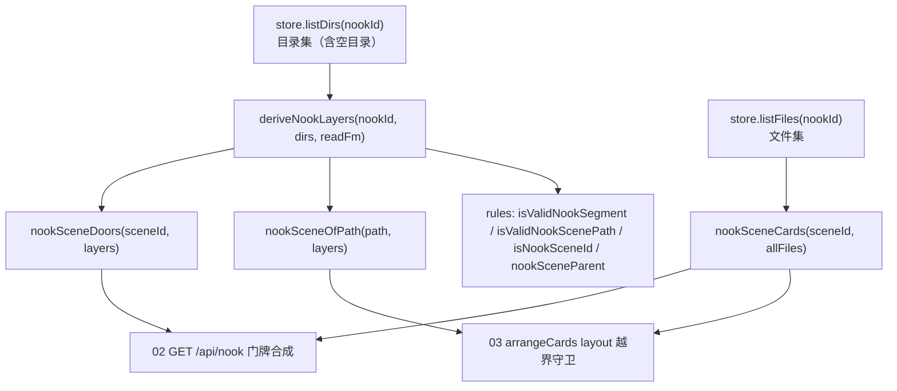

# docs/nook-scene/01 — 共享派生层（N2a）

> 2026-09-15。本文是 N2「nook 子场景」批次的 **N2a 文档**，范围 = `docs/nook-scene/00-共同上下文.md` §5.1 / §5.2 / §5.3 的**唯一实现面**：
> `packages/shared/src/store/nook-layers.ts`（**NEW 文件**）+ `packages/shared/src/rules/characters.ts` 的五个新增函数（§5.1 四条 + 已回写契约的第五条 `nookScenePathOf`，§2.1.1）+ `listDirs` 的泛化（§2.3 / §8 P1、P7、P8）。
> 本文**只**定义共享纯函数层。**不写**端点（`02`）、**不写**座位/门禁（`03`）、**不写**前端（`04`）、**不写** `isNookEmpty`（`05`）。`02`/`03` **调用**本文的函数，签名以本文与 §5 为准。
> 冻结形状**逐字遵守** `00-共同上下文.md`；本文不改它，发现的问题进第 11 节。

---

## 1. 一句话定位

**nook 侧平行派生**：用 `layers.ts` 已有的 id 无关纯函数（`dirOf` / `cardsOfLayer` / `childLayers`，`store/layers.ts:46/106/121`），在 `store/nook-layers.ts` 里另建一条**只认 `characters/<id>/` 子树**的场景树派生，并收口「一个场景显示哪些卡」与「场景 id 的合法性」两件事。

它解决的**唯一问题**（`00` §1 实测）：作者的 5 个子场景目录（历史快照 `characters/elias/{balcony,living-room,office,parallel-timeline,writing}`；`writing/` 已**提交**改名为 `meta/` —— commit `0424fe8`，2026-09-15，`git status` 现为空）今天对 `nookCardPaths` **全部不可见**，因为没有一条「子场景」的通路。本文提供这条通路的**纯函数地基**。



**生产端 / 消费端（跨端同批点名）**：本文的函数是**生产端**；消费端是 `GET /api/nook`（`02-取数端点与门牌`，读 `nookSceneCards` + `nookSceneDoors` 造 `items`/门牌）与 `arrangeCards` 的两个分支（`03-占位座位与摆放`，读 `nookSceneOfPath` 做越界守卫、`nookSceneCards` 取页面成员、`isNookSceneId` 换掉旧门禁 `actions/canvas.ts:566-576`）。**没有本文，02/03 无处可调**；没有 02/03，本文的函数不被消费（`event-bridge`/前端都不直接碰它们）。

---

## 2. 签名参数

全部集中在契约 §5.1/§5.2/§5.3，本文**逐字引用**，并补上实现面才需要的信息（文件、import 方向、边界）。

### 2.1 `packages/shared/src/rules/characters.ts`（既有文件，新增 **5** 个函数）

```ts
// === 既有（不动） ===
// characters.ts:21  const CHARACTER_ID_RE = /^[a-z0-9][a-z0-9-]*$/;
// characters.ts:24  isValidCharacterId(id: string): boolean
// characters.ts:35  nookIdOf(id: string): string | null
// characters.ts:46  characterIdOfPath(path: string): string | null
// characters.ts:62  characterRootConfigOf(path: string): 'README.md'|…|null
// characters.ts:90  nookCardPaths(allFiles: readonly string[], nookId: string): string[]

/** NEW — 子场景的单个路径段：与角色 id 同一条 kebab-case 正则（复用 CHARACTER_ID_RE）。 */
export function isValidNookSegment(seg: string): boolean;

/** NEW — 场景相对路径（相对角色根）是否合法。'' / null / undefined ⇒ true（角色根）。逐段校验，MUST NOT normalize。 */
export function isValidNookScenePath(scene: string | null | undefined): boolean;

/** NEW — 完整 nookSceneId 校验：characters/<id>[/<seg>]* */
export function isNookSceneId(id: string): boolean;

/** NEW — 场景 id 的父场景 id（根场景的父 = null；非法输入 = null）。 */
export function nookSceneParent(sceneId: string): string | null;

/** NEW — 完整 nookSceneId → 相对 `nookId` 的路径段；`=== nookId`（角色根）⇒ `''`；不在 `nookId` 子树内 / 非法 ⇒ `null`。（04 的导航转换；§2.1.1） */
export function nookScenePathOf(sceneId: string, nookId: string): string | null;
```

**约束（`characters.ts:3-6` 逐字声明）**：本文件 **zero dependencies**（no zod / no yaml / no node builtins），因为服务端路由、`airp-init` 扩展、`node --test`（无 build）都要 import 它。**五个新函数 MUST 保持这条**：只允许调用同文件既有符号（`CHARACTER_ID_RE` / `isValidCharacterId`）与 `./emptiness.js`（`characters.ts:18` 已 import `directChildrenOf`）。**MUST NOT** import `store/layers.ts`（它拉进 `schemas/world.ts` → zod，破坏 charter）。

> **为什么 `isValidNookScenePath` 的参数是 `string | null | undefined`**：契约 §5.1 **曾写** `(scene: string)`，但其散文要求「`'' / null / undefined ⇒ true`」；消费端 `04` 的 `nookScene: string | null`（`00` §4.6）与 `GET /api/nook?scene=`（缺省即 `null`）**确实会传 null**，用 `string` 会在类型层拒收、并逼每个调用点 `?? ''` 归一（把「null = 角色根」的知识散出去）。**已裁决（2026-09-15）：采纳 `string | null | undefined`，已回写契约 §5.1**（见第 11 节 C1）。本文 §8.1 实现即此签名。

#### 2.1.1 `nookScenePathOf` —— **契约 §5.1 的第五条冻结函数**（本文 §2.1 收编；已回写契约）

`N2Front(04)` 实测：门牌回调 `CanvasObject.requestEnter` 把**完整世界根路径**交给前端（`gateTarget = path.replace(/\/README\.md$/, '')`，`CanvasObject.tsx:235-237`），例如 `characters/elias/office`；而 `GET /api/nook?scene=` 要的是**相对角色根的段** `office`（`00` §4.2）。**两端同一个转换 ⇒ 只能有一个实现**（`00` §5.1「禁止各处自行拆分字符串判断」）。

- **签名（终裁：两参版）**：`nookScenePathOf(sceneId: string, nookId: string): string | null`。返回值三态：
  - `sceneId === nookId`（角色根）⇒ **`''`**（合法值）。
  - `sceneId` 在 `nookId` 子树内 ⇒ 相对段（`'office'` / `'a/b'`）。
  - 不在 `nookId` 子树内 / 非法 ⇒ **`null`**。
- **落点**：`rules/characters.ts`（与 `isNookSceneId` / `nookSceneParent` 同处，共享 `zero-deps` charter）。
- **为什么必须两参（主 agent 终裁，本文初稿的单参版被覆盖）**：
  1. **单参版把「越界」吞掉**：`nookScenePathOf('characters/ryo/office')` 会返回 `'office'` —— 一个正在看 `elias` 的调用方会**静默进入 elias 的 office**（正对应 `04` 实测的换角色过继）。两参版对该输入返回 `null`（`ryo` 不在 `elias` 子树）。「调用方已先做 `characterIdOfPath`」是**前置条件而非强制**，而这类越界在本项目**真的会发生**。
  2. **单参版把「合法的根」与「非法输入」都映射成 `null`**，两者语义相反却不可区分；两参版用 `''` = 合法根、`null` = 越界，**可区分**。`''` 是**合法值**（消费端 `04` 保留对其的归一，不得删）。
- **边界**：`nookScenePathOf('characters/elias/office', 'characters/elias')` ⇒ `'office'`；`('characters/elias', 'characters/elias')` ⇒ `''`；`('characters/elias/a/b', 'characters/elias')` ⇒ `'a/b'`；`('characters/ryo/office', 'characters/elias')` ⇒ `null`；任一参非法 ⇒ `null`。
- **「返回」不经共享层**（主 agent 终裁 C2）：前端对**相对段**自取前缀（`'a/b'` → `'a'`；`'office'` → `null`），**不收口到共享层** —— 它不是判断，只是对已校验值域的前缀操作。本文不支持 `nookSceneParent` 走前端返回路径。

### 2.2 `packages/shared/src/store/nook-layers.ts`（**NEW 文件**）

```ts
import type { LayerConfig } from '../schemas/world.js';        // world.ts:65
import { cardsOfLayer, childLayers } from './layers.js';       // layers.ts:106 / :121
import { characterIdOfPath, nookCardPaths, nookSceneParent } from '../rules/characters.js'; // :46 :90 :NEW

/** NEW — 从目录集派生该角色的场景树。与 deriveLayers 同型，根是 nookId（parent = null），只收 nookId 子树。 */
export function deriveNookLayers(
  nookId: string,
  dirs: readonly string[],                                     // MUST 来自 store.listDirs(nookId)（§2.3）
  readFm: (dir: string) => Record<string, any> | null
): Record<string, LayerConfig>;

/** NEW — 场景的直接子场景 id 列表（稳定序）。= childLayers(sceneId, deriveNookLayers(...)) */
export function nookSceneDoors(sceneId: string, layers: Record<string, LayerConfig>): string[];

/** NEW — 一个路径属于哪个 nook 场景（最长前缀）。无匹配 / 越界 ⇒ null（不是 'map'）。 */
export function nookSceneOfPath(path: string, layers: Record<string, LayerConfig>): string | null;

/** NEW — 一个 nook 场景的「卡」路径集（不含门牌，不含自身 README，不递归）。 */
export function nookSceneCards(sceneId: string, allFiles: readonly string[]): string[];
```

### 2.3 `packages/shared/src/store/local-store.ts` + `store/world-store.ts`（P1 + P7 + P8，**归本文**）

```ts
// local-store.ts:349  形参加默认值（唯一既有调用点 scanLayers(:455) 无参 ⇒ 逐字节不变）
async listDirs(prefix = WORLD_DIR): Promise<string[]>;
//   + P8：walk 的 entry 跳过条件补 node_modules（对齐 listFiles:331）

// world-store.ts:159 之后  接口补签名（LocalWorldStore 已有实现，接口零成本）
listDirs(prefix?: string): Promise<string[]>;
```

**为什么 P1 归本文**：契约 §2.3 把 `listDirs` 的泛化判给 `01`；**§8 P7** 又把「补进 `WorldStore` 接口」判给 `01`（**同一条改动，一次写清**，不拆两处）。`ActionContext.store` 是 `WorldStore`（`actions/types.ts:11`），`arrangeCards` 只握接口 ⇒ 不加签名则 `03` 的 layout 守卫**编译期就不通**（证据：`grep listDirs` 在 `world-store.ts` 零命中；`docs/tools/03-look-at与画布感知.md:873` 早已登记为「冲突 1」）。

**为什么 P8 必补**：见 §8.3 —— `listDirs` 的 `walk` 只跳点开头（`:360`），而 `listFiles` 还跳 `node_modules`（`:331`）。泛化后 `node_modules/` 会成为 nook 门牌。**同一原语的两个行走 MUST 同规则。**

---

## 3. 行为契约逐步

### 3.1 `deriveNookLayers(nookId, dirs, readFm)`

**输入契约**：
- `nookId`：角色根场景 id，形状 `characters/<id>`（`00` §4.1）。本文**不校验**它（校验是 §5.1 的事，调用方负责），但**假定**它合法。
- `dirs`：**MUST** 来自 `store.listDirs(nookId)`（`00` §2.3）。它返回 `[nookId, ...nookId 子树下每个目录]`（相对 world root，无前导/尾随 `/`），**包含完全空的目录**。
- `readFm(dir)`：返回该目录 `README.md` 的 frontmatter，或 `null`（无 README ⇒ stub 场景）。与 `scanLayers`（`local-store.ts:456-463`）同型。**约定 `readFm` 不抛**（缺文件返回 `null`）。

**步骤**：

1. **过滤子树**：`const treeDirs = dirs.filter(d => d === nookId || d.startsWith(`${nookId}/`)).sort()`。
   *漏了会怎样*：若把别的角色的目录（或 `world/**`）混进来，树里会长出孤儿场景，`nookSceneDoors` 会把它们当门牌 —— 越界数据进入本角色画布。
2. **建 `inTree` 集合**：`const inTree = new Set(treeDirs)`。
3. **逐目录建 key**，`key = d` 本身（**不做 `layerOfDir` 映射** —— nook 没有 `map` 虚根）。
   - 求 `parent`：从 `d` 的最后一个 `/` 向内扫描祖先（`for (let i = d.lastIndexOf('/'); i > 0; i = d.lastIndexOf('/', i - 1))`），取**第一个在 `inTree` 里的祖先**为 `parent`；找不到 ⇒ `null`。
     *漏了会怎样*：`parent` 全 `null` ⇒ `nookSceneDoors` 对任何场景都返回 `[]`，门牌全消失、前端进不去子场景。
   - `nookId` 自身的 parent **必为 `null`**：其祖先 `characters` 不在 `inTree` 里（子树过滤已排除）。**这就是「根 = 无父」的实现，不需要特判。**
     *漏了会怎样*：若错误地把 `characters` 当父，`nookSceneParent('characters/<id>')` 与树不一致，前端「返回」会指向一个不存在的场景。
   - `name` / `material` / `stub` 与 `deriveLayers`（`layers.ts:81-93`）**同规则**：有 fm ⇒ `name = fm.name ?? <末段目录名>`、`material`；无 fm ⇒ `stub: true`。
     *漏了会怎样*：门牌卡失去名字与材质，前端只能显示裸目录名。
4. **返回** `Record<sceneId, LayerConfig>`，key 集 = `treeDirs`。

**不变量（机械可核验，见 §10）**：
- **I1**：`Object.keys(deriveNookLayers(nookId, dirs, readFm)).sort()` **⊆** `listDirs` 输出里属于 `nookId` 子树的目录集（且因步骤 1 的过滤恰好**相等**）。
- **I2**：`deriveNookLayers(...)[nookId].parent === null`，其余 key 的 `parent` 是**更短的合法场景 id**。
- **I3**：对任意 `k ∈ keys`，`k === nookId || k.startsWith(nookId + '/')`（无越界 key）。

**取舍：平行实现，不抽共享 core**（任务点名要求给出理由）：
- **候选 A（采用）**：在 `nook-layers.ts` 内平行实现父链行走（约 12 行）。
- **候选 B（拒绝）**：把 `deriveLayers`（`layers.ts:56`）的核心抽成带参数的内核 `deriveTree(dirs, readFm, {root, mapRoot})`，让两者共用。**拒绝理由**：(1) 会**修改既有导出函数 `deriveLayers`**，而本文边界明令「不动 `layers.ts` 既有函数」；它被 `local-store.ts:464`（`scanLayers`）与 `look-at.ts:237` 消费，是承重函数，为零收益改动它不划算。(2) 二者的语义**本就不同** —— `deriveLayers` 硬编码 `world/**` 过滤（`layers.ts:61-62`）并把 `world`→`map` 映射（`layers.ts:74`），nook 版两者都不做；抽 core 必然引入 `rootFilter` + `idMapper` 两个参数，把简单函数变成可配置机器。
- **候选 C（拒绝）**：把 nook dirs 重写成 `world/**` 再喂 `deriveLayers`、回键名。**拒绝**：依赖 `layerOfDir` 映射与「`world` 不在输入里」的巧合，读者无法一眼看懂，是「聪明但晦涩」。
- **真正的复用点**是 id 无关的纯函数：本文**复用** `dirOf`（`layers.ts:46`）做路径语义、`childLayers`（`:121`）做门牌、`cardsOfLayer`（`:106`）做成员、`nookCardPaths`（`characters.ts:90`）做角色根成员。契约 §5.3 要求的「MUST 复用」指的是这些**原语**，不是 `deriveLayers` 本身（后者契约自己也标 ❌，`00` §2.1 表）。

### 3.2 `nookSceneDoors(sceneId, layers)`

**实现**：`return childLayers(sceneId, layers);` —— **逐字委托**（`layers.ts:121`）。

**与 `childLayers` 的关系（任务要求说明）**：`childLayers(layerId, layers)` 逐字 `Object.keys(layers).filter(id => id !== MAP_LAYER && layers[id].parent === layerId).sort()`（`layers.ts:125-127`）。
- **可以**直接复用：它只读 `layers[id].parent`，对 key 的**形状无假设**；`id !== MAP_LAYER` 对 nook 树**恒真**（nook 树永不含 `'map'` key，§3.1 步骤 3）。排序稳定（`.sort()`）。
- **为什么仍包一层**：契约 §5.3 冻结了这个符号，且它给了 `02`/`03` 一个**从 `nook-layers.js` 来的具名入口** —— 否则调用点必须自己 import `layers.ts` 的 `childLayers`，就有「有人顺手改用 `pageOfLayer` 拿门牌」（世界作用域，`local-store.ts:2271`）的风险。包装**只**是入口收敛，**零逻辑**；将来 nook 门牌语义若变，改动面收敛到这一行。
- **不去复用的替代写法（拒绝）**：手写 `Object.keys(layers).filter(...)`。那是把 `childLayers` 的实现**复制**一份，正是 `AGENTS.md §3`「优先使用现有原语」禁止的。

### 3.3 `nookSceneOfPath(path, layers)` —— **本文唯一不直接复用 `layerOfPath` 的函数**

**问题（契约 §5.3.1 实测）**：`layerOfPath`（`layers.ts:130`）逐字 `let best = MAP_LAYER;`（`:131`）——**无匹配时兜底返回 `'map'`**。对层体系正确（任何路径都属于 `map`），但对 nook 树是**静默错误**：

```text
layerOfPath('characters/ryo/other.md', eliasTree)  -> 'map'   ❌
layerOfPath('player/bag/item.md',      eliasTree)  -> 'map'   ❌
```

**危害**：`03` 的 layout 越界守卫将是 `nookSceneOfPath(p, nookLayers) === layer`（`00` §5.5）。若越界路径返回 `'map'`，则「`layer='map'` + 一批 `characters/<id>/…` path」会让守卫**恰好通过** ⇒ 越界写入不被拦，守卫存在的理由被消解。

**实现（选定：在 `nook-layers.ts` 内写最长前缀，去掉兜底）**：

```ts
export function nookSceneOfPath(path: string, layers: Record<string, LayerConfig>): string | null {
  // ① 必须先确证 path 落在 characters/<id>/ 子树内（契约 §5.3；characterIdOfPath 是既有纯函数）
  if (characterIdOfPath(path) === null) return null;
  // ② 最长前缀匹配，但【无 toplevel 兜底】：无匹配 ⇒ null，绝不返回 'map'
  let best: string | null = null;
  for (const id of Object.keys(layers)) {
    if (path === id || path.startsWith(`${id}/`)) {
      if (best === null || id.length > best.length) best = id;
    }
  }
  return best;
}
```

**取舍：为什么写这几行，而不是「抽 `layerOfPath` 的 core + 兜底参数」**：
- 契约 §5.3 给了两条路（自写几行 / 抽带兜底参数的内核共用）。**本文选前者**，因后者**要改 `layers.ts` 的既有导出函数 `layerOfPath`**，而本文边界**明令**「不动 `layers.ts` 既有函数」。`layerOfPath` 被 `local-store.ts:2306`（`deriveLayer`）与 `look-at` 消费，改它会触碰层树的承重语义，**收益（省 5 行）为零且风险非零**。
- **这不算「复制粘贴」**：契约禁止的是**复制语义**。这里是**一个语义不同的函数**（去掉兜底、加了 `characters/` 子树闸），且真正的地基（路径/树形状）仍是 `layers.ts` 的定义。若将来 `layers.ts` 新增 `layerOfPathOrNull(path, layers)`，本文应改为委托它 —— **登记为第 12 节**。
- **① 的子树闸是否冗余**：对 `world/inn/a.md`、`player/bag/item.md`，② 的最长前缀本就无匹配 ⇒ `null`。① 的价值是**在语义上显式**声明「本函数只回答 nook 归属」，并挡住「树里恰好有个 key 是 `characters/elias`，而 path 是 `characters/elias-x/…`」这类前缀错觉。保留。

**边界（实测推演）**：
- `nookSceneOfPath('characters/elias/office', tree)` ⇒ `'characters/elias/office'`（`path === id` 分支，与 `layerOfPath` 同）。
- `nookSceneOfPath('characters/elias/office/desk.md', tree)` ⇒ `'characters/elias/office'`。
- `nookSceneOfPath('characters/elias/unspoken.md', tree)` ⇒ `'characters/elias'`。
- `nookSceneOfPath('characters/ryo/x.md', eliasTree)` ⇒ `null`（**不是 `'map'`**）。
- `nookSceneOfPath('', tree)` ⇒ `characterIdOfPath('') === null` ⇒ `null`。
- `layers` 里**没有**任何 `'map'` key ⇒ 即使 path 恰好是 `'map'`，无匹配 ⇒ `null`。

**不变量（机械可核验）**：
- **I4**：对任意 `p` 落在 `nookId` 子树内**且是文件**（`dirOf(p)` 是树里某个目录），`nookSceneOfPath(p, tree) === dirOf(p)`（`layers.ts:46`）。依据：`listDirs` 是连续目录行走 ⇒ `dirOf(p)` 必在 `treeDirs` 里（父链完整），且它是合法最长前缀。
- **I5**：对任意 `p` 使 `characterIdOfPath(p) === null`，`nookSceneOfPath(p, tree) === null`。
- **I6**：`nookSceneOfPath(p, tree)` 的返回值**要么 `null`、要么是 `tree` 的 key**（绝无 `'map'`）。

### 3.4 `nookSceneCards(sceneId, allFiles)`

**落点**：`packages/shared/src/store/nook-layers.ts`（**不是** `rules/characters.ts`）。**为什么**：
1. 它必须同时调用 `nookCardPaths`（`rules/characters.ts:90`）与 `cardsOfLayer`（`store/layers.ts:106`），以及判定根/子的 `nookSceneParent`（`rules/characters.ts` NEW）。
2. 若放 `rules/characters.ts`，就要 import `store/layers.ts` ⇒ 拉进 `schemas/world.ts` ⇒ **zod**，破坏 `characters.ts` 的 zero-deps charter（`characters.ts:3-6`）。
3. 放 `store/nook-layers.ts` 则 import 方向干净、无环：`nook-layers.ts → layers.ts`（拉 zod，允许）+ `nook-layers.ts → rules/characters.ts`（零依赖，允许）；`characters.ts` 不反向依赖 `nook-layers.ts`。

**契约 §5.2 的冻结分工**：角色根 → `nookCardPaths`；子场景 → `cardsOfLayer`。**逐条论证为什么必须二选一分支**：

- **`nookCardPaths(allFiles, nookId)`（`characters.ts:90-98`）** = `directChildrenOf(files, nookId)` 滤 `.md` 且 `characterRootConfigOf(\`${nookId}/${name}\`) === null`。它对**角色根**正确：排除 `README.md` / `identity.md` / `personality.md` / `memory.md` 四个**根配置**（`characters.ts:62-80` 的定义）。
- **`cardsOfLayer(layerId, allFiles)`（`layers.ts:106-113`）** = `dirOf(f) === layerId` 且 `f.endsWith('.md')` 且 `f !== \`${layerId}/README.md\``。它对**任意目录**正确：精确目录匹配 + 排除**自身 README**。
- **§2.6 实测的「各缺一半」**：
  - 子场景用 `nookCardPaths`：`characterRootConfigOf('characters/elias/office/README.md')` 因 `filename.includes('/')` 逐字返回 `null`（`characters.ts:70`）⇒ **自身 README 不被排除** ⇒ README 漏成一张卡（与 `scene` 字段重复，`docs/nook/01 §③ step 4` 明写要避免）。
  - 角色根用 `cardsOfLayer`：它**不排除** `identity.md` / `personality.md` / `memory.md` ⇒ 三个配置文件漏成卡。
- **⇒ 不能简单二选一**：根需要「配置排除」，子需要「自身-README 排除」。**分支是必需的**。判据：`nookSceneParent(sceneId) === null ⇔ sceneId 是角色根`。

**实现**：

```ts
export function nookSceneCards(sceneId: string, allFiles: readonly string[]): string[] {
  // 角色根 → nookCardPaths（排四配置文件，含自身 README）；子场景 → cardsOfLayer（精确目录匹配，排自身 README）
  return nookSceneParent(sceneId) === null
    ? nookCardPaths(allFiles, sceneId)
    : cardsOfLayer(sceneId, allFiles as string[]);   // cardsOfLayer 形参是 string[]（layers.ts:106），内部只读不写（:106-114）
}
```

**统一视角（等价性，便于 review）**：`nookCardPaths(root)` 与 `cardsOfLayer(root)` **只差三个配置文件**（前者多排 `identity/personality/memory.md`）。真正可复用的公式是「`cardsOfLayer(sceneId)`，再**当且仅当 `sceneId` 是角色根**时额外排掉那三个配置名」。契约冻结成「根委托 `nookCardPaths`」在语义上等价，且**不新增第三个实现**，故本文**照契约写**（避免与 `02`/`03` 的引用分叉）。

- **为什么不能递归**（`00` §3 决定 4）：`cardsOfLayer` 用 `dirOf(f) === dir` **精确**匹配，天然不递归；`nookCardPaths` 走 `directChildrenOf`（`emptiness.ts:19-29`）也只取直接子级。两者**都不递归**，故本函数满足「MUST NOT 递归」，无需额外过滤。
- *漏了会怎样*：若根场景误用 `cardsOfLayer`，`identity.md` 等三文件会进 `items` 被排座写 `cards` 行；若子场景误用 `nookCardPaths`，场景 README 会同时出现在 `scene`（`00` §4.2）与 `items`（「一个 path 两个位置」，`docs/nook/01 §③ step 4` 明令避免）。

**不变量**：
- **I7**：对任意 `sceneId`，`nookSceneCards(sceneId, files)` 的每个元素 `p` 满足 `dirOf(p) === sceneId` 且 `p.endsWith('.md')`。
- **I8**：`nookSceneCards(sceneId, files)` **不含** `${sceneId}/README.md`（自身 README 永为 `scene`，不在 `items`）。
- **I9**：当 `nookSceneParent(sceneId) === null`（角色根）时，结果**不含** `identity.md` / `personality.md` / `memory.md`。

---

## 4. 文件与副作用

| 文件 | 性质 | 副作用 |
| `packages/shared/src/store/local-store.ts` | 既有，`listDirs` 加默认参数 `prefix = WORLD_DIR` **+ P8 补 `node_modules` 跳过**（§8.3） | **无**行为变化：唯一既有调用点 `scanLayers`（`:455`）无参 ⇒ `resolvePath(WORLD_DIR)` 不变；`node_modules` 跳过只影响此前不可能存在的路径。 |
| `packages/shared/src/store/nook-layers.ts` | **NEW** | **无**。全部纯函数，无 I/O、无 store、无事件、无全局态。 |
| `packages/shared/src/rules/characters.ts` | 既有，**新增 4 个纯函数** | **无**。保持 zero-deps（§2.1）。 |
| `packages/shared/src/store/world-store.ts` | 既有，`listDirs(prefix?: string)` 加进 `WorldStore` 接口（`:159` 后） | 接口签名，零实现成本（`LocalWorldStore` 已有实现）。 |

**import 方向与 barrel**：
- `nook-layers.ts` **MUST** 被加进 `packages/shared/src/index.ts`（`index.ts:70-84` 的「B2/B3 注入面」块）——`index.ts:67-69` 逐字警告「TS `export *` has no glob，missing line is a SILENT unreachable module」。否则 `02`/`03`/测试 import 不到。
- `characters.ts` 的五个新函数经 `index.ts:24`（`export * from './rules/characters.js'`）**自动**导出，无需改 barrel。
- **无环**：`nook-layers → layers.ts`、`nook-layers → rules/characters.ts`、`characters.ts → emptiness.ts`。无回边。

---

## 5. 落账

**本模块不落任何事件**。它是纯函数层：`deriveNookLayers` / `nookSceneDoors` / `nookSceneOfPath` / `nookSceneCards` / 五个 id 校验与转换函数**都不 append 事件、不发帧、不写库**。

- 与 `00` §4.7 一致：`GET /api/nook`（消费端）不落事件；`POST /api/card/footprint` 的 nook 分支不落事件（继承 footprint §3.6）。
- **登记**：若将来要给「玩家进子场景」落账，MUST 走既有 `layer_entered`（`actions/layer.ts:85`），但 `enterLayer` 只服务层（`actions/layer.ts:79` 的 `dir = layer === 'map' ? 'world' : layer` 对 `characters/**` 走不通）⇒ **本批不实现**（`00` §4.7 / §6）。

---

## 6. WS 前端

**不新增帧名、不发帧**。本模块的函数不接触 WS。

- 前端**不直接** import 本文的函数（`04` 用 `NookView` 的 `scene: string | null` 相对路径 prop，`00` §4.6；URL 不含 nook 状态）；`characters/**` 的变化照常经既有 `world_event` 广播（`event-bridge.ts` 尾部读表不区分路径前缀，`00` §4.7）。
- **跨端点名**：生产端 = 本文函数；消费端 = `apps/server` 路由 `GET /api/nook`（`02`，`routes/world.ts`）与 `packages/shared/src/actions/canvas.ts` 的 `arrangeCards`（`03`）。前端（`apps/web/src/.../NookView.tsx`）只消费 `02` 的 HTTP 响应，**不**直连本文。

---

## 7. 错误边界

| 场景 | 行为 | 依据 |
|---|---|---|
| `deriveNookLayers(nookId, [], readFm)`（空目录集） | 返回 `{}`（空树） | 步骤 1 过滤后无元素 |
| `dirs` 里 `nookId` 缺失（如传了别的角色的目录集） | 返回 `{}`（`treeDirs` 空） | 步骤 1：`d === nookId` 无匹配 |
| `dirs` 混入 `world/**` / 他角色目录 | **被过滤掉**，不进树 | 步骤 1 的 `startsWith(nookId + '/')` |
| `readFm` 对某目录返回 `null` | 该目录记为 `stub: true`，**仍在树里**（门牌存在） | 步骤 3 与 `deriveLayers:88-93` 同规则 |
| `nookId` 非法（如 `characters/Bad`） | **不校验**：调用方（`02`/`03`）先用 `isNookSceneId` 拦；若误传，返回的 key 集仍满足 I3（无越界），但语义无意义 | 本文职责边界 |
| `nookSceneOfPath(p, {})`（空树） | `null` | 循环无匹配 |
| `nookSceneOfPath` 传入越界 path | `null`（**绝不 `'map'`**） | §3.3 ②；`00` §5.3.1 |
| `isNookSceneId('')` / `'characters'` / `'characters/elias/'` | `false` | §5.1（空段 / 缺 id 段） |
| `nookSceneParent('characters/elias/office')` | `'characters/elias'` | §5.1 |
| `isValidNookScenePath(null)` | `true`（角色根） | §5.1 散文 |
| 所有函数对非法输入**不抛异常** | 纯谓词 / 返回 `null` / 返回 `{}` | 遵循 `layers.ts` / `characters.ts` 的既有「谓词不抛」纪律 |

**MUST NOT** 在此引入 `ActionError` 或 HTTP 码 —— 错误码（400 `invalid_argument` / 404 `not_found` / 409 `no_active_world`，`00` §4.2 + 主 agent 更正）是 `02`/`03` 的职责（`00` §4.2 / §5.5）。本文只返回**诚实的值**（`null` / `false` / `{}`）。

---

## 8. 代码落点

### 8.1 `packages/shared/src/rules/characters.ts`（新增，文件尾，约 `:98` 之后）

```ts
// NEW (characters.ts) — 契约 §5.1
export function isValidNookSegment(seg: string): boolean {
  return CHARACTER_ID_RE.test(seg);                     // characters.ts:21，复用同一条正则
}

export function isValidNookScenePath(scene: string | null | undefined): boolean {
  if (scene === null || scene === undefined || scene === '') return true;   // '' / null / undefined ⇒ 角色根
  return scene.split('/').every(isValidNookSegment);    // 逐段；空段（'a//b' / 尾随 '/'）⇒ false
}

export function isNookSceneId(id: string): boolean {
  const PREFIX = 'characters/';
  if (!id.startsWith(PREFIX)) return false;
  const segs = id.slice(PREFIX.length).split('/');
  if (!isValidCharacterId(segs[0])) return false;       // 第一段 = 角色 id（characters.ts:24）
  return segs.slice(1).every(isValidNookSegment);       // 后续段 = 同一条正则
}

export function nookSceneParent(sceneId: string): string | null {
  if (!isNookSceneId(sceneId)) return null;             // 非法 ⇒ 无父
  const slash = sceneId.lastIndexOf('/');
  // 角色根 'characters/<id>' 的最后一段就是 id 本身 ⇒ 其父是 'characters'，不是场景 ⇒ null
  if (sceneId.slice(0, slash).indexOf('/') === -1) return null;
  return sceneId.slice(0, slash);
}

export function nookScenePathOf(sceneId: string, nookId: string): string | null {
  if (!isNookSceneId(sceneId) || !isNookSceneId(nookId)) return null;       // 任一非法 ⇒ null
  if (sceneId !== nookId && !sceneId.startsWith(`${nookId}/`)) return null; // 越界（不在 nookId 子树）⇒ null
  return sceneId === nookId ? '' : sceneId.slice(nookId.length + 1);        // 根 ⇒ ''；否则相对段
}
```

- **`isValidNookSegment` 复用 `CHARACTER_ID_RE`**：`00` §4.1 明令「后续每段 MUST 通过**同一正则**」。`^[a-z0-9][a-z0-9-]*$` 天然挡住 `.pi`（点开头）、`..`、大写、空格、下划线、`/`。
- **`MUST NOT` normalize**（`00` §4.1）：本实现是**逐段正则**闸，不做路径 normalize。
- **禁止**在路由/动作/前端各写一份「按 `/` 拆分再判断」（`00` §5.1）—— 本文是唯一实现。

### 8.2 `packages/shared/src/store/nook-layers.ts`（**NEW**，约 60 行）

```ts
import type { LayerConfig } from '../schemas/world.js';                  // world.ts:65
import { cardsOfLayer, childLayers } from './layers.js';                 // layers.ts:106 / :121
import { characterIdOfPath, nookCardPaths, nookSceneParent } from '../rules/characters.js';

// NEW — §2.2 四个导出，实现见 §3.1–§3.4
```

### 8.3 `packages/shared/src/store/local-store.ts:349`（改签名 + **P8**：补 `node_modules` 跳过）

```ts
async listDirs(prefix = WORLD_DIR): Promise<string[]> {
  const root = this.resolvePath(prefix);   // 原为 this.resolvePath(WORLD_DIR)
  // walk（原 :352-368）逐字不变，除了：entry 跳过条件补上 node_modules
  for (const entry of entries) {
    if (entry.name.startsWith('.') || entry.name === 'node_modules') continue;   // P8：与 listFiles:331 对齐
    if (entry.isDirectory()) { const full = path.join(current, entry.name); out.push(full); await walk(full); }
  }
  return [root, ...out].map(/* 原 :369 不变 */);
}
```

**为什么 P8 必补（不对称实测）**：`listFiles` 的 `walk` 逐字跳过 `entry.name.startsWith('.') || entry.name === 'node_modules'`（`local-store.ts:331`），而 `listDirs` 的 `walk` **只**跳点开头（`local-store.ts:360`）。泛化后若角色目录下有 `node_modules/`，它会成为一个**门牌**（进场景树、进 `nookSceneDoors`）。**同一个原语的两个行走实现 MUST 同规则** —— 否则同一棵树给出两个目录集，正是 N2 反复踩的「两份口径」。这不是可选项，是泛化的**组成部分**（P8）。

`WORLD_DIR` 已在本文件 import（`local-store.ts:18`）。

### 8.4 `packages/shared/src/store/world-store.ts:159` 之后（接口补签名）

```ts
/** Every directory under `prefix` (relative, sorted) — tree walk incl. EMPTY dirs. Defaults to `world/`. */
listDirs(prefix?: string): Promise<string[]>;
```

### 8.5 `packages/shared/src/index.ts`（barrel，`:84` 之后）

```ts
export * from './store/nook-layers.js'; // deriveNookLayers / nookSceneDoors / nookSceneOfPath / nookSceneCards (docs/nook-scene/00 §5.3)
```

---

## 9. 与现状差异

| # | 现状（带 `file:line`） | N2a 之后 |
|---|---|---|
| D1 | `listDirs()` 从 `world/` 起步、无参（`local-store.ts:349-369`），唯一调用点 `scanLayers`（`:455`）；且其 `walk` **只跳点开头**（`:360`），与 `listFiles` 跳 `node_modules`（`:331`）**不对称**（P8） | `listDirs(prefix = WORLD_DIR)` **+ 补 `node_modules` 跳过**（§8.3）；nook 用 `listDirs(nookId)`。默认参数 ⇒ `scanLayers` 逐字节不变。 |
| D2 | `listDirs` **不在** `WorldStore` 接口（`world-store.ts:159` 有 `listFiles` 无 `listDirs`；`actions/types.ts:11` 使动作层只见接口） | 接口补 `listDirs(prefix?: string)`。顺手收口 `docs/tools/03:873` 的「冲突 1」。 |
| D3 | 无 nook 树派生；`nookCardPaths`（`characters.ts:90`）只答角色根页面成员 | 新增 `deriveNookLayers` / `nookSceneDoors` / `nookSceneOfPath`（`nook-layers.ts` NEW）。 |
| D4 | 子场景的成员判定**无处收口**：`characterRootConfigOf` 对深层路径返回 `null`（`characters.ts:70`），`cardsOfLayer` 不管配置文件（`layers.ts:106-113`） | `nookSceneCards` 收口：「根 → `nookCardPaths`，子 → `cardsOfLayer`」。 |
| D5 | nook 门禁**两处行为不同**（主 agent `/tmp/spike-*.mjs` 实测）：`POST /api/card/footprint`（`routes/world.ts:1198-1211`）对 `characters/elias/office` **`slice` 得 `elias/office` ⇒ `isValidCharacterId=false` ⇒ 400**；但 `arrangeCards`（`actions/canvas.ts:566`）走 `nookIdOf(characterIdOfPath(layer))`，而 `characterIdOfPath` **只答归属、剥掉后续段**（`characters.ts:46-53`）⇒ `characters/elias/office` 与 `characters/elias/a/b` 都解析成 `characters/elias` ⇒ **不报错，静默把子场景布局当成根场景执行（写错页）**；尾斜杠 `characters/elias/office/` 同样解析成根 | `isNookSceneId` / `isValidNookScenePath` / `nookSceneParent` 就位，供 `02`/`03` 换门禁。**形状闸 MUST 是 `isNookSceneId`（对尾斜杠返回 `false`），MUST NOT 靠 `characterIdOfPath` 兜底**（它照样返回 `<id>`）。 |
| D6 | `layerOfPath` 无匹配兜底 `'map'`（`layers.ts:131`）—— 对层正确 | `nookSceneOfPath` **去掉兜底**、返回 `string \| null`（**不改** `layerOfPath`）。 |

**逐字不变（MUST）**：`deriveLayers`（`layers.ts:56`）、`resolveLayer`（`local-store.ts:951-956`）、`/api/layer`、`pageOfLayer`、`look-at` 对 `characters/**` 的语义**零变化**（`00` §2.2 / §3 决定 5）。本文**未**触碰它们。

---

## 10. 验收测试

**测试落点**：`packages/shared/test/nook-scene.test.mjs`（**NEW**）—— **与 `06` §11 的验收落点表是同一份**，`06` 持有完整清单（含 `arrangeCards` 分支与收紧后的 `isNookEmpty`/`hasInitProduct`）；**本文只给本文函数的用例形状**。与 `packages/shared/test/init-rules.test.mjs` 同型；`package.json:20` 的 `node --test packages/shared/test/` 已覆盖该目录；测试 import 自 `../dist/index.js`，需先 build —— 主 agent 验收阶段统一跑。现有风格参照 `init-rules.test.mjs:19-24`（`isValidCharacterId` 用例）与 `:126-140`（`nookCardPaths` 用例）。

**以下用例形状交给 `06-验收与回归` 落地**（本文只给形状与「修复前是否失败」）。「修复前」= 本批实现落地之前。

### 10.1 id 校验（`rules/characters.ts`）

| ID | 断言（`assert.*`） | 修复前 |
|---|---|---|
| T1 | `isValidNookSegment`：`'office'`→true、`'a1'`→true、`'parallel-timeline'`→true；`''`→false、`'.pi'`→false、`'..'`→false、`'Office'`→false、`'a_b'`→false、`'a b'`→false | **失败**（函数不存在） |
| T2 | `isValidNookScenePath`：`''`→true、`null`→true、`undefined`→true；`'office'`→true、`'a/b/c'`→true；`'a//b'`→false、`'office/'`→false、`'../x'`→false、`'a/./b'`→false | **失败** |
| T3 | `isNookSceneId`：`'characters/elias'`→true、`'characters/elias/office'`→true、`'characters/elias/a/b/c'`→true；`''`→false、`'characters'`→false、`'characters/elias/'`→false、`'characters/Bad'`→false、`'characters/elias/Office'`→false、`'world/inn'`→false、`'characters/elias/.pi'`→false | **失败** |
| T4 | `nookSceneParent`：`'characters/elias'`→null、`'characters/elias/office'`→`'characters/elias'`、`'characters/elias/a/b'`→`'characters/elias/a'`、`'characters/ryo'`→null；非法 `'x'`→null | **失败** |
| T4b | `nookScenePathOf`（**两参**）：`('characters/elias/office','characters/elias')`→`'office'`、`('characters/elias','characters/elias')`→`''`（合法根）、`('characters/elias/a/b','characters/elias')`→`'a/b'`、`('characters/ryo/office','characters/elias')`→**null**（越界）；任一参非法（`'x'` / `'world/inn'` / `'characters/Bad/x'`）→null | **失败**（函数不存在） |

### 10.2 树派生（`nook-layers.ts`，纯函数，用**手写** `dirs` + `readFm`，不需要 store）

夹具（**手写**，纯函数不依赖磁盘，正合本批「断言用现场构造、`templates/fpal` 不作数量基准」的规则；沿用 `00` §1 的历史形状，其中 `writing/` 为 2026-09-15 前的快照——该目录已**提交**改名 `meta/`，见 §10.5）：

```text
dirs = [
  'characters/elias',
  'characters/elias/balcony', 'characters/elias/living-room',
  'characters/elias/office',  'characters/elias/parallel-timeline',
  'characters/elias/writing', 'characters/elias/empty-room',   // empty-room 完全空
  'characters/ryo', 'characters/ryo/other',                    // 他角色：必须被过滤
  'world/inn',                                                 // world：必须被过滤
]
readFm = d => d === 'characters/elias/office' ? { name: '办公室 · 工作日' } : null
```

| ID | 断言 | 修复前 |
|---|---|---|
| T5 (**I1**) | `Object.keys(tree).sort()` **深等于** `['characters/elias','characters/elias/balcony','characters/elias/empty-room','characters/elias/living-room','characters/elias/office','characters/elias/parallel-timeline','characters/elias/writing']`（**无** `characters/ryo*`、**无** `world/*`）；**empty-room 在树里**（空目录出门牌的依据） | **失败**（无此函数） |
| T6 (**I2**) | `tree['characters/elias'].parent === null`；`tree['characters/elias/office'].parent === 'characters/elias'`；**任意存在 `/` 的 key，其 parent 都是树上更短的 key** | **失败** |
| T7 (**I2 深度**) | 加 `characters/elias/a/b/c` 到 `dirs`：`tree['characters/elias/a/b/c'].parent === 'characters/elias/a/b'`（任意深度正确） | **失败** |
| T8 | `tree['characters/elias/office'].name === '办公室 · 工作日'`（有 README ⇒ 用 fm.name）；`tree['characters/elias/writing'].stub === true`（无 README） | **失败** |
| T9 (**I1 负例**) | `deriveNookLayers('characters/elias', [], () => null)` **深等于** `{}`；`deriveNookLayers('characters/ghost', dirs, () => null)` 深等于 `{}` | **失败** |

### 10.3 门牌（`nookSceneDoors`）

| ID | 断言 | 修复前 |
|---|---|---|
| T10 | `nookSceneDoors('characters/elias', tree)` **深等于** `['characters/elias/balcony','characters/elias/empty-room','characters/elias/living-room','characters/elias/office','characters/elias/parallel-timeline','characters/elias/writing']`（6 个，含 `empty-room`，稳定序） | **失败** |
| T11 | `nookSceneDoors('characters/elias/office', tree)` 深等于 `[]`（叶子场景无直接子目录）；`nookSceneDoors('characters/elias/a', tree)` 深等于 `['characters/elias/a/b']`（`a/b/c` 不出现 —— **不递归**） | **失败** |

### 10.4 归属（`nookSceneOfPath`）—— 任务点名的「没有这个实现就失败」形状

| ID | 断言 | 修复前 |
|---|---|---|
| T12 (**I4**) | `nookSceneOfPath('characters/elias/office/desk.md', tree)` → `'characters/elias/office'`；`nookSceneOfPath('characters/elias/unspoken.md', tree)` → `'characters/elias'`；`nookSceneOfPath('characters/elias/office', tree)` → `'characters/elias/office'` | **失败** |
| T13 (**I5/I6 核心**) | `nookSceneOfPath('characters/ryo/other.md', tree) === null` **且** `nookSceneOfPath('world/inn/a.md', tree) === null` **且** `nookSceneOfPath('player/bag/item.md', tree) === null`；断言 `!== 'map'` | **失败**（若直接复用 `layerOfPath` 则**返回 `'map'`** —— 这正是契约 §5.3.1 的静默错误；本用例的**否定断言**是它的机械核验） |
| T14 (**I6**) | 对一组 `p`，断言 `const r = nookSceneOfPath(p, tree); r === null \|\| Object.hasOwn(tree, r)`（返回值要么 null 要么是树的 key，绝无 `'map'`） | **失败** |

> **T13 就是「没有这个实现就会失败」的用例形状**：它断言越界路径返回 `null`。若实现者图省事直接 `return layerOfPath(path, layers)`，本用例会因 `'map'` 而**红**。交给 `06` 落地。

### 10.5 页面成员（`nookSceneCards`）

夹具（**现场构造的冻结世界**（本批规则：断言 MUST 用现场构造，`templates/fpal` 只作形状样本、不作数量基准）；形状参照 `characters/elias/`，其现有子目录 = `balcony/ living-room/ office/ parallel-timeline/ meta/`，`meta/` 含 1 md。原 `writing/` 已**提交**改名为 `meta/`（commit `0424fe8`，2026-09-15），本批不恢复）：

```text
characters/elias/README.md  characters/elias/identity.md
characters/elias/personality.md  characters/elias/memory.md  characters/elias/preset.json
characters/elias/unspoken.md
characters/elias/office/README.md  characters/elias/office/desk.md
characters/elias/meta/agent_selfframework.md   ← writing/ 已提交改名 meta/（commit 0424fe8）
```

| ID | 断言 | 修复前 |
|---|---|---|
| T15 | `nookSceneCards('characters/elias', files)` 深等于 `['characters/elias/unspoken.md']`（**不含** 4 个根配置、**不含** `preset.json`、**不含**子目录的卡） | **失败**（当前只有 `nookCardPaths`，无 `nookSceneCards`） |
| T16 | `nookSceneCards('characters/elias/office', files)` 深等于 `['characters/elias/office/desk.md']`（**不含** `office/README.md` —— 自身 README 排除） | **失败** |
| T17 | `nookSceneCards('characters/elias/meta', files)` 深等于 `['characters/elias/meta/agent_selfframework.md']`（无 README 的子场景；**不递归**、**不误排**） | **失败** |
| T18 (**I8**) | 对 `sceneId ∈ {'characters/elias','characters/elias/office'}`，断言结果**不含** `${sceneId}/README.md` | **失败** |
| T19 (**I9**) | 对 `sceneId='characters/elias'`，断言结果不含 `identity.md` / `personality.md` / `memory.md` | **失败** |

### 10.6 不变量（跨用例的机械核验）

| ID | 断言 | 说明 |
|---|---|---|
| T20 (**I1 端到端**) | 用真实 `LocalWorldStore`（**现场构造**的 fixture 目录）跑：`Object.keys(deriveNookLayers(nookId, await store.listDirs(nookId), readFm))` ⊆ `(await store.listDirs(nookId))` 的 `nookId` 子树部分；且 `nookId` 子树目录数 = key 数 | 需要 store + 现场构造 fixture ⇒ 归 `06` 的集成面（本文只给纯函数单测） |
| T21 (**I4 端到端**) | 对 fixture 里每一个 `.md` 文件 `p`，若 `characterIdOfPath(p) === nookId` 的 id，则 `nookSceneOfPath(p, tree) === dirOf(p)` | 同上 |
| T22 (P7 接口) | 机械核验 `WorldStore` 接口含 `listDirs`：例如 grep `world-store.ts` 或 `tsc` 编译 `canvas.ts` 不出错 | 归 `06`（可实施性验收面） |
| T23 (**P8 同规则**) | 建目录 `<tmp>/characters/ryo/node_modules/junk/`，断言 `await store.listDirs('characters/ryo')` **不含**任何 `node_modules` 路径；**对照**：`await store.listFiles('characters/ryo')` 同样不含（两行走同规则） | 修复前：`listDirs` 只跳点开头 ⇒ `node_modules` 出现 ⇒ **红**。归 `06`（需真实 store + fixture）。 |

---

## 11. 发现的冲突

| # | 冲突 | 处置 |
|---|---|---|
| **C1** | 契约 §5.1 的 `isValidNookScenePath` **曾写** `(scene: string)`，但同节**散文**要求 `'' / null / undefined ⇒ true`；`string` 类型在 TS 下**拒收 `null`** ⇒ 签名与语义不自洽。消费端 `04`（`nookScene: string \| null`，`00` §4.6）与 `GET /api/nook?scene=` 缺省（`null`）**会传 `null`**。 | **已裁决（2026-09-15）：采纳 `string \| null \| undefined`，已回写契约 §5.1**（`00-共同上下文.md:356` 现为该签名）。本文 §8.1 实现即此签名（`string` 的超集，不破坏任何调用）。 |
| **C2** | 契约 §5.3 说 `nookSceneOfPath` 是「唯一例外……要么自写几行、要么抽 core 共用」，但 `00` §5.3 正文的签名行仍可能被 `02`/`03` 当作「直接 `layerOfPath`」引用。 | 本文 §3.3 写死：**自写最长前缀、去兜底、返回 `string \| null`**。已在 IRC 广播给 `N2Seat`（返回 `string \| null`）。若主 agent 后续在 §5.3 更新签名，以本文为准。 |
| **C3** | `nookSceneCards` 放 `store/nook-layers.ts` 需 import `nookCardPaths`（`rules/characters.ts`），而契约 §5.2 只说「唯一实现」未指定**文件**。若有人把它放回 `rules/characters.ts`，会因 import `store/layers.ts`（→ zod）**破坏 zero-deps charter**（`characters.ts:3-6`）。 | 本文 §3.4 明确落点与理由。**请 `02`/`03` 从 `@airp/shared`（barrel `index.ts:84` 那条）import，不要从 `rules/characters` 直接 import `nookSceneCards`。** |
| **C4** | `00` §2.4 说「`.pi` 已由 `listFiles` 排除」—— 但现在目录集改由 **`listDirs`** 提供（§2.3）。`listDirs` 的 `walk` 也逐字跳过 `entry.name.startsWith('.')`（`local-store.ts:360`）⇒ `.pi` 同样被排除，**结论仍成立**，但**理由的出处变了**（从 `listFiles` 的 `:331` 变成 `listDirs` 的 `:360`）。 | 契约 §2.4 的括注需要改（登记给主 agent，本文不改契约）。 |
| **C5** | 契约 §2.5 初稿说「两处门禁**都**做 `slice + isValidCharacterId`」。**主 agent spike 已推翻**（契约 §2.5 已改）：只有 `POST /api/card/footprint`（`routes/world.ts:1198-1211`）是那样（对多段路径 400）；`arrangeCards`（`actions/canvas.ts:566`）走的是 `nookIdOf(characterIdOfPath(layer))`，`characterIdOfPath` **只答归属、剥掉后续段**（`characters.ts:46-53`）⇒ 子场景被静默解析成根场景、**不报错、写错页**（比 400 毒）。 | 本文 D5 行已按新事实改写。属 `03` 范围：`03` MUST 把两处**分开**修，且形状闸用 `isNookSceneId`（`MUST NOT` 靠 `characterIdOfPath` 兜底 —— 它对尾斜杠也返回 `<id>`）。本文提供正确原语。 |
| **C6** | §4.3 门牌来源 = 「直接子目录」。但真实存档里存在**非场景的运行时目录** `characters/elias/chat-history/`（含 pi 会话 `.jsonl` 与 `chat.sh.bak`；主 agent 第四条 IRC 实测；`grep chat-history` 在 `apps/server/src`、`apps/web/src`、`packages/shared/src`、`extensions` **零命中** ⇒ 非 AIRP 代码所建）。按字面实现它会成为**门牌**，玩家点进去看到会话记录与脚本备份。 | 本批**不引入 nook 专属黑名单**（会造第二份口径；`world/` 同样无白名单，`layers.ts:61`）。本文的派生**如实**把它当目录 ⇒ 出场景。**登记为第 12 节待拍板**。 |
| **C7** | `nookScenePathOf`（§2.1.1）落点与签名。 | **已裁决：采纳两参版 `(sceneId, nookId)`，已回写契约 §5.1（第五条冻结函数）**。本文初稿的单参版（角色根 ⇒ `null`）被覆盖 —— 单参版会把「越界」与「合法根」都吞成 `null` 且会静默进错角色的房间；两参版用 `''` = 合法根、`null` = 越界，可区分。本文 §2.1.1 / §8.1 / §10.1 已全部对齐两参版。 |

---

## 12. 仍未知待拍板

| # | 未决 | 影响 | 本文倾向 |
|---|---|---|---|
| **U1** | 「运行时目录」（如 `chat-history/`、见 C6）算不算场景？本批**不**加黑名单，故它**会**成为门牌、**也会**让 §5.4 的空判定认为「有内容」。 | `02` 的 `items` 门牌、`05` 的 `isNookEmpty`、`04` 的空态。 | 建议**根治**：让运行时目录离开角色目录（`.chat-history/` 点开头，或移进 `.airpworld/`）—— 属内容/运行时约定，**超出 N2**，本批只登记。**MUST NOT** 在 `nook-layers.ts` 里偷偷加 `chat-history` 黑名单。 |
| **U2** | `nook-layers.ts` 是否该提供一个 `nookSceneOfDir(dir)` 免建树的单路径入口（`03` 的 place 分支现在用 `isNookSceneId(dirOf(path)) ? dirOf(path) : null`）。 | `03` place 分支的写法。 | **不需要**新增入口：`dirOf`（`layers.ts:46`）+ `isNookSceneId` 已是两个既有/新增原语，且与 `nookSceneOfPath` 语义一致（**I4** 保证）。已在 IRC 通知 `N2Seat`。 |
| **U3** | `layerOfPath` 若将来新增「无兜底」变体（如 `layerOfPathOrNull`），`nookSceneOfPath` 应改为委托它、去掉本文 §3.3 的自写循环。 | 代码重复度。 | **登记**：本批因「不动 `layers.ts` 既有函数」而不做；将来 `layers.ts` 若接受该变体，`nookSceneOfPath` 改一行委托。 |
| **U4** | `dirs` 混入与 `nookId` **同前缀但不同角色**的路径时（如 `nookId='characters/elias'` 而 `dirs` 含 `characters/elias-x/…`）是否要挡？ | 步骤 1 的 `startsWith(nookId + '/')` 已挡（`'characters/elias-x/'` 不以 `'characters/elias/'` 开头）—— **但仍依赖调用方传对 `nookId`**。 | 当前实现**已正确**（`+ '/'` 是关键，避免 `elias` 误匹配 `elias-x`）。无需拍板，仅记录。 |
| **U5** | `isValidNookScenePath` 是否应接受前导 `/`（如 `/office`）？ | `04`/`02` 的入参如果来自 URL，可能带前导 `/`。 | **已裁决（主 agent，覆盖本文初稿的宽容表述）**：**拒绝**前导 `/`，路由侧 **MUST NOT** `replace(/^\/+/, '')` 归一（`/office`、`//office`、`office` 三种不同字符串不能被静默折叠 —— 与 §4.1「不做 path normalize」同一条纪律）。尾斜杠同样非法，且不靠 `characterIdOfPath` 兜底。本文实现与之逐字一致（`scene.split('/').every(isValidNookSegment)`，空段 ⇒ false）。 |

---

## 附：本文的关键设计决定（一段话）

**关键设计决定**：把「派生」与「校验/转换」分置两个文件 —— 树派生 + 成员收口（`nookSceneCards`）放 **`store/nook-layers.ts`**，纯 id 校验与转换（`isValidNookSegment` / `isValidNookScenePath` / `isNookSceneId` / `nookSceneParent` / `nookScenePathOf`）放 **`rules/characters.ts`**，以保住后者「zero dependencies」的 charter（`characters.ts:3-6`）；`deriveNookLayers` **平行实现**（约 12 行父链行走），**不**把 `deriveLayers` 抽成可配置 core，因为那要改承重的 `layers.ts` 既有导出、且二者语义本异（世界过滤 + `map` 映射）；`nookSceneDoors` 逐字委托 `childLayers`，`nookSceneCards` 按「根 → `nookCardPaths`、子 → `cardsOfLayer`」分支（因为 §2.6 实测二者**各缺一半**）；`nookSceneOfPath` 是**唯一**不直接复用的函数，自写最长前缀并**去掉 `MAP_LAYER` 兜底**、返回 `string \| null`，且**不改** `layers.ts`；`nookScenePathOf` 是本文收编的第五个函数（`04` 导航的唯一转换）。`listDirs(prefix = WORLD_DIR)` 的泛化 + `node_modules` 跳过（P8）+ 补进 `WorldStore` 接口是本文的前置改动（P1 + P7 + P8）。

**最不确定的**：**U1** —— 运行时目录（`chat-history/`）是否算场景，本文如实当场景、不设黑名单，但这是一个**既有的、N2 会放大的**产品决策，可能需要在内容约定层根治。（**C1 已裁决**：`isValidNookScenePath` 采 `string | null | undefined`，已回写契约 §5.1。）
