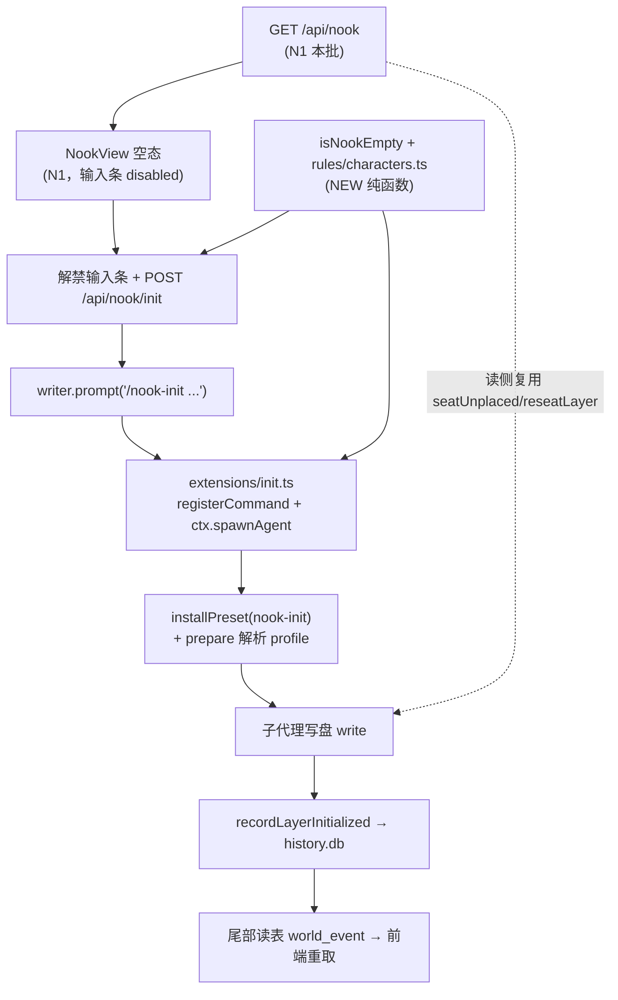

# RESEARCH — 小天地/场景初始化执行链路（R2 直唤）

> 独立研究文档（不归 N1 五篇）。日期 2026-09-13，仓库根 `/home/yoshix7ti/projects/hackathon`。
> 目标：回答「进空小天地 → 引擎直唤 `nook-init` → 落第一眼陈设」真实跑起来还缺哪几块。
> 行号有保质期；符号名优先。不确定处标 `[推断]`。
> 上游真相源：`docs/doc-11`（§2 执行内核 / §3 场景 / §4 小天地 / §6 事件与中断）、`docs/prompts/03`（提示词层，已冻结）、`docs/nook/00-共同上下文.md`（N1 冻结契约）。

---

## 0. 一句话结论

**初始化链路今天在 AIRP 侧是「零件齐、零接线」**：preset、slot、brief 函数三件都在磁盘/源码里，但
（a）两个 init preset **从未被 `installPreset` 安装**，（b）**根本不存在任何 `spawnAgent` 调用点**，
（c）**空目录判定与 id 校验函数不存在**，（d）**没有 HTTP 触发路由**。
R2 的可行落地通道是「**writer 进程里的一个 extension command**」——pi-rp 的 `ctx.spawnAgent` 只在进程内可达，而 RPC 模式下只有 **extension command** 能经 `prompt` 到达（内建 `/subagent` 不行，见 §3.4）。

---

## 1. 现状盘点（带 file:line）

### 1.1 已有零件

| 零件 | 位置 | 状态 | 证据 |
|---|---|---|---|
| `scene-init` preset | `presets/scene-init.json:1-19` | 磁盘有，`delegatable:true`、`inheritHistory:0`、items = `scene-init-instruction` + `skills` | 与 `docs/doc-11 §8.1` 逐字一致 |
| `nook-init` preset | `presets/nook-init.json:1-19` | 同上（`nook-init-instruction` + `skills`） | 零调用点 |
| `SCENE_INIT_INSTRUCTION` | `extensions/instructions.ts:205-237` | 已写 | 冻结正文 |
| `NOOK_INIT_INSTRUCTION` | `extensions/instructions.ts:239-266` | 已写 | 冻结正文 |
| slot 注册 | `extensions/instructions.ts:293-298`（scene）/ `:300-305`（nook） | 已注册 | `registerSlot` |
| `buildSceneInitBrief` | `apps/server/src/engine/brief-builder.ts:11-42` | 已写 | **无调用点** |
| `buildNookInitBrief` | `apps/server/src/engine/brief-builder.ts:46-57` | 已写 | **无调用点**（`docs/后端实现计划.md:81` 已登记） |
| 落账动作 | `packages/shared/src/actions/layer.ts:105-131`（`recordLayerInitialized`）/ `:146-171`（`recordLayerInitFailed`）/ `:54-82`（`enterLayer`） | 已写并 `registerAction` | **三者均无真实调用点** |
| 事件类型 + 载荷 | `packages/shared/src/schemas/events.ts:21-22`、`:96-107` | 已存在，封闭枚举内 | dev 期 `appendEvent` 会 `safeParse`（`local-store.ts:382-390`） |
| preset 安装器 | `apps/server/src/engine/presets.ts:32-38` | 已写 | 只被 `writer.json`（`launch.ts:106`）与角色 preset（`launch.ts:149-152`）调用 |
| 空判定原语 | `store.listFiles(prefix)`（`local-store.ts:210-233`）、`statKind`（`:196`） | 已写 | `listFiles` 对不存在目录也返 `[]`（`docs/nook/01:127`） |

### 1.2 缺失零件

| 缺失 | 证据 |
|---|---|
| `isNookEmpty` / `isLayerEmpty` | 全仓 grep 零命中（`docs/nook/04:318`） |
| `isValidCharacterId` / `nookIdOf` / `characterIdOfPath` | 不存在；契约 §5.2（2026-09-13 修正版）冻结落点为 `packages/shared/src/rules/characters.ts`（NEW） |
| `spawnAgent` 调用点 | 全仓仅注释（`extensions/toolkit/actor.ts:13`、`extensions/context.ts:39-43`、`presets.ts:107-108`）；`tools/probe-tools.mjs:263` 只是用 `passFor('scene-init')` 模拟 env 角色，**不是 spawn** |
| init preset 的安装 | `templates/holmes-world/.airpworld/prompt-presets/` 实测只有 `watson.json` / `writer.json` / `character.json` |
| init 的 HTTP 触发路由 | `apps/server/src/routes/world.ts` 全路由表（`:303` … `:901`）无 `nook` / `layer/init`（`docs/后端实现计划.md:492` 仍是施工单） |
| 超时 / W2 兜底 | `DEFAULT_TURN_TIMEOUT_MS`（`lifecycle.ts:28`）服务的是作家/角色 turn，不是 init；W2 模板常量零命中 |
| 前端触发 | `apps/web/src` 全树 `NookView` / `api/nook` / `nookChar` 零命中；角色 tab 只有 3 个按钮（`apps/web/src/components/sidebar/RightSidebar.tsx:139-168`） |

---

## 2. 缺什么清单（现状 / 缺失类型 / 建议接口签名）

### P0-1 空判定纯函数 （缺：纯函数）
- 现状：不存在（`docs/nook/04:318-320`）。
- 建议（NEW，`packages/shared/src/store/nook.ts`，从 barrel 导出）：
```ts
/** 小天地是否为空：只有 preset.json / 其它 .json 配置、没有任何内容文件（doc-11 §4.1）。 */
export function isNookEmpty(files: readonly string[]): boolean;   // files = store.listFiles('characters/<id>')
/** 场景层是否为空：目录无 README.md（doc-11 §3.1）。 */
export function isLayerEmpty(files: readonly string[]): boolean;
```
- **阈值未定**：非 md 的非 json 文件（如 `assets/*.webm`）算不算内容 → 见 §7 待拍板 1。

### P0-2 id 规则三函数 （缺：纯函数，唯一实现处）
- 现状：不存在。契约 §5.2（修正版）冻结落点 **`packages/shared/src/rules/characters.ts`（NEW）**——目录已存在（`rules/interactive.ts`、`rules/dice.ts`），与既有约定同构。
- **落点纪律**：`packages/shared/src/index.ts` 无 glob，是**逐行手工导出**（`:22-23` 已有 `rules/dice.js` / `rules/interactive.js`；`:42-44` 是「漏行即静默不可达」的纪律注释）。⇒ 新文件**必须**在 `index.ts` 补一行 `export * from './rules/characters.js';`。
- 建议（NEW）：
```ts
export function isValidCharacterId(id: string): boolean;       // /^[a-z0-9][a-z0-9-]*$/
export function nookIdOf(id: string): string;                 // => `characters/${id}`
export function characterIdOfPath(path: string): string | null;// 'characters/x/y.md' -> 'x'，非 nook 路径 -> null
```
- 三处调用同一函数：`arrangeCards` 的 place 分支（`actions/canvas.ts:457-464`）、layout 分支（`:487-531`）、`POST /api/card/footprint` 的 nook 分支（`routes/world.ts:648`）、`GET /api/nook`。
- **禁止**在 `actions/canvas.ts` 另写解析：`shared` 不能 import server（`docs/nook/05:549` 同款理由）。

### P0-3 init preset 的安装（缺：base wiring）
- 现状：`installPreset` 只装 writer / character（`launch.ts:106`、`:149-152`）。
- 缺失后果：`prepareSubagentConversation` 解析 `profileId` 时 `Subagent preset "nook-init" not found.`（`vendor/.../core/subagent/prepare.ts:133-139`）。
- 建议：`writerLaunch`（`launch.ts:105`）内加两次安装（幂等，每次 spawn 都 `copyFileSync`，`presets.ts:37`）：
```ts
installPreset(worldRoot, path.join(repoRoot, 'presets', 'scene-init.json'));
installPreset(worldRoot, path.join(repoRoot, 'presets', 'nook-init.json'));
```
- 发现路径：`<configDir>/prompt-presets/` 递归（`vendor/.../prompt-preset/loader.ts:34-48`），`configDir = PI_PROJECT_CONFIG_DIR = '.airpworld'`（`presets.ts:11,76`）。

### P0-4 R2 spawn 调用点（缺：spawn）
- 现状：无。机制见 §3。
- 建议落地为**一个新 extension command**（NEW，`extensions/init.ts`；必须放 `extensions/` 顶层，`extensionArgs` 只扫顶层 `.ts`，`presets.ts:124-146`）：
```ts
pi.registerCommand('nook-init', {
  description: 'Engine-invoked nook initializer (R2)',
  handler: async (args /* JSON: {character, request?} */, ctx) => {
    const brief = buildNookInitBrief(/* … */);   // 复用现有纯函数（需 server/shared 侧可 import）
    const result = await ctx.spawnAgent({
      profileId: 'nook-init',
      task: brief,
      customTools: AIRP_TOOL_DEFS,   // = AIRP_TOOLS.map(e => e.tool)（extensions/tools.ts:48-66）
      timeoutMs: 45_000,
    });
    // 凭 result.status 落账（P1-1）
  },
});
```
- `spawnAgent` 在 `ExtensionContext` 上（`vendor/.../core/extensions/types.ts:382-383`），runner 绑到 `ctx`（`runner.ts:891-894`）⇒ command handler 内可直接用。

### P0-5 HTTP 触发路由（缺：路由）
- 建议（NEW，`apps/server/src/routes/world.ts`）：
```ts
// POST /api/nook/init   { character: string, request?: string }
//  isValidCharacterId → 400；目录不存在 → 404；非空 → 200 { ok:true, skipped:true }
//  空 → writer.prompt('/nook-init ' + JSON.stringify(...)) 立即 202 { ok:true, started:true }
```
- 场景侧对应物 `POST /api/layer/init`（`docs/后端实现计划.md:492`），同一形状，`layer` 换 stub 层。

### P1-1 完成 / 失败落账（缺：调用点）
- 现状：`recordLayerInitialized` / `recordLayerInitFailed` 已写已注册，**零调用**。
- 为什么不能靠 subagent 自己写：初始化子代理的工具面是**内建** `write`/`edit`，不落事件；且子会话事件不回流父会话（§3.3）。
- 建议：由**发起的 extension command handler** 在 `await spawnAgent` 后调用共享动作：
```ts
import { getActionService } from './toolkit/deps.js';
const svc = getActionService(ctx);
await svc.recordLayerInitialized({ layer: nookId, by: 'player', files });
// status !== 'completed' → svc.recordLayerInitFailed({ layer, reason, fallback: 'template' })
```
- 链路自证：事件进 `history.db` → 尾部读表广播 `world_event`（`event-bridge.ts:279-281`）→ 前端按 `wiring/00 §4` 消费。**不新增事件 `type`**（`docs/nook/00 §3.6`）。

### P1-2 超时（缺：配置）
- `spawnAgent({ timeoutMs })` 已内建（`run.ts:146-152` 超时 → `controller.abort()` → `status: 'timed-out'`）。场景 60s / 小天地 45s（`doc-11 §6.2`），**配置不是常量**。

### P1-3 W2 模板兜底（缺：常量 + 写盘点）
- 现状：`doc-11 §5` 给了两份模板文本，代码零命中。
- 建议：`packages/shared/src/nook/templates.ts`（NEW）导出 `W2_README(name)` / `W2_CHALK()`，由 handler 失败分支写出（零 AI）。

### P2-1 前端触发（缺：前端触发）
- 角色小天地：`NookView` 空态输入条（`docs/nook/02 §3.8:210-215`，N1 只呈现、disabled）→ 解禁后 `POST /api/nook/init`。
- stub 层：双击 `material: stub` 卡 → 一行输入（`doc-11 §3.2`）→ `POST /api/layer/init`。
- 幻影占位 + 座位过户（`doc-11 §3.4`）= P2。

---

## 3. 「引擎直唤 subagent」的 pi-rp 机制（先文档后源码）

### 3.1 上游文档（`vendor/pi-rp/packages/coding-agent/docs/`）

- **`extensions.md:1734-1756` — `pi.spawnAgent(options)`**：
  > "Spawn an in-process subagent programmatically … Unlike the `subagent` tool, this path is **not gated on the preset being `delegatable`** and **does not inherit the parent session's extension tools**." 参数：`profileId / task / inheritMessages / stateNamespaces / schemas / tools / customTools / model / thinkingLevel / timeoutMs / signal`；返回 `{ status, text, rawText?, error?, stateOps }`。
- **`prompt-presets.md:820-892` — Subagent Delegation**：`delegatable: true` 暴露给 `subagent` 工具与 `/subagent`（`:822`）；输出经 `truncateTail`（`:844`）；**Custom Slots 是进程级注册表**，delegatable preset 用的自定义 slot 在子代理里照常渲染、**无需给子代理装扩展运行时**（`:846`）⇒ AIRP 的 `*_INIT_INSTRUCTION` slot 因此可用；上下文在 **prepare 时封死**（`:848-850`）。
- **`usage.md:64` / `prompt-presets.md:900-903`**：`/subagent <profileId> <task>`。

### 3.2 源码（确定答案）

| 事实 | 源码位置 |
|---|---|
| `ExtensionContext.spawnAgent(options)` | `core/extensions/types.ts:382-383` |
| runner 绑成 `ctx.spawnAgent`（带 `assertActive()`） | `core/extensions/runner.ts:891-894` |
| 默认工具集 = `["read","bash","edit","write","grep","find","ls"]` | `core/subagent/prepare.ts:27` |
| `spawnAgent` 传 `tools` 缺省 = 默认集 ∪ `customTools` 名字 | `core/subagent/spawn.ts:96-97` |
| `spawnAgent` 刻意 `inheritExtensionTools: false` | `core/subagent/spawn.ts:97` |
| preset 解析：父会话内存优先 → 磁盘回落 | `core/subagent/prepare.ts:124-133` |
| `inheritHistory` 生效 = `messages.slice(-N)` | `core/subagent/prepare.ts:196` |
| brief 作为**最后一条 user 消息**追加 | `core/subagent/prepare.ts:250-256` |
| 子会话**零扩展**（`getExtensions → {extensions: []}`） | `core/subagent/run.ts:79-98` |
| 只转发父扩展的五类 **tool handler** | `core/subagent/run.ts:109-138` |
| 输出 `truncateTail`（2000 行 / 50KB） | `core/subagent/run.ts:180` |
| 超时 → `abort()` → `status: "timed-out"` | `core/subagent/run.ts:146-152`、`:174-176` |
| 会话级注册（dispose 连带 abort） | `core/subagent/spawn.ts:110-114`、`agent-session.ts:482-486` |
| `spawnAgent` 实际绑定点 | `core/agent-session.ts:3936` |
| `subagent` / `subagent_profiles` 是**内建工具**（默认激活） | `core/agent-session.ts:4090-4091`、`:4127` |

**结论（怎么 spawn 一个非角色 subagent）**：
1. **不需要角色，也不需要进程外东西**：`spawnAgent` 在当前进程内建 `SessionManager.inMemory()` 会话（`run.ts:56`），只吃 `profileId` + `task`；actor 身份由**继承的 env** `AIRP_AGENT_ROLE` 决定，writer 进程里恒为 `writer`（`extensions/toolkit/actor.ts:12-16`、`docs/tools/00:121`）。
2. **preset 必须先在 `prompt-presets/` 可见**（`prepare.ts:131` → 磁盘回落），否则 `Subagent preset "nook-init" not found.`（`prepare.ts:133-139`）⇒ P0-3 的存在理由。
3. **`delegatable` 不校验**（`spawn.ts` 函数注释；`extension.ts:17-20,92-99` 只有 LLM 工具/命令校验）⇒ R1/R2 共用一个 profile 成立。
4. **上下文 = preset 静态 + brief**：`inheritHistory: 0`（preset `:7`）+ 零注入（`run.ts:79-98`）⇒ 子代理看不到作家历史/玩家视点/状态块（`extensions/context.ts:38-43`、`docs/hooks/06 §7:421-426`）。

### 3.3 必须知道的**泄漏边界**（决定 P1-1 形态）

`spawnAgent`/`runSubagent` **把子会话的 tool handler 转发回父扩展**（`run.ts:109-138`），但**没有把子会话的 agent 事件接到父会话的 `subscribe`**。RPC 出帧靠 `session.subscribe(...)` → `output(toJsonEvent(event))`（`rpc-mode.ts:529-531`），子会话不在那条订阅上。
⇒ 初始化子代理的 `write`/`chalk` 工具调用**不会作为引擎事件到达 server**；对前端可见的唯一信号是 `fs.watch` 的 `file_changed`（`event-bridge.ts:356-388`，`recursive: true`，含 `characters/**`）。
⇒ **`layer_initialized` 必须由发起方显式落账**（P1-1）。

### 3.4 RPC 模式下的**可达通道**（关键裁决）

| 通道 | 是否可行 | 证据 |
|---|---|---|
| `RpcClient.prompt('/subagent nook-init …')`（内建命令） | ❌ | 内建命令只在 `InteractiveMode` 斜杠分发里跑；`rpc.md:986` 明写 "Built-in TUI commands … would not execute if sent via `prompt`"；RPC 的 `prompt` case 只走 `session.prompt(...)`（`rpc-mode.ts:568-593`） |
| `RpcClient.prompt('/<airp-extension-command> …')` | ✅ | `session.prompt()` 先判 `text.startsWith("/")` → `_tryExecuteExtensionCommand`（`agent-session.ts:1991-1999`），命中 `extensionRunner.getCommand(name)`（`:2173-2193`） |
| server 直接 `ctx.spawnAgent` | ❌ | server 只持 `RpcClient`（`lifecycle.ts:1-2`），无 `AgentSession`/`ExtensionContext` |
| server 自建 in-process `AgentSession` | ⚠️ 重 | 需复制 provider 装配，与 `launch.ts` 单一来源冲突，不推荐 |
| 给 pi-rp 加 `{type:"spawn_agent"}` RPC 命令 | ⚠️ 需上游改动 | 要在 `rpc-types.ts`/`rpc-mode.ts` 加分支 + 定 `ToolDefinition` 序列化协议，成本高于 extension command |

**推荐（R2 落地形态）**：新增 `extensions/init.ts` 注册 `nook-init` / `scene-init` 两个 extension command，server 侧 `writer.prompt('/nook-init {…}')` 触发。
- extension command **不能排队**：`steer`/`followUp` 明确拒绝 `/` 开头（`agent-session.ts:2241-2242,2262-2263`），必须用 `prompt`。
- `prompt` 是 fire-and-forget（`rpc-mode.ts:568-593`）：响应只代表"被接受"，不代表完成；完成信号靠 P1-1 的世界事件。

**AIRP 侧现成的 subagent 调用点：没有。** 全仓 grep `spawnAgent(` / `profileId:` 只命中注释与文档；`tools/probe-tools.mjs:263-265` 的 `passFor('scene-init')` 是 env 降级模拟，不经过引擎 subagent 机制。**唯一"半个调用点"是作家提示词的自然语言指令**（`extensions/instructions.ts:143-149`），依赖 LLM 自调 `subagent` 工具（R1）。

---

## 4. R1（scene-init 委托）vs R2（nook/scene 直唤）对照表

| 维度 | R1 作家委托 | R2 引擎直唤 | 复用 / 分叉 |
|---|---|---|---|
| 触发者 | 作家 LLM 调 `subagent` **工具** | 玩家动作 → HTTP 路由 → server → writer 进程 extension command → `ctx.spawnAgent` | **分叉**（入口） |
| preset | `scene-init` | `scene-init` / `nook-init` | **复用** |
| 谁填 brief | 作家（LLM 自述） | 引擎按模板拼 | **分叉**（来源）；模板函数**复用** |
| profile 校验 | `isDelegatable`（`extension.ts:92-99`） | 不校验（`spawn.ts` 注释） | 分叉（无害） |
| 工具面（内建） | 默认集（`prepare.ts:27`） | 不传 `tools` → 同一默认集 | **复用** |
| 工具面（扩展） | `inheritExtensionTools` 默认 true ⇒ 自动继承（`prepare.ts:178-184`） | `false`（`spawn.ts:97`）⇒ **必须传 `customTools: AIRP_TOOL_DEFS`** | **分叉**（AIRP 唯一必须给的） |
| 上下文 | 零注入、`inheritHistory: 0` | 同 | **复用** |
| 结果回收 | `subagent` 工具把 `text` 返回作家 agent loop | `result.text` 只到 handler；server/前端拿不到（见 §7 待拍板 3） | **分叉** |
| 落账 | 无（今天无人落账） | P1-1：handler 显式 `recordLayerInitialized` | **分叉**（R1 同缺） |
| 输出截断 | `truncateTail`（`run.ts:180`） | 同 | **复用** |
| 超时 | 无 | `spawnAgent({timeoutMs})` | 分叉（R2 先有） |
| 中断语义 | doc-11 §6.2「不中断」 | 同；`dispose()` 连带 abort（`agent-session.ts:482-486`） | **复用** |
| **小天地适用性** | **禁用**——doc-11 §1.3「角色永远不装修自己的家」 | 唯一路径 | **matters** |

> **不对称**：**场景有 R1+R2 两条腿，小天地只有 R2**（`doc-11 §1.3`）。本报告问的「直唤 nook-init」在补一条**没有退路**的路径——不通则小天地初始化 100% 不可用。

---

## 5. 前置依赖关系



**逐条**：
1. **`/api/nook` 必须先存在** —— 对**产品路径**成立：前端要先能进小天地看见空态，才有输入条（`docs/nook/02 §3.8`）。N1 本批正是做这个。
2. **但引擎能力本身不依赖 `/api/nook`**（`[推断]`）：初始化只需 `store.listFiles` + `isNookEmpty` + `spawnAgent`。只做能力验证（探针/单测）可先于 `/api/nook`。
3. **`seatUnplaced` 批内叠卡修复（契约 §2.7，用户已拍板随 N1 修）是初始化效果的前置**：初始化落 2–4 个新文件后，前端首次取数会把它们挤在同一坐标（实测 distinct 1/4）。不修则「第一眼看见陈设」不成立。修复范围**只在 `seatUnplaced` 的批量路径**，`seatNear`（`:1157`）与 `reseatLayer`（`:807/:826`）不中招、勿动。
4. **`arrangeCards` 的 nook 分支（契约 §3.7 + §3.7.1）** 是初始化后玩家**整理陈设**的前置：**place 分支**（`canvas.ts:457-464`）与 **layout 分支**（`:487-531` 三卡点：显式 layer 白名单 `:489-497`、`resolveLayer(paths[0])` `:513-520`、逐 path 复核 `:528`）**两条都要修**。
5. **`installPreset` 接线（P0-3）** 是 `spawnAgent` 的前置。
6. **`extensions/init.ts` 必须在 writer 进程被加载**：`extensionArgs` 只扫 `extensions/` **顶层** `.ts`（`presets.ts:124-146`），不能放 `toolkit/`。
7. **空目录判定的实现位置**：纯函数在 `packages/shared`（服务端与测试共用）；调用点在 server 路由（判"该不该 spawn"）+ 可选在 handler 内再判一次（幂等双保险）。**不要**放进 `GET /api/nook`（会破坏纯读契约 §3.6，且 §3.1 冻结 8 键响应形状）。

---

## 6. 与现有 scene-init 的复用点 / 分叉点（工程落地视角）

**可直接复用（零改动）**
- 两个 preset、两个 `*_INIT_INSTRUCTION` 常量、两个 slot 注册；
- `buildSceneInitBrief` / `buildNookInitBrief`——**只需接调用方**；
- `AIRP_TOOLS`（`extensions/tools.ts:48-66`）——R2 的 `customTools` 由它映射；
- `installPreset`（`presets.ts:32`）、`getActionService`（`extensions/toolkit/deps.ts`）、`recordLayerInitialized` / `recordLayerInitFailed`；
- `world_event` 广播链路（`event-bridge.ts:279-281`）——**不新增帧**（N1 §3.6 冻结）。

**必须分叉**：入口（R1 工具 vs R2 命令）；brief 来源；扩展工具交接（`customTools`）；落账调用点；超时。

**必须验证的实现风险（brief 字段缺口，`docs/prompts/03 §⑨`）**
- `[Deliverables] 2–3 markdown files`（`brief-builder.ts:54`）vs 正文 `2–4`（冲突 3）；
- `[Report]` 只有"三行"没规格（`:55`，冲突 4）；
- **无 `[Missing Files]` 字段**（冲突 2）⇒ 正文里「顺带补齐 identity/appearance/personality」**永不触发**。`characters/watson/` 实测只有 `preset.json` + `README.md`，而 preset 引用 `identity.md` / `personality.md`（`templates/holmes-world/characters/watson/preset.json:52`，`onMissing: skip`）——子代理 spawn 时就少了履历；
- 小天地 brief 不传世界根、不传 preset 引用清单、不传目录已有什么（`brief-builder.ts:46-57`）。

---

## 7. 仍未知 / 待拍板

1. **空判定阈值**：`isNookEmpty` 是否把"非 md 的非 json 文件"（`assets/*.webm`）算内容？`docs/nook/04:309` 建议"只要存在任一非 `.json` 文件即非空"，未拍板。
2. **空态口径冲突**：`docs/nook/02 §3.8:210` 说空态 = `items.length === 0 && scene === null`；`docs/nook/05:296-298` 的 A17 说"只有 README + preset.json"也是空态（`items === []`、`scene` 非 null）。**必须先统一**，否则 `POST /api/nook/init` 会漏触发 8/9 个模板角色目录。
3. **子代理三行回报怎么回到 server / 前端**：`result.text` 只到 handler；`ctx.ui.notify` 虽以 `extension_ui_request` 出 stdout（`rpc-mode.ts:310-319`），但 `RpcClient.handleLine` 对未知 type **静默当事件转发**（`rpc-client.ts:785-786`），`mapEngineEvent` 无对应 case ⇒ 丢弃。可选：(a) 只落 `files` 进 `layer_initialized`（多余 detail 字段会被 zod strip，`events.ts:96-101` + `local-store.ts:387-389`），放弃文本；(b) `pi.appendEntry` 写 custom entry 由 `getEntries()` 取；(c) 上游加 `spawn_agent` RPC 命令。**倾向 (a)**。
4. **R2 通道选型**：extension command（推荐）vs 上游加 `spawn_agent` RPC 命令。前者依赖"`prompt` 里 `/` 开头的 extension command 立即执行"（`agent-session.ts:1991-1999`）——**建议实现前用探针实测**（注册 echo 命令，server 发 `/echo hi`）。
5. **并发/重入**：两个客户端同时进同一空小天地 → 两次 spawn。谁负责幂等（server in-flight Set vs `isNookEmpty` 二次判定 + 落账去重）？`doc-11 §6.2` 只说"不中断"。
6. **brief 字段缺口是否随初始化批次一起修**（§6 末三条）——修则触 `docs/prompts/03` 冻结正文的引用面，需主 agent 裁决。
7. **场景侧 `POST /api/layer/init`** 归本链路还是另立批次。
8. **初始化产物是否要同时"补 README"**：`old-sailor` 连 README 都没有；`doc-11 §4.3` 要求"若缺则补"，但空态文案对"还没建"的角色是否合适（`docs/nook/02:469` 同问）。

---

## 8. 可直接抄的验证切口（给实现批次）

1. **P0-3 是否生效**：`pnpm pi status` 先确认 dist 新鲜（`AGENTS.md §7.2`）；起 server 后 `ls <world>/.airpworld/prompt-presets/` 应出现 `scene-init.json` / `nook-init.json`。
2. **profile 可解析**：`await ctx.compilePreset('nook-init', runtime)`——`compilePreset` 对未知 id 会 throw（`agent-session.ts:3915-3920`）。
3. **子代理真能落盘**：`spawnAgent({profileId:'nook-init', task, customTools: AIRP_TOOL_DEFS, timeoutMs: 45_000})` → `status === 'completed'` 且 `characters/<id>/` 出现 2–4 个 md。
4. **落账可见**：`recordLayerInitialized` 后 `getEventsSince(0)` 多一条 `layer_initialized`，WS 收到 `world_event`。
5. **第一眼几何**：先修 `seatUnplaced`（契约 §2.7），断言同一批 4 张同尺寸卡 `distinct centres === 4`（修复前 1）。

**测试运行方式（实测修正）**：root `package.json` 的 `scripts`（`:6-22`）**无 `test`**，测试一律 `node --test packages/shared/test/*.test.mjs`（`packages/shared/test/*.mjs` import 已构建的 `dist/`，先 `pnpm --filter @airp/shared build`）。

**fixture 纪律（2026-09-13 修正）**：**不许用 `templates/holmes-world/characters/watson`**——该目录下曾出现的 `characters/watson` canvas 行是子代理探针写的、不是既有先例（该 db 已删除）。用 `constable` / `nanami` / `sumi` 等无 `characters/**` 行的角色。

---

### 勘误与留痕
- 主 agent 曾广播"`/api/card/position` 无 layer 门禁 → 小天地拖卡天然可用"，**该判断有误**：门禁在动作层（`actions/canvas.ts:457-464`），已在 N1 契约 §3.7 撤回并冻结为 `arrangeCards` nook 分支方案。
- 契约 §5.2 的落点由"`routes/world.ts` 或 shared"改为 **`packages/shared/src/rules/characters.ts`（NEW）+ `index.ts` 手工补行**。
- 另一处待主 agent 统一处理的冲突（Acceptance05 报）：`pnpm check:docs` 只扫 `docs/hooks/`；`overlapsOccupied` 未 export。
