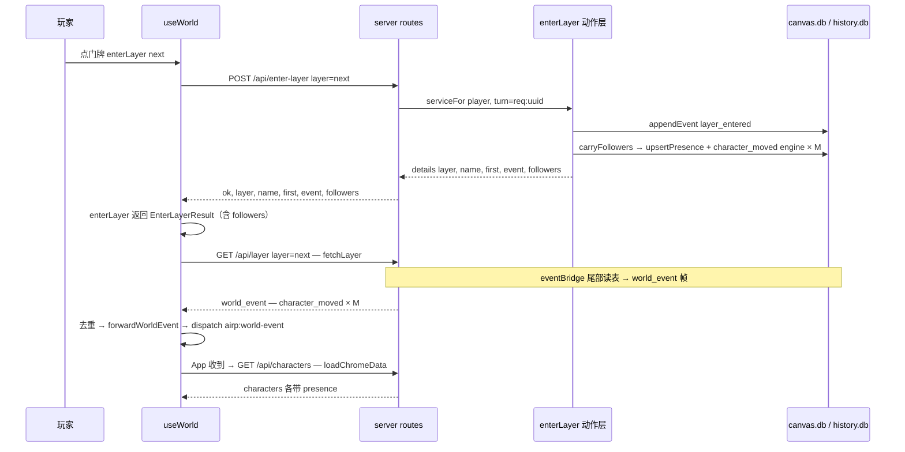

# docs/presence/01 — 后端跟随闭环（B1 / B2 / B3 / B4 / B5）

> 状态：**设计（2026-09-14）**，设计阶段，不改代码。
> 地基：`docs/presence/00-共同上下文.md`（冻结契约，本批唯一地基）。本批**不改**其中的
> §2–§4 形状、语义、阈值；发现冲突写进本文 §11，**不回改**。
> 语义权威：`docs/tools/05-move-to与set-following.md`（presence 表、`move_to` / `set_following` /
> `carryFollowers` 的行为与落账）。本文只补齐它**已声明但未接线**的部分，不重定义语义。
> 每条「现状是 X」都带 `file:line`（本人亲自读过的源码）；未经源码确认的标 `[推断]`。
> 测试命令一律单文件，跳过全量 `build` / `test` / `lint`（契约 §8）。

---

## 1. 一句话与定位

**把「角色在玩家身边」这条链的五个断点一次接通：`enterLayer` 真的搬跟随者（B1）、`/api/layer`
真的回坐标 `x`（B2）、玩家真的能开关跟随（B3）、`/api/characters` 真的说出「ta 在哪」（B4）、
`world_event` 真的把 `following_changed` / `character_moved` 送到 App（B5）。**

五条的判据都不是「代码写对了」，而是**可观测的世界变化**：

| # | 断点 | 接通后玩家能观察到的东西 |
|---|---|---|
| B1 | `carryFollowers` 无人调用（契约 §1.1 实测：玩家进 `world/b`，watson 仍在 `world/a`） | 切层后跟随者的头像出现在新层 |
| B2 | `/api/layer` 丢了 `x` | 头像落在正确横向位置（不是全挤在 x=0） |
| B3 | 没有 `POST /api/following` | 点「跟随」→ 刷新浏览器后仍是开的 |
| B4 | `/api/characters` 不知道 ta 在哪 | 右侧栏能区分「同场景 / 在别处 / 不在场」 |
| B5 | 事件到不了 App 的 `loadChromeData()` | 跟随/搬人之后，右侧栏自动刷新，不用手动刷页 |

**边界（契约 §5 表第 1 行）**：本文拥有后端动作接线、两条读路由的响应形状、一条写路由、
`useWorld` 的事件转发点接线与它们的测试。**不拥有**：前端渲染、相机、侧栏 UI、`presence` 表结构、
`move_to` / `set_following` / `carryFollowers` 的语义（归 `docs/tools/05`）。

---

## 2. 签名与参数（含 `NEW` 符号完整签名）

### 2.1 B1：`enterLayer` 的签名变化

```ts
// packages/shared/src/actions/layer.ts —— 既有（layer.ts:42-52）
export interface EnterLayerInput {
  layer: string;
}
export interface EnterLayerDetails {
  layer: string;
  name: string;
  first: boolean;
  event: WorldEvent;
  // ★ 本批 NEW：跟随搬运的结构化结果（05 §3.6.2 / §5.5「失败必须可见」）
  followers: CarryFollowersResult;
}
export async function enterLayer(
  ctx: ActionContext,
  input: EnterLayerInput
): Promise<ActionResult<EnterLayerDetails>>;   // 签名不变，details 多一个键
```

```ts
// packages/shared/src/actions/presence.ts —— NEW（只加类型，行为零改动）
/** `carryFollowers` 的结构化结果（05 §2.1 / §3.6.2）：搬成功的人 + 没跟上的人。 */
export interface CarryFollowersResult {
  moved: PresenceRecord[];                                   // 逐条 = 搬运后的 presence 行
  failures: Array<{ character: string; reason: string }>;    // 空数组 = 全员跟上
}

// 既有导出，只把返回类型换成上面这个别名（presence.ts:229-232 语义不变）
export async function carryFollowers(
  ctx: ActionContext,
  toLayer: string
): Promise<CarryFollowersResult>;
```

**为什么 `moved` 用 `PresenceRecord` 而不是新造的瘦对象**：`presence.ts:236-262` 已经在
`moved.push(row)` 里推的就是 `upsertPresence` 的返回行（`PresenceRecord`，`world-store.ts:75-82`）。
换类型名会导致 `presence.ts:19` 的 `export type { PresenceRecord }` 与
`packages/shared/src/index.ts:51` 的既有导出分叉。

**`CarryFollowersResult` 的导出面**：它在 `presence.ts` 里定义、经 `index.ts:51`
`export * from './actions/presence.js'` 自动可见（**无需改 barrel**）。服务端与前端类型要用它时
从 `@airp/shared` 取。`[推断]` 现有门禁不扫 `actions/` 的符号表，无需额外登记；落地时以
`pnpm build` 为准。

### 2.2 B3：`POST /api/following`

```ts
// request（契约 §3.3；形状与 docs/tools/05 §6.4 逐字一致）
{ character: string; following: boolean }     // following 是终态，不是 toggle

// response（走既有 reply() 壳，world.ts:74-92）
{ ok: true, ...SetFollowingDetails }          // SetFollowingDetails：following.ts:29-44
// 错误
{ ok: false, code, error }                    // ActionError.toHttp()，errors.ts:77-82
```

`SetFollowingDetails` 的字段（`following.ts:29-44`，逐字，不增不改）：
`character` / `name` / `following` / `layer` / `x` / `y` / `changed` / `created` / `landedFromHome`
（`event?` 由 `ActionResult.details.event` 兜底，`types.ts:37-40`）。

### 2.3 B2：`/api/layer` 响应体的 `presence`

```ts
// apps/server/src/routes/world.ts —— /api/layer 的 presence（契约 §3.1 冻结）
presence: Array<{
  characterId: string;
  x: number;            // ★ 本批补回：世界坐标中心点（不是左上角）
  y: number;
  following: boolean;
}>;
```

前端类型 `PresenceEntry`（`apps/web/src/state/useWorld.ts:55-60`）**现已是这四个字段**
（`characterId` / `x` / `y` / `following`）——**前端不用改**，是服务端的映射丢了一个键
（`world.ts:886-890` 没有 `x`）。这是 B2 的全部工作量。

### 2.4 B4：`/api/characters` 的角色对象

```ts
// apps/server/src/routes/world.ts —— 每个 character（契约 §3.2 冻结）
{
  ...现有字段,                                            // id/name/home/role/avatar/avatarVideo/bio/voice/emotions
  presence: { layer: string; following: boolean } | null,  // null = 不在场
}
```

前端 `CharacterView`（`apps/web/src/App.tsx:74-91`）**新增一个可选字段**：

```ts
// NEW（App.tsx CharacterView）
presence?: { layer: string; following: boolean } | null;
```

**为什么 `presence` 是「总是出现的键、值可以是 `null`」，而不是「有行才出现的可选键」**：
投影（`04` 的 `projectPresence`）不关心「作者还没给我 presence 这个概念」（`undefined`）与
「我查了，ta 不在场」（`null`）的差别，但**前后端同批发布**时固定键位能让类型收成
`| null`，少一层判空。契约 §3.2 写的也是 `… | null`。

### 2.5 B5：`useWorld` 的转发点接线

```ts
// apps/web/src/state/useWorld.ts —— 既有死函数（:333-341），本批复活它
const forwardWorldEvent = useCallback((msg: WorldEventFrame): void => {
  if (
    ['entity_created', 'entity_edited', 'entity_deleted', 'entity_moved',
     'following_changed', 'character_moved'].includes(msg.event?.type)
  ) {
    window.dispatchEvent(new CustomEvent('airp:world-event', { detail: msg }));
  }
}, []);
```

调用点：`case 'world_event'` 分支内（`useWorld.ts:430-453`），**在 `fetchLayer` 之前**。
契约 §3.5 冻结的 **(a) 方案**（复活死函数），理由见 §9-C6。

### 2.6 跟随失败的可见性（P-9 + P-10 裁决：**不新增**事件，改为放宽返回值）

契约 §7 P-9 已裁决：**不新增前端内部事件**。本文初稿提案的 `airp:follow-failed`
（`01` 派发、`03` 消费）**已作废**——`03` 无接收端（`grep -n "follow-failed"
docs/presence/03-右侧角色栏.md` 零命中），且新通道的成本（事件名 + 派发 + 监听 + 测试）
只为换一个 dispatch 的名字。

**冻结的两条**：

1. **`01` 的职责到 `details.followers.failures` 真的出现在返回值里为止**（B1 的结算点）；
2. **玩家可见提示由调用方**（App 或 `03` 的角色栏）拿到 `failures` 后 `notify(t('...'))`，
   `messages.json` 文案键归 `03`（P-9）。本文**不出现任何** dispatch。

**接缝形状（01 定，`04`/`03` 消费）**：`UseWorldApi.enterLayer`（`useWorld.ts:85`）当前是
`Promise<void>`，而 `airpGateway.enterLayer` 的响应在 `useWorld.enterLayer` 内部被吞掉
（`useWorld.ts:214` 的 `.then`），**App 的四个调用点**（`App.tsx:389` / `:447` / `:473` / `:734`）
因此拿不到 `failures`。所以：

```ts
// NEW（useWorld.ts —— UseWorldApi 与实现）
export interface EnterLayerResult {
  layer: string;
  name: string;
  first: boolean;
  followers: CarryFollowersResult;
}
// UseWorldApi（useWorld.ts:85）签名改为：
enterLayer(next: string): Promise<EnterLayerResult | null>;   // null = 请求失败（失败路径仍走既有 airp:notice）
```

实现只需：`.then(async (result) => { … return result; })`、`catch` 分支 `return null`。
**零新增事件、零新增通道**——复用既有的 `airp:notice`（`App.tsx:274-276`）做失败路径，
跟随失败提示由调用方读返回值后自己 `notify`。

**为什么这是 01/04 的边界项**：`useWorld` 是本文拥有的接线面（契约 §5 表第 1 行的
`world_event` 转发点），但 `enterLayer` 的返回值被 `04` 的 `usePresence` 投影与导航接缝
消费（`04 §8.3` 把 `enterLayer: world.enterLayer` 传进 `usePresence`）。形状由本文定，
**谁 notify 由 `03`/App 定**。

**契约 §7 P-10 已就此裁决**（本文复核发现 → 升级为契约）：`04` 的 `PresenceDeps.enterLayer`
**不得**抄本文的真实类型，声明为 `Promise<unknown>` 即可（它不消费 `followers`），
避免两篇编译期互绑。完整分工与 `04` 的必修项见 §11 N-8。

---

## 3. 行为契约（逐步，每步写「漏了会怎样」）

### 3.1 B1：`enterLayer` 的四步

**顺序不可反**（`docs/tools/05 §3.6.2` 第 3 条：先落 `layer_entered` 再搬人，否则历史读成
「老周先到了 X，然后玩家进来」）。

| # | 步骤 | 落点 | 漏了会怎样 |
|---|---|---|---|
| 1 | 校验 `layer` 非空 | `layer.ts:59-61`（既有） | 同现状 |
| 2 | 算 `dir` / `first` / `name` | `layer.ts:66-70`（既有） | 同现状 |
| 3 | `appendEvent('layer_entered', { actor: ctx.actor, turn: ctx.turn })` | `layer.ts:72-79`（既有） | 换场不被历史/作家看见 |
| 4 | **`await carryFollowers(ctx, layer)`**，结果放进 `details.followers` | ★ 本批新增，插在 `layer.ts:79` 与 `return` 之间 | **跟随在运行时不存在**：玩家进了新层，跟随者仍留在旧层（契约 §1.1 实测）；没有 `character_moved`，作家永远不知道「老周跟着你进了城」；前端 `failures` 永远是空，跟丢了也没人知道 |
| 5 | `return { text, details: { …, followers } }` | `layer.ts:81-86` 扩展 | 前端拿不到搬运结果，画布只能等下一次 `/api/layer` 重取；`failures` 里「谁没跟上」永远为空，跟丢了也没人知道（P-9：这是唯一的失败出口） |

**`turn` 与 `actor` 口径**：

- `carryFollowers` 用 `ctx.turn`（`presence.ts:252`）→ 与同一次 `layer_entered` **共享 turn**
  （C 入口的 `req:<uuid>`，`world.ts:62-64`）。这样历史面板能把它们归进同一次换场
  （`docs/tools/05 §3.6.2` 第 3 条）。
- 被搬运的 `character_moved` 的 `actor` 是**硬编码 `{ type: 'engine' }`**（`presence.ts:251`），
  与 `layer_entered` 的 `actor`（`ctx.actor` = `player`）**不同**。这是 `docs/tools/05 §3.6.2`
  冻结的裁决（玩家移动的是自己，不是别人），本批**不改**。
- **`enterLayer` 不传 `actor` 给 `carryFollowers`**：它的签名只有 `(ctx, toLayer)`
  （`presence.ts:229-232`）。若将来要按调用者分派 `actor`，那是 `docs/tools/05` 的改动，不是本批。

**失败不静默（`docs/tools/05 §5.5`）**：

- `presence.ts:263-267` 已经逐条 `try/catch`，把失败推进 `failures` 并 `console.warn`。
  **`console.warn` 只是补充**（契约 §5 全局 MUST NOT 第 6 条 / `docs/tools/00 §6.2`），
  唯一出口是 `details.followers.failures`。
- **`carryFollowers` 自身意外抛错怎么办**（`presence.ts:233-235` 的 `ctx.store.getPresence()`
  在逐条 try 之外，它若抛就整个函数抛）：`enterLayer` MUST 用 `try/catch` 包住这次调用，
  把意外抛错折成**一条合成 failure**，**仍然返回成功**。
  理由：`layer_entered` **已经落账**（步骤 3），玩家**已经在新层**了；此时抛 500 会让前端把
  「切层」判成失败并回滚 UI，而世界真的变了。**漏了这个 try/catch 的后果**：一次排座底层异常
  让整次换场返回 500，前端停在旧层，但历史里已经有 `layer_entered` —— 世界与 UI 分叉。
  （拒绝方案：让异常直接上抛。`docs/tools/01 §3.6` 的定案是**不回滚**，那就不该表现成
  「整个动作失败」。）

```ts
// layer.ts —— 步骤 4/5 的骨架（NEW 调用 + 合成 failure 兜底）
import { carryFollowers, type CarryFollowersResult } from './presence.js';

let followers: CarryFollowersResult = { moved: [], failures: [] };
try {
  followers = await carryFollowers(ctx, layer);
} catch (err) {
  // `layer_entered` is already on record and the player IS in the new layer:
  // a seating-layer crash must not make the whole swap look failed.
  followers = {
    moved: [],
    failures: [{ character: '*', reason: err instanceof Error ? err.message : String(err) }],
  };
}
return { text: …, details: { layer, name, first, event, followers } };
```

`character: '*'` 的语义是「整体失败，不是某个人」——调用方的提示文案据此分流
（§12 待拍板 1 保留更好的表达；P-9 已定**由调用方**读 `details` 后 notify）。

### 3.2 B3：`POST /api/following` 的四步

| # | 步骤 | 漏了会怎样 |
|---|---|---|
| 1 | 取 `getActiveStore()`，无世界 → 409（中间件，`world.ts:417-420`）或 400（路由内兜底，同 `/move` `:969-970`） | 无世界时 500 |
| 2 | 校验 `character` 是非空字符串、`following` 是 boolean | 形状错误穿透到动作层；`following: 'true'` 会被 `following.ts:121` 的 `===` 当 falsy，**静默把跟随关掉**而返回 200 |
| 3 | `serviceFor(store, { type: 'player' }).setFollowing({ character, following })` | actor 变成 `writer`/未知，落账的 `following_changed.actor` 错（`docs/tools/05 §6.4`：C 入口是 `player`） |
| 4 | `reply()` 包住：`{ ok: true, ...details }` / `ActionError.toHttp()` | 错误码自造，与 `docs/tools/01 §7.1` 的唯一表分叉 |

**幂等语义由动作层保证**（`following.ts:121-136`）：已在该状态的调用返回 `changed: false`
且**不落事件**。路由**不做**二次判断——路由里再判一次就是第二份真相。

**「无 presence 行的 `true` 按 `home` 入场」**（`docs/tools/05 §3.6.1` / `following.ts:79-116`）：
动作层已实现，路由**不碰**。可见证据是 `landedFromHome: true` 与 `created: true`。

**`character` 是裸 id 不是路径**：含 `/` / 以 `.` 开头 → 动作层 `invalid_argument`
（`presence.ts:65-67`）；目录不存在 → `not_found`（`presence.ts:70`）。路由**不重写**这两条。

### 3.3 B2：`/api/layer` 的 presence 映射（一步）

| # | 步骤 | 漏了会怎样 |
|---|---|---|
| 1 | SQL 加 `ORDER BY character_id`，map 补 `x: Number(row.x)` | `x` 丢 → 画布上所有在场头像横坐标退化成「键缺失」（前端 `position.x` 为 `undefined`），全挤到左缘；顺序抖动 → 数组序变化 → 前端按数组序叠加时 z 序闪烁 |

SQL 里 `x` 本来就在（`world.ts:884` 的 `SELECT character_id, x, y, following`），
**只是 map 没接**（`world.ts:886-890`）。**不要**改 SQL 的列清单，只改 map + 加 `ORDER BY`。

### 3.4 B4：`/api/characters` 的 presence（两步）

| # | 步骤 | 漏了会怎样 |
|---|---|---|
| 1 | 循环**之前** `const presenceByCharacter = new Map(store.getPresence().map(p => [p.characterId, p]))` | 每个角色一次查询 = N 次 SQLite 往返（契约 §3.2 点名禁止）；`getPresence()` 是同步的（`world-store.ts:206`，实现 `local-store.ts:1655-1663`，内部已 `ORDER BY character_id`），放进 `Promise.all` 里毫无必要 |
| 2 | 每个角色对象加 `presence: row ? { layer: row.layer, following: row.following } : null` | 前端无从得知「ta 在哪」→ B4 未修；侧栏只能继续显示 `home`（错的，契约 §3.2） |

**只放 `layer` 与 `following`**：坐标不从 `/api/characters` 出（契约 §4.1：`in-scene` 的坐标**必须**
来自 `/api/layer`）。多放 `x`/`y` 会立刻长出第二份坐标真相，并被前端误用。

**`home` 不动**：`...c` 展开的 manifest 字段里本来就有 `home`（`world.ts:949`），它是「初始归属」，
**不是**「ta 在哪」（契约 §3.2 / 全局 MUST NOT 第 4 条）。

**边界**：路由遍历的是 `manifest.characters`（`world.ts:919`），所以**有 presence 行但不在
manifest 里的角色不会出现在 `/api/characters`**。这是现状，且与契约 §3.2 一致
（角色栏列表来自 manifest；`docs/tools/05 §2.4` 对「目录在、manifest 没列」只 warn 不拒绝）。
本批**不改**这个归属。

### 3.5 B5：转发点接线（一步 + 一处插入）

| # | 步骤 | 漏了会怎样 |
|---|---|---|
| 1 | `case 'world_event'` 内、`noteWorldEvent` 去重**之后**、`fetchLayer` 之前调用 `forwardWorldEvent(msg as unknown as WorldEventFrame)` | `following_changed` / `character_moved` 到不了 `App.tsx:337-345` 的 `airp:world-event` 监听 → 右侧栏（跨层知识来自 `/api/characters`）在跟随开关与切层搬人之后**不刷新**：玩家点了跟随、切了层，侧栏还是旧的灰/彩与图标 |

**必须在去重之后调用**（`useWorld.ts:437` 的 `if (!noteWorldEvent(ev.id)) break;`）：
同一行的重复副本（`world_event` 帧与 HTTP 响应里的 `event`，`docs/tools/12 §6.4`）会让
`loadChromeData()` 跑两遍。`App.tsx:339` 的回调**不是幂等昂贵**（三次 GET），但重复取数是
无意义的网络噪声，且去重本来就该在转发之前。

**必须在 `fetchLayer` 之前调用**：`fetchLayer` 是异步的（`useWorld.ts:174`，`await airpGateway.layer`），
放在它之后不会改变最终结果，但在它**之前**能保证「转发与重取同时启动」，且与 `:422-425`
的无条件 dispatch（`file_changed` / `card_position` 的既有转发点）位置对称。

**（(a) vs (b) 的取舍见 §9-C6）**

---

## 4. 文件与副作用

### 4.1 白名单（本批唯一允许改的文件）

| 文件 | 改什么 | 归属 |
|---|---|---|
| `packages/shared/src/actions/layer.ts` | `enterLayer` 调 `carryFollowers`；`EnterLayerDetails` 加 `followers` | B1 |
| `packages/shared/src/actions/presence.ts` | **只加** `CarryFollowersResult` 接口 + `carryFollowers` 返回类型换名；**行为零改动** | B1 |
| `apps/server/src/routes/world.ts` | `/layer` 的 presence map 补 `x` + SQL 加 `ORDER BY`；`/characters` 加 `presence`；**新增 `POST /following`**；`needsWorld` 数组（`:417`）加 `'/following'` | B2/B3/B4 |
| `apps/web/src/state/useWorld.ts` | `forwardWorldEvent`（`:333-341`）过滤集合增补两个 type；`case 'world_event'`（`:430-453`）内调用它；`enterLayer`（`:206-245`）**返回** `EnterLayerResult` 而不是 `void`（§2.6） | B5/B1 结算 |
| `apps/web/src/lib/airp-gateway.ts` | 新增 `setFollowing(character, following)`；`enterLayer` 返回类型加 `followers?` | B3/B1 |
| `apps/web/src/App.tsx` | `CharacterView`（`:74-91`）加 `presence?: { layer: string; following: boolean } \| null` | B4 |
| `tools/check-request-bodies.mjs` | `BODIES` 加 `/api/following` 条目 | B3 门禁 |
| `packages/shared/test/presence.test.mjs` | 新增 B1 非空性用例（§10.1） | B1 |
| `apps/server/test/presence-routes.test.mjs` | **新建**：`/api/layer` / `/api/characters` / `/api/following` / `/api/enter-layer` 端到端 | B2/B3/B4/B1（P-6） |
| `apps/web/test/world-event-forwarding.test.mjs` | **新建**：转发点接线（§10.3） | B5 |

### 4.2 副作用（磁盘 / 数据库）

| 落点 | 写什么 | 依据 |
|---|---|---|
| `canvas.db` 的 `presence` 表（**读**） | `/api/layer` 的 `WHERE layer = ?`；`/api/characters` 的 `getPresence()` 全表；`carryFollowers` 的全表 | 既有 |
| `canvas.db` 的 `presence` 表（**写**） | B1 经 `carryFollowers` → `upsertPresence`（`presence.ts:243-248`，`following` 省略 = 不碰该列） | `docs/tools/05 §3.4` |
| `history.db` 的 `events`（**写**） | B1 每个跟随者一条 `character_moved`（`presence.ts:249-261`）；B3 至多一条 `following_changed` | `docs/tools/05 §5.4` |
| `characters/<id>/` | **零字节改动**（读 `README.md` 取 name 除外，`presence.ts:99-109`） | `docs/tools/05 §3.8` |

### 4.3 MUST NOT（本批）

1. **不改 `presence` 表结构 / DDL**（`packages/shared/src/db/schema.ts:28-57`）——归 `docs/tools/05 §3.4`。
2. **不改 `move_to` / `set_following` / `carryFollowers` 的行为语义**（只加类型别名、只加调用点）。
3. **不新增 WS 帧名**；`following_changed` / `character_moved` 走 `world_event`（`docs/tools/00 §5.3`）。
4. **不把跟随状态存进本地 state / `localStorage`**（契约全局 MUST NOT 第 3 条）。
5. **不让路由自己算坐标 / 自己排座**（排座归 `store.seatPresence`）。
6. **不在前端造第二套事件语义**：`forwardWorldEvent` 只做「哪些 type 值得让 App 重取 chrome」的过滤。
7. **不新增第二个 WS 或第二个 `airp:world-event` 消费路径**（契约全局 MUST NOT 第 5 条）。
8. **`needsWorld` 数组只加 `'/following'` 一项**，不顺手重构它（`world.ts:417`）。

---

## 5. 落账 / 事件

**本批不新增任何事件 type，也不改任何 `detail` 字段名。**

| 事件 | 谁落 | `actor` | `subject` | `layer` | `detail` |
|---|---|---|---|---|---|
| `layer_entered` | `enterLayer` 步骤 3（既有） | `ctx.actor`（C 入口 = `player`） | `layer` | `layer` | `{ layer, name, first }`（`layer.ts:75`） |
| `character_moved`（跟随） | `carryFollowers`（本批**首次被真正调用**） | **`engine`**（`presence.ts:251`） | `dirOfLayer(toLayer)`（`presence.ts:253`；`map` → `world`，`layers.ts:32-34`） | `toLayer` | `{ character, name, from, to }`（`presence.ts:255-260`） |
| `following_changed` | `setFollowing`（B3 经路由到达） | `ctx.actor`（= `player`） | `characters/<id>/README.md`（`presence.ts:287`） | 角色此刻所在层（无行时 `undefined`，`presence.ts:288`） | **恰好三键** `{ character, name, following }`（`presence.ts:289`） |

**同 `turn`**：一次 `POST /api/enter-layer` = 一个 `req:<uuid>`（`world.ts:62-64`），
`layer_entered` 与 M 条 `character_moved` 共享它（契约 §2.3）。合并规则（同 turn + 同 type + 同 actor）
**不会**把不同 type 合成一句（`docs/tools/05 §3.6.2`）；`character_moved` 在
`MERGE_EXEMPT` 里（`packages/shared/src/render/events.ts:60-63`，A-11）。

**幂等不落账**（`docs/tools/05 §3.7`）：`changed: false` / 无跟随者 → **零事件**。
B1 的「已在目标层」过滤（`presence.ts:235`）保证重复进同一层只落 `layer_entered`。

---

## 6. 前后端 / WS 接缝

### 6.1 完整链路（B1 + B5）



**这条链上零新增信号通道**（P-9）：跟随失败的可观测面是 `enterLayer` 的**返回值**
（`EnterLayerResult.followers.failures`，§2.6），调用方读它自己 `notify`。其余全是既有信号
（`world_event` 帧、`airp:world-event`、`airp:notice`、`/api/layer`、`/api/characters`）。

### 6.2 前端调用点必须走 `airpGateway`

`apps/web/src/lib/airp-gateway.ts:67` 同款：

```ts
// NEW（airp-gateway.ts）
setFollowing: (character: string, following: boolean) =>
  request<{ ok: boolean } & SetFollowingDetails>(
    '/api/following',
    json('POST', { character, following }),
  ),
```

`enterLayer` 的返回类型同步加可选 `followers`（B1 的结算；`airp-gateway.ts:71-75`）。

**不得在组件里裸 `fetch('/api/following', ...)`**：`tools/check-request-bodies.mjs:44-52`
的教训是 gateway 包装形态也必须能被 `bodyKeysFor` 扫到（`:147-162` 的 shape 2），而组件里的裸
`fetch` 不在 BODIES 的 `file:` 面上 → 键名漂移无人报警。

### 6.3 `check:bodies` 登记（B3 的门禁）

```js
// tools/check-request-bodies.mjs —— BODIES 数组（:32-80）追加一项（片段，非独立文件）
{
  route: '/api/following',
  file: 'apps/web/src/lib/airp-gateway.ts',
  keys: ['character', 'following'],
  doc: 'docs/tools/12-工具注册与路由统一.md §6',
},
```

- `keys` 是**集合比较**（`compare()`，`:201-212` 排序后比对），顺序无关。
- `file` 必须是 gateway（§6.2），否则 `bodyKeysFor` 找不到调用点 → `missing-call`。
- 该文件同时被 `tools/check-request-bodies.test.mjs` 覆盖（合成输入，`:20-57`），本批**不改**那个测试。

### 6.4 `check:ws` 的写法约束（B5 的门禁）

- `forwardWorldEvent` 的过滤集合 MUST 保持 `[...].includes(msg.event?.type)` 的**数组字面量**形态。
- `check-ws-contract.mjs:132-142` 的 `consumedFrom` 只认 `case 'x'` 与 `<expr>.type === 'x'`。
  本人用同一正则（`/(?:case\s+|[A-Za-z_$][\w$]*\.type\s*===\s*)'([a-z][a-z_0-9]*)'/g`）实测：
  - `msg.event?.type === 'following_changed'` → `[]`（可选链的 `?.` 挡住了）
  - `ev.type === 'following_changed'` → **命中**，会报 GHOST（该帧从未被广播）
  所以「改写成一串 `===`」在这条门禁下是**真红**，不是风格偏好。
- 现状基线：`node tools/check-ws-contract.mjs` → `clean (27 emitted, 24 consumed, 27 in contract)`
  （本人 2026-09-14 实跑）。本批接线后 MUST 仍是这一行。
- `forwardWorldEvent` **不需要**进 `EMITTERS` / `CONSUMERS`（`check-ws-contract.mjs:40-54`）：
  它不 `broadcast`，只转发；`useWorld.ts` 已在 `CONSUMERS` 里。

---

## 7. 错误与边界（含精确英文文案）

### 7.1 `POST /api/following`（B3）

| 场景 | code | HTTP | 精确文案（英文） |
|---|---|---|---|
| `character` 不是非空字符串 | `invalid_argument` | 400 | `character must be a non-empty character id` |
| `following` 不是 boolean | `invalid_argument` | 400 | `following must be a boolean` |
| 无活跃世界 | `no_active_world` | 409 | `Choose a world or start a new save.`（中间件，`world.ts:418-419`） |
| `character` 含 `/` / `\` / 以 `.` 开头 | `invalid_argument` | 400 | `Character must be a character id, not a path: "../watson"`（`presence.ts:66`） |
| 角色目录不存在 | `not_found` | 404 | `Character not found: "characters/sherlock"`（`presence.ts:70`） |
| `presence` 写失败 | `write_failed` | 500 | `Failed to move "watson" to "world/baker-street": <err>`（`docs/tools/05 §7.2`） |
| `following_changed` 落账失败 | `event_failed` | 500 | `Following state for "watson" was changed but the world event could not be recorded: <err>`（`presence.ts:294`，逐字） |

**`invalid_argument` 路由文案与动作层文案不同**（路由拦形状、动作拦语义），这是
`/move` 的既有分工（`world.ts:972-977` vs 动作层），**保持一致**，不追求单一文案。

**`character` 省略不可达**：路由步骤 2 已拒绝非字符串，所以 `presence.ts:84-90` 的
「省略 = 自己」分支在这个入口上永远不会命中。**这是有意的**（`docs/tools/05 §2.4`：C 入口必须显式给），
但要注意「路由是唯一保证」——`resolveTargetCharacter` 的错误文案里写着 `AIRP_AGENT_ROLE`，
它在工具路径（`extensions/toolkit/following.ts`）上才是给模型看的。**不要**为了「统一文案」
把这个校验下放给动作层：那样 `character: ''` 会落到 `resolveTargetCharacter` 的第一条
（`presence.ts:59-64`），报出 `Character id must be a non-empty string, got ""`，与路由风格分叉。

### 7.2 B1 的边界

| 场景 | 行为 | 依据 |
|---|---|---|
| 没有跟随者 | `followers = { moved: [], failures: [] }`，仅 `layer_entered` | `presence.ts:235` 过滤后空循环 |
| 跟随者已在目标层 | 不移动、不落账（`p.layer !== toLayer`） | `presence.ts:235` / `docs/tools/05 §3.6.2` 第 2 条 |
| 一个跟随者 `appendEvent` 抛错 | 前 N 条已落，第 N+1 条进 `failures`，**不整体回滚** | `presence.ts:263-267` / `docs/tools/05 §5.5` |
| `carryFollowers` 本身意外抛错 | `enterLayer` 折成合成 failure（`character: '*'`），**仍返回成功** | §3.1 |
| 跟随者 `README.md` 读不到 | `name` 降级为角色 id，**不失败** | `presence.ts:105-108` |
| 排座 600 格耗尽 | **不抛错**，warn + 落最后一格 | 契约 §7.1 / `docs/tools/05 §3.9` |

### 7.3 B2 / B4 的边界

| 场景 | 行为 | 依据 |
|---|---|---|
| 层内无 presence 行 | `presence: []`（合法空数组，不是 `[]` 之外的形状） | `world.ts:883-890` 的 map-over-empty |
| 角色有目录、无 presence 行 | `/api/characters` 该角色 `presence: null` | 契约 §3.2 |
| nook 投影 | `/api/nook` 恒返回 `presence: []`（本批**不碰** `world.ts:659-661`） | 契约 §2.5 |
| `presence` 表不存在 | `getPresence()` 经 `queryCanvas` 兜底为空数组 | `local-store.ts:1655-1663` + schema 初始化 |

---

## 8. 代码落点（精确到文件与函数，标 NEW 或既有）

### 8.1 `packages/shared/src/actions/layer.ts`

- `EnterLayerDetails`（既有，`:47-52`）：**加一个字段** `followers: CarryFollowersResult`。
- `enterLayer`（既有，`:54-87`）：`appendEvent`（`:72-79`）之后、`return`（`:81`）之前插入
  `carryFollowers` 调用与 `try/catch` 兜底（§3.1 骨架）。
- **`import`（既有头部 `:15-20`）加一行**：`import { carryFollowers, type CarryFollowersResult } from './presence.js';`
  —— `[推断]` 无环：`presence.ts` 不 import `layer.ts`（`presence.ts:11-17` 只 import store / layers /
  frontmatter / events / actor / errors / types），`layer.ts` 现在还没有 import `presence.js`。

### 8.2 `packages/shared/src/actions/presence.ts`

- **NEW** `interface CarryFollowersResult`（§2.1），放在 `PresenceRecord` re-export（`:19`）之后。
- `carryFollowers`（既有，`:229-270`）：**返回类型**从内联对象改成 `CarryFollowersResult`；
  **函数体一行不改**。

### 8.3 `apps/server/src/routes/world.ts`

| 落点（既有行号） | 改动 |
|---|---|
| `/layer` 的 presence SQL + map（`:883-890`） | SQL 加 `ORDER BY character_id`；map 加 `x: Number(row.x)` |
| `/characters`（`:913-962`） | 在 `Promise.all`（`:918`）**之前**建 `presenceByCharacter` map；`return {...}`（`:948-955`）加 `presence` 键 |
| **NEW** `router.post('/following', …)` | 插在 `/move`（`:968-985`）附近，用 `reply()` + `serviceFor()` 壳（§3.2 四步） |
| `needsWorld` 数组（`:417`） | 字面量数组加 `'/following'` |

**货架（参考 §3.2 的骨架）**：

```ts
// NEW —— 与 /move (:968-985)、/enter-layer (:1185-1250) 同款壳
router.post('/following', async (req, res) => {
  const store = getActiveStore();
  if (!store) return res.status(400).json({ error: 'No active world' });
  const { character, following } = req.body as { character?: unknown; following?: unknown };
  if (typeof character !== 'string' || character === '') {
    return res.status(400).json({
      ok: false, code: 'invalid_argument', error: 'character must be a non-empty character id',
    });
  }
  if (typeof following !== 'boolean') {
    return res.status(400).json({
      ok: false, code: 'invalid_argument', error: 'following must be a boolean',
    });
  }
  await reply(res, () =>
    serviceFor(store, { type: 'player' }).setFollowing({ character, following })
  );
});
```

### 8.4 `apps/web/src/state/useWorld.ts`

| 落点（既有行号） | 改动 |
|---|---|
| `forwardWorldEvent`（`:333-341`） | 过滤集合增补 `'following_changed'`, `'character_moved'`（保持数组字面量） |
| `enterLayer`（`:206-245`） | `.then(async (result) => { … return result as EnterLayerResult; })`；`catch` 分支 `return null`（失败路径仍走既有 `airp:gate-feedback` / `airp:notice`）。**不新增 dispatch**（P-9） |
| `UseWorldApi`（`:73-105`） | `enterLayer(next: string): Promise<EnterLayerResult \| null>`（原 `Promise<void>`，§2.6）。**类型变更影响 `04`**：`04 §8.3` 把它传给 `usePresence` 的 `enterLayer` 参数，那里的类型签名要同步放宽（N-8） |

### 8.5 `apps/web/src/lib/airp-gateway.ts`

- **NEW** `setFollowing`（§6.2）。
- `enterLayer`（`:71-75`）：返回类型加 `followers?: CarryFollowersResult`（`03`/`04` 不消费它，但类型齐一对 `04` 的投影输入有用；`[推断]` 若 `04` 声明不需要，可省）。

### 8.6 `apps/web/src/App.tsx`

- `CharacterView`（`:74-91`）：加 `presence?: { layer: string; following: boolean } | null;`。
  **只加字段**：`loadChromeData`（`:237-252`）已经 `setCharacters(nextCharacters.characters)`，
  无需改；`04` 的投影从 `characters` 里读。

### 8.7 `tools/check-request-bodies.mjs`

- `BODIES`（`:32-80`）追加 `/api/following` 条目（§6.3）。

---

## 9. 与现状差异（逐条带 `file:line`）

### C1 — B1：`carryFollowers` 是孤儿

- 现状：**全仓无生产调用点**。定义 `presence.ts:229-270`、注册 `following.ts:179-193`、
  在 `service.ts:48/90` 的类型与清单里有名字，但 `layer.ts` 全文没有 `carryFollowers`
  （本人 grep `packages/shared/src`：只有 `presence.ts:3/221` 的注释、`following.ts:15/173` 的
  import+注释、`service.ts:28/48/90` 的清单）。
- 契约 §1.1 实测（主代理亲跑）：`enterLayer('world/b')` 后 watson 仍在 `world/a`，
  `details` 只有 `layer/name/first/event` 四键。
- 变更：`layer.ts:79` 之后加调用（§3.1）。

### C2 — B2：`x` 被读出来又丢掉

- 现状：`world.ts:884` 的 SQL 选了 `x`，`world.ts:886-890` 的 map 只映射
  `characterId` / `y` / `following` —— `x` 在 map 里**没有出现**。
- 前端类型 `PresenceEntry`（`useWorld.ts:55-60`）**已经有 `x`**，所以这是纯粹的服务端漏接。
- 变更：map 加一行 + SQL 加 `ORDER BY character_id`。

### C3 — B3：`POST /api/following` 不存在

- 现状：路由清单（`world.ts:417` 的 `needsWorld`）里没有 `'/following'`；`grep "'/following'"
  apps/server/src/routes/world.ts` 零命中。
- `docs/tools/12:1558` 当时裁为「B1 先不建」（前端无发送点）；契约 §7 P-2 已把该 DEFER 作废。
- 变更：新增路由（§8.3）。

### C4 — B4：`/api/characters` 只回 manifest 字段

- 现状：`world.ts:948-955` 的返回对象展开 `...c`（manifest 的 `characters[]`）+ `avatar` /
  `avatarVideo` / `bio` / `voice?` / `emotions?`。**没有 `presence`**；`world.ts:944-947` 唯一一次
  额外的 store 查询是 `statKind`（情绪立绘），与本议题无关。
- 变更：加一个键（§8.3）。

### C5 — B4：右侧显示的是 `home`

- 现状：`docs/presence/00` §1 表 B4 行记载前端无从得知层；`docs/tools/05 §6.5` 记录了
  `RightSidebar.tsx:129` 的 `At: {char.home}` 是错的（该文件是死代码，P-3 将删除）。
- 变更：数据侧由本文补，呈现侧归 `03`。

### C6 — B5：转发点是**死函数**，且 `world_event` 从不转发

- 现状 1：`forwardWorldEvent`（`useWorld.ts:333-341`）**有定义、被列入 `:723` 的 useEffect
  依赖数组、但全仓无调用点**（本人 `grep -n forwardWorldEvent apps/web/src` 只有 `:334` 定义、
  `:446` 注释引用、`:723` 依赖数组三处）。
- 现状 2：**真正的**转发点是 `onMessage` 顶部的无条件 dispatch（`useWorld.ts:422-425`），
  只覆盖 `file_changed` / `card_position`。
- 现状 3：`case 'world_event'`（`:430-453`）只去重 + `fetchLayer`，**不 dispatch**。
  所以 `following_changed` / `character_moved`（以及任何 `world_event`）到不了
  `App.tsx:337-345` 的 `airp:world-event` → `loadChromeData()`。
- **裁决：取契约 §3.5 的 (a)**——在 `case 'world_event'` 内、`fetchLayer` 之前复用
  `forwardWorldEvent(msg)`，并把它过滤集合增补 `following_changed` / `character_moved`。
  **理由**：`forwardWorldEvent` 是「写了没接线」的**第二处孤儿**（与 B1 同类，契约 §3.5 明说）；
  取 (b)（只改条件、不复活死函数）就要在同批把死函数删除，而删除会带走一个**已经按正确形态写好**
  的过滤点（`[...].includes(msg.event?.type)`），让将来再加事件 type 时又要重写一遍。
  复活它成本为零（它已经在依赖数组里，`useCallback` 无新依赖），并且让「哪些事件值得重取 chrome」
  只有一处定义。
- 变更：`useWorld.ts` 两处（§8.4）。

### C7 — B3 的 `check:bodies` 覆盖

- 现状：`tools/check-request-bodies.mjs:32-80` 的 `BODIES` 无 `/api/following` 条目。
- 变更：追加（§6.3）。

### C8 — P-6：两条响应体无测试

- 现状：契约 §7 P-6 记录 `/api/characters` 全仓无测试、`/api/layer` 的 presence 只有
  `apps/server/test/nook-routes.test.mjs:107` 的 `presence === []`（那是 nook，不是 layer）。
- 变更：新建 `apps/server/test/presence-routes.test.mjs`（§10.2）。

### C9 — App 的 `CharacterView` 没有 presence

- 现状：`App.tsx:74-91` 的接口只有 avatar/avatarVideo/id/name/home/role/avatar/bio/description/
  voice/emotions。
- 变更：加可选字段（§8.6）。

---

## 10. 验收测试

**全量命令一律不跑**（契约 §8）；下面每条都标了单文件运行方式。
既有测试导入的是 **`dist/`**（`packages/shared/test/presence.test.mjs:16-22`、
`apps/server/test/layout-layer.test.mjs:9-10`），所以改动 `src` 后 MUST 先
`pnpm --filter @airp/shared build`（`docs/tools/00 §6.1`；主代理 §1.1 复现要点同）。

### 10.1 B1 的非空性用例（**不接线就会失败**）

落点：`packages/shared/test/presence.test.mjs`（追加），运行
`node --test packages/shared/test/presence.test.mjs`。
**注意**：该文件现在只 import 了 `dist/actions/move-to.js` 与 `dist/actions/following.js`
（`:20-21`）；`enterLayer` 要注册必须补 `import '../dist/actions/layer.js';`。

```js
// B1 非空性：不打这条线，watson 会留在旧层（契约 §1.1 的实测形状）
test('§3.6.2 enterLayer carries a following character into the new layer', async () => {
  const { store } = await tempWorld();
  const svc = service(store);
  await svc.moveCharacter({ character: 'watson', destination: 'world/baker-street' });
  await svc.setFollowing({ character: 'watson', following: true });

  const before = await store.getMaxSeq();
  const res = await svc.enterLayer({ layer: 'world/crime-scene' });

  // ★ 没有接线时这两条必红：watson 的 layer 仍是 world/baker-street，
  //   且 `res.details.followers` 是 undefined（EnterLayerDetails 没有这个键）。
  assert.equal(store.getPresenceOf('watson').layer, 'world/crime-scene');
  assert.equal(store.getPresenceOf('watson').following, true, 'carrying must not un-follow');
  assert.deepEqual(res.details.followers.failures, []);
  assert.deepEqual(res.details.followers.moved.map((r) => r.characterId), ['watson']);

  const landed = await store.getEventsSince(before);
  assert.deepEqual(landed.map((e) => e.type), ['layer_entered', 'character_moved']);
  const moved = landed[1];
  assert.equal(moved.actor.type, 'engine');
  assert.equal(moved.detail.from, 'world/baker-street');
  assert.equal(moved.detail.to, 'world/crime-scene');
  // 共享 turn：一次换场是一组历史
  assert.equal(moved.turn, landed[0].turn);

  // 再进同一层：只有 layer_entered，跟随者不动、不落账（05 §3.6.2 detail 2）
  const again = await svc.enterLayer({ layer: 'world/crime-scene' });
  assert.deepEqual(again.details.followers.moved, []);
});
```

**为什么这条是非空性**：删掉 `layer.ts` 的 `carryFollowers` 调用后，第一条断言
（`presence.layer === 'world/crime-scene'`）读的是**旧值** `world/baker-street`，直接红；
`res.details.followers` 变成 `undefined`，第二条 `assert` 抛 `TypeError`。两条独立证据。

### 10.2 B2 / B3 / B4 的端到端用例（**新建**）

落点：`apps/server/test/presence-routes.test.mjs`。运行前 `pnpm --filter @airp/server build`
（该测试 import `../dist/routes/world.js`），再
`node --test apps/server/test/presence-routes.test.mjs`。
骨架照抄 `apps/server/test/layout-layer.test.mjs:29-58`（`startWorld` 的模式）与
`apps/server/test/smoke-routes.mjs:47-71`（`broadcast` 捕获 + `post` helper）。

```js
// B2 非空性：/api/layer 的 presence 必须带 x（world.ts:886-890 现在丢了它）
test('GET /api/layer returns presence WITH x, ordered by character_id', async () => {
  const world = await startWorld({});
  await world.store.upsertPresence({ characterId: 'b', layer: 'map', x: 12, y: 34, following: true });
  await world.store.upsertPresence({ characterId: 'a', layer: 'map', x: 56, y: 78 });
  const body = await (await fetch(`${world.base}/layer?layer=map`)).json();
  assert.deepEqual(body.presence, [
    { characterId: 'a', x: 56, y: 78, following: false },
    { characterId: 'b', x: 12, y: 34, following: true },
  ]);
  await world.close();
});

// B4 非空性：/api/characters 逐角色给出在场层；不在场是 null
test('GET /api/characters reports presence per character, null when absent', async () => {
  const world = await startWorld({});           // manifest.characters = [watson]
  await world.store.upsertPresence({ characterId: 'watson', layer: 'world/inn', x: 1, y: 2, following: true });
  const present = await (await fetch(`${world.base}/characters`)).json();
  assert.deepEqual(present.characters[0].presence, { layer: 'world/inn', following: true });
  world.store.execCanvas('DELETE FROM presence');   // execCanvas 是 public（local-store.ts:395）
  const absent = await (await fetch(`${world.base}/characters`)).json();
  assert.equal(absent.characters[0].presence, null);
  await world.close();
});

// B3 非空性 + 幂等：终态写入，重复调用 changed:false 且不落事件
test('POST /api/following writes the terminal state, idempotently', async () => {
  const world = await startWorld({});
  const first = await post('/following', { character: 'watson', following: true });
  assert.equal(first.status, 200);
  assert.equal(first.body.following, true);
  assert.equal(first.body.changed, true);
  const seq = await world.store.getMaxSeq();
  const second = await post('/following', { character: 'watson', following: true });
  assert.equal(second.body.changed, false);
  assert.equal(await world.store.getMaxSeq(), seq, 'idempotent call must land no event');
  const bad = await post('/following', { character: 'watson', following: 'yes' });
  assert.equal(bad.status, 400);
  assert.equal(bad.body.code, 'invalid_argument');
  await world.close();
});

// B1 的 HTTP 面：走真路由也搬人（与 10.1 的动作层用例互补，非重复）
test('POST /api/enter-layer carries followers and reports them in details', async () => {
  const world = await startWorld({});
  await post('/following', { character: 'watson', following: true });
  const entered = await post('/enter-layer', { layer: 'world/inn' });
  assert.equal(entered.status, 200);
  // P-10 的验收口径：断言**返回值**里能读到 followers（不是只断言 200）。
  assert.equal(entered.body.followers.moved[0].characterId, 'watson');
  assert.deepEqual(entered.body.followers.failures, []);
  assert.equal(world.store.getPresenceOf('watson').layer, 'world/inn');
  await world.close();
});
```

`startWorld` 的 fixture 需要在 `MANIFEST` 里带 `characters: [{ id: 'watson', home: 'map' }]`
（`layout-layer.test.mjs:13-21` 的 `MANIFEST` 没有 `characters`；这是本测试相对它的唯一差异），
并写入 `characters/watson/README.md`（`readCharacterName` 需要它降级才好看，`presence.ts:99-108`）
与 `world/inn/README.md`。

`post` helper 照 `smoke-routes.mjs:64-71` 写，只是把 `base` 绑到每个 `world.base`
（`const post = (route, body) => fetch(world.base + route, …)`，或把它做成 `world.post`）。
`startWorld` 需要 `world.post` 与 `world.store` / `world.close` 三个出口
（`layout-layer.test.mjs:44-57` 已有后两个）。

### 10.3 B5 的接线用例（**新建**）—— 源码形态断言

落点：`apps/web/test/world-event-forwarding.test.mjs`。本仓 web 侧对 hook 的测试惯例是
**读源码做形态断言**（无法在无 DOM 环境跑 React hook），见
`apps/web/test/use-world-writer.test.mjs:1-12`（`readFile` + `assert.match`）。运行：
`node --test apps/web/test/world-event-forwarding.test.mjs`（无需构建）。

```js
import assert from 'node:assert/strict';
import { readFile } from 'node:fs/promises';
import { test } from 'node:test';

const src = await readFile(new URL('../src/state/useWorld.ts', import.meta.url), 'utf8');

test('forwardWorldEvent forwards following_changed and character_moved (B5)', () => {
  const set = src.match(/const forwardWorldEvent[\s\S]*?\}, \[\]\);/)?.[0] ?? '';
  assert.match(set, /'following_changed'/);
  assert.match(set, /'character_moved'/);
  // 数组字面量纪律：写成 `ev.type === 'following_changed'` 会让 check:ws 报 GHOST（契约 §3.5）。
  // 源码里 `.includes(` 与实参分在两行（useWorld.ts:335-337），所以两条分开断言：
  assert.match(set, /\[\s*'entity_created'[\s\S]*?\]\s*\.includes\(/);
  assert.match(set, /\.includes\(\s*msg\.event\?\.type\s*\)/);
  assert.doesNotMatch(set, /\.type\s*===\s*'following_changed'/);
});

test('the world_event branch actually calls it, before the layer refetch', () => {
  const branch = src.match(/case 'world_event':[\s\S]*?break;/)?.[0] ?? '';
  assert.match(branch, /forwardWorldEvent\(/);
  assert.ok(
    branch.indexOf('forwardWorldEvent(') < branch.indexOf('fetchLayer('),
    'forwarding must precede the refetch (§3.5)',
  );
  // 去重必须先于转发：重复副本只该刷新一遍
  assert.ok(branch.indexOf('noteWorldEvent(') < branch.indexOf('forwardWorldEvent('));
});

test('P-9: no dead airp:follow-failed channel in useWorld', () => {
  // 派发一个无人监听的事件 = 失败静默（契约 §7 P-9）。这条同时守 dispatch
  // 与 listen 两端 —— useWorld 里任何一侧出现都红。
  assert.doesNotMatch(src, /airp:follow-failed/);
  // 跟随失败的唯一出口是返回值（消费在调用方 = App，归 03 的 UF-8）：
  assert.match(src, /enterLayer\(next: string\): Promise<EnterLayerResult \| null>/);
  assert.match(src, /return result(?: as EnterLayerResult)?;/);
});
```

**为什么这三条都是非空性**：

- 删掉 `forwardWorldEvent(...)` 的调用 → 第二条红；
- 把过滤集合改成 `===` 链式 → 第一条红，且 `pnpm check:ws` 报 GHOST；
- 任何人（包括 `01` 自己回退初稿）重新引入 `airp:follow-failed` 的派发或监听 → 第三条红。

### 10.4 门禁（由主代理在验收阶段跑，本批设计只需预留）

| 命令 | 期望 |
|---|---|
| `node tools/check-ws-contract.mjs` | 仍 `clean (27 emitted, 24 consumed, 27 in contract)`（本人 2026-09-14 基线实跑） |
| `node tools/check-request-bodies.mjs` | clean（`/api/following` 已登记） |
| `node --test tools/check-request-bodies.test.mjs` | 全绿（本批不改它） |

`pnpm check:i18n` **不在本批范围**：本文不新增 UI 文案。P-9 定的失败提示
`Some of the party could not follow you.`（zh-CN + ja）已由 `03 §5.2` 提供（`03:368`），
`01` 只负责让 `failures` 出现在返回值里。

---

## 11. 发现的冲突 / 需要修订的上位文档

### N-1（本文对 `docs/tools/01 §5` 的确认，非冲突）

`docs/tools/01 §5` row 24（`carryFollowers`，输入 `{ layer: string }`，落 `character_moved` /
actor `engine`）与 `docs/tools/05 §5.4`、`presence.ts:229-270`、`following.ts:179-193` **逐条一致**。
`service.ts:48/90` 已含它。本批**不改**这三处。**登记为「已核对，无新增」。**

### N-2（需回写）：`docs/tools/12:1559` 的 DEFER 裁决作废

契约 §7 P-2 已裁。**回写要求**：`docs/tools/12` 的「仍然未知」第 3 条（`:1559`）与 §2.4 的
「关于 `POST /following`」段（`:188`）MUST 在同一 commit 改为「已落地」，并登记
`/api/following` 的请求体与 actor（本文 §2.2 的形状）。

### N-3（需回写）：`docs/tools/12 §6.6` 的转发集合已过时

`docs/tools/12:686-693` 写的转发集合只有 `entity_*` 四个 type，且**假定调用点在
`onmessage` 的无条件 dispatch**。实际实现里 `forwardWorldEvent` 是独立函数（现为死代码），
而 `world_event` 不走那条无条件 dispatch。**回写要求**：§6.6 的代码块更新为
`forwardWorldEvent` 的形态，并写明调用点（`case 'world_event'` 内、去重后、`fetchLayer` 前）
与增补的两个 type。**注意**：这是 `docs/tools/12`（上位文档，契约 §0 权级 4），
本文只登记，不代改。

### N-4（需回写）：`docs/tools/11` 的 `enterLayer` 需引用本文

`docs/tools/05 §11` 冲突 2 已登记「`doc-06 §5.4` 的『切换场景时系统把角色在场位置顺延到新层』
没有落点」，并定落点为 `enterLayer` 内调 `carryFollowers`。**回写要求**：承载 `enterLayer`
的文档（`docs/tools/11`/`12`）在 `enterLayer` 一节引用本文 §3.1 与 `docs/tools/05 §3.6.2`。
`[推断]` 承载者是 `docs/tools/11`（`layer.ts:2` 的注释只写 `doc 11 / doc 12`）；落地时以
`grep -l "enterLayer" docs/tools/*.md` 的全集为准。

### N-5（非冲突，登记实施风险）：`enterLayer` 的 `details` 形状扩展影响既有调用方

- `apps/web/src/state/useWorld.ts:214-241` 只读 `result.first`，**加键无影响**（结构上兼容）。
- `apps/web/src/lib/airp-gateway.ts:71-75` 的泛型返回类型**没有** `event`/`followers`，
  本批给它补 `followers?`（§8.5），否则 `useWorld` 读不到（TS 报错）。
- `apps/server/src/routes/world.ts:1245-1249` 的 `/enter-layer` 不需要改
  （`reply()` 原样展开 `details`，`:79`）。
- 既有测试 `apps/server/test/unwritten-door.test.mjs:40-48` 只断言 `first`，
  `apps/server/test/first-snow-flow.test.mjs:33-58` 只断言状态码，**都不会因加键而红**。
- **风险**：`docs/tools/12:185` 的 `/enter-layer` 行把 `EnterLayerDetails` 当契约列着。
  加 `followers` 是**扩展**它（不是改已有字段），与 `docs/tools/00 §6.2`「details 的字段名
  一旦被 server 映射消费 MUST 保持稳定」不冲突。**登记为「需在上位文档补一行」**（同 N-4）。

### N-6（非冲突）：`docs/wiring/00 §6` 的请求体表缺 `/api/following`

`docs/wiring/00-共同上下文.md §6` 的冻结请求体表只列 `/api/dice` / `/api/god-action` / `/api/tts`。
契约 §3.3 把 `/api/following` 的请求体归到 `docs/tools/05 §6.4` 与本批。
**回写建议**：在 `docs/wiring/00 §6` 的表里加一行 `/api/following` → `{ character, following }`
（与 `tools/check-request-bodies.mjs` 的条目同源）。归属与时机由主代理裁决。

### N-7（协作，非冲突）：`useWorld.ts` 的三处并行改动

`apps/web/src/state/useWorld.ts` 被本批三处同时触碰，落地时 MUST 按行段切分、只暂存自己的 hunk：

| 行段 | 改什么 | 归属 |
| `:206-245`（`enterLayer`）+ `UseWorldApi`（`:73-105`） | 返回值改为 `EnterLayerResult \| null`（§2.6，P-9 后**无 dispatch**） | **本文（`01`）** |
| `:333-341`（`forwardWorldEvent`）+ `:430-453`（`case 'world_event'`） | 转发点接线 | **本文（`01`）** |
| `refresh`（`:201-203`）旁 + `UseWorldApi`（`:73-105`）+ 返回对象（`:728-743`） | NEW `readLayerState` | **`04`**（`04 §8.1` 已定稿） |

**契约 §8 的「重叠即联系兄弟」直接适用**：三处不重叠（不同行段、不同符号），可以并行；
**MUST NOT** 各自重写整个文件，也 MUST NOT 把别人的改动覆盖掉。
`04 §8.3` 已声明 `App` 的接线读 `world.readLayerState`，与本表不冲突。

另：`apps/web/src/lib/airp-gateway.ts` 被本文（`setFollowing` + `enterLayer` 返回类型）与
`04`（`readLayerState` 不经过 gateway）分别使用，**无重叠**（`04 §9.4` 明确它不自建 HTTP 调用）。

### N-8（**已裁决 → 契约 §7 P-10**）：`useWorld.enterLayer` 的返回类型必须放宽

本文复核 P-9 时发现其连带后果（登记为本条），主代理核实属实并升级为契约 **§7 P-10**：

- 现状 `apps/web/src/state/useWorld.ts:85` 是 `enterLayer(next: string): Promise<void>`；
  响应体在内部 `.then`（`:214`）被消费后**丢弃**。App 的四个调用点（`App.tsx:389` / `:447` /
  `:473` / `:734`）拿不到 `result`，因此**读不到 `details.followers.failures`**——
  P-9 冻结的「由调用方 `notify`」在类型层面**无法实现**。这是真实闭环缺口，不是风格问题。
- 若 `04` 的接口仍写 `Promise<void>`，TS 会在 `04 §8.3` 的接线处报
  「`Promise<EnterLayerResult|null>` 不能赋给 `Promise<void>`」——**编译期**冲突，会让落地期
  两个代理在同一份声明上各自改签名。

**P-10 冻结的分工（本文遵守）**：

| 篇 | 签名 | 理由 |
|---|---|---|
| **`01`**（本文） | `UseWorldApi.enterLayer(next: string): Promise<EnterLayerResult \| null>`，`catch` 分支 `return null`（§2.6 / §8.4） | 真实类型，唯一真相源 |
| **`04`** | `PresenceDeps.enterLayer` 与 `usePresence` 的参数**不得抄 `01` 的真实类型**；声明为 `enterLayer(next: string): Promise<unknown>`（只需「能 await」） | 让 `04` 不依赖 `01` 的形状，避免两篇编译期互绑 |
| **`03` / App** | 用真实类型；`failures` 非空时 `notify(t('Some of the party could not follow you.'))` | P-9 的消费点 |

**核对状态**（本人 2026-09-14 核实）：`docs/presence/04-投影与验收.md:103` 与 `:134` **当前仍是
`enterLayer(next: string): Promise<void>;`** —— 属**实现前必修**，归 `04`（`04` 作者已收到 P-10 指令）。
`03` 已对齐（`03:433-443` 写明由调用方 `notify`、`03:443` 明令不许 dispatch `airp:follow-failed`），
其 UF-8 断言与本文 §10.3 的 P-9 守卫互补，**无重叠**。

**验收口径（P-10）**：断言 `enterLayer` 的**返回值**里能读到 `followers.failures`
（非空时触发 `notify`），**不能只断言「返回 200」**。本文 §10.2 的
`POST /api/enter-layer carries followers and reports them in details` 覆盖 HTTP 面，
`04` 的 `B2` 覆盖浏览器面。

### N-9（实现前必修，本文自身）：`01` 已删除全部 `airp:follow-failed` 派发

P-9 的评审要求：本文 §2.4 / §2.6 / §3 里所有 `airp:follow-failed` 的**派发代码 MUST 删除**。
**本文已完成**：`grep -n "follow-failed" docs/presence/01-后端跟随闭环.md` 现只命中
（a）§2.6 标题与首段的**作废说明**（记录裁决本身，非派发代码）；（b）本 N-9 条。
§8.4 的 `useWorld` 落点已改为「返回 `EnterLayerResult`，不新增 dispatch」。
**无残留派发或监听的示例代码。**

---

## 12. 仍未知 / 待拍板

1. **合成 failure 的表达**（§3.1）：`character: '*'` 是个哨兵值，`failures` 的元素类型
   （`{ character: string; reason: string }`，`presence.ts:237`）不容 `null`。
   备选：a) 该形状不改，用 `'*'`（本文当前写法）；b) 把 `failures` 的类型放宽为
   `{ character: string | null; reason: string }` 并 `character: null` 表示整体失败；
   c) `enterLayer` 在整体失败时**另加一个键**（如 `followersError?: string`），保持
   `failures` 的语义纯净。**倾向 (c)**（`failures` 永远只描述「某个人没跟上」）。
   **P-9 后新增的约束**：无论取哪个方案，整体失败也必须能被调用方区分出来——它读的是
   `details`，所以 `'*'` 这种哨兵值必须写进 `03` 的文案映射（`03:530` 目前只覆盖
   「部分失败」的文案键）。**待主代理拍板**（同时影响 `03` 的分支）。
2. **`carryFollowers` 自身意外抛错的触发面**：现状逐条 `try/catch` 已包住
   `seatPresence` / `upsertPresence` / `appendEvent`（`presence.ts:240-267`），
   真正能逃逸的只有 `getPresence()`（`:233-235`，同步读表）。所以合成 failure 是**兜底**
   而非日常路径。`[推断]` 它几乎不会触发；是否值得为它加分支由评审定（本文按「加」写，
   理由是「世界与 UI 不能分叉」比「少写三行」重要）。
3. **`enterLayer` 的 `text` 是否该提跟随者**：现状（`layer.ts:82-84`）只说玩家进了哪。
   `docs/tools/05 §7.2` 没有为 `enterLayer` 规定成功文案。**不提议改动**（`text` 是给模型读的，
   跟随者信息在 `details` 与事件里）。若评审要求，改动点只有 `layer.ts:82-84` 一处。
4. **`GET /api/characters` 的 `presence` 是否要带 `x`/`y`**：契约 §3.2 冻结为不带，本文遵守。
   **但记录一个未来风险**：`03` 的「去 ta 那里」在同层时用 `/api/layer` 的坐标，
   跨层时要 `await enterLayer` 后重取——如果将来想让角色栏**直接**支持「鼠标悬停预览位置」，
   就会想要 `/api/characters` 也带坐标。那时 MUST 通过契约修订解决，**不得**在 `03`/`04` 里
   私自加字段（契约 §3.2 是冻结形状）。
5. **`forwardWorldEvent` 复活后是否要给 `useCallback` 移除依赖警告**：它已在
   `useWorld.ts:723` 的依赖数组里，**无需改动**。若 lint 报「依赖数组含未使用值」，
   那是 lint 配置问题（它现在也是同样状态，说明规则没开）——**不要**为了消警告删依赖
   （删了会在真正接上调用点后变成 stale closure）。`[推断]` 不触发。
6. **`/api/following` 是否也要支持 `god` actor**（上帝模式里手动改跟随）：
   `docs/tools/05 §6.4` 说「若走上帝模式工具栏则 `god`，但跟随不是上帝能力」。
   本批只做 `player`（契约 §3.3 冻结）。若将来要 `god`，**加路由而不是加参数**（C 入口的 actor
   由路由决定，`world.ts:62-64`）。**待拍板**：`03` 的上帝模式工具栏是否给跟随开关一个入口。
   `[推断]` 不给（P-1 已把「跟随」定位为玩家侧动作）。
7. **`moved` 是否需要给前端**：契约 §1.1 说 `details` 必须新增 `followers: { moved, failures }`。
   前端当前只需要 `failures`（`moved` 的可见效果由 `/api/layer` 重取给出）。
   `moved` 保留在响应体里的成本是一个可能较大数组（跟随者多时）。**本文保留它**
   （探针断言 + `04` 的乐观动画可能要用，`docs/tools/05 §6.1` 对 `details` 的定位）。
   若评审认为响应体该瘦身，去掉 `moved` 即可，但那样 §10.1 的非空性断言要改读
   `character_moved` 事件（那也够）。**待拍板**。
