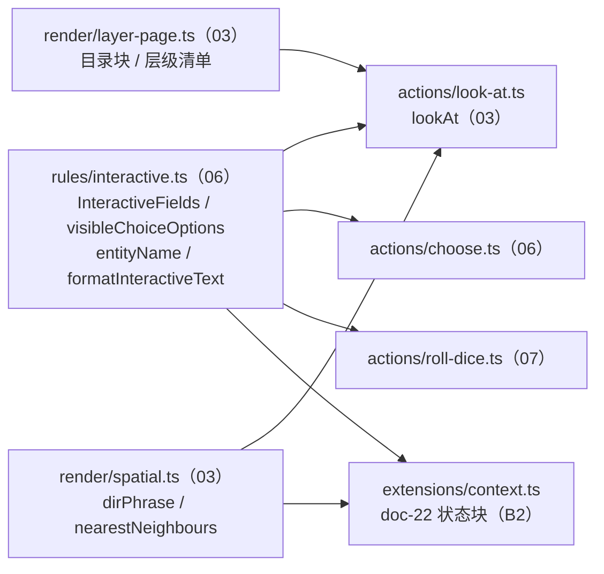
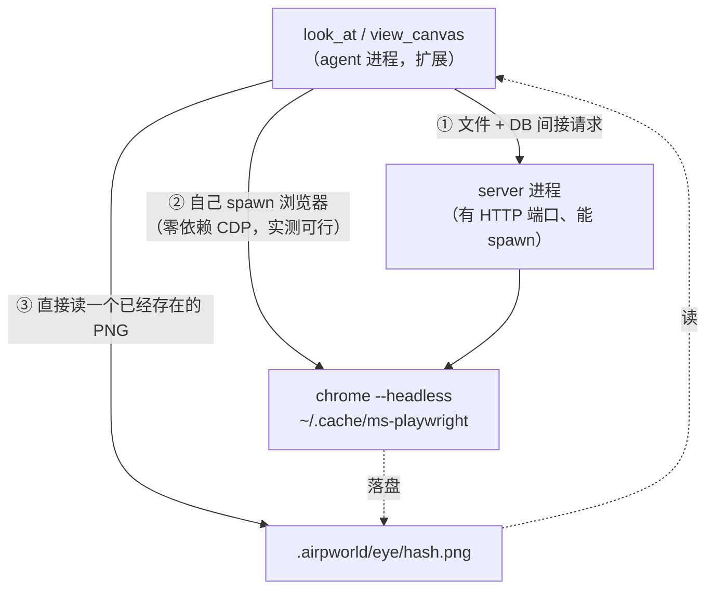

# doc-tools/03 `look_at` 与画布感知（`look_at` / `view_canvas`）

> 状态：**设计稿（2026-09-12）**，待评审。属 B1「工具面」文档批次（`local://b1-context.md`）。
> 一切共享接口、路径、命名、事件口径以 `docs/tools/00-共同上下文.md`（冻结契约）为准；动作层的形状（`ActionContext` / `ActionResult` / `ActionError` / 方法名 / `WorldStore` 新增面）以 `docs/tools/01-动作内核与事件落账.md`（§2.2 / §2.4 / §2.6 / §2.7 / §4.1）为准，本文**不重定义**。
> 本文**不写代码**（B1 只产出设计文档）；§10 的「代码落点」是下一阶段的施工单。
> 权威层级（`00 §0`）：00 契约 > doc-21 / doc-22 > doc-20（工具语义）> doc-10 > doc-19 > 本文。
>
> 关联：
> - `docs/doc-20-agent工具与互动字段协议.md` §1.1（能力分发）/ §2（互动字段属于所有实体）/ §3（`look_at` 的格式化管线与输出示例）——**本文的主判据**；
> - `docs/doc-21-事件表协议.md` §1（准入三问）/ §1.1（状态不是事件）/ §5.2（路径即指路牌）；
> - `docs/doc-22-Hook注入协议.md` §2 第 9 条（**一份措辞，两处复用**）/ §3.1（`viewpoint` / `layer_files` 节）/ §5 第 3 闸（人话化即量化）/ §9（方位 formatter 的落地）；
> - `docs/doc-05-AIRP产品构想.md` §3.2（层级画布）/ §9.1（共享创作能力）/ §8.5（状态两分法）；
> - `docs/doc-10-组件协议与官方组件清单.md` E0 / E5 / E6（`bg` 是 README 字段、`BAG_TYPES`、组件进感知的形态）；
> - `docs/doc-07-AIRP黑客松作战计划.md` §4.2（`view_canvas` 截图链路「参赛不做」的定案）；
> - `docs/后端实现计划.md` §4（B1 施工单里 `look_at` 一行）。

---

## 1. 一句话与定位

**`look_at` 是文本眼睛，`view_canvas` 是构图眼睛：前者回答「这里有什么、长什么样、能对它做什么」，后者回答「这一层摆得像不像一个场面」。两者都只读、都不落账、都不改世界。**

三条定位：

1. **`look_at` 不是文件读取器。** `read` 给的是**原始文件含完整 YAML**；`look_at` 给的是**经过 AIRP 渲染规则解释后的文本视图**——隐藏纯渲染/控制字段，把 `status / choice / roll_dice` 格式化成稳定可引用的文本块，并保留路径供后续动作精确指向（`doc-20 §3`）。三者分工见 `doc-20 §3.3` 的表，本文不重复。
2. **`look_at` 是「懒加载」这条产品主线的落点。** `doc-22 §7` 的判据是「注入负责让 agent 知道有这么个东西，工具负责让它看清楚」。`look_at` 就是那个「看清楚」。因此它 MUST 输出**稳定路径**——`doc-21 §5.2` 那句「事件天生就是指路牌」的另一半就是这个工具：清单给路径，路径靠 `look_at` 展开。
3. **`view_canvas` 在 B1 是一个诚实的降级品。** 见 §3.3 / §6：真截图在**当前模型配置下拿不到**（不是拿不到图，是拿到了也没人看得见）。本文给出可落地的完整方案与成本，也给出 B1 只做结构化构图摘要的明确边界，**不假装它能截图**。

**调用者**（`doc-20 §1.1`）：作家 ✅ 与角色 ✅ 都可调用；玩家 UI **不调**这两个工具（它是 `/api/layer` 的消费者，走自己的路由，见 §6.4）。能力不按身份裁——一个角色想知道玩家口袋里有什么，`look_at player/` 就能看见（`doc-22 §3.2` 的注：省 token ≠ 门禁）。

**一句话边界**：`look_at` / `view_canvas` 是**只读感知**——无文件写入、无 `canvas.db` 写入、无事件、无 WS 帧。唯一的 I/O 是**读**。

---

## 2. 签名与参数

### 2.1 `look_at`

```ts
// packages/shared/src/actions/look-at.ts
export interface LookAtInput {
  /**
   * World-relative POSIX path of a single `.md` entity, OR a directory
   * (= a layer / the map / `player` / `characters/<id>`), OR an array of both.
   * Omitted → the caller's current layer (see §3.1 step 1).
   * No leading `./`, no absolute path, no trailing `/` (00 §2.1).
   */
  path?: string | string[];
}

export interface LookAtDetails {
  /** Normalized paths actually resolved, in output order. */
  paths: string[];
  /** Which rendering each entry used. */
  entries: Array<{ path: string; mode: 'entity' | 'directory'; title: string }>;
  /** True when at least one entity body was cut by the body cap (§5.4). */
  truncated: boolean;
  /** Total characters of `text` — lets a test assert size without re-measuring. */
  textLength: number;
  /** Never present: read-only (01 §4.1). Declared so the type is explicit. */
  event?: never;
}
```

`path` 的单数/复数是**两种语义**，不是一个参数的两个写法（`doc-20 §3` 的 `path?: string | string[]`）：

| 实参 | 语义 | 输出形态 |
|---|---|---|
| `'world/baker-street/evening.md'` | 读**一个实体** | 实体块（§4.1） |
| `'world/baker-street'` / `'map'` / `'world'` | 读**这一层页面上有什么** | 目录块（§4.2），**不递归进子层内部** |
| `'player'` / `'characters/watson'` | 读**小天地 / 背包根目录** | 目录块（同一规则，只是没有子层） |
| `['a.md','b.md','world/inn']` | 按顺序**逐个渲染再拼接** | 块之间空一行 |
| 省略 | 当前层（§3.1 step 1） | 目录块 |

**`path` 省略时的「当前层」在 B1 怎么来（诚实版）**：`doc-22 §6` 把「当前层」定为 `canvas.db` 的 `viewpoint` 单行表，而 `00 §4` 明写**该表归 B2，B1 不建**。因此 B1 的取值链是：

```
viewpoint 表存在且有 layer  →  用它
表不存在 / 无行（B1 现状）   →  'map'
```

即 **B1 省略 `path` 等价于 `look_at('map')`**。这不是「默认看一眼大地图」的设计意图，而是一个**有明确存续期的兜底**：B2 落地 `viewpoint` 表的那天，这条链的第 2 级自动失效，无需改工具签名。登记在 §15 未知项 1。

> **不许**用 `process.cwd()`、环境变量或「上一次进过的层」猜当前层。`cwd` 是世界根不是一个层（`00 §1`），而「上次进过的层」是进程内存里的隐式状态——`00 §2` 的「文件即真相」不允许工具持有这种东西。

### 2.2 `view_canvas`

```ts
// packages/shared/src/actions/look-at.ts（与 lookAt 同文件，01 §5 冻结）
export interface ViewCanvasInput {
  /** Layer to look at. Omitted → same default chain as look_at (§2.1). */
  layer?: string;
  /**
   * 'auto' (default) — structured composition summary (B1's implementation).
   * 'image'          — a real screenshot. Declared legal, NOT implemented in B1
   *                    → ActionError('unsupported', …) (00 §7 反模式第 4 条:
   *                    no silent downgrade). Full plan + cost in §6.
   */
  mode?: 'auto' | 'image';
  /** 'image' only: viewport in CSS px. Clamped to [320,2560]×[240,1600]. */
  viewport?: { width: number; height: number };
}

export interface ViewCanvasDetails {
  layer: string;
  /** What actually happened. 'summary' today; 'image' only when a shot was returned. */
  mode: 'summary' | 'image';
  /** Viewport the summary describes / the shot was taken at. */
  viewport: { width: number; height: number };
  /** Composition numbers the summary was rendered from (stable, for probes). */
  items: Array<{ path: string; kind: string; x: number; y: number; w: number; h: number; z: number }>;
  /** Pairs whose boxes intersect — the player sees these stacked. */
  overlaps: Array<[string, string]>;
  /** Items with no row in `canvas.db` yet. */
  unplaced: string[];
  /** Characters on this layer (canvas.db `presence`). */
  presence: Array<{ characterId: string; x: number; y: number; following: boolean }>;
  /** 'image' only, when implemented (§6.3): `.airpworld/eye/<hash>.png`. */
  shot?: string;
  event?: never;
}
```

**为什么 `mode` 保留 `'image'` 而不是把参数删成一个值**：`01 §2.4` 的 `unsupported` 语义正是「合法但本阶段未实现」。删掉这个值会让「我们需要视觉」这件事从工具面上消失，将来加回时又变成一次签名变更（`doc-20 §3.3` 那张分工表白写了）。保留 + 抛 `unsupported` 是**可见的诚实**。

### 2.3 工具壳（`extensions/toolkit/look-at.ts`）

```ts
pi.registerTool({
  name: 'look_at',
  label: 'Look At',
  description:
    'Read the player-visible text view of one or more world entities, or of a whole scene page. ' +
    'Hides raw YAML and pure-render fields; keeps the title, the body and the interactive blocks ' +
    '(status / choice / roll dice). Accepts a single .md path, a directory (a layer), or an array. ' +
    'Use look_at to understand what is on the canvas and what actions it offers. ' +
    'Use read when you need the raw frontmatter to edit it.',
  parameters: Type.Object({
    path: Type.Optional(Type.Union([Type.String(), Type.Array(Type.String())], {
      description: 'World-relative path of a .md entity or a directory (layer). Omit for the current layer.',
    })),
  }),
  promptSnippet: 'look_at(path?) — read a world entity or a whole scene page as player-visible text',
  promptGuidelines: [
    'Use look_at before choose: the [Choices] block numbers are the indexes choose accepts.',
    'Use look_at on a layer directory to see the files AND the doors out of it, without loading every child scene.',
  ],
  async execute(toolCallId, params, signal, onUpdate, ctx) {
    // 壳只做三件事：拿 actor、拿 turn、把 ActionError 折成 isError。
    try { return ok(await svc.lookAt({ path: params.path })); }
    catch (e) { return fail(e); }
  },
});
```

（`svc` 由 `01 §2.6` 的 `createActionService(store, actor, { turn })` 得到；`ok` / `fail` 归 `12` 的 `toolkit/result.ts`。）`view_canvas` 同构，参数 `{ layer?, mode?, viewport? }`。

---

## 3. 行为契约（逐步）

### 3.1 `look_at` 逐步

1. **归一化输入。** `path` 归一成数组（`string` → `[string]`），逐项过 `00 §2.1` 路径纪律；省略时走 §2.1 的当前层取值链。
   *漏了会怎样*：不归一化，`look_at(['a.md','a.md'])` 输出两遍，模型以为世界里有两个同名实体（与 `10 §3.2` 第 1 步同一条纪律）。
2. **判定每个目标是什么**（`'file' | 'dir' | 'missing'`）——这是**本工具唯一需要的新 store 能力**，见 §10.2 与 §14 冲突 1。
   *漏了会怎样*：把目录当文件读 → `readFile` 抛 `EISDIR`（实测 `local-store.ts:71` 直接抛裸 fs 错误）；把空目录当缺失 → **一个合法的 stub 层被报成 `not_found`**，而 `routes/world.ts:142-154` 明确要求 stub 层要渲染成「门存在、场景还没写」。
3. **派发渲染**：`file` → §4.1 实体块；`dir` → §4.2 目录块；`missing` → `ActionError('not_found')`（§7.1）。
4. **逐个渲染**（纯函数，见 §4 / §5），块之间空一行拼接。
5. **组装返回值**：`text` = 拼接结果（`01 §2.2` 冻结：对感知工具，**`text` 就是内容本身**，不是一句状态话）；`details` = §2.1 的形状。
6. **不落任何东西。** 无写盘、无 `canvas.db`、无 `appendEvent`（§8 的落账判定）。
   *漏了会怎样*：落一条事件会让「agent 看了一眼」变成世界变化，直接违反 `doc-21 §1` 准入第 1 问；而且会让 `doc-22 §5.4` 的合并逻辑多出一堆噪音事件。

**关于空输入**：`path: []`（空数组）不是「读当前层」，是 `invalid_argument`（`Cannot look at an empty path list`）——空数组是调用错误，不是「什么都没找到」。与 `01 §7.3` 的「空字符串是 `invalid_argument` 不是 `not_found`」同一口径。

### 3.2 一条真实调用链（作家视角）

```
作家想知道 Baker Street 层上有什么
  → look_at({ path: 'world/baker-street' })     ← 目录块：6 个文件 + 0 个出口 + 布局
  → 看到 ".../evening.md — narration · "evening" · (Watson opens a manila envelope…"
  → look_at({ path: 'world/baker-street/evening.md' })   ← 实体块：正文 + Status + Choices + Dice
  → 读到 "[Choices] 1. Ask where the photograph came from"
  → choose({ path: 'world/baker-street/evening.md', choice: 1 })   ← 06 的 1-based 序号
```

这条链是**本工具存在的理由**：没有任何一步需要回读整个目录，每一步都只拉它需要的那一块（`doc-22 §7`）。

### 3.3 `view_canvas` 逐步（B1 实现的是 `mode:'auto'`）

1. **归一化 `layer`**，与 `look_at` 同一路径纪律；省略走同一取值链。
2. **`mode === 'image'`** → 立即 `ActionError('unsupported', 'view_canvas image mode is not implemented in B1; use the structured summary')`。**不降级成摘要**（`00 §7` 反模式第 4 条）。
3. **`mode === 'auto'`**：取这一层的页面（`store.pageOfLayer(layer)` —— 复用 `00 §4.1` 冻结接口，它已经是 `cardsOfLayer + childLayers` 的正确组合）+ 卡片坐标（`store.getLayerCards`）+ `links` / `presence`（`queryCanvas`）。
4. **compose**：按 `z` 排序、算尺寸类别、算最近邻方位、检出遮挡对、列出未排座项（§6.2）。
5. **不落任何东西。** 相机与选中态是**视点当前值**，归 `canvas.db`（`doc-21 §1.1` 第二行），而且 `look_at` / `view_canvas` **连视点都不写**——它们只看，不动。
   *漏了会怎样*：若这里写 `layer_entered`，作家每看一眼就产生一次「玩家换场了」的假事件，`doc-22 §3.1` 的 `dynamics` 节会把作家自己的偷看念给他自己听。

---

## 4. 输出格式（冻结）

> 这一节就是 `doc-20 §3.1` 那条「精确的输出格式」的落成，也是**测试期望值的唯一来源**。
> §4.1–§4.2 的示例全部是**实测输出**（`/tmp/wtest` 世界，含新加的 `empty-stub` 层与三个新实体，脚本 `/tmp/final-fmt.mjs` 直接调 `packages/shared/dist` 的 `parseFrontmatter` / `cardKindOf` / `deriveLayers`）。**可以逐字当测试期望值。**

### 4.1 实体块

```text
[<path>]
<title>

<body>

[Status]
<key>: <value>
…

[Choices]
1. <choice text>
2. <choice text>

[Dice]
<desc> · <type> · success <expect> · <state>
```

规则（每条都配「漏了/错了会怎样」）：

| # | 规则 | 漏了会怎样 |
|---|---|---|
| 1 | 第 1 行永远是 `[<path>]`，路径**原样**（世界根相对，`00 §2.1`），不加引号、不加 `./` | 没有路径，模型无法把它当指路牌；`doc-21 §5.2` 的「路径即指路牌」断掉 |
| 2 | 第 2 行是**标题**（解析规则见 §5.4） | 模型对实体只有文件名，写回时用错名字 |
| 3 | 标题与正文之间、正文与各块之间**恰好一个空行** | 空行数量不稳会让 snapshot 测试无故抖动 |
| 4 | 正文**不含**已作为标题渲染的那一行（`# Title` / `<b>Title</b>` 只出现一次） | 同一句话出现两遍；与前端 `plainExcerpt` / `leadingTitleOf`（`apps/web/src/lib/md.ts:110,132`）的行为不一致 |
| 5 | **块只用 `[Status]` / `[Choices]` / `[Dice]` 三个英文标签**，顺序固定 Status → Choices → Dice | 顺序不稳 = 期望值不可写；标签不统一，模型学不到「看到 `[Choices]` 就该用 choose」 |
| 6 | 三个块**各自独立**：缺字段就整块不出现（不是输出空块、不是 `(none)`） | 空块会让模型以为「有选项但选不了」 |
| 7 | 隐藏的字段（`type` / `component` / `material` / `bg` / `bgStyle` / `name` / `title` / `preview` / `sign` / `seal` / 任何 chalk 样式位如 `font` / `big` / `color` / `size` / `card` / `collapsed` / `aged`）一律不出现 | 输出了原始 YAML = 回到 `doc-20 §3.1` 明确否掉的那个极端；`material`/`bg` 是层的配置，属于目录块的 backdrop 而不是实体正文 |
| 8 | 正文超过 **4000 字符** → 截断 + 一行尾注（§5.4） | 一条 200KB 的 chalk 会一次性吃掉上下文 |
| 9 | 文案全英文（标签、尾注、错误），**实体正文逐字保留原语言** | 硬约束 6 说工具面英文；但把中文叙事翻译掉就是篡改世界内容 |

**示例 A：chalk 带四件套（status + choice + roll_dice 未掷）**——`world/baker-street/evening.md` 的实测输出：

```text
[world/baker-street/evening.md]
evening

(Watson opens a manila envelope, and a photograph slips out.)

The distant outline of the abandoned orchard. On the back of the photo: "The truth in the orchard lies beneath the tree."

This is what the Constable found... you see, the orchard's name has been crossed out.

[Status]
photo_source: The Constable
orchard_clue: The name has been crossed out
case_progress: Clue found

[Choices]
1. Ask where the photograph came from
2. Go to the orchard alone to investigate

[Dice]
Deduction check · 1d100 · success >50 · not rolled
```

注意这条：源文件没有 `title`、没有 `name`，所以标题走 `entityName` 的最后一级 = **basename 去 `.md`** = `evening`（`06 §3.7`）。这是 `doc-20 §3.2` 的示例里没覆盖、但真实模板里最常见的一类（`templates/holmes-world/world/baker-street/evening.md` 实测就是这个形状）。**它不是「slug 化」**——`entityName` 不剥 `NN-` 前缀、不把 `-` 换空格（`06 §3.7` 就三个候选：`title` → `name` → `basename(path,'.md')`）。所以 `04-broken-check.md` 的标题就是字面的 `04-broken-check`（见示例 F），`late-night.md` 是 `late-night`。

**示例 B：`letter` 组件（preview + sign 是卡面，body 是二级层）**：

```text
[world/baker-street/02-a-letter-from-watson.md]
A Letter from Watson

The envelope is damp; the ink has run at one corner.
— J.W.

The envelope was pushed under the door some time before dawn.

I did not read it. It is not addressed to me.

[Status]
opened: false
delivered_to: (none)
```

`letter` 是唯一有**二级阅读**（title → preview → body → sign）的 kind（`doc-10 E2`）。文本形态按 `doc-10` 的四段体照搬：`preview` 紧贴标题（它是卡面，不是正文），`sign` 加 `— ` 前缀，`body` 是全文（`fm.body` 优先，缺省取 md 正文——`10 §16`）。**漏了 `preview` 会怎样**：`look_at` 与前端卡面看到的不是同一段话，作家会写出与卡面不符的续写。**漏了 `sign` 会怎样**：信件失去落款，而 `10` 的 letter 契约里 `sign` 是四段之一。

**示例 C：`note`（裸正文，无互动字段）**：

```text
[player/old-boat-ticket.md]
An Old Boat Ticket

Baker Street to somewhere. The print is nearly worn away.
```

标题来自 `frontmatter.title`（`title: An Old Boat Ticket`）。源文件正文首行还是 `<b>An Old Boat Ticket</b>`——它与标题**同字**，所以按规则 4 被去掉，只出现一次。`[Status]` / `[Choices]` / `[Dice]` 三块都不出现（规则 6）。（对照 `raindrops.md`：那篇既无 `title` 也无 `name`，标题退化成 `raindrops`，而正文首行是 `Raindrops`——**大小写不同、判定用不区分大小写的相等**，所以那一行同样被去掉，见 §5.4 的规则。）

**示例 D：`gate`（`README.md`，门的门牌）**：

```text
[world/abandoned-orchard/README.md]
Abandoned Orchard

It exists only at first glance.

(The clues will lead you here.)
```

标题取 `frontmatter.name`（`name: Abandoned Orchard`）；正文的 `# Abandoned Orchard` 因与标题相同而被去掉。`material: stub` / `bg` / `bgStyle` 全部隐藏（规则 7）——那三样是**这一层的配置**，`read` 才看得到，模型的场景感知从这里拿到的是「这地方叫什么、一眼看上去是什么」。

**示例 E：骰子已掷 + choice + status 三块同现（组件上）**：

```text
[world/baker-street/03-cellar-door.md]
The Cellar Door

A padlock newer than the door it guards.

[Status]
locked: true
keyhole: rusted

[Choices]
1. Force the door
2. Look for another way down

[Dice]
Pick the rusted lock · 1d100 · success >50 · rolled 62 — passed
```

这就是 `doc-20 §2.1` 的 piano 形状（`type: component` + `status` + `choice`）落到文本上的样子——**`look_at` 完全不关心它是 chalk 还是 component**，因为互动字段是实体通用的（`doc-20 §2`）。注意 `[Dice]` 的第四段：已掷 → `rolled 62 — passed`（§5.3 的三态）。

**示例 F：骰子声明坏（缺 `expect`）—— 整块不出现**（**按 06 修正后的形状**）：

```text
[world/baker-street/04-broken-check.md]
04-broken-check

A note whose dice declaration is missing its pass condition.
```

没有 `[Dice]` 块——因为 `06 §3.4` 把「`roll_dice` 缺 `expect`」判成**该键为 `null`**（`06 §8` 验收表的原句：「`roll_dice` 缺 `expect` → `roll_dice: null`」），null 的块不出现（§4.1 规则 6）。**这是本文初稿与 06 的一处真冲突，本文按 06 改了**：初稿想输出 `no pass condition set`（让作者看见待修的骰子），`06` 选了「坏字段 = 整键作废 + `errors` 记一条」——那是对三个互动字段统一的规则，`roll_dice` 不该破例。代价是作者要发现这个错得靠 `errors`（`06 §11` 未知项 7 正在问这事），**本文站在 06 这边**，并把「`errors` 要不要进 `look_at`」登记为 §15 未知项 9。

而 `look_at` 对此**不做失败**：它照常返回这一篇的正文（§7.1 行 11 的「不是错误」仍然成立），只是不打印那个块。

### 4.2 目录块

```text
[<dir>]
<layer name>[ — not written yet]

Files here (<n>):
  <path> — <kind word> · "<title>"[ · <summary>]
  (none)

Exits (<m>):
  <child>/README.md — door to <child name>[ (not written yet)][ · <summary>]
  (none)

Layout (each item, relative to its nearest neighbour):
  <path> — <direction phrase> <neighbour path>

Overlapping pairs (<k>) — the player sees these stacked:
  <path> / <path>

Not yet placed (<j>) — the engine seats these when the layer is first painted:
  <path>
```

| # | 规则 | 漏了会怎样 |
|---|---|---|
| 1 | `[<dir>]` 用**目录路径**；`map` 层写 `world`（`dirOfLayer` 的逆，`layers.ts:32-39`） | 写 `[map]` 会让模型尝试 `look_at map/README.md`（不存在） |
| 2 | `Files here` = **本层自己的 `*.md`，减掉本层 README**（`cardsOfLayer`，`layers.ts:102-110`），**不递归** | 递归 = 一次 `look_at` 把整棵子树灌进上下文，`doc-08` 的增殖问题当场复现 |
| 3 | `Exits` = **直接子层的门牌**，每个一行，指向 `<child>/README.md`（`childLayers`，`layers.ts:117-124`） | 只列文件不列门，模型不知道还能往哪走；`doc-20 §3.1` 第 6 步写的就是这个 |
| 4 | 子层保持 **stub 语义**：无 README 也要出现，标 `(not written yet)` | 与 `routes/world.ts:142-154` 的 stub door 行为不一致；首次进入的路会把「未写的门」藏起来 |
| 5 | `(none)` 是**有意的正数零**（0 个文件 / 0 个出口），不是省略 | 整段消失时模型分不清「没有」和「没报」 |
| 6 | `kind word` 取 **`cardsOfLayer` + `cardKindOf`**（`forms.ts:44-55`）的 kind，翻成人话（`narration` / `note` / `letter` / `scene door` / `presence` / `file`） | 自造第二套 kind 判定 = 与前端尺寸/渲染分叉（`10 §3.1` 点的就是这条路） |
| 7 | `summary` ≤ **90 字符**，取自 `preview` 优先、否则正文首段压平（与 `doc-10 E6` 的「标题 + 前 N 字摘要流」同源） | 清单退化成全文列表 |
| 8 | `Layout` 是**人话方位**，一对一最近邻，**不含任何坐标数字**；两项以下不出现 | 灌坐标 = `doc-20 §3.2` 明文禁止；全对全 = 层内 12 个卡片产出 132 行 |
| 9 | `Overlapping pairs` 只报**相交对**，不报间距 | 「构图有问题」的唯一可执行信号是「玩家看到叠在一起」，不是「密度 0.37」 |
| 10 | `Not yet placed` = 在 `canvas.db` 无 `cards` 行的项（含未落座的 stub 门） | 不说这句，模型会以为空白的画布上什么都没有；实际是「等进入时才排座」（`doc-06 §2.5`） |

**示例 G：一个真实的层（3 个文件已排座 + 3 个新文件未排座 + 0 个子层）**：

```text
[world/baker-street]
Baker Street

Files here (6):
  world/baker-street/02-a-letter-from-watson.md — letter · "A Letter from Watson" · The envelope is damp; the ink has run at one corner.
  world/baker-street/03-cellar-door.md — note · "The Cellar Door" · A padlock newer than the door it guards.
  world/baker-street/04-broken-check.md — narration · "04-broken-check" · A note whose dice declaration is missing its pass condition.
  world/baker-street/evening.md — narration · "evening" · (Watson opens a manila envelope, and a photograph slips out.) The distant outline of the a…
  world/baker-street/late-night.md — narration · "late-night" · (Watson gazes out the window; fog is rolling in off the river.) The fog is unusually thick…
  world/baker-street/raindrops.md — note · "raindrops" · A new note by the window pane.

Exits (0):
  (none)

Layout (each item, relative to its nearest neighbour):
  world/baker-street/evening.md — above-left of world/baker-street/raindrops.md
  world/baker-street/late-night.md — above-right of world/baker-street/raindrops.md
  world/baker-street/raindrops.md — below-left of world/baker-street/late-night.md

Not yet placed (3) — the engine seats these when the layer is first painted:
  world/baker-street/02-a-letter-from-watson.md
  world/baker-street/03-cellar-door.md
  world/baker-street/04-broken-check.md
```

三点值得注意：

1. **`Exits (0)`**：`baker-street` 是真叶子层（没有子目录），所以是**有意的正数零**而不是省略（规则 5）；
2. **`Layout` 逐项一对一**（最近邻）：3 项 = 3 行，不是 3 项全对对的 3 行——这里恰好一样，但 12 项时全对全是 66 行、最近邻是 12 行（规则 8）。方向词只描述**相对位置**，永远没有 `x=1296` 这种数字；
3. **`Not yet placed`**：`evening.md` / `late-night.md` / `raindrops.md` 在 `canvas.db` 里有 `cards` 行（前两个是 460×190 的 `chalk`、第三个是 200×168 的 `note`，实测），而我新加的三个文件还没有——所以它们在清单里，但**不在布局里**。模型据此知道「画布上现在只有 3 样东西，另外 3 样要等有人进入这一层才会排座」。

**示例 H：map 层（0 个文件 + 4 个出口，含一个还没写的 stub 层）**：

```text
[world]
Fog Over Baker Street

Files here (0):
  (none)

Exits (4):
  world/abandoned-orchard/README.md — door to Abandoned Orchard · It exists only at first glance. (The clues will lead you here.)
  world/baker-street/README.md — door to Baker Street · Watson pokes his head out of the apartment window. "Holmes, what are you looking at?" The…
  world/crime-scene/README.md — door to Crime Scene · It exists only at first glance. (You draw near, and only then does it take shape.)
  world/empty-stub/README.md — door to empty-stub (not written yet)

Layout (each item, relative to its nearest neighbour):
  world/abandoned-orchard/README.md — above-left of world/baker-street/README.md
  world/baker-street/README.md — below-right of world/abandoned-orchard/README.md
  world/crime-scene/README.md — below-left of world/abandoned-orchard/README.md

Not yet placed (1) — the engine seats these when the layer is first painted:
  world/empty-stub/README.md
```

**`Files here (0)` 不是 bug**：map 层的 `cardsOfLayer` 恰好是空的（`world/*.md` 里只有 `README.md`，而它被 `cardsOfLayer` 排除——`layers.ts:94-101` 的注释解释了为什么：目录的 README 是这一层的**配置**，不是画布对象，渲染它会得到一个「盖在自己场景上的幽灵门」）。地图上的东西全是门，这就是设计（`doc-05 §3.2`：大地图本身就是一块普通画布，它的物件是子层的门）。

**`empty-stub` 这一行是本文最该被 review 的一行**：目录 `world/empty-stub/` 存在但没有 `README.md`。实测确认：它出现在 `childLayers` 里（`layers.ts:117-124` 由 `deriveLayers` 的 `readFm → null` 合成 stub 项），`pageOfLayer('world/empty-stub')` 返回 `{cards:[], doorIds:[]}`（实测），`listDirs()` 看得见它而 `listFiles()` 看不见。所以：**`look_at('map')` 必须列出这个门**，否则玩家看到画布上有一张门卡、而 agent 的文本视图里没有——**两边不同源**，正是 `00 §1` 最怕的那种分叉。

### 4.3 为什么目录块**不写进** `look_at` 的实体管线

`doc-20 §3.1` 第 6 步的原文是「目录目标按当前层页面规则展开：本层文件 + 直接子层门牌，不递归泄漏子层内部」。这里的「**当前层页面规则**」指的就是 `layers.ts` 的 `cardsOfLayer` / `childLayers`——它与 `GET /api/layer`（`routes/world.ts:133`）**同一份派生逻辑**。因此：

- `look_at(<dir>)` 与玩家在这一层看到的**是同一批对象**（文件 + 门），只是呈现一个是文本、一个是卡片；
- 前端那套还会额外排座并把坐标落库（`seatUnplaced` / `reseatLayer`，`routes/world.ts:167-180`），而 `look_at` **绝不排座**——它只读 `canvas.db` 里已有的行，报告「哪些还没排座」。理由：一个读取工具触发写库，违反 `00 §2` 的「动作工具才改世界」；而且用一次 `look_at` 就把坐标写定，会让「首次进入才排座」的演出节奏失效。

---

## 5. 共用 formatter（**归属与 06 的边界**）

### 5.1 归属边界（与 06、与 doc-22 的调用方向）

`doc-22 §2` 第 9 条与 §9 的落地表都要求「状态块的 formatter 与 `look_at` 的 formatter 是同一套」，但**两处都没说谁写**；`doc-09 §6` 也把「`look_at` 文本 formatter」列为待设计 #6，`10 §3.1` 第 4 步又把它推给「09 §6」——**三份文档互相指，没人落点**。

**实际定界（与 `06-choose与互动字段.md` §2.3 对表后的结论）**：

| 东西 | 归谁 | 放哪 | 依据 |
|---|---|---|---|
| `choice` / `status` / `roll_dice` 的**字段 schema 抽取 + 归一化**（`InteractiveFields`）、以及**选项编号**（`visibleChoiceOptions`） | **06** | `packages/shared/src/rules/interactive.ts` | `06 §2.3` 已冻结这块的导出形状 |
| 这三个字段的**文本渲染**（`[Status]` / `[Choices]` / `[Dice]` 三块） | **06 的同一个文件**（`formatInteractiveText`），**本文档调用并冻结它的输出格式** | `rules/interactive.ts` | `06 §2.3`：「`look_at` 的 `[Status]/[Choices]/[Dice]` 文本块（`doc-20 §3.2` 的格式，**03 直接调**）」 |
| **实体名**（title → name → basename） | **06**（`entityName`） | `rules/interactive.ts` | `06 §2.3` 冻结；三个读者共用（事件 `detail.name` / `look_at` 标题 / 错误文案） |
| **方位人话** + **目录块 / 层级清单** + **正文截断** | **本文档** | `packages/shared/src/render/spatial.ts` / `render/layer-page.ts` | 06 不涉及空间与目录 |
| 序号的**消费**（`choose({choice: N})` 接受 1-based） | **06** | `packages/shared/src/actions/choose.ts` | `06 §3.2` |

**为什么把渲染留在 06 的文件里，而不是像本文初稿那样另开 `render/interactive.ts`**：**编号与渲染必须住在一起**。`06 §3.5` 的 `when` 会让某些选项在某一刻**不占号**，于是「可见列表 → `1.` / `2.`」这件事同时决定了**渲染出来的序号**与**`choose` 认领的第几条**。两处各写一份编号逻辑，就是 `06 §3.5` 末尾点名的那类事故（「这是整套协议里最容易出的错」）。所以：**一个函数产出 `index`，一个函数把 `index` 印成文本**，两个函数在同一文件里、共享同一个 `visibleChoiceOptions()`。本文的职责是**把输出格式冻死**（§4 / §5.3），让 `formatInteractiveText` 有唯一期望值。

**调用方向是单向的**：




这解决了「三份文档互相指、没人落点」：**06 冻结编号与渲染，03 冻结格式与消费，B2 只 import。**

### 5.2 冻结的序号格式（`choose` 反向引用的契约）

```text
[Choices]
1. Ask where the photograph came from
2. Go to the orchard alone to investigate
```

- 序号 **1-based**，与 `01 §5` 冻结的 `chooseOption({ path, choice: string | number })`「1-based」一致；`choice_selected.detail.index` 也是 1-based（`01` 已冻结，`06 §2.1` 复述）。
- 分隔符是 **`. `（点 + 一个空格）**，行首无缩进。
- 选项文本**逐字**取自 `interactive.choice.options[i].label`（已剥外层引号，`06 §2.2`），不改写、不翻译、不截断。
- **编号来自 `visibleChoiceOptions()`（`06 §2.3`），不是数组下标。** `06 §3.5` 的 `when` 会让不满足条件的选项**不占号**；按声明顺序编号会让 `look_at` 的 `2.` 与 `choose` 认领的第 2 条是**不同选项**——`06 §3.5` 末尾点名这是「整套协议里最容易出的错」。这就是 §5.1 把「编号 + 渲染」留在同一个文件里的理由。
- **`hint` 追加在同一行**，格式 `1. Open the lid — needs the lid open first`（`06 §2.2` 的 `hint`：「给玩家的一句提示（灰字）。`look_at` 用 `— hint` 打印」）：

  ```text
  [Choices]
  1. Open the lid — needs the lid open first
  2. Play the unfinished nocturne
  ```

  它是**辅助文字不是发生的事实**，所以只出现在文本里，**不进事件 `detail`**（`06 §5` 明列）。
- **不可见选项在块尾聚成一行**（`06 §3.5` 的 fail-closed 产物）：

  ```text
  [Choices]
  1. Open the lid
  (hidden: "Play the unfinished nocturne" — malformed when "lid === open")
  ```

  这就是 `06 §11` 未知项 7 里那句「`look_at` 只用来渲染 `(hidden: …)` 那行」的落点——**本文认领这一行的格式**。理由是它必须可见：一个因作者写坏 `when` 而消失的入口，如果 `look_at` 不报，agent 永远不会去修它（`06 §3.5`：「agent 自愈，玩家看不见坏状态」）。
- 想引用选项的 agent 可以给**序号**（`choose({path, choice: 2})`）、**完整文本**（`choice: 'Go to the orchard alone to investigate'`）或 `id`（若作者写了）；三种都能对上（`06 §3.2` 的解析优先级：`id` → 精确 `label` → 大小写不敏感 `label` → 序号）。**文本是逐字的**这一点是三种入口能共存的前提。
- 空选项组（或缺席）→ 整块不出现（§4.1 规则 6）。

### 5.3 冻结的三个块的形状

> 这一节是 `doc-20 §3.2` 那个短示例的**完整展开**，也是 `06 §2.3` 的 `formatInteractiveText` 的唯一期望值。`06 §8` 的验收表已写「对 `evening.md` 的实际内容断言输出 == `doc-20 §3.2` 的格式」——本文 §5.3 就是那个格式的正式定义，**两处 MUST 一致**（§4 的示例 A / E / F 是实测输出，可直接当断言）。

**`[Status]`**

```text
[Status]
opened: false
delivered_to: (none)
```

- 输入是 `interactive.status`（`06 §2.3` 的归一化块：`{ data: Record<string, string|number|boolean|null>, label?: string } | null`）。**`look_at` 不碰 raw frontmatter**——`06` 已经把「`data` 缺席时取 `status` 本身」这条兼容做在 `buildInteractiveFields` 里，03 只消费归一化结果。这是 §5.1 的单向依赖在起作用。
- **每个键都输出，不认识的键不丢**（与前端 `apps/web/src/lib/fm.tsx:9-10` 的注释「EVERY key is shown」同一条纪律）。哪些键进得来由 `06` 的 schema 决定（`status.data.a` 是对象 → 整个 `status` 为 `null` + 一条 `errors`，`06 §3.4`）。
- **`status.label` 是表头，打印在 `[Status]` 下面一行**（`06 §3.4`：「`status.label`（可选）是表头」，`06 §6.3` 要求前端「改读 `status.label`」）：

  ```text
  [Status]
  Case Progress
  photo_source: The Constable
  case_progress: Clue found
  ```

  `label` 缺席时这一行不存在（大多数实体是这种）。
- 值得注意：前端把 `_` 换成空格展示（`fm.tsx:113` 的 `String(k).replace(/_/g,' ')`）。**`look_at` 不做这个替换**——键名是 agent 写回 frontmatter 时要用的字面量（`edit` 里必须写 `case_progress:`，不是 `case progress:`）。这是刻意的**文本/视觉分叉**，登记在 §15 未知项 3。
- 值的渲染：`string` 原样；`number` / `boolean` 用 `String()`（`false` 不是 `"false"`）；`null` → `null`。**不做单位、不四舍五入、不加引号。**（`06 §3.4` 已把值域限成**扁平标量**：嵌套不允许，所以这里不需要 `JSON.stringify` 分支——那是 `06` 收窄带来的简化。这条与前端 `fm.tsx:111-115` 的 `String(v)` 一致。）
- 键按 **归一化时的序**（`06 §2.3` 的 `buildInteractiveFields` 保 frontmatter 原序；实测 `evening.md` 输出 `photo_source` → `orchard_clue` → `case_progress`，与源文件一致）。
- 空 `status`（`null`、或 `data` 为空对象）→ 整块不出现（§4.1 规则 6）。

**`[Dice]`**

```text
[Dice]
Pick the rusted lock · 1d100 · success >50 · rolled 62 — passed
```

- 输入是 `interactive.roll_dice`（`06 §2.3`：`{ type: string; desc: string; expect: string; result?: number; passed?: boolean } | null`）。**五字段与 `07-roll-dice.md` 双向确认，一字不改**。
- 四段固定顺序：`desc` · `type` · `success <expect>` · `<state>`，分隔符 **` · `**（空格-中点-空格）。
- 缺省：`type` 缺 → `1d100`（`frontmatter.ts:4` 的 schema 默认）；`desc` 缺 → `Check`（与 `fm.tsx:127` 一致）。
- `expect` 缺 → **`06 §3.4` 已把整个 `interactive.roll_dice` 判为 `null`**（「`roll_dice` 缺 `expect` → `roll_dice: null`」，`06 §8` 验收表原句），因此**这一块不出现**，而不是打印 `no pass condition set`。

  > ⚠️ **这是本文初稿与 06 的一处口径差，已按 06 修正。** 初稿的 `no pass condition set` 想的是「让作者看见一个待修的骰子」，但 `06` 选择了**整个字段作废 + `errors` 记一条**（`06 §3.4` 的「③ 坏字段不崩、不静默」）。两者只能选一个，**以 06 为准**——因为它是 schema 的拥有者，而且「坏字段 = 该键为 null」是三个字段的统一规则，`roll_dice` 不该单独破例。代价：作者要发现这个错得靠 `errors`（`06 §11` 未知项 7 正在问「`errors` 要不要也格式化出来」），**本文站 06 这边，并把「`errors` 要不要进 `look_at`」登记为待拍板**（§15 未知项 9）。
- `<state>` 三态（`result` / `passed` 只会一起出现或一起缺席，见 `07 §2.2.8` 的回写器：它**总是同时写两行**）：
  - 无 `result` → `not rolled`
  - `passed === true` → `rolled <n> — passed`
  - `passed === false` → `rolled <n> — failed`
- **`look_at` 不掷骰、不校验表达式。** `expect` 是否可解析是 `07` 的 `evaluateExpect` 的事；`look_at` 只把已归一化的字符串印出来。原因：`look_at` 是只读工具，「读一眼」就报 `invalid_field_value` 会让 agent 无法查看一个待修的实体。**这与 `roll_dice` 的失败语义不同**（那边必须在裁决时拒绝，`01 §2.4` 的 `invalid_field_value`；`07 §7` 有完整的拒绝表）。
- **`<state>` 的两个数字必须来自 `interactive.roll_dice`，不许重算。** `07 §2.2.6` 的 `passed` 是引擎唯一裁决函数的产物，`look_at` 重新按 `expect` 判一次就可能与文件里的值分叉（比如 `expect: ">50 && <=60"` 这种复合式）。`doc-05 §3.1` 的「回写 `result / passed`」就是为了让**所有读者读同一个值**——这里正是那个设计的目的地。

**与 `doc-22` 状态块的复用点**（`doc-22 §9`）：`extensions/context.ts` 的 `layer_files` 节需要「路径 + 一行这是什么」——那正是 §4.2 的 `Files here` 行格式；`viewpoint` 节需要「人话方位」——那正是 §5.4 的 `dirPhrase`。B2 直接 import 这两个模块，**不另写一套措辞**。

**不解耦的那一条**：状态块的 `dynamics`（事件段）用 `doc-21 §4` 的人话模板，**与本文三个块无关**（事件渲染器按 `type` 注册，`doc-21 §3.5`）。别把两套 formatter 混起来——一套读 frontmatter（本文/06），一套读 `detail`（事件渲染器）。


### 5.4 标题、方位与截断

**标题解析**（**不归本文**）：调 `06 §2.3` 的 `entityName(fm, path)`，**只有三级**（`06 §3.7` 的原文）：

```ts
entityName(fm, path) = fm.title?.trim() || fm.name?.trim() || basename(path, '.md')
```

1. `title` 优先（chalk / component / letter / note 的卡面标题）；
2. `name` 兜底（README 类实体带 `name` 而不是 `title`，实测 `templates/holmes-world/world/baker-street/README.md:3`）；
3. **`basename(path, '.md')` 字面**——不剥 `NN-`、不换 `-`、不做 slug（`06 §3.7` 举的例子正是 `raindrops.md`）。

**它与「正文首行标题」无关**——这是本文对初稿的一处修正：初稿曾想用 `# Heading` / `<b>Title</b>` 提标题（照前端 `apps/web/src/lib/md.ts:110` 的 `leadingTitleOf`），但 **06 冻结的 `entityName` 不含这一级**，而三处消费者（`detail.name` / `look_at` 标题 / 错误文案）必须同名（`06 §3.7` 末）。所以本文**不自己提标题**，只用 `entityName`。

**但「去掉正文里重复的那一行」仍然是本文的规则（§4.1 规则 4），且用不区分大小写的比较**：`raindrops.md` 的标题是 `raindrops`、正文首行是 `Raindrops`——两者**不是逐字相同**，但显然是同一行。只做逐字比较会让标题和正文各出一遍。判定用 `leadingTitleOf(body).toLowerCase() === entityName(fm, p).toLowerCase()`（`leadingTitleOf` 是前端已有的正则，`md.ts:110`；本文借它的**匹配**、不借它的**命名权**）。

**正文与截断**：

- 正文 = `parseFrontmatter().body`，`trim()`，并且**去掉与标题重复的首行**（§4.1 规则 4）。
- 上限 **4000 字符**（`BODY_CAP`）。超限输出：

```text
… [truncated at 4000 of 12783 characters — read "world/inn/long-letter.md" for the rest]
```

- **截断不是错误**（`00 §7` 的失败清单里没有它，`01` 也确认「truncation is NOT an error」）：不返回 `isError`、不抛 `ActionError`，只是文本里多一行尾注 + `details.truncated = true`。理由：截断后信息仍然有用，而 `isError` 会让模型整条丢弃。
- 尾注里给**完整路径**，因为它就是「下一步动作」——`doc-23 §2.4` 要求的「每步写清漏了会怎样」在工具输出里的对应物：告诉模型怎么拿到剩下的。**不要**写「use bash: sed -n …」（pi-rp `read.ts:360` 的那种提示）——`read` 是内建工具，`look_at` 的输出应该指向它，而不是教模型绕过它。
- 4000 这个数：pi-rp 内建 `read` 的默认上限是 **2000 行 / 50KB**（`vendor/pi-rp/packages/coding-agent/src/core/tools/truncate.ts:11-12`）。`look_at` 是一次看一批（可能多个实体 + 一个目录），所以单实体正文取 4000 字符（约 2–3KB）——远小于 `read` 的能力上限，留出「一次看十几个实体」的空间。
- 目录块的 `summary` 另有 **90 字符**上限（§4.2 规则 7），与实体正文的 4000 不是同一个闸。

**方位（`dirPhrase`）——人话，不给数字**（`doc-20 §3.2` / `doc-22 §5` 第 3 闸）：

```ts
// packages/shared/src/render/spatial.ts
export interface Box { x: number; y: number; w: number; h: number }
/** 'next to' | 'above-left of' | 'far below-right of' | 'right on top of' | … */
export function dirPhrase(subject: Box, anchor: Box): string;
/** One line per item, pointing at its nearest neighbour. O(n) — never O(n²). */
export function nearestNeighbours(
  items: Array<{ path: string; box: Box }>
): Array<{ path: string; dir: string; other: string }>;
/** Axis-aligned intersection — the only "composition is broken" signal we report. */
export function boxesOverlap(a: Box, b: Box): boolean;
```

判据（全部只用**盒子的相对几何**，绝不输出坐标）。`dx` / `dy` 取中心点差，`avgW = (subject.w + anchor.w) / 2`，`avgH` 同理，归一化距离 `d = hypot(dx/avgW, dy/avgH)`：

| 条件 | 输出 |
|---|---|
| 水平差 ≤ 0.5·avgW **且** 垂直差 ≤ 0.5·avgH | `right on top of`（`d ≤ 0.4`）或 `overlapping` |
| `d ≤ 1.0` | `next to` |
| 否则 | `<above\|below>[-<left\|right>] of`；`d > 2.5` 前缀 `far ` |

这套阈值的作用是**把像素距离变成一个人能读的词**——`doc-22 §5` 那句「方位词的粒度就是天然的量化」在 `look_at` 侧的同一条实现。实测输出见 §4.2 示例 G / H（`above-left of` / `below-right of`）。

**`Layout` 的两种形态**（§4.2 表格规则 8 与 §6.2 各用一种，别混）：

| 用在哪 | 形态 | 实测样例 |
|---|---|---|
| `look_at(<dir>)` | **逐项一对一**：每个有坐标的项，一行「最邻近是谁、在哪个方向」 | §4.2 示例 G：3 行（`evening.md` → 最近邻 `raindrops.md`） |
| `view_canvas` | **一个锚 + 其余相对它**：锚 = `z` 序第 1 项，其余各一行 | §6.2：3 行（`late-night.md`、`raindrops.md` 各相对 `evening.md`） |

两种都是 **O(n)** 输出、都不含坐标数字。选「逐项完全图」会让 12 个卡片产出 66 行（规则 8 的理由）；选「单一固定锚」则会让一个**未排座**的新文件有机会当锚（它没有坐标，锚就失效）——所以 `view_canvas` 的锚 MUST 取**有坐标且 `z` 最小**的那个。

---

## 6. `view_canvas`：可行性评估与方案

> 这一节是本文档的关键。**结论先行**：`[实测]` 截图这条链在**技术上今天就能通**（零新依赖，~2.4–3.3s / ~250MB 一次），但**在当前的模型配置下截出来的图到不了模型**——所以 B1 做结构化摘要，`mode:'image'` 抛 `unsupported`，并给出下面这个已计价的上位方案。

### 6.1 实测证据

全部在本机（WSL2）跑过，不是推断：

| # | 测什么 | 方式 | 结果 |
|---|---|---|---|
| 1 | 扩展进程有没有浏览器 | `which chromium chromium-browser google-chrome chrome` | **没有**（exit 1；`/usr/bin` 下 0 个）。扩展跑在 agent 进程里，只有 Node |
| 2 | server 有没有截图依赖 | `apps/server/package.json` | 依赖只有 `express` / `cors` / `ws`；**无 puppeteer / playwright** |
| 3 | 机器上有没有浏览器二进制 | `ls ~/.cache/ms-playwright` | **有**：`chromium-1234/chrome-linux64/chrome`（656MB）、`chromium_headless_shell-1234/.../chrome-headless-shell`（262MB）、`ffmpeg-1011` |
| 4 | 能不能零依赖截一张真图 | `chrome --headless=new --no-sandbox --disable-gpu --screenshot=… --virtual-time-budget=3500 "http://localhost:3001/?layer=world/baker-street"` | **能**。`801230 bytes written`，`1440×900` PNG，**wall 2.36–3.26s**，**RSS ~250MB**。同一命令连跑 3 次 **byte 数各不相同**（811456 / 809951 / 811818，md5 全不同）——渲染有非确定性（粒子层 / 字体栅格），**截图不能当字节级 snapshot 断言** |
| 5 | 能不能程序化截（不用 `--screenshot` 那个 CLI 开关） | 自写 **raw CDP**（Node 26 有全局 `WebSocket`）：`Target.createTarget` → `attachToTarget(flatten)` → `Page.navigate` → `Page.captureScreenshot` | **能**。`490868 bytes`，`3296ms`。**不需要 `playwright` 包**——只要 HTTP `/json/version` + WebSocket |
| 6 | 截出来的图对不对 | 读回那张 `cli-eye.png` | **对**：真实渲染了 `Fog Over Baker Street`、三张门卡（含编号印章与图钉）、右侧背包 tab 列出 `README / old-boat-ticket`、小地图、时间印章。与 `GET /api/layer` 的数据一致 |
| 7 | 那模型能不能看图？ | `cat .pi/agent/models.json` + `vendor/pi-rp/packages/coding-agent/src/core/provider-composer.ts:158` + `.../core/tools/read.ts:160-165` | **不能**。`models.json` 里 5 个 provider / 12 个模型**没有一个声明 `input`**；`provider-composer.ts:158` 是 `input: (definition.input ?? ["text"])`——即全部默认 **text-only**。而 `read.ts:161` 明写：`if (!model \|\| model.input.includes("image")) return undefined;`，否则追加一行 `[Current model does not support images. The image will be omitted from this request.]` |

**第 7 条是决定性的。** 它意味着：**即使把第 4/5 条做到完美，返回一个 `{type:'image', data, mimeType}` 块（pi-ai 的 `ImageContent`；`content: (TextContent | ImageContent)[]` 本就是 `AgentToolResult` 的合法形状，`vendor/pi-rp/packages/agent/src/types.ts:361`），pi-rp 也会在下一次请求里把它丢掉，只留一行「本模型不支持图片」。** 一个「成功了但模型永远看不见」的工具，正是 `doc-03 §3.3` 说的假装成功。

顺带一条：`minimax-m2.7`（`.pi/agent/settings.json` 的 `defaultModel`）不在 pi-rp 内建的模型表里（`vendor/pi-rp/packages/ai/src/models.generated.ts` 里 `minimax` 命中 6 次，全是别的 id），所以它就是通过 `models.json` 定义的自定义模型 → 走 `input ?? ["text"]` → 确认 text-only。`[推断]` 换成有视觉能力的模型后第 7 条会翻转，但那要改**模型配置**，不是改工具。

另外一条 `[实测]`：路径 5 的 CDP 会话**不需要** `playwright`——`playwright-core` 只在本机 `~/projects/*/node_modules` 下有（例如 `~/projects/Nodesign/node_modules/playwright-core`，v1.62.1），**不在 hackathon 仓里**。raw CDP 用 Node 26 的全局 `WebSocket` 就够了，所以方案 ①/② 的「零 npm 依赖」是真的零。

### 6.2 B1 落地的（真做了的）：结构化构图摘要

`view_canvas({ mode:'auto' })` 输出**一层画布的构图报告**。它读的和玩家看到的**是同一批数据**（`pageOfLayer` + `cards` 表 + `links` + `presence`），只是给成文本。实测输出（`/tmp/wtest`，脚本 `/tmp/canvas2.mjs`）：

```text
[canvas world/baker-street]
Baker Street — composed scene
backdrop: <见下面的 bug 注> · material: warm

On the canvas (3), back to front:
  z1 world/baker-street/evening.md — wide narration 460×190 · "evening"
  z2 world/baker-street/late-night.md — wide narration 460×190 · "late-night"
  z3 world/baker-street/raindrops.md — small note 200×168 · "raindrops"

Relative to world/baker-street/evening.md:
  world/baker-street/late-night.md — right of
  world/baker-street/raindrops.md — below-right of

Not yet placed (3)
  world/baker-street/02-a-letter-from-watson.md
  world/baker-street/03-cellar-door.md
  world/baker-street/04-broken-check.md

Links (0):
  (none)

Characters present (0):
  (none)
```

**三点必须看清**：

1. **`backdrop:` 那一行现在是坏的**，不是笔误：`parseFrontmatter` 不剥行内注释，所以 `bg` 的真实值是 `assets/scenes/baker-street/parchment-warm.png"   # scene backdrop/texture: README = scene preview = …`——**注释全文 + 一个孤立引号都进了值**（§14 冲突 2）。本文照实说明：`view_canvas` 的 backdrop 行在解析器修好之前**不可用**；落地时要么先修解析器（推荐），要么这一行只输出 `material` 不输出 `bg`。**不许**在这一行「顺手 trim 掉 `#` 之后的东西」——那是用工具层的补丁掩盖解析器的 bug，下一个消费者还会踩。
2. **`Not yet placed (3)`**：跟 §4.2 示例 G 是同一个世界（那里也报了同样 3 个），这里报 3 个未排座项——因为 `look_at(<dir>)` **不排座**（§4.3），这一层已经被 `pageOfLayer`（`routes/world.ts:133` 那条路）扫过，而我新加的三个文件仍未进 `cards` 表。**两者报的「未排座」集合必须一致**（同一个 `cards` 表、同一个判定）——这是 §13.3 的交叉一致性验收项。
3. **`On the canvas (3)` 只列有坐标的项**，`back to front` 就是 `z_index` 升序。没排座的项**不进这一段**（进 `Not yet placed`），因为它们此刻在画布上并不存在。

对照：map 层的实测输出（同一脚本）：

```text
[canvas world]
Fog Over Baker Street — composed scene
backdrop: <同一个 bug> · material: warm

On the canvas (3), back to front:
  z1 world/abandoned-orchard/README.md — scene door 288×240 · "Abandoned Orchard"
  z2 world/baker-street/README.md — scene door 288×240 · "Baker Street"
  z3 world/crime-scene/README.md — scene door 288×240 · "Crime Scene"

Relative to world/abandoned-orchard/README.md:
  world/baker-street/README.md — below-right of
  world/crime-scene/README.md — below-left of

Not yet placed (1)
  world/empty-stub/README.md

Links (0):
  (none)

Characters present (0):
  (none)
```

这一份与 §4.2 示例 H **同源**：`Exits` 的四个门 = 这里的三个 `scene door` + 一个 `Not yet placed` 的 `empty-stub`。`view_canvas` 按「有没有坐标」把它们分开，`look_at` 按「是不是门」全都列出来——**同一批对象，两种视角**（§6.4）。

它比 `look_at(<dir>)` 多什么、少什么：

| | `look_at(<dir>)` | `view_canvas`（摘要） |
|---|---|---|
| 文件清单 + 摘要 | ✅（正文首段，≤90 字） | ✅（**尺寸类别** `wide` / `small` + 精确宽高） |
| 门牌 | ✅ | ✅ |
| 层级关系（`z` 序） | ❌ | ✅ `back to front` |
| 遮挡对 | ❌ | ✅ |
| 未排座项 | ✅ | ✅ |
| 关系线 / 在场角色 | ❌ | ✅ |
| 正文 / 互动字段 | ✅ | ❌（要看内容用 `look_at`） |
| 「场面感」 | 弱 | **中**——`z` 序 + 尺寸 + 方位 + 遮挡就是「构图」的可操作代理 |

**诚实边界**：这是「构图的可操作代理」，**不是视觉**。它答不了「颜色是否和谐」「材质像不像牛皮卷宗」「卡片有没有压住标题」。`doc-19 §1` 要求的视觉验收**做不到**。要真视觉，看 §6.3。

### 6.3 `mode:'image'` 的真方案（可落地，含 API / 依赖 / 成本）

**架构约束**：`00 §1` 说扩展与 server 是两个进程、唯一通道是文件系统 + 两个 SQLite。**扩展里没有浏览器，也永远不会有**（它跑在 Node 里且被 spawn 的 pi-rp 进程持有）。所以真截图只有三条路：



| 方案 | 依赖 | 成本 | 判据 |
|---|---|---|---|
| **① server 端截图 + 落盘** | server 加一个 `POST /api/eye`（`{layer, viewport}` → 截图 → 写 `.airpworld/eye/<hash>.png` → 返回路径）。**零 npm 依赖**（raw CDP，实测路径 5） | 每次 ~2.4–3.3s + ~250MB RSS + 一个 262–656MB 的浏览器二进制进部署 | 缺点：要新增 HTTP 路由与一次进程间握手，而 `view_canvas` 是**同步等待**的工具调用——3s 已是可接受上限。优点：**一处实现，两侧可用**（玩家 UI 的自检截图将来也吃这条路） |
| **② 扩展自己 spawn** | 零 npm 依赖（raw CDP 或 `--screenshot`）。需要 `chrome` 路径的发现逻辑 | 同上，但**每次工具调用起一个浏览器进程**；扩展进程要管生命周期、超时、僵尸回收 | 缺点：一个**只读感知工具**起了 250MB 的进程，性价比很差。优点：不需要改 server，符合 `00 §1` 的「工具内部自闭环」 |
| **③ 读现成的图** | 无（只读文件） | 零 | **唯一在 B1 之后立刻可用的路径**：让玩家 UI 或 server 的演出帧顺手把截图落盘，`view_canvas` 只负责读。彻底解耦，但**依赖别人先拍** |

**推荐**（若评审要求实现 `mode:'image'`）：**①，且先落 ③**。理由：

1. **① 的 3s 延迟是致命的**：`view_canvas` 在 agent 的一轮里被调用，作者等在旁边（`doc-05 §1` 的「懒加载 + 现编」清楚说明延迟就是体验）。所以实现 ① 时 MUST 带**结果缓存**：`(layer, viewport, canvas_revision)` 三元组哈希 → `.airpworld/eye/<hash>.png`；命中就直接读文件（**方案 ③ 顺带成立**）。
2. `canvas_revision` 从 `canvas.db` 的 `cards` + `links` + `presence` 派生——**不要**用 mtime（`fs.watch` 会重复触发；`event-bridge.ts:138` 现在还在过滤 `.airpworld`，见 `00 §5.3`）。`[推断]` 可用 `SELECT COUNT(*), COALESCE(SUM(x+y),0) FROM cards WHERE layer=?` 做初判，但**这个 key 非单射**（镜像 / 互换布局会撞同一个值 → 可能供出过期画布）——实现缓存时 MUST 换成含卡片 id 的 `group_concat(id||x||y)` 哈希（REVIEW m-6）。注意 B1 的 `mode:'image'` 抛 `unsupported`，**缓存代码 B1 不落地**（归 DEFER），以上只在赛后实现 `mode:'image'` 时生效。
3. 缓存命中时，实测路径 ③ 的成本是**一次文件读**，与 `look_at` 同量级——那才是这个工具该有的成本形状。

**必须同时修的前提**（否则方案 ①②③ 都是白做）：**当前模型必须支持图片输入**。落地清单：

- `.pi/agent/models.json` 里给目标模型加 `"input": ["text", "image"]`（schema 见 `vendor/pi-rp/packages/coding-agent/docs/models.md:206`；默认值在 `provider-composer.ts:158`）；
- 或换一个内建就带视觉的模型（`models.generated.ts` 里 `input: ["text","image"]` 的条目）。
- **这条不改，`view_canvas` 返回的图会被 pi-rp 静默丢掉**（`read.ts:161`），只留一行 `[Current model does not support images…]`。工具「成功」了，作家什么都没看见。

**成本汇总（方案 ① 完整形态）**：一个 `POST /api/eye`（~60 行）+ 一个文件缓存（~30 行）+ 一张 `mode:'image'` 的工具分支（~50 行）+ 一次模型配置改动（1 行 JSON）。**部署成本**：浏览器二进制 262MB（headless shell）或 656MB（完整 chromium），且必须**预先装好**；容器里需要 `--no-sandbox`（本机实测正是如此，否则在 root 容器里起不来）。**演示价值**：`doc-07 §4.2` 已定「参赛不做」，留到赛后。

**与 `doc-02 §3.3`「眼睛模式」的关系**：那份设计（常驻浏览器打开**用户看的同一张画布页**，`?eye=1` 带视野矩形，页面摆好相机后打 `data-eye-ready` 标记，工具等标记再按快门）是**方案 ① 的正确形态**，本文直接继承：

- **复用同一页面实例**（「同一件东西多个实例是最贵的一课」）——我们的实测路径 4/5 就是打真实的 `http://localhost:3001/`，**不是另写一个渲染器**；
- **`data-eye-ready` 标记**：`[实测]` 前端今天**没有**这个标记（`grep data-eye-ready apps/web/src` 零命中），URL 参数 `?eye=1` 也**没有**任何消费者（`grep searchParams apps/web/src` 零命中）。所以方案 ① 还要前端补一小块（读 query 参数 → 摆相机 → 打标记），成本与 `11` 那篇里 §330 行记的「正则需要一个 ~15 行渲染器」同量级。

### 6.4 `view_canvas` 与 `/api/layer` 的关系（别混）

`GET /api/layer`（`routes/world.ts:128`）返回的是**给前端渲染用的 JSON**（含 `bg` 的完整形状、每张卡的 `rot`、逐字 `body`），`view_canvas` 返回的是**给模型看的构图文本**。两者**共享派生逻辑（`pageOfLayer`）但不共享 payload**：

- 前端要 `rot`（每张卡的固定小幅旋转，`routes/world.ts:196` 由路径派生）与逐字 `body`；
- 模型要的是**方位词与 z 序**——`doc-22 §5` 第 3 闸明说「坐标只供引擎排座，不灌给 agent」。

因此 `view_canvas` MUST NOT 变成「模型版的 `/api/layer`」。如果哪天两者要合一，那应该是一个**新的、给模型的投影层**，而不是让工具去迁就前端 payload。

---

## 7. 错误与边界（精确文案）

`01 §2.4` 的 `ActionErrorCode` 是封闭枚举，本文只使用其中四个：`invalid_argument` / `invalid_path` / `not_found` / `unsupported`（另有 `malformed_entity` 的审议，见下表第 9 行）。

### 7.1 失败模式

| # | 场景 | code | 文案（英文，直接给模型 / 前端） | fallback |
|---|---|---|---|---|
| 1 | 路径为空字符串 | `invalid_argument` | `Path must not be empty` | 无 |
| 2 | `path: []` | `invalid_argument` | `Cannot look at an empty path list` | 无 |
| 3 | 绝对路径 | `invalid_path` | `Path must be world-relative, got "/etc/passwd"` | 无 |
| 4 | 含 `..` / 反斜杠 | `invalid_path` | `Path must not contain "..", got "a/../../etc/passwd"` | 无 |
| 5 | 保留前缀（如 `.airpworld/canvas.db`） | `invalid_path` | `Path is inside a reserved directory: ".airpworld/canvas.db"` | 无 |
| 6 | 目标不存在 | `not_found` | `Nothing at "world/nope.md" in this world` | **无**——不退回「列出本层」 |
| 7 | 目标存在但目录为空 | **不是错误** | 目录块照常输出，`Files here (0):` + `(none)` + `Exits (…)` | — |
| 8 | stub 层（有目录无 README） | **不是错误** | 标 `… — not written yet` | — |
| 9 | 文件存在但无 frontmatter | **不是错误** | `interactive` 三键全 `null`，标题走 `entityName` 的退化（`06 §3.7`）；不报 `malformed_entity` | — |
| 10 | frontmatter 有但 `status` 形状坏（`status: "ok"`、或 `status.data.a` 是对象） | **不是错误** | `interactive.status` 为 `null` → 整块 `[Status]` 不出现（`06 §3.4`）；`06` 的 `errors` 里记一条 | — |
| 11 | `roll_dice` 缺 `expect`（或其它坏形状） | **不是错误** | 该实体**照常渲染**，只是 `[Dice]` 块不出现（`06 §3.4` 判 `roll_dice: null`）；`06` 的 `errors` 里记一条 | — |
| 12 | 数组里某项不存在 | `not_found` | `Nothing at "world/gone.md" in this world` | 无（**整次调用失败**，见 §7.3） |
| 13 | 超大文件 | **不是错误** | 正文截断 + 尾注（§5.4），`details.truncated = true` | — |
| 14 | `view_canvas({mode:'image'})` | `unsupported` | `view_canvas image mode is not implemented in B1; use mode "auto" for a structured composition summary` | **无**（不静默降级） |
| 15 | 层不存在（`view_canvas`） | `not_found` | `No layer "world/nope" in this world` | 无 |
| 16 | `viewport` 越界 | **不是错误** | clamp 到 `[320,2560]×[240,1600]`，在 `text` 末尾注明 | — |
| 17 | 文件读 IO 失败（非 ENOENT） | `internal` | 原样带上 fs 的 message | 无 |

**为什么「文件无 frontmatter」不是 `malformed_entity`**：`doc-20 §2` 明说互动字段属于**所有可渲染的 Markdown 实体**，而 `README.md` 可以没有 frontmatter（实测：`worlds/test-school/world/README.md` 与 `templates/.../raindrops.md` 都是裸正文）。把「没有 YAML」判成坏实体，会让 `look_at` 拒读真实存在的模板文件。`malformed_entity` 留给**声明了结构却写坏**的情况（如 `status: [1,2]` 这种数组），而那也该由 06 的 schema 抽取去报，不是本文。

### 7.2 路径安全（**本文发现的一个真 bug**）

`LocalWorldStore.resolvePath`（`packages/shared/src/store/local-store.ts:66-69`）当前实现：

```ts
private resolvePath(relPath: string): string {
  const safeRel = relPath.replace(/^(\.\.[\/\\])+/, '');   // 只剥【前导】的 ../
  return path.join(this.worldRoot, safeRel);
}
```

实测（`path.join` 归一化之后）：

```text
resolvePath('a/../../etc/passwd')  →  <worldRoot>/../etc/passwd   ← 逃出世界根
resolvePath('../x')                →  <worldRoot>/x               ← 静默降级（调用者以为读了 ../x）
resolvePath('/etc/passwd')         →  <worldRoot>/etc/passwd      ← 恰好被包住，但绝对路径仍不该接受
```

`look_at` 收的是**模型给的路径**（`doc-20 §3`），所以这是一条真实的越权读通道。**修法有两层，两层都要**（与 `01 §7.3` 已对齐，`01` 把它登记为该批的「唯一安全修复」）：

1. **`LocalWorldStore.resolvePath` 收紧**（`01 §7.3` 已给出完整实现：先拒绝对路径 / 反斜杠 / 任何 `..` 段 / 保留前缀，`path.join` 之后**再断言**结果仍以 `worldRoot + sep` 开头，否则 `invalid_path`）。所有动作继承这个修复。
2. **本文的动作层校验**（defense in depth）：`look_at` 在调用 store **之前**先跑一遍同样的规则并 `fail('invalid_path')`。理由：动作层不该把安全责任外包给一个尚未修好的 store（`01` 的修复是**契约**，实现还没发生）。

> **两个进程都受益**：`resolvePath` 是 `LocalWorldStore` 的私有方法，扩展与 server **各自 new 一个 store**（`00 §1`），所以修复要落在 shared 里才能两侧同时生效——这也正是 `00 §6.1` 那条「`packages/shared/src` 一改就 MUST `pnpm build`」的适用场景。

### 7.3 数组里某一项失败 = 整次调用失败

`look_at({ path: ['a.md','gone.md'] })`：**不返回 a.md 的一半，直接 `not_found`**。

理由（`00 §8` 反模式第 4 条「不许静默降级」与「失败必须可见」）：

- 部分成功会让模型**以为它看到了全部**。它读到的文本里没有 `gone.md`，无法区分「不存在」与「我没读到」；
- 而「漏了一件事」在叙事里会造成连贯性事故（作家接着就写「他发现信不见了」，而信其实还在）；
- 代价也小：模型重试时把不存在的那个去掉即可，而文字里已经告诉它**是哪个**。

**唯一的例外是目录块本身**：目录里自然会有「刚被删掉但 canvas 行还在」或「刚建好还没排座」的项，那些**不是失败**（§7.1 行 7/8/10）——目录块是**快照**，不是「多个实体 + 全成功才返回」。

### 7.4 `WorldStore` 对目录 / 缺失的实测行为

```text
readFile('world/empty-stub')  →  THROW  EISDIR: illegal operation on a directory
readFile('world/nope.md')     →  THROW  ENOENT: no such file or directory
listFiles('world/empty-stub') →  []      ← 空目录与不存在的目录【返回同一个值】
listFiles('world/nope')       →  []
listDirs()                    →  ['world','world/abandoned-orchard',…,'world/empty-stub']   ← 能看见空目录
```

两条结论：

1. **`listFiles` 不足以区分「空目录」与「不存在的路径」**——这是 §2.1 里那个新 store 能力（`statKind`）存在的唯一理由。
2. `listDirs()` **在 `LocalWorldStore` 上存在**（`local-store.ts:113`）但**不在 `WorldStore` 接口里**（`world-store.ts:22-44`）——即扩展拿不到它。这是 §14 冲突 1。


---

## 8. 落账（**判定：不落**）

### 8.1 `doc-21 §1` 准入三问

| 问 | `look_at` / `view_canvas` | 结论 |
|---|---|---|
| 1. **它改变了世界吗？**（文件内容 / 位置 / 画布关系 / 在场 / 一次随机裁决的结果） | **没有。** 只读文件、只读 `canvas.db`。连视点都不写（§3.3 步骤 5） | **不过** |
| 2. **它是不可推导的吗？**（光看世界目录的当前状态推不出来） | 能推出来——「作家看了哪几个文件」不改变世界任何一部分 | 不过 |
| 3. **有人会需要在事后被告知吗？** | 没有消费者。作家不需要知道自己看过什么；历史面板记「谁看了什么」也不是 `doc-16` 的诉求 | 不过 |

**三问全不过 → 不落库。** `01 §4.1` 已把它冻结在「不属于 A/B/C 名单的动作」表里：`lookAt / viewCanvas | 只读感知，准入第 1 问不过（没改变世界）`。本文不重复论证，只补一条**为什么执行层也必须挡住**：

> `look_at` 是本项目里**调用频率最高的 AIRP 工具之一**（每个角色 spawn 后的第一件事就是它，`doc-05 §4.1` 的「极薄 spawn 上下文」全靠它补齐）。若它落事件，一次角色直聊会在事件表里塞进十几条「老周看了一眼柜台」，而 `doc-22 §5.4` 的合并规则对它们无效（不同 `turn`、不同 `subject`）——`dynamics` 节会被自己的窥探记录淹没。**这是「不落」比「可落」更重要的一个实证理由，不只是洁癖。**

### 8.2 但 `details` 要带什么

工具不落事件，**`details` 仍然要稳定**（`00 §6.2`：被 server 映射消费的字段名一旦定就不能变）。`look_at` / `view_canvas` 的 `details` 形状见 §2.1 / §2.2，`event` 字段**类型上声明为 `never`**（把「这个工具不落账」写进类型，而不是靠约定）。

**不广播任何 WS 帧**：扩展不假设自己连着 WS（`00 §1`）；而「作家看了一眼」本来也没有前端的演出对象。若将来要演「眼睛」这个动作，那是 `10` 的 `show` 的职责（它有 `details.frame` 通道），不是本文两个工具。

---

## 9. 文件与副作用

| | `look_at` | `view_canvas`（`mode:'auto'`） |
|---|---|---|
| 读文件（`*.md`） | ✅ 目标 + 目录块里的每个文件各一次 | ✅ 同（为了取标题与摘要） |
| 读 `canvas.db` | ✅ `cards` / `presence` / `links`（**只读**，仅目录块的布局段） | ✅ 同（构图必需） |
| 写文件 | ❌ | ❌（`mode:'image'` 若实现，写的是 `.airpworld/eye/`，属 §6.3） |
| 写 `canvas.db` | ❌ **不排座、不写坐标** | ❌ 同 |
| 落事件 | ❌ | ❌ |
| WS 帧 | ❌ | ❌ |
| 进程副作用 | 无 | 无（`mode:'image'` 若实现：spawn 浏览器 + ~250MB，见 §6.3） |

**读放量的上限**：一次 `look_at(<dir>)` 最多读 `1 + |cards|` 个文件（= 本层文件数 + 自己），**不读子层**。一个 30 个文件的层 = 31 次读 + 31 次正文渲染。这是可接受的（都是本地小文件），但如果实测慢，正确的优化是**给目录块只取正文首段**（§4.2 的 `summary` 本来就只需要它），而不是加缓存——缓存会让「文件即真相」多出一层隐式的失效问题。

---

## 10. 代码落点

### 10.1 新建

| 文件 | 导出 | 内容 |
|---|---|---|
| `packages/shared/src/rules/interactive.ts`（**归 06**） | `formatInteractiveText`（+ `buildInteractiveFields` / `visibleChoiceOptions` / `entityName`） | §5.3 的三个块。本文**调用**它，不实现。**纯函数、无 I/O、可单测** |
| `packages/shared/src/render/spatial.ts` | `dirPhrase` / `nearestNeighbours` / `boxesOverlap` | §5.4 的方位。**纯函数、无 I/O、可单测** |
| `packages/shared/src/render/layer-page.ts` | `renderLayerPage` / `plainExcerpt` / `summaryOf` / `capBody` | §4.2 的目录块（**调 06 的 `entityName` 取标题**）与 §5.4 的摘要/截断。纯函数 |
| `packages/shared/src/actions/look-at.ts` | `lookAt(ctx, input)` / `viewCanvas(ctx, input)` + `LookAtInput` / `LookAtDetails` / `ViewCanvasInput` / `ViewCanvasDetails` | §3 的逐步。**文件位置与方法名由 `01 §5` 冻结** |
| `extensions/toolkit/look-at.ts` | 两个工具的 `ToolDefinition` | §2.3 的壳。与 `12` 的 `extensions/tools.ts` 一起落地 |

### 10.2 修改

| 文件 | 函数 | 改动 |
|---|---|---|
| `packages/shared/src/store/world-store.ts` | `WorldStore` | 加 `statKind(relPath): Promise<'file' \| 'dir' \| 'missing'>`（**请求冻结**，见 §14 冲突 1）。`readFileBase64` 由 `01 §2.7` 冻结（给 §6.3 的 image 层用） |
| `packages/shared/src/store/local-store.ts` | `LocalWorldStore` | 实现 `statKind`（`fs.stat` + ENOENT → `'missing'`；ENOTDIR 也 → `'missing'`）；**`resolvePath` 收紧**（`01 §7.3` 的完整实现；本文 §7.2 是它的证据来源） |
| `packages/shared/src/index.ts` | — | 加 `export * from './render/spatial.js'` / `'./render/layer-page.js'`（`rules/interactive.js` 由 06 导出）（`actions/look-at.ts` 不必导出——动作层通过 `service.ts` 暴露） |
| `extensions/tools.ts` | — | 注册 `look_at` / `view_canvas` 两个工具（归 12） |

**不修改**：`schemas/frontmatter.ts`（互动字段的 schema 抽取归 06）、`schemas/forms.ts`（`cardKindOf` / `CARD_FORMS` 只读复用）、`apps/server/src/routes/world.ts`（本文不新增 HTTP 路由——`mode:'image'` 的 `POST /api/eye` 是 §6.3 的**未来**方案，B1 不做）。

---

## 11. 与现存实现的差异

| 位置 | 现状（带证据） | 本文要求 |
|---|---|---|
| 画布感知工具 | **一个都没有**（`extensions/instructions.ts` 只有 4 个 `registerSlot`，`00 §9` 第一行） | 新建 `look_at` / `view_canvas` |
| 文本画布读取 | 旧设计叫 `read_canvas`（`docs/archive/2026-09-10旧编号/doc-07-工具参数规格.md:39`），只做「剥 frontmatter 只留正文」 | `look_at`：保留标题/摘要/正文 + 格式化互动字段 + 保留路径（`doc-20 §3.1`） |
| 目录感知逻辑 | 已在 `layers.ts` 里写对（`cardsOfLayer` / `childLayers`），但只有 `GET /api/layer` 在用（`routes/world.ts:133`） | `look_at(<dir>)` 复用同一对函数——**不写第二套** |
| 组件进感知的形态 | `doc-10 E6` 给了原型答案（标题 + 前 N 字摘要），**未实现** | §4.2 的 `summary` 落地它 |
| 视点（当前层） | `canvas.db` 无 `viewpoint` 表（`00 §4`：归 B2）；`routes/world.ts:132` 的 `/layer` 用 query 参数 `layer`，默认 `'map'` | `look_at` 省略 `path` 时**同一条默认链**（§2.1）。B2 落地 `viewpoint` 后升级 |
| `view_canvas` | 从未实现；`doc-07 §4.2` 定「参赛不做」 | B1 做结构化摘要；`mode:'image'` 抛 `unsupported` |
| `resolvePath` | **有安全洞**（`local-store.ts:66-69`；§7.2 的三条实测） | 两层修（store + 动作层） |
| `readFile` 的编码 | utf-8 only（`local-store.ts:71`）；`readFileBase64` 由 `01 §2.7` 新增 | 文本层继续用 `readFile`（世界实体都是文本 `.md`） |
| `GET /api/layer` 的 `bg` 解析 | `routes/world.ts:200-208` 用 `readLayerBg` 从 README 的 frontmatter 取 | `view_canvas` 复用同一字段（**同一真相源**，`doc-10 E0`：`bg` 是 README 字段） |
| 前端 title 解析 | `apps/web/src/lib/md.ts:110` 的 `leadingTitleOf` + `CanvasObject.tsx:158` 的 `frontmatter.title \|\| filename` | 本文**不另写**——调 `06` 的 `entityName`（`title → name → basename`，`06 §3.7`）。前端将来也应收敛到它 |
| `parseFrontmatter` 的一个真 bug | 行内注释**没有**被剥掉：实测 `templates/holmes-world/world/baker-street/README.md` 的 `bg` 变成 `assets/…/parchment-warm.png"   # scene backdrop/texture:…`（值里含注释全文与一个孤立引号） | 见 §14 冲突 2——**本节只登记，不在本文修**（修它会动到前端今天依赖的解析结果） |

**迁移影响**：`look_at` / `view_canvas` 是**全新工具**，没有旧调用点要改。唯一的兼容面是：**不要把旧的任何东西叫 `read_canvas`**（该名字在 `archive/` 里是历史遗留，`doc-20 §3` 明文说 `look_at` 取代它）。

---

## 12. WS / 前端

**这一节短，因为这两个工具本来就没有前端演出对象。** 但它必须存在：`00 §7` 要求每篇都写，评审靠它确认「没有谁偷偷发帧」。

### 12.1 `details` 里带什么、server 怎么消费

| 工具 | `details` 的稳定字段 | server 做什么 |
|---|---|---|
| `look_at` | `paths` / `entries` / `truncated` / `textLength` | **什么都不做。** `12` 的 `event-bridge` 只映射 `tool_execution_end`（`event-bridge.ts:71-91`），而它的两个分支（`chalk`/`write` → `chalk_landed`、`link`/`arrange` → `canvas_patched`）都不含 `look_at`——所以 `look_at` 的工具帧会正常流到前端（`tool_start` / `tool_end`，模型在「思考」的可视化），但**不会触发任何画布重绘** |
| `view_canvas` | `layer` / `mode` / `items` / `overlaps` / `unplaced` / `presence` | 同上。**这一层本就无需重绘**——工具没改任何东西 |

**为什么不加帧**（`00 §1` 的硬约束）：扩展不假设自己连着 WS，工具想把「演出帧」推给前端只能靠 `details`（经 pi-rp `tool_execution_end.result` 流到 server 的 `onEvent`）或落一条事件。而 `look_at` / `view_canvas` 两者都不该做——它们不改世界，`doc-21 §1.1` 第一行明说「传输帧 = 世界变化的**动画**」，这里连变化都没有，何来动画。

### 12.2 前端会看到什么

作家调用 `look_at` 时，前端**只看到一次普通的工具调用**（`tool_start` + `tool_end`，`event-bridge.ts:65,75`），toolName 是 `look_at`。没有任何卡片移动、没有聚光灯、没有声音。

**这是刻意的**：`doc-19 §4.1` 的「追光」要打在**世界里的东西**上，而「作家正在读柜台的描述」不是一个可被追光的对象。真要演「作家在看什么」，正确的做法是 `show`（`10 §2.2`），不是让感知工具兼职演出。

**唯一的例外**：若将来 `view_canvas` 的 `mode:'image'` 落地（§6.3），前端可以拿 `details.shot` 做一件事——**把作家看到的画面用小窗贴在旁白板旁边**（「导演在看这一格」）。那是 `doc-06` 的演出题，不是本文的题，本文只保证 `details.shot` 这个字段名稳定。

### 12.3 前端已有的相关消费者（别重复造）

| 前端位置 | 它在做什么 | 与本文的关系 |
|---|---|---|
| `apps/web/src/state/useWorld.ts` 的 `useWorld()` | 拉 `GET /api/layer`，管当前层与重取 | **`view_canvas` 与它读同一批数据**（`pageOfLayer`），但 payload 不同（§6.4） |
| `apps/web/src/lib/fm.tsx:23` `renderFrontmatterWidgets` | 把 `status` / `choice` / `roll_dice` 渲染成**可折叠表格 / 选项卡组 / 骰子卡** | **与本文 §5.3 是同一份语义的两种呈现**（前端视觉、`look_at` 文本）。两侧必须同义——这正是 `doc-22 §2` 第 9 条要的，本文 §5.1 定了归属 |
| `apps/web/src/lib/md.ts:110` `leadingTitleOf` | 从正文提标题 | 与 `06 §3.7` 的 `entityName` 同款正则。本文调 `entityName`，**不自己实现** |
| `apps/web/src/components/canvas/CardRenderer.tsx:209` | letter 的四段体（`title` / `preview` / `sign` + 点开全文） | 与本文 §4.1 示例 B 一致 |

**结论**：本文的实现**不新增任何前端渲染路径**。前端只多一个可选的消费点（§12.2 的 `details.shot`），而那是赛后的事。

---

## 13. 验收与测试

### 13.1 纯函数单测（无 I/O，必须写）

`render/*.ts` 全部是纯函数，**必须逐条断言**——本文 §4 / §5 的示例就是期望值，可以逐字搬。

| 测什么 | 断言（期望值见 §4 / §5） |
|---|---|
| `formatInteractiveText`（status `{a:1,b:'x',c:false,d:null}`） | `[Status]\na: 1\nb: x\nc: false\nd: null`（`false` 不是 `"false"`，`null` 是字面 `null`） |
| `formatInteractiveText`（无 `data` 的 status） | 同上（`data` 缺席时取 `status` 本身——**由 06 的 `buildInteractiveFields` 保证**） |
| `formatInteractiveText`（空 status） | 该块不出现 |
| `formatInteractiveText`（`status.data = {}`） | 该块不出现 |
| 键序 | 用 `{z:1,a:2}` 输入，输出 `z` 在前（保 frontmatter 原序，`06 §2.3` 的 `buildInteractiveFields`） |
| `formatInteractiveText`（choice `['a','b']`） | `[Choices]\n1. a\n2. b`（**1-based**，分隔符 `. `） |
| `formatInteractiveText`（空 choice） | 该块不出现 |
| `formatInteractiveText`（`['  spaced  ']`） | `1.   spaced  `（**不 trim**——逐字，§5.2） |
| `formatInteractiveText`（`{type:'1d100',desc:'D',expect:'>50'}`） | `[Dice]\nD · 1d100 · success >50 · not rolled` |
| `formatInteractiveText`（`type` 缺） | `… · 1d100 · …`（`type` 缺省 `1d100`） |
| `formatInteractiveText`（缺 `expect`） | **整块不出现**（`06 §3.4` 判 `roll_dice: null`），不是打印提醒 |
| `formatInteractiveText`（`result:62,passed:true`） | `… · rolled 62 — passed` |
| `formatInteractiveText`（`result:5,passed:false`） | `… · rolled 5 — failed` |
| `formatInteractiveText`（`result:5`、`passed` 缺） | `… · rolled 5`（不可能态，`07 §2.2.8` 的回写器总是两行同写；见 §15 未知项 4） |
| `entityName({title:'T'},…)` / `({name:'N'},…)` / `({}, 'a/b.md')` | `T` / `N` / `b`（**归 06 的单测**；本文只依赖它。**没有 `# H` / `<b>B</b>` 这两级**——§5.4） |
| `plainExcerpt`（03） | 剥 `#` 标题、`<b>` 标题、`*`/`` ` ``、列表符号，空白压成一个空格；>90 字加 `…` |
| 重复标题判定（03） | `leadingTitleOf(body).toLowerCase() === entityName(fm,p).toLowerCase()` 为真时去掉正文首行；`raindrops` vs `Raindrops` 判真（§5.4） |
| `capBody`（03）（4000 边界） | 4000 字**不截**；4001 字**截**且尾注含 `at 4000 of 4001 characters` 与路径 |
| `dirPhrase`（03）的四档（§5.4 表） | 完全重叠 → `right on top of` / `overlapping`；`d ≤ 1` → `next to`；`d > 1` → `<above\|below>-<left\|right> of`；`d > 2.5` → 前缀 `far ` |
| `dirPhrase`（03）同一位置 | `right on top of`（`d ≤ 0.4`）**不是** `next to` |
| `boxesOverlap`（03） | 接触边界（`a.x + a.w === b.x`）**不算**重叠（`<` 不是 `≤`） |
| `nearestNeighbours`（03）的对称性 | `a` 的最邻近是 `b` 时，输出行是 `a — <dir> b`（**主项在前**，方向是 `b` 相对 `a` 的方向） |

**本文的示例即断言**：`§4.1` 的六个示例（A–F）与 `§4.2` 的两个（G–H）全部是**实测输出**。落地时把 `/tmp/final-fmt.mjs` 的逻辑搬成测试 fixture（输入 = 源文件文本，期望 = 那个字符串），就能得到一组**跑在真实模板上**的回归测试——比手写 mock frontmatter 强得多，因为 `evening.md` / `README.md` / `raindrops.md` 都是真实世界里让解析器踩过坑的形状（含无 frontmatter、含 `<b>` 标题、含行内注释）。

### 13.2 store / 动作单测（临时目录 + 真 SQLite）

| 测什么 | 断言 |
|---|---|
| `look_at('world/nope.md')` | 抛 `ActionError`，`code === 'not_found'`，message 含路径 |
| `look_at('../x')` / `look_at('a/../../etc/passwd')` / `look_at('/etc/passwd')` | 抛 `invalid_path`（**即便 store 的 `resolvePath` 还没修**，§7.2 第 2 层拦截） |
| `look_at('.airpworld/canvas.db')` | 抛 `invalid_path`（保留前缀） |
| `look_at('')` / `look_at([])` | 抛 `invalid_argument` |
| `look_at(['world/baker-street/evening.md','world/gone.md'])` | 抛 `not_found`（**整次失败**，§7.3）——不是「返回一半」 |
| `look_at('world/empty-stub')`（空目录） | **不抛**。输出含 `Files here (0):` + `(none)` 与 `Exits (0):` + `(none)`（§7.1 行 7） |
| `look_at('map')`（含 stub 子层） | 输出含 `world/empty-stub/README.md — door to empty-stub (not written yet)`（§4.2 示例 H 的那一行） |
| `look_at('world/baker-street')` 之后的 `canvas.db` | **`cards` 表行数与调用前相同**（`look_at` 不排座，§4.3） |
| `look_at('world/baker-street/evening.md')` 之后的事件表 | **`events` 表行数与调用前相同**（§8 不落账） |
| `view_canvas({mode:'image'})` | 抛 `unsupported`（**不是**返回摘要，§3.3 第 2 步） |
| `view_canvas({layer:'world/nope'})` | 抛 `not_found` |
| `view_canvas({viewport:{width:1,height:1}})` | **不抛**；`details.viewport.width === 320`（clamp，§7.1 行 16） |
| `details.event` | 两个工具**永远**是 `undefined`（把 `never` 断言成运行时检查） |

### 13.3 探针 / 手测（端到端）

| 场景 | 怎么做 | 期望 |
|---|---|---|
| 作家读一层 | 起 server（`templates/holmes-world` 默认世界，`apps/server/src/index.ts:35`），在 agent 里调 `look_at({path:'world/baker-street'})` | 输出等于 §4.2 示例 G（那正是这个世界的实测） |
| 作家读实体 | `look_at({path:'world/baker-street/evening.md'})` | 输出等于 §4.1 示例 A |
| 角色读自己所在层（B2 落地后） | 点开一个角色，让它 `look_at()`（省略 path） | 看到它**当前所在层**而不是 `map`（§15 未知项 1 的验收点） |
| `view_canvas` 构图 | `view_canvas({layer:'map'})` | 列出 3 张门卡的 `z` 序与方位；`Overlapping pairs` 只报真的叠在一起的（§6.2） |
| **交叉一致性**（最重要） | 同一层，并排看 `GET /api/layer` 的 `items` 与 `look_at(<dir>)` 的 `Files here` / `Exits` | **两条清单必须同源**：文件集合相同、门集合相同、stub 门都在。任何一边多/少一个都是 bug（§4.3 的判据） |
| 前端肉眼看 | 浏览器打开那一层，截图 | 画布上的卡片与 `view_canvas` 报的项一致（`ViewCanvasDetails.items` 是最终真相） |

### 13.4 评审可读性判据

1. **§4 的两个示例能不能直接当期望值？**（本文的答案是能——它们是实测输出，不是手写。）
2. **§5.1 的归属表能不能让 06 与 12 各自找到自己那一行？**
3. **§6 有没有把「做不到」说清楚？**（关键：§6.1 第 7 条那行证据 + §6.3 的模型配置前提。**如果评审只读一节，读 §6。**）
4. **§8 的不落判定能不能被 `doc-21 §1` 三问逐条对上？**
5. **§14 冲突表的每一条都有「哪两份 / 哪一句 / 为什么 / 怎么改」四列？**

### 13.5 结构对照（`00 §7` 的 12 节 → 本文）

| `00 §7` | 本文 |
|---|---|
| 1 一句话与定位 | §1 |
| 2 签名与参数 | §2 |
| 3 行为契约（逐步） | §3 |
| 4 文件与副作用 | §9 |
| 5 落账 | §8 |
| 6 WS / 前端 | §12 |
| 7 错误与边界 | §7 |
| 8 代码落点 | §10 |
| 9 与现存实现的差异 | §11 |
| 10 验收与测试 | §13 |
| 11 发现的冲突 | §14（冲突） |
| 12 仍然未知 | §15（未知） |

> 本文编号在 §4–§6 处与 `00 §7` 的顺序不同：那三节是**本文的核心内容**（输出格式 / 共用 formatter / `view_canvas` 可行性），评审要求它们前置；`00 §7` 的十二节在此表逐条对照，全部有归属。

---
## 14. 发现的冲突 / 需要修订的上位文档

> 按 `00 §0`：不在本文私改上位文档，只登记，评审统一裁决。

| # | 哪两份 | 哪一句 / 哪里 | 为什么矛盾 / 问题 | 建议怎么改 |
|---|---|---|---|---|
| 1 | `00 §4.1` / `01 §2.7` vs 本文 | `WorldStore` 没有「路径是文件、目录还是不存在」的探针 | `look_at` 必须按目标类型分派（文件 → 实体块，目录 → 目录块）。现有 API：`readFile` 对目录抛裸 `EISDIR`（`local-store.ts:71`）；`listFiles` 对**空目录**与**不存在的路径**都返回 `[]`（§7.4 实测）——**空目录与缺失不可区分**，于是合法的 stub 层会被报成 `not_found`；`listDirs()` 存在于 `LocalWorldStore`（`local-store.ts:113`）但不在接口里 | **请 `01` 冻结 `statKind(relPath): Promise<'file' \| 'dir' \| 'missing'>`**（严格超集，实现 3 行）。已向 `01` 提出请求，等其回填 §2.7。若不接受，本文只能把「stub 层在 `look_at` 里不可见」登记为已知限制——那是**两边不同源**（玩家看到门，agent 看不到） |
| 2 | `packages/shared/src/schemas/frontmatter.ts:29` vs 真实世界文件 | `parseFrontmatter` 的 YAML-lite **不剥行内注释** | 实测：`bg: "assets/…/parchment-warm.png"   # scene backdrop/texture: …` 的值变成 `assets/…/parchment-warm.png"   # scene backdrop/texture: …`（含注释、含一个孤立的 `"`）。模板里**到处都是**这种注释（`templates/holmes-world` 的三个 README 全是）。`look_at` 隐藏 `bg`，所以**本工具不受影响**——但同一份解析器喂给前端 `SceneBackdrop`（`bg.src`）与将来的 `view_canvas` backdrop 行就会让浏览器去取一个带注释的 URL（`/api/asset?path=<含#与">` → 404 兜底成材质皮肤，所以现在**没人发现**） | 在解析器里剥 ` # …` 行内注释（引号内的 `#` 要保护）。**风险**：这会改掉前端今天依赖的解析结果（注释消失→URL 变对→`bg` 真的加载出来，视觉会变）。建议与 `10`/`12` 一起评估，**不在 B1 静默修** |
| 3 | `doc-20 §3.1` 第 6 步 vs 本文 §4.2 | 「目录目标按当前层页面规则展开」 | `doc-20` 只说「本层文件 + 直接子层门牌」，**没说不递归的理由**，也没说未排座/遮挡要不要报 | 本文 §4.2 / §4.3 已把理由补全并给出 10 条规则。建议 `doc-20 §3.1` 直接引用本文 §4.2，避免第三份口径 |
| 4 | `doc-22 §2` 第 9 条 / §9 vs `doc-09 §6` vs `10 §3.1` 第 4 步 | 三份文档互相指同一个人：「状态块的 formatter 与 `look_at` 的 formatter 是同一套」（`doc-22` 两处）、「`look_at` 文本 formatter」（`doc-09 §6`）、「由 09 §6 的 formatter 统一负责」（`10 §3.1`） | 三处都要一份，**没人认领落点**；`doc-22 §9` 的落地表还只写「`packages/shared`」没给文件名 | 已由 `06` + 本文定案：**互动字段的 schema / 编号 / 渲染 = `rules/interactive.ts`（06）**；**空间与目录文本 = `render/spatial.ts` + `render/layer-page.ts`（03）**。建议 `doc-22 §9` 那一行改成 `packages/shared/src/render/spatial.ts`，`10 §3.1` 第 4 步与 `doc-09 §6` 改成「见 `docs/tools/03` §5 / `docs/tools/06` §2.3」 |
| 5 | `doc-20 §3.3` / `doc-05 §9.1` vs `doc-07 §4.2` | 前者把 `view_canvas` 列为工具面成员；后者定「参赛不做」 | 一个工具既在工具表里又在「不做」表里，实现者会不知道 `mode` 该有几档 | 本文 §2.2 / §6 的解法：**签名保留 `mode:'image'`，实现抛 `unsupported`**——工具面完整，实现诚实。建议 `doc-07 §4.2` 补一句「B1 只做结构化摘要，签名与降级路径见 `docs/tools/03` §6.3」 |
| 6 | `doc-22 §5` 第 3 闸 vs 本文 §5.4 | 「方位词的粒度就是天然的量化」 | `doc-22` 只给了原则（相机位移量化用 1/8 视口），**没给卡片间方位的实现** | 本文 §5.4 给出 `dirPhrase` 的判据表与 `render/spatial.ts` 的落点。建议 `doc-22 §9` 的落地表把 `render/spatial.ts` 补进那一行 |
| 7 | `doc-02 §3.3` 眼睛模式 vs `apps/web/src/` 现状 | 「`?eye=1` 带视野矩形/带 tag/全景，页面摆好相机后打 `data-eye-ready` 标记回传」 | 实测：`grep -r "eye\|data-eye-ready\|searchParams" apps/web/src` **零命中**——前端没有任何 eye-mode 消费者 | 不是矛盾，是**未实现**。本文 §6.3 已把它作为方案 ① 的一部分（需前端补 ~15 行），并给出零依赖 CDP 的实测路径 |
| 8 | `01 §5` row 2 vs 本文 §2.2 | `viewCanvas` 的 `mode`：`01 §5` 写 `'text' \| 'image'`，本文写 `'auto' \| 'image'` | 同一个参数两个枚举值名（`'text'` 与 `'auto'` 指同一档） | **已按 REVIEW M-1 回写 `01 §5`**：工具文档是基准，`mode` 取本文的 `'auto' \| 'image'`（`'image'` 在 B1 抛 `unsupported`）。`01 §5` row 2 不再出现 `'text'` |

---

## 15. 仍然未知 / 留给评审拍板的

1. **`path` 省略时 B1 的「当前层」= `'map'`（§2.1）。** 这是 `viewpoint` 表（B2）未落地前的兜底。**问题**：一个角色被 spawn 时（`doc-05 §4.1`），它省略 `path` 的一次 `look_at` 会看到大地图而不是玩家所在的场景——这**可能**是错的（角色应该看自己所在的层）。**但这个信息此刻在文件系统里不存在**（角色在哪一层是 `presence` 的运行时值，而 `presence` 表在 B1 的世界里通常是空的，实测 `templates/holmes-world/.airpworld/canvas.db` 的 `presence` 是 `[]`）。**请拍板**：B1 的兜底是 `'map'` 还是 `'not_found'`（后者会迫使调用者每次都显式给路径）。我倾向 `'map'`——它是唯一一个**永远存在**的层（`world/` 目录由 `00 §2.2` 保证），而 `not_found` 会让「角色第一句话」直接失败。
2. **`statKind` 是否被冻结（§14 冲突 1）。** 不被冻结，则 stub 层在 `look_at` 里不可见——这是功能缺口不是一个可接受的限制。**等 `01` 回填。**
3. **`[Status]` 的键名要不要像前端那样把 `_` 换成空格。** 本文定「不换」（理由：键名是 `edit` 时的字面量）。但前端换了（`fm.tsx:113`），于是**同一份 status 在画布上和文本里长得不一样**。**请拍板**：一致性优先（两边都不换，改前端）还是可读性优先（两边都换，改本文）。倾向前者——`edit` 写错的代价比可读性收益大。
4. **`result` 有、`passed` 缺这一形态怎么渲染。** 本文按「不可能态」处理（`07 §2.2.8` 的回写器总是两行同写）——若真出现，`[Dice]` 只印 `rolled <n>`。**等 07 确认**是否可能（历史遗留文件 / 手写 frontmatter）。若确认不可能，这一态就不该进单测表（§13.1 那一行删掉）。
5. **`letter` 的 `preview` / `sign` 是否应该进 `look_at`（§4.1 示例 B）。** 本文选了「进」（理由：`doc-10 E2` 的四段体是 letter 的契约，卡面看到的和 `look_at` 看到的必须是同一段话）。但反对意见成立：`preview` 在原设计里是**卡面摘要**，`look_at` 是给 agent 的语义视图，摘要可能重复正文首段。**请拍板。**
6. **`view_canvas` 的 `mode:'image'` 是否值得在赛后做（§6.3）。** 本文给了完整计价（~170 行 + 262MB 二进制 + 一次模型配置改动）。**真正的阻塞不是代码是模型**：`.pi/agent/models.json` 里所有模型都是 text-only，改配置是**演示环境**的改动。**请拍板**：赛后做，还是留到云端版（`doc-17`）。
7. **`look_at` 的输出是否该有「已排座但不在视口内」的概念。** `doc-22 §3.1` 的 `viewpoint` 节会带视口矩形，而本文的 `Layout` 是全层的方位（不剪裁）。将来若 agent 抱怨「它说在右边但我看不到」，那需要给 `Layout` 加一个视口过滤——**现在不做**（`view_canvas` 的价值恰恰是「看到整个场面」，剪裁会毁掉它）。
8. **`entities` 的一批读是否该并发。** 本文是逐个渲染（`for` + `await`）。一个 30 文件的目录 = 31 次串行读。**属实现期决定**：若实测慢，`Promise.all` 会快，但错误顺序会不再稳定（哪个先失败不确定）——而 §7.3 的「整次失败」需要一个稳定的「是哪个」的说法。倾向：保持串行，先测。
9. **`06` 的 `errors` 要不要也进 `look_at` 的输出。** `06 §11` 未知项 7 把它推给本文：「若评审希望作家能**看到**所有解析错误（如坏 `roll_dice`），需要 `look_at` 把它也格式化出来 —— 那是 03 的渲染决定」。本文当前的答案偏保守：**只有 `choice` 的坏 `when` 进**（`(hidden: …)` 那一行，§5.2，`06 §3.5` 明文要求），其余坏字段只表现为「那个块不出现」。理由：`errors` 是解析器的诊断输出，条数、措辞、去重都还没定；一旦进 `look_at`，它就变成对模型的一种**指令**（「去修这个」）——而 `doc-21 §1` 的准入逻辑里没有「工具输出要不要成为任务清单」这一档。**请拍板**：只给 `(hidden:)`（本文现状），还是全量 `errors` 也印（会显著增加 `look_at` 的文本量）。我倾向现状——要修文件的 agent 会 `read` 它，`errors` 属于 `details` 而不是 `text`。
