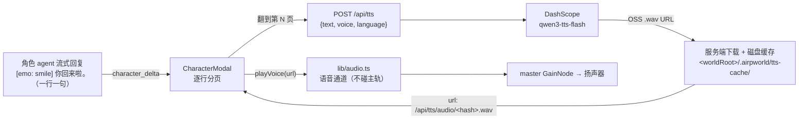

# docs/tts/00 共同上下文（冻结契约）

2026-09-13 音量补充：TTS 经独立 voice GainNode 再接 master；Settings 的 TTS 人声滑杆仅改变该总线，BGM / 主题曲滑杆不改变人声。默认音量 1 保持原混音，两项独立保存在浏览器；总静音和 TTS 启用开关语义不变。调音量不发合成请求，不重播当前句子。

> **本文是 T1「角色语音（TTS）」全批次共享地基。所有子文档 MUST 遵守，MUST NOT 自行改动本文冻结的形状。**
> 冻结日期：2026-09-13。与 `docs/audio/00-共同上下文.md`（A1 音频接线）、`docs/tools/00-共同上下文.md`（B1 工具面）、`docs/nook/00-共同上下文.md`（N1 小天地）同款体例。
> 母文档：本文件；子文档 `01`–`06` 各管一个模块。**冲突时以本文为准**，子文档发现问题写进自己那篇的「发现的冲突」一节，**不回改本文件**；由主 agent 裁决后统一修订 + 广播。
> 上游 API 参考（**不是本文，是厂商文档**）：`docs/tts/qwen3-tts-flash.md`（用户 2026-09-13 提供，DashScope `qwen3-tts-flash-2025-11-27` 调用指南）。

---

## 0. 权威层级（冲突时按此顺序裁决）

高 → 低：

1. **本文冻结的形状**（端点、请求/响应体、字段名、解析链、前端 surface、页语义、env 名）；
2. `docs/audio/00-共同上下文.md` —— 音频引擎既有契约（`playClip` / `loadSample` / `SAMPLE_LEVELS` / 主轨语义 / 反穿越先例）；
3. `docs/wiring/00-共同上下文.md` §6 —— HTTP 请求体冻结表（本批**新增一行**）；§3/§4 —— 角色身份与去重；
4. `docs/tools/12-工具注册与路由统一.md §6.2` —— WS 帧名清单唯一真相源（**本批不增删帧名**，见 §10.1）；
5. `docs/prompts/02-角色提示词.md` + `extensions/instructions.ts:168-203` —— 角色输出格式（`[One sentence per line]` + 六标签）；
6. `docs/ui/doc-06-演出与交互设计.md §3`（遮罩的解剖，本批**实现并修订**它，见 §12）；
7. `AGENTS.md §1.1`（语言分层）、§6.3（文档随代码走）、§6.5（build 红线）；
8. 本仓模板内容：`templates/<world>/characters/<id>/README.md`、`templates/<world>/world.json`。

**本文件对 `doc-06 §3` 的修订（§12）在裁决时优先于原文。** 本文**不改动** `docs/audio/00` 的任何冻结形状，只在其 surface 上**新增**一个正交通道（§5）。

---

## 1. 一句话架构

**TTS 只服务角色直聊——把角色 agent 已经产出的「一句一行」文本，逐页朗读。** 服务端新增 `POST /api/tts` 做**唯一合成点**（调 DashScope → 下载 OSS 音频 → 磁盘缓存 → 返回本地 URL），前端遮罩把角色的流式回复**按行分页**（一页 = 一行），**翻到哪一页就播哪一页的配音**；页翻到尽头才放玩家输入框。



**三条地基（MUST NOT 破）**：

1. **TTS 是演出，不是状态**——不落 `events` 表、不落账、不进任何 agent 的 chat history、不进注入块。mock 引导语尤其**绝不进角色上下文**（§7）。
2. **服务端是唯一合成点**——前端只收 URL，永不持有 API key、永不拼 DashScope 请求（沿用 `docs/audio/00 §4.1` 的解析律）。
3. **角色文本的「行」就是演出单位**——这一语义**已经冻结在角色提示词里**（`extensions/instructions.ts:178`），本批不是新发明，只是把已有的行结构从「拼回整段」改成「逐行翻页」。

---

## 2. 端点与路径契约（冻结）

### 2.1 合成端点 `POST /api/tts`

| 项 | 值 |
|---|---|
| 方法/路径 | `POST /api/tts` |
| 请求体 | `{ text: string, voice?: string, language?: string }` |
| 成功响应 | `{ ok: true, url: string, cached: boolean, characters: number, truncated: boolean }` |
| 失败响应 | `{ ok: false, code: string, error: string }`（沿用 `ActionError.toHttp()` 形状，`routes/world.ts:56-74`） |
| 落账 | **不落**（无 `events` 行、无 WS 帧） |
| 鉴权 | 无（同仓其它 `/api/*`） |

**字段语义**：

- `text` **必填**，角色一页的台词（**已去 `[emo: tag]` 标签**，见 §6.1）。空串 → 400 `invalid_argument`。
- `voice` 可选，DashScope 音色 ID（裸名，如 `Cherry`）。缺省 → 服务端默认（§4.3）。
- `language` 可选，**世界 locale 的短码**（`en` / `ja`），**不是** DashScope 的 `language_type`——映射在服务端（§4.4）。缺省 → `Auto`。

**为什么是 POST 而非 GET**：`text` 可达数百字符，塞进 query 会撞 URL 长度且被日志全文记录。POST 是既有惯例里唯一合适的（`/api/dice`、`/api/god-action` 皆 POST）。

> **请求体冻结落地**：`docs/wiring/00 §6` 的冻结表 MUST 新增一行 `POST /api/tts | { text: string, voice?: string, language?: string }`，并由 `tools/check-request-bodies.mjs` 的 `BODIES` 数组加一条断言（§11）。

### 2.2 音频获取端点 `GET /api/tts/audio/<file>`

| 项 | 值 |
|---|---|
| 方法/路径 | `GET /api/tts/audio/:file` |
| 成功 | `res.sendFile`，`Cache-Control: public, max-age=31536000, immutable`（TTS 音频**按内容寻址**，不可变） |
| 失败 | 404 `{ ok:false, code:'not_found', error }` |
| 反穿越 | **MUST** 与 `/api/audio` 同款双重校验（**符号锚**：`/api/audio` 路由里 `path.resolve` + `startsWith(root + path.sep)` + `realpathSync` 三重；实测 @HEAD `routes/world.ts:901-915`，**勿用行锚**——该文件正被并行批次改动）：先拒 `rel.split('/').includes('..')`，再 `path.resolve` + `startsWith` 前缀检查，最后 `realpathSync` 校验符号链接。拒绝 `..`、绝对路径、符号链接逃逸 |
| `:file` 形状 | `^[a-f0-9]{20}\.wav$`（§3.2 的 hash）。**不匹配 → 403**（不做字符白名单外的任何解析） |

**为什么单开一条路由而不是复用 `/api/audio`**：`/api/audio` 的根是 `<REPO_ROOT>/assets/audio/`（平台池），TTS 缓存根是 `<worldRoot>/.airpworld/tts-cache/`（**随世界走**，见 §3.2）。两个不同的根、两套反穿越上下文，混用会把世界数据塞进平台池的地基。

### 2.3 缓存位置（冻结）

```text
<worldRoot>/.airpworld/tts-cache/<hash>.wav
```

- `worldRoot` = `LocalStore.worldRoot`（`packages/shared/src/store/local-store.ts:56`），与 `.airpworld/sessions/`（`launch.ts:33-37`）同级——**TTS 音频随世界目录走**，世界打包/迁移时语音一并带走，与「世界会话随世界走」的既有决定一致。
- **不进 git —— 这需要本批补一条 `.gitignore` 规则（实测：`.airpworld/` 整体并未被忽略）**。
  - **实测（2026-09-13，主 agent）**：`.gitignore` 只忽略了 `.airpworld/*.db*` / `**/.airpworld/*.db*` / `**/.airpworld/prompt-presets/`（`.gitignore:7-8,25`）。`templates/holmes-world/.airpworld/` 的 `git status` 是 **`??`（未忽略、未跟踪）**——一旦有人 `git add` 就会把 session/缓存卷进仓库。
  - **本批 MUST 在 `.gitignore` 追加**（`worlds/` 已在 `.gitignore:12` 整树忽略，故只需管 `templates/**` 与仓库内其它世界）：
    ```
    **/.airpworld/tts-cache/
    ```
  - **MUST NOT** 用 `**/.airpworld/` 整树忽略——那会连 `.airpworld/prompt-presets/` 的忽略规则的**可读性**一起打乱，也会盖掉将来可能想追踪的 `.airpworld/` 内容。只忽略 `tts-cache/` 这一条新增产物。
  - 归子文档 `01`/`05` 落地（同一处，勿两边各改一次：由 `01` 改 `.gitignore`，`05` 只引用）。
- **不随模板分发**（模板里的 `templates/<world>/` 不含 `.airpworld/`）；首次播放靠联网合成，之后命中缓存。

---

## 3. 数据契约（冻结）

### 3.1 角色音色声明：`characters/<id>/README.md` frontmatter

```yaml
---
name: 七海
avatar: /api/asset?path=assets/characters/nanami.webp
voice: Cherry          # 新增：DashScope 音色 ID（裸名）；缺省 → 服务端默认
---
```

**冻结点**：

- `voice` 是 README frontmatter 的**顶层字段**，与 `avatar` / `name` 平级。**文件即真相**（`AGENTS.md §3.2`）：音色是角色的属性，随角色文件走。
- **不在 `world.json` 的 `characters[]` 里加 `voice`**——那会造出第二个真相源（README 与 world.json 都声明时谁赢？）。`world.json.characters[]` 只保留既有 `id/home/role/avatar/description`（`packages/shared/src/schemas/world.ts:17-23`，**本批不改该 schema**）。
- 值是**裸名**（DashScope 音色 ID），**不是** URL、不是路径。`assets/` 前缀或含 `/` 的值 = 契约违规 → 服务端 `console.warn` + 回落默认音色（fail-loud 落日志，沿用 `docs/audio/00 §3.1` 口径）。
- **可选**。缺省 → 服务端按 §4.3 默认。

### 3.2 缓存 key（冻结）

```text
hash = sha256(`${model}|${voice}|${language_type}|${text}` + (instructions ? `|delivery:${instructions}` : '')).slice(0, 20)   // 普通 Flash 保持旧键，Instruct 加有效语气指令
file = `${hash}.wav`
```

- 参与 hash 的四个字段**逐字**（含 `model` 与解析后的 `language_type`，不是请求里的短码）——保证「同音色同文本同模型」必命中、不同必不串。
- 长度 20 hex（80 bit）足以在单世界内无碰撞，且文件名短。

### 3.3 环境变量（冻结，**本批新增**）

| 变量 | 必填 | 默认 | 说明 |
|---|---|---|---|
| `DASHSCOPE_API_KEY` | **是**（否则 TTS 不可用） | — | DashScope **新加坡** Key（`docs/tts/qwen3-tts-flash.md §1.2`） |
| `AIRP_TTS_MODEL` | 否 | `qwen3-tts-flash-2025-11-27` | 模型名 |
| `AIRP_TTS_BASE_URL` | 否 | `https://dashscope-intl.aliyuncs.com/api/v1` | 端点基址（新加坡地域，`docs/tts/qwen3-tts-flash.md §1.1`） |
| `AIRP_TTS_TIMEOUT_MS` | 否 | `15000` | 单次合成（含下载）总超时 |
| `AIRP_TTS_DEFAULT_VOICE` | 否 | `Cherry` | §4.3 缺省音色 |

**env 加载（冻结，新增）**：`apps/server/src/index.ts` 启动时 MUST 在读取任何 `process.env.AIRP_*` **之前**执行一次 `.env` 加载：

```ts
try { process.loadEnvFile(path.join(REPO_ROOT, '.env')); } catch { /* no .env → use ambient env */ }
```

- Node 26 原生 `process.loadEnvFile`（**已实测存在**），**不引入 dotenv 依赖**。
- `.env` 已在 `.gitignore`（`.gitignore:8`），**MUST NOT 提交**；同批新增 `.env.example`（**进 git**，只列 key 名与占位符，无真值）。
- **`DASHSCOPE_API_KEY` 不进 `AIRP_ENV_PASSTHROUGH`**（`apps/server/src/engine/presets.ts:47-52`）——它只服务端用，**绝不注入 agent 子进程**（presets.ts 注释的「白名单而非 `...process.env`」纪律）。

---

## 4. 解析链契约（服务端唯一合成点）

### 4.1 职责

`apps/server/src/routes/tts.ts`（**新增**，模块级函数 + 一个 Router）：

| 函数 | 签名 | 职责 |
|---|---|---|
| `createTtsRouter(repoRoot, getActiveStore)` | `(string, () => LocalWorldStore \| null) => Router` | 组装 `POST /api/tts` + `GET /api/tts/audio/:file` |
| `synthesise(opts)` | `{text, voice, languageType, apiKey, baseUrl, model, timeoutMs} => Promise<Buffer>` | 调 DashScope → 取 `output.audio.url` → 下载 → 返回 wav 字节 |
| `hashOf(model, voice, languageType, text)` | `(…string[]) => string` | §3.2 的 20-hex key |

### 4.2 `POST /api/tts` 逐步（每步写「漏了会怎样」）

1. `getActiveStore()` → `null` → **400 `no_active_world`**。
   - 漏了 → 无世界时缓存根未知，写盘会落到随机 CWD。
2. 校验 `text`：`typeof === 'string'` 且 `trim() !== ''` → 否则 **400**。
   - 漏了 → 空文本合成出奇怪音频并污染缓存。
3. **截断**：`text.length > 500` → 取前 500 字符并置 `truncated: true`（DashScope 上限 512 token ≈ 600 字符）。
   - 漏了 → 超长请求被 DashScope 拒，整页无声。截断是「保住演出」而非「静默失败」：`truncated` 进响应体，前端可据此标记。
 4. 解析 `voice`：请求 `voice` → **调色板解析**（别名 → 商品名；裸 id → 自身；未知/畸形 → 回落 `AIRP_TTS_DEFAULT_VOICE` 并 warn）——**唯一解析点**，见 `07 §3`。形状体检 `VOICE_RE = /^[A-Za-z0-9][A-Za-z0-9 _-]*$/`（**已被 `07 §0` 修正：允许空格**，原 `/^[A-Za-z0-9_-]+$/` 会静默改掉合法音色 `Eldric Sage`）。
   - 漏了 → 畸形 voice 会让 DashScope 400，前端整页无声。
5. 解析 `language_type`（§4.4）。
6. `hash` → 若 `<cacheDir>/<hash>.wav` 已存在 → **直接返回** `{ url, cached: true }`，不联网。
   - 漏了（不查缓存）→ 每次翻页重复合成，延迟与成本飙升。
7. 否则 `synthesise(...)` → 写盘（**原子写**：先写 `.tmp` 再 `rename`，避免半截文件被后续请求当成缓存命中）。
   - 漏了原子写 → 并发/中断时缓存里是半截 wav，前端 `decodeAudioData` 失败且**永不重试**（`failCached`）。
8. 返回 `{ ok:true, url: '/api/tts/audio/<hash>.wav', cached:false, characters: <text.length>, truncated }`。

### 4.3 默认音色

`AIRP_TTS_DEFAULT_VOICE`，默认 `Cherry`（`docs/tts/qwen3-tts-flash.md §2.2` 列出的女声示例）。**性别不由语言推断**——音色是角色的属性，由 README 声明；默认值只是一个不崩的兜底。

> 完整可选音色清单与逐角色分配归子文档 `04`（**MUST 从真实厂商音色列表取，不得编造**）。

### 4.4 语言映射（冻结）

| 请求 `language` | DashScope `language_type` |
|---|---|
| `ja` | `Japanese` |
| `en` | `English` |
| 其他 / 缺省 | `Auto` |

- 映射**只在服务端**（前端只传世界 locale 短码，沿用 `world.json.locale`，`templates/firstsnow/world.json` 是 `ja`）。
- 漏了映射（直接透传短码）→ DashScope 收到 `ja` 非法枚举 → 400。
- **`Auto` 兜底**而非 `Chinese`：多语言混输场景 `Auto` 是官方默认（`docs/tts/qwen3-tts-flash.md §2.2`）。

### 4.5 未配置 Key 的行为（**不静默降级**，落到可断言处）

- **启动时**：`index.ts` 若发现 `DASHSCOPE_API_KEY` 缺失 → `console.warn('[AIRP TTS] DASHSCOPE_API_KEY not set; /api/tts returns 503 (character voice disabled).')`。**一次**，不是每请求。
- **运行时**：`POST /api/tts` → **503 `{ ok:false, code:'tts_unconfigured', error }`**。
- **前端**：静默无语音（文字演出不受影响），但 `console.warn` 一次（§8）。

---

## 5. 前端引擎 surface（冻结）

`apps/web/src/lib/audio.ts` **新增**（既有 surface 一个都不删、不改签名）：

```ts
/** Speak one voiced line: stop the previous line, play this URL once.
 *  Orthogonal to the three main tracks (ambient/bgm/theme) — never touches them. */
export function playVoice(url: string): void;

/** Stop the current voiced line (fade). Idempotent. */
export function stopVoice(): void;

/** Whether a voiced line is currently sounding (test/diagnostic). */
export function isVoicing(): boolean;
```

**冻结点**：

- `playVoice` **不 loop**、**不碰主轨**、**独占一条语音通道**——新调用打断旧调用（galgame 语义：翻页即换话）。
- 播放依赖既有 `loadSample(url)`（`audio.ts:532`；按 URL 缓存的 `decodeCache`）。**URL 必须是服务端给的 `/api/tts/audio/<hash>.wav`**——内容寻址，缓存天然正确。
- 音量档位：新增 `VOICE_SAMPLE_LEVEL`（人声是主内容，应当压过 ambient/bgm/foley；具体数值由子文档 `02` 定并给出依据）。
- **无 `AudioContext` / 未 `unlock` / 加载失败 → 静默 no-op**（与 `playStinger` 同款降级，`audio.ts:851-860`）。**无合成兜底**——引擎没有语音合成器，这是与 foley 的不对称，MUST 显式声明。
- **MUST NOT** 把 TTS 混进 `audioDebugState()` 的既有四字段（`ambient/bgm/theme/loaded`，`audio.ts:871-882`）——形状冻结。若测试需要，**另开** `voiceDebugState(): { url: string | null }`（由子文档 `02` 决定是否要）。

### 5.1 `useAudio` 绑定

**唯一路径（已裁决 §15.6）**：遮罩**直接** `import { playVoice, stopVoice } from '../../lib/audio.js'`（`CharacterModal.tsx:2` 已直接 import `playStinger`，同款）。**`apps/web/src/state/useAudio.ts` 零改动**——不转发、不暴露。原「`useAudio` 转发」方案作废。

---

## 6. 演出契约：角色台词分页（冻结）

> 本节**修订** `docs/ui/doc-06 §3.2` 的「逐字流式」一格：流式**保留**（页内仍逐字出字），但**演出单位从「整段」改为「一行 = 一页」**，并新增语音与点击推进。

### 6.1 页（page）的定义

**一页 = 角色本轮回复中的一个非空行**（去标签后）。

- 行的来源 = 角色提示词 `[One sentence per line]`（`extensions/instructions.ts:178-179`）——**引擎侧不改提示词**，分页纯前端。
- 空行（连续 `\n` 或纯空白行）**丢弃**，不产生页。
- 一页携带 `{ text: string, emo: Emotion }`；`emo` = 该页生效的表情（本行有 `[emo: tag]` 取本行，否则**继承上一页**）。
- **去标签**：页 `text` **不含** `[emo: tag]`（沿用现有 `parseEmoTag` 的剥离逻辑，`CharacterModal.tsx:65-79`；原 `parseEmoLines` 本批**删除更名**为 `parseEmoPages`，见 §15.8，实现后迁 `overlay/dialogue-pages.ts`）。

### 6.2 分页与流式的关系

- 流式期间，**每当缓冲里出现一个新的 `\n`**（即一行完成），该行**封口成页**，可翻。
- **最后一行**（未闭合）在 `character_message` 或 `character_idle` 到达时封口（`final = true`，沿用现有 `finalRef` 语义）。
- 未闭合的 `[emo` 前缀冻结**保留**（`EMO_PREFIX_GUARD = 24`，`CharacterModal.tsx:59,97-107`）——不能因为分页就丢掉这个保险阀。
- 漏了「随 `\n` 封页」→ 页永远只有 1 页，分页退化成整段，与需求不符。

**⚠️ 实测警告（2026-09-13，主 agent）：`[One sentence per line]` 是提示词层的软约束，尚未被任何真实模型输出证实。** 全仓 130 个 session 文件、156 条 assistant 文本块的扫描结果是 **0 条多行输出**——因为现存 session 全是探针产物（`provider: airp-wire-dump` / `airp-prompt-dump`，内容恒为 `"done"`），**没有一条真实模型的角色回复**（本机 `.pi/agent/models.json` 缺失，探针只跑确定性 provider）。

**因此分页实现 MUST 对「模型不听话」鲁棒**，不得假设输出必然分行：

1. **无换行 = 单页**：整轮回复没有 `\n` 时，**整段就是 1 页**（不报错、不空白）。这是最常见的退化形态，必须有断言覆盖。
2. **超长单行必须仍能演出**：单行长度远超一屏时，分页**不能**把内容截断——页文本原样保留，由 CSS 换行/滚动承担。**实测（2026-09-13，主 agent，纠正本节初稿的假断言）**：`index.css:503-509` 的 `.line-stage` 是 **`min-height: 3.2em`（下限，可被内容撑高）**，**不是固定高**——初稿写「固定高 3.2em」是错的，照抄会与「不得截断」自相矛盾。长行会自然换行并撑高纸面，最终可能顶出视口，故 `03` MUST 追加 `max-height` + `overflow-y: auto`（`03 §8.2`）——**这是新增约束，不是既有行为**。
3. **不做「自动按句号切页」的兜底**：提示词已经定义了单位，前端再按标点猜会与模型意图打架，且中英日标点规则不同（`charDelay` 已区分全半角，`CharacterModal.tsx:115-116`）。**分页单位只有 `\n` 一个真相源**。
4. **`voice` 的 TTS 请求按「页文本」发**：单页很长时由服务端 §4.2 步骤 3 的截断处理，前端不预切。

**为什么写死这条**：这是本批最大的「文档断言未被实测证实」风险点。若把「一句一行」当成已证事实来设计（例如假设页数 ≥ 2、假设每页都很短），真实模型一旦输出整段就会**静默退化成单页或渲染异常**——正是 `docs/tts/00` 要防的那类失败。

> **维护者提醒（`03` 冲突 4）**：遮罩会同时持有 `locale`（UI 文案，初值 = 浏览器语言猜测，`App.tsx:39-41`）与 `language`（TTS，初值 = `'en'`）两个 prop。**二者 MUST NOT 被合并**：在四个无 `world.json.locale` 的世界下，日文浏览器会得到 `locale='ja'` 而 `language='en'`（UI 跟随浏览器、台词语言跟随内容），这**是有意为之**。

### 6.3 页内仍逐字（打字机）

- 页 `text` 在当前页内**逐字显示**（沿用既有 `charDelay`：45ms/字、逗号 300ms、句末 150ms，`CharacterModal.tsx:113-118`；实现后随 `03 §15.8` 迁 `overlay/dialogue-pages.ts`）。
- **漏了** → 一页整块蹦出，失去角色节奏（`doc-06 §3.2` 明写「节奏 = 角色性格的主秀场」）。

### 6.4 点击推进（galgame 标准语义）

点击「纸面」（对话区域）时：

1. 若当前页**尚未逐字出完** → **快进**本页到完整（不翻页）。
2. 若当前页**已完整** → **进入下一页**（+1）。
3. 已是最后一页且完整 → **不推进**（等待玩家输入）。

- 漏了(1) → 急性子玩家必须等每一句打完，手感差。
- 漏了(3) → 越界索引，页数组读 `undefined`。
- **必须有可断言的边界**：`pageIndex ∈ [0, pages.length - 1]`。

### 6.5 语音触发

- **一页成为「当前页」时 → 播该页语音**（§5 的 `playVoice`）。
- 页切换（翻页）→ 先 `stopVoice()`（打断上一句）再播新的。
- **TTS 就绪策略**：页**封口时**即发起 `POST /api/tts` 预取（并发），翻到时若已就绪直接播，未就绪则就绪后播（若已翻走则只预热、不播）。
  - 漏了预取 → 每次翻页等 1–3 秒才出声，节奏断裂。
- **与 `playStinger` 的关系（冻结）**：**有语音的页不再播 stinger**（人声 + 音效叠加会打架）；**无语音时**（TTS 未配置 / 失败 / 该页无 voice）保留 stinger 作为情绪提示。判定点的**可观测等价形（已裁决 §15.15）**：`page.voiceState === 'ready'`（引擎无法观测「是否真的出声」，故以「拿到了非空 url 且已发出 playVoice」为代理）。
  - 漏了这条 → 「叮」一声情绪音压在角色台词开头，像故障。

### 6.6 输入框时机（冻结）

- 玩家输入框**仅在**「所有页已翻完（`pageIndex === 最后一页` 且该页已完整）且 `phase` 已终结」时**启用**。
- 演出期间（thinking / 出字 / 还有下一页）输入框 **disabled**（沿用既有 `busy` 语义，`CharacterModal.tsx:398,462`）。
- 玩家发送后：清空页队列与 `pageIndex`，进入 `thinking`，等下一轮真实帧。
  - 漏了清空 → 新回复的页接在旧页后面，玩家要翻过上一轮才能看到新的。

### 6.7 一轮与下一轮的边界

- 新 turn 开始（`handleSend`）→ 页队列清空、`pageIndex = 0`、`atEnd = false`。
- `character_delta` 首帧 → 若页队列仍空，进入「首帧」状态（§7 的 mock 页在此退场）。

---

## 7. mock 引导语（冻结）

### 7.1 语义

**角色 agent 冷启动（spawn + 首 token）有可见延迟**（`lifecycle.startCharacter` → `RpcClient.start()`，`lifecycle.ts:94-111`）。首次打开某角色的遮罩时，用**一句本地写死的引导语**填补这段空白，让玩家立刻看到「她在看你」而不是空纸。

- 内容（冻结，en/ja 两版，与 `locale` 对齐）：

```ts
const GREETING_LINE: Record<'en' | 'ja', { text: string; emo: Emotion }> = {
  en: { text: 'Something on your mind?', emo: 'normal' },
  ja: { text: 'どうしたの？', emo: 'normal' },
};
```

### 7.2 三条硬约束

1. **绝不进角色上下文**：引导语 **MUST NOT** 作为 `character_prompt` 发给 agent，**MUST NOT** 出现在任何 WS 帧的载荷里。它**只存在于前端组件内存**，是本地常量。
   - 漏了 → 角色记忆里凭空多出一句自己没说过的话，污染连续性（角色 compaction 会把它当真事记）。
2. **仅首次**：用 `localStorage` 记住「这个世界、角色、内容语言已打过招呼」，key = `airp:greeted:v2:<worldId>:<charId>:<contentLanguage>`。
   - 漏了（每次打开都显示）→ 反复打开都说同一句「怎么了？」，机械且出戏。
3. **真实首帧到达即退场**：一旦收到属于本轮的 `character_delta`/`character_message`，mock 页**立即被真实页取代**（不是插在真实页前面）。
   - 漏了 → 玩家看到「怎么了？」+ 角色真台词，像两个人说话。

### 7.3 与 TTS 的关系

- mock 页**也朗读**（它是给玩家听的开场，不是静默占位）——用角色自己的 `voice` + 世界 `language`。若不朗读，玩家会以为「第一句没声、后面才有」。
- mock 页**不触发** stinger（§6.5 的判定同样适用：有无语音决定）。

### 7.4 待拍板（登记，不阻塞）

- 是否所有角色共用同一句引导语，还是按角色 README 可覆盖（如 frontmatter `greeting:`）。**本批取共用固定句**；按角色覆盖登记为后续。

---

## 8. 降级与错误矩阵（冻结，供 `06` 断言）

| 情形 | 服务端 | 前端 |
|---|---|---|
| 无 `DASHSCOPE_API_KEY` | 启动 warn 一次；`POST /api/tts` → 503 `tts_unconfigured` | 静默无语音；文字照常；`console.warn` 一次 |
| DashScope 4xx/5xx | 502 `tts_upstream` | 该页无语音；保留 stinger（§6.5） |
| 合成超时 | 504 `tts_timeout` | 同上 |
| OSS 下载失败 | 502 `tts_upstream` | 同上 |
| `text` 空 | 400 `invalid_argument` | 不该发生（页非空才有意义） |
| 无活跃世界 | 400 `no_active_world` | 不该发生（遮罩只在世界内） |
| `:file` 形状非法 / 逃逸 | 403 | 不该发生 |
| 缓存文件缺失（被清） | 404 | `decodeAudioData` 失败 → 静默 no-op |
| 音频 decode 失败 | — | 静默 no-op（`failCached`，不重试） |

- **不允许**：把失败伪装成「有一句没声音」之外的任何东西；**不允许**在合成失败时伪造音频。

---

## 9. 反模式（本批 MUST NOT）

1. **不许在前端拼 DashScope 请求或持有 API key**——key 只在服务端 env（§5 / §4.1）。
2. **不许新增 WS 帧**——TTS 是 HTTP 请求/响应，不走帧通道（`docs/tools/12 §6.2` 不动）。
3. **不许把 mock 引导语发给 agent 或写进任何事件**——§7.2 第 1 条。
4. **不许在 `world.json.characters[]` 里加 `voice`**——第二个真相源（§3.1）。
5. **不许删既有逐字流式的韵律表**（`charDelay`）——页内仍要用（§6.3）。
6. **不许让 TTS 触碰主轨**（`setAmbient`/`setBGM`/`setTheme`）——语音是正交通道（§5）。
7. **不许 `console.warn` 当「失败可见」的唯一手段**——服务端未配置 Key 的 503 与 `code` 进响应体（§4.5）。
8. **不许把 TTS 音频写进 `<REPO_ROOT>/assets/audio/`**——它是每世界私有产物，缓存根是 `.airpworld/tts-cache/`（§2.3）。
9. **不许提交 `.env`**——只提交 `.env.example`（§3.3）。
10. **不许在手搓产物里改 `CharacterModal` 的页语义而不改本文**——文档随代码走（`AGENTS.md §6.3`）。

---

## 10. 与既有系统的边界（冻结）

### 10.1 WS 帧（不动）

本批**不增删任何 WS 帧名**。`character_delta` / `character_message` / `character_idle` / `character_start` / `character_stop` / `character_prompt` 全部沿用 `docs/tools/12 §6.2`。TTS 完全在 HTTP 面（`/api/tts`）+ 前端内存里发生。`pnpm check:ws` **不需因此变色**。

### 10.2 注入面（不碰）

`extensions/context.ts`、注入块、视点链路**零改动**。TTS 不进 agent 可见面。

### 10.3 事件表（不碰）

不新增 `events` 行、不新增 `type`（封闭十五类，`docs/protocols/doc-21`）。

### 10.4 音频主轨（不碰）

`setAmbient`/`setBGM`/`setTheme`/`playFoley`/`playStinger` 的签名与语义**一个都不改**（`docs/audio/00 §5` 冻结）。本批只在同文件**新增**语音三函数（§5）。

### 10.5 分页 vs 小天地（N1）

N1 批次动的是「角色小天地」取数（`/api/nook`）；本批动的是「直聊遮罩」。两者唯一可能重叠处是 `RightSidebar` 的角色行按钮（N1 加第 4 个按钮）——**本批不动 `RightSidebar`**。若并行发生，按文件归属：`RightSidebar.tsx` 归 N1，本批不碰。

---

## 11. 机械核验（本批自带门禁）

| 门禁 | 本批影响 |
|---|---|
| `pnpm check:bodies` | `tools/check-request-bodies.mjs` 的 `BODIES` 加 `POST /api/tts` 一条（file = `apps/web/src/components/overlay/CharacterModal.tsx`，keys = `['text','voice','language']`）；`docs/wiring/00 §6` 同步加行 |
| `pnpm check:ws` | **不变色**（§10.1） |
| `pnpm check:skills` | **已回写（`08`，2026-09-13）**：平台级由 2 份增至 3 份（新增 `voice-casting`），A0 改为期望清单逐字比对、A7 改为按 skill 分触发词表 |
| `pnpm build` | `packages/shared` 本批**无 schema 改动**（§3.1）→ 但若子文档发现必须改，则 build 红线照常（`AGENTS.md §6.5`） |

**⚠️ 门禁实现约束（实测 `tools/check-request-bodies.mjs:82-104`，冻结）**：

- **`fetch('/api/tts', …)` 的 `'` 引号内 route 字面量与 `fetch(` 必须在同一行**——`bodyKeysFor` 逐行扫 `lines[i].includes('fetch(') && lines[i].includes(route)`（`:83`）。跨行写 `fetch(\n  '/api/tts',` **门禁看不见**（报 `missing-call`）。
- **`JSON.stringify({...})` 必须是内联对象字面量**，不能是变量（`:94` 正则 `JSON\.stringify\(\s*\{([\s\S]*?)\}\s*\)` 要求紧跟 `{`）。写 `const body = {text, voice, language}; fetch(..., JSON.stringify(body))` **门禁看不见**。
- 因此 `03` 在遮罩里的 TTS 调用**唯一可写法**是：

```ts
const res = await fetch('/api/tts', {
  method: 'POST',
  headers: { 'Content-Type': 'application/json' },
  body: JSON.stringify({ text, voice, language }),
});
```

（`JSON.stringify` 与 `fetch(` 供门禁扫描；`route` 与 `fetch(` 同行由第一行满足。对象字面量内 `text`/`voice`/`language` 三个键名 MUST 逐字，顺序无关——门禁排序比较。）

**⚠️ 首句无声风险（实测，冻结裁定）**：`apps/web/src/lib/audio.ts` 的 `unlockOnFirstInteraction()`（`:926-934`）**全仓零调用点**（死代码）；`unlock()` 的真实调用点只有 `Canvas.tsx:191`（画布 pointerdown）与 `DiceRoller.tsx:219,265`。而打开角色遮罩的点击在 **`RightSidebar`**（`App.tsx:585` `onChatWithCharacter` → `openCharacterModal`），**不经 Canvas**——所以「点开遮罩」这个手势**不会**解锁音频。

**裁定**：`03` MUST 在遮罩内补一次手势解锁——`openCharacterModal` 调用链上或遮罩首个 `pointerdown` 里 `void unlock()`。否则 mock 引导语（§7）与第一个真实页都可能因 `ctx.state !== 'running'` 被 `playVoice` drop（§5 冻结的 drop 语义）而**静默无声**，且玩家没有第二次机会（他已经点进来了）。`02` 的「drop, don't queue」**保持不变**——修法在遮罩侧补解锁，不是改引擎语义。

**新增测试**（由 `06` 落地）：

```text
apps/server/test/tts-routes.test.mjs    NEW —— /api/tts（缓存命中/截断/语言映射/未配置 503/反穿越）+ /api/tts/audio
apps/web/test/voice-engine.test.mjs     NEW —— playVoice/stopVoice 的请求态（无 ctx 下可断言，仿 audio-engine.test.mjs:8-19）
```

---

## 12. 对既有文档的修订（本批裁定，优先于原文）

| 文档 | 原说法 | 本批改为 | 依据 |
|---|---|---|---|
| `docs/ui/doc-06 §3.2` | 「逐字流式」（整段） | 页内逐字 + **一行 = 一页 + 点击推进 + 页触发语音** | 用户 2026-09-13 需求（galgame 形态） |
| `docs/ui/doc-06 §3.2` | 「玩家输入：对话框底部一行输入」（常驻） | **仅页翻尽后启用** | 同上 |
| `docs/gameplay/doc-19 §2.3` | 「`[emo:]` 触发瞬时 stinger」 | **有语音时不播 stinger**（§6.5） | 人声与音效叠加冲突 |
| `docs/development/doc-07` / `doc-24` | TTS「P2 / 世界骨架后再评估」 | **本批落地**（需求已触发） | 用户 2026-09-13 决定 |
| `docs/ui/doc-06 §3.2` | 「全脸眨眼/口型：先舍」 | **保持舍弃**（本批不做口型同步） | 范围控制；口型登记为后续 |

> 回写由子文档 `06` 执行；**每处修订 MUST 与代码同 commit**（`AGENTS.md §6.3`）。

---

## 13. 现状实测（带 `file:line`，2026-09-13 复核）

> 行号有保质期；漂移时以符号名重定位并更新本节。
>
> **回写归属（评审 I3 裁定，消除 owner 悬空）**：本节锚点的回写**由实现阶段的主 agent 在代码落地时执行**（不是 `06` 的文档回写，也不是 `03`）——因为只有落地时才知道 `dialogue-pages.ts` 的真实行号。`06` 的 R7 只负责「登记此漂移」，不负责改本节。**实现完成后本节 MUST 逐个符号重定位**（`parseEmoLines`→`dialogue-pages.ts`、`/characters`/`/audio` 行锚、`App.tsx` 遮罩挂载行）。

| 断言 | 证据 |
|---|---|
| 引擎侧**无** TTS 能力 | `vendor/pi-rp/packages/coding-agent/docs/` 30+ 篇，grep `tts/voice/speech/audio` 零命中 |
| 角色输出**格式要求**是一句一行且带 `[emo: tag]`（**这是提示词正文的约束，非实测的模型行为**——见 §6.2 的实测警告） | `extensions/instructions.ts:178-186`（`[One sentence per line]` + 六标签） |
| 遮罩**无分页**，整段单游标逐字 | `CharacterModal.tsx:141-142`（`lineRef`/`shownRef`）、`:196-221`（`pump`） |
| 已有 `parseEmoTag`/`charDelay` 可复用；`parseEmoLines` 本批**删除更名**为 `parseEmoPages`（§15.8） | `CharacterModal.tsx:65-118`（原址）；实现后迁 `overlay/dialogue-pages.ts` |
| 音频引擎**只有短音档位** | `audio.ts:479-481`（`SAMPLE_LEVELS`/`FOLEY_SAMPLE_LEVEL`/`STINGER_SAMPLE_LEVEL`） |
| 播放原语 `playClip`/`loadSample` 可复用 | `audio.ts:532`（`loadSample`）、`:564`（`playClip`） |
| `playStinger` 的降级范式（drop/no-op） | `audio.ts:851-860` |
| `audioDebugState` 四字段形状 | `audio.ts:871-882` |
| 服务端**无 dotenv** | `apps/server/src/index.ts:216`（仅裸 `process.env.PORT`） |
| Node 原生 `loadEnvFile` 可用 | 实测 `typeof process.loadEnvFile === 'function'`（Node v26.8.1） |
| 反穿越先例（**符号锚，非行锚**） | `/api/audio` 路由的 `path.resolve` + `startsWith` + `realpathSync` 三连（实测 @HEAD `world.ts:901-915`；工作树已被并行批次漂移——**落地时按符号重定位**） |
| `/api/characters` 读 README frontmatter 的 `avatar` | `world.ts:546-548` |
| `WorldManifestSchema` 有 `.passthrough()` | `packages/shared/src/schemas/world.ts:49` |
| `CharacterConfigSchema` 四字段 | `packages/shared/src/schemas/world.ts:17-23` |
| 世界 locale 在 `world.json` | `templates/firstsnow/world.json`（`"locale":"ja"`） |
| 角色遮罩 props 由 App 下推 | `App.tsx:597-612` |
| 角色帧路由（按 `activeModalCharId`） | `App.tsx:161-178` |
| `character_prompt` 发送点 | `App.tsx:605-611` / `index.ts:142-159` |
| 角色 agent 冷启动延迟源 | `lifecycle.ts:94-111`（`startCharacter`） |
| env 白名单（key 不进 agent） | `apps/server/src/engine/presets.ts:47-52` |
| 缓存目录先例 `.airpworld/sessions/` | `apps/server/src/engine/launch.ts:33-37` |
| `.env` 已 gitignore（**但 `.airpworld/` 整体没有**） | `.gitignore:8`（env）；`.gitignore:7-8,25` 只忽略 `*.db*` / `prompt-presets/`；`templates/holmes-world/.airpworld/` 实测 `??` |
| `LocalWorldStore.worldRoot` 是 `public`（01/02 可直接读） | `packages/shared/src/store/local-store.ts:90,98` |
| `WorldManifestSchema` **未声明 `locale`** | `packages/shared/src/schemas/world.ts:25-49`（有 `.passthrough()`，运行时保留、类型取不到；本批不让服务端读 locale，`language` 由前端传） |
| `getManifest()` 从 `world.json` 读 + 目录扫描补 layers | `packages/shared/src/store/local-store.ts:320-326` |
| Node 原生 `fetch` 可用（服务端下载 OSS 用） | 实测 `typeof fetch === 'function'`（Node v26.8.1） |
| 浏览器 `decodeAudioData` 能直接解 24kHz mono PCM wav（**无需服务端转码**） | 本机 headless Chromium 实测：喂 24kHz s16le wav → `{ok:true, duration:0.4, sampleRate:44100, channels:1}` |
| 原子写（`.tmp` + `rename`）+ 20-hex hash 形状实测通过 | 本机 node 实测：写 tmp→rename→存在且 tmp 不残留；`^[a-f0-9]{20}\.wav$` 命中 |
| 请求体门禁的 `BODIES` 形状 | `tools/check-request-bodies.mjs:31-39` |
| 前端引擎测试体例（jiti 直导 TS） | `apps/web/test/audio-engine.test.mjs:8-19` |
| DashScope 端点/参数/响应形状 | `docs/tts/qwen3-tts-flash.md §1–§3` |
| headless Chromium 有 `speechSynthesis` API 但 0 语音 | 本机实测（headless 不装语音包；**本批不用浏览器原生 TTS**） |

---

## 14. 子文档分工（本批 6 篇 + 2026-09-13 增补 2 篇）

| 编号 | 模块 | owner 边界 |
|---|---|---|
| `01` | 服务端 TTS 路由与合成 | `/api/tts`、`/api/tts/audio`、`synthesise`、`hashOf`、env 加载、`.env.example` |
| `02` | 前端音频引擎语音通道 | `lib/audio.ts` 的 `playVoice`/`stopVoice`/`isVoicing`、`useAudio` 绑定 |
| `03` | 遮罩分页与演出 | `CharacterModal.tsx` 的页状态机、点击推进、语音触发、输入框时机、mock 引导语 |
| `04` | 内容：音色分配与世界声明 | 角色 README `voice`、音色清单、模板落地 |
| `05` | 前端接线与请求体 | `docs/wiring/00 §6` 加行、`check-request-bodies.mjs` 加断言、App 传 `worldId`/`language` |
| `06` | 验证与文档回写 | 两个新测试文件、§12 的回写、验收清单 |
| `07` | 音色别名映射（2026-09-13 增补） | 调色板 `packages/shared/src/rules/voices.ts`、`resolveVoice` 解析链、`check-voices.mjs`、9 角色别名分配 |
| `08` | 音色技能与门禁（2026-09-13 增补） | 平台级 skill `skills/voice-casting/`、`check-skills.mjs` 的 A0/A7、`check-voices.mjs` 的 V5 |

**每篇 MUST 遵守本文冻结形状；发现问题写进自己那篇的「发现的冲突」，不回改本文。**

---

## 15. 主 agent 裁決（子文档「发现的冲突」逐条回应）

> 子文档提出、需主 agent 拍板的事项在此一次性裁决。**裁决即契约**，子文档据以定稿。

### 15.1 voice 正则：**【已被 `07` 推翻并取代】`Eldric Sage` 是一个合法音色**

> **本裁决原判为「`Eldric Sage` 是两个 ID 被拼接，正则 MUST 保持 `/^[A-Za-z0-9_-]+$/`」。该判断为假，2026-09-13 拿到真 key 后实测推翻。** 现行口径以 **`07-音色别名映射.md`** 为准，本节保留结论性记录，不再有效。

- **实测证伪原前提**：`Eldric` 与 `Sage` **各自**返回 `InvalidParameter: voice does not exist or is not licensed`；**`Eldric Sage`（连空格）正常出声**。官方音色表里它是一个音色（音色名「沧明子」）。原判断源于**web 检索到的二手描述**，未经出声验证，且把「一个带空格的名字」误读成「两个名字拼接」。
- **连带 bug（已修）**：因正则不收空格，正确写法 `Eldric Sage` 会被**静默替换成默认音色**——比 400 更隐蔽。
- **现行裁决**：`VOICE_RE` 放宽为 `/^[A-Za-z0-9][A-Za-z0-9 _-]*$/`（**只做结构性体检**），**决定权交给调色板 `resolveVoice`**（`packages/shared/src/rules/voices.ts`）。世界内容改**按效果命名**（`voice: wise-elder`），商品名由服务端唯一解析点翻译（`07 §2/§3`）。`04 §3.1` 的「含空格的 id 即非法」与「`Eldric Sage` 是拼接」两处措辞一并作废。
- **降级保留**：原文「未逐条核验的音色 MUST 先实测出声再定稿」是**正确**的纪律，升格为 `07 §5` 的强制流程（本批已对全 palette 逐条实测）。

### 15.2 音色清单的信任等级：**降级为「候选」，落地前必须实测出声（04 冲突 5）**

- **（已被 `07 §5` 取代）** 04 §3.1 的清单原标为「候选，未逐条核验」。**2026-09-13 已对全 palette 逐条实测出声**，结果记于 `07 §5`（含 `Eldric`/`Sage` 两个 FAIL）。**现行纪律**：没有实测出声的音色 MUST NOT 进调色板；`check:voices` 是机械门禁。
- **（已被 `07 §2` 取代）** 原「安全集合」措辞作废——世界内容现在写**效果别名**，不写商品名。已核验可用集合见 `07 §5`。

### 15.3 `old-sailor` 新建 README：**接受，但正文必须是中性最小集（04 冲突 2）**

- 事实核实：`templates/cthulhu/characters/old-sailor/` 实测只有 `preset.json`（无 README）。
- **裁决**：接受新建 `README.md` 以承载 `voice`（`00 §3.1` 是唯一声明点，不改）。**正文 MUST 逐字用 `preset.json` 已有的 `description`**（04 §7.9 已如此），MUST NOT 引入新 persona 信息——把 persona 增量压到零。

### 15.4 四个世界补 `locale:"en"`：**推荐但不阻塞本批（04 冲突 3）**

- 事实核实（实测 `jq`）：`firstsnow`=`ja`、`whitechapel`=`en`，其余四个 `world.json` **无 `locale`**。
- **裁决**：本批**不改** `world.json`（那是模板内容变更，牵动 UI 语言 `App.tsx:39`，超出 TTS 范围）。**改为在 `05`/`03` 侧兜底**：`language` 取值顺序 = `manifest.locale` → **世界内容语言的既有默认**。对缺 `locale` 的世界，**前端 SHOULD 传 `'en'`**（这四个世界内容皆英文）而非浏览器语言猜测——`App.tsx:39` 的浏览器语言猜测**不得**用于 TTS 的 `language`（日语浏览器会把英文台词念成日语）。
- 登记为后续：给四个世界补 `locale`。

### 15.5 `/api/characters` 透出 `voice`：**必须，归 01/05（04 冲突 4，已对齐）**

- **裁决**：`GET /api/characters` 的每个角色对象 MUST 新增 `voice?: string`（读 `characters/<id>/README.md` frontmatter 的 `voice`，与既有 `avatar` 同处读，`world.ts:545-550`）。缺省不下发（前端回落服务端默认）。
- 形状冻结：`{ id, home, role, avatar, bio, voice? }`。落点归 **01**（服务端路由），`05` 负责前端消费（`App.tsx` 的 characters state → 遮罩 prop）。

### 15.6 其余

- **04 冲突 5（同名 nanami）**：采纳「音色索引键 MUST 是 `worldId + charId`」，与本批 mock 引导语的 `localStorage` key（§7.2）同构。**登记，本批无独立实现**。
- **04 冲突 6（`.gitignore`）**：已在 §2.3 修正，归 `01` 落地。
- **02 冲突 1（useAudio 是否转发）**：**采纳 02 的直调方案**（§5.1 已授权二选一）。`useAudio.ts` 零改动。
- **02 冲突 2（mock 首页先于 unlock）**：已在 §11 裁定——**遮罩侧补 `unlock()`**，引擎 drop 语义不变。
- **02 冲突 3/4（无 limiter 削顶、decodeCache 无淘汰）**：**接受为既有债务，本批不修**，已登记 §14。02 的诚实标注（不伪装「绝对不削顶」）是正确做法。
- **02 冲突 5（voiceDebugState 条件式措辞）**：**采纳「要」**（测试可观测性必需）。

### 15.7 `hashOf` MUST 导出（06 待拍板 1）

- **采纳**：`apps/server/src/routes/tts.ts` 的 `hashOf` **MUST `export`**。理由：`06` 的 `tts-routes.test.mjs` 要断言缓存键公式，不导出就只能本地镜像公式（两份真相，必漂移）。契约 §4.1 的签名表即为导出面，MUST 在实现中体现。

### 15.8 `03` 纯函数搬家：**批准，但契约 §13 锚点必须同步**

- **采纳**：`parseEmoTag` / `charDelay` / `EMO_PREFIX_GUARD` / `GREETING_LINE` / `clampPageIndex` 移入新文件 `apps/web/src/components/overlay/dialogue-pages.ts`（纯函数、零 React），`parseEmoLines` **删除并更名** `parseEmoPages`（干净切换，不留别名）。理由：`06` 的 jiti 测试要直导纯函数，留在 `.tsx` 里拖 React 依赖。
- **连带义务**：契约本文 §6.1/§6.2 与 §13 里凡引用 `CharacterModal.tsx:65-111` / `:59,97-107` / `:113-118` 的锚点，**实现时 MUST 改为指向 `dialogue-pages.ts`**（按符号名重定位）。§13 的「行号有保质期」已预留此机制；`06` 负责回写。

### 15.9 `03` 冲突 1（`.line-stage` 是 `min-height` 非固定高）

- **采纳并在 §6.2 修正**（本文已改）。`03 §8.2` 的 `max-height: 9.6em; overflow-y: auto` 是**新增约束**，MUST 落地——否则长行顶出视口，玩家够不到输入框。

### 15.10 `03` 冲突 4（`locale` 与 `language` 不可合并）

- **采纳**：本文 §6.2 末已加维护者提醒。两个 prop **MUST NOT 合并**。

### 15.11 `03` 落点细节（采纳，不作契约级冻结）

- **点击目标 = `.line-stage`**（不是整张 `.speech-paper`）——防误触输入框。
- **空格推进、回车不推进**（回车保留给输入框发送），Esc 不变。
- **`busy` 扩展**为 `thinking || streaming || (pages.length > 0 && pageIndex < pages.length - 1)`——这是 §6.6「输入框仅页翻尽后启用」的机械落点，MUST 落地。
- **`012_` 页指示器 / `truncated` 视觉提示 / 点空白推进 / `STINGER_VOICE_GRACE_MS` 取值**：**本批不做**，登记为后续（`03 §12` 已登记）。`STINGER_VOICE_GRACE_MS = 1200` 保留为 `[推断]` 初值，真机可调。

### 15.12 `05` 冲突 3（「TTS 缓存隔离」不是前端职责）

- **采纳**：`worldId` 前端只服务 mock 引导语的 `localStorage` key。缓存隔离由服务端活跃世界（`getActiveStore().worldRoot`）天然完成，前端不参与。任务书里「TTS 缓存隔离」的措辞**以本裁决为准**。

### 15.13 `05` 冲突 4（`worldId === undefined` 的 mock 持久化）

- **采纳（评审 B3 修正）**：`worldId` 为 `undefined` 时，**仍显示 mock 引导语，但 MUST NOT 写 `localStorage`**（避免 `airp:greeted:undefined:nanami` 一类假持久化 key）。**`03` MUST 按此实现**（评审实测 `03 §2.2`/§6.1 写成 `airp:greeted:${worldId ?? ''}:${charId}` 会落 `airp:greeted::nanami`，属违规——`03` 定稿时改为「`worldId` 缺失则跳过读写」）。

### 15.14 `06` 待拍板的其余项

- **`test:tts` 脚本**：**不加**（本批用手工 `node --test`；`package.json` 保持干净）。若实现后确需一键回归，再议。
- **`voiceDebugState().url` 语义**：采纳 02 的「最近一次 `playVoice` 收到的 URL（verbatim）」，非「当前实际在播」。


### 15.15 stinger 判定点的可观测等价形（评审 V4，升格为契约）

- **采纳 `03 §5.4` 的拍板并升格**：引擎**无法**观测「是否真的出声」（`playVoice` 是 fire-and-forget，无回调）。故 §6.5 的判定点「该页是否真的发出了语音」**可观测等价形 = `page.voiceState === 'ready'`**（已拿到非空 `url` 并已调过 `playVoice`）。这是**等价形**而非改写——`ready` 即「发出了」的可测代理。§6.5 已同句标注。

### 15.16 测试文件归属唯一化（评审 V5）

- **采纳「并入 `voice-engine.test.mjs`」**：纯函数断言（`parseEmoPages`/`clampPageIndex`/`charDelay`）写入 **`apps/web/test/voice-engine.test.mjs`**（`06` 已给完整骨架）。**`03 §10.1` 声明的第三个文件 `dialogue-pages.test.mjs` 作废**——`03` 定稿时改为「断言由 `06` 的 P 组覆盖」。`00 §11` 只有两个新测试文件（已如此）。

### 15.17 mock 引导语的语言来源（评审维度 1）

- **裁定：问候是会被朗读的角色台词，取 `GREETING_LINE[contentLanguage]`**；contentLanguage 从世界 `language` prop 归一化为 en / ja，缺省 en。
- 问候、沉默台词、TTS 语言必须一致。按钮、aria 与输入框提示继续使用 UI locale，不能让日文界面把英文世界的开场变成日语。
- `GREETING_LINE` 的键集为 `{'en','ja'}`，超出回落 `'en'`。语言进入 v2 首次问候 key。

### 15.18 B1：mock 页的语音路径（评审 BLOCKER，契约级补齐）

- **裁定**：mock 页 MUST 与真实页**共用同一条语音路径**——mock seed 后 **MUST 为该页发起 `prefetchVoice(mockPage, 0)`**（`voiceState: 'idle' → 'pending' → 'ready'`），翻到/停在 mock 页时按 `ready` 播。
- **MUST NOT** 让 `mockRef` 把 mock 页整段排除在语音路径外（评审实测 `03 §5.3` 的 `!mockRef.current` 守卫会禁掉 mock 的 stinger 分支，而 `ready` 分支因 `voiceState==='idle'` 从未进入 → mock 永不发声，违反 §7.3）。
- **MUST NOT** 为 mock 单独发明第二套发声逻辑（会与真实页漂移）。唯一例外是 §7.4 的「按角色覆盖引导语」——本批不做。

### 15.19 B2：样式需求（用户第 3 条需求）—— 新增 §16

- 见 **§16**（新增章节）。这是用户明确需求（「现在像聊天框、丑，做成像 galgame」），本批 MUST 承接。

### 15.20 §13 未登记 `03` 纯函数搬家（评审 V11）

- §13 表格已随 §15.8 更新（`parseEmoLines` → `parseEmoPages`、锚指向 `dialogue-pages.ts`）。

---

## 16. 遮罩视觉重设计（用户第 3 条需求，本批 MUST 承接）

> **来源（用户原话，2026-09-13）**：「前端那边可以改，现在的样式确实是比较丑的，和聊天框没什么区别。反正就做成像 galgame 那样。」
> 这是本批**第 4 条硬需求**（评审 B2 认定前一版六篇零设计，为 BLOCKER）。

### 16.1 现状（实测，带行锚）

角色遮罩当前的结构与观感（`CharacterModal.tsx` + `index.css`）：

| 元素 | 现状 | 问题 |
|---|---|---|
| `.speech-paper`（纸面） | `index.css:441` 一张带纸纹的卡片 | 「纸」的语汇但与下方输入框堆成聊天窗 |
| `.line-stage`（台词区） | `index.css:503` `min-height: 3.2em` | 台词与输入框**同处一张纸**，视觉上像聊天记录 |
| `.speech-input`（输入框） | `index.css:548` 常驻底部一行 | **像聊天框的元凶**：输入框常驻、紧贴台词 |

### 16.2 目标形态（galgame 对话框）

**冻结的目标（评审后由 `03 §8` 落地）**：

1. **台词是主体，输入框是附庸**：输入框**默认隐藏**，仅 §6.6 条件满足时**淡入**（不再是常驻聊天框）；演出的绝大多数时间屏幕上只有纸面 + 台词。
2. **点击推进的视觉反馈**：纸面可点区域给出「继续」提示（如右下角闪烁的 `▼` 或纸边微光）——**本批 MUST 至少有一个非文字的可点击暗示**（无提示 = 玩家不知道能点）。`▼` 指示器由 15.11 从「不做」升为 **MUST 做**（是「像 galgame」的最小可辨识特征）。
3. **立绘与纸面的层级**：角色立绘（若有）在纸面**之上或之后**的明确层级，纸面底部对齐、不遮挡立绘主体（具体 CSS 由 `03` 定）。
4. **页的节奏感**：一页 = 一屏一屏地换（§6），而非滚动追加——这与「聊天记录」的根本区别。

### 16.3 归属与产出

- **归属**：`03 §8` 扩写（不单开文档——评审建议二选一，主 agent 定**并入 03**，理由是视觉与页状态机耦合：输入框显隐由 `busy`/页状态驱动，拆开会造成跨文档依赖）。
- **产出**：`03 §8` 定稿 MUST 含 ①目标形态的结构描述 ②需改的 `index.css` 类与具体属性（`.speech-paper`/`.line-stage`/`.speech-input` 及其新增类）③「默认隐藏输入框 + 条件淡入」的 CSS/JS 落点 ④`▼` 推进指示器的实现。
- **`06` 的手测清单** MUST 含一条「肉眼确认：不像聊天框、有推进暗示」（这是视觉需求，无法单测，只能手测——如实标注）。

### 16.4 边界（不做）

- **不做**：立绘微动、口型同步（§12 已裁定保持舍弃）、纸纹重绘、多主题皮肤。
- **不改**：遮罩的**功能布局**（纸面位置、尺寸占屏比例）——只改「聊天框感」相关的层级与显隐。

### 15.21 `01` 的工程默认（逐条裁决）

- **wav magic bytes 校验（01 待拍板 2）**：**采纳「校验」**——`synthesise` 下载后 MUST 断言前 4 字节 = `RIFF`（且第 8-12 字节 = `WAVE`），非 wav → 502 `tts_upstream`，**不写盘**。理由：§8 的降级矩阵要求「不允许在合成失败时伪造音频」；污染缓存的后果是**永久**的（内容寻址 + 前端 `failCached` 不重试），代价远大于 4 字节比较。
- **`characters` 口径（01 待拍板 6）**：**采纳「截断后长度」**（= 实际发给厂商的字符数，与厂商 `usage.characters` 同义）。
- **缓存失效 / LRU（01 待拍板 4）**：**采纳「不加」**。内容寻址永不过期；世界删除即缓存删除。登记为后续。
- **`.tmp-…` 残留清扫（01 待拍板 5）**：**采纳「不清理」**。`FILE_RE` 已天然拒绝 `.tmp-…`（§2.2），残留无功能危害。登记为后续。
- **`AIRP_TTS_TIMEOUT_MS` 单预算（01 待拍板 7）**：**采纳「单一总预算（含下载）」**。
- **baseUrl 尾斜杠归一化（01 待拍板 8）**：**采纳**（`.replace(/\/+$/, '')` 后拼 `/services/...`）。
- **TTS `code` 口径（01 待拍板 3）**：**采纳「TTS 自有字符串」**（`tts_unconfigured` / `tts_upstream` / `tts_timeout` 等），**不**并入通用 `ActionError` 枚举——它们是 TTS 特有的，前端按 `code` 分支即可。
- **截断与长页（01 冲突 5）**：**采纳 01 的提醒**——`03` 拿到 `truncated:true` 视为可接受降级，**MUST NOT** 重试（避免重试风暴）。契约 §8 已含此语义，此处点名。
