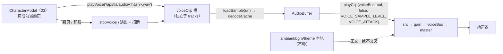

# docs/tts/02 前端引擎语音通道（`lib/audio.ts`）

> 母文档：`docs/tts/00-共同上下文.md`（**冻结契约，权威最高**）。冲突时以它为唯一裁决；本文只登记冲突，不回改契约。
> 上游：`docs/audio/00-共同上下文.md`（音频引擎既有契约）、`docs/tts/qwen3-tts-flash.md`（厂商 API）。
> owner 边界：**只动 `apps/web/src/lib/audio.ts`**（新增语音三函数 + 常量），以及「`useAudio` 是否要绑」这一个决策。**不改** `CharacterModal.tsx`（归 `03`）、**不改**服务端（归 `01`）、**不改** `audioDebugState` 形状。
> 冻结日期复核：2026-09-13。行号以 `audio.ts`（982 行）为准；漂移时以符号名重定位。
> **本文行号对应写作时的 HEAD；实现时若插入点已漂移，以「锚定符号 + 相对位置」为准（§11 已同时给出两者）。**

---

## 1. 一句话定位

**在 `lib/audio.ts` 增开一条与三条主轨正交的「语音通道」：一次只响一句 TTS 台词，新调用打断旧调用，无合成兜底，没有声音就静默。**

它只做三件事——`playVoice(url)` 播一句、`stopVoice()` 掐掉、`isVoicing()` 问在不在响——外加一个只读诊断 `voiceDebugState()`。音频从哪来（`/api/tts/audio/<hash>.wav`）由服务端决定（`01`），什么时候翻页、什么时候播由遮罩决定（`03`）；引擎在这里**是哑执行器**，不选音色、不拼 URL、不推断默认值、**不假设页的长度或页数**（沿用 `docs/audio/00 §3.1` 的引擎纪律 + 母文档 §6.2 的「⚠️ 实测警告」）。



---

## 2. 签名与参数（全部 `NEW`）

```ts
// apps/web/src/lib/audio.ts —— 本批新增，既有符号一个不删、不改签名
export function playVoice(url: string): void;
export function stopVoice(): void;
export function isVoicing(): boolean;
export function voiceDebugState(): { url: string | null };   // 见 §6.3
```

模块内新增（**私有，不导出**）：

```ts
const VOICE_SAMPLE_LEVEL = 0.85;   // 音量档位依据见 §3
const VOICE_FADE = 0.12;           // 秒；打断语音的淡出长度，见 §6.1
const VOICE_ATTACK = 0.005;         // 秒；仅防起音咔哒，不吞掉首词

let voiceClip: Clip | null = null; // 复用既有 Clip 接口（audio.ts:457-462），loop 恒为 false
let voiceToken = 0;                // 异步竞态守卫（仿 tracks[id].token，audio.ts:467）
let voiceUrl: string | null = null;// 已声明的 ref verbatim（诊断/测试真相，仿 SampleTrack.ref）
```

**参数**：

- `playVoice(url)`：`url` 为服务端下发的 **TTS 音频绝对路径**（形如 `/api/tts/audio/<20hex>.wav`）。**引擎不做任何 URL 合法性校验、不补前缀、不重写查询串、不按标点或长度预切文本**——它只是把 URL 交给既有的 `loadSample`（`audio.ts:532`）。长页的截断由**服务端**处理（母文档 §4.2 步骤 3 / §6.2 第 4 条），引擎侧无感。**空串同样走 no-op**（`loadSample('')` → `fetch('')` 404 → `failCached`；但空串不该出现，由 `03` 保证页非空）。
- `stopVoice()` / `isVoicing()` / `voiceDebugState()`：无参。

**类型复用**：`voiceClip` 用既有 `interface Clip`（`url / src / gain / loop`，`audio.ts:457-462`），**不新建类型**。`loop: false` 是硬约定（§5.2）。

---

## 3. 音量档位 `VOICE_SAMPLE_LEVEL` 的取值与依据

### 3.1 既有档位实测

| 符号 | 值 | 位置 | 语义 |
|---|---|---|---|
| `SAMPLE_LEVELS.ambient` | `0.5` | `audio.ts:479` | 环境铺底样本 |
| `SAMPLE_LEVELS.bgm` | `0.35` | `audio.ts:479` | BGM 情绪样本 |
| `SAMPLE_LEVELS.theme` | `0.22` | `audio.ts:479` | 世界主题 |
| `FOLEY_SAMPLE_LEVEL` | `0.7` | `audio.ts:480` | 交互音一次性 |
| `STINGER_SAMPLE_LEVEL` | `0.8` | `audio.ts:481` | 情绪 sting 一次性 |

这些是**送入 `master` 之前的节点增益**（`playClip` 直接把 `level` ramp 到 clip 自己的 `GainNode`，`audio.ts:583`）；`master.gain` 在 `unlock()` 后为 `1`（`audio.ts:918-920`）。引擎**没有 limiter / compressor**（全文件无 `DynamicsCompressorNode`）。

### 3.2 取 `0.85` 的理由（逐条）

1. **必须压过一切既有档位**：TTS 台词是「主内容」。取 `0.85` 比 `STINGER_SAMPLE_LEVEL` 高 `0.05`（≈ +0.6 dB），比 `FOLEY_SAMPLE_LEVEL` 高 `0.15`（≈ +1.7 dB），比最高的主轨 `ambient` 0.5 高 `0.35`（≈ +4.6 dB）。**排序 `0.22 < 0.35 < 0.5 < 0.7 < 0.8 < 0.85` 在数值上单调把语音置顶。**
2. **不炸（留 headroom）**：`0.85` 距单位增益余 `0.15`。DashScope 回传的 wav 是**满量程语音**（`docs/tts/qwen3-tts-flash.md §3` 给的是整段 OSS wav），0.85 增益下峰值约 −1.4 dBFS（`20·log10(0.85) ≈ −1.41 dB`），单播不削顶。
3. **为什么不上 `1.0`**：单节点 `1.0` 已在削顶边界；再叠任何主轨（哪怕 `bgm` 0.35）在 master 上求和即 >1。留 0.15 是「语音自己先留白」。
4. **可见的诚实边界**：本引擎无 limiter，`voice + ambient` 最坏和 `0.85 + 0.5 = 1.35 > 1` **理论上会硬削顶**。这在**既有引擎里已经成立**（`ambient 0.5 + bgm 0.35 = 0.85`，再加 `foley 0.7` 也 >1），不是本批新引入的债务；既有设计依赖「铺底与一次性音非同时峰值、且信号不相关」。本批**不新增 limiter、不做 ducking**（超出范围，登记见 §13 冲突 3 / §14）。故 `VOICE_SAMPLE_LEVEL` 只是**相对响度**决策，不是「绝对不削顶」保证——如实写在这里，不伪装。

> **命名**：`VOICE_SAMPLE_LEVEL` 在契约 §5 已冻结，本文沿用，不得改名。

---

## 4. 语音通道状态：独立槽 `voiceClip`（唯一方案）

**决策：新增模块级独立槽 `voiceClip: Clip | null`，与 `tracks` 并列，不放进 `tracks`，也不复用 `playClip` 的轨道注册。**

### 4.1 为什么不用 `tracks`

`tracks` 是 `Record<TrackId, SampleTrack>`，`TrackId = 'ambient' | 'bgm' | 'theme'`（`audio.ts:455`）。把语音塞进去会同时破坏三处冻结面：

1. `TrackId` 要扩成第四值 → `SAMPLE_LEVELS: Record<TrackId, number>`（`audio.ts:479`）要补键、`rampClips()` 的 `ids` 数组（`audio.ts:680`）要补值 → **牵动主轨代码**，违反契约 §10.4「主轨签名与语义一个都不改」。
2. `SampleTrack` 语义是「**loop 主轨** + 声明 ref + crossfade token」（`audio.ts:464-468`）。语音是 **one-shot、不 loop、无 crossfade**，塞进去语义错位。
3. `audioDebugState()` 遍历 `tracks` 输出 `ambient/bgm/theme`（`audio.ts:877-881`）。多一个轨道键会**污染四字段形状**（契约 §5 明确冻结该形状为 `{ambient,bgm,theme,loaded}`）。

### 4.2 为什么复用 `playClip` 的**节点构造**，但不复用其**轨道注册**

`playClip` 是刻意的 TRACK-AGNOSTIC 原语（`audio.ts:559-563` 注释：接收目标 node 而非 `TrackId`，让「三条主轨 + foley/stinger 一次性音」共享一个 player）。语音正是它设计的第五个用户：

- **节点自清理**：`playClip(..., loop=false, ...)` 会给 `src.onended` 注册 `disconnect`（`audio.ts:585-590`）。语音复用后天然拿到一次性音的自清语义。
- **唯一的覆盖点**：自然播完后 `playClip` 只 disconnect，**不会把 `voiceClip` 置 null**——若不管，`isVoicing()` 会在播完后错误地持续返回 `true`。故 `playVoice` 在拿到 `nodes` 后**重写 `nodes.src.onended`**，在原有清理基础上补一句「若 `voiceClip.src === nodes.src` 则 `voiceClip = null`」（§5 代码）。这是本文与 `playClip` 唯一的语义增量，显式记录。

---

## 5. `playVoice(url)` 行为契约（逐步 + 「漏了会怎样」）

```
playVoice(url):
  1. stopVoice()                     // 打断上一句（内部 bump voiceToken）
  2. voiceUrl = url                  // 先记 ref（诊断/测试真相）
  3. c = initAudio(); if (!c || !master) return            // 无 ctx → 静默 no-op
  4. if (c.state !== 'running') return                     // 未 unlock → drop，不排队
  5. token = voiceToken                                    // 取 stopVoice 之后的 token
  6. loadSample(url).then(buf => {                          // audio.ts:532，按 URL 缓存解码
       if (token !== voiceToken) return                     // 被更新的调用/stop 取代 → 丢弃
       if (!buf || !master || !ctx) return                  // load 失败 → 静默 no-op（无兜底！）
       if (ctx.state !== 'running') return                  // decode 期间又 suspend → drop
       nodes = playClip(voiceBus, buf, /*loop*/ false, VOICE_SAMPLE_LEVEL, VOICE_ATTACK)
       if (!nodes) return
       nodes.src.onended = 清理并清 voiceClip               // §4.2
       voiceClip = { url, src: nodes.src, gain: nodes.gain, loop: false }
     })
```

逐步「漏了会怎样」：

1. **漏 `stopVoice()`** → 连续翻页时上一句与下一句**叠加**，galgame 语义崩坏（契约 §5「新调用打断旧调用」）。
2. **漏记 `voiceUrl`** → `06` 的 `voice-engine.test.mjs` 无法在无 ctx 下断言请求态（仿 `E2`/`E4` 用 `audioDebugState` 的体例，`apps/web/test/audio-engine.test.mjs:24-43`）。
3. **漏 ctx 检查** → `playClip` 返回 null 后仍写入 `voiceClip`（伪状态），`isVoicing()` 说谎。
4. **漏 `state !== 'running'` 检查** → 在浏览器 autoplay policy 下 `start()` 排在 suspended 上下文里，**可能永不发声**且状态表显示「在响」；对齐 `playStinger` 的 drop 语义（`audio.ts:851-854`：「drop, don't queue」，理由是 replay 会落错拍）。
5. **漏 token 守卫** → **本模块最隐蔽的 bug**：页 1 的 `fetch+decode` 慢（冷缓存 ~数百 ms），玩家已翻到页 2；页 2 先播，页 1 的 promise 后 resolve → **页 1 的语音盖在页 2 上**。守卫是必须的，不是可选优化。
6. **漏 `buf` 检查后直接 playClip** → `playClip(master, null as any, …)` 会 `src.buffer = null` → 无声 + 类型谎言。
7. **漏「decode 期间又 suspend 再查」** → 极端时序下在暂停上下文里起播。这一条是**本文的加固**（`playStinger` 只在入口查一次，因为它是同步链路上的短音；语音链路含异步 decode，多查一次成本为零）。

### 5.1 显式声明：**无合成兜底**（与 foley 的不对称）

**`playVoice` 没有、也 MUST NOT 有合成兜底。**

- `playFoley` 的范式是「真样本优先，失败落到 `synthFoley()`」（`audio.ts:830-846`，`failCached.has(url) → synthFoley`）——因为 foley 有对应的合成语音（`synthFoley`，`audio.ts:717-825`）。
- 本引擎**没有任何语音合成器**，且**本批不引入**（母文档 §9 反模式：不得持有 API key / 前端不拼 DashScope 请求；浏览器原生 `speechSynthesis` 已实测 headless 下 0 语音，母文档 §13）。
- 因此**加载失败 / 未配置 Key（503）/ decode 失败 → 静默无语音**，文字演出照常（母文档 §8 错误矩阵）。
- **这是刻意的、写进契约的不对称**：`playFoley` 失败「退化但仍有声」，`playVoice` 失败「就是没声」。**MUST NOT** 为「对称好看」而给语音加合成兜底——那会造出「机器念白」这种比沉默更差的产品结果。

### 5.2 `loop` 恒为 `false`

`playClip(voiceBus, buf, /*loop*/ false, …)`。漏了（误传 `true`）→ 一句台词无限循环，且 `playClip` 不注册 `onended`（`audio.ts:585`），`voiceClip` 永不清空，`isVoicing()` 永真。

语音单独传 `VOICE_ATTACK = 0.005s`：在 `src.start(t)` 的同一时刻显式 `setValueAtTime(0, t)`，再于 `t + 0.005` 到达 `VOICE_SAMPLE_LEVEL`。这只消除硬起音的咔哒，不足以压低第一个词。主轨和未传该参数的调用继续使用 `AMBIENT_FADE = 1.5s`，音乐渐变语义不变。

### 5.3 页长/页数不变量（承母文档 §6.2「⚠️ 实测警告」）

母文档 2026-09-13 广播的实测结论：**「一句一行」是提示词层软约束，未被任何真实模型输出证实**（现存 session 全是探针产物，0 条多行）。对**引擎**的后果：

- **`playVoice` 不假设页短、不假设页数 ≥ 2、不假设文本含任何标点**。它只接收一个 URL；URL 背后的文本可能是一整段无换行长文。
- **超长页不截断于引擎侧**：TTS 请求的截断是**服务端** §4.2 步骤 3 的事（>500 字符截断并置 `truncated`）；前端不预切（母文档 §6.2 第 4 条）。故播放一条长页 = 播放一段较长的 wav，引擎无特殊处理。
- **不得按标点自动切页**（母文档 §6.2 第 3 条）——这是 `03` 的页状态机约束，引擎侧无需关心，但它意味着 `playVoice` 每页调用次数**不可预测**（1 页或多页），通道必须靠 `stopVoice`/token 自洽，而不是靠「页数已知」。本文的打断语义正好满足。
- **无换行单页退化**：整轮 1 页 → `playVoice` 只被调用一次 → 正常。引擎对此**零特判**（这本身是设计正确的证据：引擎与分页形态解耦）。

---

## 6. `stopVoice()` / `isVoicing()` / `voiceDebugState()`

### 6.1 `stopVoice()`（幂等）

参考 `stopClip`（`audio.ts:595-612`），但作用于 `voiceClip` 且用更短的 `VOICE_FADE`：

```
stopVoice():
  voiceToken += 1        // 使任何在途 load 失效（推迟的播放不再落地）
  voiceUrl = null
  clip = voiceClip
  voiceClip = null       // 同步摘槽（与 stopClip 同步置 null 同款，audio.ts:611）
  if (!clip) return      // 幂等：无 clip 直接返回
  c = ctx; if (!c) return
  t = c.currentTime
  clip.gain.gain.cancelScheduledValues(t)
  clip.gain.gain.setValueAtTime(clip.gain.gain.value, t)
  clip.gain.gain.linearRampToValueAtTime(0, t + VOICE_FADE)
  setTimeout(() => { try { clip.src.stop() } catch {} clip.src.disconnect(); clip.gain.disconnect() }, VOICE_FADE*1000 + 40)
```

要点：

- **`VOICE_FADE = 0.12s`**（`NEW`）：不能用 `AMBIENT_FADE = 1.5s`（`audio.ts:42`）——那是**主轨 crossfade**，语音打断若淡 1.5s，下一句会与上一句尾音交叠，翻页手感拖沓。0.12s 足够避免硬切爆音（click），又短到听感上「立刻换话」。
- **同步摘槽 + 推迟断开**：`voiceClip = null` 立刻（`isVoicing()` 立即为假，状态确定）；物理 `stop/disconnect` 在淡出后 40ms 兜底执行。这**完全复刻 `stopClip` 的时序**（`audio.ts:602-611`），不发明新范式。
- **幂等**：`clip === null` 时早退；重复调用不抛、不改状态。
- **`voiceToken += 1` 放最前**：保证「调用 stopVoice 时尚未 resolve 的那次 load」不会在之后偷偷播出来。

### 6.2 `isVoicing()`

```ts
export function isVoicing(): boolean { return voiceClip !== null; }
```

- 语义：**当前是否有活跃语音节点**。`stopVoice()` 同步摘槽，故 `stopVoice()` 一返回即 `false`——这是**确定性**的，便于测试断言。
- 自然播完时由 §4.2 的 `onended` 覆盖置 null → 播完即 `false`。
- 无 ctx 时恒 `false`（`voiceClip` 从未被写）。

### 6.3 `voiceDebugState()`：**要**（决策 + 理由）

**决策：新增 `export function voiceDebugState(): { url: string | null }`，返回 `{ url: voiceUrl }`。**

理由：

1. **测试需要**：`06` 的 `apps/web/test/voice-engine.test.mjs` 在 Node 下 `initAudio()` 返回 null（Web Audio 不可用），只能断言**请求态**（这正是既有 `audio-engine.test.mjs` 的体例，`:1-3`）。没有 `voiceDebugState`，`playVoice` 的行为在无 ctx 下**完全不可观测**。
2. **形状最小**：恰好契约 §5 预留的 `{ url: string | null }`，不夹带私货。
3. **与主诊断隔离**：`audioDebugState()` 的 `{ambient,bgm,theme,loaded}` **绝对不动**（`audio.ts:871-882`）。
4. **遵从 `setTheme` 先例**：主轨即使无 ctx 也记录声明 ref（`SampleTrack.ref`，`audio.ts:465`；测试 `E2` 依赖它）。语音对称地记录 `voiceUrl`——**`playVoice` 即使因无 ctx 静默 no-op，`voiceUrl` 也如实记录**。

---

## 7. `useAudio` 绑定：**选定「遮罩直调 `lib/audio.ts`」，`useAudio` 零改动**

### 7.1 唯一路径

**`CharacterModal.tsx`（`03`）直接 `import { playVoice, stopVoice } from '../../lib/audio.js'`，不经 `useAudio`。`apps/web/src/state/useAudio.ts` 本批不新增任何成员。**

### 7.2 为什么

1. **契约允许**：母文档 §5.1 明写「遮罩直接调 `lib/audio.ts` 亦可（`CharacterModal.tsx:2` 已直接 import `playStinger`）」，并要求 `02` MUST 选定**唯一**一条路径。既有遮罩**已经**直接 import `playStinger`（`CharacterModal.tsx:2`，调用点 `:180`）——`playVoice` 与 `playStinger` 是**同一类东西**（页驱动的、fire-and-forget、无渲染态的一次性音频），走同一条路径才自洽。
2. **`useAudio` 的存在理由不适用**：`useAudio`（`useAudio.ts:1-8` 注释）是「模块态 + 监听器集合」，服务于**有 UI 反映**的状态——`muted`（`MuteButton` 渲染，`MuteButton.tsx:13`）、`ambient`（App 层驱动 + `notify()`）。语音**没有任何组件因它重渲染**：`isVoicing()` 不参与 render（页推进由 `03` 的页状态机决定，不由音频决定，见母文档 §6.4——点击即翻页，不等音频）。
3. **绑进 `useAudio` 的代价**：要多一个 `useCallback` 壳 + 暴露在返回对象类型上（`useAudio.ts:27-34`）→ 扩大 React 面、暗示「语音有响应式状态」，实为误导。`setBGM`/`setTheme` 已经因为「无渲染态」而只做透传（`useAudio.ts:58-66` 注释）；语音更进一步——连 `useAudio` 成员都不需要。
4. **避免双路径**：契约禁止两处并存。直调是既有先例，选它。

**结论落地**：`useAudio.ts` 的 `useAudio(): {…}` 返回类型（`useAudio.ts:27-34`）**保持原样**；App 层（`05`）也**不经 `useAudio` 传语音**。`03` 负责在遮罩里 `import { playVoice, stopVoice }`（与已有 `playStinger` 同一行 import，`CharacterModal.tsx:2`），并在**页成为当前页**时调用、**翻页/卸载**时调 `stopVoice()`。

> **交叉检查（§13 冲突 1）**：母文档 §5.1 首句「`useAudio` 暴露 `playVoice`/`stopVoice`（薄壳转发）」与次句「直调亦可」并存。本文选次句。此为**契约授权的二选一**，非契约矛盾；但为免读者误会「`useAudio` 漏改」，在此点名。

---

## 8. 与 `unlock()` 的关系（[推断] 结论）

**结论：`unlock()` **不**增加任何语音重放；`rampClips()`（`audio.ts:676-688`）**不**纳入 `voiceClip`。**

理由：

1. **`playStinger` 的既定裁决**：`unlock()` 只 resume + 恢复 master 增益（`audio.ts:905-921`），并只 `rampAmbient/rampBgm/rampClips`——**不含 stinger**。stinger 自身在 `state !== 'running'` 时 **drop**（`audio.ts:854`，「replaying after unlock would land off-beat」）。语音**沿用同一裁决**：语音是「页」的从属演出，页已翻走后的延迟重放是**错误内容**，比沉默更糟。
2. **`rampClips` 不纳入语音**：`rampClips` 的语义是「把三条主轨 clip 的增益**重新 ramp 到 `SAMPLE_LEVELS[id]`**」（`audio.ts:686`）。语音增益在 `playClip` 起播时已 ramp 到位，且语音生命周期由 player 自己管理（one-shot + 自动清理），没有 crossfade 重述需求。硬塞进去会让 `rampClips` 需要知道 `TrackId` 之外的第四种节点 → 污染其签名。
3. **一个真实边角（已由主 agent 2026-09-13 广播 #3 裁定，登记见 §13 冲突 2）**：首次打开遮罩的 **mock 引导语页**（母文档 §7）会在 `unlock()` 的 `await c.resume()` **完成之前**就成为当前页 → `playVoice` 因 `state !== 'running'` 被 drop → **首句无声**，与母文档 §7.3「mock 页也朗读」相悖。**且实测证实这必然发生**：`unlockOnFirstInteraction()`（`audio.ts:926-934`）**全仓零调用点**（死代码），`unlock()` 的真实调用点只有 `Canvas.tsx:191` 与 `DiceRoller.tsx:219,265`；而打开角色遮罩的点击在 `RightSidebar`（`App.tsx:585`），**不经 Canvas** → 点开遮罩**不会**解锁音频。**裁定（广播 #3）：修法在遮罩侧补一次手势解锁（`openCharacterModal` 链上或遮罩首个 pointerdown 里 `void unlock()`），引擎 drop 语义不变。** 本文**不**为此加「队列/重放」（会违反 §5 冻结的 drop 语义）；§8 的「不重放」结论保持。该修法归 `03`，本文只登记、不越界改遮罩。

---

## 9. 内存 / GC 语义（一串页连续播放）

**结论：旧 clip 正确释放；`decodeCache` 永不回收是既有已知特性（登记为风险）。**

- **节点层（正确释放）**：
  - 每次 `playVoice` 经 `playClip` 建**全新** `src + gain`（`audio.ts:573-576` 注释「one-shot node: never reuse」），旧节点从不复用。
  - **被打断**：`playVoice` 开头的 `stopVoice()` 淡出后 `setTimeout` 里 `src.stop()+disconnect()+gain.disconnect()`（§6.1）→ 释放。
  - **自然播完**：`playClip` 的 `onended` disconnect（`audio.ts:586-589`）+ `playVoice` 里覆盖的清理，同时清空 `voiceClip`（§4.2）→ 释放且状态正确。
  - 因此无论「播完」还是「被打断」，`src`/`gain` 都会被 disconnect，**不泄漏活动节点**。
- **Buffer 层（不回收，既有行为）**：`decodeCache: Map<url, Promise<AudioBuffer>>`（`audio.ts:476`）**没有淘汰策略**（全文件无 `decodeCache.delete`，除失败路径 `audio.ts:550`）。TTS 会给每个**不同**的台词 URL 留一份解码 buffer（内容寻址 → 同句复用，不同句各占一份）。长会话里不同台词数增长 → buffer 内存线性增长。
  - 这是**既有引擎的已知特性**（`docs/audio/00 §4` 只规定「同 URL 只解一次」，不规定淘汰）。本批**不新增淘汰**（超范围），登记为风险（§14）。**体量**：单句 wav 约数十 KB~百 KB 级，一局游戏的台词量下可接受。
  - `failCached: Set<string>`（`audio.ts:477`）同样增长（404 的 URL 永久记忆，`audio.ts:533`）。同属既有特性。
  - **与「页很长/页数不确定」叠加**：一整段无换行的超长页会生成一个**较大**的 wav → 单个 buffer 更大，但**条目数**反而更少（1 页）。总内存仍由「不同文本数」而非「页数」决定，量级不变。

---

## 10. 错误边界（与母文档 §8 一致）

| 情形 | `playVoice` 行为 | 可断言点 |
|---|---|---|
| 无 `AudioContext`（Node 测试 / 无 Web Audio） | 记 `voiceUrl`，静默 no-op | `voiceDebugState().url === url`；`isVoicing() === false` |
| 未 unlock（`ctx.state !== 'running'`） | 静默 drop，不排队 | `isVoicing() === false` |
| `loadSample` 失败（404 / decode 失败） | 记入 `failCached`（`audio.ts:549`），`buf === null` → 静默 no-op | 不抛；`isVoicing() === false` |
| 服务端 503 `tts_unconfigured` | 前端根本没拿到 URL → `03` 不调 `playVoice`（或拿到失败 URL）→ 无语音 | 文字照常 |
| 服务端 502/504 | 同上，该页无语音 → **保留 stinger**（母文档 §6.5，判定点在 `03`） | — |
| 遮罩卸载 / 翻页 | `stopVoice()` → 幂等、无抛 | `isVoicing() === false` |
| 连续 `playVoice` 竞态 | token 守卫丢弃过期 resolve | 只有最后一次的 URL 停留在 `voiceUrl` |

**任何情况下 `playVoice`/`stopVoice` MUST NOT throw**（与 `playStinger`/`playFoley` 一致）。

---

## 11. 代码落点（精确到文件与函数）

全部在 **`apps/web/src/lib/audio.ts`**，共 2 处编辑，**互不移动既有符号**（其余文件零改动）：

### 编辑 A — 常量（锚定 `STINGER_SAMPLE_LEVEL`，当前 `audio.ts:481` 之后）

```
INSERT AFTER audio.ts:481 (const STINGER_SAMPLE_LEVEL = 0.8;)
  const VOICE_SAMPLE_LEVEL = 0.85;   // §3
```

### 编辑 B — 语音通道新段落（锚定 `audioDebugState()` 的收尾，当前 `audio.ts:882` 之后、`/* Mute / unlock */`（`audio.ts:884`）之前）

```
INSERT AFTER audio.ts:882 (audioDebugState 的闭合大括号) — 新段 "Voice channel (TTS)"
  常量：const VOICE_FADE = 0.12; const VOICE_ATTACK = 0.005;
  模块态：let voiceClip: Clip | null = null; let voiceToken = 0; let voiceUrl: string | null = null;
  export function playVoice(url: string): void { … }        // §5 代码
  export function stopVoice(): void { … }                   // §6.1 代码
  export function isVoicing(): boolean { … }                // §6.2
  export function voiceDebugState(): { url: string | null } { return { url: voiceUrl }; }
```

> 选择「插在 `audioDebugState` 之后」而非「插在 `playStinger` 之后」：把 `voiceDebugState` 与 `audioDebugState` 相邻便于诊断阅读，且让语音段整体**追加**在细碎的一次性音（foley/stinger）之后、`Mute/unlock` 段之前，**不打断既有的 `/* ==== */` 分节**。锚定符号是「`audioDebugState` 函数体闭合」——若上游插入使行号漂移，按符号定位。

### 编辑 C — 无

`unlock()` / `rampClips()` **不动**（§8）；`useAudio.ts` **零改动**（§7）。

**跨文件契约供 `03` 使用**（`02` 不实现、只冻结签名）：

```ts
import { playVoice, stopVoice } from '../../lib/audio.js';  // 与已有 playStinger 同一 import 行（CharacterModal.tsx:2）
// 页成为当前页 → playVoice(page.voiceUrl)
// 翻页（离开当前页）/ 卸载 → stopVoice()
```

---

## 12. 与现状差异 & 验收测试

### 12.1 与现状的差异（逐条）

| 项 | 现状 | 本批 |
|---|---|---|
| 音量档位 | 最高 `STINGER_SAMPLE_LEVEL = 0.8`（`audio.ts:481`） | 新增 `VOICE_SAMPLE_LEVEL = 0.85`（语音置顶） |
| 一次性音通道 | `playFoley` / `playStinger`（失败有 synth 兜底 / 无兜底但素材短） | 新增 `playVoice`：**无 synth 兜底**，独立槽 `voiceClip` |
| 异步竞态守卫 | 仅主轨 `tracks[id].token`（`audio.ts:467`） | 新增 `voiceToken`（同款纪律，用于语音） |
| 诊断 | `audioDebugState()` 四字段（`audio.ts:871-882`） | 另开 `voiceDebugState()`；**四字段一字未动** |
| `unlock` / `rampClips` | 只管主轨 | **不变**（语音不重放、不纳入 ramp，§8） |
| `useAudio` | `muted/ambient/setAmbient/setBGM/setTheme` | **不变**（语音走遮罩直调，§7） |

### 12.2 验收测试（由 `06` 落成 `apps/web/test/voice-engine.test.mjs`，本文给断言形状）

体例仿 `apps/web/test/audio-engine.test.mjs`（jiti 直导 TS，`:8-19`），Node 下无 Web Audio → 只断言请求态：

- **V1** `playVoice('/api/tts/audio/<20hex>.wav')` 不抛；`voiceDebugState().url` 等于该 URL；`isVoicing() === false`（无 ctx）。
- **V2** `stopVoice()` 后 `voiceDebugState().url === null`；连续两次 `stopVoice()` 不抛（幂等）。
- **V3** `playVoice('/a.wav'); playVoice('/b.wav')` → `voiceDebugState().url === '/b.wav'`（最后一次胜出）。
- **V4** `Object.keys(audioDebugState()).sort()` 仍严格等于 `['ambient','bgm','loaded','theme']`（**冻结形状未被破坏**）。
- **V5** 新导出面存在且为函数：`typeof mod.playVoice/stopVoice/isVoicing/voiceDebugState === 'function'`。
- **V6** `isVoicing()` 无 ctx 恒 `false`；`playVoice('')` 不抛（空 URL 也不崩）。
- **V7（承母文档 §6.2「⚠️ 实测警告」）** 长页不特殊化：`playVoice` 对任意长 URL/无换行退化**无特判**——由 V1/V3/V6 覆盖（引擎与分页形态解耦）。若 `06` 加「无换行单页」断言，它属 `03`/`06` 的遮罩层，**本文引擎侧无需额外断言**。

> 这些测试**不依赖** `03`/`01`——引擎通道可独立验收（与母文档 §11 的测试规划一致）。

---

## 13. 发现的冲突

> 按母文档纪律：发现问题写进本节，**不回改契约**，由主 agent 裁决。**全部 5 条已由母文档 §15.6（2026-09-13）裁决；下表「裁决」列即结论。**

| # | 冲突 | 裁决（母文档 §15.6） | 本文动作 |
|---|---|---|---|
| 1 | §5.1「useAudio 薄壳」与「直调亦可」并存 | **采纳直调方案**（§5.1 已授权二选一），`useAudio.ts` 零改动 | 无（§7 已正确） |
| 2 | mock 首页先于 `unlock()` resume → 首句静默 | **遮罩侧补 `unlock()`**（广播 #3 / §11），引擎 drop 语义不变 | 无（§8 结论保持） |
| 3 | 无 limiter → `0.85` 叠加主轨理论削顶 | **接受为既有债务，本批不修**；诚实标注是正确做法 | 无（§3.2 第 4 点保持） |
| 4 | `decodeCache` 无淘汰 | **接受为既有债务，本批不修**（已登记 §14） | 无（§9 保持） |
| 5 | §5 对 `voiceDebugState` 是条件式措辞 | **采纳「要」**（测试可观测性必需） | 无（§6.3 已落地） |

**结论：02 无需因裁决改动设计。** 五条全部维持本文既有方案（§3.2 / §6.3 / §7 / §8 / §9）。

---

## 14. 仍未知 / 待拍板

1. **ducking（语音期间压主轨）**：是否值得做（提升可懂度、降低削顶）。需 sidechain/手动 ramp 主轨增益，会**触碰主轨**（当前契约 §10.4 禁止）。**登记为后续批次**，本批不做。
2. **`decodeCache` 淘汰**：是否给 TTS URL 加 LRU/上限。需引擎级改动，跨批范围。**登记**。
3. **`VOICE_FADE` 是否该更短（0.08s）或与 stinger 一样硬切**：本文取 0.12s 是基于「避免 click vs 换话速度」的权衡；听感需真机验证。数值可在实现后微调，**不冻结**。
4. **`voiceDebugState` 是否要额外暴露「是否正在淡出」**：当前 `isVoicing()` 在 `stopVoice()` 后立刻转假（同步摘槽），无法观测淡出尾巴。测试不需要，**暂不加**；若 `06` 需要再议。
5. **`03` 的调用时机**：`stopVoice()` 应在「翻页离开当前页」还是「遮罩卸载」还是两者都调——归 `03` 决定；引擎侧只要保证**幂等**即可（已保证）。
