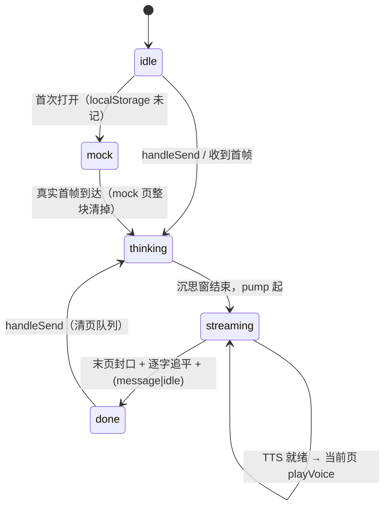

# docs/tts/03 — 遮罩分页与演出（CharacterModal）

> 本批（T1「角色语音」）子文档 `03`，owner 边界：`apps/web/src/components/overlay/CharacterModal.tsx` 的**页状态机 / 点击推进 / 语音触发 / 输入框时机 / mock 引导语**。
> 上游契约：`docs/tts/00-共同上下文.md`（冻结，**权威最高**，冲突时以它为准）；本文件 MUST NOT 改动它冻结的任何形状，发现冲突写进 §11。
> 非目标：不改 `lib/audio.ts` 内部（归 `02`）、不改服务端（归 `01`）、不改 `App.tsx` 的帧路由（归 `05` 补 prop）。
> 现状锚点复核日期：2026-09-13。行号有保质期，漂移时按符号名重定位。

---

## ① 一句话定位

把 `CharacterModal` 的**整段单游标逐字**（`CharacterModal.tsx:141-142` 的 `lineRef` / `shownRef`，`:196-221` 的 `pump`）改造成 **「页数组 + pageIndex + 页内游标」的三层状态机**：角色回复按 `\n` 切成页，**一页 = 一个非空行**，点击纸面「快进 → 翻页 → 边界钳制」，每翻到一页先 `stopVoice()` 再 `playVoice(url)`，页翻尽且本 turn 终结后才放输入框；首次打开时用一句**只活在组件内存里的** mock 引导语填空窗，真实首帧到达即整块退场。



---

## ② 签名与参数

### 2.1 纯函数搬家：新文件 `apps/web/src/components/overlay/dialogue-pages.ts`（NEW）

`parseEmoTag` / `parseEmoLines` / `charDelay` / `EMO_PREFIX_GUARD` 现居 `CharacterModal.tsx:57-118`，逻辑与 React 无关。**搬**到新文件（`06` 的 jiti 测试要直导它，见 `apps/web/test/audio-engine.test.mjs:8-19` 体例）。**这些纯函数实现后的家即 `apps/web/src/components/overlay/dialogue-pages.ts`（契约 §15.8），本节锚点只标注来源，迁移后按符号名重定位。**

```ts
// dialogue-pages.ts（NEW，纯函数，零 React import）
import type { Emotion } from '../../lib/audio.js';

export const EMO_PREFIX_GUARD = 24;                       // 搬家自 CharacterModal.tsx:59（实现后居 dialogue-pages.ts，§15.8）

/** 一页 = 一个非空行。sealed=false 只可能出现在末页（还可能长）。 */
export interface DialoguePage {
  text: string;                                           // 已去 [emo: tag]
  emo: Emotion;                                           // 本行有标签取本行，否则继承上一页
  sealed: boolean;                                        // 该行已由 \n 或 final 封口
}

/** 搬家自 CharacterModal.tsx:65-70，逐字不改（实现后居 dialogue-pages.ts，§15.8）。 */
export function parseEmoTag(raw: string): { text: string; emo: Emotion };

/**
 * 分页唯一真相源：只认 '\n'（契约 §6.2，⚠️ 实测警告：不做按标点切页兜底）。
 * NEW（取代 parseEmoLines）。
 * - 空行（连续 \n / 纯空白行）丢弃，不产生页。
 * - final=false 时末行 sealed=false；final=true 时全部 sealed=true。
 * - 未闭合 `[emo` 前缀冻结：该行产出 text='' 且 sealed=false，tailOpen=true。
 * - 返回 text = pages.map(p=>p.text).join('\n')，供既有「追平」判断复用（兼容层）。
 */
export function parseEmoPages(
  raw: string,
  opts?: { final?: boolean }
): { pages: DialoguePage[]; emo: Emotion; tailOpen: boolean; text: string };

/** 搬家自 CharacterModal.tsx:113-118，逐字不改（实现后居 dialogue-pages.ts，§15.8）。 */
export function charDelay(prev: string): number;

/** 边界钳制（契约 §6.4 第 3 条：pageIndex ∈ [0, len-1]）。len=0 → 0。 */
export function clampPageIndex(i: number, len: number): number;

/** mock 引导语（契约 §7.1 冻结值，不改文案）。 */
export const GREETING_LINE: Record<'en' | 'ja', { text: string; emo: Emotion }>;
```

**`parseEmoLines` 的处理**：删除，不留别名（干净切换）。其唯一消费方 `settleIfDrained`（`:188`）与 `pump`（`:201,219`）改调 `parseEmoPages`；`CharacterModal.tsx` 改为 `import { parseEmoPages, charDelay, GREETING_LINE, EMO_PREFIX_GUARD } from './dialogue-pages.js'`（同目录，注意 `.js` 后缀是全仓 ESM 约定，见 `CharacterModal.tsx:2`）。

### 2.2 组件新增 props（由 `05` 在 `App.tsx:597-612` 下推）

```ts
interface CharacterModalProps {
  // …既有：characterId / avatar / bio / onClose / onSendMessage / locale / incoming
  /** 世界 id（= world.json.id，经 /api/manifest 的 manifest.id）。mock 引导语的 localStorage key 需要它。 */
  worldId?: string;                                       // NEW（05 补）
  /** 角色音色（README frontmatter 的 voice 裸名）；缺省 → 前端不发该值，服务端取默认。 */
  voice?: string;                                         // NEW（05 补；来源 = /api/characters.voice，§15.5）
  /** TTS 语言短码（'en' | 'ja'）；缺省 'en'。MUST NOT 用浏览器语言猜测（§15.4）。 */
  language?: string;                                      // NEW（05 补）
}
```

- **`language` 独立于 `locale`**（契约 §15.4 裁定，已与 `05` 对齐）：`locale`（`CharacterModal.tsx:29`）的初值是**浏览器语言猜测**（`App.tsx:39-41`），而四个世界无 `world.json.locale`——日语浏览器会把英文台词念成日语。故 TTS 的 `language` 取值 = `manifest.locale` 白名单（`'en'`/`'ja'`）否则 `'en'`，由 `05` 在 `App.tsx:597-612` 算好下推；`locale` prop **原样保留**，只管 aria / placeholder 的 UI 文案。
- `worldId` 缺省（`undefined`）时：mock 引导语**仍显示**，但 **MUST NOT 读写 `localStorage`**（契约 §15.13，评审 B3）——避免 `airp:greeted:undefined:<charId>` / `airp:greeted::<charId>` 一类**假持久化 key**。代价是该世界每次打开都重新显示引导语，**接受，不阻塞**（线上 `worldId` 恒为 `/api/manifest` 的 `manifest.id`，`undefined` 只存在于初始渲染窗口）。
- `voice` 缺省（`undefined`）时：请求体里该键被 `JSON.stringify` 省略，服务端取 `AIRP_TTS_DEFAULT_VOICE`（契约 §4.2 第 4 步）。

### 2.3 组件内新增/复用的 ref 与 state 清单

| 名称 | 类型 | 新旧 | 语义 | 备注 |
|---|---|---|---|---|
| `pagesRef` | `useRef<StagePage[]>` | **NEW** | 页数组（命令式真相源） | `StagePage = DialoguePage & { voiceUrl?: string; voiceState: VoiceState }` |
| `pageIndexRef` | `useRef<number>` | **NEW** | 当前页下标 | 恒在 `[0, max(0,len-1)]` |
| `pageShownRef` | `useRef<number>` | **NEW** | **页内**已显示字符数 | 取代全局 `shownRef` |
| `voiceTurnRef` | `useRef<number>` | **NEW** | turn 令牌；fetch 回来令牌变了就丢弃 | 防串轮 |
| `mockRef` | `useRef<boolean>` | **NEW** | 当前纸上是否为 mock 引导语页 | 真实首帧 → 清 |
| `stingerGraceRef` | `useRef<number \| null>` | **NEW** | 「voice pending 时挂起 stinger」的宽限定时器 | 见 §5.4 |
| `inputRef` | `useRef<HTMLInputElement>` | **NEW** | 键盘推进时排除输入框自身 | 见 §4.4 |
| `lineRef` | `useRef<string>` | 复用 | 原始全文缓冲（含标签、增量累积） | `CharacterModal.tsx:141` |
| `streamingRef` | `useRef<boolean>` | 复用 | 本 turn 是否在演 | `:143` |
| `messageEndedRef` / `channelIdleRef` | `useRef<boolean>` | 复用 | 终结标志 | `:144-145` |
| `finalRef` | `useRef<boolean>` | 复用 | 末行可封口 | `:146` |
| `lastEmoRef` / `stingerFiredRef` | `useRef` | 复用 | mood 去重 | `:149-150` |
| `phaseRef` / `phaseBeforeTurnRef` | `useRef<Phase>` | 复用 | phase 闭包快照 | `:147-148` |
| `consumedFrameRef` | `useRef<CharacterFrame \| null>` | 复用 | StrictMode 重入守卫 | `:153` |
| `busyRef` / `turnWatchdog` / `streamTimer` / `closeTimer` | `useRef` | 复用 | — | — |
| ~~`shownRef`~~ | — | **退休** | 全局游标被 `pageIndexRef + pageShownRef` 取代 | — |
| `phase` / `emo` / `playerEcho` / `inputText` / `avatarError` / `closing` | `useState` | 复用 | — | `:129-136` |
| `line` | `useState<string>` | **删除** | 整段文本，被 `pages` 取代 | — |
| `shown` | `useState<string>` | **改造** | → `pageShown`（当前页已显示前缀） | — |
| `pageIndex` | `useState<number>` | **NEW** | 渲染用页下标（与 ref 同步写） | `[0, len-1]` |
| `pages` | `useState<DialoguePage[]>` | **NEW** | 渲染用页数组（只读投影） | — |

**为什么页真相源在 ref 而不是 state**：帧回调（`:297-362` 的 effect）读 state 会拿到闭包旧值——这是既有注释 `CharacterModal.tsx:140` 已经踩过的坑。因此所有推进逻辑读 `*Ref`，只在**边界处**（`enterPage` / `syncPages`）同步写 state 触发渲染。

**模块级（文件作用域，非 per-instance）真值**：

```ts
/** TTS 不可用（503/未配置）时全局只 warn 一次（契约 §8）。 */
let ttsWarned = false;                                    // NEW，模块级

type VoiceState = 'idle' | 'pending' | 'ready' | 'failed';  // NEW
type StagePage = DialoguePage & { voiceUrl?: string; voiceState: VoiceState };
```

---

## ③ 行为契约逐步（每步写「漏了会怎样」）

### 3.1 `syncPages(raw, { final, reset })` —— 分页与封口（唯一入口）

每次 `lineRef` 变化（delta / message / idle / error）都调用它。

1. `const next = parseEmoPages(raw, { final }).pages`。
   - **漏了** → 页数组永远是空，纸上什么都不出。
2. `reset === true`（`character_message` 且 delta 全丢、或 error、或 handleSend）→ `pagesRef = []`、`pageIndexRef = 0`、`pageShownRef = 0`。
3. 逐下标对账（`i` 从 0 到 `next.length-1`）：
   - `i >= pagesRef.length` → push 一份新页拷贝（`voiceState:'idle'`）；**若 `sealed===true` → 立即调 `prefetchVoice(page, i)`**（契约 §6.5「页封口即预取」）。
   - 否则，若 `next[i].text !== pagesRef[i].text`：
     - 该页原 `sealed===false`（**只可能是末页**，增量把未闭合行写长了）→ 就地更新 `text`，**不重取 TTS**（未封口不预取）。
     - 该页原 `sealed===true`（权威文本覆盖了已封口行，见 §3.5）→ 更新 `text`、清 `voiceUrl`、`voiceState='idle'`，**重新 `prefetchVoice`**；若它正是当前页 → 重驱（§3.3）。
   - 更新 `sealed` 标记（`false → true` 翻转时，若该页尚无 voice 请求 → `prefetchVoice`）。
4. `pagesRef.length = next.length`（截断；权威文本可能让页数变少）。
5. `setPages(snapshot)`。
6. 若 `pagesRef` 从空变非空且 `streamingRef.current` → `enterPage(0, { announce: true })`。
   - **漏了** → 首帧到了但玩家看不到第一页。

**⚠️ 实测警告落地（契约 §6.2）**：`parseEmoPages` 对「无 `\n`」的整段返回 **恰好 1 页**（`sealed = final`）。这是**最常见的退化形态**，`syncPages` 对 1 页与 N 页走**同一条代码路径**，无特判。**不做**按标点切页（契约 §6.2 第 3 条）。

### 3.2 `enterPage(i, { announce })` —— 「一页成为当前页」的唯一动作点

1. `i = clampPageIndex(i, pagesRef.length)`。
2. `pageIndexRef.current = i; setPageIndex(i)`。
3. `pageShownRef.current = 0; setPageShown('')`。
4. `applyMood(page.emo, announce)`（复用 `:166-182`；`thinking` mood 仍被 `applyMood` 早退忽略 `:167`）。
5. **语音**（§5）：`stopVoice()`；按 `page.voiceState` 决定 `playVoice` / 挂起 / 交给 stinger。
6. 起 `pump()` 逐字。
   - **漏了** → 翻到的新页静止不逐字，只剩光标。

`enterPage` 是**唯一**翻页入口：`syncPages`（首帧）、`advance`（点击）。**漏了唯一化** → 某条路径忘了 `stopVoice` 或忘了 mood，出现两页声音叠加 / 表情不切。

### 3.3 `pump()` 改造（`:195-221`）

```ts
const step = () => {
  if (streamTimer.current === null) return;
  const page = pagesRef.current[pageIndexRef.current];
  if (!page) { streamTimer.current = null; settleIfDrained(); return; }   // 页被 reset（§3.5）
  applyMood(page.emo, true);
  if (pageShownRef.current >= page.text.length) {                          // 追平 → 停
    streamTimer.current = null;
    settleIfDrained();
    return;
  }
  const prev = page.text[pageShownRef.current];
  pageShownRef.current += 1;
  setPageShown(page.text.slice(0, pageShownRef.current));
  if (pageShownRef.current >= page.text.length) {
    streamTimer.current = null;
    settleIfDrained();
    return;
  }
  streamTimer.current = window.setTimeout(step, charDelay(prev));          // 韵律表原样复用
};
```

- **页内韵律**（§6.3）：`charDelay` 逐字不改（`:113-118` 搬去纯函数文件）。
- **`applyMood(page.emo, true)`**：`emo` 已是「本行有标签取本行，否则继承」的结果（由 `parseEmoPages` 算好），故不再需要 `parseEmoLines` 的「最后一个被标记行的 mood」折中逻辑。
- **踩坑提醒**：`pump` 每步重算 **不再** `parseEmoPages(lineRef)`——页数组由 `syncPages` 维护，pump 只读当前页。若 pump 仍重算，delta 到达时会与 `syncPages` 的 push 打架（双重封口）。

### 3.4 `settleIfDrained()` 改造（`:184-193`）

```ts
const last = pagesRef.current.length - 1;
const drained =
  (messageEndedRef.current || channelIdleRef.current) &&
  streamTimer.current === null &&
  last >= 0 &&
  pageIndexRef.current === last &&                                  // 已翻到末页
  pagesRef.current[last].sealed &&                                  // 末页已封口
  pageShownRef.current >= pagesRef.current[last].text.length;       // 已追平
if (!drained) return;
streamingRef.current = false;
clearWatchdog();
setPhase('done');
```

- **`pageIndex === last` 是「翻完」的必要条件**（契约 §6.6）——这就是「页翻尽才放输入框」的机械落点。
- **漏了这一条** → 玩家还没翻到最后一页，输入框就亮了，新 turn 会清掉未读的页。
- `pagesRef.length === 0`（纯工具轮）不算 drained → 由 `character_idle` 分支单独归还 phase（`:335-340` 原逻辑保留）。

### 3.5 `character_message` 权威覆盖（`:309-330`）

- `lostAll`（delta 全丢）→ `lineRef = incoming.text` → `syncPages(lineRef, { final:true, reset:true })` → `enterPage(0,{announce:false})`（不响 stinger，与既有 `applyMood(mood, false)` 一致）→ `settleIfDrained()`。
- 非 `lostAll` 且 `lineRef !== incoming.text`（丢帧）→ `lineRef = incoming.text`，`syncPages(..., { final:true })`。已封口行的文本若变化 → §3.1 第 3 步重取 TTS。**这是唯一允许已封口页文本变化的路径**。
- **`reset:true` 后必须同步 `pageIndexRef=0`**，否则 `pageIndex` 可能越界 → `pageIndex ∈ [0,len-1]` 被破坏（契约 §6.4）。

### 3.6 `character_idle`（`:332-346`）

- `lineRef === ''`（纯工具轮）→ 原逻辑：取消定时器、`streamingRef=false`、归还 phase，**纸上页数组不动**（保留上一轮已经翻完的页，玩家能看到刚说的话）。
- 否则 → `syncPages(lineRef, { final:true })`（末页封口）→ `pump()` → `settleIfDrained()`。

### 3.7 `error`（`:348-361`）

- `lineRef = incoming.message` → `syncPages(lineRef, { final:true, reset:true })` → `enterPage(0,{announce:false})` → `pageShownRef = 页长`（一次落定，不逐字——错误文案不该被逐字演出）→ `setPhase('done')`。

### 3.8 `handleSend`（`:379-396`）

在既有复位后**新增**：`voiceTurnRef.current += 1`、清 `pagesRef`、`pageIndexRef=0`、`pageShownRef=0`、`setPages([])`、`setPageIndex(0)`、`setPageShown('')`、`stopVoice()`。

- **漏了清页队列**（契约 §6.6）→ 新回复的页接在旧页后面，玩家要翻过上一轮才能看到新的。
- **漏了 `stopVoice()`** → 上一轮的末句还在响，与 `thinking` 静默矛盾。

---

## ④ 文件与副作用

| 副作用 | 触发点 | 是否落账 |
|---|---|---|
| `POST /api/tts` | `prefetchVoice`（页封口时） | **不落账**（契约 §2.1：无 events 行、无 WS 帧） |
| `playVoice(url)` / `stopVoice()` | `enterPage` / `handleSend` / unmount | 纯前端演出 |
| `playStinger(emo)` | `enterPage` 的「该页无语音」分支 | 纯前端演出（`audio.ts:851`） |
| `unlock()` | `openCharacterModal` 调用链 或 遮罩首个 `pointerdown` | 纯前端（`audio.ts:905`；见 §4.5） |
| `localStorage.setItem('airp:greeted:<worldId>:<charId>', '1')` | mock 引导语首次显示时，**仅 `worldId` 有值**（§15.13：`undefined` 时不写） | 前端存储 |
| `console.warn`（TTS 503） | 首个 `failed` 页，模块级 `ttsWarned` 门 | 日志，一次 |

- **MUST NOT**：写 `events` 表、发任何 WS 帧、把 mock 引导语放进 `lineRef` / `onSendMessage` / 任何 payload（契约 §7.2 第 1 条）。
- **MUST NOT**：调 `setAmbient` / `setBGM` / `setTheme`（契约 §9 反模式 6）。

### 4.4 点击与键盘推进（契约 §6.4）

`advance()`（NEW）：

```ts
const advance = useCallback(() => {
  if (closing || phaseRef.current === 'thinking') return;       // 沉思期无页可推
  const page = pagesRef.current[pageIndexRef.current];
  if (!page) return;
  if (pageShownRef.current < page.text.length) {                // (1) 未出完 → 快进
    cancelStreamTimer();
    pageShownRef.current = page.text.length;
    setPageShown(page.text);
    settleIfDrained();
    return;
  }
  if (pageIndexRef.current < pagesRef.current.length - 1) {     // (2) 已完整 → 下一页
    enterPage(pageIndexRef.current + 1, { announce: true });
    return;
  }
  // (3) 末页且完整 → 不推进（等待玩家输入）
}, [closing, enterPage, settleIfDrained, cancelStreamTimer]);
```

- **(1) 漏了** → 急性子玩家必须等每一句打完，手感差。
- **(3) 漏了** → 越界索引，页数组读 `undefined`（`enterPage` 的 `clampPageIndex` 是第二道防线，但 `advance` 本身就 MUST 不越界）。
- **点击目标区域**：绑在 `.line-stage`（`index.css:503`）而非整张 `.speech-paper`（`index.css:441`）——把纸面全绑会把「点输入框」也算成推进，玩家一点输入框就跳页。`.line-stage` 是纸面上唯一的台词区。
- **键盘**：**决策——空格键推进，回车键不推进**。
  - 空格：遮罩内 `keydown`（capture）时若 `document.activeElement !== inputRef.current` → `e.preventDefault(); advance()`。空格是 galgame 的通用推进键。
  - 回车：**保留给输入框发送**（`CharacterModal.tsx:390` 既有 `onKeyDown` Enter→`handleSend`）。若回车也推进，玩家在输入框按回车会既翻页又发送。**不推荐回车推进**。
  - `Esc`：既有 `:368-374` 关闭遮罩，不动。

### 4.5 手势解锁（契约 §11 实测裁定）

`unlockOnFirstInteraction()`（`audio.ts:926-934`）**全仓零调用点**（死代码）；`unlock()` 的真实调用点只有 `Canvas.tsx:191` 与 `DiceRoller.tsx:219,265`。打开遮罩的点击在 `RightSidebar`（`App.tsx:585`），**不经 Canvas** → 点开遮罩不解锁音频 → `playVoice` 的 drop 语义（`ctx.state !== 'running'`）静默丢弃 mock 引导语与第一个真实页。

**本文件的落地（两处冗余，都在遮罩侧，不改引擎 drop 语义）**：

1. 遮罩根节点 `onPointerDown={() => { void unlock(); }}`（在 `CharacterModal.tsx:404` 的 `.character-modal-layer` 上加）——覆盖「玩家在遮罩内任意点击」。
2. `openCharacterModal` 调用链（`App.tsx:127-133`）**不由本文件改**（归 `05`）；本文件只声明需求：`openCharacterModal` 内加一行 `void unlock()`。若 `05` 不加，第 1 条仍兜住绝大多数路径。

- **漏了** → 首句无声，且玩家没有第二次机会（他已经点进来了）。
- **注意**：`unlock()` 是 async Promise；`void` 不 await（解锁是副作用，不阻塞渲染）。

---

## ⑤ 语音触发（契约 §6.5）

### 5.1 `prefetchVoice(page, i)`（NEW）

```ts
/** 页封口即预取：并发发起，不阻塞演出。同页只发一次（voiceState 门）。 */
async function prefetchVoice(page: StagePage, i: number): Promise<void> {
  if (page.voiceState !== 'idle') return;               // 已 pending/ready/failed → 不重发
  if (page.text.trim() === '') return;                  // 空页不发（契约 §2.1 空文本 400）
  page.voiceState = 'pending';
  const token = voiceTurnRef.current;
  try {
    const res = await fetch('/api/tts', {
      method: 'POST',
      headers: { 'Content-Type': 'application/json' },
      body: JSON.stringify({ text: page.text, voice, language }),
    });
    if (token !== voiceTurnRef.current) return;         // 已换轮 → 丢弃结果（不写、不播）
    const data = (await res.json()) as { ok?: boolean; url?: string; code?: string };
    if (!res.ok || !data.ok || typeof data.url !== 'string' || data.url === '') {
      page.voiceState = 'failed';
      if (res.status === 503 && !ttsWarned) {
        ttsWarned = true;
        console.warn('[AIRP TTS] character voice disabled (server returned 503 tts_unconfigured).');
      }
      onVoiceResolved(page, i);                          // → 若正是当前页且未响过 stinger → 响
      return;
    }
    page.voiceUrl = data.url;
    page.voiceState = 'ready';
    onVoiceResolved(page, i);                            // → 若正是当前页 → playVoice
  } catch {
    if (token !== voiceTurnRef.current) return;
    page.voiceState = 'failed';
    onVoiceResolved(page, i);
  }
}
```

**⚠️ 门禁硬约束（`check:bodies`，契约 §11 实测冻结）**：`BODIES` 把 `POST /api/tts` 的 file 冻结为 `apps/web/src/components/overlay/CharacterModal.tsx`，且 `bodyKeysFor`（`tools/check-request-bodies.mjs:80-105`）**逐行**扫 `lines[i].includes('fetch(') && lines[i].includes(route)`，再用**非贪婪** `JSON\.stringify\(\s*\{([\s\S]*?)\}\s*\)` 取第一个 `}` 前的键集。因此该 fetch 调用 MUST：

- 落在这个文件里（不能抽到 `dialogue-pages.ts` 或新建 `tts.ts`）；
- **route 字符串与 `fetch(` 同一行**（跨行写 `fetch(\n  '/api/tts',` → 门禁报 `missing-call`）；
- body 是**内联对象字面量**，**只能有 `text` / `voice` / `language` 三个键、无嵌套、无条件展开**（`...(cond ? {voice} : {})` 会让非贪婪正则取到内层 `{voice}` → key-drift）；
- **`voice` 键恒在源码里**（即使值为 `undefined`）。`JSON.stringify` 会在序列化时丢弃 `undefined` 值 → 线上 payload 无 `voice` → 服务端取默认（契约 §4.2 第 4 步）；但门禁读的是**源码键集**，故必须恒写三键。**MUST NOT** 条件构造请求体。

**正文里的 `text` 必须是页文本、不含 `[emo: tag]`**（`parseEmoPages` 已剥离）；超长页由服务端截断（契约 §4.2 第 3 步），**前端不预切**（契约 §6.2 第 4 条）。

### 5.2 `onVoiceResolved(page, i)`（NEW）

```ts
function onVoiceResolved(page: StagePage, i: number): void {
  if (pageIndexRef.current !== i) return;               // 玩家已翻走 → 只预热，不播（契约 §6.5）
  clearStingerGrace();                                  // 结果到了 → 撤掉 pending 宽限
  if (page.voiceState === 'ready' && page.voiceUrl) {
    stopVoice();
    playVoice(page.voiceUrl);                           // 有语音 → 不响 stinger
    stingerFiredRef.current = true;                     // 本页情绪音已被语音取代
  } else {
    if (!stingerFiredRef.current) {                     // 无语音 → 保留 stinger（契约 §6.5）
      stingerFiredRef.current = true;
      if (page.emo !== 'thinking') playStinger(page.emo);
    }
  }
}
```

### 5.3 `enterPage` 里的语音段落

stopVoice();                                            // 翻页先打断上一句（契约 §6.5）
const page = pagesRef.current[i];
if (!announce) return;                                  // 帧驱动的落定页不外放情绪音
if (page.voiceState === 'ready' && page.voiceUrl) {
  // 语音就绪 → 播语音、抑制 stinger。**真实页与 mock 页走同一分支**（契约 §15.18）
  playVoice(page.voiceUrl);
  stingerFiredRef.current = true;
} else if (page.voiceState === 'pending') {
  armStingerGrace(page, i);                             // 语音在途 → 挂起 stinger（§5.4）；mock 页不因 mockRef 被排除
} else if (!stingerFiredRef.current && page.emo !== 'thinking' && !mockRef.current) {
  // idle / failed 且**非 mock 页** → 保留 stinger（§7.3：mock 页不响情绪音）
  stingerFiredRef.current = true;
  playStinger(page.emo);
}

> **B1 修复点（契约 §15.18）**：`mockRef` **只**出现在「不响 stinger」与「退出时整块清页」两处，**不再**出现在 `ready` / `pending` 语音分支里。旧稿单一的 `else if (!mockRef.current && …)` 会让 `mockRef=true` 时既进不了 `ready`（`voiceState` 恒 `idle`）也进不了 stinger 分支 → mock 页**永不发声**。**漏了会怎样**：`00 §7.3` 明写「mock 页也朗读」，玩家点开遮罩后第一句静默，误以为语音坏了。

### 5.4 stinger 判定点唯一化 + pending 宽限（**与契约 §6.5 / §15.15 一致**）

§6.5 冻结「判定点唯一：该页是否真的发出了语音」。引擎侧**无法**观测「是否真出声」——`playVoice` fire-and-forget、无 ctx / 未 unlock 时同样静默 no-op、`voiceDebugState()` 只记 url。故判定点取**可观测的等价形式**；该等价形**已由契约 §15.15 升格为契约**（本节推导被主 agent 采纳，**不再是「本文件的拍板」**）：

> **判定点 = `page.voiceState === 'ready'`（拿到了非空 `url` 且已调过 `playVoice`）。**（契约 §6.5 / §15.15）

- `ready` → 调 `playVoice`，**抑制 stinger**。
- `failed`（TTS 未配置 / 4xx / 5xx / 超时 / 网络错）→ **保留 stinger**。
- `pending`（预取还没回来）→ **挂起 stinger**，起 `STINGER_VOICE_GRACE_MS = 1200` 宽限定时器（`armStingerGrace`）：
  - 定时器内 resolve 成 `ready` → 播语音、`clearStingerGrace()` 取消 stinger；
  - resolve 成 `failed` → 立刻响 stinger；
  - 定时器到点仍 `pending`（服务端在爬）→ **响 stinger**，之后语音若到达则照播（可能轻微叠加，宽限 1.2s 后 stinger 已近尾声）。

```ts
const STINGER_VOICE_GRACE_MS = 1200;                    // NEW，模块级

function armStingerGrace(page: StagePage, i: number): void {
  clearStingerGrace();
  stingerGraceRef.current = window.setTimeout(() => {
    stingerGraceRef.current = null;
    if (pageIndexRef.current !== i || stingerFiredRef.current) return;   // 已翻走或已了结
    stingerFiredRef.current = true;
    if (!mockRef.current && page.emo !== 'thinking') playStinger(page.emo);
  }, STINGER_VOICE_GRACE_MS);
}
function clearStingerGrace(): void {
  if (stingerGraceRef.current !== null) window.clearTimeout(stingerGraceRef.current);
  stingerGraceRef.current = null;
}
```

- **`stingerFiredRef` 复用并扩义**：本文件把它从「当前 mood 是否已响过」**扩义**为「当前页的情绪音已了结（由语音取代或已响）」。`handleSend` / `beginStream` / `enterPage` 的页切换都重置它为 `false`，避免每 delta 重放。
- **漏了宽限** → 无 `DASHSCOPE_API_KEY` 时（本机默认路径，主 agent 实测）每页要等 503 回来才响情绪音，纸面出字与音效脱节。
- **漏了「ready 抑制 stinger」** → 「叮」一声压在角色台词开头，像故障（契约 §6.5 原文）。

### 5.5 mock 引导语页的语音（契约 §7.3 / §15.18）

- mock 页**也朗读**，且**与真实页共用同一条语音路径**：`§6.1` seed 后立即 `prefetchVoice(mockPage, 0)`，页因此经历 `idle → pending → ready`，停在 mock 页时按 `ready` 播 `playVoice`（§5.2 / §5.3）。**MUST NOT** 为 mock 发明第二套发声逻辑。
- mock 页**不触发** stinger（§7.3 第 2 条）：`armStingerGrace` 与 `enterPage` 的 stinger 分支都以 `!mockRef.current` 显式跳过——**该守卫只挡情绪音，不挡语音**。`mockRef` 在 `ready` / `pending` 分支里**不出现**（§5.3 的 B1 注释）。

---

## ⑥ WS / 前端接线

- **帧名零增删**（契约 §10.1）：`character_delta` / `character_message` / `character_idle` / `error` 四条消费路径不变，只是每条尾部的 `pump()` 前插入 `syncPages(...)`（§3.1）。
- **`incoming` prop 契约不变**（`CharacterModal.tsx:30-31`）：App 已按 `activeModalCharId` 过滤并逐帧新对象（`App.tsx:161-178` 的 `onCharacterFrame`）。
- **props 增补由 `05` 落地**：`App.tsx:597-612` 加 `worldId={manifest?.id}`、`voice={activeChar?.voice}`、`language={manifest?.locale === 'ja' || manifest?.locale === 'en' ? manifest.locale : 'en'}`。
- **`onSendMessage` 不变**（`App.tsx:605-611` 的 `character_prompt`）：mock 引导语**永不**经过它。
- `docs/wiring/00 §6` **本批新增一行 `POST /api/tts`**，由 `05` 同步 `tools/check-request-bodies.mjs` 的 `BODIES`（`tools/check-request-bodies.mjs:32-39`）。

### 6.1 mock 引导语数据流（契约 §7）

```text
App 启动 → fetchManifest()（App.tsx:172）→ setManifest(data)          // data.id = world.json.id
App 渲染遮罩（App.tsx:597）→ 下推 worldId = manifest?.id
CharacterModal mount（:277-293 复位 effect 之后）：
  key = worldId === undefined ? null : `airp:greeted:${worldId}:${characterId}`   // §15.13：无 worldId 不持久化
  greeted = null
  if (key !== null) { try { greeted = localStorage.getItem(key) } catch {} }   // 隐私模式退化为「每次都显示」
  if (greeted === null) {
    const g = GREETING_LINE[locale];                     // §15.17：跟 UI locale，不跟 TTS 的 language
    const mockPage: StagePage = { text: g.text, emo: g.emo, sealed: true, voiceState: 'idle' };
    pagesRef.current = [mockPage];
    mockRef.current = true;
    if (key !== null) { try { localStorage.setItem(key, '1') } catch {} }     // §15.13：无 key 不写
    prefetchVoice(mockPage, 0);                          // §15.18 B1：mock 页**必须**走语音路径（idle→pending→ready）
    enterPage(0, { announce: true });                    // 逐字 + 朗读（走 §5.3 ready 分支），不响 stinger
  }
真实首帧 (character_delta | character_message) 到达（:302 / :309）：
  if (mockRef.current) {                                 // mock 整块退场（不是插在真页前）
    mockRef.current = false;
    pagesRef.current = []; pageIndexRef.current = 0; pageShownRef.current = 0;
    setPages([]); setPageIndex(0); setPageShown('');
    voiceTurnRef.current += 1;                           // mock 页的预取结果作废
  }
  → 正常 beginStream / syncPages
```

- **worldId 从哪来**：`/api/manifest` 返回 `{ ...manifest }`（`routes/world.ts:354-368`），`manifest.id` 就是 `world.json.id`（`templates/firstsnow/world.json` 的 `firstsnow-radio`）。`App.tsx` 已把它存进 `manifest` state（`App.tsx:37`），`05` 直接下推即可。
- **语言来源（契约 §15.17）**：引导语文案取 `GREETING_LINE[locale]`——`locale` 是 **UI 语言**（`App.tsx:39-41` 浏览器语言猜测），与 TTS 的 `language`（**世界内容语言**，§15.4）**不是同一个值**：在无 `world.json.locale` 的世界上，日文浏览器给 `locale='ja'` 而 `language='en'`。二者 MUST NOT 被合并或互相推导。
- **无 `worldId` 的持久化（契约 §15.13）**：`worldId===undefined` → `key = null`，**既不 `getItem` 也不 `setItem`**，mock 页**仍显示**（`greeted` 视为 `null`）。代价是每次打开都重显引导语，**接受**；**MUST NOT** 落 `airp:greeted:undefined:<charId>` / `airp:greeted::<charId>` 假 key。
- **绝不进上下文的机械保证**：引导语**只写进 `pagesRef`**，**从不写进 `lineRef`**。`lineRef` 是**唯一**会被 `parseEmoPages` 消费、且是唯一经由 `handleSend` 之外进入 agent 可见面的结构（`character_prompt` 只由 `handleSend` 发，`App.tsx:605-611`）；引导语不进 `lineRef` → 不进任何 WS 帧 → 不进 agent chat history / 注入块。**可 grep 验证**：全文件搜 `GREETING_LINE`，其唯二引用点是「常量定义」与「seed 进 pagesRef」，**零处**出现在 `lineRef` / `onSendMessage` / `sendMessage` / `JSON.stringify` 附近。
- **首次判定**：`localStorage` 抛错 → 退化为「每次都显示」；**不崩**。
- **StrictMode 幂等**：mount 复位 effect 先清 `pagesRef=[]` 再 seed；`mockSeededRef` 保证**单实例内只 seed 一次**，第二趟 StrictMode 不重复 `enterPage`。有 `worldId` 时 `localStorage` 已写过 → 第二趟 `getItem` 返回 `'1'` → **不 seed**；**无 `worldId` 时无 key**（不写），故每次 mount 都会 seed 一次 mock 页——这是 §15.13 取舍的必然结果，**非 bug**。

### 6.2 StrictMode 重入与既有权衡

既有 `consumedFrameRef`（`:153`）**保持不变**：帧 effect（`:297-362`）开头 `if (incoming === consumedFrameRef.current) return;` 保证同一帧对象只消费一次，StrictMode 双跑不会重复推进 `lineRef` / `pagesRef`。

- **与页状态机共存的关键**：所有页推进都发生在**帧 effect 内**（被 `consumedFrameRef` 守卫）或**用户事件内**（`advance` / `handleSend`），**没有**在 render 期或第二个 effect 里推进。故页状态机天然继承了 same-frame 幂等。
- **mount 复位 effect（`:277-293`）必须也在同一 effect 里 seed mock 页**，且 seed 条件读 `mockRef.current === false`（第二趟 StrictMode 时 `pagesRef` 已被第一趟清空但 `mockRef` 也是 false → 会再 seed 一次，净结果仍 1 页——`localStorage` 已写过，第二次 `getItem` 返回 `'1'` → **不 seed**）。**修正**：把 `getItem` 判断放在**同一 effect 内**、且 **seed 只做一次**的守卫用 `mockSeededRef`（NEW，防止 StrictMode 第二趟重复 seed 覆盖第一趟的 `enterPage`）：`if (!mockSeededRef.current) { mockSeededRef.current = true; …seed… }`。

---

## ⑦ 错误边界

| 情形 | 前端行为 | 依据 |
|---|---|---|
| TTS 503（未配置 key） | 该页 `failed` → 静默无语音 + **保留 stinger**；全局 `console.warn` 一次（模块级 `ttsWarned`） | 契约 §4.5 / §8 |
| TTS 502 / 504 / 网络错 | 该页 `failed` → 保留 stinger；**不再重试**（同页一次） | 契约 §8 |
| 音频 URL 404（缓存被清） | `playVoice` 内部 `loadSample` 失败 → 静默 no-op（`02` 保证不抛） | 契约 §8 |
| `decodeAudioData` 失败 | 同上，`failCached` 不重试 | 契约 §8 |
| `localStorage` 抛错 | try/catch，退化为「每次都显示引导语」 | 本文件 |
| 无换行整段（模型不听话） | `parseEmoPages` → 1 页；点击 → 快进即全部；输入框照常 | 契约 §6.2 警告 |
| 超长单页 | 页文本原样保留，CSS 承担换行/滚动（§8.2） | 契约 §6.2 第 2 条 |
| 页数组为空 + `character_idle` | 纯工具轮：归还 phase，纸上不动 | `CharacterModal.tsx:335-340` 原逻辑 |
| `pageIndex` 越界 | **不可能**：唯一入口 `enterPage` 恒 `clampPageIndex` | 契约 §6.4 |
| TTS 响应 `truncated:true` | 本批**不显示**标记（登记为待拍板 §12） | — |
| 遮罩卸载时有在途 fetch | `voiceTurnRef++` 作废（unmount 清理 `streamTurn` 加 `voiceTurnRef.current += 1`） | 本文件 |

- **不允许**：合成失败时伪造音频 / 把失败伪装成其它状态（契约 §8）；用 `console.warn` 当唯一可见手段（契约 §9 反模式 7——503 的 `code` 进响应体由 `01` 保证）。

---

## ⑧ 遮罩视觉重设计（`apps/web/src/index.css` + `CharacterModal.tsx` 渲染）

> 本节承接**用户第 3 条需求**（「现在像聊天框、丑，做成像 galgame」）与契约 **§16**（评审 BLOCKER B2 的落点）。旧稿只写了 `cursor` / `max-height`（功能性），**没有一处重设计「像聊天框」的视觉**；本节给出可落地的完整设计。

### 8.1 现状与问题（实测，带行锚）

| 元素 | 现状（`index.css`） | 问题 |
|---|---|---|
| `.speech-paper`（纸面） | `:441` 带纸纹的倾斜卡片 | 「纸」的语汇对，但与下方输入框堆成聊天窗 |
| `.line-stage`（台词区） | `:503` `min-height: 3.2em` | 台词与输入框**同处一张纸**，视觉上像聊天记录 |
| `.speech-input`（输入框） | `:548` 常驻底部一行 | **像聊天框的元凶**：输入框常驻、紧贴台词 |

### 8.2 目标形态（galgame 对话框，结构描述）

把遮罩从「聊天窗」重构成**舞台底部对话框**：

- **台词是主体、输入框是附庸**：演出的绝大多数时间屏幕上**只有纸面 + 台词**；输入框**默认不可见**，仅 §6.6 条件（页翻尽 + `phase` 终结）满足时**淡入**。
- **一页 = 一屏一屏地换**（§6），而非滚动追加——这是与「聊天记录」的根本区别。
- **点击推进有非文字暗示**：台词区右下角常驻一个闪烁的 `▼`（§8.5），纸边有极轻的 hover 微光（§8.6）。
- **立绘层级明确**：`.portrait-stage`（现有）在纸面**之下**（`z-index` 低于 `.speech-paper` 的 `2`），纸面底部对齐、不遮立绘主体——本批**不动** `portrait-stage` 的既有层级（契约 §16.4：只改「聊天框感」相关层级与显隐）。

### 8.3 需改的 `index.css` 类与具体属性

**① `.speech-paper`（`:441`）——把「聊天卡片」变成「对话框底座」**：去掉促使「聊天窗」观感的紧贴内边距，给台词留出主体空间，输入框所在的底边单独一条发丝线（输入框隐藏时该线也随之隐藏）。

```css
.speech-paper {
  padding: 1.2rem 1.6rem 1.1rem;    /* 原 1.2rem 1.6rem 0.9rem；底部留一线间距给输入框 */
  border-color: rgba(41, 40, 32, 0.28);   /* 原 .35：弱化「窗口边框」感 */
}
```

**② `.line-stage`（`:503`）——台词主体，明确的最小可点区 + 超长滚动**：

```css
.line-stage {
  min-height: 3.2em;                /* 保留：可增长下限，非固定高（§8.7） */
  max-height: 9.6em;               /* NEW：长行内部滚动，不顶出视口 */
  overflow-y: auto;
  overscroll-behavior: contain;
  padding-right: 1.6rem;           /* NEW：给右下角 ▼ 指示器让出位置，台词不压到它 */
}
```

**③ `.speech-input`（`:548`）——从「常驻聊天输入」改为「条件淡入的附庸」**（显隐机制见 §8.4）：加一层包裹类 `.speech-input-row` 承载淡入与上边线。

```css
.speech-input-row {                  /* NEW 类，包裹 <input> */
  border-top: 1px solid rgba(41, 40, 32, 0.12);
  margin-top: 0.5rem;
  padding-top: 0.35rem;
  opacity: 0;
  max-height: 0;
  overflow: hidden;
  pointer-events: none;
  transition: opacity 0.35s ease, max-height 0.35s ease;
}
.speech-input-row.is-ready {         /* §6.6 条件满足时挂上 → 淡入 */
  opacity: 1;
  max-height: 4rem;
  pointer-events: auto;
}
```

**④ 新增 `.advance-indicator`（▼）——见 §8.5。**

### 8.4 输入框默认隐藏 + 条件淡入（CSS / JS 落点）

- **CSS 落点**：§8.3 的 `.speech-input-row` / `.speech-input-row.is-ready`（默认 `opacity:0; max-height:0`，挂 `.is-ready` 后淡入）。
- **JS 落点**：`CharacterModal.tsx` 渲染层把 `<input className="speech-input">` 包进 `<div className={'speech-input-row' + (inputReady ? ' is-ready' : '')}>`。
  - `inputReady`（NEW，derived）= **`!busy`**，其中 `busy` 是 §9 已扩义的值（`thinking || streaming || (pages.length > 0 && pageIndex < pages.length - 1)`）。即：页翻尽且 turn 终结 → `busy=false` → 输入框淡入。
  - `disabled={busy}` **保留**（§8.8）；隐藏与禁用并不矛盾：隐藏期 input 仍在 DOM（保留 `autoFocus` / 无障碍树），只是不可点、不可见。
  - **`autoFocus` 调整**：输入框默认隐藏（未满足条件）时不应抢焦点——把 `autoFocus` 改为**仅 `inputReady` 为真时 `focus()`**（`useEffect` 内 `if (inputReady) inputRef.current?.focus()`）。
- **漏了会怎样**：输入框常驻 = 一眼「聊天框」，用户第 3 条需求落空（评审 B2）。

### 8.5 `▼` 推进指示器（**MUST 做**，契约 §16.2 / §15.11 升格）

galgame 的**最小可辨识特征**：台词右下角一个**随页可推而闪烁**的 `▼`，告诉玩家「能点/能按空格继续」。

- **CSS 落点（新增类）**：

```css
.advance-indicator {                 /* NEW 类，绝对定位于 .speech-paper 内右下 */
  position: absolute;
  right: 1.1rem;
  bottom: 0.7rem;                    /* 与 .speech-input-row 同在纸面底部，输入框淡入时随之被顶起或隐藏 */
  font-size: 0.85rem;
  color: var(--rust);
  line-height: 1;
  user-select: none;
  pointer-events: none;              /* 指示器本身不截点击，点击目标仍是 .line-stage */
  animation: advanceBlink 1.1s steps(1) infinite;
}
.advance-indicator.is-hidden { visibility: hidden; }
@keyframes advanceBlink { 50% { opacity: 0.15; } }
```

- **JS 落点**：`.speech-paper` 内渲染 `<span className={'advance-indicator' + (canAdvance ? '' : ' is-hidden')} aria-hidden="true">▼</span>`。
  - `canAdvance`（NEW，derived）= `phase !== 'thinking' && pagesRef.current.length > 0 && !inputReady`——即「有页、不在沉思、且还没到『该玩家输入』」。翻到末页且完整后 `inputReady` 为真 → ▼ 隐藏、输入框淡入，两者**接力**而非并存。
  - **漏了会怎样**：没有非文字点击暗示 → 玩家不知道能点，分页演出退化成「不动」，需求「点击切换」形同虚设。

### 8.6 可点区域与推进反馈

点击推进需要**台词区可点**，但输入框与关闭按钮不能被误触。

- `.speech-paper`（`:441`）：**不加** `onClick`（会把输入框点击也算进去）。
- `.line-stage`（`:503`）：加 `onClick={advance}` + `role="button"` + `tabIndex={0}` + `aria-label`（locale 化「继续」）。
- CSS 推进反馈（`.line-stage` 块内追加）：
  ```css
  .line-stage.is-advanceable { cursor: pointer; }
  .line-stage.is-advanceable:hover { background: rgba(41, 40, 32, 0.03); }
  ```
  `is-advanceable` = `canAdvance`（§8.5）——纯视觉提示，不影响逻辑。

### 8.7 超长单行不截断（契约 §6.2 第 2 条）

现状 `.line-stage`（`:503-509`）是 `min-height: 3.2em; line-height: 2`——**是可增长的下限，不是固定高**（§8.3 已加 `max-height: 9.6em; overflow-y: auto`）。3 行以内正常显示，超出内部滚动；**页文本一字不丢**。

- **漏了** → 一条 3000 字的长行把输入框推出屏幕，玩家既看不到后半句也够不到输入框。

### 8.8 输入框禁用态 + 数值页计数

- `.speech-input:disabled`（`index.css:574-577`）**已存在**（opacity .55 + not-allowed），无需新增。只需让 `disabled={busy}` 的 `busy` 涵盖「还有下一页」（§9）。
- **数值型页计数（`3 / 5`）**：本批**不做**，登记为后续（§12）——契约 §16.2 的 MUST 落点是 **`▼` 推进指示器**（§8.5），数值页计数是其可选的补强，非必需。

---

## ⑨ 与现状差异（`CharacterModal.tsx` 逐块）

| 行区间（现状） | 现状 | 改为 |
|---|---|---|
| `1-2` import | `playStinger, Emotion` | 追加 `playVoice, stopVoice, unlock`；`parseEmoPages` 等从 `./dialogue-pages.js` 引入 |
| `22-32` props | 7 个 | + `worldId?` / `voice?` / `language?` |
| `41-44` `EMO_TAGS` | 本文件 | **搬** `dialogue-pages.ts`（`parseEmoTag` 用） |
| `46-53` `SILENCE_LINE` | 本文件 | 保留（watchdog 兜底，逻辑不变） |
| `55-59` `TURN_WATCHDOG_MS` / `EMO_PREFIX_GUARD` | 本文件 | `EMO_PREFIX_GUARD` 搬纯函数文件；watchdog 留 |
| `61-118` `Phase`/`parseEmoTag`/`parseEmoLines`/`charDelay` | 本文件 | `Phase` 留；后三者**搬**纯函数文件，`parseEmoLines`→`parseEmoPages` |
| `129-136` state | `line`/`shown` | 删 `line`；`shown`→`pageShown`；+ `pages`/`pageIndex` |
| `138-153` refs | 含 `shownRef` | 删 `shownRef`；+ `pagesRef`/`pageIndexRef`/`pageShownRef`/`voiceTurnRef`/`mockRef`/`mockSeededRef`/`stingerGraceRef`/`inputRef` |
| `165-182` `applyMood` | mood 去重 + stinger | **拆分**：mood 切换保留；stinger 移出，改由 `enterPage`/`onVoiceResolved`/`armStingerGrace` 唯一决定（§5） |
| `184-193` `settleIfDrained` | 全局追平 | 改多条件 drained（§3.4） |
| `195-221` `pump` | 每步重算整段 | 改页内逐字，只读当前页（§3.3） |
| `223-243` `beginStream` | 清 `lineRef`/`shownRef` | 清 `lineRef`/`pageShownRef`/`voiceTurnRef++`/`stingerFired`/`stopVoice`；**不动 mock 页**（由帧处理器清） |
| `245-260` `armTurnWatchdog` | `SILENCE_LINE` 一次落定 | 改经 `syncPages(...,{final:true,reset:true})` + `enterPage(0,{announce:false})` + 一次落定 |
| `262-267` `streamTurn` | 清定时器 | + `stopVoice()` + `clearStingerGrace()` + `voiceTurnRef.current += 1` |
| `276-293` mount 复位 | 复位 refs | + 复位页 state/refs + **seed mock 引导语**（`mockSeededRef` 守卫，§6.1） |
| `295-362` 帧 effect | 4 分支 | delta/message 分支先清 mock 页；每分支尾部 `pump()` → `syncPages` + `pump` + `settleIfDrained` |
| `379-396` `handleSend` | 复位 | + 清页队列 / `voiceTurnRef++` / `stopVoice`（§3.8） |
| `398-402` derived | `busy = thinking\|streaming` | `busy = thinking \|\| streaming \|\| (pages.length > 0 && pageIndex < pages.length - 1)` |
| `404-468` render | 单 `<span className="speech-line">` | 只渲染当前页 `pageShown`；`.line-stage` 加 `onClick`/`role`/`tabIndex`/`is-advanceable`；`input` 包进 `.speech-input-row`（§8.4）；新增 `.advance-indicator`（§8.5）；`input` 加 `ref={inputRef}`；根节点加 `onPointerDown`（§4.5） |

新增函数（本文件内，非导出）：`syncPages` / `enterPage` / `advance` / `prefetchVoice` / `onVoiceResolved` / `armStingerGrace` / `clearStingerGrace`。全部 `useCallback`，依赖数组只含稳定回调与 `voice` / `language` / `locale` / `characterId` / `worldId`。

**`busy` 的扩展语义（契约 §6.6）**：新增的 `|| (pages.length > 0 && pageIndex < pages.length - 1)` 使「还有下一页」时输入框 disabled。页翻尽（`pageIndex === len-1`）后该子句为 false，`phase === 'done'` 也为 false → 输入框启用。`thinking` / `streaming` 仍 busy。

---

## ⑩ 验收测试

### 10.1 纯函数（断言写入 `06` 的 `apps/web/test/voice-engine.test.mjs` 的 **P 组**，本文件**不新增测试文件**）

> **归属（契约 §15.16，评审 V5）**：本节 P1–P11 的断言由 `06` 的 `apps/web/test/voice-engine.test.mjs` **P 组**覆盖；旧稿声明的第三个文件 `apps/web/test/dialogue-pages.test.mjs` **作废**（契约 §11 只授权 `tts-routes.test.mjs` + `voice-engine.test.mjs` 两个新文件）。

| # | 断言 | 覆盖契约条款 |
|---|---|---|
| P1 | `parseEmoPages('done', {final:true})` → `pages.length === 1`，`[0].text==='done'`，`sealed===true` | §6.2 警告 1（**无换行=单页**，最常见退化形态） |
| P2 | `parseEmoPages('', {final:true}).pages.length === 0` | §6.1 空页丢弃 |
| P3 | `parseEmoPages('a\nb\nc', {final:true})` → 3 页、全 `sealed`、文本 `a`/`b`/`c` | §6.2 随 `\n` 封页 |
| P4 | `parseEmoPages('a\n\n\nb', {final:true}).pages.length === 2` | §6.1 空行丢弃 |
| P5 | `parseEmoPages('[emo: smile]a\nb', {final:true})` → 第 2 页 `emo==='smile'`（继承） | §6.1 emo 继承 |
| P6 | `parseEmoPages('[emo: smi', {final:false})` → `tailOpen===true`，页文本 `''`，`sealed===false` | §6.2 `EMO_PREFIX_GUARD` |
| P7 | `parseEmoPages('a\nb', {final:false})` → 第 2 页 `sealed===false`，第 1 页 `sealed===true` | §6.2 末行未封口 |
| P8 | `clampPageIndex(-1,3)===0`、`(5,3)===2`、`(0,0)===0` | §6.4 边界（`pageIndex ∈ [0,len-1]`） |
| P9 | `charDelay(',')===300`、`('。')===150`、`('a')===45` | §6.3 韵律表未被删 |
| P10 | `GREETING_LINE.ja.text === 'どうしたの？'` 且 `GREETING_LINE.en.text === 'Something on your mind?'` | §7.1 冻结文案 |
| P11 | 长单行（如 2000 字无 `\n`）→ `pages.length===1` 且 `pages[0].text.length===2000`（**不截断**） | §6.2 警告 2 |
| P12 | `parseEmoPages('one. two. three.', {final:true}).pages.length === 1`（**负向：不按标点自动切页**） | §6.2 警告 3 |

### 10.2 组件级（jsdom / @testing-library 是否在仓内待查——登记 §12）

若可运行，mount 后断言：

1. **mock 不进上下文**：首次 mount → 纸上出现引导语；`onSendMessage` **零调用**（这是「绝不发给 agent」的可执行断言）。
2. **mock 页发声（B1，契约 §15.18）**：首次 mount 后 `prefetchVoice` 已被调用一次且 mock 页 `voiceState` 由 `idle` 变为 `pending`（可用 fetch stub 断言 `/api/tts` 被请求过）；若 stub 立即返回 `{ok:true,url:'/api/tts/audio/<hash>.wav'}`，则 mock 页转 `ready` 且 `playVoice` 被调用——**证明 mock 页与真实页共用同一语音路径**。
3. **仅首次**：预先 `localStorage.setItem(key,'1')` → mount 后纸上**无**引导语；**`worldId===undefined` 时**（不传 prop）→ `localStorage.setItem` **零调用**、`getItem` **零调用**（§15.13），但纸上**仍出现**引导语。
4. **真实首帧退场**：mount 后 emit 一个 `character_delta` → 引导语**被取代**（不在真页前面）。
5. **点击推进**：emit `delta`+`message` → 点击 → `pageShown` 变满 → 再点击 → `pageIndex +1`；末页再点 → 不变（边界）。
6. **输入框时机**：有下一页时 `.speech-input-row` 无 `is-ready`（隐藏）且 `input.disabled === true`；页翻尽 + `phase==='done'` 后 `is-ready` 出现、`disabled === false`、`.advance-indicator` 带 `is-hidden`。
7. **门禁静态断言**（不依赖运行）：`node tools/check-request-bodies.mjs` 对新增 `BODIES` 条目必须是 0 findings（由 `05` 落地）。

### 10.3 手测项

- 点开遮罩后**第一句有声**（mock 页，覆盖 unlock 时序与 §15.18 语音路径，契约 §11 裁定）。
- 无 `DASHSCOPE_API_KEY` 时：文字照常、每页有 stinger、`console.warn` **仅一次**。
- **视觉手测（契约 §16.3，无法单测，只能肉眼）**：①遮罩整体**不像聊天框**（输入框默认不出现）；②有非文字的**推进暗示**（右下 `▼` 闪烁）；③翻到末页后 `▼` 消失、输入框淡入。

---

## ⑪ 发现的冲突

> 按契约 §14 纪律：发现问题写进本节，**不回改** `00-共同上下文.md`；由主 agent 裁决。

1. **契约 §6.2 措辞「`.line-stage` 是固定高 3.2em」与实测不符**：`index.css:503-509` 写的是 `min-height: 3.2em`（**下限**，可增长），不是固定高。~~请回写时把契约措辞改为「下限高 3.2em，可增长；长行由 `03` 加 max-height 滚动」~~ → **已由契约 §6.2 自行修正**（§15.9 已采纳），本条**不再是待办**；本文件按实测（`min-height` + 新增 `max-height: 9.6em; overflow-y: auto`，§8.3）实现。
2. **契约 §13 锚点会漂移（纯函数搬家）**：`CharacterModal.tsx:65-118` 的 `parseEmoTag`/`parseEmoLines`/`charDelay` 被搬去新文件 `dialogue-pages.ts`，`parseEmoLines` 更名 `parseEmoPages`。§13 的对应锚点需由 `06` 更新。（已与 `06` 沟通。）
3. **`voice` 的前端来源依赖 §15.5 落地**：遮罩的 `voice` prop 来自 `/api/characters` 的 `character.voice`，而该字段由 `01` 在服务端新增、`05` 在 `App.tsx` 消费。若二者未落地，`App.tsx` 传 `undefined` → 请求体省略 `voice` → 服务端取默认音色（**可接受降级**，不是 bug）。本文件不阻塞。
4. **`language` prop 与既有 `locale` prop 的双轨**（§15.4 裁定的副作用）：遮罩会同时持有 `locale`（UI 文案，初值=浏览器猜测）与 `language`（TTS，初值='en'）。两者在 `firstsnow`（`world.json.locale='ja'`）下相同，但在四个无 `locale` 的世界下可能**不同**（日文浏览器：`locale='ja'` 但 `language='en'`）。这是**有意为之**（UI 跟随浏览器、台词语言跟随内容），但容易被后续维护者误合并成一个 prop——本文件在此显式登记，请回写时在契约里点明「两个 prop 不可合并」。
5. **`stingerFiredRef` 的扩义**：既有语义是「当前 mood 是否已响过 stinger」（注释 `CharacterModal.tsx:150`）。本文件把它扩为「当前页情绪音已了结」。这会让 `applyMood` 的 stinger 逻辑**移出**（§5）。若后续有人只改 `applyMood` 而忘了唯一的 stinger 判定点，会重现「叮压在台词上」。已在 §5.4 标为唯一判定点。

---

## ⑫ 仍未知 / 待拍板

1. **数值型页计数**（`3 / 5`）本批不做（§8.8）。契约 §16.2 的 MUST 落点是 **`▼` 推进指示器**（§8.5，已做）；数值页计数是其可选补强。登记待拍板。
2. **`truncated:true` 的呈现**：服务端对超 500 字符的页返回 `truncated:true`（契约 §4.2 第 3 步）。本批前端**忽略**该字段（页文本仍原样逐字显示，只是朗读被截短）。是否要在纸上显示「…（朗读已截断）」的视觉提示？登记待拍板。
3. **点空白处（非台词区）是否也推进**：本文件把点击目标限定在 `.line-stage`（防误触输入框）。galgame 惯例常允许点整屏推进。若要「点立绘/空白也推进」，可行但不含输入框——登记待拍板。
4. **`@testing-library` / `jsdom` 是否在仓内**：`apps/web/test/` 现有测试全是 node 原生 + jiti 直导纯模块（`audio-engine.test.mjs:1-19`），**未见** DOM 测试依赖。若不在仓内，§10.2 的组件级断言无法落地，只能靠 §10.1 纯函数 + §10.3 手测。需 `06` 确认。
5. **`STINGER_VOICE_GRACE_MS = 1200` 的取值**：基于「无 key 时 503 通常 <200ms 返回、有 key 时合成 1–3s」的推断。真实分布未经实测（本机无 key）。若实测发现 503 更慢或合成更快，需调参。标 `[推断]`。契约 §15.11 保留该 `[推断]` 初值。


---

## 修订记录（评审后）

> 本节记录评审（`REVIEW-评审报告.md`）→ 主 agent 裁决（契约 §15/§16）→ 本文件修订的对应关系。**只改文档，无代码改动。**

| # | 位置（本文件） | 改动 | 依据 |
|---|---|---|---|
| 1 | §5.3、§6.1 | **B1**：mock seed 后**新增 `prefetchVoice(mockPage, 0)`**，删除 `enterPage` 里把 mock 整段排除在语音路径外的单一 `!mockRef.current` 守卫——拆成「`ready`/`pending` 分支不含 `mockRef`」+「stinger 分支才判 `!mockRef`」；§5.5 改写为「与真实页共用同一语音路径」。**mock 页现在经 `idle→pending→ready` 发声**。 | 契约 §15.18；评审 B1/V3 |
| 2 | §2.2、§6.1 | **B3**：`worldId===undefined` 改为 `key = null`，**既不 `getItem` 也不 `setItem`**，mock 页**仍显示**；删除 `airp:greeted:${worldId ?? ''}:${charId}` 退化 key 写法。 | 契约 §15.13；评审 B3/V1 |
| 3 | §5.4 | **V4**：措辞由「本文件的拍板」改为「**与契约 §6.5 / §15.15 一致**」，判定等价形 `page.voiceState==='ready'` 已升格为契约。 | 契约 §15.15；评审 V4 |
| 4 | §10.1 | **V5**：删除第三个测试文件 `apps/web/test/dialogue-pages.test.mjs` 的声明，改为「断言由 `06` 的 `voice-engine.test.mjs` **P 组**覆盖」。 | 契约 §15.16；评审 V5 |
| 5 | §8（全节扩写）、§9 render 行 | **§16 样式重设计**：写全 ①目标形态结构 ②`index.css` 具体类与属性（`.speech-paper:441`/`.line-stage:503`/`.speech-input:548` + 新增 `.speech-input-row`/`.advance-indicator`）③输入框默认隐藏 + 条件淡入的 CSS/JS 落点 ④**`▼` 推进指示器**（升为 MUST）；删除「不做页指示器」旧措辞，数值页计数登记未做。 | 契约 §16.2/§16.3、§15.19；评审 B2 |
| 6 | §6.1 | **§15.17**：确认 `GREETING_LINE[locale]`（跟 UI locale），新增一条注明「与 TTS 的 `language`（世界内容语言）不同，二者 MUST NOT 合并」。 | 契约 §15.17；评审维度 1 |
| 7 | §2.1、§8.1 等 | **§13 锚点漂移**：`CharacterModal.tsx:59/65-118/113-118` 处同句补「实现后居 `overlay/dialogue-pages.ts`（契约 §15.8）」。 | 契约 §15.8/§15.20；评审 V11 |
| 8 | §11 冲突 1 | **MINOR**：删除已过时的「请改契约措辞」待办，改注「**已由契约 §6.2 自行修正**（§15.9）」。 | 评审维度 2 MINOR |

**自检（grep）**：`prefetchVoice` 在 mock seed 路径（§6.1）出现 → mock 发声路径存在；`greeted` 无 `airp:greeted::` / `airp:greeted:undefined:` 写法；§8 含 galgame 视觉设计（`.speech-input-row` / `.advance-indicator`）；全篇无 `dialogue-pages.test.mjs` 声明。