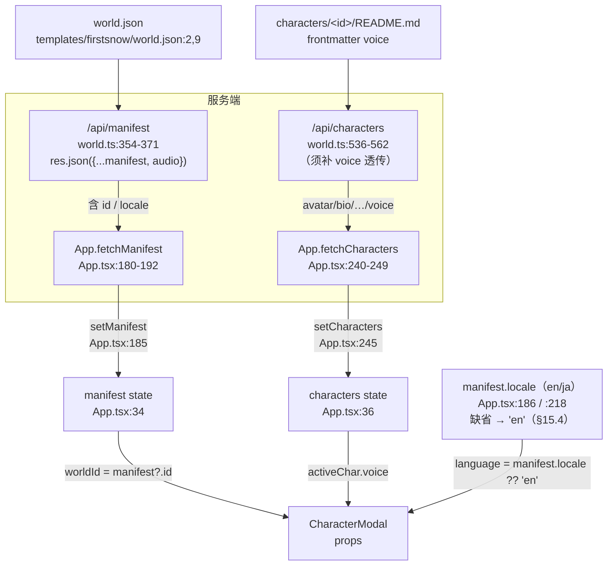

# docs/tts/05 前端接线与请求体门禁

> 本文是 TTS 批次子文档 `05`，owner 边界：`docs/wiring/00 §6` 加行、`tools/check-request-bodies.mjs` 加断言、`App` 向遮罩下推 `worldId` / `voice`、把角色音色的数据链补齐。
> 上游冻结契约：`docs/tts/00-共同上下文.md`（权威最高）；请求体冻结表：`docs/wiring/00-共同上下文.md §6`。
> **非目标**：不改遮罩内部分页演出（归 `03`）、不改服务端 `/api/tts` 路由与合成（归 `01`）、不定义 `playVoice`/`stopVoice` 通道（归 `02`）、不改 `.gitignore`（归 `01`）。
> 冻结日期：2026-09-13。冲突时以 `docs/tts/00 §0` 的权威层级裁决；本文发现问题写进「§11 发现的冲突」，**不回改母文档**。

---

## 1. 一句话定位

**本模块做三件「接线」事，让 `03` 的遮罩能真正发出一次 `POST /api/tts`：**

1. 把 `POST /api/tts` 的请求体**钉进两处机械真相源**——`docs/wiring/00 §6` 的冻结表（人读）与 `tools/check-request-bodies.mjs` 的 `BODIES`（机检）；
2. 把遮罩需要但**当前拿不到**的三个值接上：`worldId`（mock 引导语的 `localStorage` key）、`voice`（角色音色，经 `/api/characters`）、`language`（世界内容语言，取自 `manifest.locale`，§15.4 禁用浏览器猜测）；
3. 给出**能让门禁通过的精确内联写法**，并把「为什么它必须内联」写成可核验的理由。

**一句话判据**：本模块交付后，`node tools/check-request-bodies.mjs` 从 `clean (1 route(s) pinned)` 变为 `clean (2 route(s) pinned)`，且遮罩里那行 `fetch('/api/tts', …)` 的键集**逐字**等于 `['text','voice','language']`。

---

## 2. 签名与参数（精确）

### 2.1 `docs/wiring/00 §6` 新增行（逐字）

在 `docs/wiring/00-共同上下文.md` 的 §6 表格末尾（当前 `:121-122` 两行之后）追加**一行**：

```markdown
| `POST /api/tts` | `{ text: string, voice?: string, language?: string }` | `docs/tts/00-共同上下文.md §2.1` |
```

- 位置：`docs/wiring/00-共同上下文.md:122` 之后（`| POST /api/god-action | … | docs/tools/12:1403 |` 是现末行）。
- 该表的 `依据` 列现有值是 `docs/tools/12:710` / `docs/tools/12:1403` 式引用；本行指向 TTS 冻结契约 §2.1，**不**引 `docs/tools/12`（TTS 不走工具路由）。
- **不改**该表 §6 的任何既有行、不改表头、不改 §6 的「响应体一律 `{ ok: true, ...details }`」纪律（TTS 沿用同一形状，见 §5）。

### 2.2 `tools/check-request-bodies.mjs` 的 `BODIES` 新增条目（逐字）

`BODIES` 当前形状在 `tools/check-request-bodies.mjs:32-39`（**只有一条** `POST /api/dice`）。在数组末尾追加一个对象：

```js
  {
    route: '/api/tts',
    file: 'apps/web/src/components/overlay/CharacterModal.tsx',
    keys: ['text', 'voice', 'language'],
    doc: 'docs/wiring/00-共同上下文.md §6',
  },
```

- 三个字段名（`route` / `file` / `keys` / `doc`）**逐字**沿用既有条目（`check-request-bodies.mjs:33-38`），**不新增字段**（`compare` 只读这四个，`:115-144`）。
- `keys` 的顺序无关紧要：`compare` 两侧都 `.sort()` 后比较（`:130-131`），所以 `['text','voice','language']` 与 `['language','text','voice']` 等价。本文冻结字面量顺序为 `['text','voice','language']`（与 `docs/tts/00 §2.1` 的书写顺序一致，便于人眼比对）。
- `file` **必须**是遮罩文件——`main()` 对每条 BODIES 调 `bodyKeysFor(read(b.file), b.route)`（`:147-148`），`read` 只读这一个文件。

### 2.3 `CharacterModal` props 新增（精确签名）

`CharacterModalProps` 当前在 `apps/web/src/components/overlay/CharacterModal.tsx:22-32`（`characterId` / `avatar?` / `bio?` / `onClose` / `onSendMessage?` / `locale?` / `incoming?`）。新增**三个**可选 props：

```ts
interface CharacterModalProps {
  characterId: string;
  avatar?: string;
  bio?: string;
  onClose: () => void;
  onSendMessage?: (msg: string) => void;
  locale?: 'en' | 'ja';
  incoming?: CharacterFrame | null;
  /** NEW：当前世界的 manifest.id（`airp:greeted:<worldId>:<charId>` 的 key 段，docs/tts/00 §7.2）。 */
  worldId?: string;
  /** NEW：角色的 DashScope 音色裸名（README frontmatter `voice`，经 /api/characters 下发）。undefined → 服务端默认。 */
  voice?: string;
  /** NEW：TTS 请求体的 `language`——世界内容语言短码。默认 'en'。见 §3.3（MUST NOT 用浏览器语言猜测）。 */
  language?: string;
}
```

- **`language` 是独立 prop，不复用 `locale`**（**据 `docs/tts/00 §15.4` 裁决修正**）：`locale` prop（`:29`）的初值是**浏览器语言猜测**（`App.tsx:39-41`），而 4 个世界 `world.json` **无 `locale`**（§15.4 实测），此时 `locale` 会停在猜测值——日语浏览器会把**英文**台词念成日语。故 TTS 的 `language` MUST 来自 `manifest.locale`（缺省 `'en'`），与 UI 文案用的 `locale` 解耦。二者**同值与否取决于世界是否声明 locale**，故必须是两个 prop。
  - 与 `03` 对齐：`03` 的请求体键名 `language` 现在取自这个新 prop（值 = `manifest.locale` 或 `'en'`），不再是 `locale`。

### 2.4 解构处新增（`CharacterModal.tsx:120-128`）

函数组件的解构列表（`:120-128`）追加三行：

```ts
export const CharacterModal: React.FC<CharacterModalProps> = ({
  characterId,
  avatar = '/assets/characters/portraits/lady_1.png',
  bio,
  onClose,
  onSendMessage,
  locale = 'en',
  incoming = null,
  worldId,
  voice,
  language = 'en',
}) => {
```

- `worldId` **不给默认值**——`undefined` 与「空世界 id」语义不同：`03` 的 mock 引导语判据是「`worldId` 有值才写 `localStorage`」（§3.1），给默认空串会造出 `airp:greeted::nanami` 这种跨世界串味的 key。故保持 `undefined`。
- `language` 默认 `'en'`（§15.4 的保守兜底：缺 `locale` 的 4 个世界内容皆英文）；App 总是显式传值（§3.3），默认值只在无 prop 时兜底。

---

## 3. 数据流补链（逐步：值从哪来 → 怎么到遮罩）

遮罩要发一次合法请求，需三样东西：`text`（页文本，归 `03`）、`voice`、`language`；另加 `worldId`（不出请求体，只进 mock 引导语的 `localStorage` key）。本节逐一落证据。



### 3.1 `worldId`（不用进请求体，只进 `localStorage`）

- **来源 = `manifest.id`**。`App.tsx:20-31` 的 `WorldManifest` 接口含 `id: string`（`:21`）；`/api/manifest` 返回 `{ ...manifest, audio: { theme } }`（`world.ts:367`），`manifest` 来自 `store.getManifest()`（`world.ts:358`），即 `world.json` 经 `WorldManifestSchema` 解析——`id: z.string()`（`packages/shared/src/schemas/world.ts:26`）。`firstsnow` 的值为 `"firstsnow-radio"`（`templates/firstsnow/world.json:2`）。
- **传递**：App 在遮罩挂载点（`App.tsx:597-612`）传 `worldId={manifest?.id}`。
- **现状可证**：`useWorld()` 的返回（`apps/web/src/state/useWorld.ts:400-410`）与 `LayerState`（`:39-48`）**不含**世界 id（grep 全文件无 `worldId`）——所以 `worldId` 只有一个来源 `manifest`，这反而是好事：无第二真相源。
- **边界与降级**：遮罩渲染条件是 `activeModalCharId && activeChar`（`App.tsx:597`），此时 `manifest` 通常已由首屏 `fetchManifest()`（`App.tsx:145`）填好，但**不保证**（用户可能在 manifest 返回前就点了角色）。故 `worldId` 可能是 `undefined`。
  - 「有语音不播 stinger」等演出判据（`docs/tts/00 §6.5`）**不依赖** `worldId`，不受影响。
  - 「TTS 缓存隔离」**不由前端 `worldId` 完成**：缓存根是服务端活跃世界的 `<worldRoot>/.airpworld/tts-cache/`（`docs/tts/00 §2.3`），换世界 = 换 `getActiveStore()` = 换根，隔离天然发生。**前端 `worldId` 与缓存隔离无关**，只服务 mock 引导语的 key（本任务书括注「TTS 缓存隔离」宜理解为「世界随行」，非前端职责）。
  - 若 `worldId` 为 `undefined`，`03` 的正确行为是：**仍显示 mock 引导语，但不写 `localStorage`**（下次仍显示）。这避免了 `airp:greeted:undefined:nanami` 的假持久化。登记为 `03` 的判据，本文只冻结「App 传 `manifest?.id`」。

### 3.2 `voice`（角色音色）——**必须补 `/api/characters` 透传**

**结论：`/api/characters` 当前不下发 `voice`，MUST 补一行透传。** 证据与精确改动如下。

**现状（`apps/server/src/routes/world.ts:536-562`）**：`/characters` 的 map 里只读 README 的 `avatar`，`bio` 仅在没有 `description` 时补 body 前 100 字：

```ts
// world.ts:545-556（现状）
try {
  const raw = await store.readFile(`characters/${c.id}/README.md`);
  const { frontmatter, body } = parseFrontmatter(raw);
  if (frontmatter?.avatar) avatar = frontmatter.avatar;
  if (!bio) bio = body.slice(0, 100);
} catch {}
return {
  ...c,
  avatar: avatar || '/assets/characters/portraits/fella_1.png',
  bio,
};
```

- `frontmatter` 的类型是 `Record<string, any> | null`（`packages/shared/src/schemas/frontmatter.ts:154`，`parseFrontmatter` 返回，`:180`），**未过滤**（`:230` 注释「bg / bgStyle / accepts / marks all survive」）——所以 README 顶层的 `voice` **已经在 `frontmatter` 对象里**，只是当前没被取出。
- **`voice` 不会从 `world.json.characters[]` 来**：`...c` 展开的 `c` 是 `manifest.characters[]`，其 schema `CharacterConfigSchema` 只有 `id/home/role/avatar/description` 五个字段（`packages/shared/src/schemas/world.ts:17-23`），**无 `voice`**。这与 `docs/tts/00 §3.1`「不许在 `world.json.characters[]` 里加 `voice`」一致——所以 `voice` **只能**从 frontmatter 取。

**精确改动（在 `world.ts:545-555` 的同一 `try` 块与回包对象内）**：

```ts
        (manifest.characters || []).map(async (c) => {
          let avatar = c.avatar;
          let bio = c.description;
          let voice: string | undefined;                         // NEW（局部变量）
          try {
            const raw = await store.readFile(`characters/${c.id}/README.md`);
            const { frontmatter, body } = parseFrontmatter(raw);
            if (frontmatter?.avatar) avatar = frontmatter.avatar;
            if (typeof frontmatter?.voice === 'string' && frontmatter.voice.trim() !== '') voice = frontmatter.voice.trim();   // NEW
            if (!bio) bio = body.slice(0, 100);
          } catch {}
          return {
            ...c,
            avatar: avatar || '/assets/characters/portraits/fella_1.png',
            bio,
            voice,                                               // NEW
          };
        })
```

- **`typeof === 'string'` + 非空守卫**：`frontmatter` 是 `any`-valued，YAML 可能把 `voice: 3` 解析成 number。守卫让非串/空串值**静默变 `undefined`**（→ 服务端回默认音色）。**路由层不做字符集校验**（形状校验归 `01` 的 §4.2 步骤 4）——避免两处真相。
- **透传层不做 token 化**（背景说明，**非**放宽正则的理由）：曾有「音色 ID 含空格」的担忧，`07 §0` 已实测**证伪原判断**（`Eldric Sage` 是**一个**真实音色；`Eldric`/`Sage` 各自非法）。故透传层只做 `.trim()`（去首尾空白），**不**做字符白名单（校验归 `01`）；`voice` 现在是**效果别名**（也可为含空格的裸 id）；服务端 `VOICE_RE` 已放宽为允许空格（`07 §3`）。见 §11 冲突 5。
- **附加字段是向后兼容的**：`/api/characters` 的响应无共享 schema 约束（直接 `res.json({ characters: chars })`，`world.ts:558`），多一个 `voice` 键不会让任何现有消费者报错；前端 `characters` 是 `any[]`（`App.tsx:36`）。
- **归属**：这是**服务端路由**改动，不属「前端接线」。**已由 `01` 认领落地**（`01` 回复：改 `world.ts` 的 `/characters` handler，读 `frontmatter.voice`，缺省不下发 `voice` 字段）；本文只引用其结论与精确落点。`04` 负责 README 内容与音色清单。
**前端传递**：`App.tsx:597-612` 的 `<CharacterModal … voice={activeChar.voice} />`。`activeChar` = `characters.find(c => c.id === activeModalCharId)`（`App.tsx:441`）。若 `/api/characters` 未补 `voice`（或角色 README 未声明），`activeChar.voice === undefined` → prop 为 `undefined` → 遮罩发 `{ text, voice: undefined, language }` → 服务端回默认音色。**这是可接受降级**（`03` 已确认）。

### 3.3 `language`（世界内容语言短码）——**取自 `manifest.locale`，独立 prop，MUST NOT 用浏览器猜测**

**来源 = `manifest.locale`**（**据 `docs/tts/00 §15.4` 裁决**）：

- `/api/manifest` 返回 `{ ...manifest }`（`world.ts:367`）**含 `locale`**（`world.json` 顶层字段，`templates/firstsnow/world.json:9` = `"ja"`；`templates/whitechapel/world.json` = `"en"`；`WorldManifestSchema` 有 `.passthrough()`，`schemas/world.ts:49`、`:25-49`，故非 schema 字段 `locale` 原样保留到响应，但**类型取不到**——`App.tsx:20-31` 的本地 `WorldManifest` 接口已含 `locale?: Locale`，`App.tsx:186` 从 `data.locale` 读）。
- **值域吻合**：`Locale = 'en' | 'ja'`（`apps/web/src/lib/i18n.ts:1`），正是 `docs/tts/00 §2.1` 要求的「世界 locale 短码（`en` / `ja`）」，服务端再做 `ja→Japanese / en→English / 其他→Auto` 映射（`docs/tts/00 §4.4`）。

**为什么不能复用 `locale` state（`App.tsx:39-41`）**：该 state 的**初值是浏览器语言猜测**（`navigator.language.startsWith('ja') ? 'ja' : 'en'`）。`docs/tts/00 §15.4` 实测：`firstsnow`=`ja`、`whitechapel`=`en`，**其余 4 个世界无 `locale`**。对这些世界，`locale` 会一直停在**猜测值**——日语浏览器会把**英文**台词念成日语。故：

- **App 传值规则（冻结）**：`language={(manifest?.locale === 'ja' || manifest?.locale === 'en') ? manifest.locale : 'en'}`——即「`manifest.locale` 优先，缺省/非法 → `'en'`」。**MUST NOT** 把 `locale` state（浏览器猜测）当 TTS 的 `language`。
- `locale` prop（`:29`）**保留**：它仍驱动 aria-label / placeholder 等 UI 文案（`CharacterModal.tsx:408,410,442,460`），只是**不再**喂 TTS。
- **`language` 是请求体键名，也是新 prop 名**：`03` 写 `body: JSON.stringify({ text, voice, language })`（简写）或 `language: language`；gate 提取键名用 `^\s*(?:\.\.\.)?([A-Za-z_$][\w$]*)\s*(?::|$)`（`check-request-bodies.mjs:99`），两种写法都提取出 `language`。
- **无 `manifest` 窗口**：`manifest` 未到时 `manifest?.locale` 为 `undefined` → 传 `'en'`，安全。

---

## 4. 请求体门禁：为什么必须内联，以及精确写法

### 4.1 门禁怎么扫（读实现，`tools/check-request-bodies.mjs`）

- `main()`（`:146-150`）对每条 BODIES 调 `bodyKeysFor(read(b.file), b.route)`（`:148`）——**只读 `b.file` 这一个文件**。
- `bodyKeysFor`（`:80-105`）：
  1. 逐行找**同一行**同时含 `fetch(` 与路由字面量（`:83`：`if (!lines[i].includes('fetch(') || !lines[i].includes(route)) continue;`）。→ **`fetch('/api/tts', …)` 的路由串必须与其 `fetch(` 同行**；跨行写 `fetch(\n  '/api/tts',` 会漏配。
  2. 从该行起最多 15 行（`:88`）拼 `chunk`，按括号平衡截断（`:88-93`）。
  3. 在 `chunk` 上匹配 `JSON\.stringify\(\s*\{([\s\S]*?)\}\s*\)`（`:94`）——**要求 `JSON.stringify` 后面紧跟一个字面量 `{`**。这是「必须内联」的机械根因。
  4. `splitTopLevel` 按顶层逗号切属性块（`:46-67`，忽略括号/字符串内的逗号），每块用 `:99` 正则取键名。
- `compare`（`:115-144`）把提取键集与 `keys` 各 `.sort()` 后比对；不符报 `key-drift`（`:132-141`）；`bodyKeysFor` 返回 `null` 报 `missing-call`（`:119-129`）。

### 4.2 正确的内联写法（**可与门禁逐字对上**）

`03` 在 `CharacterModal.tsx` 里发起请求，**写成如下形状**（示意，键名逐字）：

```tsx
// NEW（落在 CharacterModal.tsx 内，一处）：页封口时预取 / 翻到时补取
const res = await fetch('/api/tts', {
  method: 'POST',
  headers: { 'Content-Type': 'application/json' },
  // 冻结请求体（docs/wiring/00 §6 / docs/tts/00 §2.1）：恰为 text / voice / language
  body: JSON.stringify({ text: pageText, voice, language }),
});
```

键集提取过程（可手工复算）：`fetch(` 与 `'/api/tts'` 同行（`:83` 命中）→ chunk 含 `JSON.stringify({ text: pageText, voice, language })` → `:94` 正则捕获 ` text: pageText, voice, language ` → `splitTopLevel` 切出三块 → `:99` 取 `text` / `voice` / `language` → 与 `['text','voice','language']` 排序后相等 → **无 finding**。

**等价合法变体（同样通过）**：

```tsx
body: JSON.stringify({ text, voice, language }),          // 三者均为同名局部变量/解构 prop
body: JSON.stringify({
  text: pageText,
  voice,
  language,                        // = language prop（manifest.locale ?? 'en'）
}),                                                        // 多行对象：:94 的 [\s\S]*? 跨行匹配，合法
```

### 4.3 会让门禁报错的写法（**MUST NOT**）

| 写法 | 结果 | 机械原因 |
|---|---|---|
| `const payload = { text, voice, language }; … body: JSON.stringify(payload)` | `missing-call` | `:94` 要求 `JSON.stringify(` 后紧跟字面量 `{`；变量名不匹配 → `null` → `:119` |
| `body: JSON.stringify({ text, ...(voice ? { voice } : {}), language })` | `key-drift`（实测提取到 `[text]`，缺 `voice` **且** `language`） | `splitTopLevel` 在顶层逗号处切块；`...(voice ? { voice } : {})` 触发 `depth` 变化，`,` 被吃进同一块；`:99` 正则对 `...` 后紧跟 `(` 的块不产键，且 `language` 被并入该块 → 两键都丢 |
| `body: JSON.stringify({ text, voice, language, meta: { a: 1 } })` | `key-drift`（多 `meta`） | `:99` 会把 `meta: { a: 1 }` 顶层块也提取为键 `meta` |
| 路由串与 `fetch(` 不同行 | `missing-call` | `:83` 的同行 `includes` 判据 |
| 两次 `fetch('/api/tts', …)`（如预取 + 重试各一处） | **取第一处**，另一处不被检 | `:82` 的 `for` 在首个命中即 `return`（`:102`）。两处必须键集一致，否则只有第一处把关 |

> **对 `03` 的硬约束**：`POST /api/tts` 的 `fetch` 调用**恰好一处**、`body` 为**内联对象字面量**、键集**恰为** `text/voice/language`。条件展开与「先存变量」都与门禁的文本提取模型冲突——这不是风格偏好，是 gate 的机械形状。

> ⚠️ **`voice` 键 MUST 恒在（即便值是 `undefined`）**：`03` 曾提议「缺省时前端不发该键」（条件构造请求体）。**禁止**——门禁的 `keys` 断言要求键集**恒为** `['text','voice','language']`，条件构造必然导致 `key-drift` 或触发 §4.3 的条件展开陷阱。正确做法：**始终**写 `voice`（值可为 `undefined`）；`JSON.stringify` 会把 `{ text, voice: undefined, language }` 序列化成 `{"text":…,"language":…}`（`undefined` 值键被丢弃），服务端读不到 `voice` → 回默认音色，**语义与「不发该键」完全等价**，但门禁看到的是三个键。**键的存在性由源码字面量决定，值的存在性由 `JSON.stringify` 决定**——二者不矛盾。


### 4.4 `check-request-bodies.test.mjs` 不受影响

`tools/check-request-bodies.test.mjs` 用**合成输入**驱动纯函数 `compare`/`bodyKeysFor`（`:18-57`），**不读 BODIES**。故新增 BODIES 条目**不改**该测试，也**不要求**为 TTS 加测试用例（本批验证归 `06`；若要，可仿 `:40-53` 给 `/api/tts` 加一条 `bodyKeysFor` 用例）。

---

## 5. 落账与响应体语义（本模块的对外契约面）

- **不落账**：`POST /api/tts` 是演出请求，不写 `events` 表、不发 WS 帧（`docs/tts/00 §2.1`、§9.2）。前端也不因它更新任何世界状态——**它的全部效果是「扬声器响一声」**。
- **响应体形状**：`{ ok: true, url, cached, characters, truncated }`（`docs/tts/00 §2.1`）或 `{ ok:false, code, error }`（`ActionError.toHttp()`，`world.ts:56-74`）。与 `docs/wiring/00 §6` 的「响应体一律 `{ ok: true, … }`」一致，**无新形状**。
- **前端只消费 `url`**：拿到 `url` 后交给 `playVoice(url)`（`docs/tts/00 §5`）。`cached`/`characters`/`truncated` 前端可读但不改变演出路径（`truncated: true` 仅日志/可选标记，不阻断播放）。
- **失败矩阵**（`docs/tts/00 §8`）：503 `tts_unconfigured` / 502 `tts_upstream` / 504 `tts_timeout` / 400 `invalid_argument`。前端对任何非 `ok` 或 `url` 缺失**静默无语音**，文字演出照常，并保留该页 stinger（`docs/tts/00 §6.5` 判定）。**没有 ACK、没有重试队列、没有事件**——与 `playStinger` 的 fire-and-forget 同款（`audio.ts:851-860`）。
- ⚠️ **前置条件：音频须先解锁**（`docs/tts/00 §11` 实测裁定）。`playVoice` 沿用 `playStinger` 的 drop 语义（`ctx.state !== 'running'` 即丢，`audio.ts:851-860`），而**点开遮罩的手势在 `RightSidebar`**（`App.tsx:585` `onChatWithCharacter` → `openCharacterModal`），**不经 Canvas**（真解锁点 `Canvas.tsx:191` / `DiceRoller.tsx:219,265`）；`unlockOnFirstInteraction()`（`audio.ts:926-934`）**全仓零调用点**。故 `03` MUST 在遮罩内补一次手势解锁，否则 `url` 到位也**静默无声**。这不是本模块的门禁能拦的（门禁只查请求体形状），故单列为跨模块前置。

---

## 6. WS 前端面（本批**零改动**）

- **不新增/删除任何帧名**（`docs/tts/00 §10.1`）。`character_prompt` / `character_delta` / `character_message` / `character_idle` 全部沿用（`docs/tools/12 §6.2`）。
- **本模块不动 `useWorld.ts`**：`world_event` 消费与去重（`docs/wiring/00 §4`）与本批无关。`worldId` 从 `manifest` 取，**不**改 `UseWorldApi`（`useWorld.ts:50-78` / `:400-410`），也不给 `LayerState` 加字段（`useWorld.ts:39-48`）。
- **遮罩的入方向帧路由**（`App.tsx:161-178`）与出方向 `character_prompt`（`App.tsx:605-611` / `server/index.ts:142-159`）**一个都不改**：TTS 完全在 HTTP 面发生，帧通道只是「页文本」的来源。
- **判据**：`node tools/check-ws-contract.mjs --json` 的 `findings` 与本批前**完全一致**（本批不碰 `CONSUMERS = ['apps/web/src/state/useWorld.ts']`，`:48`，也不碰任何 `EMITTERS`，`:40-45`）。

---

## 7. 错误边界

| 情形 | 本模块的期望行为 | 依据 |
|---|---|---|
| `/api/characters` 未补 `voice`（角色 README 无 `voice`） | `activeChar.voice === undefined` → 请求体 `voice: undefined` → 服务端回默认音色 | §3.2 降级；`docs/tts/00 §4.3` |
| `manifest` 未到达 → `worldId === undefined` | 遮罩照常渲染，mock 引导语可显示（是否持久化由 `03` 按「有值才写 key」决定） | §3.1 |
| `manifest` 未到达 / 世界无 `locale` | 前端传 `'en'`（§15.4）；不影响渲染，只是 TTS 语言取保守默认 | §3.3；`docs/tts/00 §15.4` |
| 门禁键集漂移（`03` 改了请求体） | `check:bodies` 红（`key-drift`，`check-request-bodies.mjs:132-141`），消息列出两侧键集 | §4 |
| 门禁找不到调用点（改名/移动/写成变量） | `check:bodies` 红（`missing-call`，`:119-129`） | §4.3 |
| 服务端 503/502/504/400 | 前端静默无语音；文字照常；该页保留 stinger | `docs/tts/00 §8` |
| 音频未解锁（点开遮罩不经 Canvas） | 请求成功、`url` 到手，但 `playVoice` drop → 首句静默无声 | `docs/tts/00 §11`；修法在 `03`（遮罩补 `void unlock()`），见 §11 冲突 6 |

**原则**：本模块只做**接线与门禁**，**不**新增任何前端兜底音频（`docs/tts/00 §5` 明令「无合成兜底」）。

---

## 8. 代码落点（精确到文件与函数）

| # | 文件 | 落点 | 改动 | 归属 |
|---|---|---|---|---|
| 1 | `docs/wiring/00-共同上下文.md` | §6 表末（`:122` 后） | 追加行 `\| \`POST /api/tts\` \| \`{ text: string, voice?: string, language?: string }\` \| \`docs/tts/00-共同上下文.md §2.1\` \|` | `05` |
| 2 | `tools/check-request-bodies.mjs` | `BODIES`（`:32-39`） | 追加 §2.2 的对象条目 | `05` |
| 3 | `apps/server/src/routes/world.ts` | `/characters` 的 `map` 回调（`:541-556`） | 加局部 `let voice`、`if (typeof frontmatter?.voice === 'string' && …trim())`、回包加 `voice` | **`01`**（已认领，见 §11 冲突 2） |
| 4 | `apps/web/src/App.tsx` | 遮罩挂载（`:597-612`） | 加 `worldId={manifest?.id}` / `voice={activeChar.voice}` / `language={…}` | `05` |
| 5 | `apps/web/src/components/overlay/CharacterModal.tsx` | `CharacterModalProps`（`:22-32`）+ 解构（`:120-128`） | 加 `worldId?` / `voice?` / `language?` props 与解构 | `05`（接口）/`03`（内部消费） |
| 6 | `apps/web/src/components/overlay/CharacterModal.tsx` | 页封口处的 TTS 预取（归 `03`） | 内联 `fetch('/api/tts', …JSON.stringify({ text, voice, language })…)` | `03`（本文冻结写法） |
| 7 | `apps/web/src/state/useAudio.ts` | — | **零改动**（`02` 已定：遮罩直接 import `lib/audio`，不经 `useAudio`） | — |

- App 侧的精确传参（`App.tsx:597-612` 现状 + 三个新行）：

```tsx
      {activeModalCharId && activeChar && (
        <CharacterModal
          characterId={activeChar.id}
          avatar={activeChar.avatar}
          bio={activeChar.bio}
          incoming={activeModalFrame}
          locale={locale}
          worldId={manifest?.id}                 {/* NEW */}
          voice={activeChar.voice}               {/* NEW */}
          language={manifest?.locale === 'ja' || manifest?.locale === 'en' ? manifest.locale : 'en'}   {/* NEW：§15.4 */}
          onClose={closeCharacterModal}
          onSendMessage={(msg) => {
            sendMessage({ type: 'character_prompt', characterId: activeChar.id, message: msg });
          }}
        />
      )}
```

- `activeChar` 已在 `:441` 定义（`characters.find(...)`），`manifest` 已在 `:34` 定义，二者均在渲染作用域内——**无需新增 state 或 effect**。

---

## 9. 与现状差异

| 面 | 现状 | 本批后 |
|---|---|---|
| `docs/wiring/00 §6` 冻结表 | 2 行（dice / god-action） | **3 行**（+ `POST /api/tts`） |
| `check-request-bodies.mjs` `BODIES` | 1 条（`/api/dice`） | **2 条**（+ `/api/tts`），输出 `clean (2 route(s) pinned)` |
| `/api/characters` 回包（`world.ts:551-555`） | `{...c, avatar, bio}` | `{...c, avatar, bio, voice}` |
| `CharacterModal` props（`:22-32`） | 7 个（含 `locale`） | **10 个**（+ `worldId?` / `voice?` / `language?`） |
| `App` 遮罩传参（`App.tsx:597-612`） | 7 项 | **10 项**（+ `worldId` / `voice` / `language`） |
| `useAudio.ts` | 4 成员 + muted/ambient | **不变**（`02` 定：不经 `useAudio`） |
| `useWorld.ts` / `LayerState` | 无 worldId | **不变**（worldId 从 manifest 取） |
| WS 帧名 | — | **不变** |

**无删除、无签名破坏**：所有改动都是**追加**（新表行、新数组条目、新可选 prop、新回包字段）。

---

## 10. 验收测试（可机械执行）

### 10.1 门禁（不停留全量，逐条手跑）

```bash
node tools/check-request-bodies.mjs
# 期望：check-request-bodies: clean (2 route(s) pinned)
# 若 03 的 fetch 未落 / 写成变量 → missing-call；键集不符 → key-drift
```

```bash
node tools/check-request-bodies.mjs --json | jq '.summary'
# 期望：{ "routes": 2, "findings": 0 }
```

```bash
node tools/check-ws-contract.mjs --json | jq '.summary.findings'
# 期望：与本批前基线相等（本批不碰 WS；值由 Main 在主验收时对基线）
```

- **非空性反证**（证明本条目真的能被触发）：临时把 `03` 的 `body` 改成 `JSON.stringify({ text, voice })`（少 `language`），跑 `check:bodies` **必须**出现 `KEY-DRIFT … body keys = [text, voice], contract says [language, text, voice]`；改回即绿。这一步同时验证「门禁不是永远绿的摆设」。
- `pnpm check:docs`（`tools/check-hooks-docs.mjs`）：本批**不受影响**——该门禁只扫 `docs/hooks/`（`check-hooks-docs.mjs:28`），`docs/tts/*` 与 `docs/wiring/*` **不在**扫描面内。故 §8 表 1 的加行不会引入 `check:docs` finding。

### 10.2 数据链（手工冒烟，不需全量构建）

1. `curl -s localhost:<port>/api/characters | jq '.characters[] | {id, avatar, voice}'` → 补改动后 `voice` 出现（`nanami` 若 README 声明了 `Serena` 则为 `"Serena"`，否则缺省 `null`/缺字段；音色分配见 `04 §7.1`）。
2. `curl -s localhost:<port>/api/manifest | jq '{id, locale}'` → `{"id":"firstsnow-radio","locale":"ja"}`（`templates/firstsnow/world.json:2,9`）。
3. 打开遮罩，浏览器 DevTools Network 里 `POST /api/tts` 的 payload **恰为** `{ "text": …, "voice": …, "language": "ja" }`（键集合）。
4. **首句有声冒烟**：冷启动（硬刷新）后点 `RightSidebar` 的角色按钮打开遮罩 → mock 引导语应出声（覆盖 unlock 时序；`03` 若未补 `unlock` 则无声）。对应 `docs/tts/00 §11` 的实测风险。

### 10.3 归属测试（`06` 落地）

- `apps/server/test/tts-routes.test.mjs`（`06`）：覆盖 `/api/characters` 的 `voice` 透传（README 有 `voice` → 回包有；无 → `undefined`）。
- 前端不新增测试文件于本模块（门禁即本模块的机械核验）。

---

## 11. 发现的冲突 / 需裁决（单列，不回改母文档）

1. **[已裁决 §15.4] `language` prop：独立 prop，不复用 `locale`**。本文初稿曾主张复用 `locale`（任务书 §Change 4 的原文也是 `language?` prop，方向一致）。`docs/tts/00 §15.4` 裁定：TTS 的 `language` MUST 来自 `manifest.locale`（缺省 `'en'`），**MUST NOT** 用 `App.tsx:39-41` 的浏览器语言猜测。故定为独立 `language?: string` prop，与 UI 文案用的 `locale` 解耦。**已按裁决定稿**（§2.3 / §3.3 / §8）；已广播 `03`。

2. **[已认领] `/api/characters` 透传 `voice`** 的**实现归属**：本文判定必须补（§3.2），精确落点为 `apps/server/src/routes/world.ts:541-556`。属**服务端路由**（非本文 owner 边界）。**已由 `01` 认领**（`01` 回复：改 `/characters` handler，读 `frontmatter.voice`，缺省不下发该字段；`01` 文档给精确 diff）。本文只引用，不改 `world.ts`。

3. **[语义澄清] 「TTS 缓存隔离」不是前端职责**：任务书 §Change 3 把 `worldId` 描述为「mock 引导语 localStorage key + TTS 缓存隔离」。缓存根由服务端活跃世界决定（`docs/tts/00 §2.3`），前端 `worldId` **不参与**缓存路径。本文按「前端 `worldId` 只服务 `localStorage` key」接线；如需前端持有世界 id 用于展示或其它用途，另登记。

4. **[登记] `worldId === undefined` 时的 mock 引导语持久化**：本文建议 `03`「有值才写 `localStorage`」，但 `docs/tts/00 §7.2` 未定义缺值行为。归 `03` 决定，本文只冻结「App 传 `manifest?.id`」。

5. **[已裁决 §15.1] 音色 ID 含空格的担忧前提为假**：`04` 曾担心含空格 ID（`Eldric Sage`）会被 `/^[A-Za-z0-9_-]+$/` 误拒。`07 §0` 实测裁定：**`Eldric Sage` 是一个真实音色**（原「两 ID 拼接」判断被推翻）；正则在服务端已放宽为允许空格。故本模块透传层仍只 `.trim()`（去首尾空白，不 token 化）——**解析不属于前端**，`voice` 原文透传即可。

6. **[跨模块前置，非本模块门禁可拦] 音频解锁时序**：`docs/tts/00 §11` 实测——点开遮罩的手势在 `RightSidebar`（`App.tsx:585`），`unlockOnFirstInteraction()`（`audio.ts:926-934`）零调用点，故 `playVoice` 会 drop 首句。裁定：`03` 在遮罩侧补 `void unlock()`，引擎 drop 语义不变。**本文门禁只覆盖请求体形状**，此风险单列并进入 §10.2 冒烟第 4 条。修法**不归本模块**（`03`），故本模块不改 `App.tsx` 的 `openCharacterModal` 链（避免与 `03` 双改）。

---

## 12. 仍未知待拍板

1. **`03` 的 fetch 落点是否唯一**：`docs/tts/00 §6.5` 要求「页封口时预取 + 翻到时补播」——若 `03` 用两处 `fetch`，门禁**只检第一处**（`check-request-bodies.mjs:82,102`）。本文要求「恰好一处 fetch、结果存进按页索引的 map 供预取与播放共享」，请 `03` 在实现时遵守；否则门禁保护面出现盲区。
2. **`truncated: true` 的前端呈现**：本文判定不阻断播放（§5）。是否给玩家一个「这段话太长、只读了前段」的标记，归 `03` 决定（本文无意见）。
3. **`.env.example` 的 key 清单**是否包含前端可见项：`docs/tts/00 §3.3` 的 env 全是服务端项（归 `01`），前端**零 env**；确认无需前端 `.env` 注入（`VITE_` 前缀）——本文按「前端零 env」接线，待 `01`/`06` 复核。
4. **`check:docs` 未来若扩扫 `docs/**`**：本文 §8 表 1 在 `docs/wiring/00` 加的行若届时需要 `docs/tts/00` 存在（现在存在）与符号引用一致，需 `06` 回写时复核（当前门禁只扫 `docs/hooks/`）。
