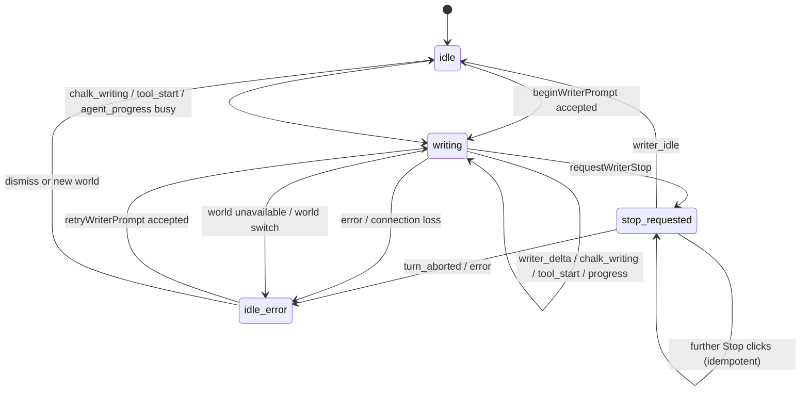

# A03 Chrome / attention / writer public state

> 状态：设计阶段冻结稿（不实现代码）  
> 归属：AIRP UX 舞台统一批次 A03  
> 一句话定位：把所有外壳、注意力、作家忙闲、停止请求与错误回退收敛到一条可见且可恢复的状态链；停止入口独立常驻，writer dock 内不再有第二个 Stop writing。

## 1. 权威契约与边界

本篇服从 [`docs/ux/00-共同上下文.md`](./00-共同上下文.md) §2–§4，尤其是：Theatre Depth 的 `chrome` / `dialogue` 语义、`useWorld` 是唯一 WS 消费点（§4.5–§4.6）、公开 Agent state 单一投影（§4.6）、事实先于演出（§4.4），以及 Effects / Reduced motion 优先级（§4.7）。跨模块引用如下：

- `docs/components/00-共同上下文.md`：appearance 只决定实体外观；Chrome 不复用 appearance ID、不得覆盖实体 verified token。
- `docs/layout/00-共同上下文.md` §5：`attention` 不是 Chalk 拖拽权限；`isGodHandOpen` / `allowChalkDrag` 独立，phantom 永远不可拖。
- `docs/perform/00-共同上下文.md` §2.2、§4–§8：`useWorld.ts` 是唯一 WS 消费点，`writer-state.ts` 是作家 `idle ⇄ writing` 归属，`tool_start/tool_end` 忙计数服务 footprint，帧载荷不在本篇重定义。
- `docs/nook/00-共同上下文.md` §3.4、§5：Nook 由 App 持有 active projection，复用 `LayerState` 与 Canvas，不开第二个 `useWorld` / WS。
- `docs/doc-06-演出与交互设计.md:1-23`：WriterResult 在右上角且随 chrome 隐藏；Stop writing 在运行期间右下角独立显示；实际结束依赖后端状态；Agents、Voice、Effects 的公开承诺。

本篇**不重新定义 WS 帧 payload、事件 type、动作层权限、CSS 数值或 `cards` / appearance / footprint 形状**。实现只消费既有 `writer_delta`、`chalk_writing`、`writer_message`、`writer_idle`、`tool_start`、`tool_end`、`agent_progress`、`error`、`turn_aborted` 等帧；若上位契约改变帧形状，必须先修订上位文档。

## 2. 现状盘点（证据与差异）

### 2.1 App inline Chrome

`App.tsx:77` 只有 `Attention = 'ambient' | 'authoring'`；`App.tsx:109-124` 另外持有 `shelf`、`attention`、`isGodHandOpen`、`shell`、背包/角色/弹窗状态。`App.tsx:180` 用 `chromeVisible = !shell.immersive`，但 CSS 才真正控制多数投影者。

现有 inline 投影者及 owner：

| 投影者 | 现状落点 | 当前行为 / 差异 |
|---|---|---|
| Header、面包屑、语言、freeze、Agents、Voice、Mute、Effects | `App.tsx:587-604`；`.prototype-worldtop` / `.prototype-chrome` | `shell.header` 打开；`Effects` 是 App 的 localStorage 状态（`App.tsx:117-122`），其余按钮各自持有局部 UI。桌面有足够空间，移动端横向滚动（`scene-shell.css:150-158`）。|
| Journal / story shell | `App.tsx:522-544` | `shell.journal` 打开左侧叙事栏；`ui-shell.mjs:1-7` 的 `transitionShell` 保证打开 header/journal 会退出 immersive。|
| Edge controls / immersion | `App.tsx:606-612` | `Tab` 与按钮都可切 shell；现有 `.is-immersive .prototype-chrome` 会把普通 chrome `visibility:hidden`（`prototype.css:100-115`），沉浸时恢复依赖 Tab。|
| Scene metadata / WriterResult | `App.tsx:613-619` | WriterResult 嵌在 `world-meta`，按 doc-06 需在 `writer_idle` 后显示一条，随 chrome 一起隐藏。|
| hand tray、belongings、player profile、residents | `App.tsx:627-685` | 是 Canvas 上的纸面 chrome；背包内容由 App 状态控制，profile 有独立展开状态；行动入口切 `attention=authoring`。|
| authoring panel / God Hand | `App.tsx:713-718` | 和 writer action 共用 `attention=authoring` 的可见区域，但拖 Chalk 的真实许可是独立 `isGodHandOpen`（`App.tsx:110-111`）。|
| writer action toggle | `App.tsx:686` | 既是行动入口又是 attention 切换器；忙时展示 App 自己的 `writerWorking`，形成第二份 busy 事实。|
| independent Stop writing | `App.tsx:688-690`；`scene-shell.css:185-186` | 正确地脱离 `.prototype-chrome`，所以沉浸和 dock 隐藏时仍可见；但它由 App `writerWorking` 驱动，且只设置本地 `writerStopRequested`。|
| writer dock | `App.tsx:691-711`；`.prototype-dock` `prototype.css:460-517` | 只在 `.is-authoring` 显示（`prototype.css:110-115`）；dock 内当前又有一个 `Stop writing`（`App.tsx:699`），与独立入口重复。|
| toast / world loading | `App.tsx:723-765` | toast `role=status`，错误常以字符串显示；世界加载是 screen-fixed，层级高于普通 chrome。|

### 2.2 `components/chrome/*`、RightSidebar 与 WriterBar

- `WriterBar` 的职责是可复用的非空单行输入：`WriterBar.tsx:15-24` 的 props，`WriterBar.tsx:33-42` 本地 text，`WriterBar.tsx:34-35` 读取 `useWriterPhase()` 并锁输入。它目前不是 App 主 dock 的实现；唯一现有调用是 `NookView.tsx:410` 的禁用回退 `[推断：全仓调用搜索未发现其它 JSX 调用]`。两个输入实现因此会产生不同 busy / submit 行为。
- `RightSidebar` 的组件实现仍是独立的旧 Adapter：`RightSidebar.tsx:6-25` 定义背包、人物与四类 callback，`RightSidebar.tsx:38-66` 持有 tab，`RightSidebar.tsx:69-109` 渲染拖拽背包，`RightSidebar.tsx:113-187` 渲染 Navigate / Chat / Follow / Nook。它未在 `App.tsx` JSX 中出现 `[推断：全仓搜索只找到声明文件与文档引用]`；App 现在用 `prototype-hand-tray`、`prototype-belongings`、`prototype-residents` 直接投影（`App.tsx:627-685`）。这不是两份世界数据，但确实是两套 Chrome 入口 Adapter，后续必须删除未挂载的旧 Adapter，而不是让它继续漂移。
- `WorldShelf` 不是 inline shelf：`WorldShelf.tsx:5-8` 从 App 接受 `shelf/loading` 与 callback，`WorldShelf.tsx:15-21` 自己安装 outside/Escape listener，`WorldShelf.tsx:23-31` 自己持有删除 `busy/message`，`WorldShelf.tsx:33-58` 是 modal-like directory。App 的 `worldPickerOpen` 在 `App.tsx:125-130` 持有，并于 `App.tsx:724-726` 挂载。
- `StubPrompt` 明确不是 `WriterBar`：其约束见 `StubPrompt.tsx:4-8`，因为空提交是初始化语义；A03 不把它并入作家 dock。
- `Minimap`、`HintBar`、`LayerBadge`、`CompassRose` 属于 chrome 视觉零件，但本篇只规定其可见性由同一 `shell.immersive` 投影，不能单独另造 attention。

### 2.3 Agents / Voice / Effects

- `AgentSettings` 每次轮询 `/api/agent-settings`（`AgentSettings.tsx:16-31`），目前把 `data.progress.writer` 再合成为 `airp:agent-frame`（`:20-25`）；这会绕过唯一 WS ingress，必须删除。面板的模型选择、保存与忙时禁止切换仍保留（`:38-64`），但其 `status.busy` 只能作为服务端设置响应，不再成为公开作家 busy 的事实源。
- `TtsSettings` 是 Voice 与连接的局部 dialog：`TtsSettings.tsx:6-20` 持有 open/notice/config/error，并监听 `airp:tts-unavailable`；`:21-40` 通过 portal 投影设置与可见 unavailable notice。文本对话必须不依赖 Voice 可用；Voice 错误不改变 writer phase。
- `MuteButton` 通过 `useAudio` 单例读写静音（`MuteButton.tsx:10-23`；`useAudio.ts:19-68`），不应复制到 Agents 或 Writer state。
- Effects 由 `App.tsx:117-122` 持久化为 `airp:effects`；Canvas 把它传给背景、粒子、parallax（`Canvas.tsx:88-113,531-584`），`SceneBackdrop` 在关闭或 `document.hidden` 时暂停视频（`SceneBackdrop.tsx:56-67`）。A03 只规定它是用户偏好 owner，不让 writer busy 或 attention 改写它；最终演出优先级仍取 `docs/ux/00 §4.7` 更保守者。

### 2.4 多份 busy 的问题清单

现在至少存在四个可被 UI 解释为“作家忙”的地方：

1. App `writerWorking`（`App.tsx:132-155`），并监听 `airp:agent-frame`；
2. `writer-state` module（`writer-state.ts:13-54`），`WriterBar` 直接读；
3. `useWorld` `writerToolsInFlight`（`useWorld.ts:143-146,411-427`），footprint scheduler 读 `isBusy`（`:300-303`）；
4. AgentSettings 的 `status.busy` 与自造 `agent_progress`（`AgentSettings.tsx:20-27,50-63`）。

这四者**不再允许并存为四个事实**。设计保留一个 `writer-state` 公开投影；tool count 是同一投影内给 footprint 的派生维度，不是第二个 writer busy。AgentSettings 只能显示该 projection 的 phase/stage；App 不再有 `writerWorking` / `writerStopRequested` / `writerStage` / `writerElapsed` state；WriterResult 不再自行监听帧。

## 3. 统一 Module / Interface / Ownership

### 3.1 唯一公开投影

**Module：`apps/web/src/lib/writer-state.ts`（既有模块，A03 owner）。** 在不改变 WS 载荷的前提下，扩展为唯一的 `WriterPublicState` projection。以下是内部接口形状，不是新 WS 帧：

```ts
// NEW internal projection; not sent over WS.
interface WriterPublicState {
  phase: 'idle' | 'writing';
  reason: 'turn' | 'chalk' | null;
  stopRequested: boolean;
  stage: string | null;
  startedAt: number | null;
  toolCount: number;                 // footprint 派生所需，同一事实的计数维度
  error: { message: string; retryable: boolean } | null;
  lastPrompt: string | null;          // retry 复用既有 writer_prompt
  lastMessage: string | null;         // writer_message；WriterResult 的正文投影
  completionSeq: number;              // idle/error/abort 每次终结递增
}

interface WriterStateAdapter {
  acceptWriterFrame(frame: Record<string, unknown>): void;
  beginWriterPrompt(prompt: string): boolean;
  requestWriterStop(): boolean;
  retryWriterPrompt(): string | null;
  resetForReconnect(reason: 'socket_open' | 'socket_close' | 'world_change'): void;
  getWriterPublicState(): WriterPublicState;
  subscribeWriterState(listener: () => void): () => void;
}

`getWriterPublicState` / `subscribeWriterState` 是 WriterBar、action toggle、Stop control、Agents summary、WriterResult 的唯一读取面。`resetForReconnect` 是 perform/01 `ws.onopen` 与断线清理可调用的唯一 reset seam；现有 `beginTurn/endTurn/reset`（`writer-state.ts:29-39`）不得再作为模块外的第二套写入入口。它们只能在 UX03 adapter 内部收束逻辑中被调用，调用方不能各自 set 一个 busy。

`toolCount > 0` 仅用于 footprint 的稳定窗口；`phase` 仍从已接受的 writer turn 到 `writer_idle`（或明确错误/断线）表达公开 busy。这样 `tool_start` 间有空窗时 UI 不会误报 idle，tool count 也不会被解释成另一个“作家状态”。

### 3.2 Owner 表

| 状态 / 事实 | 唯一 owner | 消费者 | 不允许 |
|---|---|---|---|
| `shell.header/journal/immersive` | App + `ui-shell.mjs` 的 transition Adapter | inline chrome、CSS class、focus coordinator | 任一子组件自己改 shell；用 attention 代替 immersive |
| `attention` (`ambient/authoring`) | App | authoring panel、writer dock 的显隐意图 | 推导 God Hand 权限；推导 writer busy |
| Chalk 编辑权限 | App `isGodHandOpen` → Canvas `allowChalkDrag` | Canvas | 从 `attention` 或 writer phase 推导 |
| active focus / modal stack | App 的 focus coordinator（NEW） | Header、WorldShelf、Bag、CharacterModal、Nook | 多个 document-level Escape listener 争抢关闭顺序 |
| writer `phase/reason/stage/stop/error/lastMessage/completionSeq` | `writer-state.ts` | App chrome、WriterBar、WriterResult、Agents summary | App local state、组件自行监听 WS |
| writer `toolCount` | `writer-state.ts`，由 useWorld ingress 更新 | footprint scheduler | 独立 `writerToolsInFlight` ref |
| WS ingress / frame 去重 | `useWorld.ts:onMessage`（`useWorld.ts:353-553`） | `writer-state.acceptWriterFrame`，其余专属 projection | AgentSettings 合成帧、App 另开 listener、第二个 WS |
| last prompt / retry | `writer-state.ts`（由 `beginWriterPrompt` 记录） | 独立 Stop control、dock input | 把 retry 当新帧或新 payload |
| world shelf data/loading | App (`shelf/loadingWorld`) | `WorldShelf` | Shelf 自己读取 world 或关闭 active world |
| shelf selection/delete busy | WorldShelf 局部 | WorldShelf dialog | 把删除 busy 当 writer busy |
| Voice enabled/config/notice | `tts-readiness.ts` + TtsSettings | Voice dialog、CharacterModal 的 voice seam | 让 Voice 错误阻断文字对话 |
| mute | `useAudio` / `audio.ts` singleton | MuteButton | 在 App 再存一份 muted |
| Effects preference | App localStorage key `airp:effects` | Canvas、SceneBackdrop、ParticleLayer、PerformanceLayer、CharacterModal | 用 writer/attention 隐式开关 |
| entity action request busy | `EntityInteractions` local `busy`（`EntityInteractions.tsx:18-22,67-73`） | action fieldset / local “Working…” | 把单个 HTTP action busy 当 writer phase |

### 3.3 单一装配路径（Seam / Adapter / Leverage / Locality）

- **Seam：`useWorld → writer-state`。** `useWorld.ts:onMessage` 保留唯一 `airp:agent-frame` 原始投影前的入口，但 writer 相关 case 必须直接调用 `acceptWriterFrame(msg)`；不要再让 App 通过 window 事件二次判断。`useWorld` 的 `case 'tool_start'/'tool_end'` 仍由同一 ingress 更新 `toolCount`，并把该值暴露给 footprint scheduler 的 `isBusy`。
`writerLocked = phase === 'writing'` 是派生值，不是存储值；世界冻结或 modal focus 不能偷偷改写 writer phase，分别由对应的 Chrome/focus Module 表达。App 只保留 `writerRef`、history 与输入 draft 的交互局部状态。
- **Seam：`writer-state → WriterBar / WriterResult / Agents`。** WriterBar 只负责 text input 与 submit；WriterResult 只消费 `lastMessage + completionSeq`；AgentSettings 只消费 phase/stage/elapsed 的摘要，不再 dispatch `airp:agent-frame`。这消除三份重复 Adapter，同时保留每个 Module 的 Locality。
- **Seam：`App → EntityInteractions`。** `EntityInteractions` 的 `onChoice` 继续提交动作描述；App 的 `onEntityAction` 不再 `setWriterWorking(true)`，而调用 `world.sendToWriter` 这一条 writer prompt seam。该调用必须返回“已接受 / 未接受”的明确结果；只有 accepted 才由 `beginWriterPrompt` 开始一次 turn。单实体 action 的 `busy` 仍是自己的 HTTP feedback。
```ts
// NEW public action seam; no WS payload.
type WriterPromptAcceptance =
  | { accepted: true; requestId: string }
  | { accepted: false; code: 'socket_closed' | 'writer_busy' | 'invalid_prompt'; message: string };
sendToWriter(prompt: string): WriterPromptAcceptance;
```

`sendToWriter` 只在 socket open、输入合法且 writer phase 可接受时返回 `accepted:true`；调用方不得先 set busy 或清 draft。发送失败必须返回 `accepted:false`，由 Chrome 公开错误并保留输入。
- **Seam：`App → WorldShelf`。** App 继续拥有 shelf data、active world、loadingWorld；WorldShelf 只管理选择、删除确认、dialog focus。打开 shelf 先把 focus owner 设为 `world-shelf`，关闭后还原触发按钮或 workspace。
- **Seam：`App → NookView`。** `nookChar` 仍由 App 持有；NookView 只拥有自己的取数/error/empty state。Nook 不读 `useWorld`，其 Canvas 投影与 App 的 active writer projection 共用 Stop control，不造第二个 writer bar。

## 4. Chrome visibility、focus 与 attention 契约

### 4.1 Visibility 状态

| 状态 | 进入 | 可见 | 输入规则 | 退出 |
|---|---|---|---|---|
| `ambient` | 初始、完成世界加载、Esc 清瞬态 | Canvas + 可见的必要 world meta；普通 dock 可收起 | canvas inspect/act/enter/present 正常 | action toggle、Enter、Tab、打开 shell |
| `authoring` | action toggle 或全局 Enter（非输入控件） | ambient 内容 + writer dock + authoring panel | dock 输入可聚焦；God Hand 是否开由 `isGodHandOpen` 独立决定 | action toggle、authoring Close、Esc（先清焦点/面板） |
| `immersive` | Tab 或 immersion toggle | Canvas + **正在写作的独立 Stop control**；不隐藏 active modal 的必要 close | Tab 恢复 shell；Escape 按 focus stack 返回，不应误进 layer | Tab、immersion toggle |
| `modal:<owner>` | WorldShelf / BagItemDialog / profile / CharacterModal / Nook | 当前 modal 与必要的独立 Stop；底层仅作 aria-hidden/inert 投影 | modal 取得 focus，Escape 只关闭 topmost | Close、Escape、操作完成 |

`chromeVisible` 只能是 `!shell.immersive` 的样式派生；不能用它决定世界数据、writer phase 或是否能 Stop。WriterResult 随 ordinary chrome 隐藏（doc-06），Stop control 不属于 `.prototype-chrome`，因此在 immersive、journal、Header 收起、dock 收起时仍能停止。

**漏接后果：** immersive 把 Stop 一起隐藏时，长 turn 无法中止；modal 关闭后 Escape 继续穿透到 layer 会造成意外返回；把 modal 内容留在可访问树会使读屏用户同时听到底层 Canvas 和 dialog。

### 4.2 Focus / attention

Focus coordinator（`App.tsx` 内 NEW 的局部 Adapter，或同等单一 owner）只维护一个 `FocusOwner`：`workspace | writer | journal | world-shelf | belongings | profile | character-dialogue | nook`。子组件可以报告打开/关闭，但不安装彼此无序的全局 Escape 处理。

1. 用户点击 action toggle 或按 Enter：若不在 input/textarea/select/button/link/contenteditable，设置 `attention=authoring`、退出 immersive、将 focus 交给 writer input。
2. 用户在 writer input 内按 Escape：先清 input focus / close authoring（实现需选择一种固定可测顺序），不得立即离开 layer；Stop writing 不是 Escape 的别名。
3. `GodModeToolbar` 的开关只改 `isGodHandOpen`；attention 只表达当前写作/authoring chrome。离开 authoring 时关闭 God Hand，防止不可见编辑权限残留（layout/03 §4.1）。
4. focus 进入 WorldShelf、BagItemDialog、CharacterModal、Nook 后，底层 Canvas 设置 `inert` 或等价不可达状态；关闭只恢复触发入口焦点。
5. modal stack 的 Escape 顺序为：topmost dialog → bag/profile/popover → Nook → shell（journal/header/immersive）→ parent layer；一次按键最多退一层。

现状 `App.tsx:317-353` 的 Escape 会同时清 `activeCharacter/bagOpen/profileOpen/worldPickerOpen`，且 `WorldShelf.tsx:15-21` 又装一份 capture listener；这是要修的 focus seam，不是新增动作语义。

### 4.3 Desktop / mobile projection

- **Desktop 1440×960：** Header、world meta、右侧 residents、底部 hand tray、action toggle、dock、独立 Stop 均可同时看见且不覆盖 `dialogue`；Stop 至少有文字 “Stop writing” 与 elapsed，dock 只保留阶段摘要，不再有按钮。
- **Desktop narrow 1180×960：** 依照 `prototype.css:703-707` 隐藏低优先级 item count、压缩 dock；Agents / Voice / Effects 仍通过 Header 可键盘到达。Stop 不因 header overflow 消失。
- **Mobile 390×844：** Header 横向滚动但不能把 close/Stop 滚出可达区域；`scene-shell.css:150-170` 的 metadata、hand tray、player orb、action toggle、dock 采用 safe-area 与独立 hit target。dock 可只显示 input + send + stage；Stop 仍是独立 fixed target，不能由 dock 的 overflow 裁剪。Nook 的返回按钮与 CharacterModal close 必须在同一可见层。
- 三档均要求正文/控件对比度与 focus-visible ring 合规；不以缩小字号解决重叠。具体 CSS 数值留实现期截图校准。

## 5. Writer public state 状态机



`stop_requested` 是公开状态的附加维度，不是新的 WS phase：UI 显示 “Stop requested”，但在 `turn_aborted` / `writer_idle` / 明确 error 前，`phase` 仍是 `writing`，输入继续禁用。Stop click 只沿既有 `sendMessage({ type: 'writer_abort' })`（当前 `App.tsx:688-690`）发送一次；不 fake idle、不清 phantom、不播放成功反馈。无 socket 时立刻进入 retryable error 并给玩家可见文案。

行为顺序与漏接后果：

1. **接受 prompt**：`sendToWriter` 确认 socket OPEN 后记录 `lastPrompt` 并 begin projection；否则不锁死输入，显示 “Connection lost. Please try again.”。漏掉 accepted guard 会让输入假装已排队。
2. **接收公开进度/工具帧**：唯一 ingress 更新 `stage/startedAt/toolCount`；`writer_delta` 只喂既有 phantom（perform/layout 契约）。漏掉任何一个 case 会让 footprint 与 UI 对 busy 分裂。
3. **Stop requested**：projection 设置 stopRequested，独立 Stop 变为 pending 文案；不结束 phase。漏掉 pending 区分会让玩家误以为已取消，随后落板仍会造成“幽灵成功”。
4. **真实终止**：`writer_idle`、`turn_aborted`、writer `error` 由 ingress 清 phase；成功只在 `writer_idle` 后由 WriterResult 显示最后一条公开 `writer_message`。漏掉终止会永久禁用 writer；错误误走 idle 会掩盖 retry。
5. **错误 / retry**：保留 `error.retryable` 与 `lastPrompt`，显示错误摘要和唯一 Retry；Retry 复用现有 `writer_prompt` 发送路径，不新增 WS payload。不可重试错误只允许 dismiss / 新 prompt。
6. **重连 / 世界不可用**：socket close 或 `airp:world-unavailable` 必须 release input lock、保留可见 retryable error，并让 world shelf 成为 topmost；重连由 `useWorld` 既有 1.2s loop（`useWorld.ts:556-570`）恢复后重新读取层。漏掉 release 会复现 `writer_idle` 丢失导致的永久锁（`writer-state.ts:7-9`）。
7. **世界切换 / Nook 切换**：清除 WriterResult，停止当前 chrome 的局部展示；若后端仍有 turn，Stop 仍是唯一独立入口，不能把旧层 `writer_message` 显示在新层。漏掉 world key 清理会串台。

### 5.1 独立 Stop writing 与 dock 的处理

**保留** `App.tsx:688-690` 对应的独立 Stop control，迁移其状态读取到 writer-state，并标记稳定的 accessible name / `data-writer-stop`。它必须：

- 只在 `phase='writing'` 显示，且不依赖 `attention`、`shell.immersive`、dock 展开或 chrome visible；
- 发送一次 abort；重复点击幂等，显示 `Stop requested`；
- `turn_aborted` / error 后替换为 Retry（只在 `retryable` 时），否则显示可 dismiss 错误；
- 不调用 `endTurn`、不撤 phantom、不删除真实文件；这些由既有事件顺序处理。

**删除** `App.tsx:699` dock-row 内的 Stop button 及其 Adapter。dock 内保留 `role=status` 的阶段、elapsed 与 input；busy 时 input disabled，提交不会排队。这样桌面与移动均只有一个停止动作、一个状态标签和一个 retry 入口。删除验收见 §8.2。

## 6. WriterResult、Agents、Voice、Effects 的可见语义

### 6.1 WriterResult

`WriterResult` 继续是 `world-meta` 下单条公开回执（`App.tsx:618`），最多三行、7 秒淡出、随 ordinary chrome 隐藏；不把 reasoning、tool args、临时 Chalk 湿墨写进回执。它不再监听 `airp:agent-frame`（当前 `WriterResult.tsx:7-29` 的 listener 删除），改读 `writer-state.lastMessage + completionSeq`。新 turn 开始、切 layer、切 world 时清空；无 `writer_message` 只显示 “Your action has been processed.”，不声称落板。

### 6.2 Agents

Agents 面板提供模型、thinking 档位与公开 stage；`status.busy` 不再拥有 UI busy。面板摘要必须读 writer-state，因而与 action toggle、dock、Stop 使用同一 phase。模型保存在 `/api/agent-settings` 的既有路径，忙时禁止切换；错误是 panel 内 `role=alert`，不冒充 writer turn error。

`AgentSettings.tsx:20-25` 的 synthetic `airp:agent-frame` 必删；删除后唯一公开进度来自 `useWorld` WS ingress。若 REST polling 与 WS 暂时不同步，以 writer-state 为 Chrome 真相，并显示 “status reconnecting” 而不是再造一个 busy。

若继续实现 `agent-awareness` 的 activity rail，它是 writer-state 的只读 **Adapter**：仅投影同一 `phase/stage/toolCount` 的公开阶段，不持有 `busy`、`startedAt`、终止计数或第二份 retry；activity 的完成/失败展示不得改变 WriterResult 或 Stop 状态。这样“活动胶囊”与 writer dock 同源，不会重新建立一套 writer lifecycle。

### 6.3 Voice

Voice button / dialog 可在 Header 内打开；`airp:tts-unavailable` 只投影到 `TtsSettings` notice（`TtsSettings.tsx:17-26`），不改变 writer phase、Stop 或文字 Character dialogue。Escape 关闭 Voice dialog 后回到 Header trigger；点击 notice 的 Settings 只打开 dialog，不重启 world。

### 6.4 Effects 与 audio

Effects switch 仍是 App owner 的显式用户偏好；关闭时只停止 ambient dust/parallax/循环背景，关键事实反馈依照 `docs/ux/00 §4.7` 保留低动量版本。`document.hidden` 或 reduced motion 不能让 Stop、错误、retry、focus ring 消失。Mute 是 audio singleton 的唯一事实，BGM / ambient 的切换不改变 Chrome visibility。

## 7. EntityInteractions 与动作接缝

`EntityInteractions.tsx:16-23` 的 `busy/error/feedback` 是某一个 HTTP choice / dice / move / use-item 请求的局部 Adapter；`:67-96` 的 `run` 防重入并显示 `Working…` / error。它不能写 writer-state。

- `inspect`（Look closer）只显示/请求当前实体，不把 writer phase 设为 busy，除非其 onChoice 明确发送 writer prompt；
- `act` 的 choice / dice / use-item 先等动作层结果，成功/失败反馈遵守 `docs/ux/00 §4.4`；`onEntityAction` 若要请 writer 解释，经过唯一 `sendToWriter` seam，禁止 App 先 local set busy；
- `enter` 只调用既有 `enterLayer`，不得因为 attention/Writer dock 开启而改变双击门语义；
- `present` 继续由 `airpGateway.useItem` 与 EntityInteractions 的局部错误显示承担；它不会占用 Writer Stop 控件；
`dialogue` 拥有 focus 时，底层 Canvas 的 dice/radial enter 请求由 Chrome admission 拒绝并显示可见 notice；关闭 dialogue 后才重新允许 performance action。该 admission 由 A03 提供，不能用渲染顺序或 z-index 猜测。
### 7.1 Overlay admission owner

```ts
type OverlayKind = 'dice' | 'radial' | 'dialogue';
type AdmissionResult =
  | { accepted: true; token: string }
  | { accepted: false; code: 'dialogue_focused' | 'nook_projection' | 'world_unavailable'; message: string };
interface OverlayAdmission {
  request(kind: OverlayKind, caller: FocusOwner): AdmissionResult;
  release(token: string): void;
}
```

`OverlayAdmission` 是 A03 的 App-owned internal seam；`dialogue` focus 时拒绝底层 dice/radial，Nook projection 时拒绝 radial creator，释放只允许 token owner 一次。`DiceCeremony`、`RadialMenu`、CharacterModal 都先 request，不能依赖 DOM 顺序；`apps/web/test/overlay-admission.test.mjs`（NEW）必须覆盖每种拒绝、释放幂等与 Escape topmost。

- `data-no-drag` 与 Chalk / phantom 规则保持 layout/perform 契约，Chrome projection 不改变 pointer-events。

**漏接后果：** 若 EntityInteractions 把自身 `busy` 冒充 writer busy，玩家会在普通 HTTP 选择时看到 Stop；若 App 先设 busy 再发现 socket 关闭，会出现不可重试的假 turn；若错误只写 console，玩家会失去返回现场的路径。

## 8. 错误边界与“重复 Adapter 删除”验收

### 8.1 错误边界

| 边界 | 玩家可见结果 | 允许的回退 |
|---|---|---|
| WS JSON 畸形 | useWorld 现有 parse error 记录；writer projection 不变或进入可重试 connection error | 不显示伪造回复，不崩 Canvas |
| writer error / turn_aborted | Stop pending 结束，phase release；显示摘要 + Retry（若可重试） | 保留真实已落文件；不播放成功演出 |
| abort 发送失败 | 不声称已停止；显示 connection error + Retry | 继续显示当前 phase 或由连接重置释放锁，取既有 reconnect 纪律 |
| `writer_idle` 丢帧 / socket close | 释放输入锁并显示 connection retry | `reset` 必须可重复，不增加另一 busy ref |
| world 409 / no active world | 清空旧 canvas/角色/背包、打开 WorldShelf | shelf 可单独重取，不因正文失败消失（doc-06:5） |
| `/api/agent-settings` 失败 | Agents `role=alert`，模型信息可暂缺 | 不改变 writer phase |
| TTS unavailable | Voice notice；文字 dialogue 保持可用 | 静态头像 / 文本回退 |
| Effects off / reduced motion / hidden | 停非必要循环，保留低动量关键反馈 | 不隐藏 Stop、Retry、错误、焦点 |
| modal / Escape 竞态 | 只关闭 topmost，一次一层 | 不误返回 layer、不重复 `character_stop` |

### 8.2 删除测试（必须证明旧 Adapter 已不存在）

测试不验证源码格式，而验证“删除旧入口后仍有唯一可达行为”。建议落点：`apps/web/test/chrome-state.test.mjs`（NEW）与已有 Web smoke harness；实现阶段不写本篇代码。

1. **唯一 Stop DOM：** writer busy fixture 注入后，查询整页 `[data-writer-stop]` 计数必须为 `1`；`.prototype-dock` 内 Stop 查询为 `0`。没有删除 dock Adapter 的实现必须失败。
2. **独立可见：** 同一 fixture 依次置 `attention=ambient`、`shell.immersive=true`、dock hidden，Stop 仍有一个可见、可聚焦、accessible name 为 Stop writing；没有把 Stop 从 `.prototype-chrome` 移出的实现必须失败。
3. **Abort 幂等：** 连点独立 Stop 两次只产生一次 `{type:'writer_abort'}`；直到 terminal frame 到达，projection 仍 `phase='writing'` 且 `stopRequested=true`。
4. **单一 busy 非空性：** 在 `agent_progress busy=true`、`tool_start`、`writer_delta`、`chalk_writing` 的交错矩阵中，`WriterBar`、dock、action toggle、Stop 与 Agents summary 的 phase 必须逐次相等；删除 App `writerWorking` / `writerToolsInFlight` 独立事实前，这条用例应在至少一组错序输入下失败。
5. **Agent synthetic Adapter 删除：** 轮询 AgentSettings response 不得触发 `airp:agent-frame`；注入同一 progress 的 WS frame 只能让 writer-state 变更一次。否则会出现重复 startedAt、elapsed 跳变或一次 turn 被清空两次。
6. **WriterResult 单一消费：** 一个 `writer_message` + `writer_idle` 只产生一条回执；重复 raw window listener 或旧 WriterResult listener 必须让计数测试失败。
7. **WriterBar 与 App dock 一致：** 同一 projection busy 时两种输入均 disabled；idle 后均恢复；Nook empty state 的 disabled `WriterBar` 不得成为第三个作家入口。
8. **Legacy sidebar Adapter 删除：** production App bundle / rendered tree 不得导入或挂载 `components/sidebar/RightSidebar.tsx`；背包、角色、Nook 各入口只能在 App inline Chrome 出现一次。保留旧 Adapter 或其隐式入口的实现必须失败。
9. **Escape topmost：** 同时打开 profile + WorldShelf + CharacterModal 的 fixture，每次 Escape 只减少一层，不能一次清三个状态或进 parent layer；此测试会暴露 `App.tsx:317-353` 与 `WorldShelf.tsx:15-21` 的重复 listener。
10. **world switch / retry：** old world 的 `writer_message` 不得显示在新 world；Stop/Retry 仍只使用同一 lastPrompt，不能把旧 turn 当成功。

### 8.3 键盘与读屏验收

- Tab 顺序：shell toggle → Header controls → canvas focusable entity → hand/bag/player → action toggle → writer input/send →独立 Stop（busy 时）→ modal controls；immersive 仍有可恢复入口（Tab 或明确按钮）。
- Enter：普通非输入上下文聚焦 writer；输入框 Enter 只提交非空文本；IME composition 时不截获；busy 时 Enter 不排队、不触发 Stop。
- Escape：按 §4.2 topmost 顺序，一次只关一层；Stop requested 不因 Escape 被伪装成 idle。
- 独立 Stop：`button`，accessible name 在 writing / requested / retry 三态分别可读；`role=status` 阶段更新不抢焦点；错误用 `role=alert`，Retry 可直接到达。
- shell：journal/header/immersive toggle 有 `aria-expanded` 或等价状态；隐藏投影者不可进入读屏树（`inert` / `aria-hidden` 与实际可见同步）。
- Agents：按钮报告 Connecting / Ready / stage；面板错误 `role=alert`；Voice unavailable 只读到 Voice notice；Effects 使用 `role=switch` 与 `aria-checked`（现有 `App.tsx:602`）。
- Canvas entity：`EntityInteractions` 的 Working / feedback / error 保持局部 `role=status/alert`，不与 writer Stop 的状态混读。

### 8.4 浏览器截图矩阵

每格都要保存截图并同时记录 active focus、可见 owner、Stop DOM 计数与读屏树摘要：

| 视口 / 场景 | 必须证明 |
|---|---|
| 1440×960，ambient idle | Header 收起入口、world meta、hand tray、action toggle 与 Canvas 层级清楚；无 dock Stop |
| 1440×960，authoring writing | dock 显示输入与 stage；屏幕只出现一个独立 Stop；WriterResult 尚未提前出现 |
| 1440×960，immersive writing | 普通 chrome 隐藏，但 Stop 可见可聚焦；Canvas 不被 Stop 遮挡中心交互 |
| 1180×960，Agents open + writer busy | Agents stage 与 dock / action phase 相同；模型 Apply disabled；不出现第二 busy 文案冲突 |
| 390×844，idle | Header 横向控件、action、bag、player orb、dock 可达；无横向裁剪导致的隐藏 close |
| 390×844，writing + stop requested | 独立 Stop 在 safe-area 内；dock 没有第二 Stop；requested 文案与 aria 状态一致 |
| 390×844，WorldShelf open | shelf modal 可滚动，关闭按钮与 Escape 可达，底层 Canvas 不进入读屏顺序 |
| 390×844，Nook + CharacterModal close path | Nook active projection 只有一个 Canvas；返回与 Escape 恢复原 layer/camera，不开第二 WS |
| 任意视口，error → retry | 错误可见、Retry 可达；Retry 后 phase/busy 同一 projection，未伪造成功回执 |
| 任意视口，Effects off / reduced motion / hidden tab | 非必要背景/粒子/视频停止；Stop、错误、Retry、焦点环和低动量事实反馈仍存在 |

## 9. 代码落点（精确 Module / Symbol）

| 文件 / 符号 | 设计动作 | 所属 |
|---|---|---|
| `apps/web/src/lib/writer-state.ts` `WriterPhase`、`beginTurn/endTurn/reset` | 收敛为 `WriterPublicState` 唯一 projection；旧函数改为模块私有收束 helper，不再导出为第二套入口；新增 signatures 见 §3.1 | A03 |
| `apps/web/src/state/useWorld.ts` `onMessage`、`tool_start/tool_end`、`connect` | 唯一 ingest；移除独立 `writerToolsInFlight`，footprint 改读同 projection 的 toolCount；重连/错误进入 canonical reset | A03 与 perform/01 seam |
| `apps/web/src/App.tsx` state `writerWorking` 等、`submitWriter`、`onEntityAction`、writer action/Stop/dock JSX、Escape effect | 删除重复 writer state；submit/action 经过唯一 send seam；保留独立 Stop、删除 dock Stop；接入 focus coordinator；保持 `isGodHandOpen` 独立 | A03 |
| `apps/web/src/components/chrome/WriterBar.tsx` `useWriterPhase` / submit | 只读 canonical projection；保留非空输入语义，不新增 Stop | A03 |
| `apps/web/src/components/WriterResult.tsx` effect | 删除 raw `airp:agent-frame` listener，改读 projection 的 `lastMessage + completionSeq` | A03 |
| `apps/web/src/components/AgentSettings.tsx` poll effect | 删除 synthetic `airp:agent-frame` dispatch；busy/stage 读 projection，REST 只供模型/配置 | A03 |
| `apps/web/src/components/WorldShelf.tsx` document listeners | 交给 App focus stack；保留 dialog-local delete busy，不重复关闭 layer | A03 |
| `apps/web/src/components/sidebar/RightSidebar.tsx` 整个未挂载 Adapter | 删除或明确迁移到 App inline Chrome；不再保留第二套 backpack/character/Nook入口 | A03 / cleanup |
| `apps/web/src/components/narrative/EntityInteractions.tsx` `run` / callbacks | 保持局部 HTTP busy，writer 请求经过 App → useWorld seam | 与动作语义篇 Seam |
| `apps/web/src/lib/ui-shell.mjs` `transitionShell` | 复用现有 shell transition；不得新增同义 shell reducer | A03 |
| `apps/web/src/scene-shell.css` / `prototype.css` Stop、dock、responsive rules | 实现期只校准 visibility/focus/desktop/mobile，不在设计阶段写 CSS | A03 + visual grammar |

## 10. 发现的冲突 / 需要修订上位文档

1. `docs/ux/00-共同上下文.md:128-133` 要求公开 Agent frame 单一投影，但现状 App、WriterResult、AgentSettings 均直接监听/派发 `airp:agent-frame`（`App.tsx:143-158`、`WriterResult.tsx:7-29`、`AgentSettings.tsx:20-25`）。本篇建议由 `useWorld → writer-state` 统一；主 agent 在评审后回写该路径与其它 UX 篇，不能由 A03 私自改 00。
2. `docs/perform/00-共同上下文.md:185-186` 与 footprint/perform 子文档已按 UX03 回写：`writerToolsInFlight` 只保留现状证据，toolCount/phase 是唯一 projection；实现前仍需删除源码第二 ref。
3. `docs/agent-awareness/03-前端感知演出设计.md:5,344` 已回写：activity rail 与 writer progress 可并存，但都消费 UX03 canonical projection；不得拥有第二 busy/stop/stage/elapsed 事实。
4. `docs/doc-06-演出与交互设计.md:7` 要求独立 Stop 且保留重试；现状 `App.tsx:699` 又在 dock 内重复 Stop。A03 认领删除 dock 入口，保留唯一独立 Stop；doc-06 无需改变语义，但应回写“dock 不含 Stop”。
5. `docs/layout/00-共同上下文.md:61` 与 `docs/layout/03-Chalk交互锁与上帝模式.md:13,72` 已指出 attention 不是 God Hand 权限；A03 保持这一边界。若任意后续设计用 `attention` 计算 `allowChalkDrag`，需退回评审。
6. `docs/nook/00-共同上下文.md:123-126` 要求单 active projection；现状 App 仍让 Nook 作为 fixed overlay 挂在 Canvas 外（`App.tsx:758`），而其空态可能渲染自己的 Canvas（`NookView.tsx:379-391`）。这不是 A03 重做 Nook，但截图验收必须证明同一时刻只有 Nook active projection 可交互，且 Stop 仍走全局 projection。

## 11. 仍未知待拍板

1. `writer-state` 的 error 是否在 toast、独立 Stop 区域或两者同时显示；本篇要求至少独立 Stop / Retry 与 `role=alert` 可见，具体视觉合并由 visual grammar 评审。
2. socket close 时是立即显示 Retryable error，还是先短暂 “Reconnecting…”（不改变 input release 与 Stop 可见）；需以真实断线截图校准。
3. focus 在 writer input 内按 Escape 的固定动作是只收起 authoring，还是先 blur 再保留 dock；必须在实现前选定一条并做键盘测试。
4. retry 是否保留原 prompt 的完整文本（只保存在内存，不进事件/日志/WS 新字段）；本篇假定保留最后一条手动提交，超出 world switch 即清除。
5. Agents REST `status.busy=true` 而 WS projection idle 的异常文案；本篇禁止恢复第二 busy 源，具体采用“reconnecting”还是“status stale”待拍板。
6. RightSidebar 删除时是否连同其未使用 CSS / i18n callback 一并清理；只能在确认无 import、无插件入口后删除，不可把用户仍在使用的 Adapter 当死代码。
7. Desktop Stop 与 mobile safe-area 的最终位置、z-index token 属 visual grammar / Theatre Depth 评审；A03 只冻结可见性与唯一性。

## 12. 完成判据

- 独立 Stop 在 busy、immersive、dock hidden、mobile 四种场景都唯一可见；dock 内 Stop DOM 计数为零。
- `writer-state` 是唯一公开 writer phase / stop / error / `lastMessage` / `completionSeq` owner；App `writerWorking`、`writerStopRequested`、`writerStage`、`writerElapsed` 与 useWorld 独立 busy ref、AgentSettings synthetic frame、WriterResult raw listener 均删除。
- useWorld 仍是唯一 WS ingress；WS payload 与既有 phantom、world event、Nook、EntityInteractions 形状不变。
- `writer_idle` 之前不 fake idle；abort 失败、error、断线均有可见且可重试路径；成功回执只在公开终止顺序后出现。
- EntityInteractions 局部 HTTP busy 不触发 Stop；God Hand 许可不由 attention 推导；Nook 不开启第二 WS / writer projection。
- 1440×960、1180×960、390×844 的截图与键盘/读屏矩阵通过；Reduced motion、Effects off、页面隐藏不抹掉关键事实反馈。
