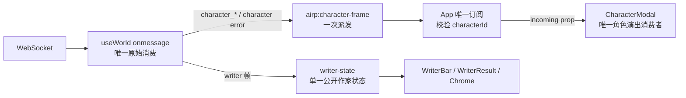

# 06 Agent 演出状态与角色剧场（A04 + A08）

> Module owner：`UXAgentTheatre06`；本篇只拥有角色帧归属与 dialogue theatre，不拥有 pi-rp 协议、Nook 数据形状或 TTS provider。
> 状态：**核心已落地 / 部分接线 / 仍有缺口**（2026-09-14）。角色帧 typed relay/FIFO、CharacterModal queue 消费、writer-state canonical projection、TTS/portrait 生命周期与 Camera/Nook 接缝已有实现；组件 Escape、active marker 覆盖、Nook PerformanceLayer 与完整浏览器回放仍未闭环。
> 
> **一句话定位：** 角色帧只沿一条 `useWorld → App → CharacterModal` 归属路径进入剧场；`App` 是唯一角色帧路由者，`CharacterModal` 只消费 `incoming`，作家公开忙闲由 `writer-state` 单一投影提供，TTS、情绪、分页和退场都不能另开第二个状态源。

> 角色栏布局引用已冻结为 `docs/presence/00 §4.2.1`：CharacterRail 在上、Bag 在下；本文不恢复旧右侧双 tab。

### 当前状态

#### 已落地

| 范围 | 当前实现与证据 | 验收证据 |
|---|---|---|
| 角色帧单一路径 | `apps/web/src/state/useWorld.ts:559-617` 校验角色帧并派发 typed relay；`apps/web/src/App.tsx:401-420` 按 active id 路由；Modal 通过 `CharacterFrameQueue` 消费（`CharacterModal.tsx:701-711`）。 | `apps/web/test/character-frame-queue.test.mjs:26-109` 覆盖 FIFO、barrier、缺序、缺 ID 与非法帧。 |
| Writer canonical 状态 | `apps/web/src/lib/writer-state.ts:13-31,139-220` 提供唯一 writer snapshot；App/WriterBar/AgentSettings 读取同一投影。 | `apps/web/test/writer-state.test.mjs:20-84` 覆盖 busy、终止、retry、重连。 |
| 分页、语音与相机接缝 | `CharacterModal.tsx:701-737` 队列 pump/输入门；`audio.ts:946-1042` stinger/voice hidden gate；`App.tsx:766-826` 角色关闭恢复 CameraMemoryStack。 | `apps/web/test/voice-engine.test.mjs:20-52`、`apps/web/test/camera-memory-stack.test.mjs:35-50` 提供聚焦证据。 |

#### 尚未闭环

| 缺口 | 当前证据与下一步 |
|---|---|
| 组件内 Escape / focus 事务 | `DeclaredActionDialog.tsx:126-151`、`PhotoDetailDialog.tsx:47-89`、`GateThreshold.tsx:10-20` 各自处理 Escape，尚未纳入 App focus coordinator；需保证 topmost 一次只退一层。 |
| App/Canvas marker 覆盖 | `App.tsx:857-888`、`NookView.tsx:423-432` 有 marker/inert，但 `CharacterModal.tsx:784-791` 没有 projection marker；dialogue/Nook 过渡需浏览器断言 marker 恰一个。[推断] |
| Nook 演出层缺口 | `NookView.tsx:549-567` 只挂 Canvas，未挂 `PerformanceLayer`；Nook 内角色对话可接入，但 show/性能演出不能宣称同构。 |
| CharacterRail/Bag 布局证据 | 只引用 `docs/presence/00 §4.2.1` 的“角色栏上、背包下”冻结口径；本篇不再使用 RightSidebar 双 tab 作为实现目标。 |


## 1. 权威文档与边界

本篇必须同时服从：

- `docs/ux/00-共同上下文.md` §2、§4.2、§4.4、§4.5、§4.6、§4.7：Depth、事实先于演出、active projection、公开 Agent frame 单一路径、音画与 Reduced motion 优先级。
- `docs/wiring/00-共同上下文.md` §3–§7：角色身份 `characterId`、`airp:character-frame`、请求体和不可信台词处理。
- `docs/perform/00-共同上下文.md` §4、§6b、§8b：演出帧与世界事件分离、声音落点、角色/作家帧不能进入世界事实路径。
- `docs/tts/00-共同上下文.md` §1、§5、§6–§8、§10：一行一页、`playVoice` 独立通道、TTS 预取和失败降级。
- `docs/tts/03-遮罩分页与演出.md` §2–§4：`dialogue-pages.ts`、页状态机、mock greeting、输入时机。
- `docs/nook/00-共同上下文.md` §3.4、§3.5、§6：Nook 入口、`characters/<id>` 投影与同一 active projection。
- `docs/doc-06-演出与交互设计.md` §3.0–§3.5：角色单击进特写、画布压暗而不消失、退出后揭示世界后果。

**非目标：** 不修改 pi-rp 协议、不新增 WS 帧名、不设计角色记忆、不把 TTS 或对话页写入 events、不重定义 `components` 的 appearance/尺寸登记、不重定义 `layout` 的 seat/footprint/phantom。

## 2. Module / Interface / Implementation / Depth

### 2.1 Module 归属

| Module | 唯一职责 | 不得做的事 |
|---|---|---|
| `useWorld` 的 WS `onmessage` | 唯一原始 WS 消费点；识别帧并只派发一个公开接缝 | 不开第二个 WebSocket；不按当前角色在 hook 内过滤；不让同一角色帧同时进入两个 UI 事件 |
| `App` | 唯一角色帧订阅者与 `characterId` 路由器；保存 `activeModalFrame` | 不计算 dialogue phase/page/emotion；不把角色帧再广播给 Modal |
| `CharacterModal` | 只消费 `incoming` prop；把已归属帧投影为页、表情、声音和输入门。**L2 追加**：另投影**通话模式**（模式切换 + 字幕 + 挂断 + 错误告警），其数据来自 `live-call-store.ts` 的全局单例，**不是** `incoming` | 不监听 `window` 的 `airp:agent-frame` / `airp:character-frame`（通话字幕走 store，非本地监听）；不再保留第二个 `receivedFrame` 入方向；**不得直接 `fetch('/api/live/*')`**——通话请求归 `live-call-store.ts`（`docs/live-voice/10 §8` 反模式 2） |
| `writer-state.ts` | 作家公开 `idle ⇄ writing` 与进度/最终公开回执的唯一读源 | `App`、`WriterBar`、`WriterResult` 不再从原始帧自行猜 phase |
| `dialogue-pages.ts` | 角色分页、`[emo]` 清洗、节拍和边界的纯函数 | 不按标点另切页，不持有 React、WS、音频副作用 |
| `audio.ts` / `/api/tts` | 语音通道及其 HTTP 预取；语音不触碰主轨 | 不把 TTS 变成 WS 帧，不伪造失败音频 |
| `NookView` / `useWorld` | Nook 的独立 Adapter 与同一 world 事件接缝 | Nook 不调用 `useWorld()`，不拥有第二个 WS/相机/active projection |

### 2.2 Theatre Depth

- `dialogue`：角色特写、对话纸和读焦点，覆盖 `performance` 与 `entity` 的视觉注意力。
- `performance`：仍由既有演出层承载 writer/phantom/show；角色直聊不能把 dialogue phase 写入 `PerformanceLayer`。
- `chrome`：作家公开状态、Stop writing、错误通知；不从角色页的 `phase` 推断作家忙闲。
- 背景与 `stage` 必须保留为压暗/虚化后的连续环境。打开角色不是换到黑色新页面；关闭后相机记忆恢复。

具体 stacking 仍由 `docs/ux/02-舞台Depth与演出归属.md` 统一实现；本篇不添加 z-index。

## 3. 单一帧归属与去重路径

### 3.1 冻结路径



**冻结规则：**

1. `apps/web/src/state/useWorld.ts:559-617` 的角色帧分支先校验 `source/characterId/text`，仅派发 `airp:character-frame`；writer 帧由 `useWorld.ts:478-481` 进入 `writer-state`，不再使用通用角色旁路。
2. `apps/web/src/App.tsx:401-420` 是 `airp:character-frame` 的唯一订阅者与 identity router；匹配 active id 后写入共享 `CharacterFrameQueue`，不再向 `window` 二次派发。
3. `apps/web/src/components/overlay/CharacterModal.tsx:160-168,701-711` 只订阅/消费 queue；旧 `receivedFrame` 与 `airp:agent-frame` listener 已不存在，`queueVersion` 只负责 pump 重渲染。
4. App 不把角色帧传给 `WriterResult`，Modal 不读取 writer 帧；`apps/web/src/lib/writer-state.ts:139-220` 是作家公开状态 Module，`WriterBar`/App/AgentSettings 读同一快照。
5. `apps/web/src/components/AgentSettings.tsx:33-87` 的 REST 轮询只更新配置/模型，writer 摘要读取 `useWriterState`；不再合成 `airp:agent-frame`。

**漏接后果：**

- 保留通用 `airp:agent-frame`：同一帧同时推进 Modal 与 App/其它监听器，TTS、stinger、页游标可能各播一次。
- App 和 Modal 都过滤 `characterId`：不同角色帧在不同闭包中得出不同结果，多角色会出现串台。
- Modal 继续自己监听 WS 事件：关闭/重开时旧 listener 与新 `incoming` 并存，旧角色台词会在新角色遮罩中开场。
- UI 自己从 `writer_delta` 猜 busy：`writer_delta` 可能在 `chalk_writing` 前到达（`docs/perform/00 §6b`），Chrome 会先显示错误的 idle/writing。

### 3.2 `characterId` 缺失与不匹配

本篇采用 `docs/ux/00 §4.6` 的严格规则：**缺少 `characterId` 或与 `activeCharacter.id` 不匹配的帧，必须丢弃，不得灌入当前 Modal。**

| 输入 | App 行为 | 玩家可见结果 |
|---|---|---|
| `characterId === activeCharacter.id` | 接受；复制为新的 `activeModalFrame` | 当前角色继续演出 |
| `characterId` 缺失 | 丢弃；向 `airp:notice` 投递本地化错误 | “This character reply could not be assigned. Reopen the dialogue.”，不显示未知台词 |
| `characterId` 为另一个角色 | 丢弃；记录角色 ID 与当前 active ID 的诊断信息，并投递可见 notice | 当前角色纸面不变化，玩家知道帧未归属 |
| 没有 active character | 丢弃；不创建隐形 Modal | notice 只在可帮助玩家恢复时显示，不能自动打开角色 |
| 合法角色 `error` | 按同样身份校验后交给 Modal，显示错误页并释放 busy | 错误文案可见，不伪装成角色台词 |
| writer `error` 或无角色 ID 的 `error` | 进入 writer-state/Chrome，不进角色 Modal | 作家区域显示失败与重试路径 |

`airp:notice` 已有 App 接收点 `App.tsx:226-230`；不能只 `console.warn`。旧 wiring 规则中“无 `characterId` 时按当前单角色遮罩兜底”（`docs/wiring/00-共同上下文.md:82-84`、`docs/wiring/03-角色流式.md:25-27,103-110`）与 UX 冻结严格丢弃规则冲突，见 §11，需上位文档裁决后回写。

## 4. Interface：作家与角色公开状态

### 4.1 Writer public state（引用 A03，不重复定义）

`docs/ux/03-Chrome与公开状态.md §3.1–§3.3` 是 `writer-state.ts` 公开投影、字段、写入入口与消费者的唯一 owner。本篇只声明角色剧场对它的依赖：`CharacterModal` 不读取 writer-state；`WriterBar`、App action toggle、Stop control、`WriterResult` 与 Agents summary 只读 `getWriterPublicState()` / `subscribeWriterState()`，不从原始 `airp:agent-frame` 自行判断 phase。

`useWorld.ts:onMessage` 是唯一 WS ingress，并按 UX03 §3.1 调用既有 canonical writer-state ingress；`AgentSettings` 不合成 `airp:agent-frame`。本篇不新增 WriterPublicState 字段、函数签名或第二个 Adapter；writer 的 `phase/reason/stage/stop/error/lastMessage/completionSeq/toolCount` 形状、`acceptWriterFrame`、`beginWriterPrompt`、`requestWriterStop`、重连 reset 与 retry 规则全部回指 UX03。

### 4.2 CharacterFrame

沿用 `CharacterModal.tsx:63-68` 的 `CharacterFrame` 值域，不改 pi-rp 与 WS 帧名：

- `character_delta`：`characterId?`、`delta`、`timestamp?`；
- `character_message`：`characterId?`、`text`、`timestamp?`；
- `character_idle`：`characterId?`、`timestamp?`；
- 角色 `error`：`source`、`characterId?`、`message`、`timestamp?`。

`characterId?` 是协议兼容的入站形状，不是 UX 接受条件；经过 App 路由后，进入 Modal 的帧必须已经证明 ID 存在且等于 active character。Modal 不负责身份校验。

帧路由必须保留有序 `CharacterFrameQueue`（NEW，内部 Adapter；不改变 WS/`CharacterFrame` 协议形状）：同一角色的多个 `character_delta` 逐帧 FIFO 入队，不能只写一个 latest snapshot 后互相覆盖。一个 WS/事件循环 burst 中到达的 delta 必须按到达顺序连续 append，Modal 的 pump 逐项 drain，不能因 React render 合并而丢中间片段。`character_message` 是权威封口屏障：先 drain 已排队 delta，再以 message 文本校正；`character_idle` 只有在队列耗尽后才能允许 `done`。

`CharacterFrameQueue` 的内部 envelope 可带 **NEW `deliverySeq`**（由唯一 ingress 生成，非 WS 字段）；若测试/上游 Adapter 明确提供 `seq`，重复 seq 必须去重，timestamp 只能作诊断或同一 envelope 的辅助元数据，不能单独拿来去重。已观察到的序号出现 gap 时进入可见 `airp:notice`/错误页并停止静默拼接。没有任何序号的旧帧不能凭 timestamp 猜序：记录“sequence unavailable”诊断，但仍按到达顺序演出。缺序验收必须用带 gap 的 envelope fixture，不能只测两条连续 delta。
`apps/web/src/lib/character-frame-queue.ts`（NEW）是 queue 的唯一 owner，位置在 App 的 `characterId` identity router 之后、CharacterModal 之前；`useWorld` 只派发原始 `airp:character-frame`，App router 丢弃缺失/不匹配 ID 后才 enqueue。最小内部形状：

```ts
interface CharacterFrameQueue {
  enqueue(frame: CharacterFrame, deliverySeq: number | null): void;
  drainUntil(kind: 'character_message' | 'character_idle'): CharacterFrame[];
  peek(): CharacterFrame | null;
  clear(reason: 'close' | 'stop' | 'gap' | 'layer-change'): void;
  subscribe(listener: () => void): () => void;
}
```

`deliverySeq` 由唯一 ingress 递增；`enqueue` 只接受 active character；`drainUntil` 先返回所有 delta，再返回 message/idle barrier；`gap` 会返回可见错误并清空当前 queue。CharacterModal 只订阅 queue，不保存第二个 incoming/latest frame。


## 5. Dialogue theatre 行为顺序

### 5.1 进入、空间与单角色 portrait slot

1. 玩家单击角色头像；入口仍是 `Canvas` 的 `onOpenCharacterModal`（`App.tsx:570-574`）或人物 tray 的 `openCharacter`（`:627-640`），不是第二个聊天协议。
2. `openCharacter` 先把当前 active projection push 到 `CameraMemoryStack` 的 `dialogue:<characterId>:<callerSlot>` frame，清空 `activeModalFrame`，再设置 active character 与发送 `character_start`（`App.tsx:486-497`）。这保证新 Modal 不先消费上一人的末帧，也不覆盖 layer/Nook caller slot。
3. dialogue overlay 位于 `dialogue` Depth；背景画布压暗/虚化但保留可读轮廓，角色立绘锚定在人物位置的注意力语法由 CSS/Depth Module 实现。
4. 单角色时保留两格 theatre anatomy：一个 `portrait-slot` 明确 `aria-hidden` 为空，另一个 `portrait-slot lit` 显示角色（当前 DOM 证据 `CharacterModal.tsx:719-747`）。空 slot 不是第二个角色、不是 phantom、不可点击、不可生成 silhouette；它只保持左右分屏的稳定几何，避免单角色与双角色切换造成纸面跳动。
5. `avatar` 缺失或加载失败时，不把 lit slot 变空：使用既有 `portrait-fallback` monogram（`CharacterModal.tsx:698-743`）；有 emotion still 时优先 still，否则 `MotionPortrait`/poster。`effectsEnabled`、页面不可见和 reduced motion 由全局优先级裁决，不能靠 slot 自己绕过。
6. Nook 入口是纸面对话区的独立按钮，不是空 portrait slot 的点击语义。当前落点 `CharacterModal.tsx:750-754` 的 `onOpenNook` 只发意图给 App-owned `openNook` transition；由 A05 `CameraMemoryStack` 完成 dialogue pop、caller slot restore 与 `nookChar` 切换，Modal 不直接 `camera.save/restore`，也不直接 fetch `/api/nook`。

**漏接后果：** 空 slot 若可点击会出现“对着影子聊天”；缺头像若把 slot 清空会失去角色身份；先打开 Nook 再关 Modal 会同时存在两个 active projection，WS、footprint 和相机互相覆盖。

### 5.2 phase 规则

`CharacterModal` 的本地 phase 仍为 `idle → thinking → streaming → done`（现有值域 `CharacterModal.tsx:82-83`）。它是角色纸面 Module 的局部演出状态，不是 writer public state。

| 阶段 | 进入条件 | 可见行为 | 输入/声音 |
|---|---|---|---|
| `idle` | 首次挂载、上一轮关闭后 | 空纸或 mock greeting；保留背景连续性 | 不可发新 prompt，语音为空 |
| `thinking` | `handleSend` 或真实首帧前 | 立绘为 thinking、显示“正在思考”提示 | input disabled；不播 stinger/TTS |
| `streaming` | 首个 `character_delta` 或非流式 `character_message` | 当前页逐字出字；`\n` 封口后可翻页 | 当前页可 `stopVoice → playVoice`；未完成可点击快进 |
| `done` | `character_message`/`character_idle` 已到、末页封口、末页逐字完成且玩家已翻到末页 | 输入纸条淡入；最后一页保留 | 最后一页 voice 可自然结束；发送新 turn 先 stop |

`character_idle` 只有在有文本时负责封口并等待 `settleIfDrained`；纯工具轮无文本时恢复上一阶段并保留上一页，不把纸面清空（`CharacterModal.tsx:599-613`）。

### 5.3 page 规则

`dialogue-pages.ts` 是唯一分页 Adapter：

- `parseEmoPages` 只认 `\n`，空行丢弃，未闭合末行 `sealed=false`，`final=true` 才封口（`dialogue-pages.ts:40-82`）。
- 一行就是一页；没有换行就是一页；不按句号/逗号补切；超长单行由 `.line-stage` 的 `max-height`/滚动承载（`index.css:526-530`）。
- `pageIndex` 必须通过 `clampPageIndex` 保持在 `[0, pages.length - 1]`（`dialogue-pages.ts:91-95`）。
- 页面进入的唯一动作点是 **NEW `enterPage(index, options)`**（现有实现逻辑落在 `CharacterModal.tsx` 的 callback）；它依次重置页内游标、切 mood、停止旧 voice、决定新 voice、起 `pump`。
- 点击 `.line-stage`：未出完 → 快进当前页；已出完且不是末页 → 下一页；末页已出完 → 不越界、不重复触发。
- 空格推进；Enter 保留给 input 发送；点击 Nook/关闭/输入区不算纸面推进。

漏了 `final` 封口会永远停在 streaming；按标点兜底会把模型意图和多语言边界切坏；让 input 在 `pageIndex` 尚未到末页时启用会丢掉未读页。

### 5.4 emotion、voice 与 stinger

1. `parseEmoTag` 清除行首合法 `[emo: normal|smile|shock|sad|angry|thinking]`；无标签继承上一页 emotion；非法标签不泄漏到纸上，落到 `normal`（`dialogue-pages.ts:32-38,61-79`）。
2. `thinking` 只表示等待，不触发 stinger；进入一页时切换 `emo`，六情绪 still 优先，缺资产回退单 portrait。
3. 页封口即预取 `POST /api/tts`，请求 `{ text, voice?, language? }`，不把 `[emo]` 发送到 TTS；页成为当前页时调用 `playVoice(url)`。
4. 翻页/关闭/新 turn 先 `stopVoice()`，再决定是否播新页；`audio.ts:925-952` 的 voice channel 独占、不可 loop、不碰 ambient/bgm/theme。
5. `voiceState === 'ready'` 且已发出 `playVoice` 时**不播 stinger**；TTS 无配置、请求失败、decode 失败或该页无 voice 时，保留一次 emotion stinger。`playStinger` 在 AudioContext 未 running 时 drop，不排队（`audio.ts:873-884`）；遮罩首个 pointerdown 必须沿用 `unlock`，否则首句可能静默（`docs/tts/00 §11`）。
6. TTS 失败不得阻塞文字页、不得伪造音频、不得重试风暴；失败页显示文字并可播 stinger，一次 warning 只作诊断，玩家可见状态仍由页与错误文案承担。

## 6. 角色帧真实序列、错帧与终结

### 6.1 正常多页序列

| 顺序 | 入站/本地动作 | 归属与可见结果 |
|---|---|---|
| 1 | `character_start`（出站） | App 发送 `characterId`；Modal `thinking`，无旧页 |
| 2 | `character_delta(characterId=nanami, delta='[emo: smile]…')` | useWorld 一次派发；App 接受；Modal 丢标签、进入第 1 页、逐字出字 |
| 3 | 后续 delta 含 `\n` | 第 1 页封口并预取 TTS；第 2 页仍可增长 |
| 4 | 玩家点击纸面 | 当前页未完先快进；完整后 `stopVoice` 后进第 2 页并播放 ready voice |
| 5 | `character_message(text=完整正文)` | 权威覆盖；若 delta 丢失则直接建立完整页；不丢文字 |
| 6 | `character_idle` | 封末页、逐字追平、玩家已到末页后 `done`，input 才 enabled |
| 7 | 关闭/新 prompt | stop voice、取消 timer/watchdog、发送 stop 或新 prompt；不把关闭当作成功 |

### 6.2 错帧、缺帧、停止

- **错角色帧：** active `nanami` 时收到 `sumi`，App 丢弃并 notice；绝不由 Modal 以自身 `characterId` 再过滤一次。
- **缺 ID：** 即使世界当前只有一个角色，也丢弃并 notice；不能“猜当前角色”。
- **delta 缺失但有 `character_message`：** message 是权威救援帧，直接建立最终页并继续 TTS/分页，不依赖 delta 已出现。
- **只收到 delta，没有 message/idle：** watchdog 最终生成诚实的沉默错误页/可恢复状态，不把半句标成 `done`；不启用输入。
- **重复 effect：** 同一 `incoming` identity 由 `consumedFrameRef` 消费一次；不同帧即使 `text` 相同也必须按真实序列处理。
- **玩家 Stop/关闭：** `character_stop` 只是出站请求；Modal 立即停止 voice/timer、进入 closing，等待关闭动画后 `setActiveCharacter(null)` 并由 App transition Adapter pop 当前 dialogue frame。后端是否真正停止不由前端伪造。
- **世界在对话期间改变：** `world_event`/`file_changed` 仍由 useWorld 唯一消费并重取；Modal 不复制世界 items。关闭后数据投影揭示新卡/新 Chalk，不能用临时 DOM 假装成功。

## 7. Nook 入口与相机连续性

### 7.1 入口矩阵

| 入口 | 语义 | Adapter | 禁止 |
|---|---|---|---|
| 画布单击角色 | 进入 dialogue theatre | `App.openCharacter` | 不进入 Nook，不先打开独立聊天页 |
| Modal “Visit private space” | 离开 dialogue，进入该角色 Nook | `App.onOpenNook` → `NookView(characterId)` | 不由 Modal 自己调用 `/api/nook` |
| App inline Chrome 的 Nook 入口 | 从上方 `CharacterRail` 的角色行私密空间按钮进入 Nook | `App.tsx` CharacterRail → `openNook(char.id)`（`App.tsx:1049-1062`） | 不保留 `RightSidebar.tsx` 旧 Adapter，不让 Nook entry 分裂 |
| Nook close | 返回进入前 layer | App-owned `closeNook` pop `CameraMemoryStack` → restore caller slot + `refresh` | 不创建第二相机/第二 WS |

### 7.2 过渡顺序

- dialogue → Nook：停止 voice 和 dialogue timer → 发送 `character_stop`（若仍 active）→ 调用 App-owned `closeDialogue` pop `dialogue:<characterId>:<callerSlot>` → 调用 `openNook` push/restore Nook frame → `setActiveCharacter(null)` / 设置 `nookChar` → 渲染 Nook。Modal 与 NookView 不直接操作 camera；当前 `App.tsx:753-758` 仅是现状落点，必须收敛到 A05 transition Adapter。
- Nook 是与 layer 并列的 active projection；`NookView` 复用 Canvas 外壳、独立 `GET /api/nook?character=<id>`，但不调用 `useWorld()`（`NookView.tsx:19-27`）。
- dialogue 关闭后返回 layer 时只恢复相机记忆，不把 character modal 的 portrait slot 或 page state 带入 Nook。
- **L2 已裁决为双向互斥**（`docs/live-voice/10 §4.2`）：本条的「nook 内互斥」保留，但**反向约束**不再是「本批不处理」——L2 定为：对话框通话中，nook 对**同一角色**显示挂断（由单例 store 自动成立，无需新守卫）；nook 对**其他角色**不阻挡（`10 §4.3` 的守卫放宽为 `sameCharacterOnCall`）。原「通话与角色对话遮罩会同时驱动同一个角色 agent」的担忧由 `10 §2.2` 冻结 1（换角色先 stop）兜底。

**漏接后果：** 同时挂 Modal 与 Nook 会出现两个交互 surface；直接在 Modal fetch 会制造第二个数据/加载/错误状态；未保存和恢复相机会让玩家失去“仍在原地”的连续性。

## 8. 文件落点、Seam、Adapter、Leverage、Locality

| 文件/符号 | 设计落点 | 类型 |
|---|---|---|
| `apps/web/src/state/useWorld.ts:onMessage`（`useWorld.ts:478-481,559-617`） | 唯一 WS dispatch；writer 进入 writer-state，角色帧校验后进 `airp:character-frame` | Seam / owner |
| `apps/web/src/App.tsx:onCharacterFrame`（`App.tsx:401-420`） | 唯一 `characterId` 校验与 queue enqueue | Interface / router |
| `apps/web/src/components/overlay/CharacterModal.tsx` | `CharacterFrameQueue` 订阅/消费（`CharacterModal.tsx:160-168,701-711`）；无 raw frame listener | Module |
| `apps/web/src/components/overlay/dialogue-pages.ts` | `parseEmoTag`、`parseEmoPages`、`charDelay`、`clampPageIndex`；不加网络/副作用 | Adapter / pure locality |
| `apps/web/src/lib/writer-state.ts` | 复用 UX03 唯一 `WriterState` projection（`writer-state.ts:139-220`）；本篇不新增字段 | Module / public projection |
| `apps/web/src/components/WriterResult.tsx` / `AgentSettings.tsx` | 均消费 canonical writer snapshot；AgentSettings REST 仅供配置/模型 | Consumer / Adapter |
| `apps/web/src/lib/audio.ts` | 复用 `playVoice` / `stopVoice` / `playStinger` / `unlock`；一次性声效已有 hidden gate（`audio.ts:943-1042`） | Leverage |
| `apps/server/src/routes/tts.ts` | TTS 合成、缓存、错误 code 的既有实现；本篇不改 | Seam |
| `apps/web/src/components/nook/NookView.tsx` | `/api/nook`、active projection、事件回写和空态（`NookView.tsx:217-236,423-567`）；尚无 PerformanceLayer | Adapter |
| `apps/web/src/App.tsx:251-273,766-826` | 当前 open/close Nook、dialogue 使用 CameraMemoryStack；marker/focus 边界仍需回放 | Orchestrator |

### 8.1 当前实现与设计目标的差异

| 现状证据 | 当前状态 | 尚未闭环 |
|---|---|---|
| `useWorld.ts:559-617` 的角色分流 | 已收窄为 source/id/text 校验后派发 `airp:character-frame`；缺 id/失配由 App `:401-420` 丢弃并 notice | 旧通用角色广播不再是当前实现差异。 |
| `CharacterModal.tsx:160-168,701-711` | queue 是唯一消费面，旧 `receivedFrame`/raw listener 已删除 | FIFO 与 gap 行为仍需浏览器端路由回放。 |
| `CharacterModal.tsx` 的 identity guard | queue 在 App 路由后接收 active id；Modal 仍以 `consumedFrameRef` 保护 StrictMode 重入 | 身份校验不应回到 Modal。 |
| `App.tsx:191-244` / `writer-state.ts:139-220` | writer busy/stage/elapsed 已由 canonical snapshot 提供，App 的 `writerWorking` 只是派生值 | 不再把派生变量误报为第二状态源。 |
| `dialogue-pages.ts` 与 CharacterModal frame pump | 分页、emotion、queue pump 已在用（`CharacterModal.tsx:701-711`） | TTS 并发/取消仍是 §12 待拍板项。 |
| `audio.ts:943-1042` | stinger/voice 已有 hidden、mute、visibility epoch 与不排队门禁 | 主轨 ambient/BGM/theme hidden 策略仍未冻结（见 UX07）。 |
| `App.tsx:251-273,766-826` | Nook/dialogue open/close 已走 CameraMemoryStack | active marker 边界与 Nook PerformanceLayer 仍是缺口。 |
| `[推断]` 角色生产帧在所有部署都附带 `characterId` | 当前前端对缺失/失配严格丢弃；测试必须继续注入缺失/失配 fixture | 不以单角色模板替代契约证明。 |
## 9. 错误边界与失败可见性

1. **归属错误**：缺 ID、失配 ID、未知 `type` 不进入 Modal；缺/失配必须走 `airp:notice`。日志可附 `frame.type`、`characterId`、active ID，但日志不是唯一反馈。
2. **WS 重连**：`useWorld.ws.onopen/onclose` 重置 writer-state；角色 Modal 的 watchdog/timer 必须取消或进入可恢复错误，不保留旧 turn 的 busy。
3. **TTS 未配置/上游失败/超时/下载失败/decode 失败**：依 `docs/tts/00 §8` 显示文字、保留 emotion stinger（若没有 ready voice）、不重试半截缓存，不阻塞页翻完。
4. **角色 `error` 帧**：由 App 先做身份归属，Modal 一次落定错误页，跳过正常逐字演出；关闭/重试仍可用。
5. **Stop**：网络发送失败时仍显示可见 notice，并允许关闭/重试；不能把“Stop requested”写成 idle。
6. **Nook 404/空 README/初始化失败**：保留 Nook 空态/错误态，不能退回伪造的角色对白；`NookView` 的 `layer_initialized/layer_init_failed` 仍从 useWorld 事件接缝获得。
7. **Reduced motion / Effects off / hidden page**：不循环 portrait breath/视频，不削弱关键文字/状态；voice 仍按 TTS/用户静音策略单独裁决。全局规则与 appearance motion 取更保守者。

## 10. 测试矩阵与浏览器截图验收

### 10.1 单元/集成行为

| 用例 | 初始输入 | 必须断言（可观察契约） |
|---|---|---|
| 正常真实帧序列 | `nanami`: delta×2 → newline → message → idle | 仅一条 `incoming` 路径；页数/顺序正确；TTS 每页一次；最终 `done` 且 input 才启用 |
| 同内容合法重复 | 两个不同 delivery 的相同 `character_delta` | 两帧都按序消费，不用文本相等误去重 |
| burst delta 串联 | 同一 WS/event-loop burst 连续送入 delta `A`、`B`、`C` | `CharacterFrameQueue` FIFO 保留 `ABC`，React render/pump 不覆盖中间片段；逐字页文本与权威 message 一致 |
| 缺序帧可见失败 | queue envelope `deliverySeq=10` 后直接 `12`（或上游 seq gap） | 不静默拼接 `10+12`；当前页停止推进，`airp:notice`/错误页明确报告缺序并保留关闭/重试路径；连续 seq fixture 仍正常 |
| 重复序去重 | 同一 envelope `deliverySeq`/上游 seq 重发 | 只消费一次，不重复字符/TTS/stinger；不同 seq 但相同 delta 仍按两帧消费 |
| 缺序不可推断 | 旧帧只有 timestamp、无任何 seq | 不把 timestamp 猜成序号；记录 sequence-unavailable 诊断并按到达顺序演出，不能伪造“缺序”错误 |
| StrictMode 重入 | 同一 `CharacterFrame` identity 的 effect 执行两次 | `consumedFrameRef` 只推进一次 page/TTS/stinger |
| App/Modal 双消费回归 | 同一 WS 帧同时可见 `airp:character-frame` 与旧 `airp:agent-frame` fixture | 设计实现后旧通用路径无角色订阅；Modal 只由 prop 改变；无双倍字符、双 TTS、双 stinger |
| 多角色错帧 | active `nanami`，输入 `sumi` frame | Modal 纸面不变；notice 可见；不得污染 `lineRef` |
| 缺失 `characterId` | 单角色 active，frame 无 ID | **仍丢弃**；notice 可见；不能用单角色 fallback |
| Stop/关闭 | streaming 中点击 close / Stop writing | stopVoice、timer/watchdog 清理；显示 requested/错误；不伪造 idle；A05 `closeDialogue` pop 后回 caller slot |
| writer 公共状态 | tool_start → chalk_writing → writer_idle；canonical writer-state ingress 交错输入 | WriterBar、App dock、WriterResult 同一 UX03 snapshot；不因 writer_delta 先到而分叉 |
| delta 全丢 | 只给 `character_message(text)` → idle | 直接出现完整权威页；不永久 thinking；TTS 预取仍触发 |
| 缺 idle/message | 只给 delta，触发 watchdog | 不将半页标 done；出现诚实可见恢复/沉默错误状态 |
| 空行/无换行/长行 | `"a\n\n b"`、无 `\n`、超长单行 | 空行丢弃；无换行恰一页；长行不截断，`.line-stage` 可滚动 |
| emotion 继承/非法标签 | `[emo: smile] A\nB`、非法 `[emo:bogus]` | B 继承 smile；非法标签不泄漏，落 normal；stinger 不重复 |
| Nook 切换 | Modal 点击 Visit private space | Modal 先卸载；App `closeDialogue/openNook` 通过 `CameraMemoryStack` 完成 pop/push/restore；只有一个 active projection | 不直接调用固定 camera slot；不叠加 Modal/Nook |
| 空 portrait | 单角色、avatar 缺失、emotion still 缺失 | 一个 aria-hidden 空 slot；一个 lit fallback monogram；不生成幽灵/可点击假人 |

测试落点建议：`apps/web/test/dialogue-pages.test.mjs` **NEW**（若现有 `voice-engine.test.mjs` 继续承载，必须只增加行为断言）、`apps/web/test/agent-public-state.test.mjs` **NEW**、`apps/web/test/character-frame-routing.test.mjs` **NEW**；端到端 WS fixture 必须证明“没有本路径的旧双消费时会失败”，不能只断言页面最终有文字。

### 10.2 浏览器截图矩阵

用真实 Chromium，不以 `pnpm check:ws` “存在 case”代替视觉验收；每项记录 viewport、locale、Effects、页面可见性和截图路径。

| 编号 | viewport / 前置 | 场景 | 截图验收 |
|---|---|---|---|
| B1 | 1440×960，Effects on，`firstsnow` | 单击人物进 dialogue，收到两页正常帧 | 背景仍可辨；左 slot 空且不可感知为角色，右 slot lit；纸面页 1、`▼`、TTS/情绪不叠音 |
| B2 | 1440×960，双角色 | active nanami 时注入 sumi 错帧与缺 ID | nanami 纸面不串台；notice 文字可见；无旧台词闪现 |
| B3 | 1440×960，Effects off + reduced motion | emotion 切换、页翻、关闭 | 不循环呼吸/视频、不位移；文字、phase、输入 reveal 仍完整 |
| B4 | 390×844，日文 locale，长单行 | 无换行长台词、TTS pending/fail | 纸面滚动不截断；输入不会提前出现；失败没有假音频但仍可翻页 |
| B5 | 390×844，切到 Nook | 对话纸面点击 Visit private space，关闭 Nook | 不叠加 Modal/Nook；Nook 空态/内容可见；CameraMemoryStack 回到 caller projection slot |
| B6 | 1440×960，writer busy | canonical writer-state progress → chalk → idle / Stop | Stop writing 独立可见；busy 文案与 WriterResult 同一 UX03 snapshot；停止请求不提前显示 idle |
| B7 | 1440×960，页面隐藏再回来 | 正在 voice/portrait 动效时切换 tab | 装饰视频/呼吸暂停；回到页面不重播旧页、不重复 stinger；voice ownership 仍只一条 |
| B8 | 1440×960，缺 avatar | 单角色空 portrait slot + Nook 入口 | monogram fallback 保留 lit 身份；Nook button 独立于 line-stage，不误推进页面 |

## 11. 发现的冲突 / 需要修订上位文档

1. **缺失 `characterId` 规则已按 UX 严格丢弃。** `useWorld.ts:559-617` 与 `App.tsx:401-420` 都拒绝缺失/失配身份并发 notice；wiring 旧文档若仍允许单角色兜底，需由上位 owner 回写，前端不恢复 fallback。
2. **角色帧单一路径已接线。** `useWorld.ts:559-617` → `App.tsx:401-420` → `CharacterFrameQueue`；CharacterModal 无 raw `airp:agent-frame`/`airp:character-frame` listener（`CharacterModal.tsx:160-168,701-711`）。
3. **writer-state 已统一。** `writer-state.ts:139-220` 是公开投影，App `writerWorking` 仅派生 `phase`（`App.tsx:191-244`）；旧本地进度镜像/synthetic frame 描述已过时。
4. **CameraMemoryStack 已接线但 marker/focus 仍有边界。** `App.tsx:251-273,766-826` 负责 Nook/dialogue 事务；`App.tsx:857-888` 与 `NookView.tsx:423-432` 的 marker 覆盖仍需浏览器验证。
5. **单角色空 slot** 仍需使用通用角色语义；当前 DOM 在 `CharacterModal.tsx:799-821` 提供空 slot + lit portrait/fallback，不应再以旧注释名作身份规则。
6. **Nook parity 仍部分接线。** `NookView.tsx:549-567` 已透传动作/角色回调，但未挂 `PerformanceLayer`，且未共享 App-level ActionFeedbackStore。

## 12. 仍未知待拍板

- 缺 `characterId` 的历史帧统一采用“丢弃 + visible notice”；若旧世界需要迁移，服务端/event-bridge 在进入 `airp:character-frame` 前补齐 ID，前端不得恢复 active-modal fallback。`docs/wiring/00` 已按此回写。
- `docs/ux/03-Chrome与公开状态.md §3.1–§3.3` 的 canonical writer-state 已落地（`apps/web/src/lib/writer-state.ts:139-220`）；本篇未新增字段/入口。剩余是浏览器矩阵与跨 projection 证据，不是等待实现。
- 角色终结后若有延迟 `character_stop`/世界事件，退出揭示是等待事件、关闭后一次 `refresh`，还是两者取其一；需要真实 WS 时序确认。
- `airp:notice` 是否携带稳定 error code 供截图/自动化断言，或仅保留本地化文案；不影响本篇“必须玩家可见”的硬规则。
- TTS 页预取并发上限与取消请求机制尚未冻结；当前契约只冻结 voiceTurn token 丢弃旧结果，不冻结 AbortController。
