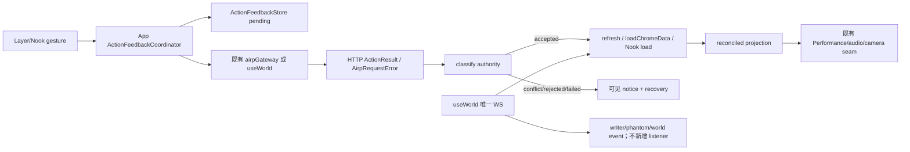

# UX16：动作反馈与权威结果设计

> Module owner：`UXActionFeedback16`
>
> 状态：设计阶段，待主代理评审；本篇只写设计，不修改实现。
>
> 范围：App / Nook 的 `use-item`、物件 `move`、`take`、`choice`、`enter` 以及画布卡片位置移动的统一动作反馈；定义从意图、请求、权威结果、reconcile 到演出的跨端闭环。
>
> 非目标：不改动作层领域规则、事件枚举、WS payload、`LayerState`/Nook payload、`useWorld` 的第二 WS，不把反馈 store 变成世界状态源，不重新设计 Writer、DiceCeremony、FocusOwner 或 PerformanceLayer 的所有权。

## 一句话定位

**UX16 把 App 与 Nook 的每个可执行动作接入同一个 `ActionFeedback` 入口：先登记可取消的 pending，再接受动作层的真实 details 或结构化错误，按现有世界投影完成 reconcile，最后才把允许的成功演出交给现有声画入口；Nook 不得拥有另一套动作结果真相。**

## 用户预期

玩家完成任一入口后，第一眼能回答三件事：现在处于什么阶段、动作层依据是什么、下一步能做什么。

- 按下选择、拖物品或双击门后，先看到明确的进行中状态；请求未返回前，不出现“已解锁”“已进入”“已放置”等成功语义。
- 动作层接受后，玩家能看到真实结果；结果若需要重取文件或层 payload，界面暂时显示“已确认，正在同步”，而不是把 HTTP 200 当成世界已更新。
- `accepted`、`rejected`、`conflict`、`failed` 四类结果可区分；失败或冲突不吞掉，原卡片/物品仍有返回、重读或重试路径。
- 成功专属的 `unlock`、`gate-open`、相机穿越、成功 burst、成功 stinger 只在权威结果成立且 reconcile 完成后发生。
- App layer 与 Nook 的相同动作显示相同阶段、错误口径、去重行为和重试规则；Nook 不因使用 `/api/nook` 数据而退化为只能观看。

## 权威层级（不可被本篇改写）

按 `docs/ux/15-下一批共同上下文.md:33-43` 与 `docs/ux/00-共同上下文.md:18-29`：

1. 世界文件、实体 frontmatter 和动作层权威结果；
2. 共享协议与冻结契约（含本批 `15` 及对应领域 `00`）；
3. 服务端 HTTP/WS 接线；
4. 前端 store、reconcile 和公开状态；
5. 演出层、音频、动画和装饰反馈。

因此：事件、文件和动作层 details 能证明世界事实；HTTP 200、组件挂载、Canvas 拖到目标、toast、`chalk_landed` 或生成的媒体文件都不能单独证明动作成功。`docs/ux/15-下一批共同上下文.md:45-67` 还冻结了唯一入口、五类动作反馈状态和“accepted + reconcile 后才演出”。

## 现状证据

> 下列行号依据本次读取的工作树；实现合并后必须按符号重新核对并回写本篇。源码中不存在 `apps/web/src/hooks/use-world.ts`；实际 hook 位于 `apps/web/src/state/useWorld.ts`，见“发现的冲突”。

### App 当前动作入口

| 入口 / 语义 | 当前源码证据 | 当前风险 |
|---|---|---|
| 物品拖到实体（`present/use_item_on`） | `apps/web/src/App.tsx:801-807` 的 `handleItemDrop` 直接 `airpGateway.useItem(itemPath, targetPath)`，随后 `refresh()`；`apps/web/src/App.tsx:962` 接到 layer 与 Nook Canvas | 丢弃 `UseItemOnDetails`，无法区分 `handled:false`；没有共享 pending、reconcile 结果或 `presentation` 门禁 |
| 背包物品放回场景（物件 `move` / `drop`） | `apps/web/src/App.tsx:810-821` 的 `handleReturnItem` 直接计算 destination、调用 `airpGateway.move`、`refresh()`、`loadChromeData()` | 只返回 boolean；成功/失败未写入 `ActionFeedbackStore`，无稳定 dedup key |
| 场景拿取（`take`，底层仍是 `move`） | `apps/web/src/App.tsx:824-839` 的 `handleTakeItem` 以 `takingRef` 按 `itemPath` 防重入，再调用 `/api/move` | 这是局部防重入而非共享反馈；失败只 `notify`，Nook 与 layer 不共享终态 |
| Layer choice | `apps/web/src/App.tsx:994-996` 的 `Canvas.onSelectChoice` 直接 `airpGateway.choose(path, choice).catch(...)` | 只显示异常字符串；2xx details、stale choice、事件 evidence 未进入 App 统一投影 |
| Nook choice | `apps/web/src/App.tsx:957` 给 `NookView` 的 `onSelectChoice` 同样直接 `airpGateway.choose` | 与 layer 是第二个物理入口，且错误/等待口径不一致 |
| Layer enter：门 | `apps/web/src/App.tsx:1003` 将 `onEnterGate` 直接接 `enterLayer(target).then(applyFollowFailures)` | `useWorld.enterLayer` 当前以 `EnterLayerResult \| null` 返回，失败在 hook 内 catch 后返回 null，App 无法可靠区分同层重读、冲突和技术失败 |
| Layer enter：面包屑 | `apps/web/src/App.tsx:1039` 的 breadcrumb button 直接调用 `enterLayer(part)` | 与门 enter 没有共享去重/反馈入口 |
| Layer enter：返回/键盘 | `apps/web/src/App.tsx:616-618` 的 Escape 回退和 `apps/web/src/App.tsx:689-698` 的 Alt+Left 都直接调用 `enterLayer(parent)` | 物理入口不同，未使用相同 dedup scope；成功相机时机交给各自调用者 |
| Layer 初次进入 | `apps/web/src/App.tsx:716-739` 在 `loadWorld` 后直接 `enterLayer(entryLayer)` | 世界启动是导航动作，但仍需走 enter outcome；当前失败/first 初始化反馈不能和普通门 enter 混成成功 |
| Layer 卡位置移动（布局 `move`） | `apps/web/src/App.tsx:994` 将 `onMoveCard={moveCard}`；`apps/web/src/state/useWorld.ts:297-331` `moveCard` 先 optimistic 写 state，再直接 `airpGateway.moveCard`，失败时回滚 | 位置预览可接受，但它绕过 ActionFeedback；`Promise<void>` 吞掉 details，Nook 又在 `NookView.tsx:273-295` 做一份 optimistic/rollback |
| Writer action | `apps/web/src/App.tsx:996` 走 `submitWriterText`，`apps/web/src/state/useWorld.ts:333-358` 走唯一 writer seam | 不是本篇的动作层 `choice/move/enter`；必须继续由 `writer-state` 管理，不把 Writer busy 混进 ActionFeedback |
| item “Use”按钮 | `apps/web/src/App.tsx:784-799` 的 `prepareItemUse` 只把物品写入 writer draft | 这是准备草稿，不是 `use_item_on`；不能误发动作或创建 pending |
补充：当前 `apps/web/src/components/narrative/EntityInteractions.tsx:5-6,123-137` 通过自己的 `ActionFeedbackStore` 与 `runAction` 直接包装 gateway，且 `EntityInteractions.tsx:55` 每个实体实例各自 `new ActionFeedbackStore()`；`apps/web/src/components/BagItemDialog.tsx:9-15,34-57` 也在 `:37` 创建局部 store 并直接 `airpGateway.choose`。这两处是现有组件级 Adapter，不是 App/Nook 共享事实。实现必须把它们改成调用 App coordinator/context 的薄 UI seam；不能留下“组件 store + App store”两套 pending、key 或终态。

`BagItemDialog.tsx:39` 的 `page-turn` 是阅读页进入的现有声效，不是动作成功演出；`BagItemDialog.tsx:45-57` 的 choice 执行仍需纳入共享 coordinator。读取/关闭本身继续是 `inspect/cancel`，不创建世界动作 pending。

### Nook 当前动作入口

| 入口 | 当前源码证据 | 设计判断 |
|---|---|---|
| Nook Canvas 动作回调 | `apps/web/src/components/nook/NookView.tsx:564-583` 透传 `onSelectChoice`、`onEntityAction`、`onMoveCard`、`onDropItemToScene`、`onItemDropOnTarget`、`onTakeItem` | 保留回调名字，回调实现由 App 的唯一 coordinator 提供；Nook 不直接调用 gateway |
| Nook 物件位置移动 | `NookView.tsx:273-295` 先改 `stateRef/current` 与 React state，回调成功后 `load(characterId)`，异常再恢复 `previous` | 可作为可回滚的视觉 preview，但不能把本地坐标当 accepted；需复用同一 `move-card` feedback scope，并让 reconcile 只接受当前 Nook layer |
| Nook `present` / `move` / `take` | `NookView.tsx:296-303` 只从 Nook state 读取 layer 后转发 | 目标/源路径必须保留，不能把 `characters/<id>` 转为 layer enter；反馈在 App store 中产生 |
| Nook 空态初始化 | `NookView.tsx:311-320` 的 `resolveInit` → `onRequestInit('nook', ...)`，`NookView.tsx:257-271` 通过 `airp:layer-init` 处理结果 | 不属于普通 ActionFeedback action；其权威结果是既有 `layer_initialized/layer_init_failed` 事件。可接统一 notice，但不得伪造 `accepted` 或成功演出 |
| Nook fetch / world refresh | `NookView.tsx:118-148,232-251` 取 `/api/nook` 并以 `reqSeqRef` 做最后请求胜出；`NookView.tsx:323-360` 消费既有 `airp:world-event` | 这是投影 Adapter，不是第二动作层；reconcile 可调用其公开 `load`/刷新接缝，但不复制 WS |
| Nook live call | `NookView.tsx:193-210,638-687` 由 `useLiveCall` 管理 | 不纳入本篇动作反馈；与 dialogue 互斥的规则继续由 live-call/Nook 文档拥有 |

### gateway 与真实动作返回

`apps/web/src/lib/airp-gateway.ts:54-68` 的 `request` 仅在 HTTP 非 2xx 时抛 `AirpRequestError`，否则直接返回 JSON；`AirpRequestError` 只有 `message/status/payload`（`:27-31`）。现有动作方法为：

- `move`：`airp-gateway.ts:102`，请求 `POST /api/move {from,to}`；
- `choose`：`:103`，请求 `POST /api/choice {path,choice}`；
- `enterLayer`：`:108-118`，请求 `POST /api/enter-layer {layer}`，类型当前只有 `ok/layer/name/first/followers`，未在类型中声明 `event`；
- `moveCard`：`:126-127`，请求 `POST /api/card/position {path,x,y}`；
- `useItem`：`:135-137`，请求 `POST /api/use-item {item,target}`。

服务端当前证据：

- `/api/move` 通过 `serviceFor(...).moveEntity` 走唯一 `move` 动作，`apps/server/src/routes/world.ts:1110-1131`；
- `/api/use-item` 通过 `useItemOn`，`apps/server/src/routes/world.ts:1259-1272`；
- `/api/choice` 通过 `chooseOption`，并在 autoWrite 开启时另行 dispatch writer prompt，`apps/server/src/routes/world.ts:1284-1308`；
- `/api/enter-layer` 先检查 README gate，`requirements_not_met` / `invalid_gate` 返回 409，成功再调用 `enterLayer`，`apps/server/src/routes/world.ts:1311-1377`；
- `UseItemOnDetails` 明确含 `handled/reason/event/presentation`，`packages/shared/src/actions/use-item.ts:36-60`；`handled:false` 是动作层已处理但无效果的结果；
- `MoveEntityDetails` 含新路径、来源、目标、座位与 dangling 信息，`packages/shared/src/actions/move.ts:26-44`；
- `ChooseOptionDetails` 含解析后的 label、1-based `index`、当时可见 `count` 与可选 `event`，`packages/shared/src/actions/choose.ts:16-28`；
- `EnterLayerDetails` 含 `layer/name/first/event/followers`，`packages/shared/src/actions/layer.ts:59-65`；动作先记录 `layer_entered`，`packages/shared/src/actions/layer.ts:85-114`。

### useWorld 当前 WS / reconcile 接缝

实际 hook 是 `apps/web/src/state/useWorld.ts`：

- `UseWorldApi.enterLayer` 当前签名为 `Promise<EnterLayerResult | null>`，`useWorld.ts:88-103`；
- `enterLayer` 在同层调用 `fetchLayer` 后返回 null；跨层调用 gateway 后先 set layer/reset scheduler，再 `fetchLayer`，失败 catch 为 null，`useWorld.ts:244-286`；
- `fetchLayer` 在成功 payload 后更新 `stateRef`/React state、发布座位并 `reconcileLanded`，`useWorld.ts:212-237`；
- `moveCard` 在请求前 optimistic 更新，成功只清理 attempt token，失败回滚，`useWorld.ts:297-331`；
- 唯一 WS `onMessage` 位于 `useWorld.ts:505-780` 所在的 WS effect；`world_event` 由 `noteWorldEvent` 去重后转发并重取 layer，`useWorld.ts:517-540`；角色帧、writer 帧、phantom 和 `tool_end` 也由该入口分流。
- `forwardWorldEvent` 当前只转发 entity/presence 事件集合，`useWorld.ts:409-423`，未把 `choice_selected`、`use_item_on`、`layer_entered` 单独转成 App 事件；因此 ActionFeedback 不能假设这些动作一定收到一个可等待的 DOM 事件，必须允许“HTTP details + 受控 refresh”完成 reconcile。

### 既有动作测试与覆盖边界

已存在的测试只覆盖局部契约：

- `apps/web/test/action-feedback.test.mjs:15-42`：`handled:false → conflict`、骰子 `passed:false` 仍是 accepted；
- `apps/web/test/action-feedback.test.mjs:44-78`：结构化错误分类、key 终结一次性、显式 cancel、`AirpRequestError` payload code；
- `apps/web/test/action-feedback.test.mjs:79-104`：choice 不进 Writer、门 click/double-click/Enter 分离、target drop 不早播 unlock；
- `apps/web/test/inspect-action.test.mjs:11-40`：CanvasObject 是阅读 owner、take 由 EntityInteractions 调 action、inspect 不发 writer；
- `apps/web/test/declared-action-web.test.mjs:31-37,49-70`：声明 choice、material review 使用 ActionFeedback，Prepare 不直接发送；
- `apps/web/test/use-world-read-layer-state.test.mjs:11-24`：`readLayerState` 只读 `stateRef`；
- `apps/web/test/active-projection.test.mjs` 与 `apps/web/test/app-nook-camera-contract.test.mjs`：只证明部分 projection/Nook marker 与相机源码契约。

缺失的动作闭环测试：App 的 `handleItemDrop/handleReturnItem/handleTakeItem` 未真实接入共享 store；Layer/Nook choice、present、take、moveCard 没有同 key 与同终态 parity；enter 的 `null` 无法区分同层/冲突/技术失败；HTTP details 后 refresh 前的 reconcile 门、超时/取消/重试、world switch stale、同 item/target 并发和成功演出只发生一次均没有行为测试。现有 `takingRef` 只能证明一个局部集合，不能证明 App/Nook 共用 key。

## 状态、事件和接口契约

### 1. 反馈对象：authority 与 reconcile 分层

保留 `apps/web/src/lib/action-feedback.ts:3-6,9-23` 的 `ActionVerb` 与本地投影定位，但补一个实现期冻结的 stage 层。以下类型均为 **NEW、仅前端内部，不是 HTTP/WS payload**；字段名须由评审冻结后再实现。

```ts
export type ActionFeedbackStage =
  | 'intent'         // 已建立 pending，尚未得到权威回应
  | 'authority'      // 请求已发出，等待 HTTP/动作层结果
  | 'reconcile'      // 已得到 accepted，等待投影重新接管
  | 'presentation'   // reconcile 已确认，正在交给既有演出 Adapter
  | 'settled';       // 本次反馈可从 UI 回执中清理，但结果不可被改写

export type ReconcileStatus =
  | 'not-required'
  | 'pending'
  | 'confirmed'
  | 'failed';

export interface ActionIntent { // NEW; no network payload
  worldId: string;
  projection: `layer:${string}` | `nook:${string}`;
  verb: 'choice' | 'present' | 'move' | 'take' | 'drop' | 'enter';
  source: 'canvas' | 'bag' | 'keyboard' | 'button' | 'breadcrumb' | 'back';
  item?: string;
  target?: string;
  layer?: string;
  choice?: string | number;
  near?: string;
}

export interface ActionFeedback<TDetails = unknown> { // NEW extension of current shape
  key: string;                    // attempt key; immutable
  intentKey: string;              // canonical action identity, stable across UI duplicates
  attempt: number;                // explicit retry count; not a server seq
  worldId: string;
  projection: string;
  scope: string;                  // per-target concurrency scope
  verb: ActionVerb;
  stage: ActionFeedbackStage;
  outcome: 'pending' | 'accepted' | 'rejected' | 'conflict' | 'failed' | 'cancelled';
  status: 'accepted' | 'rejected' | 'conflict' | 'failed' | null;
  details: TDetails | null;
  eventId?: string;
  reconcile: ReconcileStatus;
  message: string;
  canRetry: boolean;
  presentation: 'none' | 'eligible' | 'played' | 'suppressed';
}
```

`outcome/status` 是动作层结论；`reconcile` 是前端是否已经按真实世界投影接管；`presentation` 不是事实。组件必须用 `stage + outcome + reconcile`，不能只看 HTTP、`handled`、旧 `phase` 或本地 optimistic state。`accepted` 仍允许 `details.passed === false`（骰子事实；虽不属于本篇主入口，规则引用 `docs/ux/00:156-181`），`present.details.handled === false` 必须是 `conflict`。

当前 `ActionFeedbackStore` 已在 `action-feedback.ts:151-217` 以 Map 按 key 去重并终结一次；当前 `actionKey` 却在 `:236-240` 每次递增，导致相同 intent 无法 dedup。本篇要求改为 canonical key，并明确保留“终态不可二次 settle”。

### 2. 唯一 store / coordinator

采用 **App 按 active world 创建一份 store，并通过 React context 向 Canvas/Nook 消费** 的方案；不是 module-global singleton，也不是 Nook 自己 new store。这样 world 切换时能清空旧 key，且 Nook 不会把 A 世界 pending 污染到 B 世界。

```ts
export interface ActionFeedbackCoordinator { // NEW; App-owned, no second gateway
  begin(intent: ActionIntent): ActionFeedback;
  execute<TDetails>(
    intent: ActionIntent,
    request: (signal: AbortSignal) => Promise<ActionResultLike<TDetails>>,
    reconcile: (details: TDetails, signal: AbortSignal) => Promise<ReconcileReceipt>,
  ): Promise<ActionFeedback<TDetails>>;
  cancel(key: string, reason: 'gesture' | 'projection-change' | 'world-change'): ActionFeedback;
  retry(key: string): Promise<ActionFeedback>;
  get(key: string): ActionFeedback | null;
  subscribe(listener: () => void): () => void;
  reset(worldId: string): void;
}

export interface ReconcileReceipt { // NEW; local proof, not world state
  status: 'confirmed' | 'not-required';
  source: 'details.event' | 'world-event' | 'layer-refresh' | 'chrome-refresh' | 'nook-refresh';
  projection: string;
}
```

`ActionFeedbackCoordinator` 内部可复用现有 `ActionFeedbackStore`、`actionDetailsOf`、`classifyActionResult`、`AirpRequestError`；不得再建 gateway、WS 或事件去重表。App 提供 `ActionFeedbackProvider`（NEW）并让 Nook 通过同一 context 读取；如果实现选择 props 传递，必须仍只创建一份 App store，并在评审中证明与 context 等价。Nook 禁止在 `NookView.tsx` 内调用 `new ActionFeedbackStore()` 或直接读取 `airpGateway`。

### 3. canonical dedup key

`actionKey(verb,target,detail)` 的递增尾号必须删除或不再作为动作 identity。定义纯函数（NEW）：

```ts
export function canonicalActionKey(intent: ActionIntent): string;
// `worldId|projection|verb|source-independent semantic operands`
```

规范化规则：

1. `worldId` 来自当前 manifest/saved world 的稳定 id；没有 active world 不建立动作 pending。
2. `projection` 为 `layer:<layer>` 或 `nook:<characterId>`；不能只用 `layer`，否则 Nook 与 layer 串 key。
3. `choice` 用动作层最终可解析的输入：UI 若有 `index`，以 `choice:<path>:index:<n>`；若只有文本，规范化空白后用 `choice:<path>:label:<text>`。响应返回的 `index/count` 只用于检测 stale，不回写为新的请求 key。
4. `present` 使用 `item + target`；`move/take/drop` 使用 `from + to (+ near)`；enter 使用目标 layer；card position 使用 `card-position + path + x + y`，但连续拖拽只在 drop settle 时产生一次提交。
5. `source` 不进入 key：同一玩家意图从双击、键盘 Enter、显式 button 到达时必须共用 key；source 仅作诊断。
6. 当前世界 epoch / projection identity 进入 key；世界切换、Nook 角色切换或 layer 目标改变自动产生不同 key，并清理旧 projection 的可视 pending。
7. `attempt` 不进入 `intentKey`；首次执行 `key = intentKey + ':attempt:0'`，明确 Retry 产生 `attempt:1`。同一次 pending 重复 click/drop 返回同一对象和同一 Promise，不发第二请求。

服务端当前 body 没有 client request id（`airp-gateway.ts:102-137`）；本地 key 不能宣称服务端幂等。若请求已发出但发生 timeout，不能盲目 Retry；先 reconcile/refresh，只有确认没有对应事件或目标变化时才允许新的 attempt。是否给 HTTP body 增加 clientRef 属于上位协议变更，登记在待拍板，不在本篇偷偷添加。

### 4. 并发与 scope

- **同 key：** coalesce；第二个入口得到首个 pending/终态，绝不再发请求。
- **同 scope：** 默认串行。scope 由 `worldId + projection + verb-family + subject` 组成：同一物品的 `take/drop/present`、同一 target 的 `present`、同一 layer 的 enter 不能并行发起；后一个请求得到前一个 pending 或可见“请等待/重试”状态。
- **不同 scope：** 可并发，例如两个不同 target 的 present；每个 key 各自 settle。不得用全局 busy 锁阻塞无关动作。
- **projection/world 变化：** 本地 coordinator 取消可取消的 reconcile/presentation；已经发出的 HTTP 不能被伪造为 cancelled。旧 response 即使回来，也只落旧 key 的 authority 结果，禁止写新 projection 的 UI、camera 或演出。
- **成功顺序：** details accepted → 对应 reconcile 结束 → presentation admission；后一个动作不能用前一个动作的本地 toast 或 optimistic 卡位证明自己成功。

## 逐步行为与漏接后果

### 总时序

```text
用户手势
  → canonical intentKey / begin pending
  → request (唯一 gateway，带 AbortSignal)
  → authority result (details 或 AirpRequestError)
  → classify accepted / rejected / conflict / failed
  → accepted 才 reconcile 当前 projection / chrome
  → reconcile confirmed 后才交给既有 presentation Adapter
  → settled receipt（可读、可重试或可返回）
```

1. **建立意图。** 规范化对象路径、目标 projection 和 scope；先 `begin`，按钮/拖放目标显示 busy，保留 cancel。漏接：重复双击、双 drop 或 Nook/layer 两入口会各发一次请求。
2. **发请求。** coordinator 调 App 传入的既有 gateway/useWorld request，不在组件内 catch 后吞掉；传入 `AbortSignal`。漏接：组件各自解释异常，`AirpRequestError` 的 code/status 丢失。
3. **记录 authority。** 解析成功 details 或结构化错误后只 settle 一次；HTTP 2xx 且缺 details 是 `failed`，不是 accepted。漏接：返回 `{ok:true}` 的空响应会被误报成功。
4. **分类。** 按 code/details 优先于状态码和文案分类。漏接：`handled:false`、stale choice 或 gate 409 会变成成功；技术失败会伪装成剧情拒绝。
5. **reconcile。** accepted 的 world-changing action 调既有 `refresh` / `loadChromeData` / Nook `load`，检查当前 projection 的真实数据或 details event；在完成前只显示“已确认，正在同步”。漏接：成功声和 toast 先于真实卡片/target/layer 出现，重进场景后事实消失。
6. **演出 admission。** 只有 `outcome=accepted` 且 `reconcile=confirmed/not-required` 才构造 `presentation='eligible'`，再调用现有 `playFoley` / `PerformanceLayer` / camera transition。漏接：视觉/音频先播，失败后玩家看见回滚。
7. **终态回执。** 保留 message、reason/code、eventId、next action；成功、冲突和失败都必须有可达路径。漏接：页面只剩“按钮没反应”，无法知道是缺物、过期、断网还是仍在同步。
8. **清理。** 取消 timer、AbortController、scope lock 和 transient preview；保留终态 receipt，清理不代表撤销已落账事实。漏接：旧 Promise 回来时二次演出，或旧 pending 永久锁死新动作。

### 各动作适配与 reconcile

#### `present` / `use_item_on`

1. `handleItemDrop(item,target)` 先建 `verb:'present'` 的 intent；拖到空白不走此 adapter，而转 `move/drop`。
2. 通过 `airpGateway.useItem`；成功 details 必须是 `UseItemOnDetails`。`handled:false` 立即 authority `conflict`，仍可消费 details 指定的 `paper-slide/present` 低刺激结果，但不得消费 `unlock`。
3. `handled:true` 先 `reconcile='pending'`；调用当前 layer `refresh`（Nook 调 Nook `load`），检查 target 的 frontmatter/`LayerState.items` 已接管；`details.event` 是事件 evidence，但不能替代 target 投影检查。
4. reconcile 确认后，唯一消费 `details.presentation`；`presentation.foley='unlock'` 才允许 `playFoley('unlock')`，`burst='unlock'` 才允许既有成功 burst。不能依据 target kind/CSS class 猜。
5. item 不被 `use_item_on` 移动或消耗；UI 仍以真实 backpack/layer refresh 为准。

漏接后果：当前 App `:801-807` 会把 handled refusal 当成功的主要风险；若把 drop hover 当成功，将在 HTTP 之前播放 unlock；若 refresh 失败仍播 burst，会出现“锁已打开但重进没有变化”。

#### `move` / `drop` / `take`

1. 背包到空白 scene 使用 `{from:itemPath,to:targetLayer/filename}`；场景到背包的 `take` 使用 `to:player/<filename>`；背包放回使用 `to:world/...` 或当前响应层路径。请求仍只走 `/api/move`，不新增 Nook endpoint。
2. Canvas drag 的局部位置可作为 preview，但不写成功语义；物件文件移动必须先等 `MoveEntityDetails`。
3. authority accepted 后，layer move 调 `refresh`，并在需要时 `loadChromeData`；take/drop 同时确认 source 在原 projection 消失、destination 在 backpack/layer 真值出现。Nook 只确认 `/api/nook` 返回的 `state.layer` 与 item path。
4. `near`、`seat`、`dangling` 只在 details 中存在时展示；座位过户不是动作成功证明，遵守 `docs/ux/00:87-93`。
5. 只有 reconcile confirmed 后才允许卡片移除/出现的成功回执或非必要 foley；失败保留原事实，若存在本地 preview 则回滚。

漏接后果：`handleReturnItem`/`handleTakeItem` 当前只 refresh 或 notify，导致文件已失败而 UI 看似已移动；Nook `handleMoveCard` 可能在卸载后用旧 Promise 回写新投影。

#### `choice`

1. Layer 与 Nook 的 **点击** 不直接执行 `choose`：按 `docs/doc-20:260-277` 的冻结口径，点击只把解析后的动作填入 writer draft/显式 review；只有玩家按 Send（或评审明确登记的 direct-API exception）才建立 `verb:'choice'` 的 pending 并通过 coordinator 调 `/api/choice`。点击草稿本身不创建世界动作 pending。
2. 进入 coordinator 的 choice intent 仍统一为 `path + choice`，Layer 与 Nook 共用 key、分类、错误和 reconcile；组件不直接读 gateway。
3. accepted evidence 是合法 `ChooseOptionDetails`，尤其是动作层重新解析的 `choice/index/count/event`；choice 成功本身只落 `choice_selected`，不自行写 Chalk。
4. reconcile 使用 details event（`event.id`）作为持久事件证据，并 refresh 当前投影以更新按钮/卡片；若 `autoWrite` 开启，后续 writer 帧仍只走 `useWorld` 唯一 WS/phantom 路径，不能由 choice feedback 自造 Chalk。
5. `choice_not_found` / stale / `not_interactive` 是 conflict；保留卡片，提示重新 inspect 得到新 index/count，不按旧 index 猜下一项。

现状 `App.tsx:957,995` 与 `EntityInteractions.tsx:123-137` 仍有点击直调 gateway 的路径；这是违反 doc-20 默认语义的待迁移入口。任何保留 direct `/api/choice` 的路径都必须在实现评审登记“为何不是 writer draft、由哪个显式 Send/确认控件触发”，不能以 `onSelectChoice` 这个泛名默默例外。

漏接后果：App 当前两处 direct `airpGateway.choose` 会令 layer/Nook 的错误和重复请求不一致；把 choice 2xx 直接变成 Chalk 会违反 `docs/doc-20:260-277` 与 `docs/ux/04:240-249`。

#### `enter`

1. gate 双击、focused Enter、显式 Enter button、breadcrumb、Alt+Left、Escape parent 都通过同一个 App `enterGate(target, source)`（NEW）请求；物理 source 只用于诊断，不改变语义 key。
2. `enterGate` 调用 `useWorld.enterLayer` 的显式 outcome（见“精确代码落点”），不能在 App 再次直调 gateway。`next === current` 作为同步 read/reconcile accepted，但不追加 `layer_entered`，不播穿越演出。
3. 跨层 accepted 必须包含 `EnterLayerDetails.event`，并等待 `fetchLayer` 完成、`readLayerState().layer === details.layer` 后才可 camera transition。`followers.failures` 由现有 `applyFollowFailures` 转为可见 notice。
4. `first:true` 只表示目标无 README、允许启动既有 `airp_init`；不要把 first 或 ghost 当场景已经初始化。后续 `layer_initialized` / `layer_init_failed` 仍由 `useWorld` world event 接缝处理。
5. reconcile 后才触发既有相机 stack/门面展开；失败与 conflict 保留当前 layer 和 camera。

漏接后果：当前 `useWorld.enterLayer` 在 `:279-284` 将失败 catch 为 null，调用方无法区分同层 read 与技术失败；在 HTTP 前切换 layer 或 camera 会让门冲突仍像进入成功。

#### 画布卡片位置移动

这是 `moveCard` 的布局动作，不等于物件文件 `move`；仍进入同一 store 但成功 presentation 固定为 none。`useWorld.moveCard` 与 `NookView.handleMoveCard` 允许临时坐标 preview，要求：

- preview 有独立可回滚 token，不得写 `outcome=accepted`；
- gateway 返回 details 后才 settle authority；失败/超时回滚当前 attempt，不能回滚覆盖较新的同路径 attempt；
- reconcile 只接受当前 projection 的 `card_position` / refresh 结果；Nook 不把 layer scheduler 或 document-level `.object` 当 evidence；
- 不触发 unlock、camera fly、成功剧情或第二 WS。

## accepted / rejected / conflict / failed 的证据来源

| outcome | 必须 evidence | 典型动作 | 玩家反馈 | 禁止 |
|---|---|---|---|---|
| `accepted` | HTTP 2xx 且 details 通过真实类型/必要字段校验；可附 `details.event.id`。`choice` 读 `ChooseOptionDetails`；`move` 读 `MoveEntityDetails`；`present` 读 `UseItemOnDetails.handled:true`；`enter` 读 `EnterLayerDetails`。 | choice 已选、handled present、物件移动、门进入、骰子结果 `passed:false`（引用共同契约） | 进入 reconcile；confirmed 后允许对应演出 | 仅凭 HTTP 200、`handled` 单字段、DOM 位置或 toast 宣称世界已变 |
| `rejected` | `AirpRequestError.payload.code` 为 `forbidden/permission_denied/unauthorized/not_allowed/rejected/dice_forced_not_allowed`，或 status 401/403；代码来源 `action-feedback.ts:41-44,101-106`，实现需保留 code-first | 权限不足/禁止动作 | 可见拒绝原因；通常不可自动 retry，保留返回/改做其他动作 | 把权限拒绝包装成 gate 缺物或 transport failure |
| `conflict` | accepted-shaped 2xx details 的 domain refusal（`present.handled:false`、`details.status/outcome='conflict'`）；或 `AirpRequestError.payload.code` 为 `requirements_not_met`、`wrong_item`、`choice_not_found`、`dice_already_rolled`、`already_exists` 等，或明确 409 domain response；来源 `action-feedback.ts:36-40,110-120` | 错物、门禁缺物、choice stale、目标已存在 | 原实体/物品保留；说明原因并可重读、换目标或显式 retry | 播放 unlock/gate-open、自动 dice、自动 writer 或猜新选项 |
| `failed` | 网络断开、非 JSON、details 缺失/类型不合法、Abort/timeout、HTTP 5xx、动作层 `event_failed`/write failure；HTTP 400/404/`invalid_argument`/`invalid_path` 按技术错误处理（code 优先） | gateway 失败、解析失败、目标路径非法、reconcile 失败 | `role=alert`/chrome notice，说明下一步；若可证明未发出可 retry | 把错误吞成 null、把文件部分写入当完整成功、自动静默重试 |

`rejected` 在现有 `ActionFeedback.phaseOf` 中被压成 `phase='failed'`（`action-feedback.ts:127-130`），实现阶段必须仍保留 `outcome/status='rejected'`；组件不得再只读取 phase。现有 `classifyActionResult` 将任意 422 归 conflict（`:101-108`），而 `docs/ux/04:211-215,247-249` 又要求 `invalid_argument`/malformed 走 failed；这是必须评审冻结的 code-first 修订，见冲突章节。

## 错误、取消、超时、重试

### 取消

- 未发请求的 item pointercancel、无合法 drop、尚未提交的 choice/enter 预览：`cancelled`，清除 preview/charge，不创建世界事件。
- 已进入 `authority` 的 HTTP 请求：不能本地伪造 `cancelled`。AbortController 可停止网络等待，但若无法证明服务端未执行，则结果按 `failed`/“结果待核对”处理，先 reconcile，不盲目重发。
- layer/Nook 切换：取消旧的 reconcile/presentation continuation；已落账的 authority 仍保留在旧 key，禁止写新 root。Nook 卸载不得被当成世界取消。
- Writer `Stop writing`、`writer_abort` 继续由 `writer-state` 的 `stopRequested` 和 `turn_aborted/error` 管理，不接入物件 ActionFeedback。

### 超时

引入一个实现期常量 **NEW `ACTION_FEEDBACK_TIMEOUT_MS = 15_000`（启发式，须评审冻结）**；请求开始即启动单次 timer，进入 authority 或 reconcile 后清理并由各阶段继续使用同一个 deadline。超时只代表客户端未在 deadline 内获得足够证据：

1. 若 Abort 发生在 fetch 尚未送出，`failed` 且 `canRetry=true`；
2. 若请求可能已到服务端，`failed` 的 message 必须是“结果仍需核对”，先 `refresh/loadChromeData/Nook load`；
3. reconcile 已确认则不可再把 action 改为 failed；只停止未播放的装饰；
4. 不自动重复 HTTP，不播放成功演出；同 key 的 late response 只能一次 settle，旧 epoch 不得写新 projection。

15 秒不是当前源码事实；若后端动作有已知更长 SLA，评审应按动作类别确定 deadline，而不是在组件内各写一个 timer。

### 重试

- 明确 rejected/conflict 不自动 retry；玩家先修正材料、重新 inspect 或换目标。
- 可证明 transport failed、请求未送出：Retry 新建同 `intentKey` 的 `attempt+1`，保留原错误 receipt，不重置成成功。
- timeout/断线且请求可能已送出：先做一次有界 reconcile；若发现相应 event/文件变化，则把原 key 结为 accepted/confirmed；若无变化且可确定未执行，才允许显式 Retry。无法证明时保持“结果待核对”，不给盲重试按钮或给“重新检查”而非“再做一次”。
- Retry 不沿用旧 `key`，否则违反终态一次性；也不生成随机尾号作为新 intent。`attempt` 是本地诊断序号，服务端不消费。

## 文件与副作用

| 文件 / 符号 | 设计职责 | 副作用边界 |
|---|---|---|
| `apps/web/src/lib/action-feedback.ts` `ActionFeedbackStore`、`classifyActionResult`、`actionDetailsOf`、`runAction` | 唯一本地 authority 分类、key 去重和一次性终结；加入 stage/reconcile/coordinator seam（NEW） | 只更新本地 feedback；不得 fetch、写事件、开 WS、播放演出 |
| `apps/web/src/App.tsx` `handleItemDrop`、`handleReturnItem`、`handleTakeItem`、Canvas inline callbacks、breadcrumb/back handlers | 唯一 App action coordinator 装配；创建 per-world store/context；调用 gateway/useWorld | 可触发既有 refresh/loadChromeData/notice/camera transition；不直接解析 details 做第二分类 |
| `apps/web/src/components/nook/NookView.tsx` `NookViewProps`、`handleMoveCard`、drop/take wrappers | 只消费 App coordinator/context，保留 Nook projection/local preview；不直接 gateway | 只更新 Nook 本地投影 preview；reconcile 只能写当前 `characters/<id>` 投影 |
| `apps/web/src/lib/airp-gateway.ts` `request` 与 move/choose/enter/moveCard/useItem | 保留唯一 HTTP gateway；增加可选 signal/typed details 适配（NEW，待实现） | 不新增 endpoint/body；Abort 只代表客户端请求，不宣称服务端取消 |
| `apps/web/src/state/useWorld.ts` `enterLayer`、`moveCard`、`fetchLayer` | 返回显式 enter outcome；让 moveCard 暴露 authority details；复用 layer fetch/phantom reconcile | 继续是唯一 WS ingress 和 layer state owner；不持有 ActionFeedback Map |
| `apps/web/src/components/performance/PerformanceLayer.tsx` / `audio.ts` | 只消费 coordinator 传来的已确认 presentation 或既有 `airp:show-frame` | 不自行判断 HTTP、handled 或本地 optimistic state |

## WS / HTTP / 前端接线



1. Layer 与 Nook 的 Canvas callbacks 都回到 App coordinator；Nook 只通过 context/props 复用。`NookView` 不调用 `useWorld()`，不创建 gateway 实例、不监听原始 WS。
2. `airpGateway` 仍是唯一 HTTP 适配器；建议为 `move/choose/enterLayer/moveCard/useItem` 增加可选 `signal?: AbortSignal` 并补充真实 shared details 泛型，但不改变 `{from,to}`、`{path,choice}`、`{layer}`、`{path,x,y}`、`{item,target}` body。
3. `useWorld.enterLayer` 必须让 coordinator 看见显式 accepted/conflict/failed outcome，同时保留内部 `fetchLayer`、`stateRef`、`reconcileLanded` 和唯一 WS；不能让 App 直调 gateway 后另建 layer state。
4. `world_event/file_changed/card_position` 仍走 `useWorld` 唯一 WS ingress。由于当前 `forwardWorldEvent` 不转发所有动作事件，coordinator 对 `choice/use_item_on` 以 details event + 受控 refresh 作为合法 evidence；不得新增第二个全局 listener。
5. accepted 的演出由现有 Adapter 接管：`UseItemOnDetails.presentation` 选择 use-item foley/burst；enter reconcile 后调用已有 camera transition；choice 只在后续合法 writer 帧到达时显示 Chalk；move/take 默认不创建成功专属 show。
6. App/Nook 的 notice/status 由现有 Chrome/`notify`/Nook notice lane 投影；底层原始 payload、路径和状态码只进入 progressive detail，不把 JSON 当第一层文案。

## 与现状差异

1. App 目前有 4 个直接 gateway action 组（present、return、take、choice）及多条直连 enter；目标是一个 App-owned coordinator。
2. Nook 当前 props 是 optional callback 且 void 返回；目标是必经 App coordinator/context，动作 outcome 与 layer 相同。`onOpenCharacterModal` 仍只走 dialogue adapter，不当作 layer enter。
3. `ActionFeedbackStore` 当前已有结构化分类和终态一次性，但没有 stage/reconcile；`actionKey` 递增会破坏语义 dedup；目标是 canonical key + per-world lifecycle。
4. `useWorld.enterLayer` 当前 catch 后返回 null；目标是显式 outcome，同时让成功保证 target layer payload 已接管。
5. `useWorld.moveCard` 与 Nook `handleMoveCard` 各持一份 optimistic/rollback 局部逻辑；目标是同一 action scope、可回滚 preview 和 authority/reconcile receipt，不新增世界状态。
6. 当前 gateway 只为 layer fetch 暴露 signal（`:97-98`），动作请求没有取消/timeout 接缝；目标是可选 signal 与 coordinator deadline。
7. 当前 Nook root 已是 `data-airp-projection-active="true"`（`NookView.tsx:439-447`），App layer root 也是 active（`App.tsx:969-975`），但 dialogue 时 layer 仍保留 active marker 这一 projection 边界由 A05/Focus owner 负责；本篇只保证动作继续指向当前 active coordinator，不自行修 marker。

## 精确代码落点（实现代理按此落地）

### `apps/web/src/lib/action-feedback.ts`

- 保留 `AirpRequestError` import（当前 `:1`）和 `ActionResultLike` 的双 success shape（当前 `:31-34`）。
- 扩展 `ActionFeedback` 的 stage/reconcile/intent metadata；若评审拒绝扩展现有 shape，至少新增 coordinator 私有 map，但公开消费者仍必须能观察 authority 与 reconcile，不得回退到 phase-only。
- 将 `classifyActionResult`（当前 `:98-125`）改为 code/details-first：`present.handled:false` → conflict；`invalid_argument/invalid_path` → failed；权限 code → rejected；domain 409 code → conflict；2xx 缺 details → failed。
- 将 `actionKey`（当前 `:236-240`）替换为 `canonicalActionKey(intent)`；移除递增 suffix 对 identity 的影响。
- 在同一文件新增 `ActionFeedbackCoordinator`、`ReconcileReceipt`、timeout/attempt 语义；禁止新建第二个 gateway/store 文件来分裂 authority。

### `apps/web/src/App.tsx`

`onSelectChoice` 的落点必须根据 doc-20 冻结语义拆开：点击 callback 只更新 writer draft/显式 review；真正的 Send callback 才调用 `chooseAction`/coordinator。若某个既有 widget 必须直接执行 `/api/choice`，它必须是单独命名且在评审登记的 direct-API exception，不能让泛化的 `onSelectChoice` 隐式越权。
- `:957` 与 `:995-996` 的点击 callback 只把 choice 交给 writer draft/显式 review；真正发送动作的控件才调用 coordinator 的 `chooseAction`。若保留 direct API exception，必须使用独立命名 callback 并登记其确认语义。
- `:1003`、`:1039`、`:616-618`、`:693-698` 和 `loadWorld :729` 全部调用 `enterGate(target, source)`；不得继续各自 `.then(applyFollowFailures)`。
- `:994` 与 Nook `onMoveCard` 接同一 `moveCardAction`；保留 preview，但 outcome/reconcile 不再由组件猜。
- Nook props 在 `:948-966` 继续透传共享 callbacks/context；不得给 Nook 传另一份 `airpGateway`、store 或 WS。

### `apps/web/src/lib/airp-gateway.ts`

- `request`（`:54-68`）保留 `AirpRequestError` payload；动作方法增加可选 `signal?: AbortSignal` 的内部接缝并使用真实 response JSON，不改请求 body。
- 为 `move/choose/enterLayer/moveCard/useItem` 补 shared details 类型导入；`enterLayer` 类型必须承认 `EnterLayerDetails.event` 与 followers。
- timeout/abort 的用户语义由 coordinator 解释；gateway 不自行显示 toast、不自动 retry。

### `apps/web/src/state/useWorld.ts`

- `UseWorldApi.enterLayer`（`:88-103`）改为显式 `EnterLayerOutcome`（NEW，或者经评审冻结等价 shape），不可再用 null 同时表示同层与失败。
- `enterLayer`（`:244-286`）保留同层 read 语义；跨层返回 gateway 的 conflict/failed，并在 accepted 内等待 `fetchLayer`/`readLayerState` 完成后再交给 App。
- `moveCard`（`:297-331`）返回可分类的 gateway details/error；保留每 path attempt token 的 rollback invariant，不把 optimistic state 当 authority。
- 继续保留 `onMessage` 唯一入口（`:500-652`）、world event 去重（`:385-398`）、`fetchLayer` 的 `reconcileLanded`（`:212-237`）；ActionFeedback 不得复制这些逻辑。

### `apps/web/src/components/nook/NookView.tsx`

- `NookViewProps`（`:42-70`）的动作 callbacks 继续作为父级 seam；实现可改为返回 `Promise<ActionFeedback>` 或从 context 读取，但不得在此文件直调 gateway。
- `handleMoveCard`（`:273-295`）保留局部 preview/rollback，只调用共享 `moveCardAction`；卸载后检查 mounted/request epoch，不回写新角色。
- `handleDropItemToScene`、`handleEntityAction`（`:296-303`）保留 target layer 读取；present/choice/take 反馈从同一 App store 投影到 Nook notice lane。
- `:439-447` active marker/inert 由 A05 owner 继续维护；本篇不得借动作反馈新增 projection marker 或第二 PerformanceLayer。
- `:598-635` notice lane 可消费共享反馈的可读 message，但 machine `code/path/eventId` 放进 details。

## 错误与恢复文案的层级

第一层固定为“当前状态 → 可核对原因 → 下一步”：

- pending：`正在提交这个动作。` → `目标/物品仍未改变。` → `等待结果或取消未发送的操作。`
- accepted/reconcile：`动作已确认，正在同步场景。` → `收到动作层 details/event。` → `保持当前页面，等待真实卡片/层投影接管。`
- conflict：`这个动作没有改变场景。` → `目标返回“物品不匹配/选项已过期/缺少门禁物品”等原因。` → `重新查看、换目标或补齐条件。`
- rejected：`你没有权限执行这个动作。` → `动作层返回权限拒绝。` → `返回或使用允许的玩家入口。`
- failed：`动作结果未能确认。` → `连接、解析、写入或同步失败。` → `检查场景；仅在明确未发送时重试。`
- cancelled：`操作已取消。` → `请求尚未发送或本地 preview 已清理。` → `重新拖放/重新选择。`

不要把 HTTP code、raw path、`handled`、JSON body 或异常堆栈放在第一层；它们只能作为可展开诊断。Nook 的 `role=alert` 与 App 的 notice 必须使用同一个 coordinator message，不得一端显示成功、一端显示 generic error。

## 验收测试（含修复前必须失败的非空性断言）

> 本批设计不运行项目级 build/test/lint/check。实现代理必须将下列行为测试落到现有 `apps/web/test` 约定中，每个新增测试都要包含没有修复时会失败的断言。

### ActionFeedback 单元/集成

1. **canonical dedup（NEW `action-entry-dedup.test.mjs`）**：同 world/projection/item/target 的 layer target-drop 与 Nook target-drop 通过同一 coordinator 只发一个 `use-item`；重复 key 返回同一 pending/终态。修复前 App/Nook 各自 direct gateway 会发两次，断言请求计数 `=== 1` 非空失败。
2. 同一物品 double-take 只发一次 `/api/move`；覆盖现有 `takingRef` 被移除后的共享 scope。修复前若只删局部 ref，双击会发两次，断言 `moveCalls === 1`。
3. Layer/Nook **在 Send 后**执行 choice 时使用相同 canonical key、details、message 和 conflict；修复前 `App.tsx:957/995` 各自 `.catch(String(error))`，断言两投影 `feedback.outcome` 深相等且 `eventId` 保留；点击填 draft 的路径不应产生请求。
4. `present` 2xx `handled:false` 必为 conflict、`presentation='suppressed'`，无 unlock；既有 `action-feedback.test.mjs:15-37` 已覆盖分类，新增必须再断言 coordinator 不演出。
5. `invalid_argument`/畸形 2xx details 必为 failed，不得因 422 或 `ok:true` 进入 conflict/accepted；修复前当前 `classifyActionResult` 按 status 422 → conflict 或空 details → failed，需用非空 `invalid_argument` fixture 证明 code-first。
6. `accepted` 在 reconcile 未确认前 `presentation='none/eligible=false'`；refresh 失败保持 failed/reconcile failed；修复前 App 当前 `handleItemDrop` 在 gateway 返回后直接 refresh 且无 feedback，断言成功演出调用数在 reconcile 前为 `0`。
7. 终态一次性：authority accepted 后 late failed、late retry、duplicate WS details 都不覆盖首个 details/eventId；沿用 `action-feedback.test.mjs:50-58`，新增 authority→reconcile 两阶段断言。
8. timeout/Abort：请求未发送时可 cancelled；已发送 timeout 不得 cancelled 成功，不自动重复；同 key late response 只落一次。修复前无 signal/deadline seam，断言会在旧实现失败。
9. world switch stale：A world pending response 在切到 B 后不能写 B 的 `state`、Nook notice、camera 或演出；修复前 App direct callbacks 无 epoch guard，断言旧 response 对 B 的 visible feedback 数为 `0`。

### enter outcome

10. **`enter-outcome.test.mjs`（NEW）**：同层返回 `not-required`/read sync；blocked 409 `requirements_not_met` 返回 conflict；invalid gate/500/network 返回 failed；成功必须包含 `EnterLayerDetails.event` 并在 `readLayerState().layer` 等于目标后才允许 camera。修复前 `useWorld.enterLayer` 用 null 吞掉错误，三组断言至少一条必失败。
11. gate double-click、focused Enter、显式 button、breadcrumb 同目标只产生一次 `/api/enter-layer`；复用现有 `action-feedback.test.mjs:86-96` 的语义断言并增加 coordinator key。
12. `first:true` 只显示初始化 pending，不能当 `layer_initialized` 或成功完成；`layer_init_failed` 可见且不播放成功门音。

### move/take/card position

13. App/Nook 同 item move 的 accepted 只有在 source/destination refresh 真值出现后 `reconcile='confirmed'`；HTTP success 前/refresh 前不出现成功移除、成功 toast 或成功音。
14. 同路径连续 card drag：最新 attempt 的 rollback 不覆盖新 attempt；Layer 与 Nook 各自只向当前 projection 提交 boxes。修复前 Nook `handleMoveCard` 和 useWorld `moveCard` 可能各自回滚，断言旧失败不会恢复新坐标。
15. move `already_exists/not_movable/not_found` 分别按 conflict/failed code-first；原物品仍在原位置/背包。

### Nook parity / projection

16. `nook-action-parity.test.mjs`：同一 test fixture 从 layer 与 Nook 发 present/choice/take/move（choice 必须经 Send/已登记 exception），比较请求 body、feedback stage、outcome、reconcile source、presentation gate；Nook gate 数据若出现必须 visible conflict 且不调用 `enterLayer`。
17. `NookView` 源码不得 import/call `airpGateway.useItem/move/choose/enterLayer`；动作必须由 App callback/context；修复前若 direct call 被加入，测试非空失败。
18. active Nook/unmount 后旧 action response 不触发 Nook `load` 或 notice；利用现有 mounted/request sequence guard 加 coordinator epoch 断言。
19. `useWorld` 仍是唯一 WS ingress；动作 feedback 测试不得出现第二 socket/listener；`world_event` 去重仍只由 `noteWorldEvent` 负责。

### 演出负断言

20. pending / conflict / rejected / failed 均不调用 `playFoley('unlock')`、`gate-open`、成功 burst、camera fly 或 `PerformanceLayer` 成功 show；修复前 App fixed success path 与无 reconcile seam 会失败。
21. `choice_selected` accepted 不直接 append Chalk；只有合法后续 `writer_delta/chalk_landed` 经现有 WS/phantom path 才出现 Chalk。修复前若 coordinator 把 choice details 当演出输入，断言失败。
22. `handled:false` 的 details 指定 `paper-slide/present` 时最多消费其低刺激 presentation，不消费 unlock；覆盖 `docs/ux/04:232-236`。

## 发现的冲突 / 需要修订的上位文档

1. **用户指定的 `apps/web/src/hooks/use-world.ts` 不存在。** 当前唯一 hook 是 `apps/web/src/state/useWorld.ts`（本篇所有证据均按此）；需要把任务/文档中的路径修订为实际路径，不能创建别名文件。
2. **`docs/ux/04-动作语义与事实反馈.md:119-166` 的建议 shape 与当前实现不一致。** 文档使用 `phase`/`presentation`/`ActionResultDetails`，源码 `action-feedback.ts:9-23` 使用 `outcome/status/details/phase`，且没有 reconcile stage。本篇提出 stage/reconcile extension；主代理必须冻结是扩展现有 `ActionFeedback`，还是另有只读 coordinator receipt，禁止两个消费者各自解释。
3. **`docs/ux/04:284-293` 已要求 `EnterLayerOutcome`，但源码 `useWorld.ts:88-103,244-286` 仍返回 `EnterLayerResult | null` 并吞错误。** 这是设计与实现的明确冲突；实现前必须裁决显式 outcome 的最终字段并回写 UX04/`useWorld` 相关文档。
4. **`action-feedback.ts:101-108` 把 HTTP 422 一律分为 conflict，而 `docs/ux/04:211-215,247-249` 将 invalid argument/malformed field 作为 failed。** 必须采用 code-first（`invalid_argument`/`invalid_path` → failed，真实 domain code → conflict），并更新现有测试/文档；不能静默保留 status-only 分类。
5. **`docs/ux/04:142-166` 把 `accepted` 映射到 `phase='succeeded'`，但 `docs/ux/15:51-67` 要求 accepted 与 reconciled 分离。** 若继续保留 phase alias，所有成功专属演出必须额外检查 reconcile；更推荐把 stage/reconcile 明确登记并回写 UX00/UX04。
6. **`docs/doc-20:260-277` 冻结了“点击填入 writer、发送才 choose”；当前 `/api/choice` 路由仍存在且 App/组件直接调用（`apps/server/src/routes/world.ts:1284-1308`、`App.tsx:957,995`、`EntityInteractions.tsx:123-137`），所以现状与上位契约冲突。** 本篇采用上位契约作为默认：点击不得直接执行；若产品确实保留 direct API，必须以独立命名控件和明确确认语义登记 exception，不能让 `onSelectChoice` 泛 callback 静默成为例外。
7. **`docs/doc-21:44-52` 把玩家 UI 进层列为路由 C 入口，而 `docs/doc-20:239-258` 将 `move` 统一为物件动作；本篇只把 enter 作为导航动作接入 ActionFeedback，不改变事件类型。** 若服务端要为 HTTP 请求 id 提供幂等，需修订 doc-20/doc-21 的请求/`turn` 规则后才能把 clientRef 放入 body。
8. **`docs/doc-21:141-143` 说失败不落事件，但 `use-item`/`move`/`roll-dice` 的 event_failed 可能已经写文件后失败（UX04:318-324）。** 本篇把这类结果标为 failed + reconcile，不补发事件、不播放成功；需确认事件表/动作层对部分落盘的最终回读约定。
9. **`docs/ux/15:107-114` 的最低门槛要求 App/Nook parity、authority gating、dedup、enter outcome；现有 `apps/web/test/action-feedback.test.mjs` 只测分类和组件静态 marker。** 需在验收收口文档登记本篇新增行为测试，不能以现有测试替代。
10. **Nook action parity 已在 `docs/ux/04:280`、`docs/ux/05:193-211` 冻结为启用，但 `NookViewProps` 的 callbacks 仍 optional/void（`NookView.tsx:42-70`）。** 实现应优先通过 App context/父回调收口，不能用“callback 缺失则隐藏动作”作为兼容。

## 仍未知 / 待拍板

1. `ActionFeedback` 最终公开字段：扩展现有 `phase` 还是使用 `ActionFeedbackCoordinator` 的独立 stage receipt；必须只有一个玩家可见解释。
2. App store 的承载方式：本篇推荐 per-world App context；若改 props，需证明 StrictMode、Nook 卸载和世界切换仍只创建一份 store。
3. 服务端是否支持或应新增 client idempotency key；当前 HTTP bodies 没有该字段，因此 timeout 后只能先 reconcile，不能承诺网络级 exactly-once。
4. `ACTION_FEEDBACK_TIMEOUT_MS` 的具体值和按动作分类的 deadline；15 秒仅为设计启发式，不是现状事实。
5. reconcile 的最小成功证据：`present` 是否必须等待 target frontmatter 变化、还是 `details.event + refresh` 足够；`choice` 是否只凭 event 即可；`moveCard` 是否必须等待 `card_position` 还是 HTTP details 足够。
6. Nook live `/api/nook` refresh 与 layer `refresh` 的 Promise 是否可公开为父级 callback；若不公开，需要由 Nook 提供一个不拥有第二事实源的 `load` adapter。
7. `moveCard` 是否纳入 ActionFeedback 的统一玩家回执，还是作为“布局 preview + authority rollback”单独展示但复用同一 coordinator；本篇建议纳入同一 store、禁止成功剧情演出。
8. `rejected` 是否继续保留 outcome/status，而 `phase` 兼容映射为 failed；若保留，所有消费者必须禁止读取 phase 作为唯一事实。
9. `AirpRequestError` 的 400/404 是否统一 failed，还是某些 path-not-found 明确 conflict；应按动作层 code 表逐项冻结，不用 status 猜。
10. hidden、Effects off、reduced motion 下结果文案和 reconcile 是否继续；按 UX15/UX07 必须继续，只有非必要成功装饰可以 suppressed。
11. choice direct API 是否存在，以及它对应的显式确认控件/文案；默认必须遵守 doc-20 的点击填 writer、发送才 choose，未登记 exception 前不得保留 `onSelectChoice` 直连。

## 实施顺序

1. **先冻结契约：** 主代理评审 `ActionFeedback` stage/reconcile 字段、canonical key、scope、timeout、retry 与 enter outcome；同步处理本篇列出的 UX04/doc-20/doc-21 冲突。
2. **先改共享适配层：** 在 `action-feedback.ts` 完成 code-first 分类、canonical key、coordinator、per-world reset、一次性 settle 和 Abort/deadline；不改组件文案以外的动作语义。
3. **改 gateway/useWorld 接缝：** 为动作方法补 signal/真实 details 类型；让 `enterLayer` 返回显式 accepted/conflict/failed 并保证 accepted 时目标 layer 已 fetch；让 `moveCard` 暴露 authority outcome。
4. **App 统一入口：** 按精确落点改 present、item move/take/drop、choice、全部 enter source 和 card position；删除 direct gateway action callback 与 `takingRef` 第二去重。
5. **Nook parity：** 用同一 Provider/Coordinator 接入 Nook callbacks；保留 mounted/reqSeq guard、本地 preview 和 Nook layer response；不创建第二 store/gateway/WS。
6. **reconcile 与演出接线：** 逐动作补 `refresh/loadChromeData/Nook load` receipt；将成功 presentation 交给既有 `audio.ts`、PerformanceLayer、camera seam；失败/冲突回到 notice，不让组件自行播放。
7. **行为测试与浏览器回放：** 先跑本篇“修复前失败”负断言，再跑 Layer/Nook parity、authority/reconcile、stale、timeout/cancel/retry、enter outcome；回放记录 Network、WS/world event、feedback DOM、camera、audio/show 计数。
8. **最后清理旧入口：** 删除 direct gateway action callbacks、局部 taking dedup、重复 error classification；保留 writer/dice/focus 的既有 owner，不留下 alias 或占位实现。

## 实施完成后的文档回写清单

- 回写 `docs/ux/04-动作语义与事实反馈.md`：实际 `ActionFeedback` shape、stage/reconcile、canonical key、App/Nook 入口矩阵、moveCard 边界、enter outcome 和新增测试名。
- 回写 `docs/ux/15-下一批共同上下文.md`：最终冻结的 store 承载方式、reconcile 证据、timeout/retry、accepted/reconciled 机械断言；不得改变其唯一入口、单 WS、active projection 与结果先行规则。
- 回写 `docs/ux/05-Nook投影与相机连续性.md`：Nook callbacks 的共享 coordinator、Nook move preview/reconcile、world/projection stale 处理与 parity 测试。
- 回写 `docs/ux/03-Chrome与公开状态.md`：ActionFeedback notice/status 与 writer/Stop 的边界，避免把普通 HTTP busy 当 writer busy。
- 回写 `docs/doc-20-agent工具与互动字段协议.md`：默认实现必须保持“点击填入 writer、发送才 choose”；若评审批准 direct `/api/choice`，回写独立控件、确认语义和例外边界，不能让 `onSelectChoice` 成为隐式例外。若新增 clientRef/idempotency，另行回写请求契约。
- 回写 `docs/protocols/doc-21-事件表协议.md`：enter/choice/use-item/move 的事件 evidence 与 event_failed + reconcile 语义；明确 `details.event` 与 WS `world_event` 不重复落账。
- 回写 `docs/前端接线体检.md` 或对应测试索引：删除 direct gateway、旧 `takingRef`/phase-only 判定、App/Nook parity 与 authority-gated-effects 负断言。
- 回写实现最终行号与测试/浏览器回放名称；不得以本设计阶段的行号替代最终代码证据。
