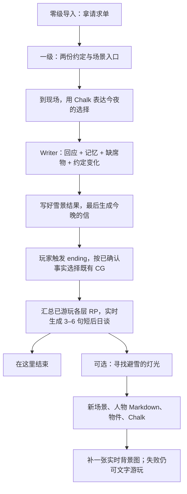

# 初雪短闭环与 AI 生长验收

> 2026-09-13：用户批准继续实现短闭环，同时把作家、Chalk 与实时生成放进自然的玩家流程；生成段按 1–2 分钟设计，不强塞每种能力。本轮不改隔壁生图服务。

六世界共用口径与其他五份验收见 [六世界总览](六世界短闭环与AI生长验收.md)。2026-09-13 本次确认：主流程是 **trigger ending → 既有 CG → 根据之前各层 RP 实时生成短后日谈**。下方历史实施与实测记录保留，不代表已实现新的结局约定。

## 1. 玩家实际要做什么

| 时间预算 | 玩家行动 | 必须看见的结果 | AI 占比 |
|---|---|---|---|
| 0–25 秒 | 读导入，拿请求单 | 身份、约定、进入一级视图的门槛 | 预写，不等待 AI |
| 25–60 秒 | 对照两份约定，进入放送室或咖啡店 | 读懂去哪里，以及为什么去 | 预写；浏览不算承诺 |
| 1–3 分钟 | 在现场通过 README 的 Chalk 选项或自由 RP 明确赴约 | 对方引用刚才的话；另一场景出现缺席物；约定 note 更新；背包出现“今晚的信” | 第一处必要 Writer 介入；不生成图片 |
| 3–5 分钟 | 明确选择结束这一幕，触发 ending | 按本局实际关系与行动选择既有 CG，不临时抽图或补写未发生的告白 | 已有图先展示，不等实时生图 |
| 结尾生成预算 1–2 分钟 | 在 CG 下读到只属于这次游玩的短后日谈 | 回应此前各层发生的 RP、赴约、缺席与物件变化 | Writer 实时写一张短 Chalk / 后日谈 MD，不只读最后场景 |
| 可选另一次探索 | 主动请求找一处避雪的小地方 | 新 Folder / README、人物、物件与 Chalk；背景后补 | 延续性演示，不再作为主结尾的必要步骤 |

这是目标节拍，不是实测速度。玩家停下来阅读或 RP 不会被倒计时惩罚。既有 CG 承担即刻视觉回报，生成后日谈保持 3–6 句，不扩成次日完整章节；不强制走扩展段。

## 2. 实现边界

- 入口与初雪 Gate 复用现有 `requires.items`；初雪要求 `player/tonight-letter.md`，模板不预发这封信。
- 这封信是本局实际对话与行动的物化，不是收集积分；Writer 必须先验证到场与明确意图，完成结果文件后才写信。门槛只检查文件存在，不声称它是防篡改的剧情裁判。
- 运行规则正文为 `templates/first-snow-jp/skills/first-snow-jp-continuity/SKILL.md`；新的“既有 CG + 全层 RP 短后日谈”需同步到该 skill 后才生效，本轮不把文档修改当运行提示词已更新。
- 现场 README 的 choice 使用已有 `/api/choice` → Writer 路径。不将跨门本身改成强制生成；玩家说“陪你”才触发承诺。
- 两份约定先通过可读 note 表达变化；完整的玩家居中关系拓扑尚未完成，不能把地点目录称作关系画布已验收。
- 新人物在 `resident.md` 中持久化，由 Writer 在 Chalk 内继续 RP；不是已注册的独立 Character Agent，不出现无效的角色对话按钮。已有角色窗口的回复接线见 [Agent 前端接线](Agent前端接线.md)；它不等于新生成的人物已自动完成角色注册。
- 新地点只在玩家请求后出现；回访保留同一个地方与人物。生图调用现有 `generate_image`，先文本后图片；不重复自动重试，不在此次强制再生成一张独立立绘。
- **已确认：trigger ending 与后日谈分开。** 先核验已发生的选择及关系，映射到既有 CG 清单；不自动增加 CG 数量。图的路径必须存在，清单不匹配时明确缺口，不编造 asset。随后读取本局各个已游玩层的 RP 事件、相关 Chalk、人物记忆和实际交付物，生成一段短后日谈。不能仅靠最后一轮对话，也不能把未访问场景的隐藏正文当成玩家经历。
- 不是无限塞入所有原始历史：先按已访问层与事件建立带来源的经历提要，再回读与结局相关的原文；有缺失就标出，不脑补。选择 CG 后不能由后日谈偷偷换结局；角色仍只知道自己见闻。允许短暂的后来一瞥，但不展开新章、额外任务或长后日谈。
- 首次后日谈生成后回访复用；图片已展示但文字失败时保留该 CG，提示待补，只补这一段，不重新判结局。旧“今晚的信”是现有实现的入口物化方式，不等于用户新确认的 trigger ending 机制已接完。

## 3. 验证与可看的结果

新增目标验收（未执行）：同一 CG 下，不同层级 RP 能产生不同且可追溯的短后日谈；未访问内容不泄露；结局候选映射真实资产；重复触发不重复生成。现有探针尚不覆盖全层经历汇总与 CG 映射，不能用它的静态通过替代这些检查。

静态回归：`node --test tools/first-snow-jp.test.mjs`。检查日语、真实资源路径、入场选项、Gate 条件和生成边界；这些不等于真实模型通关。

主动实玩探针：`node tools/play-first-snow.mjs --run --route=nanami --explore`。另一路用 `--route=sumi`；不传 `--run` 不调用模型。每次复制为一个新存档，不改模板或玩家已有存档；调用真实 Writer，记录实际事件。`--explore` 会允许世界使用已配置的生图服务一次，可能产生费用。

探针验证“信、人物记忆、缺席物、结果 README”实际改变；扩展验证四份场景文件，以及图片是否真的落盘。按回合记录耗时与文字/图像是否成功到新存档的 `.airpworld/rehearsal.json`。失败保留现场，不用预写结果冒充。它验证引擎及文件链，不代替鼠标全流程验收，也不自动切换 5173 的当前世界。

实玩探针成功运行后，在 5173 的世界列表中可找到 `first-snow-jp-demo-…` 存档。新开局请从日语初雪模板创建；旧存档不自动套用新的关卡。

### 初雪实施轮记录（保留当时结果，不代表当前全仓状态）

- 构建、七项模板回归、离线 HTTP 流程测试（两处赴约、道具门槛、无效选项不落账、扩展派发）、离线 Writer 探针与注入探针通过；文档校验通过。
- 当时真实 Writer + 生图实玩未执行，审核要求明确外部服务与费用授权，未产生结果存档或测速结论。用户随后指定了 OpenAI 生图方向；本次文档整理不运行外部模型，不将后续授权等同测试通过。
- 当时全仓 `check:ws` 报告 12 项跨端接线问题，属于并行施工范围。这是历史记录，不能据此断言当前仍有 12 项；当前状态须另跑检查。

### 2026-09-13：OpenAI 配置后的首次真实样本

用户已将密钥放入被 Git 忽略的 `.env.local`。本次只在测试进程临时指定模型，不修改该文件；目的地为 `https://api.openai.com/v1`，没有使用其他网关，也不把密钥写入文档或报告。

| 检查 | 本次实测 | 结论 |
|---|---|---|
| 日语模板静态回归 | 7 项通过 | 只证明静态约束 |
| 七海路线真实 Writer | `openai/gpt-4.1`；一轮 18,356 ms | API 可用，但短闭环失败 |
| 独立生图工具 | `openai/gpt-image-2.5-flare`，`low`，1536×1024；总耗时 18,619 ms | 返回真实 PNG，约 2.58 MB；不是缓存复用 |
| 主线 → 扩展 → 生图 | 主线文件断言失败，未进入扩展回合 | 不算整条玩法生成成功 |

Writer 在新存档 `worlds/first-snow-jp-demo-nanami-ca2d5457/` 写出了日语 Chalk，并移除了现场的赴约选项，但没有更新人物记忆、两份约定或初雪结果 README，也没有生成缺席物和 `player/tonight-letter.md`。期间一次 `edit` 把字段写成 `old_text/new_text` 被拒，随后自行改为 `oldText/newText` 成功；最终仍提前结束。这证明阻塞已从“缺少服务配置”变成“真实 Writer 没有完成全部结果物化”，不能把文字回应当通关。

证据保存在该存档的 `.airpworld/rehearsal.json` 与 `.airpworld/sessions/`；模板及原有玩家存档未改。当前生成内容还指向尚未满足门槛的初雪场景，所以此存档用于复盘，不是可展示的已通关样板。

为隔离图像链路，另运行现有 `tools/probe-image.mjs`，只发一次图片请求，结果在 `.artifacts/image-probe/result.json`。实际文件为 `.artifacts/image-probe/.airpworld/assets/gen/a-small-covered-waiting-nook-bes-ba0f60c263ebfd5c.png`；图中是学校旁的有顶候车角、木长椅、暖灯与初雪，已目视确认无人物、无可读文字或 UI。没有把这张独立测试图挂进未生成的雪宿场景，避免假装玩法链已完成。

本次直接 API / 项目工具调用的生图 Prompt：

> A small covered waiting nook beside a Japanese school on the first snowy evening of winter. A warm lamp, a wooden bench and snow drifting beyond the roof. Warm anime illustration matching a gentle school radio romance game, wide quiet composition with space for narrative cards, no people, no readable text, no UI, no watermark.

模型选择依据为 [OpenAI 的 Flare 模型说明](https://developers.openai.com/api/docs/models/gpt-image-2.5-flare)。**18.6 秒是单张图片的单次样本，未达到 10 秒，不是稳定延迟、整段扩展耗时或实际费用结论。** 下一步应先让 Writer 的记忆、缺席物、结果与信完整落盘，再重新验自然扩展与浏览器动线；不靠手写一封信绕过 Gate。
