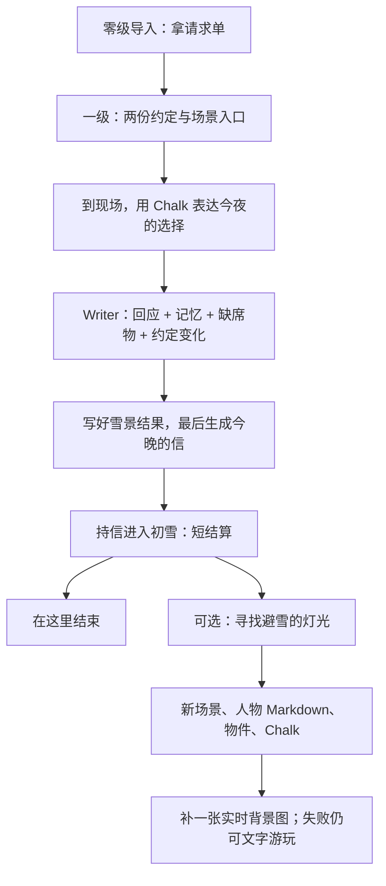

# 初雪短闭环与 AI 生长验收

> 2026-09-13：用户批准继续实现短闭环，同时把作家、Chalk 与实时生成放进自然的玩家流程；生成段按 1–2 分钟设计，不强塞每种能力。本轮不改隔壁生图服务。

六世界共用口径与其他五份验收见 [六世界总览](六世界短闭环与AI生长验收.md)。本文件保留初雪实施轮记录；本次补齐文档不代表重新跑过真实模型。

## 1. 玩家实际要做什么

| 时间预算 | 玩家行动 | 必须看见的结果 | AI 占比 |
|---|---|---|---|
| 0–25 秒 | 读导入，拿请求单 | 身份、约定、进入一级视图的门槛 | 预写，不等待 AI |
| 25–60 秒 | 对照两份约定，进入放送室或咖啡店 | 读懂去哪里，以及为什么去 | 预写；浏览不算承诺 |
| 1–3 分钟 | 在现场通过 README 的 Chalk 选项或自由 RP 明确赴约 | 对方引用刚才的话；另一场景出现缺席物；约定 note 更新；背包出现“今晚的信” | 第一处必要 Writer 介入；不生成图片 |
| 3–5 分钟 | 拿信进入初雪 | 同一张雪景下的短结算，所得与缺席都可读 | 使用刚落盘的结果，无第二次生图等待 |
| 可选增加 1–2 分钟 | 通过 Chalk 请求找一处避雪的小地方 | 新 Folder / README、现场人物、物件与入场 Chalk 先出现，背景后补 | 第二处可选 Writer + 一次实时生图 |

这是目标节拍，不是实测速度。玩家停下来阅读或 RP 不会被倒计时惩罚。进入世界不等生成，核心回报不依赖新 CG；不强制走扩展段。

## 2. 实现边界

- 入口与初雪 Gate 复用现有 `requires.items`；初雪要求 `player/tonight-letter.md`，模板不预发这封信。
- 这封信是本局实际对话与行动的物化，不是收集积分；Writer 必须先验证到场与明确意图，完成结果文件后才写信。门槛只检查文件存在，不声称它是防篡改的剧情裁判。
- 世界规则唯一正文为 `templates/first-snow-jp/skills/first-snow-jp-continuity/SKILL.md`。浏览与赴约区分、重复点击、变心、失败补写及对方知识边界都在那里。
- 现场 README 的 choice 使用已有 `/api/choice` → Writer 路径。不将跨门本身改成强制生成；玩家说“陪你”才触发承诺。
- 两份约定先通过可读 note 表达变化；完整的玩家居中关系拓扑尚未完成，不能把地点目录称作关系画布已验收。
- 新人物在 `resident.md` 中持久化，由 Writer 在 Chalk 内继续 RP；不是已注册的独立 Character Agent，不出现无效的角色对话按钮。已有角色窗口的回复接线见 [Agent 前端接线](Agent前端接线.md)；它不等于新生成的人物已自动完成角色注册。
- 新地点只在玩家请求后出现；回访保留同一个地方与人物。生图调用现有 `generate_image`，先文本后图片；不重复自动重试，不在此次强制再生成一张独立立绘。
- 核心短结算示范七海或澄的一次关系变化，不新增第三结局、隔天或后日谈。没有选择时不替玩家选；明确变心时不抹掉前一次行动。

## 3. 验证与可看的结果

静态回归：`node --test tools/first-snow-jp.test.mjs`。检查日语、真实资源路径、入场选项、Gate 条件和生成边界；这些不等于真实模型通关。

主动实玩探针：`node tools/play-first-snow.mjs --run --route=nanami --explore`。另一路用 `--route=sumi`；不传 `--run` 不调用模型。每次复制为一个新存档，不改模板或玩家已有存档；调用真实 Writer，记录实际事件。`--explore` 会允许世界使用已配置的生图服务一次，可能产生费用。

探针验证“信、人物记忆、缺席物、结果 README”实际改变；扩展验证四份场景文件，以及图片是否真的落盘。按回合记录耗时与文字/图像是否成功到新存档的 `.airpworld/rehearsal.json`。失败保留现场，不用预写结果冒充。它验证引擎及文件链，不代替鼠标全流程验收，也不自动切换 5173 的当前世界。

实玩探针成功运行后，在 5173 的世界列表中可找到 `first-snow-jp-demo-…` 存档。新开局请从日语初雪模板创建；旧存档不自动套用新的关卡。

### 初雪实施轮记录（保留当时结果，不代表当前全仓状态）

- 构建、七项模板回归、离线 HTTP 流程测试（两处赴约、道具门槛、无效选项不落账、扩展派发）、离线 Writer 探针与注入探针通过；文档校验通过。
- 当时真实 Writer + 生图实玩未执行，审核要求明确外部服务与费用授权，未产生结果存档或测速结论。用户随后指定了 OpenAI 生图方向；本次文档整理不运行外部模型，不将后续授权等同测试通过。
- 当时全仓 `check:ws` 报告 12 项跨端接线问题，属于并行施工范围。这是历史记录，不能据此断言当前仍有 12 项；当前状态须另跑检查。
