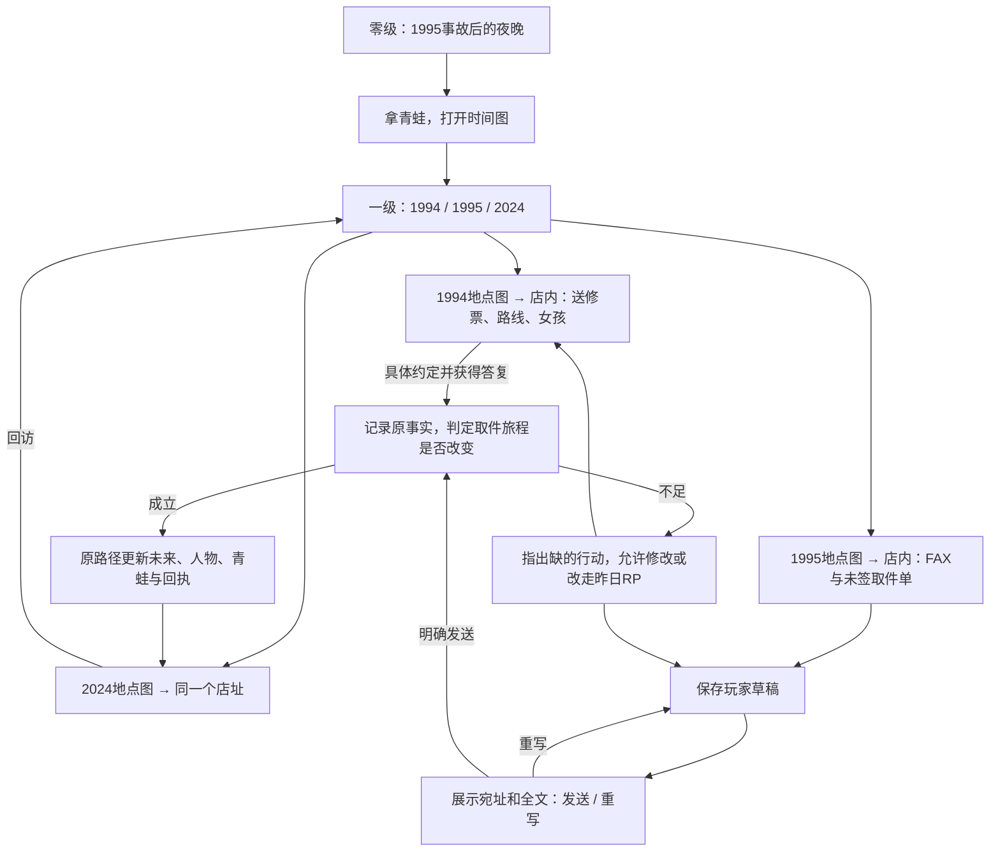

# 时间线短闭环与 AI 生长验收

> 2026-09-13 定案：一个世界、三个时间节点；1994／1995 共用背景，2024 原路径呈现改写前后两种状态。[六世界总览](六世界短闭环与AI生长验收.md)。本轮修改分支线体验版，不改初雪、不迁移旧存档、不改引擎。

## 1. 我是谁，为什么行动

玩家是常盘电器修青蛙的年轻学徒。1994 年女孩 Ryo（リョウ）来送修，约好次日十点领取；1995 年元旦，她在来取玩具的路上失足。开场的青蛙已经修好，取件单却没有签名。

穿越是在每个时间进入同一个人的不同年龄：1994 是昨天的自己，1995 是事故后的自己，2024 是年老的自己；不出现两个玩家副本。玩家记忆和青蛙是时间锚，普通角色不记得已被改写的事故。

| 时刻 | 玩家看到什么 | 可调查、可行动的事实 |
|---|---|---|
| 1994-12-31 · 送修日 | 女孩、坏青蛙、送修票；与1995共用店内背景 | 次日十点领取；八点半从河对岸出发、经过东桥；店有家庭联系方式；也可走上游车道桥送货 |
| 1995-01-01 20:00 · 今夜 | 修好的青蛙、空签名栏、沉默的师傅；女孩不在 | 事故发生在当天九点的东桥；FAX 能送到当天八点、师傅值守的店里 |
| 2024-12-31 · 三十年后 | 原线店已消失；改写后可以仍在营业 | 原线：师傅因悲痛关店、无人接手、后来拆除。救回女孩后，她可接过修理工作，青蛙留在柜台 |

1994 与1995 的视觉差异由日期标题、人物、物件和 Chalk 承担，不再为相隔一天制造两套装修。相同背景不意味着相同场景状态。幼年女孩复用已目视核对的 Ryo 立绘；成年女孩由作家扮演的实体 note 做文字 Mock，不伪造未注册角色按钮。

## 2. 玩家能推导出的解法

**不是修好青蛙就救人，而是改变那次危险的取件旅程。** 事故通知、送修票、路线说明与 FAX 说明是玩家可见物件，不只藏在世界 skill 中。

1. FAX 路线：1995 元旦20:00发往同日08:00的师傅，赶在08:30出门之前。请师傅联系家人、取消自行取件，由店方走安全路线送货。
2. 过去 RP 路线：在1994与女孩／师傅具体约定送货或安全陪同，记录对方答复、时间与路线。成立的约定也能改变未来，不强迫玩家使用 FAX。

作家内部的参考正文（仅在玩家请求协助起草时展示，不替玩家自动提交）：

> 今日の受け取りは中止してください。東橋で事故が起きます。出発前に家へ電話し、蛙は安全な道でこちらから届けてください。

FAX 的价值是送达**不能直接步行进入的事故当天早晨**，而不是一把强制钥匙。发送界面必须明确收发日期与时刻；“发往未来／1994”与固定宛址不符时先询问。“我来修青蛙”没有改变路线，应指出缺少哪一步，不判玩家永远失败。

## 3. 主观短流程

| 预算 | 主体行动 | 必须给的反馈 |
|---|---|---|
| 0–10秒 | 进入零级导入 | 我是修理学徒；玩具好了，来取它的人却不在 |
| 10–30秒 | 看事故消息，拿青蛙 | 得到真实背包物件，时间入口开放；不用额外找一封不存在的通关信 |
| 30–90秒 | 时间总览 → 1994地点 → 店内 | 女孩认识我；票据、路线和她想当修理师的愿望相互印证 |
| 1–3分钟 | 看今夜 FAX，或在昨日提出送货 | 知道可改变哪件事、为什么来得及；可选先看2024原线 |
| 3–5分钟 | 写稿 → 核对全文与宛址 → 明确发送；或完成昨日约定 | 一次明确行动得到因果回应；不足时说明原因并给修正入口 |
| 生成段1–2分钟 | 查看此次改写，必要时点击“继续确认变化”补完 | 先短反馈，再生成可回访的 README、人物与物件；不会悄悄重复发送 |
| 5–7分钟左右 | 回到2024同一个店址 | 成年女孩引用当年真实行动；柜台青蛙呼应开场；一幕短结算 |

预算不是模型速度承诺。10／30分钟可以重访或尝试另一种 RP，不要求生成女孩三十年的全部人生。

## 4. README、Chalk 与世界 skill 的分工

- 世界 skill：三时刻身份、事故因果、FAX收发时刻、替代干预、角色知识与生成／恢复规则。
- README：该时刻是谁在哪里、可见出口和当前行动 intent。必须完整 read，不能只凭 `look_at` 摘要猜执行要求。
- Chalk：玩家此刻能做什么，缺什么以及具体生成意图。选项先填输入框，按发送才执行；点击“核对”不等于同意发送。
- 缺草稿：立即给“输入正文／请求协助起草”，不反复搜索；原信不是待发草稿，动作标签不是正文。
- `player/fax-draft.md`：玩家原文、明确宛址与收发时刻、sent 标记。重算日语非空白 Unicode 字数，以100字为短文目标。
- `world/time-map/before-transmission.md`：首次改写前的实际旧事实，重试不覆盖。
- `world/time-map/fax-receipt.md`：行动原文、前后事实、因果、验证地点及 method／resolved／saved。非传真路径标题为“约定记录”；这是世界内叙事实体，不另建全局状态。
- `world/time-map/thirty-years-later/tokiwa-electronics/`：始终是同一个2024结果地点；成功后实时写 `adult-ryo.md`、`counter-frog.md` 和 README。没有第四个 `new-present` 必游场景。
- 1995也回写受取事实；开场事故消息与后悔信保留为原时间线记录。旧 Chalk 不应继续声称女孩未获救。
- 一轮只落一份新 Chalk；若生成超预算，记载已完成与缺少的文件，展示可继续的行动，后续只补缺，不重新发传真。不提前发完成回执。

## 5. 素材、结局与验收边界

1994／1995 共用 `assets/scenes/tonight.webp`。2024暂用既有图，并明确为 Mock；不把旧废墟背景当作营业中店铺已制作完成。图片生产在外部 `worldlines-assets/worlds/divergence-demo/`，需求单另见 [分支线素材工单](assets/分支线三时刻素材工单.md)。本轮不调用生图 API，不等待素材，不使用不存在的路径。

成功回报：当年等着取玩具的人，现在成了替别人修东西的人。台词按本局 RP 写，不预写为已达成结果。取消“救人必须失去店铺／FAX”的硬代价；没有因果依据就不硬加损失。失败回报是明确哪一步没有改变、下一步怎样做，不用空回复或技术错误代替剧情反馈。

| 验收 | 方法与状态 |
|---|---|
| 三时间层、地点父子关系、零级青蛙门禁 | 编译模板与 LocalWorldStore／动作层隔离测试 |
| 背景复用、证据可见、草稿确认和替代路线规则 | 源模板契约测试；编译产物和 Git 分发内容一致性检查 |
| 运行时资料干净 | 不带背包草稿、不预发回执、没有成年角色伪造立绘 |
| 模型能完成整个结局 | **尚待新版真实 Writer 实玩验收**；静态提示词测试不代表模型执行通过 |
| 新图与成年人物正式素材 | **待外部素材生产**，现阶段文字 Mock |

从世界选择器用「分岐点 · 体験版」新建存档读取新版。旧存档不会被模板更新覆盖。旧版出现过24工具预算中断及读取后空回复，本轮仅调整内容与提示词，不能据此声称引擎层中断已修复。

本轮验证：`tools/timeline-causality.test.mjs` 三项通过（含真实 HTTP 门禁与三个时刻往返）；`pnpm build`、`pnpm probe` 通过，探针未见缺失槽警告。六世界组合测试12/13通过，剩余是隔壁正在调整的初雪旧断言「最後に player/tonight-letter.md」，未在本轮修改。`x rule lint` 不接受开发技能的 goal／keyresults／rules 包装格式，因此未将其计作通过；本轮规则由上述确定性测试核对。5173只读世界列表已发现更新的模板，未切换当前存档。
