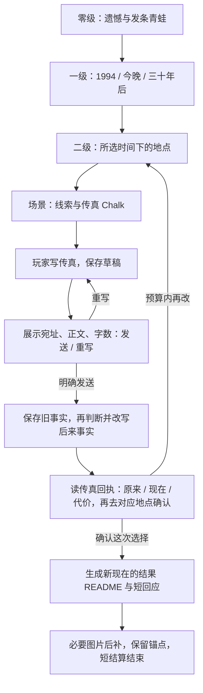

# 时间线短闭环与 AI 生长验收

> 2026-09-13：时间先于地点是已确认结构；传真带来的所得与失去是核心回报。[六世界总览](六世界短闭环与AI生长验收.md)；设定见 [doc-24](doc-24-五世界可玩Demo体验设计.md)。
> **前置口径**：体验版选项先填入作家输入框，玩家发送后才执行；该手动发送不依赖 `autoWrite`。自动初始化／自动续写的档位另见 `docs/settings/00-共同上下文.md §1bis`。
>

## 1. 玩家实际要做什么

| 时间预算 | 玩家行动 | 必须看见的结果 | AI 占比 |
|---|---|---|---|
| 0–30 秒 | 读关于 Ryo 的遗憾，收下发条青蛙 | 我错过了什么、为什么想改变；信物成为时间锚点 | 预写导入 |
| 30–60 秒 | 进入时间总览，选今晚，再选常盘电器店 | 先有三个时间实体，进入后才看到这个时间的地点 | 预写分层与入口 |
| 1–3 分钟 | 查看传真机与旧痕迹，回到 1994 的地点 | 同一物件在不同时刻不同；明白传真如何改变后来 | 预写线索与短 RP |
| 3–5 分钟 | 用 Chalk 写短传真，核对宛址与正文，再明确确认发送 | 写稿本身不改史；确认发送后才判断后来事实如何变化 | Writer 保存玩家原稿，展示发送／重写选项 |
| 5–7 分钟 | 读一次传真回执，再去对应时刻看同一个物件 | 回执并列写清旧事实、新事实与代价；不用记住两幅地图的差别 | 一通就能短结算，不要求先发三通 |
| 最终改写 1–2 分钟 | 确认选择，进入结果场景 | 新现在的 README、所得与失去、锚点反应出现；必要 CG 后补 | 一次重点生成，可在这里结束 |

时间是体验预算。目标不是遍历几十年全部生活；短结算只呈现一处变迁与一次人物回应，30 分钟不是必做内容量。

## 2. 实现边界

- 必须是「零级导入 → 时间总览 → 该时间的地点总览 → 场景」，不能让玩家先选常盘电器店才看到三个时间目录。
- 体验版世界规则以 `templates/divergence-playtest/skills/divergence-playtest-play/SKILL.md` 为准：锚点物件允许跨时间携带；传真影响后来，不能顺便覆写已经展示的玩家行动记录。
- A 是传真后的环境证据变化；B 是相关角色对这次选择给出有知识边界的回应；C 是玩家亲手写的内容决定变化。非锚点角色不应无理由记得所有旧时间线。
- 每次传真先产生一个可比对的事实变化；最终选择再落独立结果 README 与必要物件。因果与角色状态完成后才开放结果入口，不先发“通关物”再补内容。
- **固定引擎下的推荐方案：把对比做成物件，不做时间线 diff UI。** 每次改写前，Writer 从现存文件摘出一条旧事实；将玩家这封传真与旧事实保存在该回合的回执 Markdown，再改一个后来场景的 README / 物件，最后补齐回执的“原来 / 现在 / 因为什么 / 所得 / 代价 / 去哪里确认”。时间图只负责导航，不承担并排地图、镜头对齐或状态差异渲染。
- 回执是世界内的时间锚记录，不是另建全局状态文件。原始传真与旧事实不覆盖；引用实际来源路径，未知代价写未知、不提前透露未发现的剧情。普通角色只知道当前时间线；玩家通过传真机 / 青蛙这样的锚点读取旧事实，不让所有人突然获得跨线记忆。
- 先用一次传真、一个对象证明：例如旧事实是“店里留着凉的照片”，新事实是“凉站在已经停业的店门前”；回执给出这个变化的因果，再引导玩家去看。此例为表现候选，最终事实仍随已确认世界规则与传真内容决定。
- **推荐代价**：保住 Ryo，却失去店铺及连接时空的传真桥。其他记忆代价仍保留为候选，不在本轮默认定案；先做最多两类短结果，不做兼得一切的第三隐藏结局。
- 最终 README 可按模板实时写作，但事实必须来自本局传真和已确认代价。图片是结果的演出，不负责判定结局；失败时所得与失去仍能从文字和物件看见。
- 生成结果回访保持一致；再次发送传真属于明确的新行动，不因重复进入而自动改史。若允许重置，用新存档或明确快照边界，不默默复原世界。
- 日语体验版已约定空白以外的 Unicode 字符不超过 100 个，由作家展示计数；没有独立机器门禁校验。字数必须据正文重算，不能相信旧草稿元数据。

## 3. 验证与可看的结果

| 验收点 | 实玩证据 |
|---|---|
| 时间组织正确 | 先见三个时间，再见该时间地点；跨时间可回到总览 |
| 改写可比较 | 发送前后的物件 / 场景差异可指认，不仅旁白说“改变了” |
| 不依赖新引擎 | 用普通回执 MD 与现有 Gate 看懂旧事实 / 新事实 / 代价；回执与被更新对象一致，不捏造旧状态 |
| 角色知识连续 | 锚点与普通角色的记忆不同；回应引用本局传真而非通用结语 |
| 有代价的结算 | 一屏读懂所得与失去，进入结果前有玩家确认动作 |
| 结果稳定 | 重访不重生、重试不重复改写；生图失败仍可读结算 |

当前体验版模板已采用 `world/time-map/1994/`、`tonight/`、`thirty-years-later/`，各自再含 `tokiwa-electronics/`；旧素材版不代表当前体验版。实时结果目标是 `world/time-map/new-present/`，不能拿预写结局冒充本局改写成功。

## 4. 解谜主线、当前断点与提示边界（2026-09-13）

当前已写的主线是“发现过去可干预的事 → 写一封过去的人能理解并执行的短传真 → 看后来怎样改变”，不是找固定密码或集齐两件物品自动胜利。

1. 零级读未寄出的信、收下发条青蛙。青蛙是开启时间图的锚点，不是需要重复寻找的消耗品。
2. 到 1994 年的常盘电器，观察七岁的 Ryo 与待修的青蛙；再看今夜／三十年后的痕迹，形成想改变哪件事的意图。
3. 回今夜的常盘电器写稿；当前存档记录的宛址是 1994-11-02 的常盘电器。“寄往未来”与该宛址冲突时，应先询问，不擅自改宛址或默认执行。
4. 读取已存在的 `player/fax-draft.md`，呈现实际正文、宛址与重算字数，给出“这一张发送／重写”。玩家没有提供正文时才索取正文，不把“送る文章を書く”这个动作标签写成信件内容。
5. 玩家明确发送后，保存发送前事实，再按信息可理解性和行动可行性判断影响。回执列出送出的字、前后事实、原因、所得、失去和验证地点；不能保证任意一句话都会救活 Ryo。
6. 生成短结果场景，玩家看到具体的所得与失去；生图失败不阻断文字结果。重访不重复发信、不重抽结局。

**仍欠缺的谜题设计**：现有素材说明“青蛙待修”与“Ryo 在 2011 年死亡”，但没有充分提供二者之间可调查、可推导的事故因果链。不能要求玩家凭空猜到“修青蛙就能阻止事故”。需要后续对话确定事故地点、触发事件和一个可验证的干预机会，再把线索写进物件／人物见闻；本轮没有擅自补写该谜底。

**实测卡点**：`divergence-playtest-e7fd1c9e` 已有正文「蛙は私が直す」的草稿，未有发送回执与新现在。两轮作家在反复读取后到第 25 个工具调用被当前 24 次工具预算中止；不是物品不够。后续一次确认请求只读取后空回复，也未生成确认选项。场景 `intent` 含确认要求，但 `look_at` 是面向玩家的摘要，不返回该字段，作家须用 `read` 读完整 Markdown。未修复存档，未宣称传真实玩通过。

**Continue 提示**：依据已发现内容给下一步，不代写答案、不发送草稿。此断点合适的提示是“草稿已在背包，去今夜的常盘电器核对宛址和正文”；已经够条件就指出缺的执行步骤，不能让玩家继续寻找不存在的新钥匙。具体入口和开关见 [演出与交互设计 §5.2.1](doc-06-演出与交互设计.md#521-游玩辅助下一步提示与执行记录)。
