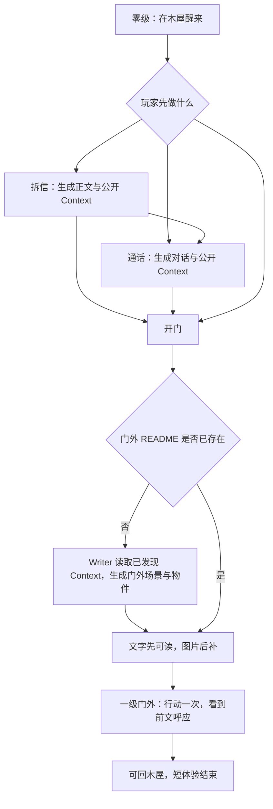

# 未写之门短闭环与 AI 生长验收

> 2026-09-13：第六个世界采用已实现的木屋、信、手机与门结构，不再加一条钥匙收集主线。[六世界总览](六世界短闭环与AI生长验收.md)；实现细节以 [doc-25](doc-25-未写之门Demo.md) 为准。

## 1. 玩家实际要做什么

| 时间预算 | 玩家行动 | 必须看见的结果 | AI 占比 |
|---|---|---|---|
| 0–15 秒 | 在木屋醒来，看到信封、手机与门 | 我头痛、记忆空白、身处现代木屋；眼前东西可碰 | 预写零级导入，不先填身份表 |
| 15–45 秒 | 用 Chalk 拆信，或先查看手机 | 信不是固定空壳：新信息实际写进物件，可以再读 | Writer 按动作生成；仅查看外观不触发使用 |
| 45–90 秒 | 选择通话，问与信中信息相关的问题 | 通话者接住刚发现的事实；Context 留下已公开的内容 | Writer 扮演虚构通话，不是真实拨号服务 |
| 开门后 1–2 分钟 | 跨过门，进入一级门外空间 | 文字场景、两个可用物件、Chalk 与回程入口先出现，背景后补 | 本世界必要的生成高潮 |
| 约 3–5 分钟 | 对门外一个细节作出回应，再回看信或手机 | 门外细节与之前的发现对得上，我刚才的行动成为世界的一部分 | 一次短 RP；可在这里结束 |

这是目标节拍，信件、通话与生图耗时尚需真实测量。可以直接开门；不强迫玩家先把物件点完，也不声称所有玩家都会在 90 秒内完成两个模型回合。

## 2. 实现边界

- 失忆是开场事实；“被绑架”等只是假设。身份问题通过眼前身体处境和调查动机先解决，再从行动中揭示姓名与过去；不预设玩家已经知道未生成的信件正文。
- `templates/unwritten-door/world/letter.md`、`phone.md` 的 Context 保存公开发现。Writer 生成门外时承接这些事实，不把未查看内容当成玩家记忆，也不让后一次生成否定刚读到的信。
- A 是门后出现完整可行动空间；B 是通话者引用信件或玩家的话；C 是门外承接自己发现的信息。**直接开门路径允许成立，但不据此宣称已验收 B**；完整展示路线建议先拆信再通话。
- 门外是 `world/outside/` stub，第一次进入才写 README。父层只有一个有效门牌；已有 README 时复用。当前通过 Writer 亲写，不声称已经接通 scene-init 委托。
- 已有设计只要求 README、两个物件、短 Chalk 与回程门。若信或通话自然引出门外人物，可再设计一个人物 Markdown；这不是当前已完成能力，也不强制每局加人或独立立绘。
- 前端请求成功仅代表动作被接受；要以实际文件、事件和画面判断生成完成。写信 / 通话与开门按 Writer 队列顺序处理，避免先生成门外再追补原因。
- 当前生图工具同步执行，文本先显示后仍可能等 Writer 释放队列。保留可读、可拖拽和错误反馈；不能宣称后台独立生图或流式预览已完成。图片失败不删门外内容、不自动无限重试。
- 没有固定“最终真相 CG”或长结局。Punch Line 是门外第一个细节竟然回应了刚才的发现；再做一个动作就足以完成这轮展示。重开用新存档，不重写旧门外。

## 3. 验证与可看的结果

### 如何用现有引擎做出来

不需要一个能模拟所有可能世界的新引擎。这里是“发现先落盘，下一场景读取它”的三次小写作：

1. **拆信**：`/api/choice` 落行动事件，Writer 把真实信件与公开 Context 写回 `letter.md`。不是 UI 凭空展示一段不会留存的文字。
2. **通话**：同一路径写 `phone.md` 的对话与 Context；已拆信则承接它，未拆信则不引用隐藏内容。两次行动串行，未落盘前不宣告完成。
3. **开门**：`door.md` 的 target 指向 `world/outside/`；`/api/enter-layer` 发现无 README，派发 Writer 读取上面两份 Context，再写 README、两个物件、入场 Chalk 和回程门，最后调用一次 `generate_image` 并回写 bg。画布通过现有目录 / 文件扫描显示结果。

最小验收先只开这一扇门，不急着递归。下一轮扩展才让门外 Chalk 按 [新地点形态](Chalk玩法形态与判定约定.md) 提供一个子入口；只有玩家点击才补下一层。没有自然去处时不硬塞子目录。

真正的风险不是缺少生成 API：上一轮已分别验证作家 API 和独立生图可用，但初雪暴露了 Writer 会提前收尾、漏文件。未写之门应按“README / 两物件 / Chalk / 返回 / 图”逐项验收；已有 README 但缺其他文件只能算半成品，明确补齐，不能重新随机整个门外。目前首入派发主要看 README 存在与否，半成品自动恢复还未证明；提示词指令也不是事务保证。文字可玩和图片成功分别报告，拒绝把一张图当完整新世界。

### 本世界检查清单

| 验收点 | 实玩证据 |
|---|---|
| 三条入口都可走 | 直接开门、拆信后开门、信 + 通话后开门都不死锁 |
| 信息进入世界 | 生成信件 / 通话可回读；门外至少一个明确细节引用本局已发现事实 |
| 动作不是重复派发 | 一个门、一次进入事件；连点不生成两套门外 |
| 场景不只是图片 | README、两个物件、Chalk 与返回路径真实存在并可交互 |
| 失败与回访稳定 | 图片失败仍可读；返回再出门内容不重造；错误不伪装成成功 |

当前记录：`templates/unwritten-door` 已有开场物件与门外 stub；[doc-25](doc-25-未写之门Demo.md) 记录了事件派发、Context、已有场景不重生，以及假 HTTP 图像适配器测试的边界。**这些不是本轮新的真实模型结果**。本轮未创建实玩存档、未生成图片或测出 1–2 分钟完成率；浏览器验收使用前端 5173，后端 3001。
