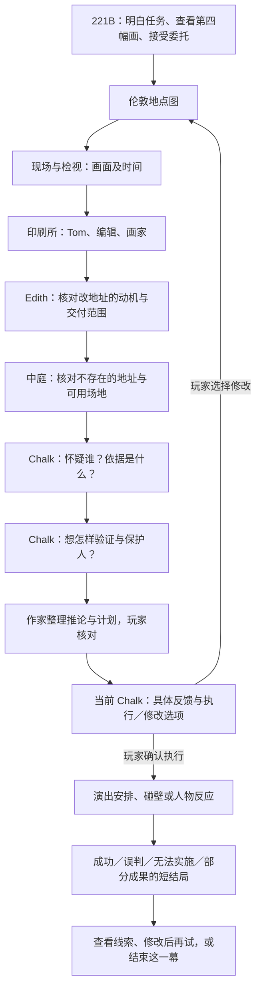

# 福尔摩斯清晰主线与 NPC 接入

> 2026-09-14。本批修改 `whitechapel-playtest` 模板和其内容编译源，不改引擎、不覆盖现有存档。目标明说，真相隐藏；先遇见人，再判断人。

## 1. 零级先说清楚任务

玩家是 Holmes，Watson 的患者 Edith 写了小说，小说插画中的案件接连发生。第四幅画指向今天正午：查出谁照着小说犯罪，并阻止下一起事件。

这段动机同时在 `world/README.md` 和场内 `world/01-opening.md`。前者供场景与作家读取，后者保证玩家实际能看到；不依赖已取消的固定 README 面板。来信与 `fourth-illustration.md` 给出可读的画面细节，接受委托并拿起黄铜盖后进入伦敦地点图。正午是叙事压力，不按现实读信耗时惩罚玩家。

## 2. 人与线索各有位置

以下均相对体验版根目录；标题与正文日语，路径英文。

| 地点 | 场景角色 | 该处能核对什么 |
|---|---|---|
| `world/london-map/` | Watson | 整理已知事实、接住玩家推理；不代报凶手 |
| `third-crime-scene/` | 无强加 NPC | 蓝色颜料、现场与画面的一致及不一致 |
| `morgue/` | 无强加 NPC | 第三案发生时刻，区分先画后案与事后临摹 |
| `print-shop/` | Tom | 夜班记录与稿件流转；不是只给一张写有陌生名字的票 |
| `print-shop/editor-office/` | Blackburn | 地址校改何时收到、给了谁；编辑接触稿件不等于定罪 |
| `print-shop/illustration-room/` | Wayne | 画稿、颜料与手部可见细节，听本人解释后再比对 |
| `edith-room/`（221B 客间） | Edith | 为什么改地址、修改稿交给谁，保护意愿与自己的选择 |
| `unnamed-street/`（印刷所中庭） | 无强加 NPC | 以地图确认地址不存在，并讨论真实的面会入口、退避通路 |

第二行起路径相对 `world/london-map/`。Edith 的客间归伦敦地图是便于回访的地图组织，不表示她搬进印刷所。不存在的地址是证据，不是一条可走进去的真实街道。

四位新增角色均连接 `world.json.characters`、`home`、场内 character 实体、现有头像、角色 preset 与七张小天地卡。Watson 默认在伦敦地图，请求陪同时由既有移动工具移动，不复制多个同名精灵。复用现有印刷所背景作为编辑室和画稿室的 Demo 素材，不声称已制作新的房间插画。

## 3. 证据要构成因果，不只是收集数量

内容源冻结的演示时间顺序：一周前原稿流到编辑与画家；昨日 18:00 第三幅画已交付；今晨 06:00 第三案发生；08:00 Edith 因此改写第四案地址并交编辑；08:15 修改稿继续流转给画家。各时间写在对应现场记录或人物可知的文书中，地图首页不直接给出完整解答。

该顺序说明图像可以先于案件，也说明修改稿的接触范围；颜料与伤手观察需结合这些事实判断，不是拿到任意两件物品就自动证明凶手。沿用既有幕后真相，Writer 不随玩家猜测临时换凶手。上述具体时间与第四幅画的可读细节是本轮为清晰可玩补写的 Demo 内容，不冒充原素材中已经展示的事实。

角色私有表演边界放在 preset 的 `role-context` block；公开 README、日记、心事不直接写“我是凶手”。只有拥有相关知识的角色才回答对应问题，不让 Tom 或 Edith 自动读取全世界幕后答案。

## 4. 玩家不用先写两篇作文

中间地点可回访，不是必须照图逐个打卡的硬锁。Chalk 提问 → 玩家输入 → Writer 整理 `player/deduction.md`、`player/operation-plan.md` → 玩家确认；仅有文件不代表论证成立。计划核对具体地点、行动、信号、保护对象及退路；人物配合仍需询问，不能自动把 Edith 安排成诱饵。

有缺口指出具体风险，但不把正确答案或所有字段齐全当成执行按钮的隐藏门槛。玩家确认尝试后，误判、被拒绝、找不到地点都可演成一幕，不强迫继续补作文。失败不得强发成功回执，却必须有可读结果和回路。可补结果图，但本批不生产 CG。

### 4.1 提交无反馈与失败结局（2026-09-14 追加）

只读检查旧存档发现：两篇文章存在，另有一张只有“还缺保护与退避安排”的 Chalk，未附后续选项；计划还要求把 Edith 带到不存在的地址。本轮不替玩家修改文章，也不把这个存档直接判成失败。

内容约定的唯一源新增为 `tools/experiences/holmes-resolution.mjs`，由主线模块编译到世界 skill；提交 Chalk 使用同源的短入口指令。三个阶段严格区分：提交要当轮可见回应；明确确认才演行动；工具中断不是剧情失败。

| 试图做什么 | 短结局的意外点 | 可继续的方向 |
|---|---|---|
| 追错人或质问无辜者 | 被怀疑的人拿出文书，解释自己真正隐瞒的责任；协作可能变迟疑 | 对照交付范围，而非直接公布凶手 |
| 带 Edith 去不存在的地址 | 查路时碰壁：那个地址不是约会地点，而是她用于试探的改稿 | 本人在场或有订正稿才呈现相应依据，再追谁看过修改 |
| 怀疑合理但设局失败 | 可能保护了人，却错过接触与证据；没有保护行动不能凭空赠送成果 | 从遗漏步骤重新安排，不让对手全知 |
| 确实阻止事件 | 玩家的安排让画面中本来会受害的人避开危险 | 回读这一幕与留下的物件 |

这些是生成边界与示例，不是四篇预写结局。正文约200–350日文字符；包含对本次行动的反应、意外理解、代价／成果及一条线索。既读线索强调新理解，不捏造新证据；未读线索需写清人物拿出或查阅的经过。失败不固定死人、不随意没收道具，也不暗中换凶手。

首个结果目录仍用 `world/london-map/beyond-the-fourth/`。README、执行记录、留存线索、带选项的结果 note、返回门均需落盘。当前场景的一张 Chalk 给出短回应，并用 `case-result-gate.md` 指向结果；结果正文采用 note，避免同轮写两张 Chalk 被预算拦下。失败不发 `case-receipt.md`，但入口与返回门均不得要求此凭证。

回访和重复发送复用同一结果；玩家改稿并明确再次执行才新增 `beyond-the-fourth-02/` 等目录，保留前次代价与时间连续性。可以继续追线索、回地图修订，也可以结束本幕。图片不是生成结局的前提。

## 5. 验收与边界

编译源：`tools/experiences/holmes.mjs` 与 `character-nooks.mjs`。角色私有说明由 `install-experiences.mjs` 的可选 `instructions` 编译为既有 preset block，不新增引擎状态或工具。

`node --test tools/holmes-playtest.test.mjs tools/character-nooks.test.mjs`：21项通过。覆盖零级动机、分布式线索、五位 NPC 的唯一场景精灵及真实素材、角色资料与非剧透边界、重新编译一致性，以及隔离世界的真实 `/api/layer` 和 `/api/nook` 返回。小天地总覆盖13人91卡。新增两项检查提交反馈、四类结果与失败回路的提示词契约，不冒充真实模型已经生成合格结局。

这是静态内容与接口验证，不是模型推理质量验收。尚需用真实作家及角色模型试玩：能否从各处证词形成推论、提出可执行的小计划，并得到引用本局行动的结果。现有存档保持原样；在世界选择中新建福尔摩斯体验版存档查看本批内容。
