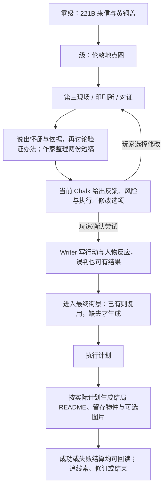

# 福尔摩斯短闭环与 AI 生长验收

> 2026-09-14：目标明说，真相隐藏。玩家是 Holmes，要查明谁照着 Edith 的小说犯罪，并阻止今天的第四起事件。四位缺席 NPC 已接回；Chalk 先问怀疑与依据、再问验证方法，作家整理，玩家确认，不要求先写两篇作文。实施位置与验收见 [清晰主线与 NPC 接入](福尔摩斯清晰主线与NPC接入.md)。[六世界总览](六世界短闭环与AI生长验收.md)；设定见 [doc-24](doc-24-五世界可玩Demo体验设计.md)。
> **前置口径**：本文的「玩家行动 → 立刻生成场景 / 叙事」环节，**依赖该世界的 `autoWrite` 打开**（默认 `off` 只落事件、待玩家下一轮）。逐交互档位表见 `docs/settings/00-共同上下文.md §1bis`。
>

## 1. 玩家实际要做什么

| 时间预算 | 玩家行动 | 必须看见的结果 | AI 占比 |
|---|---|---|---|
| 0–30 秒 | 在 221B 用 Chalk 打开 Watson 来信，拿黄铜画筒盖 | 我是 Holmes；Watson 的患者面临危险；必须现在出发 | 预写钩子与物件 |
| 30–60 秒 | 应邀进入伦敦地点图，再进第三案现场 | 城市是主视图，现场是下一层；Watson 在地图接应，请求陪同时才移动 | 预写入口，不等图片 |
| 1–4 分钟 | 检查颜料、印刷流转记录，与 Watson / 相关角色对证 | 证物间出现“谁能提前看见画”的联系 | Writer 按玩家问题回应，不直接报凶手 |
| 4–6 分钟 | 告诉 Chalk 怀疑谁、依据和验证办法，再确认整理稿 | Watson 引用我的推理；Writer 整理为推论与计划，只追问当前最小缺口 | 关键 Writer 介入；不代选嫌疑人或擅自执行 |
| 必要时 1–2 分钟 | 进入设局需要的最终街景 | 只补这个计划所需的 README、物件和行动；图后补 | 至多一次场景生成；已有场景不重造 |
| 6–8 分钟左右 | 确认并执行自己的计划 | 根据两篇文章、实际证据与角色反应生成结局、留存物件和短回应 | 结果文件先到，可补一张匹配结局的图；不强制骰子 |

时间为体验预算。第四幅画中的“今日正午”提供紧迫感，Demo 不用真实墙钟惩罚读信慢的玩家。不延长成第二起完整案件。

## 2. 实现边界

- 来信钩子：Watson 的患者 Edith 写了小说，前三起案件与插画吻合，未发生的第四幅画指向今日正午。Watson 将她安置在 221B 客间并请求 Holmes 找出仿照小说犯罪的人、阻止下一案；主目标同时写在零级 README 与可见开场 Chalk。黄铜画筒盖是第一件信物，不只是通行钥匙。
- 沿用 Whitechapel 的人物与真相：Wayne 与提前获知图像有关，Edith 改写了第四章的地址；世界 skill 不允许 Writer 为迎合猜测临时换凶手。画面服务悬疑与戏剧性，不靠写实血腥出彩。
- A 是设局后城市现场真的不同；B 是 Watson 明确接住我的推理；C 是第四幅画不再照原样发生。不能用“证物凑齐自动播结局”替代玩家最后一次判断。
- README Chalk 描述可采取的行动与所需依据；人物配合、物件使用、推论成立是不同条件。若用 `requires.items` 开门，只能声称检查了物件文件，复杂条件还需 Writer / 对应协议验证。
- 最终街景生成以本局计划为输入，不生成随机新线索来保证玩家永远正确。文本先形成可执行现场，再补必要图片；图片失败不撤销已成立的设局。
- **已确认提交式高潮**：推论写“我认为发生了什么、依据是什么”，计划写“谁、何时、在哪、用什么做什么，以及预期风险”。稳定路径统一为 `player/deduction.md` 与 `player/operation-plan.md`，正文随世界语言。Chalk 分步询问，Writer 可整理玩家口述，但须由玩家核对确认，不自行选嫌疑人或自动提交。材料交互遵守 [Chalk 约定](Chalk玩法形态与判定约定.md)。
- Writer 查阅两篇文章所引用的现有证据与角色知识，逐项指出缺口；“文件存在”不算合适的推论。计划可行也不代表其中预测全为事实；固定凶手不随玩家文章改变。确认执行后，按本局计划生成执行过程、被使用 / 留下的物品以及结果 Folder / README / Chalk，必要时一张结局图。
- 黄铜盖、假画稿、Watson 的站位是可用计划素材，不再三选一锁死玩家方法。默认不掷骰，只有真正不确定的执行环节才另提公开风险约定；不能提交文章就自动扔骰。先做有成败差异的一个短结局生成器，不穷举三套完整支线。
- 结算可以放独立结果 Folder / README；重复进入读同一结果。复测另开新存档，不把重玩系统纳入 P0，也不在后台抹掉本局证物与对话。CG 在方案确认后再建立对应资产 Prompt，不在本轮生产。

## 3. 验证与可看的结果

| 验收点 | 实玩证据 |
|---|---|
| Holmes 身份与动机 | avatar、来信、信物、首个 Gate 连通；不再问玩家是谁 |
| 地点主视图 | 导入后伦敦总览，再进入各地点，返回不丢线索 |
| 推理属于玩家 | Watson 提供观察而非代答；无根据的指控不直接过关 |
| 两篇文章有作用 | 玩家能新建 / 修改 / 确认提交；结局引用真实论据和执行步骤，不只是相同结局换标题 |
| 行动改变结算 | 同一组证物的不同执行方式有可读反馈，不能只切一张预写结局图 |
| 结算可恢复 | 结果落盘且可回读；重复点击不生成第二个互相矛盾的结局 |

当前体验版是 `templates/whitechapel-playtest/`；无后缀 `whitechapel` 保留为旧素材版。零级 `world/` → 一级 `world/london-map/`，五位 NPC 的注册、home、场景精灵、preset 和小天地已对齐。21项确定性／隔离HTTP检查通过；尚未用真实模型完整玩到结局，未生成新 CG，也未迁移现有存档。

2026-09-14追加：提交后必须有当前 Chalk 的反馈与执行／修改选项，不能仅保存两篇文章或说“材料不足”。玩家确认尝试后，误判与不可实施的计划同样生成短结果、具体代价及一条有来源的线索；不将正确答案设为结局入口的硬锁。详见上述实施文档 §4.1。技术中断不算玩家答错，重复发送不重复处罚。
