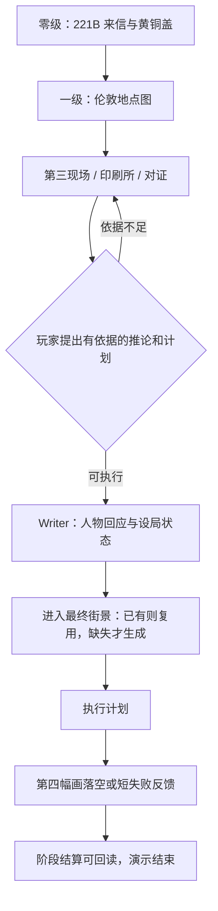

# 福尔摩斯短闭环与 AI 生长验收

> 2026-09-13：玩家已确认为 Holmes 本人，有自己的 avatar，Watson 是陪伴者。采用已接受的来信动机，最终设局仍待选择。[六世界总览](六世界短闭环与AI生长验收.md)；设定见 [doc-24](doc-24-五世界可玩Demo体验设计.md)。

## 1. 玩家实际要做什么

| 时间预算 | 玩家行动 | 必须看见的结果 | AI 占比 |
|---|---|---|---|
| 0–30 秒 | 在 221B 用 Chalk 打开 Watson 来信，拿黄铜画筒盖 | 我是 Holmes；Watson 的患者面临危险；必须现在出发 | 预写钩子与物件 |
| 30–60 秒 | 应邀进入伦敦地点图，再进第三案现场 | 城市是主视图，现场是下一层；Watson 跟随 | 预写入口，不等图片 |
| 1–4 分钟 | 检查颜料、印刷流转记录，与 Watson / 相关角色对证 | 证物间出现“谁能提前看见画”的联系 | Writer 按玩家问题回应，不直接报凶手 |
| 4–6 分钟 | 通过 Chalk 说明推论，提出阻断第四幅画的设局 | Watson 引用我的推理；物件用途或人物站位改变 | 关键 Writer 介入，验证依据与执行计划 |
| 必要时 1–2 分钟 | 进入设局需要的最终街景 | 只补这个计划所需的 README、物件和行动；图后补 | 至多一次场景生成；已有场景不重造 |
| 6–8 分钟左右 | 执行计划，看第四幅画第一次落空 | 一个明确的案件阶段结果与 Watson 的短回应 | 现有资产演出优先；可在这里结束 |

时间为体验预算。故事中的“正午封版”提供紧迫感，Demo 不用真实墙钟惩罚读信慢的玩家。不延长成第二起完整案件。

## 2. 实现边界

- 来信钩子：Edith 曾以假名托付 Watson 未刊出的第四幅画，要求不向警方暴露藏身处；第三起命案如今应验，正午封版在即。Watson 要保住患者又不能独自解开谜局，因此请 Holmes 立刻行动。黄铜画筒盖是第一件信物，不只是通行钥匙。
- 沿用 Whitechapel 的人物与真相：Wayne 与提前获知图像有关，Edith 改写了第四章的地址；世界 skill 不允许 Writer 为迎合猜测临时换凶手。画面服务悬疑与戏剧性，不靠写实血腥出彩。
- A 是设局后城市现场真的不同；B 是 Watson 明确接住我的推理；C 是第四幅画不再照原样发生。不能用“证物凑齐自动播结局”替代玩家最后一次判断。
- README Chalk 描述可采取的行动与所需依据；人物配合、物件使用、推论成立是不同条件。若用 `requires.items` 开门，只能声称检查了物件文件，复杂条件还需 Writer / 对应协议验证。
- 最终街景生成以本局计划为输入，不生成随机新线索来保证玩家永远正确。文本先形成可执行现场，再补必要图片；图片失败不撤销已成立的设局。
- **待讨论选项**：推荐把黄铜盖扣回 Wayne 的画筒作为最后动作；备选伪造第四幅画、让 Watson 站进画里本不存在的位置。推荐先做一次成功回报与一次短失手变化，不铺三条长结局。
- 结算可以放独立结果 Folder / README；重复进入读同一结果。复测另开新存档，不把重玩系统纳入 P0，也不在后台抹掉本局证物与对话。CG 在方案确认后再建立对应资产 Prompt，不在本轮生产。

## 3. 验证与可看的结果

| 验收点 | 实玩证据 |
|---|---|
| Holmes 身份与动机 | avatar、来信、信物、首个 Gate 连通；不再问玩家是谁 |
| 地点主视图 | 导入后伦敦总览，再进入各地点，返回不丢线索 |
| 推理属于玩家 | Watson 提供观察而非代答；无根据的指控不直接过关 |
| 行动改变结算 | 同一组证物的不同执行方式有可读反馈，不能只切一张预写结局图 |
| 结算可恢复 | 结果落盘且可回读；重复点击不生成第二个互相矛盾的结局 |

当前记录：`templates/whitechapel/world/intro/london/` 已有第三现场、印刷所、停尸房与不存在的街道等路径；旧 `world/case-board/` 仍在，`world.json` 中角色 home 也仍指向旧树。**有新场景不等于入口、角色归属与最终 Gate 已统一**。本轮未实玩，也未产出真实生成的结局 CG；先收拢新旧路径再验主线。
