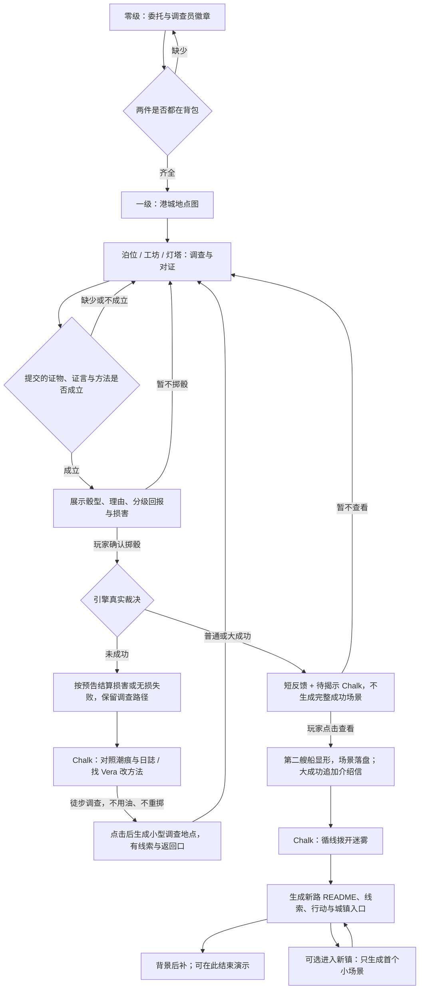

# 雾坞镇短闭环与 AI 生长验收

> 2026-09-13：设计与待验收清单。依据现有雾坞镇设定及 [doc-24](doc-24-五世界可玩Demo体验设计.md)，不新增另一套真相。[六世界总览](六世界短闭环与AI生长验收.md)。
> **前置口径**：本文的「玩家行动 → 立刻生成场景 / 叙事」环节，**依赖该世界的 `autoWrite` 打开**（默认 `off` 只落事件、待玩家下一轮）。逐交互档位表见 `docs/settings/00-共同上下文.md §1bis`。
>

## 1. 玩家实际要做什么

| 时间预算 | 玩家行动 | 必须看见的结果 | AI 占比 |
|---|---|---|---|
| 0–25 秒 | 在调查所读并收下委托、拿调查员徽章 | 两件都在背包才可离开零级；缺一件就明确指出 | 预写 + 物件 Gate，不等生成 |
| 25–60 秒 | 进入港城地点总览，选第七泊位 | 地点与灯火形成一个活港城；有明确第一步 | 预写地图与入场 Chalk |
| 1–4 分钟 | 调查灯油、工坊徽针与灯塔记录；向当地人对证 | 角色针对刚出示的东西回应，三个事实可关联 | Writer 处理调查与知识边界；不逐件生图 |
| 4–6 分钟 | 向 Chalk 提交线索与方法，查看判定；自行决定掷骰或继续调查 | 骰点按原约定处理；失败给短后果与补救，成功留一个可点的发现 | 不强制长篇结算或生图；完整揭示由玩家点击 |
| 增加 1–2 分钟 | 沿雾后线索请求继续探索 | 迷雾退开，新道路的 README、线索与可行动 Chalk 出现 | 一次必要的开放生长示范；背景后补 |
| 可选继续 | 跨过新城镇入口 | 新镇第一眼、一个当地人或一个问题；可以返回 | 下一次按需生成，不把整座城一口气铺满 |

这是目标节拍，不是硬计时。6–8 分钟的展示在“看见新路与新镇入口”即可停下；世界没有总终局，但必须给到第二艘船显形的 Punch Line。

## 2. 实现边界

- `templates/wuwu/skills/wuwu-continuity/SKILL.md` 是既有真相约束：空船是诱饵、年轻领主借旧隧道运账本、灯塔曾灭灯十二分钟、第二艘船负责追踪。不能为了玩家一句猜测改写幕后真相。
- 零级导入后进入港城地点图，不改成任务列表。首个可做动作必须明确；没有证据时角色可以指出缺口，不能替玩家完成推理。
- **已实现的体验版零级硬门槛**：`player/commission-letter.md` 与 `player/investigator-badge.md` 都拿到才能出去，两件在零级可取得。港城 README 用 `requires.items` 同时检查。体验版采用英文稳定路径，日语标题与正文；素材版模板不等于体验版。
- A 是灯火与追踪者真实变化；B 是 Old Mo、Vera 等人引用刚才的询问或物件；C 是玩家选定方向后，画布上长出可进入的新路。三者都要可见，不只是一段旁白说“你改变了世界”。
- 新路继承已知海岸方向、追踪对象、已惊动的人与随身物件。先生成一个小层：README、可用线索、入场 Chalk、回程连接；新城镇先留入口，进入后才补首场景。人物只有在场景需要时才生，不额外强制立绘。
- README 只在允许拓展的边界给探索动作；店内箱子可以是局部探索，不应自动长成另一城镇。重复点击与回访复用本局生成物，失败保留已有事实与返回路径。
- 图片沿用现有世界风格；第二艘船节点可先复用既有素材和灯光演出。新路生图失败仍可继续文字探索，不以“必须先有 CG”锁住主线。
- **体验版的第二艘船 Hybrid**：“提交证物 / 证言 / 方法 → 核验 → 风险预览 → 玩家决定掷骰”；可用灯油、家纹销、十二分钟证言支撑，不按三件文件名硬凑。材料证明推论，骰点只决定执行表现，不掷出另一个幕后真相。
- 具体概率候选与奖惩表见 [Chalk 约定](Chalk玩法形态与判定约定.md)：普通成功得到新路，大成功额外取得接应 / 资源，低概率失败有真实损害。每次掷骰先公开骰型、门槛、理由、回报、损害，再等玩家决定；拒骰保留调查，不自动扣资源。这个候选不等于用户已选定数值。

### 2.1 掷后节奏：只改 Chalk，不扩引擎

体验版继续沿用已有 `2d6 >=7` 候选数值，这轮只修订后续节拍，不重新设计骰子系统。

| 骰点 | 短反馈与结算 | 玩家接下来能点什么 |
|---|---|---|
| 2–3 | 油失去一份、留下空瓶；光灭了，但潮痕还在 | 对照潮痕与日誌 / 找 Vera 商量方法 |
| 4–6 | 雾挡住光，油保留，不发成功奖励 | 同上；不是靠免费重掷脱困 |
| 7–10 | 看见轮廓，记录待揭示；不先造场景 | 查看光的尽头 → 完整发现、场景与岸道 Chalk |
| 11–12 | 同上，预告接应线索 | 点击才完整揭示，额外落盘一封介绍信 |

判定 Chalk **在准备骰子时就保留继续按钮**，避免等待作家另造按钮才有下一步。没有 `result` 时点继续只提醒先决定是否掷骰，不代掷；已有 `result` 就按真实结果接续，不能还只显示“尚未掷骰时放弃”的选项。

失败补救是已有线索延伸出的徒步调查：核对水位痕迹与灯塔日誌，找到旧税关侧下一个观察点；玩家选择探索后才生成 `world/harbor-chart/tidal-approach/`，带 README、两件物、行动 Chalk、返回口。不用油、不重复骰子，也不把失败直接改判成第二艘船显形或赠送成功专属岸道。未取得记录时明确指出去哪里拿。

`rollOutcome`、`oilLossApplied`、`revealState` 只是判定 Chalk 的 `status.data` 平坦记录，供作家防止重复结算；不增加协议字段、状态文件、自动调度或条件渲染器。完整成功演出只在玩家点击查看后展开，完成后也不自动入场。图片失败不锁文字路径。

**真实边界**：现有 HTTP 掷骰只写骰点，不自动唤醒作家。因此“即时”指骰点与预告后果立即可读、作家续行时先写短后果而不等图片；背包损害仍须下一次作家行动真实写盘。准备好的继续按钮走现有 `choice` 接线；不能把这个提示词改动宣称成掷完瞬间自动扣油。

## 3. 验证与可看的结果

| 验收点 | 实玩证据 |
|---|---|
| 导入与港城分层 | 无物件、仅委托、仅徽章都不能出去；两件齐全才进入港城；委托可在零级取得 |
| 调查产生因果 | 三个事实能读回；角色回应引用本局实际行为，不泄露未知真相 |
| 不代替推理 | 线索不足时仍有可做动作；玩家提出推论后才推进揭示 |
| 判定公平 | 错误提交不给骰子；预告完整；拒骰无自动损失；低概率损害与分级奖励实际落盘 |
| 掷后不断线 | 预备继续入口；失败有不用油的调查动作，成功不点击就不生成完整发现；普通 / 大成功按原范围发奖 |
| 开放生长可玩 | 新路实际落盘，父层入口可点、子层有 Chalk、可返回；不是画一张图就算新镇 |
| 有记忆且能恢复 | 回访内容一致；图片失败不丢场景；重复动作不重复造城 |

当前修改落点：`tools/experiences/wuwu.mjs` 是体验版编译源，生成到 `templates/wuwu-playtest/skills/wuwu-playtest-play/SKILL.md`。素材版 `templates/wuwu/` 中预写的 `beyond-the-fog` 不是真实生成样本。此次只更新体验版模板与内容约定，不迁移旧存档、不调用付费生成；离线规则检查不等于已验证模型的真实结算与通关。

本轮离线检查：Chalk 内容契约 5 项、稳定路径回归 3 项、六世界安装与交互协议 10 项通过；本地体验版 skill 与编译源逐字一致。`pnpm build`、`pnpm probe` 通过。尚未验证真实 Writer 是否按四档正确执行、图片生成与浏览器中的掷后体感。
