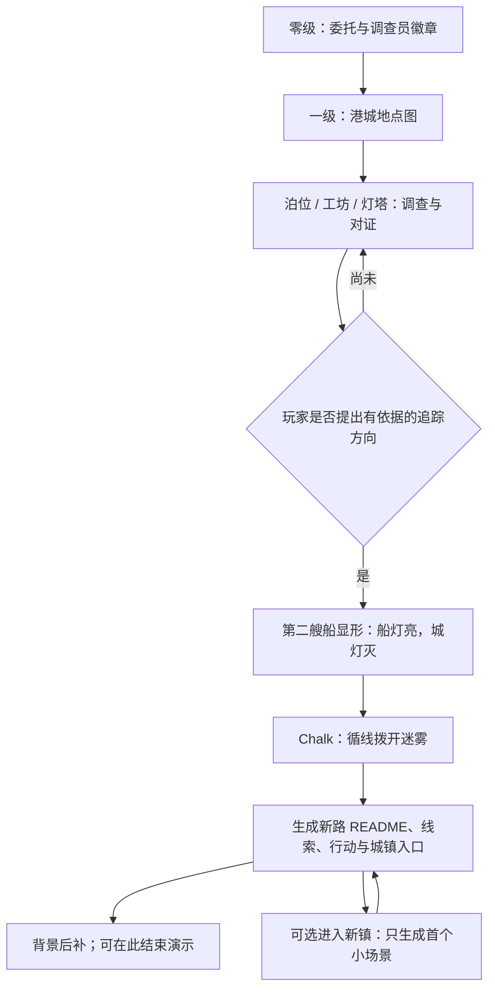

# 雾坞镇短闭环与 AI 生长验收

> 2026-09-13：设计与待验收清单。依据现有雾坞镇设定及 [doc-24](doc-24-五世界可玩Demo体验设计.md)，不新增另一套真相。[六世界总览](六世界短闭环与AI生长验收.md)。

## 1. 玩家实际要做什么

| 时间预算 | 玩家行动 | 必须看见的结果 | AI 占比 |
|---|---|---|---|
| 0–25 秒 | 在调查所读委托、拿调查员徽章 | 知道自己的身份；港口发生了什么、谁需要我 | 预写，不等生成 |
| 25–60 秒 | 进入港城地点总览，选第七泊位 | 地点与灯火形成一个活港城；有明确第一步 | 预写地图与入场 Chalk |
| 1–4 分钟 | 调查灯油、工坊徽针与灯塔记录；向当地人对证 | 角色针对刚出示的东西回应，三个事实可关联 | Writer 处理调查与知识边界；不逐件生图 |
| 4–6 分钟 | 用 Chalk 提出“还有第二艘船”，选择追踪动作 | 对证变成实际行动；远处一盏船灯出现，城里一盏灯熄灭 | Writer 承接推理，既有图与演出优先 |
| 增加 1–2 分钟 | 沿雾后线索请求继续探索 | 迷雾退开，新道路的 README、线索与可行动 Chalk 出现 | 一次必要的开放生长示范；背景后补 |
| 可选继续 | 跨过新城镇入口 | 新镇第一眼、一个当地人或一个问题；可以返回 | 下一次按需生成，不把整座城一口气铺满 |

这是目标节拍，不是硬计时。6–8 分钟的展示在“看见新路与新镇入口”即可停下；世界没有总终局，但必须给到第二艘船显形的 Punch Line。

## 2. 实现边界

- `templates/wuwu/skills/wuwu-continuity/SKILL.md` 是既有真相约束：空船是诱饵、年轻领主借旧隧道运账本、灯塔曾灭灯十二分钟、第二艘船负责追踪。不能为了玩家一句猜测改写幕后真相。
- 零级导入后进入港城地点图，不改成任务列表。首个可做动作必须明确；没有证据时角色可以指出缺口，不能替玩家完成推理。
- A 是灯火与追踪者真实变化；B 是 Old Mo、Vera 等人引用刚才的询问或物件；C 是玩家选定方向后，画布上长出可进入的新路。三者都要可见，不只是一段旁白说“你改变了世界”。
- 新路继承已知海岸方向、追踪对象、已惊动的人与随身物件。先生成一个小层：README、可用线索、入场 Chalk、回程连接；新城镇先留入口，进入后才补首场景。人物只有在场景需要时才生，不额外强制立绘。
- README 只在允许拓展的边界给探索动作；店内箱子可以是局部探索，不应自动长成另一城镇。重复点击与回访复用本局生成物，失败保留已有事实与返回路径。
- 图片沿用现有世界风格；第二艘船节点可先复用既有素材和灯光演出。新路生图失败仍可继续文字探索，不以“必须先有 CG”锁住主线。
- **待讨论选项**：最终追踪动作推荐转动灯塔透镜，让光束扫进雾墙；备选为摇响 Vera 的传讯铜铃、把家纹销交给银鸢。尚未选定，不把三套同时实现为必经关卡。

## 3. 验证与可看的结果

| 验收点 | 实玩证据 |
|---|---|
| 导入与港城分层 | 先看到身份 / 委托，再看到地点主视图；不能直接落进全图 |
| 调查产生因果 | 三个事实能读回；角色回应引用本局实际行为，不泄露未知真相 |
| 不代替推理 | 线索不足时仍有可做动作；玩家提出推论后才推进揭示 |
| 开放生长可玩 | 新路实际落盘，父层入口可点、子层有 Chalk、可返回；不是画一张图就算新镇 |
| 有记忆且能恢复 | 回访内容一致；图片失败不丢场景；重复动作不重复造城 |

当前记录：`templates/wuwu/world/harbor-chart/` 已有泊位、工坊、灯塔与 `beyond-the-fog` 内容；后者目前有预写 README，**不是实时生成新城镇的成功样本**。以上开放生长链与浏览器通关尚未在本轮执行，需在独立新存档验证。
