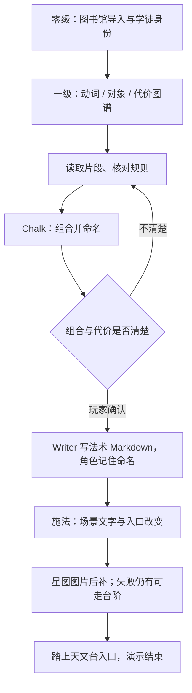

# 魔法学院短闭环与 AI 生长验收

> 2026-09-13：保留 Emberglass / 烬晶既有学院、Seraphina 与 Archivist 设定；先做一次施法的完整体验，不做完整学期。[六世界总览](六世界短闭环与AI生长验收.md)；方案见 [doc-24](doc-24-五世界可玩Demo体验设计.md)。

## 1. 玩家实际要做什么

| 时间预算 | 玩家行动 | 必须看见的结果 | AI 占比 |
|---|---|---|---|
| 0–30 秒 | 在夜间图书馆拿通行信物，听 Seraphina 叫住自己 | 我是初年级学徒；封闭天文台是今晚的好奇心入口 | 预写导入与熟悉感 |
| 30–60 秒 | 进入咒语图谱 | 看见动词、对象、代价三个位置，而不是满屏课程 | 预写结构，不等生成 |
| 1–3 分钟 | 读三个短片段，向 Archivist 核对规则 | 理解组合会改变什么、必须付出什么 | 少量 Writer RP，不替玩家组合 |
| 3–5 分钟 | 通过 Chalk 组合并亲自命名一个法术 | 一个属于我的法术 Markdown 出现；Seraphina 引用它的名字 | 关键 Writer：将选择物化，不只是发一张通用卡 |
| 施法 1–2 分钟 | 对图书架施法，接受已说明的代价 | 空间变成星图，天文台入口出现；README 与行动先到，图后到 | 一次重点生成 |
| 约 6–8 分钟 | 踏上新出现的台阶 | 一眼看见未曾开放的地方，与同伴一句短回应 | Punch Line 后结束，不展开下一章 |

这是设计预算。玩家只需完成一次有自己署名、也有代价的创造；不靠大量随机法术和长后日谈证明可扩展性。

## 2. 实现边界

- 零级是世界内的夜间邀请，不是教程弹窗；一级按知识 / 咒语关系组织，不把现有学院地点目录直接叫作已完成图谱。
- 上帝模式预写可组合的片段、作用边界和代价。Writer 根据实际组合写一个法术实体、施法后的 README / Chalk 与入口，不现场创造整套规则来合理化任意输入。
- A 是熟悉图书馆真的变成另一种空间；B 是 Seraphina 记住玩家给法术取的名字；C 是玩家组合与付出决定这次变化。预生成 CG 只能演出 C，不能替代法术与场景文件变化。
- **待确认代价**：推荐失去一小段记忆；备选暂时失声或徽章失去名字。需先让玩家知情并确认，不把三种都叠加。不能因为暂时失声就禁用全部玩家输入。
- 不要求每次失败归零。无效组合指出缺少的片段，允许修正；若有明确风险判定，失败也应留下可利用的痕迹或通路线索。未接掷骰协议前，不伪造“系统已经掷骰成功”。
- 先产出法术及结果，再开放天文台入口；图片失败仍有文字星图与可走台阶。回访保留法术名、代价与空间变化，不重复扣代价或生成多个同名法术。
- 首轮不要求新 NPC 或实时立绘，已有两位角色足够。天文台第一眼可作为一张高潮 CG 的候选；最终 Prompt 与资产生产等代价及画面方案确认后再细化。

## 3. 验证与可看的结果

| 验收点 | 实玩证据 |
|---|---|
| 导入可行动 | 先明白身份与今晚目标，再进入三类片段图谱 |
| 玩家真的创造 | 法术文件含本局命名、组合与代价，角色引用这个名字 |
| 规则可理解 | 不成立的组合能修正；未确认代价不自动扣除 |
| 施法可见 | 场景 README / 物件 / 门牌实际改变，天文台入口可进可回 |
| 短而完整 | 进入天文台第一眼即可收束；失败 / 重复点击不丢失或重复结算 |

当前记录：`templates/magic-academy/world.json` 已定义 Seraphina 与 Archivist；世界目录目前只有学院 README、图书馆 README 与 opening。**咒语图谱、三类片段、命名法术与天文台生成闭环尚未完成**。本轮是设计文档，不是模型通关或 CG 样本验收。
